大家好，我是**华仔**, 又跟大家见面了。

从今天开始我将继续为大家奉上 RocketMQ 消费者源码剖析系列文章，正式开启「**RocketMQ 的 消费者源码之旅**」，这是第十一篇，本篇我们将以「**RocketMQ 5.1.2**」版本为主，来剖析下 RocketMQ 源码之消费者 Pop 消费更新与提交偏移量 Offset 操作。

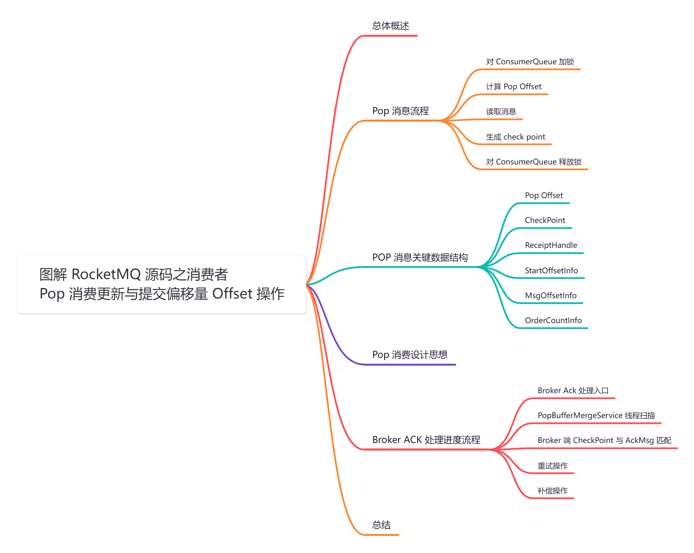

## **01 总体概述**

在 [消费者源码分析系列第九篇】图解 RocketMQ 源码之消费者 Pop 消费全流程剖析](https://articles.zsxq.com/id_c2lfd7mh65k0.html) 这篇中，我们重点剖析了消费者 Pop 消息拉取以及消费的全流程。

本篇我们来深度剖析「**Pop 消息**」消费完成后是如何更新与提交偏移量 Offset 的？

## **02 Pop 消息流程**

我们再来回顾下整个「**Pop 消息**」的流程，这里重点来看下 Broker 的处理流程。

在 Broker 端，「**Pop 消息**」的入口为 [PopMessageProcessor#processRequest()](http://popmessageprocessor/#processRequest\(\))，对于 RocketMQ 来说，任何处理器都是以 [XXXProcessor](http://xxxprocessor%20/) 开头的，处理入口都是 [processRequest()](http://processrequest\(\)/) 方法。

  
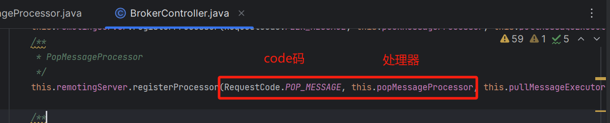

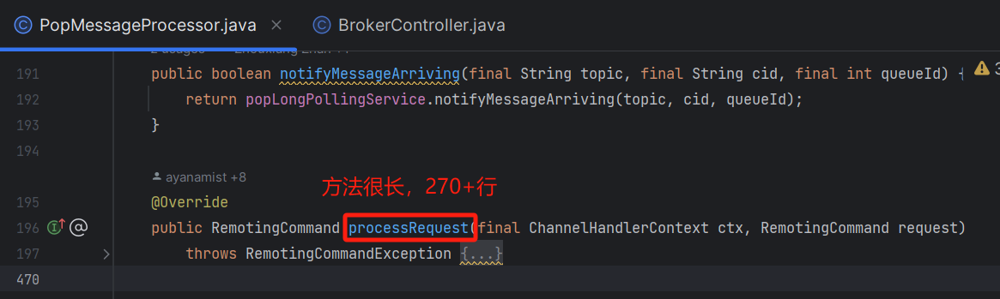

由于代码比较长，该方法重点是调用了 [popMsgFromQueue()](http://%20popmsgfromqueue\(\)/) 方法，这是「**Pop 消息**」的关键实现，我将整个「**Pop 消息**」处理流程分为 5 步，我们分别来看下。

  
源码位置：[https://github.com/apache/rocketmq/blob/release-5.1.2/broker/src/main/java/org/apache/rocketmq/](https://github.com/apache/rocketmq/blob/release-5.1.2/broker/src/main/java/org/apache/rocketmq/broker/processor/PopMessageProcessor.java)[broker/processor/PopMessageProcessor](https://github.com/apache/rocketmq/blob/release-5.1.2/broker/src/main/java/org/apache/rocketmq/broker/processor/PopMessageProcessor.java)[.java](https://github.com/apache/rocketmq/blob/release-5.1.2/broker/src/main/java/org/apache/rocketmq/broker/processor/PopMessageProcessor.java)

##   
**2.1 对 ConsumerQueue 加锁**

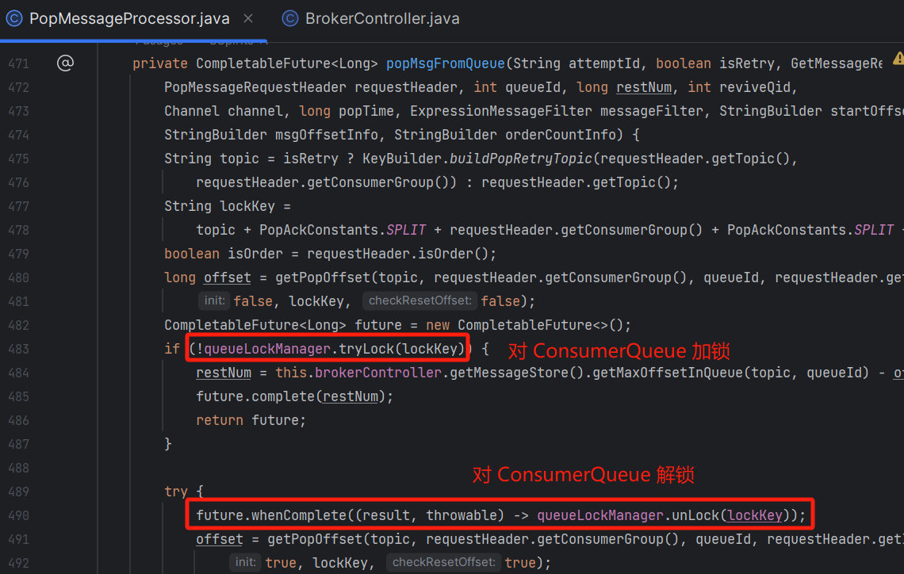

在「**Pop 消息**」的时候，调用 [queueLockManager.tryLock(lockKey)](http://queuelockmanager.trylock\(lockkey\)/) 方法实现对 [ConsumerQueue](http://consumerqueue/) 加锁。 锁key 的格式如下:

// {TOPIC}@{GROUP}@{QUEUE\_ID} topic+consumerGroup+queueId 有互斥锁保护

String lockKey \=

topic + // topic名字

PopAckConstants.SPLIT + // 分隔符

requestHeader.getConsumerGroup() + // 消费者组

PopAckConstants.SPLIT + // 分隔符

queueId; // ConsumerQueue Id

从这段可以得出：

> Pop 操作虽然让 consumer 侧队列共享，但是在 broker 侧拉消息请求还是得保证队列独占。即：一个 consumer queue 只会被同一个消费者组中的某一个 1 个消费者实例锁住。 如果同一个消费者组中同时有 2 个消费者实例发来 Pop 消息请求，只有一个会锁成功。

这个锁的实现如下：

  
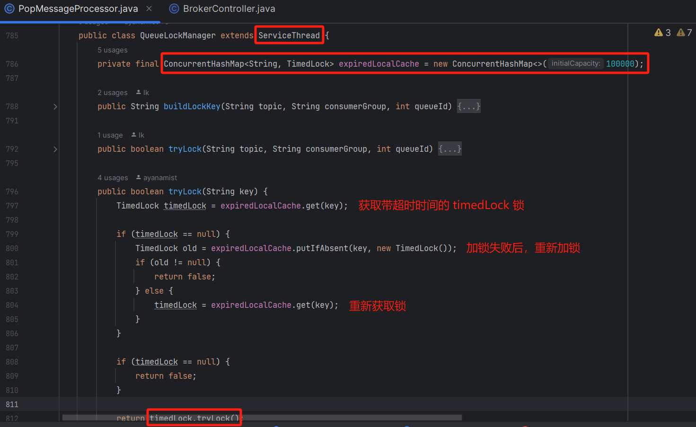

对于这个锁有两个需要注意的地方：

1.  这是一把 [TimedLock](http://timedlock/) 锁，带超时时间的，超过锁的时间自动释放。通过源码可以看出，当前锁服务继承了[ServiceThread](http://servicethread/)，在 RocketMQ 中代表服务是一个后台线程，会自动执行检查。
2.  这是一把高效锁，通过 [ConcurrentHashMap](http://concurrenthashmap/) 的线程安全实现的。

## **2.2 计算 Pop Offset**

首先要搞懂什么是「**pop offset**」，它是指当前需要从这个「**ConsumerQueue**」的哪个 「**offset**」开始拉取消息。

搞明白了概念后，我们来看下具体的源码，在「**Pop 消息**」的处理流程中有 2 处地方计算了「**pop offset**」。

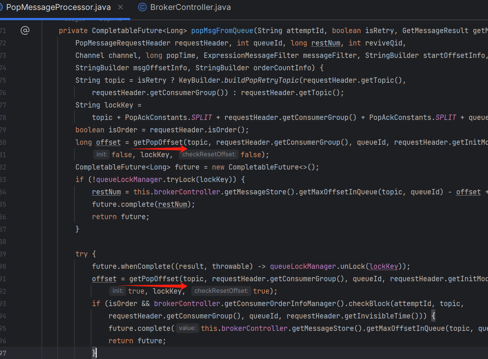

1.  第一处计算：在对 [ConsumerQueue](http://consumerqueue%20/) 进行「**加锁前**」计算「**pop offset**」。在加锁失败时会根据「**pop offset**」估算在这个 [ConsumerQueue](http://consumerqueue/) 中还有多少条消息没有被消费，也就是返回字段 [restNum](http://restnum/)。
2.  第二处计算：在对 [ConsumerQueue](http://consumerqueue/) 进行「**加锁成功**」后计算「**pop offset**」。
3.  这里为什么需要重新计算呢？从第一次执行计算「**pop offset**」到「**加锁成功**」后这段时间可能有其他消费者更新了「**消费位点**」，导致第一次计算的「**pop offset**」不准确了，在对 [ConsumerQueue](http://consumerqueue/) 进行「**加锁成功**」后，[ConsumerQueue](http://consumerqueue/) 只会被当前客户端「**Pop 消息**」，此时重新计算「**pop offset**」的值是准确值，最后会根据这个值再去 [MessageStore](http://messagestore/) 存储中读取消息。

## **2.3 读取消息**

// 从磁盘存储中读取消息

return this.brokerController.getMessageStore()

.getMessageAsync(requestHeader.getConsumerGroup(), topic, queueId, offset,

requestHeader.getMaxMsgNums() - getMessageResult.getMessageMapedList().size(), messageFilter)

关于读取消息的源码这里就不再展开了，会在 Broker 模块的时候再单独剖析。

## **2.4 生成 check point**

在「**check point 消息**」中记录了每次 pop 消息的信息，简称 ck 消息。在读取完消息后，将生成一个「**check point 消息**」，然后 ck 消息将写入一个 buffer 中。

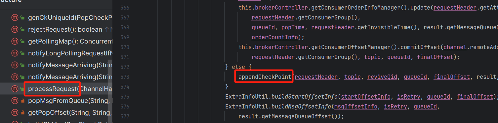

/\*\*

\* 在 POP 拉取消息后调用，添加 CheckPoint，等待 ACK

\*

\* @param requestHeader 请求头

\* @param topic POP 的 Topic

\* @param reviveQid Revive 队列 ID

\* @param queueId POP 的队列 ID

\* @param offset POP 消息的起始偏移量

\* @param getMessageTmpResult POP 一批消息的结果

\* @param popTime POP 时间

\* @param brokerName

\*/

private void appendCheckPoint(final PopMessageRequestHeader requestHeader,

final String topic, final int reviveQid, final int queueId, final long offset,

final GetMessageResult getMessageTmpResult, final long popTime, final String brokerName) {

// add check point msg to revive log

// 1、构造 PopCheckPoint

final PopCheckPoint ck \= new PopCheckPoint();

ck.setBitMap(0);

ck.setNum((byte) getMessageTmpResult.getMessageMapedList().size());

ck.setPopTime(popTime); // pop 请求时间（broker 段）

ck.setInvisibleTime(requestHeader.getInvisibleTime()); // 不可见时间

ck.setStartOffset(offset);

ck.setCId(requestHeader.getConsumerGroup());

ck.setTopic(topic);

ck.setQueueId(queueId);

ck.setBrokerName(brokerName);

for (Long msgQueueOffset : getMessageTmpResult.getMessageQueueOffset()) {

// 一个 list，添加所有拉取的消息的偏移量与起始偏移量的差值

ck.addDiff((int) (msgQueueOffset - offset));

}

// 2、将 Offset 尝试放入内存

final boolean addBufferSuc \= this.popBufferMergeService.addCk(

ck, reviveQid, -1, getMessageTmpResult.getNextBeginOffset()

);

if (addBufferSuc) {

return;

}

// 写 checkpoint 放入内存匹配失败（内存匹配未开启），将 Offset 放入内存和磁盘

this.popBufferMergeService.addCkJustOffset(

ck, reviveQid, -1, getMessageTmpResult.getNextBeginOffset()

);

}

该方法用来保存「**CheckPoint**」用来进行匹配，整个步骤如下：

1.  首先构造「**CheckPoint**」，添加起始偏移量和所有 Pop 出的消息的相对偏移量。
2.  接着尝试将「**CheckPoint**」添加到内存 Buffer，如果成功则直接返回。但是在内存中匹配「**CheckPoint**」和 「**AckMsg**」的开关默认是关闭的，所以不会只存入内存，还会放入磁盘中。
3.  最后将「**CheckPoint**」构造成一个消息，将所有数据都放到消息体中，然后这个消息定时到 [ReviveTime](http://revivetime/)（唤醒重试的时间）- 1s 发送。会发送到 [ReviveTopic](http://revivetopic%20/) 的一个队列。
4.  这里将时间 - 1s 主要是为了留时间与 「**AckMsg**」进行 匹配。

当「**check point 消息**」 写入「**buffer**」后，这些消息将进入「**不可见时间**」，也就是同一个消费者组的其他消费者无法再读取到。主要因为在写入「**buffer**」后，其他消费者计算「**pop offset**」时，会把「**buffer**」中已经「**pop**」的消息计算在内，所以就不会读取到消息。

如果「**不可见时间**」到了，还没有「**ACK**」，这些被「**pop**」的消息会被再次恢复到 Topic 中被再次消费。

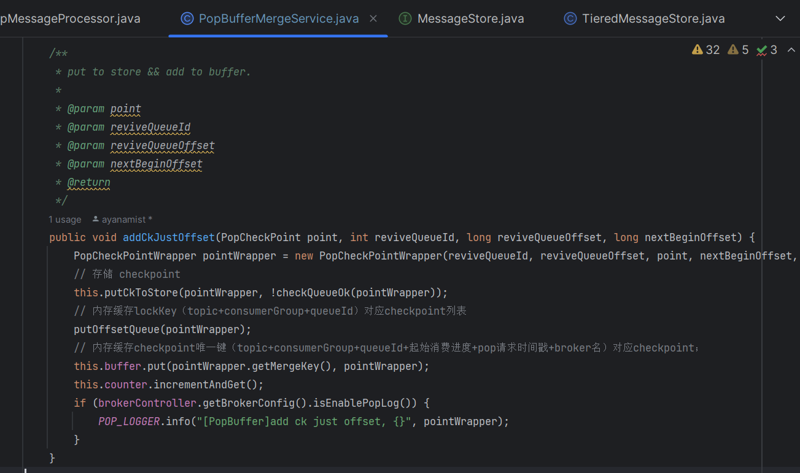

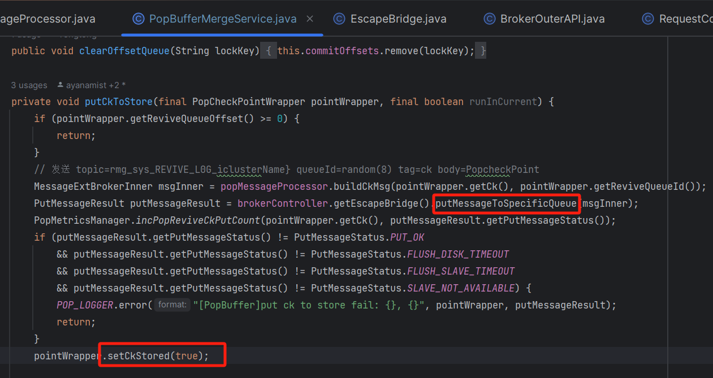

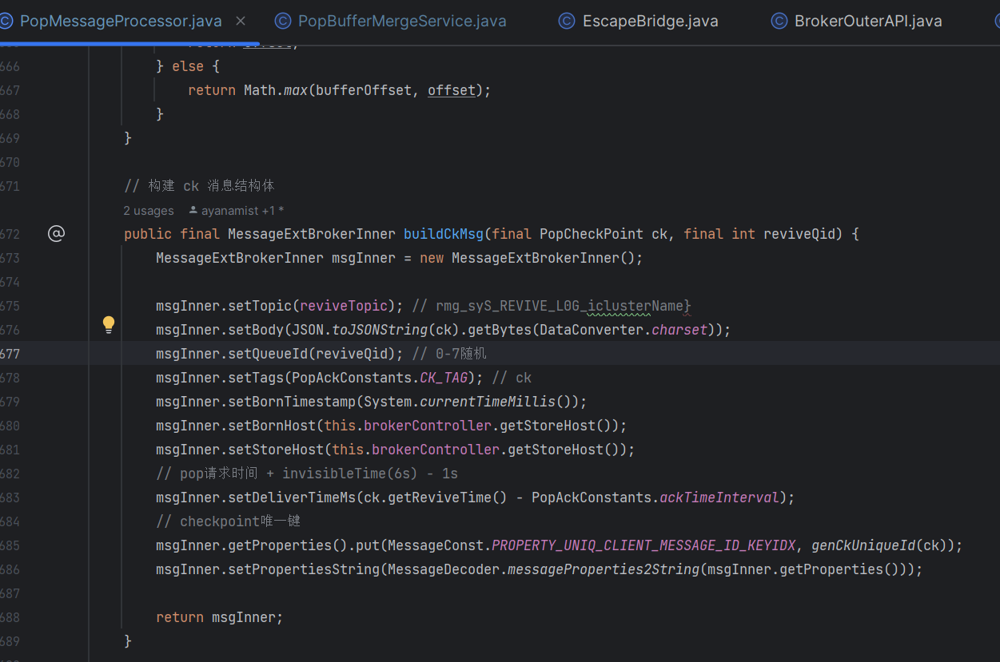

## **2.5 对 ConsumerQueue 释放锁**

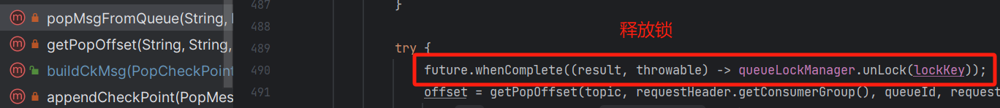

## **2.6 小结**

最后通过一张图来总结整个「**Pop 消息**」的处理流程。

  
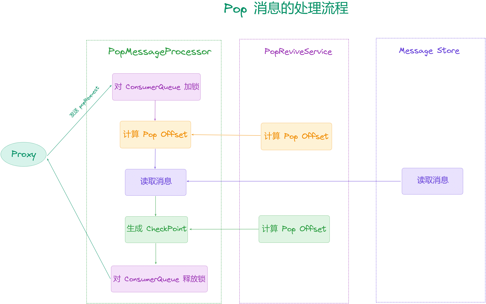

## **03 POP 消息关键数据结构**

## **3.1 Pop Offset**

所谓「**pop offset**」是指当前需要从这个「**ConsumerQueue**」的哪个 「**offset**」开始拉取消息。「**pop offset**」是每个消费者在「**Pop 消息**」的时候计算的，被 pop 的「**ConsumerQueue**」中可以被消费的消息的起始位点。

RocketMQ 会用这个「**pop offset**」去存储中读取消息。

### **3.1.1 Pop Offset 计算过程**

private long getPopOffset(String topic, String group, int queueId, int initMode, boolean init, String lockKey,

boolean checkResetOffset) {

// 1、查询内存 offsetTable 已经提交的位点的消费进度（底层消费进度）。每次用户消费完成，提交消费位点后，会更新到这里。

long offset \= this.brokerController.getConsumerOffsetManager().queryOffset(group, topic, queueId);

if (offset < 0) { // 如果底层消费进度不存在，根据 initMode 设置初始消费进度，默认 MAX，即最大逻辑 offset，可选 MIN，即最小逻辑 offset

if (ConsumeInitMode.MIN == initMode) {

offset = this.brokerController.getMessageStore().getMinOffsetInQueue(topic, queueId);

} else {

// pop last one,then commit offset.

offset = this.brokerController.getMessageStore().getMaxOffsetInQueue(topic, queueId) - 1;

// max & no consumer offset

if (offset < 0) {

offset = 0;

}

if (init) {

this.brokerController.getConsumerOffsetManager().commitOffset(

"getPopOffset", group, topic, queueId, offset);

}

}

}

// 2、检查重置消费位点。

if (checkResetOffset) {

Long resetOffset \= resetPopOffset(topic, group, queueId);

if (resetOffset != null) {

return resetOffset;

}

}

// 3、检查 ack 提交的消费位点，取最大值作为本次拉取消息的 offset

long bufferOffset \= this.popBufferMergeService.getLatestOffset(lockKey);

if (bufferOffset < 0) {

return offset;

} else {

return Math.max(bufferOffset, offset);

}

}

「**pop offset**」的值计算有3个来源：

1.  查询已经提交的位点。每次用户消费完成，提交消费位点后，会更新到这里。
2.  检查重置消费位点。
3.  目前 5.1.2 版本的重置消费位点也会单独存储。这个是 5.X 中新增的逻辑， 如果 broker 配置
4.  [useServerSideResetOffset=true](http://useserversideresetoffset=true/)，则通过 admin api 可以直接重置位点， 重置的位点会临时保存，提供给pop 时候使用。
5.  检查 ack 提交的消费位点。一次「**pop 请求**」一般会「**pop**」一批消息， 而 「**ACK**」可能是一条一条的 「**ACK**」的，所以需要检查当前 「**ACK**」提交到哪条消息，已经被「**pop**」而没有被「**ACK**」的不能再次「**pop**」，直到被重试或者被恢复到对应的 topic。

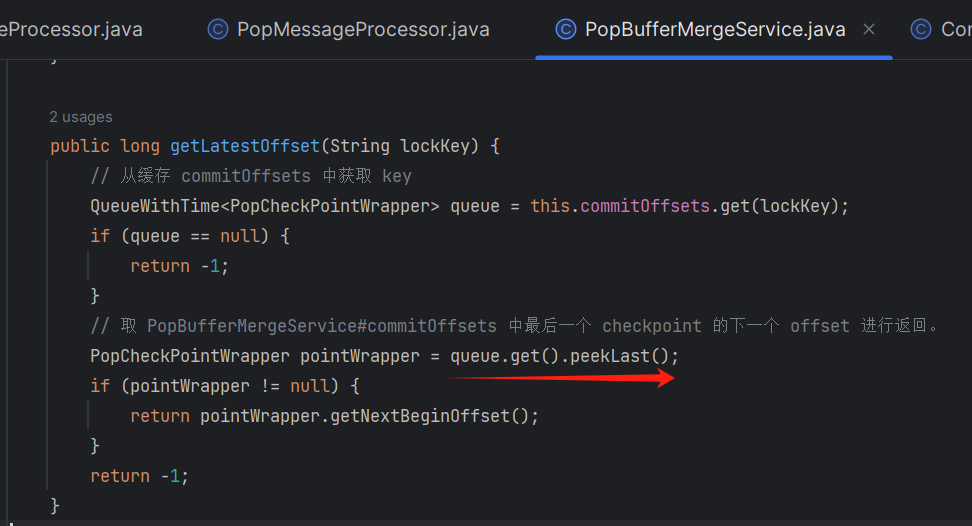

## **3.2 CheckPoint**

其数据结构如下：

  
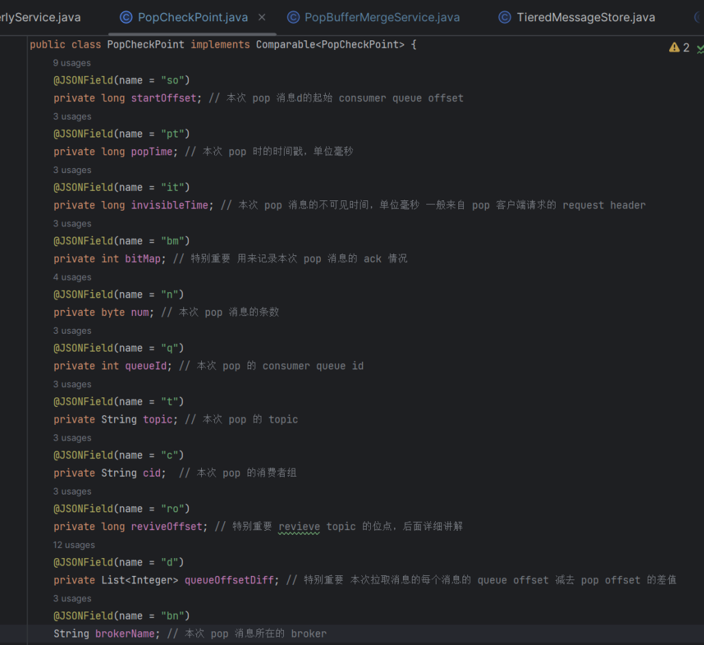

这里对特别重要的字段详细说明：

1.  [bitMap](http://bitmap/)：这个字段是一个 int 类型，1 个 int 是由 32 个 bit 表示，每个 bit 其实就是 0，1，rocketmq 利用 bitmap 标记本次 pop 的消息哪些被 ack（标记为1），哪些未 ack（标记为0）。具体过程详见后面讲解 ack 的过程。
2.  [reviveOffset](http://reviveoffset/)：revive 英文翻译是恢复的含义，那些不可见消息基础信息（非消息body）会保存到 [revive topic](http://%20revive%20topic/) 中，到时间后会被 revive 服务恢复到用户的原始 topic 中让用户再次消费。
3.  [reviveOffset](http://reviveoffset%20/) 就是这个 [revive topic](http://revive%20topic/) 的 consumer queue 位点。
4.  [queueOffsetDiff](http://queueoffsetdiff/)：是一个数组，保存了本次 pop 的每条消息的消费位点和 pop offset 的差值，用来辅助 rocketmq 实现 ack。

## **3.3 ReceiptHandle**

这个值叫一条消息的句柄，每个消息一条，ack 的时候会给到 Broker 端，broker 通过解析判断 ack 的哪次 pop 的哪条消息， 其格式如下：

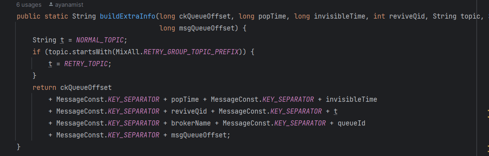

通过上图我们可以知道，所谓的句柄其实是消息的一堆属性拼接起来的一个字符串。

  
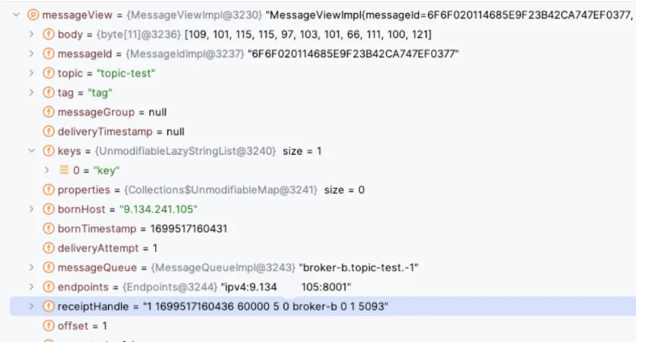

## **3.4 StartOffsetInfo**

这个值是一次「**Pop 消息**」一个值， 记录了「**Pop**」的起始位点信息， 实际格式如下：

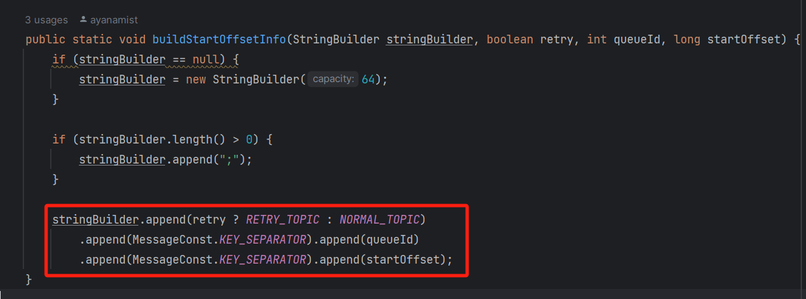

这个数据结构主要在 proxy 中被用到，用来帮助构造「**pop\_ck**」, 也就是「**Pop 消息**」的句柄。

在 proxy 中使用的代码如下：

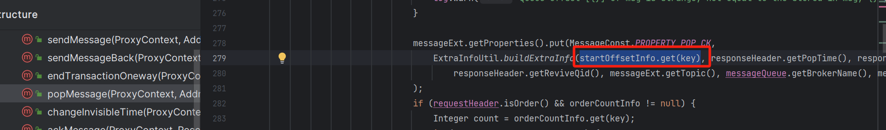

既然句柄 broker 端已经构造了， 为什么 proxy 还需要再构造一次呢？ 这个大家可以先想一下。

## **3.5 MsgOffsetInfo**

这个值是一次「**Pop 消息**」一个值， 记录了「**Pop**」的每个消息的位点信息， 实际格式如下：

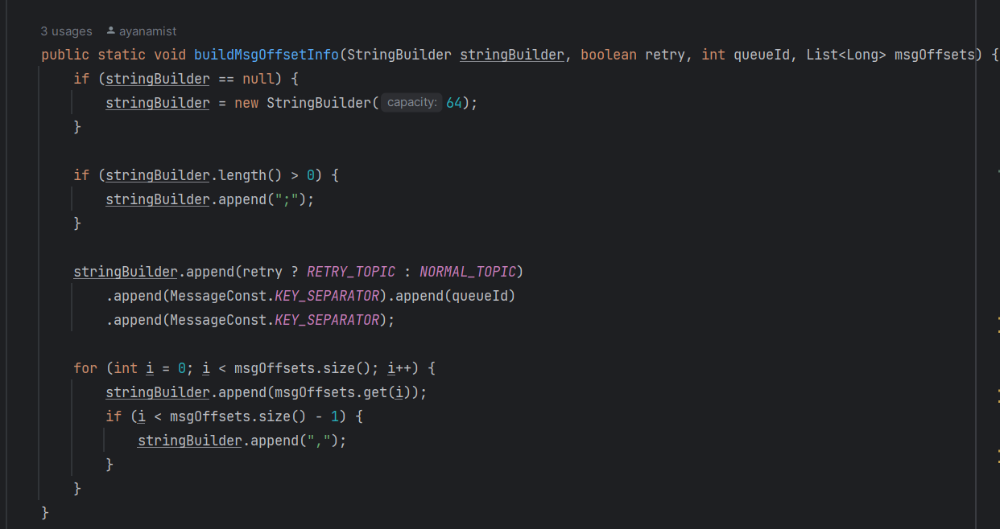

这个数据结构也是主要在 proxy 中被用到，用来帮助构造「**pop\_ck**」, 也就是「**Pop 消息**」的句柄。

在 proxy 中使用的代码如下：

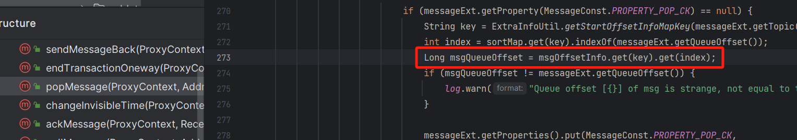

## **3.6 OrderCountInfo**

这个值是一次「**Pop 消息**」一个值， 记录了「**Pop 顺序消息**」的每个消息 「**reconsume times**」，格式如下：

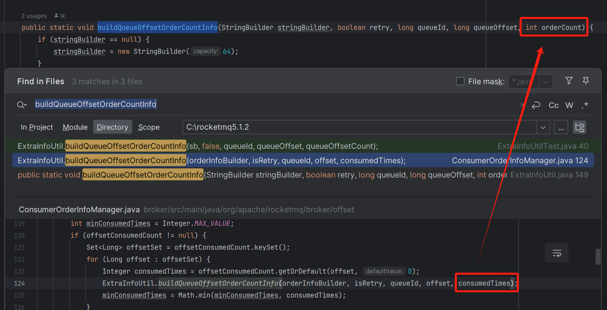

在 proxy 中使用的代码如下：

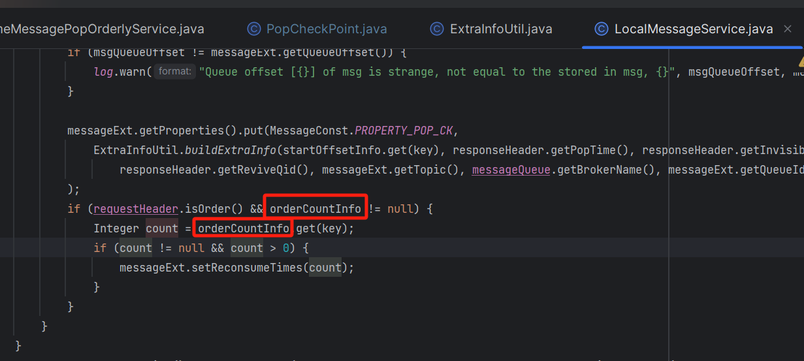

通过以上核心数据结构，我们可以看出来：broker 端针对 「**Pop 消息**」输出了很多数据结构给 proxy 使用。

## **04 Pop 消费设计思想**

  
Pop 消费主要的设计思想是将繁重的客户端逻辑如 「**重平衡**」、 「**消费进度提交**」、 「**消费失败后发送到 Broker 进行重试操作**」等逻辑放到 Broker 端。

客户端只需要不断发送 「**Pop 请求**」，由 Broker 端来分配每次拉取请求要拉取的队列并返回消息。这样就可以实现多个客户端同时拉取一个队列的效果，不会存在一个客户端 hang 住导致队列消息堆积，也不会存在频繁的重平衡导致消息积压。

我们下面来简单看一下「**Pop 消息**」Consumer 是如何消费消息的：

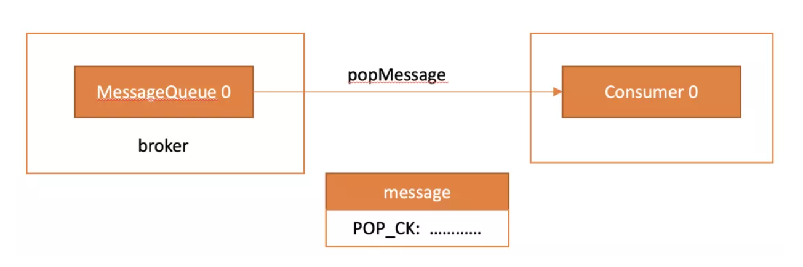

为了保证消费速度，「**Pop 消费**」一次请求可以拉取一批消息，拉取到的消息系统属性中有一个比较重要的属性叫做 「**POP\_CK**」，它是该消息的句柄，「**ACK**」时要通过句柄来定位到它。在 Broker 端会为这批消息保存一个「**CheckPoint**」 ，它里面包含一批消息的句柄信息。

「**POP\_CK**」为一条消息的 [handler](http://handler/)，通过一个 [handler](http://handler%20/) 就可以定位到一条消息。当消息消费成功之后，[POP client](http://pop%20client/) 发送 [ackMessage](http://ackmessage%20/) 并传递 [handler](http://handler%20/) 向 broker 确认消息消费成功。

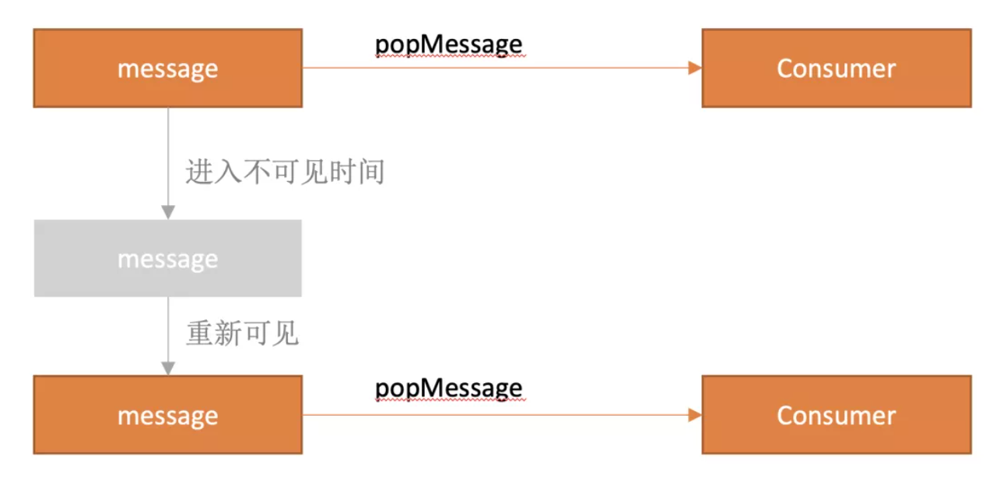

对于长时间没有「**ACK**」的消息，Broker 端并非毫无办法。「**Pop 消费**」引入了消息「**不可见时间**」（invisibleTime）的机制。

对于消息的重试，当 「**POP**」出一条消息之后，这条消息就会进入一个「**不可见的时间**」（对所有消费者不可见），在这段时间就不会再被 「**POP**」出来。如果没有在这段「**不可见时间**」通过 [ackMessage](http://ackmessage%20/) 确认消息消费成功，那么过当它超过该时刻还没有被 「**ACK**」，Broker 将会把它放入 Pop 专门的重试 Topic（这个过程称为 [Revive](http://revive/)），这条消息重新可以被消费。

另外，对于消息的重试，我们的重试策略是一个梯度的延迟时间，重试的间隔时间是一个逐步递增的。所以还有一个 [changeInvisibleTime](http://changeinvisibletime%20/) 可以修改消息的不可见时间。

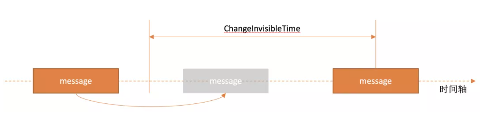

从图上可以看见，本来消息会在中间这个时间点再一次的「**可见的**」，但是我们在「**可见**」之前提前使用 [changeInvisibleTime](http://changeinvisibletime/) 延长了「**不可见时间**」，让这条消息的「**可见时间**」推迟了。

「**Push 消费**」的重试间隔时间会随着重试次数而增加，「**Pop 消费**」也沿用了这个设计。当消费失败（用户业务代码返回 [reconsumeLater](http://reconsumelater%20/) 或者抛异常）的时候，消费者就可以通过 [changeInvisibleTime](http://changeinvisibletime%20/) 按照重试次数来修改单条消息的「**不可见时间**」了。另外如果消费 RT 超过了 30 秒（默认值，可以修改），则 Broker 也会把消息放到「**重试队列**」。

##   
**05 Broker ACK 处理进度流程**

## **5.1 Broker Ack 处理入口**

在 Broker 端，「**ACK 操作**」的入口为 [AckMessageProcessor#processRequest()](http://%20ackmessageprocessor/#processRequest\(\))，对于 RocketMQ 来说，任何处理器都是以 [XXXProcessor](http://xxxprocessor/) 开头的，处理入口都是 [processRequest()](http://processrequest\(\)/) 方法。

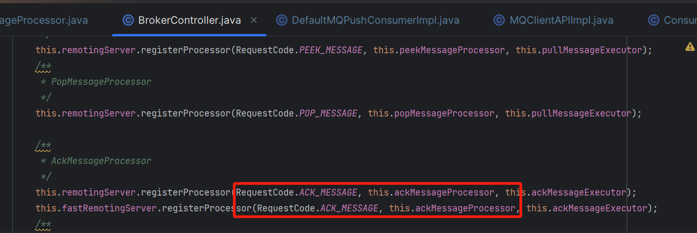

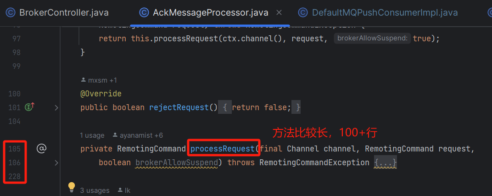

源码位置：[https://github.com/apache/rocketmq/blob/release-5.1.2/broker/src/main/java/org/apache/rocketmq/](https://github.com/apache/rocketmq/blob/release-5.1.2/broker/src/main/java/org/apache/rocketmq/broker/processor/AckMessageProcessor.java)[broker/processor/AckMessageProcessor](https://github.com/apache/rocketmq/blob/release-5.1.2/broker/src/main/java/org/apache/rocketmq/broker/processor/AckMessageProcessor.java)[.java](https://github.com/apache/rocketmq/blob/release-5.1.2/broker/src/main/java/org/apache/rocketmq/broker/processor/AckMessageProcessor.java)

/\*\*

\* 处理 Ack 消息请求，每次 Ack 一条消息

\*

\* @param channel

\* @param request

\* @param brokerAllowSuspend

\* @return

\* @throws RemotingCommandException

\*/

private RemotingCommand processRequest(final Channel channel, RemotingCommand request,

boolean brokerAllowSuspend) throws RemotingCommandException {

// 解析请求头

final AckMessageRequestHeader requestHeader \= (AckMessageRequestHeader) request.decodeCommandCustomHeader(AckMessageRequestHeader.class);

MessageExtBrokerInner msgInner \= new MessageExtBrokerInner();

AckMsg ackMsg \= new AckMsg();

// 响应

RemotingCommand response \= RemotingCommand.createResponseCommand(ResponseCode.SUCCESS, null);

response.setOpaque(request.getOpaque());

// 获取 Topic Config

TopicConfig topicConfig \= this.brokerController.getTopicConfigManager().selectTopicConfig(requestHeader.getTopic());

// .... 校验

// 获取最小 Offset

long minOffset \= this.brokerController.getMessageStore().getMinOffsetInQueue(requestHeader.getTopic(), requestHeader.getQueueId());

// 获取最大 Offset

long maxOffset \= this.brokerController.getMessageStore().getMaxOffsetInQueue(requestHeader.getTopic(), requestHeader.getQueueId());

// .... 校验

// 拆分消息句柄字符串

String\[\] extraInfo = ExtraInfoUtil.split(requestHeader.getExtraInfo());

// 用请求头中的信息构造 AckMsg

ackMsg.setAckOffset(requestHeader.getOffset());

ackMsg.setStartOffset(ExtraInfoUtil.getCkQueueOffset(extraInfo));

ackMsg.setConsumerGroup(requestHeader.getConsumerGroup());

ackMsg.setTopic(requestHeader.getTopic());

ackMsg.setQueueId(requestHeader.getQueueId());

ackMsg.setPopTime(ExtraInfoUtil.getPopTime(extraInfo));

ackMsg.setBrokerName(ExtraInfoUtil.getBrokerName(extraInfo));

// 解析 rqId、invisibleTime

int rqId \= ExtraInfoUtil.getReviveQid(extraInfo);

long invisibleTime \= ExtraInfoUtil.getInvisibleTime(extraInfo);

// 统计

this.brokerController.getBrokerStatsManager().incBrokerAckNums(1);

this.brokerController.getBrokerStatsManager().incGroupAckNums(

requestHeader.getConsumerGroup(), requestHeader.getTopic(), 1);

if (rqId == KeyBuilder.POP\_ORDER\_REVIVE\_QUEUE) { // 顺序消息 ACK

// order

String lockKey \= requestHeader.getTopic() + PopAckConstants.SPLIT

\+ requestHeader.getConsumerGroup() + PopAckConstants.SPLIT + requestHeader.getQueueId();

long oldOffset \= this.brokerController.getConsumerOffsetManager().queryOffset(requestHeader.getConsumerGroup(),

requestHeader.getTopic(), requestHeader.getQueueId());

if (requestHeader.getOffset() < oldOffset) {

return response;

}

while (!this.brokerController.getPopMessageProcessor().

getQueueLockManager().tryLock(lockKey)) {

}

try {

oldOffset = this.brokerController.getConsumerOffsetManager().queryOffset(requestHeader.getConsumerGroup(),

requestHeader.getTopic(), requestHeader.getQueueId());

if (requestHeader.getOffset() < oldOffset) {

return response;

}

long nextOffset \= brokerController.getConsumerOrderInfoManager().commitAndNext(

requestHeader.getTopic(), requestHeader.getConsumerGroup(),

requestHeader.getQueueId(), requestHeader.getOffset(),

ExtraInfoUtil.getPopTime(extraInfo));

if (nextOffset > -1) {

if (!this.brokerController.getConsumerOffsetManager().hasOffsetReset(

requestHeader.getTopic(), requestHeader.getConsumerGroup(), requestHeader.getQueueId())) {

this.brokerController.getConsumerOffsetManager().

commitOffset(channel.remoteAddress().toString(),

requestHeader.getConsumerGroup(), requestHeader.getTopic(), requestHeader.getQueueId(), nextOffset);

}

if (!this.brokerController.getConsumerOrderInfoManager().checkBlock(null, requestHeader.getTopic(), requestHeader.getConsumerGroup(), requestHeader.getQueueId(), invisibleTime)) {

this.brokerController.getPopMessageProcessor().notifyMessageArriving(

requestHeader.getTopic(), requestHeader.getConsumerGroup(), requestHeader.getQueueId());

}

} else if (nextOffset == -1) {

String errorInfo \= String.format("offset is illegal, key:%s, old:%d, commit:%d, next:%d, %s", lockKey, oldOffset, requestHeader.getOffset(), nextOffset, channel.remoteAddress());

POP\_LOGGER.warn(errorInfo);

response.setCode(ResponseCode.MESSAGE\_ILLEGAL);

response.setRemark(errorInfo);

return response;

}

} finally { // 释放锁

this.brokerController.getPopMessageProcessor(). getQueueLockManager().unLock(lockKey);

}

decInFlightMessageNum(requestHeader);

return response;

}

// 普通消息 ACK

// 先尝试放入内存匹配，成功则直接返回。失败可能是内存匹配未开启

// 默认不开启 merge

if (this.brokerController.getPopMessageProcessor().getPopBufferMergeService().addAk(rqId, ackMsg)) {

decInFlightMessageNum(requestHeader);

return response;

}

// 构造 Ack 消息

msgInner.setTopic(reviveTopic); //rmg\_SyS\_REVIVE\_LOG\_{clusterName}

msgInner.setBody(JSON.toJSONString(ackMsg).getBytes(DataConverter.charset));

//msgInner.setQueueId(Integer.valueOf(extraInfo\[3\]));

msgInner.setQueueId(rqId); :/checkpoint消息对应队列

msgInner.setTags(PopAckConstants.ACK\_TAG); //tag=ack

msgInner.setBornTimestamp(System.currentTimeMillis());

msgInner.setBornHost(this.brokerController.getStoreHost());

msgInner.setStoreHost(this.brokerController.getStoreHost());

// 定时消息，定时到唤醒重试时间投递 PopTime + invisibleTime

msgInner.setDeliverTimeMs(ExtraInfoUtil.getPopTime(extraInfo) + invisibleTime);

msgInner.getProperties().put(MessageConst.PROPERTY\_UNIQ\_CLIENT\_MESSAGE\_ID\_KEYIDX, PopMessageProcessor.genAckUniqueId(ackMsg));

msgInner.setPropertiesString(MessageDecoder.messageProperties2String(

msgInner.getProperties()));

// 保存 Ack 消息到磁盘

PutMessageResult putMessageResult \= this.brokerController.getEscapeBridge().putMessageToSpecificQueue(msgInner);

if (putMessageResult.getPutMessageStatus() != PutMessageStatus.PUT\_OK

&& putMessageResult.getPutMessageStatus() != PutMessageStatus.FLUSH\_DISK\_TIMEOUT

&& putMessageResult.getPutMessageStatus() != PutMessageStatus.FLUSH\_SLAVE\_TIMEOUT

&& putMessageResult.getPutMessageStatus() != PutMessageStatus.SLAVE\_NOT\_AVAILABLE) {

POP\_LOGGER.error("put ack msg error:" + putMessageResult);

}

// 统计

PopMetricsManager.incPopReviveAckPutCount(ackMsg, putMessageResult.getPutMessageStatus());

decInFlightMessageNum(requestHeader);

return response;

}

当 broker 端收到「**Ack**」后，发送一个「**AckMsg**」到 topic= [rmq\_sys\_REVIVE\_LOG\_{clusterName}](http://rmq_sys_revive_log_{clustername}/) ，tag= ack。queueId 为之前 pull 消息阶段存储的 [checkpoint](http://checkpoint/) 消息（tag=ck）的 queueId（rqId）。

即 checkpoint 和 ack 消息发送到同一个队列，前者tag 是 ck，后者 tag 是 ack。

这里可以看到 Ack 消息接口每次只允许 Ack 一条消息，处理逻辑如下：

1.  从请求头解析和构造「**Ack 消息**」，并进行校验。
2.  「**顺序消息 Ack**」和「**普通消息 Ack**」进行分别处理，这里只针对普通消息的处理。
3.  先尝试将 Ack 消息放入内存 Buffer，如果成功则直接返回。失败则有可能是内存匹配未开启。
4.  如果放入内存失败，构造一个用于存到磁盘的消息，定时到唤醒重试时间投递（到 [ReviveTopic](http://revivetopic/)）。

## **5.2 PopBufferMergeService 线程扫描**

从源码看，[PopBufferMergeService](http://popbuffermergeservice/) 是个后台线程 [ServiceThread](http://servicethread/)，主要负责管理 offset。

对于「**内存匹配**」逻辑由 [PopBufferMergeService](http://popbuffermergeservice/) 线程完成，只有「**主节点**」来运行该匹配线程。

「**Pop 消息**」时会先添加「**CheckPoint**」到「**buffer**」，「**Ack**」消息时尝试从内存「**buffer**」中的「**CheckPoint**」匹配。同时，它每 5ms 执行一次扫描，将不符合内存中存活条件的 「**CheckPoint**」移除，放入磁盘存储。

public class PopBufferMergeService extends ServiceThread {

private static final Logger POP\_LOGGER \= LoggerFactory.getLogger(LoggerName.ROCKETMQ\_POP\_LOGGER\_NAME);

// topic+consumerGroup+queueId+起始消费进度+pop请求时间戳+broker名 -> checkpoint

ConcurrentHashMap<String/\*mergeKey\*/, PopCheckPointWrapper>

buffer = new ConcurrentHashMap<>(1024 \* 16);

// topic+consumerGroup+queveId ->checkpoint(s)

ConcurrentHashMap<String/\*topic@cid@queueId\*/, QueueWithTime<PopCheckPointWrapper>> commitOffsets = new ConcurrentHashMap<>();

private volatile boolean serving \= true;

private AtomicInteger counter \= new AtomicInteger(0);

private int scanTimes \= 0; // 扫描时间

private final BrokerController brokerController;

private final PopMessageProcessor popMessageProcessor;

private final PopMessageProcessor.QueueLockManager queueLockManager;

private final long interval \= 5;

private final long minute5 \= 5 \* 60 \* 1000;

private final int countOfMinute1 \= (int) (60 \* 1000 / interval);

private final int countOfSecond1 \= (int) (1000 / interval);

private final int countOfSecond30 \= (int) (30 \* 1000 / interval);

private final List<Byte> batchAckIndexList = new ArrayList(32);

private volatile boolean master \= false;

....

}

在等待「**Ack**」之前先添加「**CheckPoint**」，写「**CheckPoint**」放入内存匹配失败（内存匹配未开启），将 「**Offset**」放入内存和磁盘。

/\*\*

\* put to store && add to buffer.

\*

\* @param point

\* @param reviveQueueId

\* @param reviveQueueOffset

\* @param nextBeginOffset

\* @return

\*/

public void addCkJustOffset(PopCheckPoint point, int reviveQueueId, long reviveQueueOffset, long nextBeginOffset) {

PopCheckPointWrapper pointWrapper \= new PopCheckPointWrapper(reviveQueueId, reviveQueueOffset, point, nextBeginOffset, true);

// 1、存储 checkpoint

this.putCkToStore(pointWrapper, !checkQueueOk(pointWrapper));

// 2、内存缓存lockKey（topic+consumerGroup+queueId）对应checkpoint列表

putOffsetQueue(pointWrapper);

// 3、内存缓存checkpoint唯一键（topic+consumerGroup+queueId+起始消费进度+pop请求时间戳+broker名）对应checkpoint；

this.buffer.put(pointWrapper.getMergeKey(), pointWrapper);

this.counter.incrementAndGet();

if (brokerController.getBrokerConfig().isEnablePopLog()) {

POP\_LOGGER.info("\[PopBuffer\]add ck just offset, {}", pointWrapper);

}

}

/\*\*

\* 将 PopCheckPointWrapper 对象加入到对应的队列中

\* @param pointWrapper 待加入队列的 PopCheckPointWrapper 对象

\* @return 加入是否成功的布尔值

\*/

private boolean putOffsetQueue(PopCheckPointWrapper pointWrapper) {

// 获取与 pointWrapper 的锁键对应的队列

QueueWithTime queue \= this.commitOffsets.get(pointWrapper.getLockKey());

// 如果获取的队列为空

if (queue == null) {

// 创建一个新的 QueueWithTime 对象

queue = new QueueWithTime<>();

// 将新创建的队列放入 commitOffsets 中，如果之前已有对应的队列，则返回之前的队列，保证只有一个队列被放入 commitOffsets

QueueWithTime old \= this.commitOffsets.putIfAbsent(pointWrapper.getLockKey(),queue);

if (old != null) {

queue = old;// 如果之前已经存在对应的队列，则使用已存在的队列

}

}

// 设置队列的时间为 pointWrapper 中记录的时间

queue.setTime(pointWrapper.getCk().getPopTime());

// 将 pointWrapper 放入队列中

return queue.get().offer(pointWrapper);

}

1.  存储 [checkpoint](http://checkpoint/)，即发送 ck 消息到 [topic=rmq\_sys\_REVIVE\_LOG\_{clusterName}](http://topic=rmq_sys_revive_log_{clustername}/)。
2.  内存缓存 [lockKey（topic+consumerGroup+queueId）](http://lockkey\(topic+consumergroup+queueid\)/) 对应 [checkpoint](http://checkpoint%20/) 列表，即[PopBufferMergeService#commitOffsets](http://popbuffermergeservice/#commitOffsets)；
3.  内存缓存 [checkpoint](http://checkpoint%20/) 唯一键 [topic+consumerGroup+queueId+起始消费进度+pop请求时间戳+broker名](http://xn--topic+consumergroup+queueid++pop+broker-yp21exv4hvv2b555avu8ath0dkimmw26apvmaz0cnt9b342e/) 对应 [checkpoint](http://checkpoint/)，即 [PopBufferMergeService#buffer](http://popbuffermergeservice/#buffer)。

我们再来看下该线程启动时都干了什么？

// 每隔 5ms 扫描内存中的 buffer 和 commitOffsets 进行 offset 提交

@Override

public void run() {

// scan

while (!this.isStopped()) {

try {

if (!isShouldRunning()) { // slave 不执行

// slave

this.waitForRunning(interval \* 200 \* 5);

POP\_LOGGER.info("Broker is {}, {}, clear all data",

brokerController.getMessageStoreConfig().getBrokerRole(), this.master);

this.buffer.clear(); // slave 清空缓存

this.commitOffsets.clear(); // slave 清空缓存

continue;

}

// 扫描

scan();

if (scanTimes % countOfSecond30 == 0) {

scanGarbage();

}

this.waitForRunning(interval); // 等待 5 ms

if (!this.serving && this.buffer.size() == 0 && getOffsetTotalSize() == 0) {

this.serving = true; // 服务中

}

} catch (Throwable e) {

POP\_LOGGER.error("PopBufferMergeService error", e);

this.waitForRunning(3000);

}

}

this.serving = false;

try {

Thread.sleep(2000);

} catch (InterruptedException e) {

}

if (!isShouldRunning()) {

return;

}

while (this.buffer.size() > 0 || getOffsetTotalSize() > 0) {

scan(); // 当 buffer 有数据或者 commitOffsets 有数据时就一直扫描

}

}

接着来看下 scan 都扫描了什么？

源码位置：[https://github.com/apache/rocketmq/blob/release-5.1.2/broker/src/main/java/org/apache/rocketmq/](https://github.com/apache/rocketmq/blob/release-5.1.2/broker/src/main/java/org/apache/rocketmq/broker/processor/PopBufferMergeService.java)[broker/processor/PopBufferMergeService](https://github.com/apache/rocketmq/blob/release-5.1.2/broker/src/main/java/org/apache/rocketmq/broker/processor/PopBufferMergeService.java)[.java](https://github.com/apache/rocketmq/blob/release-5.1.2/broker/src/main/java/org/apache/rocketmq/broker/processor/PopBufferMergeService.java)

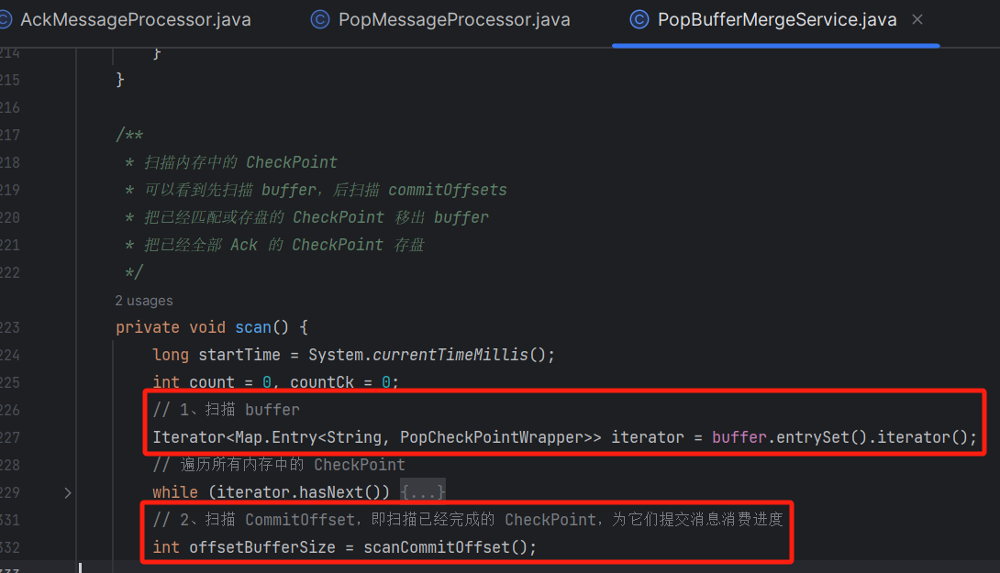

可以看到先扫描 [buffer](http://buffer/)，后扫描 [commitOffsets](http://commitoffsets/)，我们分别来看下。

## **5.2.1 buffer 扫描**

对于 [checkpoint](http://checkpoint/) 存储成功的，可以从 buffer 中移除了。而对于已经全部 Ack 的 [checkpoint](http://checkpoint/) 进行存盘操作。

/\*\*

\* 扫描内存中的 CheckPoint

\* 可以看到先扫描 buffer，后扫描 commitOffsets

\* 把已经匹配或存盘的 CheckPoint 移出 buffer

\* 把已经全部 Ack 的 CheckPoint 存盘

\*/

private void scan() {

long startTime \= System.currentTimeMillis();

int count \= 0, countCk = 0;

// 1、扫描 buffer

Iterator<Map.Entry<String, PopCheckPointWrapper>> iterator = buffer.entrySet().iterator();

// 遍历所有内存中的 CheckPoint

while (iterator.hasNext()) {

Map.Entry<String, PopCheckPointWrapper> entry = iterator.next();

PopCheckPointWrapper pointWrapper \= entry.getValue();

// 实际在 pull 消息时，ck 消息允许发送不成功，此时在扫描 buffer 时重新尝试存储checkpoint。

// 如果 CheckPoint 已经在磁盘中，或者全部消息都匹配成功，从内存中 buffer 中移除

// just process offset(already stored at pull thread), or buffer ck(not stored and ack finish)

if (pointWrapper.isJustOffset() && pointWrapper.isCkStored() // 默认情况，checkpoint 发送成功

|| isCkDone(pointWrapper) // enablePopBufferMerge=true 收到ack。根据 isCkDone 方法判断 ck 是否收到 ack，提交消费进度。

|| isCkDoneForFinish(pointWrapper) && pointWrapper.isCkStored()) { // 其他情况

if (brokerController.getBrokerConfig().isEnablePopLog()) {

POP\_LOGGER.info("\[PopBuffer\]ck done, {}", pointWrapper);

}

// 从 buffer 中移除 checkpoint

iterator.remove();

counter.decrementAndGet();

continue;

}

PopCheckPoint point \= pointWrapper.getCk();

long now \= System.currentTimeMillis();

// 是否要从内存中移除 CheckPoint

boolean removeCk \= !this.serving;

// 距离 ReviveTime 时间小于阈值（默认3s）

// ck will be timeout

if (point.getReviveTime() - now < brokerController.getBrokerConfig().getPopCkStayBufferTimeOut()) {

removeCk = true;

}

// 在内存中时间大于阈值（默认10s）

// the time stayed is too long

if (now - point.getPopTime() > brokerController.getBrokerConfig().getPopCkStayBufferTime()) {

removeCk = true;

}

if (now - point.getPopTime() > brokerController.getBrokerConfig().getPopCkStayBufferTime() \* 2L) {

POP\_LOGGER.warn("\[PopBuffer\]ck finish fail, stay too long, {}", pointWrapper);

}

// double check

if (isCkDone(pointWrapper)) { // enablePopBufferMerge=true 收到ack。根据 isCkDone 方法判断 ck 是否收到 ack，提交消费进度。

continue;

} else if (pointWrapper.isJustOffset()) {

// just offset should be in store.

if (pointWrapper.getReviveQueueOffset() < 0) {

putCkToStore(pointWrapper, false); // 补偿存储 checkpoint

countCk++;

}

continue;

} else if (removeCk) {

// 将 CheckPoint 包装成消息放入磁盘，从内存中移除

// put buffer ak to store

if (pointWrapper.getReviveQueueOffset() < 0) {

putCkToStore(pointWrapper, false); // 写入磁盘

countCk++;

}

if (!pointWrapper.isCkStored()) {

continue;

}

if (brokerController.getBrokerConfig().isEnablePopBatchAck()) {

List<Byte> indexList = this.batchAckIndexList;

try {

// 在内存中移除 CheckPoint 前，把它当中已经 Ack 的消息也作为 Ack 消息存入磁盘

for (byte i \= 0; i < point.getNum(); i++) {

// 遍历 CheckPoint 中消息 bit 码表每一位，检查是否已经 Ack 并且没有存入磁盘

// reput buffer ak to store

if (DataConverter.getBit(pointWrapper.getBits().get(), i)

&& !DataConverter.getBit(pointWrapper.getToStoreBits().get(), i)) {

indexList.add(i);

}

}

if (indexList.size() > 0) {

if (putBatchAckToStore(pointWrapper, indexList)) {

count += indexList.size();

for (Byte i : indexList) {

markBitCAS(pointWrapper.getToStoreBits(), i);

}

}

}

} finally {

indexList.clear();

}

} else {

for (byte i \= 0; i < point.getNum(); i++) {

// reput buffer ak to store

if (DataConverter.getBit(pointWrapper.getBits().get(), i)

&& !DataConverter.getBit(pointWrapper.getToStoreBits().get(), i)) {

// 补偿存储 checkpoint

if (putAckToStore(pointWrapper, i)) {

count++;

markBitCAS(pointWrapper.getToStoreBits(), i);

}

}

}

}

if (isCkDoneForFinish(pointWrapper) && pointWrapper.isCkStored()) {

if (brokerController.getBrokerConfig().isEnablePopLog()) {

POP\_LOGGER.info("\[PopBuffer\]ck finish, {}", pointWrapper);

}

iterator.remove();

counter.decrementAndGet();

continue;

}

}

}

....

}

## **5.2.2 commitOffsets 扫描**

/\*\*

\* 扫描已提交偏移量

\* @return 该次扫描共处理的偏移量数量

\*/

private int scanCommitOffset() {

// 获取 commitOffsets 的迭代器

Iterator<Map.Entry<String,QueueWithTime<PopCheckPointWrapper>>> iterator = this.commitOffsets.entrySet().iterator();

// 初始化记录偏移量数量的变量

int count \= 0;

// 循环处理每个topic-group-gueue

while (iterator.hasNext()) {

Map.Entry<String,QueueWithTime<PopCheckPointWrapper>> entry = iterator.next();

LinkedBlockingDeque<PopCheckPointWrapper> queue = entry.getValue().get();// 获取与条目对应的队列

PopCheckPointWrapper pointWrapper;

// 循环处理队列中的 PopCheckPointWrapper 对象

while ((pointWrapper = queue.peek()) != null) {

// 检查 PopCheckPointWrapper 对象是否满足提交条件，如果满足则提交偏移量

if (pointWrapper.isJustOffset() && pointWrapper.isCkStored() // checkpoint 存储成功

|| isCkDone(pointWrapper) // enablePopBufferMerge=true 收到ack。根据 isCkDone 方法判断 ck 是否收到 ack，提交消费进度

|| isCkDoneForFinish(pointWrapper) && pointWrapper.isCkStored()) { // 其他情况

if (commitOffset(pointWrapper)) { // 尝试提交 Offset 偏移量

// 提交成功后从队列中移除已处理的 PopCheckPointWrapper 对象

queue.poll();

} else {

break;

}

} else {

// 如果PopCheckPointWrapper对象不满足提交条件，检查是否超时未提交

if (System.currentTimeMillis() - pointWrapper.getCk().getPopTime()

\> brokerController.getBrokerConfig().getPopCkStayBufferTime() \* 2) {

POP\_LOGGER.warn("\[PopBuffer\] ck offset long time not commit,{}",pointWrapper);// 记录日志

}

break;// 跳出循环

}

}

final int qs \= queue.size();// 获取当前队列的大小

count += qs;// 累加处理的 PopCheckPointWrapper 对象数量

if (qs > 5000 && scanTimes % countOfSecond1 == 0) {

POP\_LOGGER.info("\[PopBuffer\] offset queue size too long,{},{}",

entry.getKey(),qs);// 如果队列长度过长，记录日志

}

}

return count;

}

这块代码主要消费 [commitOffsets](http://commitoffsets/) 内存队列，在 [checkpoint](http://checkpoint/) 存储成功的情况下，尝试提交 offset。这意味着在[consumer](http://consumer/) 从 broker 端拉消息成功之后，[offset](http://offset/) 就可能会被提交。

是不是有点像「**自动提交**」，至于怎么保证「**at least once**」机制需要依靠后续「**补偿机制**」。

再来看下提交偏移量的方法。

比较简单，获取 [topic+consumerGroup+queueId](http://topic+consumergroup+queueid/) 队列级别互斥锁之后，要与同队列拉消息 pop 请求互斥，最后提交偏移量 offset 到内存 offsetTable。

/\*\*

\* 提交偏移量

\* @param wrapper 待提交偏移量的 PopCheckPointWrapper 对象

\* @return 提交是否成功的布尔值

\*/

private boolean commitOffset(final PopCheckPointWrapper wrapper) {

// 如果下一个开始偏移量小于0，则直接返回true

if (wrapper.getNextBeginOffset() < 0) {

return true;

}

// 获取 PopCheckPoint 对象

final PopCheckPoint popCheckPoint \= wrapper.getCk();

// 获取锁

final String lockKey \= wrapper.getLockKey();

// 必须先获取队列级别互斥锁，和 Pop 请求处理互斥

// 如果失败则返回false

if (!queueLockManager.tryLock(lockKey)) {

return false;

}

try {

// 1、查询消费者偏移量

final long offset \= brokerController.getConsumerOffsetManager().queryOffset(popCheckPoint.getCId(),popCheckPoint.getTopic(),popCheckPoint.getQueueId());

// 如果下一个开始偏移量大于已存储的偏移量

if (wrapper.getNextBeginOffset() > offset) {

if (brokerController.getBrokerConfig().isEnablePopLog()) {

POP\_LOGGER.info("Commit offset,{},{}",wrapper,offset);// 记录日志

}

} else {

// 可能存储的偏移量不正确

POP\_LOGGER.warn("Commit offset,consumer offset less than store,{},{}",wrapper,offset);// 记录警告日志

}

// 2、真正提交偏移量

brokerController.getConsumerOffsetManager().commitOffset(getServiceName(),

popCheckPoint.getCId(),

popCheckPoint.getTopic(),

popCheckPoint.getQueueId(),

wrapper.getNextBeginOffset());

} finally {

// 最终释放锁

queueLockManager.unLock(lockKey);

}

// 返回提交偏移量成功

return true;

}

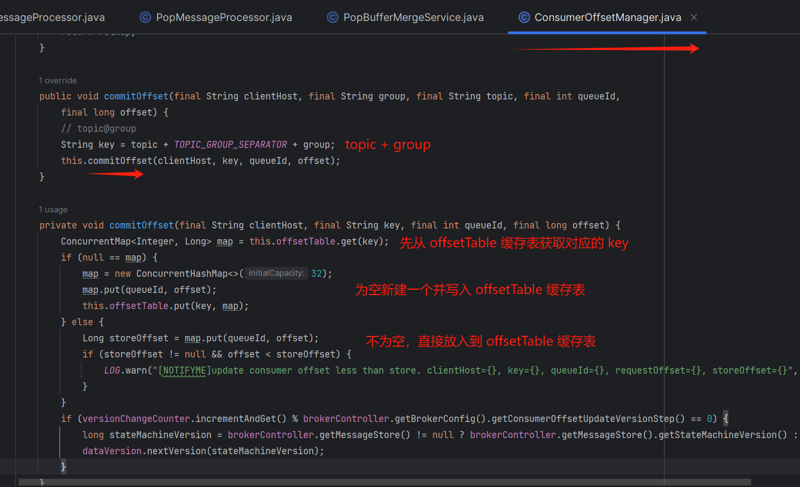

## **5.3 Broker 端 CheckPoint 与 AckMsg 匹配**

通过设置 [enablePopBufferMerge=true](http://enablepopbuffermerge=true/) 默认不开启匹配 即 false，在「**拉消息**」和「**ack 消息**」时，可以不发送「**ck**」和「**ack**」消息，仅仅将数据更新到「**buffer**」和「**commitOffsets**」中。

「**CheckPoint**」和 「**AckMsg**」都被设计成「**先尝试放入内存中进行匹配**」，然后「**再磁盘中进行匹配**」，因为通常情况下消息消费之后都能很快 ACK，内存匹配性能较高。如果 「**CheckPoint**」在内存中停留太久没有被匹配，则会转移到磁盘中，即 [ReviveTopic](http://revivetopic/)，有个线程会消费这个 [ReviveTopic](http://revivetopic/) 来匹配。到达「**唤醒重试时间**」[ReviveTime](http://revivetime/) 还没有被匹配的 「**CheckPoint**」里面的消息将会进行重试，先发送到 Pop 消息重试 Topic，后面的 Pop 有概率消费到。

对应两个操作方法。

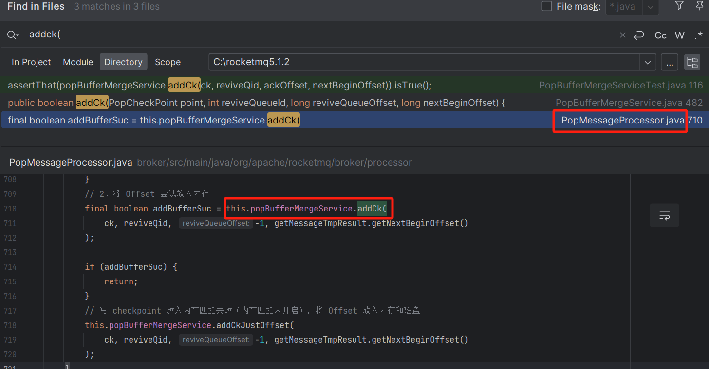

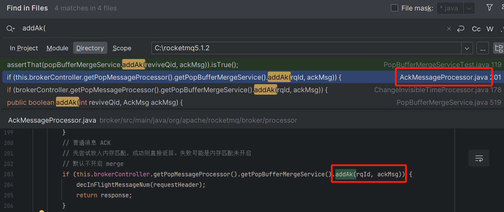

源码位置：[https://github.com/apache/rocketmq/blob/release-5.1.2/broker/src/main/java/org/apache/rocketmq/](https://github.com/apache/rocketmq/blob/release-5.1.2/broker/src/main/java/org/apache/rocketmq/broker/processor/PopBufferMergeService.java)[broker/processor/PopBufferMergeService](https://github.com/apache/rocketmq/blob/release-5.1.2/broker/src/main/java/org/apache/rocketmq/broker/processor/PopBufferMergeService.java)[.java](https://github.com/apache/rocketmq/blob/release-5.1.2/broker/src/main/java/org/apache/rocketmq/broker/processor/PopBufferMergeService.java)

### **5.3.1 新增 CheckPoint 操作**

Broker 端接收「**pop 请求**」拉消息，仅仅将「**checkpoint**」放入「**buffer**」和「**commitOffsets**」。

这里将「**checkpoint**」放入内存 Buffer，「**checkpoint**」中有一个码表 「**BitMap**」，用来表示它里面的每个条消息是否被「**Ack**」和被存到磁盘。用 「**BitMap**」可以加速匹配。

/\*\*

\* POP 消息后，新增 CheckPoint，放入内存 Buffer

\*

\* @param point

\* @param reviveQueueId

\* @param reviveQueueOffset

\* @param nextBeginOffset

\* @return 是否添加成功

\*/

public boolean addCk(PopCheckPoint point, int reviveQueueId, long reviveQueueOffset, long nextBeginOffset) {

// key: point.getT() + point.getC() + point.getQ() + point.getSo() + point.getPt()

if (!brokerController.getBrokerConfig().isEnablePopBufferMerge()) {

return false;

}

if (!serving) { // 内存匹配服务是否开启

return false;

}

// 距离下次可重试 Pop 消费的时刻 < 4.5s

long now \= System.currentTimeMillis();

if (point.getReviveTime() - now < brokerController.getBrokerConfig().getPopCkStayBufferTimeOut() + 1500) {

if (brokerController.getBrokerConfig().isEnablePopLog()) {

POP\_LOGGER.warn("\[PopBuffer\]add ck, timeout, {}, {}", point, now);

}

return false;

}

if (this.counter.get() > brokerController.getBrokerConfig().getPopCkMaxBufferSize()) {

POP\_LOGGER.warn("\[PopBuffer\]add ck, max size, {}, {}", point, this.counter.get());

return false;

}

PopCheckPointWrapper pointWrapper \= new PopCheckPointWrapper(reviveQueueId, reviveQueueOffset, point, nextBeginOffset);

if (!checkQueueOk(pointWrapper)) {

return false;

}

// 将 CheckPoint 放入 CommitOffsets 队列

putOffsetQueue(pointWrapper);

// 将 CheckPoint 放入内存 Buffer

this.buffer.put(pointWrapper.getMergeKey(), pointWrapper);

// 递增 counter

this.counter.incrementAndGet();

if (brokerController.getBrokerConfig().isEnablePopLog()) {

POP\_LOGGER.info("\[PopBuffer\]add ck, {}", pointWrapper);

}

return true;

}

### **5.3.2 CheckPoint 与 AckMsg 匹配**

Broker 端接收「**ack 请求**」，匹配「**buffer**」中的「**CheckPoint**」，设置 「**BitMap**」中的「**ack 进度**」（拉一次消息最多同一个队列拉「**32 条**」，32条消息对应一个「**CheckPoint**」，一个「**ack**」可更新其中 1 个 bit 代表消费成功）。

/\*\*

\* 消息 ACK，与内存中的 CheckPoint 匹配

\*

\* @param reviveQid

\* @param ackMsg

\* @return 是否匹配成功

\*/

public boolean addAk(int reviveQid, AckMsg ackMsg) {

// 如果未开启内存匹配，直接返回

if (!brokerController.getBrokerConfig().isEnablePopBufferMerge()) {

return false;

}

if (!serving) {

return false;

}

try {

// 根据 ACK 的消息找到内存 Buffer 中的 CheckPoint

PopCheckPointWrapper pointWrapper \= this.buffer.get(ackMsg.getTopic() + ackMsg.getConsumerGroup() + ackMsg.getQueueId() + ackMsg.getStartOffset() + ackMsg.getPopTime() + ackMsg.getBrokerName());

if (pointWrapper == null) {

// 找不到 CheckPoint

if (brokerController.getBrokerConfig().isEnablePopLog()) {

POP\_LOGGER.warn("\[PopBuffer\]add ack fail, rqId={}, no ck, {}", reviveQid, ackMsg);

}

return false;

}

// 内存中仅保存 Offset，实际已经保存到磁盘，内存中不处理 ACK 消息的匹配，直接返回

if (pointWrapper.isJustOffset()) {

return false;

}

PopCheckPoint point \= pointWrapper.getCk();

long now \= System.currentTimeMillis();

if (point.getReviveTime() - now < brokerController.getBrokerConfig().getPopCkStayBufferTimeOut() + 1500) {

if (brokerController.getBrokerConfig().isEnablePopLog()) {

POP\_LOGGER.warn("\[PopBuffer\]add ack fail, rqId={}, almost timeout for revive, {}, {}, {}", reviveQid, pointWrapper, ackMsg, now);

}

return false;

}

if (now - point.getPopTime() > brokerController.getBrokerConfig().getPopCkStayBufferTime() - 1500) {

if (brokerController.getBrokerConfig().isEnablePopLog()) {

POP\_LOGGER.warn("\[PopBuffer\]add ack fail, rqId={}, stay too long, {}, {}, {}", reviveQid, pointWrapper, ackMsg, now);

}

return false;

}

// 标记该 CheckPoint 已经被 ACK

int indexOfAck \= point.indexOfAck(ackMsg.getAckOffset());

if (indexOfAck > -1) {

// 设置 CheckPoint 中被 Ack 消息的 bit 码表为 1

markBitCAS(pointWrapper.getBits(), indexOfAck);

} else {

POP\_LOGGER.error("\[PopBuffer\]Invalid index of ack, reviveQid={}, {}, {}", reviveQid, ackMsg, point);

return true;

}

if (brokerController.getBrokerConfig().isEnablePopLog()) {

POP\_LOGGER.info("\[PopBuffer\]add ack, rqId={}, {}, {}", reviveQid, pointWrapper, ackMsg);

}

// // check ak done

// if (isCkDone(pointWrapper)) {

// // cancel ck for timer

// cancelCkTimer(pointWrapper);

// }

return true;

} catch (Throwable e) {

POP\_LOGGER.error("\[PopBuffer\]add ack error, rqId=" + reviveQid + ", " + ackMsg, e);

}

return false;

}

这里讲解一些关键变量：

[point](http://point/)：是当前 ack 对应的「**pop check point**」对象，里面有一个「**BitMap**」用来标记每个消息是否被 ack。

具体如何标记，这里举例说明一下：

假设此时拉取了「**4 条消息**」组成一个数组，每个「**消息下标**」分别为: 0, 1, 2, 3。

1.  这 4 条消息是否消费的标记由 4 个「**二进制标记**」来组成一个数组。
2.  二进制标记数组，可以转化为「**1个10进制的 int**」保存 ck 对象中。

## 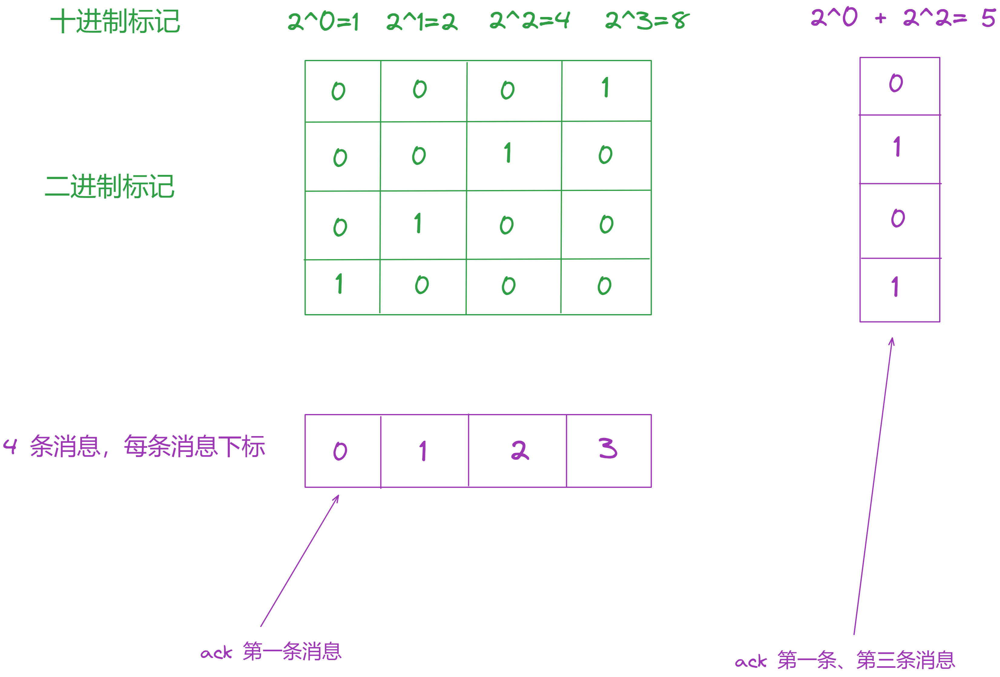

我们从「**pop check point**」对象初始化的时候可以知道， 「**BitMap**」是一个 int，并且初始化的值为 0 然后将 0 转化为「**二进制**」二进制，可以知道每一个 bit 位都是 0。

这里我们用这个「**BitMap**」的前 4 个「**bit**」位来举例说明是「**如何标记每条消息是否已经 ack 了**」。

将 「**Int**」转化为 「**BitMap**」，是一个「**bit**」数组，数组中的每个元素下标表示「**Pop 消息的下标**」。

对应上图，此时「**pop**」了 4 条消息，按照「**ConsumerQueue Offset**」从小到大排序就会有 4 个「**ConsumerQueue Offset**」下标。「**ConsumerQueue Offset**」分别为 \[100， 101， 102， 103\]。

如果第一次「**ack**」了 100 这条消息，则「**BitMap**」中下标为 0 的「**bit**」设置为 1，整个「**bit**」数组的结果就是上图第一列，如下：

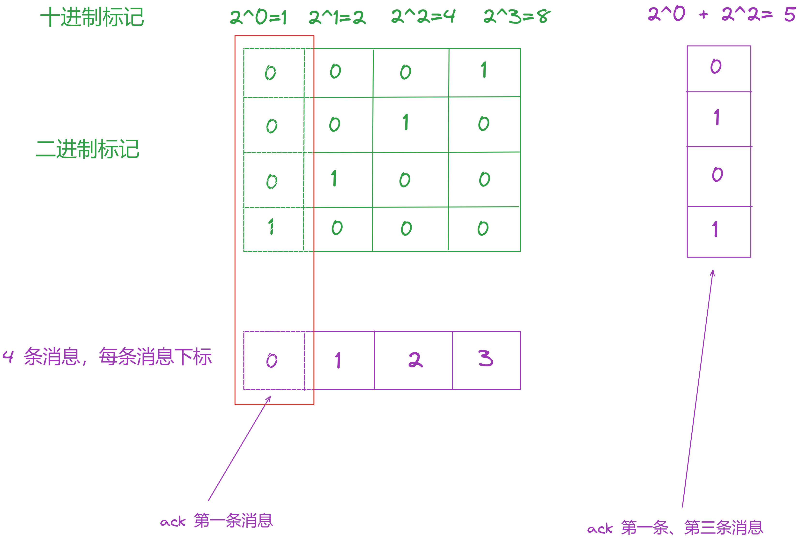

如果第一次「**ack**」了 101 这条消息，则「**BitMap**」中下标为 1 的「**bit**」设置为 1，整个「**bit**」数组的结果就是上图第二列，如下：

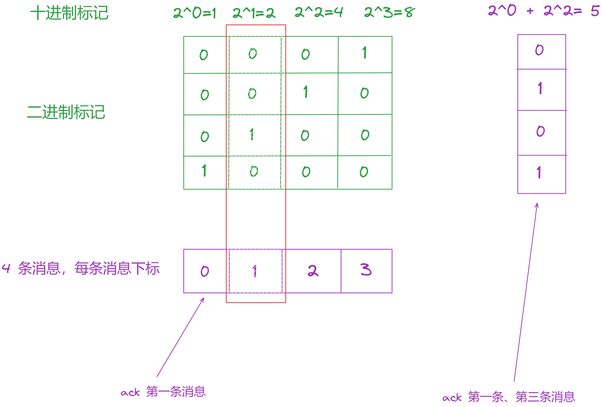

如果第一次「**ack**」了 100、102 这两条消息「**第一条**」、，「**第三条**」，则整个「**bit**」数组的结果就是上图最右一列，如下：

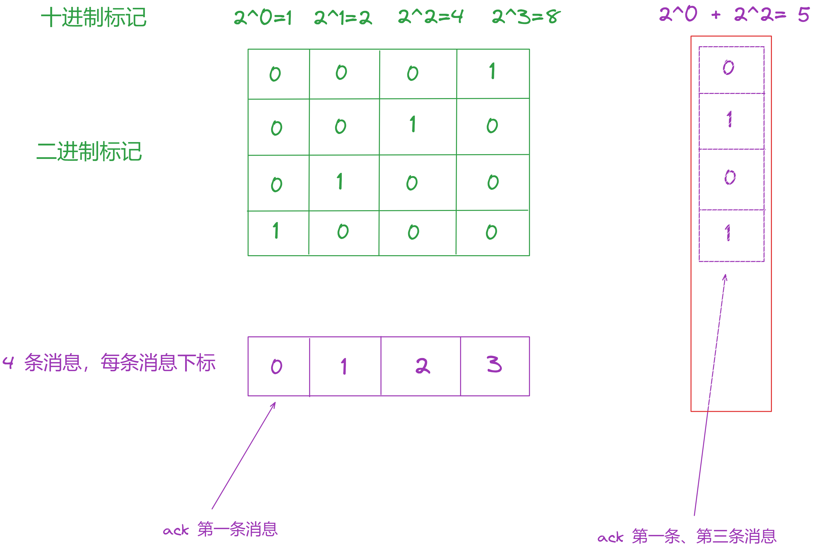

可以看到每次「**ack**」后，「**BitMap**」都可以转化为「**Int**」，并且将这个「**Int**」保存到「**pop check point**」中。

## **5.4 重试操作**

在「**Push**」模式中，重试由「**Consumer 端**」发起的。

1.  将 offset 直接提交。
2.  发送 [CONSUMER\_SEND\_MSG\_BACK](http://consumer_send_msg_back/) 请求，将消息重新投递。

而在「**Pop**」模式中，offset 在「**Push**」之后就可能就由 Broker 在 [PopBufferMergeService](http://popbuffermergeservice%20/) 后台线程中提交了。而 consumer 通过 [changePopInvisibleTime](http://changepopinvisibletime/) 的方式进行重试。

### **5.4.1 Consumer changePopVisibleTime 进行重试**

源码位置：[https://github.com/apache/rocketmq/blob/release-5.1.2/client/src/main/java/org/apache/rocketmq/client/consumer/](https://github.com/apache/rocketmq/blob/release-5.1.2/client/src/main/java/org/apache/rocketmq/client/consumer/ConsumeMessagePopConcurrentlyService.java)[ConsumeMessagePopConcurrentlyService](https://github.com/apache/rocketmq/blob/release-5.1.2/client/src/main/java/org/apache/rocketmq/client/consumer/ConsumeMessagePopConcurrentlyService.java)[.java](https://github.com/apache/rocketmq/blob/release-5.1.2/client/src/main/java/org/apache/rocketmq/client/consumer/ConsumeMessagePopConcurrentlyService.java)

消费端入口：[ConsumeMessagePopConcurrentlyService#processConsumeResult](http://consumemessagepopconcurrentlyservice/#processConsumeResult)。

  
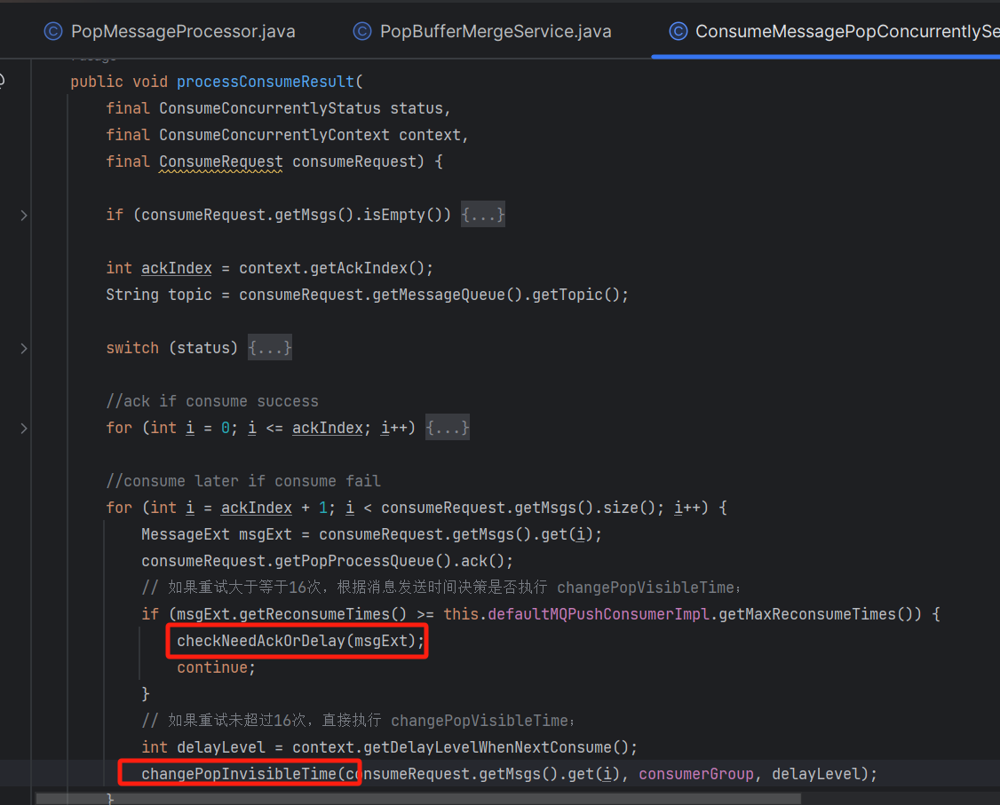

**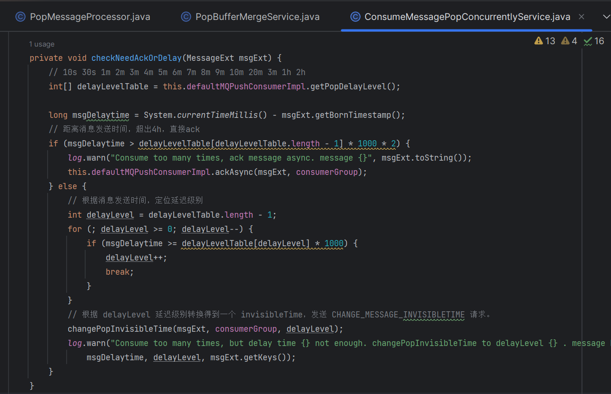**

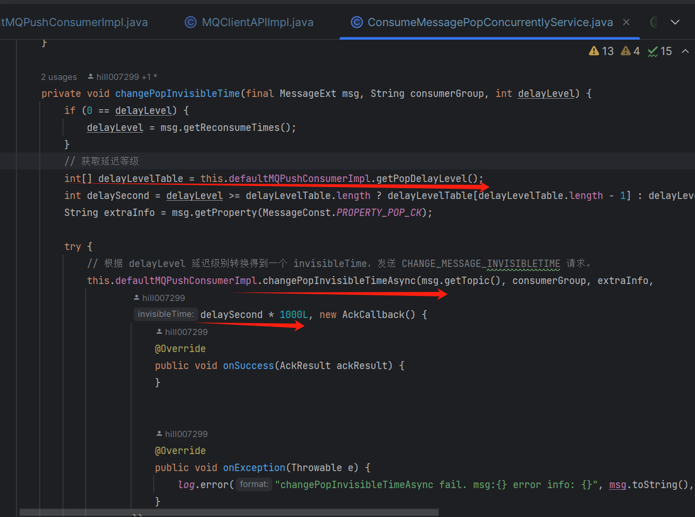

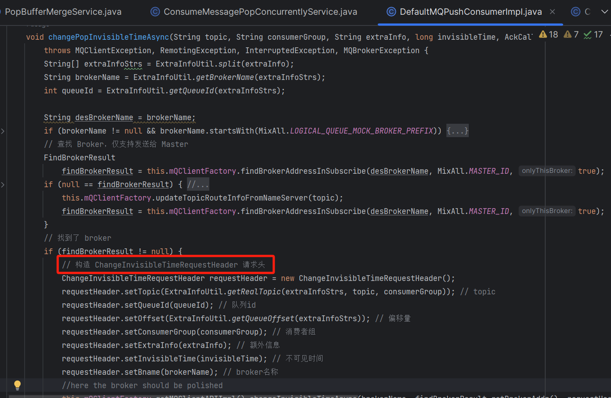

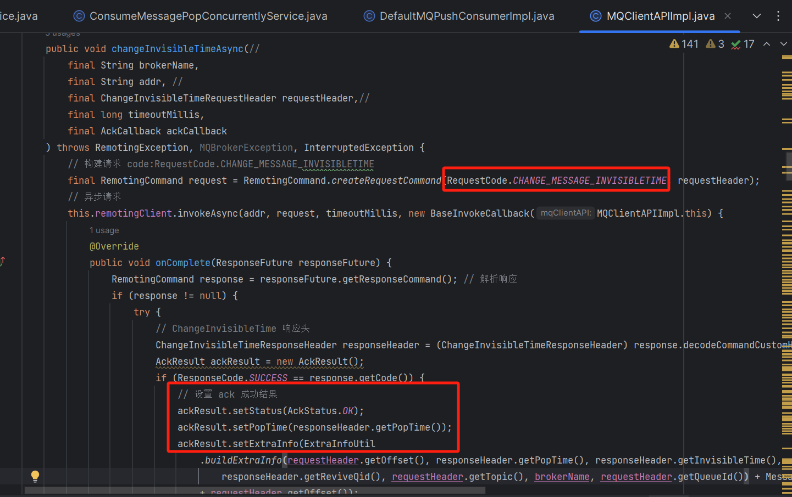

### **5.4.2 Broker changePopVisibleTime 进行重试**

对于 RocketMQ 来说，任何处理器都是以 [XXXProcessor](http://xxxprocessor/) 开头的，处理入口都是 [processRequest()](http://processrequest\(\)/) 方法。

所以该请求在 Broker 端的入口为 [ChangeInvisibleTimeProcessor#processRequest](http://changeinvisibletimeprocessor/#processRequest)。

  
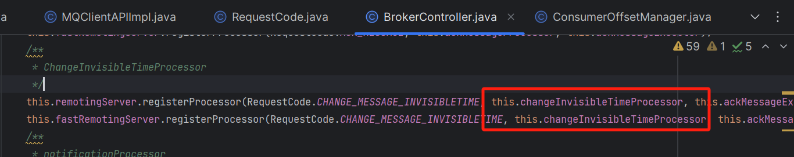

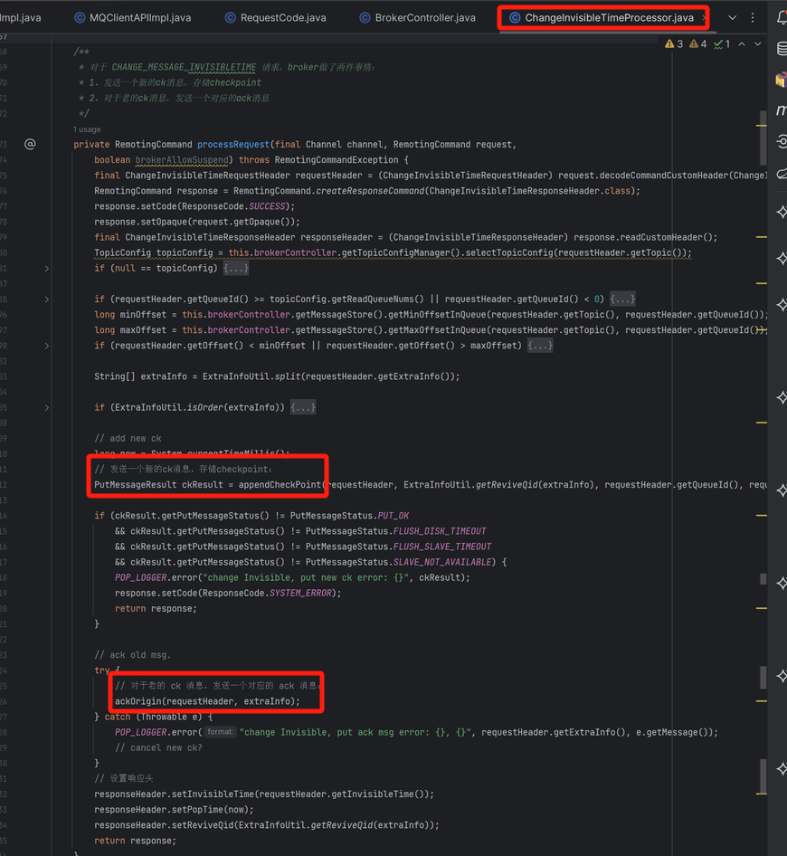

/\*\*

\* 处理 ack 原始消息的确认

\* @param requestHeader 确认消息的请求头

\* @param extraInfo 额外信息数组

\*/

private void ackOrigin(final ChangeInvisibleTimeRequestHeader requestHeader,String\[\] extraInfo) {

// 创建内部消息对象

MessageExtBrokerInner msgInner \= new MessageExtBrokerInner();

// 创建 ack 消息对象

AckMsg ackMsg \= new AckMsg();

// 构建 ack 消息

ackMsg.setAckOffset(requestHeader.getOffset());

ackMsg.setStartOffset(ExtraInfoUtil.getCkQueueOffset(extraInfo));

ackMsg.setConsumerGroup(requestHeader.getConsumerGroup());

ackMsg.setTopic(requestHeader.getTopic());

ackMsg.setQueueId(requestHeader.getQueueId());

ackMsg.setPopTime(ExtraInfoUtil.getPopTime(extraInfo));

ackMsg.setBrokerName(ExtraInfoUtil.getBrokerName(extraInfo));

// 解析 rqId

int rqId \= ExtraInfoUtil.getReviveQid(extraInfo);

// 统计

this.brokerController.getBrokerStatsManager().incBrokerAckNums(1);

this.brokerController.getBrokerStatsManager().

incGroupAckNums(requestHeader.getConsumerGroup(),requestHeader.getTopic(),1);

// 尝试将 ack 消息添加到 PopBufferMergeService 中进行合并处理

if (brokerController.getPopMessageProcessor().getPopBufferMergeService().addAk(rqId,ackMsg)) {

return;

}

// 如果添加到 PopBufferMergeService 失败，将 ack 消息作为新的消息发送到补偿 revive 队列

msgInner.setTopic(reviveTopic);

msgInner.setBody(JSON.toJSONString(ackMsg).getBytes(DataConverter.charset));

msgInner.setQueueId(rqId);

msgInner.setTags(PopAckConstants.ACK\_TAG);

msgInner.setBornTimestamp(System.currentTimeMillis());

msgInner.setBornHost(this.brokerController.getStoreHost());

msgInner.setStoreHost(this.brokerController.getStoreHost());

msgInner.setDeliverTimeMs(ExtraInfoUtil.getPopTime(extraInfo) + ExtraInfoUtil.getInvisibleTime(extraInfo));

msgInner.getProperties().put(MessageConst.PROPERTY\_UNIQ\_CLIENT\_MESSAGE\_ID\_KEYIDX,

PopMessageProcessor.genAckUniqueId(ackMsg));

msgInner.setPropertiesString(MessageDecoder.messageProperties2String(

msgInner.getProperties()));

// 发送请求到补偿 revive 队列

PutMessageResult putMessageResult \= this.brokerController.getEscapeBridge().putMessageToSpecificQueue(msgInner);

// 检查消息发送结果并记录日志

if (putMessageResult.getPutMessageStatus() != PutMessageStatus.PUT\_OK

&& putMessageResult.getPutMessageStatus() != PutMessageStatus.FLUSH\_DISK\_TIMEOUT

&& putMessageResult.getPutMessageStatus() != PutMessageStatus.FLUSH\_SLAVE\_TIMEOUT

&& putMessageResult.getPutMessageStatus() != PutMessageStatus.SLAVE\_NOT\_AVAILABLE) {

POP\_LOGGER.error("change Invisible,put ack msg fail:{},{}",ackMsg,putMessageResult);

}

//统计

PopMetricsManager.incPopReviveAckPutCount(ackMsg,putMessageResult.getPutMessageStatus());

}

## **5.5 补偿操作**

「**Pop**」拉消息自动提交「**offset**」，提高了消费处理速度，但是无法正确判断 consumer 是否消费成功了。在上面流程中，「**ck**」和 「**ack**」消息的作用就是是为了「**补偿无法正确处理消费进度的问题**」而采取的补偿手段。

大概有以下三种场景：

1.  broker 端拉消息自动提交，consumer 消费成功，但 broker 未收到 [ACK\_MESSAGE](http://ack_message/)；此时只有「**ck**」消息，不存在「**ack**」消息，无法判断消费者是否真的消费成功。
2.  broker 端拉消息自动提交，但 consumer 消费失败，broker 收到 [CHANGE\_MESSAGE\_INVISIBLETIME](http://change_message_invisibletime/)；此时有「**ck**」和「**ack**」消息，但也有可能没有「**ack**」，只是被 try-catch 了 同场景1，还有一条新的「**ck**」消息，新「**ck**」消息的「**invisibleTime**」会根据 「**delayLevel**」进行计算得到的。
3.  broker 端拉消息自动提交，但 consumer 消费失败，broker 未收到 [CHANGE\_MESSAGE\_INVISIBLETIME](http://change_message_invisibletime/)；此时只有「**ck**」消息，不存在「**ack**」消息，无法判断消费者是否真的消费成功。

通过上面的剖析，我们了解到从内存中移除保存到磁盘的「**CheckPoint**」和「**AckMsg**」都会封装成消息进行定时投递（定时到重试时间），最终投递到「**ReviveTopic**」。在存储中匹配会由线程 [PopReviveService](http://popreviveservice%20/) 完成，它消费「**ReviveTopic**」的消息进行匹配和重试。

「**Pop 消费**」由于要根据 「**Topic**」来「**Pop 消息**」的，所以「**重试 Topic**」需要针对每个「**消费者组-Topic**」进行隔离，因此它不能用「**普通消息**」的消费组维度的「**重试 Topic**」，而是用专门的 「**Pop 重试 Topic**」[%RETRY%{消费组}\_{TOPIC}](http://%RETRY%%7B%E6%B6%88%E8%B4%B9%E7%BB%84%7D_%7BTOPIC%7D)。

在 [AckMessageProcessor](http://ackmessageprocessor/) 中构建了 n 个 [PopReviveService](http://popreviveservice/) 线程进行匹配「**ck**」消息和 「**ack**」消息（默认8个）。

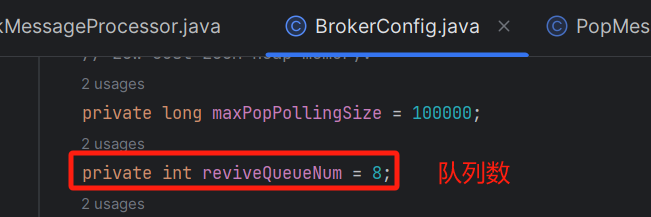

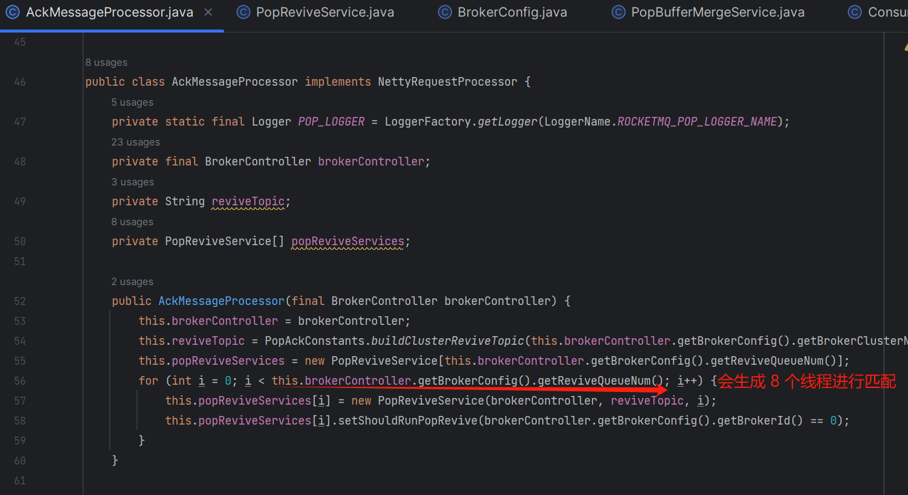

这里的每个 [PopReviveService](http://popreviveservice/) 线程负责消费「**ReviveTopic**」中的一个队列，用来匹配「**ck**」消息和 「**ack**」消息。如果未匹配成功，表示客户端「**超时**」或「**失败**」。

源码位置：[https://github.com/apache/rocketmq/blob/release-5.1.2/broker/src/main/java/org/apache/rocketmq/](https://github.com/apache/rocketmq/blob/release-5.1.2/broker/src/main/java/org/apache/rocketmq/broker/processor/PopReviveService.java)[broker/processor/PopReviveService](https://github.com/apache/rocketmq/blob/release-5.1.2/broker/src/main/java/org/apache/rocketmq/broker/processor/PopReviveService.java)[.java](https://github.com/apache/rocketmq/blob/release-5.1.2/broker/src/main/java/org/apache/rocketmq/broker/processor/PopReviveService.java)

  
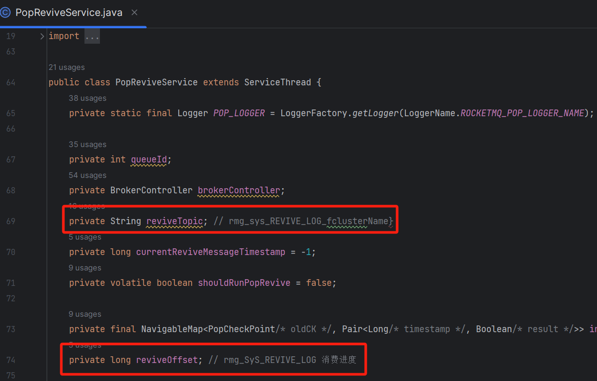

我们再来看下该线程启动时都干了什么？

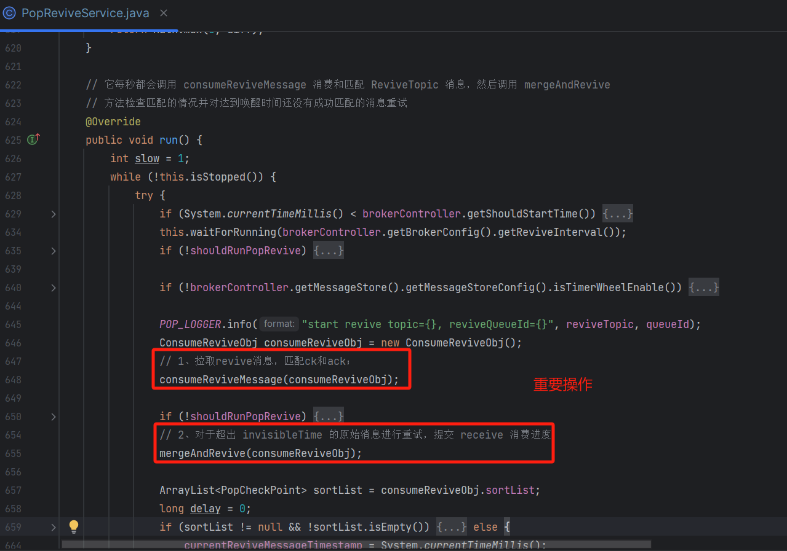

剖析这两个重要方法之前，我们先来看下「**ConsumeReviveObj**」是干什么的。

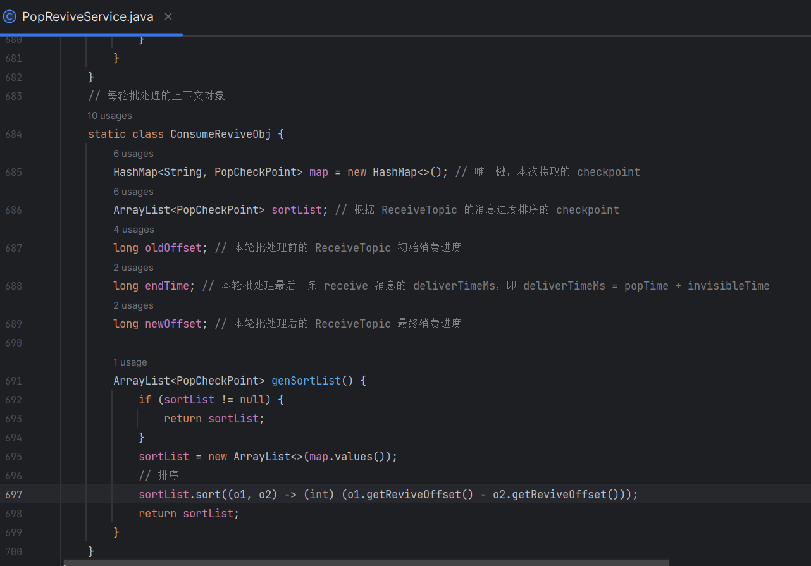

### **5.5.1 拉取 Revive 消息**

/\*\*

\* 消费 Revive Topic 中 2s 内的一批消息，匹配 ACK 消息和 CheckPoint

\* CK 消息放到 Map 中，ACK 消息根据 Map key 匹配 CK 消息，更新 CK 消息的码表以完成 ACK

\* 只对 CK 进行标记

\* 消费时间差 2s 内的 CK、ACK 消息，或 4s 没有消费到新消息

\*

\* @param consumeReviveObj CK 与 ACK 匹配对象，用于 Revive 需要重试 Pop 消费的消息

\*/

protected void consumeReviveMessage(ConsumeReviveObj consumeReviveObj) {

// CheckPoint 匹配 map，key = point.getTopic() + point.getCId() + point.getQueueId() + point.getStartOffset() + point.getPopTime()

HashMap<String, PopCheckPoint> map = consumeReviveObj.map;

HashMap<String, PopCheckPoint> mockPointMap = new HashMap<>();

long startScanTime \= System.currentTimeMillis();

long endTime \= 0;

long consumeOffset \= this.brokerController.getConsumerOffsetManager().queryOffset(PopAckConstants.REVIVE\_GROUP, reviveTopic, queueId);

// 查询 ReviveTopic queue 之前的消费进度

long oldOffset \= Math.max(reviveOffset, consumeOffset);

consumeReviveObj.oldOffset = oldOffset;

POP\_LOGGER.info("reviveQueueId={}, old offset is {} ", queueId, oldOffset);

long offset \= oldOffset + 1;

int noMsgCount \= 0; // 没有查询到消息的次数

long firstRt \= 0;

// offset self amend

while (true) {

if (!shouldRunPopRevive) {

POP\_LOGGER.info("slave skip scan , revive topic={}, reviveQueueId={}", reviveTopic, queueId);

break;

}

// 1、以 group=CID\_RMQ\_SYS\_REVIVE\_GROUP，获取 reviveTopic 对应队列下的消息（32条）

List<MessageExt> messageExts = getReviveMessage(offset, queueId);

if (messageExts == null || messageExts.isEmpty()) {

long old \= endTime;

long timerDelay \= brokerController.getMessageStore().getTimerMessageStore().getDequeueBehind();

long commitLogDelay \= brokerController.getMessageStore().getTimerMessageStore().getEnqueueBehind();

// move endTime

if (endTime != 0 && System.currentTimeMillis() - endTime > 3 \* PopAckConstants.SECOND && timerDelay <= 0 && commitLogDelay <= 0) {

endTime = System.currentTimeMillis();

}

POP\_LOGGER.info("reviveQueueId={}, offset is {}, can not get new msg, old endTime {}, new endTime {}, timerDelay={}, commitLogDelay={} ",

queueId, offset, old, endTime, timerDelay, commitLogDelay);

// 最后一个 CK 的唤醒时间与第一个 CK 的唤醒时间差大于 2s，中断消费

if (endTime - firstRt > PopAckConstants.ackTimeInterval + PopAckConstants.SECOND)

{

break;

}

noMsgCount++;

// Fixme: why sleep is useful here?

try {

Thread.sleep(100);

} catch (Throwable ignore) {

}

// 连续 4s 没有消费到新的消息，中断消费

if (noMsgCount \* 100L > 4 \* PopAckConstants.SECOND) {

break;

} else {

continue;

}

} else {

noMsgCount = 0;

}

if (System.currentTimeMillis() - startScanTime > brokerController.getBrokerConfig().getReviveScanTime()) {

POP\_LOGGER.info("reviveQueueId={}, scan timeout ", queueId);

break;

}

// 2、遍历查询到的消息将拉取到的 receive 消息，放入 ConsumeReviveObj.map，同时ack消息匹配ck消息（bitmap）。

for (MessageExt messageExt : messageExts) {

if (PopAckConstants.CK\_TAG.equals(messageExt.getTags())) {

// 如果是 CheckPoint

String raw \= new String(messageExt.getBody(), DataConverter.charset);

if (brokerController.getBrokerConfig().isEnablePopLog()) {

POP\_LOGGER.info("reviveQueueId={},find ck, offset:{}, raw : {}", messageExt.getQueueId(), messageExt.getQueueOffset(), raw);

}

PopCheckPoint point \= JSON.parseObject(raw, PopCheckPoint.class);

if (point.getTopic() == null || point.getCId() == null) {

continue;

}

// 将 ck 消息放入 ConsumeReviveObj.map，等待 ACK 消息匹配

map.put(point.getTopic() + point.getCId() + point.getQueueId() + point.getStartOffset() + point.getPopTime(), point);

// 设置 reviveOffset 为 revive 队列中消息的逻辑 offset

PopMetricsManager.incPopReviveCkGetCount(point, queueId);

point.setReviveOffset(messageExt.getQueueOffset());

if (firstRt == 0) {

firstRt = point.getReviveTime();

}

} else if (PopAckConstants.ACK\_TAG.equals(messageExt.getTags())) {

// 如果是 ACK 消息

String raw \= new String(messageExt.getBody(), DataConverter.charset);

if (brokerController.getBrokerConfig().isEnablePopLog()) {

POP\_LOGGER.info("reviveQueueId={},find ack, offset:{}, raw : {}", messageExt.getQueueId(), messageExt.getQueueOffset(), raw);

}

AckMsg ackMsg \= JSON.parseObject(raw, AckMsg.class);

PopMetricsManager.incPopReviveAckGetCount(ackMsg, queueId);

// ack 匹配 ck 消息

String mergeKey \= ackMsg.getTopic() + ackMsg.getConsumerGroup() + ackMsg.getQueueId() + ackMsg.getStartOffset() + ackMsg.getPopTime();

PopCheckPoint point \= map.get(mergeKey);

if (point == null) {

if (!brokerController.getBrokerConfig().isEnableSkipLongAwaitingAck()) {

continue;

}

if (mockCkForAck(messageExt, ackMsg, mergeKey, mockPointMap) && firstRt == 0) {

firstRt = mockPointMap.get(mergeKey).getReviveTime();

}

} else {

// 如果 HashMap 中有 CheckPoint，计算 ACK 的 bit 码表

int indexOfAck \= point.indexOfAck(ackMsg.getAckOffset());

if (indexOfAck > -1) {

// 设置 CheckPoint 中的 bitmap 对应下标为 true

// Ack 消息 bit 码表为 1 的位 Ack 成功

point.setBitMap(DataConverter.setBit(point.getBitMap(), indexOfAck, true));

} else {

POP\_LOGGER.error("invalid ack index, {}, {}", ackMsg, point);

}

}

} else if (PopAckConstants.BATCH\_ACK\_TAG.equals(messageExt.getTags())) {

// 如果是批量 Ack 消息

String raw \= new String(messageExt.getBody(), DataConverter.charset);

if (brokerController.getBrokerConfig().isEnablePopLog()) {

POP\_LOGGER.info("reviveQueueId={}, find batch ack, offset:{}, raw : {}", messageExt.getQueueId(), messageExt.getQueueOffset(), raw);

}

BatchAckMsg bAckMsg \= JSON.parseObject(raw, BatchAckMsg.class);

PopMetricsManager.incPopReviveAckGetCount(bAckMsg, queueId);

String mergeKey \= bAckMsg.getTopic() + bAckMsg.getConsumerGroup() + bAckMsg.getQueueId() + bAckMsg.getStartOffset() + bAckMsg.getPopTime();

PopCheckPoint point \= map.get(mergeKey);

if (point == null) {

if (!brokerController.getBrokerConfig().isEnableSkipLongAwaitingAck()) {

continue;

}

if (mockCkForAck(messageExt, bAckMsg, mergeKey, mockPointMap) && firstRt == 0) {

firstRt = mockPointMap.get(mergeKey).getReviveTime();

}

} else {

// 获取 ack 列表

List<Long> ackOffsetList = bAckMsg.getAckOffsetList();

for (Long ackOffset : ackOffsetList) {

// 如果 HashMap 中有 CheckPoint，计算 ACK 的 bit 码表

int indexOfAck \= point.indexOfAck(ackOffset);

if (indexOfAck > -1) {

// 设置 CheckPoint 中的 bitmap 对应下标为 true

// Ack 消息 bit 码表为 1 的位 Ack 成功

point.setBitMap(DataConverter.setBit(point.getBitMap(), indexOfAck, true));

} else {

POP\_LOGGER.error("invalid batch ack index, {}, {}", bAckMsg, point);

}

}

}

}

long deliverTime \= messageExt.getDeliverTimeMs();

if (deliverTime > endTime) {

endTime = deliverTime;

}

}

offset = offset + messageExts.size();

}

consumeReviveObj.map.putAll(mockPointMap);

consumeReviveObj.endTime = endTime;

}

重要步骤如下：

1.  以 [group=CID\_RMQ\_SYS\_REVIVE\_GROUP](http://group=cid_rmq_sys_revive_group/)，获取 reviveTopic 对应队列下的消息（32条）。
2.  遍历查询到的消息将拉取到的 receive 消息，放入 [ConsumeReviveObj.map](http://consumereviveobj.map/)，同时ack消息匹配ck消息（bitmap）。

### **5.5.2 消费 Revive 消息**

/\*\*

\* 匹配消费到的一批 CK 和 ACK 消息，对于没有成功 ACK 的消息，重发到重试 Topic

\*/

protected void mergeAndRevive(ConsumeReviveObj consumeReviveObj) throws Throwable {

// 获取排序后的 CheckPoint 列表

// 将 CheckPoint 按照 ReceiveTopic 的 offset 排序

ArrayList<PopCheckPoint> sortList = consumeReviveObj.genSortList();

POP\_LOGGER.info("reviveQueueId={},ck listSize={}", queueId, sortList.size());

if (sortList.size() != 0) {

POP\_LOGGER.info("reviveQueueId={}, 1st ck, startOffset={}, reviveOffset={} ; last ck, startOffset={}, reviveOffset={}", queueId, sortList.get(0).getStartOffset(),

sortList.get(0).getReviveOffset(), sortList.get(sortList.size() - 1).getStartOffset(), sortList.get(sortList.size() - 1).getReviveOffset());

}

long newOffset \= consumeReviveObj.oldOffset;

for (PopCheckPoint popCheckPoint : sortList) {

if (!shouldRunPopRevive) {

POP\_LOGGER.info("slave skip ck process , revive topic={}, reviveQueueId={}", reviveTopic, queueId);

break;

}

// 如果没有到 Revive 时间，跳过不处理

if (consumeReviveObj.endTime - popCheckPoint.getReviveTime() <= (PopAckConstants.ackTimeInterval + PopAckConstants.SECOND)) {

break;

}

// 从 CK 中解析原 Topic 并检查该 Topic 是否存在，如果不存在则跳过

// check normal topic, skip ck , if normal topic is not exist

String normalTopic \= KeyBuilder.parseNormalTopic(popCheckPoint.getTopic(), popCheckPoint.getCId());

if (brokerController.getTopicConfigManager().selectTopicConfig(normalTopic) == null) {

POP\_LOGGER.warn("reviveQueueId={},can not get normal topic {} , then continue ", queueId, popCheckPoint.getTopic());

newOffset = popCheckPoint.getReviveOffset();

continue;

}

if (null == brokerController.getSubscriptionGroupManager().findSubscriptionGroupConfig(popCheckPoint.getCId())) {

POP\_LOGGER.warn("reviveQueueId={},can not get cid {} , then continue ", queueId, popCheckPoint.getCId());

newOffset = popCheckPoint.getReviveOffset();

continue;

}

while (inflightReviveRequestMap.size() > 3) {

waitForRunning(100);

Pair<Long, Boolean> pair = inflightReviveRequestMap.firstEntry().getValue();

if (!pair.getObject2() && System.currentTimeMillis() - pair.getObject1() > 1000 \* 30) {

PopCheckPoint oldCK \= inflightReviveRequestMap.firstKey();

rePutCK(oldCK, pair);

inflightReviveRequestMap.remove(oldCK);

}

}

// 重发 CK 中没有 Ack 的所有消息

reviveMsgFromCk(popCheckPoint);

// 重置 newOffset

newOffset = popCheckPoint.getReviveOffset();

}

// 匹配和重试完成后，更新 ReviveTopic 消费进度

if (newOffset > consumeReviveObj.oldOffset) {

if (!shouldRunPopRevive) {

POP\_LOGGER.info("slave skip commit, revive topic={}, reviveQueueId={}", reviveTopic, queueId);

return;

}

this.brokerController.getConsumerOffsetManager().

commitOffset(PopAckConstants.LOCAL\_HOST, PopAckConstants.REVIVE\_GROUP, reviveTopic, queueId, newOffset);

}

reviveOffset = newOffset;

consumeReviveObj.newOffset = newOffset;

}

重要步骤如下：

1.  获取排序后的 [CheckPoint](http://checkpoint%20/) 列表。
2.  循环处理每个 [CheckPoint](http://checkpoint/)，对于超出 [invisibleTime](http://invisibletime/)（broker 收到 pop 请求超过 60s）的 [CheckPoint](http://checkpoint/) 需要处理，最终提交「**ReviveTopic**」的消费进度。

/\*\*

\* 重发 CK 中没有 Ack 的所有消息

\* 从 Checkpoint 中恢复消息，并通过 CompletableFuture 进行并发处理。

\*/

private void reviveMsgFromCk(PopCheckPoint popCheckPoint) {

if (!shouldRunPopRevive) {

POP\_LOGGER.info("slave skip retry , revive topic={}, reviveQueueId={}", reviveTopic, queueId);

return;

}

// 将检查点加入正在进行中的恢复请求中

inflightReviveRequestMap.put(popCheckPoint, new Pair<>(System.currentTimeMillis(), false));

// 创建 CompletableFuture 列表

List<CompletableFuture<Pair<Long, Boolean>>> futureList = new ArrayList<>(popCheckPoint.getNum());

// 1、遍历 CK 中的所有消息

for (int j \= 0; j < popCheckPoint.getNum(); j++) {

// 如果 ck 匹配 ack，不处理

if (DataConverter.getBit(popCheckPoint.getBitMap(), j)) {

continue;

}

// 重试消息

// 获取消息的偏移量

long msgOffset \= popCheckPoint.ackOffsetByIndex((byte) j);

CompletableFuture<Pair<Long, Boolean>> future = getBizMessage(popCheckPoint.getTopic(), msgOffset, popCheckPoint.getQueueId(), popCheckPoint.getBrokerName())

.thenApply(resultPair -> {

// 获取消息的获取状态

GetMessageStatus getMessageStatus \= resultPair.getObject1();

// 获取消息对象

MessageExt message \= resultPair.getObject2();

if (message == null) {

POP\_LOGGER.warn("reviveQueueId={}, can not get biz msg topic is {}, offset is {}, then continue", queueId, popCheckPoint.getTopic(), msgOffset);

switch (getMessageStatus) {

// 根据消息获取状态进行处理

case MESSAGE\_WAS\_REMOVING:

case OFFSET\_TOO\_SMALL:

case NO\_MATCHED\_LOGIC\_QUEUE:

case NO\_MESSAGE\_IN\_QUEUE:

return new Pair<>(msgOffset, true);

default:

return new Pair<>(msgOffset, false);

}

}

// 跳过上一个 epoch

的 CK

if (popCheckPoint.getPopTime() < message.getStoreTimestamp()) {

POP\_LOGGER.warn("reviveQueueId={}, skip ck from last epoch {}", queueId, popCheckPoint);

// 返回跳过标记

return new Pair<>(msgOffset, true);

}

// ck 未匹配 ack，重新发送原始消息

boolean result \= reviveRetry(popCheckPoint, message);

return new Pair<>(msgOffset, result); // 返回消息偏移量和处理结果

});

futureList.add(future); // 将 CompletableFuture 添加到列表中

}

// 等待所有的 CompletableFuture 完成

CompletableFuture.allOf(futureList.toArray(new CompletableFuture\[0\]))

.whenComplete((v, e) -> {

// 处理所有的 CompletableFuture

for (CompletableFuture<Pair<Long, Boolean>> future : futureList) {

Pair<Long, Boolean> pair = future.getNow(new Pair<>(0L, false));

if (!pair.getObject2()) {

rePutCK(popCheckPoint, pair); // 重新放入 CK

}

}

// 更新正在进行中的恢复请求

if (inflightReviveRequestMap.containsKey(popCheckPoint)) {

inflightReviveRequestMap.get(popCheckPoint).setObject2(true);

}

// 遍历正在进行中的恢复请求，提交偏移量并从映射中移除已完成的请求

for (Map.Entry<PopCheckPoint, Pair<Long, Boolean>> entry : inflightReviveRequestMap.entrySet()) {

PopCheckPoint oldCK \= entry.getKey();

Pair<Long, Boolean> pair = entry.getValue();

if (pair.getObject2()) {

brokerController.getConsumerOffsetManager().

commitOffset(PopAckConstants.LOCAL\_HOST, PopAckConstants.REVIVE\_GROUP, reviveTopic, queueId, oldCK.getReviveOffset());

inflightReviveRequestMap.remove(oldCK);

} else {

break;

}

}

});

}

如果 ck 未匹配 ack，即实际消费情况未知，需要查询原始消息并重新发送。消费重试 [changeInvisibleTime](http://changeinvisibletime/) 正是通过这里实现。

/\*\*

\* 根据 CheckPoint 唤醒没有被 ACK 的消息，发到重试队列

\*

\* @param popCheckPoint CK

\* @param messageExt 要被重试的消息

\* @throws Exception

\*/

private boolean reviveRetry(PopCheckPoint popCheckPoint, MessageExt messageExt) {

// 构造新的消息

MessageExtBrokerInner msgInner \= new MessageExtBrokerInner();

// 唤醒的消息发到重试 Topic

if (!popCheckPoint.getTopic().startsWith(MixAll.RETRY\_GROUP\_TOPIC\_PREFIX)) {

msgInner.setTopic(KeyBuilder.buildPopRetryTopic(popCheckPoint.getTopic(), popCheckPoint.getCId()));

} else {

msgInner.setTopic(popCheckPoint.getTopic());

}

msgInner.setBody(messageExt.getBody());

msgInner.setQueueId(0);

if (messageExt.getTags() != null) {

msgInner.setTags(messageExt.getTags());

} else {

MessageAccessor.setProperties(msgInner, new HashMap<>());

}

msgInner.setBornTimestamp(messageExt.getBornTimestamp());

msgInner.setFlag(messageExt.getFlag());

msgInner.setSysFlag(messageExt.getSysFlag());

msgInner.setBornHost(brokerController.getStoreHost());

msgInner.setStoreHost(brokerController.getStoreHost());

// 重试次数 += 1

msgInner.setReconsumeTimes(messageExt.getReconsumeTimes() + 1);

msgInner.getProperties().putAll(messageExt.getProperties());

if (messageExt.getReconsumeTimes() == 0 || msgInner.getProperties().get(MessageConst.PROPERTY\_FIRST\_POP\_TIME) == null) {

msgInner.getProperties().put(MessageConst.PROPERTY\_FIRST\_POP\_TIME, String.valueOf(popCheckPoint.getPopTime()));

}

msgInner.setPropertiesString(MessageDecoder.messageProperties2String(

msgInner.getProperties()));

// 添加 Pop 重试 Topic

addRetryTopicIfNoExit(msgInner.getTopic(), popCheckPoint.getCId());

// 保存重试消息到存储

PutMessageResult putMessageResult \= brokerController.getEscapeBridge().putMessageToSpecificQueue(msgInner);

// 各种统计

PopMetricsManager.incPopReviveRetryMessageCount(popCheckPoint, putMessageResult.getPutMessageStatus());

if (brokerController.getBrokerConfig().isEnablePopLog()) {

POP\_LOGGER.info("reviveQueueId={},retry msg , ck={}, msg queueId {}, offset {}, reviveDelay={}, result is {} ",

queueId, popCheckPoint, messageExt.getQueueId(), messageExt.getQueueOffset(),

(System.currentTimeMillis() - popCheckPoint.getReviveTime()) / 1000, putMessageResult);

}

if (putMessageResult.getAppendMessageResult() == null ||

putMessageResult.getAppendMessageResult().getStatus() != AppendMessageStatus.PUT\_OK) {

POP\_LOGGER.error("reviveQueueId={}, revive error, msg is: {}", queueId, msgInner);

return false;

}

this.brokerController.getPopInflightMessageCounter().

decrementInFlightMessageNum(popCheckPoint);

this.brokerController.getBrokerStatsManager().incBrokerPutNums(popCheckPoint.getTopic(), 1);

this.brokerController.getBrokerStatsManager().incTopicPutNums(msgInner.getTopic());

this.brokerController.getBrokerStatsManager().incTopicPutSize(msgInner.getTopic(), putMessageResult.getAppendMessageResult().getWroteBytes());

// 最后更新统计数据

if (brokerController.getPopMessageProcessor() != null) {

brokerController.getPopMessageProcessor().notifyMessageArriving(

KeyBuilder.parseNormalTopic(popCheckPoint.getTopic(), popCheckPoint.getCId()),

popCheckPoint.getCId(),

\-1

);

brokerController.getNotificationProcessor().notifyMessageArriving(

KeyBuilder.parseNormalTopic(popCheckPoint.getTopic(), popCheckPoint.getCId()), -1);

}

return true;

}

发送重试消息，topic = [%RETRY%{group}\_{topic}](http://%RETRY%%7Bgroup%7D_%7Btopic%7D%20) ，队列 id 固定 0，即 一个 topic 只有一个队列。这里最后也会唤醒长轮询客户端。

## **5.6 小结**

最后通过一张图来总结整个「**Ack 消息**」的处理流程。

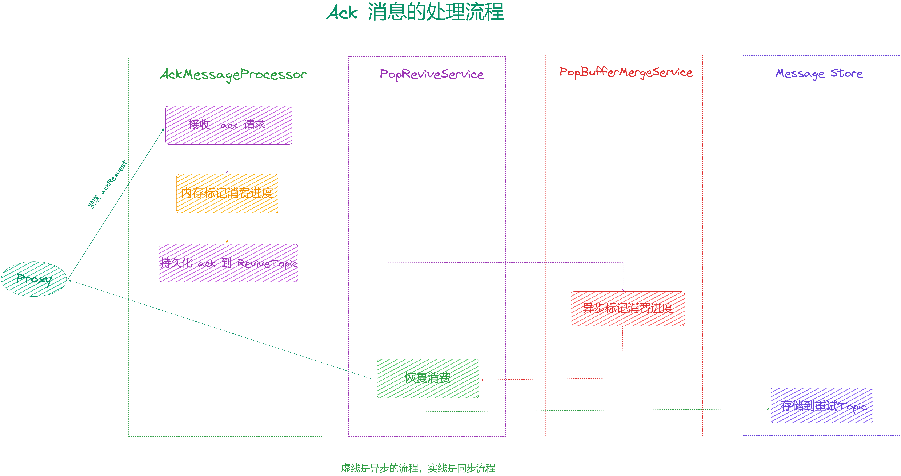

## **06 总结**