大家好，我是**华仔**, 又跟大家见面了。

从今天开始我将继续为大家奉上 RocketMQ 消费者源码剖析系列文章，正式开启「**RocketMQ 的 消费者源码之旅**」，这是第十三篇，本篇我们将以「**RocketMQ 5.1.2**」版本为主，来剖析下 RocketMQ 源码之消费者失败重试流程剖析。

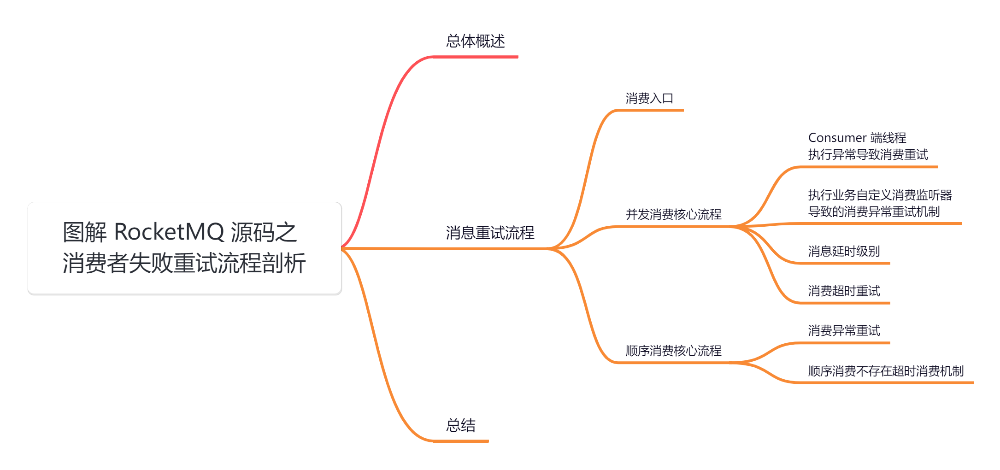

## **01 总体概述**

在前面几篇中，我们分别剖析了「**普通消息**」、「**Pop 消息**」是如何从 Broker 拉取消息的以及如何消费和消费进度存储的，可以点击以下链接进行复习。

[【消费者源码分析系列第三篇】图解 RocketMQ 源码之消费者是如何从 Broker 拉取数据](https://articles.zsxq.com/id_u91ued4dpqrp.html)

[【消费者源码分析系列第八篇】图解 RocketMQ 源码之消费者普通消费全流程剖析](https://articles.zsxq.com/id_lf0x558ptx15.html)

[【消费者源码分析系列第九篇】图解 RocketMQ 源码之消费者 Pop 消费全流程剖析](https://articles.zsxq.com/id_c2lfd7mh65k0.html)

[【消费者分析系列第十篇源码】图解 RocketMQ 源码之消费者普通消费更新与提交偏移量 Offset 操作](https://articles.zsxq.com/id_tz4q1t9qhnvq.html)

[【消费者分析系列第十一篇源码】图解 RocketMQ 源码之消费者 Pop 消费更新与提交偏移量 Offset 操作](https://articles.zsxq.com/id_zl9rd7xahz2q.html)

今天我们来深度聊聊消息消费超时/失败后是如何进行重试的？

关于消息重试在前面或多或少已经剖析过，这里我们再来重温下。

今天这篇我们只看下「**普通消息**」是如何进行消息重试的，关于「**Pop 消息**」失败重试可以自行研究下，有问题可以评论区留言沟通，也可以星球微信群交流。

## **02 消息重试流程**

我们都知道从 Broker 拉取消息成功之后，会进入到 [PullCallback#onSuccess()](http://pullcallback/#onSuccess\(\)) 方法，当拉取到消息时，首先将消息全部放入到处理队列 [ProcessQueue](http://processqueue/) 中，然后通知消费消息服务 [consumeMessageService](http://consumemessageservice/) 开始工作。

## **2.1 消费入口**

接着上面的来看 [ConsumeMessageService#submitConsumeRequest()](http://consumemessageservice/#submitConsumeRequest\(\)) 为消费者开始真正开始消费消息的入口。

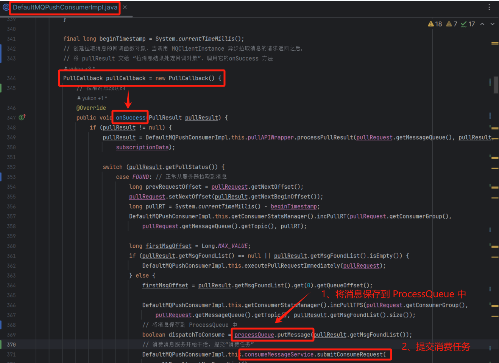

通过代码可以了解 [ConsumeMessageService](http://consumemessageservice/) 是一个接口，它有两个实现：[ConsumeMessageConcurrentlyService](http://consumemessageconcurrentlyservice/)、[ConsumeMessageOrderlyService](http://consumemessageorderlyservice/)，分别表示「**并发消费模式**」、「**顺序消费模式**」两种。

下面我们从「**并发消费**」和「**顺序消费**」两部分分别剖析消息消费超时/失败的重试机制。

## **2.2 并发消费核心流程**

接着上面 [ConsumeMessageConcurrentlyService#submitConsumeRequest()](http://consumemessageconcurrentlyservice/#submitConsumeRequest\(\)) 提交消费任务来回顾下，「**并发消费模式**」下是如何处理消息消费请求的？

[ConsumeMessageConcurrentlyService](http://consumemessageconcurrentlyservice/) 采用「**线程池**」机制对消息进行「**分批并发消费**」，默认一个消息是一批。

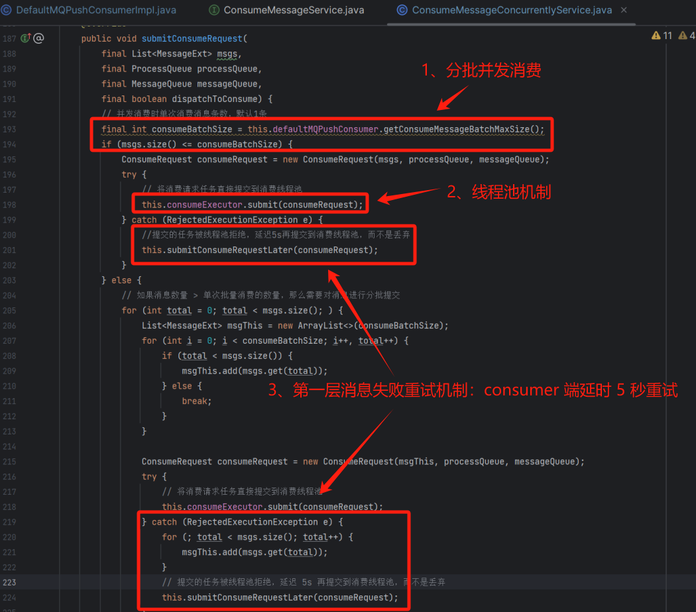

### **2.2.1 Consumer 端线程执行异常导致消费重试**

从上图我们可以看出，在「**线程池**」中执行线程任务时，如果失败 Consumer 端会延时 5s 之后「**重试**」当前消息消费任务，可以看 [ConsumeMessageConcurrentlyService#submitConsumeRequestLater()](http://consumemessageconcurrentlyservice/#submitConsumeRequestLater\(\)) 方法。

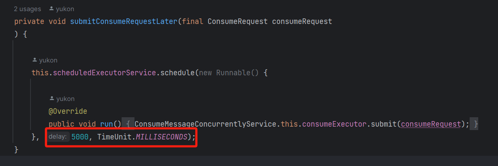

### **ConsumerRequest**

[ConsumeRequest](http://consumerequest%20/) 是 [ConsumeMessageConcurrentlyService](http://consumemessageconcurrentlyservice%20/) 的内部类。它作为一个线程任务内部封装了消息消息请求的具体执行逻辑。当拉取到消息之后会将一批消息构建为一个 [ConsumeRequest](http://consumerequest/) 对象，提交给 [consumeExecutor](http://consumeexecutor/)，由线程池异步的执行。

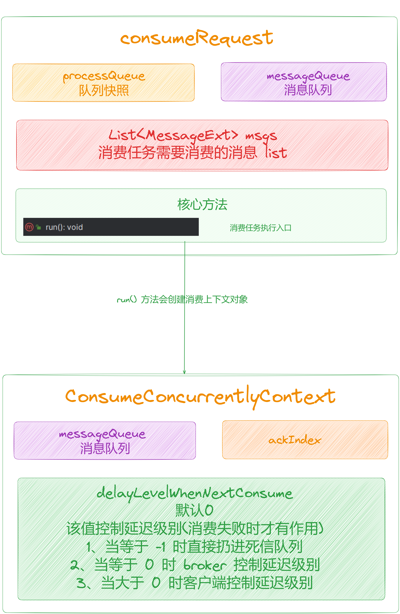

// ConsumeMessageConcurrentlyService 的子类

class ConsumeRequest implements Runnable {

// 一次消费的消息集合，默认1条消息

private final List<MessageExt> msgs;

// 消息处理队列

private final ProcessQueue processQueue;

// 消息队列

private final MessageQueue messageQueue;

// 构造函数

public ConsumeRequest(List<MessageExt> msgs, ProcessQueue processQueue, MessageQueue messageQueue) {

this.msgs = msgs;

this.processQueue = processQueue;

this.messageQueue = messageQueue;

}

// 执行并发消费

@Override

public void run() {

// 如果处理队列被丢弃，那么直接返回不再消费。

// 比如重平衡时该队列被分配给了其他新上线的消费者，尽量避免重复消费

if (this.processQueue.isDropped()) {

log.info("the message queue not be able to consume, because it's dropped. group={} {}", ConsumeMessageConcurrentlyService.this.consumerGroup, this.messageQueue);

return;

}

// 1、注册业务系统自定义的消费监听器，负责具体的消息消费；并设置消息的重试 Topic

MessageListenerConcurrently listener \= ConsumeMessageConcurrentlyService.this.messageListener;

// 创建消费上下文

ConsumeConcurrentlyContext context \= new ConsumeConcurrentlyContext(messageQueue);

ConsumeConcurrentlyStatus status \= null;

defaultMQPushConsumerImpl.tryResetPopRetryTopic(msgs, consumerGroup);

// 重置重试 topic

defaultMQPushConsumerImpl.resetRetryAndNamespace(msgs, defaultMQPushConsumer.getConsumerGroup());

// 如果有消费钩子，那么执行钩子函数的前置方法 consumeMessageBefore，我们可以注册钩子 ConsumeMessageHook 再消费消息的前后调用

ConsumeMessageContext consumeMessageContext \= null;

if (ConsumeMessageConcurrentlyService.this.defaultMQPushConsumerImpl.hasHook()) {

consumeMessageContext = new ConsumeMessageContext();

consumeMessageContext.setNamespace(defaultMQPushConsumer.getNamespace());

consumeMessageContext.setConsumerGroup(defaultMQPushConsumer.getConsumerGroup());

consumeMessageContext.setProps(new HashMap<>());

consumeMessageContext.setMq(messageQueue);

consumeMessageContext.setMsgList(msgs);

consumeMessageContext.setSuccess(false);

// consumer消费前的钩子函数，类似于Spring中的BeanPostProcessor#postProcessBeforeInitialization()方法

ConsumeMessageConcurrentlyService.this.defaultMQPushConsumerImpl.

executeHookBefore(consumeMessageContext);

}

// 开始时间戳

long beginTimestamp \= System.currentTimeMillis();

boolean hasException \= false;

// 消费返回类型，初始化为 SUCCESS

ConsumeReturnType returnType \= ConsumeReturnType.SUCCESS;

try {

if (msgs != null && !msgs.isEmpty()) {

// 循环设置每个消息的开始消费时间

for (MessageExt msg : msgs) {

MessageAccessor.setConsumeStartTimeStamp(msg, String.valueOf(System.currentTimeMillis()));

}

}

// 2、执行消费监听器的 consumeMessage() 方法，进行真正的消费消息操作

status = listener.consumeMessage(Collections.unmodifiableList(msgs), context);

} catch (Throwable e) {

log.warn(String.format("consumeMessage exception: %s Group: %s Msgs: %s MQ: %s",

UtilAll.exceptionSimpleDesc(e),

ConsumeMessageConcurrentlyService.this.consumerGroup,

msgs,

messageQueue), e);

hasException = true; // 抛出异常之后，设置异常标志位

}

// 对返回的执行状态结果进行判断处理

// 计算消费时间

long consumeRT \= System.currentTimeMillis() - beginTimestamp;

if (null == status) { // 如果状态为空

if (hasException) { // 如果业务的执行抛出了异常

returnType = ConsumeReturnType.EXCEPTION; // 设置 returnType 为 EXCEPTION

} else {

returnType = ConsumeReturnType.RETURNNULL; // 设置 returnType 为 RETURNNULL

}

// 如果消费时间 consumeRT 大于等于 consumeTimeout，默认15min

} else if (consumeRT >= defaultMQPushConsumer.getConsumeTimeout() \* 60 \* 1000) {

returnType = ConsumeReturnType.TIME\_OUT; // 设置 returnType 为 TIME\_OUT 超时

// 如果 status 为 RECONSUME\_LATER，即消费失败

} else if (ConsumeConcurrentlyStatus.RECONSUME\_LATER == status) {

returnType = ConsumeReturnType.FAILED; // 设置 returnType 为 FAILED，即消费失败

// 如果 status 为 CONSUME\_SUCCESS，即消费成功

} else if (ConsumeConcurrentlyStatus.CONSUME\_SUCCESS == status) {

returnType = ConsumeReturnType.SUCCESS; // 设置 returnType 为 SUCCESS，即消费成功

}

// 如果有钩子，则将 returnType 设置进去

if (ConsumeMessageConcurrentlyService.this.defaultMQPushConsumerImpl.hasHook()) {

consumeMessageContext.getProps().put(MixAll.CONSUME\_CONTEXT\_TYPE, returnType.name());

}

if (null == status) {

log.warn("consumeMessage return null, Group: {} Msgs: {} MQ: {}",

ConsumeMessageConcurrentlyService.this.consumerGroup,

msgs,

messageQueue);

// 将 status 设置为 RECONSUME\_LATER，即消费失败

status = ConsumeConcurrentlyStatus.RECONSUME\_LATER;

}

// 如果有消费钩子，那么执行钩子函数的后置方法 consumeMessageAfter

// 我们可以注册钩子 ConsumeMessageHook，在消费消息的前后调用

if (ConsumeMessageConcurrentlyService.this.defaultMQPushConsumerImpl.hasHook()) {

consumeMessageContext.setStatus(status.toString());

consumeMessageContext.setSuccess(ConsumeConcurrentlyStatus.CONSUME\_SUCCESS == status);

ConsumeMessageConcurrentlyService.this.defaultMQPushConsumerImpl.

executeHookAfter(consumeMessageContext);

}

// 3、统计消息消费数据

ConsumeMessageConcurrentlyService.this.getConsumerStatsManager()

.incConsumeRT(ConsumeMessageConcurrentlyService.this.consumerGroup, messageQueue.getTopic(), consumeRT);

if (!processQueue.isDropped()) {

// 4、判断消息消息是否超时、出现异常，处理消息消费结果；

ConsumeMessageConcurrentlyService.this.processConsumeResult(status, context, this);

} else {

log.warn("processQueue is dropped without process consume result. messageQueue={}, msgs={}", messageQueue, msgs);

}

}

}

这里对前面篇章的剖析进行了简化梳理，主要做四个操作：

1.  注册业务系统自定义的消费监听器，负责具体的消息消费；并设置消息的重试Topic。
2.  执行消费监听器的 [consumeMessage()](http://consumemessage\(\)%20/) 方法，进行真正的消费消息操作。
3.  统计消息消费数据。
4.  判断消息消息是否超时、出现异常，处理消息消费结果。

接下来看正题，在调用「**消息消费监听器**」后是「**如何处理消息消费超时/异常**」的？

### **2.2.2 执行业务自定义消费监听器导致的消费异常重试机制**

如果在自定义消费监听器中执行业务逻辑出现异常，会将 [hasException](http://hasexception/) 属性设置为 true，供后置的钩子函数[ConsumeMessageHook](http://consumemessagehook/)使用，且此时 status 字段为 null，在后面的逻辑中如果发现 status 字段为 null，则会将其设置为 [RECONSUME\_LATER](http://reconsume_later/) 即 「**稍后重新消费**」。最终在 [processConsumeResult()](http://processconsumeresult\(\)/) 中再根据 status 处理消费结果。

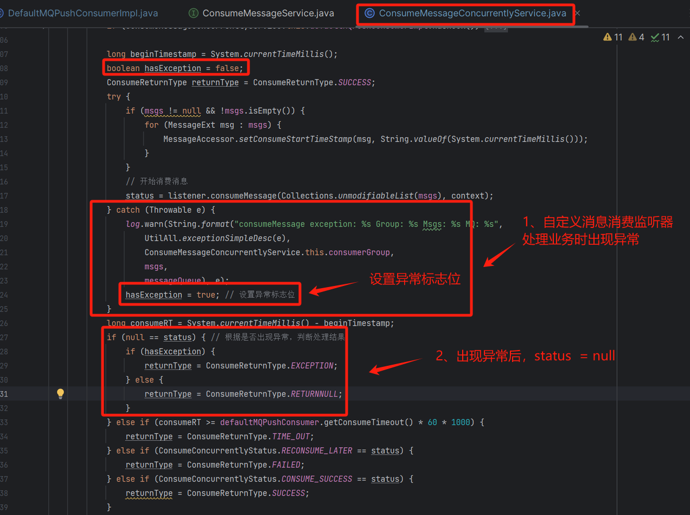

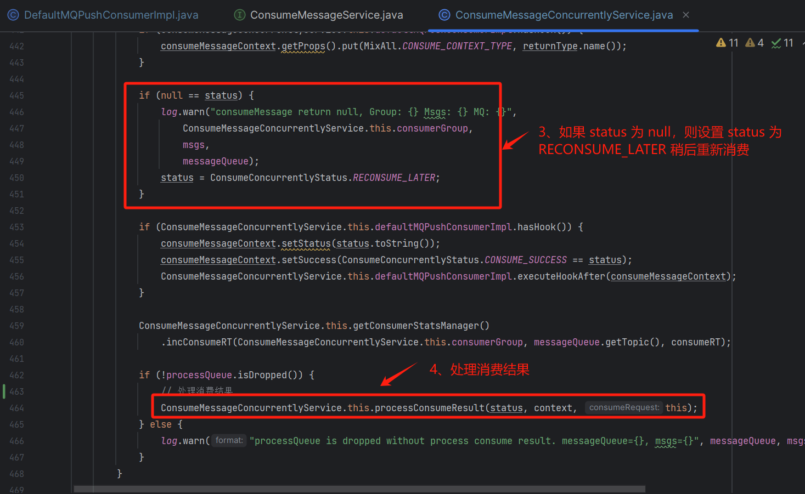

在 [processConsumeResult()](http://processconsumeresult\(\)/) 方法中会维护一个变量 [ackIndex](http://ackindex/) 表示当前消费请求中第一个「**未 ACK**」的消息在 msgs 集合中的下标，有以下三种情况处理：

1.  如果消息全部消费成功，则 [ackIndex = msgsSize + 1](http://ackindex%20=%20msgssize%20+%201/)。
2.  如果消息消费失败，则 ackIndex = -1，表示该批消息需要全部重新消费，即将消息发送回 Broker。
3.  如果发送消息回 Broker 失败，Consumer 则延时 5s 后，重新执行当前消费请求。

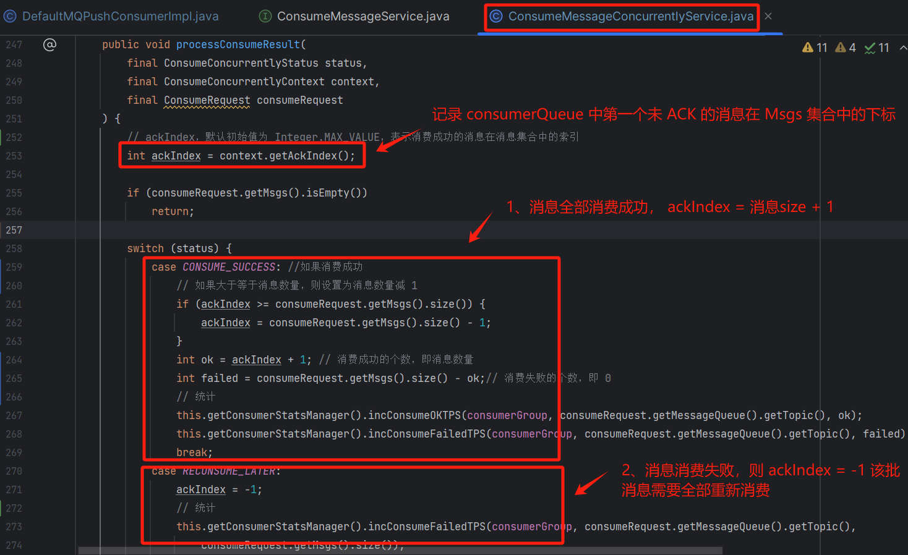

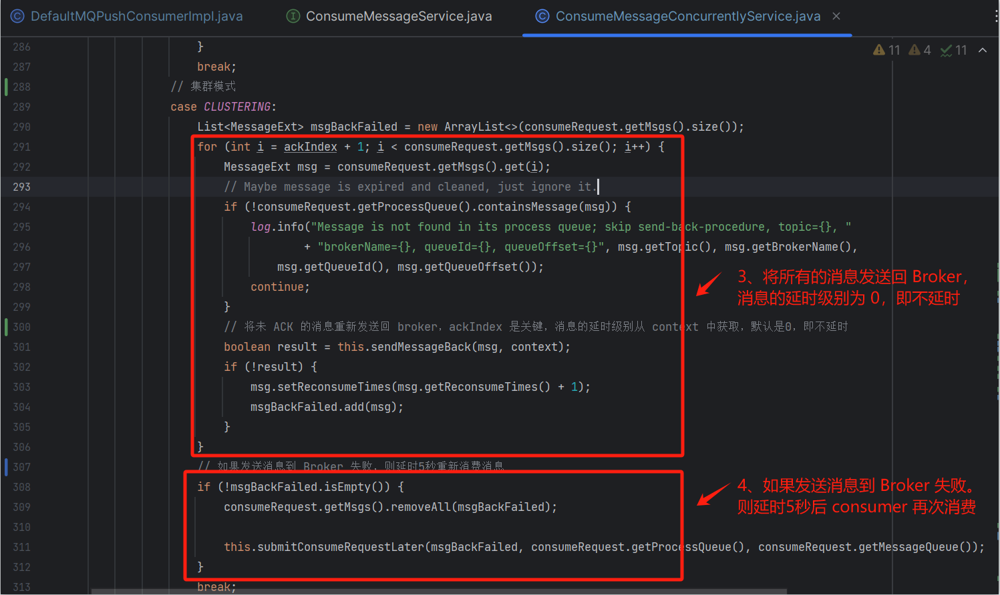

可以看到第一次发送回 Broker 的消息延时级别默认 0，而发送失败后消息延时级别为5秒。那么消息延时级别是从哪里来的呢？

### **2.2.3 消息延时级别**

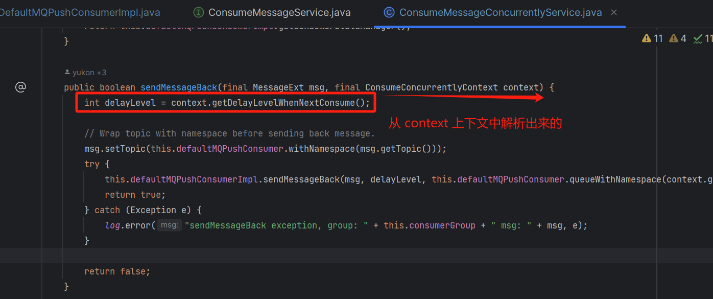

我们继续往上追，最终可以确定 [ConsumeConcurrentlyContext](http://consumeconcurrentlycontext%20/) 的来源为 [ConsumeRequest#run()](http://consumerequest/#run\(\)) 方法的开头处，并且后续未对其 [delayLevelWhenNextConsume](http://delaylevelwhennextconsume/) 属性做任何修改。

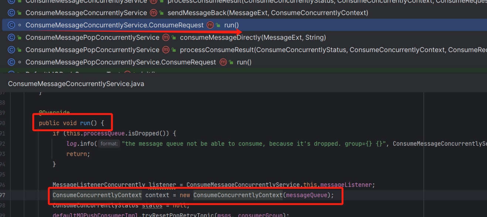

从 [ConsumeConcurrentlyContext](http://consumeconcurrentlycontext%20/) 类中也可以看到，其 [setDelayLevelWhenNextConsume()](http://setdelaylevelwhennextconsume\(\)/) 方法未被使用。

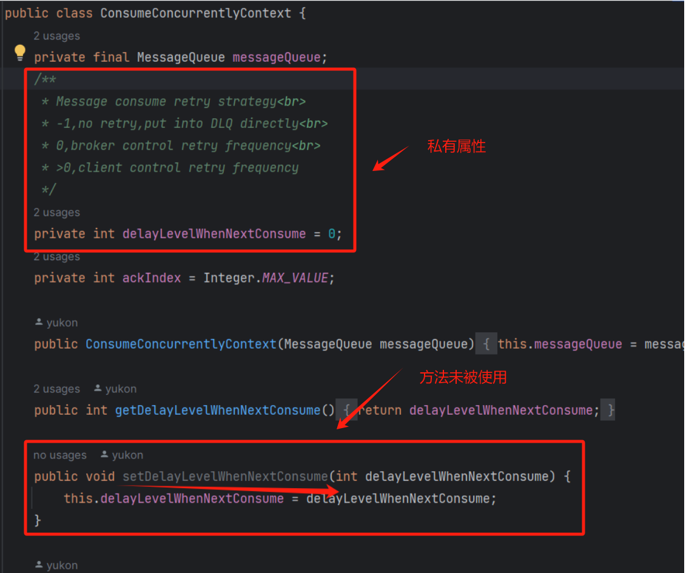

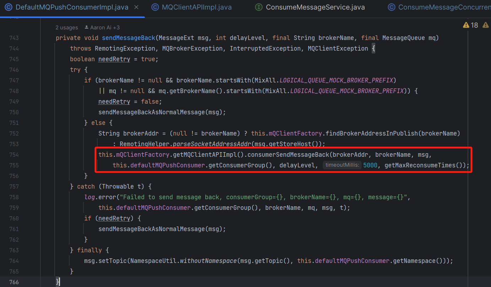

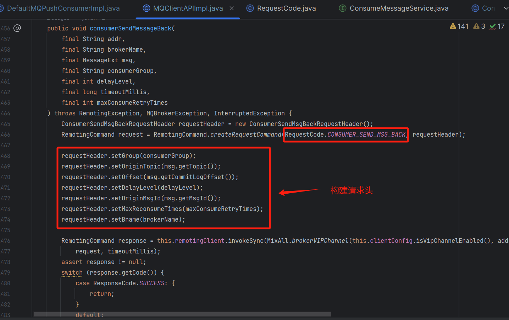

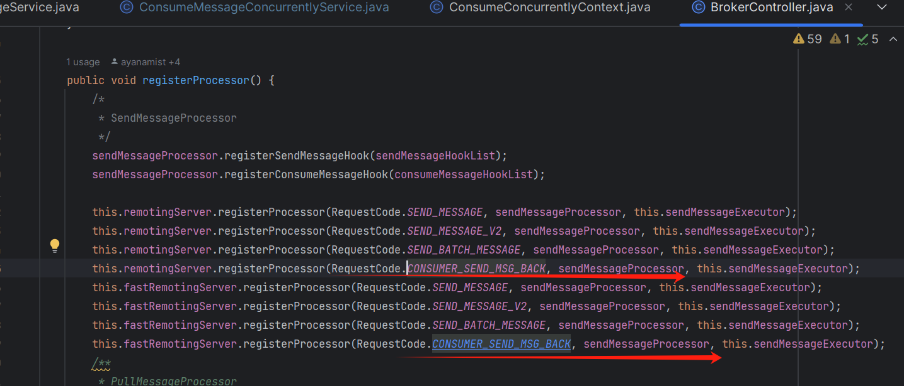

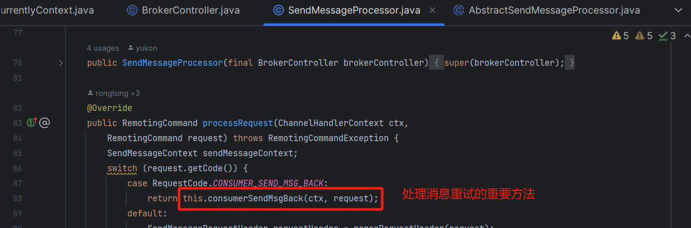

通过上述代码的追踪，最终看到 Broker 端 [SendMessageProcessor#consumerSendMsgBack()](http://sendmessageprocessor/#consumerSendMsgBack\(\)) 方法中会处理 [backMsg](http://backmsg/)。虽然 Consumer 端没有传「**延时级别**」，但 Broker 端默认将其延时级别设置为 3，然后将消息先以「**延时消息**」的机制发送到「**延时队列**」[SCHEDULE\_TOPIC\_XXXX](http://schedule_topic_xxxx/) 中，最多只会重试 16 次（可配置）。重试超过16 次会将消息添加到死信队列 [%DLQ%+消费组](http://%DLQ%+%E6%B6%88%E8%B4%B9%E7%BB%84%20) 中。待消息到达投递时间即到期后，消息转存到重试队列 [%RETRY%consumerGroup](http://%RETRY%consumerGroup) 中。

Consumer 端此时再接收到的该消息本质上就是来自 [%RETRY%+消费组名称](http://%RETRY%+%E6%B6%88%E8%B4%B9%E7%BB%84%E5%90%8D%E7%A7%B0) 的 Topic，而不是原始的 Topic。

源码位置：[https://github.com/apache/rocketmq/blob/release-5.1.2/](https://github.com/apache/rocketmq/blob/release-5.1.2/broker/src/main/java/org/apache/rocketmq/broker/processor/AbstractSendMessageProcessor.java)[broker](https://github.com/apache/rocketmq/blob/release-5.1.2/broker/src/main/java/org/apache/rocketmq/broker/processor/AbstractSendMessageProcessor.java)[/src/main/java/org/apache/rocketmq/](https://github.com/apache/rocketmq/blob/release-5.1.2/broker/src/main/java/org/apache/rocketmq/broker/processor/AbstractSendMessageProcessor.java)[broker](https://github.com/apache/rocketmq/blob/release-5.1.2/broker/src/main/java/org/apache/rocketmq/broker/processor/AbstractSendMessageProcessor.java)[/](https://github.com/apache/rocketmq/blob/release-5.1.2/broker/src/main/java/org/apache/rocketmq/broker/processor/AbstractSendMessageProcessor.java)[processor](https://github.com/apache/rocketmq/blob/release-5.1.2/broker/src/main/java/org/apache/rocketmq/broker/processor/AbstractSendMessageProcessor.java)[/](https://github.com/apache/rocketmq/blob/release-5.1.2/broker/src/main/java/org/apache/rocketmq/broker/processor/AbstractSendMessageProcessor.java)[AbstractSendMessageProcessor](https://github.com/apache/rocketmq/blob/release-5.1.2/broker/src/main/java/org/apache/rocketmq/broker/processor/AbstractSendMessageProcessor.java)[.java](https://github.com/apache/rocketmq/blob/release-5.1.2/broker/src/main/java/org/apache/rocketmq/broker/processor/AbstractSendMessageProcessor.java)

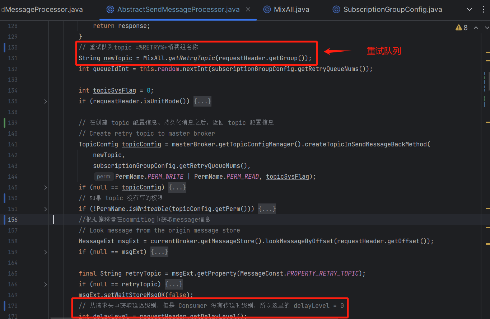

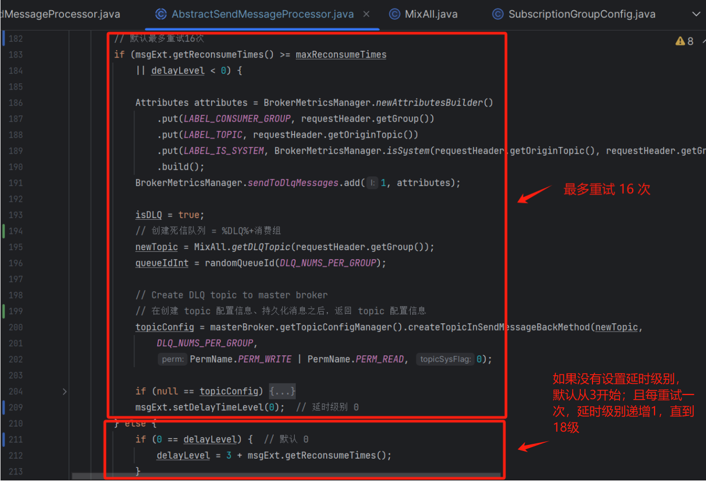

关于「**延时消息**」是如何处理的，后面会单独篇章剖析，这里就不再展开了。

### **2.2.4 消费超时重试**

从 [ConsumeRequest#run()](http://consumerequest/#run\(\)) 方法中看不到任何关于「**消费超时重试**」的处理，这里只会统计一个「**消费超时**」的状态。

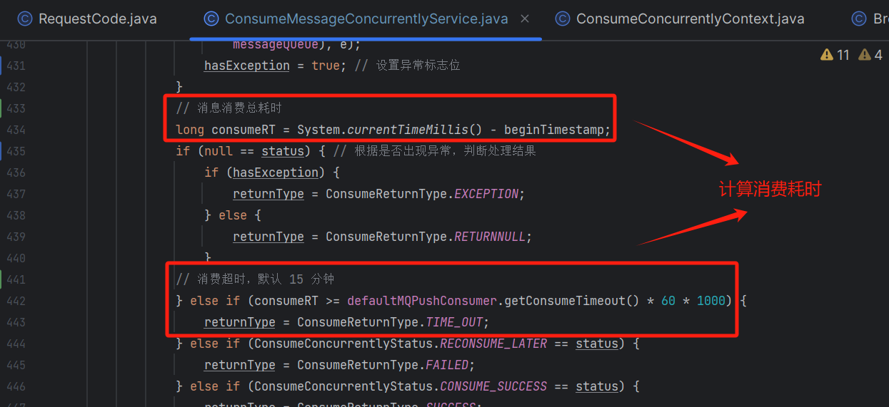

可以发现消费超时阈值的获取方式：[defaultMQPushConsumer.getConsumeTimeout()](http://defaultmqpushconsumer.getconsumetimeout\(\)/)，来看看这个方法在哪里被用到了。

发现在 [ProcessQueue#cleanExpiredMsg()](http://processqueue/#cleanExpiredMsg\(\)) 方法中有调用它，作为判断消息是否过期的阈值，也是并发消费模式下消息过期的阈值。

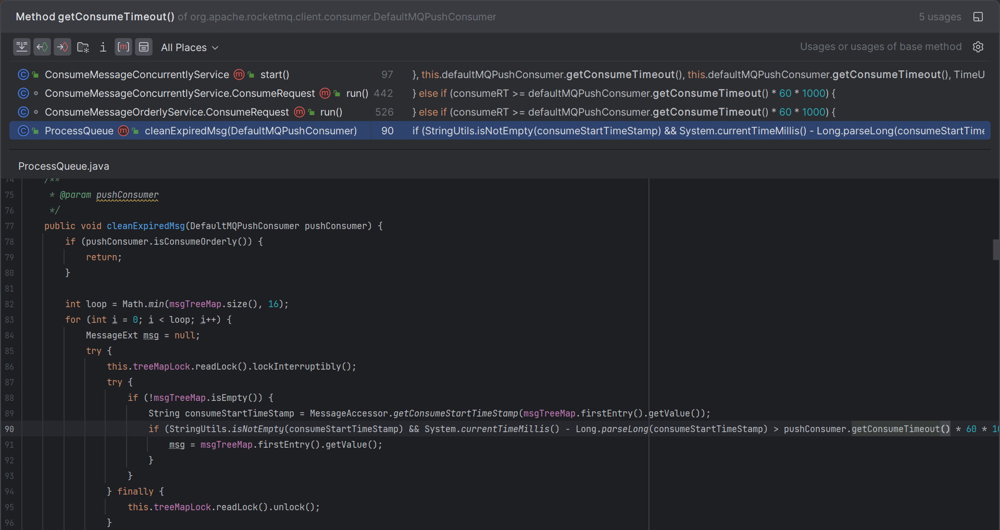

该方法中如果判断消息已经过期，会将消息在本地缓存 [msgTreeMap](http://msgtreemap/) 中清除、并以延时消息（延时级别为3）的方式发送回 Broker。

对于消费超时的消息，首先会以「**延时消息**」的机制将其发送到「**延时队列**」[SCHEDULE\_TOPIC\_XXXX](http://schedule_topic_xxxx%20/) 中，待消息到达投递时间（到期）后，消息转存到「**重试队列**」[%RETRY%consumerGroup](http://%RETRY%consumerGroup) 中。

## **2.3 顺序消费核心流程**

「**顺序消费模式**」和「**并发消费模式**」一样都存在「**消费异常重试**」的场景，但是由于「**顺序消费模式**」不会清理过期消息，所以不存在「**消费超时重试**」的场景。

### **2.3.1 消费异常重试**

与「**并发消费**」不同的是「**顺序消费**」的 [ConsumeRequest](http://consumerequest/) 只针对 [ProcessQueue](http://processqueue/) 和 [MessageQueue](http://messagequeue/)，而不是针对消息。获取消息的逻辑是直接从 [ProcessQueue](http://processqueue/) 中取，一次取 [consumeMessageBatchMaxSize](http://consumemessagebatchmaxsize/) 个（默认一个）。

「**顺序消费**」的 run() 方法的处理逻辑跟「**并发消费**」类似，但「**顺序消费**」的关键点在于消息的消费/获取的顺序性，所以就不可避免的「**引入锁机制**」。

> 顺序消费的加锁范围是针对 ProcessQueue，或者说是 MessageQueue，所以说 RocketMQ 无法做到多MessageQueue 的全局顺序消费。

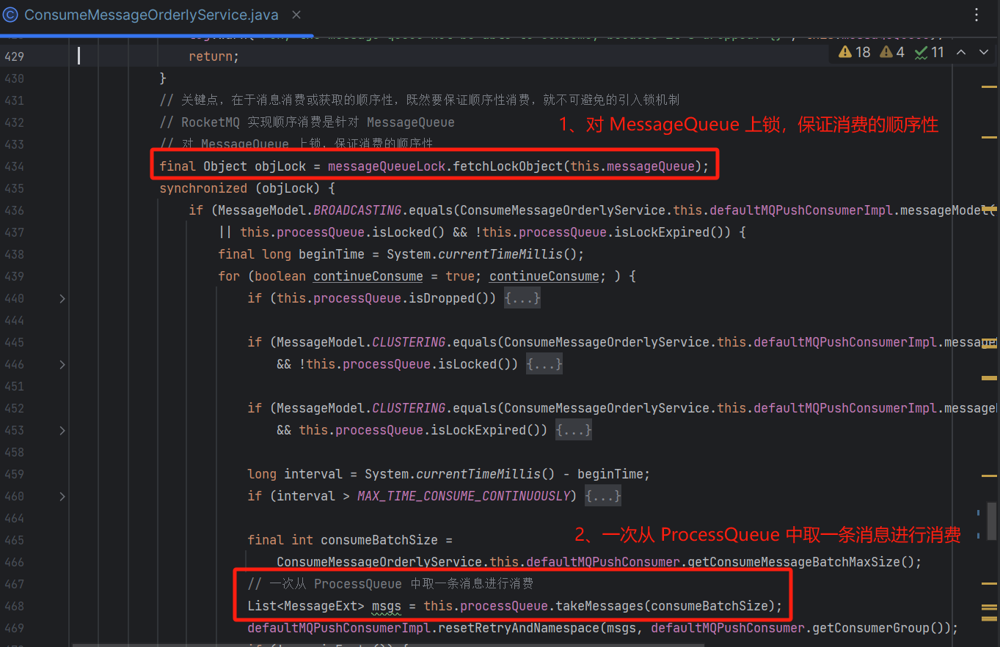

其出现异常的具体逻辑也基本和「**并发消费模式**」一样：

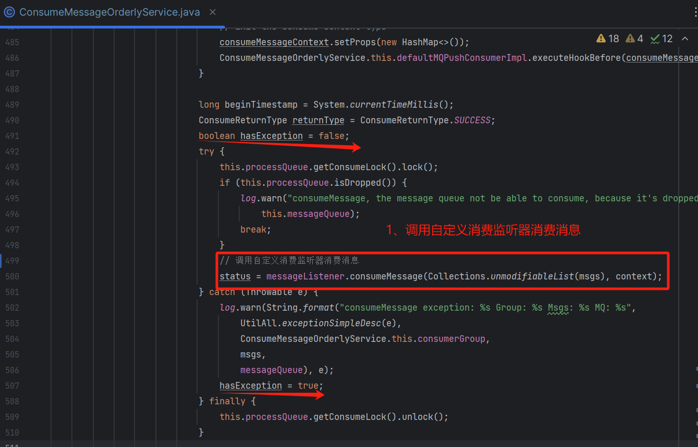

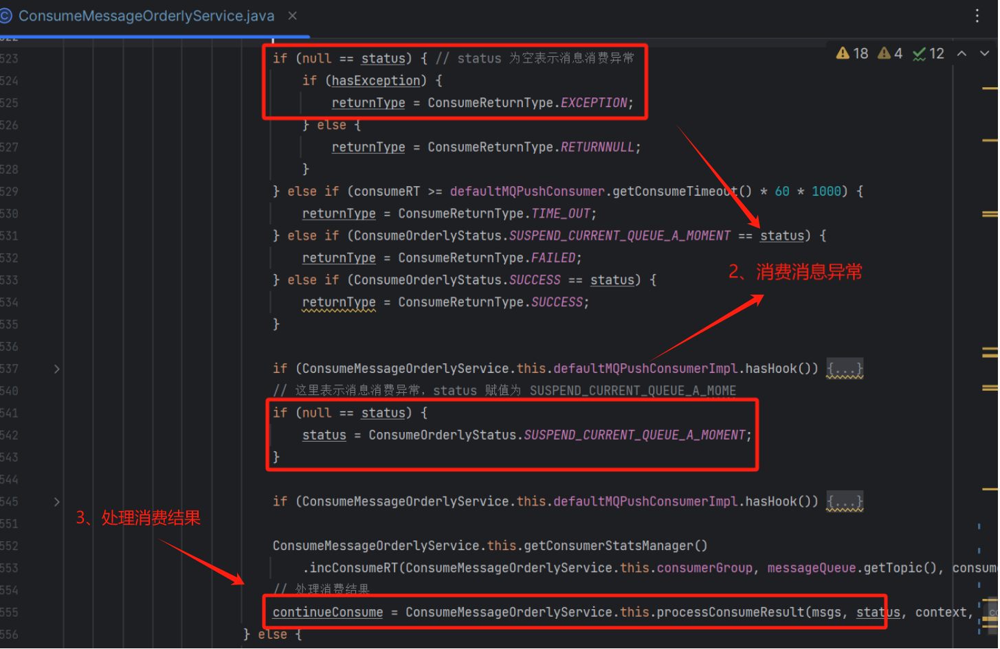

在 [processConsumeResult()](http://processconsumeresult\(\)/) 方法中，主要看非自动提交 ACK 的情况。

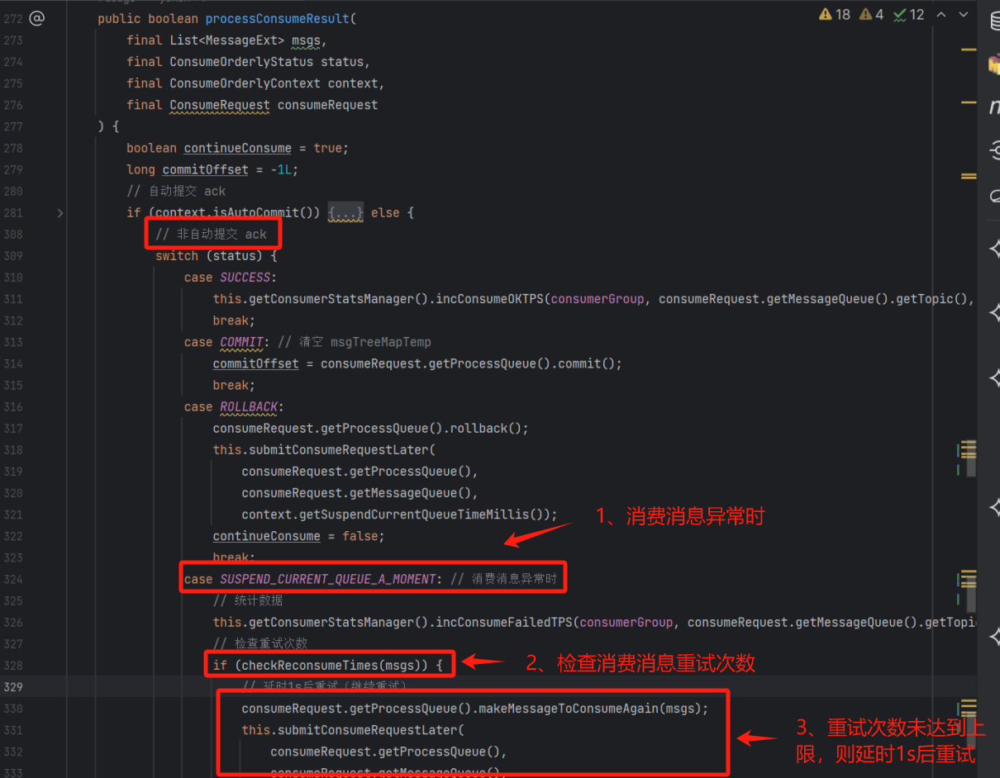

### **检查消费消息重试次数**

来看一下 [checkReconsumeTimes()](http://checkreconsumetimes\(\)/) 方法是如何判断重试次数的？

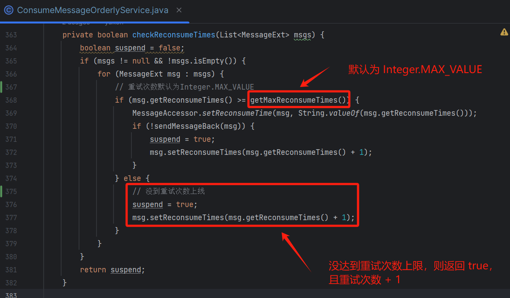

### **延时提交消费任务**

延时 1s 后，再次开启当前消费消息任务。

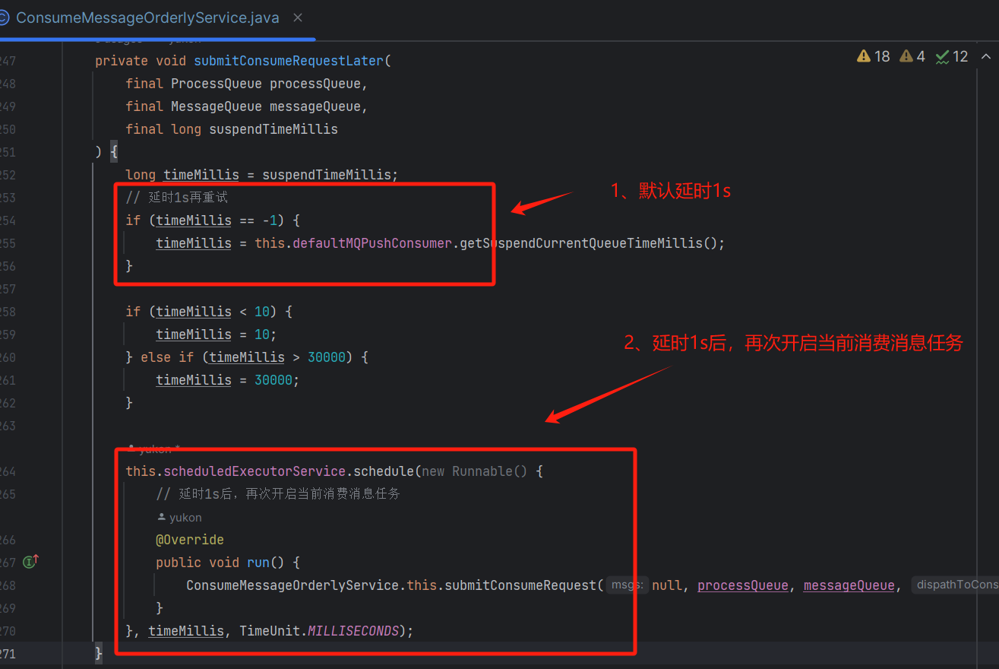

### **2.3.2 顺序消费不存在超时消费机制**

因为没有清理过期消息动作，所以不存在超时消费重试的操作。

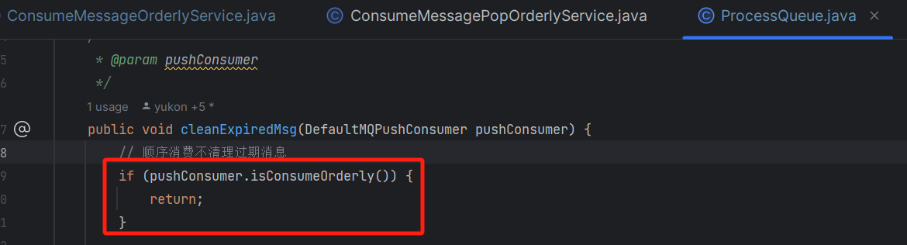

在 Consumer 启动的时候会启动消息消费服务 [consumeMessageService](http://consumemessageservice/)，对于「**并发消费模式**」来说是定期清理过期消息，而对于「**顺序消费模式**」来说是定时向 Broker 申请加锁，以确保消息的顺序消费。

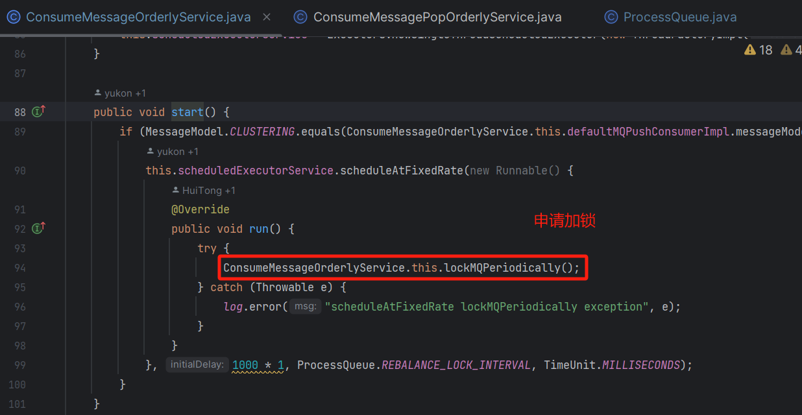

## **03 总结**

## **3.1 并发消费模式下的消费重试场景**

### **3.1.1 消费异常重试机制**

出现异常的两种场景：

1.  Consumer 端线程执行异常导致消费重试。
2.  执行业务自定义消费监听器导致的消费异常重试机制。

处理流程如下：

1.  出现异常之后会发送延时级别为 0 的消息到 Broker，由 Broker 端的[SendMessageProcessor#consumerSendMsgBack()](http://sendmessageprocessor/#consumerSendMsgBack\(\)) 方法中会对延时级别为 0 的消息将其延时级别设置为（3 + 消费重试次数）。
2.  然后将消息先以延时消息的机制发送到延时队列 [SCHEDULE\_TOPIC\_XXXX](http://schedule_topic_xxxx/) 中，最多只会重试 16 次（可配置）；当重试超过 16 次会将消息添加到死信队列 [%DLQ%+消费组](http://%DLQ%+%E6%B6%88%E8%B4%B9%E7%BB%84) 中。
3.  待消息到达投递时间（到期）后，消息转存到重试队列 [%RETRY%consumerGroup](http://%RETRY%consumerGroup) 中。
4.  Consumer 端此时再接收到的该消息本质上就是来自 [%RETRY%+消费组名称](http://%RETRY%+%E6%B6%88%E8%B4%B9%E7%BB%84%E5%90%8D%E7%A7%B0) 的 Topic，而不是原始的 Topic。

### **3.1.2 消费超时重试机制**

1.  其主要体现在「**并发消费模式**」下会周期性清理过期的消息，然后将其发送回 Broker，后面的处理逻辑和消费异常重试机制一样。
2.  最终当前消费者能再次消费到重试队列 [%RETRY%+consumerGroup](http://%RETRY%+consumerGroup) 中的消息。

## **3.2 顺序消费模式下的消费重试场景**

「**顺序消费模式**」不存在消费超时重试的机制，对于消费异常重试的逻辑基本和「**并发消费模式**」一样，区别在于，顺序消费模式遇到异常，延时 1s 后重试消费，重试次数默认为 [Integer.MAX\_VALUE](http://integer.max_value/)。