大家好，我是**华仔**, 又跟大家见面了。

从今天开始我将继续为大家奉上 RocketMQ 消费者源码剖析系列文章，正式开启「**RocketMQ 的 消费者源码之旅**」，这是第十篇，本篇我们将以「**RocketMQ 5.1.2**」版本为主，来剖析下 RocketMQ 源码之消费者重置消费位点操作流程。

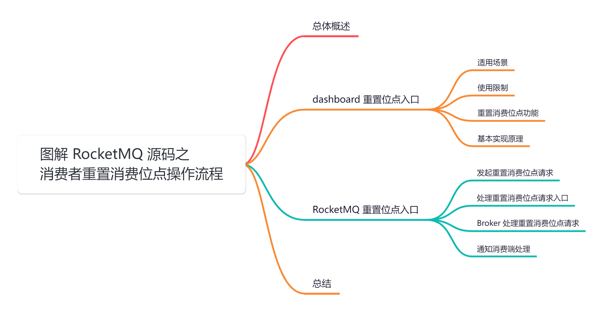

## **01 总体概述**

我们在使用 RocketMQ 消费的时候，经常会用到的一个功能就是「**根据不同的业务需求需要重置不同的消费位点**」来进行消费，这样才能达到业务的需求，但是最近在使用 RocketMQ 的重置消费位点的时候经常出现报错，所以就打算研究下 RocketMQ 是「**如何重置消费者的消费位点**」的？

带着这个问题，我们来深度剖析下今天的主角。

##   
**02 dashboard 重置位点入口**

该功能主要是在 RocketMQ 的 dashboard 页面，这里提供了两个功能，如下：

1.  重置消费位点，按照时间戳重置指定消费者组的消费位点，会按照时间戳找到最接近的消息位点，RocketMQ在存储消息时会记录消息的存入时间。
2.  跳过堆积，直接跳到最大消费位点。

  
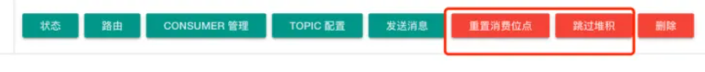

## **2.1 适用场景**

1.  **初始消费位点不符合需求**：因初始消费位点为当前队列的最大消息位点，即客户端会直接从最新消息开始消费。若业务上线时需要消费部分历史消息，您可以通过重置消费位点功能消费到指定时刻前的消息。
2.  **消费堆积快速清理**：当下游消费系统性能不足或消费速度小于生产速度时，会产生大量堆积消息。若这部分堆积消息可以丢弃，您可以通过重置消费位点快速将消费位点更新到指定位置，绕过这部分堆积的消息，减少下游处理压力。
3.  **业务回溯纠正处理**：由于业务消费逻辑出现异常，消息被错误处理。若您希望重新消费这些已被处理的消息，可以通过重置消费位点快速将消费位点更新到历史指定位置，实现消费回溯。

## **2.2 使用限制**

1.  只适合集群消费模式，并且消费者要在线。
2.  不能指定消费某一条消息。
3.  重置消费位点后消费者将直接从重置后的位点开始消费，对于回溯重置类场景，重置后的历史消息大多属于存储冷数据，可能会造成系统压力上升，一般称为冷读现象。因此，需要谨慎评估重置消费位点后的影响。建议严格控制重置消费位点接口的调用权限，避免无意义、高频次的消费位点重置。
4.  Apache RocketMQ 重置消费位点功能只能重置对消费者可见的消息，不能重置定时中、重试等待中的消息。

## **2.3 重置消费位点功能**

RocketMQ 的重置消费位点提供以下能力：

1.  重置到队列中的指定位点。
2.  重置到某一时刻对应的消费位点，匹配位点时，服务端会根据自动匹配到该时刻最接近的消费位点。

## **2.4 基本实现原理**

无论是「**重置消费位点**」还是「**跳过堆积**」功能，原理都是一样的，只是重新设置的「**消费位点**」不一样。

在集群消费模式下，broker 会存储消费者的消费进度。大体流程如下：

1.  首先找到 topic 所在的所有 broker (一般都是master 节点)，循环请求每一个 broker 进行重置消费位点。
2.  broker 端根据时间戳找到该主题下每一个逻辑队列的消费位点用来进行重置，然后找到订阅该主题的所有消费者发送请求给消费者，通知消费者用这个新的消费位点去更新。
3.  注意此时 broker 端是不会「**主动更新**」自己存储的消费者组的消费位点的。
4.  每一个消费者更新自己负责的逻辑队列的消费位点，并且同步到 broker 中，然后删除对应的 [ProcessQueue](http://processqueue/)。这里会挂起消费者，不会去拉取新的消息。
5.  由于 [ProcessQueue](http://processqueue/) 被删除，消费者下一次重平衡时会检测到，为这个逻辑队列 MessageQueue 创建一个新的[ProcessQueue](http://processqueue/)，这样该 [MessageQueue](http://messagequeue/) 的消费位点会从 broker 中获取到我们重置的消费位点。

我们来看下具体的源码实现，直接使用「**跳过堆积**」按钮，看下底层调用的哪个接口。通过接口请求我们可以看到调用的是 [skipAccumulate.do](http://skipaccumulate.do/) 接口。

「**跳过堆积**」和 「**重置消费位点**」底层逻辑是一样的，唯一的区别就是传参不同，跳过堆积前台 resetTime 传的是 -1，代表着「**最大消息位点**」。

然后我们简单看看「**跳过堆积**」参数如下：

{

"resetTime": \-1,

"consumerGroupList": \[

"gid-huazaitest-topic"

\],

"topic": "huazaitest-topic",

"force": true

}

可以看到传入了一个 gid，一个 topic，还有一个 force 为 true。我们直接全局搜索找到这个接口。

源码位置：[https://github.com/apache/rocketmq-dashboard/blob/master/src/main/java/org/apache/rocketmq/dashboard/controller/ConsumerController.java](https://github.com/apache/rocketmq-dashboard/blob/master/src/main/java/org/apache/rocketmq/dashboard/controller/ConsumerController.java)

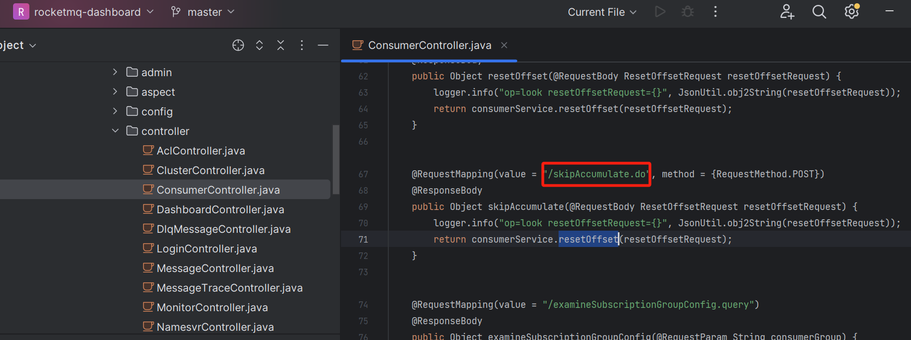

从上图可以看出这是传统的 MVC 架构，controller\-service\-serviceImpl 我们这里直接去看看它的实现类。

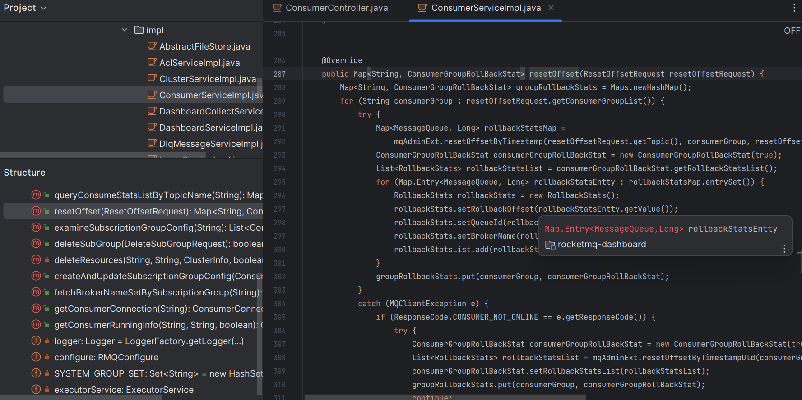

可以看到核心方法是调用 [org.apache.rocketmq.tools.admin.MQAdminExt#resetOffsetByTimestamp](http://org.apache.rocketmq.tools.admin.mqadminext/#resetOffsetByTimestamp) 方法。

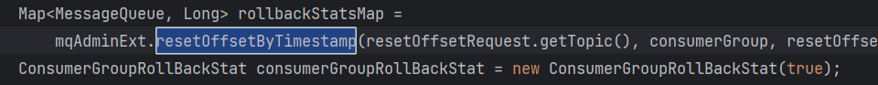

Map<MessageQueue, Long> resetOffsetByTimestamp(String topic, String group, long timestamp, boolean isForce) throws RemotingException, MQBrokerException, InterruptedException, MQClientException;

这里可以看到这几个参数：

1.  topic 和 group 我们都知道。
2.  时间戳传入的有点特殊，这里传入的是一个 -1。
3.  [isForce](http://isforce%20/) 就是表示强制是否强制重置消费进度，这里传入的是 true。
4.  当 [isForce](http://isforce/) 参数为 true 时，无论消费者当前的消费进度是否比指定的时间戳早，都会将消费进度重置为指定时间戳对应的消息。
5.  当 [isForce](http://isforce/) 参数为 false 时，只有当消费者当前的消费进度比指定的时间戳早时，才会将消费进度重置为指定时间戳对应的消息。

## **03 RocketMQ 重置位点入口**

这里直接回到 RocketMQ 源码，我们来看看 [DefaultMQAdminExtImpl#resetOffsetByTimestamp](http://defaultmqadminextimpl/#resetOffsetByTimestamp) 方法。

  
源码位置：[https://github.com/apache/rocketmq/blob/release-5.1.2/](https://github.com/apache/rocketmq/blob/release-5.1.2/tools/src/main/java/org/apache/rocketmq/tools/admin/DefaultMQAdminExtImpl.java)[tools](https://github.com/apache/rocketmq/blob/release-5.1.2/tools/src/main/java/org/apache/rocketmq/tools/admin/DefaultMQAdminExtImpl.java)[/src/main/java/org/apache/rocketmq/](https://github.com/apache/rocketmq/blob/release-5.1.2/tools/src/main/java/org/apache/rocketmq/tools/admin/DefaultMQAdminExtImpl.java)[tools/admin/DefaultMQAdminExtImpl](https://github.com/apache/rocketmq/blob/release-5.1.2/tools/src/main/java/org/apache/rocketmq/tools/admin/DefaultMQAdminExtImpl.java)[.java](https://github.com/apache/rocketmq/blob/release-5.1.2/tools/src/main/java/org/apache/rocketmq/tools/admin/DefaultMQAdminExtImpl.java)

public Map<MessageQueue, Long> resetOffsetByTimestamp(String topic, String group, long timestamp, boolean isForce,

boolean isC) throws RemotingException, MQBrokerException, InterruptedException, MQClientException {

// 1、通过 Nameserver 获取 topic 的元数据 topicRouteData

TopicRouteData topicRouteData \= this.examineTopicRouteInfo(topic);

// 2、通过 topic 的元数据 topicRouteData 获取到 topic 所在的 broker 信息

List<BrokerData> brokerDatas = topicRouteData.getBrokerDatas();

Map<MessageQueue, Long> allOffsetTable = new HashMap<>();

if (brokerDatas != null) {

// 3、遍历向所有 broker 发起重置消费位点请求

for (BrokerData brokerData : brokerDatas) {

// 获取 broker 地址主节点ip，对于主从架构只需要主节点就可以了

String addr \= brokerData.selectBrokerAddr();

if (addr != null) {

// 向 broker 发起重置消费位点请求

Map<MessageQueue, Long> offsetTable = this.mqClientInstance.getMQClientAPIImpl().invokeBrokerToResetOffset(addr, topic, group, timestamp, isForce, timeoutMillis, isC);

if (offsetTable != null) {

allOffsetTable.putAll(offsetTable);

}

}

}

}

return allOffsetTable;

}

重要步骤如下：

1.  通过 [Nameserver](http://nameserver%20/) 获取 topic 的元数据 topicRouteData。
2.  通过 topic 的元数据 [topicRouteData](http://topicroutedata%20/) 获取到 topic 所在的 broker 信息。
3.  遍历向所有 broker 发起重置消费位点请求。

我们重点看下第三步。

## **3.1 发起重置消费位点请求**

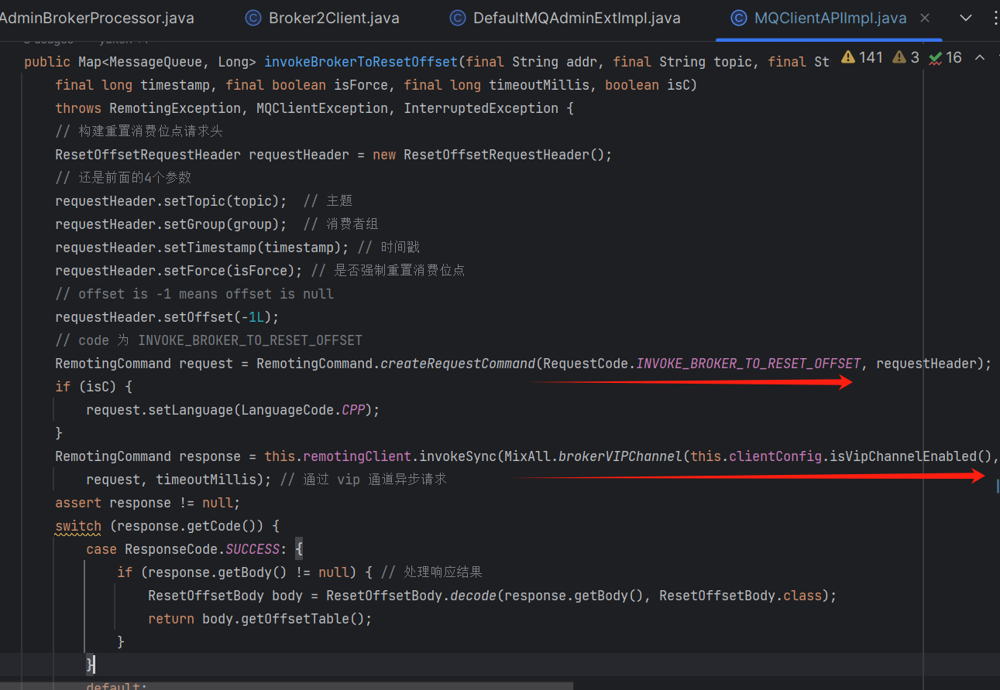

实际的逻辑肯定都封装在 broker 的，所以我们直接通过请求码 [INVOKE\_BROKER\_TO\_RESET\_OFFSET](http://invoke_broker_to_reset_offset/) 找到对应的broker 的实现逻辑。

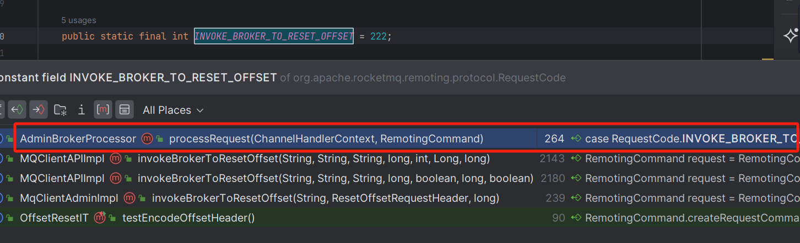

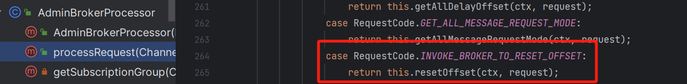

## **3.2 处理重置消费位点请求入口**

public RemotingCommand resetOffset(ChannelHandlerContext ctx,RemotingCommand request) throws RemotingCommandException {

// 从请求中解析出重置偏移量请求头部信息

final ResetOffsetRequestHeader requestHeader \= (ResetOffsetRequestHeader) request.decodeCommandCustomHeader(ResetOffsetRequestHeader.class);

....

// 如果 Broker 配置指定使用服务器端重置偏移量，默认为 false 走下面的逻辑

if (this.brokerController.getBrokerConfig().isUseServerSideResetOffset()) {

String topic \= requestHeader.getTopic();

String group \= requestHeader.getGroup();

int queueId \= requestHeader.getQueueId();

long timestamp \= requestHeader.getTimestamp();

Long offset \= requestHeader.getOffset();

// 调用内部方法进行偏移量的重置操作

return resetOffsetInner(topic,group,queueId,timestamp,offset);

}

boolean isC \= false;// 初始化是否为 C 语言客户端的标志为 false

LanguageCode language \= request.getLanguage();// 获取请求的语言代码

switch (language) { // 根据不同的语言代码进行处理

case CPP:// 如果是 C++ 语言

isC = true;// 设置为 C 语言客户端

break;

}

// 委托给 Broker2Client 重置偏移量，并返回 RemotingCommand 对象

return this.brokerController.getBroker2Client().

resetOffset(requestHeader.getTopic(),requestHeader.getGroup(),

requestHeader.getTimestamp(),requestHeader.isForce(),isC);

}

重点步骤如下：

1.  判断是否开启 broker 管理消费位点。
2.  在 5.0 之前都是由 client 管理的，为了兼容云原生，支持 http 的方式，后面都支持 broker 管理消费位点。
3.  如果不由 broker 管理消费位点则调用 [this.brokerController.getBroker2Client().resetOffset](http://this.brokercontroller.getbroker2client\(\).resetoffset%20/) 重置消费位点。

## **3.3 Broker 处理重置消费位点请求**

源码位置：[https://github.com/apache/rocketmq/blob/release-5.1.2/](https://github.com/apache/rocketmq/blob/release-5.1.2/broker/src/main/java/org/apache/rocketmq/broker/client/net/Broker2Client.java)[broker](https://github.com/apache/rocketmq/blob/release-5.1.2/broker/src/main/java/org/apache/rocketmq/broker/client/net/Broker2Client.java)[/src/main/java/org/apache/rocketmq/](https://github.com/apache/rocketmq/blob/release-5.1.2/broker/src/main/java/org/apache/rocketmq/broker/client/net/Broker2Client.java)[broker/client/net/Broker2Client](https://github.com/apache/rocketmq/blob/release-5.1.2/broker/src/main/java/org/apache/rocketmq/broker/client/net/Broker2Client.java)[.java](https://github.com/apache/rocketmq/blob/release-5.1.2/broker/src/main/java/org/apache/rocketmq/broker/client/net/Broker2Client.java)

// 重置偏移量方法，根据参数进行偏移量的重置操作

public RemotingCommand resetOffset(String topic,String group,long timeStamp,boolean isForce,boolean isC) {

// 创建响应命令对象

final RemotingCommand response \= RemotingCommand.createResponseCommand(null);

// 从 Broker 控制器中获取主题配置信息

TopicConfig topicConfig \= this.brokerController.getTopicConfigManager().selectTopicConfig(topic);

// 找不到topic信息，报错

if (null == topicConfig) {

log.error("\[reset-offset\] reset offset failed,no topic in this broker.topic={}",topic);

response.setCode(ResponseCode.SYSTEM\_ERROR);// 设置响应状态为系统错误

response.setRemark("\[reset-offset\] reset offset failed,no topic in this broker.topic=" + topic);// 设置响应的备注信息

return response;// 返回响应命令对象

}

// 创建偏移量缓存表，用于存储每个消息队列的偏移量

Map<MessageQueue,Long> offsetTable = new HashMap<>();

// 遍历所有的逻辑队列

for (int i \= 0;i < topicConfig.getWriteQueueNums();i++) {

MessageQueue mq \= new MessageQueue();// 创建消息队列对象

mq.setBrokerName(this.brokerController.getBrokerConfig().getBrokerName());// 设置消息队列的 Broker 名称

mq.setTopic(topic);// 设置消息队列的主题

mq.setQueueId(i);// 设置消息队列的队列 ID

// 获取消费者的偏移量

long consumerOffset \= this.brokerController.getConsumerOffsetManager().queryOffset(group,topic,i);

// 从这里可知广播模式不支持重置, 只有集群模式才会把消费位点存储到broker端

if (-1 == consumerOffset) {

response.setCode(ResponseCode.SYSTEM\_ERROR);// 设置响应状态为系统错误

response.setRemark(String.format("The consumer group <%s> not exist",group));// 设置响应的备注信息

return response;// 返回响应命令对象

}

// 根据时间戳获取偏移量

long timeStampOffset;

if (timeStamp == -1) { // 使用最大消息位点，跳过堆积传的就是-1

timeStampOffset = this.brokerController.getMessageStore().getMaxOffsetInQueue(topic,i);

} else { // 根据时间戳寻找一个最近的消息位点

timeStampOffset = this.brokerController.getMessageStore().getOffsetInQueueByTime(topic,i,timeStamp);

}

if (timeStampOffset < 0) {

log.warn("reset offset is invalid.topic={},queueId={},timeStampOffset={}",topic,i,timeStampOffset);

timeStampOffset = 0;// 如果时间戳偏移量无效，则设置为 0

}

// 前台传的是true，所以是可以回退的

if (isForce || timeStampOffset < consumerOffset) {

offsetTable.put(mq,timeStampOffset);// 如果是强制重置或者时间戳偏移量小于消费者偏移量，则更新偏移量表

} else {

offsetTable.put(mq,consumerOffset);// 否则使用消费者偏移量

}

}

// 创建用于发送请求的 ResetOffsetRequestHeader 对象并设置相关参数

ResetOffsetRequestHeader requestHeader \= new ResetOffsetRequestHeader();

requestHeader.setTopic(topic);

requestHeader.setGroup(group);

requestHeader.setTimestamp(timeStamp);

// 创建用于发送请求的 RemotingCommand 对象

RemotingCommand request \= RemotingCommand.createRequestCommand(RequestCode.RESET\_CONSUMER\_CLIENT\_OFFSET,requestHeader);

if (isC) {

// 如果是 C++ 语言客户端

ResetOffsetBodyForC body \= new ResetOffsetBodyForC();// 创建 C++ 语言客户端的 ResetOffsetBodyForC 对象

List<MessageQueueForC> offsetList = convertOffsetTable2OffsetList(offsetTable);// 转换偏移量表为偏移量列表

body.setOffsetTable(offsetList);// 设置偏移量列表

request.setBody(body.encode());// 设置请求的消息体为编码后的 ResetOffsetBodyForC 对象

} else {

// 如果是其他语言的客户端

ResetOffsetBody body \= new ResetOffsetBody();// 创建其他语言客户端的 ResetOffsetBody 对象

body.setOffsetTable(offsetTable);// 设置偏移量表

request.setBody(body.encode());// 设置请求的消息体为编码后的 ResetOffsetBody 对象

}

// 获取消费者组信息

ConsumerGroupInfo consumerGroupInfo \=

this.brokerController.getConsumerManager().getConsumerGroupInfo(group);

if (consumerGroupInfo != null && !consumerGroupInfo.getAllChannel().isEmpty()) {

ConcurrentMap<Channel, ClientChannelInfo> channelInfoTable =

consumerGroupInfo.getChannelInfoTable();

// 给消费者组下的每一个消费者发送请求

for (Map.Entry<Channel, ClientChannelInfo> entry : channelInfoTable.entrySet()) {

int version \= entry.getValue().getVersion();

if (version >= MQVersion.Version.V3\_0\_7\_SNAPSHOT.ordinal()) {

try {

this.brokerController.getRemotingServer().invokeOneway(entry.getKey(), request, 5000);

log.info("\[reset-offset\] reset offset success. topic={}, group={}, clientId={}",

topic, group, entry.getValue().getClientId());

} catch (Exception e) {

log.error("\[reset-offset\] reset offset exception. topic={}, group={} ,error={}",

topic, group, e.toString());

}

} else {

response.setCode(ResponseCode.SYSTEM\_ERROR);

response.setRemark("the client does not support this feature. version="

\+ MQVersion.getVersionDesc(version));

log.warn("\[reset-offset\] the client does not support this feature. channel={}, version={}",

RemotingHelper.parseChannelRemoteAddr(entry.getKey()), MQVersion.getVersionDesc(version));

return response;

}

}

} else {

String errorInfo \=

String.format("Consumer not online, so can not reset offset, Group: %s Topic: %s Timestamp: %d",

requestHeader.getGroup(),

requestHeader.getTopic(),

requestHeader.getTimestamp());

log.error(errorInfo);

response.setCode(ResponseCode.CONSUMER\_NOT\_ONLINE);

response.setRemark(errorInfo);

return response;

}

response.setCode(ResponseCode.SUCCESS);

ResetOffsetBody resBody \= new ResetOffsetBody();

resBody.setOffsetTable(offsetTable);

response.setBody(resBody.encode());

return response;

}

可以看到是获取服务端的消费位点，然后设置消费位点，然后通过发送请求通知所有 client，通知它们修改本地消费位点，所以这里重置消费位点失败有3种情况：

1.  topic不存在。
2.  消费者不存在。
3.  没有连接的消费者。

这里需要注意即使消费者有消息堆积，消费者没有连接到 broker，也是会重置消费位点失败的。 这里重置消费位点实际会通知所有 client 用新的消费位点去 broker 拉取消息而不是去修改 broker 的消费位点。

最后我们再来看看通知客户端的处理逻辑。

  
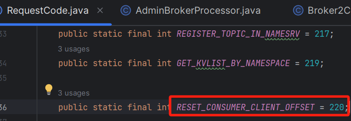

通过代码追踪可以得出，broker 请求代码为 [RequestCode.RESET\_CONSUMER\_CLIENT\_OFFSET](http://requestcode.reset_consumer_client_offset/)，消费者客户端对应的处理逻辑为 [ClientRemotingProcessor#resetOffset](http://clientremotingprocessor/#resetOffset) 方法。

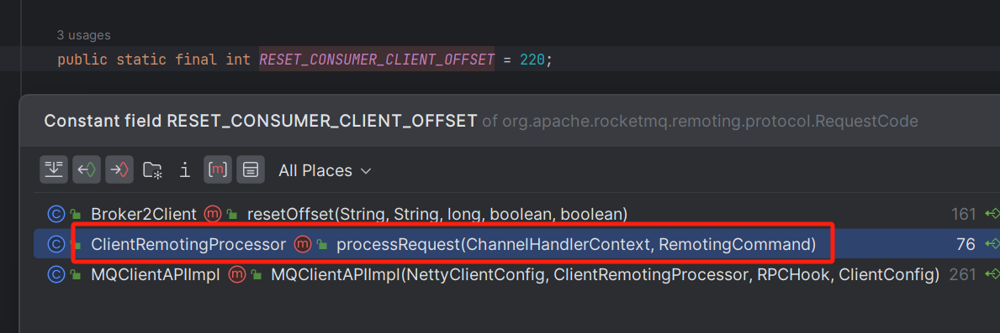

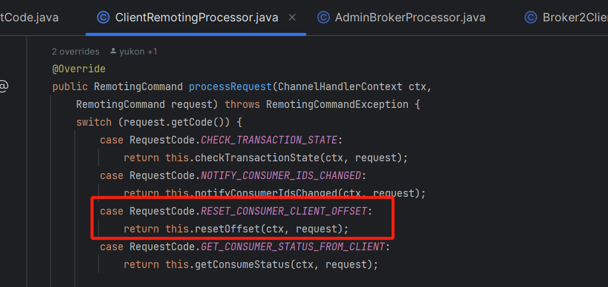

  
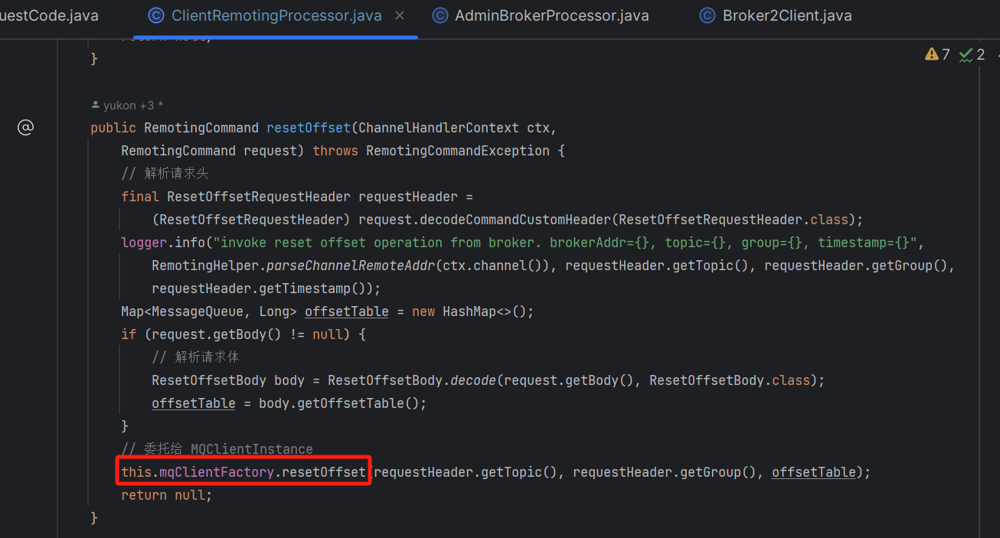

##   
**3.4 通知消费端处理**

public synchronized void resetOffset(String topic, String group, Map<MessageQueue, Long> offsetTable) {

DefaultMQPushConsumerImpl consumer \= null;

try {

// 获取对应消费者

MQConsumerInner impl \= this.consumerTable.get(group);

if (impl instanceof DefaultMQPushConsumerImpl) {

consumer = (DefaultMQPushConsumerImpl) impl;

} else {

log.info("\[reset-offset\] consumer dose not exist. group={}", group);

return;

}

// 挂起消费者, 拉取消息线程会判断该状态, 如果挂起则会等待下一次定时任务再拉消息, 也就是挂起期间不会拉取新的消息

consumer.suspend();

ConcurrentMap<MessageQueue, ProcessQueue> processQueueTable = consumer.getRebalanceImpl().getProcessQueueTable();

// 遍历快照队列

for (Map.Entry<MessageQueue, ProcessQueue> entry : processQueueTable.entrySet()) {

MessageQueue mq \= entry.getKey();

if (topic.equals(mq.getTopic()) && offsetTable.containsKey(mq)) {

ProcessQueue pq \= entry.getValue();

// 设置为true, 拉取线程将会直接结束, 消费者没有重新平衡期间, 该逻辑队列将不会有新的消息过来

pq.setDropped(true);

pq.clear();

}

}

try {

// 休眠 10 秒

TimeUnit.SECONDS.sleep(10);

} catch (InterruptedException ignored) {

}

Iterator<MessageQueue> iterator = processQueueTable.keySet().iterator();

while (iterator.hasNext()) {

MessageQueue mq \= iterator.next();

// 从 offsetTable 中获取对应消息队列 mq 的消费位点 offset

Long offset \= offsetTable.get(mq);

if (topic.equals(mq.getTopic()) && offset != null) {

try {

// 尝试更新消费者的消费位点为 offset

consumer.updateConsumeOffset(mq, offset);

// 持久化消费位点, 同步最新消费位点给broker，然后移除不必要的消息队列

consumer.getRebalanceImpl().removeUnnecessaryMessageQueue(mq, processQueueTable.get(mq));

// 删除 ProcessQueue，以便重平衡时创建新的 ProcessQueue，从 broker 端获取新的消费位点

iterator.remove();

} catch (Exception e) {

log.warn("reset offset failed. group={}, {}", group, mq, e);

}

}

}

} finally {

if (consumer != null) {

// 恢复消费者

consumer.resume();

}

}

}

整个处理逻辑如下：

1.  获取到需要重置消费位点的消费者，然后暂停消费。
2.  获取消费者的消息处理队列表 [processQueueTable](http://processqueuetable/)，遍历 [processQueueTable](http://processqueuetable%20/) 中的条目，对于满足条件的消息队列 mq，执行以下操作：
3.  将对应的消息处理队列 pq 设置为已丢弃状态。
4.  清空消息处理队列 pq。
5.  线程休眠 10 秒。
6.  再次遍历 [processQueueTable](http://processqueuetable/)，对于满足条件的消息队列 mq，执行以下操作：
7.  从 offsetTable 中获取对应消息队列 mq 的消费位点 offset。
8.  尝试更新消费者的消费位点为offset。
9.  持久化消费位点, 同步最新消费位点给broker，然后移除不必要的消息队列。
10.  删除 [ProcessQueue](http://processqueue/)，以便重平衡时创建新的 [ProcessQueue](http://processqueue/)，从 broker 端获取新的消费位点。
11.  恢复消费。

可以看到代码中间会对线程休眠10s，个人认为可能「**存在队列正在消费消息**」，虽然开头已经「**对消费者进行挂起**」，也让对应的 [ProcessQueue](http://processqueue/) 无效，只是不会有新的消息过来，想等待当前的消息消费完，不过个人认为这个时间不好把握。如果消费者消费很慢超过了 10s 之后才「**消费成功**」，这里会「**提交消费位点**」，同时定时任务把这次提交同步给了 broker。默认情况下，消费者通过「**定时任务**」每 5 秒一次将消费者内存的消费位点发送给 broker。

## **04 总结**

我们都知道 RocketMQ 领域模型为「**发布订阅模式**」，每个主题的队列都可以被多个消费者分组订阅。如果某条消息被某个消费者消费后直接被删除，则其他订阅了该主题的消费者将无法消费该消息。

因此，RocketMQ 通过「**消费位点**」管理消息的「**消费进度**」。每条消息被某个消费者消费完成后「**不会立即从队列中删除**」，RocketMQ 会基于每个消费者分组维护一份消费记录，该记录指定消费者分组消费某一个队列时，消费过的最新一条消息的位点，即消费位点。

消费位点初始值指的是消费者组「**首次启动消费者**」消费消息时，服务端保存的消费位点的初始值。而 RocketMQ 定义消费位点的初始值为消费者首次获取消息时，该时刻队列中的最大消息位点。相当于消费者将从队列中最新的消息开始消费。

当消费者客户端离线，又再次重新上线时，会严格按照服务端保存的消费进度继续处理消息。如果服务端保存的历史位点信息已过期被删除，此时消费位点向前移动至服务端存储的最小位点。

> 消费位点的保存和恢复是基于 RocketMQ 服务端的存储实现，和任何消费者无关。因此 RocketMQ 支持跨消费者的消费进度恢复。

队列中消息位点 [MinOffset](http://minoffset/)、[MaxOffset](http://maxoffset/) 和每个消费者组的消费位点 [ConsumerOffset](http://consumeroffset/) 的关系如下：

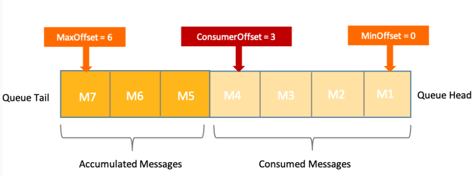

1.  ConsumerOffset≤MaxOffset：
2.  当消费速度和生产速度一致，且全部消息都处理完成时，最大消息位点和消费位点相同，即 ConsumerOffset=MaxOffset。
3.  当消费速度较慢小于生产速度时，队列中会有部分消息未消费，此时消费位点小于最大消息位点，即ConsumerOffset<MaxOffset，两者之差就是该队列中堆积的消息量。
4.  ConsumerOffset≥MinOffset：正常情况下有效的消费位点 [ConsumerOffset](http://consumeroffset/) 必然大于等于最小消息位点 [MinOffset](http://minoffset/)。消费位点小于最小消息位点时是无效的，相当于消费者要消费的消息已经从队列中删除了，是无法消费到的，此时服务端会将消费位点强制纠正到合法的消息位点。

最后我们通过一张图来梳理下整个重置消费位点的处理流程：

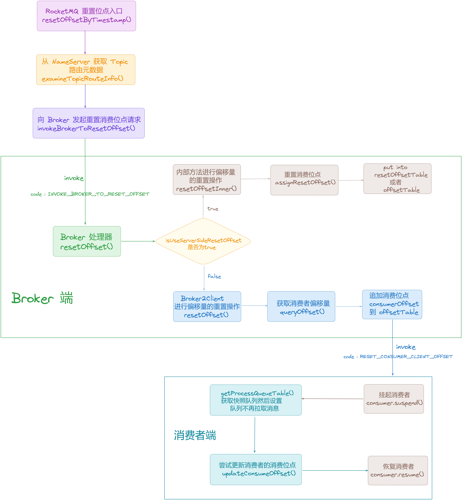