大家好，我是**华仔**, 又跟大家见面了。

从今天开始我将继续为大家奉上 RocketMQ 消费者源码剖析系列文章，正式开启「**RocketMQ 的 消费者源码之旅**」，这是第十篇，本篇我们将以「**RocketMQ 5.1.2**」版本为主，来剖析下 RocketMQ 源码之消费者普通消费更新与提交偏移量 Offset 操作。

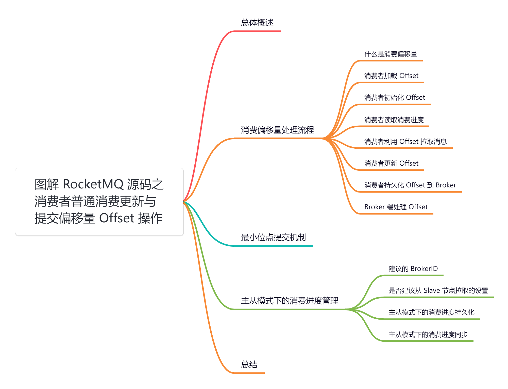

## **01 总体概述**

在 [【消费者源码分析系列第八篇】图解 RocketMQ 源码之消费者普通消费全流程剖析](https://articles.zsxq.com/id_lf0x558ptx15.html) 这篇中，我们重点剖析了普通消费者消费的全流程，包括「**顺序消息**」和 「**并发消息**」两种。

本篇我们来深度剖析消息消费完成后是如何更新与提交偏移量 Offset 的？

## **02 消费偏移量处理流程**

## **2.1 什么是消费偏移量**

在深度剖析「**消费偏移量**」更新/提交处理流程之前，我们先来了解下什么是「**消费偏移量 Offset**」?

简单来说，消费偏移量 offset 就是记录消费者的「**消费进度**」的。也是 RocketMQ 中保证消息不会重复消费的核心。当然，极端情况下还是可能会导致重复消费的。

如下图所示：

  
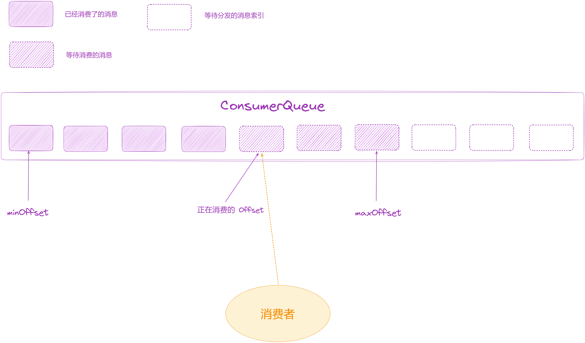

##   
**2.2 消费者加载 Offset**

在 [【消费者源码分析系列第二篇】图解 RocketMQ 源码之消费者启动流程](https://articles.zsxq.com/id_w5nzh7vnxd4u.html) 这篇中我们知道，在消费者启动时，[DefaultMQPushConsumer#start](http://defaultmqpushconsumer/#start%20) 方法内部会调用 [Offset#load](http://offset/#load) 方法初始化消费偏移量。

  
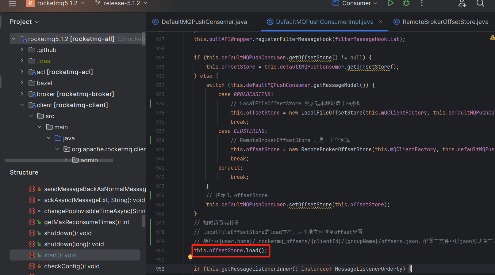

根据消费消息的模式来判断加载消费进度的，消费进度对象 [DefaultMQPushConsumerImpl#offsetStore](http://defaultmqpushconsumerimpl/#offsetStore)，OffsetStore 接口有两个子类 [LocalFileOffsetStore](http://localfileoffsetstore/) 和 [RemoteBrokerOffsetStore](http://remotebrokeroffsetstore/)，类图如下：

  
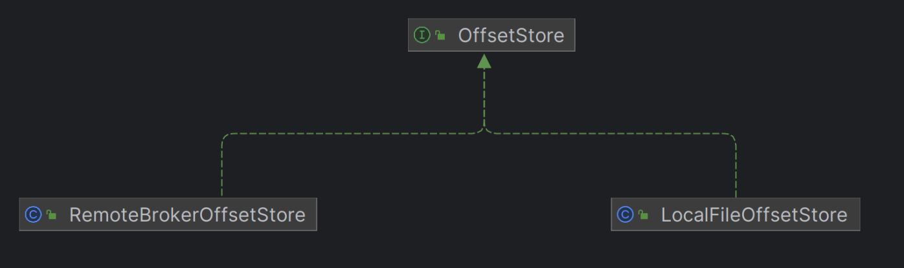

这里不展开进行深度剖析，会在后面篇章进行详细介绍。

1.  如果是广播模式 BROADCASTING， 则创建 [LocalFileOffsetStore](http://localfileoffsetstore/) 对象，将消费者的 offset 存储到本地，默认文件路径为当前用户主目录下的 [${](http://${user.home}/.rocketmq_offsets/clientId/consumerGroup/offsets.json)[user.home](http://user.home/)[}/.rocketmq\_offsets/clientId/consumerGroup/](http://${user.home}/.rocketmq_offsets/clientId/consumerGroup/offsets.json)[offsets.json](http://offsets.json/)。其中 clientId 为当前消费者id，默认为 [ip@default](http://ip@default/)，[consumerGroup](http://${user.home}/.rocketmq_offsets/clientId/consumerGroup/offsets.json)为消费者组名称。
2.  此模式下从本地读取消费进度。
3.  如果是集群模式 CLUSTERING，则创建 [RemoteBrokerOffsetStore](http://remotebrokeroffsetstore/) 对象，将消费者的 offset 存储到 broker 中，文件路径为当前用户主目录下的 [store/config/](http://store/config/consumerOffset.json)[consumerOffset.json](http://consumeroffset.json/)。
4.  此模式下获取远程存储信息，从 Broker 中获取消费进度，在该模式下 [offsetTable](http://offsettable/) 将需要提交的 [MessageQueue](http://messagequeue/) 的 offset 信息通过 [MQClientAPIImpl#updateConsumerOffsetOneway()](http://mqclientapiimpl/#updateConsumerOffsetOneway\(\)) 提交到 broker 进行长久化存储。而 consumer 的 shutdown() 办法会被动触发一次 offset 持久化到 broker 的操作。

该数据结构主要是消费者本地来存储和记录消息的消费进度。

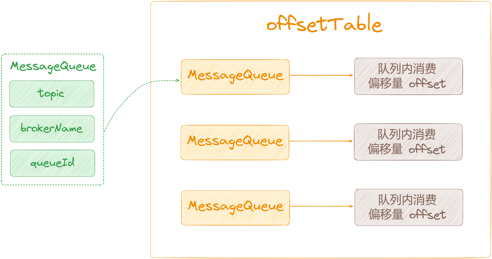

根据不同消费消息的模式获取到偏移量对象 [DefaultMQPushConsumerImpl#offsetStore](http://defaultmqpushconsumerimpl/#offsetStore) 后，开始加载消息进度。

这里我们先来看下 [LocalFileOffsetStore](http://localfileoffsetstore/) 的加载消费进度方法。

源码位置：[https://github.com/apache/rocketmq/blob/release-5.1.2/](https://github.com/apache/rocketmq/blob/release-5.1.2/client/src/main/java/org/apache/rocketmq/client/consumer%5Cstore%5CLocalFileOffsetStore.java)[client](https://github.com/apache/rocketmq/blob/release-5.1.2/client/src/main/java/org/apache/rocketmq/client/consumer%5Cstore%5CLocalFileOffsetStore.java)[/src/main/java/org/apache/rocketmq/](https://github.com/apache/rocketmq/blob/release-5.1.2/client/src/main/java/org/apache/rocketmq/client/consumer%5Cstore%5CLocalFileOffsetStore.java)[client](https://github.com/apache/rocketmq/blob/release-5.1.2/client/src/main/java/org/apache/rocketmq/client/consumer%5Cstore%5CLocalFileOffsetStore.java)[/](https://github.com/apache/rocketmq/blob/release-5.1.2/client/src/main/java/org/apache/rocketmq/client/consumer%5Cstore%5CLocalFileOffsetStore.java)[consumer\\store\\LocalFileOffsetStore](https://github.com/apache/rocketmq/blob/release-5.1.2/client/src/main/java/org/apache/rocketmq/client/consumer%5Cstore%5CLocalFileOffsetStore.java)[.java](https://github.com/apache/rocketmq/blob/release-5.1.2/client/src/main/java/org/apache/rocketmq/client/consumer%5Cstore%5CLocalFileOffsetStore.java)

// 加载本地磁盘中的数据

public class LocalFileOffsetStore implements OffsetStore {

// 本地存储文件位置

public final static String LOCAL\_OFFSET\_STORE\_DIR \= System.getProperty(

"rocketmq.client.localOffsetStoreDir",

System.getProperty("user.home") + File.separator + ".rocketmq\_offsets");

// 存储队列内的消费偏移量

private ConcurrentMap<MessageQueue, AtomicLong> offsetTable =

new ConcurrentHashMap<>();

@Override

// 广播消费模式下，从本地文件恢复offset配置。

// 从本地文件恢复offset配置，地址为{user.home}/.rocketmq\_offsets/{clientId}/{groupName}/offsets.json，配置在文件中以json形式存在。

public void load() throws MQClientException {

//加载本地offset文件 地址为{user.home}/.rocketmq\_offsets/{clientId}/{groupName}/offsets.json

//配置在文件中以json形式存在

OffsetSerializeWrapper offsetSerializeWrapper \= this.readLocalOffset();

if (offsetSerializeWrapper != null && offsetSerializeWrapper.getOffsetTable() != null) {

// 写入本地偏移量缓存表中

offsetTable.putAll(offsetSerializeWrapper.getOffsetTable());

for (Entry<MessageQueue, AtomicLong> mqEntry : offsetSerializeWrapper.getOffsetTable().entrySet()) {

AtomicLong offset \= mqEntry.getValue();

// 打印日志

log.info("load consumer's offset, {} {} {}",

this.groupName,

mqEntry.getKey(),

offset.get());

}

}

}

}

// 从本地文件读取消费进度

private OffsetSerializeWrapper readLocalOffset() throws MQClientException {

String content \= null;

try {

// 从本地文件读取消费进度

content = MixAll.file2String(this.storePath);

} catch (IOException e) {

log.warn("Load local offset store file exception", e);

}

if (null == content || content.length() == 0) {

return this.readLocalOffsetBak(); // 读备份

} else {

OffsetSerializeWrapper offsetSerializeWrapper \= null;

try {

// 转换成 json 格式数据

offsetSerializeWrapper =

OffsetSerializeWrapper.fromJson(content, OffsetSerializeWrapper.class);

} catch (Exception e) {

log.warn("readLocalOffset Exception, and try to correct", e);

return this.readLocalOffsetBak();

}

return offsetSerializeWrapper;

}

}

而 [RemoteBrokerOffsetStore](http://remotebrokeroffsetstore/) 的加载消费进度方法 load 方法则是一个空实现。

源码位置：[https://github.com/apache/rocketmq/blob/release-5.1.2/](https://github.com/apache/rocketmq/blob/release-5.1.2/client/src/main/java/org/apache/rocketmq/client/consumer%5Cstore%5CRemoteBrokerOffsetStore.java)[client](https://github.com/apache/rocketmq/blob/release-5.1.2/client/src/main/java/org/apache/rocketmq/client/consumer%5Cstore%5CRemoteBrokerOffsetStore.java)[/src/main/java/org/apache/rocketmq/](https://github.com/apache/rocketmq/blob/release-5.1.2/client/src/main/java/org/apache/rocketmq/client/consumer%5Cstore%5CRemoteBrokerOffsetStore.java)[client](https://github.com/apache/rocketmq/blob/release-5.1.2/client/src/main/java/org/apache/rocketmq/client/consumer%5Cstore%5CRemoteBrokerOffsetStore.java)[/](https://github.com/apache/rocketmq/blob/release-5.1.2/client/src/main/java/org/apache/rocketmq/client/consumer%5Cstore%5CRemoteBrokerOffsetStore.java)[consumer\\store\\RemoteBrokerOffsetStore](https://github.com/apache/rocketmq/blob/release-5.1.2/client/src/main/java/org/apache/rocketmq/client/consumer%5Cstore%5CRemoteBrokerOffsetStore.java)[.java](https://github.com/apache/rocketmq/blob/release-5.1.2/client/src/main/java/org/apache/rocketmq/client/consumer%5Cstore%5CRemoteBrokerOffsetStore.java)

public class RemoteBrokerOffsetStore implements OffsetStore {

private final static Logger log \= LoggerFactory.getLogger(RemoteBrokerOffsetStore.class);

private final MQClientInstance mQClientFactory;

private final String groupName; // 消费者组

// 存储队列内的消费偏移量

private ConcurrentMap<MessageQueue, AtomicLong> offsetTable =

new ConcurrentHashMap<>();

public RemoteBrokerOffsetStore(MQClientInstance mQClientFactory, String groupName) {

this.mQClientFactory = mQClientFactory;

this.groupName = groupName;

}

@Override

public void load() {

}

....

}

## **2.3 消费者初始化 Offset**

offset 初始化和「**重平衡**」息息相关，那么我们先就看下重平衡是如何完成 offset 初始化的。

> 这里只讨论集群消费模式的偏移量操作。因为广播模式每个消费者都要消费 topic 下的所有队列，而集群模式是通过分配算法来将 topic 下的所有队列分配给消费者。

在 [【消费者源码分析系列第五篇】图解 RocketMQ 源码之重平衡机制全流程剖析](https://articles.zsxq.com/id_zbetnohgudbt.html) 这篇中已经剖析过重平衡处理流程，这里我们就只看和 offset 初始化相关的部分。

  
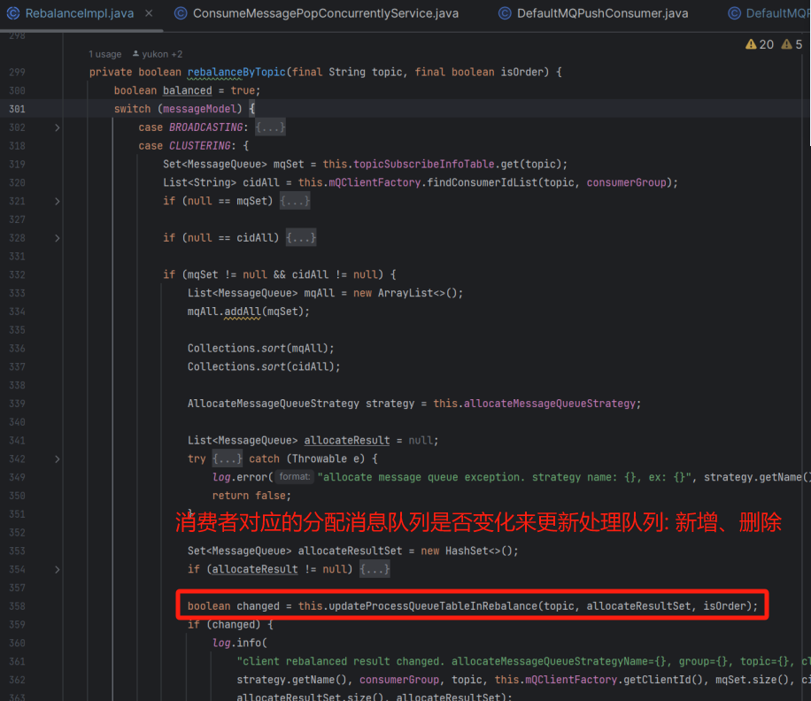

源码位置：[https://github.com/apache/rocketmq/blob/release-5.1.2/](https://github.com/apache/rocketmq/blob/release-5.1.2/client/src/main/java/org/apache/rocketmq/client/impl%5Cconsumer%5CRebalanceImpl.java)[client](https://github.com/apache/rocketmq/blob/release-5.1.2/client/src/main/java/org/apache/rocketmq/client/impl%5Cconsumer%5CRebalanceImpl.java)[/src/main/java/org/apache/rocketmq/](https://github.com/apache/rocketmq/blob/release-5.1.2/client/src/main/java/org/apache/rocketmq/client/impl%5Cconsumer%5CRebalanceImpl.java)[client](https://github.com/apache/rocketmq/blob/release-5.1.2/client/src/main/java/org/apache/rocketmq/client/impl%5Cconsumer%5CRebalanceImpl.java)[/](https://github.com/apache/rocketmq/blob/release-5.1.2/client/src/main/java/org/apache/rocketmq/client/impl%5Cconsumer%5CRebalanceImpl.java)[impl\\consumer\\RebalanceImpl](https://github.com/apache/rocketmq/blob/release-5.1.2/client/src/main/java/org/apache/rocketmq/client/impl%5Cconsumer%5CRebalanceImpl.java)[.java](https://github.com/apache/rocketmq/blob/release-5.1.2/client/src/main/java/org/apache/rocketmq/client/impl%5Cconsumer%5CRebalanceImpl.java)

// 处理队列表，KEY为消息队列，VALUE为对应的处理信息

protected final ConcurrentMap<MessageQueue, ProcessQueue> processQueueTable = new ConcurrentHashMap<MessageQueue, ProcessQueue>(64);

/\*\*

\* 消费者对应的分配消息队列是否变化

\* @param topic 当前要进行重平衡的主题

\* @param mqSet 记录了重新分配给当前消费者的消息队列

\* @param isOrder 是否顺序

\* @return true变化；false未改变

\*/

private boolean updateProcessQueueTableInRebalance(final String topic, final Set<MessageQueue> mqSet,

final boolean isOrder) {

boolean changed \= false;

.

....

// add new message queue 遍历本次负载均衡分配的消费队列，缓存表中没有则新增的消费队列

boolean allMQLocked \= true; // 消费队列是否有锁定（顺序消息使用）

// 创建拉取请求集合

List<PullRequest> pullRequestList = new ArrayList<>();

/\*\*

\* 遍历本次负载分配到的队列集合，如果 processQueueTable 中没有包含该消息队列，表明这是本次新增加的消息队列，首先从内存中移除该消息队列的消费进度，然后从磁盘中读取该消息队列的消费进度，创建PullRequest对象。这里有一个关键，如果读取到的消费进度小于0，则需要校对消费进度。RocketMQ 提供了CONSUME\_FROM\_LAST\_OFFSET、CONSUME\_FROM\_FIRST\_OFFSET、CONSUME\_FROM\_TIMESTAMP 几种方式，在创建消费者时可以通过调用 DefaultMQPushConsumer#setConsumeFromWhere 方法进行设置

\*/

for (MessageQueue mq : mqSet) {

// 如果之前不在processQueueTable中则新增的消费队列

if (!this.processQueueTable.containsKey(mq)) {

/\*\*

\* 经过消息队列重平衡（分配）后，分配到新的消息队列时，首先需要尝试向 Broker 发起锁定该消息队列的请求，如果返回加锁成功，则创建该消息队列的拉取任务，否则跳过，等待其他消费者释放该消息队列的锁，然后在下一次队列重平衡时再尝试加锁

\*/

// 如果是顺序消息，则尝试向 Broker 请求锁定该消费队列，锁定失败延迟重平衡

if (isOrder && !this.lock(mq)) {

log.warn("doRebalance, {}, add a new mq failed, {}, because lock failed", consumerGroup, mq);

allMQLocked = false;

continue;

}

// 删除内存中该消费队列的消费进度

this.removeDirtyOffset(mq);

// 创建 ProcessQueue 的消费队列

ProcessQueue pq \= createProcessQueue(topic);

pq.setLocked(true);

// 计算消息拉取偏移量，从磁盘中获取该消费队列的消费进度(如果进度<0时，则根据配置矫正消费进度)，创建拉取消息请求

// PullRequest#nextOffset 计算逻辑位于 RebalancePushImpl#computePullFromWhere

long nextOffset \= this.computePullFromWhere(mq);

if (nextOffset >= 0) { // 如果偏移量大于等于0

// 放入处理队列表中

ProcessQueue pre \= this.processQueueTable.putIfAbsent(mq, pq);

if (pre != null) { // 如果之前已经存在，不需要进行处理

log.info("doRebalance, {}, mq already exists, {}", consumerGroup, mq);

} else {

// 如果之前不存在，构建PullRequest，之后会加入到阻塞队列中，进行消息拉取

log.info("doRebalance, {}, add a new mq, {}", consumerGroup, mq);

PullRequest pullRequest \= new PullRequest();

pullRequest.setConsumerGroup(consumerGroup); // 设置消费组

pullRequest.setNextOffset(nextOffset);// 设置拉取偏移量

pullRequest.setMessageQueue(mq);// 设置消息队列

pullRequest.setProcessQueue(pq);// 设置处理队列

pullRequestList.add(pullRequest);// 加入到拉取消息请求集合

changed = true;

}

} else {

log.warn("doRebalance, {}, add new mq failed, {}", consumerGroup, mq);

}

}

}

// 锁定消费队列失败，延迟重平衡

if (!allMQLocked) {

mQClientFactory.rebalanceLater(500);

}

// 将 PullRequest 加入 PullMessageService，以便唤醒 PullMessageService 线程进行拉取消息任务

this.dispatchPullRequest(pullRequestList, 500);

return changed;

}

此处「**初始化 Offset**」的地方底层调用的是 [RebalancePushImpl#computePullFromWhere(mq)](http://rebalancepushimpl/#computePullFromWhere\(mq\)) 方法，如下：

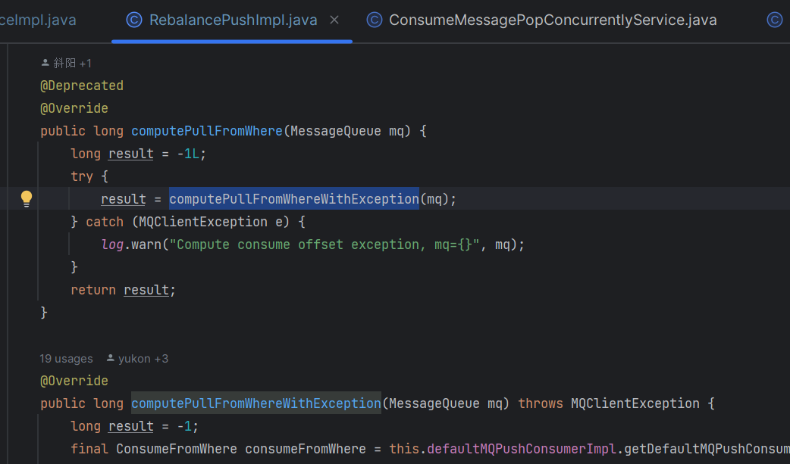

@Override

public long computePullFromWhereWithException(MessageQueue mq) throws MQClientException {

long result \= -1;

final ConsumeFromWhere consumeFromWhere \= this.defaultMQPushConsumerImpl.getDefaultMQPushConsumer().getConsumeFromWhere();

// 获取 offsetStore

final OffsetStore offsetStore \= this.defaultMQPushConsumerImpl.getOffsetStore();

switch (consumeFromWhere) {

case CONSUME\_FROM\_LAST\_OFFSET\_AND\_FROM\_MIN\_WHEN\_BOOT\_FIRST:

case CONSUME\_FROM\_MIN\_OFFSET:

case CONSUME\_FROM\_MAX\_OFFSET:

// 从队列最新偏移量开始消费

case CONSUME\_FROM\_LAST\_OFFSET: {

// 从远程中读取消息队列的消费进度

long lastOffset \= offsetStore.readOffset(mq, ReadOffsetType.READ\_FROM\_STORE);

if (lastOffset >= 0) { // 如果大于 0 则直接返回

result = lastOffset;

}

// First start,no offset

else if (-1 == lastOffset) {

if (mq.getTopic().startsWith(MixAll.RETRY\_GROUP\_TOPIC\_PREFIX)) {

result = 0L;

} else {

try {

// 如果等于 -1，在 CONSUME\_FROM\_LAST\_OFFSET 模式下获取该消息队列当前最大的偏移量

result = this.mQClientFactory.getMQAdminImpl().maxOffset(mq);

} catch (MQClientException e) {

log.warn("Compute consume offset from last offset exception, mq={}, exception={}", mq, e);

throw e;

}

}

} else {

// 如果小于-1，表示该消息进度文件中存储了错误的偏移量，则返回-1

throw new MQClientException(ResponseCode.QUERY\_NOT\_FOUND, "Failed to query consume offset from " + "offset store");

}

break;

}

// 从头开始消费

case CONSUME\_FROM\_FIRST\_OFFSET: {

// 从磁盘中读取消息队列的消费进度

long lastOffset \= offsetStore.readOffset(mq, ReadOffsetType.READ\_FROM\_STORE);

if (lastOffset >= 0) { // 如果大于0则直接返回

result = lastOffset;

} else if (-1 == lastOffset) { // 如果等于 -1，在 CONSUME\_FROM\_FIRST\_OFFSET 模式下直接返回 0，从头开始消费

//the offset will be fixed by the OFFSET\_ILLEGAL process

result = 0L;

} else {

// 如果小于-1，表示该消息进度文件中存储了错误的偏移量，则返回-1

throw new MQClientException(ResponseCode.QUERY\_NOT\_FOUND, "Failed to query offset from offset " + "store");

}

break;

}

// 从消费者启动时间戳对应消费进度开始消费

case CONSUME\_FROM\_TIMESTAMP: {

// 从磁盘中读取消息队列的消费进度

long lastOffset \= offsetStore.readOffset(mq, ReadOffsetType.READ\_FROM\_STORE);

if (lastOffset >= 0) { // 如果大于0则直接返回

result = lastOffset;

} else if (-1 == lastOffset) {

// 如果等于-1，能找到则返回找到的偏移量，否则返回 0

if (mq.getTopic().startsWith(MixAll.RETRY\_GROUP\_TOPIC\_PREFIX)) {

try {

result = this.mQClientFactory.getMQAdminImpl().maxOffset(mq);

} catch (MQClientException e) {

log.warn("Compute consume offset from last offset exception, mq={}, exception={}", mq, e);

throw e;

}

} else {

try {

// 在 CONSUME\_FROM\_TIMESTAMP 模式下会尝试将消息存储时间戳更新为消费者启动的时间戳

long timestamp \= UtilAll.parseDate(this.defaultMQPushConsumerImpl.getDefaultMQPushConsumer().getConsumeTimestamp(),

UtilAll.YYYYMMDDHHMMSS).getTime();

result = this.mQClientFactory.getMQAdminImpl().searchOffset(mq, timestamp);

} catch (MQClientException e) {

log.warn("Compute consume offset from last offset exception, mq={}, exception={}", mq, e);

throw e;

}

}

} else {

// 如果小于-1，表示该消息进度文件中存储了错误的偏移量，则返回 -1

throw new MQClientException(ResponseCode.QUERY\_NOT\_FOUND, "Failed to query offset from offset " + "store");

}

break;

}

default:

break;

}

if (result < 0) {

throw new MQClientException(ResponseCode.SYSTEM\_ERROR, "Found unexpected result " + result);

}

return result;

}

从这段代码可以得出无论哪种「**配置策略**」都要先从 broker 读取对应的 offset，如果「**没有**」，则按照客户端的规则进行 offset 的初始化。

所以这里就是「**确定好初始 Offset 值**」。等确定好 offset 后，就可以构建 [PullRequest](http://pullrequest/) 了，然后将 [PullRequest](http://pullrequest%20/) 对象放入拉取消息的类 [PullMessageService](http://pullmessageservice%20/) 中的 [pullRequestQueue](http://pullrequestqueue/) 「**5.x 为 messageRequestQueue**」队列属性中，这样 [PullMessageService](http://pullmessageservice%20/) 就可以去 broker 拉取消息了。

  
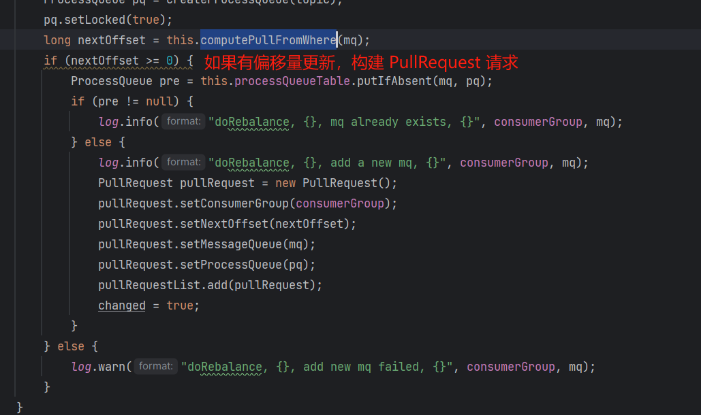

接下来我们来看下读取消费进度的源码实现。

## **2.4 消费者读取消费进度**

重平衡分配到「**新的消息队列**」时需要获取最新 offset，以及「**集群模式**」拉取消息时都需要获取最新 offset 上报给broker 端。

[offsetStore.readOffset](http://offsetstore.readoffset/) 方法获取当前消费者组的 offset，有三种读取类型：

1.  [READ\_FROM\_MEMORY](http://read_from_memory/)：仅从本地内存 [offsetTable](http://offsettable/) 读取。
2.  [READ\_FROM\_STORE](http://read_from_store/)：仅从存储服务中读取，可能是本地文件或者 broker 中读取。
3.  [MEMORY\_FIRST\_THEN\_STORE](http://memory_first_then_store/)：先从本地内存 [offsetTable](http://offsettable/) 读取，读不到再从存储服务中读取。

当「**出现异常**」或者是「**在本地**」或者「**broker 端**」没有找到对于消费者组的 offset 记录，则算作「**第一次启动该消费者组**」，那么返回 -1。

对于 [LocalFileOffsetStore](http://localfileoffsetstore/) 的 Offset 存储服务在本地文件中，因此 [READ\_FROM\_STORE](http://read_from_store/) 就是从本地文件中读取。而 [RemoteBrokerOffsetStore](http://remotebrokeroffsetstore%20/) 的 Offset 存储服务是broker，因此 [READ\_FROM\_STORE](http://read_from_store/) 就是从 broker 端读取。

我们分别来看下。

/\*\*

\* RemoteBrokerOffsetStore 类方法

\* 获取 offset

\* @param mq 需要获取offset的mq

\* @param type 读取类型

\*/

@Override

public long readOffset(final MessageQueue mq, final ReadOffsetType type) {

if (mq != null) {

switch (type) {

case MEMORY\_FIRST\_THEN\_STORE: // 先从本地内存 offsetTable 读取，读不到再从 broker中读取

case READ\_FROM\_MEMORY: { // 仅从本地内存 offsetTable 读取

AtomicLong offset \= this.offsetTable.get(mq);

if (offset != null) {

// 如果本地内存有此 mq 的 offset，那么直接返回

return offset.get();

} else if (ReadOffsetType.READ\_FROM\_MEMORY == type) {

// 如果本地内存没有此 mq 的 offset，但那读取类型为 READ\_FROM\_MEMORY，那么直接返回 -1

return -1;

}

}

case READ\_FROM\_STORE: { // 仅从 broker 中读取

try {

// 从 broker 中获取此消费者组的 offset

long brokerOffset \= this.fetchConsumeOffsetFromBroker(mq);

/ /更新此 mq 的 offset，并且存入本地 offsetTable 缓存

this.updateOffset(mq, brokerOffset, false);

return brokerOffset;

}

// No offset in broker

catch (OffsetNotFoundException e) {

return -1; // broker 中没有关于此消费者组的 offset，返回-1

}

//Other exceptions

catch (Exception e) {

log.warn("fetchConsumeOffsetFromBroker exception, " + mq, e);

return -2;

}

}

default:

break;

}

}

return -3;

}

/\*\*

\* LocalFileOffsetStore 类方法

\* 获取 offset

\* @param mq 需要获取offset的mq

\* @param type 读取类型

\*/

@Override

public long readOffset(final MessageQueue mq, final ReadOffsetType type) {

if (mq != null) {

switch (type) {

case MEMORY\_FIRST\_THEN\_STORE: // 先从本地内存 offsetTable 读取，读不到再从 broker中读取

case READ\_FROM\_MEMORY: { // 仅从本地内存 offsetTable 读取

AtomicLong offset \= this.offsetTable.get(mq);

if (offset != null) {

// 如果本地内存有此 mq 的 offset，那么直接返回

return offset.get();

} else if (ReadOffsetType.READ\_FROM\_MEMORY == type) {

// 如果本地内存没有此 mq 的 offset，但那读取类型为 READ\_FROM\_MEMORY，那么直接返回-1

return -1;

}

}

case READ\_FROM\_STORE: { // 仅从本地文件中读取

OffsetSerializeWrapper offsetSerializeWrapper;

try {

// 加载本地 offset 文件 地址为{user.home}/.rocketmq\_offsets/{clientId}/{groupName}/offsets.json

//配置在文件中以json形式存在

offsetSerializeWrapper = this.readLocalOffset();

} catch (MQClientException e) {

return -1;

}

// 获取对应mq的偏移量

if (offsetSerializeWrapper != null && offsetSerializeWrapper.getOffsetTable() != null) {

AtomicLong offset \= offsetSerializeWrapper.getOffsetTable().get(mq);

if (offset != null) {

// 更新此 mq 的 offset，并且存入本地 offsetTable 缓存

this.updateOffset(mq, offset.get(), false);

return offset.get();

}

}

}

default:

break;

}

}

return -1;

}

## **2.5 消费者利用 Offset 拉取消息**

要理解好这部分，需要结合之前已经剖析过得源码实现，我们来看下。

首先我们从「**PullMessageService**」拉取消息服务启动开始。

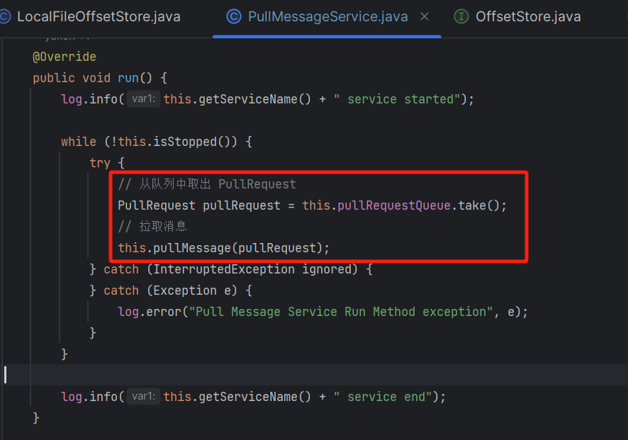

那么在拉取消息的过程中，「**Offset 是如何工作的呢**」？简化如下图：

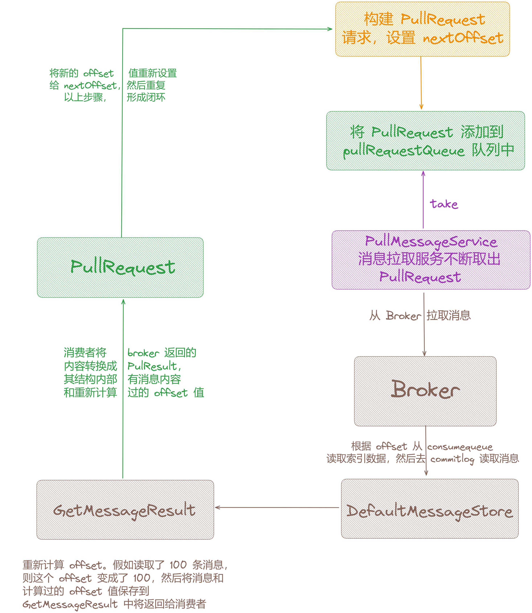

我们再来重温下消息拉取过程，只关注跟 Offset 相关的代码：

// pullRequest 拉消息请求对象

public void pullMessage(final PullRequest pullRequest) {

// 获取拉消息队列在消费者端的快照队列

final ProcessQueue processQueue = pullRequest.getProcessQueue();

// ....省略流控相关代码.......

// 消息从 broker 拉取成功后的回调处理函数，PullResult 结构中包含了从 broker 读取的消息，以及新的 offset

PullCallback pullCallback = new PullCallback() {

@Override

// 拉取消息成功时

public void onSuccess(PullResult pullResult) {

if (pullResult != null) {

// 预处理 pullResult 结果，即将拉取到的消息放到 PullResult 中

pullResult = DefaultMQPushConsumerImpl.this.pullAPIWrapper.processPullResult(

pullRequest.getMessageQueue(), pullResult, subscriptionData);

switch (pullResult.getPullStatus()) {

case FOUND: // 正常从服务器拉取到消息

long prevRequestOffset = pullRequest.getNextOffset();

// 重要操作！！！

// 将 broker 返回的新的 offset 值更新为 PullRequest 对象的 nextOffset

// 下次就用新的offset去broker读取消息

pullRequest.setNextOffset(pullResult.getNextBeginOffset());

....

// 如果拉取到的消息个数为0，什么时候条件成立则表示客户端消息过滤导致消息全部被过滤掉了

if (pullResult.getMsgFoundList() == null || pullResult.getMsgFoundList().isEmpty()) {

// 将请求 PullRequest 重新放入到 pullRequestQueue 中立马发起下一次拉消息任务

DefaultMQPushConsumerImpl.this.

executePullRequestImmediately(pullRequest);

} else {

// 通常情况会执行到这里。

// 获取本次拉取消息的第一条消息的 offset

firstMsgOffset = pullResult.getMsgFoundList().

get(0).getQueueOffset();

....

if (DefaultMQPushConsumerImpl.this.

defaultMQPushConsumer.getPullInterval() > 0) {

....

} else {

// 重点关注操作

// 再次将 PullRequest 放入队列中

// 还是原来的 PullRequest 对象，只不过 offset 已经更新过了

DefaultMQPushConsumerImpl.this.

executePullRequestImmediately(pullRequest);

}

}

break;

....

}

}

}

....

};

....

// 真正的开始从 Broker 拉取消息

try {

this.pullAPIWrapper.pullKernelImpl(

pullRequest.getMessageQueue(), // 拉消息队列

subExpression,

subscriptionData.getExpressionType(),

subscriptionData.getSubVersion(),

pullRequest.getNextOffset(), // nextOffset，本次拉消息 offset（重要）从 PullReqeust 中获取 offset 值给 broker

this.defaultMQPushConsumer.getPullBatchSize(),

sysFlag,

commitOffsetValue,

BROKER\_SUSPEND\_MAX\_TIME\_MILLIS,

CONSUMER\_TIMEOUT\_MILLIS\_WHEN\_SUSPEND,

CommunicationMode.ASYNC,

pullCallback // 拉消息结果回调处理对象

);

} catch (Exception e) {

// 拉取异常，延迟3s发送拉取消息请求

log.error("pullKernelImpl exception", e);

this.executePullRequestLater(pullRequest, pullTimeDelayMillsWhenException);

}

}

通过这块源码，是否已经了解了在拉取消息过程中「**Offset 是如何变化的**」。那么接下来我们在看下「**Offset 是如何完成持久化的**」。

##   
**2.6 消费者更新 Offset**

在消费者消费完消息后，就需要「**更新 Offset 并完成持久化**」，我们来看下消费完成后处理消费结果的源码，这里我们只看下并发消息的处理结果。

源码位置：[https://github.com/apache/rocketmq/blob/release-4.9.7/client/src/main/java/org/apache/rocketmq/client/impl/consumer/](https://github.com/apache/rocketmq/blob/release-4.9.7/client/src/main/java/org/apache/rocketmq/client/impl/consumer/ConsumeMessageConcurrentlyService.java)[ConsumeMessageConcurrentlyService](https://github.com/apache/rocketmq/blob/release-4.9.7/client/src/main/java/org/apache/rocketmq/client/impl/consumer/ConsumeMessageConcurrentlyService.java)[.java](https://github.com/apache/rocketmq/blob/release-4.9.7/client/src/main/java/org/apache/rocketmq/client/impl/consumer/ConsumeMessageConcurrentlyService.java)

public void processConsumeResult(

final ConsumeConcurrentlyStatus status,

final ConsumeConcurrentlyContext context,

final ConsumeRequest consumeRequest

) {

// 获取 ackIndex 的值，默认为 Integer.MAX\_VALUE

int ackIndex \= context.getAckIndex();

if (consumeRequest.getMsgs().isEmpty())

return;

// 根据消息监听器返回的结果计算 ackIndex，这是为下文发送 ACK 消息做的准备

switch (status) {

case CONSUME\_SUCCESS:

// 如果消费成功，则将 ackIndex 设置为 msgs.size()-1

if (ackIndex >= consumeRequest.getMsgs().size()) {

ackIndex = consumeRequest.getMsgs().size() - 1;

}

int ok \= ackIndex + 1;

int failed \= consumeRequest.getMsgs().size() - ok;

this.getConsumerStatsManager().incConsumeOKTPS(consumerGroup, consumeRequest.getMessageQueue().getTopic(), ok);

this.getConsumerStatsManager().incConsumeFailedTPS(consumerGroup, consumeRequest.getMessageQueue().getTopic(), failed);

break;

case RECONSUME\_LATER: // 如果消费失败，则将 ackIndex 置为-1

ackIndex = -1;

this.getConsumerStatsManager().incConsumeFailedTPS(consumerGroup, consumeRequest.getMessageQueue().getTopic(),

consumeRequest.getMsgs().size());

break;

default:

break;

}

switch (this.defaultMQPushConsumer.getMessageModel()) {

case BROADCASTING:

// 如果是广播模式，业务方会返回 RECONSUME\_LATER，消息并不会被重新消费，而是以警告级别输出到日志文件中。

for (int i \= ackIndex + 1; i < consumeRequest.getMsgs().size(); i++) {

MessageExt msg \= consumeRequest.getMsgs().get(i);

log.warn("BROADCASTING, the message consume failed, drop it, {}", msg.toString());

}

break;

case CLUSTERING:

// 初始化消费失败集合

List<MessageExt> msgBackFailed = new ArrayList<MessageExt>(consumeRequest.getMsgs().size());

// 此时不会执行循环，因为 ackIndex=consumeRequest.getMsgs().size()-1，条件不成立。

// 并不会执行 sendMessageBack，只有在业务方返回 RECONSUME\_LATER 时，

// 那么该批消息都需要发送 ACK 消息

for (int i \= ackIndex + 1; i < consumeRequest.getMsgs().size(); i++) {

MessageExt msg \= consumeRequest.getMsgs().get(i);

// 发回到 broker

boolean result \= this.sendMessageBack(msg, context);

if (!result) {

// 失败后将消息添加到消费失败集合

msg.setReconsumeTimes(msg.getReconsumeTimes() + 1);

msgBackFailed.add(msg);

}

}

// 如果消息发送失败，则直接将本批ACK消费发送失败的消息再次封装为 ConsumeRequest，然后延迟 5s 重新消费

if (!msgBackFailed.isEmpty()) {

consumeRequest.getMsgs().removeAll(msgBackFailed);

this.submitConsumeRequestLater(msgBackFailed,

consumeRequest.getProcessQueue(), consumeRequest.getMessageQueue());

}

break;

default:

break;

}

// 从 ProcessQueue 中移除这批消息，这里返回的偏移量是移除该批消息后最小的偏移量。然后用该偏移量更新消息消费进度，以便消费者重启后能从上一次的消费进度开始消费，避免消息重复消费。值得注意的是，当消息监听器返回 RECONSUME\_LATER 时，消息消费进度也会向前推进，并用 ProcessQueue 中最小的队列偏移量调用消息消费进度存储器 OffsetStore 更新消费进度。这是因为当返回 RECONSUME\_LATER 时，RocketMQ会创建一条与原消息属性相同的消息，拥有一个唯一的新 msgId，并存储原消息 ID，该消息会存入 CommitLog文件，与原消息没有任何关联，所以该消息也会进入 ConsuemeQueue 并拥有一个全新的队列偏移量

long offset \= consumeRequest.getProcessQueue().removeMessage(consumeRequest.getMsgs());

if (offset >= 0 && !consumeRequest.getProcessQueue().isDropped()) {

// 更新偏移量 Offset

this.defaultMQPushConsumerImpl.getOffsetStore().

updateOffset(consumeRequest.getMessageQueue(), offset, true);

}

}

这里关注的重点是「**更新偏移量 Offset**」。

  
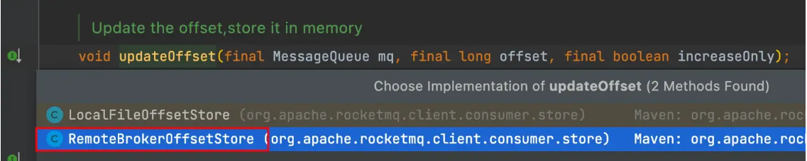

这里有两个实现类：

1.  [LocalFileOffsetStore](http://localfileoffsetstore%20/) : 广播模式使用它。
2.  [RemoteBrokerOffsetStore](http://remotebrokeroffsetstore%20/) : 集群模式使用它。

两个类的源码都一样，不过我们这里看到的是「**集群模式**」[RemoteBrokerOffsetStore](http://remotebrokeroffsetstore/)。

/\*\*

\* RemoteBrokerOffsetStore 类方法

\* 消费者在成功之后更新内存中的 offsetTable 的最新 offset

\*

\* @param mq 消息队列

\* @param offset 偏移量

\* @param increaseOnly 是否仅单调增加 offset，顺序消费为 false，并发消费为 true

\*/

public class RemoteBrokerOffsetStore implements OffsetStore {

@Override

public void updateOffset(MessageQueue mq, long offset, boolean increaseOnly) {

if (mq != null) {

// 获取已存在的 offset

AtomicLong offsetOld \= this.offsetTable.get(mq);

// 如果没有老的 offset，那么将新的 offset 存进去

if (null == offsetOld) {

offsetOld = this.offsetTable.putIfAbsent(mq, new AtomicLong(offset));

}

// 如果有老的 offset，那么尝试更新 offset

if (null != offsetOld) {

// 如果仅单调增加 offset，顺序消费为 false，并发消费为 true

if (increaseOnly) {

// 如果新的 offset 大于已存在 offset，则尝试在循环中 CAS 的更新为新 offset

MixAll.compareAndIncreaseOnly(offsetOld, offset);

} else {

// 直接设置为新 offset，可能导致 offset 变小

offsetOld.set(offset);

}

}

}

}

}

其实很简单，就是将消费过的消息的 offset 更新到消费者本地 offset 变量表中，然后通过定时任务持久化到broker 中。

接下来看下消费者客户端持久化 offset 到 broker。

## **2.7 消费者持久化 Offset 到 Broker**

消费者启动过程中，在 [MQClientInstance#startScheduledTask](http://mqclientinstance/#startScheduledTask) 方法中会去启动各种定时延迟任务，其中一个定时任务，会每 5 秒钟进行一次 offset 的持久化。

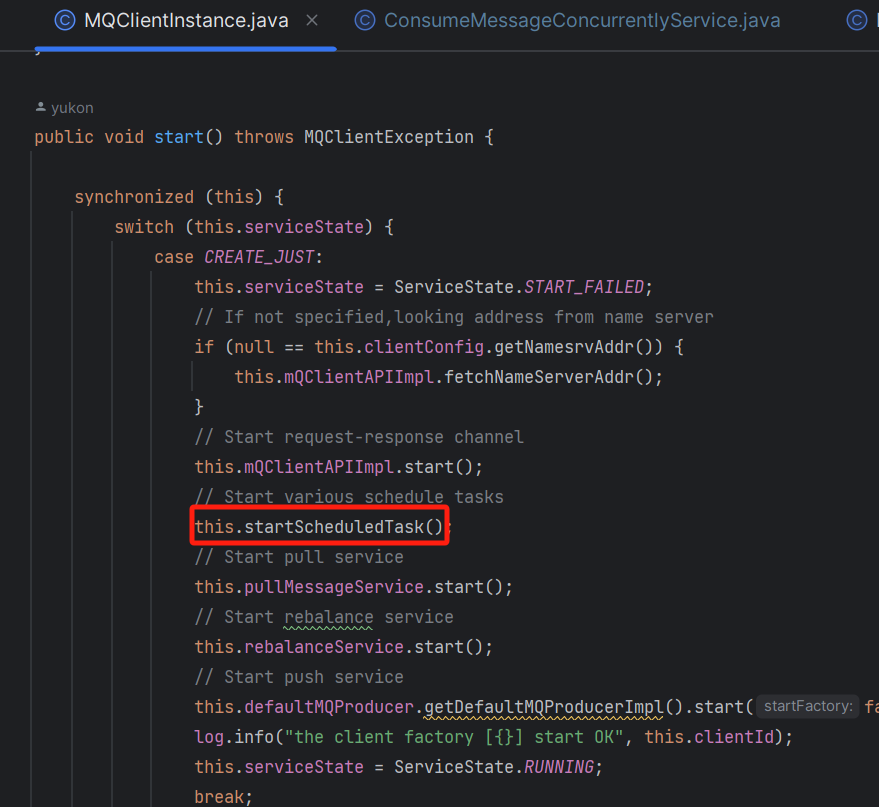

### **2.7.1 定时任务定期持久化**

// 每隔 5 秒

private int persistConsumerOffsetInterval \= 1000 \* 5;

// 广播消费模式下持久化到本地，集群消费模式下推送到broker端

this.scheduledExecutorService.scheduleAtFixedRate(new Runnable() {

@Override

public void run() {

try {

// 持久化消费偏移量

MQClientInstance.this.persistAllConsumerOffset();

} catch (Exception e) {

log.error("ScheduledTask persistAllConsumerOffset exception", e);

}

}

// 每隔 5s 将 offset 持久化到 broker

}, 1000 \* 10, this.clientConfig.getPersistConsumerOffsetInterval(), TimeUnit.MILLISECONDS);

### **2.7.2 循环进行持久化**

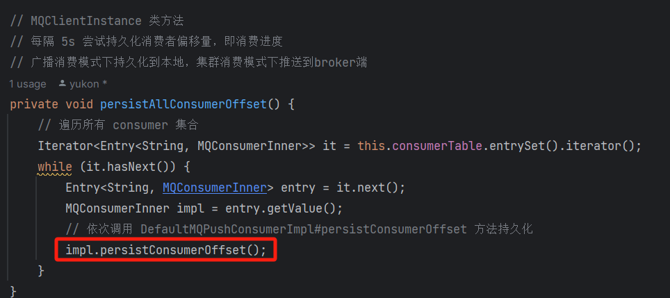

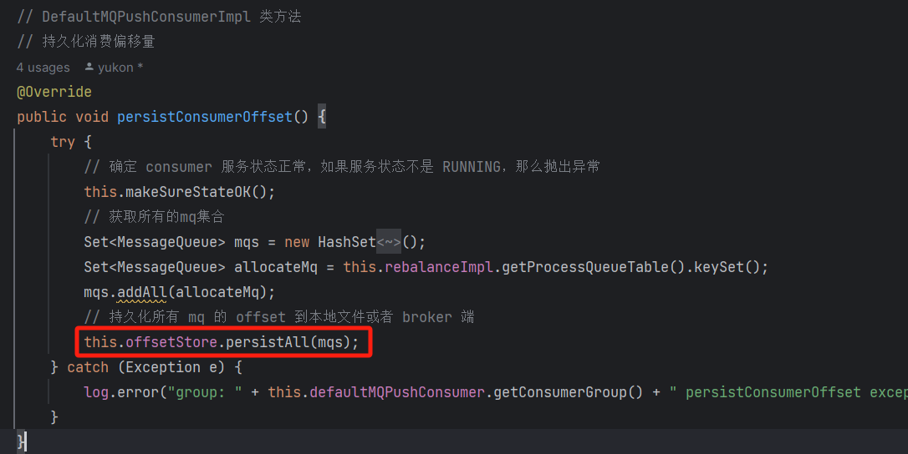

### **2.7.3 持久化所有 Offset**

[LocalFileOffsetStore](http://localfileoffsetstore/)，即广播消费模式下会持久化到本地文件中，比较简单如下：

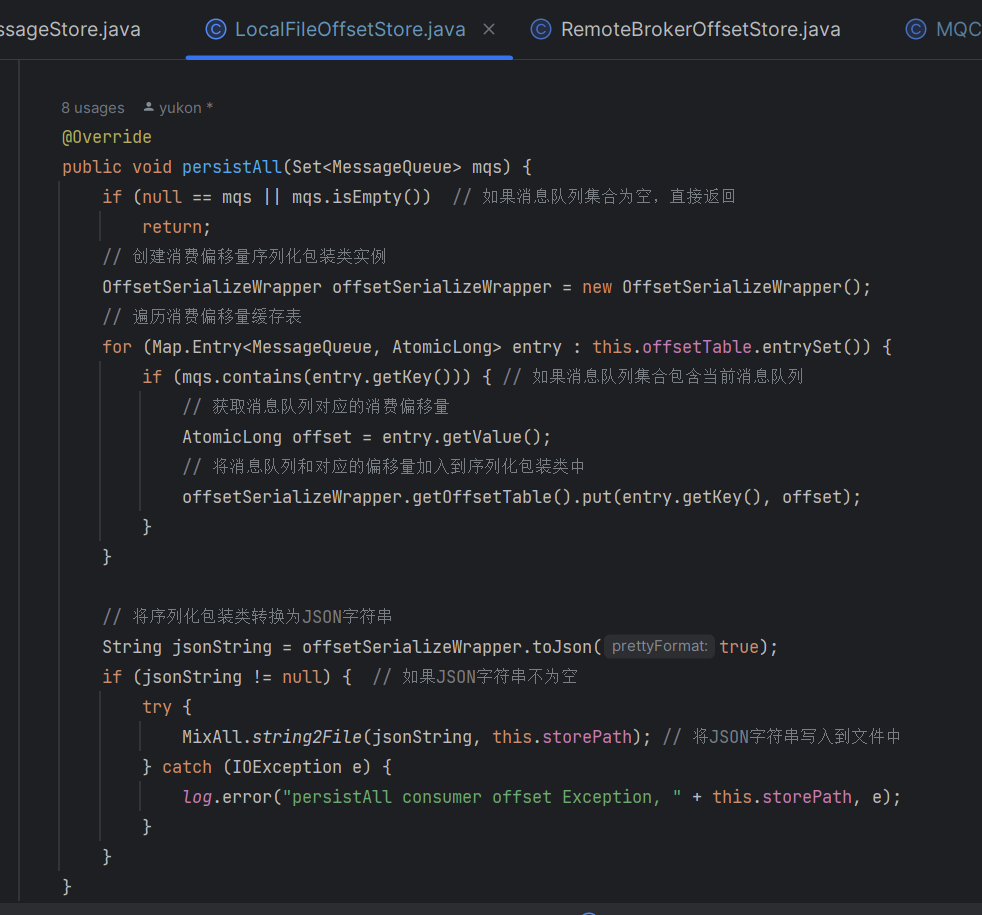

我们重点看下 [RemoteBrokerOffsetStore](http://remotebrokeroffsetstore/)，即集群模式下的持久化处理流程。

@Override

public void persistAll(Set<MessageQueue> mqs) {

if (null == mqs || mqs.isEmpty())

return;

// 未上报的 mq 集合

final HashSet<MessageQueue> unusedMQ = new HashSet<MessageQueue>();

// 遍历消费偏移量缓存表

for (Map.Entry<MessageQueue, AtomicLong> entry : this.offsetTable.entrySet()) {

MessageQueue mq \= entry.getKey();

AtomicLong offset \= entry.getValue();

if (offset != null) {

// mq 集合中包含该 mq

if (mqs.contains(mq)) {

try {

// 上报消费位点到 Broker

this.updateConsumeOffsetToBroker(mq, offset.get());

log.info("\[persistAll\] Group: {} ClientId: {} updateConsumeOffsetToBroker {} {}", this.groupName, this.mQClientFactory.getClientId(), mq, offset.get());

} catch (Exception e) {

log.error("updateConsumeOffsetToBroker exception, " + mq.toString(), e);

}

} else {

// 没有持久化的 mq 加入到未上报的 mq 集合中

unusedMQ.add(mq);

}

}

}

// 对于未上报的 mq，从 offsetTable 中进行移除

if (!unusedMQ.isEmpty()) {

for (MessageQueue mq : unusedMQ) {

this.offsetTable.remove(mq);

log.info("remove unused mq, {}, {}", mq, this.groupName);

}

}

}

### **2.7.4 上报 Offset 到 Broker**

/\*\*

\* RemoteBrokerOffsetStore 类方法

\* 更新消费偏移量

\*

\* @param mq 消息队列

\* @param offset 偏移量

\* @param isOneway 是否是单向请求，自动提交offset请求为true

\*/

@Override

public void updateConsumeOffsetToBroker(MessageQueue mq, long offset, boolean isOneway) throws RemotingException,MQBrokerException, InterruptedException, MQClientException {

// 获取指定 brokerName 的 master 地址

FindBrokerResult findBrokerResult \= this.mQClientFactory.findBrokerAddressInSubscribe(mq.getBrokerName(), MixAll.MASTER\_ID, true);

if (null == findBrokerResult) {

// 从 nameServer 拉取并更新 topic 的路由信息

this.mQClientFactory.updateTopicRouteInfoFromNameServer(mq.getTopic());

// 获取指定 brokerName 的 master 地址

findBrokerResult = this.mQClientFactory.findBrokerAddressInSubscribe(mq.getBrokerName(), MixAll.MASTER\_ID, false);

}

if (findBrokerResult != null) {

// 构建请求头

UpdateConsumerOffsetRequestHeader requestHeader \= new UpdateConsumerOffsetRequestHeader();

requestHeader.setTopic(mq.getTopic());

requestHeader.setConsumerGroup(this.groupName);

requestHeader.setQueueId(mq.getQueueId());

requestHeader.setCommitOffset(offset);

requestHeader.setBname(mq.getBrokerName());

// 是否是单向请求，自动提交offset请求为true，发送完就返回，不管最终是否持久化成功

if (isOneway) {

// 发送更新offset的单向请求

this.mQClientFactory.getMQClientAPIImpl().updateConsumerOffsetOneway(

findBrokerResult.getBrokerAddr(), requestHeader, 1000 \* 5);

} else {

// 发送更新offset

this.mQClientFactory.getMQClientAPIImpl().updateConsumerOffset(

findBrokerResult.getBrokerAddr(), requestHeader, 1000 \* 5);

}

} else {

throw new MQClientException("The broker\[" + mq.getBrokerName() + "\] not exist", null);

}

}

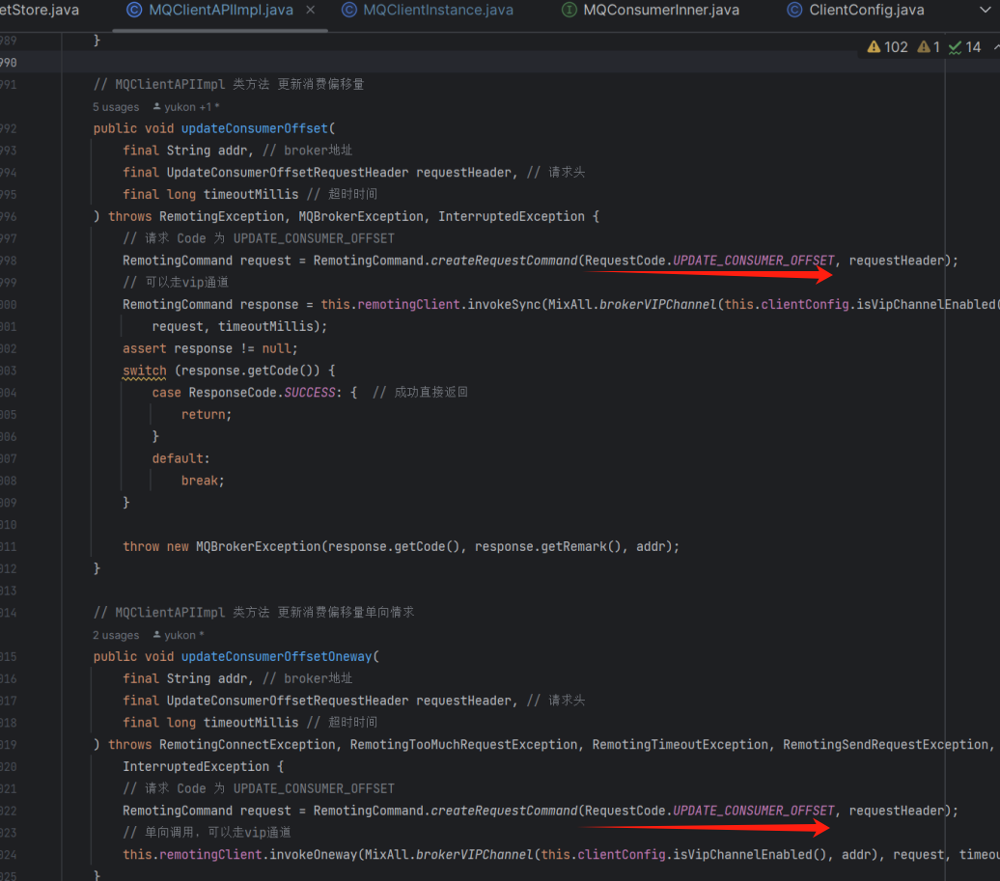

## **2.8 Broker 端处理 Offset**

### **2.8.1 Broker 端处理更新 Offset 请求**

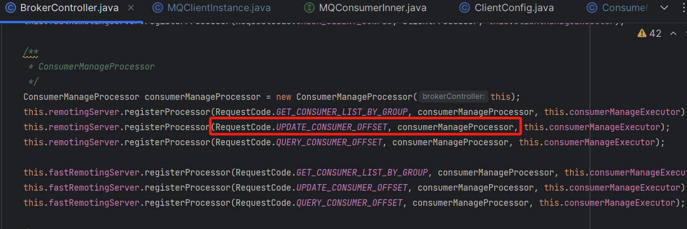

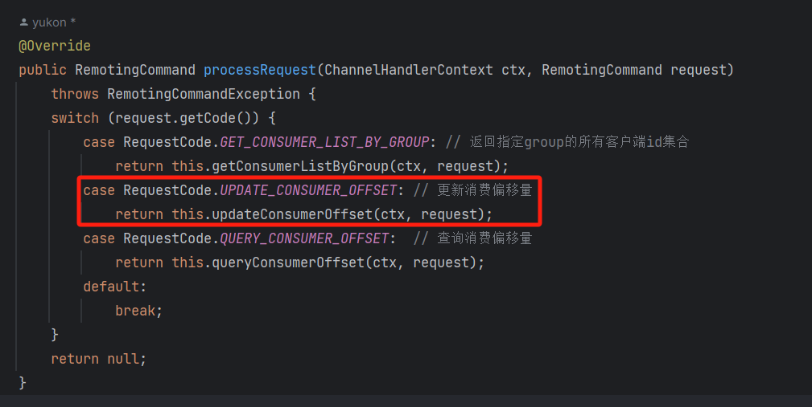

最终调用 [ConsumerOffsetManager#commitOffset()](http://%20consumeroffsetmanager/#commitOffset\(\)) 方法，可以看到这里提交偏移量实际上就是将新的偏移量存入 [ConsumerOffsetManager](http://consumeroffsetmanager%20/) 内部的 [offsetTable](http://offsettable%20/) 中。该缓存对应着磁盘上的[{user.home}/store/config/consumerOffset.json](http://{user.home}/store/config/consumerOffset.json) 文件，实际上是存入到内存中的，并没有持久化。

### **2.8.2 添加 Offset 到内存中**

// 消费者偏移量管理器

public class ConsumerOffsetManager extends ConfigManager {

private static final InternalLogger log \= InternalLoggerFactory.getLogger(LoggerName.BROKER\_LOGGER\_NAME);

protected static final String TOPIC\_GROUP\_SEPARATOR \= "@";

// 核心数据结构，存放消费偏移量

// Map<topic@consumerGroup, Map<queueId, offset>

protected ConcurrentMap<String/\* topic@group \*/, ConcurrentMap<Integer, Long>> offsetTable =

new ConcurrentHashMap<String, ConcurrentMap<Integer, Long>>(512);

protected transient BrokerController brokerController;

/\*\*

\* 提交偏移量

\* @param clientHost 客户端地址

\* @param group 消费者组

\* @param topic 消费topic

\* @param queueId 队列id

\* @param offset 提交的偏移量

\*/

public void commitOffset(final String clientHost, final String group, final String topic, final int queueId,

final long offset) {

// topic@group

String key \= topic + TOPIC\_GROUP\_SEPARATOR + group;

this.commitOffset(clientHost, key, queueId, offset);

}

/\*\*

\* 提交偏移量

\* @param clientHost 客户端地址

\* @param key 缓存key

\* @param queueId 队列id

\* @param offset 提交的偏移量

\*/

private void commitOffset(final String clientHost, final String key, final int queueId, final long offset) {

// 获取 topic@group 对应的所有 queue 的消费偏移量 map

ConcurrentMap<Integer, Long> map = this.offsetTable.get(key);

if (null == map) {

// 初始化一个新的

map = new ConcurrentHashMap<Integer, Long>(32);

//存入map，key为queueId value为offSet

map.put(queueId, offset);

this.offsetTable.put(key, map);

} else {

// 存入map，key为 queueId value 为 offSet

Long storeOffset \= map.put(queueId, offset);

if (storeOffset != null && offset < storeOffset) {

log.warn("\[NOTIFYME\]update consumer offset less than store. clientHost={}, key={}, queueId={}, requestOffset={}, storeOffset={}", clientHost, key, queueId, offset, storeOffset);

}

}

}

}

其实也很简单，就是将客户端发送的 offset 更新到 broker 的 [offsetTable](http://offsettable%20/) 缓存表中，然后再通过 broker 的定时任务持久化到文件中。

### **2.8.3 Broker 定期持久化**

最后我们来看下 broker 的持久化，在 broker启动过程中，在 [BrokerController#initialize](http://brokercontroller/#initialize) 方法中会启动一些定时调度任务，其中有一个任务每隔 5s 将消费者 offset 进行持久化 offsetTable 中的数据，存入 [consumerOffset.json](http://consumeroffset.json/) 文件中。

Broker 在 [shutdown](http://shutdown/) 的时候也会调用 [consumerOffsetManager#persist()](http://consumeroffsetmanager/#persist\(\)) 持久化 offset 到[consumerOffset.json](http://consumeroffset.json/) 文件中。

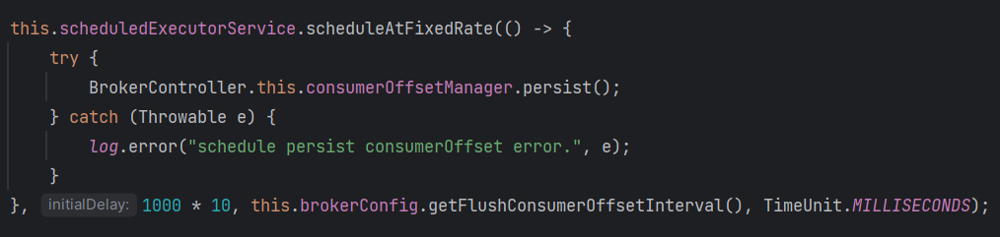

至此，就完成了 offset 的更新和持久化操作，相对还是比较简单的。

##   
**03 最小位点提交机制**

所谓的消息消费不丢失消息，就是存储在Broker中的消息，至少要能被成功消费一次。

RocketMQ 在消息消费时采用了「**ACK**」机制，即消息客户端从 Broker 拉取消息到消费端，只有消费端成功将消息消费，才会发送「**ACK**」 到 Broker，Broker才会认为该消息消费成功，保证消息不丢失。而且消息在消费时，是采取「**最小位点提交机制**」最小位点提交机制。

这里举例说明下：

比如拉取线程「**PullMessageService**」从 Broker 端拉取了 10 条消息到线程池中消费，这里主要是「**并发消费模型**」，其中 「**线程1**」在消费 「**消息1**」，「**线程2**」在消费 「**消息2**」，「**线程3**」在消费「**消息3**」。此时如果「**线程3**」先消费完「**消息3**」，但「**线程1**」,「**线程2**」还未处理完「**消息1**」、「**消息2**」，那「**线程3**」是向Broker 提交「**消息3**」的偏移量还是提交「**消息1**」的偏移量呢？

此时为了保证「**消息不丢失**」，尽管「**线程3**」先将「**消息3**」消费完成，但处理队列中的「**消息1**」、「**消息2**」还没有消费成功，此时「**线程3**」向 Broker 提交消费位点时是将「**消息1**」的偏移量进行上报的，当「**消息1**」、「**消息2**」消费完成时，上报的消费位点才是「**消息4**」，这样就保证消息不丢失。

对应代码如下：

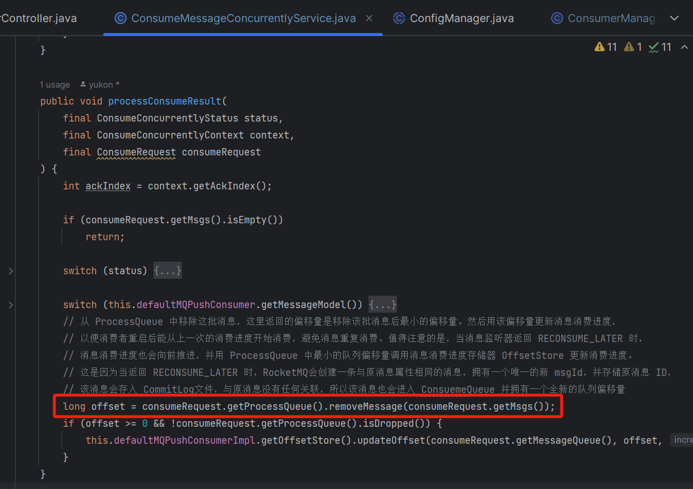

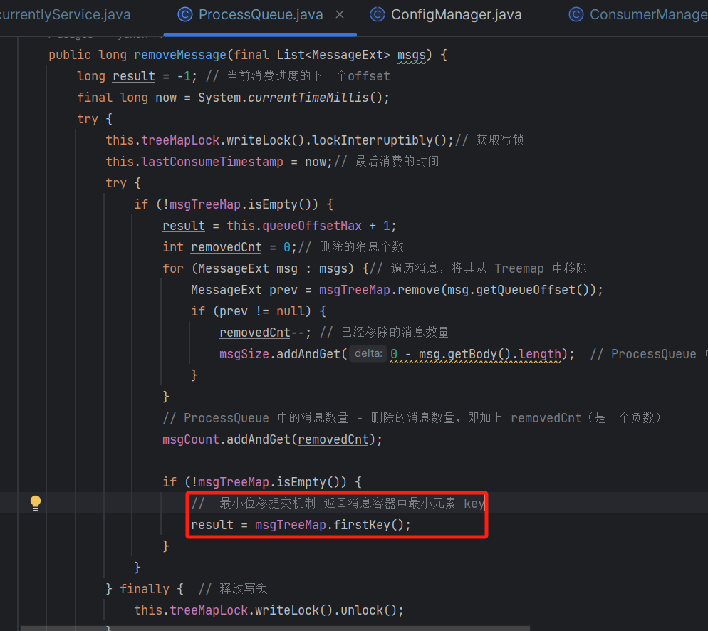

## **04 主从模式下的消费进度管理**

消费者在启动的时候，会创建消息拉取API对象 [PullAPIWrapper](http://pullapiwrapper/)，然后调用 [pullKernelImpl](http://pullkernelimpl/) 方法向 Broker 发送拉取消息的请求，那么在「**主从模式**」下消费者是「**如何选择向哪个 Broker**」发送拉取请求的？

这里我们进入 [pullKernelImpl](http://pullkernelimpl/) 方法中，可以看到会调用 [recalculatePullFromWhichNode](http://recalculatepullfromwhichnode/) 方法选择一个 Broker。

源码位置：[https://github.com/apache/rocketmq/blob/release-5.1.2/](https://github.com/apache/rocketmq/blob/release-5.1.2/client/src/main/java/org/apache/rocketmq/client/impl/consumer%5CPullAPIWrapper.java)[client](https://github.com/apache/rocketmq/blob/release-5.1.2/client/src/main/java/org/apache/rocketmq/client/impl/consumer%5CPullAPIWrapper.java)[/src/main/java/org/apache/rocketmq/](https://github.com/apache/rocketmq/blob/release-5.1.2/client/src/main/java/org/apache/rocketmq/client/impl/consumer%5CPullAPIWrapper.java)[client/impl](https://github.com/apache/rocketmq/blob/release-5.1.2/client/src/main/java/org/apache/rocketmq/client/impl/consumer%5CPullAPIWrapper.java)[/](https://github.com/apache/rocketmq/blob/release-5.1.2/client/src/main/java/org/apache/rocketmq/client/impl/consumer%5CPullAPIWrapper.java)[consumer\\PullAPIWrapper](https://github.com/apache/rocketmq/blob/release-5.1.2/client/src/main/java/org/apache/rocketmq/client/impl/consumer%5CPullAPIWrapper.java)[.java](https://github.com/apache/rocketmq/blob/release-5.1.2/client/src/main/java/org/apache/rocketmq/client/impl/consumer%5CPullAPIWrapper.java)

public PullResult pullKernelImpl(

final MessageQueue mq,

final String subExpression,

final String expressionType,

final long subVersion,

final long offset,

final int maxNums,

final int maxSizeInBytes,

final int sysFlag,

final long commitOffset,

final long brokerSuspendMaxTimeMillis,

final long timeoutMillis,

final CommunicationMode communicationMode,

final PullCallback pullCallback

) throws MQClientException, RemotingException, MQBrokerException, InterruptedException {

// 调用 recalculatePullFromWhichNode 方法获取BrokerID，再调用 findBrokerAddressInSubscribe根据ID获取 Broker 的相关信息

FindBrokerResult findBrokerResult \=

this.mQClientFactory.findBrokerAddressInSubscribe(

this.mQClientFactory.getBrokerNameFromMessageQueue(mq),

this.recalculatePullFromWhichNode(mq), false);

....

if (findBrokerResult != null) {

....

int sysFlagInner \= sysFlag;

if (findBrokerResult.isSlave()) {

sysFlagInner = PullSysFlag.clearCommitOffsetFlag(sysFlagInner);

}

// 构建拉取消息请求头

PullMessageRequestHeader requestHeader = new PullMessageRequestHeader();

....

// 获取Broker地址

String brokerAddr \= findBrokerResult.getBrokerAddr();

if (PullSysFlag.hasClassFilterFlag(sysFlagInner)) {

brokerAddr = computePullFromWhichFilterServer(mq.getTopic(), brokerAddr);

}

// 发送消息拉取请求

PullResult pullResult \= this.mQClientFactory.getMQClientAPIImpl().pullMessage(

brokerAddr,

requestHeader,

timeoutMillis,

communicationMode,

pullCallback);

return pullResult;

}

throw new MQClientException("The broker\[" + mq.getBrokerName() + "\] not exist", null);

}

而在 [recalculatePullFromWhichNode](http://recalculatepullfromwhichnode/) 方法中，会从 [pullFromWhichNodeTable](http://pullfromwhichnodetable/) 中根据消息队列获取一个建议的BrokerID，如果获取为空就返回 Master 节点的 BrokerID。

我们都知道在 RocketMQ 中 Master 角色的 BrokerID 为 0，既然从 [pullFromWhichNodeTable](http://pullfromwhichnodetable/) 中可以知道从哪个 Broker 拉取数据，那么 [pullFromWhichNodeTable](http://pullfromwhichnodetable/) 中的数据又是从哪里来的？

// KEY为消息队列，VALUE为建议的Broker ID

private ConcurrentMap<MessageQueue, AtomicLong/\* brokerId \*/\> pullFromWhichNodeTable =

new ConcurrentHashMap<>(32);

public long recalculatePullFromWhichNode(final MessageQueue mq) {

if (this.isConnectBrokerByUser()) {

return this.defaultBrokerId;

}

// 从 pullFromWhichNodeTable 中获取建议的 broker ID

AtomicLong suggest \= this.pullFromWhichNodeTable.get(mq);

if (suggest != null) {

return suggest.get();

}

// 返回Master Broker ID

return MixAll.MASTER\_ID;

}

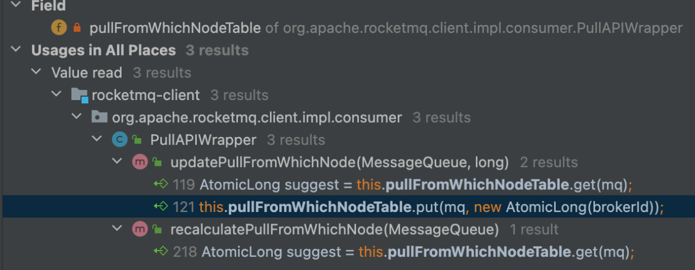

通过调用关系可知，在 [updatePullFromWhichNode](http://updatepullfromwhichnode%20/) 方法中更新了 [pullFromWhichNodeTable](http://pullfromwhichnodetable/) 的值，而[updatePullFromWhichNode](http://updatepullfromwhichnode/) 方法又是被 [processPullResult](http://processpullresult/) 方法调用的，消费者向 Broker 发送拉取消息请求后，Broker 对拉取请求进行处理时会设置一个 broker ID，建议下次从这个 Broker 拉取消息，消费者对拉取请求返回的响应数据进行处理时会调用 [processPullResult](http://processpullresult/) 方法，在这里将建议的 BrokerID 取出，调用[updatePullFromWhichNode](http://updatepullfromwhichnode/) 方法将其加入到了 [pullFromWhichNodeTable](http://pullfromwhichnodetable/) 中：

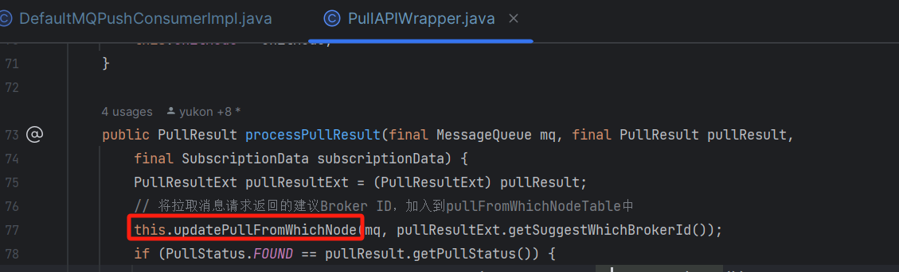

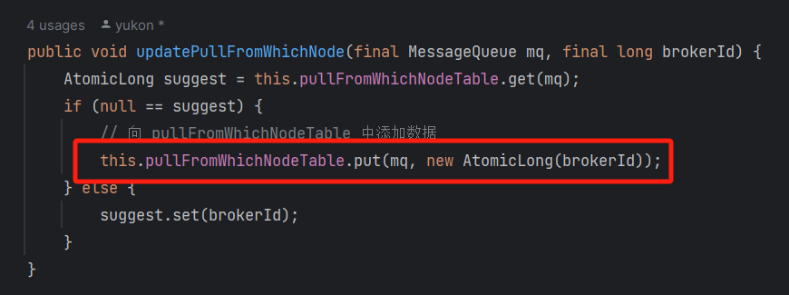

那么接下来看下根据什么条件决定选择哪个 Broker 的。

##   
**4.1 建议的 BrokerID**

源码位置：[https://github.com/apache/rocketmq/blob/release-5.1.2/](https://github.com/apache/rocketmq/blob/release-5.1.2/broker/src/main/java/org/apache/rocketmq/broker/processor/PullMessageProcessor.java)[broker](https://github.com/apache/rocketmq/blob/release-5.1.2/broker/src/main/java/org/apache/rocketmq/broker/processor/PullMessageProcessor.java)[/src/main/java/org/apache/rocketmq/](https://github.com/apache/rocketmq/blob/release-5.1.2/broker/src/main/java/org/apache/rocketmq/broker/processor/PullMessageProcessor.java)[broker/processor](https://github.com/apache/rocketmq/blob/release-5.1.2/broker/src/main/java/org/apache/rocketmq/broker/processor/PullMessageProcessor.java)[/](https://github.com/apache/rocketmq/blob/release-5.1.2/broker/src/main/java/org/apache/rocketmq/broker/processor/PullMessageProcessor.java)[PullMessageProcessor](https://github.com/apache/rocketmq/blob/release-5.1.2/broker/src/main/java/org/apache/rocketmq/broker/processor/PullMessageProcessor.java)[.java](https://github.com/apache/rocketmq/blob/release-5.1.2/broker/src/main/java/org/apache/rocketmq/broker/processor/PullMessageProcessor.java)

Broker 在处理消费者拉取请求时，会调用 [PullMessageProcessor#processRequest](http://pullmessageprocessor/#processRequest) 方法，首先会调用[MessageStore#getMessage](http://messagestore/#getMessage) 方法获取消息内容，在返回的结果 [GetMessageResult](http://getmessageresult/) 中设置了一个「**是否建议从 Slave 节点拉取的属性**」，会根据是否建议从 slave 节点进行以下处理：

1.  如果建议从 slave 节点拉取消息，会调用 [subscriptionGroupConfig](http://subscriptiongroupconfig/) 订阅分组配置的[getWhichBrokerWhenConsumeSlowly](http://getwhichbrokerwhenconsumeslowly/) 方法获取从节点将ID设置到响应中，否则下次依旧建议从主节点拉取消息，将MASTER 节点的 ID 设置到响应中。
2.  判断当前 Broker 的角色，如果是 slave 节点，并且配置了不允许从 slave 节点读取数据（[SlaveReadEnable = false](http://slavereadenable%20=%20false/)），此时依旧建议从主节点拉取消息，将 MASTER 节点的 ID 设置到响应中。
3.  如果开启了允许从 slave 节点读取数据（[SlaveReadEnable = true](http://slavereadenable%20=%20true/)），有以下两种情况：
4.  如果建议从 slave 节点拉消息，从订阅分组配置中获取从节点的 ID，将 ID 设置到响应中；
5.  如果不建议从 slave 节点拉取消息，从订阅分组配置中获取设置的 Broker Id；当然，如果未开启允许从 Slave 节点读取数据，下次依旧建议从 Master 节点拉取；

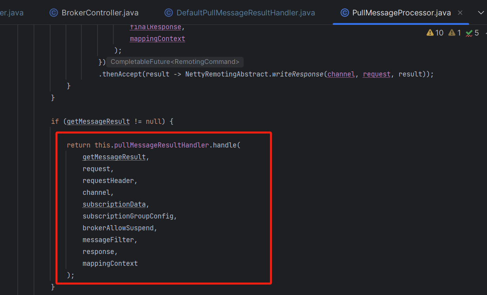

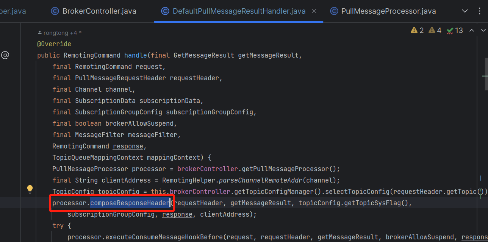

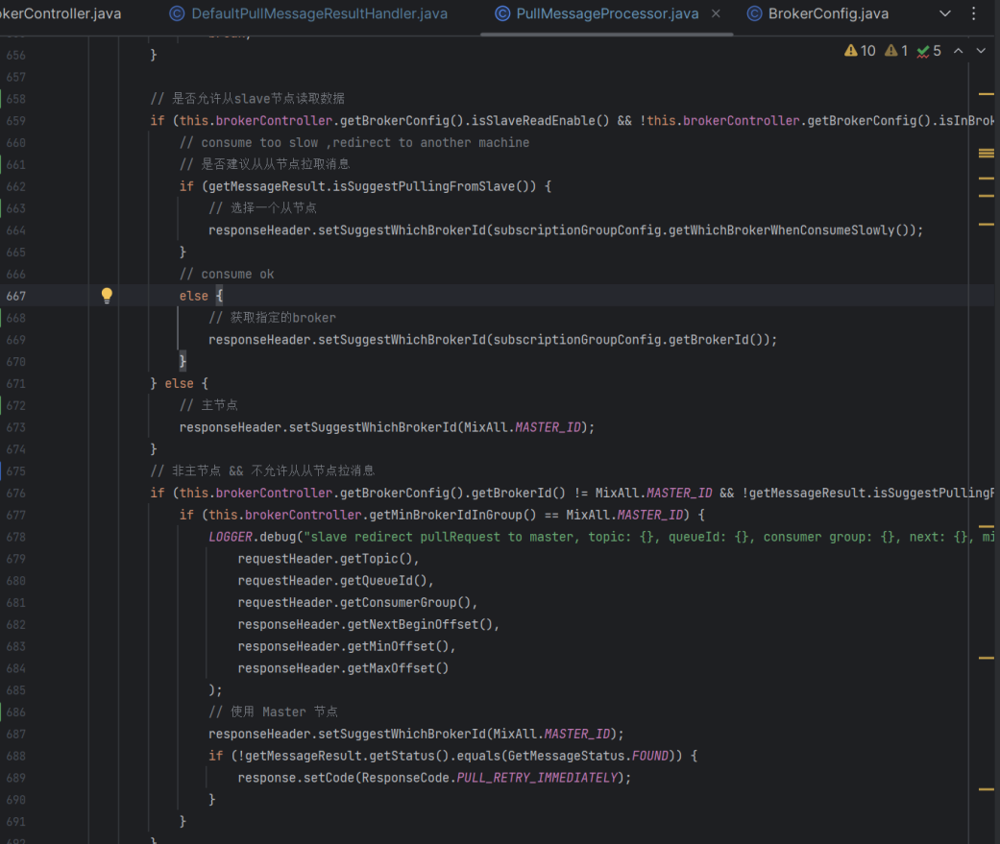

## **4.2 是否建议从 Slave 节点拉取的设置**

[DefaultMessageStore#getMessage](http://defaultmessagestore/#getMessage) 方法中用于获取消息内容，并会根据消费者的拉取进度判断是否建议下次从Slave 节点拉取消息，判断过程如下：

1.  diff：当前 [CommitLog](http://commitlog/) 最大的偏移量减去本次拉取消息的最大物理偏移量，表示剩余未拉取的消息。
2.  memory：消息在 [PageCache](http://pagecache%20/) 中的总大小，计算方式是总物理内存 \* 消息存储在内存中的阀值（默认为40）/100，也就是说 MQ 会缓存一部分消息在操作系统的 [PageCache](http://pagecache/)中，加速访问。
3.  如果 diff 大于 memory，表示未拉取的消息过多，已经超出了 [PageCache](http://pagecache/) 缓存的数据的大小，还需要从磁盘中获取消息，所以此时会建议下次从 Slave 节点拉取。

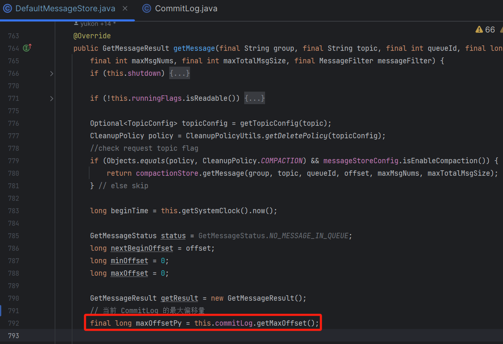

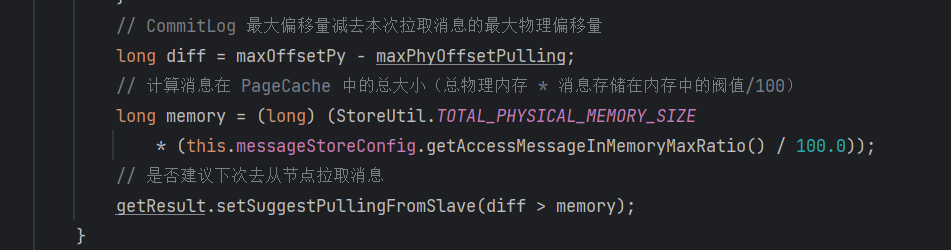

## **小结**

消费者在启动后需要向 Broker 发送拉取消息的请求，Broker 收到请求后会根据消息的拉取进度，返回一个建议的BrokerID，并设置到响应中返回，消费者处理响应时将建议的 BrokerID 放入 [pullFromWhichNodeTable](http://pullfromwhichnodetable/)，下次拉去消息的时候从 [pullFromWhichNodeTable](http://pullfromwhichnodetable/) 中取出，并向其发送请求拉取消息。

## **4.3 主从模式下的消费进度持久化**

上面讲解了主从模式下如何选择从哪个 Broker 拉取消息，接下来看下「**消费进度持久化**」，因为「**广播模式**」下消费进度保存在每个「**消费者端**」，「**集群模式**」下消费进度保存在「**Broker 端**」，所以接下来以「**集群模式**」为例。

在[【消费者源码分析系列第三篇】图解 RocketMQ 源码之消费者是如何从 Broker 拉取数据](https://articles.zsxq.com/id_u91ued4dpqrp.html) 中可知，「**集群模式**」下主要是通过 [RemoteBrokerOffsetStore](http://remotebrokeroffsetstore%20/) 进行消费进度管理的，在持久化方法 [persistAll](http://persistall/) 中会调用[updateConsumeOffsetToBroker](http://updateconsumeoffsettobroker/) 更新 Broker 端的消费进度。

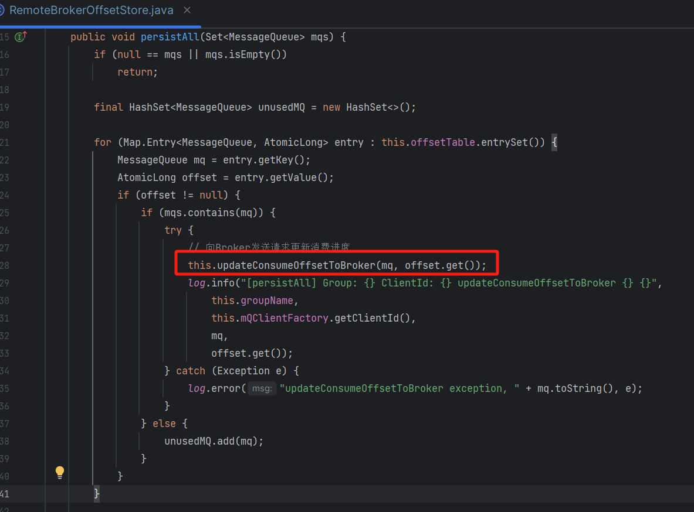

由于 [updateConsumeOffsetToBroker](http://updateconsumeoffsettobroker/) 方法中先调用了 [findBrokerAddressInSubscribe](http://findbrokeraddressinsubscribe/) 方法获取 Broker 的信息，所以这里先看 [findBrokerAddressInSubscribe](http://findbrokeraddressinsubscribe/) 方法是如何选择 Broker 的。

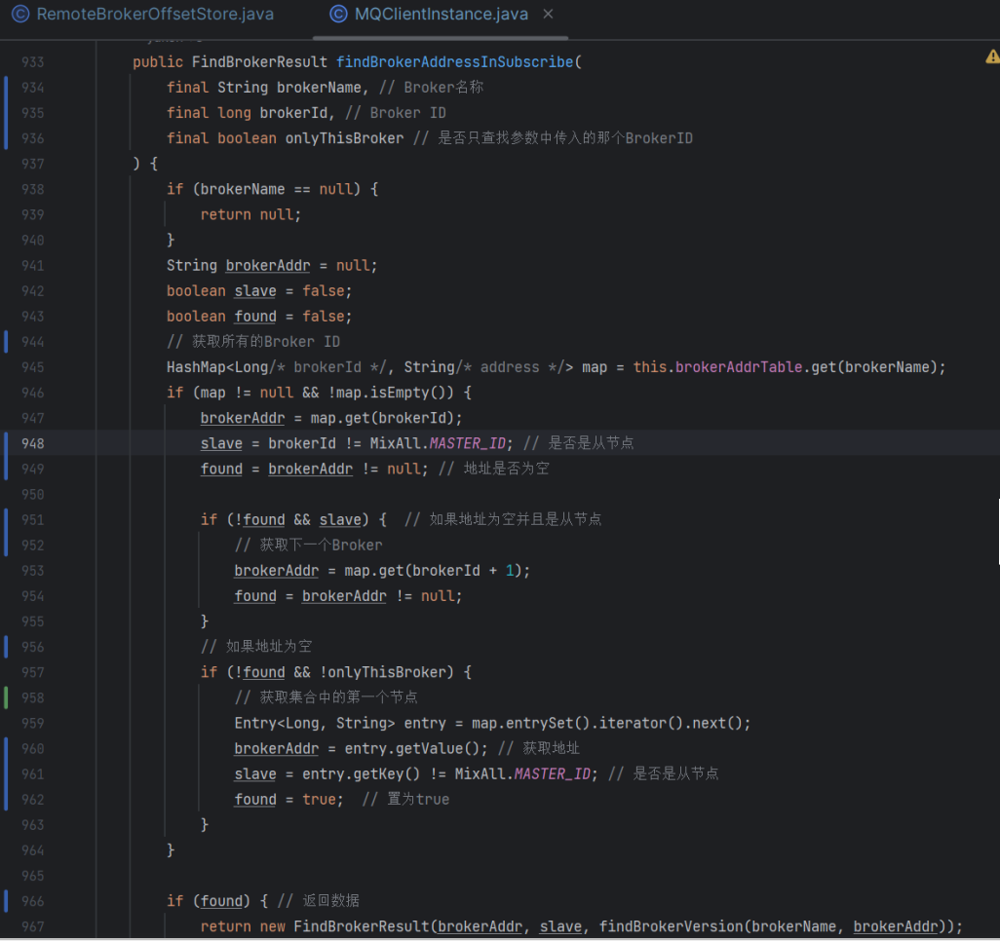

处理逻辑如下：

1.  首先从 [brokerAddrTable](http://brokeraddrtable/) 中根据Broker的名称获取所有的 Broker 集合（主从模式下他们的Broker名称一致，但是ID不一致），KEY 为 BrokerID，VALUE 为 Broker 的地址。
2.  从 Broker 集合中根据参数中传入的 ID 获取 broker 地址。
3.  判断参数中传入的 BrokerID 是否是主节点，记录在 slave 变量中。
4.  判断获取的 Broker 地址是否为空，记录在found变量中。
5.  如果根据 BrokerId 获取的地址为空并且参数中传入的 BrokerId 为从节点，继续轮询获取下一个 Broker，并判断地址是否为空。
6.  如果此时地址依旧为空并且 [onlyThisBroker](http://onlythisbroker/) 传入的 false (也就是不必须选择参数中传入的那个 BrokerID)，此时获取 map集合中的第一个节点。
7.  判断获取到的 Broker 地址是否为空，不为空封装结果返回，否则返回 NULL。

再回到 [updateConsumeOffsetToBroker](http://updateconsumeoffsettobroker/) 方法，先看第一次调用 [findBrokerAddressInSubscribe](http://findbrokeraddressinsubscribe/) 方法获取 Broker信息，根据上面讲解查找逻辑，如果查找到 Master 节点的信息，就正常返回，如果此时 Master 宕机未能正常查找到，由于传入的 Master 节点的 ID 并且 [onlyThisBroker](http://onlythisbroker/) 置为 true，所以会查找失败返回 NULL。

如果第一次调用为空，会进行第二次调用，与第一次调用不同的地方是第三个参数置为了 false，也就是说不是必须选择参数中指定的那个 Broker，此时依旧优先查找 Master 节点，如果 Master 节点未查找到，由于[onlyThisBroker](http://onlythisbroker/) 置为了 false，会迭代集合选择第一个节点返回，此时返回的有可能是从节点。

**总结：消费者会优先选择向主节点发送请求进行消费进度保存，假如主节点宕机等原因未能获取到主节点的信息，会迭代集合选择第一个节点返回，所以消费者也可以向从节点发送请求进行进度保存，待主节点恢复后，依旧优先选择主节点。**

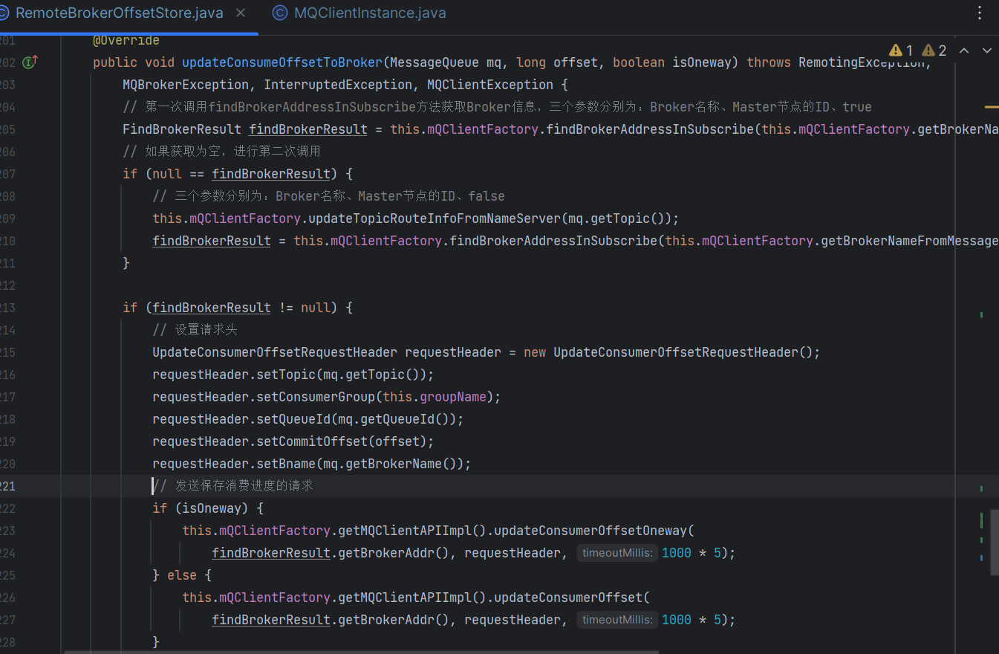

## **4.4 主从模式下的消费进度同步**

[BrokerController](http://brokercontroller%20/) 在构造函数中，实例化了 [SlaveSynchronize](http://slavesynchronize/)。并在 Leader 选举时方法中调用了[handleSlaveSynchronize](http://handleslavesynchronize/) 方法处理从节点的数据同步，如果当前的 Broker 是从节点，会注册定时任务，定时调用[SlaveSynchronize](http://slavesynchronize/) 的 [syncAll](http://syncall%20/) 方法进行数据同步：

public class BrokerController {

....

protected final SlaveSynchronize slaveSynchronize;

public BrokerController(

final BrokerConfig brokerConfig,

final NettyServerConfig nettyServerConfig,

final NettyClientConfig nettyClientConfig,

final MessageStoreConfig messageStoreConfig

) {

....

this.slaveSynchronize = new SlaveSynchronize(this);

....

}

}

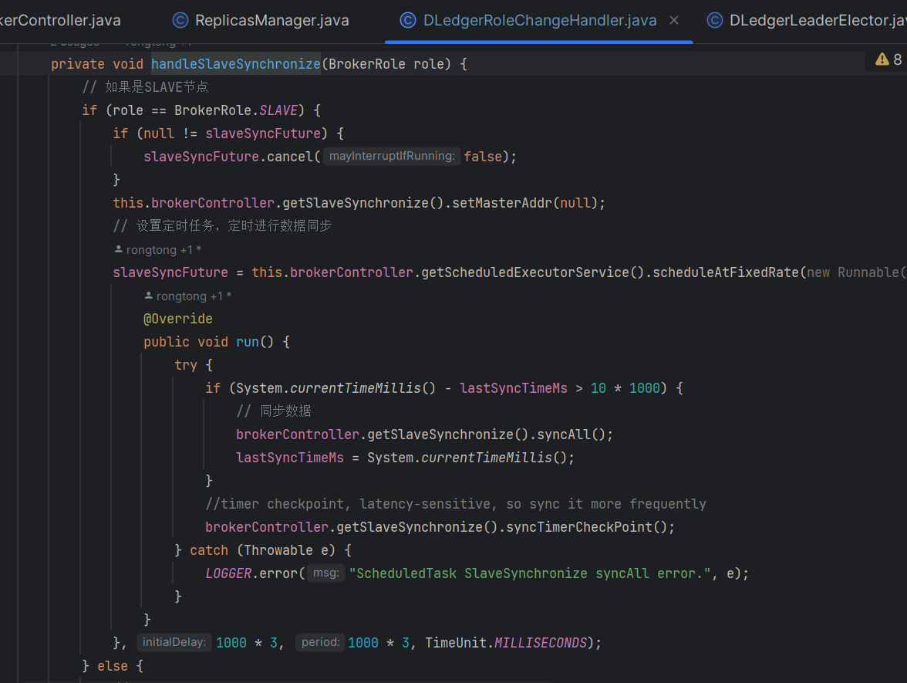

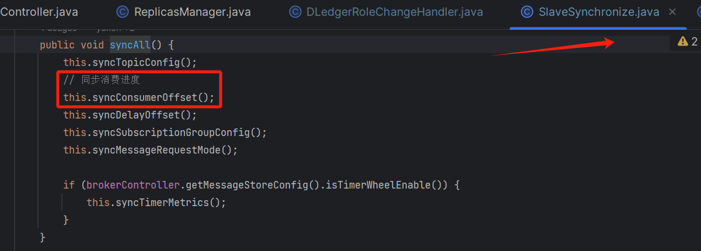

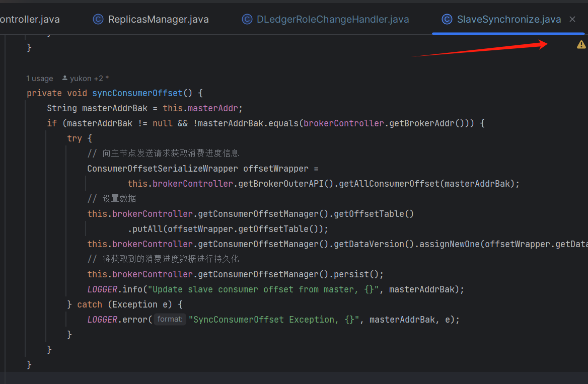

## **05 总结**

最后来总结下偏移量是如何被更新和持久化的：

1.  消费者客户端本地维护一个 [offsetTable](http://offsettable/) 表，消费者消费完成后先更新到本地 [offsetTable](http://offsettable%20/) 表中。
2.  消费者客户端启动时会开启一个定时任务，将本地的 [offsetTable](http://offsettable/) 表发送到 broker。
3.  Broker 端会接收消费者客户端发送的 offset 请求数据，并保存到 broker 的本地 [offsetTable](http://offsettable/) 表中。
4.  Broker 端启动时也会开启定时任务，用于将 broker 的本地 [offsetTable](http://offsettable/) 表中的数据持久化到文件中。

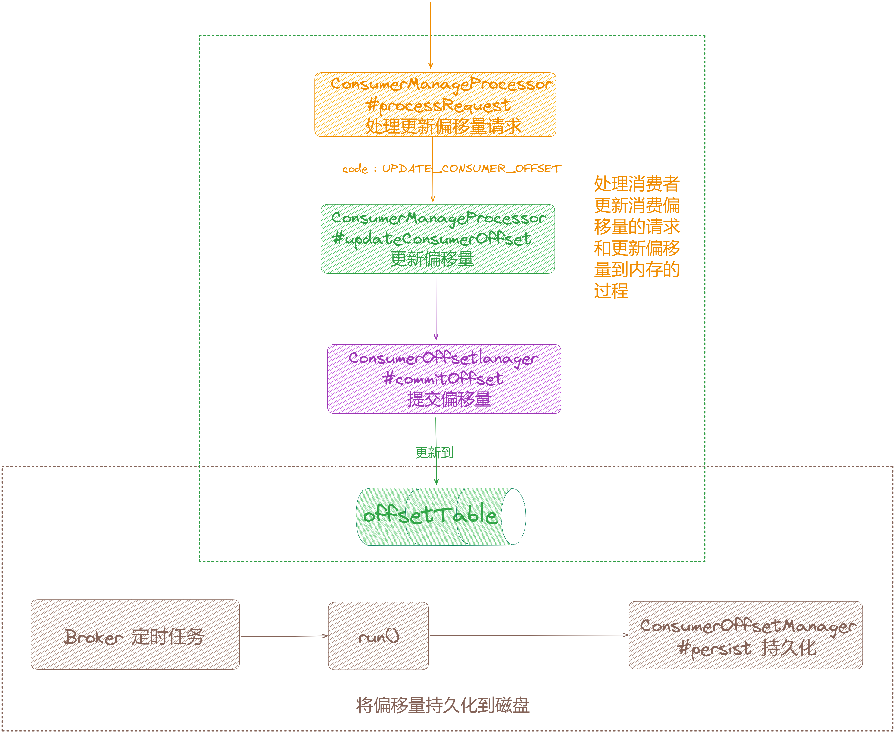