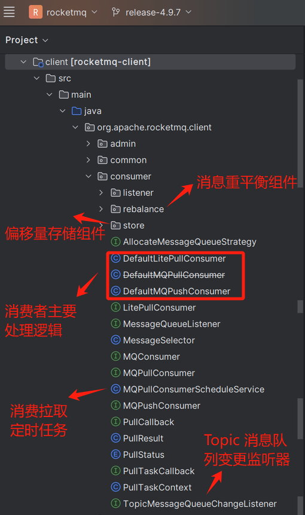
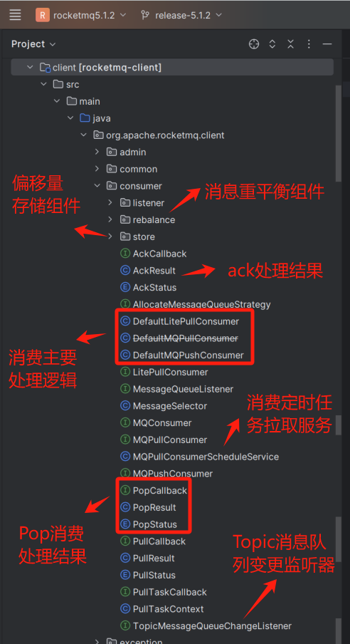

大家好，我是**华仔**, 又跟大家见面了。

从今天开始我将继续为大家奉上 RocketMQ 消费者源码剖析系列文章，正式开启「**RocketMQ 的 消费者源码之旅**」，这是第一篇，本篇我们将以「**RocketMQ 4.9.7**」及「**RocketMQ 5.1.2**」版本为主，来剖析下 RocketMQ 源码之消费者源码结构。

## **01 4.9.x 消费者源码结构图**

## **02 5.x 消费者源码结构图**

从源码结构来看，消费者相对比较简单，接下来几篇我们重点来剖析下消费者的相关源码。