大家好，我是**华仔**, 又跟大家见面了。

从今天开始我将继续为大家奉上 RocketMQ 消费者源码剖析系列文章，正式开启「**RocketMQ 的 消费者源码之旅**」，这是第七篇，本篇我们将以「**RocketMQ 5.1.2**」版本为主，来剖析下 RocketMQ 源码之消费者消息拉取长轮询流程剖析。

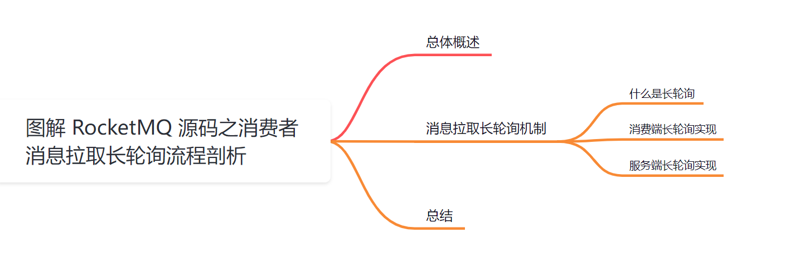

## **01 总体概述**

在 [【消费者源码分析系列第三篇】图解 RocketMQ 源码之消费者是如何从 Broker 拉取数据](https://articles.zsxq.com/id_u91ued4dpqrp.html) 这篇中，我们重点剖析了消息是如何从 Broker 拉取的， 流程如下：

  
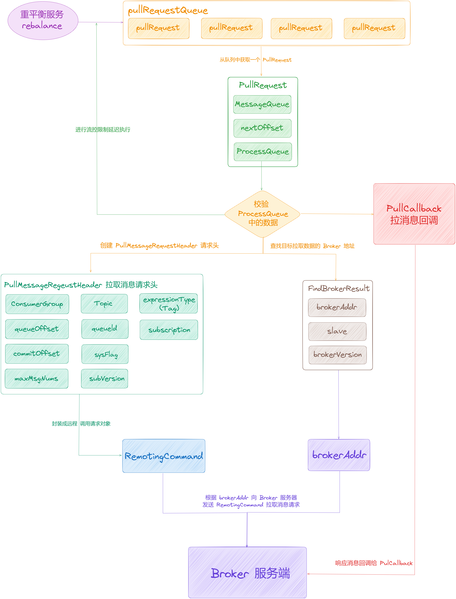

但是没有深入去剖析消息拉取长轮询机制，那么今天我们就来看看消息拉取长轮询机制是如何实现的？

##   
**02 消息拉取长轮询机制**

RoceketMQ 为我们提供了两种消费者模型，[DefaultMQPushConsumer](http://defaultmqpushconsumer/)、[DefaultLitePullConsumer](http://defaultlitepullconsumer/)

。我们都知道 [DefaultLitePullConsumer](http://defaultlitepullconsumer/) 是基于拉模式的消费，而 [DefaultMQPushConsumer](http://defaultmqpushconsumer/) 是基于推模式的消费。

我们先简单复习一下推拉模式的概念。

> 推模式：当服务端有数据立即通知客户端，这个策略依赖服务端与客户端之间的长连接，它具有高实时性、客户端开发简单等优点；同时缺点也很明显，比如：服务端需要感知与它建立链接的客户端，要实现客户端节点的发现，服务端本身主动推送，需要服务端对消息做额外的处理，以便能够及时将消息分发给客户端。
> 
> 拉模式：客户端主动对服务端的数据进行拉取。客户端拉取数据，拉取成功后处理数据，处理完成再次进行拉取，循环执行。缺点是如果不能很好的设置拉取的频率，时间间隔，过多的空轮询会对服务端造成较大的访问压力，数据的实时性也不能得到很好的保证。

基于对上述两个策略的优缺点的综合考虑，RocketMQ 的 [DefaultMQPushConsumer](http://defaultmqpushconsumer/) 采用了结合了「**推拉模式**」两者优点的「**长轮询机制**」对消息进行消费。这样既能保证主动权在客户端，还能保证数据拉取的实时性。

今天我们就对 RocketMQ 的「**长轮询机制**」进行拆解剖析，从而更好的理解 RocketMQ 的设计精妙之处。

## **2.1 什么是长轮询**

首先了解一下什么是「**长轮询机制**」。

> 长轮询机制不同于常规轮询方式。
> 
> 常规的轮询方式为客户端发起请求，服务端接收后该请求后立即进行相应的方式。
> 
> 长轮询本质上还是轮询，但它与轮询不同在于：当服务端接收到客户端的请求后，服务端不会立即将数据返回给客户端，而是会先将这个请求 hold 住，判断服务器端数据是否有更新。如果有更新，则对客户端进行响应，如果一直没有数据，则它会在长轮询超时时间之前一直 hold 住请求并检测是否有数据更新，直到有数据或者超时后才返回。

## **2.2 消费端长轮询实现**

在了解长轮询机制概念之后，就容易理解 RocketMQ 对长轮询机制的实现了。

首先我们先来回忆一下消费者如何进行消息拉取的：

从 [【消费者源码分析系列第三篇】图解 RocketMQ 源码之消费者是如何从 Broker 拉取数据](https://articles.zsxq.com/id_u91ued4dpqrp.html) 中，已知[DefaultMQPushConsumer](http://defaultmqpushconsumer/) 内部实现了长轮询机制，通过消息拉取线程 [PullMessageService](http://pullmessageservice/) 实现的，我们再来看下 [PullMessageService](http://pullmessageservice/) 类，重点看它的 **run()** 方法。

源码位置：[https://github.com/apache/rocketmq/blob/release-5.1.2/client/src/main/java/org/apache/rocketmq/client/impl/consumer/PullMessageService.java](https://github.com/apache/rocketmq/blob/release-5.1.2/client/src/main/java/org/apache/rocketmq/client/impl/consumer/PullMessageService.java)

public class PullMessageService extends ServiceThread {

private final InternalLogger log \= ClientLogger.getLog();

// 存放 PullRequest 的阻塞队列

private final LinkedBlockingQueue<PullRequest> pullRequestQueue = new LinkedBlockingQueue<PullRequest>();

// MQClientInstance 客户端实例

private final MQClientInstance mQClientFactory;

// 定时任务执行服务，主要用于延迟添加 pullRequest

private final ScheduledExecutorService scheduledExecutorService \= Executors

.newSingleThreadScheduledExecutor(new ThreadFactory() {

@Override

public Thread newThread(Runnable r) {

return new Thread(r, "PullMessageServiceScheduledThread");

}

});

public void run() {

log.info(this.getServiceName() + " service started");

/\*

\* 运行时逻辑

\* 如果服务没有停止，则在死循环中执行拉取消息的操作

\* Stopped 声明为 volatile，每执行一次业务逻辑，检测一下其运行状态，可以通过其他线程将Stopped 设置为 true，从而停止该线程

\*/

while (!this.isStopped()) {

try {

// 线程大部分时间都处于阻塞等待状态

// 从 pullRequestQueue 中获取一个 PullRequest 消息拉取请求任务，如果pullRequestQueue 为空，则线程将阻塞，直到有拉取任务被放入

PullRequest pullRequest \= this.pullRequestQueue.take();

// 调用 pullMessage 方法进行消息拉取，通过客户端实例查找当前 pullRequest 归属Consumer 对象

this.pullMessage(pullRequest);

} catch (InterruptedException ignored) {

} catch (Exception e) {

log.error("Pull Message Service Run Method exception", e);

}

}

log.info(this.getServiceName() + " service end");

}

}

当消费者启动后，会在启动 [MQClientInstance](http://mqclientinstance/) 过程中启动 [PullMessageService](http://pullmessageservice/) 服务，当[PullMessageService](http://pullmessageservice/) 启动后一直执行 run 方法进行消息拉取。

再来回顾一下 PullRequest 的数据结构：

// PullRequest 是一个对象，保存待拉取的消息队列和正在处理的队里 ProcessQueue 消息处理队列，从Broker 中拉取到的消息会先存入 ProccessQueue；

public class PullRequest {

// 消费者组

private String consumerGroup;

// 待拉取的消息队列信息

private MessageQueue messageQueue;

// 消息处理队列，消息从 broker 中拉取以后会先存到该 ProcessQueue 中，然后再提交给消费者线程池进行消费

private ProcessQueue processQueue;

// 待拉取的 MessageQueue 偏移量，即 本次拉消息请求，使用offset （服务器端需要根据该 offset 进行定位消息位置，然后才可以获取一批消息）

private long nextOffset;

// 是否被锁定

private boolean previouslyLocked \= false;

}

对于每个 [MessageQueue](http://messagequeue/)，都有对应的一个 [pullRequest](http://pullrequest/)，每个 [MessageQueue](http://messagequeue/) 还对应一个 [processQueue](http://processqueue/)，保存该 [MessageQueue](http://messagequeue/) 消息处理的快照，通过 [nextOffset](http://nextoffset/) 来标识当前读取的位置。

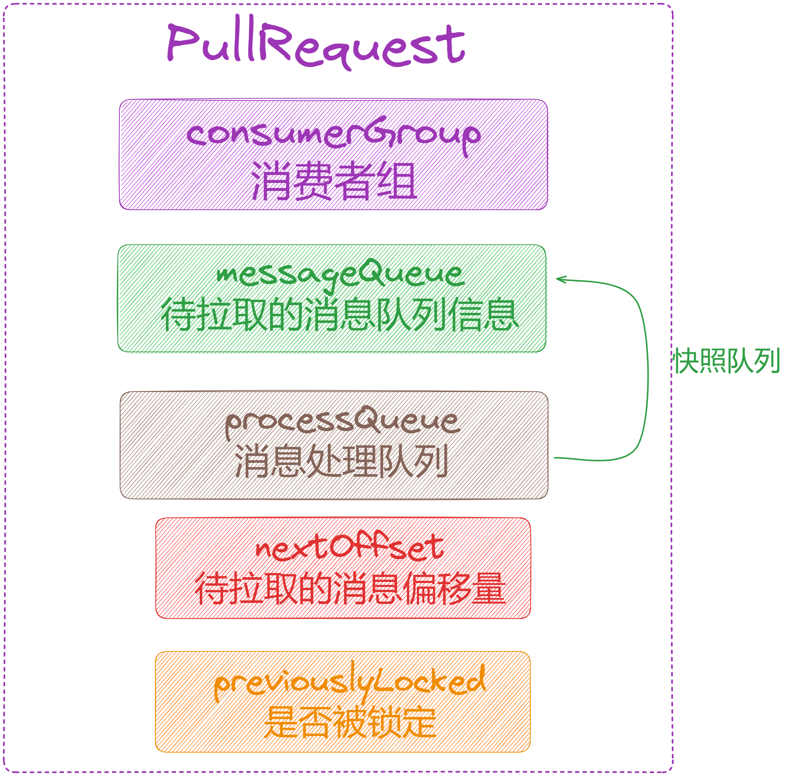

消息拉取最终是由 [PullAPIWrapper](http://pullapiwrapper%20/) 类来处理的。

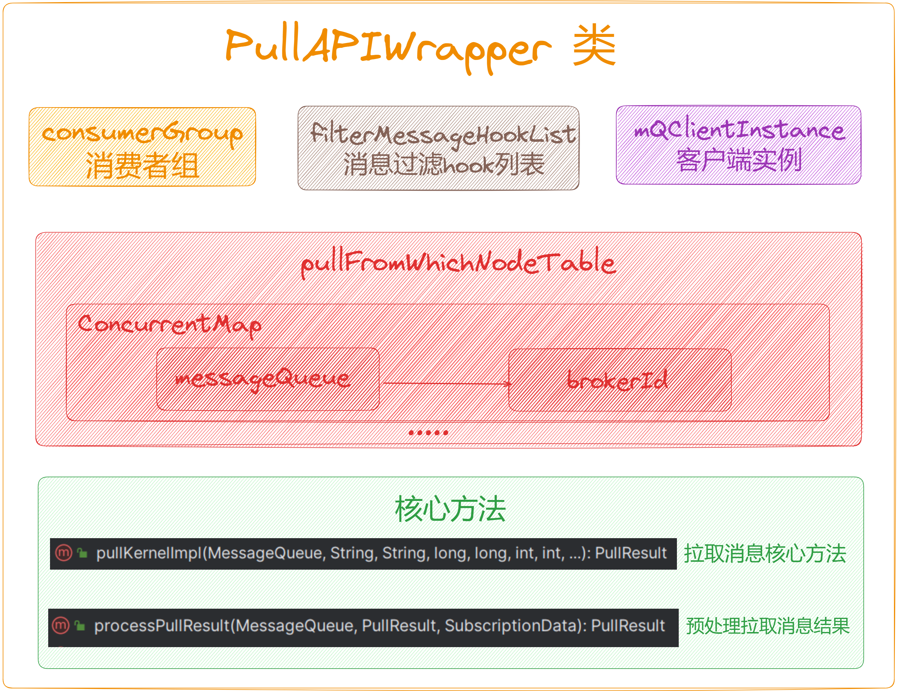

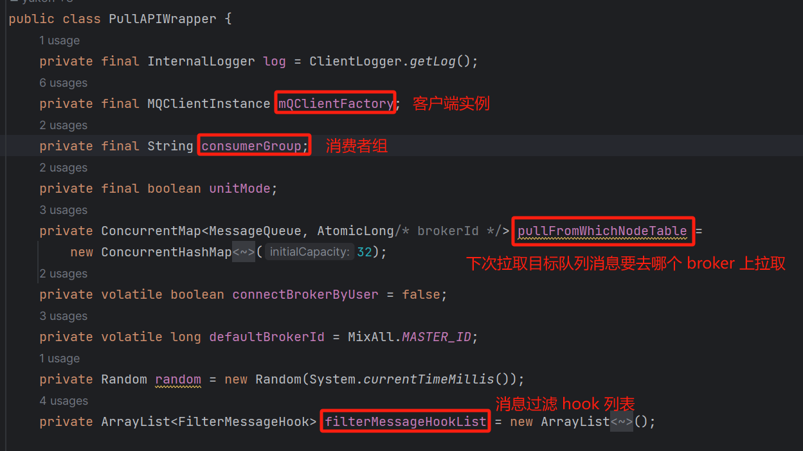

源码位置：[https://github.com/apache/rocketmq/blob/release-5.1.2/client/src/main/java/org/apache/rocketmq/client/impl/consumer/PullAPIWrapper.java](https://github.com/apache/rocketmq/blob/release-5.1.2/client/src/main/java/org/apache/rocketmq/client/impl/consumer/PullAPIWrapper.java)

从上图可以看到拉取消息的核心方法是 [pullKernelImpl()](http://pullkernelimpl\(\)/) ，真正的消息拉取逻辑如下：

/\*\*

\* PullAPIWrapper 类方法

\* @return 拉取结果

\*/

public PullResult pullKernelImpl(

final MessageQueue mq,

final String subExpression,

final String expressionType,

final long subVersion,

final long offset,

final int maxNums,

final int sysFlag,

final long commitOffset,

final long brokerSuspendMaxTimeMillis,

final long timeoutMillis,

final CommunicationMode communicationMode,

final PullCallback pullCallback

) throws MQClientException, RemotingException, MQBrokerException, InterruptedException {

....

// 找到了 broker

if (findBrokerResult != null) {

....

// 构造 PullMessageRequestHeader 请求头

PullMessageRequestHeader requestHeader \= new PullMessageRequestHeader();

requestHeader.setConsumerGroup(this.consumerGroup); // 消费者组

requestHeader.setTopic(mq.getTopic()); // topic

requestHeader.setQueueId(mq.getQueueId()); // 队列id

requestHeader.setQueueOffset(offset); // 拉取偏移量

requestHeader.setMaxMsgNums(maxNums); // 最大拉取消息数量

requestHeader.setSysFlag(sysFlagInner); // 系统标记

requestHeader.setCommitOffset(commitOffset); // 提交的消费点位

requestHeader.setSuspendTimeoutMillis(brokerSuspendMaxTimeMillis); // broker 挂起请求的最长时间，默认15s

requestHeader.setSubscription(subExpression); // 订阅关系表达式，它仅支持或操作，如“tag1 | | tag2 | | tag3”，如果为 null 或 \*，则表示订阅全部

requestHeader.setSubVersion(subVersion); // 订阅关系版本

requestHeader.setExpressionType(expressionType); // 表达式类型 TAG 或者SQL92

requestHeader.setBname(mq.getBrokerName()); // broker 名称

String brokerAddr \= findBrokerResult.getBrokerAddr(); // 获取 broker 地址

if (PullSysFlag.hasClassFilterFlag(sysFlagInner)) {

// 如果含 classFilter 文件，则上传到 FilterServer

brokerAddr = computePullFromWhichFilterServer(mq.getTopic(), brokerAddr);

}

// 调用 MQClientAPIImpl#pullMessage 方法发送请求，进行消息拉取并返回一个拉取结果

// 注意： 拉取消息时会根据拉取模式是同步、异步，决定是回调还是直接处理

// 参数1：brokerAddr，本次拉消息请求的服务器地址

// 参数2：requestHeader，拉消息业务参数封装对象

// 参数3：timeoutMillis，网络调用超时限制 30秒

// 参数4：communicationMode，RPC调用模式 这里是 异步模式

// 参数5：pullCallback，拉消息结果处理对象

PullResult pullResult \= this.mQClientFactory.getMQClientAPIImpl().pullMessage(

brokerAddr,

requestHeader,

timeoutMillis,

communicationMode,

pullCallback);

return pullResult;

}

throw new MQClientException("The broker\[" + mq.getBrokerName() + "\] not exist", null);

}

这里的参数 [brokerSuspendMaxTimeMillis](http://brokersuspendmaxtimemillis/)，默认值为15 s 代表进行消息拉取时 broker 的最长阻塞时间。

当进行消息拉取时，如果 broker 端没有消息，则进行阻塞，否则会对消息体进行打包并直接返回。

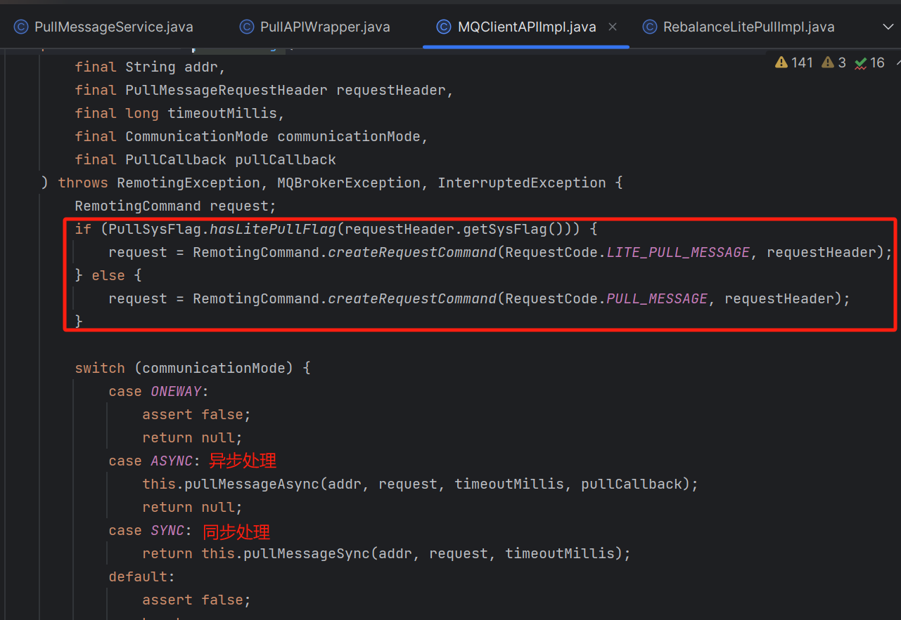

这里的消息拉取主要有两个请求码

1.  [LITE\_PULL\_MESSAGE](http://lite_pull_message/): 提供了 Subscribe 和 Assign 的使用方式，使用起来更方便。可以理解为 push 方式，本质还是 pull。
2.  [PULL\_MESSAGE](http://pull_message%20/) : 原始的消息拉取方式，需要自己手动更新消费位点。

虽然这里请求码是两个，实际 broker 的处理器都是同一个。

## **2.3 服务端长轮询实现**

  
RocketMQ 的长轮询是在 broker 上实现，具体的源码实现在 [PullMessageProcessor](http://pullmessageprocessor/) 中，整个启动调用链路如下：

BrokerStartup

|-start()

|-createBrokerController(String\[\] args)

|-BrokerController() // BrokerController构造方法

|-new PullMessageProcessor(this);

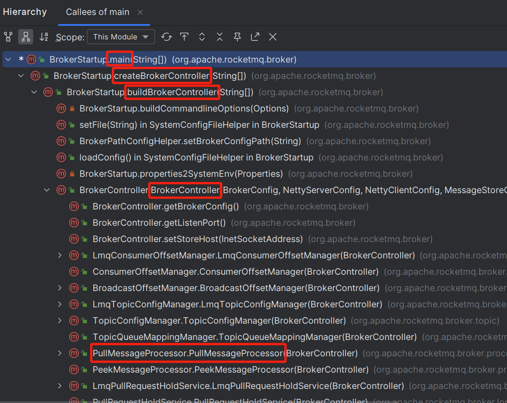

当 broker 启动完成之后，[PullMessageProcessor](http://pullmessageprocessor/) 服务将能够被远程的消费者访问到，通过网络进行消息拉取调用操作。

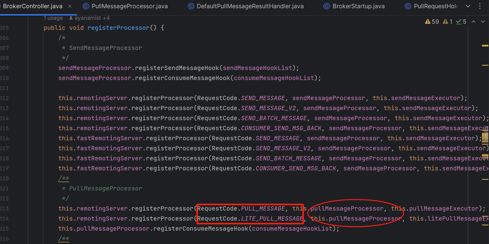

这里我们可以看到 [LITE\_PULL\_MESSAGE](http://lite_pull_message/) 和 [PULL\_MESSAGE](http://pull_message/) 请求对应的处理器类都是 [PullMessageProcessor](http://pullmessageprocessor/) 这个类，我们重点看方法 [processRequest](http://processrequest/)，它是拉取消息网络交互的核心方法。

## **2.3.1 PullMessageProcessor.processRequest()**

该方法是 broker 对外提供消息拉取的服务方法，它提供针对不同拉取结果的处理逻辑。

源码位置：[https://github.com/apache/rocketmq/blob/release-5.1.2/broker/src/main/java/org/apache/rocketmq/broker/processor/PullMessageProcessor.java](https://github.com/apache/rocketmq/blob/release-5.1.2/broker/src/main/java/org/apache/rocketmq/broker/processor/PullMessageProcessor.java)

[https://github.com/apache/rocketmq/blob/release-5.1.2/broker/src/main/java/org/apache/rocketmq/broker/processor/DefaultPullMessageResultHandler.java](https://github.com/apache/rocketmq/blob/release-5.1.2/broker/src/main/java/org/apache/rocketmq/broker/processor/DefaultPullMessageResultHandler.java)

可以看到这个方法的逻辑非常多。但是大部分逻辑都和我们今天要分析的无关。这里只挑重点分析。消息拉取的核心方法在这里，如下：

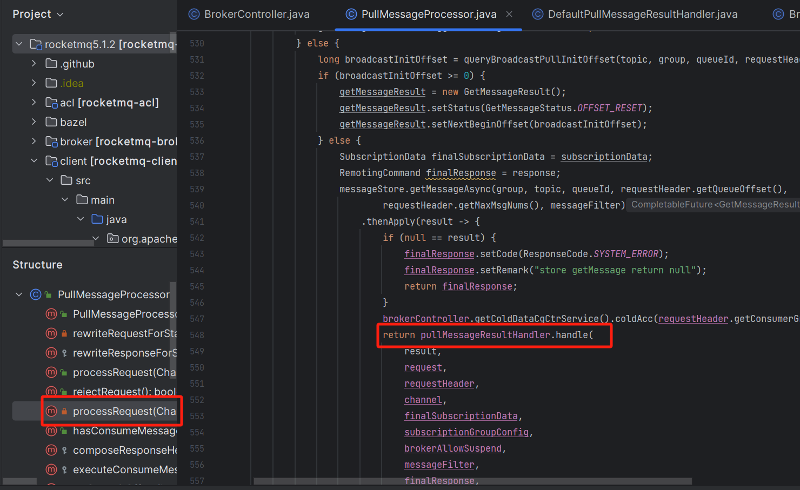

这里消息拉取的处理逻辑是通过 [CompletableFuture](http://completablefuture/) 来组装完成的。

首先是调用 [messageStore.getMessageAsync](http://messagestore.getmessageasync/) 获取一个 [CompletableFuture<GetMessageResult>](http://completablefuturegetmessageresult/)，随后将[GetMessageResult](http://getmessageresult/) 传入 [pullMessageResultHandler.handle](http://pullmessageresulthandler.handle/) 方法，所以长轮询的核心方法是在[pullMessageResultHandler.handle](http://pullmessageresulthandler.handle/) 中，我们进去看看。

## **2.3.2 DefaultPullMessageResultHandler.handle()**

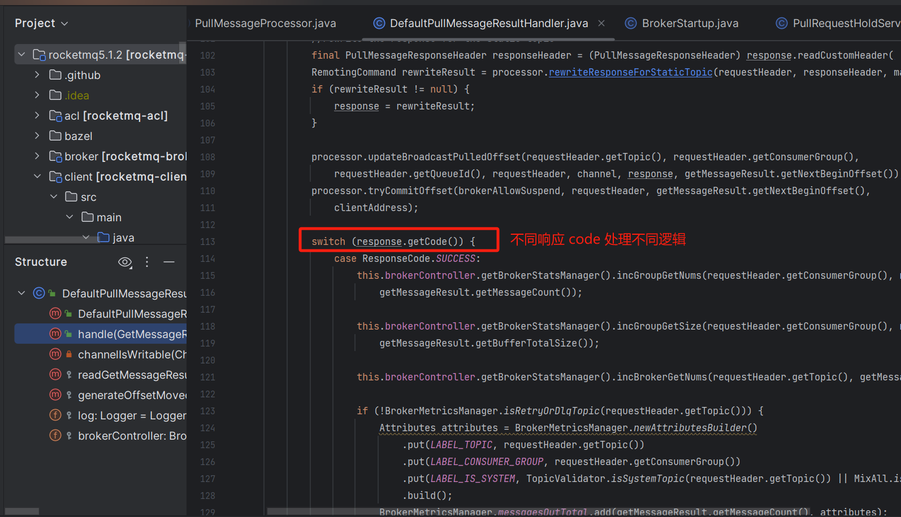

可以看到这里的方法会对上面消息拉取的结果进行处理，拉取的结果包括四个状态码：

1.  [ResponseCode.SUCCESS](http://responsecode.success/)：RocektMQ 将消息拉取结果以 byte 数组形式设置到拉取响应中，并会返回给客户端。
2.  [ResponseCode.PULL\_NOT\_FOUND](http://responsecode.pull_not_found/)：**当前未拉取到消息，**RocketMQ 会调用 [PullRequestHoldService](http://pullrequestholdservice/) 将请求 hold 住，不会返回客户端响应，这里就是长轮询的核心逻辑。
3.  [ResponseCode.PULL\_RETRY\_IMMEDIATELY](http://responsecode.pull_retry_immediately/)。
4.  [ResponseCode.PULL\_OFFSET\_MOVED](http://responsecode.pull_offset_moved/)。

这里我们重点关注 [ResponseCode.PULL\_NOT\_FOUND](http://responsecode.pull_not_found/) 消息没拉取到这个状态码的处理逻辑。

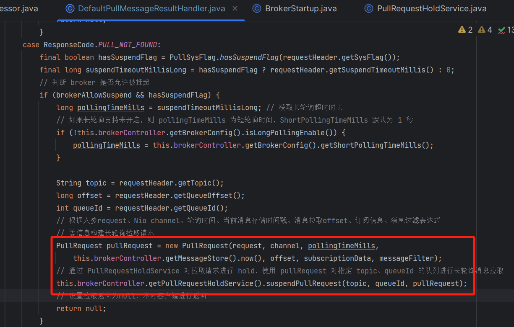

我们总结一下这块的处理逻辑：

1.  首先判断 broker 是否允许被挂起，如果允许则执行长轮询业务逻辑。
2.  获取长轮询超时时长，该参数可配置，如果长轮询支持未开启则改用短轮询时间，默认为1s。
3.  从消息拉取请求头中获取 topic、队列 offset、队列 id。
4.  构造长轮询消息拉取请求对象 PullRequest。
5.  调用 [PullRequestHoldService](http://pullrequestholdservice%20/) 进行长轮询操作。
6.  拉取返回为空，在超时之前不对客户端进行返回。

这里可以看到两行关键代码：

1.  返回值为 null。
2.  调用了 [PullRequestHoldService#suspendPullRequest](http://pullrequestholdservice/#suspendPullRequest) 方法。

我们来重点分析一下返回值为 null 意味着什么呢？**其实很简单，就是请求被挂起了**。

## **2.3.3 NettyRemotingAbstract.writeResponse()**

这里可以看看 client 和 server 网络通信的代码:

  
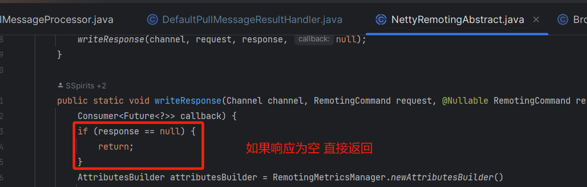

可以看到如果返回值 response 为 null 则什么也不做，意味着**请求被挂起**，**其实客户端不会收到任何响应**。

那么什么时候请求恢复的呢？就是 PullRequestHoldService 闪亮登场的时候了。

## **2.3.4 PullRequestHoldService 长轮询线程**

从上面的剖析得知，长轮询真正的执行者为 [PullRequestHoldService](http://pullrequestholdservice/)，先来看下这个 [suspendPullRequest](http://suspendpullrequest/) 方法。

源码位置：[https://github.com/apache/rocketmq/blob/release-5.1.2/broker/src/main/java/org/apache/rocketmq/broker/longpolling/PullRequestHoldService.java](https://github.com/apache/rocketmq/blob/release-5.1.2/broker/src/main/java/org/apache/rocketmq/broker/longpolling/PullRequestHoldService.java)

public void suspendPullRequest(final String topic,final int queueId,final PullRequest pullRequest) {

// 构建存储key，用于标识特定的topic和queueId

String key \= this.buildKey(topic,queueId);

// 从 pullRequestTable 中获取对应 topic+queueId 下的拉取请求 ManyPullRequest 对象

ManyPullRequest mpr \= this.pullRequestTable.get(key);

// 如果获取的 mpr 为 null，则创建一个新的 ManyPullRequest 对象，并放入 pullRequestTable 中

if (null == mpr) {

mpr = new ManyPullRequest();

ManyPullRequest prev \= this.pullRequestTable.putIfAbsent(key,mpr);

if (prev != null) {

mpr = prev;

}

}

// 设置 pullRequest 的请求命令为挂起状态

pullRequest.getRequestCommand().setSuspended(true);

// 将 pullRequest 添加到 ManyPullRequest 对象中

mpr.addPullRequest(pullRequest);

}

注意，这里的 [ManyPullRequest](http://manypullrequest/) 对象实际上是一组 [PullRequest](http://pullrequest/) 的集合，它封装了一个 [topic+queueId](http://topic+queueid/) 下的一批消息。

这里可以看到将[PullRequest](http://pullrequest/) 请求放入到一个 [PullRequestTable](http://pullrequesttable/) 请求缓存表中，也就是这个请求被暂存了。那什么时候[PullRequest](http://pullrequest/) 被拿出来重新处理呢？

其实请求会在长轮询线程启动时执行，具体的检测逻辑通过方法 [checkHoldRequest()](http://checkholdrequest\(\)/) 实现。

先来看下该类的继承关系。

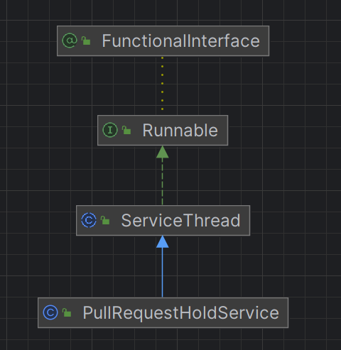

通过上图得知，[PullRequestHoldService](http://pullrequestholdservice/) 继承了 [ServiceThread](http://servicethread/) 抽象类，[ServiceThread](http://servicethread/) 简单理解就是一个线程，那么很明显它是一个单线程任务，就会开一个单独的线程来跑你这个任务。而后续的延迟处理操作都是在该线程任务中实现

我们看看 [PullRequestHoldService](http://pullrequestholdservice/) 是何时启动该线程的。

  
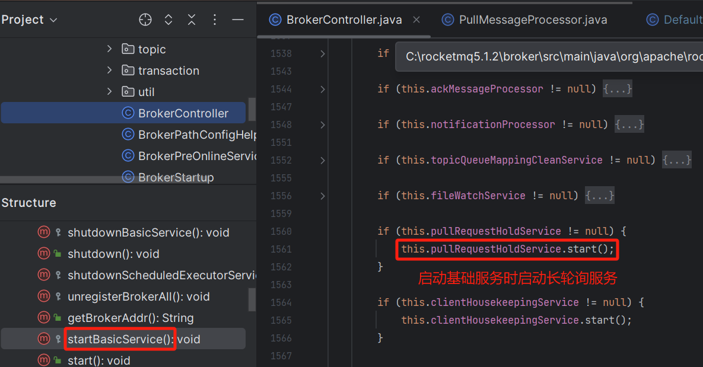

接下来我们看看 [PullRequestHoldService](http://pullrequestholdservice/) 具体干了什么，我们重点关注其 **run()** 方法。

public class PullRequestHoldService extends ServiceThread {

// broker 控制器

protected final BrokerController brokerController;

// 请求缓存表

protected ConcurrentMap<String/\* topic@queueId \*/, ManyPullRequest> pullRequestTable =

new ConcurrentHashMap<>(1024);

@Override

public void run() {

log.info("{} service started", this.getServiceName());

while (!this.isStopped()) {

try {

// 如果支持长轮询，则等待 5 秒

if (this.brokerController.getBrokerConfig().isLongPollingEnable()) {

this.waitForRunning(5 \* 1000);

} else {

// 短轮询则默认等待1s

this.waitForRunning(this.brokerController.getBrokerConfig().

getShortPollingTimeMills());

}

long beginLockTimestamp \= this.systemClock.now();

// 检测 hold 请求

this.checkHoldRequest();

// 如果检测花费时间超过5s打印日志

long costTime \= this.systemClock.now() - beginLockTimestamp;

if (costTime > 5 \* 1000) {

log.warn("PullRequestHoldService: check hold pull request cost {}ms", costTime);

}

} catch (Throwable e) {

log.warn(this.getServiceName() + " service has exception. ", e);

}

}

log.info("{} service end", this.getServiceName());

}

该方法调用 [checkHoldRequest](http://checkholdrequest/) 不断检测被 hold 住的请求，它不断检查是否有消息获取成功。

1.  设置了一个开关，然后就是死循环轮询。
2.  查看 [brokerConfig](http://brokerconfig/) 长轮询开关 [longPollingEnable](http://longpollingenable/) 是否开启，默认开启。
3.  长轮询则休眠等待 5 秒，未开启长轮询则使用 broker 配置 [shortPollingTimeMills](http://shortpollingtimemills/) 短轮询，默认休眠 1 s。
4.  休眠完成后调用 [checkHoldRequest](http://checkholdrequest/) 方法检查被 hold 的请求。

所以我们接下来该剖析 [checkHoldRequest](http://checkholdrequest/) 方法了。

protected void checkHoldRequest() {

// 遍历 PullRequest，其中 key=topic@queueId

for (String key : this.pullRequestTable.keySet()) {

// 解析出topic queueId

String\[\] kArray = key.split(TOPIC\_QUEUEID\_SEPARATOR);

if (2 == kArray.length) {

String topic \= kArray\[0\];

int queueId \= Integer.parseInt(kArray\[1\]);

// 获取当前获取的数据的最大offset

final long offset \= this.brokerController.getMessageStore().

getMaxOffsetInQueue(topic, queueId);

try {

// 通知消息到达

this.notifyMessageArriving(topic, queueId, offset);

} catch (Throwable e) {

log.error("PullRequestHoldService: failed to check hold request failed, topic={}, queueId={}", topic, queueId, e);

}

}

}

}

可以看到该方法遍历解析 [pullRequestTable](http://pullrequesttable/)，对 key 进行解析，取出 topic、queueId，获取 topic+queueId 对应的当前 [MessageQueue](http://messagequeue/) 的最大 offset，并与当前的 offset 对比从而确定是否有新消息到达，具体对比逻辑在[notifyMessageArriving](http://notifymessagearriving/) 方法中实现。

> 注意：这里的检测逻辑是异步处理的，即后台检测线程 PullRequestHoldService 一直在运行；在PullMessageProcessor 中提交待检测的 PullRequest 到 PullRequestHoldService，并将其放入pullRequestTable，等待被 PullRequestHoldService 线程进行处理。

public void notifyMessageArriving(final String topic, final int queueId, final long maxOffset, final Long tagsCode,

long msgStoreTime, byte\[\] filterBitMap, Map<String, String> properties) {

String key \= this.buildKey(topic, queueId);

ManyPullRequest mpr \= this.pullRequestTable.get(key);

if (mpr != null) {

// 根据 key=topic@queueId 从 pullRequestTable 获取 ManyPullRequest

// 如果 ManyPullRequest 不为空，拷贝 ManyPullRequest 中的 List<PullRequest>

List<PullRequest> requestList = mpr.cloneListAndClear();

if (requestList != null) {

// 构造响应 list

List<PullRequest> replayList = new ArrayList<>();

// 遍历请求 list

for (PullRequest request : requestList) {

long newestOffset \= maxOffset;

// 如果当前最新的 offset 小于等于请求的 offset

if (newestOffset <= request.getPullFromThisOffset()) {

// 当前最新的 offset 就是队列的最大 offset

newestOffset = this.brokerController.getMessageStore().

getMaxOffsetInQueue(topic, queueId);

}

// 1、如果当前最新 offset 大于请求 offset，也就是有新消息到来

if (newestOffset > request.getPullFromThisOffset()) {

// 判断消息是否满足过滤表达式

boolean match \= request.getMessageFilter().isMatchedByConsumeQueue(tagsCode,

new ConsumeQueueExt.CqExtUnit(tagsCode, msgStoreTime, filterBitMap));

// match by bit map, need eval again when properties is not null.

if (match && properties != null) {

match = request.getMessageFilter().isMatchedByCommitLog(null, properties);

}

if (match) {

try {

// 消息匹配，则将消息返回客户端

this.brokerController.getPullMessageProcessor().

executeRequestWhenWakeup(request.getClientChannel(),

request.getRequestCommand());

} catch (Throwable e) {

log.error(

"PullRequestHoldService#notifyMessageArriving: failed to execute request when " \+ "message matched, topic={}, queueId={}", topic, queueId, e);

}

continue;

}

}

// 判断是否超时

if (System.currentTimeMillis() >= (request.getSuspendTimestamp() + request.getTimeoutMillis())) {

try {

// 2、如果当前时间 >= 请求超时时间 + hold 时间，则返回客户端消息未找到

this.brokerController.getPullMessageProcessor().

executeRequestWhenWakeup(request.getClientChannel(),

request.getRequestCommand());

} catch (Throwable e) {

log.error(

"PullRequestHoldService#notifyMessageArriving: failed to execute request when time's " \+ "up, topic={}, queueId={}", topic, queueId, e);

}

continue;

}

// 添加返回响应

replayList.add(request);

}

if (!replayList.isEmpty()) {

// 3、添加请求到 ManyPullRequest

mpr.addPullRequest(replayList);

}

}

}

}

总结一下，[notifyMessageArriving](http://notifymessagearriving/) 主要作用为判断消息是否到来，并根据判断结果对客户端进行相应。处理流程如下:

1.  比较maxOffset与当前的offset，如果当前最新offset大于请求offset，也就是有新消息到来，则将新消息返回给客户端。
2.  校验是否超时，如果当前时间 >= 请求超时时间+ hold 阻塞时间，则返回客户端消息未找到。
3.  如果两者都不满足，则将请求放回 [ManyPullRequest](http://manypullrequest/) 中。

该方法会在 [PullRequestHoldService](http://pullrequestholdservice/) 中循环调用进行检查，也会在 [DefaultMessageStore](http://defaultmessagestore/) 中消息被存储的时候调用。正好匹配「**主动检查**」与「**被动通知**」共同完成操作，保证请求顺利被执行。

但是你是否会有以下疑惑呢？

就是这里时 5 秒轮询一次去处理被 hold 住的消息，显然 5 秒时间间隔是不够的，这样很容易造成消息消费延时的，那么如何处理呢？

首先看下该方法在哪里被调用，通过下图得知是被 [NotifyMessageArrivingListener](http://notifymessagearrivinglistener/#arriving)[#](http://notifymessagearrivinglistener/#arriving)[arriving](http://notifymessagearrivinglistener/#arriving) 调用。

  
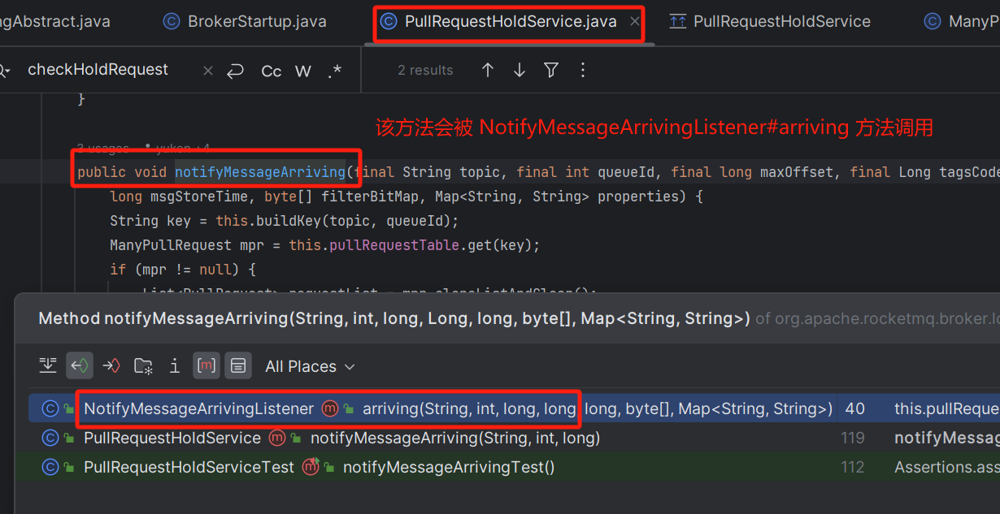

我们再深入看下 [NotifyMessageArrivingListener](http://notifymessagearrivinglistener/#arriving)[#](http://notifymessagearrivinglistener/#arriving)[arriving](http://notifymessagearrivinglistener/#arriving) 方法在哪里被调用。

  
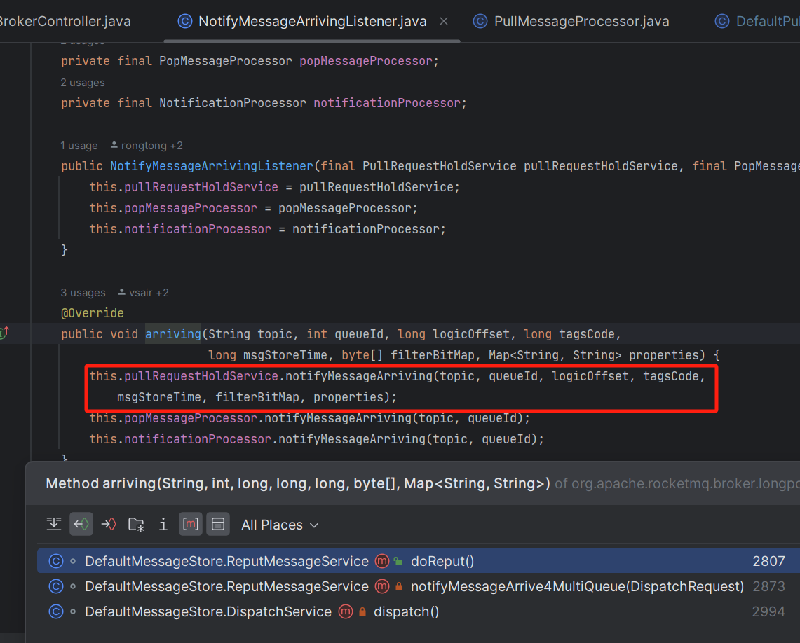

这里有三个地方调用了，我们来看看消息重放 [ReputMessageService](http://reputmessageservice/) 类，它也是启动一个线程去轮询，不同的是休眠时间只有 1 毫秒。

  
源码位置：[https://github.com/apache/rocketmq/blob/release-5.1.2/store/src/main/java/org/apache/rocketmq/store/DefaultMessageStore.java](https://github.com/apache/rocketmq/blob/release-5.1.2/store/src/main/java/org/apache/rocketmq/store/DefaultMessageStore.java)

  
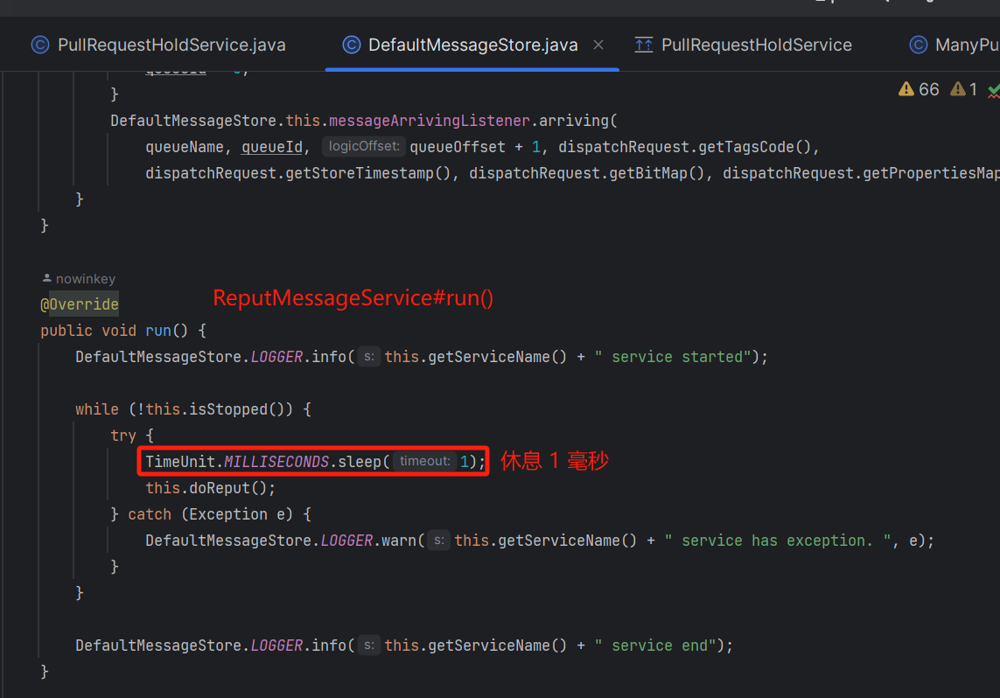

再来看下 doReput 都做了啥？

  
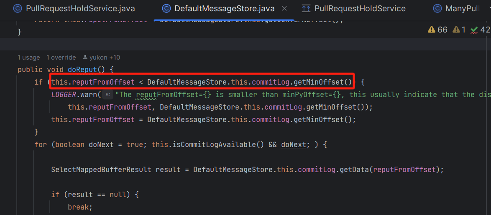

可以看到主要是去拉取消息，通过比较 [reputFromOffset](http://reputfromoffset/) 和 [commitlog](http://commitlog/) 的 [MaxOffset](http://maxoffset/) 对比看是否有新消息。如果有新消息则执行消息分发方法，如下。

  
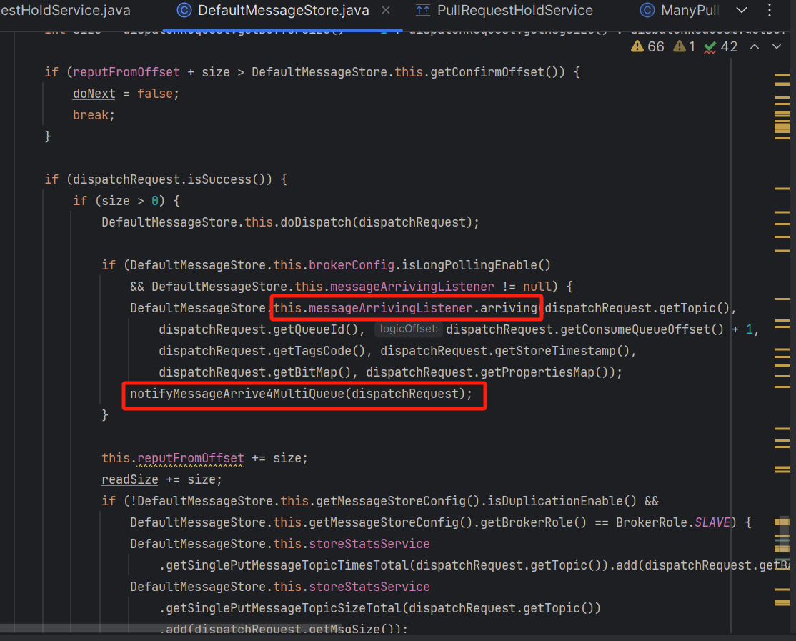

这里就调用了前面长轮询处理消息的方法 [NotifyMessageArrivingListener#arriving()](http://notifymessagearrivinglistener/#arriving\(\))。

当服务端处理完成之后响应客户端，客户端会在消息处理完成之后再次将拉取请求 [pullRequest](http://pullrequest/) 放到[PullMessageService](http://pullmessageservice/) 中，等待下次轮询，这样就能够一直进行消息拉取操作。

## **03 总结**

通过本篇的梳理和了解，RocektMQ 并没有使用「**推模式**」或者「**拉模式**」，而是使用了结合两者优点的「**长轮询**」机制，它本质上还是拉模式，但服务端能够通过 hold 住请求的方式减少客户端对服务端的频繁访问，从而提高资源利用率及消息响应实时性。