大家好，我是**华仔**, 又跟大家见面了。

从今天开始我将继续为大家奉上 RocketMQ 消费者源码剖析系列文章，正式开启「**RocketMQ 的 消费者源码之旅**」，这是第三篇，本篇我们将以「**RocketMQ 4.9.7**」版本为主，来剖析下 RocketMQ 源码之消费者是如何从 Broker 拉取数据的。

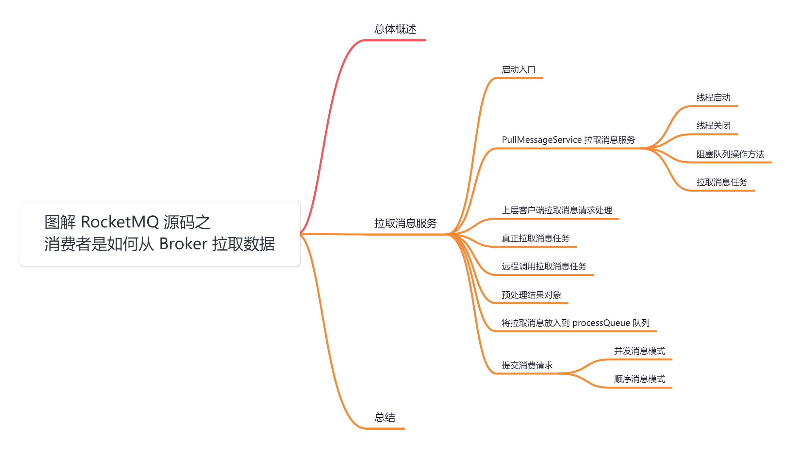

## **01 总体概述**

在 [【消费者源码分析系列第二篇】图解 RocketMQ 源码之消费者启动流程](https://articles.zsxq.com/id_w5nzh7vnxd4u.html) 上一篇中，我们深度剖析了基于 Push 模式的消费者启动全流程。

> 所谓的 push 模式并不是 Broker 主动去 push 消息给客户端，本质上还是客户端去 pull 消息，只不过这个过程客户端是帮你做了而已。实际上还是在内部启了一个 PullMessageServieScheduledThread 线程专门去向Broker 拉取消息。

在启动过程的最后步骤，启动了「**拉取消息**」的服务，今天我们就来看看它是如何工作的？

##   
**02 拉取消息服务**

## **2.1 启动入口**

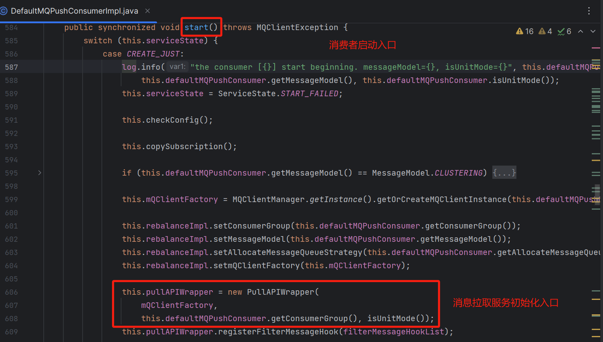

可以看到这里先进行实例化 [pullAPIWrapper](http://pullapiwrapper/) 对象，然后会在下面启动 [MQClientInstance](http://mqclientinstance/) 实例，而在该实例启动时会启动拉取服务 [pullMessageService](http://pullmessageservice/)。

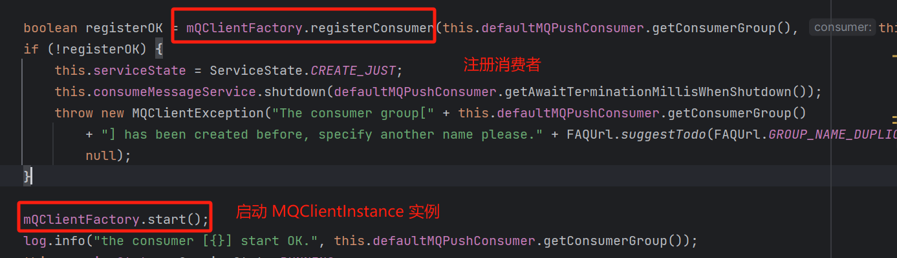

中间流程省略，可以点击上面的连接查看启动全流程。

public void start() throws MQClientException {

synchronized (this) {

// 根据当前状态进行处理

switch (this.serviceState) {

case CREATE\_JUST:

// 将状态设置为启动失败

this.serviceState = ServiceState.START\_FAILED;

// 如果未指定namesrv地址，则从namesrv获取地址

if (null == this.clientConfig.getNamesrvAddr()) {

this.mQClientAPIImpl.fetchNameServerAddr();

}

// 启动客户端 Netty 远程通讯服务

this.mQClientAPIImpl.start();

// 启动定时任务

this.startScheduledTask();

// 启动拉取消息服务

this.pullMessageService.start();

// 启动负载均衡服务

this.rebalanceService.start();

// 启动消息推送服务

this.defaultMQProducer.getDefaultMQProducerImpl().start(false);

// 记录日志，表示客户端工厂启动成功

log.info("the client factory \[{}\] start OK",this.clientId);

// 将状态设置为正在运行

this.serviceState = ServiceState.RUNNING;

break;

case START\_FAILED:

// 抛出客户端异常，表示客户端工厂已经创建且启动失败

throw new MQClientException("The Factory object\[" + this.getClientId() + "\] has been created before,and failed.",null);

default:

break;

}

}

}

这里的跟本文相关的重点是「**启动拉取消息服务**」，它主要负责拉取消息的核心组件，该组件启动的线程会不停地从 Broker 拉取数据。

##   
**2.2 PullMessageService 拉取消息服务**

消费者拉消息的流程和「**重平衡服务**」息息相关的，在「**重平衡服务**」方法的最后，将创建的 [PullRequest](http://pullrequest/) 对象转交给「**PullMessageService**」拉取消息服务，这里我们就以 「**PullMessageService**」为开始来深度剖析下消费者拉取消息的流程。

关于「**重平衡服务**」我们会在后面篇章单独剖析，这里大家知道有这么一个服务即可。

在上一小节中，我们知道「**PullMessageService**」是在客户端实例「**MQClientInstance**」里面启动的一个服务，在客户端实例启动阶段就会将该服务启动起来，「**PullMessageService**」继承自「**ServiceThread**」，因此它也是一个异步线程任务，里面有自己的线程，该线程启动后会基于「**PullMessageService**」里面的阻塞队列「**queue**」做相关工作，该「**queue**」里面的每个对象就是「**PullRequest**」对象，基于这些信息可以发起拉消息的请求。

因此 「**PullMessageService**」的工作职责是从 [LinkedBlockQueue](http://linkedblockqueue/) 中循环取 [PullRequest](http://pullrequest/) 对象，然后执行[pullMessage](http://pullmessage/) 方法，进而去请求 broker 获取消息。

> 注意：
> 
> 1、一个应用程序（消费端）中一个消费组对应一个 DefaultMQPushConsumerImpl （同一个IP:端口）。
> 
> 2、注意同一个 JVM 中只有一个 MQClientInstance 。
> 
> 3、每一个 MQClientInstance 中持有一个 PullMessageServive 实例。
> 
> 4、同一个应用程序中，如果存在多个消费组，那么多个 DefaultMQPushConsumerImpl 的消息拉取，都需要依靠一个 PullMessageServive。

## **2.2.1 线程启动**

启动拉取消息服务 [PullMessageService](http://pullmessageservice/)，它是一个异步线程，拉取消息的核心方法 [PullMessageService#pullMessage](http://pullmessageservice/#pullMessage)。

源码位置：[https://github.com/apache/rocketmq/blob/release-4.9.7/client/src/main/java/org/apache/rocketmq/client/impl/consumer/PullMessageService.java](https://github.com/apache/rocketmq/blob/release-4.9.7/client/src/main/java/org/apache/rocketmq/client/impl/consumer/PullMessageService.java)

public class PullMessageService extends ServiceThread {

private final InternalLogger log \= ClientLogger.getLog();

// 存放 PullRequest 的阻塞队列

private final LinkedBlockingQueue<PullRequest> pullRequestQueue = new LinkedBlockingQueue<PullRequest>();

// MQClientInstance 客户端实例

private final MQClientInstance mQClientFactory;

// 定时任务执行服务，主要用于延迟添加 pullRequest

private final ScheduledExecutorService scheduledExecutorService \= Executors

.newSingleThreadScheduledExecutor(new ThreadFactory() {

@Override

public Thread newThread(Runnable r) {

return new Thread(r, "PullMessageServiceScheduledThread");

}

});

public void run() {

log.info(this.getServiceName() + " service started");

/\*

\* 运行时逻辑

\* 如果服务没有停止，则在死循环中执行拉取消息的操作

\* Stopped 声明为 volatile，每执行一次业务逻辑，检测一下其运行状态，可以通过其他线程将Stopped 设置为 true，从而停止该线程

\*/

while (!this.isStopped()) {

try {

// 线程大部分时间都处于阻塞等待状态

// 从 pullRequestQueue 中获取一个 PullRequest 消息拉取请求任务，如果pullRequestQueue 为空，则线程将阻塞，直到有拉取任务被放入

PullRequest pullRequest \= this.pullRequestQueue.take();

// 调用 pullMessage 方法进行消息拉取，通过客户端实例查找当前 pullRequest 归属Consumer 对象

this.pullMessage(pullRequest);

} catch (InterruptedException ignored) {

} catch (Exception e) {

log.error("Pull Message Service Run Method exception", e);

}

}

log.info(this.getServiceName() + " service end");

}

}

在 run 方法在一个循环中，它会监听阻塞队列 [pullRequestQueue](http://pullrequestqueue/)，不断地从 [pullRequestQueue](http://pullrequestqueue%20/) 中阻塞式的获取并移除队列的头部数据，即拉取消息的请求，当队列是空的时候会一直阻塞。如果不为空，则会从队列中获取 [PullRequest](http://pullrequest/) 请求对象去拉取消息然后调用 pullMessage 方法根据该请求去 broker 拉取消息，示意图如下：

> 从命名看其实很贴切，就是它的字面意思，大家暂时理解为有了这个请求，才会去拉取消息。

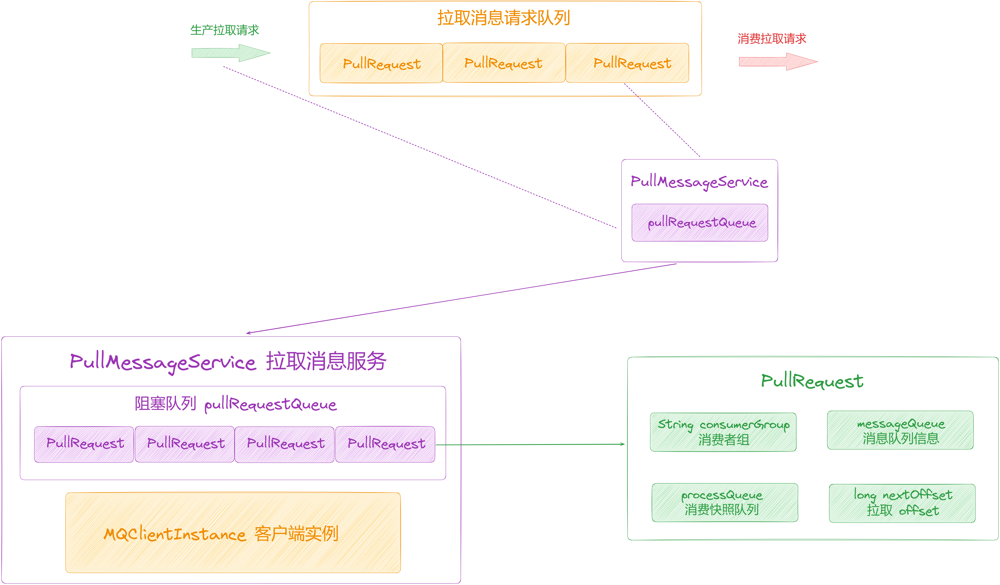

// PullRequest 是一个对象，保存待拉取的消息队列和正在处理的队里 ProcessQueue 消息处理队列，从Broker 中拉取到的消息会先存入 ProccessQueue；

public class PullRequest {

// 消费者组

private String consumerGroup;

// 待拉取的消息队列信息

private MessageQueue messageQueue;

// 消息处理队列（消费者本地的快照队列，从服务器拉取下来的消息要先放到该快照队列内，消费任务被消费的消息需要从该队列移除走）

private ProcessQueue processQueue;

// 待拉取的 MessageQueue 偏移量，即 本次拉消息请求，使用offset （服务器端需要根据该 offset 进行定位消息位置，然后才可以获取一批消息）

private long nextOffset;

// 是否被锁定

private boolean previouslyLocked \= false;

}

这里卖个关子，给大家遗留一个问题就是 「**pullRequest 请求对象是从哪里来的，又是在什么情况下放入 pullRequestQueue 队列中的**」？

大家可以大胆猜猜。

## **2.2.2 线程关闭**

@Override

public void shutdown(boolean interrupt) {

// 调用父类的shutdown方法，关闭消息中间件客户端

super.shutdown(interrupt);

// 优雅地关闭scheduledExecutorService，等待最长1000毫秒

ThreadUtils.shutdownGracefully(this.scheduledExecutorService,1000,TimeUnit.MILLISECONDS);

}

关闭线程非常简单，先调用父类的 [shutdown](http://shutdown/) 方法来关闭客户端，然后优雅地关闭该实例的[scheduledExecutorService](http://scheduledexecutorservice/)。

这里的 [shutdownGracefully](http://shutdowngracefully/) 方法是一个线程池的优雅关闭方法，会等待指定的时间来让线程池中的任务完成，然后关闭线程池。

> 它的使用场景是在关闭消息中间件客户端时，确保相关的线程池能够优雅地关闭，防止出现任务丢失或线程池资源未释放的情况。

## **2.2.3 阻塞队列操作方法**

在客户端上层调用放入 「**PullRequestQueue**」队列的时候用到了两种方法如下：

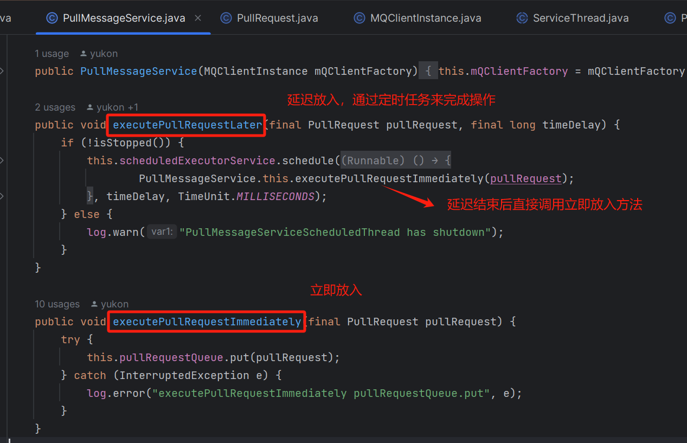

## **2.2.4 拉取消息任务**

下面我们接着 **2.2.1 节**，当取出拉取请求后，调用 [pullMessage](http://pullmessage/) 方法进行拉取。

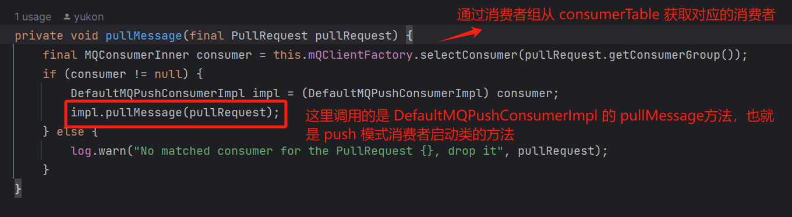

// 强制转型，在 RocketMQ 中经常被用到

// 调用消费者实例拉取消息

DefaultMQPushConsumerImpl impl \= (DefaultMQPushConsumerImpl) consumer;

其他方法相对比较简单，这里就不再剖析，自行学习。接着我们来看下拉取消息请求的上层方法。

## **2.3 上层客户端拉取消息请求处理**

源码位置：[https://github.com/apache/rocketmq/blob/release-4.9.7/client/src/main/java/org/apache/rocketmq/client/impl/consumer/DefaultMQPushConsumerImpl.java](https://github.com/apache/rocketmq/blob/release-4.9.7/client/src/main/java/org/apache/rocketmq/client/impl/consumer/DefaultMQPushConsumerImpl.java)

其实大家可以看到，在 RocketMQ 中的很多操作都是「**异步处理**」的，向 Broker 拉取请求数据的操作也不例外。因为我们不清楚 Request 什么时候处理完会返回，为了「**不阻塞后续的请求**」这里采用「**异步**」、「**通过 Callback**」的方式来拉取消费数据，代码比较多，如下：

// pullRequest 拉消息请求对象

public void pullMessage(final PullRequest pullRequest) {

// 获取拉消息队列在消费者端的快照队列

// 获取ProcessQueue，如果处理队列状态未被丢弃，则更新拉取时间戳

final ProcessQueue processQueue \= pullRequest.getProcessQueue();

// 如果条件成立则说明该队列状态是“删除”状态，可能是重平衡后被转移到其它消费者了，不再为该队列拉消息了

if (processQueue.isDropped()) {

log.info("the pull request\[{}\] is dropped.", pullRequest.toString());

return;

}

// 设置本次拉取消息时间

pullRequest.getProcessQueue().setLastPullTimestamp(System.currentTimeMillis());

// 1、状态校验

try {

// 确认当前消费者状态是否是运行状态

this.makeSureStateOK();

} catch (MQClientException e) {

log.warn("pullMessage exception, consumer state not ok", e);

// 如果当前消费者状态不是运行状态，则拉消息任务延迟3秒之后再执行

this.executePullRequestLater(pullRequest, pullTimeDelayMillsWhenException);

return;

}

// 如果条件成立则说明消费者处于“暂停”状态

// 拉取任务暂停，则延迟1s再放入PullMessageService队列

if (this.isPause()) {

log.warn("consumer was paused, execute pull request later. instanceName={}, group={}", this.defaultMQPushConsumer.getInstanceName(), this.defaultMQPushConsumer.getConsumerGroup());

// 暂停状态，消费者的拉消息任务延迟1秒之后再执行

this.executePullRequestLater(pullRequest, PULL\_TIME\_DELAY\_MILLS\_WHEN\_SUSPEND);

return;

}

// 2、流控校验

// 获取消费者本地该 queue 快照内缓存的消息数量

long cachedMessageCount \= processQueue.getMsgCount().get();

// 获取消费者本地该 queue 快照内缓存的消息容量size

long cachedMessageSizeInMiB \= processQueue.getMsgSize().get() / (1024 \* 1024);

// 如果条件成立则说明消费者本地快照内还有1000条消息未被消费，本次拉消息请求将被延迟

if (cachedMessageCount > this.defaultMQPushConsumer.getPullThresholdForQueue()) {

// 拉消息请求延迟 50 毫秒..

this.executePullRequestLater(pullRequest, PULL\_TIME\_DELAY\_MILLS\_WHEN\_CACHE\_FLOW\_CONTROL);

// 每流控 1000 次 打印一次日志

if ((queueFlowControlTimes++ % 1000) == 0) {

log.warn(

"the cached message count exceeds the threshold {}, so do flow control, minOffset={}, maxOffset={}, count={}, size={} MiB, pullRequest={}, flowControlTimes={}",

this.defaultMQPushConsumer.getPullThresholdForQueue(), processQueue.getMsgTreeMap().firstKey(), processQueue.getMsgTreeMap().lastKey(), cachedMessageCount, cachedMessageSizeInMiB, pullRequest, queueFlowControlTimes);

}

return;

}

// 如果条件成立则说明消费者本地快照内还有 100 MB消息未被消费，本次拉消息请求将被延迟

if (cachedMessageSizeInMiB > this.defaultMQPushConsumer.getPullThresholdSizeForQueue()) {

// 拉消息请求 延迟 50 毫秒

this.executePullRequestLater(pullRequest, PULL\_TIME\_DELAY\_MILLS\_WHEN\_CACHE\_FLOW\_CONTROL);

// 每流控 1000 次 打印一次日志

if ((queueFlowControlTimes++ % 1000) == 0) {

log.warn(

"the cached message size exceeds the threshold {} MiB, so do flow control, minOffset={}, maxOffset={}, count={}, size={} MiB, pullRequest={}, flowControlTimes={}",

this.defaultMQPushConsumer.getPullThresholdSizeForQueue(), processQueue.getMsgTreeMap().firstKey(), processQueue.getMsgTreeMap().lastKey(), cachedMessageCount, cachedMessageSizeInMiB, pullRequest, queueFlowControlTimes);

}

return;

}

// 3、顺序消费和并发消费的校验

// 并发消息消费，这里存在流控规则，即一批消息的 offset 间隔大于 2000，延时执行–> 将PullRequest,在 50 毫秒后，放入 pullRequestQueue 阻塞队列中，然后再尝试拉取。避免造成大量重复消费

if (!this.consumeOrderly) {

// processQueue.getMaxSpan() 获取快照队列内 最后一条消息 和 第一条消息 的 offset 差值

// 如果条件成立则差值大于流控限制 2000

// 注意：processQueue 内不一定有 2000 条消息 ，因为存在服务器端和客户端过滤逻辑

if (processQueue.getMaxSpan() > this.defaultMQPushConsumer.getConsumeConcurrentlyMaxSpan()) {

// 延迟 拉消息请求 50 毫秒后执行

this.executePullRequestLater(pullRequest, PULL\_TIME\_DELAY\_MILLS\_WHEN\_CACHE\_FLOW\_CONTROL);

// 每流控 1000 次 打印一次日志

if ((queueMaxSpanFlowControlTimes++ % 1000) == 0) {

log.warn(

"the queue's messages, span too long, so do flow control, minOffset={}, maxOffset={}, maxSpan={}, pullRequest={}, flowControlTimes={}",

processQueue.getMsgTreeMap().firstKey(), processQueue.getMsgTreeMap().lastKey(), processQueue.getMaxSpan(),

pullRequest, queueMaxSpanFlowControlTimes);

}

return;

}

} else {

// 顺序消息消费，需要先锁定消费队列

// 这里也存在延时执行拉取消息请求的可能。即当ProcessQueue的读写锁被其他线程占用时。延时3s将PullRequest放入pullRequestQueue阻塞队列中。

if (processQueue.isLocked()) { // 如果已锁定，即当前线程获取到了processQueue的读写锁

if (!pullRequest.isPreviouslyLocked()) { // 如果此前没有锁定过，那么需要设置消费点位

long offset \= -1L;

try {

// 获取该 MessageQueue 的下一个消息的消费偏移量 offset

offset = this.rebalanceImpl.computePullFromWhereWithException(pullRequest.getMessageQueue());

} catch (Exception e) {

// 延迟 3s 发送拉取消息请求

this.executePullRequestLater(pullRequest, pullTimeDelayMillsWhenException);

log.error("Failed to compute pull offset, pullResult: {}", pullRequest, e);

return;

}

// 消费点位超前，那么重设消费点位

boolean brokerBusy \= offset < pullRequest.getNextOffset();

log.info("the first time to pull message, so fix offset from broker. pullRequest: {} NewOffset: {} brokerBusy: {}",

pullRequest, offset, brokerBusy);

if (brokerBusy) {

log.info("\[NOTIFYME\]the first time to pull message, but pull request offset larger than broker consume offset. pullRequest: {} NewOffset: {}",

pullRequest, offset);

}

// 设置 previouslyLocked 为 true，即锁住上一条消息，别的线程拿不到该消息

pullRequest.setPreviouslyLocked(true);

// 重设消费点位

pullRequest.setNextOffset(offset);

}

} else {

// 如果没有被锁住，那么延迟3s发送拉取消息请求

this.executePullRequestLater(pullRequest, pullTimeDelayMillsWhenException);

log.info("pull message later because not locked in broker, {}", pullRequest);

return;

}

}

// 获取 topic 对应的 SubscriptionData 订阅关系

final SubscriptionData subscriptionData \= this.rebalanceImpl.getSubscriptionInner().get(pullRequest.getMessageQueue().getTopic());

// 最终重平衡会对比订阅集合，将移除的订阅主题的processQueue的dropped状态设置为true，然后 该queue对应的pullRequest请求 ，就会退出了

if (null == subscriptionData) { // 如果没有订阅信息

// 延迟 3 秒发送拉取消息请求

this.executePullRequestLater(pullRequest, pullTimeDelayMillsWhenException);

log.warn("find the consumer's subscription failed, {}", pullRequest);

return;

}

// 拉消息的开始时间

final long beginTimestamp \= System.currentTimeMillis();

// 4、创建拉取消息的回调函数对象，当调用 MQClientInstance 异步拉取消息的请求返回之后，将 pullResult 交给 “拉消息结果处理回调对象”，调用它的onSuccess 方法

PullCallback pullCallback \= new PullCallback() {

@Override

// 拉取消息成功时

public void onSuccess(PullResult pullResult) {

if (pullResult != null) {

// 预处理 pullResult 结果，即将拉取到的消息放到 PullResult 中

pullResult = DefaultMQPushConsumerImpl.this.pullAPIWrapper.processPullResult(

pullRequest.getMessageQueue(), pullResult, subscriptionData);

switch (pullResult.getPullStatus()) {

case FOUND: // 正常从服务器拉取到消息

// 获取拉取消息之前 processQueue 中 offset 最大的消息的下一个 offset，后面只是用它做一个判断，没什么实际作用。

long prevRequestOffset \= pullRequest.getNextOffset();

// 更新 pullRequest 对象的 nextOffset (重要操作！！！)

pullRequest.setNextOffset(pullResult.getNextBeginOffset());

// 拉取消息的总耗时

long pullRT \= System.currentTimeMillis() - beginTimestamp;

// 汇总所有拉取消息操作的总耗时

DefaultMQPushConsumerImpl.this.getConsumerStatsManager().

incPullRT(pullRequest.getConsumerGroup(),

pullRequest.getMessageQueue().getTopic(), pullRT);

long firstMsgOffset \= Long.MAX\_VALUE;

// 如果拉取到的消息个数为0，什么时候条件成立则表示客户端消息过滤导致消息全部被过滤掉了

if (pullResult.getMsgFoundList() == null || pullResult.getMsgFoundList().isEmpty()) {

// 将请求 PullRequest 重新放入到 pullRequestQueue 中立马发起下一次拉消息任务

DefaultMQPushConsumerImpl.this.

executePullRequestImmediately(pullRequest);

} else {

// 通常情况会执行到这里。

// 获取本次拉取消息的第一条消息的 offset

firstMsgOffset = pullResult.getMsgFoundList().

get(0).getQueueOffset();

// 汇总拉取到的所有消息的长度

DefaultMQPushConsumerImpl.this.getConsumerStatsManager().

incPullTPS(pullRequest.getConsumerGroup(),

pullRequest.getMessageQueue().getTopic(),

pullResult.getMsgFoundList().size());

// 将服务器拉取的消息list 加入到消费者本地该 queue 的 processQueue 内

boolean dispatchToConsume \=

processQueue.putMessage(pullResult.getMsgFoundList());

// 消费消息服务开始干活，提交“消费任务”

// 参数1：msgFoundList，从服务器端拉取下来的消息并且客户端再次过滤后剩余的消息

// 参数2：客户端 mq 处理快照队列

// 参数3：mq

// 参数4：并发消费服务此参数无效，该参数只有顺序消费服务才有效

DefaultMQPushConsumerImpl.this.consumeMessageService.

submitConsumeRequest(

pullResult.getMsgFoundList(),

processQueue,

pullRequest.getMessageQueue(),

dispatchToConsume);

if (DefaultMQPushConsumerImpl.this.

defaultMQPushConsumer.getPullInterval() > 0) {

DefaultMQPushConsumerImpl.this.

executePullRequestLater(pullRequest,

DefaultMQPushConsumerImpl.this.

defaultMQPushConsumer.getPullInterval());

} else {

// 将更新过pullRequest.nextBeginOffset字段的pullRequest对象，再次放到 pullMessageService 的 queue 中，方便再次发起该 queue 的拉消息请求。

DefaultMQPushConsumerImpl.this.

executePullRequestImmediately(pullRequest);

}

}

if (pullResult.getNextBeginOffset() < prevRequestOffset

|| firstMsgOffset < prevRequestOffset) {

log.warn(

"\[BUG\] pull message result maybe data wrong, nextBeginOffset: {} firstMsgOffset: {} prevRequestOffset: {}",

pullResult.getNextBeginOffset(),

firstMsgOffset,

prevRequestOffset);

}

break;

case NO\_NEW\_MSG:

case NO\_MATCHED\_MSG:// NO\_NEW\_MSG || NO\_MATCHED\_MSG 都表示本次pull没有新的可消费的消息

// 更新 pullRequest nextOffset 字段

pullRequest.setNextOffset(pullResult.getNextBeginOffset());

// 更新 offsetStore 该 messageQueue 最新的 offset

DefaultMQPushConsumerImpl.this.correctTagsOffset(pullRequest);

// 将 pullRequest 再次放到 pullMessageService 的 queue 内，方便再次发起该 queue 的拉消息请求。

DefaultMQPushConsumerImpl.this.

executePullRequestImmediately(pullRequest);

break;

case OFFSET\_ILLEGAL: // 本次pull时使用的 offset 是无效的，即 offset > maxOffset || offset < minOffset

log.warn("the pull request offset illegal, {} {}",

pullRequest.toString(), pullResult.toString());

// 调整pullRequest nextOffset 为 正确的 offset

// (offset > maxOffset => maxOffset ，offset < minOffset => minOffset)

pullRequest.setNextOffset(pullResult.getNextBeginOffset());

// 设置该 messageQueue 在消费者端的 processQueue 为删除状态，如果有该queue的消费任务，该消费任务会马上停止任务。

pullRequest.getProcessQueue().setDropped(true);

// 提交一个延迟任务，10秒钟之后执行

DefaultMQPushConsumerImpl.this.executeTaskLater(new Runnable() {

@Override

public void run() {

try {

// 更新 offsetStore 该 messageQueue 的 offset 为正确值，注意：increaseOnly = false，内部直接替换，不做比较操作。

DefaultMQPushConsumerImpl.this.offsetStore.

updateOffset(pullRequest.getMessageQueue(),

pullRequest.getNextOffset(), false);

// 持久化该 messageQueue 的 offset 到 Broker 端。

DefaultMQPushConsumerImpl.this.offsetStore.

persist(pullRequest.getMessageQueue());

// 删除该消费者该 messageQueue 对应的 processQueue

DefaultMQPushConsumerImpl.this.rebalanceImpl.

removeProcessQueue(pullRequest.getMessageQueue());

// 注意，这里并没有再次提交 pullRequest 到 pullMessageService 的队列，那岂不该队列不再拉消息了？其实并不会，因为重平衡会重建该队列的 processQueue，重建完之后，会再为该 queue 创建 pullRequest 对象，放入到 pullMessageService 的任务队列 queue 内。

log.warn("fix the pull request offset, {}", pullRequest);

} catch (Throwable e) {

log.error("executeTaskLater Exception", e);

}

}

}, 10000); // 10s

break;

default:

break;

}

}

}

@Override

public void onException(Throwable e) {

if (!pullRequest.getMessageQueue().getTopic().

startsWith(MixAll.RETRY\_GROUP\_TOPIC\_PREFIX)) {

log.warn("execute the pull request exception", e);

}

if (e instanceof MQBrokerException && ((MQBrokerException) e).getResponseCode() == ResponseCode.FLOW\_CONTROL) {

DefaultMQPushConsumerImpl.this.executePullRequestLater(pullRequest, PULL\_TIME\_DELAY\_MILLS\_WHEN\_BROKER\_FLOW\_CONTROL);

} else {

DefaultMQPushConsumerImpl.this.executePullRequestLater(pullRequest, pullTimeDelayMillsWhenException);

}

}

};

// 5、是否允许上报消费点位

boolean commitOffsetEnable \= false;

// 该队列在消费者本地的offset

long commitOffsetValue \= 0L;

// 如果是集群消费模式

if (MessageModel.CLUSTERING == this.defaultMQPushConsumer.getMessageModel()) {

// 从本地内存 offsetTable 读取 MessageQueue 队列的 commitLog 的最新偏移量

commitOffsetValue = this.offsetStore.readOffset(pullRequest.getMessageQueue(), ReadOffsetType.READ\_FROM\_MEMORY);

if (commitOffsetValue > 0) {

// 如果本地内存有关于此 mq 的 offset，那么设置为 true，表示可以上报消费位点给Broker

commitOffsetEnable = true;

}

}

String subExpression \= null; // 过滤表达式

boolean classFilter \= false; // 是否类过滤模式

// 获取该主题的订阅数据

SubscriptionData sd \= this.rebalanceImpl.getSubscriptionInner().get(pullRequest.getMessageQueue().getTopic());

if (sd != null) {

if (this.defaultMQPushConsumer.isPostSubscriptionWhenPull() && !sd.isClassFilterMode()) {

subExpression = sd.getSubString();

}

classFilter = sd.isClassFilterMode();

}

// sysFlag 系统标记 高 4 位未使用，低 4 位使用

// 第一位：表示是否提交消费者本地该队列的offset （一般是 1）

// 第二位：表示是否允许服务器端进行长轮询 （一般是 1）

// 第三位：表示是否提交消费者本地该主题的订阅数据 （一般是 0）

// 第四位：表示是否为类过滤 （一般是 0）

int sysFlag \= PullSysFlag.buildSysFlag(

commitOffsetEnable, // commitOffset

true, // suspend

subExpression != null, // subscription

classFilter // class filter

);

// 6、真正的开始拉取消息

try {

this.pullAPIWrapper.pullKernelImpl(

pullRequest.getMessageQueue(), // 拉消息队列

subExpression, // 过滤表达式 一般是 null

subscriptionData.getExpressionType(), // 表达式类型，一般是 tag

subscriptionData.getSubVersion(), // 客户端版本

pullRequest.getNextOffset(), // nextOffset，本次拉消息 offset（重要）

this.defaultMQPushConsumer.getPullBatchSize(), // 拉消息最多消息条数限制

sysFlag,

commitOffsetValue, // 消费者本地该队列的消费进度

BROKER\_SUSPEND\_MAX\_TIME\_MILLIS, // 控制服务器端长轮询时 最长 hold 的时间(15秒)

CONSUMER\_TIMEOUT\_MILLIS\_WHEN\_SUSPEND, // 网络调用超时时间限制 (30秒)

CommunicationMode.ASYNC, // RPC调用模式 使用的是异步模式

pullCallback // 拉消息结果回调处理对象

);

} catch (Exception e) {

// 拉取异常，延迟3s发送拉取消息请求

log.error("pullKernelImpl exception", e);

this.executePullRequestLater(pullRequest, pullTimeDelayMillsWhenException);

}

}

该方法代码比较多，步骤如下：

1.  服务状态校验：如果消费者服务状态异常，或者消费者暂停了，那么延迟发送拉取消息请求。
2.  流控校验：默认情况下，如果 [processQueue](http://processqueue/) 中已缓存的消息总数量大于设定的阈值，默认1000，或者 [processQueue](http://processqueue/) 中已缓存的消息总大小大于设定的阈值，默认 100MB 那么同样延迟发送拉取消息请求。
3.  顺序消费和并发消费的校验：
4.  如果是并发消费并且内存中消息的 offset 的最大跨度大于设定的阈值，默认 2000。那么延迟发送拉取消息请求。
5.  如果是顺序消费并且没有锁定过，那么需要设置消费点位。
6.  创建拉取消息的回调函数对象 [PullCallback](http://pullcallback/)，当拉取消息的请求返回之后，将会调用回调函数。
7.  判断是否允许上报消费点位，如果是集群消费模式，并且本地内存有关于此 mq 的 offset，那么设置[commitOffsetEnable](http://commitoffsetenable/)为 true，表示拉取消息时可以上报消费位点给 Broker 进行持久化。
8.  最后调用 [pullAPIWrapper#pullKernelImpl](http://pullapiwrapper.pullkernelimpl/) 方法真正的拉取消息。

这里我们通过一张流程图来说明下其操作步骤。

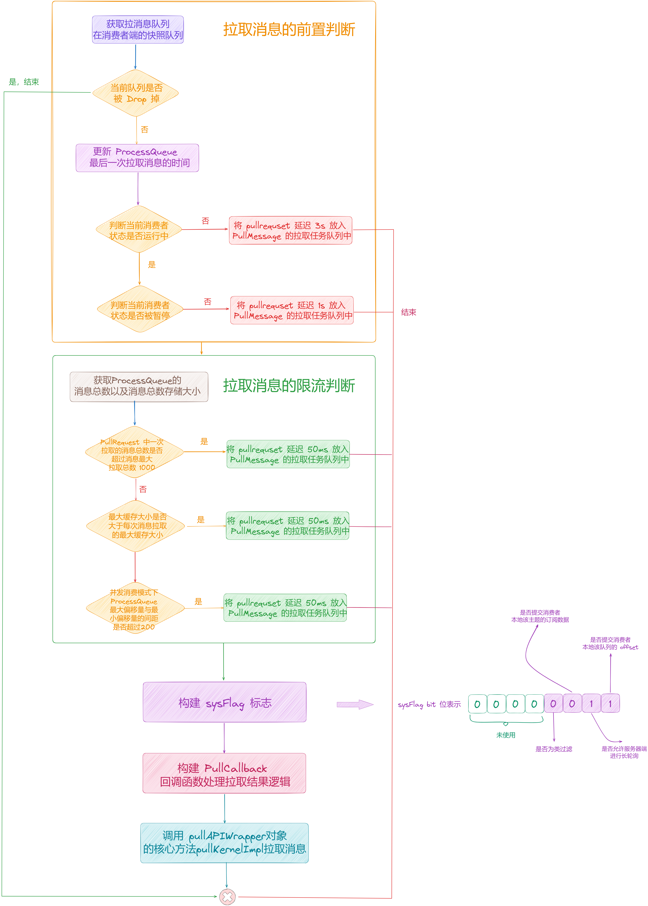

这里重点解释下 sysFlag，该bit位不同位表示了不同的参数：

1.  第一位：一般默认为 tag 过滤，因此该位一般为 0。
2.  第二位：消费者在启动和心跳的时候都会消费者订阅信息同步到服务器，所以一般这里是0，可以减轻I/O 的压力。
3.  第三位：表示是否开启长轮询，因为如果不开启，当没有相关消息可以消费的时候会疯狂去轮询，长轮询时间是15秒。
4.  第四位：表示是否提交本地 Offset。

整个方法的简化流程图如下：

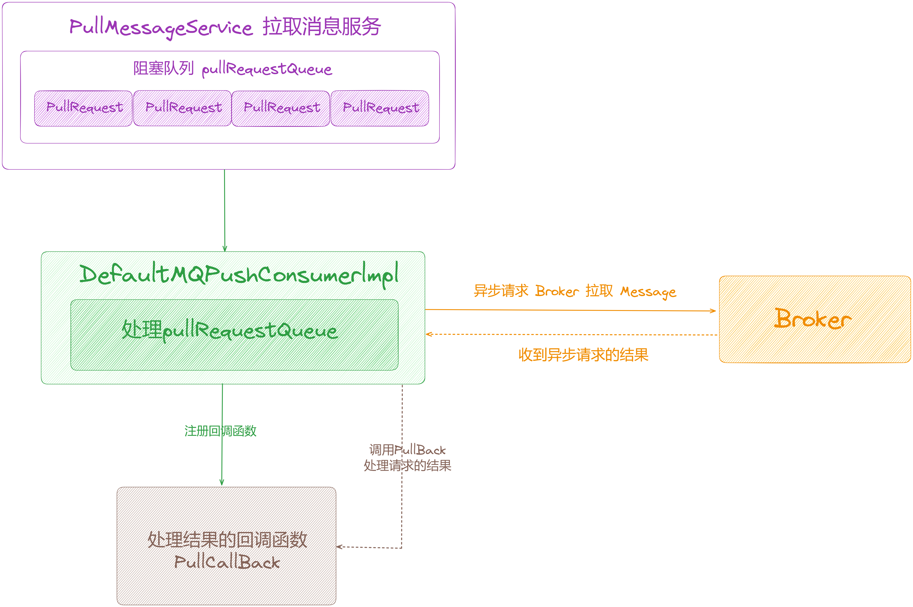

处理拉取消息结果：执行 [PullCallback](http://pullcallback/) 回调函数。由于 [Request](http://request%20/) 请求有可能成功、也有可能失败，所以[PullCallback](http://pullcallback/) 也针对不同的 [Response](http://response/) 做了判断处理，其处理逻辑分为了两部分，如下图所示：

  
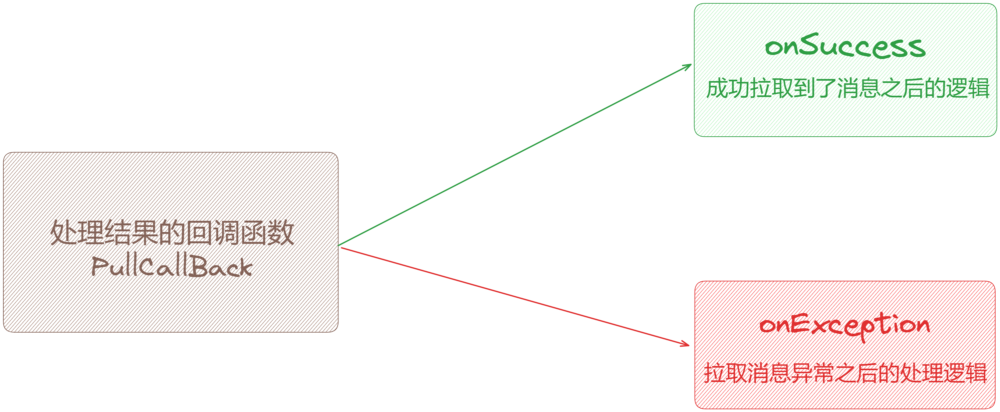

异常情况其实没有什么好深入了解的，例如 「**Broker 实例出现问题**」、「**网络问题**」之类的，这里直接重试就好了。

这里我们来深入了解处理成功的情况，这才是核心逻辑所在的地方。

对于成功，在 [PullCallback](http://pullcallback/) 当中也对应着 4 种不同的状态，分别是：「**FOUND**」、「**NO\_NEW\_MSG**」、「**NO\_MATCHED\_MSG**」、「**OFFSET\_ILLEGAL**」。

可以看到这里其实也有「**处理异常 case 的情况**」，可能老铁就有疑问，这不是在处理拉取成功的消息吗？怎么又开始处理起异常了？

这其实跟我们开发一些 Web 应用的做法类似，虽然返给前端的 HTTP 状态码是 200，但这只是代表 「**HTTP 请求本身是成功的**」。实际上在业务内可能会发生各种各样的异常，例如参数传错了、当前的状态不能支持该操作，等等。

所以，一般来说在业务上还会添加一个参数 success 来代表请求在「**业务上是否成功了**」。一旦判断拉取消息成功，被拉取到的 Message 就会被写入到「**ProcessQueue**」中了。

## **2.4 真正拉取消息任务**

上面方法只是上层客户端拉取任务逻辑的处理，在结束的时候调用了 [pullAPIWrapper#pullKernelImpl](http://pullapiwrapper/#pullKernelImpl) 方法进行真正拉取消息任务。

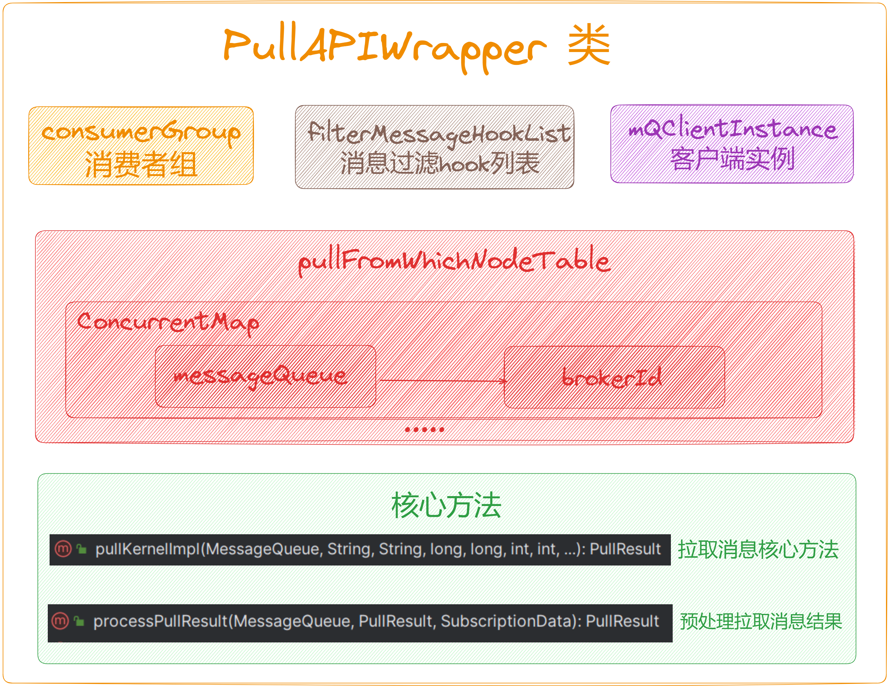

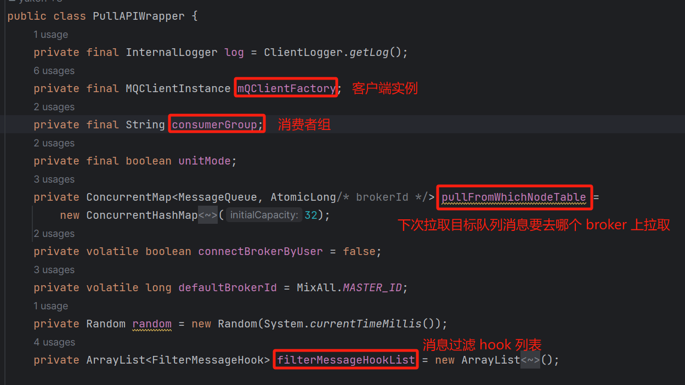

源码位置：[https://github.com/apache/rocketmq/blob/release-4.9.7/client/src/main/java/org/apache/rocketmq/client/impl/consumer/](https://github.com/apache/rocketmq/blob/release-4.9.7/client/src/main/java/org/apache/rocketmq/client/impl/consumer/PullAPIWrapper.java)[PullAPIWrapper](https://github.com/apache/rocketmq/blob/release-4.9.7/client/src/main/java/org/apache/rocketmq/client/impl/consumer/PullAPIWrapper.java)[.java](https://github.com/apache/rocketmq/blob/release-4.9.7/client/src/main/java/org/apache/rocketmq/client/impl/consumer/PullAPIWrapper.java)

/\*\*

\* PullAPIWrapper 类方法

\* @param mq 消息消费队列的元数据信息

\* @param subExpression 订阅关系表达式，它仅支持或操作，如“tag1 | | tag2 | | tag3”，如果为 null 或 \*，则表示订阅全部

\* @param expressionType 订阅关系表达式类型，支持TAG和SQL92，用于过滤

\* @param subVersion 订阅关系版本

\* @param offset 下一个拉取的offset

\* @param maxNums 一次批量拉取的最大消息数，默认32

\* @param sysFlag 系统标记 FLAG\_COMMIT\_OFFSET\_SUSPEND

\* @param commitOffset 提交的消费点位，内存中当前消息队列 commitLog 日志中当前的最新偏移量

\* @param brokerSuspendMaxTimeMillis broker挂起请求的最长时间（毫秒），默认15s

\* @param timeoutMillis 消费者消息拉取超时时间，默认30s

\* @param communicationMode 消息拉取模式，默认为异步拉取

\* @param pullCallback 拉取到消息之后调用的回调函数

\* @return 拉取结果

\*/

public PullResult pullKernelImpl(

final MessageQueue mq,

final String subExpression,

final String expressionType,

final long subVersion,

final long offset,

final int maxNums,

final int sysFlag,

final long commitOffset,

final long brokerSuspendMaxTimeMillis,

final long timeoutMillis,

final CommunicationMode communicationMode,

final PullCallback pullCallback

) throws MQClientException, RemotingException, MQBrokerException, InterruptedException {

// 根据 brokerName 从内存中获取 Broker 的详细信息:包括 BrokerAddress、broker 是否为 sLave、brokerVersion 等

// FindBrokerResult 类的内容主要是：地址和节点角色（是否为slave节点）

FindBrokerResult findBrokerResult \=

// 参数1：brokerName

// 参数2：this.recalculatePullFromWhichNode(mq) （可能0，也可能 1）

// 参数3：false

// 作用：获取该mq推荐的主机id，如果不是空则返回，如果为空则返回返回主节点id值为0

this.mQClientFactory.findBrokerAddressInSubscribe(mq.getBrokerName(),

this.recalculatePullFromWhichNode(mq), false);

// 如果内存中没有找到broker信息，则从NameServer中拉起Broker的最新信息

if (null == findBrokerResult) {

// 如果为空，到 nameserver 获取指定 topic 的路由数据，路由数据包含 主机信息

this.mQClientFactory.updateTopicRouteInfoFromNameServer(mq.getTopic());

findBrokerResult =

this.mQClientFactory.findBrokerAddressInSubscribe(mq.getBrokerName(),

this.recalculatePullFromWhichNode(mq), false);

}

// 找到了 broker

if (findBrokerResult != null) {

{

// check version 检查版本

if (!ExpressionType.isTagType(expressionType)

&& findBrokerResult.getBrokerVersion() < MQVersion.Version.V4\_1\_0\_SNAPSHOT.ordinal()) { // RMQ 在 4.1.0 之后才支持的 非tag过滤

throw new MQClientException("The broker\[" + mq.getBrokerName() + ", "

\+ findBrokerResult.getBrokerVersion() + "\] does not upgrade to support for filter message by " + expressionType, null);

}

}

int sysFlagInner \= sysFlag;

// 如果条件成立：说明 findBrokerResult 表示的主机为 slave节点，slave不存储offset信息

if (findBrokerResult.isSlave()) {

// 将 sysFlag 标记位中 CommitOffset的位 设置为 0

sysFlagInner = PullSysFlag.clearCommitOffsetFlag(sysFlagInner);

}

// 构造 PullMessageRequestHeader 请求头

PullMessageRequestHeader requestHeader \= new PullMessageRequestHeader();

requestHeader.setConsumerGroup(this.consumerGroup); // 消费者组

requestHeader.setTopic(mq.getTopic()); // topic

requestHeader.setQueueId(mq.getQueueId()); // 队列id

requestHeader.setQueueOffset(offset); // 拉取偏移量

requestHeader.setMaxMsgNums(maxNums); // 最大拉取消息数量

requestHeader.setSysFlag(sysFlagInner); // 系统标记

requestHeader.setCommitOffset(commitOffset); // 提交的消费点位

requestHeader.setSuspendTimeoutMillis(brokerSuspendMaxTimeMillis); // broker 挂起请求的最长时间，默认15s

requestHeader.setSubscription(subExpression); // 订阅关系表达式，它仅支持或操作，如“tag1 | | tag2 | | tag3”，如果为 null 或 \*，则表示订阅全部

requestHeader.setSubVersion(subVersion); // 订阅关系版本

requestHeader.setExpressionType(expressionType); // 表达式类型 TAG 或者SQL92

requestHeader.setBname(mq.getBrokerName()); // broker 名称

String brokerAddr \= findBrokerResult.getBrokerAddr(); // 获取 broker 地址

if (PullSysFlag.hasClassFilterFlag(sysFlagInner)) {

// 如果含 classFilter 文件，则上传到 FilterServer

brokerAddr = computePullFromWhichFilterServer(mq.getTopic(), brokerAddr);

}

// 调用 MQClientAPIImpl#pullMessage 方法发送请求，进行消息拉取并返回一个拉取结果

// 注意： 拉取消息时会根据拉取模式是同步、异步，决定是回调还是直接处理

// 参数1：brokerAddr，本次拉消息请求的服务器地址

// 参数2：requestHeader，拉消息业务参数封装对象

// 参数3：timeoutMillis，网络调用超时限制 30秒

// 参数4：communicationMode，RPC调用模式 这里是 异步模式

// 参数5：pullCallback，拉消息结果处理对象

PullResult pullResult \= this.mQClientFactory.getMQClientAPIImpl().pullMessage(

brokerAddr,

requestHeader,

timeoutMillis,

communicationMode,

pullCallback);

return pullResult;

}

throw new MQClientException("The broker\[" + mq.getBrokerName() + "\] not exist", null);

}

// 拉消息的队列

public long recalculatePullFromWhichNode(final MessageQueue mq) {

if (this.isConnectBrokerByUser()) {

return this.defaultBrokerId;

}

// 获取该 mq 推荐的主机id

AtomicLong suggest \= this.pullFromWhichNodeTable.get(mq);

if (suggest != null) {

return suggest.get();

}

// 返回主节点id 0

return MixAll.MASTER\_ID;

}

该方法相对比较简单，步骤如下：

1.  根据 brokerName 从内存中获取 Broker 的详细信息:包括 BrokerAddress、broker 是否为 sLave、brokerVersion 等
2.  如果内存中没有找到 broker 信息，则从 NameServer 中拉起 Broker 的最新信息。
3.  如果找到了 broker，则执行：
4.  检查版本，如果不符合则抛异常。
5.  如果是 slave 节点，slave不存储offset信息，则将 sysFlag 标记位中 [CommitOffset](http://commitoffset/) 的位 设置为 0。
6.  构造 [PullMessageRequestHeader](http://pullmessagerequestheader/) 请求头 。
7.  最后调用 [MQClientAPIImpl#pullMessage](http://mqclientapiimpl/#pullMessage) 方法发送请求，进行消息拉取。

[PullAPIWrapper](http://pullapiwrapper/) 类里面最重要的数据结构就是 [pullFromWhichNodeTable](http://pullfromwhichnodetable/)，会根据服务器推荐「**按照队列去推荐**」给当前消费者的下一次拉取的主机去决定下一次去哪个主机上拉取，因为消费者的消费进度有可能和当前队列的进度持平，数据全部在内存里面，服务器会建议下次去主节点去拿数据「**主要是因为生产者肯定是先将数据写到主节点上，主节点的热数据都在内存中，从内存中直接查消息效率非常高**」，也有可能消费的速度非常慢导致需要去到服务器上去拿冷数据，如果要拿冷数据，服务器需要推荐其去备份 broker 节点拿冷数据。

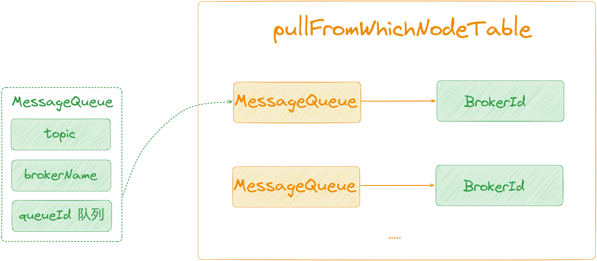

该数据结构位于拉取消息对象 [PullAPIWrapper](http://pullapiwrapper/) 中， 主要存储下次拉取目标队列消息要去哪个 broker 上拉取。

**2.5 远程调用拉取消息任务**

可以看到上面最终调用客户端实例的拉取方法进行真正远程拉取消息任务。

源码位置：[https://github.com/apache/rocketmq/blob/release-4.9.7/client/src/main/java/org/apache/rocketmq/client/impl/](https://github.com/apache/rocketmq/blob/release-4.9.7/client/src/main/java/org/apache/rocketmq/client/impl/MQClientAPIImpl.java)[MQClientAPIImpl](https://github.com/apache/rocketmq/blob/release-4.9.7/client/src/main/java/org/apache/rocketmq/client/impl/MQClientAPIImpl.java)[.java](https://github.com/apache/rocketmq/blob/release-4.9.7/client/src/main/java/org/apache/rocketmq/client/impl/MQClientAPIImpl.java)

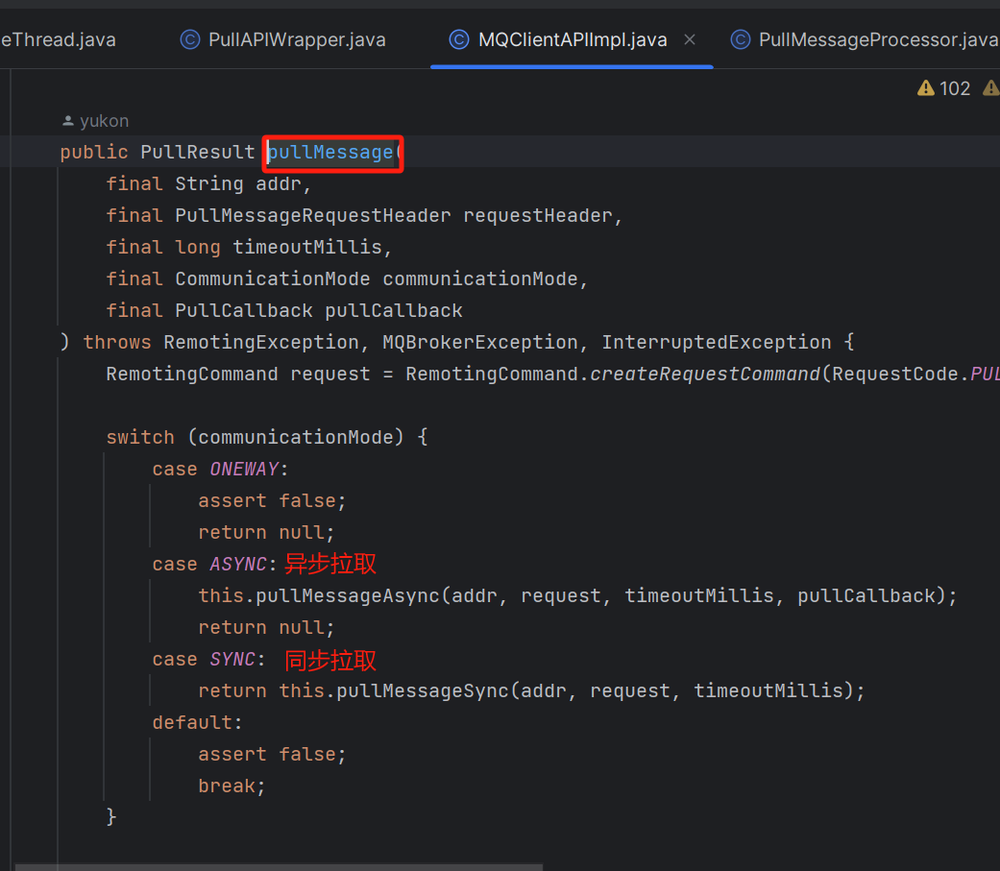

这里会根据拉取模式，是同步还是异步，调用 MQClientAPIImpl 回调或直接处理。由于前面传过来的[CommunicationMode](http://communicationmode/) 为 [ASYNC](http://async/)，即异步拉取。

所以我们着重看一下 MQClientAPIImpl 中异步拉取消息的逻辑。

private void pullMessageAsync(

final String addr,

final RemotingCommand request,

final long timeoutMillis,

final PullCallback pullCallback

) throws RemotingException, InterruptedException {

// 基于 netty 给 broker 发送异步消息，设置一个 InvokeCallback 回调对象

，这里 invokeCallback 最重要

// invokeAsync 内部会为本次请求创建一个 ResponseFuture 对象，放入到 remotingClient 的 responseFutureTable 中，key 是 request.opaque。ResponseFuture { 1. opaque 2.invokeCallback 3. response}

// 当服务器端响应客户端时，会根据 response.opaque 值找到当前 responseFuture 对象，将结果设置到 responseFuture.response 字段。

// 接着会检查该 responseFuture.invokeCallback 是否有值，如果有值，则说明需要回调处理。

// 再接着就将该 invokeCallback 封装成任务，提交到 remotingClient 的 公共线程内执行，执行invokeCallback 的 operationComplete 方法。

// 传递参数：responseFuture

this.remotingClient.invokeAsync(addr, request, timeoutMillis, new InvokeCallback() {

@Override

/\*\*

\* 调用时机： 执行命令成功之后服务器端响应客户端之后

\* InvokeCallback#operationComplete方法将会在得到结果之后进行回调，内部调用pullCallback的回调方法

\* @param responseFuture

\*/

public void operationComplete(ResponseFuture responseFuture) {

// 获取服务器端响应数据 response

RemotingCommand response \= responseFuture.getResponseCommand();

if (response != null) {

try {

// 解析响应获取结果，将返回的内容封装成 pullResult

// 从response内提取出来拉消息结果对象，会创建 PullResultExt 对象，根据下面的参数去 new:

// 参数1：pullStatus 状态

// 参数2：nextBeginOffset

// 参数3：minOffset

// 参数4：maxOffset

// 参数5：msgFoundList ,这里null

// 参数6：suggestWhichBrokerId，服务器端推荐下次该mq拉消息时 使用的 主机id

// 参数7：messageBinary，消息列表二进制表示

PullResult pullResult \= MQClientAPIImpl.this.processPullResponse(response, addr);

assert pullResult != null;

// 将 pullResult 交给 “拉消息结果处理回调对象”，调用它的 onSuccess 方法

pullCallback.onSuccess(pullResult);

} catch (Exception e) { //出现异常则调用pullCallback#onException方法处理异常

pullCallback.onException(e);

}

} else { //没有结果，都调用onException方法处理异常

if (!responseFuture.isSendRequestOK()) { //发送失败

pullCallback.onException(new MQClientException("send request failed to " + addr + ". Request: " + request, responseFuture.getCause()));

} else if (responseFuture.isTimeout()) { //超时

pullCallback.onException(new MQClientException("wait response from " + addr + " timeout :" + responseFuture.getTimeoutMillis() + "ms" + ". Request: " + request,

responseFuture.getCause()));

} else {

pullCallback.onException(new MQClientException("unknown reason. addr: " + addr + ", timeoutMillis: " + timeoutMillis + ". Request: " + request, responseFuture.getCause()));

}

}

}

});

}

可以看到这里会创建「**网络层传输对象 RemotingCommand**」，该对象封装了 [requestHeader](http://requestheader/)，然后执行 Netty 网络远程调用，调用成功后将返回的内容封装成 pullResult，然后调用 [pullCallback.onSuccess](http://pullcallback.onsuccess/) 处理成功逻辑，失败后处理异常情况。

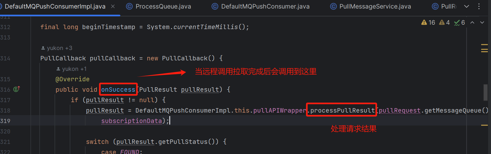

## **2.6 预处理结果对象**

/\*\*

\* 预处理 拉消息结果，主要将服务器端指定mq的拉消息下一次的推荐节点 保存到 pullFromWhichNodeTable 中，以及消息客户端过滤

\*/

public PullResult processPullResult(final MessageQueue mq, final PullResult pullResult,

final SubscriptionData subscriptionData) {

PullResultExt pullResultExt \= (PullResultExt) pullResult;

// 更新下次从哪个 Broker 中拉取消息（建议）

this.updatePullFromWhichNode(mq, pullResultExt.getSuggestWhichBrokerId());

if (PullStatus.FOUND == pullResult.getPullStatus()) {

// 使用 缓冲区 表示 messageBinary

ByteBuffer byteBuffer \= ByteBuffer.wrap(pullResultExt.getMessageBinary());

// 解码

List<MessageExt> msgList = MessageDecoder.decodes(byteBuffer);

// msgListFilterAgain 客户端再次过滤后的 list

List<MessageExt> msgListFilterAgain = msgList;

if (!subscriptionData.getTagsSet().isEmpty() && !subscriptionData.isClassFilterMode()) {

// 客户端按照tag值进行过滤

msgListFilterAgain = new ArrayList<MessageExt>(msgList.size());

for (MessageExt msg : msgList) {

if (msg.getTags() != null) {

if (subscriptionData.getTagsSet().contains(msg.getTags())) {

msgListFilterAgain.add(msg);

}

}

}

}

// 有过滤消息的钩子函数，则执行hook过滤

if (this.hasHook()) {

FilterMessageContext filterMessageContext \= new FilterMessageContext();

filterMessageContext.setUnitMode(unitMode);

filterMessageContext.setMsgList(msgListFilterAgain);

this.executeHook(filterMessageContext);

}

for (MessageExt msg : msgListFilterAgain) {

String traFlag \= msg.getProperty(MessageConst.PROPERTY\_TRANSACTION\_PREPARED);

if (Boolean.parseBoolean(traFlag)) {

msg.setTransactionId(

msg.getProperty(MessageConst.PROPERTY\_UNIQ\_CLIENT\_MESSAGE\_ID\_KEYIDX));

}

// 给消息添加三个property:1.队列最小Offset 2.队列最大Offset 3.消息归属brokerName

MessageAccessor.putProperty(msg, MessageConst.PROPERTY\_MIN\_OFFSET,

Long.toString(pullResult.getMinOffset()));

MessageAccessor.putProperty(msg, MessageConst.PROPERTY\_MAX\_OFFSET,

Long.toString(pullResult.getMaxOffset()));

msg.setBrokerName(mq.getBrokerName());

}

// 将再次过滤后的消息list，保存到 pullResult

pullResultExt.setMsgFoundList(msgListFilterAgain);

}

// 将 pullResult的messageBinary 设置为null，help GC

pullResultExt.setMessageBinary(null);

// 返回预处理完的 pullResult

return pullResult;

}

由于 consumer 订阅的时候可以关注 Tags，所以在消息到达时，会按照订阅的 tags 进行过滤，用户监听消息的时候就只会收到自己关注的 tag。

这里重点说下 [PullResult](http://pullresult/) 对象，如下：

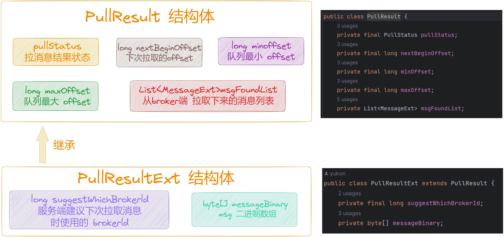

拉取到消息时，首先将其放入到处理队列 [ProcessQueue](http://processqueue/) 中，然后消费消息服务 [consumeMessageService](http://consumemessageservice/) 开始干活。

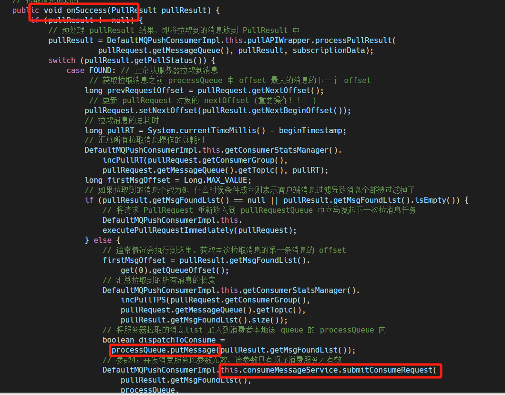

处理成功操作有两步，我们分别来看下。

## **2.7 将拉取消息放入到 processQueue 队列**

源码位置：[https://github.com/apache/rocketmq/blob/release-4.9.7/client/src/main/java/org/apache/rocketmq/client/impl/](https://github.com/apache/rocketmq/blob/release-4.9.7/client/src/main/java/org/apache/rocketmq/client/impl/consumer/ProcessQueue.java)[consumer/ProcessQueue.](https://github.com/apache/rocketmq/blob/release-4.9.7/client/src/main/java/org/apache/rocketmq/client/impl/consumer/ProcessQueue.java)[java](https://github.com/apache/rocketmq/blob/release-4.9.7/client/src/main/java/org/apache/rocketmq/client/impl/consumer/ProcessQueue.java)

public boolean putMessage(final List<MessageExt> msgs) {

// 这个只有在顺序消费的时候才会遇到，并发消费不会用到

boolean dispatchToConsume \= false;

try {

this.treeMapLock.writeLock().lockInterruptibly();

try {

int validMsgCnt \= 0; // 有效消息数量

for (MessageExt msg : msgs) {

// 把传过来的消息都都放在 msgTreeMap 中，以消息在 queue 中的 offset 为 key，msg 为 vaLue

MessageExt old \= msgTreeMap.put(msg.getQueueOffset(), msg);

// 正常情况，说明原本 msgTreeMap 中不包含此条消息

if (null == old) {

validMsgCnt++;

// 将最后一个消息的 offset 赋值给 queue0ffsetMax

this.queueOffsetMax = msg.getQueueOffset();

// 把当前消息的长度加到 msgSize 中

msgSize.addAndGet(msg.getBody().length);

}

}

// 增加有效消息数量

msgCount.addAndGet(validMsgCnt);

// msgTreeMap不为空(含有消息)，并且不是正在消费状态

// 这个值在放消息的时候会设置为 true，在顺序消费模式，取不到消息则设置为false

if (!msgTreeMap.isEmpty() && !this.consuming) {

// 将 ProcessQueue 置为正在被消费状态

// 有消息，且为未消费状态，则顺序消费模式可以消费

dispatchToConsume = true;

this.consuming = true;

}

if (!msgs.isEmpty()) {

// 拿到最后一条消息

MessageExt messageExt \= msgs.get(msgs.size() - 1);

// 获取broker端(拉取消息时)queue里最大的offset，max0ffset会存在每条消息里

String property \= messageExt.getProperty(MessageConst.PROPERTY\_MAX\_OFFSET);

// 计算broker端还有多少条消息没有被消费

if (property != null) {

// broker端的最大偏移量-当前ProcessQueue中处理的最大消息偏移量

long accTotal \= Long.parseLong(property) - messageExt.getQueueOffset();

if (accTotal > 0) {

this.msgAccCnt = accTotal;

}

}

}

} finally {

this.treeMapLock.writeLock().unlock();

}

} catch (InterruptedException e) {

log.error("putMessage exception", e);

}

return dispatchToConsume;

}

该方法相对比较简单将拉取到的消息放入到 [ProcessQueue](http://processqueue/) 中，即将消息加入到 [ProcessQueue](http://processqueue/) 的 [msgTreeMap](http://msgtreemap/)红黑树容器中。

## **2.8 提交消费请求**

源码位置：[https://github.com/apache/rocketmq/blob/release-4.9.7/client/src/main/java/org/apache/rocketmq/client/impl/](https://github.com/apache/rocketmq/blob/release-4.9.7/client/src/main/java/org/apache/rocketmq/client/impl/consumer/ProcessQueue.java)[consumer/ProcessQueue.](https://github.com/apache/rocketmq/blob/release-4.9.7/client/src/main/java/org/apache/rocketmq/client/impl/consumer/ProcessQueue.java)[java](https://github.com/apache/rocketmq/blob/release-4.9.7/client/src/main/java/org/apache/rocketmq/client/impl/consumer/ProcessQueue.java)

消息消费服务开始干活，并且会再将 [PullRequest](http://pullrequest/) 请求根据 [PullInterval](http://pullinterval/) 决定延时多少毫秒还是立即放入[pullRequestQueue](http://pullrequestqueue/)中，让 Consumer 可以一直拉取消息。

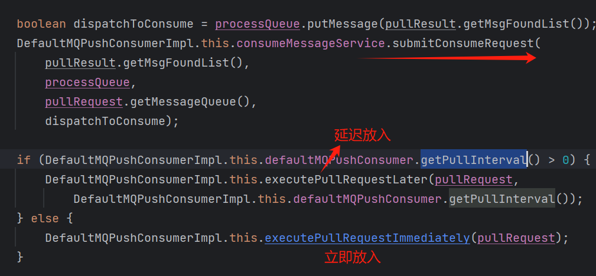

通过追源码，可以发现针对「**是否为顺序消费**」，消息消费服务 [consumeMessageService](http://consumemessageservice/) 有不同的实现**。**

## **2.8.1 并发消息模式**

非顺序消费时，[ConsumeMessageConcurrentlyService](http://consumemessageconcurrentlyservice/) 采用「**线程池**」的机制进行并发消费。

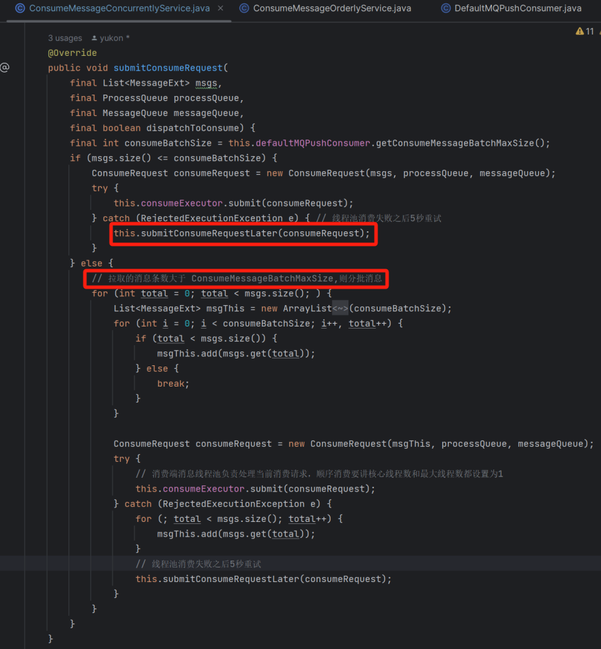

> 注意：如果此次拉取的消息条数大于 ConsumeMessageBatchMaxSize（默认1条）,则分批消费。

## **2.8.2 顺序消息模式**

顺序消费时，[ConsumeMessageOrderlyService](http://consumemessageorderlyservice/) 也是采用线程池的机制进行消费，不过这里注意了，顺序消费时要将线程池的核心线程和最大线程数设置为 1。

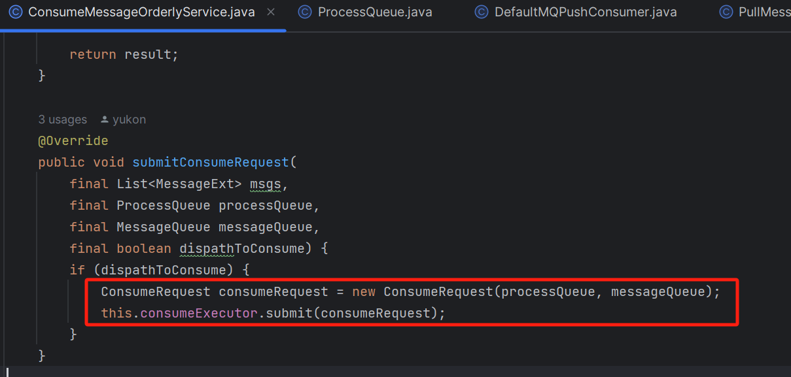

关于具体的消费逻辑，本篇就不再展开剖析了，会在后面篇章单独剖析。

至此整个拉取消息任务流程就剖析完了。

## **03 总结**

最后来张流程图总结下全文：

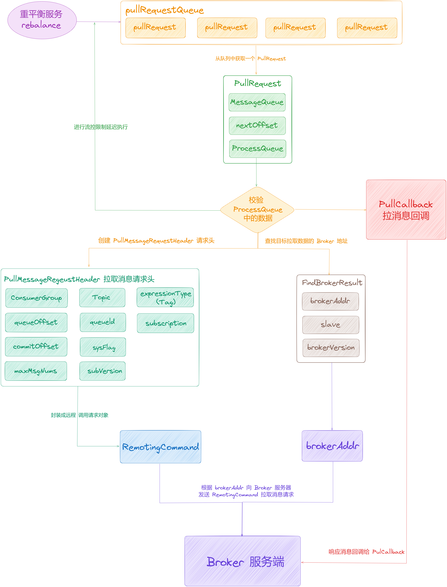

消费者端拉消息的整个流程，其中关键步骤可以简单概括为以下4点：

1.  校验消费者端和该[ProcessQueue](http://processqueue/) 队列信息的状态。
2.  对 [ProcessQueue](http://processqueue%20/) 进行流控限制校验。
3.  创建 [PullCallBack](http://pullcallback%20/) 拉取消息回调函数， 接收处理 Broker 端返回的队列消息信息。
4.  构建 [RemotingCommand](http://remotingcommand/) 远程调用对象，并根据推荐的 [BrokerAddr](http://brokeraddr/) 地址，向目标 Broker 发送远程过程调用请求。

也可以通过这张时序图来学习和了解:

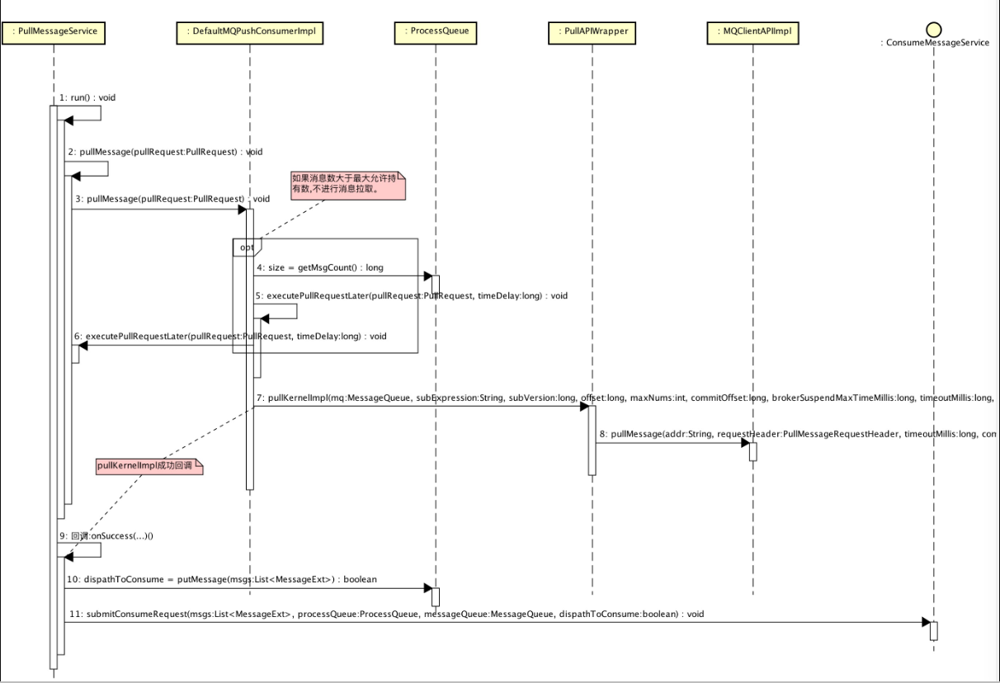