大家好，我是**华仔**, 又跟大家见面了。

从今天开始我将继续为大家奉上 RocketMQ 消费者源码剖析系列文章，正式开启「**RocketMQ 的 消费者源码之旅**」，这是第九篇，本篇我们将以「**RocketMQ 5.1.2**」版本为主，来剖析下 RocketMQ 源码之消费者 Pop 消费全流程剖析。

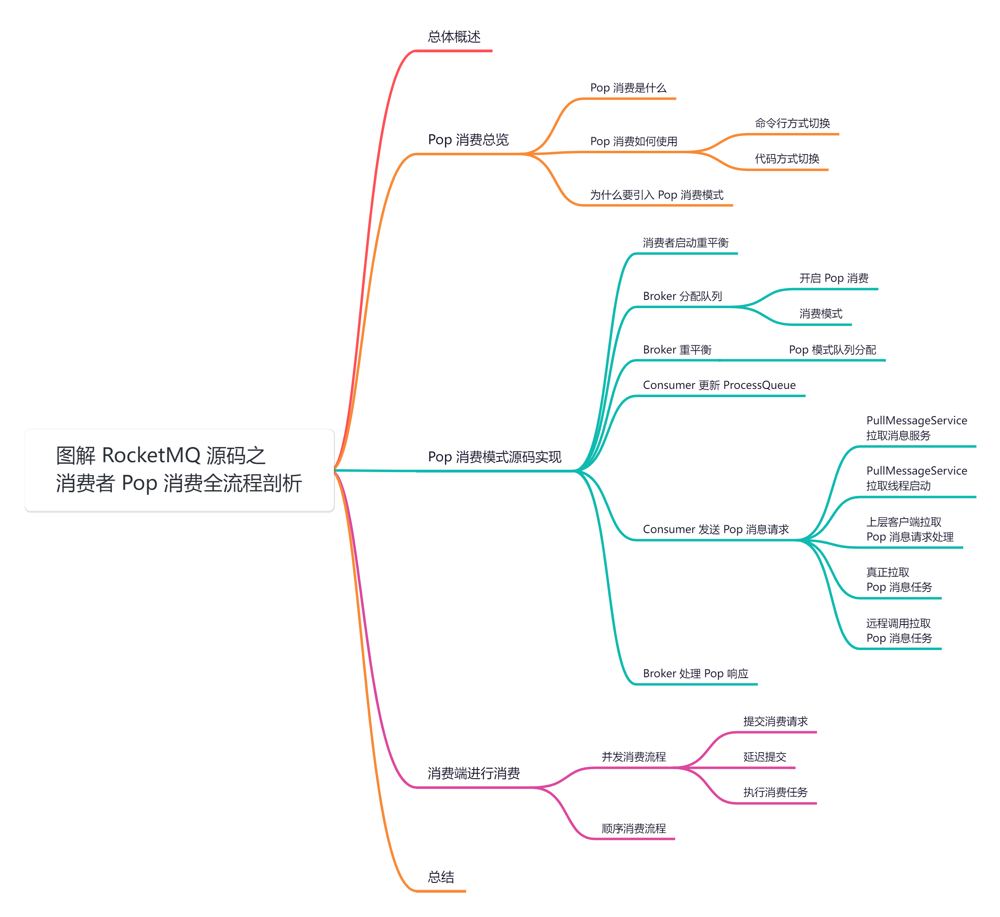

## **01 总体概述**

在 [【消费者源码分析系列第八篇】图解 RocketMQ 源码之消费者普通消费全流程剖析](https://articles.zsxq.com/id_lf0x558ptx15.html) 这篇中，我带大家深度剖析了普通消费流程，主要分为「**并发消费**」、「**顺序消费**」两种模式下的消费流程。

今天我们主要来深度下 「**RocketMQ 5.x**」新增的 Pop 消费全流程，了解下为什么要引入 Pop 消费模式。

##   
**02 Pop 消费总览**

## **2.1 Pop 消费是什么**

我们都知道在「**RocketMQ 5.0**」版本中引入了一种新的消费模式：「**Pop 消费模式**」。

先来回顾下 RocketMQ 原有的消费模式：「**Pull 消费模式**」和 「**Push 消费模式**」，其中「**Push 消费模式**」指的是 Broker 将消息主动「**推送**」给消费者，它的背后其实是消费者在不断地「**Pull** 」 消息来实现类似于 Broker 「**推送**」消息给消费者的效果。

新引入的 「**Pop 消费模式**」主要是用于「**Push 消费**」时将拉消息的动作替换成 Pop 。Pop 消费的行为和 Pull 消费很像，区别在于 Pop 消费的重平衡是在「**Broker 端**」完成的，而之前的 Pull 和 Push 消费都是由「**消费者端**」完成重平衡。

## **2.2 Pop 消费如何使用**

RocketMQ 为我们提供了 2 种方式：「**命令行方式切换**」、「**客户端代码方式切换**」。但是这里只有 Push 消费模式可以切换为使用 Pop 模式拉取消息，对于 Pull 消费是不支持切换 Pop 模式的。

## **2.2.1 命令行方式切换**

如下命令，指定集群和需要切换的消费组，可以将一个消费组切换成 Pop 消费模式消费某个 Topic。

mqadmin setConsumeMode -c cluster -t topic -g group -m POP -q 8

参数含义如下：

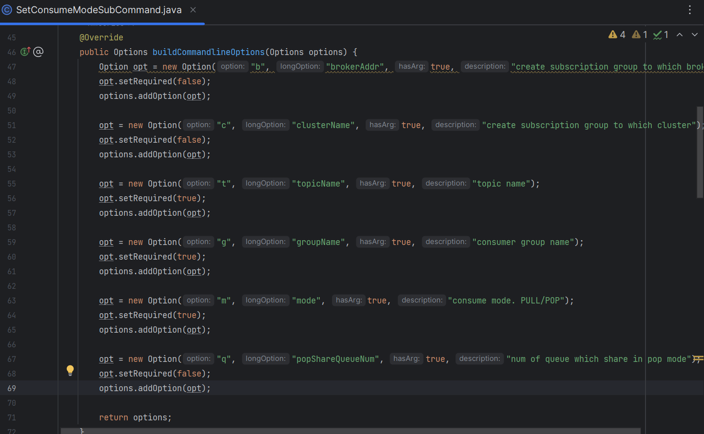

## **2.2.2 代码方式切换**

在创建 Consumer之前，先执行 [switchPop()](http://switchpop\(\)/) 方法，其实这个跟上面命令行逻辑一样，也是发送请求给集群中的所有 Broker 节点，让它们切换对应消费者组和 Topic 的消费者的消费模式为 Pop 模式。

public class PopConsumer {

public static final String TOPIC \= "TopicTest";

public static final String CONSUMER\_GROUP \= "CID\_JODIE\_1";

public static void main(String\[\] args) throws Exception {

// 切换 Pop 模式

switchPop();

// 实例化消费者组名称

DefaultMQPushConsumer consumer \= new DefaultMQPushConsumer(CONSUMER\_GROUP);

// 订阅 Topic

consumer.subscribe(TOPIC, "\*");

// 设置消费位置

consumer.setConsumeFromWhere(ConsumeFromWhere.CONSUME\_FROM\_FIRST\_OFFSET);

// 注册监听器

consumer.registerMessageListener(new MessageListenerConcurrently() {

@Override

// 处理业务逻辑

public ConsumeConcurrentlyStatus consumeMessage(List<MessageExt> msgs, ConsumeConcurrentlyContext context) {

System.out.printf("%s Receive New Messages: %s %n", Thread.currentThread().getName(), msgs);

return ConsumeConcurrentlyStatus.CONSUME\_SUCCESS;

}

});

// 关闭客户端 rebalance。

consumer.setClientRebalance(false);

// 启动消费者

consumer.start();

System.out.printf("Consumer Started.%n");

}

// 切换 pop 模式

private static void switchPop() throws Exception {

DefaultMQAdminExt mqAdminExt \= new DefaultMQAdminExt();

mqAdminExt.start();

List<BrokerData> brokerDatas = mqAdminExt.examineTopicRouteInfo(TOPIC).getBrokerDatas();

for (BrokerData brokerData : brokerDatas) {

Set<String> brokerAddrs = new HashSet<>(brokerData.getBrokerAddrs().values());

for (String brokerAddr : brokerAddrs) {

// 设置消费模式为 Pop

mqAdminExt.setMessageRequestMode(brokerAddr, TOPIC, CONSUMER\_GROUP, MessageRequestMode.POP, 8, 3\_000);

}

}

}

}

## **2.3 为什么要引入 Pop 消费模式**

当前的消费重平衡策略是以「**队列**」的维度来进行，所有行为全部是由「**消费者端**」主动来完成，主要分为三步：

1.  每个 consumer 定时去获取消费的 topic 的队列总数，以及 consumer 总数。
2.  将队列按编号、consumer 按 IP 排序，用统一的分配算法计算该 consumer 分配哪些消费队列。
3.  每个 consumer 去根据算法分配出来的队列，拉取消息消费。

引入「**Pop 消费**」主要还是由于「**Push 消费**」的机制导致存在一些痛点，因为 RocketMQ 5.0 要搞云原生化，而这个要求一种能够解决这些痛点的「**新的消费模式**」诞生。

之前「**Push 消费模式**」的「**重平衡**」处理逻辑是在消费端来完成的，有以下几个问题：

1.  导致客户端代码逻辑比较重，要支持一种新语言的客户端就必须新实现一套完整的「**重平衡**」逻辑，此外还需要实现「**拉消息**」、「**位点管理**」、「**失败重试**」等逻辑。这给多语言客户端的支持造成很大的阻碍。
2.  当客户端升级或者下线时，都要进行「**重平衡**」操作，可能造成消息堆积。

另外，对于「**Push 消费**」的特性是「**重平衡**」后每个消费者都分配到一定数量的队列，而「**每个队列**」最多只能被「**一个消费者**」进行消费，这就导致了消费者的横向扩展能力会受到 Topic 中队列数量的限制。

1.  消费者无法无限扩展，当消费者数量扩大到大于队列数量时，有的消费者将无法分配到队列。
2.  当某些消费者假死时（与 Broker 的心跳未断，但是无法消费消息），会造成其消费的队列的消息堆积，迟迟无法被消费，也不会主动重平衡来解决这个问题，因此如果长时间不处理，队列的堆积会越来越严重。

当引入「**Pop 消费模式**」之后，可以轻松解决「**Push 消费**」导致的可能的「**消息堆积问题**」和「**横向扩展问题**」。此外，RocketMQ 5.0 中引入了的轻量化客户端就用到了 Pop 消费能力，将 Pop 消费接口用 gRPC 封装，实现了多语言轻量化客户端，而不必在客户端实现重平衡逻辑。

详见该项目 [https://github.com/apache/rocketmq-clients](http://%20https//github.com/apache/rocketmq-clients)。

「**Pop 消费**」方案需要保证两点：

1.  高可用：单一队列的消费能力不受某个消费客户端异常的影响。
2.  高性能：POP 订阅对消息消费的延迟和吞吐的影响在 10% 以内。

综上，「**Pop 消费模式**」的特点有两个：

1.  broker 端负责 rebalance：为每个 consumer 分配 queue，支持队列非独占（一个队列分配给组内多个 consumer 消费）。
2.  broker 端负责管理消费进度，包括拉消息和提交 offset。

关于更多「**Pop 消费模式**」原理特性可以查看 [https://developer.aliyun.com/article/801815?utm\_content=m\_1000306619](https://developer.aliyun.com/article/801815?utm_content=m_1000306619)。

## **03 Pop 消费模式源码实现**

消费端消费流程大致跟之前差不多，主要变化在于「**重平衡**」、「**消息拉取**」、「**消息消费**」、「**重试**」等等。

## **3.1 消费者启动重平衡**

开启「**Pop 消费**」的前提是，消费者端需要启用「**Broker Rebalance**」，由 「**Broker**」执行「**Queue 分配**」。

消费者端 rebalance 方法入口：[RebalanceImpl#doRebalance](http://rebalanceimpl/#doRebalance)，执行 「**Broker Rebalance**」需要满足两个条件。

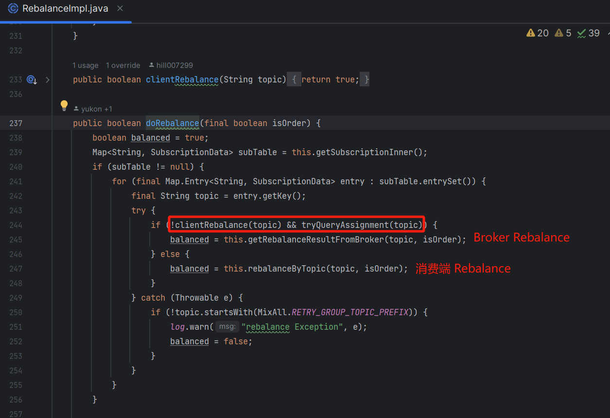

[RebalancePushImpl#clientRebalance](http://rebalancepushimpl/#clientRebalance)：满足下面条件则开启 [client rebalance](http://client%20rebalance/)，即之前的老逻辑。

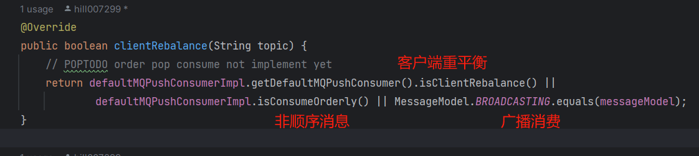

那么什么事情开启「**Broker Rebalance**」呢？也就是满足下面的 if 条件：

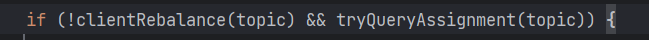

对于前面来说，开启「**Broker Rebalance**」，通过上面的判断可以得出，消费者端需要满足下面4个条件：

1.  使用 push api：[DefaultMQPushConsumer](http://defaultmqpushconsumer/)。
2.  关闭 clientRebalance：[DefaultMQPushConsumer#setClientRebalance(false)](http://defaultmqpushconsumer/#setClientRebalance\(false\))。
3.  并发消费：[MessageListenerConcurrently](http://messagelistenerconcurrently/)。
4.  集群消费：[MessageModel.CLUSTERING](http://messagemodel.clustering/)。

还有就是要满足「**Broker**」能够正常执行 [QUERY\_ASSIGNMENT](http://query_assignment/)。

// 尝试查询消息队列分配情况的方法

private boolean tryQueryAssignment(String topic) {

// 如果topicClientRebalance中包含topic，则返回false

if (topicClientRebalance.containsKey(topic)) {

return false;

}

// 如果topicBrokerRebalance中包含topic，则返回true

if (topicBrokerRebalance.containsKey(topic)) {

return true;

}

// 获取分配消息队列策略的名称

String strategyName \= allocateMessageQueueStrategy != null ?allocateMessageQueueStrategy.getName() :null;

int retryTimes \= 0;// 初始化重试次数为0

// 尝试最多TIMEOUT\_CHECK\_TIMES次查询分配情况

while (retryTimes++ < TIMEOUT\_CHECK\_TIMES) {

try {

// 调用mQClientFactory的queryAssignment方法查询分配情况，设置超时时间

Set<MessageQueueAssignment> resultSet = mQClientFactory.queryAssignment(topic,consumerGroup,

strategyName,messageModel,QUERY\_ASSIGNMENT\_TIMEOUT / TIMEOUT\_CHECK\_TIMES \* retryTimes);

// 将topic以及对应的值添加到topicBrokerRebalance中

topicBrokerRebalance.put(topic,topic);

return true;// 查询成功，返回true

} catch (Throwable t) {

if (!(t instanceof RemotingTimeoutException)) { // 如果异常不是RemotingTimeoutException

log.error("tryQueryAssignment error.",t);// 记录日志

// 将topic以及对应的值添加到topicClientRebalance中

topicClientRebalance.put(topic,topic);

return false;// 返回false

}

}

}

if (retryTimes >= TIMEOUT\_CHECK\_TIMES) {

// 如果重试次数超过TIMEOUT\_CHECK\_TIMES次，强制进行客户端重平衡，将topic以及对应的值添加到topicClientRebalance中

topicClientRebalance.put(topic,topic);

return false;// 返回false

}

return true;// 正常情况下返回true

}

consumer 调用某个有对应 topic 的 broker 的 [QUERY\_ASSIGNMENT](http://query_assignment%20/) api，如果成功调用，则允许执行「**Broker Rebalance**」，也就是上面代码返回 [true](http://true/)。

  
当启用「**Broker Rebalance**」后，consumer 从 broker 获取分配的 [queue](http://queue/)，更新分配给自己的 [ProcessQueue](http://processqueue/)。

// 从 Broker 端获取重新平衡结果

private boolean getRebalanceResultFromBroker(final String topic,final boolean isOrder) {

// 获取分配消息队列策略的名称

String strategyName \= this.allocateMessageQueueStrategy.getName();

Set<MessageQueueAssignment> messageQueueAssignments;

try {

// 1、QUERY\_ASSIGNMENT 查询 Broker 分配给当前实例的 queue

messageQueueAssignments = this.mQClientFactory.queryAssignment(topic,consumerGroup,

strategyName,messageModel,QUERY\_ASSIGNMENT\_TIMEOUT);

} catch (Exception e) {

// 记录异常日志并返回false

log.error("allocate message queue exception.strategy name:{},ex:{}",strategyName,e);

return false;

}

// 无效分配结果，应跳过更新逻辑，返回false

if (messageQueueAssignments == null) {

return false;

}

// 创建一个空的消息队列集合

Set<MessageQueue> mqSet = new HashSet<>();

// 遍历messageQueueAssignments，将有效的消息队列添加到mqSet中

for (MessageQueueAssignment messageQueueAssignment :messageQueueAssignments) {

if (messageQueueAssignment.getMessageQueue() != null) {

mqSet.add(messageQueueAssignment.getMessageQueue());

}

}

Set<MessageQueue> mqAll = null;

// 2、更新处理队列 PopProcessQueue 返回更新结果

boolean changed \= this.updateMessageQueueAssignment(topic,messageQueueAssignments,isOrder);

// 如果发生了变化

if (changed) {

// 记录日志，说明Broker的重新平衡结果发生了变化

log.info("broker rebalanced result changed.allocateMessageQueueStrategyName={},group={},topic={},clientId={},assignmentSet={}",

strategyName,consumerGroup,topic,this.mQClientFactory.getClientId(),messageQueueAssignments);

// 调用messageQueueChanged方法通知消息队列发生了变化

this.messageQueueChanged(topic,mqAll,mqSet);

}

// 返回mqSet是否等于getWorkingMessageQueue(topic)的结果

return mqSet.equals(getWorkingMessageQueue(topic));

}

## **3.2 Broker 分配队列**

### **3.2.1 开启 Pop 消费**

默认情况下，即使客户端开启「**Broker Rebalance**」，也仅代表可以由 Broker 来分配 queue，并没有开启「**Pop 消费**」。

[SetMessageRequestModeRequestBody](http://setmessagerequestmoderequestbody/) 是 Broker 端针对 [topic+consumerGroup](http://topic+consumergroup/) 的消费方式。

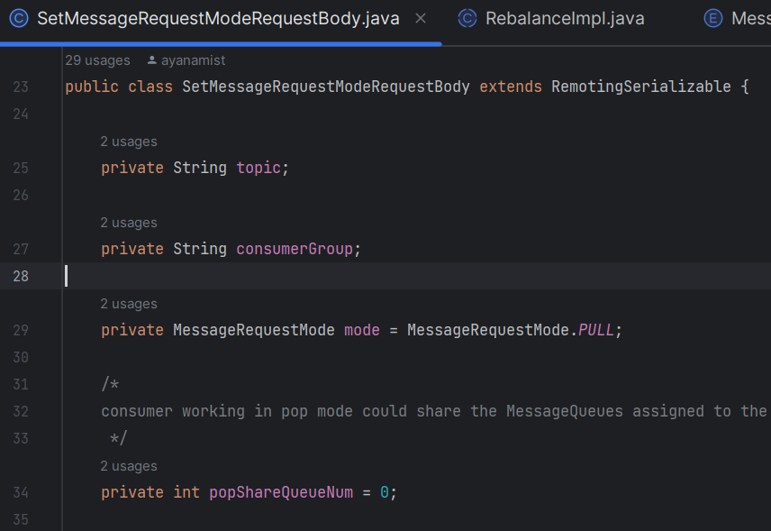

这里的 mode 有两种：

1.  mode=PULL（默认），直接走分配策略（默认平均分配策略算法）为每个客户端分配 queue，即队列独占。
2.  mode=POP，开启 Pop 消费，支持共享队列。

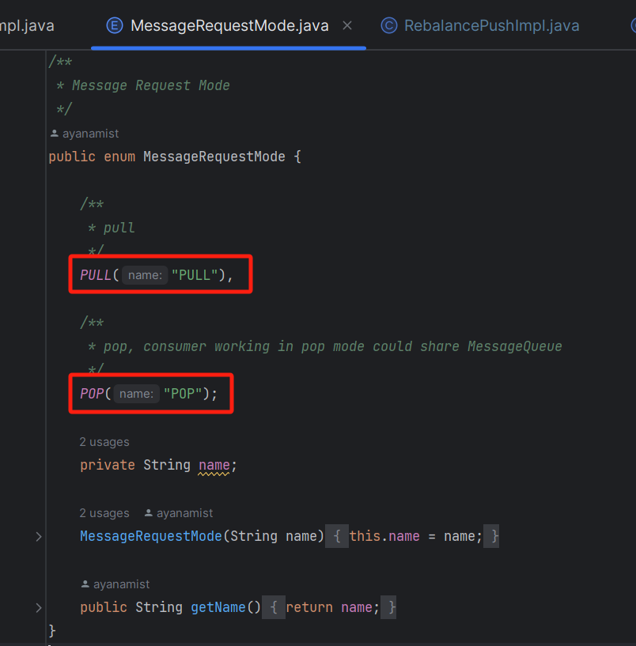

### **3.2.2 消费模式**

[QUERY\_ASSIGNMENT](http://query_assignment/) 的第一步需要确定 [MessageRequestMode](http://messagerequestmode/)，也就是 Pull 还是 Pop。

1.  优先走 topic+consumerGroup 纬度的配置。
2.  默认走 broker 纬度的配置。
3.  对于重试 topic 只能走 Pull 模式的老逻辑。

注意：这里重试 topic 是 Pull 模式的 [%RETRY%{consumerGroup}](http://%RETRY%%7BconsumerGroup%7D)，后面提到的 Pop 重试 topic 不会走这里。

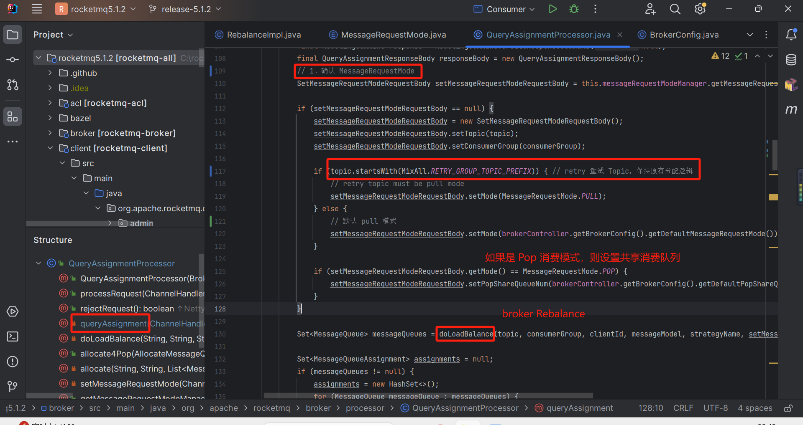

针对 [topic+consumerGroup](http://topic+consumergroup/) 纬度的配置，都存放在 [MessageRequestModeManager](http://messagerequestmodemanager%20/) 中。内存数据会持久化到[messageRequestMode.json](http://messagerequestmode.json/) 文件中。

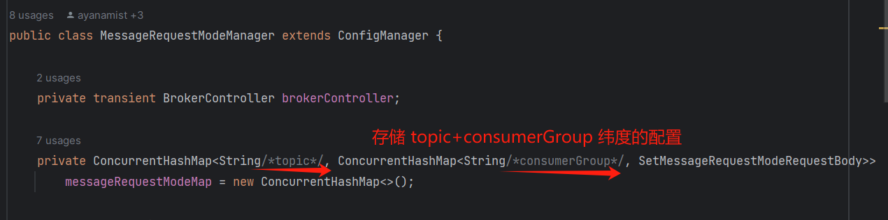

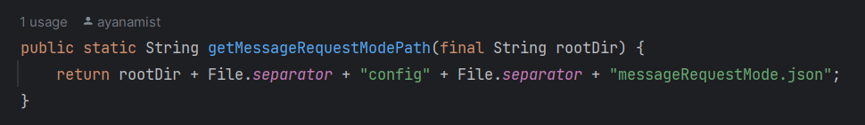

## **3.3 Broker 重平衡**

源码位置：[https://github.com/apache/rocketmq/blob/release-5.1.2/](https://github.com/apache/rocketmq/blob/release-5.1.2/broker/src/main/java/org/apache/rocketmq/broker/processor/QueryAssignmentProcessor.java)[broker](https://github.com/apache/rocketmq/blob/release-5.1.2/broker/src/main/java/org/apache/rocketmq/broker/processor/QueryAssignmentProcessor.java)[/src/main/java/org/apache/rocketmq/](https://github.com/apache/rocketmq/blob/release-5.1.2/broker/src/main/java/org/apache/rocketmq/broker/processor/QueryAssignmentProcessor.java)[broker](https://github.com/apache/rocketmq/blob/release-5.1.2/broker/src/main/java/org/apache/rocketmq/broker/processor/QueryAssignmentProcessor.java)[/](https://github.com/apache/rocketmq/blob/release-5.1.2/broker/src/main/java/org/apache/rocketmq/broker/processor/QueryAssignmentProcessor.java)[processor](https://github.com/apache/rocketmq/blob/release-5.1.2/broker/src/main/java/org/apache/rocketmq/broker/processor/QueryAssignmentProcessor.java)[/](https://github.com/apache/rocketmq/blob/release-5.1.2/broker/src/main/java/org/apache/rocketmq/broker/processor/QueryAssignmentProcessor.java)[QueryAssignmentProcessor](https://github.com/apache/rocketmq/blob/release-5.1.2/broker/src/main/java/org/apache/rocketmq/broker/processor/QueryAssignmentProcessor.java)[.java](https://github.com/apache/rocketmq/blob/release-5.1.2/broker/src/main/java/org/apache/rocketmq/broker/processor/QueryAssignmentProcessor.java)

/\*\*

\* Broker 端重平衡

\* Returns empty set means the client should clear all load assigned to it before, null means invalid result and the

\* client should skip the update logic

\*

\* @param topic

\* @param consumerGroup

\* @param clientId

\* @param messageModel 消费模型（广播/集群）

\* @param strategyName 重平衡策略名

\* @return the MessageQueues assigned to this client

\*/

private Set<MessageQueue> doLoadBalance(final String topic, final String consumerGroup, final String clientId,

final MessageModel messageModel, final String strategyName,

SetMessageRequestModeRequestBody setMessageRequestModeRequestBody, final ChannelHandlerContext ctx) {

Set<MessageQueue> assignedQueueSet = null;

final TopicRouteInfoManager topicRouteInfoManager \= this.brokerController.getTopicRouteInfoManager();

switch (messageModel) {

case BROADCASTING: {

// 广播模式，从 NameServer 获取并返回该 Topic 下所有队列

assignedQueueSet = topicRouteInfoManager.getTopicSubscribeInfo(topic);

if (assignedQueueSet == null) {

log.warn("QueryLoad: no assignment for group\[{}\], the topic\[{}\] does not exist.", consumerGroup, topic);

}

break;

}

case CLUSTERING: {

// 1、集群模式，从 NameServer 获取并返回 Topic 下所有队列

Set<MessageQueue> mqSet = topicRouteInfoManager.getTopicSubscribeInfo(topic);

if (null == mqSet) {

if (!topic.startsWith(MixAll.RETRY\_GROUP\_TOPIC\_PREFIX)) {

log.warn("QueryLoad: no assignment for group\[{}\], the topic\[{}\] does not exist.", consumerGroup, topic);

}

return null;

}

if (!brokerController.getBrokerConfig().isServerLoadBalancerEnable()) {

return mqSet;

}

// 2、消费组内成员列表 consumer心跳获得

List<String> cidAll = null;

// 获取发起请求的消费组信息

ConsumerGroupInfo consumerGroupInfo \= this.brokerController.getConsumerManager().getConsumerGroupInfo(consumerGroup);

if (consumerGroupInfo != null) {

// 组装所有得消费者id

cidAll = consumerGroupInfo.getAllClientId();

}

if (null == cidAll) {

log.warn("QueryLoad: no assignment for group\[{}\] topic\[{}\], get consumer id list failed", consumerGroup, topic);

return null;

}

List<MessageQueue> mqAll = new ArrayList<>();

mqAll.addAll(mqSet); // 所有队列

// 将队列和消费者客户端ID 排序

Collections.sort(mqAll);

Collections.sort(cidAll);

List<MessageQueue> allocateResult = null;

try {

// 3、根据重平衡策略名称获取策略

AllocateMessageQueueStrategy allocateMessageQueueStrategy \= name2LoadStrategy.get(strategyName);

if (null == allocateMessageQueueStrategy) {

log.warn("QueryLoad: unsupported strategy \[{}\], {}", strategyName, RemotingHelper.parseChannelRemoteAddr(ctx.channel()));

return null;

}

if (setMessageRequestModeRequestBody != null && setMessageRequestModeRequestBody.getMode() == MessageRequestMode.POP) {

// Pop 模式分配

allocateResult = allocate4Pop(allocateMessageQueueStrategy, consumerGroup, clientId, mqAll, cidAll, setMessageRequestModeRequestBody.getPopShareQueueNum());

} else {

// 普通 Pull 分配

allocateResult = allocateMessageQueueStrategy.allocate(consumerGroup, clientId, mqAll, cidAll);

}

} catch (Throwable e) {

log.error("QueryLoad: no assignment for group\[{}\] topic\[{}\], allocate message queue exception. strategy name: {}, ex: {}", consumerGroup, topic, strategyName, e);

return null;

}

assignedQueueSet = new HashSet<>();

if (allocateResult != null) {

assignedQueueSet.addAll(allocateResult);

}

break;

}

default:

break;

}

return assignedQueueSet;

}

这里只看下集群模式下的「**Pop 消费**」，步骤如下：

1.  和客户端 rebalance 一样，先要得到 topic 下所有 queue 和消费组内所有成员 clientId。
2.  根据消费模式判断是 Pop 消费还是原来的 Pull 模式。
3.  如果是 Pull 模式分配，直接执行原始 [AllocateMessageQueueStrategy](http://allocatemessagequeuestrategy/) 分配，比如默认平均分配策略。
4.  如果是 Pop 模式分配，则按照最新的 Pop 模式来分配。

我们来重点看下 「**Pop 消费模式的分配**」。

### **3.3.1 Pop 模式队列分配**

/\*\*

\* POP 模式重平衡

\*

\* @param allocateMessageQueueStrategy 重平衡策略

\* @param consumerGroup 消费组

\* @param clientId 消费组客户端 ID

\* @param mqAll 全部消息队列

\* @param cidAll 全部客户端ID

\* @param popShareQueueNum Pop 模式下可允许被共享的队列数，0 表示无限

\* @return 该消费者负载的队列列表

\*/

public List<MessageQueue> allocate4Pop(AllocateMessageQueueStrategy allocateMessageQueueStrategy,

final String consumerGroup, final String clientId, List<MessageQueue> mqAll, List<String> cidAll, int popShareQueueNum) {

List<MessageQueue> allocateResult;

if (popShareQueueNum <= 0 || popShareQueueNum >= cidAll.size() - 1) {

// 1、每个消费者能消费所有队列，返回全部队列。队列 ID 为 -1 表示 Pop 消费时消费全部队列

// 默认情况下，popShareQueueNum=-1，所有 consumer 实例会全量分配 queue。

// each client pop all messagequeue

allocateResult = new ArrayList<>(mqAll.size());

for (MessageQueue mq : mqAll) {

//must create new MessageQueue in case of change cache in AssignmentManager

MessageQueue newMq \= new MessageQueue(mq.getTopic(), mq.getBrokerName(), -1);

allocateResult.add(newMq);

}

} else {

// consumer数量小于等于queue数量 一个 consumer 分配多个 queue

if (cidAll.size() <= mqAll.size()) {

// 2、消费者数量小于等于队列数量，每个消费者分配 N 个队列，每个队列也会被分配给多个消费者

//consumer working in pop mode could share the MessageQueues assigned to the N (N = popWorkGroupSize) consumer following it in the cid list

allocateResult = allocateMessageQueueStrategy.allocate(consumerGroup, clientId, mqAll, cidAll);

int index \= cidAll.indexOf(clientId);

if (index >= 0) {

// 重平衡 popShareQueueNum 次，将每次重平衡的结果加入最终结果

for (int i \= 1; i <= popShareQueueNum; i++) { // 根据 popShareQueueNum， 执行多次 strategy 分配 queue

index++;

index = index % cidAll.size();

List<MessageQueue> tmp = allocateMessageQueueStrategy.allocate(consumerGroup, cidAll.get(index), mqAll, cidAll);

allocateResult.addAll(tmp);

}

}

} else {

// 3、消费者数量大于队列数量，保证每个消费者都有队列消费

//make sure each cid is assigned

allocateResult = allocate(consumerGroup, clientId, mqAll, cidAll);

}

}

return allocateResult;

}

关于 Pop 模式重平衡分配，有三种情况，我们来看下：

1.  默认情况下，[popShareQueueNum=-1](http://popsharequeuenum=-1/)，所有 consumer 实例会全量分配 queue。如果[popShareQueueNum](http://popsharequeuenum/) 大于等于 consumer 实例数量 -1，也会全量分配 queue。

> 注意，这里 queueId 设置为 -1，最后 MessageQueue 去重后，数量为 topic 对应 master broker 数量。
> 
> 相当于客户端不再关心实际 broker&topic 下有多少个队列。

1.  如果 [popShareQueueNum](http://popsharequeuenum%20/) 小于 consumer 实例数量 -1，且 consumer 数量小于等于 queue 数量则执行[popShareQueueNum+1](http://popsharequeuenum+1/) 次分配策略，去重后加入结果集。
2.  比如使用平均分配策略，8 个 queue，3 个 client，[popShareQueueNum](http://popsharequeuenum/)\=1。index = 0 的 client 分配 q0-q5，index=1的 client 分配 q3-q7，index = 2 的 client 分配 q6-q7 和 q0-q2。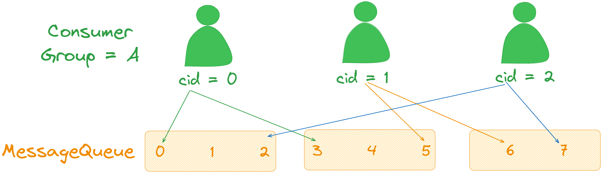
3.  如果上述条件都不满足，即 [popShareQueueNum](http://popsharequeuenum/) 小于 consumer 实例数量-1，但 consumer数量大于queue数量。则执行 [QueryAssignmentProcessor#allocate](http://queryassignmentprocessor/#allocate) 为每个 consumer 实例分配1个 queue。所以**消不合理的 popShareQueueNum + consumer 数量 + queue 数量仍然会导致队列独占**，比如 8 个queue，16 个 consumer，[popShareQueueNum](http://popsharequeuenum%20/) 小于15。

private List<MessageQueue> allocate(String consumerGroup,String currentCID,List<MessageQueue> mqAll, List<String> cidAll) {

// 检查currentCID是否为空，若为空则抛出IllegalArgumentException

if (StringUtils.isBlank(currentCID)) {

throw new IllegalArgumentException("currentCID is empty");

}

// 检查mqAll是否为空，若为空则抛出IllegalArgumentException

if (CollectionUtils.isEmpty(mqAll)) {

throw new IllegalArgumentException("mqAll is null or mqAll empty");

}

// 检查cidAll是否为空，若为空则抛出IllegalArgumentException

if (CollectionUtils.isEmpty(cidAll)) {

throw new IllegalArgumentException("cidAll is null or cidAll empty");

}

// 创建一个空的消息队列列表

List<MessageQueue> result = new ArrayList<>();

// 如果cidAll不包含currentCID，则记录日志并返回空结果列表

if (!cidAll.contains(currentCID)) {

log.info("\[BUG\] ConsumerGroup:{} The consumerId:{} not in cidAll:{}",

consumerGroup,

currentCID,

cidAll);

return result;

}

// 获取currentCID在cidAll中的索引，将对应索引处的消息队列添加到结果列表中

int index \= cidAll.indexOf(currentCID);

result.add(mqAll.get(index % mqAll.size()));

return result;// 返回结果列表

}

1.  最终分配结果转换为 [MessageQueueAssignment](http://messagequeueassignment/) 返回客户端。

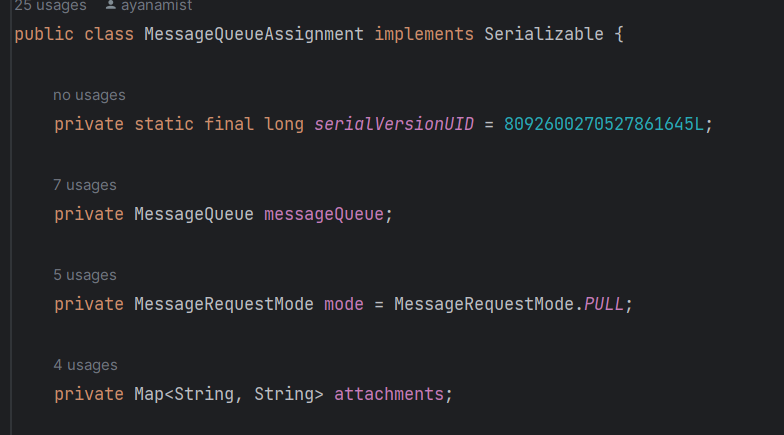

## **3.4 Consumer 更新 ProcessQueue**

如果 Broker 开启「**Pop 消费**」后，所有 [MessageQueueAssignment](http://messagequeueassignment/) 都是 POP 模式。

private boolean updateMessageQueueAssignment(final String topic, final Set<MessageQueueAssignment> assignments, final boolean isOrder) {

// 是否变更

boolean changed \= false;

// 创建用于存储推送模式消息队列分配的HashMap

Map<MessageQueue,MessageQueueAssignment> mq2PushAssignment = new HashMap<>();

// 创建用于存储 Pop 模式消息队列分配的HashMap

Map<MessageQueue,MessageQueueAssignment> mq2PopAssignment = new HashMap<>();

// 1、遍历消息队列分配列表

for (MessageQueueAssignment assignment :assignments) {

// 获取分配中的消息队列

MessageQueue messageQueue \= assignment.getMessageQueue();

// 如果消息队列为空，则继续下一次循环

if (messageQueue == null) {

continue;

}

// 根据分配的消息请求模式，将分配添加到对应的HashMap中

if (MessageRequestMode.POP == assignment.getMode()) {

mq2PopAssignment.put(messageQueue,assignment);

} else {

mq2PushAssignment.put(messageQueue,assignment);

}

}

// 2、重试 Topic 订阅

// 如果主题不是以指定的重试主题前缀开头

if (!topic.startsWith(MixAll.RETRY\_GROUP\_TOPIC\_PREFIX)) {

// 如果Pop模式消息队列分配为空且推送模式消息队列分配不为空

if (mq2PopAssignment.isEmpty() && !mq2PushAssignment.isEmpty()) {

// 如果是 push 模式，则订阅 pop 重试 Topic

// 每个consumerGroup会默认订阅重试topic，即%RETRY%{consumerGroup}，存在对应ProcessQueue。

try {

final String retryTopic \= KeyBuilder.buildPopRetryTopic(topic,getConsumerGroup());

SubscriptionData subscriptionData \= FilterAPI.buildSubscriptionData(retryTopic,SubscriptionData.SUB\_ALL);

getSubscriptionInner().put(retryTopic,subscriptionData);

} catch (Exception ignored) {

}

} else if (!mq2PopAssignment.isEmpty() && mq2PushAssignment.isEmpty()) {

// 如果是 pop 模式，则取消订阅 pop 重试 Topic

// 在 topic+consumerGroup 纬度还会存在 n 个订阅，即 %RETRY%{consumerGroup}\_{topic} ，不存在 ProcessQueue。在更新 ProcessQueue 的过程中，会对pop重试topic订阅关系做处理。

try {

final String retryTopic \= KeyBuilder.buildPopRetryTopic(topic,getConsumerGroup());

getSubscriptionInner().remove(retryTopic);

} catch (Exception ignored) {

}

}

}

{

// 创建一个HashMap，用于存储需要移除的消息队列和对应的处理队列

HashMap<MessageQueue, ProcessQueue> removeQueueMap = new HashMap<>(this.processQueueTable.size());

// 获取处理队列表的迭代器

Iterator<Entry<MessageQueue, ProcessQueue>> it = this.processQueueTable.entrySet().iterator();

// 遍历处理队列表

while (it.hasNext()) {

// 获取下一个键值对

Entry<MessageQueue, ProcessQueue> next = it.next();

MessageQueue mq \= next.getKey(); // 获取消息队列

ProcessQueue pq \= next.getValue(); // 获取处理队列

// 如果消息队列的主题与指定主题相同

if (mq.getTopic().equals(topic)) {

// 如果消息队列不在推送分配中

if (!mq2PushAssignment.containsKey(mq)) {

pq.setDropped(true); // 标记处理队列为已移除

removeQueueMap.put(mq, pq); // 将消息队列和处理队列加入待移除的Map中

} else if (pq.isPullExpired() && this.consumeType() == ConsumeType.CONSUME\_PASSIVELY) {

pq.setDropped(true); // 标记处理队列为已移除

removeQueueMap.put(mq, pq); // 将消息队列和处理队列加入待移除的Map中

log.error("\[BUG\]doRebalance, {}, try remove unnecessary mq, {}, because pull is pause, so try to fixed it",

consumerGroup, mq); // 记录错误日志

}

}

}

// 移除不再属于当前消费者组的消息队列

for (Entry<MessageQueue, ProcessQueue> entry : removeQueueMap.entrySet()) {

MessageQueue mq \= entry.getKey(); // 获取消息队列

ProcessQueue pq \= entry.getValue(); // 获取对应的处理队列

// 如果成功移除不必要的消息队列

if (this.removeUnnecessaryMessageQueue(mq, pq)) {

this.processQueueTable.remove(mq); // 从处理队列表中移除消息队列

changed = true; // 标记发生了变化

log.info("doRebalance, {}, remove unnecessary mq, {}", consumerGroup, mq); // 记录信息日志

}

}

}

{

// 创建一个HashMap，用于存储需要移除的消息队列和对应的处理队列

HashMap<MessageQueue,PopProcessQueue> removeQueueMap = new HashMap<>(this.popProcessQueueTable.size());

// 获取处理队列表的迭代器

Iterator<Entry<MessageQueue,PopProcessQueue>> it = this.popProcessQueueTable.entrySet().iterator();

// 2、遍历处理队列表

while (it.hasNext()) {

// 获取下一个键值对

Entry<MessageQueue,PopProcessQueue> next = it.next();

MessageQueue mq \= next.getKey();// 获取消息队列

PopProcessQueue pq \= next.getValue();// 获取处理队列

// 如果消息队列的主题与指定主题相同

if (mq.getTopic().equals(topic)) {

// 如果消息队列不在弹出分配中

if (!mq2PopAssignment.containsKey(mq)) {

//标记处理队列为已移除

pq.setDropped(true);

// 将消息队列和处理队列加入待移除的Map中

removeQueueMap.put(mq,pq);

} else if (pq.isPullExpired() && this.consumeType() == ConsumeType.CONSUME\_PASSIVELY) {

//标记处理队列为已移除

pq.setDropped(true);

// 将消息队列和处理队列加入待移除的Map中

removeQueueMap.put(mq,pq);

// 记录错误日志

log.error("\[BUG\]doRebalance,{},try remove unnecessary pop mq,{},because pop is pause,so try to fixed it",

consumerGroup,mq);

}

}

}

// 移除不再属于当前消费者组的消息队列

for (Entry<MessageQueue,PopProcessQueue> entry :removeQueueMap.entrySet()) {

MessageQueue mq \= entry.getKey();// 获取消息队列

PopProcessQueue pq \= entry.getValue();// 获取对应的处理队列

// 如果成功移除不必要的消息队列

if (this.removeUnnecessaryPopMessageQueue(mq,pq)) {

this.popProcessQueueTable.remove(mq);// 从处理队列表中移除消息队列

changed = true;// 标记发生了变化

// 记录信息日志

log.info("doRebalance,{},remove unnecessary pop mq,{}",consumerGroup,mq);

}

}

}

{

// 新增消息队列

boolean allMQLocked \= true; // 标记所有消息队列是否都已锁定

List<PullRequest> pullRequestList = new ArrayList<>();// 用于存储拉取消息的请求列表

for (MessageQueue mq :mq2PushAssignment.keySet()) { // 遍历推送分配的消息队列

if (!this.processQueueTable.containsKey(mq)) { // 如果处理队列表中不包含该消息队列

if (isOrder && !this.lock(mq)) { // 如果为顺序消费且未能成功锁定消息队列

log.warn("doRebalance,{},add a new mq failed,{},because lock failed",consumerGroup,mq);// 记录警告日志

allMQLocked = false;// 将消息队列未全部锁定标记设为false

continue;

}

this.removeDirtyOffset(mq);// 移除消息队列的脏数据偏移量

ProcessQueue pq \= createProcessQueue();// 创建处理队列

pq.setLocked(true);// 标记处理队列为已锁定

long nextOffset \= -1L;// 下一个偏移量初始化为-1

try {

nextOffset = this.computePullFromWhereWithException(mq);// 计算拉取消息起始偏移量

} catch (Exception e) {

log.info("doRebalance,{},compute offset failed,{}",consumerGroup,mq);// 记录信息日志

continue;

}

if (nextOffset >= 0) { // 如果计算得到的下一个偏移量有效

ProcessQueue pre \= this.processQueueTable.putIfAbsent(mq,pq);// 将消息队列和处理队列加入到处理队列表中

if (pre != null) {

log.info("doRebalance,{},mq already exists,{}",consumerGroup,mq);// 记录信息日志

} else {

log.info("doRebalance,{},add a new mq,{}",consumerGroup,mq);// 记录信息日志

PullRequest pullRequest \= new PullRequest();// 创建拉取消息请求

pullRequest.setConsumerGroup(consumerGroup);// 设置消费者组

pullRequest.setNextOffset(nextOffset);// 设置下一个偏移量

pullRequest.setMessageQueue(mq);// 设置消息队列

pullRequest.setProcessQueue(pq);// 设置处理队列

pullRequestList.add(pullRequest);// 将拉取消息请求加入列表

changed = true;// 标记发生了变化

}

} else {

log.warn("doRebalance,{},add new mq failed,{}",consumerGroup,mq);// 记录警告日志

}

}

}

if (!allMQLocked) { // 如果并非所有消息队列都已锁定

mQClientFactory.rebalanceLater(500);// 延迟500毫秒后重新进行负载均衡

}

this.dispatchPullRequest(pullRequestList,500);// 分发拉取消息请求，延迟500毫秒

}

{

// add new message queue

List<PopRequest> popRequestList = new ArrayList<>();// 用于存储Pop消息的请求列表

for (MessageQueue mq :mq2PopAssignment.keySet()) { // 遍历Pop分配的消息队列

if (!this.popProcessQueueTable.containsKey(mq)) { // 如果Pop处理队列表中不包含该消息队列

PopProcessQueue pq \= createPopProcessQueue();// 创建Pop处理队列

PopProcessQueue pre \= this.popProcessQueueTable.putIfAbsent(mq,pq);// 将消息队列和Pop处理队列加入到Pop处理队列表中

if (pre != null) {

log.info("doRebalance,{},mq pop already exists,{}",consumerGroup,mq);// 记录信息日志

} else {

log.info("doRebalance,{},add a new pop mq,{}",consumerGroup,mq);// 记录信息日志

// 创建Pop消息请求，并提交 PopRequest

PopRequest popRequest \= new PopRequest();

popRequest.setTopic(topic);// 设置主题

popRequest.setConsumerGroup(consumerGroup);// 设置消费者组

popRequest.setMessageQueue(mq);// 设置消息队列

popRequest.setPopProcessQueue(pq);// 设置Pop处理队列

popRequest.setInitMode(getConsumeInitMode());// 设置消费初始化模式

popRequestList.add(popRequest);// 将Pop消息请求加入列表

changed = true;// 标记发生了变化

}

}

}

this.dispatchPopPullRequest(popRequestList,500);// 分发Pop拉取消息请求，延迟500毫秒

}

return changed;

}

可以看到很长，这里重点关注下「**Pop 消费**」相关代码。

1.  首先在更新 [ProcessQueue](http://processqueue/) 的过程中，会对「**Pop 重试 Topic**」订阅关系做处理。
2.  如果当前是 Push 模式，需要订阅「**Pop 重试 Topic**」。
3.  而如果当前是 Pop 模式，则需要【取消】订阅「**Pop 重试 Topic**」。
4.  此外要记住，「**Pop 重试 Topic**」不存在对应 [ProcessQueue](http://processqueue/)。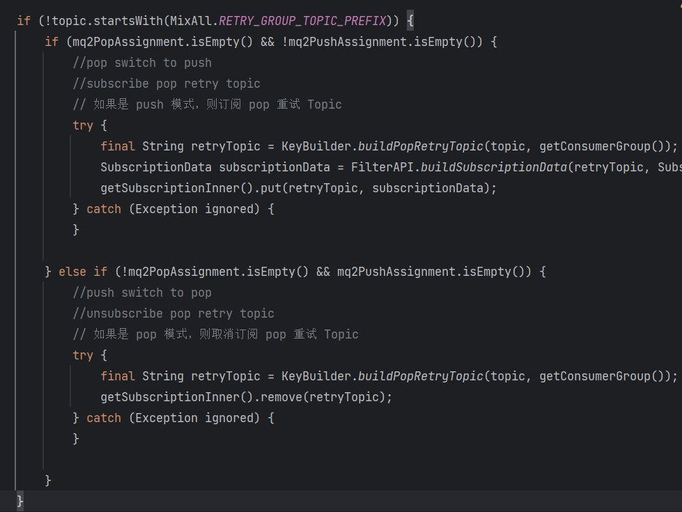
5.  分配 [PopProcessQueue](http://popprocessqueue%20/)。
6.  对于 pull 模式，每个 MessageQueue 对应一个 [ProcessQueue](http://processqueue/)。
7.  对于 pop 模式，每个 MessageQueue 对应一个 [PopProcessQueue](http://popprocessqueue/)。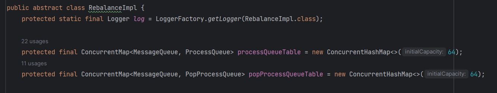
8.  [PopProcessQueue](http://popprocessqueue/) 不同于原来的 [ProcessQueue](http://processqueue/)，不再包含任何 offset 相关属性。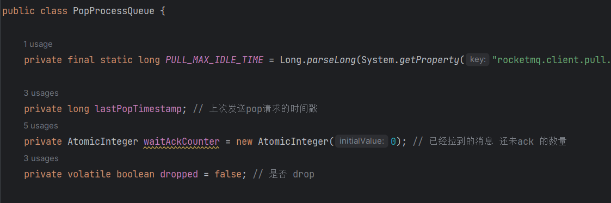
9.  提交 [PopRequest](http://poprequest/)。
10.  对于移除分配给自己的 [queue](http://queue/)，仍然是标记 drop 并从 [RebalanceImpl#popProcessQueueTable](http://rebalanceimpl/#popProcessQueueTable) 中移除。
11.  对于新分配给自己的 [queue](http://queue/)，构造 [PopRequest](http://poprequest/) 提交到 [PullMessageService](http://pullmessageservice/) 线程。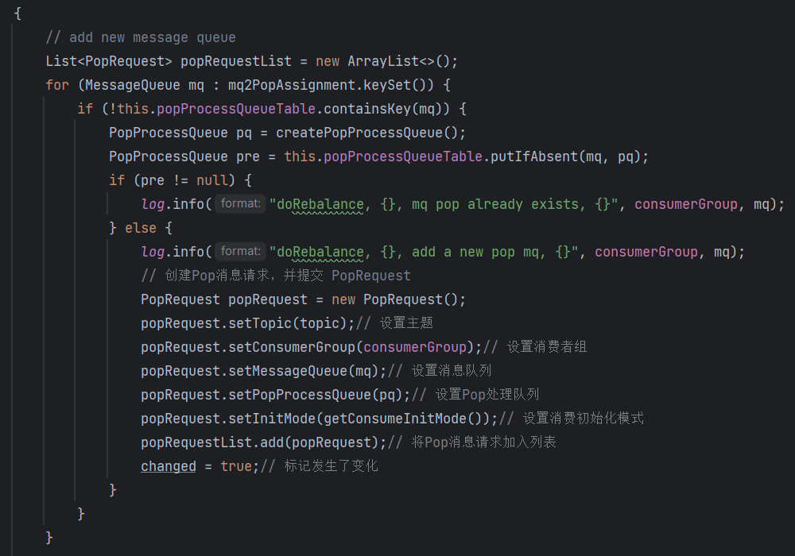
12.  此处我们来看下消费模式的初始化，调用 [RebalancePushImpl#getConsumeInitMode](http://rebalancepushimpl/#getConsumeInitMode) 方法。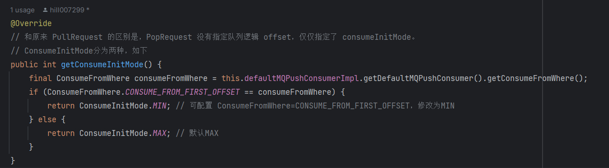

## **3.5 Consumer 发送 Pop 消息请求**

### **3.5.1 PullMessageService 拉取消息服务**

对于 Pop 的拉取请求还是由「**PullMessageService**」拉取服务来处理的。之前我们知道「**PullMessageService**」是在客户端实例「**MQClientInstance**」里面启动的一个服务，在客户端实例启动阶段就会将该服务启动起来，「**PullMessageService**」继承自「**ServiceThread**」，因此它也是一个异步线程任务，里面有自己的线程，该线程启动后会基于「**PullMessageService**」里面的阻塞队列「**queue**」做相关工作，该「**queue**」里面的每个对象就是「**PopRequest**」对象，基于这些信息可以发起拉消息的请求。

因此 「**PullMessageService**」的工作职责是从 [LinkedBlockQueue](http://linkedblockqueue/) 中循环取 [PopRequest](http://poprequest/) 对象，然后执行[popMessage](http://popmessage/) 方法，进而去请求 broker 获取消息。

### **3.5.2 PullMessageService 拉取线程启动**

启动拉取消息服务 [PullMessageService](http://pullmessageservice/)，它是一个异步线程，拉取消息的核心方法 [PullMessageService#popMessage](http://pullmessageservice/#popMessage)。

源码位置：[https://github.com/apache/rocketmq/blob/release-5.1.2/client/src/main/java/org/apache/rocketmq/client/impl/consumer/PullMessageService.java](https://github.com/apache/rocketmq/blob/release-5.1.2/client/src/main/java/org/apache/rocketmq/client/impl/consumer/PullMessageService.java)

public class PullMessageService extends ServiceThread {

private final Logger logger \= LoggerFactory.getLogger(PullMessageService.class);

// 存放 PopRequest/PullRequest 的阻塞队列

private final LinkedBlockingQueue<MessageRequest> messageRequestQueue = new LinkedBlockingQueue<>();

// MQClientInstance 客户端实例

private final MQClientInstance mQClientFactory;

// 定时任务执行服务，主要用于延迟添加 popRequest

private final ScheduledExecutorService scheduledExecutorService \= Executors

.newSingleThreadScheduledExecutor(new ThreadFactoryImpl("PullMessageServiceScheduledThread"));

public PullMessageService(MQClientInstance mQClientFactory) {

this.mQClientFactory = mQClientFactory;

}

@Override

public void run() {

logger.info(this.getServiceName() + " service started");

/\*

\* 运行时逻辑

\* 如果服务没有停止，则在死循环中执行拉取消息的操作

\* Stopped 声明为 volatile，每执行一次业务逻辑，检测一下其运行状态，可以通过其他线程将Stopped 设置为 true，从而停止该线程

\*/

while (!this.isStopped()) {

try {

// 线程大部分时间都处于阻塞等待状态

// 从 messageRequestQueue 中获取一个 PopRequest/PullRequest 消息拉取请求任务，如果messageRequestQueue 为空，则线程将阻塞，直到有拉取任务被放入

MessageRequest messageRequest \= this.messageRequestQueue.take();

if (messageRequest.getMessageRequestMode() == MessageRequestMode.POP) {

// Pop 消息

this.popMessage((PopRequest) messageRequest);

} else {

// 原来的 Pull 消息

this.pullMessage((PullRequest) messageRequest);

}

} catch (InterruptedException ignored) {

} catch (Exception e) {

logger.error("Pull Message Service Run Method exception", e);

}

}

logger.info(this.getServiceName() + " service end");

}

}

在 run 方法在一个循环中，它会监听阻塞队列 [messageRequestQueue](http://messagerequestqueue/)，不断地从 [messageRequestQueue](http://messagerequestqueue/) 中阻塞式的获取并移除队列的头部数据，即拉取消息的请求，当队列是空的时候会一直阻塞。如果不为空，则会从队列中获取 [Pop](http://pullrequest/)[Request](http://pullrequest/) 请求对象去拉取消息然后调用 [popMessage](http://popmessage%20/) 方法根据该请求去 broker 拉取消息，示意图如下：

> 从命名看其实很贴切，就是它的字面意思，大家暂时理解为有了这个请求，才会去拉取消息。

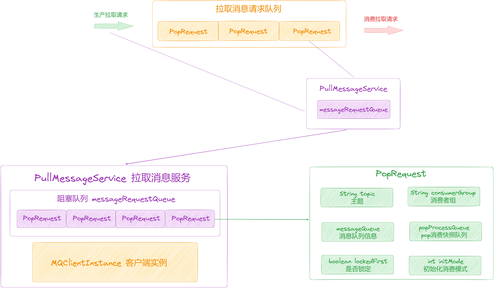

// PopRequest 是一个对象，保存待拉取的消息队列和正在处理的队里 ProcessQueue 消息处理队列，从Broker 中拉取到的消息会先存入 ProccessQueue；

public class PopRequest implements MessageRequest {

// 主题

private String topic;

// 消费者组

private String consumerGroup;

// 消息处理队列（消费者本地的快照队列，从服务器拉取下来的消息要先放到该快照队列内，消费任务被消费的消息需要从该队列移除走）

private MessageQueue messageQueue;

// 消息处理队列（消费者本地的快照队列，从服务器拉取下来的消息要先放到该快照队列内，消费任务被消费的消息需要从该队列移除走）

private PopProcessQueue popProcessQueue;

// 是否首次锁定标志，默认为false

private boolean lockedFirst \= false;

// 初始化消费模式，默认为最大模式

private int initMode \= ConsumeInitMode.MAX;

....

}

下面我们接着来看，当取出拉取请求后，调用 [popMessage](http://popmessage/) 方法进行拉取。

  
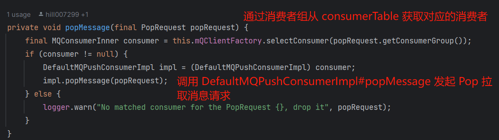

其他方法相对比较简单，这里就不再剖析，自行学习。接着我们来看下拉取消息请求的上层方法。

### **3.5.3 上层客户端拉取 Pop 消息请求处理**

源码位置：[https://github.com/apache/rocketmq/blob/release-5.1.2/client/src/main/java/org/apache/rocketmq/client/impl/consumer/DefaultMQPushConsumerImpl.java](https://github.com/apache/rocketmq/blob/release-5.1.2/client/src/main/java/org/apache/rocketmq/client/impl/consumer/DefaultMQPushConsumerImpl.java)

在 [【消费者源码分析系列第三篇】图解 RocketMQ 源码之消费者是如何从 Broker 拉取数据](https://articles.zsxq.com/id_u91ued4dpqrp.html) 这篇中，我们剖析了 [PullMessage](http://pullmessage%20/) 拉取消息的流程，这里的 [PopMessage](http://popmessage%20/) 流程类似，关于参数校验、流控判断校验的逻辑就不再详细剖析，我们只看重点代码。

// popRequest 拉消息请求对象

void popMessage(final PopRequest popRequest) {

// 获取拉消息队列在消费者端的快照队列

// 获取ProcessQueue，如果处理队列状态未被丢弃，则更新拉取时间戳

final PopProcessQueue processQueue \= popRequest.getPopProcessQueue();

// 参数校验、流控判断校验省略

....

// 创建拉取消息的回调函数对象，当调用 MQClientInstance 异步拉取消息的请求返回之后，将 popResult 交给 “拉消息结果处理回调对象”，调用它的 onSuccess 方法

PopCallback popCallback \= new PopCallback() {

@Override

// 拉取消息成功时

public void onSuccess(PopResult popResult) {

if (popResult == null) {

log.error("pop callback popResult is null");

DefaultMQPushConsumerImpl.this.executePopPullRequestImmediately(popRequest);

return;

}

// 预处理 popResult 结果，即将拉取到的消息放到 PopResult 中

processPopResult(popResult, subscriptionData);

switch (popResult.getPopStatus()) {

case FOUND: // 正常从服务器拉取到消息

// 拉取消息的总耗时

long pullRT \= System.currentTimeMillis() - beginTimestamp;

// 汇总所有拉取消息操作的总耗时

DefaultMQPushConsumerImpl.this.getConsumerStatsManager().

incPullRT(popRequest.getConsumerGroup(),

popRequest.getMessageQueue().getTopic(), pullRT);

if (popResult.getMsgFoundList() == null || popResult.getMsgFoundList().isEmpty()) {

// 将请求 PopRequest 重新放入到 messageRequestQueue 中立马发起下一次拉消息任务

DefaultMQPushConsumerImpl.this.

executePopPullRequestImmediately(popRequest);

} else {

// 汇总拉取到的所有消息的长度

DefaultMQPushConsumerImpl.this.getConsumerStatsManager().

incPullTPS(popRequest.getConsumerGroup(),

popRequest.getMessageQueue().getTopic(),

popResult.getMsgFoundList().size());

popRequest.getPopProcessQueue().

incFoundMsg(popResult.getMsgFoundList().size());

// 消费消息服务开始干活，提交“消费任务”

DefaultMQPushConsumerImpl.this.consumeMessagePopService.

submitPopConsumeRequest(

popResult.getMsgFoundList(),

processQueue,

popRequest.getMessageQueue());

if (DefaultMQPushConsumerImpl.this.

defaultMQPushConsumer.getPullInterval() > 0) {

// 延迟将请求加入队列，方便下次发起该 queue 的拉消息请求。

DefaultMQPushConsumerImpl.this.

executePopPullRequestLater(popRequest,

DefaultMQPushConsumerImpl.this.defaultMQPushConsumer.

getPullInterval());

} else {

// 立即将请求加入队列，方便再次发起该 queue 的拉消息请求。

DefaultMQPushConsumerImpl.this.

executePopPullRequestImmediately(popRequest);

}

}

break;

case NO\_NEW\_MSG:

case POLLING\_NOT\_FOUND: // NO\_NEW\_MSG || NO\_MATCHED\_MSG 都表示本次 pop 没有新的可消费的消息

// 立即将请求放入队列，方便再次发起该 queue 的拉消息请求。

DefaultMQPushConsumerImpl.this.

executePopPullRequestImmediately(popRequest);

break;

case POLLING\_FULL:

// 延迟3s发送拉取消息请求

DefaultMQPushConsumerImpl.this.executePopPullRequestLater(popRequest, pullTimeDelayMillsWhenException);

break;

default:

// 延迟3s发送拉取消息请求

DefaultMQPushConsumerImpl.this.executePopPullRequestLater(popRequest, pullTimeDelayMillsWhenException);

break;

}

}

@Override

public void onException(Throwable e) {

if (!popRequest.getMessageQueue().getTopic().

startsWith(MixAll.RETRY\_GROUP\_TOPIC\_PREFIX)) {

log.warn("execute the pull request exception: {}", e);

}

if (e instanceof MQBrokerException && ((MQBrokerException) e).getResponseCode() == ResponseCode.FLOW\_CONTROL) {

DefaultMQPushConsumerImpl.this.executePopPullRequestLater(popRequest, PULL\_TIME\_DELAY\_MILLS\_WHEN\_BROKER\_FLOW\_CONTROL);

} else {

DefaultMQPushConsumerImpl.this.executePopPullRequestLater(popRequest, pullTimeDelayMillsWhenException);

}

}

};

try {

// 可见时间

long invisibleTime \= this.defaultMQPushConsumer.getPopInvisibleTime();

if (invisibleTime < MIN\_POP\_INVISIBLE\_TIME ||

invisibleTime > MAX\_POP\_INVISIBLE\_TIME) {

invisibleTime = 60000;

}

// 真正的开始拉取消息

this.pullAPIWrapper.popAsync(

popRequest.getMessageQueue(), // 拉消息队列

invisibleTime,

this.defaultMQPushConsumer.getPopBatchNums(), // 拉消息最多消息条数限制

popRequest.getConsumerGroup(), // 消费者组

BROKER\_SUSPEND\_MAX\_TIME\_MILLIS, // 控制服务器端长轮询时 最长 hold 的时间(15秒)

popCallback, // 拉消息结果回调处理对象

true,

popRequest.getInitMode(), // 初始化模式

false,

subscriptionData.getExpressionType(), // 表达式类型，一般是 tag

subscriptionData.getSubString());

} catch (Exception e) {

log.error("popAsync exception", e);

// 拉取异常，延迟3s发送拉取消息请求

this.executePopPullRequestLater(popRequest, pullTimeDelayMillsWhenException);

}

}

[PullAPIWrapper#popAsync](http://pullapiwrapper/#popAsync)：相较于普通 pull 消息，pop 消息请求的区别是：

1.  没有 [commitOffset](http://commitoffset/) 参数，不支持由 consumer 提交 offset。
2.  没有 [queueOffset](http://queueoffset%20/) 参数，拉取逻辑 offset，只有一个 initMode=MAX 或 MIN，默认 MAX。
3.  多了 [invisibleTime](http://invisibletime/) 可见时间参数，默认60s。

整个方法的简化流程图如下：

  
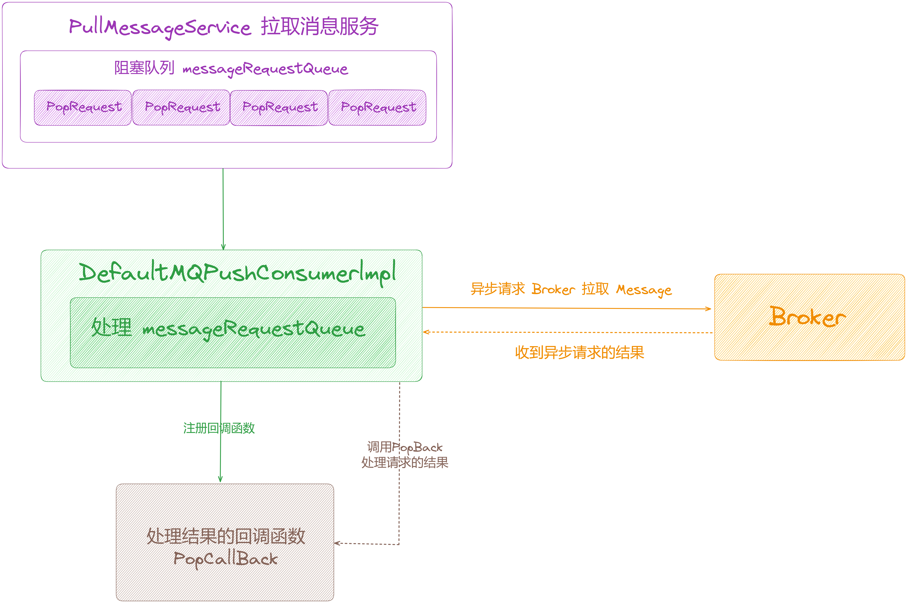

处理拉取消息结果：执行 [Pop](http://pullcallback/)[Callback](http://pullcallback/) 回调函数。由于 [Request](http://request%20/) 请求有可能成功、也有可能失败，所以[PopCallback](http://pullcallback/) 也针对不同的 [Response](http://response/) 做了判断处理，其处理逻辑分为了两部分，如下图所示：

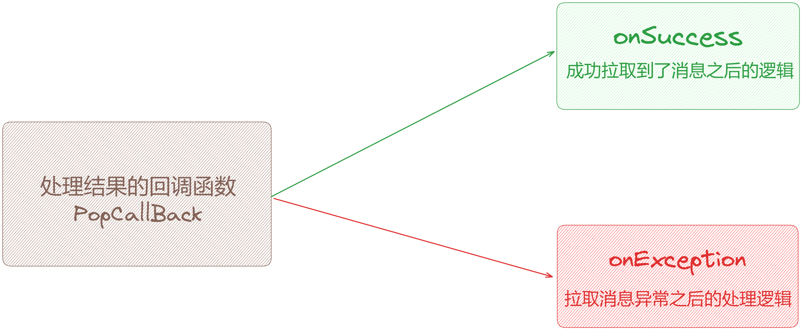

### **3.5.4 真正拉取 Pop 消息任务**

上面方法只是上层客户端拉取任务逻辑的处理，在结束的时候调用了 [pullAPIWrapper#p](http://pullapiwrapper/#pullKernelImpl)opAsync 方法进行真正拉取消息任务。

  
对于「**Pop 消息请求**」仅支持发送给「**Master Broker**」。如果 master 不存在，延迟 3s 再提交 [PopRequest](http://poprequest/)。

public void popAsync(MessageQueue mq, long invisibleTime, int maxNums, String consumerGroup,

long timeout, PopCallback popCallback, boolean poll, int initMode, boolean order, String expressionType, String expression)

throws MQClientException, RemotingException, InterruptedException {

// 查找 Broker，仅支持发送给 Master

FindBrokerResult findBrokerResult \= this.mQClientFactory.findBrokerAddressInSubscribe(mq.getBrokerName(), MixAll.MASTER\_ID, true);

// 如果内存中没有找到broker信息，则从NameServer中拉起Broker的最新信息

if (null == findBrokerResult) {

// 如果为空，到 nameserver 获取指定 topic 的路由数据，路由数据包含 主机信息

this.mQClientFactory.updateTopicRouteInfoFromNameServer(mq.getTopic());

findBrokerResult = this.mQClientFactory.findBrokerAddressInSubscribe(mq.getBrokerName(), MixAll.MASTER\_ID, true);

}

// 找到了 broker

if (findBrokerResult != null) {

// 构造 PopMessageRequestHeader 请求头

PopMessageRequestHeader requestHeader \= new PopMessageRequestHeader();

requestHeader.setConsumerGroup(consumerGroup); // 消费者组

requestHeader.setTopic(mq.getTopic()); // topic

requestHeader.setQueueId(mq.getQueueId()); // 队列id

requestHeader.setMaxMsgNums(maxNums); // 最大拉取消息数量

requestHeader.setInvisibleTime(invisibleTime); // 可见时间

requestHeader.setInitMode(initMode); // 默认 Max

requestHeader.setExpType(expressionType); // tag 过滤

requestHeader.setExp(expression); // tag

requestHeader.setOrder(order); // false

requestHeader.setBname(mq.getBrokerName()); // broker 名称

//give 1000 ms for server response

if (poll) {

// poll 超时时间

requestHeader.setPollTime(timeout);

// 请求创建时间

requestHeader.setBornTime(System.currentTimeMillis());

// timeout + 10s, fix the too earlier timeout of client when long polling.

timeout += 10 \* 1000; // 请求超时时间

}

String brokerAddr \= findBrokerResult.getBrokerAddr();

// 发起 Pop 拉取消息请求

this.mQClientFactory.getMQClientAPIImpl().popMessageAsync(mq.getBrokerName(), brokerAddr, requestHeader, timeout, popCallback);

return;

}

throw new MQClientException("The broker\[" + mq.getBrokerName() + "\] not exist", null);

}

该方法相对比较简单，步骤如下：

1.  根据 brokerName 从内存中获取 Broker 的详细信息:包括 BrokerAddress、broker 是否为 sLave、brokerVersion 等，这里仅从 Master 节点获取。
2.  如果内存中没有找到 broker 信息，则从 NameServer 中拉起 Broker 的最新信息。
3.  如果找到了 broker，则执行：
4.  构造 [PopMessageRequestHeader](http://popmessagerequestheader/) 请求头 。
5.  最后调用 [MQClientAPIImpl#](http://mqclientapiimpl/#pullMessage)[popMessageAsync](http://popmessageasync%20/) 方法发送请求，进行消息拉取。

### **3.5.3 远程调用拉取 Pop 消息任务**

可以看到上面最终调用客户端实例的拉取方法进行真正远程拉取消息任务。

源码位置：[https://github.com/apache/rocketmq/blob/release-5.1.2/client/src/main/java/org/apache/rocketmq/client/impl/MQClientAPIImpl.java](https://github.com/apache/rocketmq/blob/release-5.1.2/client/src/main/java/org/apache/rocketmq/client/impl/MQClientAPIImpl.java)

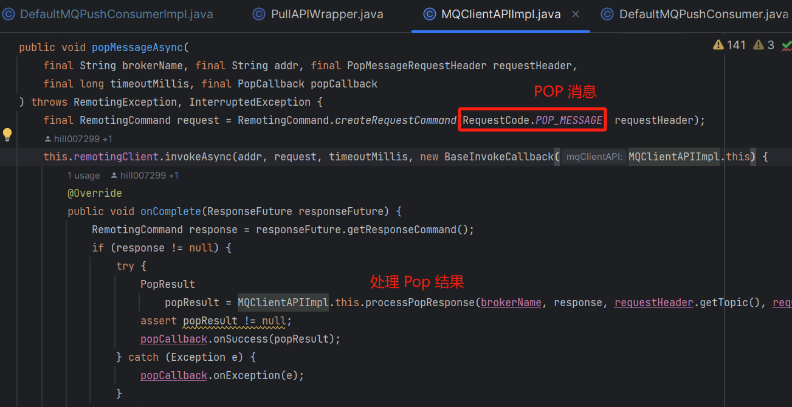

## **3.6 Broker 处理 Pop 响应**

源码位置：[https://github.com/apache/rocketmq/blob/release-5.1.2/broker](https://github.com/apache/rocketmq/blob/release-5.1.2/broker/src/main/java/org/apache/rocketmq/broker/processor/PopMessageProcessor.java)[/src/main/java/org/apache/rocketmq/](https://github.com/apache/rocketmq/blob/release-5.1.2/broker/src/main/java/org/apache/rocketmq/broker/processor/PopMessageProcessor.java)[broker/processor/PopMessageProcessor](https://github.com/apache/rocketmq/blob/release-5.1.2/broker/src/main/java/org/apache/rocketmq/broker/processor/PopMessageProcessor.java)[.java](https://github.com/apache/rocketmq/blob/release-5.1.2/broker/src/main/java/org/apache/rocketmq/broker/processor/PopMessageProcessor.java)

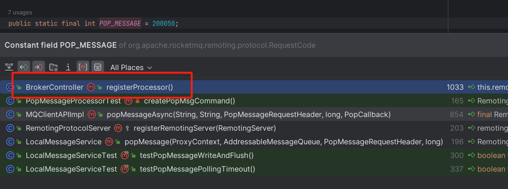

可以看到处理 Pop 请求的处理器为 [popMessageProcessor](http://popmessageprocessor/)。

this.remotingServer.registerProcessor(RequestCode.POP\_MESSAGE, this.popMessageProcessor, this.pullMessageExecutor);

通过前面的剖析，我们了解到请求的处理入口在对于处理器的 [processRequest](http://processrequest/) 方法，该方法逻辑超级长，这里只看下重点代码。

/\*\*

\* 处理 POP 消息请求

\*

\* @param channel

\* @param request

\* @return

\* @throws RemotingCommandException

\*/

@Override

public RemotingCommand processRequest(final ChannelHandlerContext ctx, RemotingCommand request)

throws RemotingCommandException {

....

Channel channel \= ctx.channel();

RemotingCommand response \= RemotingCommand.createResponseCommand(PopMessageResponseHeader.class);

final PopMessageResponseHeader responseHeader \= (PopMessageResponseHeader) response.readCustomHeader();

final PopMessageRequestHeader requestHeader \=

(PopMessageRequestHeader) request.decodeCommandCustomHeader(PopMessageRequestHeader.class);

StringBuilder startOffsetInfo \= new StringBuilder(64);

StringBuilder msgOffsetInfo \= new StringBuilder(64);

StringBuilder orderCountInfo \= null;

if (requestHeader.isOrder()) {

orderCountInfo = new StringBuilder(64);

}

// ... 解析请求体和一系列校验

// 生成随机数

int randomQ \= random.nextInt(100);

int reviveQid;

if (requestHeader.isOrder()) {

reviveQid = KeyBuilder.POP\_ORDER\_REVIVE\_QUEUE;

} else {

// 轮询选一个 Revive 队列

reviveQid = (int) Math.abs(ckMessageNumber.getAndIncrement() % this.brokerController.getBrokerConfig().getReviveQueueNum());

}

int commercialSizePerMsg \= this.brokerController.getBrokerConfig().getCommercialSizePerMsg();

GetMessageResult getMessageResult \= new GetMessageResult(commercialSizePerMsg);

ExpressionMessageFilter finalMessageFilter \= messageFilter;

StringBuilder finalOrderCountInfo \= orderCountInfo;

// 1/5 的概率需要拉取重试队列消息

boolean needRetry \= randomQ % 5 == 0;

long popTime \= System.currentTimeMillis();

CompletableFuture<Long> getMessageFuture = CompletableFuture.completedFuture(0L);

// 1、五分之一概率，先拉 Pop 重试队列消息

if (needRetry && !requestHeader.isOrder()) {

TopicConfig retryTopicConfig \=

this.brokerController.getTopicConfigManager().

selectTopicConfig(KeyBuilder.buildPopRetryTopic(requestHeader.getTopic(),

requestHeader.getConsumerGroup()));

if (retryTopicConfig != null) {

for (int i \= 0; i < retryTopicConfig.getReadQueueNums(); i++) {

int queueId \= (randomQ + i) % retryTopicConfig.getReadQueueNums();

getMessageFuture = getMessageFuture.thenCompose(restNum -> popMsgFromQueue(requestHeader.getAttemptId(), true, getMessageResult, requestHeader, queueId, restNum, reviveQid, channel, popTime, finalMessageFilter,

startOffsetInfo, msgOffsetInfo, finalOrderCountInfo));

}

}

}

// 2、默认情况下，popShareQueueNum = -1，导致 queueId 为 -1。

// 如果拉取请求没有指定队列（-1），则拉取所有队列

if (requestHeader.getQueueId() < 0) {

// read all queue

for (int i \= 0; i < topicConfig.getReadQueueNums(); i++) {

int queueId \= (randomQ + i) % topicConfig.getReadQueueNums();

getMessageFuture = getMessageFuture.thenCompose(restNum -> popMsgFromQueue(requestHeader.getAttemptId(), false, getMessageResult, requestHeader, queueId, restNum, reviveQid, channel, popTime, finalMessageFilter,

startOffsetInfo, msgOffsetInfo, finalOrderCountInfo));

}

} else {

// 3、如果根据popShareQueueNum+cid+queue数量分配到实际队列，则 pop 指定队列消息即可。

int queueId \= requestHeader.getQueueId();

getMessageFuture = getMessageFuture.thenCompose(restNum -> popMsgFromQueue(requestHeader.getAttemptId(), false, getMessageResult, requestHeader, queueId, restNum, reviveQid, channel, popTime, finalMessageFilter,

startOffsetInfo, msgOffsetInfo, finalOrderCountInfo));

}

// 4、最后，如果没拉过重试队列消息（五分之四概率），且普通队列消息没拉满32条（客户端默认指定），才会从重试队列拉消息。

// if not full , fetch retry again

if (!needRetry && getMessageResult.getMessageMapedList().size() < requestHeader.getMaxMsgNums() && !requestHeader.isOrder()) {

TopicConfig retryTopicConfig \=

this.brokerController.getTopicConfigManager().

selectTopicConfig(KeyBuilder.buildPopRetryTopic(requestHeader.getTopic(),

requestHeader.getConsumerGroup()));

if (retryTopicConfig != null) {

for (int i \= 0; i < retryTopicConfig.getReadQueueNums(); i++) {

int queueId \= (randomQ + i) % retryTopicConfig.getReadQueueNums();

getMessageFuture = getMessageFuture.thenCompose(restNum -> popMsgFromQueue(requestHeader.getAttemptId(), true, getMessageResult, requestHeader, queueId, restNum, reviveQid, channel, popTime, finalMessageFilter,

startOffsetInfo, msgOffsetInfo, finalOrderCountInfo));

}

}

}

// 5、拉取到消息，正常回复 consumer，如果 restNum > 0，代表还有消息可以拉取，唤醒其他长轮询请求；未拉取到消息，开启长轮询，挂起当前请求。

final RemotingCommand finalResponse \= response;

getMessageFuture.thenApply(restNum -> {

// 拉取消息成功，回复 consumer

if (!getMessageResult.getMessageBufferList().isEmpty()) {

finalResponse.setCode(ResponseCode.SUCCESS);

getMessageResult.setStatus(GetMessageStatus.FOUND);

if (restNum > 0) { // 剩余待拉取消息数量大于 0，唤醒其他长轮询请求

// all queue pop can not notify specified queue pop, and vice versa

popLongPollingService.notifyMessageArriving(requestHeader.getTopic(), requestHeader.getConsumerGroup(), requestHeader.getQueueId());

}

} else {

// 没有拉取到消息，长轮询

PollingResult pollingResult \= popLongPollingService.polling(ctx, request, new PollingHeader(requestHeader));

if (PollingResult.POLLING\_SUC == pollingResult) {

return null; // 开启长轮询成功，挂起请求

} else if (PollingResult.POLLING\_FULL == pollingResult) {

finalResponse.setCode(ResponseCode.POLLING\_FULL);

} else {

finalResponse.setCode(ResponseCode.POLLING\_TIMEOUT);

}

getMessageResult.setStatus(GetMessageStatus.NO\_MESSAGE\_IN\_QUEUE);

}

responseHeader.setInvisibleTime(requestHeader.getInvisibleTime());

responseHeader.setPopTime(popTime);

responseHeader.setReviveQid(reviveQid);

responseHeader.setRestNum(restNum);

responseHeader.setStartOffsetInfo(startOffsetInfo.toString());

responseHeader.setMsgOffsetInfo(msgOffsetInfo.toString());

if (requestHeader.isOrder() && finalOrderCountInfo != null) {

responseHeader.setOrderCountInfo(finalOrderCountInfo.toString());

}

finalResponse.setRemark(getMessageResult.getStatus().name());

switch (finalResponse.getCode()) {

case ResponseCode.SUCCESS:

if (this.brokerController.getBrokerConfig().isTransferMsgByHeap()) {

final long beginTimeMills \= this.brokerController.getMessageStore().now();

final byte\[\] r = this.readGetMessageResult(getMessageResult, requestHeader.getConsumerGroup(),requestHeader.getTopic(), requestHeader.getQueueId());

this.brokerController.getBrokerStatsManager().

incGroupGetLatency(requestHeader.getConsumerGroup(),

requestHeader.getTopic(), requestHeader.getQueueId(),

(int) (this.brokerController.getMessageStore().now() - beginTimeMills));

finalResponse.setBody(r);

} else {

final GetMessageResult tmpGetMessageResult \= getMessageResult;

try {

FileRegion fileRegion \=

new ManyMessageTransfer(finalResponse.encodeHeader

(getMessageResult.getBufferTotalSize()),

getMessageResult);

channel.writeAndFlush(fileRegion)

.addListener((ChannelFutureListener) future -> {

tmpGetMessageResult.release();

Attributes attributes \= RemotingMetricsManager.newAttributesBuilder()

.put(LABEL\_REQUEST\_CODE, RemotingHelper.getRequestCodeDesc(request.getCode()))

.put(LABEL\_RESPONSE\_CODE, RemotingHelper.getResponseCodeDesc(finalResponse.getCode()))

.put(LABEL\_RESULT, RemotingMetricsManager.getWriteAndFlushResult(future))

.build();

RemotingMetricsManager.rpcLatency.record(

request.getProcessTimer().elapsed(TimeUnit.MILLISECONDS), attributes);

if (!future.isSuccess()) {

POP\_LOGGER.error("Fail to transfer messages from page cache to {}", channel.remoteAddress(), future.cause());

}

});

} catch (Throwable e) {

POP\_LOGGER.error("Error occurred when transferring messages from page cache", e);

getMessageResult.release();

}

return null;

}

break;

default:

return finalResponse;

}

return finalResponse;

}).thenAccept(result -> NettyRemotingAbstract.writeResponse(channel, request, result));

return null;

}

逻辑比较长，这里简单划分为以下7个步骤：

1.  完成请求体解析和一些参数和权限的校验。
2.  生成一个 0 到 99 的随机整数，如果能被 5 整除，则先拉取重试 Topic。
3.  从重试 Topic 的每个 Queue 中 Pop 消息。
4.  根据请求的队列 Pop 对应的队列的消息。如果 Pop 请求指定了队列，只会消费一个队列的消息；如果没有指定队列，则 Pop 所有队列的消息。
5.  默认情况下，[popShareQueueNum = -1](http://popsharequeuenum%20=%20-1/)，导致 queueId 为 -1。即拉取请求没有指定队列（-1），则拉取所有队列。
6.  如果根据 [popShareQueueNum+cid+queue](http://popsharequeuenum+cid+queue/) 数量分配到实际队列，则 pop 指定队列消息即可。
7.  最后，如果没拉过重试队列消息（五分之四概率），且普通队列消息没拉满32条（客户端默认指定），才会从重试队列拉消息。
8.  如果 Pop 的消息没有满（达到请求的最大消息数量 32 条，由客户端默认指定），且之前没有拉取过重试消息（五分之四概率），则 Pop 重试 Topic 所有队列的消息（期望填充满 Pop 请求要求的数量）。
9.  判断是否 Pop 到消息，如果有则传输回客户端，如果没有则挂起轮询，直到超过请求的 timeout 参数指定的时间
10.  拉取到消息，正常回复 consumer，如果 [restNum > 0](http://restnum%20%200/)，代表还有消息可以拉取，唤醒其他长轮询请求；未拉取到消息，开启长轮询，挂起当前请求。

再来看下拉取 Pop 消息的实现细节。

/\*\*

\* 从消息队列中 POP 消息

\*

\* @param isRetry 是否是重试 Topic

\* @param getMessageResult

\* @param requestHeader

\* @param queueId 消息队列 ID

\* @param restNum 队列剩余消息数量

\* @param reviveQid 唤醒队列 ID

\* @param channel Netty Channel，用于获取客户端 host，来提交消费进度

\* @param popTime Pop 时间

\* @param messageFilter

\* @param startOffsetInfo 获取 Pop 的起始偏移量

\* @param msgOffsetInfo 获取所有 Pop 的消息的逻辑偏移量

\* @param orderCountInfo

\* @return 队列剩余消息

\*/

private CompletableFuture<Long> popMsgFromQueue(String attemptId, boolean isRetry, GetMessageResult getMessageResult,

PopMessageRequestHeader requestHeader, int queueId, long restNum, int reviveQid,

Channel channel, long popTime, ExpressionMessageFilter messageFilter, StringBuilder startOffsetInfo,

StringBuilder msgOffsetInfo, StringBuilder orderCountInfo) {

// 重试 Topic 还是普通 Topic

String topic \= isRetry ? KeyBuilder.buildPopRetryTopic(requestHeader.getTopic(),

requestHeader.getConsumerGroup()) : requestHeader.getTopic();

// {TOPIC}@{GROUP}@{QUEUE\_ID} topic+consumerGroup+queueId有互斥锁保护

// pop 操作虽然让 consumer 侧队列共享，但是在 broker 侧拉消息请求还是得保证队列独占。

// 一个queue，同时组内多个consumer发来pop请求，只有一个能成功拉取。

String lockKey \=

topic + PopAckConstants.SPLIT + requestHeader.getConsumerGroup() + PopAckConstants.SPLIT + queueId;

boolean isOrder \= requestHeader.isOrder(); // 是否顺序

// 查询 POP 消费进度

long offset \= getPopOffset(topic, requestHeader.getConsumerGroup(), queueId, requestHeader.getInitMode(), false, lockKey, false);

CompletableFuture<Long> future = new CompletableFuture<>();

// 1、Queue 上加锁，保证同一时刻只有一个消费者可以拉取同一个 Queue 的消息

// lockKey = topic+consumerGroup+queueId

if (!queueLockManager.tryLock(lockKey)) {

// 返回该队列中待 Pop 的消息剩余数量

// 剩余数量=最大逻辑offset - 当前pop消费进度 + 入参剩余数量

restNum = this.brokerController.getMessageStore().getMaxOffsetInQueue(topic, queueId) - offset + restNum;

future.complete(restNum);

return future;

}

// 2、单线程处理一个队列的拉消息逻辑。首先查询pop消费进，然后判断是否已经拉满32条，如果拉满直接返回。

try {

// 最终释放锁

future.whenComplete((result, throwable) -> queueLockManager.unLock(lockKey));

// 查询 POP 消费进度

offset = getPopOffset(topic, requestHeader.getConsumerGroup(), queueId, requestHeader.getInitMode(), true, lockKey, true);

// 顺序消费，阻塞

if (isOrder && brokerController.getConsumerOrderInfoManager().checkBlock(attemptId, topic,

requestHeader.getConsumerGroup(), queueId, requestHeader.getInvisibleTime())) {

future.complete(this.brokerController.getMessageStore().getMaxOffsetInQueue(topic, queueId) - offset + restNum);

return future;

}

if (isOrder) {

this.brokerController.getPopInflightMessageCounter().clearInFlightMessageNum(

topic,

requestHeader.getConsumerGroup(),

queueId

);

}

// 如果已经拉取到足够的消息（32条），则直接返回

if (getMessageResult.getMessageMapedList().size() >= requestHeader.getMaxMsgNums()) {

restNum = this.brokerController.getMessageStore().getMaxOffsetInQueue(topic, queueId) - offset + restNum;

future.complete(restNum);

return future;

}

} catch (Exception e) {

POP\_LOGGER.error("Exception in popMsgFromQueue", e);

future.complete(restNum);

return future;

}

// 3、根据 getPopOffset 得到的消费进度拉消息，最后得到 GetMessageResult

AtomicLong atomicRestNum \= new AtomicLong(restNum); // 剩余数量

AtomicLong atomicOffset \= new AtomicLong(offset); // pop 消费进度

long finalOffset \= offset;

// 从磁盘消息存储中根据逻辑偏移量查询消息，同普通拉取逻辑

return this.brokerController.getMessageStore()

.getMessageAsync(requestHeader.getConsumerGroup(), topic, queueId, offset,

requestHeader.getMaxMsgNums() - getMessageResult.getMessageMapedList().size(), messageFilter)

.thenCompose(result -> { // 特殊情况处理，忽略

if (result == null) {

return CompletableFuture.completedFuture(null);

}

// maybe store offset is not correct.

if (GetMessageStatus.OFFSET\_TOO\_SMALL.equals(result.getStatus())

|| GetMessageStatus.OFFSET\_OVERFLOW\_BADLY.equals(result.getStatus())

|| GetMessageStatus.OFFSET\_FOUND\_NULL.equals(result.getStatus())) {

POP\_LOGGER.warn("Pop initial offset, because store is no correct, {}, {}->{}",

lockKey, atomicOffset.get(), result.getNextBeginOffset());

// 提交 commit

this.brokerController.getConsumerOffsetManager().

commitOffset(channel.remoteAddress().toString(), requestHeader.getConsumerGroup(), topic, queueId, result.getNextBeginOffset());

atomicOffset.set(result.getNextBeginOffset());

return this.brokerController.getMessageStore().

getMessageAsync(requestHeader.getConsumerGroup(), topic, queueId,

atomicOffset.get(), requestHeader.getMaxMsgNums()

\- getMessageResult.getMessageMapedList().size(), messageFilter);

}

return CompletableFuture.completedFuture(result);

}).thenApply(result -> {

// 4、拉到消息 有三个重要步骤

// 1、记录 checkpoint 2、构建 startOffsetInfo，拼接上当前 queueId 对应这批消息的 POP 消费进度（逻辑 offset）开始位置，用于响应客户端 3、构建 msgOffsetInfo，拼接上当前 queueId 对应这批消息的逻辑offset，用于响应客户端

if (result == null) {

atomicRestNum.set(brokerController.getMessageStore().

getMaxOffsetInQueue(topic, queueId) - atomicOffset.get() + atomicRestNum.get());

return atomicRestNum.get();

}

if (!result.getMessageMapedList().isEmpty()) {

// 更新统计数据

this.brokerController.getBrokerStatsManager().

incBrokerGetNums(requestHeader.getTopic(), result.getMessageCount());

this.brokerController.getBrokerStatsManager().

incGroupGetNums(requestHeader.getConsumerGroup(), topic,

result.getMessageCount());

this.brokerController.getBrokerStatsManager().

incGroupGetSize(requestHeader.getConsumerGroup(), topic,

result.getBufferTotalSize());

Attributes attributes \= BrokerMetricsManager.newAttributesBuilder()

.put(LABEL\_TOPIC, requestHeader.getTopic())

.put(LABEL\_CONSUMER\_GROUP, requestHeader.getConsumerGroup())

.put(LABEL\_IS\_SYSTEM, TopicValidator.isSystemTopic(requestHeader.getTopic()) || MixAll.isSysConsumerGroup(requestHeader.getConsumerGroup()))

.put(LABEL\_IS\_RETRY, isRetry)

.build();

BrokerMetricsManager.messagesOutTotal.add(result.getMessageCount(), attributes);

BrokerMetricsManager.throughputOutTotal.add(result.getBufferTotalSize(), attributes);

if (isOrder) { // 顺序消费，更新偏移量

this.brokerController.getConsumerOrderInfoManager().

update(requestHeader.getAttemptId(), isRetry, topic,

requestHeader.getConsumerGroup(),

queueId, popTime, requestHeader.getInvisibleTime(), result.getMessageQueueOffset(),orderCountInfo);

// 提交位移

this.brokerController.getConsumerOffsetManager().

commitOffset(channel.remoteAddress().toString(),

requestHeader.getConsumerGroup(), topic, queueId, finalOffset);

} else {

// 1、处理并记录 CheckPoint

// 添加 CheckPoint 到内存，用于等待 ACK

appendCheckPoint(requestHeader, topic, reviveQid, queueId, finalOffset, result, popTime, this.brokerController.getBrokerConfig().getBrokerName());

}

// 2、构建 startOffsetInfo，拼接上当前 queueId 对应这批消息的 POP 消费进度（逻辑 offset）开始位置，用于响应客户端

ExtraInfoUtil.buildStartOffsetInfo(startOffsetInfo, isRetry, queueId, finalOffset);

// 3、构建 msgOffsetInfo，拼接上当前 queueId 对应这批消息的逻辑offset，用于响应客户端

ExtraInfoUtil.buildMsgOffsetInfo(msgOffsetInfo, isRetry, queueId,

result.getMessageQueueOffset());

} else if ((GetMessageStatus.NO\_MATCHED\_MESSAGE.equals(result.getStatus())

|| GetMessageStatus.OFFSET\_FOUND\_NULL.equals(result.getStatus())

|| GetMessageStatus.MESSAGE\_WAS\_REMOVING.equals(result.getStatus())

|| GetMessageStatus.NO\_MATCHED\_LOGIC\_QUEUE.equals(result.getStatus()))

&& result.getNextBeginOffset() > -1) {

// 没有拉取到消息，添加假的消息 CheckPoint 到队列

popBufferMergeService.addCkMock(requestHeader.getConsumerGroup(), topic, queueId, finalOffset, requestHeader.getInvisibleTime(), popTime, reviveQid, result.getNextBeginOffset(), brokerController.getBrokerConfig().getBrokerName());

}

atomicRestNum.set(result.getMaxOffset() - result.getNextBeginOffset() + atomicRestNum.get());

String brokerName \= brokerController.getBrokerConfig().getBrokerName();

for (SelectMappedBufferResult mapedBuffer : result.getMessageMapedList()) {

// We should not recode buffer for normal topic message

if (!isRetry) {

getMessageResult.addMessage(mapedBuffer);

} else {

List<MessageExt> messageExtList = MessageDecoder.decodesBatch(mapedBuffer.getByteBuffer(),

true, false, true);

mapedBuffer.release();

for (MessageExt messageExt : messageExtList) {

try {

String ckInfo \= ExtraInfoUtil.buildExtraInfo(finalOffset, popTime, requestHeader.getInvisibleTime(),

reviveQid, messageExt.getTopic(), brokerName, messageExt.getQueueId(), messageExt.getQueueOffset());

messageExt.getProperties().putIfAbsent(MessageConst.PROPERTY\_POP\_CK, ckInfo);

// Set retry message topic to origin topic and clear message store size to recode

messageExt.setTopic(requestHeader.getTopic());

messageExt.setStoreSize(0);

byte\[\] encode = MessageDecoder.encode(messageExt, false);

ByteBuffer buffer \= ByteBuffer.wrap(encode);

SelectMappedBufferResult tmpResult \=

new SelectMappedBufferResult(mapedBuffer.getStartOffset(), buffer, encode.length, null);

getMessageResult.addMessage(tmpResult);

} catch (Exception e) {

POP\_LOGGER.error("Exception in recode retry message buffer, topic={}", topic, e);

}

}

}

}

this.brokerController.getPopInflightMessageCounter().incrementInFlightMessageNum(

topic,

requestHeader.getConsumerGroup(),

queueId,

result.getMessageCount()

);

return atomicRestNum.get();

}).whenComplete((result, throwable) -> {

if (throwable != null) {

POP\_LOGGER.error("Pop message error, {}", lockKey, throwable);

}

// Pop 完后解锁

queueLockManager.unLock(lockKey);

});

}

这里来梳理下拉取 Pop 消息的细节实现，大致4个步骤：

1.  对需要 Pop 的队列 Queue 上加锁，保证同一时刻只有一个消费者可以拉取同一个 Queue 的消息。
2.  pop 操作虽然让 consumer 侧队列共享，但是在 broker 侧拉消息请求还是得保证队列独占。一个queue，同时组内多个consumer发来pop请求，只有一个能成功拉取。
3.  假设场景：客户端 c1 的一次 pop 请求，所有 queue 都没成功获取锁，那么最终会导致进入长轮询。而其他客户端的 pop 请求，成功获取锁，如果最后有消息没拉完，即 restNum > 0，那么将唤醒 c1。这个就有点像JDK的AQS的共享模式，[AbstractQueuedSynchronizer#acquireShared](http://abstractqueuedsynchronizer/#acquireShared)。
4.  单线程处理一个队列的拉消息逻辑。首先查询pop消费进度，然后判断是否已经拉满32条，如果拉满直接返回。
5.  计算 Pop 消息的起始偏移量，会返回内存中 CheckPoint 与 ACK 消息匹配后的最新位点。
6.  从磁盘中根据起始偏移量查询一批消息，即根据 getPopOffset 得到的消费进度拉消息，最后得到 GetMessageResult。
7.  计算队列剩余的消息数量（用作返回值）
8.  当拉到 Pop 消息，进行后续处理，这里有三个重要操作：
9.  拉取的这批消息将生成一个 CheckPoint，存入内存和磁盘，用于等待 ACK。
10.  构建 startOffsetInfo，拼接上当前 queueId 对应这批消息的 POP 消费进度（逻辑 offset）开始位置，用于响应客户端。
11.  构建 msgOffsetInfo，拼接上当前 queueId 对应这批消息的逻辑offset，用于响应客户端。

由于篇幅问题，关于 Offset 计算以及 ACK 提交的处理流程请查看：[【消费者分析系列第十一篇源码】图解 RocketMQ 源码之消费者 Pop 消费更新与提交偏移量 Offset 操作](https://articles.zsxq.com/id_zl9rd7xahz2q.html)

## **04 消费端进行消费**

当 「**Pop 消息**」被拉取完，consumer 的 I/O 线程收到消息之后，交给消费者的 public 线程处理。

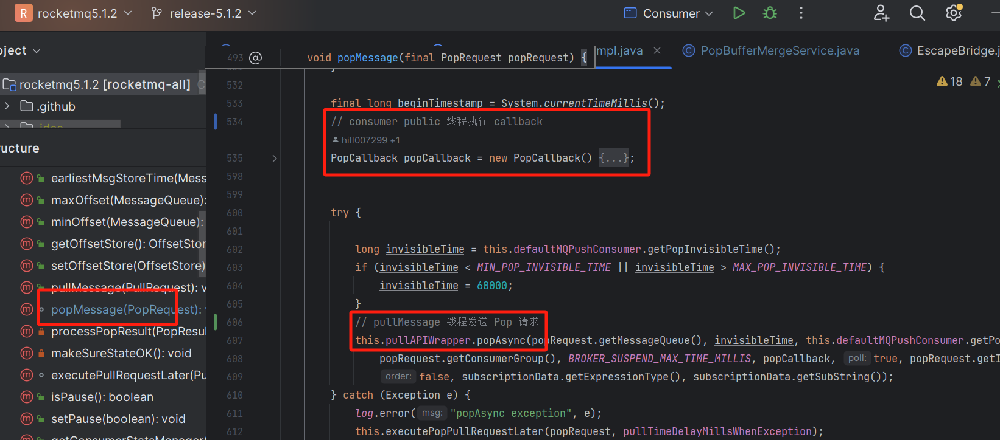

关于此处的 PopCallback：和 4.x 处理逻辑差不多：

1.  反序列化解析为 [PopResult](http://popresult/)。
2.  投递一个 [ConsumeRequest](http://consumerequest/) 到 consumer 线程池。和 pull 模式一样，每个消费组 [consumer](http://consumer/) 实例一个线程池，默认 20 线程 + [LinkedBlockingQueue](http://linkedblockingqueue/)。
3.  立即发起下一次长轮询，即继续提交 [PopRequest](http://poprequest/) 到 [PullMessage](http://pullmessage/) 线程池等待被拉取。

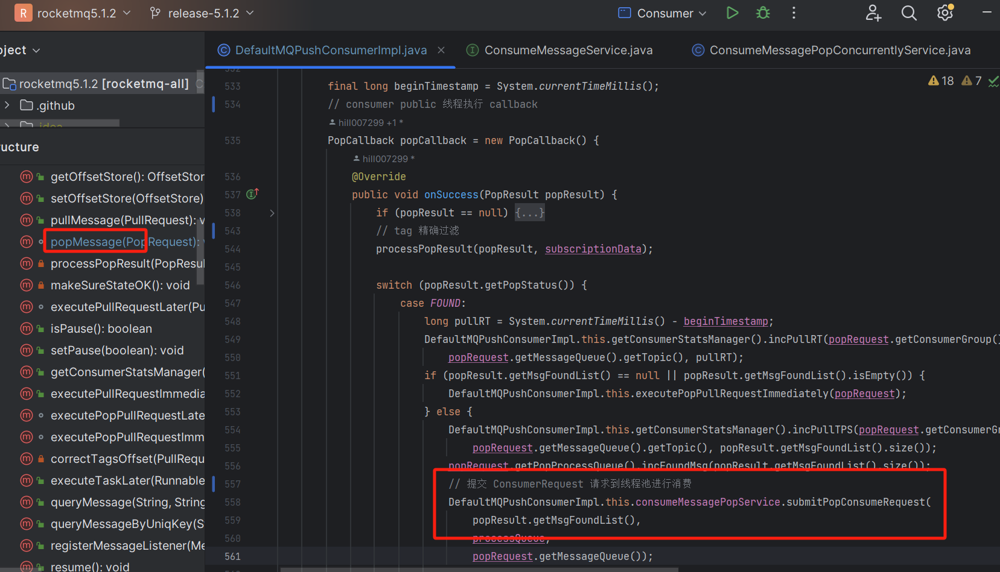

**这里使用消费线程池保证了消息拉取和消息消费的解耦，**看到这里，我们知道在 RocketMQ 使用[ConsumeMessagePopService](http://consumemessagepopservice/) 来实现消息消费的处理逻辑。它将拉取到的消息构建为 [ConsumeRequest](http://consumerequest/)，然后通过内部的 [consumeExecutor](http://consumeexecutor/) 线程池消费消息。

我们来看下它都在哪里被调用了，如下图：

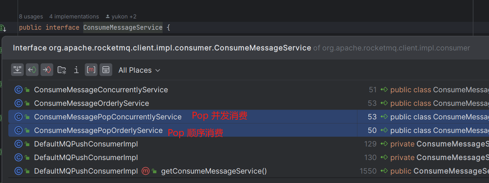

你是否想起来，在消费者启动时会根据消息类型的不同启动不同的服务来消费。

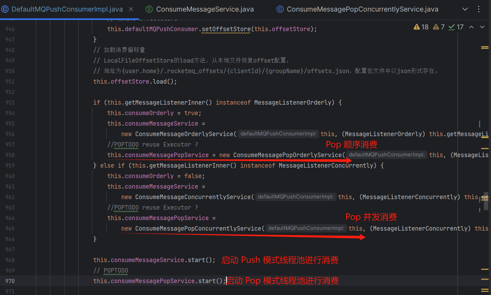

在 RocketMQ 支持「**顺序消费**」与「**并发消费**」两种，UML 图如下：

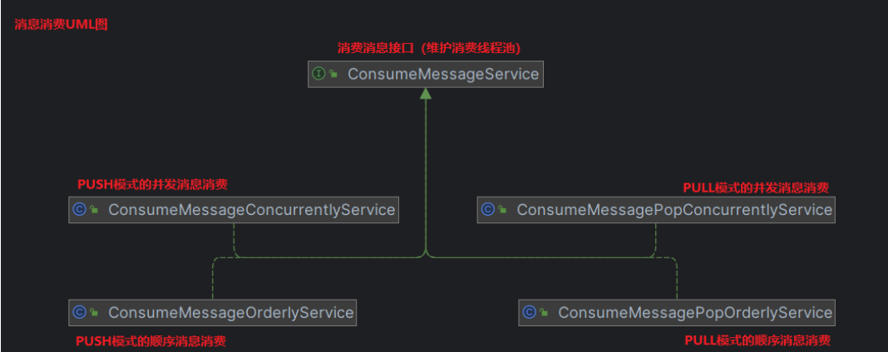

今天我们先来重点剖析下右边 Push 模式下两种消费方式的消费流程。

## **4.1 并发消费流程**

源码位置：[https://github.com/apache/rocketmq/blob/release-5.1.2/client/src/main/java/org/apache/rocketmq/client/impl/consumer/](https://github.com/apache/rocketmq/blob/release-5.1.2/client/src/main/java/org/apache/rocketmq/client/impl/consumer/ConsumeMessagePopConcurrentlyService.java)[ConsumeMessagePopConcurrentlyService](https://github.com/apache/rocketmq/blob/release-5.1.2/client/src/main/java/org/apache/rocketmq/client/impl/consumer/ConsumeMessagePopConcurrentlyService.java)[.java](https://github.com/apache/rocketmq/blob/release-5.1.2/client/src/main/java/org/apache/rocketmq/client/impl/consumer/ConsumeMessagePopConcurrentlyService.java)

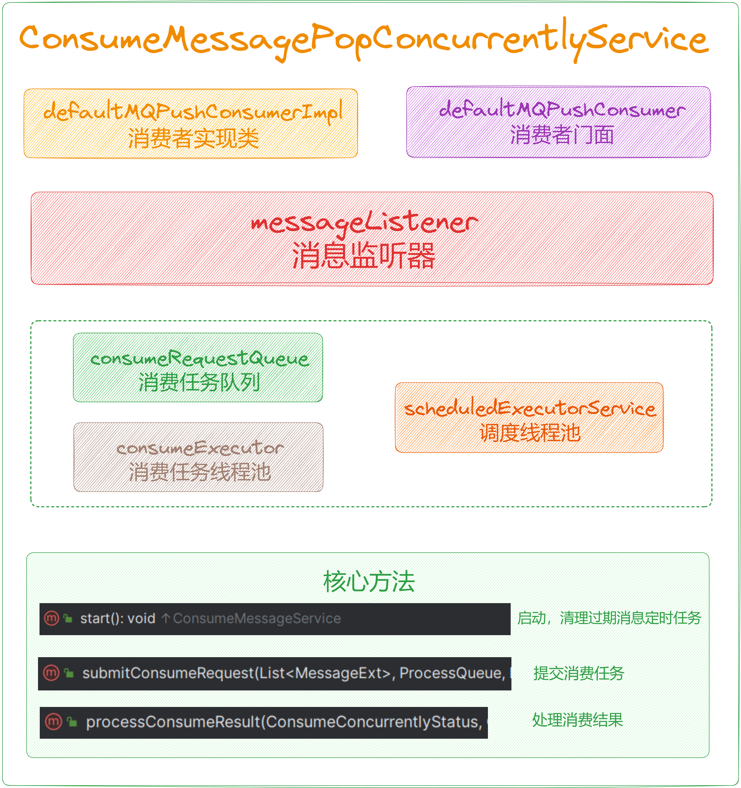

1.  消费者门面：充当的是配置的角色，在消费服务里面作为限制条件。
2.  消息监听器：消息的处理代码都是写在消息监听器里，需要在消费者门面里注册，最核心的方法就是 [consumerMessage](http://consumermessage/)。
3.  消费任务线程池的大小由消费者门面管理，默认情况最大为 20。
4.  调度线程池主要在内部使用，比如在需要延迟任务逻辑，需要在调度线程池里调度到消费任务线程池。

先来看下该类的重要属性。

public class ConsumeMessagePopConcurrentlyService implements ConsumeMessageService {

private static final Logger log = LoggerFactory.getLogger(ConsumeMessagePopConcurrentlyService.class);

// 消息推模式实现类

private final DefaultMQPushConsumerImpl defaultMQPushConsumerImpl;

// 默认推模式消费者

private final DefaultMQPushConsumer defaultMQPushConsumer;

// 并发消息监听

private final MessageListenerConcurrently messageListener;

// 消费线程池的任务队列

private final BlockingQueue<Runnable> consumeRequestQueue;

// 消费任务线程池

private final ThreadPoolExecutor consumeExecutor;

// 消费组

private final String consumerGroup;

// 消费延迟调度线程池

private final ScheduledExecutorService scheduledExecutorService;

....

}

## **4.2 提交消费请求**

/\*\*

\* 提交消息消费，供消费者消费

\* Pop 并发消息消费入口：{@link DefaultMQPushConsumerImpl#popMessage}中的{@link org.apache.rocketmq.client.consumer.PopCallback}

\* @param msgs 一次拉取待消费消息，最大默认32条{@link DefaultMQPushConsumer#pullBatchSize}

\* @param processQueue 待消息消费处理队列

\* @param messageQueue 消息所属消费队列

\*/

@Override

public void submitPopConsumeRequest(

final List<MessageExt> msgs,

final PopProcessQueue processQueue,

final MessageQueue messageQueue) {

// 并发消费时单次消费消息条数，默认1条

final int consumeBatchSize \= this.defaultMQPushConsumer.getConsumeMessageBatchMaxSize();

// msgs.size()一次拉取消息的条数，最大 32 条

// 如果消息数量 <= 单次批量消费的数量，那么直接全量消费

if (msgs.size() <= consumeBatchSize) {

// 构建消费请求，将消息全部放进去

ConsumeRequest consumeRequest \= new ConsumeRequest(msgs, processQueue, messageQueue);

try {

// 将消费请求任务直接提交到消费线程池

this.consumeExecutor.submit(consumeRequest);

} catch (RejectedExecutionException e) {

// 提交的任务被线程池拒绝，延迟5s再提交到消费线程池，而不是丢弃

this.submitConsumeRequestLater(consumeRequest);

}

} else {

// 如果消息数量 > 单次批量消费的数量，那么需要对消息进行分批提交

for (int total \= 0; total < msgs.size(); ) {

// 构建一批消息集合，每批消息最多consumeBatchSize条，默认1

List<MessageExt> msgThis = new ArrayList<>(consumeBatchSize);

// 将消息按顺序加入集合

for (int i \= 0; i < consumeBatchSize; i++, total++) {

if (total < msgs.size()) {

msgThis.add(msgs.get(total));

} else {

break;

}

}

// 将本批次消息构建为 ConsumeRequest

ConsumeRequest consumeRequest \= new ConsumeRequest(msgThis, processQueue, messageQueue);

try {

// 将消费请求任务直接提交到消费线程池

this.consumeExecutor.submit(consumeRequest);

} catch (RejectedExecutionException e) {

for (; total < msgs.size(); total++) {

msgThis.add(msgs.get(total));

}

// 提交的任务被线程池拒绝，延迟 5s 再提交到消费线程池，而不是丢弃

this.submitConsumeRequestLater(consumeRequest);

}

}

}

}

同 4.x 的处理逻辑类似，该方法将消息批量的封装为 [ConsumeRequest](http://consumerequest/) 提交到 [consumeExecutor](http://consumeexecutor/) 线程池中进行异步消费，操作步骤如下：

1.  首先获取单次批量消费的数量，默认1，通过 [DefaultMQPushConsumer#consumeMessageBatchMaxSize](http://defaultmqpushconsumer/#consumeMessageBatchMaxSize) 属性配置。
2.  如果消息数量 <= 单次批量消费的数量，那么直接全量消费，构建一个 [ConsumeRequest](http://consumerequest/) 并提交到[consumeExecutor](http://consumeexecutor%20/) 线程池。
3.  如果消息数量 > 单次批量消费的数量，那么需要将消息进行分批提交。

这里的 [consumeMessageBatchMaxSize](http://consumemessagebatchmaxsize%20/) 从字面意思来看就是「**单次批量消费的数量**」，实际上它代表着每次发送给消息监听器 [MessageListenerOrderly](http://messagelistenerorderly/) 或者 [MessageListenerConcurrently](http://messagelistenerconcurrently/) 的 [consumeMessage](http://consumemessage/) 方法中的参数 [List<MessageExt> msgs](http://listmessageext%20msgs/) 中的最多的消息数量。

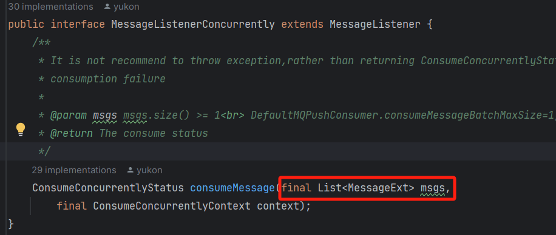

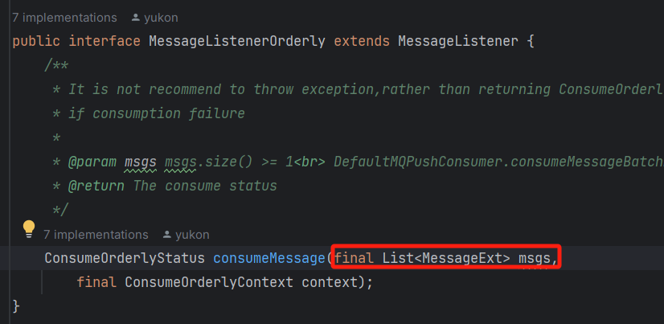

[consumeMessageBatchMaxSize](http://consumemessagebatchmaxsize/) 默认值为 1，所以说无论是「**并发消费**」还是「**顺序消费**」，每次的 [consumeMessage](http://consumemessage/) 方法的执行，msgs 集合默认都只有「**一条消息**」。同理，如果把它设置为「**n**」，无论是并发消费还是顺序消费，每次的 [consumeMessage](http://consumemessage/) 的执行，msgs 集合默认都最多只有「**n**」条消息。

另外，我们还学习了另外一个参数 [popBatchSize](http://popbatchsize/)，默认值为 「**32**」，它代表的是每一次拉取请求最多批量拉取的消费数量。也就是说无论是「**并发消费**」还是「**顺序消费**」，每次最多拉取「**32**」条消息。

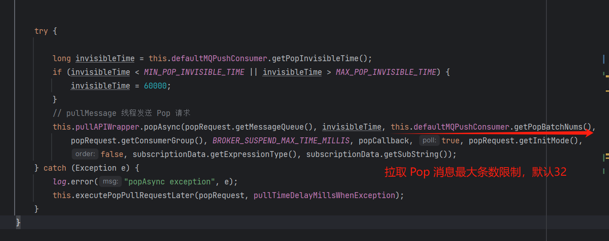

对于「**并发消费**」模式来说，当拉取到一批消息被分批次提交到「**线程池**」之后，就由「**线程池**」里面的「**线程异步消费**」，我们知道线程池里面的线程执行先后顺序时不可控制的，因此这些不同批次的消息会被并发、无序的消费。

我们再来看下「**线程池**」的处理逻辑。

在「**并发消费**」类初始化时，会进行「**线程池**」初始化。

相关配置：

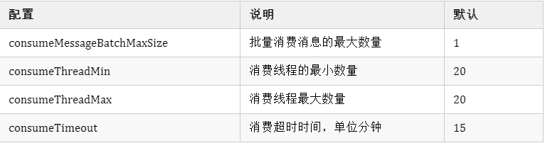

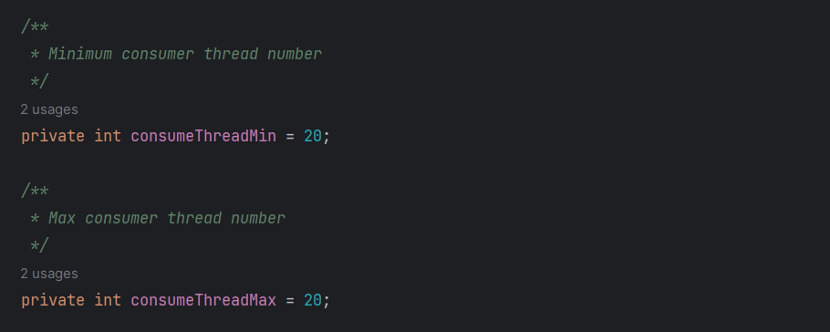

// 无边界阻塞队列，构造方法

public ConsumeMessagePopConcurrentlyService(DefaultMQPushConsumerImpl defaultMQPushConsumerImpl,

MessageListenerConcurrently messageListener) {

this.defaultMQPushConsumerImpl = defaultMQPushConsumerImpl;

this.messageListener = messageListener;

this.defaultMQPushConsumer = this.defaultMQPushConsumerImpl.getDefaultMQPushConsumer();

this.consumerGroup = this.defaultMQPushConsumer.getConsumerGroup();

// 消费请求队列

this.consumeRequestQueue = new LinkedBlockingQueue<>();

/\*

\* 并发消费线程池

\* 最小、最大线程数默认20，阻塞队列为无界阻塞队列LinkedBlockingQueue

\*/

this.consumeExecutor = new ThreadPoolExecutor(

this.defaultMQPushConsumer.getConsumeThreadMin(),

this.defaultMQPushConsumer.getConsumeThreadMax(),

1000 \* 60,

TimeUnit.MILLISECONDS,

this.consumeRequestQueue,

new ThreadFactoryImpl("ConsumeMessageThread\_"));

// 单线程的延迟任务线程池，用于延迟提交消费请求

this.scheduledExecutorService = Executors.newSingleThreadScheduledExecutor(new ThreadFactoryImpl("ConsumeMessageScheduledThread\_"));

}

1.  消费线程池使用的长度为 [Integer.MAX\_VALUE](http://integer.max_value/) 的阻塞队列存放待待消费任务。
2.  线程前缀名 [ConsumeMessageThread\_](http://consumemessagethread_+%20consumergroup/)，任务线程前缀名 [ConsumeMessageScheduledThread\_](http://consumemessagescheduledthread_+%20consumergroup/)。
3.  消费线程池核心线程数和最大线程数默认都是 20，相应配置可修改 [consumeThreadMin](http://consumethreadmin/)、[consumeThreadMax](http://consumethreadmax/)。

## **4.3 延迟提交**

当提交的任务被线程池拒绝，那么延迟 5s 进行提交，而不是被丢弃，如下。

// 延迟 5s 进行提交任务

private void submitConsumeRequestLater(final ConsumeRequest consumeRequest

) {

this.scheduledExecutorService.schedule(new Runnable() {

// 将提交的行为封装为一个线程任务，提交到 scheduledExecutorService 延迟线程池，5s之后执行

@Override

public void run() {

ConsumeMessagePopConcurrentlyService.this.consumeExecutor.submit(consumeRequest);

}

}, 5000, TimeUnit.MILLISECONDS);

}

## **4.4 执行消费任务**

[ConsumeRequest](http://consumerequest/) 类本身是一个线程任务，当拉取到消息之后会将一批消息构建为一个 [ConsumeRequest](http://consumerequest/) 对象，提交给 [consumeExecutor](http://consumeexecutor/)，由线程池异步的执行。

## **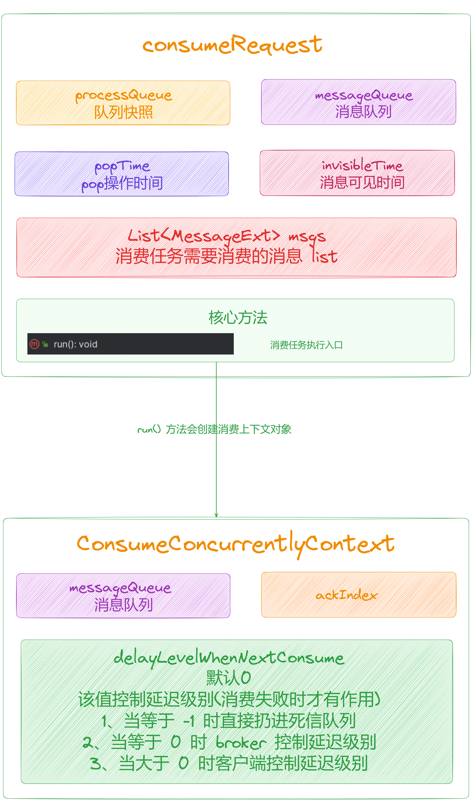**

// ConsumeMessageConcurrentlyService 的子类

class ConsumeRequest implements Runnable {

// 一次消费的消息集合，默认1条消息

private final List<MessageExt> msgs;

// 消息处理队列

private final PopProcessQueue processQueue;

// 消息队列

private final MessageQueue messageQueue;

private long popTime \= 0; // POP 操作时间

private long invisibleTime \= 0; // 消息可见时间

// 构造函数

public ConsumeRequest(List<MessageExt> msgs, PopProcessQueue processQueue, MessageQueue messageQueue) {

this.msgs = msgs;

this.processQueue = processQueue;

this.messageQueue = messageQueue;

try {

// 解析 popTime、invisibleTime

String extraInfo \= msgs.get(0).getProperty(MessageConst.PROPERTY\_POP\_CK);

String\[\] extraInfoStrs = ExtraInfoUtil.split(extraInfo);

popTime = ExtraInfoUtil.getPopTime(extraInfoStrs);

invisibleTime = ExtraInfoUtil.getInvisibleTime(extraInfoStrs);

} catch (Throwable t) {

log.error("parse extra info error. msg:" + msgs.get(0), t);

}

}

// 如果broker收到pop请求（popTime）后超过60s（invisibleTime）还未执行用户消费逻辑，则本次pop请求认为超时，不会执行用户消费逻辑，也不会处理消费结果。

public boolean isPopTimeout() {

if (msgs.size() == 0 || popTime <= 0 || invisibleTime <= 0) {

return true;

}

long current \= System.currentTimeMillis();

// 判断是否 pop 超时

return current - popTime >= invisibleTime;

}

public List<MessageExt> getMsgs() {

return msgs;

}

public PopProcessQueue getPopProcessQueue() {

return processQueue;

}

// 执行并发消费

@Override

public void run() {

// 如果处理队列被丢弃，那么直接返回不再消费。

// 比如重平衡时该队列被分配给了其他新上线的消费者，尽量避免重复消费

if (this.processQueue.isDropped()) {

log.info("the message queue not be able to consume, because it's dropped(pop). group={} {}", ConsumeMessagePopConcurrentlyService.this.consumerGroup, this.messageQueue);

return;

}

// 如果 Pop 超时，不消费

if (isPopTimeout()) {

log.info("the pop message time out so abort consume. popTime={} invisibleTime={}, group={} {}", popTime, invisibleTime, ConsumeMessagePopConcurrentlyService.this.consumerGroup, this.messageQueue);

processQueue.decFoundMsg(-msgs.size());

return;

}

// 1、获取并发消费的消息监听器，push 模式模式下是我们需要开发的，通过registerMessageListener 方法注册，内部包含了要执行的业务逻辑

MessageListenerConcurrently listener \= ConsumeMessagePopConcurrentlyService.this.messageListener;

// 创建消费上下文

ConsumeConcurrentlyContext context \= new ConsumeConcurrentlyContext(messageQueue);

ConsumeConcurrentlyStatus status \= null;

// 2、重置重试 topic

defaultMQPushConsumerImpl.resetRetryAndNamespace(msgs, defaultMQPushConsumer.getConsumerGroup());

// 3、如果有消费钩子，那么执行钩子函数的前置方法 consumeMessageBefore，我们可以注册钩子 ConsumeMessageHook 再消费消息的前后调用

ConsumeMessageContext consumeMessageContext \= null;

if (ConsumeMessagePopConcurrentlyService.this.defaultMQPushConsumerImpl.hasHook()) {

consumeMessageContext = new ConsumeMessageContext();

consumeMessageContext.setNamespace(defaultMQPushConsumer.getNamespace());

consumeMessageContext.setConsumerGroup(defaultMQPushConsumer.getConsumerGroup());

consumeMessageContext.setProps(new HashMap<>());

consumeMessageContext.setMq(messageQueue);

consumeMessageContext.setMsgList(msgs);

consumeMessageContext.setSuccess(false);

ConsumeMessagePopConcurrentlyService.this.defaultMQPushConsumerImpl.

executeHookBefore(consumeMessageContext);

}

// 开始时间戳

long beginTimestamp \= System.currentTimeMillis();

boolean hasException \= false;

// 消费返回类型，初始化为 SUCCESS

ConsumeReturnType returnType \= ConsumeReturnType.SUCCESS;

try {

if (msgs != null && !msgs.isEmpty()) {

// 循环设置每个消息的开始消费时间

for (MessageExt msg : msgs) {

MessageAccessor.setConsumeStartTimeStamp(msg, String.valueOf(System.currentTimeMillis()));

}

}

// 4、调用 listener#consumeMessage 方法进行消息消费，调用实际的业务逻辑返回执行状态结果

// 有两种状态 ConsumeConcurrentlyStatus.CONSUME\_SUCCESS 和 ConsumeConcurrentlyStatus.RECONSUME\_LATER

status = listener.consumeMessage(Collections.unmodifiableList(msgs), context);

} catch (Throwable e) {

log.warn("consumeMessage exception: {} Group: {} Msgs: {} MQ: {}",

UtilAll.exceptionSimpleDesc(e),

ConsumeMessagePopConcurrentlyService.this.consumerGroup,

msgs,

messageQueue);

hasException = true; // 抛出异常之后，设置异常标志位

}

// 5、对返回的执行状态结果进行判断处理

// 计算消费时间

long consumeRT \= System.currentTimeMillis() - beginTimestamp;

if (null == status) { // 如果状态为空

if (hasException) { // 如果业务的执行抛出了异常

returnType = ConsumeReturnType.EXCEPTION; // 设置 returnType 为 EXCEPTION

} else {

returnType = ConsumeReturnType.RETURNNULL; // 设置 returnType 为 RETURNNULL

}

// 如果消费时间 consumeRT 大于等于消息可见时间

} else if (consumeRT >= invisibleTime \* 1000) {

returnType = ConsumeReturnType.TIME\_OUT; // 设置 returnType 为 TIME\_OUT 超时

} else if (ConsumeConcurrentlyStatus.RECONSUME\_LATER == status) {

// 如果 status 为 RECONSUME\_LATER，即消费失败

returnType = ConsumeReturnType.FAILED; // 设置 returnType 为 FAILED，即消费失败

} else if (ConsumeConcurrentlyStatus.CONSUME\_SUCCESS == status) {

// 如果 status 为 CONSUME\_SUCCESS，即消费成功

returnType = ConsumeReturnType.SUCCESS; // 设置 returnType 为 SUCCESS，即消费成功

}

if (null == status) {

log.warn("consumeMessage return null, Group: {} Msgs: {} MQ: {}",

ConsumeMessagePopConcurrentlyService.this.consumerGroup,

msgs,

messageQueue);

// 将 status 设置为 RECONSUME\_LATER，即消费失败

status = ConsumeConcurrentlyStatus.RECONSUME\_LATER;

}

// 如果有钩子，则将 returnType、status 设置进去

if (ConsumeMessagePopConcurrentlyService.this.defaultMQPushConsumerImpl.hasHook()) {

consumeMessageContext.getProps().put(MixAll.CONSUME\_CONTEXT\_TYPE, returnType.name());

consumeMessageContext.setStatus(status.toString());

consumeMessageContext.setSuccess(ConsumeConcurrentlyStatus.CONSUME\_SUCCESS == status);

ConsumeMessagePopConcurrentlyService.this.defaultMQPushConsumerImpl.

executeHookAfter(consumeMessageContext);

}

// 增加消费时间

ConsumeMessagePopConcurrentlyService.this.getConsumerStatsManager()

.incConsumeRT(ConsumeMessagePopConcurrentlyService.this.consumerGroup, messageQueue.getTopic(), consumeRT);

if (!processQueue.isDropped() && !isPopTimeout()) {

// 7、如果处理队列没有被丢弃且非pop超时，那么调用ConsumeMessagePopConcurrentlyService#processConsumeResult 方法处理消费结果，包括重试等逻辑

ConsumeMessagePopConcurrentlyService.this.processConsumeResult(status, context, this);

} else {

if (msgs != null) {

processQueue.decFoundMsg(-msgs.size());

}

log.warn("processQueue invalid. isDropped={}, isPopTimeout={}, messageQueue={}, msgs={}", processQueue.isDropped(), isPopTimeout(), messageQueue, msgs);

}

}

public MessageQueue getMessageQueue() {

return messageQueue;

}

}

// 消费结果状态

public enum ConsumeConcurrentlyStatus {

/\*\*

\* 消费成功

\*/

CONSUME\_SUCCESS,

/\*\*

\* 消费失败，延迟进行消费

\*/

RECONSUME\_LATER;

}

这里重点来关注其 **run()** 方法，它是「**并发消费**」的核心方法，大概流程如下：

1.  如果处理队列被丢弃，即 dropped=true，那么直接返回不再消费，比如重平衡时该队列被分配给了其他新上线的消费者，尽量避免重复消费。
2.  接着调用 [resetRetryAndNamespace](http://resetretryandnamespace%20/) 方法，当消息是重试消息的时候，将 msg 的 topic 属性从重试 topic 还原为真实的topic。
3.  如果有消费钩子，那么执行钩子函数的前置方法 [consumeMessageBefore](http://consumemessagebefore/)。我们可以通过[DefaultMQPushConsumerImpl#registerConsumeMessageHook](http://defaultmqpushconsumerimpl/#registerConsumeMessageHook) 方法注册消费钩子 [ConsumeMessageHook](http://consumemessagehook/)，在消费消息的前后调用。
4.  接着调用 [listener#consumeMessage](http://listener/#consumeMessage) 方法，执行消息消费，调用实际的业务逻辑返回执行状态结果。
5.  正常情况下可返回两种状态：[ConsumeConcurrentlyStatus.CONSUME\_SUCCESS](http://consumeconcurrentlystatus.consume_success/) 表示消费成功 ， [ConsumeConcurrentlyStatus.RECONSUME\_LATER](http://consumeconcurrentlystatus.reconsume_later/) 表示消费失败，如果中途抛出异常，则 status 为 null。
6.  对返回的执行状态结果进行判断处理，另外如果返回的 status 为 null，那么 status 将会被设置为 [RECONSUME\_LATER](http://reconsume_later/)，即消费失败。
7.  计算消费时间 [consumeRT](http://consumert/)。如果 status 为 null，如果业务的执行抛出了异常，设置 returnType 为 [EXCEPTION](http://exception/)，否则设置 returnType 为 [RETURNNULL](http://returnnull/)。
8.  如消费时间 [consumeRT](http://consumert/) 大于等于 [invisibleTime](http://invisibletime/)。设置 returnType 为 [TIME\_OUT](http://time_out/)。
9.  如果 status 为 [RECONSUME\_LATER](http://reconsume_later/)，即消费失败，设置 returnType 为 FAILED。
10.  如果 status 为 [CONSUME\_SUCCESS](http://consume_success/)，即消费成功，设置 returnType 为 SUCCESS。
11.  如果有消费钩子，那么执行钩子函数的后置方法 [consumeMessageAfter](http://consumemessageafter/)。
12.  如果处理队列没有被丢弃且非pop超时，即 dropped=false，那么调用[ConsumeMessagePopConcurrentlyService](http://consumemessagepopconcurrentlyservice/)[#processConsumeResult](http://consumemessageconcurrentlyservice/#processConsumeResult) 方法处理消费结果，包括消费重试、提交offset等操作。

这里有两个问题需要考虑下：

1.  为何要保留 [ProcessQueue](http://processqueue/) 呢？
2.  因为处理完消息后需要将该消息从 [ProcessQueue](http://processqueue/) 中移除。
3.  消息失效为什么需要控制延迟？
4.  因为如果不控制延迟，消息失效后立刻又拿到消息，又进行消费大概率还是会失效，这样减轻了服务的压力。broker端控制的延迟级别原理为：每失败一次延迟级别+1，级别越高延迟时间越长。
5.  消费上下文的作用主要在于可以控制延迟级别。

> 这里需要注意的是，如果在执行了 listener#consumeMessage 方法，即执行了业务逻辑之后，处理消费结果之前，该消息队列被丢弃了，比如重平衡时该队列被分配给了其他新上线的消费者，那么由于 dropped=false，导致不会进行最后的消费结果处理，将会导致消息的重复消费，因此必须做好业务层面的幂等性！

## **4.4.1 重置重试 Topic**

当消息是重试消息的时候，将 msg 的 topic 属性从重试 topic 还原为真实的 topic。

// DefaultMQPushConsumerImpl 类方法

public void resetRetryAndNamespace(final List<MessageExt> msgs, String consumerGroup) {

// 获取重试 topic

final String groupTopic \= MixAll.getRetryTopic(consumerGroup);

for (MessageExt msg : msgs) {

// 尝试通过 PROPERTY\_RETRY\_TOPIC 属性获取每个消息的真实topic

String retryTopic \= msg.getProperty(MessageConst.PROPERTY\_RETRY\_TOPIC);

// 如果该属性不为 null，并且重试 topic 和消息的 topic 相等，则表示当前消息是重试消息

if (retryTopic != null && groupTopic.equals(msg.getTopic())) {

// 设置消息的 topic 为真实 topic，即还原回来

msg.setTopic(retryTopic);

}

if (StringUtils.isNotEmpty(this.defaultMQPushConsumer.getNamespace())) {

msg.setTopic(NamespaceUtil.withoutNamespace(msg.getTopic(), this.defaultMQPushConsumer.getNamespace()));

}

}

}

## **4.5 处理消费结果**

对于 Pop 并发消费的消费结果也是通过 [ConsumeMessageConcurrentlyService#processConsumeResult](http://consumemessageconcurrentlyservice/#processConsumeResult) 方法处理。

三个参数含义如下：

1.  [ConsumeConcurrentlyStatus](http://consumeconcurrentlystatus/) 消费状态。
2.  [ConsumeConcurrentlyContext](http://consumeconcurrentlycontext/) 消费上下文。
3.  [ConsumeRequest](http://consumerequest%20/) 消费任务对象。
4.  对于回退失败的消息并不能保证百分百回退成功(网络原因)，因此需要有回退失败的逻辑，使用调度线程池[scheduleExecutorService](http://scheduleexecutorservice/) 延迟五秒执行，
5.  检查本地缓存中该 mq 的进度是否比 [storeOffset](http://storeoffset/) 大，如果大则不更新。

/\*\*

\* 处理消费结果

\* @param status 消费状态

\* @param context 上下文

\* @param consumeRequest 消费请求

\*/

public void processConsumeResult(

final ConsumeConcurrentlyStatus status,

final ConsumeConcurrentlyContext context,

final ConsumeRequest consumeRequest) {

// 如果消息为空则直接返回

if (consumeRequest.getMsgs().isEmpty()) {

return;

}

// ackIndex，默认初始值为 Integer.MAX\_VALUE，表示消费成功的消息在消息集合中的索引

int ackIndex \= context.getAckIndex();

// 获取对应的 Topic

String topic \= consumeRequest.getMessageQueue().getTopic();

// 1、判断消费状态，设置 ackIndex 的值

// 消费成功： ackIndex = 消息数量 - 1

// 消费失败： ackIndex = -1

switch (status) {

case CONSUME\_SUCCESS: //如果消费成功

// 如果大于等于消息数量，则设置为消息数量减 1

// 初始值为 Integer.MAX\_VALUE，因此一般都会设置为消息数量减 1

if (ackIndex >= consumeRequest.getMsgs().size()) {

ackIndex = consumeRequest.getMsgs().size() - 1;

}

// 消费成功的个数，即消息数量

int ok \= ackIndex + 1;

// 消费失败的个数，即 0

int failed \= consumeRequest.getMsgs().size() - ok;

// 统计

this.getConsumerStatsManager().incConsumeOKTPS(consumerGroup, topic, ok);

this.getConsumerStatsManager().incConsumeFailedTPS(consumerGroup, topic, failed);

break;

case RECONSUME\_LATER: // 如果消费失败

ackIndex = -1; // ackIndex初始化为-1

// 统计

this.getConsumerStatsManager().incConsumeFailedTPS(consumerGroup, topic,

consumeRequest.getMsgs().size());

break;

default:

break;

}

//ack if consume success

// pop消费成功，循环处理每一条被ack的消息。

// consumer异步ack（ACK\_MESSAGE）一条消息的offset，和拉消息一样也仅支持发送请求给 master。

for (int i \= 0; i <= ackIndex; i++) {

this.defaultMQPushConsumerImpl.ackAsync(consumeRequest.getMsgs().get(i), consumerGroup);

consumeRequest.getPopProcessQueue().ack();

}

//consume later if consume fail

// 在consumer侧，如果消费失败，根据情况执行 changePopVisibleTime。

for (int i \= ackIndex + 1; i < consumeRequest.getMsgs().size(); i++) {

MessageExt msgExt \= consumeRequest.getMsgs().get(i);

consumeRequest.getPopProcessQueue().ack();

// 如果重试大于等于16次，根据消息发送时间决策是否执行changePopVisibleTime；

if (msgExt.getReconsumeTimes() >= this.defaultMQPushConsumerImpl.getMaxReconsumeTimes()) {

checkNeedAckOrDelay(msgExt);

continue;

}

// 如果重试未超过16次，直接执行changePopVisibleTime；

int delayLevel \= context.getDelayLevelWhenNextConsume();

changePopInvisibleTime(consumeRequest.getMsgs().get(i), consumerGroup, delayLevel);

}

}

1.  获取 [ackIndex](http://ackindex/)，默认初始值为 [Integer.MAX\_VALUE](http://integer.max_value/)，该值表示消费成功的消息在消息集合中的索引，用来进行消息重试。
2.  判断消费状态，设置 ackIndex 的值：
3.  [CONSUME\_SUCCESS](http://consume_success/) 消费成功： ackIndex = 消息数量 – 1。
4.  [RECONSUME\_LATER](http://reconsume_later/) 消费失败： ackIndex = -1。
5.  在 consumer 侧，如果消费失败，根据情况执行 [changePopVisibleTime](http://changepopvisibletime/)。
6.  如果重试大于等于16次，根据消息发送时间决策是否执行 [changePopVisibleTime](http://changepopvisibletime/)。
7.  如果重试未超过16次，直接执行 [changePopVisibleTime](http://changepopvisibletime/)。

//10s 30s 1m 2m 3m 4m 5m 6m 7m 8m 9m 10m 20m 30m 1h 2h

private int\[\] popDelayLevel = new int\[\] {10, 30, 60, 120, 180, 240, 300, 360, 420, 480, 540, 600, 1200, 1800, 3600, 7200};

private void checkNeedAckOrDelay(MessageExt msgExt) {

// 10s 30s 1m 2m 3m 4m 5m 6m 7m 8m 9m 10m 20m 3m 1h 2h

int\[\] delayLevelTable = this.defaultMQPushConsumerImpl.getPopDelayLevel();

long msgDelaytime \= System.currentTimeMillis() - msgExt.getBornTimestamp();

// 距离消息发送时间，超出4h，直接ack

if (msgDelaytime > delayLevelTable\[delayLevelTable.length - 1\] \* 1000 \* 2) {

log.warn("Consume too many times, ack message async. message {}", msgExt.toString());

this.defaultMQPushConsumerImpl.ackAsync(msgExt, consumerGroup);

} else {

// 根据消息发送时间，定位延迟级别

int delayLevel \= delayLevelTable.length - 1;

for (; delayLevel >= 0; delayLevel--) {

if (msgDelaytime >= delayLevelTable\[delayLevel\] \* 1000) {

delayLevel++;

break;

}

}

changePopInvisibleTime(msgExt, consumerGroup, delayLevel);

log.warn("Consume too many times, but delay time {} not enough. changePopInvisibleTime to delayLevel {} . message key:{}", msgDelaytime, delayLevel, msgExt.getKeys());

}

}

1.  如果消息重试超过 16 次，且距离消息发送时间超出 4h，直接 ack 消息。
2.  如果消息重试超过 16 次，但是距离消息发送时间不超出 4h，根据距离消息发送时间，找延迟级别，执行[changePopInvisibleTime](http://changepopinvisibletime/)。

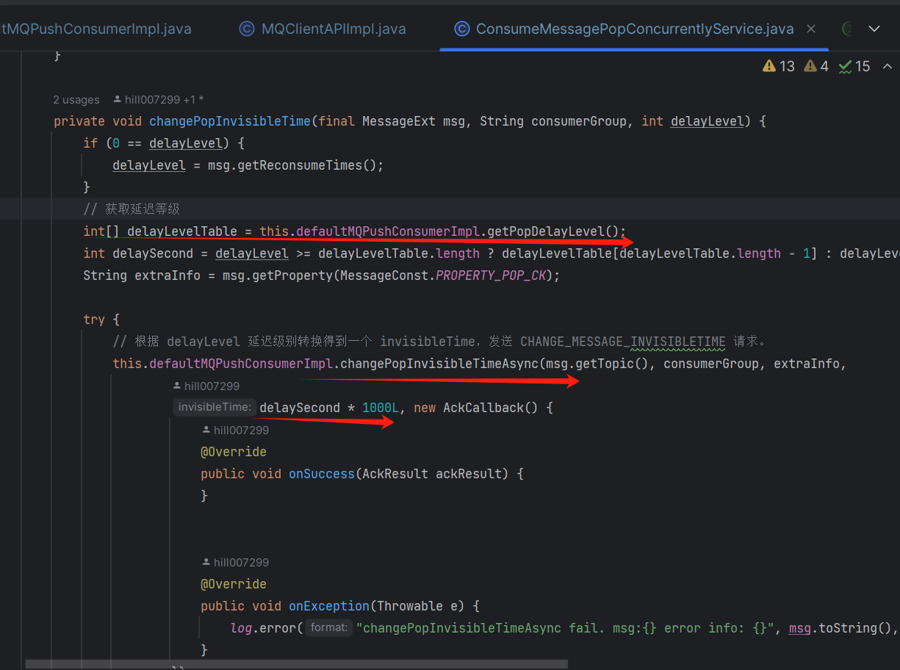

## **4.5.1 消息重试**

由于篇幅问题，这里先不展开，会在[消息重试篇章](https://articles.zsxq.com/id_szb2b73p15hp.html)进行深度剖析，到时候贴链接到此。

## **4.5.2 移除消息**

直接点击这里查看 [【消费者源码分析系列第四篇】图解 RocketMQ 源码之 ProcessQueue 设计思想](https://articles.zsxq.com/id_pdklh05z80mr.html) 搜索

[removeMessage](http://removemessage/) 方法。

## **4.5.3 更新位移消息**

由于篇幅问题，这里先不展开，会在[消费进度管理篇章](https://articles.zsxq.com/id_zl9rd7xahz2q.html)进行深度剖析，到时候贴链接到此。

## **4.6 顺序消费流程**

源码位置：[https://github.com/apache/rocketmq/blob/release-5.1.2/client/src/main/java/org/apache/rocketmq/client/impl/consumer/ConsumeMessagePopOrderlyService.java](https://github.com/apache/rocketmq/blob/release-5.1.2/client/src/main/java/org/apache/rocketmq/client/impl/consumer/ConsumeMessagePopOrderlyService.java)

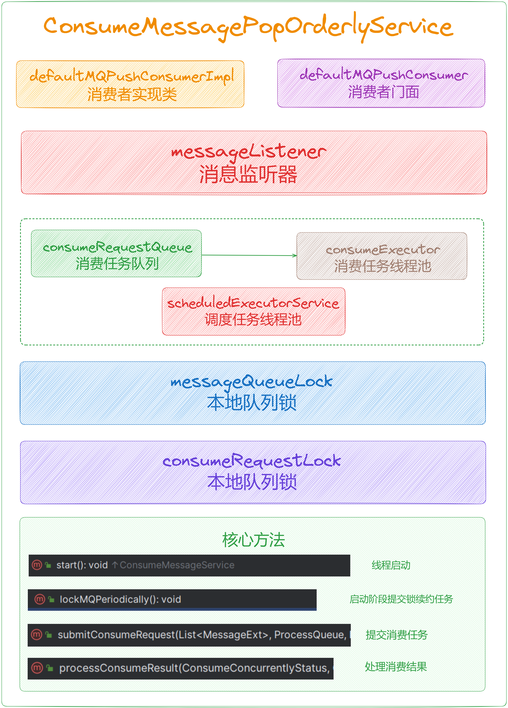

由于篇幅问题，该类的源码分享就不展开了，直接看[【消费者源码分析系列第八篇】图解 RocketMQ 源码之消费者普通消费全流程剖析](https://articles.zsxq.com/id_lf0x558ptx15.html)

## **05 总结**

最后来张流程图总结下全文：

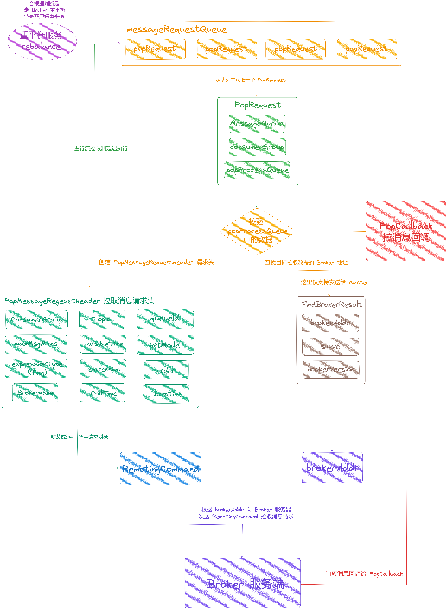