大家好，我是**华仔**, 又跟大家见面了。

从今天开始我将继续为大家奉上 RocketMQ 消费者源码剖析系列文章，正式开启「**RocketMQ 的 消费者源码之旅**」，这是第二篇，本篇我们将以「**RocketMQ 4.9.7**」版本为主，来剖析下 RocketMQ 源码之消费者启动流程。

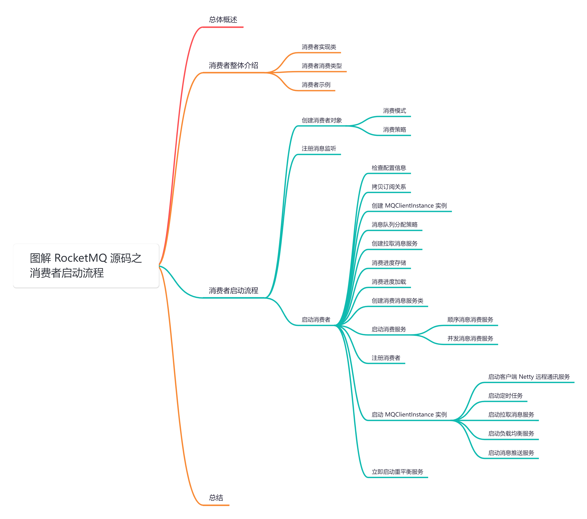

## **01 总体概述**

从今天开始我将以「**RocketMQ 4.9.7**」及「**RocketMQ 5.1.2**」版本为主，通过「**场景驱动**」的方式带大家一点点的对 RocketMQ 源码进行深度剖析，正式开启「**RocketMQ** **消费者源码之旅**」，跟我一起来掌握 RocketMQ 源码核心架构设计思想吧。

今天这篇我们先来聊聊 RocketMQ 消费者初始化时用到的核心组件以及消费的核心流程，带你梳理消费者初始化整体的源码分析脉络。

我们都知道在 RocketMQ 中，我们把消费消息的一方称为「**消费者**」即 Consumer，它是 RocketMQ 核心组件之一。那么这些消费者初始化过程是怎么样的呢？接下来会逐一讲解说明。

##   
**02 消费者整体介绍**

## **2.1 消费者实现类**

RocketMQ 给我们提供的 Consumer 实现类包括两大类：

1.  推送式的 [DefaultMQPushConsumer](http://defaultmqpushconsumer/)
2.  拉取式的 [DefaultMQPullConsumer](http://defaultmqpullconsumer/)、[DefaultLitePullConsumer](http://defaultlitepullconsumer/)。

注意：从下图中可以看到 [DefaultMQPullConsumer](http://defaultmqpullconsumer/) 已经被标注为[deprecated](http://deprecated/)，如果需要使用拉取式的Consumer，官方推荐使用 [DefaultLitePullConsumer](http://defaultlitepullconsumer/)。

  
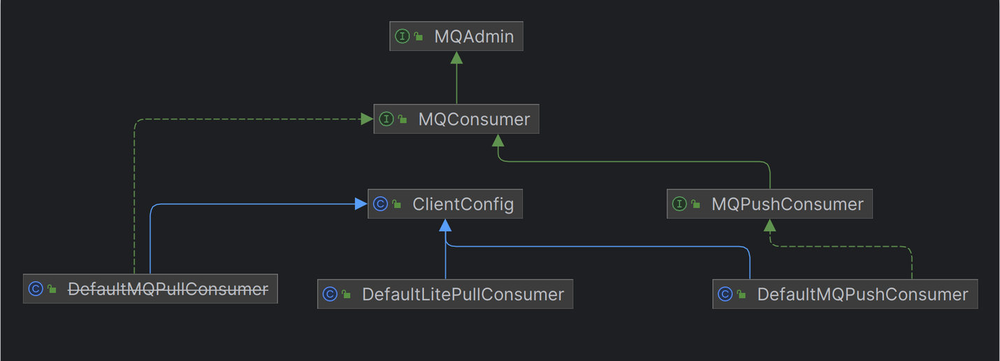

## **2.2 消费者消费类型**

1.  拉取式消费，该模式下 Consumer 主动从 Broker 拉去消息，消费消息的主动权由 Consumer 控制。一旦获取了批量消息，就会启动消费过程。不过这种方式**实时性较弱**，即 Broker 中有了新的消息时消费者并不能及时发现并消费。
2.  推送式消费，该模式下 Broker 收到数据后会主动推送给 Consumer，这种方式一般**实时性较强**。

RocketMQ 官方更推荐我们在日常工作中使用 [DefaultMQPushConsumer](http://defaultmqpushconsumer/)，它已经能够满足我们大多数使用场景。从技术上讲，这个 [DefaultMQPushConsumer](http://defaultmqpushconsumer/) 客户端**实际上是底层拉取服务的包装器**。当从代理中提取的消息到达时，它大致调用注册的回调处理程序来馈送消息。

接下来我们将介绍 [DefaultMQPushConsumer](http://defaultmqpushconsumer/) 的启动流程。

##   
**2.3 消费者示例**

源码位置：[https://github.com/apache/rocketmq/blob/release-4.9.7/example/src/main/java/org/apache/rocketmq/example/quickstart/Consumer.java](https://github.com/apache/rocketmq/blob/release-4.9.7/example/src/main/java/org/apache/rocketmq/example/quickstart/Consumer.java)

Consumer 的示例代码如下：

/\*\*

\* This example shows how to subscribe and consume messages using providing {@link DefaultMQPushConsumer}.

\*/

public class Consumer {

public static final String CONSUMER\_GROUP \= "please\_rename\_unique\_group\_name\_4";

public static final String DEFAULT\_NAMESRVADDR \= "127.0.0.1:9876";

public static final String TOPIC \= "TopicTest";

public static void main(String\[\] args) throws InterruptedException, MQClientException {

// 实例化消费者组名称

DefaultMQPushConsumer consumer \= new DefaultMQPushConsumer(CONSUMER\_GROUP);

// 指定name server地址

consumer.setNamesrvAddr(DEFAULT\_NAMESRVADDR);

// 设置消费位置

consumer.setConsumeFromWhere(ConsumeFromWhere.CONSUME\_FROM\_FIRST\_OFFSET);

// 订阅至少一个主题以供消费

consumer.subscribe(TOPIC, "\*");

// 注册回调，处理从服务端获取的消息

consumer.registerMessageListener((MessageListenerConcurrently) (msg, context) -> {

System.out.printf("%s Receive New Messages: %s %n", Thread.currentThread().getName(), msg);

// 消费消息确认

return ConsumeConcurrentlyStatus.CONSUME\_SUCCESS;

});

// 启动消费者实例

consumer.start();

System.out.printf("Consumer Started.%n");

}

}

Consumer 使用起来还是挺简单的，根据示例代码，消费者消费消息主要完成以下几件事：

1.  创建消费者对象 DefaultMQPushConsumer。
2.  设置 NameServer 地址、消费位置、订阅 Topic、以及注册消息回调处理消息。
3.  启动消费者。

## **03 消费者启动流程**

## **3.1 创建消费者对象**

这里我们以「**RocketMQ 4.9.7**」版本为例，「**RocketMQ 5.x**」版本内容差不多，只不过多了 「**Pop 消费**」的相关逻辑，等后面深度剖析 「**Pop 消费**」时再讲解。

  
源码位置：[https://github.com/apache/rocketmq/blob/release-4.9.7/client/src/main/java/org/apache/rocketmq/client/consumer/DefaultMQPushConsumer.java](https://github.com/apache/rocketmq/blob/release-4.9.7/client/src/main/java/org/apache/rocketmq/client/consumer/DefaultMQPushConsumer.java)

consumer 的处理类为 [DefaultMQPushConsumer](http://defaultmqpushconsumer/)，我们先来看看 [DefaultMQPushConsumer](http://defaultmqpushconsumer/) 的属性值和构造方法：

// org.apache.rocketmq.client.consumer.DefaultMQPushConsumer

public class DefaultMQPushConsumer extends ClientConfig implements MQPushConsumer {

private final InternalLogger log \= ClientLogger.getLog();

// DefaultMQPushConsumer 的默认实现，DefaultMQPushConsumer 中大部分功能都是对它的代理

protected final transient DefaultMQPushConsumerImpl defaultMQPushConsumerImpl;

// 消费者所属组，相同角色的消费者需要具有完全相同的subscriptions和consumerGroup才能正确实现负载平衡，它需要全局唯一

private String consumerGroup;

// 消息模型定义了如何将消息传递到每个消费者客户端的方式，消息消费模式分为集群模式、广播模式，默认是集群模式

private MessageModel messageModel \= MessageModel.CLUSTERING;

// 第一次消费时指定的消费策略，默认是 CONSUME\_FROM\_LAST\_OFFSET

// CONSUME\_FROM\_LAST\_OFFSET：此处分为两种情况，如果磁盘消息未过期且未被删除，则从最小偏移量开始消费。如果磁盘已过期并被删除，则从最大偏移量开始消费。

// CONSUME\_FROM\_FIRST\_OFFSET：从队列当前最小偏移量开始消费。

// CONSUME\_FROM\_TIMESTAMP：从消费者指定时间戳开始消费。

// 如果从消息进度服务OffsetStore读取到MessageQueue中的偏移量不小于0，则使用读取到的偏移量拉取消息，只有在读到的偏移量小于0时，上述策略才会生效。

private ConsumeFromWhere consumeFromWhere \= ConsumeFromWhere.CONSUME\_FROM\_LAST\_OFFSET;

private String consumeTimestamp \= UtilAll.timeMillisToHumanString3(System.currentTimeMillis() - (1000 \* 60 \* 30));

// 集群模式下消息队列的负载策略，指定如何将消息队列分配给每个使用者客户端。

private AllocateMessageQueueStrategy allocateMessageQueueStrategy;

// 订阅关系

private Map<String /\* topic \*/, String /\* sub expression \*/\> subscription = new HashMap<String, String>();

// 消息监听器

private MessageListener messageListener;

// 消息消费进度存储器

private OffsetStore offsetStore;

// 最小消费线程数

private int consumeThreadMin \= 20;

// 最大消费线程数，因为消费者线程池使用无界队列，所以此参数不生效

private int consumeThreadMax \= 20;

// 动态调整线程池数量

private long adjustThreadPoolNumsThreshold \= 100000;

// 并发消息消费时处理队列最大跨度默认 2000，表示如果消息处理队列中偏移量最大的消息与偏移量最小的消息的跨度超过 2000，则延迟 50 ms后再拉取消息

private int consumeConcurrentlyMaxSpan \= 2000;

// 默认 1000，表示每 1000 次流控后打印流控日志

private int pullThresholdForQueue \= 1000;

private int pullThresholdSizeForQueue \= 100;

private int pullThresholdForTopic \= -1;

private int pullThresholdSizeForTopic \= -1;

// 推模式下拉取任务的间隔时间，默认一次拉取任务完成后继续拉取

private long pullInterval \= 0;

// 消息并发消费时一次消费消息的条数，通俗点说，就是每次传入 MessageListener#consumeMessage 中的消息条数

private int consumeMessageBatchMaxSize \= 1;

// 每次消息拉取的条数，默认32条

private int pullBatchSize \= 32;

// 每次拉取时是否更新订阅关系,默认是false

private boolean postSubscriptionWhenPull \= false;

private boolean unitMode \= false;

// 消息最大消费重试次数，如果消息消费最大次数超过maxReconsumeTimes还未成功，则消息将被转移到一个失败队列，等待被删除

private int maxReconsumeTimes \= -1;

//延迟将该队列的消息提交到消费者线程的等待时间，默认延迟1s

private long suspendCurrentQueueTimeMillis \= 1000;

// 消息阻塞消费线程的最大超时时间，默认15分钟

private long consumeTimeout \= 15;

// 关闭使用者时等待消息的最长时间，0表示没有等待。

private long awaitTerminationMillisWhenShutdown \= 0;

private TraceDispatcher traceDispatcher \= null;

/\*\*

\* Constructor specifying consumer group.

\* @param consumerGroup Consumer group.

\*/

public DefaultMQPushConsumer(final String consumerGroup) {

// 指定了队列分配策略 AllocateMessageQueueAveragely

this(null, consumerGroup, null, new AllocateMessageQueueAveragely());

}

/\*\*

\* Constructor specifying namespace and consumer group.

\*

\* @param namespace Namespace for this MQ Producer instance.

\* @param consumerGroup Consumer group.

\*/

public DefaultMQPushConsumer(final String namespace, final String consumerGroup) {

this(namespace, consumerGroup, null, new AllocateMessageQueueAveragely());

}

/\*\*

\* Constructor specifying namespace, consumer group, RPC hook and message queue allocating algorithm.

\*

\* @param namespace Namespace for this MQ Producer instance.

\* @param consumerGroup Consume queue.

\* @param rpcHook RPC hook to execute before each remoting command.

\* @param allocateMessageQueueStrategy Message queue allocating algorithm.

\*/

public DefaultMQPushConsumer(final String namespace, final String consumerGroup, RPCHook rpcHook,

AllocateMessageQueueStrategy allocateMessageQueueStrategy) {

this.consumerGroup = consumerGroup; // 消费者组

this.namespace = namespace;

this.allocateMessageQueueStrategy = allocateMessageQueueStrategy; // 选择消息队列策略

// 消费消息对象，实际干活的

defaultMQPushConsumerImpl = new DefaultMQPushConsumerImpl(this, rpcHook);

}

....

}

与生成者类似，[DefaultMQPushConsumer](http://defaultmqpushconsumer/) 中持有关键属性 [DefaultMQPushConsumerImpl](http://defaultmqpushconsumerimpl/)。[DefaultMQPushConsumerImpl](http://defaultmqpushconsumerimpl/) 是实际干活的，[DefaultMQPushConsumer](http://defaultmqpushconsumer/) 的启动与消息消费都依赖于[DefaultMQPushConsumerImpl](http://defaultmqpushconsumerimpl/) 中方法，利用装饰者模式。

### **可配置属性**

### **基础配置**

1.  consumerGroup: 消费者组
2.  messageModel: 消费模式 (默认 集群模式)
3.  allocateMessageQueueStrategy: 负载均衡策略
4.  messageListener: 业务层的消息监听器(其中的回调方法专门用来处理开发人员业务逻辑的)
5.  consumeThreadMin: 消费服务线程池 线程数最小值 (默认 20)
6.  consumeThreadMax: 消费服务线程池 线程数最大值 (默认 20)

### **流控配置**

1.  consumeConcurrentlyMaxSpan: 本地队列快照内，第一条消息和最后一条消息的offset跨度 不能超过 默认值 2000
2.  pullThresholdForQueue: 本地快照队列内， 消息数量限制 默认值 1000
3.  pullThresholdSizeForQueue: 本地快照队列内 消息size限制 默认值 100MB
4.  pullThresholdForTopic: 消费者消费的指定主题的所有消息，不能超过该值 默认值 -1 表示不限制
5.  pullThresholdSizeForTopic: 消费者消费的指定主题的所有消息大小限制 ， 默认值 -1 表示不限制
6.  pullInterval： 两次向Broker端拉取消息请求的时间间隔 默认值 0
7.  consumeMessageBatchMaxSize： 消费任务 最多可消费的消息数量 (默认值 1 表示 每一个消费任务 只消费一条消息)
8.  pullBatchSize： 一次拉请求，最多可以从Broker拉取的消息数量 默认值 32
9.  postSubscriptionWhenPull： 向Broker拉取消息时， 是否提交本地 “订阅数据” 默认值 false
10.  maxReconsumeTimes: 最大重试消费次数 默认值 -1 表示可重试16次
11.  consumeTimeout： 消息在本地的超时时间，(默认值 15min 表示 某条消息 15min 内还未被消费，则该消息需要回退)

## **3.1.1 消费模式**

Consumer 提供下面两种消费模式，由上面 [DefaultMQPushConsumer#messageModel](http://defaultmqpushconsumer/#messageModel) 定义：

1.  广播模式 BROADCASTING
2.  广播消费模式下，相同 Consumer Group 的每个 Consumer 实例都接收**同一个 Topic 的全量消息**。即每条消息会被相同Consumer Group 中的所有 Consumer 消费。
3.  集群模式 CLUSTERING
4.  集群模式是 Consumer 默认的消费模式，集群消费模式下，相同 Consumer Group 的每个 Consumer 按照**负载均衡策略分摊同一个 Topic 消息**，即每条消息只会被相同 Consumer Group 中的一个 Consumer 消费。

## **3.1.2 消费策略**

在 Consumer 中主要提了下面三种消费策略：

1.  [CONSUME\_FROM\_LAST\_OFFSET](http://consume_from_last_offset/)：这是 Consumer 默认的消费策略，它分为两种情况：
2.  如果 Broker 的磁盘消息未过期且未被删除，则从最小偏移量开始消费。
3.  如果磁盘已过期，并被删除，则从最大偏移量开始消费。
4.  [CONSUME\_FROM\_FIRST\_OFFSET](http://consume_from_first_offset/)：从最早可用的消息开始消费。
5.  [CONSUME\_FROM\_TIMESTAMP](http://consume_from_timestamp/)：从指定的时间戳开始消费，这意味着在 consumeTimestamp 之前生成的消息将被忽略。

## **3.2 注册消息监听**

在 Consumer 示例中，在启动之前会进行注册回调处理从服务端获取的消息。调用[DefaultMQPushConsumer#registerMessageListener](http://defaultmqpushconsumer/#registerMessageListener) 方法，源码如下：

/\*\*

\* Register a callback to execute on message arrival for concurrent consuming.

\* 注册消息监听

\* @param messageListener message handling callback.

\*/

@Override

public void registerMessageListener(MessageListenerConcurrently messageListener) {

this.messageListener = messageListener;

this.defaultMQPushConsumerImpl.registerMessageListener(messageListener);

}

主要完成消息回调的属性赋值，针对 [DefaultMQPushConsumer#messageListener](http://defaultmqpushconsumer/#messageListener) 属性、[DefaultMQPushConsumerImpl#messageListenerInner](http://defaultmqpushconsumerimpl/#messageListenerInner) 属性。

## **3.3 启动消费者**

上面只是设置了相关属性，Consumer 的启动实际是在 [DefaultMQPushConsumer#start](http://defaultmqpushconsumer/#start) 中执行的，而它实际调用了 [DefaultMQPushConsumerImpl#start](http://defaultmqpushconsumerimpl/#start) 方法执行启动。

  
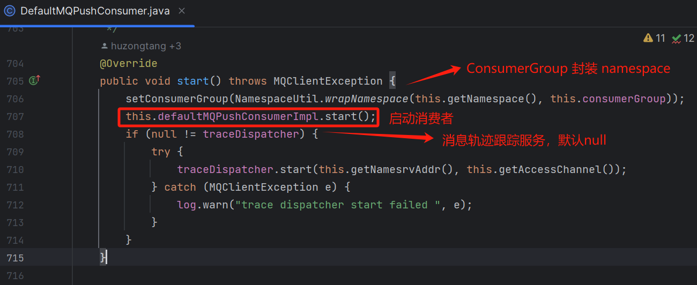

可以看到实际完成消息消费功能的是 [DefaultMQPushConsumerImpl](http://defaultmqpushconsumerimpl/)。

源码位置：[https://github.com/apache/rocketmq/blob/release-4.9.7/client/src/main/java/org/apache/rocketmq/client/impl/consumer/DefaultMQPushConsumerImpl.java](https://github.com/apache/rocketmq/blob/release-4.9.7/client/src/main/java/org/apache/rocketmq/client/impl/consumer/DefaultMQPushConsumerImpl.java)

/\*\*

\* 消费者的核心代码入口

\*/

public synchronized void start() throws MQClientException {

switch (this.serviceState) {

// 刚刚创建

case CREATE\_JUST:

log.info("the consumer \[{}\] start beginning. messageModel={}, isUnitMode={}", this.defaultMQPushConsumer.getConsumerGroup(),

this.defaultMQPushConsumer.getMessageModel(), this.defaultMQPushConsumer.isUnitMode());

// 设置状态为启动失败

this.serviceState = ServiceState.START\_FAILED;

// 1、检查配置信息，消费模式校验(MessageModel)，消费开始位置(ConsumeFromWhere)，消费时间戳(默认是半小时之前)，队列分配策略(默认是 AllocateMessageQueueAveragely)，订阅 Topic 和Subscription 关系校验，消息监听器(MessageListener) 校验等。

this.checkConfig();

// 2、构建主题订阅信息 SubscriptionData 并加入 RebalanceImpl 的订阅消息中，Consumer 中订阅关系的来源主要包括 DefaultMQPushConsumerImpl#subscribe 方法获取，同时如果消息消费模式为集群模式还需要为该消费组创建一个重试 topic并订阅重试 topic，其主题名为 %RETRY%+消费者组名，消费者启动时会自动订阅该主题

this.copySubscription();

// 如果是集群模式，消费者名称如果是 DEFAULT，则会改成: PID#时间戳

if (this.defaultMQPushConsumer.getMessageModel() == MessageModel.CLUSTERING) {

this.defaultMQPushConsumer.changeInstanceNameToPID();

}

// 3、创建 MQClientInstance 实例，该实例为消息拉取服务，主要用于拉取消息，同一个进程内的所有 Consumer 会使用同一个 MQClientInstance

// 这个实例在一个 JVM 中消费者和生产者共用，MQClientManager 中维护了一个factoryTable，类型为 ConcurrentMap，保存了 clintId 和 MQClientInstanc

this.mQClientFactory = MQClientManager.getInstance().getOrCreateMQClientInstance(this.defaultMQPushConsumer, this.rpcHook);

// 4、消费者负载均衡服务，设置负载均衡相关属性

// 设置消费者组

this.rebalanceImpl.setConsumerGroup(this.defaultMQPushConsumer.

getConsumerGroup());

// 消息消费模式

this.rebalanceImpl.setMessageModel(this.defaultMQPushConsumer.getMessageModel());

// 设置消息消费模式，队列默认分配算法

this.rebalanceImpl.setAllocateMessageQueueStrategy(this.defaultMQPushConsumer.

getAllocateMessageQueueStrategy());

this.rebalanceImpl.setmQClientFactory(this.mQClientFactory);

// 5、构建拉消息包装器拉取消息

// pullAPIWrapper 拉取消息的 API 包装类，主要有消息的拉取方法和接受拉取到的消息

this.pullAPIWrapper = new PullAPIWrapper(

mQClientFactory,

this.defaultMQPushConsumer.getConsumerGroup(), isUnitMode());

this.pullAPIWrapper.registerFilterMessageHook(filterMessageHookList);

// 6、消费进度存储

if (this.defaultMQPushConsumer.getOffsetStore() != null) {

this.offsetStore = this.defaultMQPushConsumer.getOffsetStore();

} else {

switch (this.defaultMQPushConsumer.getMessageModel()) {

// 如果是广播模式，则使用本地存储 LocalFileOffsetStore 偏移量，保存 offset到本地文件中

case BROADCASTING:

this.offsetStore = new LocalFileOffsetStore(this.mQClientFactory, this.defaultMQPushConsumer.getConsumerGroup());

break;

// 如果是集群模式，使用远程存储 RemoteBrokerOffsetStore 偏移量，保存 offset到 broker 文件中

case CLUSTERING:

this.offsetStore = new RemoteBrokerOffsetStore(this.mQClientFactory, this.defaultMQPushConsumer.getConsumerGroup());

break;

default:

break;

}

this.defaultMQPushConsumer.setOffsetStore(this.offsetStore);

}

// 7、加载消息进度，offsetStore 是用来操作消费进度的对象

// push 模式消费进度最后持久化在 broker 端，但是 consumer 端在内存中也持有消费进度

// 如果是广播模式，则从本地文件 load 偏移量，如果是集群模式则是一个空实现

this.offsetStore.load();

// 8、判断是顺序消息还是并发消息，如果是顺序消费，创建消费端消费线程服务。

// ConsumeMessageService 主要负责消息消费，在内部维护一个线程池

if (this.getMessageListenerInner() instanceof MessageListenerOrderly) {

this.consumeOrderly = true; // 顺序消费

// 创建顺序消费消息服务类

this.consumeMessageService =

new ConsumeMessageOrderlyService(this, (MessageListenerOrderly) this.getMessageListenerInner());

} else if (this.getMessageListenerInner() instanceof MessageListenerConcurrently) {

this.consumeOrderly = false; // 并发消费

// 创建并发消费消息服务类，其内部维护了一个线程池，后面会用到

this.consumeMessageService =

new ConsumeMessageConcurrentlyService(this, (MessageListenerConcurrently) this.getMessageListenerInner());

}

// 9、消息消费服务并启动

this.consumeMessageService.start();

// 10、向 MQClientInstance 注册消费者并启动 MQClientInstance，JVM 中的所有消费者、生产者持有同一个 MQClientInstance，MQClientInstance 只会启动一次

boolean registerOK \= mQClientFactory.registerConsumer(this.defaultMQPushConsumer.getConsumerGroup(), this);

if (!registerOK) {

// 注册失败后状态修改为刚刚创建

this.serviceState = ServiceState.CREATE\_JUST;

this.consumeMessageService.shutdown(defaultMQPushConsumer.

getAwaitTerminationMillisWhenShutdown());

throw new MQClientException("The consumer group\[" + this.defaultMQPushConsumer.getConsumerGroup()

\+ "\] has been created before, specify another name please." + FAQUrl.suggestTodo(FAQUrl.GROUP\_NAME\_DUPLICATE\_URL),

null);

}

// 11、MQClientInstance 启动

mQClientFactory.start();

log.info("the consumer \[{}\] start OK.", this.defaultMQPushConsumer.getConsumerGroup());

this.serviceState = ServiceState.RUNNING;

break;

case RUNNING:

case START\_FAILED:

case SHUTDOWN\_ALREADY:

throw new MQClientException("The PushConsumer service state not OK, maybe started once, "

\+ this.serviceState

\+ FAQUrl.suggestTodo(FAQUrl.CLIENT\_SERVICE\_NOT\_OK),

null);

default:

break;

}

// 12、更新主题路由信息，即向 Namesrv 拉取并更新当前消费者订阅 topic 路由信息

this.updateTopicSubscribeInfoWhenSubscriptionChanged();

// 13、随机选择一个Broker，发送检查客户端 tag 配置的请求，主要是检测Broker 是否支持 SQL92 类型的 tag 过滤以及 SQL9 2的 tag 语法是否正确

this.mQClientFactory.checkClientInBroker();

// 14、给所有 Broker 发送心跳

this.mQClientFactory.sendHeartbeatToAllBrokerWithLock();

// 15、唤醒负载均衡服务 rebalanceService，并进行 rebalance

this.mQClientFactory.rebalanceImmediately();

}

该方法判断当前客户端的状态，不同的服务状态执行不同的流程，RocketMQ 的服务状态 [ServiceState](http://servicestate/) 如下：

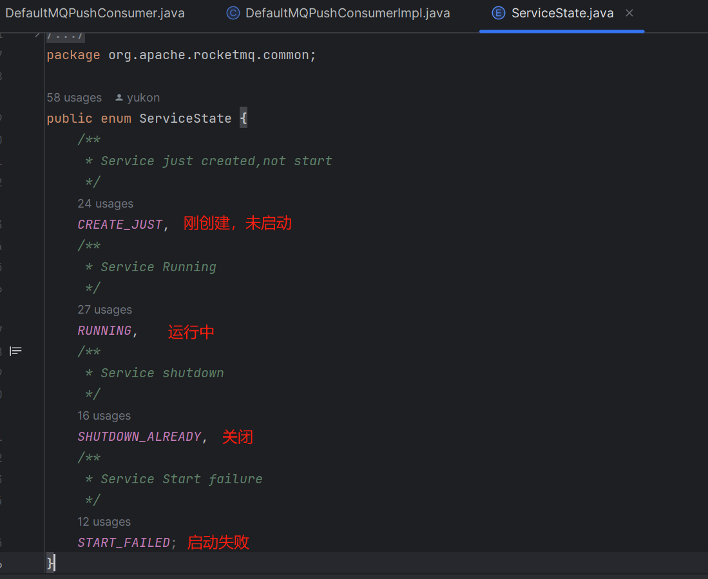

启动方法步骤很多，大概分为以下几步：

1.  检查配置信息。
2.  消费模式校验(MessageModel)，消费开始位置(ConsumeFromWhere)，消费时间戳(默认是半小时之前)，队列分配策略(默认是 AllocateMessageQueueAveragely)，订阅 Topic 和Subscription 关系校验，消息监听器(MessageListener) 校验等。
3.  加工订阅关系信息。
4.  构建主题订阅信息 SubscriptionData 并加入 RebalanceImpl 的订阅消息中，Consumer 中订阅关系的来源主要包括 [DefaultMQPushConsumerImpl#subscribe](http://defaultmqpushconsumerimpl/#subscribe) 方法获取，同时如果消息消费模式为集群模式还需要为该消费组创建一个重试 topic并订阅重试 topic，其主题名为 [%RETRY%+消费者组名](http://%RETRY%+%E6%B6%88%E8%B4%B9%E8%80%85%E7%BB%84%E5%90%8D)，消费者启动时会自动订阅该主题。
5.  创建 MQClientInstance 实例，该实例为消息拉取服务，主要用于拉取消息，同一个进程内的所有 Consumer 会使用同一个 MQClientInstance。
6.  消费者负载均衡服务，设置消费者组，设置消息消费模式，设置队列默认分配算法。
7.  构建拉消息包装器拉取消息。
8.  pullAPIWrapper 拉取消息的 API 包装类，主要有消息的拉取方法和接受拉取到的消息。
9.  根据消息消费模式的不同设置不同的消息消费进度存储器 OffsetStore。
10.  如果是广播模式，则使用本地存储 LocalFileOffsetStore 偏移量，将消费进度 offset 存储在 Consumer 本地的 [${user.home}/.rocketmq\_offsets/clientId/consumerGroup/offsets.json](http://${user.home}/.rocketmq_offsets/clientId/consumerGroup/offsets.json) 文件中，从本地文件中获取偏移量。
11.  如果是集群模式，使用远程存储 RemoteBrokerOffsetStore 偏移量，将消费进度 offset 存储到 Broker 文件中，会根据偏移量的读取方式选择是读取内存中的偏移量还是Broker磁盘中的偏移量。
12.  将获取的消息偏移量对象赋值给 [DefaultMQPushConsumerImpl#offsetStore](http://defaultmqpushconsumerimpl/#offsetStore) 属性，后续可通过此对象加载消费进度。
13.  创建完成之后调用 load() 方法加载偏移量。push 模式消费进度最后持久化在 broker 端，但是 consumer 端在内存中也持有消费进度。如果是广播模式，则从本地文件 load 偏移量，如果是集群模式则是一个空实现。
14.  根据消息监听器的类型不同创建不同的消息消费服务：
15.  如果是顺序消费则创建顺序消费消息服务类。
16.  如果是并发消费则创建并发消费消息服务类，其内部维护了一个线程池。
17.  启动消息消费服务。
18.  注册消费者组和消费者信息到 [MQClientInstance#consumerTable](http://mqclientinstance/#consumerTable) 中，注册成功后设置服务状态。
19.  JVM 中的所有消费者、生产者持有同一个 [MQClientInstance](http://mqclientinstance/)，[MQClientInstance](http://mqclientinstance%20/) 只会启动一次。
20.  启动 [MQClientInstance](http://mqclientinstance/) 客户端通信实例。
21.  更新主题路由信息，即向 Namesrv 拉取并更新当前消费者订阅 topic 路由信息。
22.  检查在 Broker 上的状态，随机选择一个Broker，发送检查客户端 tag 配置的请求，主要是检测Broker 是否支持 SQL92 类型的 tag 过滤以及 SQL9 2的 tag 语法是否正确。
23.  给所有 Broker 发送心跳。
24.  唤醒负载均衡服务 rebalanceService，并进行 rebalance。

步骤比较多，接下来我们挨个来看下每一步的具体实现。

## **3.3.1 检查配置信息**

/\*\*

\* 检查消费者配置的合法性

\* @throws MQClientException 如果消费者配置不合法则抛出 MQClientException 异常

\*/

private void checkConfig() throws MQClientException {

// 检查消费组是否合法

Validators.checkGroup(this.defaultMQPushConsumer.getConsumerGroup());

// 检查消费组不能为空

if (null == this.defaultMQPushConsumer.getConsumerGroup()) {

throw new MQClientException(

"consumerGroup is null"

\+ FAQUrl.suggestTodo(FAQUrl.CLIENT\_PARAMETER\_CHECK\_URL),

null);

}

// 检查消费组不能与默认组相同

if (this.defaultMQPushConsumer.getConsumerGroup().equals(MixAll.DEFAULT\_CONSUMER\_GROUP)) {

throw new MQClientException(

"consumerGroup can not equal "

\+ MixAll.DEFAULT\_CONSUMER\_GROUP

\+ ", please specify another one."

\+ FAQUrl.suggestTodo(FAQUrl.CLIENT\_PARAMETER\_CHECK\_URL),

null);

}

// 校验消费模式:集群/广播是否为空

if (null == this.defaultMQPushConsumer.getMessageModel()) {

throw new MQClientException(

"messageModel is null"

\+ FAQUrl.suggestTodo(FAQUrl.CLIENT\_PARAMETER\_CHECK\_URL),

null);

}

// 校验 ConsumeFromWhere 是否为空

if (null == this.defaultMQPushConsumer.getConsumeFromWhere()) {

throw new MQClientException(

"consumeFromWhere is null"

\+ FAQUrl.suggestTodo(FAQUrl.CLIENT\_PARAMETER\_CHECK\_URL),

null);

}

// 校验开始消费的指定时间

Date dt \= UtilAll.parseDate(this.defaultMQPushConsumer.getConsumeTimestamp(), UtilAll.YYYYMMDDHHMMSS);

if (null == dt) {

throw new MQClientException(

"consumeTimestamp is invalid, the valid format is yyyyMMddHHmmss,but received "

\+ this.defaultMQPushConsumer.getConsumeTimestamp()

\+ " " + FAQUrl.suggestTodo(FAQUrl.CLIENT\_PARAMETER\_CHECK\_URL), null);

}

// 校验 AllocateMessageQueueStrategy 分配策略是否为空

if (null == this.defaultMQPushConsumer.getAllocateMessageQueueStrategy()) {

throw new MQClientException(

"allocateMessageQueueStrategy is null"

\+ FAQUrl.suggestTodo(FAQUrl.CLIENT\_PARAMETER\_CHECK\_URL),

null);

}

// 校验订阅关系

if (null == this.defaultMQPushConsumer.getSubscription()) {

throw new MQClientException(

"subscription is null"

\+ FAQUrl.suggestTodo(FAQUrl.CLIENT\_PARAMETER\_CHECK\_URL),

null);

}

// 校验是否注册消息监听

if (null == this.defaultMQPushConsumer.getMessageListener()) {

throw new MQClientException(

"messageListener is null"

\+ FAQUrl.suggestTodo(FAQUrl.CLIENT\_PARAMETER\_CHECK\_URL),

null);

}

boolean orderly \= this.defaultMQPushConsumer.getMessageListener() instanceof MessageListenerOrderly;

boolean concurrently \= this.defaultMQPushConsumer.getMessageListener() instanceof MessageListenerConcurrently;

// 非顺序 && 非并发 消息

if (!orderly && !concurrently) {

throw new MQClientException(

"messageListener must be instanceof MessageListenerOrderly or MessageListenerConcurrently"

\+ FAQUrl.suggestTodo(FAQUrl.CLIENT\_PARAMETER\_CHECK\_URL),

null);

}

// 校验消费线程数,consumeThreadMin 和 consumeThreadMax 默认值都是20，取值区间都是 \[1, 1000\]

if (this.defaultMQPushConsumer.getConsumeThreadMin() < 1

|| this.defaultMQPushConsumer.getConsumeThreadMin() > 1000) {

throw new MQClientException(

"consumeThreadMin Out of range \[1, 1000\]"

\+ FAQUrl.suggestTodo(FAQUrl.CLIENT\_PARAMETER\_CHECK\_URL),

null);

}

// 校验消费线程数,consumeThreadMin 和 consumeThreadMax 默认值都是20，取值区间都是 \[1, 1000\]

if (this.defaultMQPushConsumer.getConsumeThreadMax() < 1 || this.defaultMQPushConsumer.getConsumeThreadMax() > 1000) {

throw new MQClientException(

"consumeThreadMax Out of range \[1, 1000\]"

\+ FAQUrl.suggestTodo(FAQUrl.CLIENT\_PARAMETER\_CHECK\_URL),

null);

}

// consumeThreadMin can't be larger than consumeThreadMax

if (this.defaultMQPushConsumer.getConsumeThreadMin() > this.defaultMQPushConsumer.getConsumeThreadMax()) {

throw new MQClientException(

"consumeThreadMin (" + this.defaultMQPushConsumer.getConsumeThreadMin() + ") "

\+ "is larger than consumeThreadMax (" + this.defaultMQPushConsumer.getConsumeThreadMax() + ")",

null);

}

// 校验本地队列缓存消息的最大数，默认是1000，取值范围是\[1, 1024\], 主要是做流控用的

if (this.defaultMQPushConsumer.getConsumeConcurrentlyMaxSpan() < 1

|| this.defaultMQPushConsumer.getConsumeConcurrentlyMaxSpan() > 65535) {

throw new MQClientException(

"consumeConcurrentlyMaxSpan Out of range \[1, 65535\]"

\+ FAQUrl.suggestTodo(FAQUrl.CLIENT\_PARAMETER\_CHECK\_URL),

null);

}

// pullThresholdForQueue

if (this.defaultMQPushConsumer.getPullThresholdForQueue() < 1 || this.defaultMQPushConsumer.getPullThresholdForQueue() > 65535) {

throw new MQClientException(

"pullThresholdForQueue Out of range \[1, 65535\]"

\+ FAQUrl.suggestTodo(FAQUrl.CLIENT\_PARAMETER\_CHECK\_URL),

null);

}

// pullThresholdForTopic

if (this.defaultMQPushConsumer.getPullThresholdForTopic() != -1) {

if (this.defaultMQPushConsumer.getPullThresholdForTopic() < 1 || this.defaultMQPushConsumer.getPullThresholdForTopic() > 6553500) {

throw new MQClientException(

"pullThresholdForTopic Out of range \[1, 6553500\]"

\+ FAQUrl.suggestTodo(FAQUrl.CLIENT\_PARAMETER\_CHECK\_URL),

null);

}

}

// pullThresholdSizeForQueue

if (this.defaultMQPushConsumer.getPullThresholdSizeForQueue() < 1 || this.defaultMQPushConsumer.getPullThresholdSizeForQueue() > 1024) {

throw new MQClientException(

"pullThresholdSizeForQueue Out of range \[1, 1024\]"

\+ FAQUrl.suggestTodo(FAQUrl.CLIENT\_PARAMETER\_CHECK\_URL),

null);

}

if (this.defaultMQPushConsumer.getPullThresholdSizeForTopic() != -1) {

// pullThresholdSizeForTopic

if (this.defaultMQPushConsumer.getPullThresholdSizeForTopic() < 1 || this.defaultMQPushConsumer.getPullThresholdSizeForTopic() > 102400) {

throw new MQClientException(

"pullThresholdSizeForTopic Out of range \[1, 102400\]"

\+ FAQUrl.suggestTodo(FAQUrl.CLIENT\_PARAMETER\_CHECK\_URL),

null);

}

}

// 校验拉取消息的时间间隔，pullInterval参数，默认是不存在间隔，取值范围是\[0, 65535\]。当消费速度比生产速度快，可以设置这个参数，避免花费大概率从broker拉取空消息

if (this.defaultMQPushConsumer.getPullInterval() < 0 || this.defaultMQPushConsumer.getPullInterval() > 65535) {

throw new MQClientException(

"pullInterval Out of range \[0, 65535\]"

\+ FAQUrl.suggestTodo(FAQUrl.CLIENT\_PARAMETER\_CHECK\_URL),

null);

}

// 校验单次拉取的最大消息数，consumeMessageBatchMaxSize 参数，默认是1，取值范围是\[1, 1024\]

if (this.defaultMQPushConsumer.getConsumeMessageBatchMaxSize() < 1

|| this.defaultMQPushConsumer.getConsumeMessageBatchMaxSize() > 1024) {

throw new MQClientException(

"consumeMessageBatchMaxSize Out of range \[1, 1024\]"

\+ FAQUrl.suggestTodo(FAQUrl.CLIENT\_PARAMETER\_CHECK\_URL),

null);

}

// 校验单次消费的最大消息数, pullBatchSize 参数，默认是32，取值范围是\[1, 1024\]。

if (this.defaultMQPushConsumer.getPullBatchSize() < 1 || this.defaultMQPushConsumer.getPullBatchSize() > 1024) {

throw new MQClientException(

"pullBatchSize Out of range \[1, 1024\]"

\+ FAQUrl.suggestTodo(FAQUrl.CLIENT\_PARAMETER\_CHECK\_URL),

null);

}

}

该方法比较简单，校验消费者组、消息模型、消息进度、分配消息队列策略、消息监听器、消费线程等信息。

##   
**3.3.2 拷贝订阅关系**

// 将订阅关系设置到重平衡服务类 RebalanceImpl 中，订阅重试主题消息

private void copySubscription() throws MQClientException {

try {

// 获取订阅关系

Map<String, String> sub = this.defaultMQPushConsumer.getSubscription();

if (sub != null) {

for (final Map.Entry<String, String> entry : sub.entrySet()) {

final String topic \= entry.getKey();

final String subString \= entry.getValue();

SubscriptionData subscriptionData \= FilterAPI.buildSubscriptionData(topic, subString);

// 将消费者的订阅数据缓存值 rebalanceImpl 的 subscriptionInner 属性中

this.rebalanceImpl.getSubscriptionInner().put(topic, subscriptionData);

}

}

if (null == this.messageListenerInner) {

this.messageListenerInner = this.defaultMQPushConsumer.getMessageListener();

}

switch (this.defaultMQPushConsumer.getMessageModel()) {

case BROADCASTING: // 广播模式 空实现

break;

case CLUSTERING: // 集群模型

// 创建一个重试主题

final String retryTopic \= MixAll.getRetryTopic(this.defaultMQPushConsumer.getConsumerGroup());

// 基于重试主题构建订阅关系

SubscriptionData subscriptionData \= FilterAPI.buildSubscriptionData(retryTopic, SubscriptionData.SUB\_ALL);

// 将消费者的订阅数据缓存值 rebalanceImpl 的 subscriptionInner 属性中

this.rebalanceImpl.getSubscriptionInner().put(retryTopic, subscriptionData);

break;

default:

break;

}

} catch (Exception e) {

throw new MQClientException("subscription exception", e);

}

}

很简单，就是将当前消费者订阅关系设置到本地缓存 [RebalanceImpl#subscriptionInner](http://rebalanceimpl/#subscriptionInner) 中，如果当前消息消费模式是集群模式，创建一个重试 Topic，再次设置订阅关系到本地缓存 [RebalanceImpl#subscriptionInner](http://rebalanceimpl/#subscriptionInner) 中。

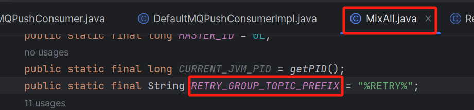

重试Topic名称的生成规则：[MixAll#RETRY\_GROUP\_TOPIC\_PREFIX](http://mixall/#RETRY_GROUP_TOPIC_PREFIX) 加上消费组名称。

public static String getRetryTopic(final String consumerGroup) {

return RETRY\_GROUP\_TOPIC\_PREFIX + consumerGroup;

}

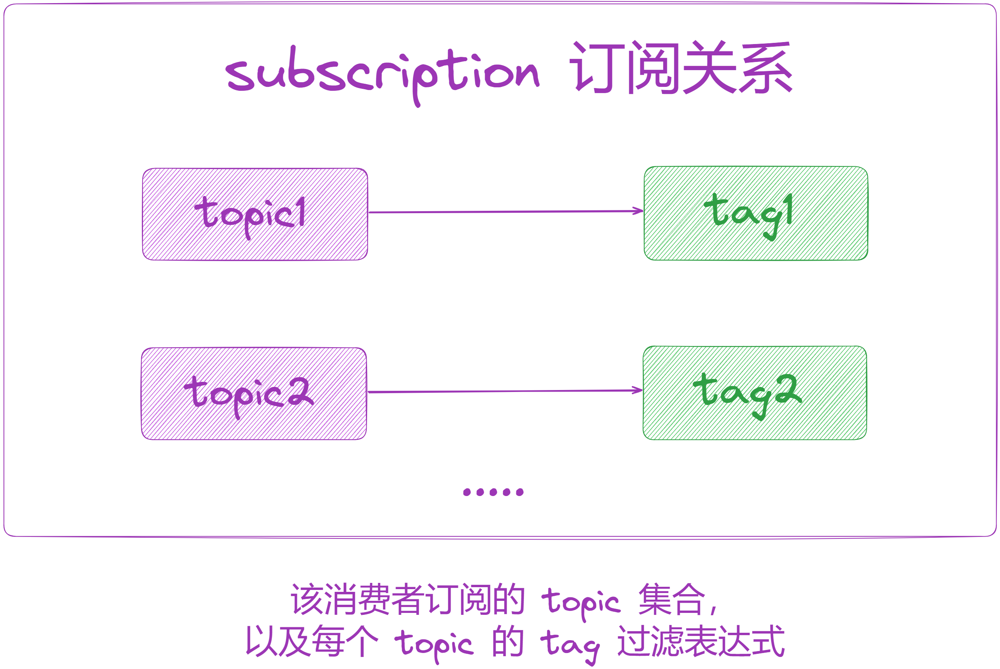

该数据结构是在门面类 [DefaultMQPushConsumer](http://defaultmqpushconsumer%20/) 中维护的， 主要存储的是 topic 与 tag 的映射关系。

## **3.3.3 创建 MQClientInstance 实例**

[MQClientInstance](http://mqclientinstance/) 实例在一个 JVM 中消费者和生产者共用，[MQClientManager](http://mqclientmanager/) 中维护了一个 [factoryTable](http://factorytable/)，类型为 [ConcurrentMap](http://concurrentmap/)，保存了 clintId 和 MQClientInstance。

源码位置：[https://github.com/apache/rocketmq/blob/release-4.9.7/client/src/main/java/org/apache/rocketmq/client/impl/MQClientManager.java](https://github.com/apache/rocketmq/blob/release-4.9.7/client/src/main/java/org/apache/rocketmq/client/impl/MQClientManager.java)

public class MQClientManager {

private final static InternalLogger log \= ClientLogger.getLog();

private static MQClientManager instance \= new MQClientManager();

private AtomicInteger factoryIndexGenerator \= new AtomicInteger();

// factoryTable 缓存，保存了 clintId 和 MQClientInstance

private ConcurrentMap<String/\* clientId \*/, MQClientInstance> factoryTable =

new ConcurrentHashMap<String, MQClientInstance>();

public MQClientInstance getOrCreateMQClientInstance(final ClientConfig clientConfig, RPCHook rpcHook) {

// 获取客户端ID

String clientId \= clientConfig.buildMQClientId();

// 根据客户端id缓存中获取 MQClientInstance

MQClientInstance instance \= this.factoryTable.get(clientId);

if (null == instance) { // 如果为空，则创建实例并添加到实例表中

// 创建 MQClientInstance

instance =

new MQClientInstance(clientConfig.cloneClientConfig(),

this.factoryIndexGenerator.getAndIncrement(), clientId, rpcHook);

// 添加进 factoryTable 缓存

MQClientInstance prev \= this.factoryTable.putIfAbsent(clientId, instance);

if (prev != null) {

instance = prev;

log.warn("Returned Previous MQClientInstance for clientId:\[{}\]", clientId);

} else {

log.info("Created new MQClientInstance for clientId:\[{}\]", clientId);

}

}

return instance;

}

}

根据客户端 id 缓存中获取 [MQClientInstance](http://mqclientinstance/) 实例，如果为空则创建该实例。在前面分析 Producer 启动时也看到了 [MQClientInstance](http://mqclientinstance/) 实例，因为 Prodcuer/Consumer 都是客户端，所以都会根据这个实例来创建对象。

源码位置：[https://github.com/apache/rocketmq/blob/release-4.9.7/client/src/main/java/org/apache/rocketmq/client/impl/factory/MQClientInstance.java](https://github.com/apache/rocketmq/blob/release-4.9.7/client/src/main/java/org/apache/rocketmq/client/impl/factory/MQClientInstance.java)

我们看下这个类的结构：

public class MQClientInstance {

....

// 生产者表，producer启动时创建一个新的MQClientInstance实例对象，将生产者信息注册到这里。生产者实例对象中消费者信息是空

private final ConcurrentMap<String/\* group \*/, MQProducerInner> producerTable = new ConcurrentHashMap<String, MQProducerInner>();

// 消费者表，consumer启动时创建一个新的MQClientInstance实例对象，将消费者信息注册到这里。消费者实例对象中生产者信息是空

private final ConcurrentMap<String/\* group \*/, MQConsumerInner> consumerTable = new ConcurrentHashMap<String, MQConsumerInner>();

private final ConcurrentMap<String/\* group \*/, MQAdminExtInner> adminExtTable = new ConcurrentHashMap<String, MQAdminExtInner>();

private final NettyClientConfig nettyClientConfig;

// 客户端 API，它的内部会创建netty客户端对象（NettyRemotingClient），用于和broker通信

private final MQClientAPIImpl mQClientAPIImpl;

private final MQAdminImpl mQAdminImpl;

// topic路由信息，producer和consumer都会使用

private final ConcurrentMap<String/\* Topic \*/, TopicRouteData> topicRouteTable = new ConcurrentHashMap<String, TopicRouteData>();

// broker信息，producer和consumer都会用到

private final ConcurrentMap<String/\* Broker Name \*/, HashMap<Long/\* brokerId \*/, String/\* address \*/\>> brokerAddrTable =

new ConcurrentHashMap<String, HashMap<Long, String>>();

private final ConcurrentMap<String/\* Broker Name \*/, HashMap<String/\* address \*/, Integer>> brokerVersionTable =

new ConcurrentHashMap<String, HashMap<String, Integer>>();

// 客户端远程处理器

private final ClientRemotingProcessor clientRemotingProcessor;

private final PullMessageService pullMessageService; // 拉取消息服务

private final RebalanceService rebalanceService; // 重平衡服务

private final DefaultMQProducer defaultMQProducer;

private final ConsumerStatsManager consumerStatsManager; // 消费者状态管理器

private final AtomicLong sendHeartbeatTimesTotal \= new AtomicLong(0);

private ServiceState serviceState \= ServiceState.CREATE\_JUST; // 服务状态刚创建未启动

private Random random \= new Random();

public MQClientInstance(ClientConfig clientConfig, int instanceIndex, String clientId) {

this(clientConfig, instanceIndex, clientId, null);

}

public MQClientInstance(ClientConfig clientConfig, int instanceIndex, String clientId, RPCHook rpcHook) {

....

// 客户端处理器,比如在集群消费模式下，有新的消费者加入，则通知消费者客户端重平衡,是给消费者用的

this.clientRemotingProcessor = new ClientRemotingProcessor(this);

// 客户端 API

this.mQClientAPIImpl = new MQClientAPIImpl(this.nettyClientConfig, this.clientRemotingProcessor, rpcHook, clientConfig);

....

// 拉取消息的服务，和消费者相关

this.pullMessageService = new PullMessageService(this);

// 重平衡服务，和消费者相关

this.rebalanceService = new RebalanceService(this);

....

this.consumerStatsManager = new ConsumerStatsManager(this.scheduledExecutorService);

....

}

....

}

所谓的客户端，实际上是在 [MQClientAPIImpl](http://mqclientapiimpl/) 对象的内部的 [NettyRemotingClient](http://nettyremotingclient/)，如下：

源码位置：[https://github.com/apache/rocketmq/blob/release-4.9.7/client/src/main/java/org/apache/rocketmq/client/impl/MQClientAPIImpl.java](https://github.com/apache/rocketmq/blob/release-4.9.7/client/src/main/java/org/apache/rocketmq/client/impl/MQClientAPIImpl.java)

public class MQClientAPIImpl {

....

private final RemotingClient remotingClient;

private final TopAddressing topAddressing;

private final ClientRemotingProcessor clientRemotingProcessor;

private String nameSrvAddr \= null;

private ClientConfig clientConfig;

public MQClientAPIImpl(final NettyClientConfig nettyClientConfig,

final ClientRemotingProcessor clientRemotingProcessor,

RPCHook rpcHook, final ClientConfig clientConfig) {

this.clientConfig = clientConfig;

topAddressing = new TopAddressing(MixAll.getWSAddr(), clientConfig.getUnitName());

// 所谓的客户端实际上就是 netty 客户端

this.remotingClient = new NettyRemotingClient(nettyClientConfig, null);

this.clientRemotingProcessor = clientRemotingProcessor;

// Inject stream rpc hook first to make reserve field signature

if (clientConfig.isEnableStreamRequestType()) {

this.remotingClient.registerRPCHook(new StreamTypeRPCHook());

}

this.remotingClient.registerRPCHook(rpcHook);

// 注册处理器

this.remotingClient.registerProcessor(RequestCode.CHECK\_TRANSACTION\_STATE, this.clientRemotingProcessor, null);

this.remotingClient.registerProcessor(RequestCode.NOTIFY\_CONSUMER\_IDS\_CHANGED, this.clientRemotingProcessor, null);

// ....注册其他处理器......

}

....

}

这里我们关注下 [NettyRemotingClient](http://nettyremotingclient/)，其实前面分析 Broker，Producer 时，我们经常看到这个，因为RocketMQ 是使用 netty 作为通信的。

> NettyRemotingClient：netty 的客户端对象
> 
> NettyRemotingServer：netty 的服务端对象

## **3.3.4 消息队列分配策略**

this.rebalanceImpl.setAllocateMessageQueueStrategy(this.defaultMQPushConsumer.getAllocateMessageQueueStrategy());

消费者默认的消息队列分配策略：AllocateMessageQueueAveragely 类，平均哈希队列策略接口类如下：

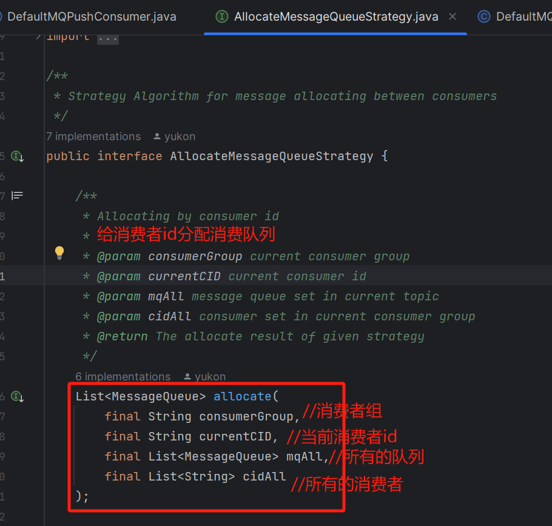

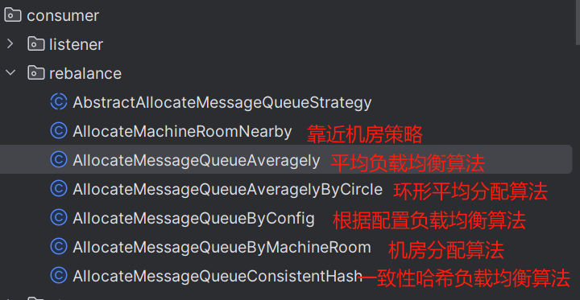

平均哈希队列策略 [AllocateMessageQueueAveragely#allocate](http://allocatemessagequeueaveragely/#allocate) 具体实现如下：

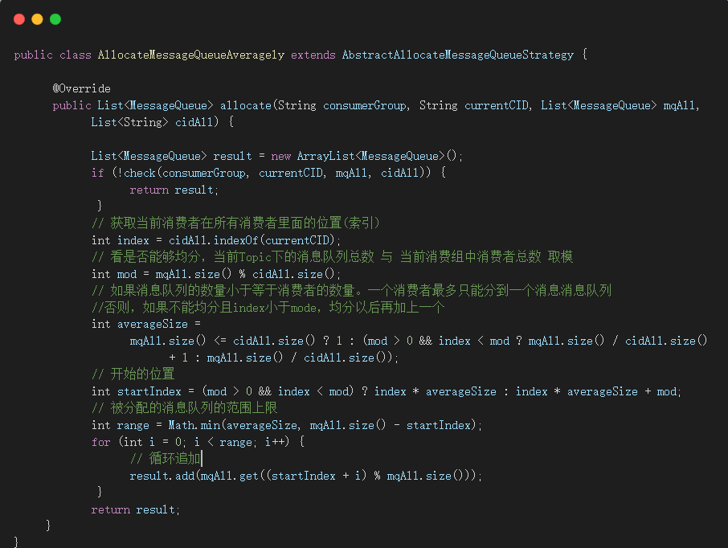

该策略比较简单，步骤如下：

1.  首先会获取当前消费者在消费者组中的位置。
2.  再计算当前消费者能分配的消息队列的数量，以及分配的消息队列的范围，也就是从哪里开始分配到哪里结束分配
3.  最后分配消息队列的范围给消费者进行分配。

## **3.3.5 创建拉取消息服务**

定义 RocketMQ 拉取消息的包装类 [PullAPIWrapper](http://pullapiwrapper/)，[PullAPIWrapper](http://pullapiwrapper/) 是拉取消息的 API 包装类。

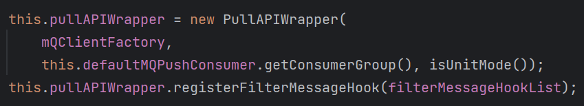

[PullAPIWrapper](http://pullapiwrapper/) 中包含了实际从 MQ 中获取消息的方法 [pullKernelImpl()](http://pullkernelimpl\(\)/)。

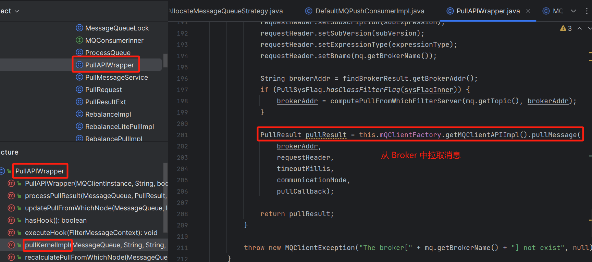

这里主要定义了拉取消息的对象，实际拉取消息的操作在启动拉取消息服务 [PullMessageService](http://pullmessageservice/) 之后进行，后面篇章进行详细介绍。

## **3.3.6 消费进度存储**

根据消费消息的模式来判断加载消费进度的，消费进度对象 [DefaultMQPushConsumerImpl#offsetStore](http://defaultmqpushconsumerimpl/#offsetStore)，OffsetStore 接口有两个子类 [LocalFileOffsetStore](http://localfileoffsetstore/) 和 [RemoteBrokerOffsetStore](http://remotebrokeroffsetstore/)，类图如下：

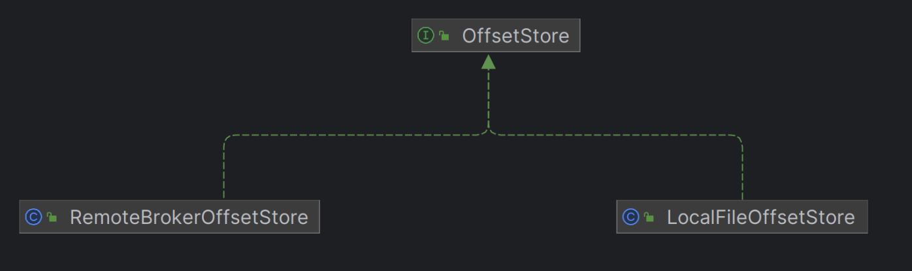

这里不展开进行深度剖析，会在后面篇章进行详细介绍。

1.  如果是广播模式 BROADCASTING， 则创建 [LocalFileOffsetStore](http://localfileoffsetstore/) 对象，将消费者的 offset 存储到本地，默认文件路径为当前用户主目录下的 [${](http://${user.home}/.rocketmq_offsets/clientId/consumerGroup/offsets.json)[user.home](http://user.home/)[}/.rocketmq\_offsets/clientId/consumerGroup/](http://${user.home}/.rocketmq_offsets/clientId/consumerGroup/offsets.json)[offsets.json](http://offsets.json/)。其中 clientId 为当前消费者id，默认为 [ip@default](http://ip@default/)，[consumerGroup](http://${user.home}/.rocketmq_offsets/clientId/consumerGroup/offsets.json)为消费者组名称。
2.  此模式下从本地读取消费进度。
3.  如果是集群模式 CLUSTERING，则创建 [RemoteBrokerOffsetStore](http://remotebrokeroffsetstore/) 对象，将消费者的 offset 存储到 broker 中，文件路径为当前用户主目录下的 [store/config/consumerOffset.json](http://store/config/consumerOffset.json)。
4.  此模式下获取远程存储信息，从 Broker 中获取消费进度，在该模式下 [offsetTable](http://offsettable/) 将需要提交的 [MessageQueue](http://messagequeue/) 的 offset 信息通过 [MQClientAPIImpl#updateConsumerOffsetOneway()](http://mqclientapiimpl/#updateConsumerOffsetOneway\(\)) 提交到 broker 进行长久化存储。而 consumer 的 shutdown() 办法会被动触发一次 offset 持久化到 broker 的操作。

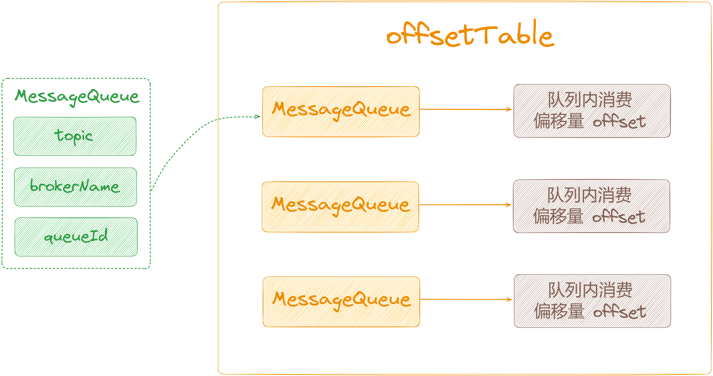

该数据结构位于 [RemoteBrokerOffsetStore](http://remotebrokeroffsetstore/) 类中， 主要是消费者本地来存储和记录消息的消费进度。

## **3.3.7 消费进度加载**

根据不同消费消息的模式获取到偏移量对象 [DefaultMQPushConsumerImpl#offsetStore](http://defaultmqpushconsumerimpl/#offsetStore) 后，开始加载消息进度。

加载消费进度，[RemoteBrokerOffsetStore](http://remotebrokeroffsetstore/) 中的 load() 是空实现。

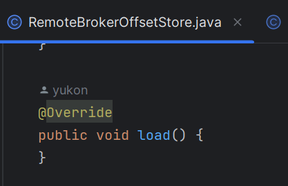

LocalFileOffsetStore中 的 load() 方法读取本地文件 [offsets.json](http://offsets.json/)，本地文件存储路径：

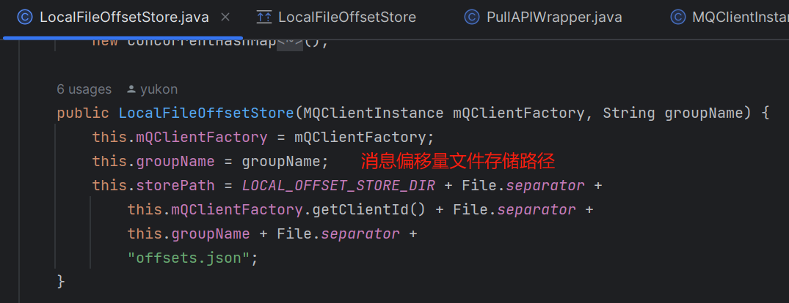

## **3.3.8 创建消费消息服务类**

1.  如果是顺序消费，则创建 [ConsumeMessageOrderlyService](http://consumemessageorderlyservice/) 对象。
2.  如果是其他消费，则创建 [ConsumeMessageConcurrentlyService](http://consumemessageconcurrentlyservice/) 对象，同时内部也会创建一个 [ThreadPoolExecutor](http://threadpoolexecutor/) 线程池，这个线程池非常的重要，拉取到消息后会将消息提交到这个线程池中给消费者消费。

## **3.3.9 启动消费服务**

## **3.3.9.1 顺序消息消费服务**

顺序消息是基于 JUC 的[ReadWriteLock](http://readwritelock/)、[ReentrantLock](http://reentrantlock/) 实现的，为消息队里加锁保证同一时间只有一个消费者可以消费该队列的消息，在拉取到消息后通过 [MessageListenerOrderly#consumeMessage](http://messagelistenerorderly/#consumeMessage) 方法来处理消息。

在 [ConsumeMessageOrderlyService](http://consumemessageorderlyservice/) 启动时，进行加锁操作；关闭时，释放锁。

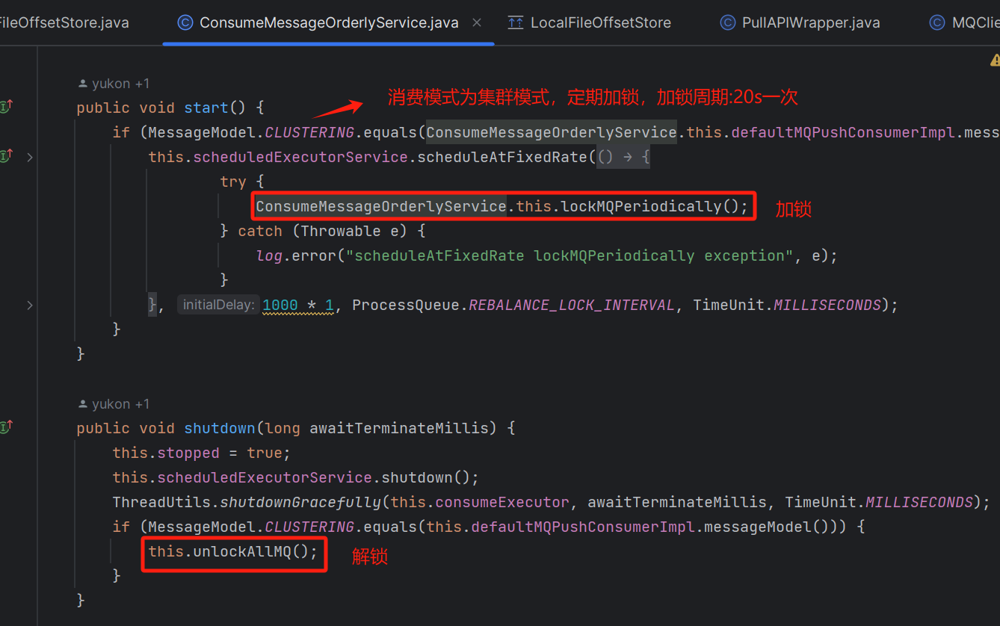

## **加锁处理**

加锁操作流程如下：客户端通过 Netty 传递功能号 [LOCK\_BATCH\_MQ=41](http://lock_batch_mq=41/) 远程调用 Broker 对消息队列进行加锁，最终将加锁的消息队列存放在 [RebalanceLockManager#mqLockTable](http://rebalancelockmanager/#mqLockTable) 缓存表中。

这里来一个流程图总结下，后面会单独进行详细剖析。

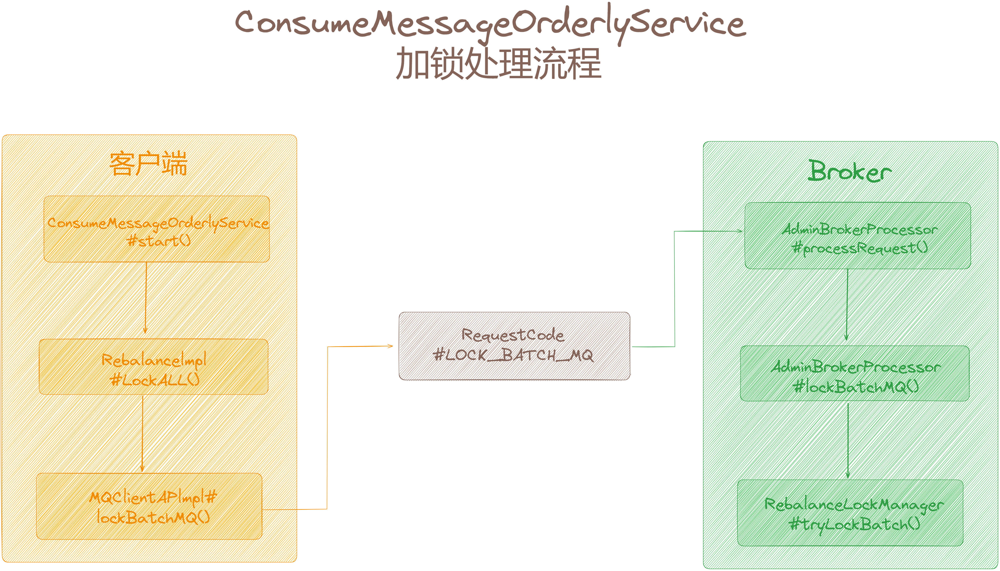

源码位置：[https://github.com/apache/rocketmq/blob/release-4.9.7/broker/src/main/java/org/apache/rocketmq/broker/client/rebalance/RebalanceLockManager.java](https://github.com/apache/rocketmq/blob/release-4.9.7/broker/src/main/java/org/apache/rocketmq/broker/client/rebalance/RebalanceLockManager.java)

Broker 端对消息队列的加锁处理，最终是由 [RebalanceLockManager#tryLockBatch](http://rebalancelockmanager/#tryLockBatch) 来处理的，如下：

// 加锁处理

public Set<MessageQueue> tryLockBatch(final String group,final Set<MessageQueue> mqs,final String clientId) {

// 创建用于存储已锁定消息队列的集合

Set<MessageQueue> lockedMqs = new HashSet<MessageQueue>(mqs.size());

// 创建用于存储未锁定消息队列的集合

Set<MessageQueue> notLockedMqs = new HashSet<MessageQueue>(mqs.size());

// 遍历传入的消息队列集合

for (MessageQueue mq :mqs) {

// 检查消息队列是否已被当前客户端锁定

if (this.isLocked(group,mq,clientId)) {

// 若已被锁定，将其加入已锁定集合

lockedMqs.add(mq);

} else {

// 若未被锁定，将其加入未锁定集合

notLockedMqs.add(mq);

}

}

// 若存在未锁定的消息队列

if (!notLockedMqs.isEmpty()) {

try {

// 获取独占锁

this.lock.lockInterruptibly();

try {

// 获取指定消费者组的锁表

ConcurrentHashMap<MessageQueue,LockEntry> groupValue = this.mqLockTable.get(group);

// 若锁表中不存在该消费者组的锁信息，则创建新的锁表项

if (null == groupValue) {

groupValue = new ConcurrentHashMap<>(32);

this.mqLockTable.put(group,groupValue);

}

// 遍历未锁定的消息队列集合

for (MessageQueue mq :notLockedMqs) {

LockEntry lockEntry \= groupValue.get(mq);

// 若锁表中不存在该消息队列的锁信息，则创建新的锁项

if (null == lockEntry) {

lockEntry = new LockEntry();

lockEntry.setClientId(clientId);

groupValue.put(mq,lockEntry);

// 记录日志，表示当前客户端获得了该消息队列的锁

log.info(

"tryLockBatch,message queue not locked,I got it.Group:{} NewClientId:{} {}",group,clientId,mq);

}

// 若锁已被当前客户端占用，更新最后更新时间并加入已锁定集合

if (lockEntry.isLocked(clientId)) {

lockEntry.setLastUpdateTimestamp(System.currentTimeMillis());

lockedMqs.add(mq);

continue;

}

String oldClientId \= lockEntry.getClientId();

// 若锁已超时，更新锁的客户端并加入已锁定集合

if (lockEntry.isExpired()) {

lockEntry.setClientId(clientId);

lockEntry.setLastUpdateTimestamp(System.currentTimeMillis());

// 记录日志，表示当前客户端获得了该消息队列的锁

log.warn(

"tryLockBatch,message queue lock expired,I got it.Group:{} OldClientId:{} NewClientId:{} {}",group,oldClientId,clientId,mq);

lockedMqs.add(mq);

continue;

}

// 若锁已被其他客户端占用，记录日志

log.warn(

"tryLockBatch,message queue locked by other client.Group:{} OtherClientId:{} NewClientId:{} {}",group,oldClientId,clientId,mq);

}

} finally {

// 释放独占锁

this.lock.unlock();

}

} catch (InterruptedException e) {

// 记录异常日志

log.error("putMessage exception",e);

}

}

// 返回已锁定消息队列集合

return lockedMqs;

}

## **释放锁处理**

释放锁流程与加锁操作流程类似，客户端通过 Netty 传递功能号 [UNLOCK\_BATCH\_MQ=42](http://unlock_batch_mq=42/) 远程调用 Broker 对消息队列进行锁释放，最终遍历 [RebalanceLockManager#mqLockTable](http://rebalancelockmanager/#mqLockTable) 加锁缓存表消息队列，将缓存表中指定客户端 Id 的消息队列移除。

这里来一个流程图总结下，后面会单独进行详细剖析。

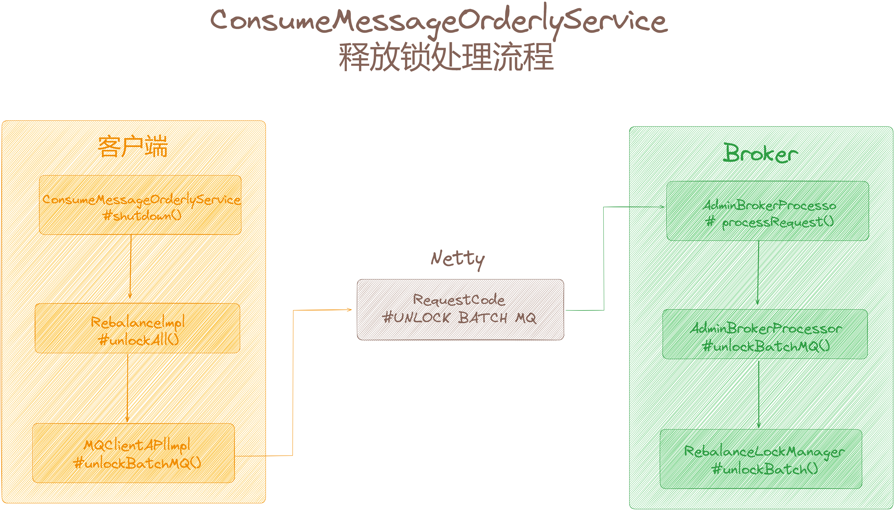

源码位置：[https://github.com/apache/rocketmq/blob/release-4.9.7/broker/src/main/java/org/apache/rocketmq/broker/client/rebalance/RebalanceLockManager.java](https://github.com/apache/rocketmq/blob/release-4.9.7/broker/src/main/java/org/apache/rocketmq/broker/client/rebalance/RebalanceLockManager.java)

Broker 端对消息队列的释放锁处理，最终是由 [RebalanceLockManager#unlockBatch](http://rebalancelockmanager/#unlockBatch) 来处理的，如下：

// 释放锁

public void unlockBatch(final String group,final Set<MessageQueue> mqs,final String clientId) {

try {

// 获取独占锁

this.lock.lockInterruptibly();

try {

// 获取指定消费者组的锁表

ConcurrentHashMap<MessageQueue,LockEntry> groupValue = this.mqLockTable.get(group);

// 若锁表存在

if (null != groupValue) {

// 遍历消息队列集合

for (MessageQueue mq :mqs) {

LockEntry lockEntry \= groupValue.get(mq);

// 若锁项存在

if (null != lockEntry) {

// 若锁项的客户端ID与当前客户端ID匹配，则移除该锁项

if (lockEntry.getClientId().equals(clientId)) {

groupValue.remove(mq);

// 记录日志，表示成功解锁

log.info("unlockBatch,Group:{} {} {}"group,mq,clientId);

} else {

// 记录日志，表示消息队列被其他客户端锁定

log.warn("unlockBatch,but mq locked by other client:{},Group:{} {} {}",

lockEntry.getClientId(),group,mq,clientId);

}

} else {

// 记录日志，表示消息队列未被锁定

log.warn("unlockBatch,but mq not locked,Group:{} {} {}",group,mq,clientId);

}

}

} else {

// 记录日志，表示指定消费者组不存在

log.warn("unlockBatch,group not exist,Group:{} {}",group,clientId);

}

} finally {

// 释放独占锁

this.lock.unlock();

}

} catch (InterruptedException e) {

// 记录异常日志

log.error("putMessage exception",e);

}

}

## **3.3.9.2 并发消息消费服务**

并发消息消费服务在启动时，会清除过期的消息。

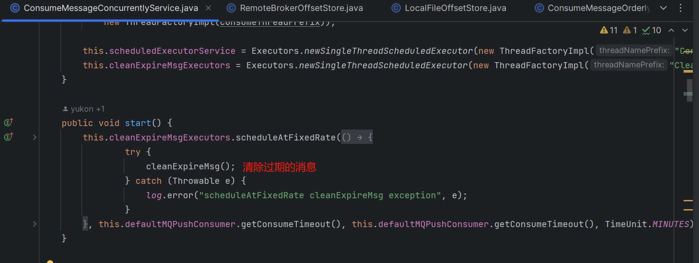

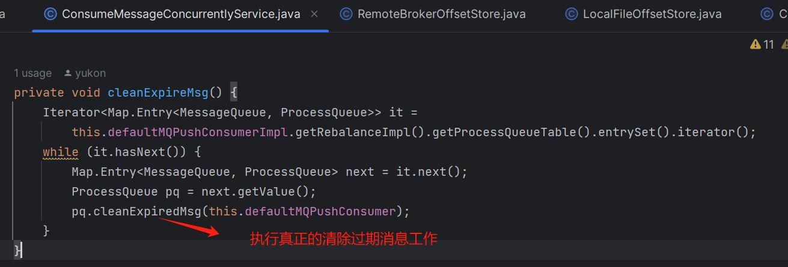

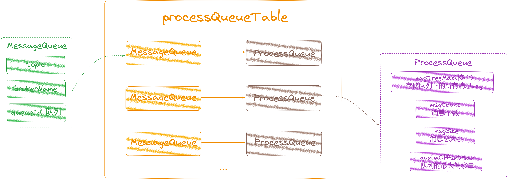

该数据结构是在负载均衡 [RebalanceImpl](http://rebalanceimpl%20/) 对象中， 是消费者端的核心数据结构， 存储的分配到该消费者的队列queue 的详细信息，其中包括队列中的消息数据。

根据消息的偏移量移除 [ProcessQueue#msgTreeMap](http://processqueue/#msgTreeMap) 中的 [MessageExt](http://messageext/)，通过读写锁 [ProcessQueue#lockTreeMap](http://processqueue/#lockTreeMap) 来保证清理消息时的线程安全，[ProcessQueue#removeMessage](http://processqueue/#removeMessage) 的核心代码如下：

public void cleanExpiredMsg(DefaultMQPushConsumer pushConsumer) {

// 检查消费者是否为顺序消费，如果是则直接返回

if (pushConsumer.getDefaultMQPushConsumerImpl().isConsumeOrderly()) {

return;

}

// 设定循环次数

int loop \= msgTreeMap.size() < 16 ? msgTreeMap.size() : 16;

for (int i \= 0; i < loop; i++) {

MessageExt msg \= null;

try {

// 获取读锁

this.treeMapLock.readLock().lockInterruptibly();

try {

// 如果消息树不为空

if (!msgTreeMap.isEmpty()) {

// 获取消息消费开始时间戳

String consumeStartTimeStamp \= MessageAccessor.getConsumeStartTimeStamp(msgTreeMap.firstEntry().getValue());

// 如果消息消费开始时间戳不为空且当前时间与消息消费开始时间的差值大于消费超时时间，则获取消息

if (StringUtils.isNotEmpty(consumeStartTimeStamp) && System.currentTimeMillis() - Long.parseLong(consumeStartTimeStamp) > pushConsumer.getConsumeTimeout() \* 60 \* 1000) {

msg = msgTreeMap.firstEntry().getValue();

} else {

break;

}

} else {

break;

}

} finally {

// 释放读锁

this.treeMapLock.readLock().unlock();

}

} catch (InterruptedException e) {

// 记录获取已过期消息异常日志

log.error("getExpiredMsg exception", e);

}

try {

// 发送已过期消息回查

pushConsumer.sendMessageBack(msg, 3);

// 记录日志，表示成功发送已过期消息回查

log.info("send expire msg back. topic={}, msgId={}, storeHost={}, queueId={}, queueOffset={}", msg.getTopic(), msg.getMsgId(), msg.getStoreHost(), msg.getQueueId(), msg.getQueueOffset());

try {

// 获取写锁

this.treeMapLock.writeLock().lockInterruptibly();

try {

// 如果消息树不为空且消息的队列偏移值等于消息树的第一个键值

if (!msgTreeMap.isEmpty() && msg.getQueueOffset() == msgTreeMap.firstKey()) {

try {

// 移除过期消息

removeMessage(Collections.singletonList(msg));

} catch (Exception e) {

// 记录移除过期消息异常日志

log.error("send expired msg exception", e);

}

}

} finally {

// 释放写锁

this.treeMapLock.writeLock().unlock();

}

} catch (InterruptedException e) {

// 记录获取已过期消息异常日志

log.error("getExpiredMsg exception", e);

}

} catch (Exception e) {

// 记录发送已过期消息回查异常日志

log.error("send expired msg exception", e);

}

}

}

public long removeMessage(final List<MessageExt> msgs) {

long result \= -1;

// 获取当前时间

final long now \= System.currentTimeMillis();

try {

// 获取写锁

this.treeMapLock.writeLock().lockInterruptibly();

// 更新最后消费时间为当前时间

this.lastConsumeTimestamp = now;

try {

// 如果消息树不为空

if (!msgTreeMap.isEmpty()) {

// 初始化result为队列偏移量最大值加1

result = this.queueOffsetMax + 1;

int removedCnt \= 0;

// 遍历消息列表

for (MessageExt msg :msgs) {

// 移除消息树中的消息

MessageExt prev \= msgTreeMap.remove(msg.getQueueOffset());

if (prev != null) {

// 如果消息被成功移除，计数器减一，减去消息体长度

removedCnt--;

msgSize.addAndGet(0 - msg.getBody().length);

}

}

// 更新消息数计数器

msgCount.addAndGet(removedCnt);

// 如果消息树不为空

if (!msgTreeMap.isEmpty()) {

// 获取消息树的第一个键作为result

result = msgTreeMap.firstKey();

}

}

} finally {

// 释放写锁

this.treeMapLock.writeLock().unlock();

}

} catch (Throwable t) {

// 记录异常日志

log.error("removeMessage exception",t);

}

return result;

}

在拉取到消息后，通过 [MessageListenerConcurrently](http://messagelistenerconcurrently/) 消息监听处理器的 [consumeMessage](http://consumemessage/) 方法来处理消息。

## **3.3.10 注册消费者**

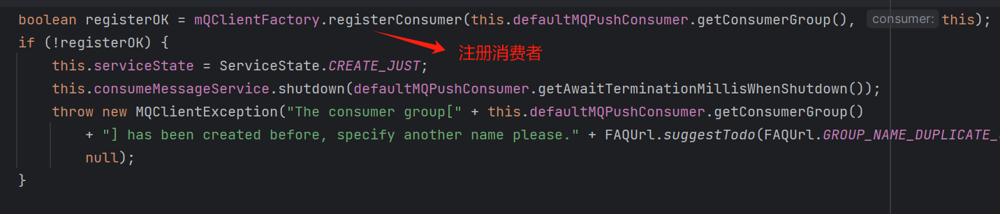

源码位置：[https://github.com/apache/rocketmq/blob/release-4.9.7/client/src/main/java/org/apache/rocketmq/client/impl/factory/MQClientInstance.java](https://github.com/apache/rocketmq/blob/release-4.9.7/client/src/main/java/org/apache/rocketmq/client/impl/factory/MQClientInstance.java)

将消费者注册到消费者缓存表 [MQClientInstance#consumerTable](http://mqclientinstance/#consumerTable%20) ，最终会调用[MQClientInstance#registerConsumer](http://mqclientinstance/#registerConsumer) 方法，如下：

public class MQClientInstance {

// 消费者缓存表

private final ConcurrentMap<String/\* group \*/, MQConsumerInner> consumerTable = new ConcurrentHashMap<String, MQConsumerInner>();

// 注册消费者

public synchronized boolean registerConsumer(final String group, final MQConsumerInner consumer) {

if (null == group || null == consumer) {

return false;

}

// 很简单，就是将消费者注册到消费者缓存表中

MQConsumerInner prev \= this.consumerTable.putIfAbsent(group, consumer);

if (prev != null) {

log.warn("the consumer group\[" + group + "\] exist already.");

return false;

}

return true;

}

}

## **3.3.11 启动 M****QClientInstance 实例**

public void start() throws MQClientException {

synchronized (this) {

// 根据当前状态进行处理

switch (this.serviceState) {

case CREATE\_JUST:

// 将状态设置为启动失败

this.serviceState = ServiceState.START\_FAILED;

// 如果未指定namesrv地址，则从namesrv获取地址

if (null == this.clientConfig.getNamesrvAddr()) {

this.mQClientAPIImpl.fetchNameServerAddr();

}

// 启动客户端 Netty 远程通讯服务

this.mQClientAPIImpl.start();

// 启动定时任务

this.startScheduledTask();

// 启动拉取消息服务

this.pullMessageService.start();

// 启动负载均衡服务

this.rebalanceService.start();

// 启动消息推送服务

this.defaultMQProducer.getDefaultMQProducerImpl().start(false);

// 记录日志，表示客户端工厂启动成功

log.info("the client factory \[{}\] start OK",this.clientId);

// 将状态设置为正在运行

this.serviceState = ServiceState.RUNNING;

break;

case START\_FAILED:

// 抛出客户端异常，表示客户端工厂已经创建且启动失败

throw new MQClientException("The Factory object\[" + this.getClientId() + "\] has been created before,and failed.",null);

default:

break;

}

}

}

启动步骤如下：

1.  获取 nameServer 的地址。
2.  启动客户端 Netty 远程通讯服务。
3.  启动定时任务。
4.  启动拉取消息服务。
5.  启动负载均衡服务。
6.  启动消息推送服务。
7.  更新服务状态。

我们来挨个看下这几个重要步骤。

## **3.3.11.1 启动客户端 Netty 远程通讯服务**

开启 Netty 通信的服务，最终调用 [NettyRemotingClient#start()](http://nettyremotingclient/#start\(\)) 启动 Netty 远程客户端服务。会在网络通信模块进行深度剖析，这里直接略过。

## **3.3.11.2 启动定时任务**

开启定时任务，[MQClientInsatnce#startScheduledTask](http://mqclientinsatnce/#startScheduledTask) 源码如下：

// 启动定时任务

private void startScheduledTask() {

if (null == this.clientConfig.getNamesrvAddr()) {

// 2 min 同步 NameServer 地址服务

this.scheduledExecutorService.scheduleAtFixedRate(new Runnable() {

@Override

public void run() {

try {

MQClientInstance.this.mQClientAPIImpl.fetchNameServerAddr();

} catch (Exception e) {

log.error("ScheduledTask fetchNameServerAddr exception", e);

}

}

}, 1000 \* 10, 1000 \* 60 \* 2, TimeUnit.MILLISECONDS);

}

// 30s 同步 NameServer 中的 Topic 路由信息

this.scheduledExecutorService.scheduleAtFixedRate(new Runnable() {

@Override

public void run() {

try {

MQClientInstance.this.updateTopicRouteInfoFromNameServer();

} catch (Exception e) {

log.error("ScheduledTask updateTopicRouteInfoFromNameServer exception", e);

}

}

}, 10, this.clientConfig.getPollNameServerInterval(), TimeUnit.MILLISECONDS);

// 30s 剔除下线的 broker、发送心跳检测到所有 broker

this.scheduledExecutorService.scheduleAtFixedRate(new Runnable() {

@Override

public void run() {

try {

// 剔除下线的 broker

MQClientInstance.this.cleanOfflineBroker();

// 发送心跳检测到所有 broker

MQClientInstance.this.sendHeartbeatToAllBrokerWithLock();

} catch (Exception e) {

log.error("ScheduledTask sendHeartbeatToAllBroker exception", e);

}

}

}, 1000, this.clientConfig.getHeartbeatBrokerInterval(), TimeUnit.MILLISECONDS);

// 5s 持久化消费偏移量进度

this.scheduledExecutorService.scheduleAtFixedRate(new Runnable() {

@Override

public void run() {

try {

// 持久化 consumer\_offset 可以放在本地文件，也可以推送到 broker

// 这里的持久化是将本地 Map 中 offset 发送到 broker 中，然后 broker 中的定时任务写到文件中，完成真正的持久化

MQClientInstance.this.persistAllConsumerOffset();

} catch (Exception e) {

log.error("ScheduledTask persistAllConsumerOffset exception", e);

}

}

}, 1000 \* 10, this.clientConfig.getPersistConsumerOffsetInterval(), TimeUnit.MILLISECONDS);

// 调整线程池异步任务

this.scheduledExecutorService.scheduleAtFixedRate(new Runnable() {

@Override

public void run() {

try {

MQClientInstance.this.adjustThreadPool();

} catch (Exception e) {

log.error("ScheduledTask adjustThreadPool exception", e);

}

}

}, 1, 1, TimeUnit.MINUTES);

}

## **3.3.11.3 启动拉取消息服务**

启动拉取消息服务 [PullMessageService](http://pullmessageservice/)，它是一个异步线程，拉取消息的核心方法 [PullMessageService#pullMessage](http://pullmessageservice/#pullMessage)。

源码位置：[https://github.com/apache/rocketmq/blob/release-4.9.7/client/src/main/java/org/apache/rocketmq/client/impl/consumer/PullMessageService.java](https://github.com/apache/rocketmq/blob/release-4.9.7/client/src/main/java/org/apache/rocketmq/client/impl/consumer/PullMessageService.java)

public void run() {

log.info(this.getServiceName() + " service started");

// Stopped 声明为 volatile，每执行一次业务逻辑，检测一下其运行状态，可以通过其他线程将Stopped 设置为 true，从而停止该线程

while (!this.isStopped()) {

try {

// 从 pullRequestQueue 中获取一个 PullRequest 消息拉取任务，如果pullRequestQueue为空，则线程将阻塞，直到有拉取任务被放入

PullRequest pullRequest \= this.pullRequestQueue.take();

// 调用 pullMessage 方法进行消息拉取

this.pullMessage(pullRequest);

} catch (InterruptedException ignored) {

} catch (Exception e) {

log.error("Pull Message Service Run Method exception", e);

}

}

log.info(this.getServiceName() + " service end");

}

它会监听阻塞队列 [pullRequestQueue](http://pullrequestqueue/)，当队列是空的时候会一直阻塞。如果不为空，则获取 [PullRequest](http://pullrequest/) 对象，去拉取消息。

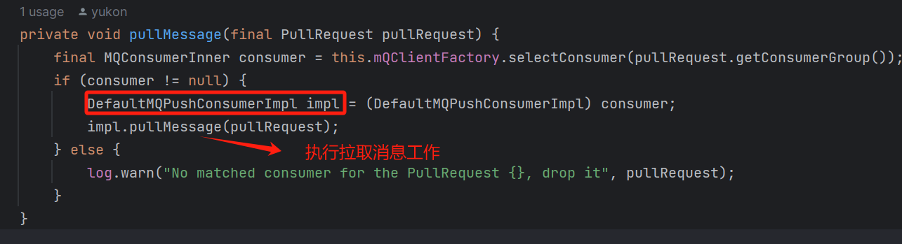

根据不同的发送方式，调用 [MQClientAPIImpl#pullMessage](http://mqclientapiimpl/#pullMessage) 拉取消息，如下：

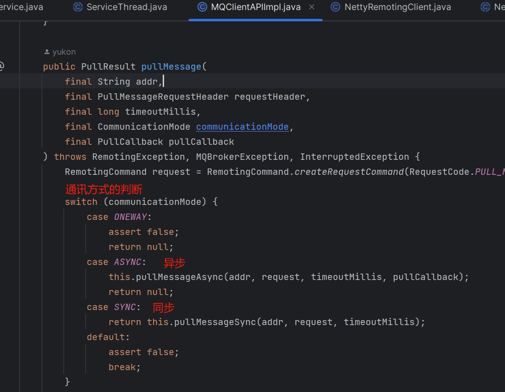

## **3.3.11.4 启动负载均衡服务**

启动负载均衡服务 [RebalanceService](http://rebalanceservice/)，它也是一个异步线程如下:

public class RebalanceService extends ServiceThread {

private static long waitInterval \=

Long.parseLong(System.getProperty(

"rocketmq.client.rebalance.waitInterval", "20000"));

public void run() {

log.info(this.getServiceName() + " service started");

while (!this.isStopped()) {

//等待20s执行一次 内部使用了 JUC 的 CountDownLatch, 使得这里启动后仍然是阻塞的

this.waitForRunning(waitInterval);

this.mqClientFactory.doRebalance();

}

log.info(this.getServiceName() + " service end");

}

....

}

这是重平衡的核心逻辑，但是在启动时，由于使用了 JUC 的 CountDownLatch 锁，使其不会立即重平衡，而是阻塞，什么时候出发重平衡呢？我们还是继续往后看。

  
源码位置：[https://github.com/apache/rocketmq/blob/release-4.9.7/client/src/main/java/org/apache/rocketmq/client/impl/consumer/RebalanceImpl.java](https://github.com/apache/rocketmq/blob/release-4.9.7/client/src/main/java/org/apache/rocketmq/client/impl/consumer/RebalanceImpl.java)

最终执行 [RebalanceImpl#doRebalance](http://rebalanceimpl/#doRebalance)

public void doRebalance(final boolean isOrder) {

// 获取订阅数据

Map<String, SubscriptionData> subTable = this.getSubscriptionInner();

if (subTable != null) {

for (final Map.Entry<String, SubscriptionData> entry : subTable.entrySet()) {

final String topic \= entry.getKey(); // 获取Topic

try {

this.rebalanceByTopic(topic, isOrder); // 负载均衡处理

} catch (Throwable e) {

if (!topic.startsWith(MixAll.RETRY\_GROUP\_TOPIC\_PREFIX)) {

log.warn("rebalanceByTopic Exception", e);

}

}

}

}

// 清除未订阅主题的消息队列

this.truncateMessageQueueNotMyTopic();

}

## **3.3.11.5 启动消息推送服务**

启动消息推送服务，用来将消息消费结果通知给 Broker，将生产者添加进生产者缓存表 [MQClientInstance#producerTable](http://mqclientinstance/#producerTable) 中。然后向所有的 Broker 发送心跳，移除超时请求，并执行回调方法[onException](http://onexception/)。

源码位置：[https://github.com/apache/rocketmq/blob/release-4.9.7/client/src/main/java/org/apache/rocketmq/client/impl/producer/DefaultMQProducerImpl.java](https://github.com/apache/rocketmq/blob/release-4.9.7/client/src/main/java/org/apache/rocketmq/client/impl/producer/DefaultMQProducerImpl.java)

[DefaultMQProducerImpl#start()](http://defaultmqproducerimpl/#start\(\)) 源码如下：

// 启动生产者

public void start(final boolean startFactory) throws MQClientException {

switch (this.serviceState) {

// 刚创建未启动

case CREATE\_JUST:

this.serviceState = ServiceState.START\_FAILED; // 启动失败

// 检查配置

this.checkConfig();

// 更改当前instanceName为进程ID

if (!this.defaultMQProducer.getProducerGroup().equals(

MixAll.CLIENT\_INNER\_PRODUCER\_GROUP)) {

this.defaultMQProducer.changeInstanceNameToPID();

}

// 获取MQ客户端实例

// 整个JVM中只存在一个MQClientManager实例，维护一个MQClientInstance缓存表

// ConcurrentMap<String/\* clientId \*/, MQClientInstance> factoryTable = new ConcurrentHashMap<String,MQClientInstance>();

// 同一个clientId只会创建一个MQClientInstance。

// MQClientInstance封装了RocketMQ网络处理API，是消息生产者和消息消费者与NameServer、Broker打交道的网络通道

this.mQClientFactory = MQClientManager.getInstance().getOrCreateMQClientInstance(this.defaultMQProducer, rpcHook);

// 注册Producer到MQClientInstance客户端实例

boolean registerOK \= mQClientFactory.registerProducer(this.defaultMQProducer.getProducerGroup(), this);

if (!registerOK) { // 未注册成功，抛出异常

this.serviceState = ServiceState.CREATE\_JUST;

throw new MQClientException("The producer group\[" + this.defaultMQProducer.getProducerGroup()

\+ "\] has been created before, specify another name please." + FAQUrl.suggestTodo(FAQUrl.GROUP\_NAME\_DUPLICATE\_URL),

null);

}

// 路由信心添加进缓存表中

this.topicPublishInfoTable.put(this.defaultMQProducer.getCreateTopicKey(), new TopicPublishInfo());

// 启动MQ客户端实例

if (startFactory) {

mQClientFactory.start(); // 最终调用MQClientInstance

}

log.info("the producer \[{}\] start OK. sendMessageWithVIPChannel={}", this.defaultMQProducer.getProducerGroup(),

this.defaultMQProducer.isSendMessageWithVIPChannel());

this.serviceState = ServiceState.RUNNING;

break;

case RUNNING:

case START\_FAILED:

case SHUTDOWN\_ALREADY:

throw new MQClientException("The producer service state not OK, maybe started once, "

\+ this.serviceState

\+ FAQUrl.suggestTodo(FAQUrl.CLIENT\_SERVICE\_NOT\_OK),

null);

default:

break;

}

// 向所有的broker发送心跳

this.mQClientFactory.sendHeartbeatToAllBrokerWithLock();

// 扫描并移除超时请求，并执行回调方法onException

RequestFutureHolder.getInstance().startScheduledTask(this);

}

## **3.3.12 更新路由信息**

源码位置：[https://github.com/apache/rocketmq/blob/release-4.9.7/client/src/main/java/org/apache/rocketmq/client/impl/factory/MQClientInstance.java](https://github.com/apache/rocketmq/blob/release-4.9.7/client/src/main/java/org/apache/rocketmq/client/impl/factory/MQClientInstance.java)

this.updateTopicSubscribeInfoWhenSubscriptionChanged();

// his.getSubscriptionInner() 查询该数据结构，是在负载均衡 RebalanceImpl 对象中，主要存储的是消费者订所订阅的 topic 与订阅信息的映射关系。 实际上就可以理解成与subscription 类似的作用。

protected final ConcurrentMap<String /\* topic \*/, SubscriptionData> subscriptionInner =

new ConcurrentHashMap<String, SubscriptionData>();

private void updateTopicSubscribeInfoWhenSubscriptionChanged() {

// 获取订阅数据的内部映射表

Map<String,SubscriptionData> subTable = this.getSubscriptionInner();

// 如果订阅数据表不为空

if (subTable != null) {

// 遍历订阅数据表

for (final Map.Entry<String,SubscriptionData> entry :subTable.entrySet()) {

// 获取订阅的主题

final String topic \= entry.getKey();

// 去 NameServer 更新主题的路由信息

this.mQClientFactory.updateTopicRouteInfoFromNameServer(topic);

}

}

}

// MQClientInstance.java

public boolean updateTopicRouteInfoFromNameServer(final String topic, boolean isDefault,

DefaultMQProducer defaultMQProducer) {

try {

if (this.lockNamesrv.tryLock(LOCK\_TIMEOUT\_MILLIS, TimeUnit.MILLISECONDS)) {

// 尝试获取锁，超时时间为LOCK\_TIMEOUT\_MILLIS毫秒

// 获取锁成功

try {

// 从NameServer获取主题路由信息

TopicRouteData topicRouteData;

if (isDefault && defaultMQProducer != null) {

// 如果是默认主题且默认生产者不为空，从NameServer获取默认主题路由信息

topicRouteData = this.mQClientAPIImpl.getDefaultTopicRouteInfoFromNameServer(defaultMQProducer.getCreateTopicKey(),

clientConfig.getMqClientApiTimeout());

// 更新默认主题队列数量信息

if (topicRouteData != null) {

for (QueueData data : topicRouteData.getQueueDatas()) {

int queueNums \= Math.min(defaultMQProducer.getDefaultTopicQueueNums(), data.getReadQueueNums());

data.setReadQueueNums(queueNums);

data.setWriteQueueNums(queueNums);

}

}

} else {

// 否则，从NameServer获取指定主题的路由信息

topicRouteData = this.mQClientAPIImpl.getTopicRouteInfoFromNameServer(topic, clientConfig.getMqClientApiTimeout());

}

// 检查路由信息是否发生变化

if (topicRouteData != null) {

// 获取旧的主题路由信息

TopicRouteData old \= this.topicRouteTable.get(topic);

// 检查路由信息是否变化

boolean changed \= topicRouteDataIsChange(old, topicRouteData);

// 如果未变化，再次检查是否需要更新主题路由信息

if (!changed) {

changed = this.isNeedUpdateTopicRouteInfo(topic);

} else {

log.info("the topic\[{}\] route info changed, old\[{}\] ,new\[{}\]", topic, old, topicRouteData);

}

if (changed) {

// 克隆主题路由信息

TopicRouteData cloneTopicRouteData \= topicRouteData.cloneTopicRouteData();

// 更新Broker地址表

for (BrokerData bd : topicRouteData.getBrokerDatas()) {

this.brokerAddrTable.put(bd.getBrokerName(), bd.getBrokerAddrs());

}

// 更新生产者信息

if (!producerTable.isEmpty()) {

// 将路由信息转换为生产者信息

TopicPublishInfo publishInfo \= topicRouteData2TopicPublishInfo(topic, topicRouteData);

publishInfo.setHaveTopicRouterInfo(true);

// 遍历生产者表，更新主题的生产者信息

Iterator<Entry<String, MQProducerInner>> it = this.producerTable.entrySet().iterator();

while (it.hasNext()) {

Entry<String, MQProducerInner> entry = it.next();

MQProducerInner impl \= entry.getValue();

if (impl != null) {

impl.updateTopicPublishInfo(topic, publishInfo);

}

}

}

// 更新消费者信息

if (!consumerTable.isEmpty()) {

// 将路由信息转换为订阅信息

Set<MessageQueue> subscribeInfo = topicRouteData2TopicSubscribeInfo(topic, topicRouteData);

// 遍历消费者表，更新主题的消费者信息

Iterator<Entry<String, MQConsumerInner>> it = this.consumerTable.entrySet().iterator();

while (it.hasNext()) {

Entry<String, MQConsumerInner> entry = it.next();

MQConsumerInner impl \= entry.getValue();

if (impl != null) {

// 这是重点操作

impl.updateTopicSubscribeInfo(topic, subscribeInfo);

}

}

}

// 记录日志，表示成功更新主题路由信息

log.info("topicRouteTable.put. Topic = {}, TopicRouteData\[{}\]", topic, cloneTopicRouteData);

// 将更新后的主题路由信息放入路由表中

this.topicRouteTable.put(topic, cloneTopicRouteData);

// 返回true，表示成功更新主题路由信息

return true;

}

} else {

// 如果从NameServer获取的路由信息为空，记录警告日志

log.warn("updateTopicRouteInfoFromNameServer, getTopicRouteInfoFromNameServer return null, Topic: {}. \[{}\]", topic, this.clientId);

}

} catch (MQClientException e) {

// 处理MQ客户端异常，记录警告日志

if (!topic.startsWith(MixAll.RETRY\_GROUP\_TOPIC\_PREFIX) && !topic.equals(TopicValidator.AUTO\_CREATE\_TOPIC\_KEY\_TOPIC)) {

log.warn("updateTopicRouteInfoFromNameServer Exception", e);

}

} catch (RemotingException e) {

// 处理远程调用异常，记录错误日志并抛出异常

log.error("updateTopicRouteInfoFromNameServer Exception", e);

throw new IllegalStateException(e);

} finally {

// 释放锁

this.lockNamesrv.unlock();

}

} else {

// 获取锁超时，记录警告日志

log.warn("updateTopicRouteInfoFromNameServer tryLock timeout {}ms. \[{}\]", LOCK\_TIMEOUT\_MILLIS, this.clientId);

}

} catch (InterruptedException e) {

// 处理中断异常，记录警告日志

log.warn("updateTopicRouteInfoFromNameServer Exception", e);

}

// 返回false，表示未能成功更新主题路由信息

return false;

}

// DefaultMQPushConsumerImpl.java

@Override

public void updateTopicSubscribeInfo(String topic,Set<MessageQueue> info) {

// 获得订阅信息表

Map<String,SubscriptionData> subTable = this.getSubscriptionInner();

// 如果订阅信息表不为空

if (subTable != null) {

// 如果订阅信息表中包含指定主题

if (subTable.containsKey(topic)) {

// 将主题的订阅信息添加到rebalanceImpl的topicSubscribeInfoTable中

this.rebalanceImpl.topicSubscribeInfoTable.put(topic,info);

}

}

}

这里重点更新的是 [topicSubscribeInfoTable](http://topicsubscribeinfotable/) 这个数据结构，如下图：

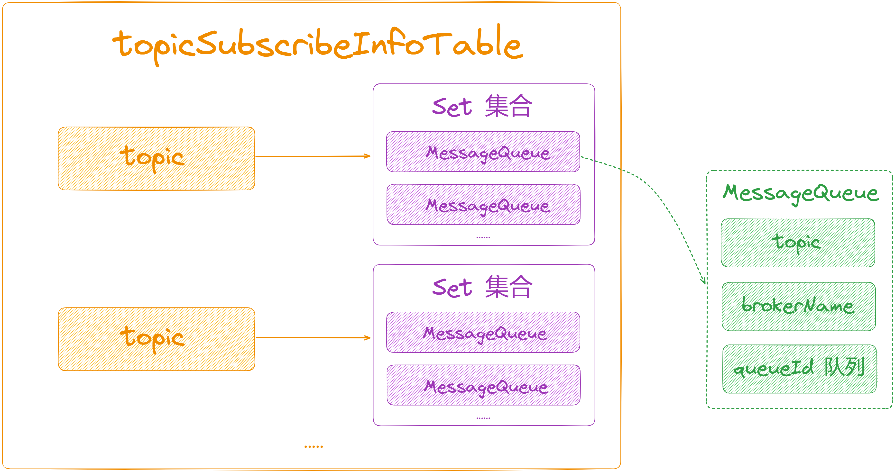

## **3.3.15 立即启动重平衡服务**

this.mQClientFactory.rebalanceImmediately();

前面在 **3.3.11.4** 的时候，启动了重平衡服务，但是因为 [CountDownLatch](http://countdownlatch%20/) 导致阻塞了，这里就是唤醒可以执行重平衡的逻辑了。

至此，整个消费者启动流程就剖析完了。

## **04 总结**

最后来张两图总结下全文。

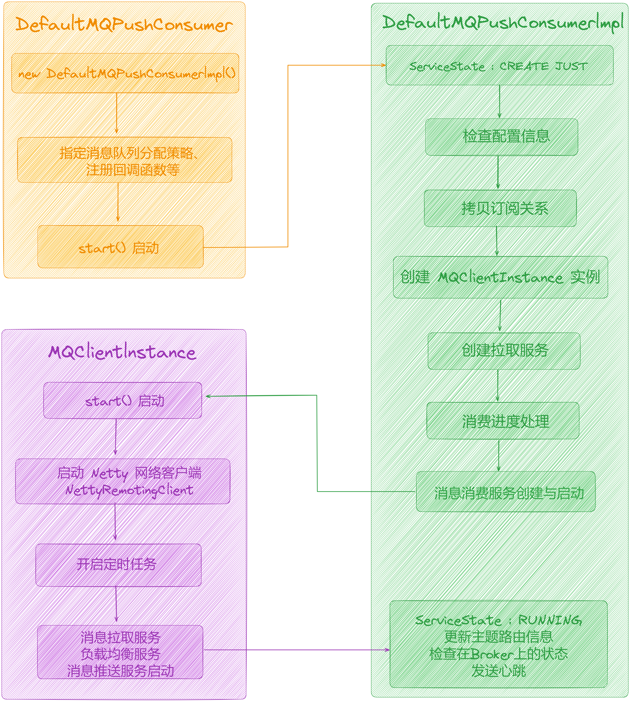

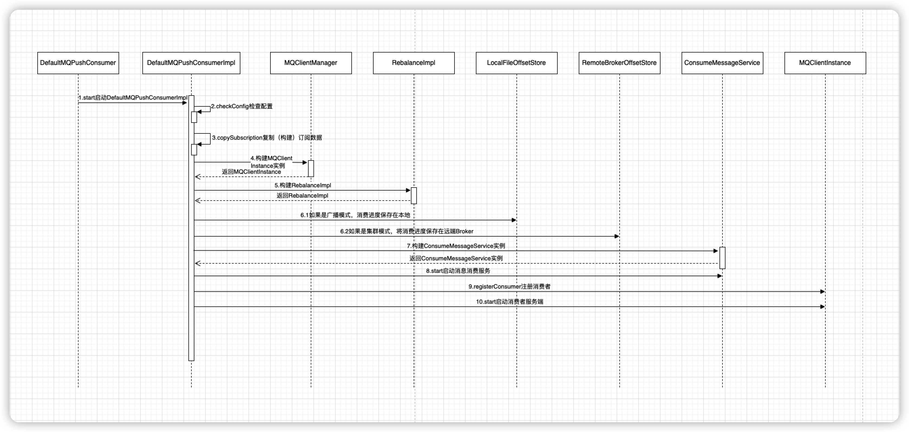