大家好，我是**华仔**, 又跟大家见面了。

从今天开始我将继续为大家奉上 RocketMQ 消费者源码剖析系列文章，正式开启「**RocketMQ 的 消费者源码之旅**」，这是第五篇，本篇我们将以「**RocketMQ 4.9.7**」版本为主，来剖析下 RocketMQ 源码之重平衡机制全流程剖析。

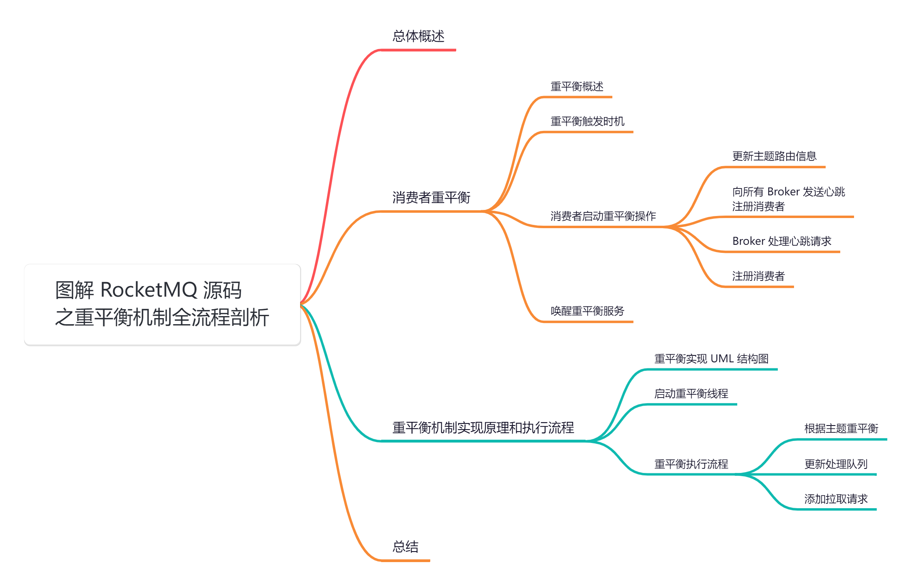

## **01 总体概述**

RocketMQ 在「**集群模式**」下，同一个消费组内，一个消息队列同一时间只能分配给组内的某一个消费者，也就是一条消息只能被组内的一个消费者进行消费，为了合理的对消息队列进行分配，于是就有了「**重平衡机制**」。

接下来我将带大家以「**集群模式**」下的消息推模式 [DefaultMQPushConsumerImpl](http://defaultmqpushconsumerimpl/) 为例，深度剖析下「**重平衡**」的过程。

## **02 消费者重平衡**

## **2.1 重平衡概述**

消费端的重平衡是指**将 Broker 端中多个队列按照某种算法分配给同一个消费者组中的不同消费者，重平衡是客户端开始消费的起点**。

RocketMQ 5.0 以前是按照「**队列粒度**」进行重平衡的，5.0以后提供了按「**消息粒度**」进行重平衡。

对于4.x/3.x的版本，包括 [DefaultPushConsumer](http://defaultpushconsumer/)、[DefaultPullConsumer](http://defaultpullconsumer/)、[LitePullConsumer](http://litepullconsumer/)等，默认且仅能使用「**队列粒度**」重平衡。

「**队列粒度**」重平衡策略中，同一消费者组内的多个消费者将按照队列粒度消费消息，每个队列只能被其中一个消费者消费。

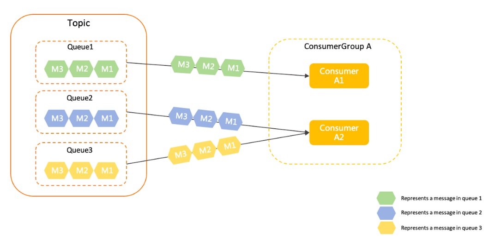

RocketMQ 重平衡的**核心设计理念**是：

1.  消费队列在同一时间只允许被同一消费组内的一个消费者消费
2.  一个消费者能同时消费多个消息队列

重平衡是每个**客户端独立进行计算的**，那么何时触发呢？

## **2.2 重平衡触发时机**

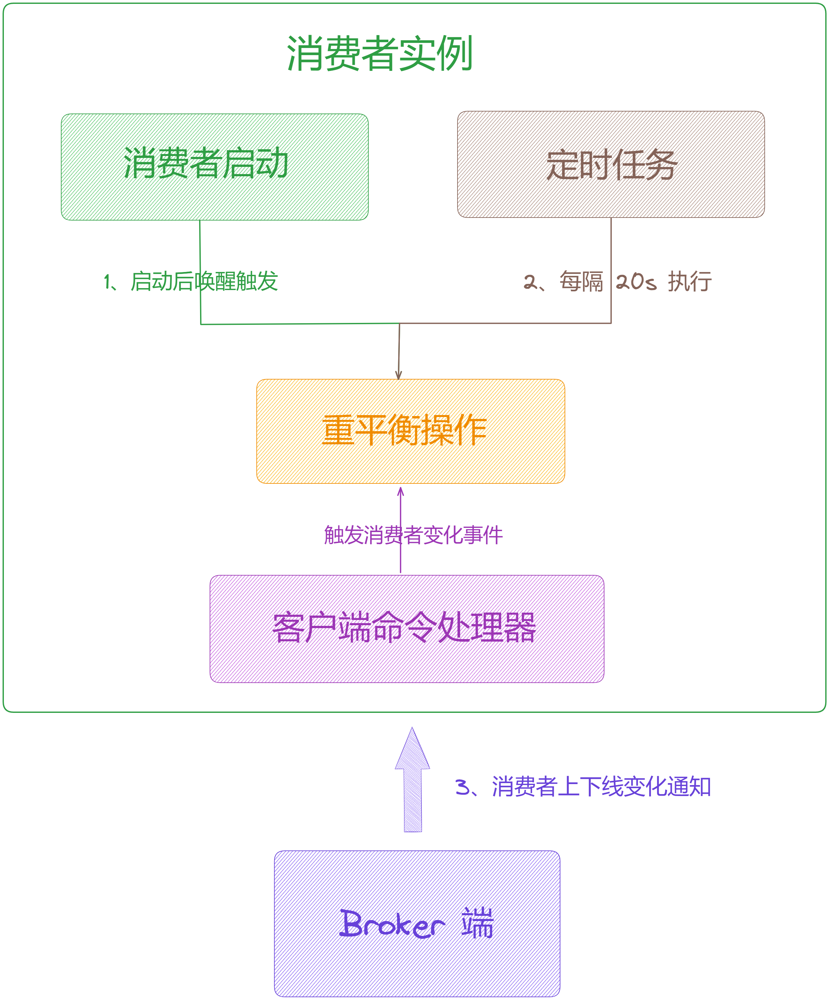

由上图可知，重平衡机制主要由以下3个触发时机：

1.  消费端启动时，立即进行重平衡。
2.  消费端定时任务每隔 20 秒触发重平衡。
3.  消费者上下线，Broker 端通知消费者触发重平衡。

接下来我们从第一个触发时机出发来深度剖析下其实现原理和执行流程。

## **2.3 消费者启动重平衡操作**

首先，消费者在启动时会做以下操作：

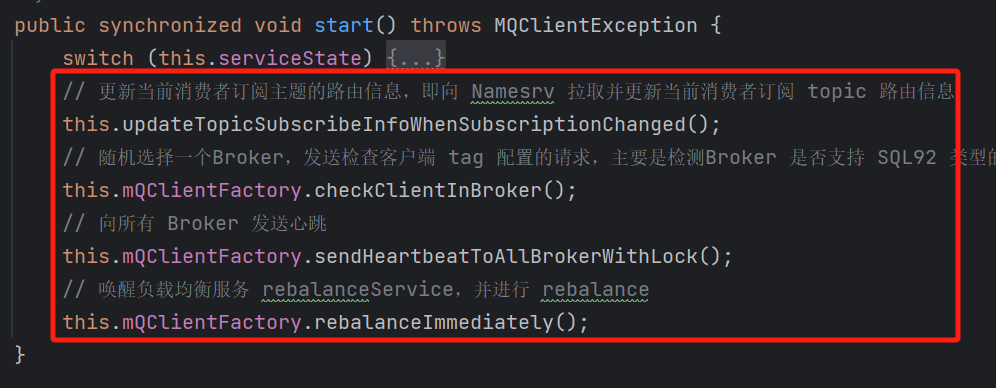

## **2.3.1 更新主题路由信息**

源码位置：[https://github.com/apache/rocketmq/blob/release-4.9.7/client/src/main/java/org/apache/rocketmq/client/impl/factory/MQClientInstance.java](https://github.com/apache/rocketmq/blob/release-4.9.7/client/src/main/java/org/apache/rocketmq/client/impl/factory/MQClientInstance.java)

为了保证消费者拿到的主题路由信息是最新的，在进行重平衡之前首先要更新主题的路由信息，如下：

// his.getSubscriptionInner() 查询该数据结构，是在负载均衡 RebalanceImpl 对象中，主要存储的是消费者订所订阅的 topic 与订阅信息的映射关系。 实际上就可以理解成与subscription 类似的作用。

protected final ConcurrentMap<String /\* topic \*/, SubscriptionData> subscriptionInner =

new ConcurrentHashMap<String, SubscriptionData>();

private void updateTopicSubscribeInfoWhenSubscriptionChanged() {

// 获取当前消费者订阅的主题信息

Map<String,SubscriptionData> subTable = this.getSubscriptionInner();

// 如果订阅数据表不为空

if (subTable != null) {

// 遍历订阅主题信息数据表

for (final Map.Entry<String,SubscriptionData> entry :subTable.entrySet()) {

// 获取订阅的主题

final String topic \= entry.getKey();

// 去 NameServer 更新主题的路由信息

this.mQClientFactory.updateTopicRouteInfoFromNameServer(topic);

}

}

}

// MQClientInstance.java

public boolean updateTopicRouteInfoFromNameServer(final String topic, boolean isDefault,

DefaultMQProducer defaultMQProducer) {

try {

if (this.lockNamesrv.tryLock(LOCK\_TIMEOUT\_MILLIS, TimeUnit.MILLISECONDS)) {

// 尝试获取锁，超时时间为LOCK\_TIMEOUT\_MILLIS毫秒

// 获取锁成功

try {

// 从NameServer获取主题路由信息

TopicRouteData topicRouteData;

if (isDefault && defaultMQProducer != null) {

// 如果是默认主题且默认生产者不为空，从NameServer获取默认主题路由信息

topicRouteData = this.mQClientAPIImpl.getDefaultTopicRouteInfoFromNameServer(defaultMQProducer.getCreateTopicKey(),

clientConfig.getMqClientApiTimeout());

// 更新默认主题队列数量信息

if (topicRouteData != null) {

for (QueueData data : topicRouteData.getQueueDatas()) {

int queueNums \= Math.min(defaultMQProducer.getDefaultTopicQueueNums(), data.getReadQueueNums());

data.setReadQueueNums(queueNums);

data.setWriteQueueNums(queueNums);

}

}

} else {

// 否则，从NameServer获取指定主题的路由信息

topicRouteData = this.mQClientAPIImpl.getTopicRouteInfoFromNameServer(topic, clientConfig.getMqClientApiTimeout());

}

// 检查路由信息是否发生变化

if (topicRouteData != null) {

// 获取旧的主题路由信息

TopicRouteData old \= this.topicRouteTable.get(topic);

// 检查路由信息是否变化

boolean changed \= topicRouteDataIsChange(old, topicRouteData);

// 如果未变化，再次检查是否需要更新主题路由信息

if (!changed) {

changed = this.isNeedUpdateTopicRouteInfo(topic);

} else {

log.info("the topic\[{}\] route info changed, old\[{}\] ,new\[{}\]", topic, old, topicRouteData);

}

if (changed) {

// 克隆主题路由信息

TopicRouteData cloneTopicRouteData \= topicRouteData.cloneTopicRouteData();

// 更新Broker地址表

for (BrokerData bd : topicRouteData.getBrokerDatas()) {

this.brokerAddrTable.put(bd.getBrokerName(), bd.getBrokerAddrs());

}

// 更新生产者信息

if (!producerTable.isEmpty()) {

// 将路由信息转换为生产者信息

TopicPublishInfo publishInfo \= topicRouteData2TopicPublishInfo(topic, topicRouteData);

publishInfo.setHaveTopicRouterInfo(true);

// 遍历生产者表，更新主题的生产者信息

Iterator<Entry<String, MQProducerInner>> it = this.producerTable.entrySet().iterator();

while (it.hasNext()) {

Entry<String, MQProducerInner> entry = it.next();

MQProducerInner impl \= entry.getValue();

if (impl != null) {

impl.updateTopicPublishInfo(topic, publishInfo);

}

}

}

// 更新消费者信息

if (!consumerTable.isEmpty()) {

// 将路由信息转换为订阅信息

Set<MessageQueue> subscribeInfo = topicRouteData2TopicSubscribeInfo(topic, topicRouteData);

// 遍历消费者表，更新主题的消费者信息

Iterator<Entry<String, MQConsumerInner>> it = this.consumerTable.entrySet().iterator();

while (it.hasNext()) {

Entry<String, MQConsumerInner> entry = it.next();

MQConsumerInner impl \= entry.getValue();

if (impl != null) {

// 这是重点操作

impl.updateTopicSubscribeInfo(topic, subscribeInfo);

}

}

}

// 记录日志，表示成功更新主题路由信息

log.info("topicRouteTable.put. Topic = {}, TopicRouteData\[{}\]", topic, cloneTopicRouteData);

// 将更新后的主题路由信息放入路由表中

this.topicRouteTable.put(topic, cloneTopicRouteData);

// 返回true，表示成功更新主题路由信息

return true;

}

} else {

// 如果从NameServer获取的路由信息为空，记录警告日志

log.warn("updateTopicRouteInfoFromNameServer, getTopicRouteInfoFromNameServer return null, Topic: {}. \[{}\]", topic, this.clientId);

}

} catch (MQClientException e) {

// 处理MQ客户端异常，记录警告日志

if (!topic.startsWith(MixAll.RETRY\_GROUP\_TOPIC\_PREFIX) && !topic.equals(TopicValidator.AUTO\_CREATE\_TOPIC\_KEY\_TOPIC)) {

log.warn("updateTopicRouteInfoFromNameServer Exception", e);

}

} catch (RemotingException e) {

// 处理远程调用异常，记录错误日志并抛出异常

log.error("updateTopicRouteInfoFromNameServer Exception", e);

throw new IllegalStateException(e);

} finally {

// 释放锁

this.lockNamesrv.unlock();

}

} else {

// 获取锁超时，记录警告日志

log.warn("updateTopicRouteInfoFromNameServer tryLock timeout {}ms. \[{}\]", LOCK\_TIMEOUT\_MILLIS, this.clientId);

}

} catch (InterruptedException e) {

// 处理中断异常，记录警告日志

log.warn("updateTopicRouteInfoFromNameServer Exception", e);

}

// 返回false，表示未能成功更新主题路由信息

return false;

}

// DefaultMQPushConsumerImpl.java

@Override

public void updateTopicSubscribeInfo(String topic,Set<MessageQueue> info) {

// 获得订阅信息表

Map<String,SubscriptionData> subTable = this.getSubscriptionInner();

// 如果订阅信息表不为空

if (subTable != null) {

// 如果订阅信息表中包含指定主题

if (subTable.containsKey(topic)) {

// 将主题的订阅信息添加到rebalanceImpl的topicSubscribeInfoTable中

this.rebalanceImpl.topicSubscribeInfoTable.put(topic,info);

}

}

}

首先获取了当前消费者订阅的所有主题信息，一个消费者可以订阅多个主题，然后进行遍历，向 [NameServer](http://nameserver/) 发送请求，更新每一个主题的路由信息，保证路由信息是最新的。

这里重点更新的是 [topicSubscribeInfoTable](http://topicsubscribeinfotable/) 这个数据结构，如下图：

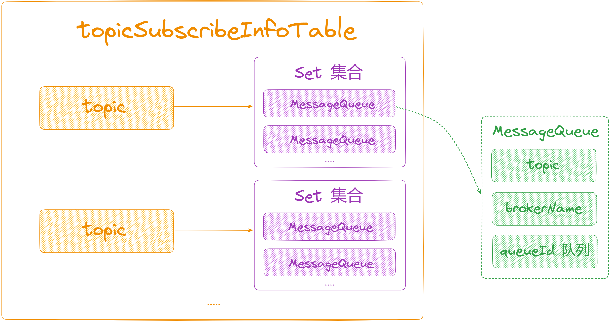

## **2.3.2 向所有 Broker 发送心跳注册消费者**

由于 Broker 需要感知消费者数量的增减，所以每个消费者在启动的时候都会向 Broker 发送心跳包，进行消费者注册。

心跳包主要包括「**消息消费分组名称**」、「**订阅关系集合**」、「**消息通信模式**」、「**客户端实例编号**」等信息。

源码位置：[https://github.com/apache/rocketmq/blob/release-4.9.7/client/src/main/java/org/apache/rocketmq/client/impl/factory/MQClientInstance.java](https://github.com/apache/rocketmq/blob/release-4.9.7/client/src/main/java/org/apache/rocketmq/client/impl/factory/MQClientInstance.java)

public class MQClientInstance {

public void sendHeartbeatToAllBrokerWithLock() {

// 尝试加锁

if (this.lockHeartbeat.tryLock()) {

try {

// 调用 sendHeartbeatToAllBroker 向 Broker 发送心跳

this.sendHeartbeatToAllBroker();

} catch (final Exception e) {

log.error("sendHeartbeatToAllBroker exception", e);

} finally {

// 释放锁

this.lockHeartbeat.unlock();

}

} else {

log.warn("lock heartBeat, but failed. \[{}\]", this.clientId);

}

}

}

可以看到在加锁的过程中调用了 [sendHeartbeatToAllBroker](http://sendheartbeattoallbroker/) 方法进行心跳发送，在该方法中可以看到从[brokerAddrTable](http://brokeraddrtable/) 中获取了所有的 Broker 进行遍历「**主从模式下也会向从节点发送心跳请求注册**」，调用[MQClientAPIImpl#sendHearbeat](http://mqclientapiimpl/#sendHearbeat) 方法向每一个 Broker 发送心跳请求进行注册，如下：

// Broker路由表

private final ConcurrentMap<String/\* Broker Name \*/, HashMap<Long/\* brokerId \*/, String/\* address \*/\>> brokerAddrTable = new ConcurrentHashMap<String, HashMap<Long, String>>();

// 发送心跳

private void sendHeartbeatToAllBroker() {

....

if (this.brokerAddrTable.isEmpty()) {

return;

}

// 获取所有的 Broker 进行遍历， key为 Broker Name， value为同一个 name 下的所有 Broker 实例（主从模式下 BrokerName 一致）

for (Entry<String, HashMap<Long, String>> brokerClusterInfo : this.brokerAddrTable.entrySet()) {

// 获取 brokerName

String brokerName \= brokerClusterInfo.getKey();

// 获取同一个 BrokerName 下的所有 Broker 实例

HashMap<Long, String> oneTable = brokerClusterInfo.getValue();

if (oneTable == null) {

continue;

}

// 遍历所有的实例

for (Entry<Long, String> singleBrokerInstance : oneTable.entrySet()) {

Long id \= singleBrokerInstance.getKey();

String addr \= singleBrokerInstance.getValue();

if (addr == null) { // 如果地址为空跳过

continue;

}

if (consumerEmpty && MixAll.MASTER\_ID != id) { // 如果消费者心跳信息为空且非主节点

continue;

}

try { // 如果地址不为空

// 发送心跳

int version \= this.mQClientAPIImpl.sendHeartbeat(addr, heartbeatData, clientConfig.getMqClientApiTimeout());

....

} catch (Exception e) {

....

}

}

}

}

可以看到这里遍历所有的 Broker 实例然后调用 [mQClientAPIImpl#sendHeartbeat](http://mqclientapiimpl/#sendHeartbeat) 发送心跳，在该方法中可以看到构建了 [HEART\_BEAT](http://heart_beat/) 请求，然后向 Broker 发送，如下：

源码位置：[https://github.com/apache/rocketmq/blob/release-4.9.7/client/src/main/java/org/apache/rocketmq/client/impl/](https://github.com/apache/rocketmq/blob/release-4.9.7/client/src/main/java/org/apache/rocketmq/client/impl/MQClientAPIImpl.java)[MQClientAPIImpl](https://github.com/apache/rocketmq/blob/release-4.9.7/client/src/main/java/org/apache/rocketmq/client/impl/MQClientAPIImpl.java)[.java](https://github.com/apache/rocketmq/blob/release-4.9.7/client/src/main/java/org/apache/rocketmq/client/impl/MQClientAPIImpl.java)

public class MQClientAPIImpl implements NameServerUpdateCallback {

public int sendHeartbeat(

final String addr,

final HeartbeatData heartbeatData,

final long timeoutMillis

) throws RemotingException, MQBrokerException, InterruptedException {

// 创建HEART\_BEAT请求

RemotingCommand request \= RemotingCommand.createRequestCommand(RequestCode.HEART\_BEAT, null);

request.setLanguage(clientConfig.getLanguage());

request.setBody(heartbeatData.encode());

// 发送请求

RemotingCommand response \= this.remotingClient.invokeSync(addr, request, timeoutMillis);

....

}

}

## **2.3.3 Broker 处理心跳请求**

源码位置：[https://github.com/apache/rocketmq/blob/release-4.9.7/](https://github.com/apache/rocketmq/blob/release-4.9.7/broker/src/main/java/org/apache/rocketmq/broker/BrokerController.java)[broker](https://github.com/apache/rocketmq/blob/release-4.9.7/broker/src/main/java/org/apache/rocketmq/broker/BrokerController.java)[/src/main/java/org/apache/rocketmq/](https://github.com/apache/rocketmq/blob/release-4.9.7/broker/src/main/java/org/apache/rocketmq/broker/BrokerController.java)[broker](https://github.com/apache/rocketmq/blob/release-4.9.7/broker/src/main/java/org/apache/rocketmq/broker/BrokerController.java)[/](https://github.com/apache/rocketmq/blob/release-4.9.7/broker/src/main/java/org/apache/rocketmq/broker/BrokerController.java)[BrokerController](https://github.com/apache/rocketmq/blob/release-4.9.7/broker/src/main/java/org/apache/rocketmq/broker/BrokerController.java)[.java](https://github.com/apache/rocketmq/blob/release-4.9.7/broker/src/main/java/org/apache/rocketmq/broker/BrokerController.java)

[https://github.com/apache/rocketmq/blob/release-4.9.7/](https://github.com/apache/rocketmq/blob/release-4.9.7/broker/src/main/java/org/apache/rocketmq/broker/processor/ClientManageProcessor.java)[broker](https://github.com/apache/rocketmq/blob/release-4.9.7/broker/src/main/java/org/apache/rocketmq/broker/processor/ClientManageProcessor.java)[/src/main/java/org/apache/rocketmq/](https://github.com/apache/rocketmq/blob/release-4.9.7/broker/src/main/java/org/apache/rocketmq/broker/processor/ClientManageProcessor.java)[broker](https://github.com/apache/rocketmq/blob/release-4.9.7/broker/src/main/java/org/apache/rocketmq/broker/processor/ClientManageProcessor.java)[/](https://github.com/apache/rocketmq/blob/release-4.9.7/broker/src/main/java/org/apache/rocketmq/broker/processor/ClientManageProcessor.java)[processor/ClientManageProcessor](https://github.com/apache/rocketmq/blob/release-4.9.7/broker/src/main/java/org/apache/rocketmq/broker/processor/ClientManageProcessor.java)[.java](https://github.com/apache/rocketmq/blob/release-4.9.7/broker/src/main/java/org/apache/rocketmq/broker/processor/ClientManageProcessor.java)

Broker 在启动时注册了 [HEART\_BEAT](http://heart_beat/) 请求的处理器，可以看到请求处理器是 [ClientManageProcessor](http://clientmanageprocessor/)，如下：

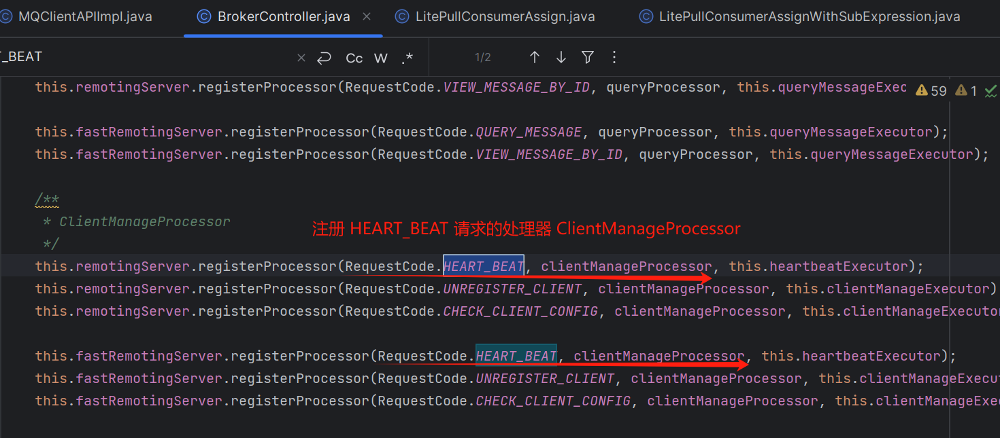

看下 [ClientManageProcessor#processRequest](http://%20clientmanageprocessor/#processRequest) 方法，如果请求是 [HEART\_BEAT](http://heart_beat/) 类型会调用 [heartBeat](http://heartbeat/) 方法进行心跳处理。

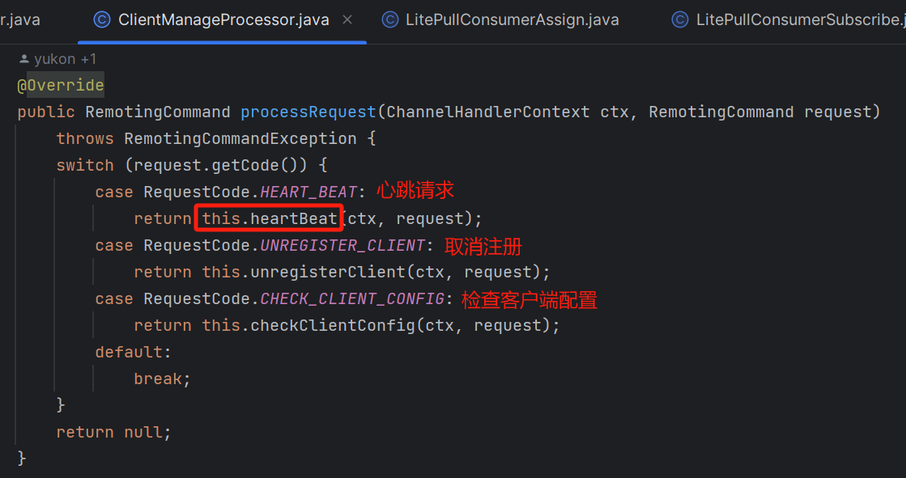

进入到 [heartBeat](http://heartbeat/) 方法，可以看到调用了 [ConsumerManager#registerConsumer](http://consumermanager/#registerConsumer) 注册消费者。

也就是说当 Broker 端在收到消费者的心跳消息后，会将它维护在 「**ConsumerManager**」的本地缓存变量 「**consumerTable**」中，同时并将封装后的「**客户端网络通道信息**」保存在本地缓存变量 「**channelInfoTable**」中，为之后做消费端的重平衡提供可以依据的元数据信息，如下：

// 本地缓存变量 consumerTable 用来存放消费者心跳消息

private final ConcurrentMap<String, ConsumerGroupInfo> consumerTable =

new ConcurrentHashMap<>(1024);

public class ClientManageProcessor implements NettyRequestProcessor {

public RemotingCommand heartBeat(ChannelHandlerContext ctx, RemotingCommand request) {

RemotingCommand response \= RemotingCommand.createResponseCommand(null);

HeartbeatData heartbeatData \= HeartbeatData.decode(request.getBody(), HeartbeatData.class);

....

// 遍历消费者心跳信息

for (ConsumerData consumerData : heartbeatData.getConsumerDataSet()) {

....

// 注册Consumer

boolean changed \= this.brokerController.getConsumerManager().registerConsumer(

consumerData.getGroupName(),

clientChannelInfo,

consumerData.getConsumeType(),

consumerData.getMessageModel(),

consumerData.getConsumeFromWhere(),

consumerData.getSubscriptionDataSet(),

isNotifyConsumerIdsChangedEnable

);

....

}

....

return response;

}

}

## **2.3.4 注册消费者**

源码位置：[https://github.com/apache/rocketmq/blob/release-4.9.7/](https://github.com/apache/rocketmq/blob/release-4.9.7/broker/src/main/java/org/apache/rocketmq/broker/client/ConsumerManager.java)[broker](https://github.com/apache/rocketmq/blob/release-4.9.7/broker/src/main/java/org/apache/rocketmq/broker/client/ConsumerManager.java)[/src/main/java/org/apache/rocketmq/](https://github.com/apache/rocketmq/blob/release-4.9.7/broker/src/main/java/org/apache/rocketmq/broker/client/ConsumerManager.java)[broker](https://github.com/apache/rocketmq/blob/release-4.9.7/broker/src/main/java/org/apache/rocketmq/broker/client/ConsumerManager.java)[/](https://github.com/apache/rocketmq/blob/release-4.9.7/broker/src/main/java/org/apache/rocketmq/broker/client/ConsumerManager.java)[client/ConsumerManager](https://github.com/apache/rocketmq/blob/release-4.9.7/broker/src/main/java/org/apache/rocketmq/broker/client/ConsumerManager.java)[.java](https://github.com/apache/rocketmq/blob/release-4.9.7/broker/src/main/java/org/apache/rocketmq/broker/client/ConsumerManager.java)

最后来看下注册消费者处理逻辑，如下：

// 注册消费者并更新消费者组信息。

public boolean registerConsumer(final String group,final ClientChannelInfo clientChannelInfo,

ConsumeType consumeType,MessageModel messageModel,ConsumeFromWhere consumeFromWhere,

final Set<SubscriptionData> subList,boolean isNotifyConsumerIdsChangedEnable,boolean updateSubscription) {

long start \= System.currentTimeMillis();// 记录方法开始时间

// 根据消费者组名称获取消费者组信息

ConsumerGroupInfo consumerGroupInfo \= this.consumerTable.get(group);

// 如果为空新增 ConsumerGroupInfo 对象

if (null == consumerGroupInfo) {

// 调用消费者ID变更监听器，通知客户端注册事件，更新消费者组信息

callConsumerIdsChangeListener(ConsumerGroupEvent.CLIENT\_REGISTER,group,clientChannelInfo,

subList.stream().map(SubscriptionData::getTopic).collect(Collectors.toSet()));

// 新建ConsumerGroupInfo对象，并将其放入consumerTable中

ConsumerGroupInfo tmp \= new ConsumerGroupInfo(group,consumeType,messageModel,consumeFromWhere);

ConsumerGroupInfo prev \= this.consumerTable.putIfAbsent(group,tmp);

consumerGroupInfo = prev != null ?prev :tmp;

}

// 更新消费者channel信息，返回是否有变更标识

boolean r1 \=

consumerGroupInfo.updateChannel(clientChannelInfo,consumeType,messageModel,

consumeFromWhere);

boolean r2 \= false;

if (updateSubscription) {

// 更新订阅信息，返回是否有变更标识

r2 = consumerGroupInfo.updateSubscription(subList);

}

// 如果r1或r2有变更，且isNotifyConsumerIdsChangedEnable为true，调用消费者ID变更监听器

if (r1 || r2) {

if (isNotifyConsumerIdsChangedEnable) {

callConsumerIdsChangeListener(ConsumerGroupEvent.CHANGE,

group,consumerGroupInfo.getAllChannel());

}

}

if (null != this.brokerStatsManager) {

// 记录消费者注册时间

this.brokerStatsManager.incConsumerRegisterTime((int) (System.currentTimeMillis() - start));

}

// 调用消费者ID变更监听器，通知客户端注册事件

callConsumerIdsChangeListener(ConsumerGroupEvent.REGISTER,group,subList,clientChannelInfo);

// 返回r1或r2是否有变更

return r1 || r2;

}

来看下变更通知客户端注册事件，在该方法中可以看到如果是 [REGISTER](http://register/) 事件，会通过[ConsumerFilterManager#register](http://consumerfiltermanager/#register) 方法进行注册，关于注册的详细过程这里先不展开剖析，后面有机会单独梳理。

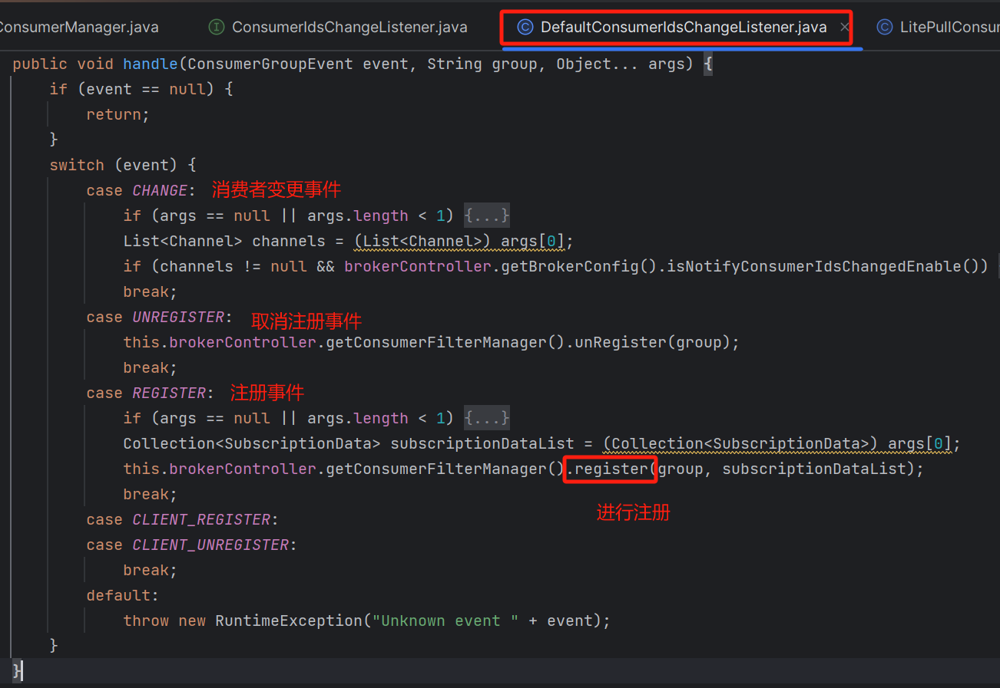

## **2.4 唤醒重平衡服务**

经过以上操作之后，会调用 [MQClientInstance#rebalanceImmediately](http://mqclientinstance/#rebalanceImmediately) 唤醒重平衡服务进行一次重平衡，为消费者分配消息队列。

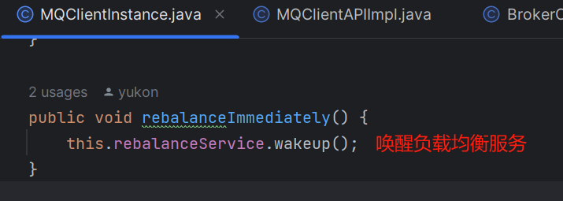

## **03 重平衡机制实现原理和执行流程**

重平衡服务会根据消费模式为「**广播模式**」还是「**集群模式**」做不同的逻辑处理，接下来主要以「**集群模式**」来剖析。

在 RocketMQ 中默认一个主题下有「**4**」个消费队列，集群模式下同一消费组内要求每个消费队列在同一时刻只能被一个消费者消费。

那么集群模式下多个消费者是如何负载主题的多个消费队列呢？并且如果有新的消费者加入时，消费队列又会如何重新分布呢？

**RocketMQ 消费者端每隔 20s 周期性执行一次消费队列重平衡，每次进行重平衡时会从 Broker 实时查询当前消费者组内所有消费者，并且对消费队列、消费者列表进行排序，这样新加入的消费者就会在队列重平衡时分配到消费队列从而可以消费消息**。

## **3.1 重平衡实现 UML 结构图**

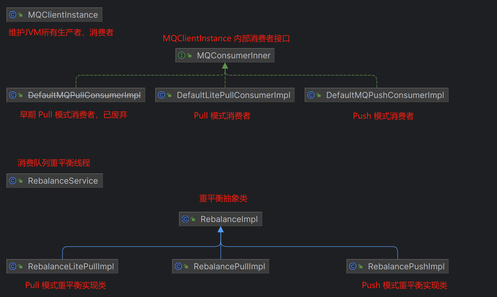

## **3.2 启动重平衡线程**

当消费者启动时，当前消费者添加到 [MQClientInstance#consumerTable](http://mqclientinstance/#consumerTable) 属性中并启动 [MQClientInstance](http://mqclientinstance/) 实例。启动 [MQClientInstance](http://mqclientinstance/) 实例时，会启动 [RebalanceService](http://rebalanceservice/) 消费队列重平衡服务线程。

下图是该线程 run() 调用链路：

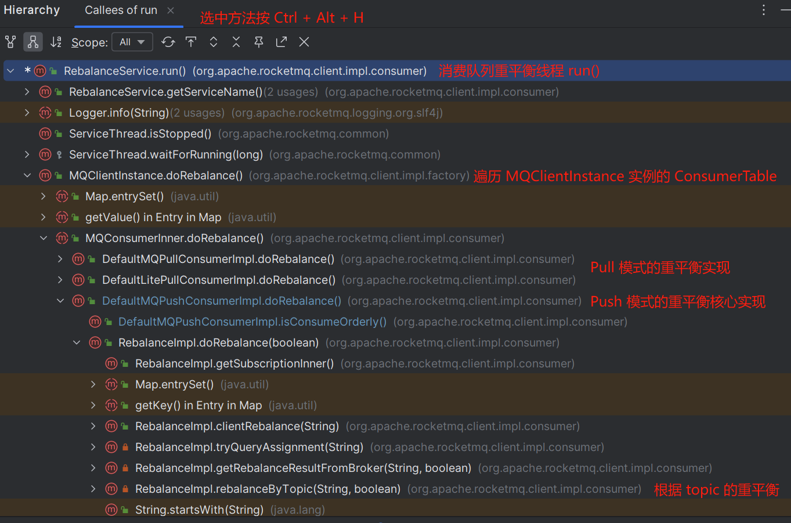

可以看到 run() 方法会每隔 20s 周期性执行重平衡服务。[\-Drocketmq.client.rebalance. waitlnterval](http://-drocketmq.client.rebalance.%20waitlnterval/) 参数修改执行周期，默认 20s。

public class RebalanceService extends ServiceThread {

// 执行周期 默认 20s

private static long waitInterval \=

Long.parseLong(System.getProperty(

"rocketmq.client.rebalance.waitInterval", "20000"));

private final MQClientInstance mqClientFactory; // 引用了MQClientInstance

// 构造函数

public RebalanceService(MQClientInstance mqClientFactory) {

// 设置MQClientInstance

this.mqClientFactory = mqClientFactory;

}

@Override

public void run() {

log.info(this.getServiceName() + " service started");

while (!this.isStopped()) {

// 线程等待 20s 执行

this.waitForRunning(waitInterval);

// topic 下消费队列的重平衡

this.mqClientFactory.doRebalance();

}

log.info(this.getServiceName() + " service end");

}

}

## **3.3 重平衡执行流程**

重平衡服务被唤醒后，会调用 [MQClientInstance#doRebalance](http://mqclientinstance/#doRebalance) 函数进行处理，里面会对每个消费者组执行重平衡操作。 也就是说「**一个重平衡服务是对一个消费者组负责的**」，那么我们可以想到对「**不同的**」消费者组使用不同「**重平衡**」策略。

[consumerTable](http://consumertable%20/) 这个 map 对象里存储了消费者组对应的的消费者实例。

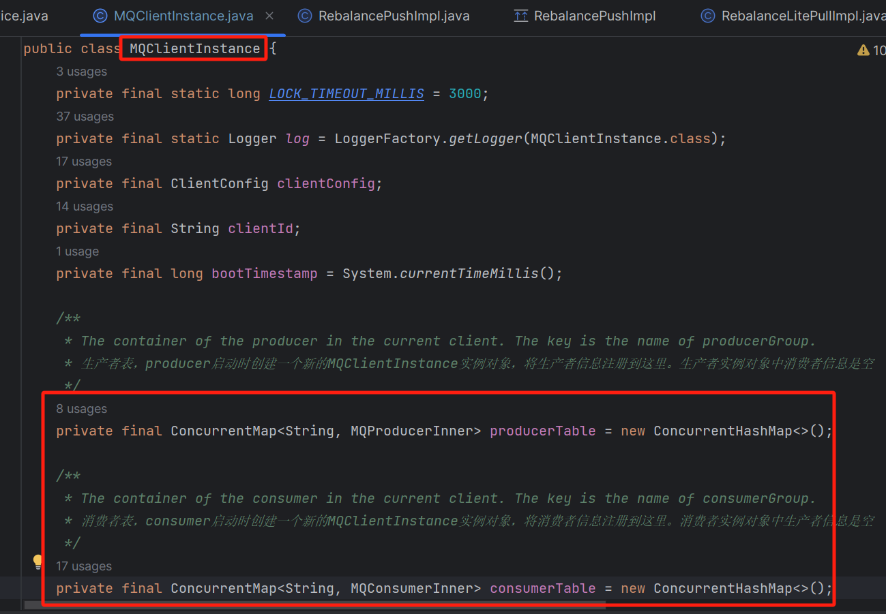

// 消费队列重平衡

public void doRebalance() {

// 每个消费者组都有重平衡

for (Map.Entry<String, MQConsumerInner> entry : this.consumerTable.entrySet()) {

// 获取消费者

MQConsumerInner impl \= entry.getValue();

if (impl != null) {

try {

// 消费者重平衡

impl.doRebalance();

} catch (Throwable e) {

log.error("doRebalance exception", e);

}

}

}

}

其处理逻辑如下：

1.  从 [consumerTable](http://consumertable/) 中获取注册的消费者组信息，前面得知 [consumerTable](http://consumertable/) 中存放了注册的消费者信息，Key 为组名称，value 为消费者。
2.  对 [consumerTable](http://consumertable/) 进行遍历，调用消费者的 [doRebalance](http://dorebalance/) 方法对每一个消费者进行负载均衡，前面得知消费者是[DefaultMQPushConsumerImpl](http://defaultmqpushconsumerimpl/) 类型的。

由于每个消费者组可能会消费很多 topic，每个 topic 都有自己的不同队列，所以最终是按 topic 的维度进行重平衡的。

[org.apache.rocketmq.client.impl.consumer.DefaultMQPushConsumerImpl#doRebalance](http://org.apache.rocketmq.client.impl.consumer.defaultmqpushconsumerimpl/#doRebalance) 是 Push 模式的重平衡的入口方法，其调用链如下。

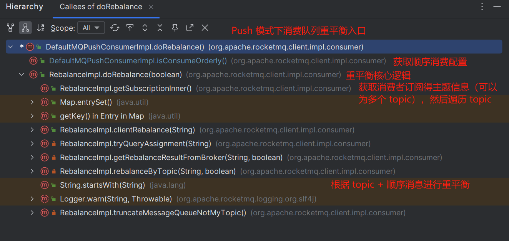

源码位置：[https://github.com/apache/rocketmq/blob/release-4.9.7/client/src/main/java/org/apache/rocketmq/client/impl\\consumer\\DefaultMQPushConsumerImpl.java](https://github.com/apache/rocketmq/blob/release-4.9.7/client/src/main/java/org/apache/rocketmq/client/impl%5Cconsumer%5CDefaultMQPushConsumerImpl.java)

public class DefaultMQPushConsumerImpl implements MQConsumerInner {

@Override

public void doRebalance() {

if (!this.pause) {

// 这里又调用了 rebalanceImpl#doRebalance 进行重平衡

this.rebalanceImpl.doRebalance(this.isConsumeOrderly());

}

}

}

可以看到每个消费者 [DefaultMQPushConsumerImpl](http://defaultmqpushconsumerimpl/) 拥有一个 [RebalanceImpl](http://rebalanceimpl/) 对象，其中[RebalanceImpl#doRebalance](http://rebalanceimpl/#doRebalance) 方法是对消费者的所有订阅主题进行重平衡，即消费者的所有订阅主题重新分配一个或多个消费队列来进行消费。

源码位置：[https://github.com/apache/rocketmq/blob/release-4.9.7/client/src/main/java/org/apache/rocketmq/client/impl\\consumer\\RebalanceImpl.java](https://github.com/apache/rocketmq/blob/release-4.9.7/client/src/main/java/org/apache/rocketmq/client/impl%5Cconsumer%5CRebalanceImpl.java)

源码如下：

/\*\*

\* 对消费者订阅的每个topic进行消费队列重平衡

\* {@link RebalanceImpl#rebalanceByTopic(String, boolean)}

\* @param isOrder 是否顺序消息

\* @return true所有topic重平衡成功

\*/

public boolean doRebalance(final boolean isOrder) {

boolean balanced \= true;

// 获取消费者订阅的主题信息，注意：消费者可以订阅多个主题

Map<String, SubscriptionData> subTable = this.getSubscriptionInner();

if (subTable != null) {

// 遍历消费者的每个topic

for (final Map.Entry<String, SubscriptionData> entry : subTable.entrySet()) {

final String topic \= entry.getKey();

try {

if (!clientRebalance(topic) && tryQueryAssignment(topic)) {

balanced = this.getRebalanceResultFromBroker(topic, isOrder);

} else {

// 消费者订阅的 topic 进行消费队列重平衡

balanced = this.rebalanceByTopic(topic, isOrder);

}

} catch (Throwable e) {

if (!topic.startsWith(MixAll.RETRY\_GROUP\_TOPIC\_PREFIX)) {

log.warn("rebalance Exception", e);

balanced = false;

}

}

}

}

this.truncateMessageQueueNotMyTopic();

return balanced;

}

核心逻辑如下：

1.  获取订阅的主题信息集合，可以看到将订阅的主题信息封装成了 [SubscriptionData](http://subscriptiondata/) 并加入到了 [RebalanceImpl](http://rebalanceimpl/) 中。
2.  对获取到的订阅主题信息集合进行遍历，调用 [rebalanceByTopic](http://rebalancebytopic/) 对每一个主题进行重平衡。

接着来看下根据 topic 进行消费队列重平衡操作。

## **3.3.1 根据主题重平衡**

// 主题订阅关系集合

protected final ConcurrentMap<String/\* topic \*/, Set<MessageQueue>> topicSubscribeInfoTable =

new ConcurrentHashMap<>();

/\*\*

\* 消费者订阅的topic进行消费队列重平衡

\* @param topic 主题

\* @param isOrder 是否是顺序消息

\* @return true重新分配消息队列成功

\*/

private boolean rebalanceByTopic(final String topic, final boolean isOrder) {

boolean balanced \= true;

switch (messageModel) {

case BROADCASTING: { // 广播模式 这里省略

....

}

case CLUSTERING: { // 集群模式

// 1、根据主题从主题订阅信息缓存表中获取当前 topic 的消费队列

Set<MessageQueue> mqSet = this.topicSubscribeInfoTable.get(topic);

// 2、从 Broker 上获取所有订阅了该 topic + 同属一个消费组 的所有消费者ID

List<String> cidAll = this.mQClientFactory.findConsumerIdList(topic, consumerGroup);

....

if (mqSet != null && cidAll != null) { // 如果都不为空

List<MessageQueue> mqAll = new ArrayList<>();

mqAll.addAll(mqSet);

// 3、消费队列、消费者ID 排序很重要：同一个消费组内视图一致，确保同一个消费队列不会被多个消费者分配

Collections.sort(mqAll); // 消费队列排序

Collections.sort(cidAll); // 消费者ID排序

// 获取分配策略

AllocateMessageQueueStrategy strategy \= this.allocateMessageQueueStrategy;

List<MessageQueue> allocateResult = null;

try {

// 4、根据分配策略，为当前的消费者分配消费队列

allocateResult = strategy.allocate(

this.consumerGroup, // 当前消费者组

this.mQClientFactory.getClientId(), // 当前消费者ID

mqAll,

cidAll);

} catch (Throwable e) {

log.error("allocate message queue exception. strategy name: {}, ex: {}", strategy.getName(), e);

return false;

}

// 分配给当前消费的消费队列

Set<MessageQueue> allocateResultSet = new HashSet<>();

if (allocateResult != null) {

allocateResultSet.addAll(allocateResult); // 将分配结果加入到结果集合中

}

// 5、消费者对应的分配消息队列是否变化来更新处理队列: 新增、删除

boolean changed \= this.updateProcessQueueTableInRebalance(topic, allocateResultSet, isOrder);

if (changed) {

// 发送更新通知

this.messageQueueChanged(topic, mqSet, allocateResultSet);

}

balanced = allocateResultSet.equals(getWorkingMessageQueue(topic));

}

break;

}

default:

break;

}

return balanced;

}

该方法中根据「**消费模式**」进行了判断然后对主题进行重平衡，这里我们关注「**集群模式**」下的重平衡，核心步骤如下：

1.  根据主题从主题订阅信息缓存表 topicSubscribeInfoTable 中获取当前 topic 的消费队列集合。
2.  根据主题信息和消费者组名称，从 Broker 上获取所有订阅了该 topic + 同属一个消费组 的所有消费者ID 集合。
3.  如果主题对应的消息队列集合和消费者ID都不为空，对消息队列集合和消费ID集合进行排序
4.  获取分配策略，根据分配策略，为当前的消费者分配对应的消费队列**。**
5.  根据最新分配的消息队列是否有变化，调用 [updateProcessQueueTableInRebalance](http://updateprocessqueuetableinrebalance/) 更新当前消费者消费的队列信息。

关于重分配策略，可以点击 [【消费者源码分析系列第六篇】图解 RocketMQ 源码之六种重平衡策略算法剖析](https://articles.zsxq.com/id_tt7h60hu6pkb.html) 这篇学习。

我们继续来看下更新当前消费者消费的队列信息的操作。

## **3.3.2 更新处理队列**

// 处理队列表，KEY为消息队列，VALUE为对应的处理信息

protected final ConcurrentMap<MessageQueue, ProcessQueue> processQueueTable = new ConcurrentHashMap<MessageQueue, ProcessQueue>(64);

/\*\*

\* 消费者对应的分配消息队列是否变化

\* @param topic 当前要进行重平衡的主题

\* @param mqSet 记录了重新分配给当前消费者的消息队列

\* @param isOrder 是否顺序

\* @return true变化；false未改变

\*/

private boolean updateProcessQueueTableInRebalance(final String topic, final Set<MessageQueue> mqSet,

final boolean isOrder) {

boolean changed \= false;

// drop process queues no longer belong me

// 当前消费队列不在分配队列中

HashMap<MessageQueue, ProcessQueue> removeQueueMap = new HashMap<>(this.processQueueTable.size());

// 遍历当前消费队列缓存表

Iterator<Entry<MessageQueue, ProcessQueue>> it = this.processQueueTable.entrySet().iterator();

while (it.hasNext()) {

Entry<MessageQueue, ProcessQueue> next = it.next();

MessageQueue mq \= next.getKey(); // 获取消息队列

ProcessQueue pq \= next.getValue(); // 获取处理队列

// 是该topic的消费队列

if (mq.getTopic().equals(topic)) {

// 当前消费队列不在现有的分配消息队列中，则暂停消费、废弃当前消费队列并移除（分配给其他消费者）

if (!mqSet.contains(mq)) {

pq.setDropped(true); // 暂停消费

removeQueueMap.put(mq, pq); // 废弃当前消费队列并移除

} else if (pq.isPullExpired() && this.consumeType() == ConsumeType.CONSUME\_PASSIVELY) { // 是否过期

pq.setDropped(true); // 暂停消费

removeQueueMap.put(mq, pq); // 废弃当前消费队列并移除

log.error("\[BUG\]doRebalance, {}, try remove unnecessary mq, {}, because pull is pause, so try to fixed it", consumerGroup, mq);

}

}

}

// remove message queues no longer belong me

// 移除不在分配的消费队列

for (Entry<MessageQueue, ProcessQueue> entry : removeQueueMap.entrySet()) {

MessageQueue mq \= entry.getKey(); // 获取消息队列

ProcessQueue pq \= entry.getValue(); // 获取处理队列

// 判断是否将{@link MessageQueue}、{@link ProcessQueue}缓存表中移除

// a. 持久化待移除的{@link MessageQueue}消费进度；b. 顺序消息时，需先解锁队列

if (this.removeUnnecessaryMessageQueue(mq, pq)) {

this.processQueueTable.remove(mq);

changed = true;

log.info("doRebalance, {}, remove unnecessary mq, {}", consumerGroup, mq);

}

}

// add new message queue 遍历本次负载均衡分配的消费队列，缓存表中没有则新增的消费队列

boolean allMQLocked \= true; // 消费队列是否有锁定（顺序消息使用）

// 创建拉取请求集合

List<PullRequest> pullRequestList = new ArrayList<>();

for (MessageQueue mq : mqSet) {

// 如果之前不在processQueueTable中则新增的消费队列

if (!this.processQueueTable.containsKey(mq)) {

// 如果是顺序消息，则尝试向 Broker 请求锁定该消费队列，锁定失败延迟重平衡

if (isOrder && !this.lock(mq)) {

log.warn("doRebalance, {}, add a new mq failed, {}, because lock failed", consumerGroup, mq);

allMQLocked = false;

continue;

}

// 删除内存中该消费队列的消费进度

this.removeDirtyOffset(mq);

// 创建 ProcessQueue 的消费队列

ProcessQueue pq \= createProcessQueue(topic);

pq.setLocked(true);

// 计算消息拉取偏移量，从磁盘中获取该消费队列的消费进度(如果进度<0时，则根据配置矫正消费进度)，创建拉取消息请求

long nextOffset \= this.computePullFromWhere(mq);

if (nextOffset >= 0) { // 如果偏移量大于等于0

// 放入处理队列表中

ProcessQueue pre \= this.processQueueTable.putIfAbsent(mq, pq);

if (pre != null) { // 如果之前已经存在，不需要进行处理

log.info("doRebalance, {}, mq already exists, {}", consumerGroup, mq);

} else {

// 如果之前不存在，构建PullRequest，之后会加入到阻塞队列中，进行消息拉取

log.info("doRebalance, {}, add a new mq, {}", consumerGroup, mq);

PullRequest pullRequest \= new PullRequest();

pullRequest.setConsumerGroup(consumerGroup); // 设置消费组

pullRequest.setNextOffset(nextOffset);// 设置拉取偏移量

pullRequest.setMessageQueue(mq);// 设置消息队列

pullRequest.setProcessQueue(pq);// 设置处理队列

pullRequestList.add(pullRequest);// 加入到拉取消息请求集合

changed = true;

}

} else {

log.warn("doRebalance, {}, add new mq failed, {}", consumerGroup, mq);

}

}

}

// 锁定消费队列失败，延迟重平衡

if (!allMQLocked) {

mQClientFactory.rebalanceLater(500);

}

// 添加消息拉取请求

this.dispatchPullRequest(pullRequestList, 500);

return changed;

}

在 [RebalanceImpl](http://rebalanceimpl/) 类中使用了一个 [ConcurrentMap](http://concurrentmap/) 类型的处理队列表存储消息队列及对应的队列处理信息，该方法重新分配后消费队列集合与上次重平衡的分配集合是否改变（新增或删除）来重新拉取消息，主要处理逻辑如下：

1.  获取处理队列表 [processQueueTable](http://processqueuetable/) 进行遍历，处理每一个消息队列，如果队列表为空直接进入第 2 步：
2.  判断消息队列所属的主题是否与方法中指定的主题一致，如果不一致继续遍历下一个消息队列。
3.  如果主题一致，判断 mqSet 中是否包含当前正在遍历的队列，如果不包含，说明此队列已经不再分配给当前的消费者进行消费，需要将消息队列置为 dropped，表示删除。
4.  创建消息拉取请求集合 [pullRequestList](http://pullrequestlist/)，并遍历本次分配的消息队列集合，如果某个消息队列不在[processQueueTable](http://processqueuetable/) 中，需要进行如下处理：
5.  计算消息拉取偏移量，如果消息拉取偏移量大于 0，创建 [ProcessQueue](http://processqueue/)，并放入处理队列表中[processQueueTable](http://processqueuetable/)
6.  构建 [PullRequest](http://pullrequest/)，设置消息的拉取信息，并加入到拉取消息请求集合[pullRequestList](http://pullrequestlist/)中
7.  调用 [dispatchPullRequest](http://dispatchpullrequest/) 处理拉取请求集合中的数据。

简单来说就是：

1.  分配集合删除 ：消费队列分配给其他消费者则暂停消费并移除，且持久化待移除消费队列的消费进度。
2.  分配集合新增 ：缓存表没有的消费队列则删除内存中该消费队列的消费进度，创建 [ProcessQueue](http://processqueue/) 消费队列，计算消息拉取偏移量，如果消息拉取偏移量大于 0，创建拉取消息请求。
3.  新增消费队列：重新创建拉取请求 [PullRequest](http://pullrequest/) 加入到 [PullMessageService](http://pullmessageservice/) 线程中，唤醒该线程拉取消息[RebalanceImpl#dispatchPullRequest](http://rebalanceimpl/#dispatchPullRequest)。
4.  如果是顺序消息：是局部顺序消息，尝试向 Broker 请求锁定该消费队列，锁定失败延迟时则重新负载。

### **删除操作**

调用 [removeUnnecessaryMessageQueue](http://removeunnecessarymessagequeue/) 重平衡时删除未分配的消费队列，其调用链如下。

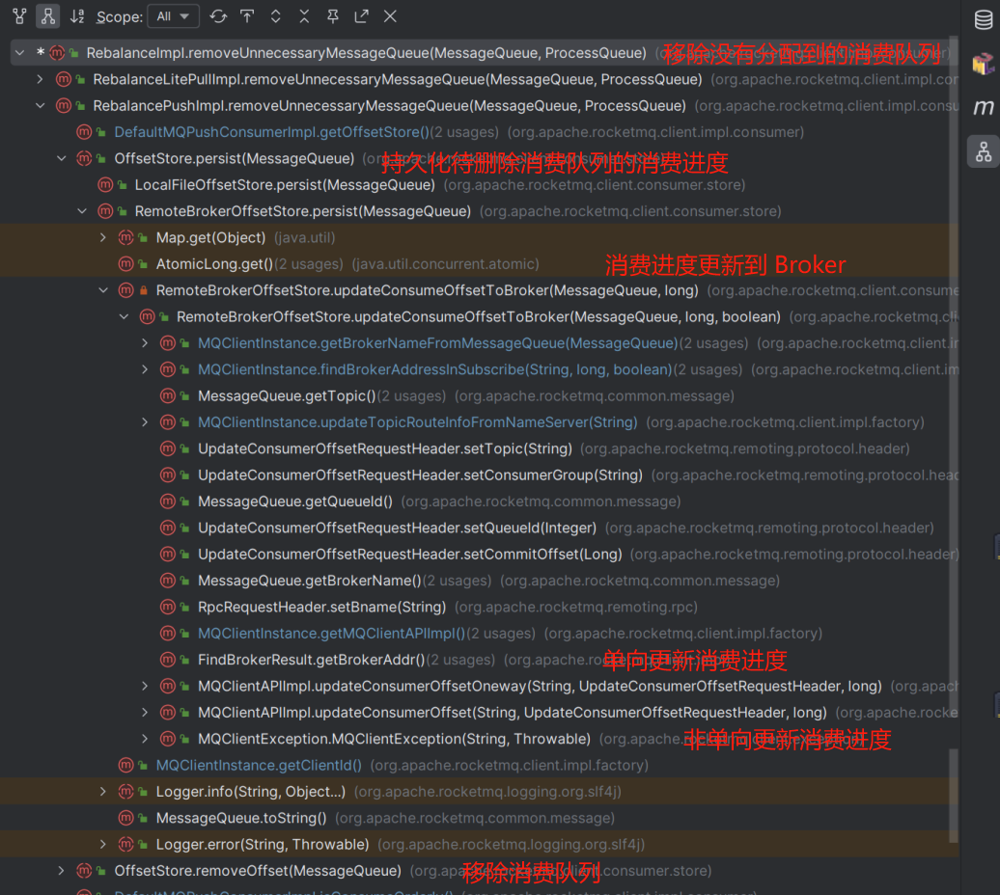

### **新增操作**

先删除该消费队列旧的内存消费进度，执行方法 [RebalanceImpl#removeDirtyOffset](http://rebalanceimpl/#removeDirtyOffset)，其调用链如下。

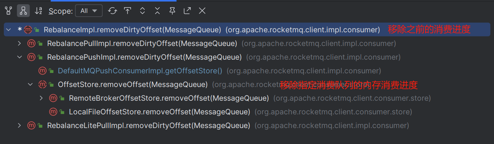

### **从 Broker 获取消费进度**

再从Broker磁盘获取该消费队列消费进度，执行 [RebalanceImpl#computePullFromWhere](http://rebalanceimpl/#computePullFromWhere)，其调用链如下。

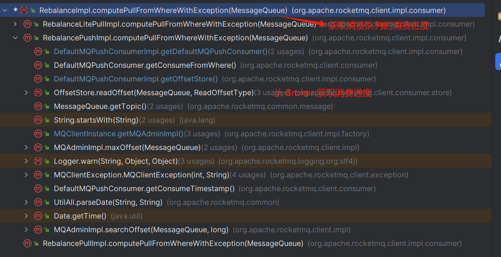

综上可以看到，经过这一步，如果分配给当前消费者的消费队列不在 [processQueueTable](http://processqueuetable/) 中，就会构建拉取请求[PullRequest](http://pullrequest/)，然后调用 [dispatchPullRequest](http://dispatchpullrequest%20/) 处理消息拉取请求。

最后我们再来看下添加拉取请求操作，很简单。

## **3.3.3 添加拉取请求**

public class RebalancePushImpl extends RebalanceImpl {

@Override

public void dispatchPullRequest(final List<PullRequest> pullRequestList, final long delay) {

for (PullRequest pullRequest : pullRequestList) {

if (delay <= 0) {

// 加入到阻塞队列中

this.defaultMQPushConsumerImpl.executePullRequestImmediately(pullRequest);

} else {

// 延迟加入到阻塞队列中

this.defaultMQPushConsumerImpl.executePullRequestLater(pullRequest, delay);

}

}

}

}

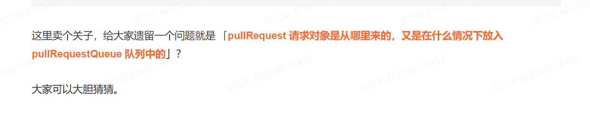

看到这里，[【消费者源码分析系列第三篇】图解 RocketMQ 源码之消费者是如何从 Broker 拉取数据](https://articles.zsxq.com/id_u91ued4dpqrp.html) 这篇中遗留的这个问题是不是就迎刃而解了。

最后我们简单来梳理下重平衡核心功能的操作流程。

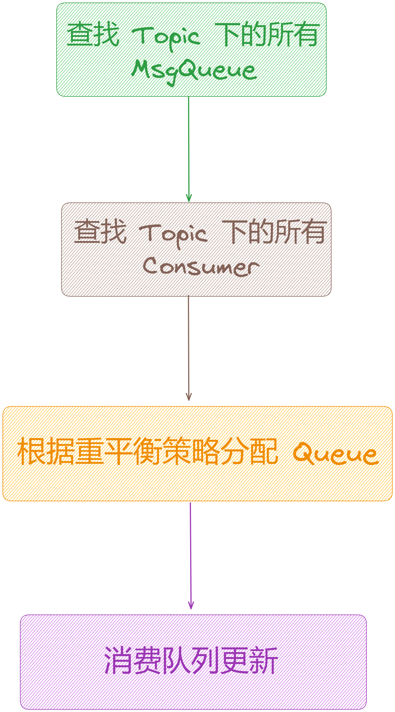

## **04 总结**

RocketMQ消费模式有「**集群消费**」和「**广播消费**」，因为「**广播消费**」所有的 Consumer 都会收到全量消息，所以 RocketMQ 的重平衡只针对于 Consumer「**集群消费**」的模式。

这里总结下哪些场景会触发 Rebalance。

## **4.1 消费者订阅的 Topic 的队列数量发生变化**

我们动态调整 Topic 对应的队列数量，那么此时肯定是要重新分配一下，也就是触发 Rebalance。

比如：⼀个 Topic 下 5 个队列，有 2 个消费者的情况下，此时可以给其中⼀个消费者分配 2 个队列，给另⼀个分配3 个队列。

如果此时我们调整到 Topic 下有 8 个队列，还是 2 个消费者的情况下，那么就可以给每个消费者都分配 4 个队列，从而提升消息的并行消费能力。

  
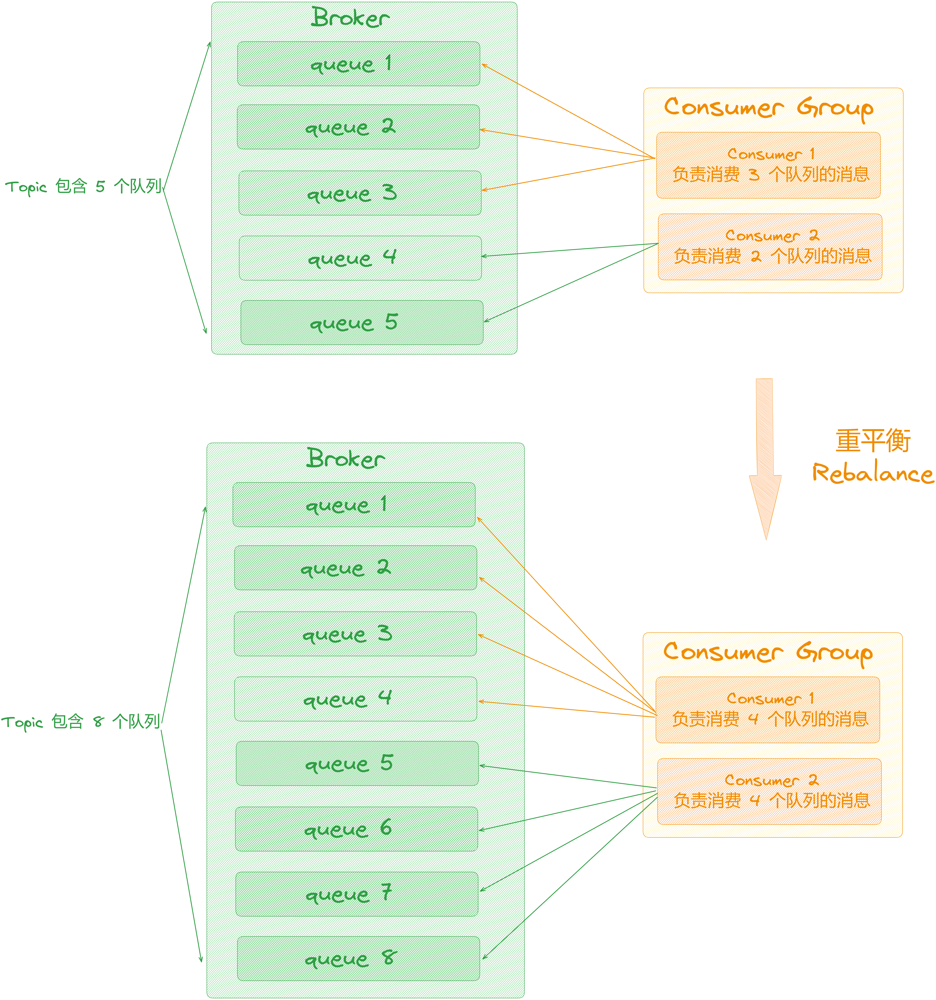

**综上，对于 Broker 扩容或缩容、Broker 与 NameServer 间发生网络异常、Queue 扩容或者缩容等场景都可能导致消费者所订阅 Topic 的队列数量发生变化**。

##   
**4.2 消费者组中的消费者的数量发生变化**

我们动态添加消费者进行消费，那么此时肯定是要重新分配一下，也就是触发 Rebalance。

比如：⼀个 Topic 下 6 个队列，在只有 1 个消费者的情况下，这个消费者将负责消费这 6 个队列的消息。如果此时我们增加⼀个消费者，那么就可以每个消费者分配 3 个队列，从而提升消息的并行消费能力。

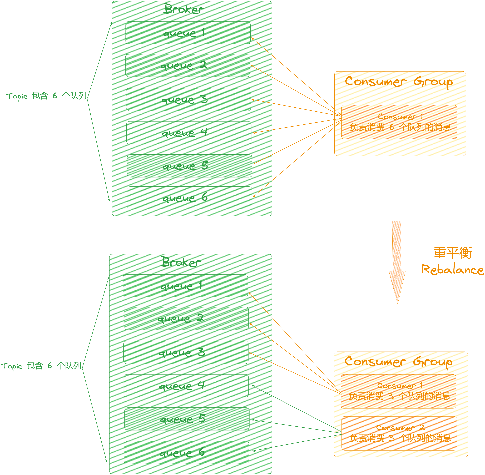

**综上，对于 Consumer Group 扩容或缩容、Consumer 与 NameServer 间发生网络异常、Consumer 发生宕机等都会导致消费者组中的消费者数量发生变化**。

## **4.3 重平衡的危害**

Rebalance 在提升消费能力的同时，也带来一些问题：

1.  消费暂停：在只有一个 Consumer 时，其负责消费所有队列；当新增了一个 Consumer 后会触发 Rebalance 的发生。此时原 Consumer 就需要暂停部分队列的消费，等到这些队列分配给新的 Consumer 后，这些暂停消费的队列才能继续被消费。
2.  消费重复：Consumer 在消费新分配给自己的队列时，必须接着之前 Consumer 提交的消费进度的 offset 继续消费。默认情况下，offset 是异步提交的，这个异步性导致提交到 Broker 的 offset 与 Consumer 实际消费的消息并不一致，这个不一致的差值就是可能会重复消费的消息。
3.  消费突刺：由于 Rebalance 可能导致重复消费，如果需要重复消费的消息过多，或者因为 Rebalance 暂停时间过长从而导致积压了部分消息，那么有可能会导致在 Rebalance 结束之后瞬间需要消费很多消息。