大家好，我是**华仔**, 又跟大家见面了。

从今天开始我将继续为大家奉上 RocketMQ 消费者源码剖析系列文章，正式开启「**RocketMQ 的 消费者源码之旅**」，这是第八篇，本篇我们将以「**RocketMQ 5.1.2**」版本为主，来剖析下 RocketMQ 源码之消费者普通消费全流程剖析。

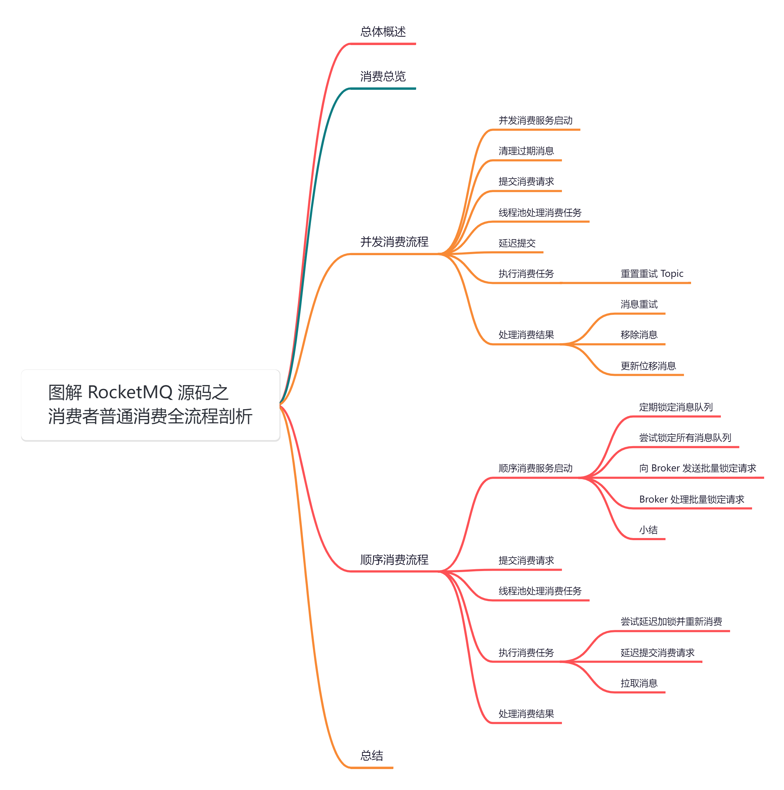

## **01 总体概述**

在 [【消费者源码分析系列第三篇】图解 RocketMQ 源码之消费者是如何从 Broker 拉取数据](https://articles.zsxq.com/id_u91ued4dpqrp.html) 这篇中，我们重点剖析了消息是如何从 Broker 拉取的， 流程如下：

  

当消费者从Broker拉取到消息之后，会将消息提交到「**线程池**」中进行消费，那么今天我们就来深度剖析下普通消费的处理流程是怎样的？

## **02 消费总览**

当前 [DefaultMQPushConsumer](http://defaultmqpushconsumer/) 拉取到消息之后，会将消息提交到对应的 [processQueue](http://processqueue/) 处理队列内部的[msgTreeMap](http://msgtreemap/) 中。然后通过 [consumeMessageService#submitConsumeRequest](http://consumemessageservice/#submitConsumeRequest) 方法将拉取到的消息构建为[ConsumeRequest](http://consumerequest/)，然后通过内部的 [consumeExecutor](http://consumeexecutor/) 线程池消费消息，如下：

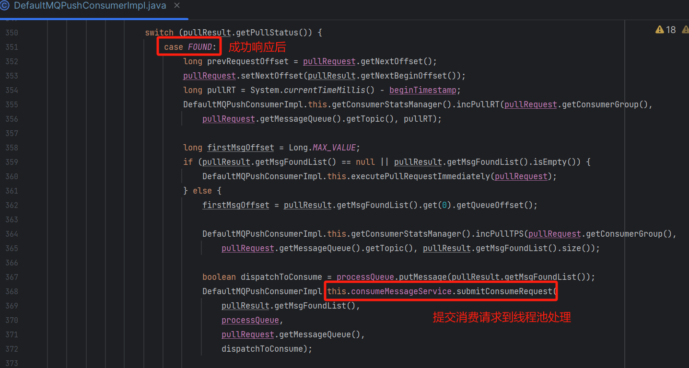

**这里使用消费线程池保证了消息拉取和消息消费的解耦，**看到这里，我们知道在 RocketMQ 使用[ConsumeMessageService](http://consumemessageservice/) 来实现消息消费的处理逻辑。它将拉取到的消息构建为 [ConsumeRequest](http://consumerequest/)，然后通过内部的 [consumeExecutor](http://consumeexecutor/) 线程池消费消息。我们来看下它都在哪里被调用了，如下图：

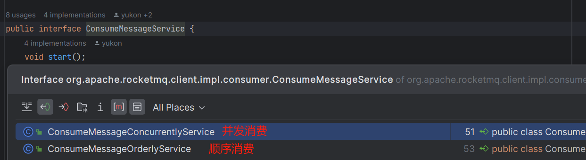

你是否想起来，在消费者启动时会根据消息类型的不同启动不同的服务来消费。

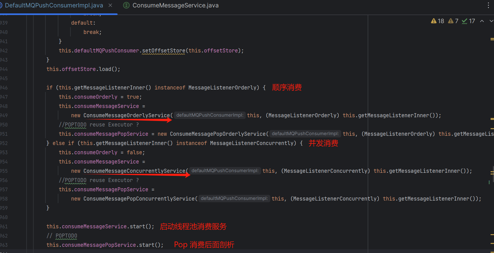

[consumeMessageService](http://consumemessageservice/) 有 [ConsumeMessageConcurrentlyService](http://consumemessageconcurrentlyservice/) 并发消费和[ConsumeMessageOrderlyService](http://consumemessageorderlyservice/) 顺序消费两种实现，下面我们来看看这两种实现如何消费消息。

在 RocketMQ 支持「**顺序消费**」与「**并发消费**」两种，UML 图如下：

  
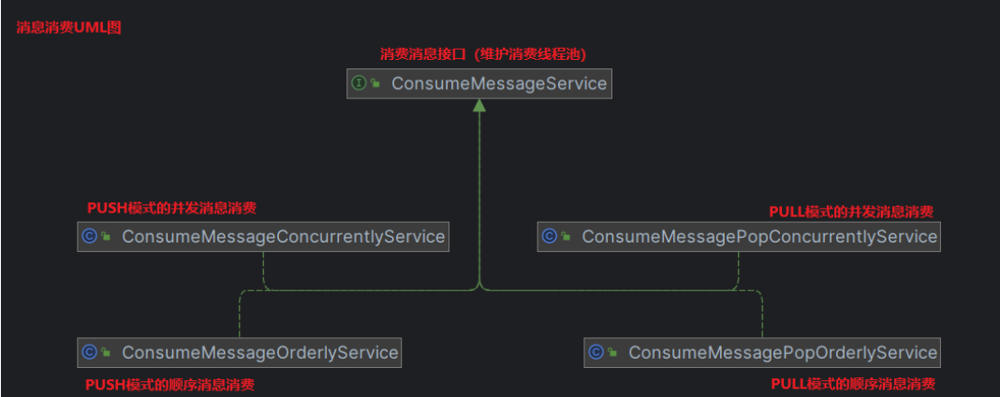

今天我们先来重点剖析下左边 Push 模式下两种消费方式的消费流程。

## **03 并发消费流程**

源码位置：[https://github.com/apache/rocketmq/blob/release-5.1.2/client/src/main/java/org/apache/rocketmq/client/impl/consumer/](https://github.com/apache/rocketmq/blob/release-5.1.2/client/src/main/java/org/apache/rocketmq/client/impl/consumer/ConsumeMessageConcurrentlyService.java)[ConsumeMessageConcurrentlyService](https://github.com/apache/rocketmq/blob/release-5.1.2/client/src/main/java/org/apache/rocketmq/client/impl/consumer/ConsumeMessageConcurrentlyService.java)[.java](https://github.com/apache/rocketmq/blob/release-5.1.2/client/src/main/java/org/apache/rocketmq/client/impl/consumer/ConsumeMessageConcurrentlyService.java)

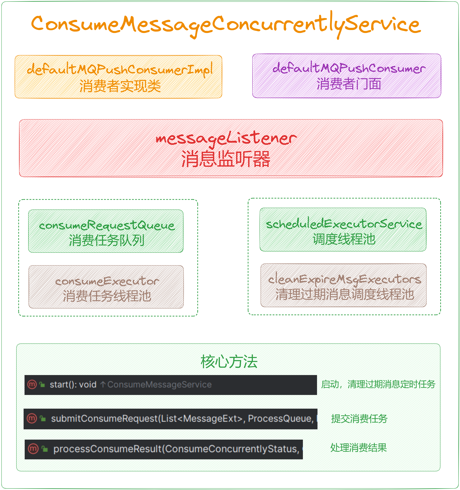

1.  消费者门面：充当的是配置的角色，在消费服务里面作为限制条件。
2.  消息监听器：消息的处理代码都是写在消息监听器里，需要在消费者门面里注册，最核心的方法就是 [consumerMessage](http://consumermessage/)。
3.  消费任务线程池的大小由消费者门面管理，默认情况最大为 20。
4.  调度线程池主要在内部使用，比如在需要延迟任务逻辑，需要在调度线程池里调度到消费任务线程池。
5.  清理过期任务调度线程池：会清理的任务 ProcessQueue 里 MsgTreeMap 存储的有没有超过 15min 还没被消费的过期消息，回退到 Broker 服务器。

先来看下该类的重要属性。

public class ConsumeMessageConcurrentlyService implements ConsumeMessageService {

private static final Logger log \= LoggerFactory.getLogger(ConsumeMessageConcurrentlyService.class);

// 消息推模式实现类

private final DefaultMQPushConsumerImpl defaultMQPushConsumerImpl;

// 默认推模式消费者

private final DefaultMQPushConsumer defaultMQPushConsumer;

// 并发消息监听

private final MessageListenerConcurrently messageListener;

// 消费线程池的任务队列

private final BlockingQueue<Runnable> consumeRequestQueue;

// 消费任务线程池

private final ThreadPoolExecutor consumeExecutor;

// 消费组

private final String consumerGroup;

// 消费延迟调度线程池

private final ScheduledExecutorService scheduledExecutorService;

// 定时删除过期消息调度线程池 该任务 15 min执行一次

private final ScheduledExecutorService cleanExpireMsgExecutors;

....

}

## **3.1 并发消费服务启动**

为什么在服务启动时就加一个定期清理过期消息的定时任务呢？

这主要是因为消费者在消费的时候如果一直阻塞着, 那么 Offset 就成为阻塞点，对于它后面的已消费的 Offset 都不能够提交。此时整个消费流程就会停滞，那如何解决呢？答案就是这里的定期清理过期消息的定时任务。

/\*\*

\* DefaultMQPushConsumer.java

\* Maximum amount of time in minutes a message may block the consuming thread.

\*/

private long consumeTimeout \= 15;

// 启动服务

public void start() {

// 通过 cleanExpireMsg 定时任务清理过期的消息

// 启动后 15 min 开始执行，后每隔 15 min执行一次，这里的15 min 时RocketMQ最大的默认超时时间，可通过 defaultMQPushConsumer#consumeTimeout 属性设置

this.cleanExpireMsgExecutors.scheduleAtFixedRate(new Runnable() {

@Override

public void run() {

try {

// 清理过期消息

cleanExpireMsg();

} catch (Throwable e) {

log.error("scheduleAtFixedRate cleanExpireMsg exception", e);

}

}

}, this.defaultMQPushConsumer.getConsumeTimeout(), // 15 分钟 兜底策略

this.defaultMQPushConsumer.getConsumeTimeout(), TimeUnit.MINUTES);

}

[consumeMessageService](http://consumemessageservice/) 服务在 [DefaultMQPushConsumerImpl#start](http://defaultmqpushconsumerimpl/#start) 方法中被初始化并启动，此时将会通过[cleanExpireMsg](http://cleanexpiremsg%20/) 定时任务清理过期的消息，启动后 [15min](http://%2015min%20/) 开始执行，后每 [15min](http://15min/) 执行一次，这里的 [15min](http://15min/) 是RocketMQ 最大的默认超时时间，可通过 [defaultMQPushConsumer#consumeTimeout](http://defaultmqpushconsumer/#consumeTimeout) 属性设置。

定时任务会判断每个 [ProcessQueue](http://processqueue/) 中的 [msgTreeMap](http://msgtreemap%20/) 最小偏移量的消息是否已经过期了，如果过期了，则执行:

1.  将该消息发回重试，间隔时间延长等级为 3 ，对应的默认时间是 10s。
2.  将该消息从 msgTreeMap 中移除，移除了之后 它后面已消费的 offset 就可以提交了。
3.  计算是否超时的时间 [consumeStartTimeStamp](http://consumestarttimestamp/) 是在执行 [ConsumeRequest](http://consumerequest/) 请求，执行完了 [ConsumeMessageHook](http://consumemessagehook/) 前置处理器开始计算的。

## **3.2 清理过期消息**

获取所有的消息队列和处理队列的键值对，循环遍历并且调用 [ProcessQueue#cleanExpiredMsg](http://processqueue/#cleanExpiredMsg) 方法清理过期消息。

// 清理过期消息

private void cleanExpireMsg() {

// 获取所有的消息队列和处理队列的键值对

Iterator<Map.Entry<MessageQueue, ProcessQueue>> it =

this.defaultMQPushConsumerImpl.getRebalanceImpl().

getProcessQueueTable().entrySet().iterator();

while (it.hasNext()) { // 循环遍历

Map.Entry<MessageQueue, ProcessQueue> next = it.next();

ProcessQueue pq \= next.getValue();

// 调用 ProcessQueue#cleanExpiredMsg 方法清理过期消息

pq.cleanExpiredMsg(this.defaultMQPushConsumer);

}

}

// ProcessQueue#cleanExpiredMsg 清理过期消息

public void cleanExpiredMsg(DefaultMQPushConsumer pushConsumer) {

// 顺序消费不清理过期消息,直接返回，只有并发消费才会清理

if (pushConsumer.getDefaultMQPushConsumerImpl().isConsumeOrderly()) {

return;

}

// 每次最多清理 16 条消息

int loop \= msgTreeMap.size() < 16 ? msgTreeMap.size() : 16;

for (int i \= 0; i < loop; i++) { // 遍历消息，最多处理前16个消息

MessageExt msg \= null;

try {

// 处理消息之前，先拿到读锁

this.treeMapLock.readLock().lockInterruptibly();

try {

// 临时存放消息的 treeMap 不为空

if (!msgTreeMap.isEmpty()) {

// 获取TreeMap里第一条消息的开始消费时间，msgTreeMap 是一个红黑树，第一个节点就是 offset 最小的节点

String consumeStartTimeStamp \= MessageAccessor.getConsumeStartTimeStamp(msgTreeMap.firstEntry().getValue());

// 判断当前时间 - TreeMap 里第一条消息的开始消费时间 > 15分钟

if (StringUtils.isNotEmpty(consumeStartTimeStamp) && System.currentTimeMillis() - Long.parseLong(consumeStartTimeStamp) > pushConsumer.getConsumeTimeout() \* 60 \* 1000) {

// 把第一条消息拿出来

msg = msgTreeMap.firstEntry().getValue();

} else {

// 如果没有被消费，或者消费时间距离现在时间不超过默认15min，则结束循环

break;

}

} else {

break; // msgTreeMap 为空，结束循环

}

} finally {

// 释放读锁

this.treeMapLock.readLock().unlock();

}

} catch (InterruptedException e) {

log.error("getExpiredMsg exception", e);

}

try {

// 把过期消息以延时消息方式重新发给 broker，将在给定延迟时间（默认从level3，即10s开始）之后进行重试消费

pushConsumer.sendMessageBack(msg, 3);

log.info("send expire msg back. topic={}, msgId={}, storeHost={}, queueId={}, queueOffset={}", msg.getTopic(), msg.getMsgId(), msg.getStoreHost(), msg.getQueueId(), msg.getQueueOffset());

try {

// 获取写锁

this.treeMapLock.writeLock().lockInterruptibly();

try {

// 如果这个消息还没有被消费完

if (!msgTreeMap.isEmpty() && msg.getQueueOffset() == msgTreeMap.firstKey()) {

try {

// 将过期消息从本地缓存中的消息列表中移除掉， Collections.singletonList 表示只有一个元素的 List 集合

removeMessage(Collections.singletonList(msg));

} catch (Exception e) {

log.error("send expired msg exception", e);

}

}

} finally {

// 释放写锁

this.treeMapLock.writeLock().unlock();

}

} catch (InterruptedException e) {

log.error("getExpiredMsg exception", e);

}

} catch (Exception e) {

log.error("send expired msg exception", e);

}

}

}

通过源码可以看出清理过期的消息，规则如下：

1.  每次最多清理 16 条消息。
2.  每次循环首先获取 [msgTreeMap](http://msgtreemap/) 中的第一次元素的起始消费时间，[msgTreeMap](http://msgtreemap/) 是一个红黑树，第一个节点就是offset最小的节点。
3.  如果消费时间距离现在时间超过默认15min，那么获取这个msg，如果没有被消费，或者消费时间距离现在时间不超过默认15min，则结束循环。
4.  消息在客户端存在超过 15 分钟就被认为已过期，将从本地缓存中移除，然后以 10s 的延时消息方式发送回 Broker。
5.  将获取到的消息通过 [sendMessageBack](http://sendmessageback/) 发回 broker 延迟 topic，将在给定延迟时间（默认从level 3，即10s开始）之后发回进行重试消费。
6.  加锁判断如果这个消息还没有被消费完，并且还是在第一位，那么调用removeMessage方法从msgTreeMap中移除消息，进行下一轮判断。

> 注意：顺序消费模式不清理过期消息，只有并发消费模式才清理过期消息。

了解完清理工作后，我们来看下本篇的重点内容，即消费者拉取完成后，将拉取到的消息构建为 [ConsumeRequest](http://consumerequest/)，然后通过内部的 [consumeExecutor](http://consumeexecutor/) 线程池消费消息。

## **3.3 提交消费请求**

/\*\*

\* 提交消息消费，供消费者消费

\* 并发消息消费入口：{@link DefaultMQPushConsumerImpl#pullMessage}中的{@link org.apache.rocketmq.client.consumer.PullCallback}

\* @param msgs 一次拉取待消费消息，最大默认32条{@link DefaultMQPushConsumer#pullBatchSize}

\* @param processQueue 消息消费待处理队列

\* @param messageQueue 消息所属消费队列

\* @param dispatchToConsume 是否转发到消费线程池，并发消费则忽略

\*/

@Override

public void submitConsumeRequest(

final List<MessageExt> msgs,

final ProcessQueue processQueue,

final MessageQueue messageQueue,

final boolean dispatchToConsume) {

// 并发消费时单次消费消息条数，默认1条

final int consumeBatchSize \= this.defaultMQPushConsumer.getConsumeMessageBatchMaxSize();

// msgs.size()一次拉取消息的条数，最大 32 条

// 如果消息数量 <= 单次批量消费的数量，那么直接全量消费

if (msgs.size() <= consumeBatchSize) {

// 构建消费请求，将消息全部放进去

ConsumeRequest consumeRequest \= new ConsumeRequest(msgs, processQueue, messageQueue);

try {

// 将消费请求任务直接提交到 consumeExecutor 消费线程池

this.consumeExecutor.submit(consumeRequest);

} catch (RejectedExecutionException e) {

//提交的任务延迟5s再提交到消费线程池，而不是丢弃

this.submitConsumeRequestLater(consumeRequest);

}

} else {

// 如果消息数量 > 单次批量消费的数量，那么需要对消息进行分批提交

for (int total \= 0; total < msgs.size(); ) {

// 构建一批消息集合，每批消息最多consumeBatchSize条，默认1

List<MessageExt> msgThis = new ArrayList<>(consumeBatchSize);

// 将消息按顺序加入集合

for (int i \= 0; i < consumeBatchSize; i++, total++) {

if (total < msgs.size()) {

msgThis.add(msgs.get(total));

} else {

break;

}

}

// 将本批次消息构建为 ConsumeRequest

ConsumeRequest consumeRequest \= new ConsumeRequest(msgThis, processQueue, messageQueue);

try {

// 将消费请求任务直接提交到 consumeExecutor 消费线程池

this.consumeExecutor.submit(consumeRequest);

} catch (RejectedExecutionException e) {

for (; total < msgs.size(); total++) {

msgThis.add(msgs.get(total));

}

// 提交的任务延迟 5s 再提交到消费线程池，而不是丢弃

this.submitConsumeRequestLater(consumeRequest);

}

}

}

}

该方法将消息批量的封装为 [ConsumeRequest](http://consumerequest/) 提交到 [ConsumeMessageConcurrentlyService](http://consumemessageconcurrentlyservice/) 内部的 [consumeExecutor](http://consumeexecutor/) 线程池中进行异步消费，如果提交失败，则调用 [submitConsumeRequestLater](http://submitconsumerequestlater/) 方法延迟 5s进行提交，而不是丢弃，操作步骤如下：

1.  首先获取单次批量消费的数量，默认1，通过 [DefaultMQPushConsumer#consumeMessageBatchMaxSize](http://defaultmqpushconsumer/#consumeMessageBatchMaxSize) 属性配置。
2.  如果消息数量 <= 单次批量消费的数量，那么直接全量消费，构建一个 [ConsumeRequest](http://consumerequest/) 并提交到[consumeExecutor](http://consumeexecutor%20/) 线程池。
3.  如果消息数量 > 单次批量消费的数量，那么需要将消息进行分批提交。

这里的 [consumeMessageBatchMaxSize](http://consumemessagebatchmaxsize%20/) 从字面意思来看就是「**单次批量消费的数量**」，实际上它代表着每次发送给消息监听器 [MessageListenerOrderly](http://messagelistenerorderly/) 或者 [MessageListenerConcurrently](http://messagelistenerconcurrently/) 的 [consumeMessage](http://consumemessage/) 方法中的参数 [List<MessageExt> msgs](http://listmessageext%20msgs/) 中的最多的消息数量。

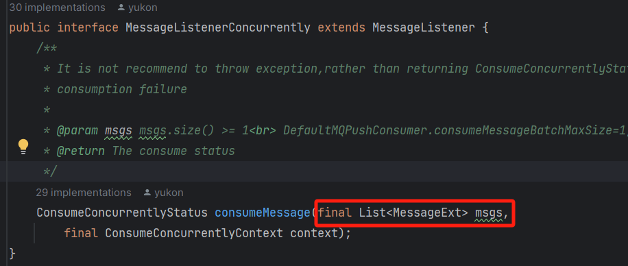

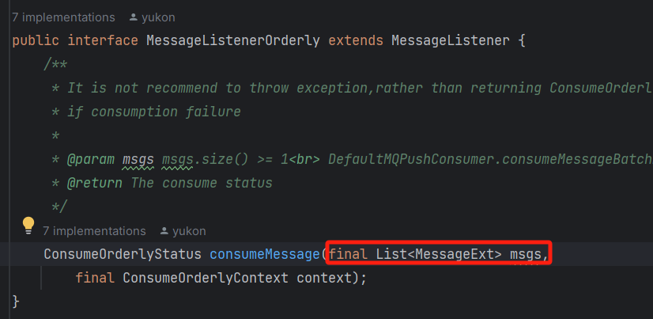

[consumeMessageBatchMaxSize](http://consumemessagebatchmaxsize/) 默认值为 1，所以说无论是「**并发消费**」还是「**顺序消费**」，每次的 [consumeMessage](http://consumemessage/) 方法的执行，msgs 集合默认都只有「**一条消息**」。同理，如果把它设置为「**n**」，无论是并发消费还是顺序消费，每次的 [consumeMessage](http://consumemessage/) 的执行，msgs 集合默认都最多只有「**n**」条消息。

另外，在前面[拉取消息的源码](https://articles.zsxq.com/id_u91ued4dpqrp.html)中，我们还学习了另外一个参数 [pullBatchSize](http://pullbatchsize/)，默认值为 「**32**」，它代表的是每一次拉取请求最多批量拉取的消费数量。也就是说无论是「**并发消费**」还是「**顺序消费**」，每次最多拉取「**32**」条消息。

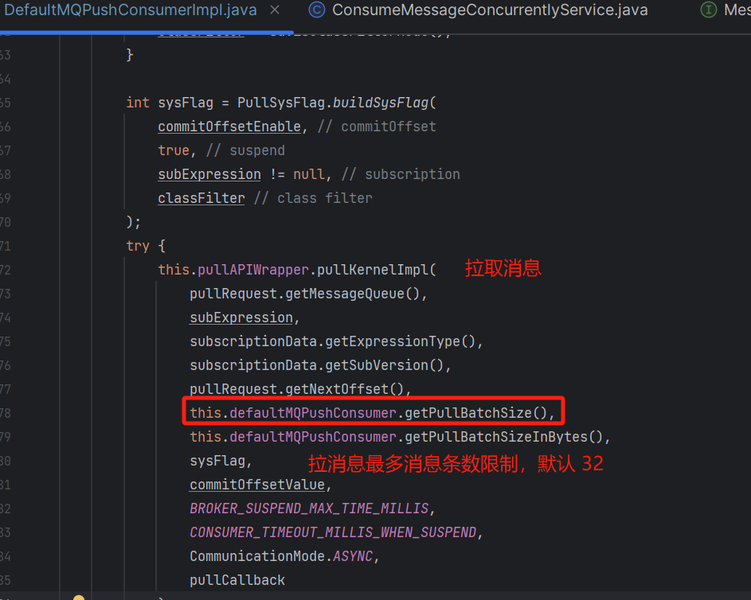

对于「**并发消费**」模式来说，当拉取到一批消息被分批次提交到「**线程池**」之后，就由「**线程池**」里面的「**线程异步消费**」，我们知道线程池里面的线程执行「**先后顺序**」时「**不可控制**」的，因此这些不同批次的消息会被并发、无序的消费。

我们再来看下「**线程池**」的处理逻辑。

## **3.4 线程池处理消费任务**

在「**并发消费**」类初始化时，会进行「**线程池**」初始化。

  
相关配置：

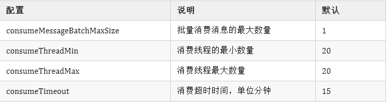

  
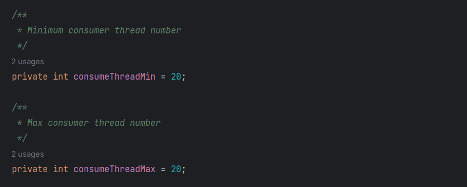

[consumeExecutor](http://consumeexecutor/) 线程池用于消费消息，其定义如下：最小、最大线程数默认 20，阻塞队列为无界阻塞队列[LinkedBlockingQueue](http://linkedblockingqueue/)。

// 无边界阻塞队列，构造方法

public ConsumeMessageConcurrentlyService(DefaultMQPushConsumerImpl defaultMQPushConsumerImpl,

MessageListenerConcurrently messageListener) {

this.defaultMQPushConsumerImpl = defaultMQPushConsumerImpl;

this.messageListener = messageListener;

this.defaultMQPushConsumer = this.defaultMQPushConsumerImpl.getDefaultMQPushConsumer();

this.consumerGroup = this.defaultMQPushConsumer.getConsumerGroup();

// 消费请求队列

this.consumeRequestQueue = new LinkedBlockingQueue<>();

/\*

\* 并发消费线程池

\* 最小、最大线程数默认20，阻塞队列为无界阻塞队列LinkedBlockingQueue

\*/

String consumerGroupTag \= (consumerGroup.length() > 100 ? consumerGroup.substring(0, 100) : consumerGroup) + "\_";

this.consumeExecutor = new ThreadPoolExecutor(

this.defaultMQPushConsumer.getConsumeThreadMin(), // 20

this.defaultMQPushConsumer.getConsumeThreadMax(), // 20

1000 \* 60,

TimeUnit.MILLISECONDS,

this.consumeRequestQueue,

new ThreadFactoryImpl("ConsumeMessageThread\_" + consumerGroupTag));

// 单线程的延迟任务线程池，用于延迟提交消费请求

this.scheduledExecutorService = Executors.newSingleThreadScheduledExecutor(new ThreadFactoryImpl("ConsumeMessageScheduledThread\_" + consumerGroupTag));

// 单线程的延迟任务线程池，用于处理过期的消息

this.cleanExpireMsgExecutors = Executors.newSingleThreadScheduledExecutor(new ThreadFactoryImpl("CleanExpireMsgScheduledThread\_" + consumerGroupTag));

}

1.  消费线程池使用的长度为 [Integer.MAX\_VALUE](http://integer.max_value/) 的阻塞队列存放待待消费任务。
2.  线程前缀名 [ConsumeMessageThread\_+ consumerGroup](http://consumemessagethread_+%20consumergroup/)，任务线程前缀名 [ConsumeMessageScheduledThread\_+ consumerGroup](http://consumemessagescheduledthread_+%20consumergroup/)，清理线程前缀名：[CleanExpireMsgScheduledThread\_+consumerGroup](http://cleanexpiremsgscheduledthread_+consumergroup/)。
3.  消费线程池核心线程数和最大线程数默认都是 20，相应配置可修改 [consumeThreadMin](http://consumethreadmin/)、[consumeThreadMax](http://consumethreadmax/)。

## **3.5 延迟提交**

提交的任务会延迟 5s 后再次进行提交，而不是被丢弃，如下。

// 延迟 5s 进行提交任务

private void submitConsumeRequestLater(final ConsumeRequest consumeRequest

) {

this.scheduledExecutorService.schedule(new Runnable() {

@Override

public void run() {

// 将提交的行为封装为一个线程任务，提交到 scheduledExecutorService 延迟线程池，5s之后执行

ConsumeMessageConcurrentlyService.this.consumeExecutor.submit(consumeRequest);

}

}, 5000, TimeUnit.MILLISECONDS);

}

## **3.6 执行消费任务**

[ConsumeRequest](http://consumerequest/) 类本身是一个线程任务，当拉取到消息之后会将一批消息构建为一个 [ConsumeRequest](http://consumerequest/) 对象，提交给 [consumeExecutor](http://consumeexecutor/)，由线程池异步的执行。

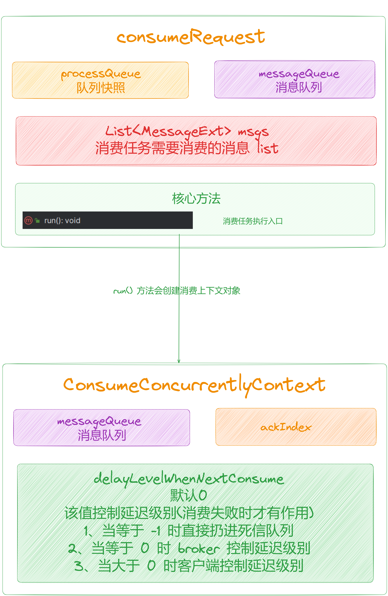

// ConsumeMessageConcurrentlyService 的子类

class ConsumeRequest implements Runnable {

// 一次消费的消息集合，默认1条消息

private final List<MessageExt> msgs;

// 消息处理队列

private final ProcessQueue processQueue;

// 消息队列

private final MessageQueue messageQueue;

// 构造函数

public ConsumeRequest(List<MessageExt> msgs, ProcessQueue processQueue, MessageQueue messageQueue) {

this.msgs = msgs;

this.processQueue = processQueue;

this.messageQueue = messageQueue;

}

public List<MessageExt> getMsgs() {

return msgs;

}

public ProcessQueue getProcessQueue() {

return processQueue;

}

// 执行并发消费

@Override

public void run() {

// 如果处理队列被丢弃，那么直接返回不再消费。

// 比如重平衡时该队列被分配给了其他新上线的消费者，尽量避免重复消费

if (this.processQueue.isDropped()) {

log.info("the message queue not be able to consume, because it's dropped. group={} {}", ConsumeMessageConcurrentlyService.this.consumerGroup, this.messageQueue);

return;

}

// 1、获取并发消费的消息监听器，push 模式模式下是我们需要开发的，通过registerMessageListener 方法注册，内部包含了要执行的业务逻辑

MessageListenerConcurrently listener \= ConsumeMessageConcurrentlyService.this.messageListener;

// 创建消费上下文

ConsumeConcurrentlyContext context \= new ConsumeConcurrentlyContext(messageQueue);

ConsumeConcurrentlyStatus status \= null;

defaultMQPushConsumerImpl.tryResetPopRetryTopic(msgs, consumerGroup);

// 2、重置重试 topic

defaultMQPushConsumerImpl.resetRetryAndNamespace(msgs, defaultMQPushConsumer.getConsumerGroup());

// 3、如果有消费钩子，那么执行钩子函数的前置方法 consumeMessageBefore，我们可以注册钩子 ConsumeMessageHook 再消费消息的前后调用

ConsumeMessageContext consumeMessageContext \= null;

if (ConsumeMessageConcurrentlyService.this.defaultMQPushConsumerImpl.hasHook()) {

consumeMessageContext = new ConsumeMessageContext();

consumeMessageContext.setNamespace(defaultMQPushConsumer.getNamespace());

consumeMessageContext.setConsumerGroup(defaultMQPushConsumer.getConsumerGroup());

consumeMessageContext.setProps(new HashMap<>());

consumeMessageContext.setMq(messageQueue);

consumeMessageContext.setMsgList(msgs);

consumeMessageContext.setSuccess(false);

ConsumeMessageConcurrentlyService.this.defaultMQPushConsumerImpl.

executeHookBefore(consumeMessageContext);

}

// 开始时间戳

long beginTimestamp \= System.currentTimeMillis();

boolean hasException \= false;

// 消费返回类型，初始化为 SUCCESS

ConsumeReturnType returnType \= ConsumeReturnType.SUCCESS;

try {

if (msgs != null && !msgs.isEmpty()) {

// 循环设置每个消息的开始消费时间

for (MessageExt msg : msgs) {

MessageAccessor.setConsumeStartTimeStamp(msg, String.valueOf(System.currentTimeMillis()));

}

}

// 4、调用 listener#consumeMessage 方法进行消息消费，调用实际的业务逻辑返回执行状态结果

// 有两种状态 ConsumeConcurrentlyStatus.CONSUME\_SUCCESS 和 ConsumeConcurrentlyStatus.RECONSUME\_LATER

status = listener.consumeMessage(Collections.unmodifiableList(msgs), context);

} catch (Throwable e) {

log.warn(String.format("consumeMessage exception: %s Group: %s Msgs: %s MQ: %s",

UtilAll.exceptionSimpleDesc(e),

ConsumeMessageConcurrentlyService.this.consumerGroup,

msgs,

messageQueue), e);

hasException = true; // 抛出异常之后，设置异常标志位

}

// 5、对返回的执行状态结果进行判断处理

// 计算消费时间

long consumeRT \= System.currentTimeMillis() - beginTimestamp;

if (null == status) { // 如果状态为空

if (hasException) { // 如果业务的执行抛出了异常

returnType = ConsumeReturnType.EXCEPTION; // 设置 returnType 为 EXCEPTION

} else {

returnType = ConsumeReturnType.RETURNNULL; // 设置 returnType 为 RETURNNULL

}

// 如果消费时间 consumeRT 大于等于 consumeTimeout，默认15min

} else if (consumeRT >= defaultMQPushConsumer.getConsumeTimeout() \* 60 \* 1000) {

returnType = ConsumeReturnType.TIME\_OUT; // 设置 returnType 为 TIME\_OUT 超时

// 如果 status 为 RECONSUME\_LATER，即消费失败

} else if (ConsumeConcurrentlyStatus.RECONSUME\_LATER == status) {

returnType = ConsumeReturnType.FAILED; // 设置 returnType 为 FAILED，即消费失败

// 如果 status 为 CONSUME\_SUCCESS，即消费成功

} else if (ConsumeConcurrentlyStatus.CONSUME\_SUCCESS == status) {

returnType = ConsumeReturnType.SUCCESS; // 设置 returnType 为 SUCCESS，即消费成功

}

// 如果有钩子，则将 returnType 设置进去

if (ConsumeMessageConcurrentlyService.this.defaultMQPushConsumerImpl.hasHook()) {

consumeMessageContext.getProps().put(MixAll.CONSUME\_CONTEXT\_TYPE, returnType.name());

}

if (null == status) {

log.warn("consumeMessage return null, Group: {} Msgs: {} MQ: {}",

ConsumeMessageConcurrentlyService.this.consumerGroup,

msgs,

messageQueue);

// 将 status 设置为 RECONSUME\_LATER，即消费失败

status = ConsumeConcurrentlyStatus.RECONSUME\_LATER;

}

// 6、如果有消费钩子，那么执行钩子函数的后置方法 consumeMessageAfter

// 我们可以注册钩子 ConsumeMessageHook，在消费消息的前后调用

if (ConsumeMessageConcurrentlyService.this.defaultMQPushConsumerImpl.hasHook()) {

consumeMessageContext.setStatus(status.toString());

consumeMessageContext.setSuccess(ConsumeConcurrentlyStatus.CONSUME\_SUCCESS == status);

ConsumeMessageConcurrentlyService.this.defaultMQPushConsumerImpl.

executeHookAfter(consumeMessageContext);

}

// 增加消费时间

ConsumeMessageConcurrentlyService.this.getConsumerStatsManager()

.incConsumeRT(ConsumeMessageConcurrentlyService.this.consumerGroup, messageQueue.getTopic(), consumeRT);

if (!processQueue.isDropped()) {

// 7、如果处理队列没有被丢弃，那么调用ConsumeMessageConcurrentlyService#processConsumeResult 方法处理消费结果，包括重试等逻辑

ConsumeMessageConcurrentlyService.this.processConsumeResult(status, context, this);

} else {

log.warn("processQueue is dropped without process consume result. messageQueue={}, msgs={}", messageQueue, msgs);

}

}

public MessageQueue getMessageQueue() {

return messageQueue;

}

}

// 消费结果状态

public enum ConsumeConcurrentlyStatus {

/\*\*

\* 消费成功

\*/

CONSUME\_SUCCESS,

/\*\*

\* 消费失败，延迟进行消费

\*/

RECONSUME\_LATER;

}

这里重点来关注其 **run()** 方法，它是「**并发消费**」的核心方法，大概流程如下：

1.  如果处理队列被丢弃，即 dropped=true，那么直接返回不再消费，比如重平衡时该队列被分配给了其他新上线的消费者，尽量避免重复消费。
2.  接着调用 [resetRetryAndNamespace](http://resetretryandnamespace%20/) 方法，当消息是重试消息的时候，将 msg 的 topic 属性从重试 topic 还原为真实的topic。
3.  如果有消费钩子，那么执行钩子函数的前置方法 [consumeMessageBefore](http://consumemessagebefore/)。我们可以通过[DefaultMQPushConsumerImpl#registerConsumeMessageHook](http://defaultmqpushconsumerimpl/#registerConsumeMessageHook) 方法注册消费钩子 [ConsumeMessageHook](http://consumemessagehook/)，在消费消息的前后调用。
4.  接着调用 [listener#consumeMessage](http://listener/#consumeMessage) 方法，执行消息消费，调用实际的业务逻辑返回执行状态结果。
5.  正常情况下可返回两种状态：[ConsumeConcurrentlyStatus.CONSUME\_SUCCESS](http://consumeconcurrentlystatus.consume_success/) 表示消费成功 ， [ConsumeConcurrentlyStatus.RECONSUME\_LATER](http://consumeconcurrentlystatus.reconsume_later/) 表示消费失败，如果中途抛出异常，则 status 为 null。
6.  对返回的执行状态结果进行判断处理。从这里可得知消费超时时间为 15min，另外如果返回的 status 为 null，那么 status 将会被设置为 [RECONSUME\_LATER](http://reconsume_later/)，即消费失败。
7.  计算消费时间 [consumeRT](http://consumert/)。如果 status 为 null，如果业务的执行抛出了异常，设置 returnType 为 [EXCEPTION](http://exception/)，否则设置 returnType 为 [RETURNNULL](http://returnnull/)。
8.  如消费时间 [consumeRT](http://consumert/) 大于等于 [consumeTimeout](http://consumetimeout/)，默认15min。设置 returnType 为 [TIME\_OUT](http://time_out/)。消费超时时间可通过 [DefaultMQPushConsumer. consumeTimeout](http://defaultmqpushconsumer.%20consumetimeout/) 属性配置，默认15，单位分钟。
9.  如果 status 为 [RECONSUME\_LATER](http://reconsume_later/)，即消费失败，设置 returnType 为 FAILED。
10.  如果 status 为 [CONSUME\_SUCCESS](http://consume_success/)，即消费成功，设置 returnType 为 SUCCESS。
11.  如果有消费钩子，那么执行钩子函数的后置方法 [consumeMessageAfter](http://consumemessageafter/)。
12.  如果处理队列没有被丢弃，即 dropped=false，那么调用[ConsumeMessageConcurrentlyService#processConsumeResult](http://consumemessageconcurrentlyservice/#processConsumeResult) 方法处理消费结果，包括消费重试、提交offset等操作。

这里有两个问题需要考虑下：

1.  为何要保留 [ProcessQueue](http://processqueue/) 呢？
2.  因为处理完消息后需要将该消息从[ProcessQueue](http://processqueue/)中移除。
3.  消息失效为什么需要控制延迟？
4.  因为如果不控制延迟，消息失效后立刻又拿到消息，又进行消费大概率还是会失效，这样减轻了服务的压力。broker端控制的延迟级别原理为：每失败一次延迟级别+1，级别越高延迟时间越长。
5.  消费上下文的作用主要在于可以控制延迟级别。

> 这里需要注意的是，如果在执行了 listener#consumeMessage 方法，即执行了业务逻辑之后，处理消费结果之前，该消息队列被丢弃了，比如重平衡时该队列被分配给了其他新上线的消费者，那么由于 dropped=false，导致不会进行最后的消费结果处理，将会导致消息的重复消费，因此必须做好业务层面的幂等性！

## **3.6.1 重置重试 Topic**

当消息是重试消息的时候，将 msg 的 topic 属性从重试 topic 还原为真实的 topic。

// DefaultMQPushConsumerImpl 类方法

public void resetRetryAndNamespace(final List<MessageExt> msgs, String consumerGroup) {

//获取重试 topic

final String groupTopic \= MixAll.getRetryTopic(consumerGroup);

for (MessageExt msg : msgs) {

// 尝试通过 PROPERTY\_RETRY\_TOPIC 属性获取每个消息的真实topic

String retryTopic \= msg.getProperty(MessageConst.PROPERTY\_RETRY\_TOPIC);

// 如果该属性不为 null，并且重试 topic 和消息的 topic 相等，则表示当前消息是重试消息

if (retryTopic != null && groupTopic.equals(msg.getTopic())) {

// 设置消息的 topic 为真实 topic，即还原回来

msg.setTopic(retryTopic);

}

if (StringUtils.isNotEmpty(this.defaultMQPushConsumer.getNamespace())) {

msg.setTopic(NamespaceUtil.withoutNamespace(msg.getTopic(), this.defaultMQPushConsumer.getNamespace()));

}

}

}

## **3.7 处理消费结果**

对于并发消费的消费结果通过 [ConsumeMessageConcurrentlyService#processConsumeResult](http://consumemessageconcurrentlyservice/#processConsumeResult) 方法处理。

三个参数含义如下：

1.  [ConsumeConcurrentlyStatus](http://consumeconcurrentlystatus/) 消费状态。
2.  [ConsumeConcurrentlyContext](http://consumeconcurrentlycontext/) 消费上下文。
3.  [ConsumeRequest](http://consumerequest%20/) 消费任务对象。
4.  对于回退失败的消息并不能保证百分百回退成功(网络原因)，因此需要有回退失败的逻辑，使用调度线程池[scheduleExecutorService](http://scheduleexecutorservice/) 延迟五秒执行，
5.  检查本地缓存中该 mq 的进度是否比 [storeOffset](http://storeoffset/) 大，如果大则不更新。

/\*\*

\* 处理消费结果

\* @param status 消费状态

\* @param context 上下文

\* @param consumeRequest 消费请求

\*/

public void processConsumeResult(

final ConsumeConcurrentlyStatus status,

final ConsumeConcurrentlyContext context,

final ConsumeRequest consumeRequest

) {

// ackIndex，默认初始值为 Integer.MAX\_VALUE，表示消费成功的消息在消息集合中的索引

int ackIndex \= context.getAckIndex();

// 如果消息为空则直接返回

if (consumeRequest.getMsgs().isEmpty())

return;

// 1、判断消费状态，设置 ackIndex 的值

// 消费成功： ackIndex = 消息数量 - 1

// 消费失败： ackIndex = -1

switch (status) {

case CONSUME\_SUCCESS: //如果消费成功

// 如果大于等于消息数量，则设置为消息数量减 1

// 初始值为 Integer.MAX\_VALUE，因此一般都会设置为消息数量减 1

if (ackIndex >= consumeRequest.getMsgs().size()) {

ackIndex = consumeRequest.getMsgs().size() - 1;

}

// 消费成功的个数，即消息数量

int ok \= ackIndex + 1;

// 消费失败的个数，即 0

int failed \= consumeRequest.getMsgs().size() - ok;

// 统计

this.getConsumerStatsManager().incConsumeOKTPS(consumerGroup, consumeRequest.getMessageQueue().getTopic(), ok);

this.getConsumerStatsManager().incConsumeFailedTPS(consumerGroup, consumeRequest.getMessageQueue().getTopic(), failed);

break;

case RECONSUME\_LATER: // 如果消费失败

ackIndex = -1; // ackIndex初始化为-1

// 统计

this.getConsumerStatsManager().incConsumeFailedTPS(consumerGroup, consumeRequest.getMessageQueue().getTopic(),

consumeRequest.getMsgs().size());

break;

default:

break;

}

// 2、判断消息模式，处理消费失败的情况

// 广播模式：打印日志

// 集群模式：向 broker 发送当前消息作为延迟消息，等待重试消费

switch (this.defaultMQPushConsumer.getMessageModel()) {

case BROADCASTING: // 广播模式下

for (int i \= ackIndex + 1; i < consumeRequest.getMsgs().size(); i++) {

MessageExt msg \= consumeRequest.getMsgs().get(i);

// 从消费成功的消息在消息集合中的索引+1开始，仅仅是对于消费失败的消息打印日志，并不会重试

log.warn("BROADCASTING, the message consume failed, drop it, {}", msg.toString());

}

break;

case CLUSTERING: // 集群模式下

List<MessageExt> msgBackFailed = new ArrayList<>(consumeRequest.getMsgs().size());

// 消费成功的消息在消息集合中的索引+1开始，遍历消息

for (int i \= ackIndex + 1; i < consumeRequest.getMsgs().size(); i++) {

MessageExt msg \= consumeRequest.getMsgs().get(i); // 获取该索引对应的消息

// Maybe message is expired and cleaned, just ignore it.

if (!consumeRequest.getProcessQueue().containsMessage(msg)) {

log.info("Message is not found in its process queue; skip send-back-procedure, topic={}, " \+ "brokerName={}, queueId={}, queueOffset={}", msg.getTopic(), msg.getBrokerName(), msg.getQueueId(), msg.getQueueOffset());

continue;

}

// 2.1、 消费失败后，将该消息重新发送至重试队列延迟消费

boolean result \= this.sendMessageBack(msg, context);

if (!result) { // 如果执行发送失败

msg.setReconsumeTimes(msg.getReconsumeTimes() + 1); // 设置重试次数+1

msgBackFailed.add(msg); // 加入失败的集合

}

}

if (!msgBackFailed.isEmpty()) { // 失败集合不为空

// 从 consumeRequest 中移除消费失败并且发回 broker 失败的消息

consumeRequest.getMsgs().removeAll(msgBackFailed);

// 2.2、调用 submitConsumeRequestLater 方法，延迟 5s 将 sendMessageBack 执行失败的消息再次提交到 consumeExecutor 进行消费

this.submitConsumeRequestLater(msgBackFailed, consumeRequest.getProcessQueue(), consumeRequest.getMessageQueue());

}

break;

default:

break;

}

// 3、从处理队列的 msgTreeMap 中将消费成功以及消费失败但是发回 broker 成功的这批消息移除，然后返回 msgTreeMap 中的最小的偏移量

long offset \= consumeRequest.getProcessQueue().removeMessage(consumeRequest.getMsgs());

// 如果偏移量大于等于0并且处理队列没有被丢弃

if (offset >= 0 && !consumeRequest.getProcessQueue().isDropped()) {

//尝试更新内存中的offsetTable中的最新偏移量信息，第三个参数是否仅单调增加offset为true

this.defaultMQPushConsumerImpl.getOffsetStore().updateOffset(

consumeRequest.getMessageQueue(), offset, true);

}

}

1.  获取 [ackIndex](http://ackindex/)，默认初始值为 [Integer.MAX\_VALUE](http://integer.max_value/)，该值表示消费成功的消息在消息集合中的索引，用来进行消息重试。
2.  判断消费状态，设置 ackIndex 的值：
3.  [CONSUME\_SUCCESS](http://consume_success/) 消费成功： ackIndex = 消息数量 – 1。
4.  [RECONSUME\_LATER](http://reconsume_later/) 消费失败： ackIndex = -1。
5.  判断消息模式，处理消费失败的情况：
6.  广播模式：对于没有消费成功的消息仅仅打印日志。
7.  集群模式：
8.  对于消费失败的消息，调用 [sendMessageBack](http://sendmessageback/) 方法向 broker 发送发回当前消息作为延迟消息到重试队列，等待重试消费。对于 [sendMessageBack](http://sendmessageback/) 发送失败的消息加入 [msgBackFailed](http://msgbackfailed/) 失败集合，设置消息的重试次数属性 [reconsumeTimes+1](http://reconsumetimes+1/)。
9.  对于 [sendMessageBack](http://sendmessageback/) 发送失败的消息，调用 [submitConsumeRequestLater](http://submitconsumerequestlater/) 方法，延迟 5s 将[sendMessageBack](http://sendmessageback/) 执行失败的消息再次提交到 [consumeExecutor](http://consumeexecutor/) 进行消费。
10.  调用 [ProcessQueue#removeMessage](http://processqueue/#removeMessage) 方法从处理队列的 [msgTreeMap](http://msgtreemap/) 中将消费成功的消息，以及消费失败但是发回 broker 成功的这批消息移除，然后返回[msgTreeMap](http://msgtreemap/)中的最小的偏移量。
11.  如果偏移量大于等于0并且处理队列没有被丢弃，调用[OffsetStore#updateOffset](http://offsetstore/#%20updateOffset)方法，尝试更新内存中的 [offsetTable](http://offsettable/) 中的最新偏移量信息。
12.  这里的第三个参数是否仅单调增加 offset 为true，表示只会尝试更新 offset 为更大的值。这里仅仅是更新内存中的数据，而 offset 除了在拉取消息时上报 broker 进行持久化之外，还会定时每 5s 调用 [persistAllConsumerOffset](http://persistallconsumeroffset/) 定时持久化，我们在后面消费进度管理篇章进行深度剖析。

## **3.7.1 消息重试**

由于篇幅问题，这里先不展开，会在消息重试篇章进行深度剖析，到时候贴链接到此。

## **3.7.2 移除消息**

直接点击这里查看 [【消费者源码分析系列第四篇】图解 RocketMQ 源码之 ProcessQueue 设计思想](https://articles.zsxq.com/id_pdklh05z80mr.html) 搜索

[removeMessage](http://removemessage/) 方法。

## **3.7.3 更新位移消息**

由于篇幅问题，这里先不展开，会在[消费进度管理篇章](https://articles.zsxq.com/id_tz4q1t9qhnvq.html)进行深度剖析，到时候贴链接到此。

最后通过一张图来描述 Push 模式下并发消费的全流程。

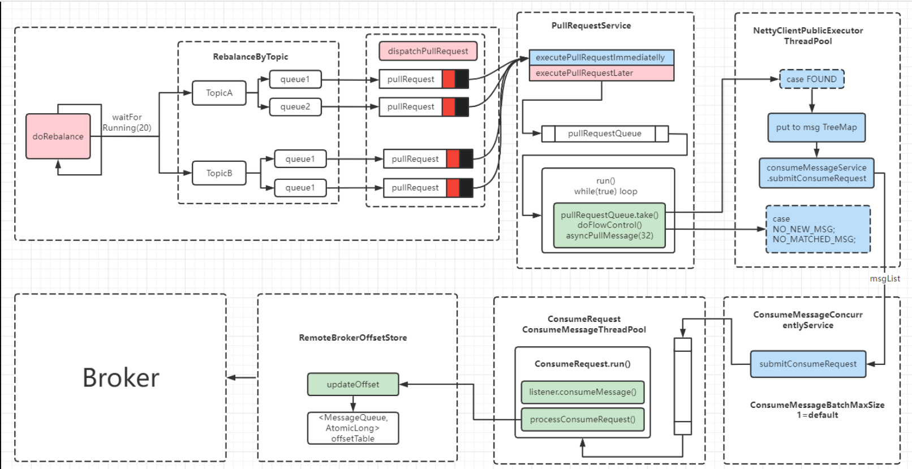

流程如下：

1.  消费者启动时唤醒重平衡服务 [RebalanceService](http://rebalanceservice/)，重平衡服务是客户端开始消费的起点。
2.  重平衡服务会周期性（每 20s）执行重平衡方法 [doRebalance](http://dorebalance/)，查询所有注册的 Broker，根据注册的 Broker 数量为自身分配负载的队列 [rebalanceByTopic()](http://rebalancebytopic\(\)/)。
3.  分配完队列后，会为每个分配到的新队列创建一个消息拉取请求 [pullRequest](http://pullrequest/)，这个拉取请求中保存一个处理队列 [processQueue](http://processqueue/)，即图中的红黑树 [msgTreeMap](http://msgtreemap/)，用来保存拉取到的消息。红黑树保存消息的顺序。
4.  消息拉取线程应用生产-消费模式，用一个线程从拉取请求队列 [pullRequestQueue](http://pullrequestqueue%20/) 中弹出拉取请求，执行拉取任务，将拉取到的消息放入处理队列。
5.  拉取请求在一次拉取消息完成之后会复用，重新被放入拉取请求队列 [pullRequestQueue](http://pullrequestqueue%20/) 中。
6.  拉取完成后，在 [NettyClientPublicExecutorThreadPool](http://nettyclientpublicexecutorthreadpool%20/) 线程池异步处理结果，将拉取到的消息放入处理队列，然后调用 [consumeMessageService.submitConsumeRequest](http://consumemessageservice.submitconsumerequest/)，将处理队列和 多个消费任务提交到消费线程池。每个消费任务消费 1 批消息（1 批默认为 1 条）
7.  每个消费者都有一个消费线程池 [consumeMessageThreadPool](http://consumemessagethreadpool%20/) ，默认有 20 个消费线程。
8.  消费线程池的每个消费线程会尝试从消费任务队列中获取消费请求，执行消费业务逻辑 [listener.consumeMessage](http://%20listener.consumemessage/)。
9.  消费完成后，如果消费成功，则更新偏移量 [updateOffset](http://updateoffset/)（先更新到内存 offsetTable，定时上报到 Broker。Broker 端也先放到内存，定时刷盘）。

## **04 顺序消费流程**

源码位置：[https://github.com/apache/rocketmq/blob/release-5.1.2/client/src/main/java/org/apache/rocketmq/client/impl/consumer/](https://github.com/apache/rocketmq/blob/release-5.1.2/client/src/main/java/org/apache/rocketmq/client/impl/consumer/ConsumeMessageOrderlyService.java)[ConsumeMessageOrderlyService](https://github.com/apache/rocketmq/blob/release-5.1.2/client/src/main/java/org/apache/rocketmq/client/impl/consumer/ConsumeMessageOrderlyService.java)[.java](https://github.com/apache/rocketmq/blob/release-5.1.2/client/src/main/java/org/apache/rocketmq/client/impl/consumer/ConsumeMessageOrderlyService.java)

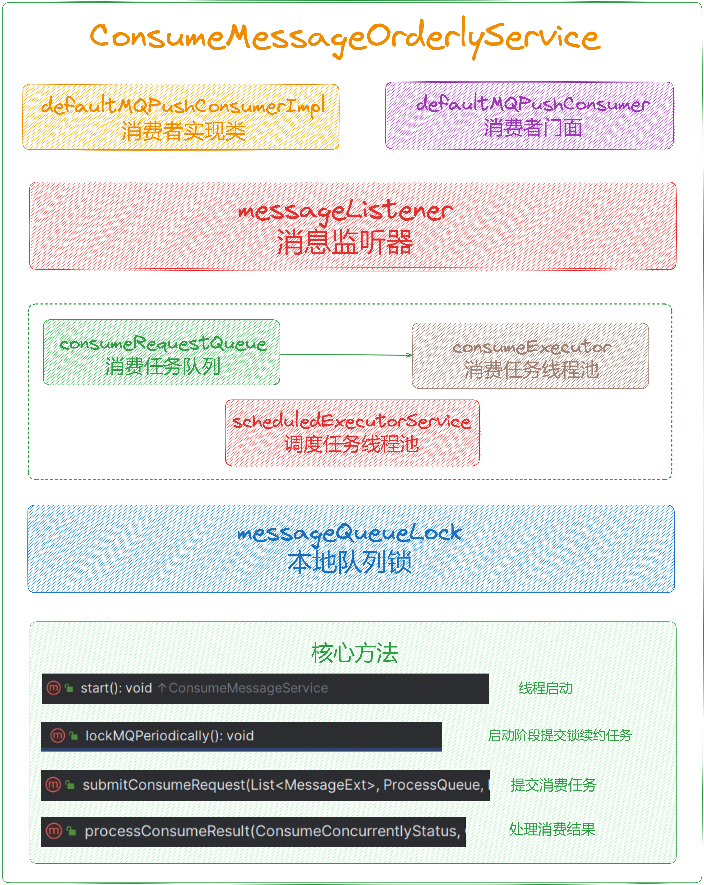

先来看下该类的重要属性。

public class ConsumeMessageOrderlyService implements ConsumeMessageService {

private static final Logger log \= LoggerFactory.getLogger(ConsumeMessageOrderlyService.class);

private final static long MAX\_TIME\_CONSUME\_CONTINUOUSLY \=

Long.parseLong(System.getProperty("rocketmq.client.maxTimeConsumeContinuously", "60000"));

// 消息推模式实现类

private final DefaultMQPushConsumerImpl defaultMQPushConsumerImpl;

// 默认推模式消费者

private final DefaultMQPushConsumer defaultMQPushConsumer;

// 顺序消息监听

private final MessageListenerOrderly messageListener;

// 消费线程池的任务队列

private final BlockingQueue<Runnable> consumeRequestQueue;

// 消费任务线程池

private final ThreadPoolExecutor consumeExecutor;

// 消费组

private final String consumerGroup;

// 本地队列锁

private final MessageQueueLock messageQueueLock \= new MessageQueueLock();

// 消费延迟调度线程池

private final ScheduledExecutorService scheduledExecutorService;

// 是否暂停

private volatile boolean stopped \= false;

....

}

## **4.1 顺序消费服务启动**

[consumeMessageService](http://consumemessageservice/) 服务在 [DefaultMQPushConsumerImpl#start](http://defaultmqpushconsumerimpl/#start) 方法中被初始化并启动，将会通过[scheduledExecutorService](http://scheduledexecutorservice/) 定时任务锁定所有分配的 MQ，保证同时只有一个消费端可以消费。

这个定时任务在启动 1s 后开始执行，后每 20s 执行一次，这里的 20s 可通过 [\-D rocketmq.client.rebalance.lockInterval](http://-d%20rocketmq.client.rebalance.lockinterval/) 属性设置。

因此它的频率与负载均衡的默认频率一致，都是 20s。

// ProcessQueue 类属性 重平衡锁周期 20 秒

public final static long REBALANCE\_LOCK\_INTERVAL \= Long.parseLong(System.getProperty("rocketmq.client.rebalance.lockInterval", "20000"));

// 启动服务

public void start() {

// 集群模式

if (MessageModel.CLUSTERING.equals(ConsumeMessageOrderlyService.

this.defaultMQPushConsumerImpl.messageModel())) {

// 启动一个定时任务，启动后 1s 执行，后续每隔 20s 执行一次

// 尝试对所有分配给当前 consumer 的队列请求 broker 端的消息队列锁，保证同时只有一个消费端可以消费。

this.scheduledExecutorService.scheduleAtFixedRate(new Runnable() {

@Override

public void run() {

try {

// 定期锁定所有消息队列

ConsumeMessageOrderlyService.this.lockMQPeriodically();

} catch (Throwable e) {

log.error("scheduleAtFixedRate lockMQPeriodically exception", e);

}

}

}, 1000 \* 1, ProcessQueue.REBALANCE\_LOCK\_INTERVAL, TimeUnit.MILLISECONDS);

}

}

## **4.1.1 定期锁定消息队列**

内部调用 [RebalanceImpl#lockAll](http://rebalanceimpl/#lockAll) 方法锁定该客户端分配的所有消费队列。

// 锁定所有消息队列

public synchronized void lockMQPeriodically() {

// 线程未停止的话

if (!this.stopped) {

// 内部调用 RebalanceImpl#lockAll 方法锁定该客户端分配的所有消费队列。

this.defaultMQPushConsumerImpl.getRebalanceImpl().lockAll();

}

}

## **4.1.2 尝试锁定所有消息队列**

源码位置：[https://github.com/apache/rocketmq/blob/release-5.1.2/client/src/main/java/org/apache/rocketmq/client/impl/consumer/](https://github.com/apache/rocketmq/blob/release-5.1.2/client/src/main/java/org/apache/rocketmq/client/impl/consumer/RebalanceImpl.java)[RebalanceImpl](https://github.com/apache/rocketmq/blob/release-5.1.2/client/src/main/java/org/apache/rocketmq/client/impl/consumer/RebalanceImpl.java)[.java](https://github.com/apache/rocketmq/blob/release-5.1.2/client/src/main/java/org/apache/rocketmq/client/impl/consumer/RebalanceImpl.java)

// 定时每隔 20s 尝试锁定所有消息队列

public void lockAll() {

// 1、根据 processQueueTable 的数据，构建 brokerName 到所有 mq 的 map 集合

// 在新分配消息队列的时候，也会对新分配的消息队列申请 broker 加锁，加锁成功后会创建对应的processQueue 存入 processQueueTable。即如果是顺序消息，那么 processQueueTable 的数据一定是已经加锁成功了的

HashMap<String, Set<MessageQueue>> brokerMqs = this.buildProcessQueueTableByBrokerName();

// 遍历集合

Iterator<Entry<String, Set<MessageQueue>>> it = brokerMqs.entrySet().iterator();

while (it.hasNext()) {

Entry<String, Set<MessageQueue>> entry = it.next();

final String brokerName \= entry.getKey();

final Set<MessageQueue> mqs = entry.getValue();

if (mqs.isEmpty()) {

continue;

}

// 获取指定 brokerName 的 master 地址。

FindBrokerResult findBrokerResult \= this.mQClientFactory.findBrokerAddressInSubscribe(brokerName, MixAll.MASTER\_ID, true);

if (findBrokerResult != null) {

LockBatchRequestBody requestBody \= new LockBatchRequestBody();

requestBody.setConsumerGroup(this.consumerGroup);

requestBody.setClientId(this.mQClientFactory.getClientId());

requestBody.setMqSet(mqs);

try {

// 2、向broker发送同步请求，Code 为 LOCK\_BATCH\_MQ，请求批量锁定消息队列，返回锁住的 mq 集合

Set<MessageQueue> lockOKMQSet =

this.mQClientFactory.getMQClientAPIImpl().

lockBatchMQ(findBrokerResult.getBrokerAddr(), requestBody, 1000);

// 遍历锁住的 mq 集合

for (MessageQueue mq : mqs) {

// 获取对应的 processQueue，设置 processQueue 的状态

ProcessQueue processQueue \= this.processQueueTable.get(mq);

if (processQueue != null) {

if (lockOKMQSet.contains(mq)) {

if (!processQueue.isLocked()) {

log.info("the message queue locked OK, Group: {} {}", this.consumerGroup, mq);

}

// 设置 locked 为 true

processQueue.setLocked(true);

// 设置加锁的时间

processQueue.setLastLockTimestamp(System.currentTimeMillis());

} else {

// 没有锁住的 mq，设置 locked 为 false

processQueue.setLocked(false);

log.warn("the message queue locked Failed, Group: {} {}", this.consumerGroup, mq);

}

}

}

} catch (Exception e) {

log.error("lockBatchMQ exception, " + mqs, e);

}

}

}

}

该方法尝试锁定所有消息队列，步骤如下：

1.  根据 [processQueueTable](http://processqueuetable/) 的数据，构建 [brokerName](http://brokername/) 到其所有 mq 的 map 集合 [brokerMqs](http://brokermqs/)。在重平衡为当前消费者新分配消息队列的时候，也会对新分配的消息队列申请 [broker](http://broker/) 加锁，加锁成功后才会创建对应的 [processQueue](http://processqueue/) 存入[processQueueTable](http://processqueuetable/)。
2.  即如果是顺序消息，那么[processQueueTable](http://processqueuetable/)中的数据一定是已经加锁成功了的。
3.  遍历 [brokerMqs](http://brokermqs/)，调用 [MQClientAPIImpl#lockBatchMQ](http://mqclientapiimpl/#lockBatchMQ) 的方法，向 broker 发送同步请求，Code 为[LOCK\_BATCH\_MQ](http://lock_batch_mq/)，请求批量锁定消息队列，返回锁住的 mq 集合。
4.  遍历锁住的 mq 集合，获取对应的 [processQueue](http://processqueue/)，设置 [processQueue](http://processqueue/) 的状态，设置 locked 为 true，重新设置加锁的时间。对于没有锁住的 mq，设置 locked 为 false。

## **4.1.3 向 Broker 发送批量锁定请求**

源码位置：[https://github.com/apache/rocketmq/blob/release-5.1.2/client/src/main/java/org/apache/rocketmq/client/impl/](https://github.com/apache/rocketmq/blob/release-5.1.2/client/src/main/java/org/apache/rocketmq/client/impl/MQClientAPIImpl.java)[MQClientAPIImpl](https://github.com/apache/rocketmq/blob/release-5.1.2/client/src/main/java/org/apache/rocketmq/client/impl/MQClientAPIImpl.java)[.java](https://github.com/apache/rocketmq/blob/release-5.1.2/client/src/main/java/org/apache/rocketmq/client/impl/MQClientAPIImpl.java)

该方法向 Broker 发送同步请求，Code 为 [LOCK\_BATCH\_MQ](http://lock_batch_mq/)，请求批量锁定消息队列，返回锁住的 mq 集合。

/\*\*

\* 向 broker 发送同步请求，Code 为 LOCK\_BATCH\_MQ，请求批量锁定消息队列，返回锁住的 mq 集合

\* @param addr broker地址

\* @param requestBody 请求体

\* @param timeoutMillis 超时时间

\* @return

\* @throws RemotingException

\* @throws MQBrokerException

\* @throws InterruptedException

\*/

public Set<MessageQueue> lockBatchMQ(

final String addr,

final LockBatchRequestBody requestBody,

final long timeoutMillis) throws RemotingException, MQBrokerException, InterruptedException {

// Code 为 LOCK\_BATCH\_MQ

RemotingCommand request \= RemotingCommand.createRequestCommand(RequestCode.LOCK\_BATCH\_MQ, null);

request.setBody(requestBody.encode());

// 同步请求，调用 brokerVIPChannel 判断是否开启 vip 通道，如果开启了那么将 brokerAddr 的port – 2，因为vip通道的端口为普通端口 – 2。

RemotingCommand response \= this.remotingClient.invokeSync(MixAll.brokerVIPChannel(this.clientConfig.isVipChannelEnabled(), addr), request, timeoutMillis);

switch (response.getCode()) {

case ResponseCode.SUCCESS: {

// 解码

LockBatchResponseBody responseBody \= LockBatchResponseBody.decode(response.getBody(), LockBatchResponseBody.class);

Set<MessageQueue> messageQueues = responseBody.getLockOKMQSet();

return messageQueues;

}

default:

break;

}

throw new MQBrokerException(response.getCode(), response.getRemark(), addr);

}

可以看到这里调用是通过 VIP 通道的，而 VIP 的端口是普通端口 - 2 得出的，如下：

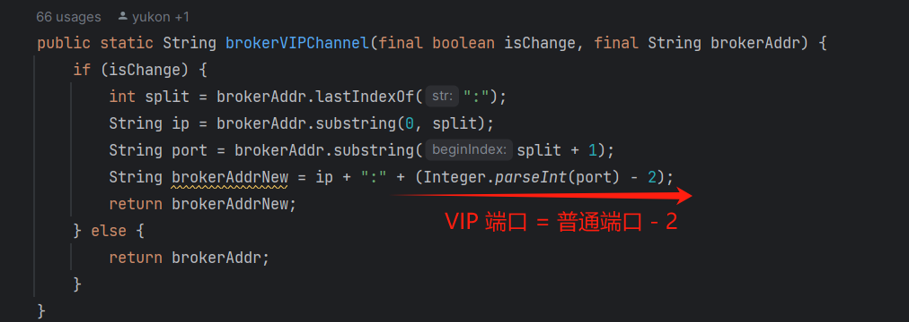

## **4.1.4 Broker 处理批量锁定请求**

这里我们来锁定下该 Code 是 Broker 端哪个类处理的，如下：

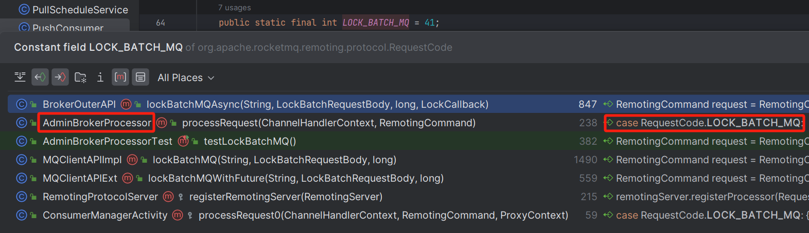

从上得知 broker 端通过 [AdminBrokerProcessor](http://adminbrokerprocessor/) 处理 [LOCK\_BATCH\_MQ](http://lock_batch_mq/) 请求。

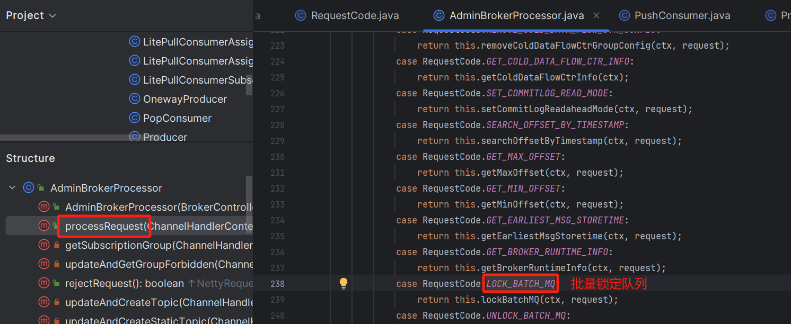

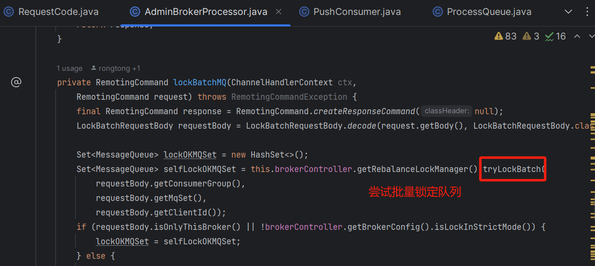

源码位置：[https://github.com/apache/rocketmq/blob/release-5.1.2/](https://github.com/apache/rocketmq/blob/release-5.1.2/broker/src/main/java/org/apache/rocketmq/broker/client/rebalance/RebalanceLockManager.java)[broker](https://github.com/apache/rocketmq/blob/release-5.1.2/broker/src/main/java/org/apache/rocketmq/broker/client/rebalance/RebalanceLockManager.java)[/src/main/java/org/apache/rocketmq/](https://github.com/apache/rocketmq/blob/release-5.1.2/broker/src/main/java/org/apache/rocketmq/broker/client/rebalance/RebalanceLockManager.java)[broker/](https://github.com/apache/rocketmq/blob/release-5.1.2/broker/src/main/java/org/apache/rocketmq/broker/client/rebalance/RebalanceLockManager.java)[client/](https://github.com/apache/rocketmq/blob/release-5.1.2/broker/src/main/java/org/apache/rocketmq/broker/client/rebalance/RebalanceLockManager.java)[rebalance](https://github.com/apache/rocketmq/blob/release-5.1.2/broker/src/main/java/org/apache/rocketmq/broker/client/rebalance/RebalanceLockManager.java)[/](https://github.com/apache/rocketmq/blob/release-5.1.2/broker/src/main/java/org/apache/rocketmq/broker/client/rebalance/RebalanceLockManager.java)[RebalanceLockManager](https://github.com/apache/rocketmq/blob/release-5.1.2/broker/src/main/java/org/apache/rocketmq/broker/client/rebalance/RebalanceLockManager.java)[.java](https://github.com/apache/rocketmq/blob/release-5.1.2/broker/src/main/java/org/apache/rocketmq/broker/client/rebalance/RebalanceLockManager.java)

// 存储不同的 consumerGroup 的下面的 mq 到其锁定的 clientId 的对应关系

private final ConcurrentMap<String/\* group \*/, ConcurrentHashMap<MessageQueue, LockEntry>> mqLockTable =

new ConcurrentHashMap<>(1024);

/\*\*

\* 尝试批量锁定，返回锁定的 mq

\* @param group 消费者组

\* @param mqs 需要锁定的mq集合

\* @param clientId 客户端id

\* @return 已锁定的mq集合

\*/

public Set<MessageQueue> tryLockBatch(final String group, final Set<MessageQueue> mqs,

final String clientId) {

Set<MessageQueue> lockedMqs = new HashSet<>(mqs.size());

Set<MessageQueue> notLockedMqs = new HashSet<>(mqs.size());

// 将已经锁定和未锁定的mq分别存储到不同集合

for (MessageQueue mq : mqs) {

if (this.isLocked(group, mq, clientId)) { // 已经锁定mq集合

lockedMqs.add(mq);

} else {

notLockedMqs.add(mq); // 未锁定 mq

}

}

// 存在未锁定的集合，那么尝试加锁

if (!notLockedMqs.isEmpty()) {

try {

// 获取本地锁，是一个 ReentrantLock，所有的 group 的分配都获得同一个锁

this.lock.lockInterruptibly();

try {

// 获取该消费者组对于消息队列的加锁的情况 map，存放着消息队列到其获取了锁的消费者客户端id的映射关系

ConcurrentHashMap<MessageQueue, LockEntry> groupValue = this.mqLockTable.get(group);

if (null == groupValue) { // 初始化一个 groupValue

groupValue = new ConcurrentHashMap<>(32);

this.mqLockTable.put(group, groupValue);

}

// 遍历未锁定的集合

for (MessageQueue mq : notLockedMqs) {

LockEntry lockEntry \= groupValue.get(mq);

if (null == lockEntry) { // 如果该 mq 未锁定

// 新建一个 LockEntry，设置为当前 clientId，表示已被当前请求的客户端锁定，内部设置锁定时间戳 lastUpdateTimestamp 为当前毫秒时间戳

lockEntry = new LockEntry();

lockEntry.setClientId(clientId);

groupValue.put(mq, lockEntry);

log.info(

"RebalanceLockManager#tryLockBatch: lock a message which has not been locked yet, " \+ "group={}, clientId={}, mq={}", group, clientId, mq);

}

// 如果已被被当前客户端锁定且没有过期

// 每次锁定过期时间为 REBALANCE\_LOCK\_MAX\_LIVE\_TIME，默认60s，可通过-Drocketmq.broker.rebalance.lockMaxLiveTime 的 broker 参数设置

if (lockEntry.isLocked(clientId)) {

// 重新设置锁定时间为当前时间戳

lockEntry.setLastUpdateTimestamp(System.currentTimeMillis());

// 加入到已锁定的 mq 中

lockedMqs.add(mq);

continue; // 下一次循环

}

// 获取客户端id，此时表示不是当前 clientId 获得的锁，或者锁已经过期

String oldClientId \= lockEntry.getClientId();

// 如果锁已过期

if (lockEntry.isExpired()) {

// 设置当前 clientId 获得锁

lockEntry.setClientId(clientId);

// 重新设置锁定时间为当前时间戳

lockEntry.setLastUpdateTimestamp(System.currentTimeMillis());

log.warn(

"RebalanceLockManager#tryLockBatch: try to lock a expired message queue, group={}, " + "mq={}, old client id={}, new client id={}", group, mq, oldClientId, clientId);

// 加入到已锁定的 mq 中

lockedMqs.add(mq);

continue; // 下一次循环

}

// 到此表示 mq 被其他客户端锁定了

log.warn(

"RebalanceLockManager#tryLockBatch: message queue has been locked by other client, " \+ "group={}, mq={}, locked client id={}, current client id={}", group, mq, oldClientId, clientId);

}

} finally {

// 本地锁解锁

this.lock.unlock();

}

} catch (InterruptedException e) {

log.error("RebalanceLockManager#tryBatch: unexpected error, group={}, mqs={}, clientId={}", group, mqs, clientId, e);

}

}

// 返回已锁定 mq 集合

return lockedMqs;

}

[lockBatchMQ](http://lockbatchmq/) 方法就是 Broker 处理批量锁定请求的方法。在 Broker 内部使用一个 [ConcurrentMap<String/ group \*/, ConcurrentHashMap<MessageQueue, LockEntry>>](http://concurrentmapstring/%20group%20*/,%20ConcurrentHashMapMessageQueue,%20LockEntry) 类型的 [mqLockTable](http://mqlocktable/) 存储不同的[consumerGroup](http://consumergroup/) 的下面的 mq 到其锁定的 clientId 的对应关系，步骤如下：

1.  首先将已被当前 clientId 锁定和未锁定的 mq 分别存储到不同集合，然后对于未锁定的 mq 尝试加锁。
2.  获取本地锁防止并发，这是一个 [ReentrantLock](http://reentrantlock/)，所有的 group 的分配都获得同一个锁。
3.  获取该消费者组对于消息队列的加锁的情况 map，存放着下面的消息队列 mq 到其获取了锁的消费者客户端 id 的映射关系。因为一个消费者组下面的一个 mq 只能被一个 clientId 锁定。
4.  遍历未锁定的 mq 集合。
5.  如果 mq 未被任务客户端锁定，那么设置新建一个 [LockEntry](http://lockentry/)，设置为当前 [clientId](http://clientid/)，表示已被当前请求的客户端锁定，内部设置锁定时间戳 [lastUpdateTimestamp](http://lastupdatetimestamp/) 为当前毫秒时间戳。
6.  如果已被被当前客户端锁定且没有过期。那么重新设置锁定时间为当前时间戳，加入到已锁定的 mq 中，进行下一次循环。每次锁定过期时间为 [REBALANCE\_LOCK\_MAX\_LIVE\_TIME](http://rebalance_lock_max_live_time/)，默认 60s，可通过 [-Drocketmq.broker.rebalance.lockMaxLiveTime](http://%20-drocketmq.broker.rebalance.lockmaxlivetime/) 的 broker 参数设置。
7.  如果锁已过期，则设置当前 clientId 获得了锁，进行下一次循环。
8.  否则表示所没有过期并且也不是当前 clientId 获得的锁，仅仅输出日志，然后进行下一次循环。

## **4.1.5 小结**

[consumeMessageService](http://consumemessageservice/) 服务在 [DefaultMQPushConsumerImpl#start](http://defaultmqpushconsumerimpl/#start) 方法中被初始化并启动，该方法将会通过 [scheduledExecutorService](http://scheduledexecutorservice/) 定时任务锁定所有分配的 mq，**主要保证同时只有一个消费端可以消费**。

在前面重平衡的部分就知道，在「**集群模式**」加上「**顺序消费**」的情况下，一定是要向 broker 申请[messageQueue](http://messagequeue/) 锁成功之后构建 [processQueue](http://processqueue/) 并且加入到 [processQueueTable](http://processqueuetable/)，才能在随后发起拉取消息的请求，所以说此处的定时调度任务，仅仅只是遍历 [processQueueTable](http://processqueuetable/) 的所有 mq 且申请锁定，**主要目的就是向 Broker 进行分布式 mq 锁的续期操作**。

对于从 broker 锁定的 mq，在客户端的过期时间默认为 30s，可以通过客户端启动参数[\-Drocketmq.client.rebalance.lockMaxLiveTime](http://-drocketmq.client.rebalance.lockmaxlivetime/) 参数设置。但是在 broker 端看来，这个锁的过期时间默认 60s，可以通过 broker 启动参数 [\-Drocketmq.broker.rebalance.lockMaxLiveTime](http://-drocketmq.broker.rebalance.lockmaxlivetime/) 设置。

了解完锁定队列工作后，我们来看下本篇的重点内容，即消费者拉取完成后，将拉取到的消息构建为 [ConsumeRequest](http://consumerequest/)，然后通过内部的 [consumeExecutor](http://consumeexecutor/) 线程池消费消息。

## **4.2 提交消费请求**

/\*\*

\* 提交顺序消费请求

\* @param msgs 拉取到的消息

\* @param processQueue 处理队列

\* @param messageQueue 消息队列

\* @param dispathToConsume 是否分发消费

\*/

@Override

public void submitConsumeRequest(

final List<MessageExt> msgs,

final ProcessQueue processQueue,

final MessageQueue messageQueue,

final boolean dispathToConsume) {

if (dispathToConsume) { // 如果允许分发消费

// 构建消费请求，没有将消费放进去，消费会自动拉取 msgTreemap 中的消息

ConsumeRequest consumeRequest \= new ConsumeRequest(processQueue, messageQueue);

// 将请求提交到 consumeExecutor 线程池中进行消费

this.consumeExecutor.submit(consumeRequest);

}

}

该方法用来提交消费请求任务，会判断是否分发消费，如果允许则创建一个 [ConsumeRequest](http://consumerequest%20/) 提交到 [ConsumeMessageOrderlyService](http://consumemessageorderlyservice%20/) 内部的 [consumeExecutor](http://consumeexecutor%20/) 线程池中进行异步消费，否则什么也不做。

顺序消费需要「**严格保证顺序性**」，所以只有一个 [ConsumeRequest](http://consumerequest%20/) ，**需要注意的是这里并没有将消息放进** [ConsumeRequest](http://consumerequest/) **中，主要因为消费线程会自动拉取 msgTreeMap 中的消息**。

这里只判断了 [dispathToConsume](http://dispathtoconsume/) 是否为 true，那么什么时候 [dispathToConsume](http://dispathtoconsume/) 为 true 呢？

当 [processQueue](http://processqueue/) 的内部的 [msgTreeMap](http://msgtreemap/) 中有消息，并且 [consuming = false](http://consuming%20=%20false/)，即还没有开始消费时，将会返回true，新提交一个消费任务进去激活消费。如果已经在消费了，那么不会提交新的消费任务，老的消费任务会自动去 [msgTreeMap](http://msgtreemap/) 拉取消息。

## **4.3 线程池处理消费任务**

在「**顺序消费**」类初始化时，会进行「**线程池**」初始化。

相关配置：

  
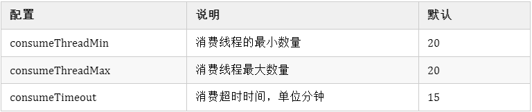

// 构造方法

public ConsumeMessageOrderlyService(DefaultMQPushConsumerImpl defaultMQPushConsumerImpl,

MessageListenerOrderly messageListener) {

this.defaultMQPushConsumerImpl = defaultMQPushConsumerImpl;

this.messageListener = messageListener;

this.defaultMQPushConsumer = this.defaultMQPushConsumerImpl.getDefaultMQPushConsumer();

this.consumerGroup = this.defaultMQPushConsumer.getConsumerGroup();

this.consumeRequestQueue = new LinkedBlockingQueue<>();

String consumerGroupTag \= (consumerGroup.length() > 100 ? consumerGroup.substring(0, 100) : consumerGroup) + "\_";

// 并发消费线程池

// 最小、最大线程数默认20，阻塞队列为无界阻塞队列LinkedBlockingQueue

this.consumeExecutor = new ThreadPoolExecutor(

this.defaultMQPushConsumer.getConsumeThreadMin(),

this.defaultMQPushConsumer.getConsumeThreadMax(),

1000 \* 60,

TimeUnit.MILLISECONDS,

this.consumeRequestQueue,

new ThreadFactoryImpl("ConsumeMessageThread\_" + consumerGroupTag));

this.scheduledExecutorService = Executors.newSingleThreadScheduledExecutor(new ThreadFactoryImpl("ConsumeMessageScheduledThread\_" + consumerGroupTag));

}

[ConsumeRequest](http://consumerequest%20/) 作为线程任务被 [ConsumeMessageOrderlyService](http://consumemessageorderlyservice/) 内部的 [consumeExecutor](http://consumeexecutor/) 线程池异步的执行。

## **4.4 执行消费任务**

[ConsumeRequest](http://consumerequest/) 类本身是一个线程任务，当拉取到消息之后会将一批消息构建为一个 [ConsumeRequest](http://consumerequest/) 对象，提交给 [consumeExecutor](http://consumeexecutor/)，由线程池异步的执行。

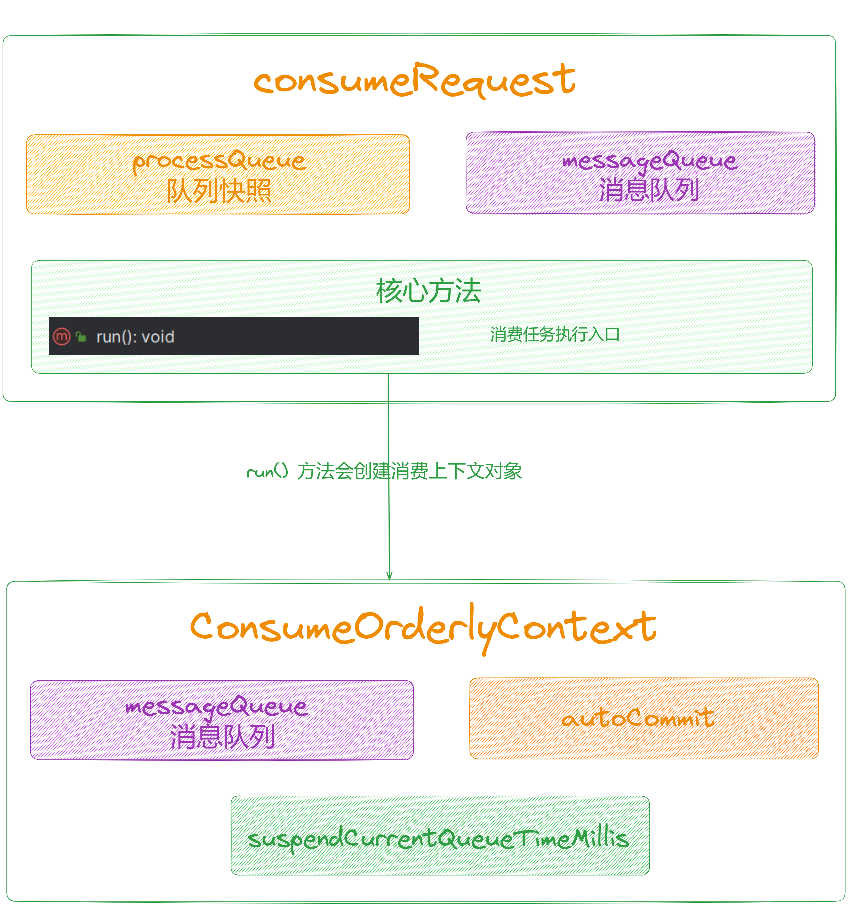

class ConsumeRequest implements Runnable {

private final ProcessQueue processQueue; // 处理队列

private final MessageQueue messageQueue; // 消息队列

public ConsumeRequest(ProcessQueue processQueue, MessageQueue messageQueue) {

this.processQueue = processQueue;

this.messageQueue = messageQueue;

}

public ProcessQueue getProcessQueue() {

return processQueue;

}

public MessageQueue getMessageQueue() {

return messageQueue;

}

// 执行顺序消费

@Override

public void run() {

// 如果处理队列被丢弃，那么直接返回，不再消费，比如重平衡时该队列被分配给了其他新上线的消费者，尽量避免重复消费

if (this.processQueue.isDropped()) {

log.warn("run, the message queue not be able to consume, because it's dropped. {}", this.messageQueue);

return;

}

// 1、 消费消息之前先获取当前 messageQueue 的本地锁，防止并发

// 这将导致 ConsumeMessageOrderlyService 线程池中的线程将不会同时并发的消费同一个队列

final Object objLock \= messageQueueLock.fetchLockObject(this.messageQueue);

// 阻塞式的获取同步锁，锁对象是一个 Object 对象，采用原生的 synchronized 锁定

synchronized (objLock) {

// 2、如果是广播模式，或者是集群模式，锁定了 processQueue 处理队列，且 processQueue 处理队列锁没有过期，那么可以消费消息

// processQueue 处理队列锁定实际上就是在重平衡的时候向 broker 申请的消息队列分布式锁，申请成功之后将 processQueue.locked 属性置为 true。当前消费者通过 RebalanceImpl#rebalanceByTopic 分配了新的消息队列之后，对于集群模式的顺序消费会尝试通过 RebalanceImpl#lock 方法请求 broker 获取该队列的分布式锁。 同理在 ConsumeMessageOrderlyService 启动的时候，其对于集群模式则会启动一个定时任务，默认每隔 20s 调用 RebalanceImpl#lockAll 方法，请求 broker 获取所有分配的队列的分布式锁

if (MessageModel.BROADCASTING.equals(ConsumeMessageOrderlyService.

this.defaultMQPushConsumerImpl.messageModel())

|| this.processQueue.isLocked() && !this.processQueue.isLockExpired()) {

// 消费开始时间

final long beginTime \= System.currentTimeMillis();

// 3、循环继续消费，直到超时或者条件不满足退出循环

for (boolean continueConsume \= true; continueConsume; ) {

// 3.1、如果处理队列被丢弃，那么直接返回，不再消费，比如重平衡时该队列被分配给了其他新上线的消费者，尽量避免重复消费

if (this.processQueue.isDropped()) {

log.warn("the message queue not be able to consume, because it's dropped. {}", this.messageQueue);

break; // 结束循环，本次消费任务结束

}

// 3.2、如果是集群模式，并且没有锁定了 processQueue 处理队列

if (MessageModel.CLUSTERING.equals(ConsumeMessageOrderlyService.

this.defaultMQPushConsumerImpl.messageModel())

&& !this.processQueue.isLocked()) {

log.warn("the message queue not locked, so consume later, {}", this.messageQueue);

// 对该队列请求 broker 获取该队列的分布式锁，然后延迟提交消费请求

ConsumeMessageOrderlyService.this.

tryLockLaterAndReconsume(this.messageQueue, this.processQueue, 10);

break; // 结束循环，本次消费任务结束

}

// 3.3、如果是集群模式且 processQueue 处理队列锁已经过期

// 客户端对于从 broker 获取的mq锁，过期时间默认 30s，可以通过 -Drocketmq.client.rebalance.lockMaxLiveTime 参数设置

if (MessageModel.CLUSTERING.equals(ConsumeMessageOrderlyService.this.

defaultMQPushConsumerImpl.messageModel())

&& this.processQueue.isLockExpired()) {

log.warn("the message queue lock expired, so consume later, {}", this.messageQueue);

// 对该队列请求 broker 获取该队列的分布式锁，然后延迟提交消费请求

ConsumeMessageOrderlyService.this.tryLockLaterAndReconsume(

this.messageQueue, this.processQueue, 10);

break; // 结束循环，本次消费任务结束

}

// 计算消费时间

long interval \= System.currentTimeMillis() - beginTime;

// 3.4、如果单次消费任务的消费时间大于默认 60s，可以通过-Drocketmq.client.maxTimeConsumeContinuously 配置启动参数来设置时间

if (interval > MAX\_TIME\_CONSUME\_CONTINUOUSLY) {

// 延迟提交新的消费请求

ConsumeMessageOrderlyService.this.submitConsumeRequestLater

(processQueue, messageQueue, 10);

break; // 结束循环，本次消费任务结束

}

// 获取单次批量消费的数量，默认1，可以通过DefaultMQPushConsumer.consumeMessageBatchMaxSize 的属性配置

final int consumeBatchSize \=

ConsumeMessageOrderlyService.this.

defaultMQPushConsumer.getConsumeMessageBatchMaxSize();

// 3.5、从 processQueue 内部的 msgTreeMap 有序 map 集合中获取 offset 最小的 consumeBatchSize 条消息，按顺序从最小的 offset 返回保证有序性

List<MessageExt> msgs = this.processQueue.takeMessages(consumeBatchSize);

// 重置重试 topic，当消息是重试消息的时候，将 msg 的 topic 属性从重试 topic 还原为真实的 topic。

defaultMQPushConsumerImpl.resetRetryAndNamespace(msgs, defaultMQPushConsumer.getConsumerGroup());

// 4、如果拉取到了消息，那么进行消费

if (!msgs.isEmpty()) {

// 顺序消费上下文

final ConsumeOrderlyContext context \= new ConsumeOrderlyContext(this.messageQueue);

// 消费状态

ConsumeOrderlyStatus status \= null;

ConsumeMessageContext consumeMessageContext \= null;

// 4.1、如果有钩子，那么执行 consumeMessageBefore 前置方法

if (ConsumeMessageOrderlyService.this.

defaultMQPushConsumerImpl.hasHook()) {

consumeMessageContext = new ConsumeMessageContext();

consumeMessageContext

.setConsumerGroup(ConsumeMessageOrderlyService.

this.defaultMQPushConsumer.getConsumerGroup());

consumeMessageContext.setNamespace(

defaultMQPushConsumer.getNamespace());

consumeMessageContext.setMq(messageQueue);

consumeMessageContext.setMsgList(msgs);

consumeMessageContext.setSuccess(false);

// init the consume context type

consumeMessageContext.setProps(new HashMap<>());

ConsumeMessageOrderlyService.this.defaultMQPushConsumerImpl.

executeHookBefore(consumeMessageContext);

}

// 开始时间

long beginTimestamp \= System.currentTimeMillis();

// 消费返回类型

ConsumeReturnType returnType \= ConsumeReturnType.SUCCESS;

boolean hasException \= false;

try {

// 4.2、真正消费消息之前再获取 processQueue 的本地消费锁，保证消息消费时，一个处理队列不会被并发消费

// 从这里可知，顺序消费需要获取三把锁，broker 的 messageQueue 锁，本地的 messageQueue 锁，本地的 processQueue 锁

this.processQueue.getConsumeLock().lock();

// 如果处理队列被丢弃，那么直接返回，不再消费

if (this.processQueue.isDropped()) {

log.warn("consumeMessage, the message queue not be able to consume, because it's dropped. {}", this.messageQueue);

break; // 结束循环，本次消费任务结束

}

// 4.3 、用 listener#consumeMessage 方法，进行消息消费，调用实际的业务逻辑，返回执行状态结果

// 这里有四种状态，ConsumeOrderlyStatus.SUCCESS 和 ConsumeOrderlyStatus.SUSPEND\_CURRENT\_QUEUE\_A\_MOMENT 推荐使用

// ConsumeOrderlyStatus.ROLLBACK和ConsumeOrderlyStatus.COMMIT已被废弃

status = messageListener.consumeMessage(

Collections.unmodifiableList(msgs), context);

} catch (Throwable e) {

log.warn(String.format("consumeMessage exception: %s Group: %s Msgs: %s MQ: %s", UtilAll.exceptionSimpleDesc(e),

ConsumeMessageOrderlyService.this.consumerGroup,

msgs,

messageQueue), e);

hasException = true; // 抛出异常之后，设置异常标志位

} finally {

this.processQueue.getConsumeLock().unlock(); // 解锁

}

// 4.4、对返回的执行状态结果进行判断处理

// 如果 status 为 null，或返回了 ROLLBACK 或者SUSPEND\_CURRENT\_QUEUE\_A\_MOMENT 状态，那么输出日志

if (null == status

|| ConsumeOrderlyStatus.ROLLBACK == status

|| ConsumeOrderlyStatus.SUSPEND\_CURRENT\_QUEUE\_A\_MOMENT == status) {

log.warn("consumeMessage Orderly return not OK, Group: {} Msgs: {} MQ: {}", ConsumeMessageOrderlyService.this.consumerGroup, msgs, messageQueue);

}

// 计算消费时间

long consumeRT \= System.currentTimeMillis() - beginTimestamp;

if (null == status) { // 如果 status 为 null

if (hasException) { // 如果业务的执行抛出了异常

returnType = ConsumeReturnType.EXCEPTION; // 设置returnType为EXCEPTION

} else {

returnType = ConsumeReturnType.RETURNNULL; // 设置returnType为RETURNNULL

}

// 如果消费时间 consumeRT 大于等于 consumeTimeout，默认 15min

} else if (consumeRT >= defaultMQPushConsumer.getConsumeTimeout() \* 60 \* 1000) { // 设置returnType为TIME\_OUT

returnType = ConsumeReturnType.TIME\_OUT;

// 如果 status为SUSPEND\_CURRENT\_QUEUE\_A\_MOMENT，即消费失败

} else if (ConsumeOrderlyStatus.SUSPEND\_CURRENT\_QUEUE\_A\_MOMENT == status) { // 设置returnType为FAILED

returnType = ConsumeReturnType.FAILED;

// 如果 status为SUCCESS，即消费成功

} else if (ConsumeOrderlyStatus.SUCCESS == status) {

returnType = ConsumeReturnType.SUCCESS; // 设置returnType为SUCCESS，即消费成功

}

// 如果有钩子，则将 returnType 设置进去

if (ConsumeMessageOrderlyService.this.

defaultMQPushConsumerImpl.hasHook()) {

consumeMessageContext.getProps().put(MixAll.CONSUME\_CONTEXT\_TYPE, returnType.name());

}

// 如果 status 为 null

if (null == status) {

// 将status设置为SUSPEND\_CURRENT\_QUEUE\_A\_MOMENT，即消费失败

status = ConsumeOrderlyStatus.SUSPEND\_CURRENT\_QUEUE\_A\_MOMENT;

}

// 4.5、如果有消费钩子，那么执行钩子函数的后置方法 consumeMessageAfter

// 我们可以注册钩子 ConsumeMessageHook，在消费消息的前后调用

if (ConsumeMessageOrderlyService.this.

defaultMQPushConsumerImpl.hasHook()) {

consumeMessageContext.setStatus(status.toString());

consumeMessageContext

.setSuccess(ConsumeOrderlyStatus.SUCCESS == status ||

ConsumeOrderlyStatus.COMMIT == status);

ConsumeMessageOrderlyService.this.defaultMQPushConsumerImpl.

executeHookAfter(consumeMessageContext);

}

// 增加消费时间

ConsumeMessageOrderlyService.this.getConsumerStatsManager()

.incConsumeRT(ConsumeMessageOrderlyService.this.consumerGroup, messageQueue.getTopic(), consumeRT);

// 5、调用 ConsumeMessageOrderlyService#processConsumeResult 方法处理消费结果，包含重试等逻辑

continueConsume = ConsumeMessageOrderlyService.this.processConsumeResult(msgs, status, context, this);

} else {

continueConsume = false; // 如果没有拉取到消息，那么设置continueConsume为false，将会跳出循环

}

}

} else {

// 如果 processQueue 被丢弃，则直接结束本次消费请求

if (this.processQueue.isDropped()) {

log.warn("the message queue not be able to consume, because it's dropped. {}", this.messageQueue);

return;

}

//如果是集群模式，并且没有锁定了processQueue处理队列或者processQueue处理队列锁已经过期，尝试延迟加锁并重新消费

ConsumeMessageOrderlyService.this.tryLockLaterAndReconsume(this.messageQueue, this.processQueue, 100);

}

}

}

}

1.  如果处理队列被丢弃，那么直接返回，不再消费，比如重平衡时该队列被分配给了其他新上线的消费者，尽量避免重复消费。
2.  消费消息之前先获取当前 [messageQueue](http://messagequeue/) 的本地锁，锁对象是一个Object对象，每一个 mq 对应一个不同的 Object，采用原生的 [synchronized](http://synchronized/) 阻塞式的获取同步锁。这将导致 [ConsumeMessageOrderlyService](http://consumemessageorderlyservice/) 的线程池中的线程将不会同时并发的消费同一个队列。
3.  如果是广播模式或者是集群模式，并且锁定了 [processQueue](http://processqueue/) 处理队列，并且 [processQueue](http://processqueue/) 处理队列锁没有过期，那么可以消费消息。[processQueue](http://processqueue/) 处理队列锁定实际上就是在重平衡的时候向 broker 申请的消息队列分布式锁，申请成功之后将 [processQueue.locked](http://processqueue.locked/) 属性置为true。内部一个循环中不断的消费，直到消费超时或者条件不满足退出循环。
4.  如果处理队列被丢弃，那么直接返回，不再消费，比如重平衡时该队列被分配给了其他新上线的消费者，尽量避免重复消费。
5.  如果是集群模式，并且没有锁定了 [processQueue](http://processqueue/) 处理队列，或者 [processQueue](http://processqueue/) 处理队列锁已经过期，那么调用[tryLockLaterAndReconsume](http://trylocklaterandreconsume/) 尝试延迟 10ms 请求 broker 加锁并重新延迟提交新的消费请求。
6.  计算消费时间。如果单次消费任务的消费时间大于默认 60s，那么延迟 10ms 提交新的消费请求，并且结束循环，本次消费任务结束。单次最大消费时间可以通过[\-Drocketmq.client.maxTimeConsumeContinuously](http://-drocketmq.client.maxtimeconsumecontinuously/) 配置启动参数来设置时间。
7.  调用 [getConsumeMessageBatchMaxSize](http://getconsumemessagebatchmaxsize/) 方法，获取单次批量消费的数量 [consumeBatchSize](http://consumebatchsize/)，默认1，可以通过[DefaultMQPushConsumer.consumeMessageBatchMaxSize](http://defaultmqpushconsumer.consumemessagebatchmaxsize/) 的属性配置。
8.  调用 [takeMessages](http://takemessages/) 方法，从 [processQueue](http://processqueue/) 内部的 [msgTreeMap](http://msgtreemap/) 有序 map 集合中获取 offset 最小的[consumeBatchSize](http://consumebatchsize%20/) 条消息，按顺序从最小的 offset 返回，保证有序性。
9.  调用 [resetRetryAndNamespace](http://resetretryandnamespace/) 方法，重置重试 topic，当消息是重试消息的时候，将 msg 的 topic 属性从重试 topic 还原为真实的 topic。
10.  如果 [takeMessages](http://takemessages/) 方法拉取到了消息，那么进行消费。
11.  如果有钩子，那么执行 [consumeMessageBefore](http://consumemessagebefore/) 前置方法。我们可以通过[DefaultMQPushConsumerImpl#registerConsumeMessageHook](http://defaultmqpushconsumerimpl/#registerConsumeMessageHook) 方法注册消费钩子 [ConsumeMessageHook](http://consumemessagehook/)，在消费消息的前后调用。
12.  真正消费消息之前再获取 [processQueue](http://processqueue/) 的本地消费锁，保证消息消费时，一个处理队列不会被并发消费。从这里可知，顺序消费需要获取三把锁，broker 的 [messageQueue](http://messagequeue/) 锁，本地的 [messageQueue](http://messagequeue/) 锁，本地的 [processQueue](http://processqueue/) 锁。
13.  调用 [listener#consumeMessage](http://listener/#consumeMessage) 方法，进行消息消费，调用实际的业务逻辑，返回执行状态结果，有四种状态，[ConsumeOrderlyStatus.SUCCESS](http://consumeorderlystatus.success/) 和 [ConsumeOrderlyStatus.SUSPEND\_CURRENT\_QUEUE\_A\_MOMENT](http://consumeorderlystatus.suspend_current_queue_a_moment/) 推荐使用，[ConsumeOrderlyStatus.ROLLBACK](http://consumeorderlystatus.rollback/) 和 [ConsumeOrderlyStatus.COMMIT](http://consumeorderlystatus.commit/) 已被废弃。
14.  解锁，然后对返回的执行状态结果进行判断处理。
15.  如果 status 为 null，或返回了 [ROLLBACK](http://rollback/) 或者 [SUSPEND\_CURRENT\_QUEUE\_A\_MOMENT](http://suspend_current_queue_a_moment/) 状态，那么输出日志。
16.  计算消费时间 [consumeRT](http://consumert/)。如果 status 为 null，如果业务的执行抛出了异常，设置 returnType 为 [EXCEPTION](http://exception/)，否则设置 returnType 为 [RETURNNULL](http://returnnull/)。
17.  如消费时间 [consumeRT](http://consumert%20/) 大于等于 [consumeTimeout](http://consumetimeout/)，默认15min。设置 returnType 为 [TIME\_OUT](http://time_out/)。消费超时时间可通过 -[DefaultMQPushConsumer. consumeTimeout](http://defaultmqpushconsumer.%20consumetimeout/) 属性配置，默认15，单位分钟。
18.  如果 statu s为 [SUSPEND\_CURRENT\_QUEUE\_A\_MOMENT](http://suspend_current_queue_a_moment/)，即消费失败，设置returnType为FAILED。
19.  如果 status 为 SUCCESS，即消费成功，设置 returnType 为 SUCCESS。
20.  如果有消费钩子，那么执行钩子函数的后置方法 [consumeMessageAfter](http://consumemessageafter/)。
21.  调用 [ConsumeMessageOrderlyService#processConsumeResult](http://consumemessageorderlyservice/#processConsumeResult) 方法处理消费结果，包含重试等逻辑。
22.  如果没有拉取到消息，那么设置 [continueConsume](http://continueconsume%20/) 为 false，将会跳出循环。
23.  如果集群模式，但是没有锁定了 [processQueue](http://processqueue/) 处理队列，或者 [processQueue](http://processqueue/) 处理队列锁已经过期，判断如果[processQueue](http://processqueue/) 被丢弃，则直接结束本次消费请求，否则调用 [tryLockLaterAndReconsume](http://trylocklaterandreconsume/) 尝试延迟 100ms 请求 borker加锁并重新延迟提交新的消费请求。

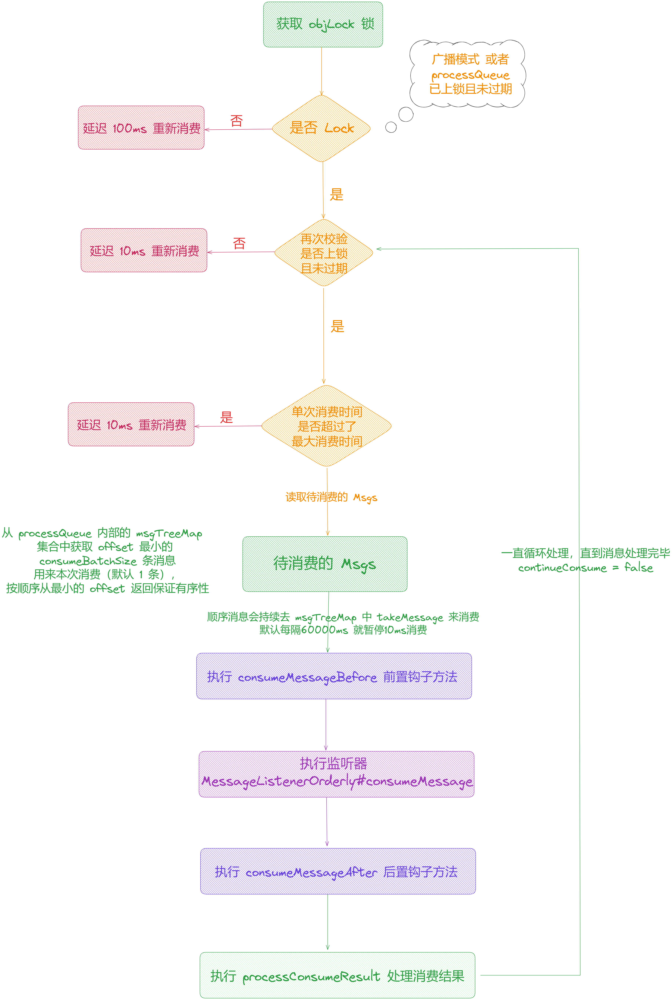

## **4.4.1 尝试延迟加锁并重新消费**

/\*\*

\* 集群模式下，尝试延迟加锁并重新消费

\* @param mq 消息队列

\* @param processQueue 处理队列

\* @param delayMills 延迟时间，如果在循环中，发现没有锁定或者锁过期，那么延迟10ms；如果在最开始判断的时候，就发现处理队列没有被丢弃，但是也没有锁定或者锁过期，那么延迟100ms

\*/

public void tryLockLaterAndReconsume(final MessageQueue mq, final ProcessQueue processQueue,

final long delayMills) {

// 构建一个延迟线程任务，通过延迟线程池服务在给定的延迟时间之后执行

this.scheduledExecutorService.schedule(new Runnable() {

@Override

public void run() {

// 尝试请求 broker 锁定该 mq

boolean lockOK \= ConsumeMessageOrderlyService.this.lockOneMQ(mq);

if (lockOK) {

// 如果锁定成功，那么调用submitConsumeRequestLater方法延迟提交消费请求，延迟10ms。

ConsumeMessageOrderlyService.this.submitConsumeRequestLater(processQueue, mq, 10);

} else {

// 如果锁定失败，那么同样调用submitConsumeRequestLater方法延迟提交消费请求，但是延迟3000ms，即3s。

ConsumeMessageOrderlyService.this.submitConsumeRequestLater(processQueue, mq, 3000);

}

}

}, delayMills, TimeUnit.MILLISECONDS);

}

该方法是在集群模式下，尝试延迟加锁并重新消费，处理逻辑如下：

1.  构建一个延迟线程任务，通过延迟线程池服务在给定的延迟时间之后执行。延迟时间，以及该方法的触发有两种情况：
2.  如果已经在循环中，处理队列没有被丢弃，但是发现没有锁定或者锁过期，那么延迟 10 ms。
3.  如果在最开始判断的时候，处理队列没有被丢弃，但是发现没有锁定或者锁过期，那么延迟 100 ms。
4.  内部的延迟任务如下：
5.  首先尝试请求 broker 锁定该 mq。
6.  如果锁定成功，那么调用 [submitConsumeRequestLater](http://submitconsumerequestlater/) 方法延迟提交消费请求，延迟10 ms。
7.  如果锁定失败，那么同样调用 [submitConsumeRequestLater](http://submitconsumerequestlater/) 方法延迟提交消费请求，但是延迟 3000 ms，即3s。

## **4.4.2 延迟提交消费请求**

/\*\*

\* 延迟提交消费请求

\* @param processQueue 处理队列

\* @param messageQueue 消息队列

\* @param suspendTimeMillis 延迟时间

\*/

private void submitConsumeRequestLater(

final ProcessQueue processQueue,

final MessageQueue messageQueue,

final long suspendTimeMillis

) {

// 如果延迟时间为-1，则将DefaultMQPushConsumer.suspendCurrentQueueTimeMillis属性作为延迟时间，默认1s

long timeMillis \= suspendTimeMillis;

if (timeMillis == -1) {

timeMillis = this.defaultMQPushConsumer.getSuspendCurrentQueueTimeMillis();

}

// 最少延迟10ms，最多延迟30000ms

if (timeMillis < 10) {

timeMillis = 10;

} else if (timeMillis > 30000) {

timeMillis = 30000;

}

// 构建一个延迟线程任务，通过延迟线程池服务在给定的延迟时间之后执行submitConsumeRequest方法

this.scheduledExecutorService.schedule(new Runnable() {

@Override

public void run() {

// 提交的消息为null，dispathToConsume为true，也就是说一定会构建一个新的ConsumeRequest并且将请求提交到consumeExecutor线程池中进行消费

ConsumeMessageOrderlyService.this.submitConsumeRequest(null, processQueue, messageQueue, true);

}

}, timeMillis, TimeUnit.MILLISECONDS);

}

在一次消费任务过程中，如果发现除了处理队列被丢弃之外的不满足继续消费的条件时，比如：如果是集群模式但没有锁定了 [processQueue](http://processqueue/) 处理队列或者 [processQueue](http://processqueue/) 处理队列锁已经过期，或者本次任务消费时间超过了默认的最大时间 60s，都将会调用 [submitConsumeRequestLater](http://submitconsumerequestlater/) 延迟一定时间提交新的消费请求，并且本次消费请求结束。

另外，如果消费失败，返回 [status = null](http://status%20=%20null%20/) 或者 [SUSPEND\_CURRENT\_QUEUE\_A\_MOMENT](http://suspend_current_queue_a_moment/)，那么当校验没有达到最大重试次数时，也会调用 [submitConsumeRequestLater](http://submitconsumerequestlater/) 延迟1s提交新的消费请求，并且本次消费请求结束。

[submitConsumeRequestLater](http://submitconsumerequestlater/) 方法内部构建一个延迟线程任务，通过延迟线程池服务在给定的延迟时间之后执行[submitConsumeRequest](http://submitconsumerequest/) 方法，其中 [dispathToConsume](http://dispathtoconsume/) 参数为 true，也就是说一定会构建一个新的[ConsumeRequest](http://consumerequest/) 并且将请求提交到 [consumeExecutor](http://consumeexecutor/) 线程池中进行消费。

此时，执行该新提交的线程任务的线程将和执行此前的任务的线程可能不是同一个线程，但是却一定能保证同时只有一个线程能对同一个消息队列执行消费。所以说顺序消费同样是通过线程池消费的，它不能保证每次都是同一个线程去消费同一个消息队列，但是它能保证同一时刻同一个队列只有一个线程去消费。

## **4.4.3 拉取消息**

/\*\*

\* ProcessQueue 类的方法

\* @param batchSize 批量消费数量

\* @return 拉取的消息

\*/

public List<MessageExt> takeMessages(final int batchSize) {

List<MessageExt> result = new ArrayList<>(batchSize);

final long now \= System.currentTimeMillis();

try {

// 加锁

this.treeMapLock.writeLock().lockInterruptibly();

this.lastConsumeTimestamp = now;

try {

if (!this.msgTreeMap.isEmpty()) {

// 循环 batchSize 次

for (int i \= 0; i < batchSize; i++) {

// 每次都拉取 msgTreeMap 中最小的一条消息

Map.Entry<Long, MessageExt> entry = this.msgTreeMap.pollFirstEntry();

if (entry != null) {

result.add(entry.getValue());

// 将拉取到的消息存入consumingMsgOrderlyTreeMap中，表示正在消费的消息

consumingMsgOrderlyTreeMap.put(entry.getKey(), entry.getValue());

} else {

break;

}

}

}

// 如果没有拉取到任何一条消息，那么设置consuming为false，表示没有消息了，处于非消费状态

if (result.isEmpty()) {

consuming = false;

}

} finally { // 解锁

this.treeMapLock.writeLock().unlock();

}

} catch (InterruptedException e) {

log.error("take Messages exception", e);

}

return result;

}

顺序消息使用的方法，处理逻辑如下：

1.  从 [processQueue](http://processqueue%20/) 内部的 [msgTreeMap](http://msgtreemap%20/) 有序 map 集合中获取 offset 最小的 [consumeBatchSize](http://consumebatchsize/) 条消息，按顺序从最小的 offset 返回，保证有序性。
2.  拉取操作需要获取到当前 [treeMapLock](http://treemaplock/) 锁，每次都拉取移除 [msgTreeMap](http://msgtreemap/) 中的第一条消息，也就是 offset最小的一条消息，然后将拉取到的消息存入 [consumingMsgOrderlyTreeMap](http://consumingmsgorderlytreemap/) 中，表示正在消费的消息。
3.  最后会判断如果没有拉取到任何一条消息，那么设置 [consuming = false](http://consuming%20=%20false/)，表示没有消息了，处于非消费状态。

## **4.5 处理消费结果**

/\*\*

\* 处理消费结果

\* @param msgs 消息

\* @param status 消费状态

\* @param context 上下文

\* @param consumeRequest 消费请求

\* @return 消费结果，是否继续消费

\*/

public boolean processConsumeResult(

final List<MessageExt> msgs,

final ConsumeOrderlyStatus status,

final ConsumeOrderlyContext context,

final ConsumeRequest consumeRequest

) {

boolean continueConsume \= true;

long commitOffset \= -1L;

// 如果 context 设置为自动提交，context 默认都是 true，除非在业务中手动改为 false

if (context.isAutoCommit()) {

switch (status) {

case COMMIT: // 使用废弃的状态，默认算作 SUCCESS

case ROLLBACK:

log.warn("the message queue consume result is illegal, we think you want to ack these message {}", consumeRequest.getMessageQueue());

case SUCCESS: // 消费成功

// 通过处理队列提交 offset，这里仅仅是更新本地内存的消息缓存信息

commitOffset = consumeRequest.getProcessQueue().commit();

// 统计

this.getConsumerStatsManager().incConsumeOKTPS(consumerGroup, consumeRequest.getMessageQueue().getTopic(), msgs.size());

break;

case SUSPEND\_CURRENT\_QUEUE\_A\_MOMENT: // 消费失败

this.getConsumerStatsManager().incConsumeFailedTPS(consumerGroup, consumeRequest.getMessageQueue().getTopic(), msgs.size()); // 统计

// 校验是否达到最大重试次数，可以通过DefaultMQPushConsumer#maxReconsumeTimes属性配置，默认无上限，即Integer.MAX\_VALUE

if (checkReconsumeTimes(msgs)) {

// 没有到达最大重试次数，标记消息等待再次消费

consumeRequest.getProcessQueue().makeMessageToConsumeAgain(msgs);

// 延迟提交新的消费请求，默认suspendTimeMillis为-1，即延迟1s后重新消费

this.submitConsumeRequestLater(

consumeRequest.getProcessQueue(),

consumeRequest.getMessageQueue(),

context.getSuspendCurrentQueueTimeMillis());

continueConsume = false; // 本消费请求消费结束不会继续消费

} else {

// 达到了最大重试次数，那么提交消息，算作成功

commitOffset = consumeRequest.getProcessQueue().commit();

}

break;

default:

break;

}

} else { // 如果 context 设置为手动提交

switch (status) {

case SUCCESS: // 消费成功

this.getConsumerStatsManager().incConsumeOKTPS(consumerGroup, consumeRequest.getMessageQueue().getTopic(), msgs.size()); // 仅仅是统计数据

break;

case COMMIT: // 只有返回 COMMIT，那么才会提交消息，这里仅仅是更新本地内存的消息缓存信息

commitOffset = consumeRequest.getProcessQueue().commit();

break;

case ROLLBACK: // ROLLBACK 回滚

consumeRequest.getProcessQueue().rollback();

this.submitConsumeRequestLater(

consumeRequest.getProcessQueue(),

consumeRequest.getMessageQueue(),

context.getSuspendCurrentQueueTimeMillis());

continueConsume = false;

break;

case SUSPEND\_CURRENT\_QUEUE\_A\_MOMENT: // 消费失败稍后再试

this.getConsumerStatsManager().incConsumeFailedTPS(consumerGroup, consumeRequest.getMessageQueue().getTopic(), msgs.size()); // 统计

// 校验是否达到最大重试次数，可以通过DefaultMQPushConsumer#maxReconsumeTimes属性配置，默认无上限，即Integer.MAX\_VALUE

if (checkReconsumeTimes(msgs)) {

// 没有到达最大重试次数，标记消息等待再次消费

consumeRequest.getProcessQueue().makeMessageToConsumeAgain(msgs);

// 延迟提交新的消费请求，默认suspendTimeMillis为-1，即延迟1s后重新消费

this.submitConsumeRequestLater(

consumeRequest.getProcessQueue(),

consumeRequest.getMessageQueue(),

context.getSuspendCurrentQueueTimeMillis());

continueConsume = false; // 本消费请求消费结束不会继续消费

}

break; // 达到了最大重试次数，也不会提交消息

default:

break;

}

}

// 如果偏移量大于等于0并且处理队列没有被丢弃，调用OffsetStore# updateOffset方法，尝试更新内存中的offsetTable中的最新偏移量信息

// 第三个参数是否仅单调增加offset为false，表示可能会将offset更新为较小的值

// 这里仅仅是更新内存中的数据，而offset除了在拉取消息时上报broker进行持久化之外，还会定时每5s调用persistAllConsumerOffset定时持久化。

if (commitOffset >= 0 && !consumeRequest.getProcessQueue().isDropped()) {

this.defaultMQPushConsumerImpl.getOffsetStore().

updateOffset(consumeRequest.getMessageQueue(), commitOffset, false);

}

return continueConsume;

}

该方法处理顺序消费的消费结果，包含提交以及重试的逻辑，如下：

1.  首先判断 [context.autoCommit](http://context.autocommit/) 属性是否为 true，即是否设置为自动提交，这个 [context](http://context/) 是在每次消费时都会创建的一个对象，并且默认都是 true，除非在业务中手动改为 false，所以一般都是自动提交。
2.  然后对于各种返回的状态进行判断和处理：
3.  如果返回 [COMMIT](http://commit/) 和 [ROLLBACK](http://rollback/) 这两种废弃的状态，那么仅仅打印日志，并且默认算作[SUCCESS](http://success/) 状态。
4.  如果返回 [SUCCESS](http://success/)，表示消费成功。那么调用 [commit](http://commit/) 方法通过处理队列提交 [offset](http://offset/)，这里仅仅是更新本地内存的消息缓存信息，返回待更新的offset。然后增加成功的统计信息。
5.  如果返回SUSPEND\_CURRENT\_QUEUE\_A\_MOMENT，表示返回失败。那么增加失败的统计信息。
6.  调用 [checkReconsumeTimes](http://checkreconsumetimes/) 方法，校验是否达到最大重试次数，可以通过[DefaultMQPushConsumer#maxReconsumeTimes](http://defaultmqpushconsumer/#maxReconsumeTimes)v属性配置，默认无上限，即 [Integer.MAX\_VALUE](http://integer.max_value/)。
7.  如果没有到达最大重试次数，那么调用 [makeMessageToConsumeAgain](http://makemessagetoconsumeagain/) 方法标记消息等待再次消费，随后调用延迟提交新的消费请求，默认 [suspendTimeMillis](http://suspendtimemillis/) 为 -1，即延迟 1s 后重新消费。设置[continueConsume = false](http://continueconsume%20=%20false/)，本消费请求消费结束不会继续消费。
8.  达到了最大重试次数，那么调用 [commit](http://commit/) 提交消息，返回待更新的 [offset](http://offset/)，算作成功。
9.  如果待更新的偏移量大于等于 0 并且处理队列没有被丢弃，调用 [OffsetStore#updateOffset](http://offsetstore/#updateOffset) 方法，尝试更新内存中的 [offsetTable](http://offsettable/) 中的最新偏移量信息，第三个参数是否仅单调增加 offset 为 false，表示可能会将offset 更新为较小的值。这里仅仅是更新内存中的数据，而 offset 除了在拉取消息时上报broker进行持久化之外，还会定时每 5s 调用 [persistAllConsumerOffset](http://persistallconsumeroffset/) 定时持久化。我们在后面消费进度管理篇章进行深度剖析。

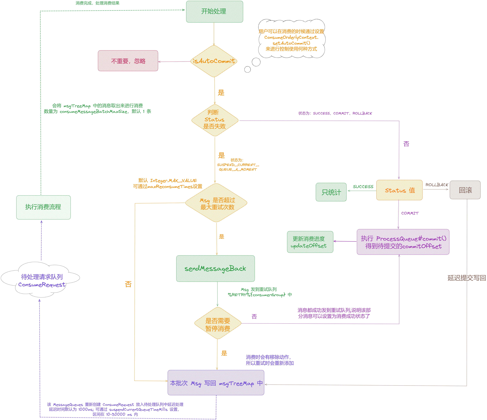

## **05 总结**

这里我们来总结下全文重要知识点。

1.  「**顺序消费**」和「**并发消费**」实际上都是使用「**线程池**」消费，但是不同的是，对于同一个消息队列的消息，「**并发消费**」可能有「**多个线程并发**」的消费消息，提升了消息速度但是没有「**顺序性**」。而「**顺序消费**」则通过「**一系列锁**」，保证「**同一时刻**」对于「**同一个队列**」只有「**一个线程**」去消费它，注意是「**只有一个线程**」而不是「**同一个线程**」，因此有可能你先发送的消息被「**线程1**」消费了，但是你发送的的第二个消息被「**线程2**」消费了，因为他们并不是同时消费的。但是对于「**不同队列**」，「**顺序消费**」则不能保证「**消费有序性**」，因为不同的队列有不同的锁。
2.  「**消费重试**」：「**顺序消费**」和「**并发消费**」对于消费失败的消息均会有消息重试机制。
3.  消费者消费消息时，需要保证消息消费顺序和存储顺序一致，最终实现消费顺序和发布顺序的一致。虽然[MessageListenerOrderly](http://messagelistenerorderly/) 被称为顺序消费模式，但是仍然是使用的线程池去消费消息。实际上每一个消费者的的消费端都是采用线程池实现多线程消费的模式，即消费端是多线程消费。[MessageListenerConcurrently](http://messagelistenerconcurrently/) 是拉取到新消息之后就提交到线程池去消费，而 [MessageListenerOrderly](http://messagelistenerorderly/) 则是通过加分布式锁和本地锁保证同时只有一条线程去消费一个队列上的数据。
4.  「**顺序消费保证**」：顺序消费模式使用 4 把锁来保证消费的顺序性：
5.  （1）、「**broker 端分布式锁**」：在重平衡的处理新分配队列的 [updateProcessQueueTableInRebalance](http://updateprocessqueuetableinrebalance/) 方法，以及[ConsumeMessageOrderlyService](http://consumemessageorderlyservice/) 服务启动时的 start 方法中，都会尝试向 broker 申请当前消费者客户端分配到的 [messageQueue](http://messagequeue/) 的分布式锁。

/\*\*

\* 保存每个消费组消费队列锁定情况，

\* 以消费组名为key，每个消费组可以同时锁住同一个消费分区，以消费组为单位保存

\* 注意，这里不以 topic 为 key，因为每个 topic 都可能会被多个消费组订阅，各个消费组互不影响，

\*/

public class RebalanceLockManager {

private final ConcurrentMap<String/\* group \*/, ConcurrentHashMap<MessageQueue, LockEntry>> mqLockTable = new ConcurrentHashMap<>(1024);

}

1.  broker 端的分布式锁存储结构为 [ConcurrentMap<String/\* group \*/, ConcurrentHashMap<MessageQueue, LockEntry>>](http://concurrentmapstring/*%20group%20*/,%20ConcurrentHashMapMessageQueue,%20LockEntry)，该分布式锁保证同一个 [consumerGroup](http://consumergroup/) 下同一个[messageQueue](http://messagequeue/) 只会被分配给一个 [consumerClient](http://consumerclient/)。
2.  获取到的 broker 端的分布式锁，在 client 端的表现形式为 [processQueue.locked](http://processqueue.%20locked/) 属性为 true，且该分布式锁在 broker 端默认 60s 过期，而在 client 端默认 30s 过期，因此 [ConsumeMessageOrderlyService#start](http://consumemessageorderlyservice/#start) 会启动一个定时任务，每隔 20s 向 broker 申请分布式锁，刷新过期时间。而重平衡服务也是每隔 20s 进行一次平衡。
3.  broker 端的分布式锁最先被获取到，如果没有获取到那么在重平衡的时候就不会创建 [processQueue](http://processqueue/) 了也不会提交对应的消费请求了。
4.  （2）、「**broker 端全局锁**」：为啥需要 额外的全局锁呢？broker 处理 RP C命令的线程可不只有一个， 所以这里用一个全局锁，来实现分布式锁操作的原子性。

//进入重入锁，保证分区分配的原子性

//clientId 尝试加锁而未锁住的分区

if (!notLockedMqs.isEmpty()) {

try {

//进入重入锁，保证分区分配的 原子性

this.lock.lockInterruptibly();

// 操作 分布式锁 this.mqLockTable

....

} finally {

// 释放重入锁，其他线程，也可以进行分区的分配

this.lock.unlock();

}

}

1.  （3）、[messageQueue](http://messagequeue%20/) 的本地 [synchronized](http://synchronized%20/) 锁：

public class MessageQueueLock {

private ConcurrentMap<MessageQueue, ConcurrentMap<Integer, Object>> mqLockTable =

new ConcurrentHashMap<>(32);

1.  在执行消费任务的开头，便会获取该 [messageQueue](http://messagequeue/) 的本地锁对象 [objLock](http://objlock/)，它是一个 Object 对象，然后通过 [synchronized](http://synchronized/) 实现锁定。
2.  这个锁的锁对象存储在 [MessageQueueLock.mqLockTable](http://messagequeuelock.mqlocktable/) 属性中，结构为[ConcurrentMap<MessageQueue, Object>](http://concurrentmapmessagequeue,%20object/)，所以说，一个 [MessageQueue](http://messagequeue/) 对应一个锁，不同的[MessageQueue](http://messagequeue/) 有不同的锁。
3.  因为顺序消费也是通过线程池消费的，所以这个 [synchronized](http://synchronized/) 锁用来保证同一时刻对于同一个队列只有一个线程去消费它。
4.  （4）、[ProcessQueue](http://processqueue/) 的本地 [consumeLock](http://consumelock/)。

public class ProcessQueue {

private final Lock consumeLock \= new ReentrantLock();

}

1.  在获取到 broker 端的分布式锁以及 [messageQueue](http://messagequeue/) 的本地 [synchronized](http://synchronized/) 锁的之后，在执行真正的消息消费的逻辑 [messageListener#consumeMessage](http://messagelistener/#consumeMessage) 之前，会获取 [ProcessQueue](http://processqueue/) 的 [consumeLock](http://consumelock/)，这个本地锁是一个 [ReentrantLock](http://reentrantlock/)。
2.  那么这把锁有什么作用呢？
3.  在重平衡时，如果某个队列被分配给了新的消费者，那么当前客户端消费者需要对该队列进行释放，它会调用[removeUnnecessaryMessageQueue](http://removeunnecessarymessagequeue/) 方法对该队列请求 broker 端分布式锁的解锁。
4.  而在请求 broker 分布式锁解锁的时候，一个重要的操作就是首先尝试获取这个 [messageQueue](http://messagequeue/) 对应的[ProcessQueue](http://processqueue/) 的本地 [consumeLock](http://consumelock/)。只有获取了这个锁，才能尝试请求 broker 端对该 [messageQueue](http://messagequeue/) 的分布式锁解锁。
5.  如果 [consumeLock](http://consumelock/) 加锁失败，表示当前消息队列正在消息不能解锁。那么本次就放弃解锁了，移除消息队列失败，只有等待下次重新分配消费队列时，再进行移除。
6.  如果没有这把锁，假设该消息队列因为重平衡而被分配给其他客户端2，但是由于客户端1 正在对于拉取的一批消费消息进行消费，还没有提交消费点位，如果此时客户端1 能够直接请求 broker 对该 [messageQueue](http://messagequeue/) 解锁，这将导致客户端2 获取该 [messageQueue](http://messagequeue/) 的分布式锁，进而消费消息，而这些没有 [commit](http://commit/) 的消息将会发送重复消费。
7.  这把锁的作用就是防止在消费消息的过程中，该消息队列因为发生重平衡而被分配给其他客户端，进而导致的两个客户端重复消费消息的行为。
8.  客户端对于不属于自己的 [messageQueue](http://messagequeue/) 进行解锁的方法，可以看到解锁前需要先获取这个 [messageQueue](http://messagequeue/) 对应的 [ProcessQueue](http://processqueue/) 的本地 [consumeLock](http://consumelock/)。