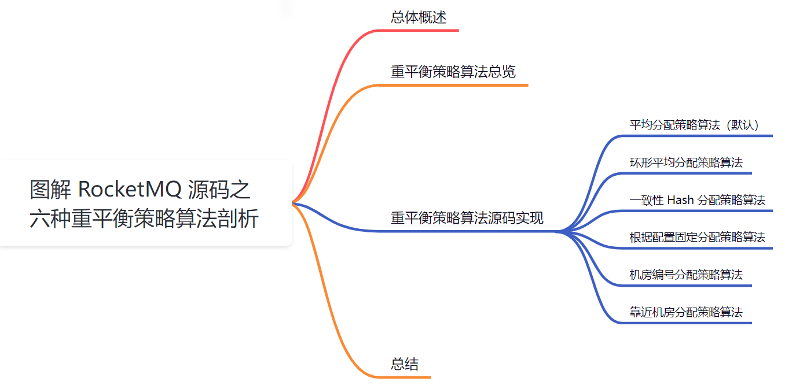
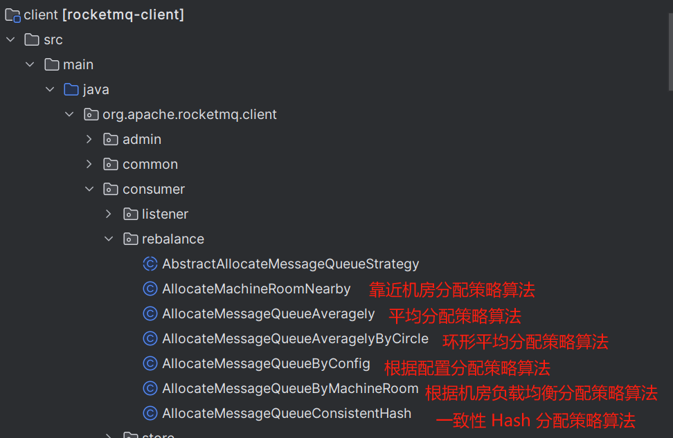
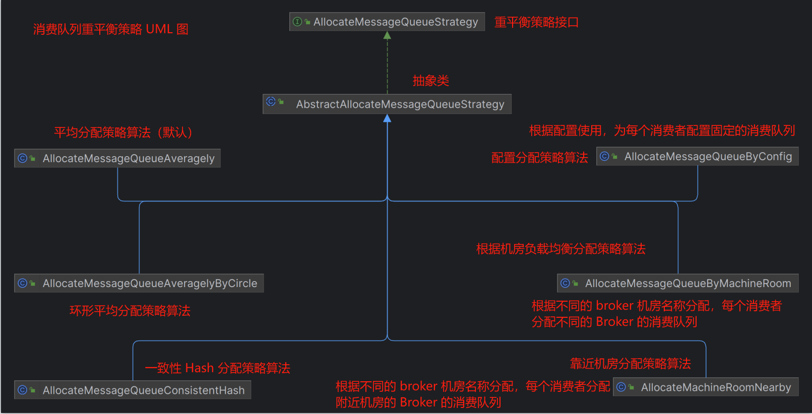
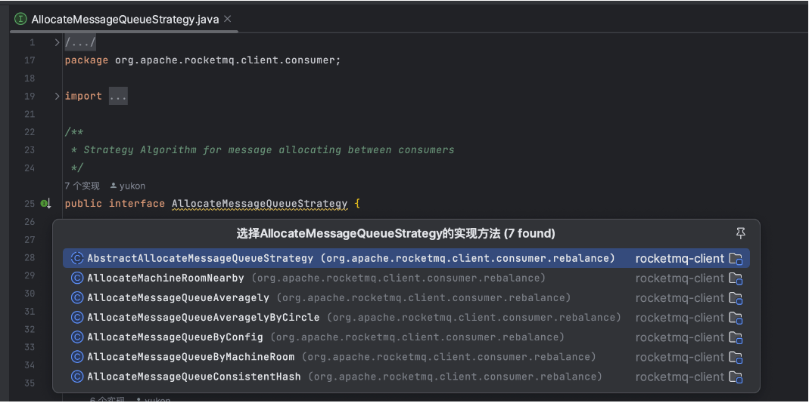
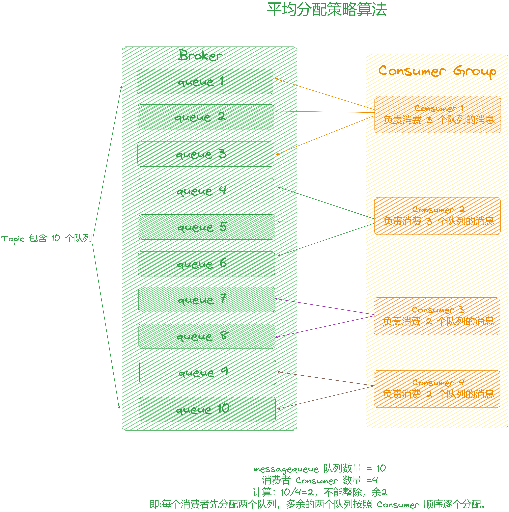
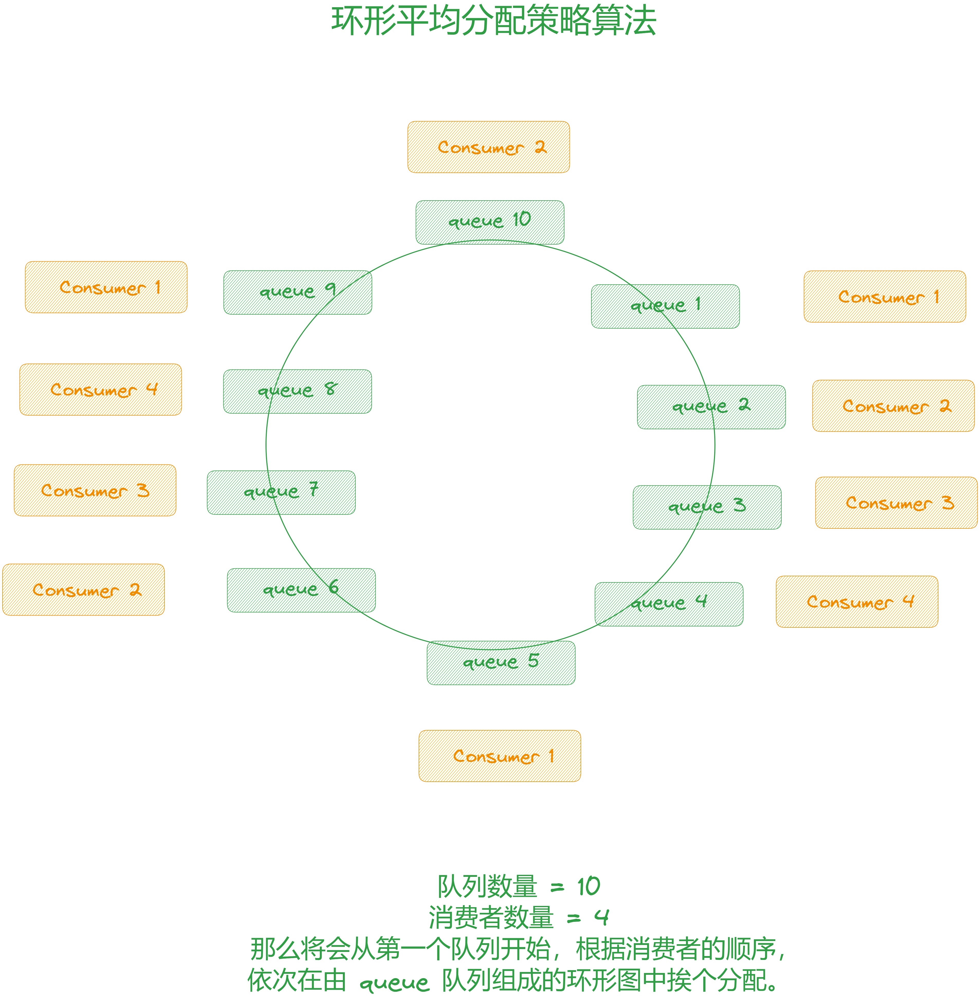
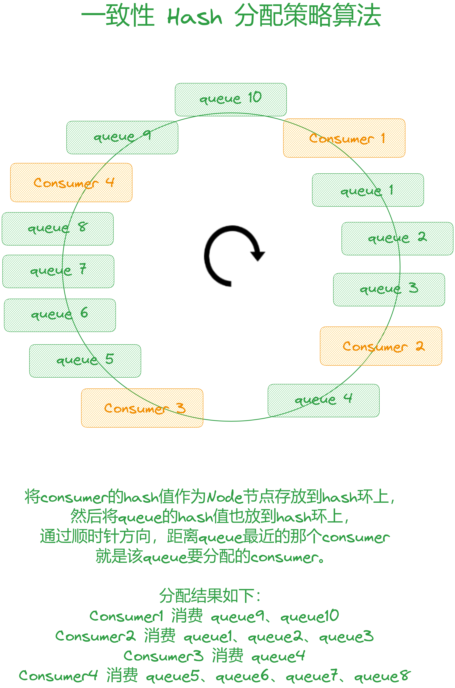
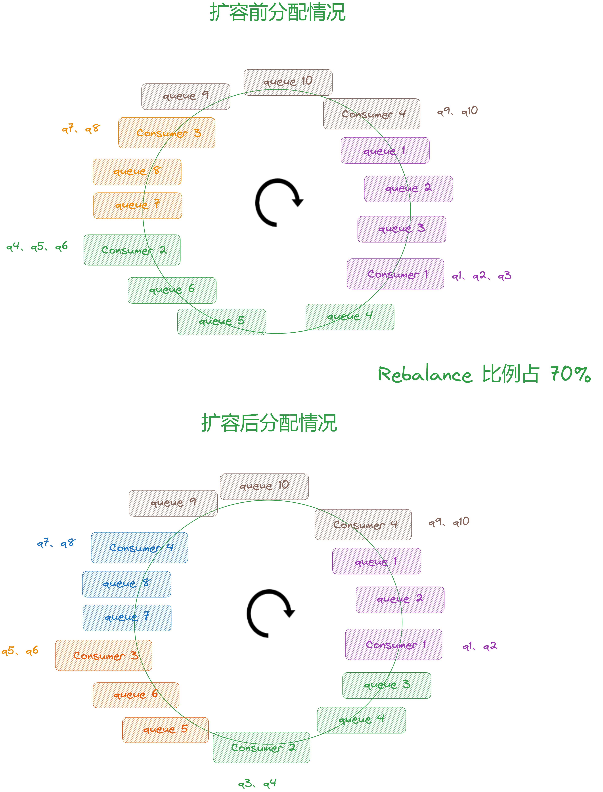
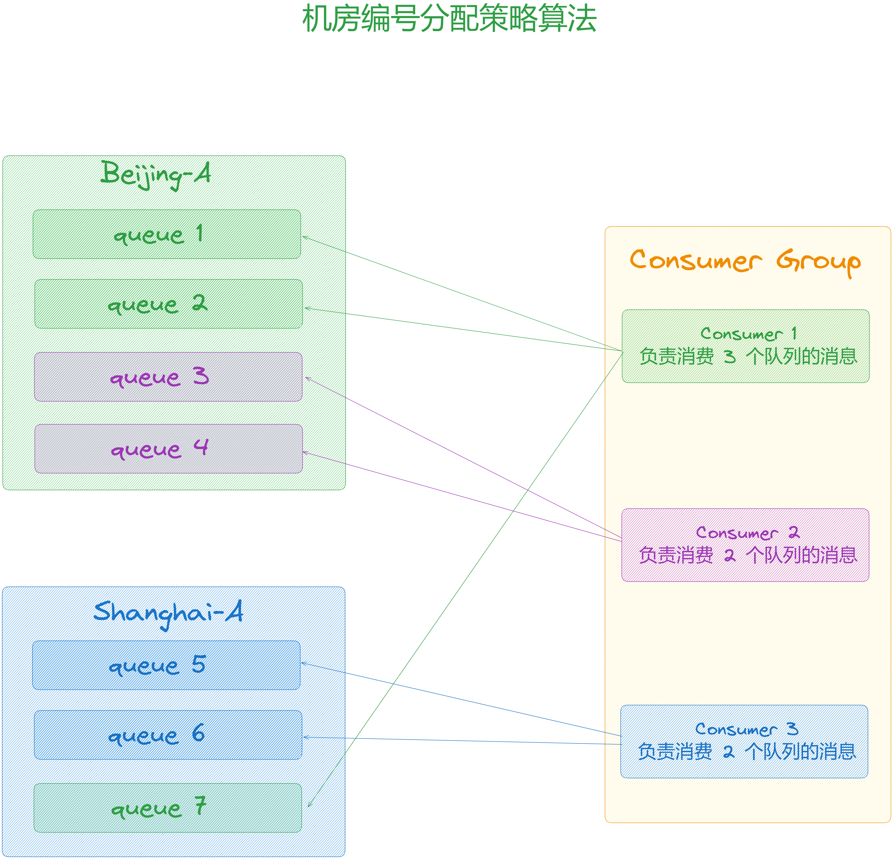
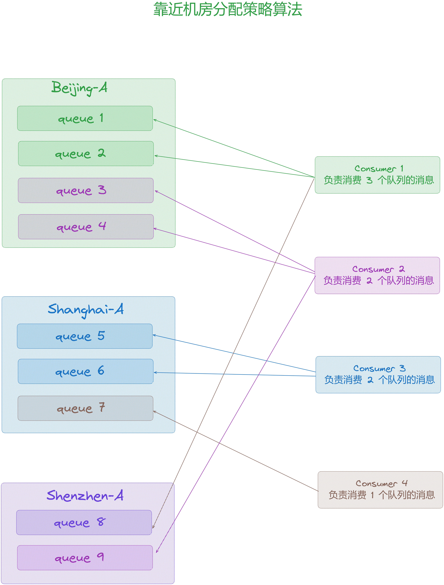

大家好，我是**华仔**, 又跟大家见面了。

从今天开始我将继续为大家奉上 RocketMQ 消费者源码剖析系列文章，正式开启「**RocketMQ 的 消费者源码之旅**」，这是第六篇，本篇我们将以「**RocketMQ 4.9.7**」版本为主，来剖析下 RocketMQ 源码之重平衡策略算法剖析。

## **01 总体概述**

在 [【消费者源码分析系列第五篇】图解 RocketMQ 源码之重平衡机制全流程剖析](https://articles.zsxq.com/id_zbetnohgudbt.html) 上一篇中，我们重点剖析了重平衡是如何启动的、它的触发时机又有哪些场景、最后重点剖析了整个重平衡的执行流程。

在执行流程的最后会根据重平衡策略来分配 Queue，我们都知道一个 Topic 中的 Queue 只能由 Consumer Group 中的一个Consumer 进行消费，而一个 Consumer 可以同时消费多个 Queue 中的消息。

那么Queue与Consumer间的配对关系是如何确定的呢？ 也就是说 Queue 要分配给哪个 Consumer 进行消费的呢？

这其实是有算法策略的，那么今天我们就来剖析下重平衡的几种策略，以及其实现原理。

## **02 重平衡策略算法总览**

先来看下源码分布情况：

消费队列重平衡策略 UML 图如下：

在深度剖析重平衡策略算法的具体实现前，我们看下 RocketMQ 中的重平衡策略顶层接口。

源码位置：[https://github.com/apache/rocketmq/blob/release-4.9.7/client/src/main/java/org/apache/rocketmq/client/](https://github.com/apache/rocketmq/blob/release-4.9.7/client/src/main/java/org/apache/rocketmq/client/consumer/AllocateMessageQueueStrategy.java)[consumer/AllocateMessageQueueStrategy](https://github.com/apache/rocketmq/blob/release-4.9.7/client/src/main/java/org/apache/rocketmq/client/consumer/AllocateMessageQueueStrategy.java)[.java](https://github.com/apache/rocketmq/blob/release-4.9.7/client/src/main/java/org/apache/rocketmq/client/consumer/AllocateMessageQueueStrategy.java)

public interface AllocateMessageQueueStrategy {

/\*\*

\* Allocating by consumer id

\* 给消费者id分配消费队列

\* @param consumerGroup current consumer group

\* @param currentCID current consumer id

\* @param mqAll message queue set in current topic

\* @param cidAll consumer set in current consumer group

\* @return The allocate result of given strategy

\*/

List<MessageQueue> allocate(

final String consumerGroup, // 消费者组

final String currentCID, // 当前消费者id

final List<MessageQueue> mqAll, // 所有的队列

final List<String> cidAll // 所有的消费者

);

/\*\*

\* Algorithm name

\*

\* @return The strategy name

\*/

String getName();

}

它默认共有 6 种负载均衡策略实现。

其中最常用的两种平均分配算法如下：

1.  AllocateMessageQueueAveragely 平均分配。
2.  AllocateMessageQueueAveragelyByCircle 轮流平均分配。

下面我们分别来看下这6种分配策略的源码实现。

## **03 重平衡策略算法源码实现**

## **3.1 平均分配策略算法（默认）**

public class AllocateMessageQueueAveragely extends AbstractAllocateMessageQueueStrategy {

@Override

public List<MessageQueue> allocate(String consumerGroup, String currentCID, List<MessageQueue> mqAll, List<String> cidAll) {

// 初始化结果集

List<MessageQueue> result = new ArrayList<>();

// 检查参数，不合理的参数就不做分配了

if (!check(consumerGroup, currentCID, mqAll, cidAll)) {

return result;

}

// cidAll 和 mqAll 在分配之前就已经排序好了，保证所有消费者实例拿到的顺序一致

// 获取当前消费者id 在 cidAll 中的索引位置

int index \= cidAll.indexOf(currentCID);

// 计算取模结果

int mod \= mqAll.size() % cidAll.size();

// 计算每个消费者平均分配到的数量

int averageSize \=

mqAll.size() <= cidAll.size() ? 1 : (mod > 0 && index < mod ? mqAll.size() / cidAll.size() + 1 : mqAll.size() / cidAll.size());

// 计算起始索引值

int startIndex \= (mod > 0 && index < mod) ? index \* averageSize : index \* averageSize + mod;

// 计算范围

int range \= Math.min(averageSize, mqAll.size() - startIndex);

for (int i \= 0; i < range; i++) {

// 计算目标 MessageQueue 并添加到结果集中

result.add(mqAll.get((startIndex + i) % mqAll.size()));

}

return result;

}

@Override

public String getName() {

return "AVG";

}

}

该算法是根据「**avg = QueueCount / ConsumerCount**」的计算结果进行分配的，如果能够整除，则按顺序将avg 个 MessageQueue 挨个分配，如果不能整除，则将多余出的 MessageQueue 按照 Consumer 顺序挨个分配，如下图：

  

如果说 [MessageQueue](http://messagequeue/) 数量小于消费者的数量，比如当前 [MessageQueue](http://messagequeue/) 数量为 2，消费者数量为 3，那么第三个消费者是不会被分配 [MessageQueue](http://messagequeue/) 的，只有前两个消费者各 1 个 [MessageQueue](http://messagequeue/)。

## **3.2 环形平均分配策略算法**

public class AllocateMessageQueueAveragelyByCircle extends AbstractAllocateMessageQueueStrategy {

@Override

public List<MessageQueue> allocate(String consumerGroup, String currentCID, List<MessageQueue> mqAll, List<String> cidAll) {

// 初始化结果集

List<MessageQueue> result = new ArrayList<>();

// 检查参数，不合理的参数就不做分配了

if (!check(consumerGroup, currentCID, mqAll, cidAll)) {

return result;

}

// 计算当前消费者id 所在索引位置

int index \= cidAll.indexOf(currentCID);

for (int i \= index; i < mqAll.size(); i++) {

// 每次间隔 cidAll.size 个 messageQueue 就放进结果集

if (i % cidAll.size() == index) {

result.add(mqAll.get(i));

}

}

// 返回结果集

return result;

}

@Override

public String getName() {

return "AVG\_BY\_CIRCLE";

}

}

该算法会根据消费者的顺序，依次由 MessageQueue 队列组成的环形图挨个分配，不需要提前计算，如下图：

## **3.3 一致性 Hash 分配策略算法**

public class AllocateMessageQueueConsistentHash extends AbstractAllocateMessageQueueStrategy {

private final int virtualNodeCnt;// 虚拟节点数量

private final HashFunction customHashFunction;// 自定义哈希函数

public AllocateMessageQueueConsistentHash() {

this(10);// 调用带参构造函数，默认虚拟节点数量为10

}

public AllocateMessageQueueConsistentHash(int virtualNodeCnt) {

this(virtualNodeCnt,null);// 调用带参构造函数，自定义哈希函数为null

}

public AllocateMessageQueueConsistentHash(int virtualNodeCnt,HashFunction customHashFunction) {

if (virtualNodeCnt < 0) { // 如果虚拟节点数量小于0，抛出异常

throw new IllegalArgumentException("illegal virtualNodeCnt :" + virtualNodeCnt);

}

this.virtualNodeCnt = virtualNodeCnt;// 初始化虚拟节点数量

this.customHashFunction = customHashFunction;// 初始化自定义哈希函数

}

@Override

public List<MessageQueue> allocate(String consumerGroup,String currentCID,List<MessageQueue> mqAll,List<String> cidAll) {

// 初始化结果集

List<MessageQueue> result = new ArrayList<>();

// 检查参数，不合理的参数就不做分配了

if (!check(consumerGroup,currentCID,mqAll,cidAll)) {

return result;

}

// 创建消费者节点集合

Collection<ClientNode> cidNodes = new ArrayList<>();

// 遍历消费者ID集合

for (String cid :cidAll) {

cidNodes.add(new ClientNode(cid));// 根据消费者id创建 ClientNode 对象，并加入集合

}

// 一致性 Hash路由器

final ConsistentHashRouter<ClientNode> router;

if (customHashFunction != null) {

// 使用自定义哈希函数创建路由器

router = new ConsistentHashRouter<>(cidNodes,virtualNodeCnt,customHashFunction);

} else {

// 使用默认哈希函数创建路由器

router = new ConsistentHashRouter<>(cidNodes,virtualNodeCnt);

}

// 初始化分配结果集合

List<MessageQueue> results = new ArrayList<>();

// 遍历所有消息队列

for (MessageQueue mq :mqAll) {

// 根据 MessageQueue 计算路由的 ClientNode，即判断 MessageQueue 落在那一个虚拟节点上面

ClientNode clientNode \= router.routeNode(mq.toString());

// 对比当前消费者 id 与节点的 key，如果一致，说明落在当前消费者ID节点上面

if (clientNode != null && currentCID.equals(clientNode.getKey())) {

// 将 MessageQueue 加入结果集合

results.add(mq);

}

}

return results;// 返回分配结果集合

}

@Override

public String getName() {

return "CONSISTENT\_HASH";// 返回分配策略名称

}

// 内部静态类 ClientNode 实现 Node 接口

private static class ClientNode implements Node {

private final String clientID;// 客户端ID

public ClientNode(String clientID) {

this.clientID = clientID;// 初始化客户端ID

}

@Override

public String getKey() {

return clientID;// 返回客户端ID作为键

}

}

}

简单来说，该算法会将 consumer 的 hash 值作为 Node 节点存放到 hash 环上，然后将 MessageQueue 的 hash 值也放到 hash 环 上，通过顺时针方向，距离 MessageQueue 最近的那个 consumer 就是该 MessageQueue 要分配的 consumer。

  

一致性哈希算法可以有效减少由于消费者组扩容或缩容所带来的大量的 Rebalance，所以它适合用在 Consumer 数量变化较频繁的场景。

但是一致性哈希算法也存在不足，就是分配效率较低，容易导致分配不均的情况。即每个消费者消费的队列数，有可能相差很大，这样就会造成个别消费者压力过大。我们可以引入虚拟桶，让 MessageQueue 在hash 环中尽可能分配均匀。

## **3.4 根据配置固定分配策略算法**

public class AllocateMessageQueueByConfig extends AbstractAllocateMessageQueueStrategy {

private List<MessageQueue> messageQueueList;

@Override

public List<MessageQueue> allocate(String consumerGroup, String currentCID, List<MessageQueue> mqAll, List<String> cidAll) {

// 返回用户指定的MessageQueue列表

return this.messageQueueList;

}

@Override

public String getName() {

return "CONFIG";

}

public List<MessageQueue> getMessageQueueList() {

return messageQueueList;

}

public void setMessageQueueList(List<MessageQueue> messageQueueList) {

this.messageQueueList = messageQueueList;

}

}

使用这个策略根本无法实现重平衡，用户指定消费队列，看看就行了。

## **3.5 机房编号分配策略算法**

看名称就知道这个分配策略是根据机房编号来执行的，所以里面需要我们准备好机房编号：consumeridcs。

public class AllocateMessageQueueByMachineRoom extends AbstractAllocateMessageQueueStrategy {

// 当前消费者需要拉取的Broker所在的机房编号集合，并且要求该 Broker 命名格式如下：机房编号@brokerName，一定要保持机房编号与 consumeridcs 里面的元素一致

private Set<String> consumeridcs;

@Override

public List<MessageQueue> allocate(String consumerGroup, String currentCID, List<MessageQueue> mqAll,

List<String> cidAll) {

// 初始化结果集

List<MessageQueue> result = new ArrayList<>();

// 检查参数，不合理的参数就不做分配了

List<MessageQueue> result = new ArrayList<>();

if (!check(consumerGroup, currentCID, mqAll, cidAll)) {

return result;

}

// 获取当前消费者 id 所在的索引值

int currentIndex \= cidAll.indexOf(currentCID);

if (currentIndex < 0) {

return result;

}

// 准备收集目标机房的 MessageQueue

List<MessageQueue> premqAll = new ArrayList<>();

// mqAll 在执行之前就已经排序好

for (MessageQueue mq : mqAll) {

// brokerName 按照@符号分割

String\[\] temp = mq.getBrokerName().split("@");

// 取出前面的【机房编号】，检查 consumeridcs 是否包含【机房编号】

if (temp.length == 2 && consumeridcs.contains(temp\[0\])) {

premqAll.add(mq); // 符合要求的 MessageQueue 就收集起来

}

}

// MessageQueue 数量除消费者数量，比如 7/3 = 2

int mod \= premqAll.size() / cidAll.size();

// MessageQueue 数量对消费者数量取模，比如 7%3 = 1

int rem \= premqAll.size() % cidAll.size();

// 计算起始位置索引 2\*0 = 0

int startIndex \= mod \* currentIndex;

// 计算结束位置索引 0+2 = 2

int endIndex \= startIndex + mod;

// 取出指定的 MessageQueue 放进结果集中 0 1 6

for (int i \= startIndex; i < endIndex; i++) {

result.add(premqAll.get(i));

}

// 如果还有多的 MessageQueue，那么就按顺序每个消费者分一个

if (rem > currentIndex) {

result.add(premqAll.get(currentIndex + mod \* cidAll.size()));

}

return result;

}

@Override

public String getName() {

return "MACHINE\_ROOM";

}

public Set<String> getConsumeridcs() {

return consumeridcs;

}

public void setConsumeridcs(Set<String> consumeridcs) {

this.consumeridcs = consumeridcs;

}

}

这里举例说明一下：

比如有两个机房，第一个机房 3 个 MessageQueue，名称 [Shanghai-A@Broker-a](http://Shanghai-A@broker-a/)，第二个机房 4 个MessageQueue，名称为 [Beijing-A@Broker-b](http://Beijing-A@broker-b/) ，现在有 3 个消费者，每隔消费者中 consumeridcs 中的元素为[Shanghai-A](http://Shanghai-A@broker-a/)、[Beijing-A](http://Beijing-A@broker-b/)，此时意味着这 3 个消费者来分配两个机房总共 7 个 MessageQueue。

## **3.6 靠近机房分配策略算法**

public class AllocateMachineRoomNearby extends AbstractAllocateMessageQueueStrategy {

// AllocateMessageQueueStrategy 分配策略

private final AllocateMessageQueueStrategy allocateMessageQueueStrategy;//actual allocate strategy

// 解析 MessageQueue 所在机房编号和消费者所在机房编号

private final MachineRoomResolver machineRoomResolver;

public AllocateMachineRoomNearby(AllocateMessageQueueStrategy allocateMessageQueueStrategy,

MachineRoomResolver machineRoomResolver) throws NullPointerException {

if (allocateMessageQueueStrategy == null) {

throw new NullPointerException("allocateMessageQueueStrategy is null");

}

if (machineRoomResolver == null) {

throw new NullPointerException("machineRoomResolver is null");

}

// 初始化

this.allocateMessageQueueStrategy = allocateMessageQueueStrategy;

this.machineRoomResolver = machineRoomResolver;

}

@Override

public List<MessageQueue> allocate(String consumerGroup, String currentCID, List<MessageQueue> mqAll, List<String> cidAll) {

// 初始化结果集

List<MessageQueue> result = new ArrayList<>();

// 检查参数，不合理的参数就不做分配了

if (!check(consumerGroup, currentCID, mqAll, cidAll)) {

return result;

}

//group mq by machine room

Map<String/\*machine room \*/, List<MessageQueue>> mr2Mq = new TreeMap<>();

for (MessageQueue mq : mqAll) {

// 获取 messageQueue 所在的机房编号

String brokerMachineRoom \= machineRoomResolver.brokerDeployIn(mq);

if (StringUtils.isNoneEmpty(brokerMachineRoom)) {

if (mr2Mq.get(brokerMachineRoom) == null) {

mr2Mq.put(brokerMachineRoom, new ArrayList<>());

}

// // 按编号放进Map中，同编号的在一个ArrayList中

mr2Mq.get(brokerMachineRoom).add(mq);

} else {

throw new IllegalArgumentException("Machine room is null for mq " + mq);

}

}

//group consumer by machine room

Map<String/\*machine room \*/, List<String/\*clientId\*/\>> mr2c = new TreeMap<>();

for (String cid : cidAll) {

// 获取消费者所在机房编号

String consumerMachineRoom \= machineRoomResolver.consumerDeployIn(cid);

if (StringUtils.isNoneEmpty(consumerMachineRoom)) {

if (mr2c.get(consumerMachineRoom) == null) {

mr2c.put(consumerMachineRoom, new ArrayList<>());

}

// 按编号放进Map中，同编号的在一个ArrayList中

mr2c.get(consumerMachineRoom).add(cid);

} else {

throw new IllegalArgumentException("Machine room is null for consumer id " + cid);

}

}

List<MessageQueue> allocateResults = new ArrayList<>();

//1.allocate the mq that deploy in the same machine room with the current consumer

// 获取当前消费者所在机房编号

String currentMachineRoom \= machineRoomResolver.consumerDeployIn(currentCID);

// 取出当前机房的所有 MessageQueue

List<MessageQueue> mqInThisMachineRoom = mr2Mq.remove(currentMachineRoom);

// 取出当前机房的所有消费者

List<String> consumerInThisMachineRoom = mr2c.get(currentMachineRoom);

if (mqInThisMachineRoom != null && !mqInThisMachineRoom.isEmpty()) {

// 按照设置的分配策略来分配同一机房内的 MessageQueue

allocateResults.addAll(allocateMessageQueueStrategy.allocate(consumerGroup, currentCID, mqInThisMachineRoom, consumerInThisMachineRoom));

}

//2.allocate the rest mq to each machine room if there are no consumer alive in that machine room

// 如果 MessageQueue 部署的机房中没有消费者，那么所有的消费者共同分配这些 MessageQueue

for (Entry<String, List<MessageQueue>> machineRoomEntry : mr2Mq.entrySet()) {

if (!mr2c.containsKey(machineRoomEntry.getKey())) { // no alive consumer in the corresponding machine room, so all consumers share these queues

allocateResults.addAll(allocateMessageQueueStrategy.allocate(consumerGroup, currentCID, machineRoomEntry.getValue(), cidAll));

}

}

// 返回结果集

return allocateResults;

}

@Override

public String getName() {

return "MACHINE\_ROOM\_NEARBY" + "-" + allocateMessageQueueStrategy.getName();

}

/\*\*

\* A resolver object to determine which machine room do the message queues or clients are deployed in.

\* AllocateMachineRoomNearby will use the results to group the message queues and clients by machine room.

\* The result returned from the implemented method CANNOT be null.

\*/

public interface MachineRoomResolver {

String brokerDeployIn(MessageQueue messageQueue);

String consumerDeployIn(String clientID);

}

}

该算法会根据 MessageQueue 的部署机房位置和 consumer 的位置，过滤出当前 consumer 相同机房的 queue。然后按照平均分配策略或环形平均策略对同机房 MessageQueue 进行分配。如果没有同机房 MessageQueue，则按照平均配策略或环形平均策略对所有 MessageQueue 进行分配。

简单来说就是同一个机房的 MessageQueue 由当前机房的消费者自己分配，如果 MessageQueue 所在的机房没有消费者，那么就由所有消费者共同分配。

这里举例说明一下：

比如当前有三个机房 [Beijing-A](http://beijing-a/)、[Shanghai-A](http://shanghai-a/)、[Shenzhen-A](http://shenzhen-a/)，[Beijing-A](http://beijing-a/) 机房中有 4 个 MessageQueue，2 个消费者，[Shanghai-A](http://shanghai-a/) 机房有 3 个 MessageQueue，2 个消费者，[Shenzhen-A](http://shenzhen-a/) 机房有 2 个MessageQueue，没有消费者。

我们采用 AllocateMachineRoomNearby 分配策略，并且子分配策略是AllocateMessageQueueAveragely平均分配，那么最终的分配结果如下所示：

