大家好，我是**华仔**, 又跟大家见面了。

从今天开始我将为大家奉上 RocketMQ 源码剖析系列文章，正式开启「**RocketMQ 的源码之旅**」，跟我一起来掌握 RocketMQ 源码核心架构设计思想吧。

今天这篇我们先来聊聊 RocketMQ源码环境搭建、源码全景图以及后续源码剖析之旅路线，带你梳理整体的源码分析脉络。

认真读完这篇文章，并准备一台电脑跟我一起操作，我相信你会对 RocketMQ 源码环境搭建以及全景图剖析以及源码剖析整体路线，有更加深刻的理解。

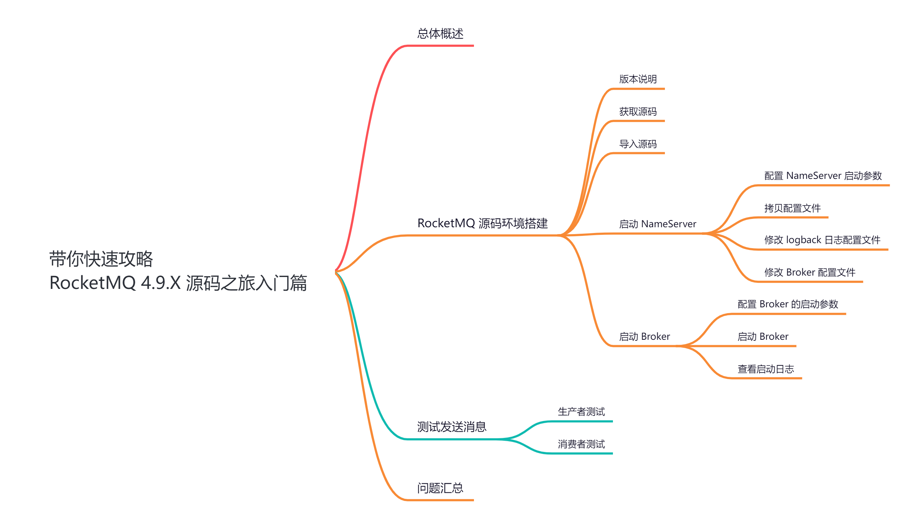

## **01 总体概述**

平常我们在基于 RocketMQ 做应用开发的时候，可能只是将 RocketMQ 作为一个消息系统来存取消息、抗高并发以及解耦系统，并不会接触到源码层面的知识。但是大家在使用或者运维 RocketMQ时或多或少会遇到一些棘手的生产故障问题，如果你不了解 RocketMQ 源码层面的实现原理，那么在实际开发中排查问题故障点肯定会受到阻碍。

因此解决问题的最好办法就是学习和阅读源码，这样我们可以快速掌握「**RocketMQ 的核心实现细节**」，来帮助我们更深刻的理解 RocketMQ 内部设计原理，通晓高吞吐、高可用、高并发系统架构如何设计的，另外可以帮助我们快速建立性能分析、故障问题的排查定位思路和解决问题的高效方法和调优方案，减少解决问题的时间成本。

## **02 RocketMQ 源码环境搭建**

## **2.1 版本说明**

在阅读 RocketMQ 源码之前，首先我们要做一些环境准备工作，RocketMQ 官方已经更新到 5.1.4 版本，生产环境使用不太稳定，因此这里我们将选用「**4.9.7**」版本作为源码研究的版本，后续都会以该版本来剖析源码，部分会以「**5.x.x**」版本来剖析。

## **2.2 获取源码**

首先就是到 Github 网站上下载源码。

源码地址：[https://github.com/apache/rocketmq/tree/rocketmq-all-4.9.7](https://github.com/apache/rocketmq/tree/rocketmq-all-4.9.7)

我下载的是这个版本：rocketmq-all-4.9.7。

如果遇到 Github 网站的打开速度较慢，可以在公众号后台回复RocketMQ 源码即可获取百度网盘链接。

## **2.3 导入源码**

下载好了后，用 IntelliJ IDEA 工具导入就可以了，如下图：

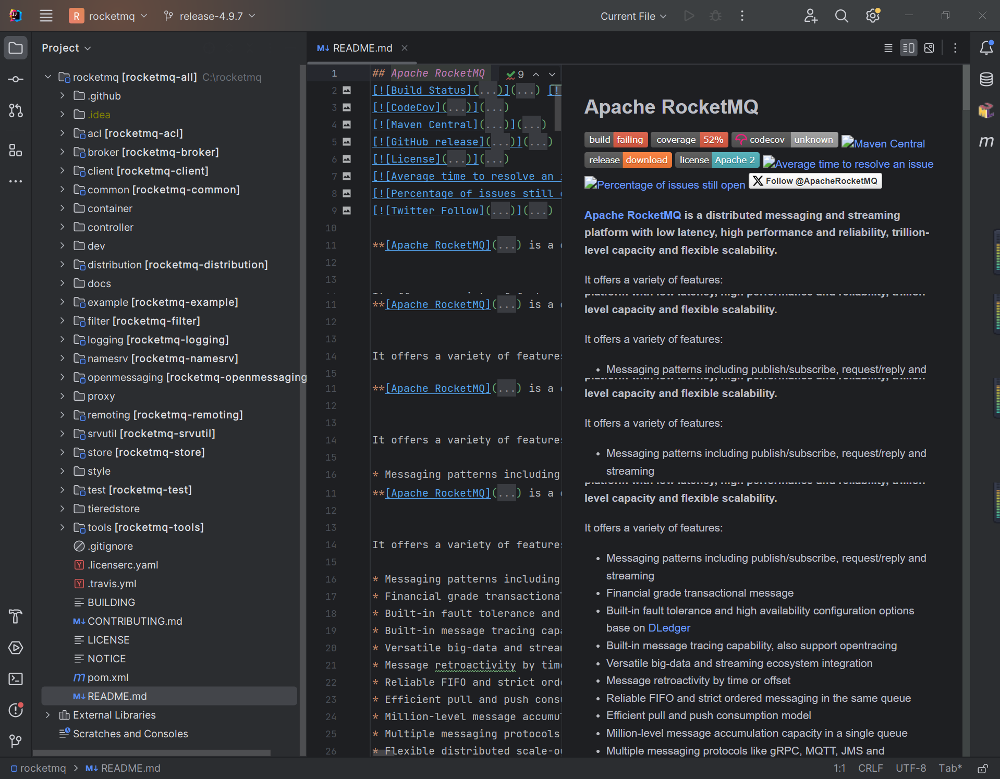

下面是对各个文件夹相关功能的解释：

1.  **broker**：RocketMQ 的 Broker 相关的代码，用来启动 Broker 进程。**该专栏重点剖析**。
2.  **client**：RocketMQ 的 Producer、Consumer 这些客户端的代码，用来生产消息、消费消息。**该专栏重点剖析**。
3.  **common**：公共模块。
4.  **dev**：开发相关的一些信息。
5.  **distribution**：用来部署 RocketMQ 的，比如 bin 目录 ，conf 目录。
6.  **example**：使用 RocketMQ 的例子。
7.  **filter**：RocketMQ 的一些过滤器。
8.  **logappender**：RocketMQ 日志相关。
9.  **logging**：RocketMQ 日志相关的。
10.  **namesvr**：NameServer 的源码。**该专栏重点剖析**。
11.  **openmessaging**：开放消息标准，可以先忽略
12.  **remoting**：RocketMQ 的远程网络通信模块的代码，基于 netty 实现。**该专栏重点剖析**。
13.  **srvutil**：里面有很多工具类。
14.  **store**：消息如何在 Broker 上进行存储的。**该专栏重点剖析**。
15.  **style**：代码检查相关的。
16.  **test**：测试相关的。
17.  **tools**：命令行监控工具相关。**该专栏重点剖析**。

这么多模块，我们该如何进行学习呢？

首先，我们得把项目跑起来，看下如何 RocketMQ 的 NameServer 和 Broker 启动起来。

通过前面的原理剖析，知道 NameServer 是所有 Broker 都需要注册的地方即注册中心。Broker 就是用来收客户端发的消息、存储消息、传递消息给消费端的重要组件。

所以我们要先启动「**NameServer**」组件，才能启动「**Broker**」组件。

## **2.4 启动 NameServer**

以 IDEA 这个版本为例，不同版本可能位置不太一样。

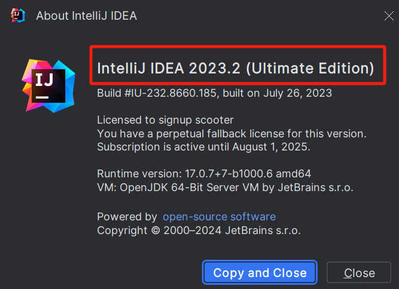

## **2.4.1 配置 NameServer 启动参数**

主要在本地直接启动源码是起不来的，需要单独配置下启动参数。

首先在 IDEA 工具的菜单栏中找到「**NameSrvStartup**」启动的地方，然后下拉选择 [Edit Configurations](http://edit%20configurations/)，可以打开「**NameSrvStartup**」的配置项。如下图所示：

  
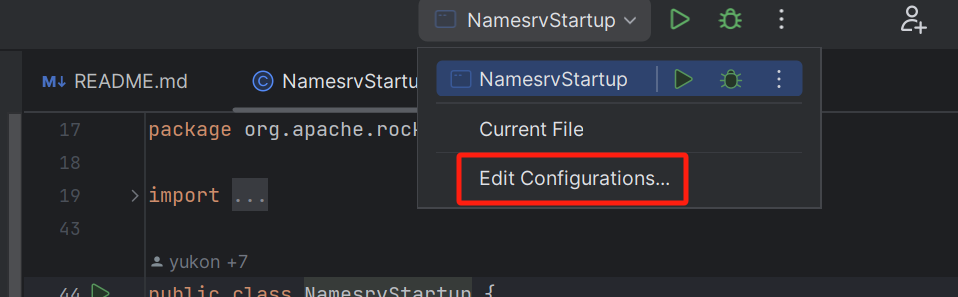

### **配置环境变量**

我们还需要配置一个 [ROCKETMQ\_HOME](http://rocketmq_home/) 环境变量，它是本地的一个文件夹，专门用来存放一些配置文件，这个文件夹的名字在下面还会用到。

打开 IDEA 中配置环境变量的界面，如下图所示：

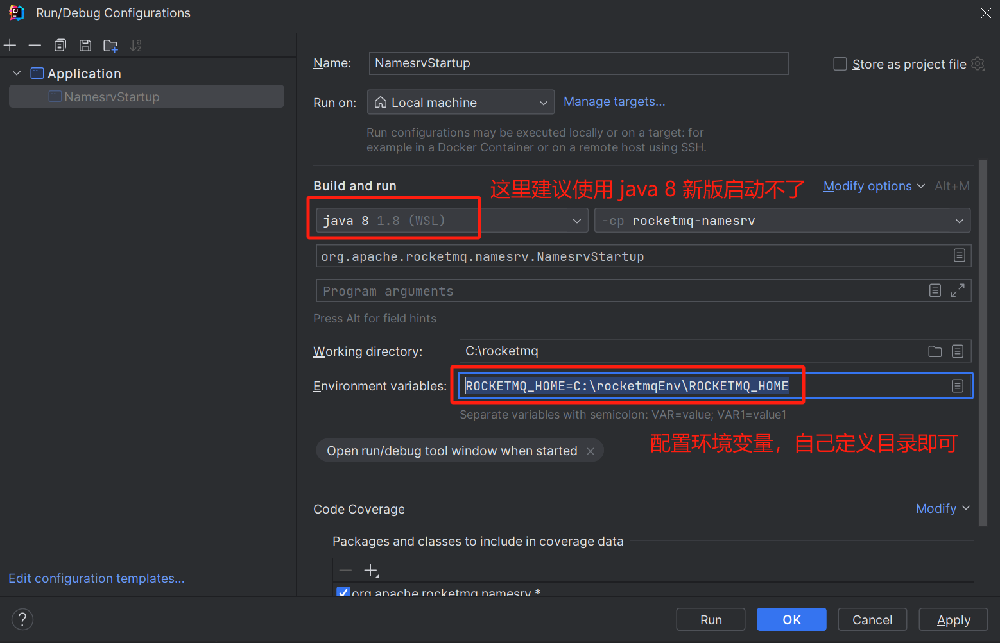

然后点击环境变量输入框右边，配置 [ROCKETMQ\_HOME](http://rocketmq_home/) 环境变量，文件夹路径就是上面截图的，大家可以自己配置，**注意不要和 RocketMQ 的源码目录里面就行**。

  
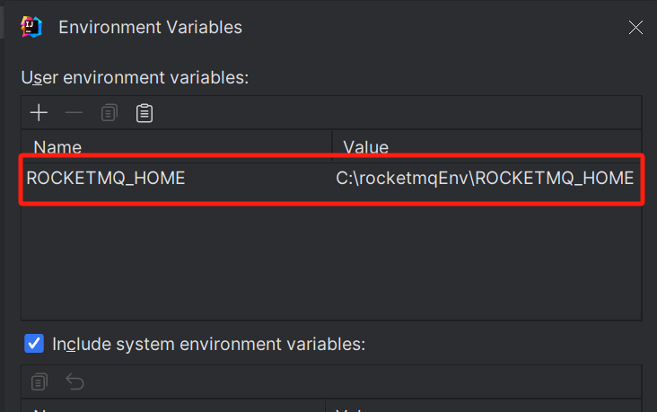

## **2.4.2 拷贝配置文件**

此时创建完之后，就可以开始拷贝配置文件了，这里我们先在 [ROCKMQ\_HOME](http://rockmq_home/) 目录新建几个文件夹：[conf](http://conf/)、[logs](http://logs/)、[store](http://store/)。

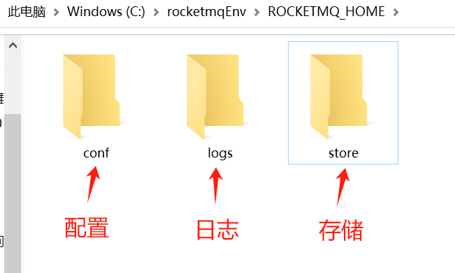

然后我们需要把 RocketMQ 自带的配置文件即源码目录中 [distribution](http://distribution/) 目录下三个文件：[broker.conf](http://broker.conf/)、[logback\_namesrv.xml](http://logback_namesrv.xml/)、[logback\_broker.xml](http://logback_broker.xml/) 拷贝到 conf 目录下。

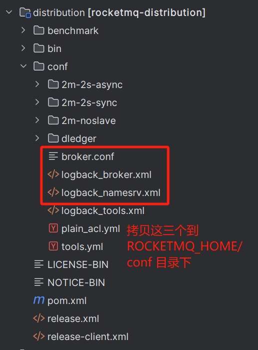

## **2.4.3 修改 logback 日志配置文件**

拷贝完成之后，然后打开 [logback\_namesrv.xml](http://logback_namesrv.xml/) 和 [logback\_broker.xml](http://logback_broker.xml/) 文件，将 [${user.home}](http://${user.home}/) 全局替换为上面配置的 [ROCKETMQ\_HOME](http://rocketmq_home/) 目录。

C:/rocketmqEnv/ROCKETMQ\_HOME

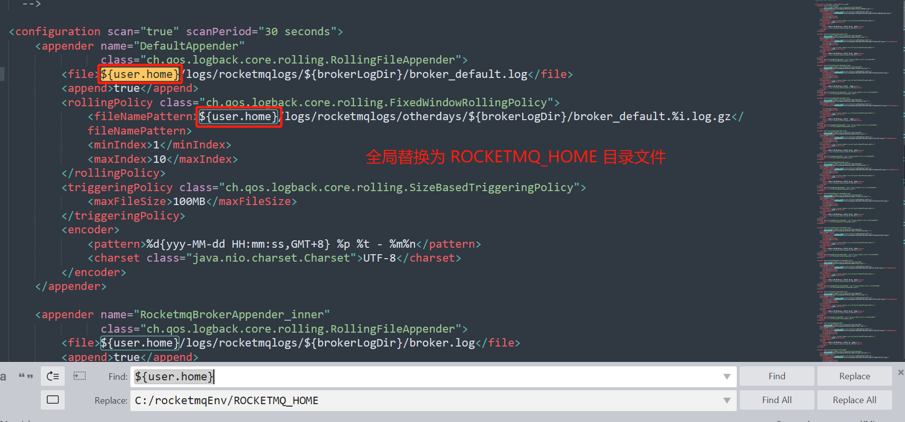

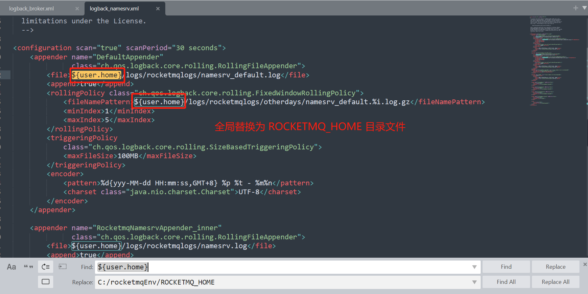

替换后如下：

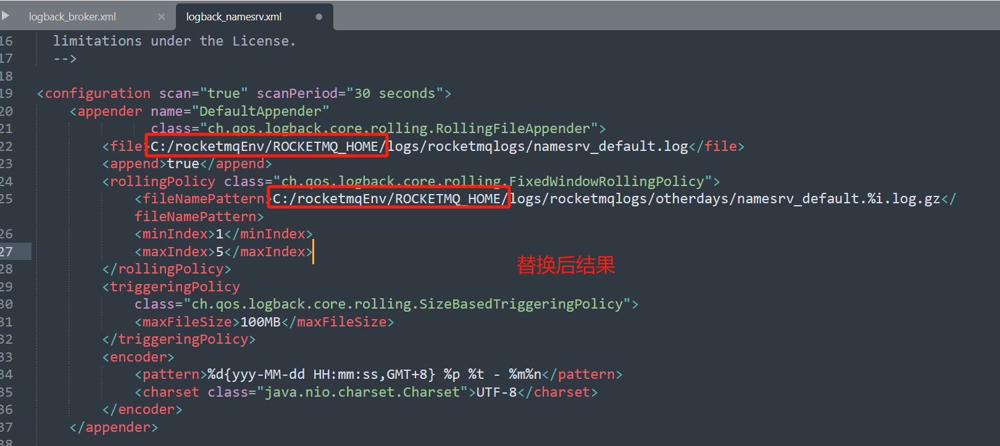

## **2.4.4 修改 Broker 配置文件**

修改上面日志配置文件后，我们打开 conf 目录下的 [broker.conf](http://broker.conf/) 文件，拷贝下面的配置到文件中。

> 注意：brokerIP1 对应的 IP 地址是自己本机 IP，存储路径对应 ROCKETMQ\_HOME 的 store 目录。

\# nameserver 地址

namesrvAddr=127.0.0.1:9876

\# brokerIP1 对应的 IP 地址是自己本机 IP

brokerIP1=192.168.56.1

\# 存储路径对应 ROCKETMQ\_HOME 的 store 目录

storePathRootDir=C:/rocketmqEnv/ROCKETMQ\_HOME/store

\# 这是commitLog的存储路径

storePathCommitLog=C:/rocketmqEnv/ROCKETMQ\_HOME/store/commitlog

\# consume queue文件的存储路径

storePathConsumeQueue=C:/rocketmqEnv/ROCKETMQ\_HOME/store/consumequeue

\# 消息索引文件的存储路径

storePathIndex=C:/rocketmqEnv/ROCKETMQ\_HOME/store/index

\# checkpoint文件的存储路径

storeCheckpoint=C:/rocketmqEnv/ROCKETMQ\_HOME/store/checkpoint

\# abort文件的存储路径

abortFile=C:/rocketmqEnv/ROCKETMQ\_HOME/store/abort

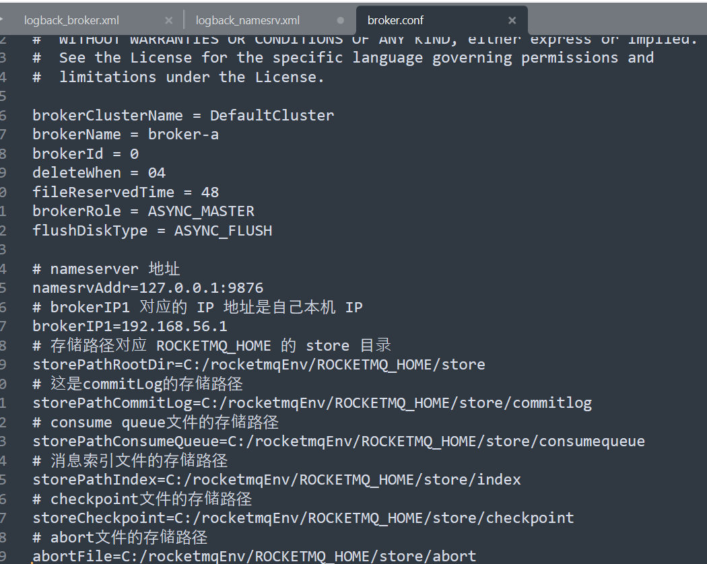

## **2.4.5 启动 NameServer**

当上面配置完成之后，就可以用 IDEA 启动了。

> 注意，此时可以直接用 debug 模式启动。

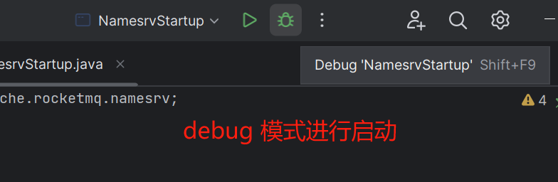

点击 debug 后，IDEA 会自动找到 [ROCKETMQ\_HOME](http://rocketmq_home/) 的环境变量，这个目录就是 RocketMQ 的运行目录，里面有我们上面刚新建的 [conf](http://conf/)、[logs](http://logs/)、[store](http://store/) 目录。

1.  conf 对应配置。
2.  logs 对应日志。
3.  store 对应数据存储。

然后我们可以在控制台看到启动的日志输出：

org.apache.rocketmq.namesrv.NamesrvStartup

Connected to the target VM, address: '127.0.0.1:65431', transport: 'socket'

The Name Server boot success. serializeType=JSON

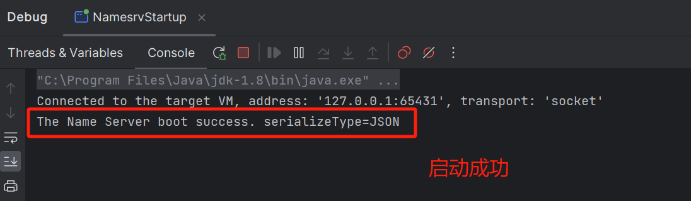

## **2.5 启动 Broker**

当「**NameServer**」启动完成后，接下来我们来启动「**Broker**」服务，同上 先来配置「**Broker**」启动参数

## **2.5.1 配置 Broker 的启动参数**

和「**NameServer**」的启动参数需要类似配置环境变量，只不过「**Broker**」需要多配置一个 [Program arguments](http://program%20arguments/)，用来加载指定的配置文件 [broker.conf](http://broker.conf/)。配置如下：

\-c C:/rocketmqEnv/ROCKETMQ\_HOME/conf/broker.conf

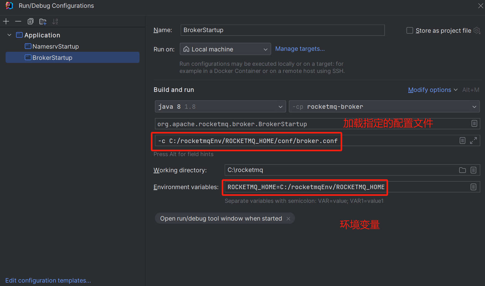

## **2.5.2 启动 Broker**

同启动「**NameServer**」一样，我们还是用 debug 模式启动「**Broker**」，可以看到控制台输出以下信息：

Connected to the target VM, address: '127.0.0.1:51448', transport: 'socket'

The broker\[broker-a, 192.168.33.1:10911\] boot success. serializeType=JSON and name server is 127.0.0.1:9876

  
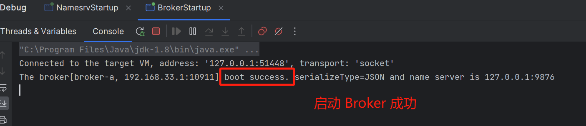

## **2.5.3 查看启动日志**

接着我们可以去 logs 目录看下启动的详细日志，打开 [broker.log](http://broker.log/) 或者 [namesrv.log](http://namesrv.log/) 文件，如下所示：

  
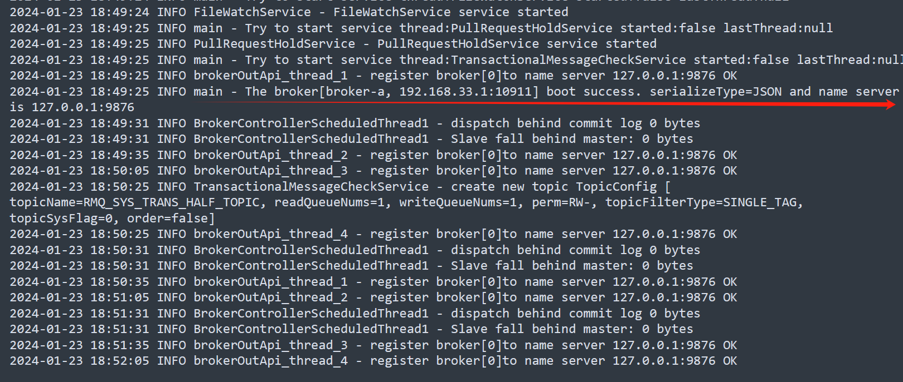

## **03 测试发送消息**

当 「**NameServer**」、「**Broker**」组件启动成功后，我们直接用源码自带的示例代码来做测试。

文件目录如下：

  
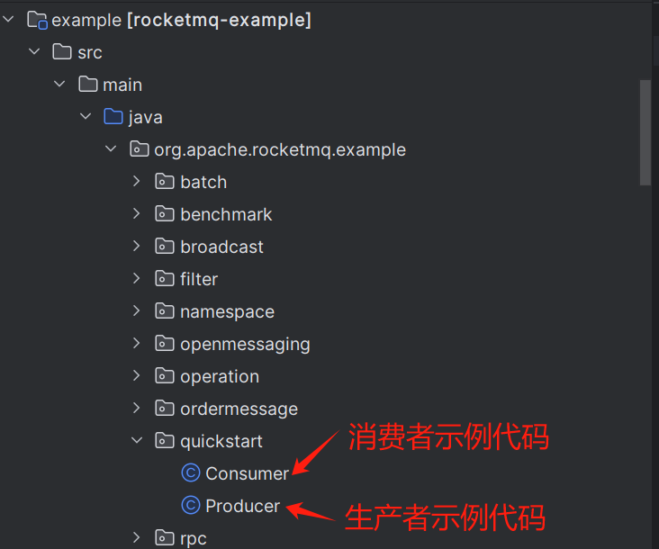

## **3.1 生产者测试**

打开 [Producer.java](http://producer.java/) 文件，修改如下代码中的 IP 地址。

producer.setNamesrvAddr("127.0.0.1:9876");

然后启动这个类：

  
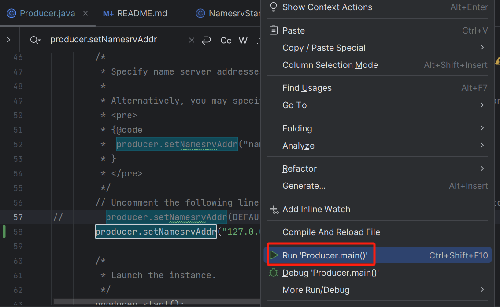

可以看到控制台打印了输出结果，成功发送了 10 条消息。

  
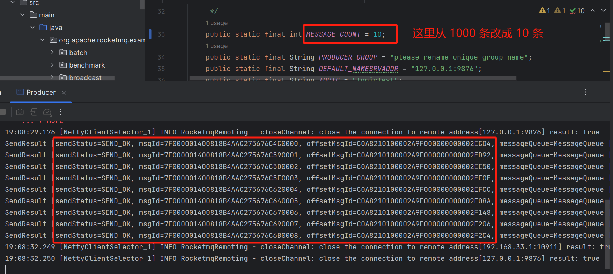

## **3.2 消费者测试**

生产者发送完成后，接着我们启动消费者代码，看下是否成功消费了。同样需要修改这个配置：

consumer.setNamesrvAddr("127.0.0.1:9876");

然后启动 Consumer，可以看到成功消费了一条消息：

  
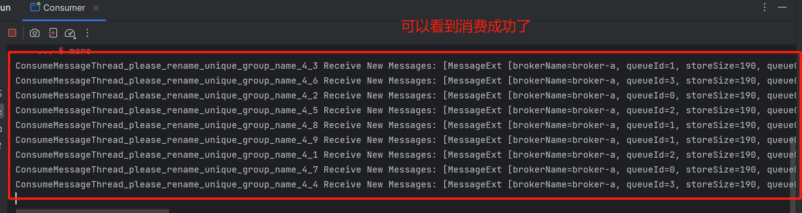

##   
**04 问题汇总**

安装过程中遇到的问题汇总：

1、jdk 版本不一致导致错误，如下：

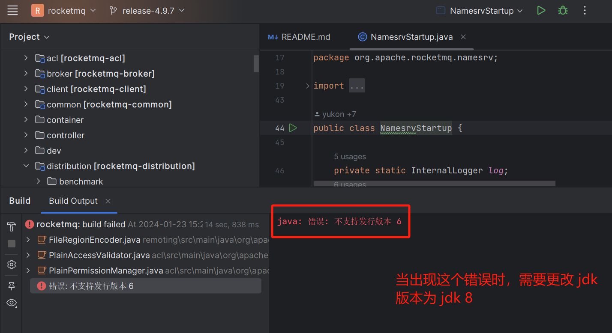

解决方案：

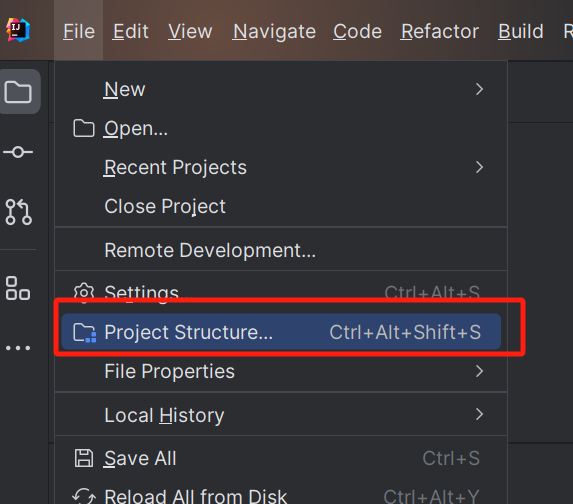

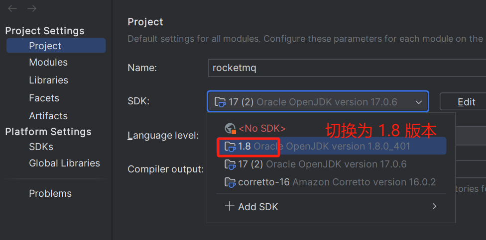

如果你没有 jdk8，可以从这里获取（win、linux）

链接：https://pan.baidu.com/s/1rNxRZRH2zpu9oVnUTncRdQ?pwd\=e0bc

提取码：e0bc

\--来自百度网盘超级会员V8的分享