大家好，我是**华仔**, 又跟大家见面了。

从今天开始我将为大家奉上 RocketMQ 源码剖析系列文章，正式开启「**RocketMQ 的源码之旅**」，跟我一起来掌握 RocketMQ 源码核心架构设计思想吧。

今天这篇我们先来聊聊 RocketMQ源码环境搭建、源码全景图以及后续源码剖析之旅路线，带你梳理整体的源码分析脉络。

认真读完这篇文章，并准备一台电脑跟我一起操作，我相信你会对 RocketMQ 源码环境搭建以及全景图剖析以及源码剖析整体路线，有更加深刻的理解。

之前写过4.9.x 版本的源码安装过程：[【源码分析系列第一篇】带你快速攻略 RocketMQ 4.9.X 源码之旅入门篇](https://articles.zsxq.com/id_4dz65eewir0x.html)，应球友的需求，下面我们补充下 RocketMQ 5.x 版本的源码安装过程。

## **01 总体概述**

RocketMQ「**5.0**」以后引入了「**弹性无状态**」的代理模式，对 Broker 的职责进行了拆分，将「**客户端协议适配**」、「**权限管理**」、「**消费管理**」等计算逻辑进行抽离放入了「**Proxy 代理层**」。那么 Broker 就会只专注数据存储，以便更好的适应云原生环境，实现资源弹性调度。且 5.0 以后增加了「**GRPC 协议**」支持，它是 Google 开源的高性能 RPC 框架，基于 Protobuf 序列化。

  

RocketMQ 5.x 版本提供了一套非常建议的消息发送、消费API，并统一放在 Apache 顶级开源项目 [rocketmq-clients](http://rocketmq-clients/) 下，链接：[https://github.com/apache/rocketmq-clients](https://github.com/apache/rocketmq-clients)，提供了cpp、go、java、php、rust的实现，多语言生态初现，如下图所示：

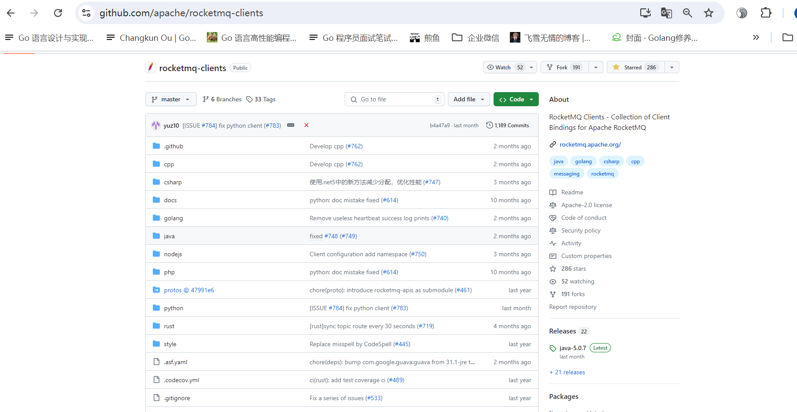

## **02 RocketMQ 源码环境搭建**

## **2.1 版本说明**

在阅读 RocketMQ 源码之前，首先我们要做一些环境准备工作，RocketMQ 官方已经更新到 5.3.0 版本，这里我们将选用「**5.1.2**」版本作为源码研究的版本，后续都会以该版本来剖析源码。

  
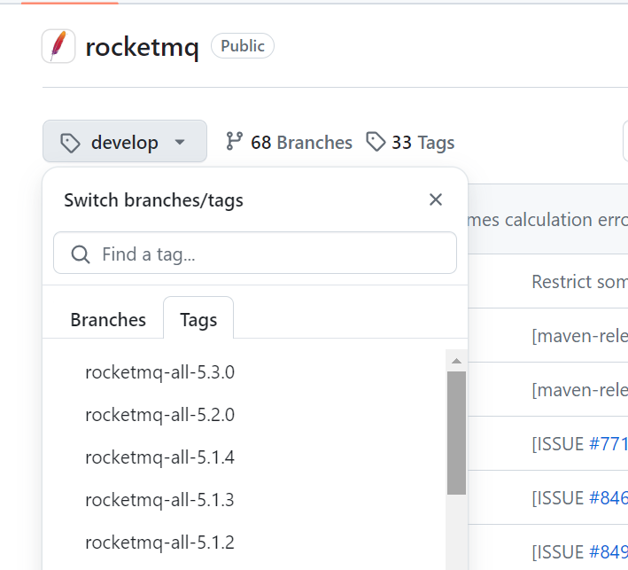

## **2.2 获取源码**

首先就是到 Github 网站上下载源码。

源码地址：[https://github.com/apache/rocketmq/tree/rocketmq-all-5.1.2](https://github.com/apache/rocketmq/tree/rocketmq-all-5.1.2)

我下载的是这个版本：rocketmq-all-5.1.2。

## **2.3 导入源码**

下载好了后，用 IntelliJ IDEA 工具导入就可以了，如下图：

  
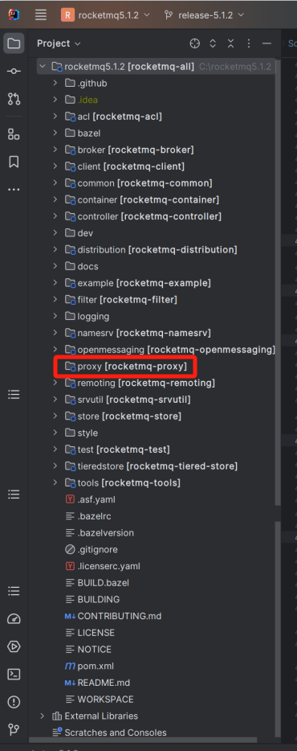

## **2.4 启动方式**

相比 RocketMQ 4.x，目前 5.x 的架构发生了重大调整，主要是增加了一个代理模块 [rocketmq-proxy](http://rocketmq-proxy/) ，将路由、计算等功能从 Broker 中剥离出来。

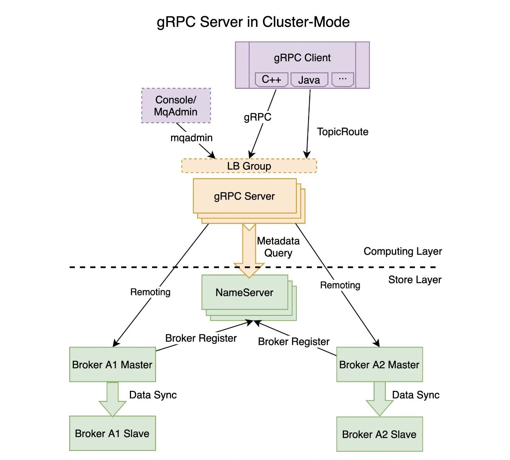

  
目前部署方式分为两种：

1.  **Local 模式**：由于 Local 模式下 Proxy 和 Broker 是同进程部署，Proxy 本身无状态，因此和之前 4.0 版本的部署方式基本相同。
2.  **Cluster 模式**：在 Cluster 模式下，Broker 与 Proxy 分别部署，我可以在 NameServer 和 Broker 都启动完成之后再部署 Proxy。

###   
**2.4.1 拷贝配置文件**

  
创建一个 [RocketMQ](http://rocketmq/) 主目录，并在主目录中创建 [conf](http://conf/) 文件夹，并把源码中 [distribution](http://distribution%20/) 模块中 [conf](http://conf/) 下的文件拷贝到当前目录，如下图所示：  

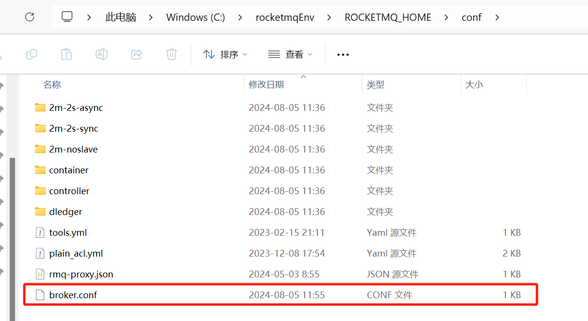

### **2.4.2 启动 NameServer**

从 [namesrv](http://namesrv/) 模块中找到类 [NamesrvStartup](http://namesrvstartup/) 类，如下：

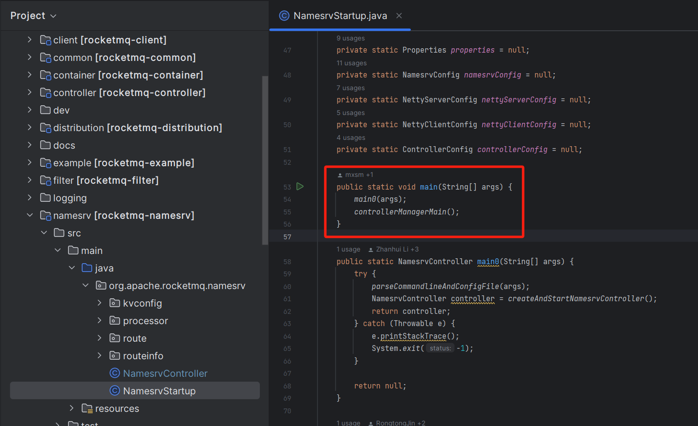

在启动这个类的时候我们需要配置一下环境信息，不然会报错找不到环境变量。

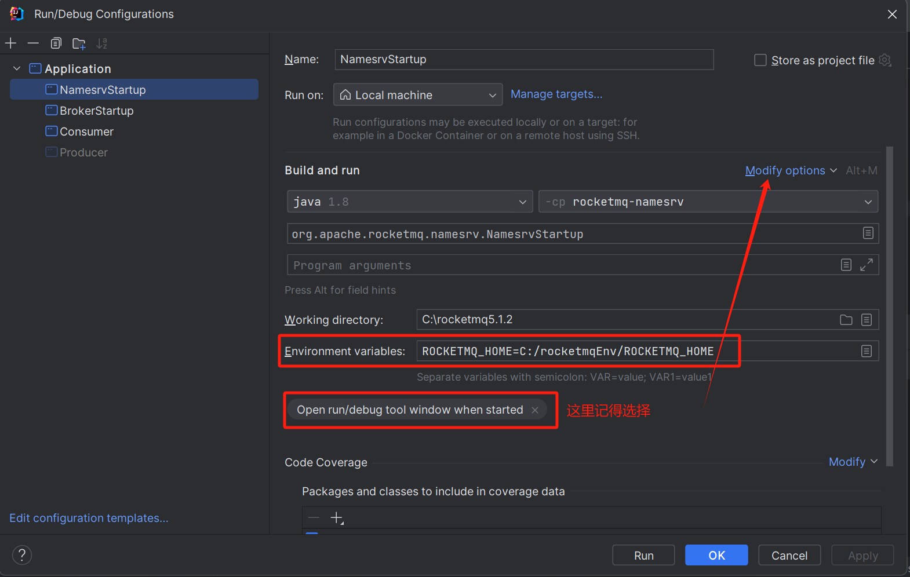

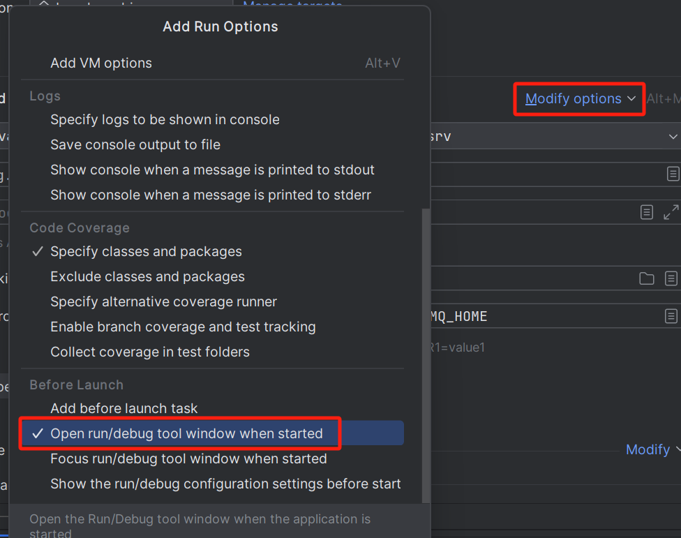

这里的关键点在于需要配置环境变量 Environment variables 中的 [ROCKETMQ\_HOME](http://rocketmq_home/)，其路径设置为中 **2.4.1 小节**创建的目录，大家可以自己配置，**注意不要和 RocketMQ 的源码目录里面就行**。

然后启动该类，输出如下所示表示 [NameServer](http://nameserver/) 模块启动成功。

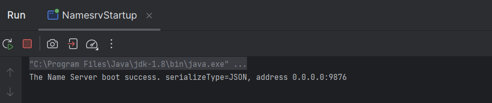

注意这里我们的 jdk 版本要是 [jdk8](http://jdk8/)，如果是高版本会启动失败，而且同时存在多个版本的 jdk 会有交叉编译 bug 具体解决方案可以参考这里 [https://www.morling.dev/blog/bytebuffer-and-the-dreaded-nosuchmethoderror/](https://www.morling.dev/blog/bytebuffer-and-the-dreaded-nosuchmethoderror/) 。

### **2.4.3 启动 Broker**

从 [Broker](http://broker%20/) 模块中找到类 [BrokerStartup](http://brokerstartup%20/) 类，如下：

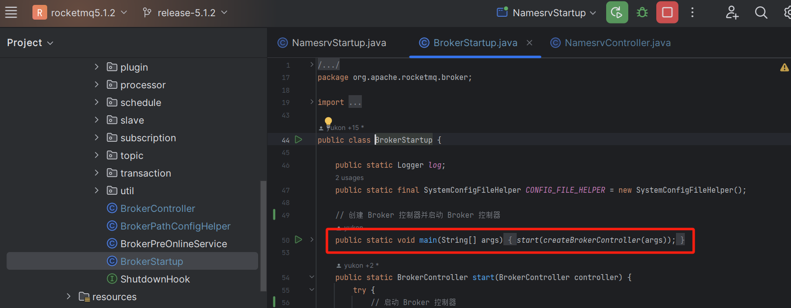

这里有两个要点：

1.  设置 [ROCKETMQ\_HOME](http://rocketmq_home%20/) 环境变量，其路径就是跟 [NameServer](http://nameserver%20/) 的一致。
2.  添加设置 [NameServer](http://nameserver/) 地址[org.apache.rocketmq.broker.BrokerStartup -n 127.0.0.1:9876](http://org.apache.rocketmq.broker.BrokerStartup%20-n%20127.0.0.1:9876)。

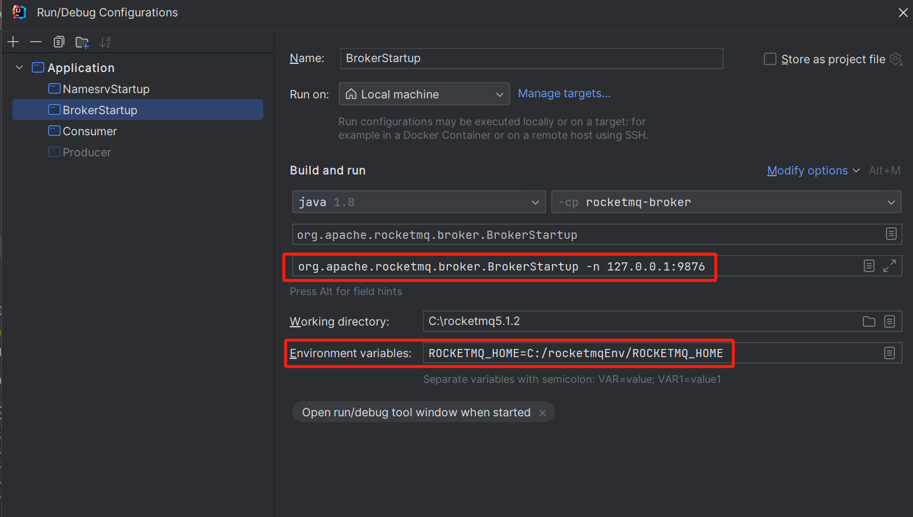

然后启动该类，输出如下所示表示 [Broker](http://broker/) 模块启动成功。

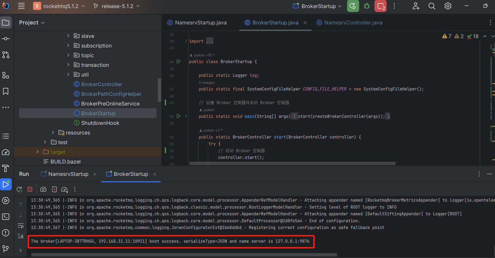

### **2.4.4 启动 Proxy**

当启动完 「**NameServer**」、「**Broker**」模块之后，最后我们来启动 「**Proxy**」模块。 同样从 [Proxy](http://proxy/) 模块中找到类 [ProxyStartup](http://proxystartup/) 类，如下：  

  
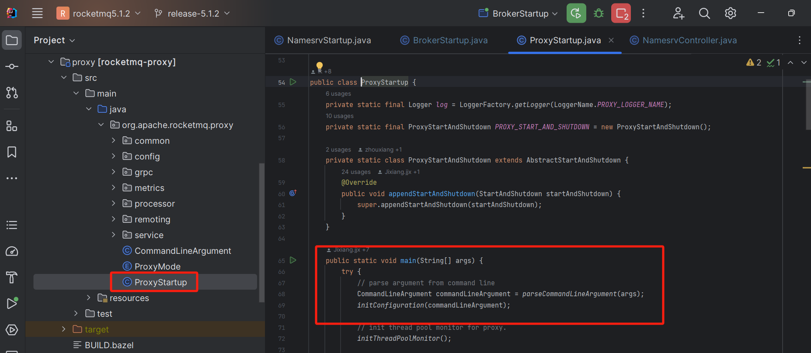

同上 [Broker](http://broker/) 配置环境变量，如下：

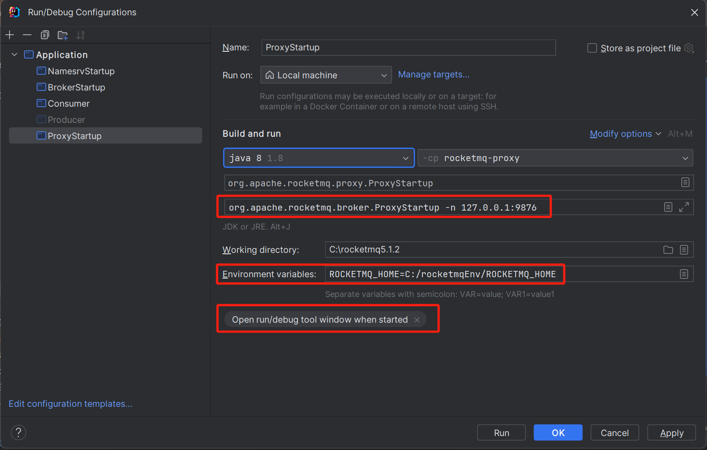

然后启动该类，输出如下所示表示 [Proxy](http://proxy/) 模块启动成功。

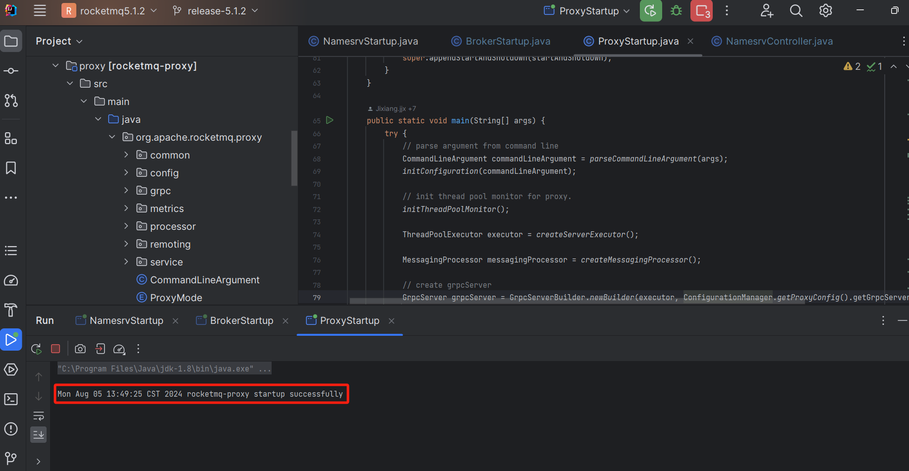

## **2.5 发送消息**

自此 [Nameserver](http://nameserver/)、[Broker](http://broker/)、[Proxy](http://proxy/) 模块都已经启动成功了，那我们如何发送消息呢？

由于 RocketMQ 5.x 引入了 [Proxy](http://proxy/)，原先的 [RocketMQ Client API](http://rocketmq%20client%20api/) 不能直接使用，RocketMQ 官方提供了一套极简 API，API 的完整定义在 Apache 顶级开源项目 [rocketmq-apis](https://github.com/apache/rocketmq-apis) ，具体的 [proto](http://proto%20/) 定义如下图所示：

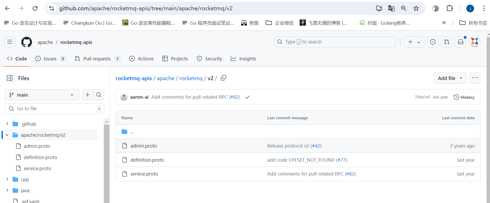

具体的实现在 [https://github.com/apache/rocketmq-clients](https://github.com/apache/rocketmq-clients)，实现了cpp、golang、java、php、rust 的实现。

接下来，我们使用一下 Java SDK 版本的客户端尝试发送一条消息。

### **2.5.1 构建工程**

在 [IDEA](http://idea/) 中创建一个 Java 工程。

在 pom.xml 中添加以下依赖。

<dependencies>

<dependency>

<groupId>org.apache.rocketmq</groupId>

<artifactId>rocketmq-client-java</artifactId>

<version>5.0.7</version>

</dependency>

</dependencies>

import org.apache.rocketmq.client.apis.ClientConfiguration;

import org.apache.rocketmq.client.apis.ClientServiceProvider;

import org.apache.rocketmq.client.apis.SessionCredentialsProvider;

import org.apache.rocketmq.client.apis.StaticSessionCredentialsProvider;

import org.apache.rocketmq.client.apis.message.Message;

import org.apache.rocketmq.client.apis.producer.Producer;

import org.apache.rocketmq.client.apis.producer.SendReceipt;

import java.nio.charset.StandardCharsets;

import java.time.Duration;

import java.util.concurrent.CompletableFuture;

public class RocketMQProxyTest {

public static void main(String\[\] args) throws Exception {

final ClientServiceProvider provider \= ClientServiceProvider.loadService();

// Credential provider is optional for client configuration.

String accessKey \= "yourAccessKey";

String secretKey \= "yourSecretKey";

SessionCredentialsProvider sessionCredentialsProvider \=

new StaticSessionCredentialsProvider(accessKey, secretKey);

String endpoints \= "127.0.0.1:8081";

ClientConfiguration clientConfiguration \= ClientConfiguration.newBuilder()

.setEndpoints(endpoints)

.setCredentialProvider(sessionCredentialsProvider)

.setRequestTimeout(Duration.ofSeconds(30))

.build();

String topic \= "TopicTest";

final Producer producer \= provider.newProducerBuilder()

.setClientConfiguration(clientConfiguration)

// Set the topic name(s), which is optional. It makes producer could prefetch the topic route before

// message publishing.

.setTopics(topic)

// May throw {@link ClientException} if the producer is not initialized.

.build();

// Define your message body.

byte\[\] body = "This is a normal message for Apache RocketMQ".getBytes(StandardCharsets.UTF\_8);

String tag \= "yourMessageTagA";

final Message message \= provider.newMessageBuilder()

// Set topic for the current message.

.setTopic(topic)

// Message secondary classifier of message besides topic.

.setTag(tag)

// Key(s) of the message, another way to mark message besides message id.

.setKeys("yourMessageKey-0e094a5f9d85")

.setBody(body)

.build();

final CompletableFuture<SendReceipt> future = producer.sendAsync(message);

future.whenComplete((sendReceipt, throwable) -> {

if (null == throwable) {

System.out.println("Send message successfully, messageId=" + sendReceipt.getMessageId());

} else {

System.out.println("Failed to send message");

}

});

// Block to avoid exist of background threads.

Thread.sleep(Long.MAX\_VALUE);

// Close the producer when you don't need it anymore.

producer.close();

}

}

运行结果如下：

Send message successfully, messageId=01DA0D66F2333D8D1E05F8BEF300000000