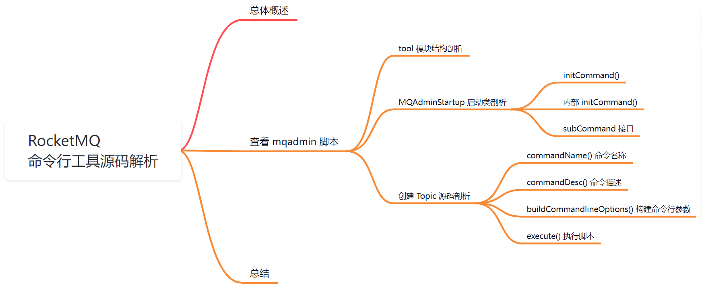
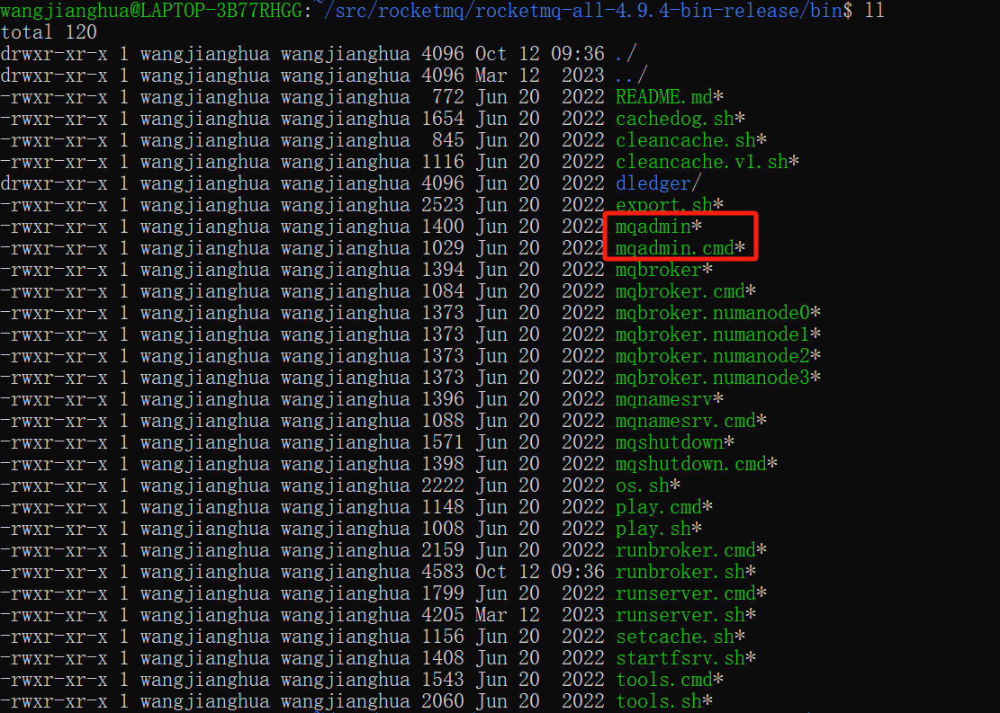
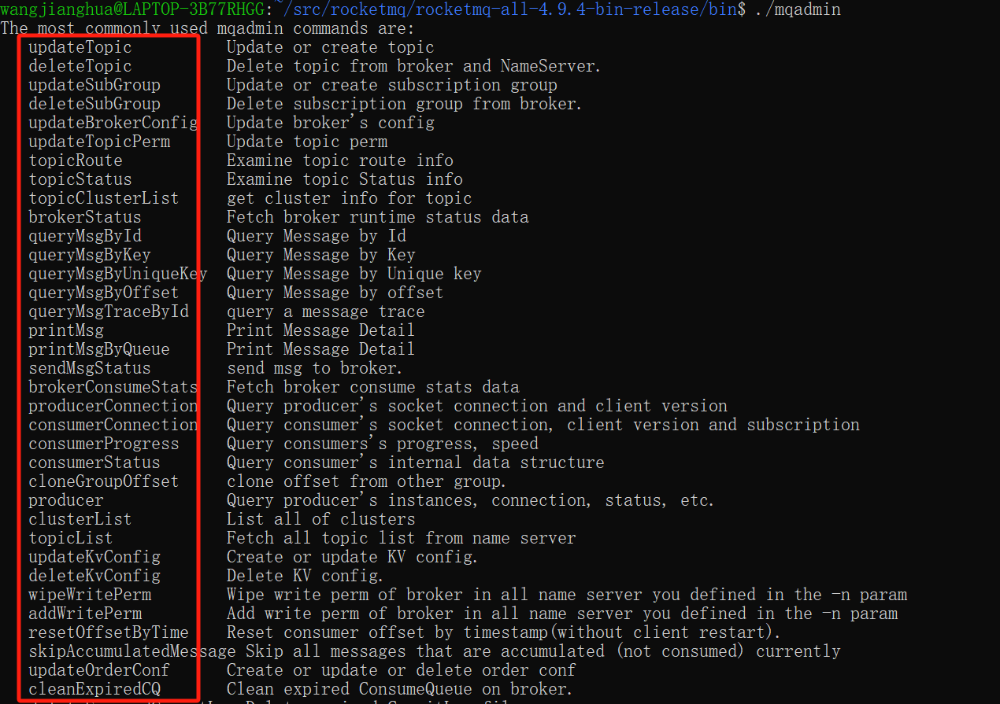
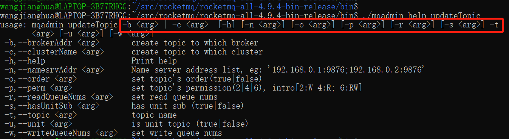
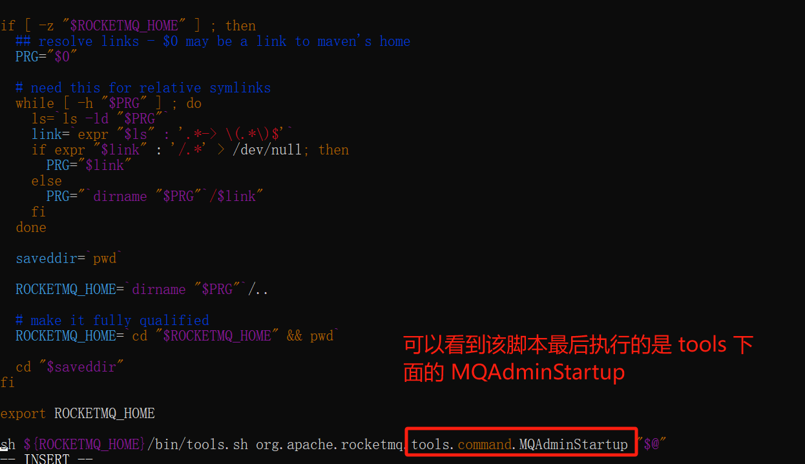
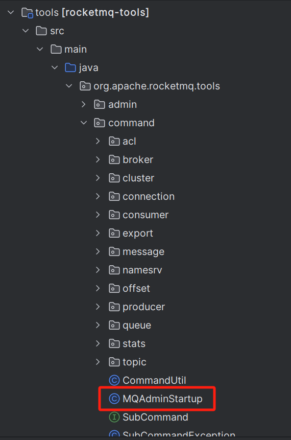

大家好，我是**华仔**, 又跟大家见面了。

从今天开始我将为大家奉上 RocketMQ 源码剖析系列文章，正式开启「**RocketMQ 的源码之旅**」，这是第二篇，我们来剖析下 RocketMQ 命令行工具源码。

## **01 总体概述**

RocketMQ 提供有控制台及一系列控制台命令，让管理员对主题，集群，broker 等信息进行管理。

进入 RocketMQ 的 bin 目录，可以看到 mqadmin 脚本文件。

执行 mqadmin 脚本显示如下：

  

可以看到这里显示了 mqadmin 命令支持的所有操作。如果想具体查新某一个操作的详细命令，可以使用以下命令：

mqadmin help 命令名称

比如：mqadmin help updateTopic

## **02 查看 mqadmin 脚本**

看了上面的执行命令，是不是对这个脚本很感兴趣，我们来简单查看下这个脚本源码：

可以发现 mqadmin 的命令调用的是 tools 命令，设置的启动类为 [org.apache.rocketmq.tools.command.MQAdminStartup](http://org.apache.rocketmq.tools.command.mqadminstartup/)。

##   
**2.1 tool 模块结构剖析**

tools 是 RocketMQ 中的命令行工具类，从上图可以看到包含很多基础组件操作功能。

## **2.2 MQAdminStartup 启动类剖析**

源码位置：[https://github.com/apache/rocketmq/blob/release-4.9.7/tools/src/main/java/org/apache/rocketmq/tools/command/MQAdminStartup.java](https://github.com/apache/rocketmq/blob/release-4.9.7/tools/src/main/java/org/apache/rocketmq/tools/command/MQAdminStartup.java)

public static void main(String\[\] args) {

main0(args, null);

}

public static void main0(String\[\] args, RPCHook rpcHook) {

System.setProperty(RemotingCommand.REMOTING\_VERSION\_KEY, Integer.toString(MQVersion.CURRENT\_VERSION));

//PackageConflictDetect.detectFastjson();

// 1、首先调用 initCommand() 方法加载所有的命令。

initCommand();

try {

// 2、初始化日志

initLogback();

// 3、判断启动该类 main 方法传入的参数

switch (args.length) {

// 3.1、如果没有参数，则打印帮助信息。

case 0:

printHelp();

break;

// 3.2、如果参数为 2 个，并且第一个是 help，第二个参数是 initCommand()加载的命令名称，则调用 ServerUtil.printCommandLineHelp() 方法打印指定命令的帮助信息。

case 2:

if (args\[0\].equals("help")) {

SubCommand cmd \= findSubCommand(args\[1\]);

if (cmd != null) {

Options options \= ServerUtil.buildCommandlineOptions(new Options());

options = cmd.buildCommandlineOptions(options);

if (options != null) {

ServerUtil.printCommandLineHelp("mqadmin " + cmd.commandName(), options);

}

} else {

System.out.printf("The sub command %s not exist.%n", args\[1\]);

}

break;

}

// 3.3、如果参数为一个、或2个，并且第一个参数不为 help，或多个。并且第一个参数为 initCommand() 加载的命令，则调用 该initCommand() 加载类中的 execute() 方法。

case 1:

default:

SubCommand cmd \= findSubCommand(args\[0\]);

if (cmd != null) {

String\[\] subargs = parseSubArgs(args);

Options options \= ServerUtil.buildCommandlineOptions(new Options());

final CommandLine commandLine \=

ServerUtil.parseCmdLine("mqadmin " + cmd.commandName(), subargs, cmd.buildCommandlineOptions(options),

new PosixParser());

if (null == commandLine) {

return;

}

if (commandLine.hasOption('n')) {

String namesrvAddr \= commandLine.getOptionValue('n');

System.setProperty(MixAll.NAMESRV\_ADDR\_PROPERTY, namesrvAddr);

}

// 执行脚本命令

cmd.execute(commandLine, options, AclUtils.getAclRPCHook(rocketmqHome + MixAll.ACL\_CONF\_TOOLS\_FILE));

} else {

System.out.printf("The sub command %s not exist.%n", args\[0\]);

}

break;

}

} catch (Exception e) {

e.printStackTrace();

}

}

整个步骤如下：

1.  首先调用 [initCommand()](http://initcommand\(\)/) 方法加载所有的命令。
2.  初始化日志。
3.  判断启动该类 main 方法传入的参数。
4.  如果没有参数，则打印帮助信息。
5.  如果参数为 2 个，并且第一个是 help，第二个参数是 [initCommand()](http://initcommand\(\)/) 加载的命令名称，则调用 [ServerUtil.printCommandLineHelp()](http://serverutil.printcommandlinehelp\(\)/) 方法打印指定命令的帮助信息。
6.  如果参数为一个或2个，并且第一个参数不为 help或多个。并且第一个参数为 [initCommand()](http://initcommand\(\)/) 加载的命令，则调用该[initCommand()](http://initcommand\(\)/) 加载类中的 [execute()](http://execute\(\)/) 方法。

接下来我们挨个来看下关键函数。

## **2.2.1 initCommand()**

public static void initCommand() {

initCommand(new UpdateTopicSubCommand());

initCommand(new DeleteTopicSubCommand());

initCommand(new UpdateSubGroupSubCommand());

initCommand(new DeleteSubscriptionGroupCommand());

initCommand(new UpdateBrokerConfigSubCommand());

initCommand(new UpdateTopicPermSubCommand());

initCommand(new TopicRouteSubCommand());

initCommand(new TopicStatusSubCommand());

initCommand(new TopicClusterSubCommand());

initCommand(new BrokerStatusSubCommand());

initCommand(new QueryMsgByIdSubCommand());

initCommand(new QueryMsgByKeySubCommand());

initCommand(new QueryMsgByUniqueKeySubCommand());

initCommand(new QueryMsgByOffsetSubCommand());

initCommand(new QueryMsgTraceByIdSubCommand());

initCommand(new PrintMessageSubCommand());

initCommand(new PrintMessageByQueueCommand());

initCommand(new SendMsgStatusCommand());

initCommand(new BrokerConsumeStatsSubCommad());

initCommand(new ProducerConnectionSubCommand());

initCommand(new ConsumerConnectionSubCommand());

initCommand(new ConsumerProgressSubCommand());

initCommand(new ConsumerStatusSubCommand());

initCommand(new CloneGroupOffsetCommand());

//for producer

initCommand(new ProducerSubCommand());

initCommand(new ClusterListSubCommand());

initCommand(new TopicListSubCommand());

initCommand(new UpdateKvConfigCommand());

initCommand(new DeleteKvConfigCommand());

initCommand(new WipeWritePermSubCommand());

initCommand(new AddWritePermSubCommand());

initCommand(new ResetOffsetByTimeCommand());

initCommand(new SkipAccumulationSubCommand());

initCommand(new UpdateOrderConfCommand());

initCommand(new CleanExpiredCQSubCommand());

initCommand(new DeleteExpiredCommitLogSubCommand());

initCommand(new CleanUnusedTopicCommand());

initCommand(new StartMonitoringSubCommand());

initCommand(new StatsAllSubCommand());

initCommand(new AllocateMQSubCommand());

initCommand(new CheckMsgSendRTCommand());

initCommand(new CLusterSendMsgRTCommand());

initCommand(new GetNamesrvConfigCommand());

initCommand(new UpdateNamesrvConfigCommand());

initCommand(new GetBrokerConfigCommand());

initCommand(new GetConsumerConfigSubCommand());

initCommand(new QueryConsumeQueueCommand());

initCommand(new SendMessageCommand());

initCommand(new ConsumeMessageCommand());

//for acl command

initCommand(new UpdateAccessConfigSubCommand());

initCommand(new DeleteAccessConfigSubCommand());

initCommand(new ClusterAclConfigVersionListSubCommand());

initCommand(new UpdateGlobalWhiteAddrSubCommand());

initCommand(new GetAccessConfigSubCommand());

initCommand(new ExportMetadataCommand());

initCommand(new ExportConfigsCommand());

initCommand(new ExportMetricsCommand());

}

从该方法执行类名中可以看出跟上面控制台，执行 mqadmin 指令输出命令的名字可以一一对应上。

##   
**2.2.2 initCommand()**

public static void initCommand(SubCommand command) {

subCommandList.add(command);

}

protected static List<SubCommand> subCommandList = new ArrayList<SubCommand>();

该方法很简单，就是把 init 的子命令加载到一个 List 集合中。

接着我们来看下子命令接口。

## **2.2.3 subCommand 接口**

所有的操作命令都实现了 SubCommand 接口。

  
源码位置：[https://github.com/apache/rocketmq/blob/release-4.9.7/tools/src/main/java/org/apache/rocketmq/tools/command/SubCommand.java](https://github.com/apache/rocketmq/blob/release-4.9.7/tools/src/main/java/org/apache/rocketmq/tools/command/SubCommand.java)

public interface SubCommand {

// commandName() 命令名称

String commandName();

// 命令别名

default String commandAlias() {

return null;

}

// commandDesc() 命令描述

String commandDesc();

// buildCommandlineOptions() 构建命令解析器

Options buildCommandlineOptions(final Options options);

// execute() 执行命令

void execute(final CommandLine commandLine, final Options options, RPCHook rpcHook) throws SubCommandException;

}

这个接口很简单，定义了几个简单的方法。

1.  [commandName()](http://commandname\(\)/) 命令名称。
2.  [commandAlias()](http://commandalias\(\)/) 命令别名。
3.  [commandDesc()](http://commanddesc\(\)/) 命令描述。
4.  [buildCommandlineOptions()](http://buildcommandlineoptions\(\)/) 构建命令解析器。
5.  [execute()](http://execute\(\)/) 执行命令。

最后我们以某个具体命令来剖析下其实现原理。

## **03 创建 Topic 源码剖析**

下面我们以创建 Topic 命令来分析实现原理， updateTopic 命令就是创建 Topic 的命令。

  

通过该命令可以查看 updateTopic 支持很多参数，底层最终是执行下面源码。

initCommand(new UpdateTopicSubCommand());

下面我们来分析下 [UpdateTopicSubCommand](http://updatetopicsubcommand/) 类的实现。

源码位置：[https://github.com/apache/rocketmq/blob/release-4.9.7/tools/src/main/java/org/apache/rocketmq/tools/command/topic/UpdateTopicSubCommand.java](https://github.com/apache/rocketmq/blob/release-4.9.7/tools/src/main/java/org/apache/rocketmq/tools/command/topic/UpdateTopicSubCommand.java)

## **3.1 commandName()**

@Override

// 命令名称

public String commandName() {

return "updateTopic";

}

## **3.2 commandDesc()**

@Override

// 命令描述

public String commandDesc() {

return "Update or create topic";

}

## **3.3 buildCommandlineOptions()**

@Override

// 从该方法中可以看到定义的命令及其说明。

public Options buildCommandlineOptions(Options options) {

OptionGroup optionGroup \= new OptionGroup();

Option opt \= new Option("b", "brokerAddr", true, "create topic to which broker");

optionGroup.addOption(opt);

opt = new Option("c", "clusterName", true, "create topic to which cluster");

optionGroup.addOption(opt);

optionGroup.setRequired(true);

options.addOptionGroup(optionGroup);

opt = new Option("t", "topic", true, "topic name");

opt.setRequired(true);

options.addOption(opt);

opt = new Option("r", "readQueueNums", true, "set read queue nums");

opt.setRequired(false);

options.addOption(opt);

opt = new Option("w", "writeQueueNums", true, "set write queue nums");

opt.setRequired(false);

options.addOption(opt);

opt = new Option("p", "perm", true, "set topic's permission(2|4|6), intro\[2:W 4:R; 6:RW\]");

opt.setRequired(false);

options.addOption(opt);

opt = new Option("o", "order", true, "set topic's order(true|false)");

opt.setRequired(false);

options.addOption(opt);

opt = new Option("u", "unit", true, "is unit topic (true|false)");

opt.setRequired(false);

options.addOption(opt);

opt = new Option("s", "hasUnitSub", true, "has unit sub (true|false)");

opt.setRequired(false);

options.addOption(opt);

return options;

}

##   
**3.4 execute()**

@Override

public void execute(final CommandLine commandLine, final Options options,

RPCHook rpcHook) throws SubCommandException {

DefaultMQAdminExt defaultMQAdminExt \= new DefaultMQAdminExt(rpcHook);

defaultMQAdminExt.setInstanceName(Long.toString(System.currentTimeMillis()));

try {

TopicConfig topicConfig \= new TopicConfig();

topicConfig.setReadQueueNums(8);

topicConfig.setWriteQueueNums(8);

topicConfig.setTopicName(commandLine.getOptionValue('t').trim());

// readQueueNums

if (commandLine.hasOption('r')) {

topicConfig.setReadQueueNums(Integer.parseInt(commandLine.getOptionValue('r').trim()));

}

// writeQueueNums

if (commandLine.hasOption('w')) {

topicConfig.setWriteQueueNums(Integer.parseInt(commandLine.getOptionValue('w').trim()));

}

// perm

if (commandLine.hasOption('p')) {

topicConfig.setPerm(Integer.parseInt(commandLine.getOptionValue('p').trim()));

}

boolean isUnit \= false;

if (commandLine.hasOption('u')) {

isUnit = Boolean.parseBoolean(commandLine.getOptionValue('u').trim());

}

boolean isCenterSync \= false;

if (commandLine.hasOption('s')) {

isCenterSync = Boolean.parseBoolean(commandLine.getOptionValue('s').trim());

}

int topicCenterSync \= TopicSysFlag.buildSysFlag(isUnit, isCenterSync);

topicConfig.setTopicSysFlag(topicCenterSync);

boolean isOrder \= false;

if (commandLine.hasOption('o')) {

isOrder = Boolean.parseBoolean(commandLine.getOptionValue('o').trim());

}

topicConfig.setOrder(isOrder);

if (commandLine.hasOption('b')) {

String addr \= commandLine.getOptionValue('b').trim();

defaultMQAdminExt.start();

defaultMQAdminExt.createAndUpdateTopicConfig(addr, topicConfig);

if (isOrder) {

String brokerName \= CommandUtil.fetchBrokerNameByAddr(defaultMQAdminExt, addr);

String orderConf \= brokerName + ":" + topicConfig.getWriteQueueNums();

defaultMQAdminExt.createOrUpdateOrderConf(topicConfig.getTopicName(), orderConf, false);

System.out.printf("%s", String.format("set broker orderConf. isOrder=%s, orderConf=\[%s\]",

isOrder, orderConf.toString()));

}

System.out.printf("create topic to %s success.%n", addr);

System.out.printf("%s", topicConfig);

return;

} else if (commandLine.hasOption('c')) {

String clusterName \= commandLine.getOptionValue('c').trim();

defaultMQAdminExt.start();

Set<String> masterSet =

CommandUtil.fetchMasterAddrByClusterName(defaultMQAdminExt, clusterName);

for (String addr : masterSet) {

defaultMQAdminExt.createAndUpdateTopicConfig(addr, topicConfig);

System.out.printf("create topic to %s success.%n", addr);

}

if (isOrder) {

Set<String> brokerNameSet =

CommandUtil.fetchBrokerNameByClusterName(defaultMQAdminExt, clusterName);

StringBuilder orderConf \= new StringBuilder();

String splitor \= "";

for (String s : brokerNameSet) {

orderConf.append(splitor).append(s).append(":")

.append(topicConfig.getWriteQueueNums());

splitor = ";";

}

defaultMQAdminExt.createOrUpdateOrderConf(topicConfig.getTopicName(),

orderConf.toString(), true);

System.out.printf("set cluster orderConf. isOrder=%s, orderConf=\[%s\]", isOrder, orderConf);

}

System.out.printf("%s", topicConfig);

return;

}

ServerUtil.printCommandLineHelp("mqadmin " + this.commandName(), options);

} catch (Exception e) {

throw new SubCommandException(this.getClass().getSimpleName() + " command failed", e);

} finally {

defaultMQAdminExt.shutdown();

}

}

从该方法中可以看出，很大一部分代码都是解析 [commandLine](http://commandline/) 参数。

1.  解析出来的参数来填充 TopicConfig 对象。
2.  然后调用 [DefaultMQAdminExt.createAndUpdateTopicConfig(addr, topicConfig)](http://defaultmqadminext.createandupdatetopicconfig\(addr,%20topicconfig\)/) 方法来创建 Topic。
3.  从上面的代码中可以看出 -b 和 -c 参数只能有一个生效。
4.  \-b 参数是在指定的 broker 上创建 topic。
5.  \-c 是在指定的集群上每一个 broker 创建 topic。
6.  优先判断的是 -b 参数，如果指定 -b 参数就会在指定的 broker 上创建，而不会在 -c 指定的集群上创建。

至此该命令的整个执行流程和实现原理就剖析完了，其他的 SubCommand 命令的实现方式都一样，就不挨个剖析了，感兴趣的可以自行学习，如果有问题可以在评论区留言。

##   
**04 总结**

本文通过剖析 mqadmin 引入了 [MQAdminStartup](http://org.apache.rocketmq.tools.command.mqadminstartup/) 启动类，并通过剖析创建 Topic 源码剖析了整个命令的执行流程以及原理实现。