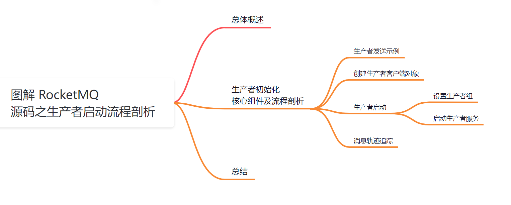
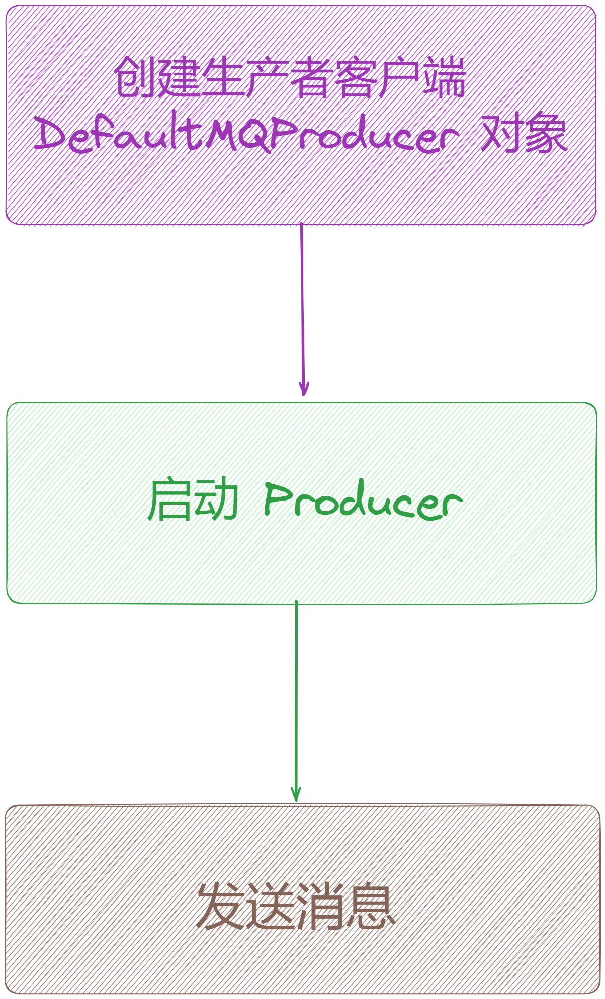
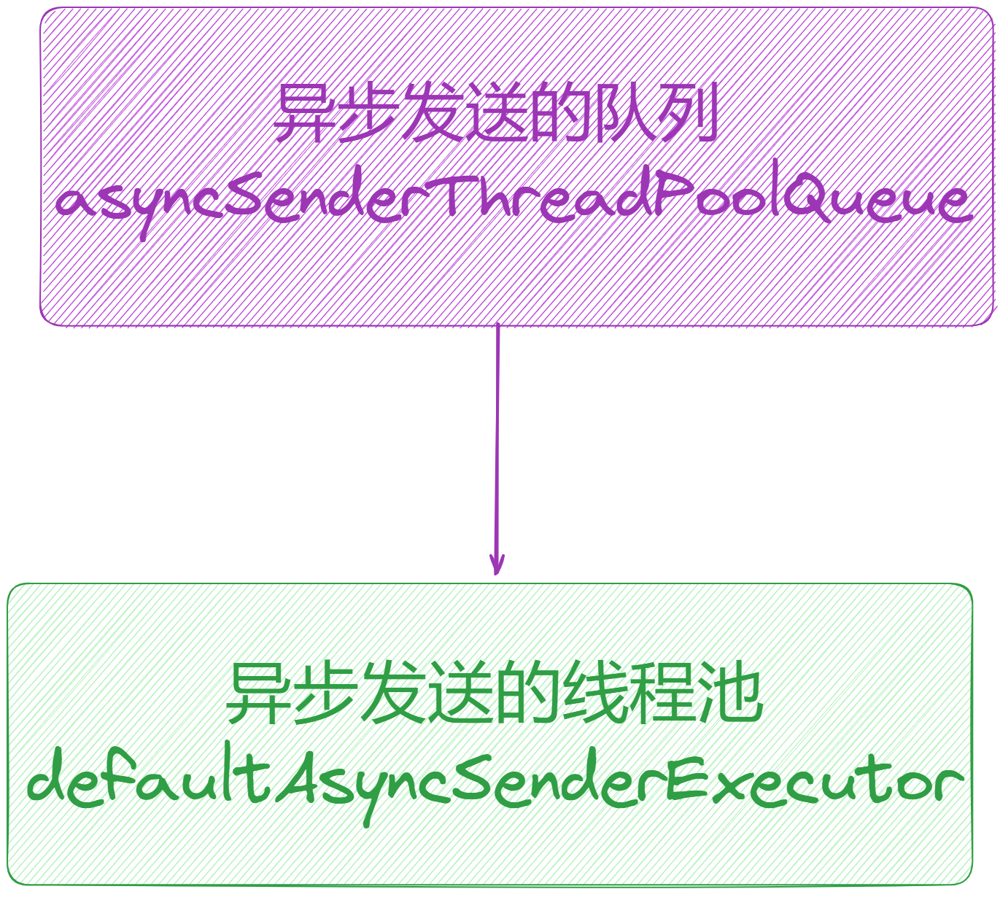
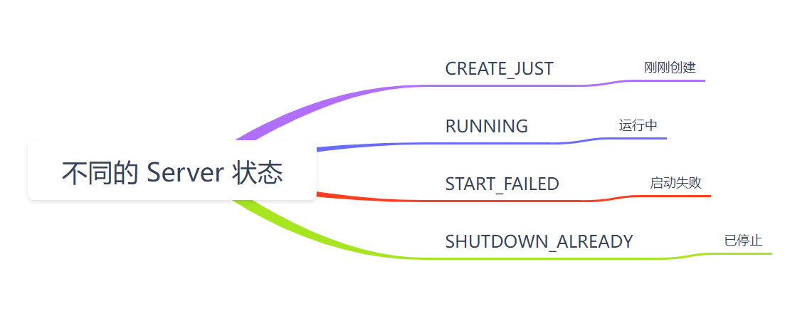
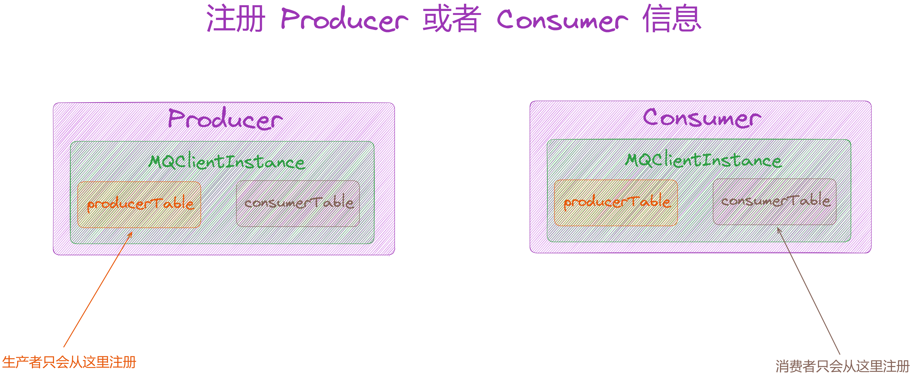
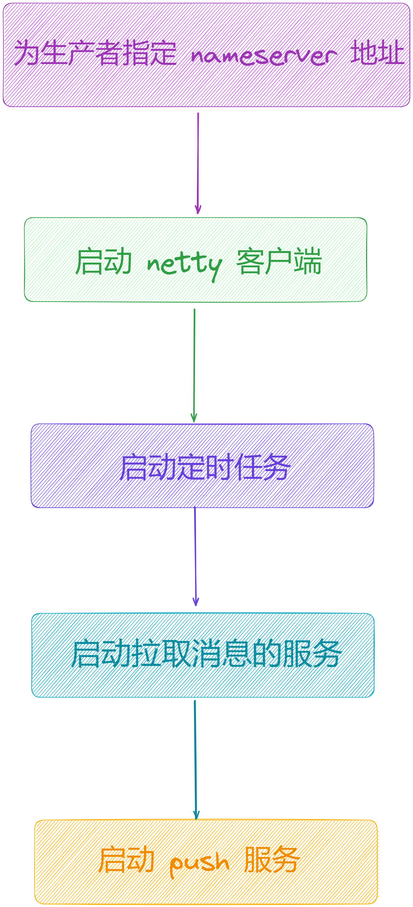
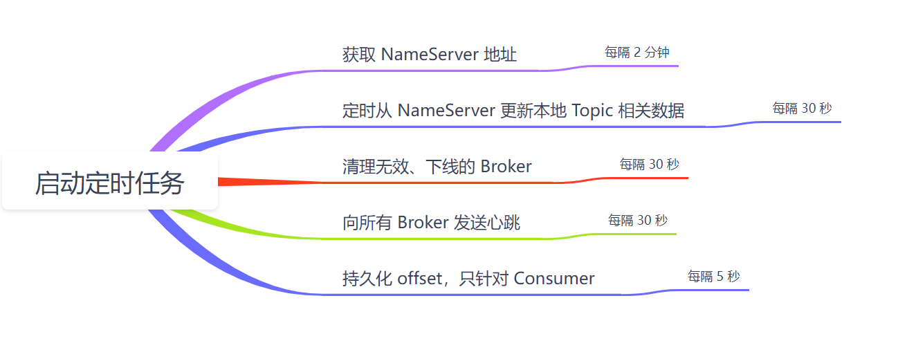
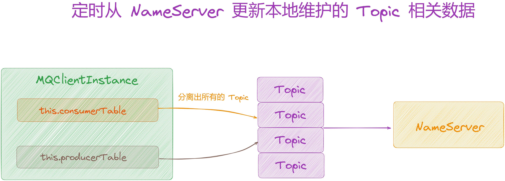

大家好，我是**华仔**, 又跟大家见面了。

从今天开始我将为大家奉上 RocketMQ 生产者源码剖析系列文章，正式开启「**RocketMQ 的生产者源码之旅**」，这是第三篇，我们来剖析下 RocketMQ 源码之生产者启动流程剖析。

这里我将以「**RocketMQ 4.9.7**」版本为主，通过「**场景驱动**」的方式带大家一点点的对 RocketMQ 源码进行深度剖析，正式开启「**RocketMQ 的源码之旅**」，跟我一起来掌握 RocketMQ 源码核心架构设计思想吧。

  

## **01 总体概述**

我们都知道在 RocketMQ 中，我们把产生消息的一方称为生产者即 Producer，它是 RocketMQ 核心组件之一，也是消息的来源所在。那么这些生产者产生的消息是如何传到 RocketMQ 服务端的呢？初始化启动过程是怎么样的呢？接下来会逐一讲解说明。

##   
**02 生产者初始化核心组件及流程剖析**

## **2.1 生产者发送示例**

在剖析生产者启动流程时，先看下生产者发送消息的示例代码，Producer 发送消息的示例在[org.apache.rocketmq.example.simple.Producer](http://org.apache.rocketmq.example.simple.producer/) 类中，代码如下：

// 同步发送

public class Producer {

public static void main(String\[\] args) throws MQClientException, InterruptedException {

// 1、实例化消息生产者 Producer

DefaultMQProducer producer \= new DefaultMQProducer("rocketmq-test-huazai-group");

// 2、启动 Producer 实例

producer.start();

// 3、发送消息到 broker

for (int i \= 0; i < 128; i++)

try {

{

// 创建消息，并指定 Topic，Tag 和消息体

Message msg \= new Message("TopicTestHuaZai",

"TagA",

"OrderID188",

"Hello world".getBytes(RemotingHelper.DEFAULT\_CHARSET));

SendResult sendResult \= producer.send(msg);

// 通过 sendResult 返回消息是否成功送达

System.out.printf("%s%n", sendResult);

}

} catch (Exception e) {

e.printStackTrace();

}

// 如果不再发送消息，关闭 Producer 实例。

producer.shutdown();

}

}

从代码中不难看出，生产者发送消息只需要 3 个步骤：

1.  创建生产者客户端 DefaultMQProducer对象。
2.  启动 Producer。
3.  发送消息。

那么我们就按照这三个步骤逐步分析下它是如何工作的。

## **2.2 创建生产者客户端对象**

// 实例化消息生产者 Producer,指定生产者组名称

DefaultMQProducer producer \= new DefaultMQProducer("rocketmq-test-huazai-group");

在实例化 Producer 时，会传入一个 [ProducerGroup](http://producergroup/) 的名称，[ProducerGroup](http://producergroup/) 代表同一类生产者的合集。其实这个类就是一个外观类，RocketMQ 对于 Producer 有一个默认的实现类[DefaultMQProducerImpl](http://defaultmqproducerimpl/)。所以在初始化 [DefaultMQProducer](http://defaultmqproducer/) 时会初始化一个 [DefaultMQProducerImpl](http://defaultmqproducerimpl/) 对象实例并赋值给 Producer 的成员变量，我们看下它的构造器方法。

  
源码位置：[https://github.com/apache/rocketmq/blob/release-4.9.7/client/src/main/java/org/apache/rocketmq/client/producer/DefaultMQProducer.java](https://github.com/apache/rocketmq/blob/release-4.9.7/client/src/main/java/org/apache/rocketmq/client/producer/DefaultMQProducer.java)

public DefaultMQProducer() {

this(null, MixAll.DEFAULT\_PRODUCER\_GROUP, null);

}

public DefaultMQProducer(final String namespace, final String producerGroup, RPCHook rpcHook) {

this.namespace = namespace;

// 赋值 ProducerGroup 名称

this.producerGroup = producerGroup;

// 它才是真正工作的类，将 defaultMQProducerImpl 对象保存在成员变量中

defaultMQProducerImpl = new DefaultMQProducerImpl(this, rpcHook);

}

同时，在初始化 [DefaultMQProducerImpl](http://defaultmqproducerimpl/) 实例时也会将 producer 对象作为成员变量保存在[DefaultMQProducerImpl](http://defaultmqproducerimpl/) 实例中，那么我们再看下它的构造器方法。

  
源码位置：[https://github.com/apache/rocketmq/blob/release-4.9.7/client/src/main/java/org/apache/rocketmq/client/impl/producer/DefaultMQProducerImpl.java](https://github.com/apache/rocketmq/blob/release-4.9.7/client/src/main/java/org/apache/rocketmq/client/impl/producer/DefaultMQProducerImpl.java)

public DefaultMQProducerImpl(final DefaultMQProducer defaultMQProducer, RPCHook rpcHook) {

// 将 defaultMQProducer 对象保存在成员变量中

this.defaultMQProducer = defaultMQProducer;

this.rpcHook = rpcHook;

// 1、创建一个异步发送的队列

this.asyncSenderThreadPoolQueue = new LinkedBlockingQueue<Runnable>(50000);

// 2、创建一个异步发送的线程池

this.defaultAsyncSenderExecutor = new ThreadPoolExecutor(

Runtime.getRuntime().availableProcessors(),

Runtime.getRuntime().availableProcessors(),

1000 \* 60,

TimeUnit.MILLISECONDS,

this.asyncSenderThreadPoolQueue,

new ThreadFactory() {

private AtomicInteger threadIndex \= new AtomicInteger(0);

@Override

public Thread newThread(Runnable r) {

return new Thread(r, "AsyncSenderExecutor\_" + this.threadIndex.incrementAndGet());

}

});

}

从该构造器中我们得出，它主要就是在做两件事：

1.  创建一个异步发送的队列： [asyncSenderThreadPoolQueue](http://asyncsenderthreadpoolqueue/)。
2.  创建一个异步发送的线程池：[defaultAsyncSenderExecutor](http://defaultasyncsenderexecutor/)。

然后是给 Producer 设置 [NameServer](https://juejin.cn/post/7096445713671782437) 的地址，因为 NameServer 是一个注册中心，保存着 Broker 信息和 Topic路由信息。

## **2.3 生产者启动**

只需要执行下面代码即可启动上方初始化的 producer 对象。

// 启动生产者客户端服务

producer.start();

[producer#start()](http://producer/#start\(\))方法具体的源码如下，其源码位置：[https://github.com/apache/rocketmq/blob/release-4.9.7/client/src/main/java/org/apache/rocketmq/client/producer/DefaultMQProducer.java](https://github.com/apache/rocketmq/blob/release-4.9.7/client/src/main/java/org/apache/rocketmq/client/producer/DefaultMQProducer.java)

public void start() throws MQClientException {

// 基于命名空间对 ProducerGroup 再次封装, 一般用于在不同的业务场景下做隔离

// 设置生产者组，由于 DefaultMQProducer 继承了 ClientConfig，所以可以直接使用 ClientConfig#withNamespace 方法

this.setProducerGroup(withNamespace(this.producerGroup));

// 调用 DefaultMQProducerImpl#start()方法启动生产者服务

this.defaultMQProducerImpl.start();

// 用于做消息追踪，消息轨迹追踪功能可以通过 DefaultMQProducer 对象的多个参数的构造器来开启，默认是关闭

if (null != traceDispatcher) {

try {

// 启动消息轨迹追踪

traceDispatcher.start(this.getNamesrvAddr(), this.getAccessChannel());

} catch (MQClientException e) {

log.warn("trace dispatcher start failed ", e);

}

}

}

可以看到 [DefaultMQProducer](http://defaultmqproducer/) 只是一个门面类，具体的实现都是由[DefaultMQProducerImpl](http://defaultmqproducerimpl/)去做的，该方法也比较简单，主要做了 3 件事情：

1.  设置生产者组，基于命名空间对 [ProducerGroup](http://producergroup/) 再次封装, 一般用于在不同的业务场景下做隔离。
2.  生产者启动是通过这个对象来启动的。
3.  用于做消息追踪，消息轨迹追踪功能可以通过 [DefaultMQProducer](http://defaultmqproducer/) 对象的多个参数的构造器来开启，默认是关闭。

接下来我们分别看下前两步骤的具体实现逻辑。

### **2.3.1 设置生产者组**

由于[Namespace](http://namespace/)的存在，因此在启动producer时首先会重新设置[producerGroup](http://producergroup/)，我们需要重点关注经过[withNamespace()](http://withnamespace\(\)/)方法处理后返回的生产者组名。

源码位置：[https://github.com/apache/rocketmq/blob/release-4.9.7/client/src/main/java/org/apache/rocketmq/client/ClientConfig.java](https://github.com/apache/rocketmq/blob/release-4.9.7/client/src/main/java/org/apache/rocketmq/client/ClientConfig.java)

public String withNamespace(String resource) {

// this.getNamespace()不设置的话返回的是 null

return NamespaceUtil.wrapNamespace(this.getNamespace(), resource);

}

可以看出该方法仅仅是调用了[NamespaceUtil#wrapNamespace()](http://namespaceutil/#wrapNamespace\(\))方法，并将[Namespace](http://namespace/)和[producerGroup](http://producergroup/)作为参数一并传入处理。

源码位置：[https://github.com/apache/rocketmq/blob/release-4.9.7/common/src/main/java/org/apache/rocketmq/common/protocol/NamespaceUtil.java](https://github.com/apache/rocketmq/blob/release-4.9.7/common/src/main/java/org/apache/rocketmq/common/protocol/NamespaceUtil.java)

public static String wrapNamespace(String namespace, String resourceWithOutNamespace) {

// 1、如果 namespace 为空或者 resourceWithOutNamespace 为空，则直接返回resourceWithOutNamespace

if (StringUtils.isEmpty(namespace) || StringUtils.isEmpty(resourceWithOutNamespace)) {

return resourceWithOutNamespace;

}

// 如果 resourceWithOutNamespace 是 SystemResource 或者 resourceWithOutNamespace 已经组合了 Namespace，则直接返回 resourceWithOutNamespace

if (isSystemResource(resourceWithOutNamespace) || isAlreadyWithNamespace(resourceWithOutNamespace, namespace)) {

return resourceWithOutNamespace;

}

String resourceWithoutRetryAndDLQ \= withOutRetryAndDLQ(resourceWithOutNamespace);

StringBuilder stringBuilder \= new StringBuilder();

// 重试 Topic 处理标识

if (isRetryTopic(resourceWithOutNamespace)) {

stringBuilder.append(MixAll.RETRY\_GROUP\_TOPIC\_PREFIX);

}

// 死信 Topic 处理标识

if (isDLQTopic(resourceWithOutNamespace)) {

stringBuilder.append(MixAll.DLQ\_GROUP\_TOPIC\_PREFIX);

}

// 返回 \[RETRY\_PREFIX\] + \[DLQ\_PREFIX\] + namespace + % + resourceWithoutRetryAndDLQ

return stringBuilder.append(namespace).append(NAMESPACE\_SEPARATOR).append(resourceWithoutRetryAndDLQ).toString();

}

该方法也比较简单，**由于我们并没有设置 Producer 的 Namespace，所以会直接返回 producerGroup**。最后的效果就是在这个生产者启动过程中第一行代码没有任何效果。

### **2.3.2 启动生产者服务**

可以看到这里最重要的是第二步，启动生产者。

this.defaultMQProducerImpl.start();

最终调用 [defaultMQProducerImpl#start()](http://defaultmqproducerimpl/#start\(\)) 方法进行启动生产者。可以看到 [DefaultMQProducer](http://defaultmqproducer/) 的构造器，send() 和start() 等相关的方法，其实都是围绕 [DefaultMQProducerImpl](http://defaultmqproducerimpl/) 来转，[defaultMQProducerImpl](http://defaultmqproducerimpl/)：默认生产者的实现类，其 start() 方法作为生产者启动的核心方法，接下来将核心分析其 start() 方法的实现。

public void start() throws MQClientException {

this.start(true);

}

/\*\*

\* mq-producer 启动

\* @param startFactory

\* @throws MQClientException

\*/

public void start(final boolean startFactory) throws MQClientException {

// 如果状态为 CREATE\_JUST，执行启动逻辑。该对象创建时默认状态为 CREATE\_JUST

switch (this.serviceState) {

case CREATE\_JUST:

// 1、状态设置启动失败

this.serviceState = ServiceState.START\_FAILED;

// 2、检查配置，比如生产者组名是否合法，是否超过最大字符限制等

this.checkConfig();

// 3、改变生产者的 instanceName 为进程 ID，避免同一个服务器上的多个生产者实例名相同。即将 instanceName 属性更改为 PID，如果实例名为默认值则将生产者的 instanceName设置为 UtilAll.getPid() + "#" + System.nanoTime()

if (!this.defaultMQProducer.getProducerGroup().equals(MixAll.CLIENT\_INNER\_PRODUCER\_GROUP)) {

this.defaultMQProducer.changeInstanceNameToPID();

}

// 4、创建客户端 MQClientInstance 对象实例，使用 MQClientManager.getInstance() 返回一个单例的MQClientManager 对象，defaultMQProducer 继承了 ClientConfig，因此 getOrCreateMQClientInstance 方法的参数可以是 defaultMQProducer，mQClientFactory 是 MQClientInstance 的一个实例，MQClientInstance 是 MQClientManager 的内部类

this.mQClientFactory = MQClientManager.getInstance().getOrCreateMQClientInstance(this.defaultMQProducer, rpcHook);

// 5、注册生产者信息到本地，即注册 producer 实例：将生产者组名作为key，defaultMQProducerImpl对象作为value保存到MQClientInstance的producerTable中

// 方便后续调用网络请求、进行心跳检测等

boolean registerOK \= mQClientFactory.registerProducer(this.defaultMQProducer.getProducerGroup(), this);

if (!registerOK) {

// 如果注册失败则将 serviceState 重设为 CREATE\_JUST

this.serviceState = ServiceState.CREATE\_JUST;

throw new MQClientException("The producer group\[" + this.defaultMQProducer.getProducerGroup()

\+ "\] has been created before, specify another name please." + FAQUrl.suggestTodo(FAQUrl.GROUP\_NAME\_DUPLICATE\_URL),

null);

}

// 6、设置 topic 路由表信息，不过这里的 topic 是“TBW102”

// 将 defaultMQProducer 的 createTopicKey 作为 key，TopicPublishInfo 作为 value，放入到 defaultMQProducerImpl的topicPublishInfoTable中，createTopicKey 的默认值为 TBW102

// topicPublishInfoTable 的作用是存储 topic 的路由信息，包括 topic 的 queue 数目、brokerName、brokerId等

this.topicPublishInfoTable.put(this.defaultMQProducer.getCreateTopicKey(), new TopicPublishInfo());

// 7、启动生产者客户端 MQClientInstance 实例，如果已经启动，则不会执行

if (startFactory) {

// MQClientInstance 的 start 方法会启动 MQClientInstance 的定时任务

// 包括定时向所有 broker 发送心跳、定时清理过期的 topic、定时清理过期的consumer、定时清理过期的 producer

mQClientFactory.start();

}

log.info("the producer \[{}\] start OK. sendMessageWithVIPChannel={}", this.defaultMQProducer.getProducerGroup(),

this.defaultMQProducer.isSendMessageWithVIPChannel());

// 8、启动成功则将 serviceState 设置为 RUNNING

this.serviceState = ServiceState.RUNNING;

break;

// 其他状态直接抛异常

case RUNNING:

case START\_FAILED:

case SHUTDOWN\_ALREADY:

throw new MQClientException("The producer service state not OK, maybe started once, " \+ this.serviceState + FAQUrl.suggestTodo(FAQUrl.CLIENT\_SERVICE\_NOT\_OK), null);

default:

break;

}

// 9、启动后马上向 NameServer 发送心跳

this.mQClientFactory.sendHeartbeatToAllBrokerWithLock();

// 10、开启一个定时任务来处理所有的 Request 状态，对异步的请求根据状态处理回调函数，这个异步请求指的并不是在 send 中的异步回调机制，而是 Request-Reply 特性，用来模拟 RPC 调用

RequestFutureHolder.getInstance().startScheduledTask(this);

}

该方法比较重要，主要用来「**启动生产者**」，分为几个状态，如下：

1.  对于 CREATE\_JUST 状态，处理逻辑有以下几步：
2.  状态设置启动失败。
3.  检查配置，比如 groupName 是否为空，是否超过最大字符限制等。
4.  将 instanceName 属性更改为 PID。
5.  创建客户端对象。
6.  注册生产者信息到本地。
7.  设置 topic 路由表信息，不过这里的 topic 是「**TBW102**」。
8.  启动生产者客户端。
9.  如果初始化状态不等于 [CREATE\_JUST](http://create_just/)，则异常抛出。
10.  启动后马上向 NameServer 发送心跳。
11.  开启一个定时任务来处理所有的 Request 状态，对异步的请求根据状态处理回调函数，这个异步请求指的并不是在 send 中的异步回调机制，而是 Request-Reply 特性，用来模拟 RPC 调用。

> 注意上述代码中有一段注释为 createTopicKey 的默认值为 TBW102，这个 Topic 在自动创建 topic 时有关键作用
> 
> 最后的 RequestFutureHolder.getInstance().startScheduledTask(this) 用来扫描和处理过期的异步请求，但是需要注意的是这个异步请求指的并不是在 send 中的异步回调机制，而是 Request-Reply 特性，用来模拟 RPC 调用。
> 
> RocketMQ 有两种异步请求的方式，一种是在 send 方法中传入一个回调函数，当消息发送成功或失败时，会调用这个回调函数。这种方式不需要等待服务器的响应，只需要等待服务器的确认。
> 
> 另一种是在 RocketMQ 4.7.0 版本后加入的 Request-Reply 特性，这种方式是模拟 RPC 调用，需要等待服务器的响应，并返回一个结果。这种方式需要使用 RequestResponseFuture 对象来封装请求和响应的信息。

接着，我们来分别看下该方法的每个具体步骤的操作。

### **2.3.1.1 不同状态**

对于一个 Producer 实例来说，总共会有 4 种不同的状态，如下图所示：

  

我们在看的 Producer 启动时，它需要关心的状态就**只有**CREATE\_JUST 状态，这也是 Producer 实例化之后默认的状态，在初始化时就会设置一个默认值。

// 默认初始化就是 CREATE\_JUST 状态

private ServiceState serviceState \= ServiceState.CREATE\_JUST;

当其调用了[start()](http://start\(\)/)成功之后，Producer 就会将状态修改为[RUNNING](http://running/) 状态，失败了就会变成[START\_FAILED](http://start_failed/) 状态。

### **2.3.1.2 检测配置**

这里主要检测 [ProducerGroup](http://producergroup/) 是否合法，主要是：

1.  [ProducerGroup](http://producergroup/) 是否为空？
2.  [ProducerGroup](http://producergroup/) 名称是否超过了最大长度？这个值 [CHARACTER\_MAX\_LENGTH](http://character_max_length/) 默认是 255。
3.  [ProducerGroup](http://producergroup/) 名称是否包含非法字符？

源码如下：

// 该方法主要检测 producerGroup 的合法性

private void checkConfig() throws MQClientException {

Validators.checkGroup(this.defaultMQProducer.getProducerGroup());

// 生产所属组 不能等于 DEFAULT\_PRODUCER，直接抛异常

if (this.defaultMQProducer.getProducerGroup().equals(MixAll.DEFAULT\_PRODUCER\_GROUP)) {

throw new MQClientException("producerGroup can not equal " + MixAll.DEFAULT\_PRODUCER\_GROUP + ", please specify another one.",

null);

}

}

public static void checkGroup(String group) throws MQClientException {

// 检查 producer 的 groupName 是否为空

if (UtilAll.isBlank(group)) {

throw new MQClientException("the specified group is blank", null);

}

// 检查 producer 的 groupName 长度是否超过255字符

if (group.length() > CHARACTER\_MAX\_LENGTH) {

throw new MQClientException("the specified group is longer than group max length 255.", null);

}

// 检查 producer的 groupName 是否包含特殊字符，否则抛异常

if (isTopicOrGroupIllegal(group)) {

throw new MQClientException(String.format(

"the specified group\[%s\] contains illegal characters, allowing only %s", group,

"^\[%|a-zA-Z0-9\_-\]+$"), null);

}

}

### **2.3.1.3 创建客户端实例**

源码位置：[https://github.com/apache/rocketmq/blob/release-4.9.7/client/src/main/java/org/apache/rocketmq/client/impl/factory/MQClientInstance.java](https://github.com/apache/rocketmq/blob/release-4.9.7/client/src/main/java/org/apache/rocketmq/client/impl/factory/MQClientInstance.java)

this.mQClientFactory = MQClientManager.getInstance().getOrCreateMQClientInstance(this.defaultMQProducer, rpcHook);

public class MQClientInstance {

....

// 生产者表，producer 启动时创建一个新的 MQClientInstance 实例对象，将生产者信息注册到这里。生产者实例对象中消费者信息是空

private final ConcurrentMap<String/\* group \*/, MQProducerInner> producerTable = new ConcurrentHashMap<String, MQProducerInner>();

// 消费者表，consumer 启动时创建一个新的 MQClientInstance 实例对象，将消费者信息注册到这里。消费者实例对象中生产者信息是空

private final ConcurrentMap<String/\* group \*/, MQConsumerInner> consumerTable = new ConcurrentHashMap<String, MQConsumerInner>();

....

// topic 路由信息，producer 和 consumer 都会使用

private final ConcurrentMap<String/\* Topic \*/, TopicRouteData> topicRouteTable = new ConcurrentHashMap<String, TopicRouteData>();

private final Lock lockNamesrv \= new ReentrantLock();

private final Lock lockHeartbeat \= new ReentrantLock();

// broker 信息，producer 和 consumer 都会用到

private final ConcurrentMap<String/\* Broker Name \*/, HashMap<Long/\* brokerId \*/, String/\* address \*/\>> brokerAddrTable =

new ConcurrentHashMap<String, HashMap<Long, String>>();

private final ConcurrentMap<String/\* Broker Name \*/, HashMap<String/\* address \*/, Integer>> brokerVersionTable =

new ConcurrentHashMap<String, HashMap<String, Integer>>();

// 定时执行器

private final ScheduledExecutorService scheduledExecutorService \= Executors.newSingleThreadScheduledExecutor(new ThreadFactory() {

@Override

public Thread newThread(Runnable r) {

return new Thread(r, "MQClientFactoryScheduledThread");

}

});

// 客户端处理器

private final ClientRemotingProcessor clientRemotingProcessor;

// 拉取消息的服务

private final PullMessageService pullMessageService;

// 重平衡服务

private final RebalanceService rebalanceService;

private final DefaultMQProducer defaultMQProducer;

// 消费者状态

private final ConsumerStatsManager consumerStatsManager;

....

public MQClientInstance(ClientConfig clientConfig, int instanceIndex, String clientId, RPCHook rpcHook) {

this.clientConfig = clientConfig;

this.instanceIndex = instanceIndex;

this.nettyClientConfig = new NettyClientConfig();

this.nettyClientConfig.setClientCallbackExecutorThreads(clientConfig.getClientCallbackExecutorThreads());

this.nettyClientConfig.setUseTLS(clientConfig.isUseTLS());

// 客户端处理器,比如在集群消费模式下，有新的消费者加入，则通知消费者客户端重平衡,主要是给消费者用的，这里可以忽略

this.clientRemotingProcessor = new ClientRemotingProcessor(this);

// 它的内部会创建 netty 客户端对象（NettyRemotingClient），用于和 broker 通信

this.mQClientAPIImpl = new MQClientAPIImpl(this.nettyClientConfig, this.clientRemotingProcessor, rpcHook, clientConfig);

if (this.clientConfig.getNamesrvAddr() != null) {

this.mQClientAPIImpl.updateNameServerAddressList(this.clientConfig.getNamesrvAddr());

log.info("user specified name server address: {}", this.clientConfig.getNamesrvAddr());

}

this.clientId = clientId;

this.mQAdminImpl = new MQAdminImpl(this);

// 拉取消息的服务，和消费者相关，我们这里启动的是生产者实例，和消费者无关，忽略

this.pullMessageService = new PullMessageService(this);

// 重平衡服务，和消费者相关，我们这里启动的是生产者实例，和消费者无关，忽略

this.rebalanceService = new RebalanceService(this);

// 实例化内部的 producer，用来消费失败或超时的消息，sendMessageBack 回发给 broker，放到retry topic 中重试消费。

this.defaultMQProducer = new DefaultMQProducer(MixAll.CLIENT\_INNER\_PRODUCER\_GROUP);

this.defaultMQProducer.resetClientConfig(clientConfig);

this.consumerStatsManager = new ConsumerStatsManager(this.scheduledExecutorService);

log.info("Created a new client Instance, InstanceIndex:{}, ClientID:{}, ClientConfig:{}, ClientVersion:{}, SerializerType:{}",

this.instanceIndex,

this.clientId,

this.clientConfig,

MQVersion.getVersionDesc(MQVersion.CURRENT\_VERSION), RemotingCommand.getSerializeTypeConfigInThisServer());

}

}

> 注意：客户端实例是 MQClientInstance 类, 生产者和消费者都作为客户端，所以它保存了 producer 和consumer 相关的所有信息，后面我们在分析消费者启动时，还会看到根据这个类创建消费者实例。这里我们只关注生产者，所以消费者相关的内容可以忽略。

这里我们关注新初始化的 [DefaultMQProducer](http://defaultmqproducer/) 实例的 [producerGroup="CLIENT\_INNER\_PRODUCER"，instanceName = "DEFAULT"](http://producergroup="client_inner_producer",instancename%20=%20"default"/)。

接着，在初始化实例后又执行了 [this.defaultMQProducer.resetClientConfig(clientConfig)](http://this.defaultmqproducer.resetclientconfig\(clientconfig\)/) 这行代码。

### **2.3.1.4 注册生产者信息到本地**

boolean registerOK \= mQClientFactory.registerProducer(this.defaultMQProducer.getProducerGroup(), this);

public synchronized boolean registerProducer(final String group, final DefaultMQProducerImpl producer) {

if (null == group || null == producer) {

return false;

}

// 这里的 this 指的就是 MQClientInstance

// 很简单，就是将生产者信息注册到 MQClientInstance 对象中的 producerTable 表中。

MQProducerInner prev \= this.producerTable.putIfAbsent(group, producer);

if (prev != null) {

log.warn("the producer group\[{}\] exist already.", group);

return false;

}

return true;

}

该方法很简单，就是将生产者信息注册到 [MQClientInstance](http://mqclientinstance/) 对象中维护的 [producerTable](http://producertable/) 表中，里面包含了会存储当前客户端中 Producer 的一些信息。但大家应该还记得前面提到过 Consumer 内部也会使用 [MQClientInstance](http://mqclientinstance/)，在其内部还有一个[consumerTable](http://consumertable/)，用于存储消费者客户端里的所有 Consumer 信息。

  

从上面代码可以得出，在 [MQClientInstance](http://mqclientinstance/) 内部，也是通过两个 Table 中是否有值来判断当前应该执行 Producer 相关的逻辑，还是 Consumer 相关的逻辑。

### **2.3.1.5 设置 Topic 路由表**

// 先有个印象就行，它放置的 topic=“TBW102”，等后面分析 producer 发送消息时再详细说明。

this.topicPublishInfoTable.put(this.defaultMQProducer.getCreateTopicKey(), new TopicPublishInfo());

### **2.3.1.6 启动生产者客户端**

源码位置：[https://github.com/apache/rocketmq/blob/release-4.9.7/client/src/main/java/org/apache/rocketmq/client/impl/factory/MQClientInstance.java](https://github.com/apache/rocketmq/blob/release-4.9.7/client/src/main/java/org/apache/rocketmq/client/impl/factory/MQClientInstance.java)

if (startFactory) {

// 7、启动生产者客户端

mQClientFactory.start();

}

/\*\*

\* 启动客户端代理

\*

\* @throws MQClientException

\*/

public void start() throws MQClientException {

// 用synchronized修饰保证线程安全性与内存可见性

synchronized (this) {

switch (this.serviceState) {

case CREATE\_JUST:

this.serviceState = ServiceState.START\_FAILED;

// 我们一般都为生产者指定 nameserver 地址，所以这里为 false

// 由于传入了 NameServer 的地址，因此不进入分支

if (null == this.clientConfig.getNamesrvAddr()) {

this.mQClientAPIImpl.fetchNameServerAddr();

}

// 启动用于和 broker 通信的 netty 客户端

this.mQClientAPIImpl.start();

// 启动定时任务，包括心跳，拉取topic路由信息，更新broker信息，清理过期消息等

this.startScheduledTask();

// 启动拉取消息的服务，这个是和消费者相关的，我们这里是 producer,忽略

this.pullMessageService.start();

// 启动重平衡服务，它和消费者相关，忽略

this.rebalanceService.start();

// Start push service

// 当消费失败的时候，需要把消息发回去

this.defaultMQProducer.getDefaultMQProducerImpl().start(false);

log.info("the client factory \[{}\] start OK", this.clientId);

this.serviceState = ServiceState.RUNNING;

break;

case START\_FAILED:

throw new MQClientException("The Factory object\[" + this.getClientId() + "\] has been created before, and failed.", null);

default:

break;

}

}

}

启动方法也比较简单，主要做了以下几件事情：

1.  为生产者指定 nameserver 地址。
2.  启动 netty 客户端。
3.  启动定时任务。
4.  启动拉取消息的服务，这个是和消费者相关的，我们这里是 producer，忽略。
5.  启动 push 服务。

此时我们先来看下启动定时任务都做了哪些？

### **2.3.1.7 启动定时任务**

/\*\*

\* 启动定时任务

\*/

private void startScheduledTask() {

if (null == this.clientConfig.getNamesrvAddr()) {

// 如果没有指定namesrv地址，则定时获取namesrv地址

this.scheduledExecutorService.scheduleAtFixedRate(new Runnable() {

@Override

public void run() {

try {

MQClientInstance.this.mQClientAPIImpl.fetchNameServerAddr();

} catch (Exception e) {

log.error("ScheduledTask fetchNameServerAddr exception", e);

}

}

}, 1000 \* 10, 1000 \* 60 \* 2, TimeUnit.MILLISECONDS);

}

/\*\*

\* 默认每隔 30s 从 NameServer 获取 Topic 路由信息

\* 包括 生产者和消费者

\*/

this.scheduledExecutorService.scheduleAtFixedRate(new Runnable() {

@Override

public void run() {

try {

MQClientInstance.this.updateTopicRouteInfoFromNameServer();

} catch (Exception e) {

log.error("ScheduledTask updateTopicRouteInfoFromNameServer exception", e);

}

}

}, 10, this.clientConfig.getPollNameServerInterval(), TimeUnit.MILLISECONDS);

/\*\*

\* 每 30s 向 Broker 端发送心跳包，

\* 1. 清除离线的 Broker

\* 2. 汇报心跳给 Broker

\*/

this.scheduledExecutorService.scheduleAtFixedRate(new Runnable() {

@Override

public void run() {

try {

MQClientInstance.this.cleanOfflineBroker();

MQClientInstance.this.sendHeartbeatToAllBrokerWithLock();

} catch (Exception e) {

log.error("ScheduledTask sendHeartbeatToAllBroker exception", e);

}

}

}, 1000, this.clientConfig.getHeartbeatBrokerInterval(), TimeUnit.MILLISECONDS);

/\*\*

\* 每隔 5s 持久化消费者当前消费进度 offset 持久化（对MQConsumer有效）

\*/

this.scheduledExecutorService.scheduleAtFixedRate(new Runnable() {

@Override

public void run() {

try {

MQClientInstance.this.persistAllConsumerOffset();

} catch (Exception e) {

log.error("ScheduledTask persistAllConsumerOffset exception", e);

}

}

}, 1000 \* 10, this.clientConfig.getPersistConsumerOffsetInterval(), TimeUnit.MILLISECONDS);

/\*\*

\* 每隔 60s 根据当前的积压调优线程池的核心线程数

\*/

this.scheduledExecutorService.scheduleAtFixedRate(new Runnable() {

@Override

public void run() {

try {

MQClientInstance.this.adjustThreadPool();

} catch (Exception e) {

log.error("ScheduledTask adjustThreadPool exception", e);

}

}

}, 1, 1, TimeUnit.MINUTES);

}

  

  
分别有以下5大定时任务：

1.  **获取 NameServer 地址**：这里值得注意的是，只有在 Producer 没有指定 NameServer 地址时才会注册、运行这个定时任务，也就是以下的代码：

producer.setNamesrvAddr("127.0.0.1:9876");

1.  **定时从 NameServer 更新本地维护的 Topic 相关数据**：这里是批量地运行，也就是说 [MQClientInstance](http://mqclientinstance/) 在运行这部分更新数据的逻辑是不会关心是 Producer 还是 Consumer，它会从两个 Table 中解析出所有的 Topic 的列表，然后批量地去 [NameServer](http://nameserver/) 更新数据，因为无论是 Producer 还是 Consumer 都需要使用到这些元数据。 
2.  **定时清理无效的、下线的 Broker**：这里就根据拿到 Topic 元数据当中的 Broker 相关数据，和本地维护的 Broker 数据进行对比，清理掉在 Topic 元数据中不存在的 Broker。
3.  **定时向所有的 Broker 发送心跳**：简单来看有两层含义：一是告诉 Broker 我还活着，二是定时刷新 Broker 存的客户端数据。发送心跳的可以是 Producer，也可以是 Consumer，具体看谁在使用 [MQClientInstance](http://mqclientinstance/)。
4.  如果是 Producer，那么心跳所包含的数据很少，就只有当前客户端的所有生产者组。
5.  如果是 Consumer，那数据就多了，比如都有哪些消费者组的名称、消费的模式是广播还是集群、从哪里开始消费数据、消费者消费的 Topic 的简要数据等。
6.  **定时持久化 Offset（只针对 Consumer）**：如果当前客户端是 Consumer，就会将当前消费到哪儿了持久化起来，不然下次重启就不知道从哪里开始，从头开始？那已经消费过的消息再消费一次不就变成重复消费了吗？所以定时持久化 Offset 是非常必要的一个操作。

剖析完生产者启动大致流程后，我们来看看「**消息轨迹启动**」。

##   
**2.4 消息轨迹追踪**

[traceDispatcher](http://tracedispatcher/) 又是个什么东西？

[traceDispatcher](http://tracedispatcher/) 的作用是「**追踪消息的发送和消费轨迹**」，它是一个「**AsyncTraceDispatcher**」对象，它实现了「**TraceDispatcher**」接口，用来异步地发送追踪消息到 Broker。

它可以帮助用户查看每条消息的完整链路数据，包括「**发送时间**」、「**消费时间**」、「**存储时间**」等。我们可以通过使用下面的构造函数构造出一个含有 [traceDispatcher](http://tracedispatcher/) 的 [DefaultMQProducer](http://defaultmqproducer/) 实例。

public DefaultMQProducer(final String namespace, final String producerGroup, RPCHook rpcHook,

boolean enableMsgTrace, final String customizedTraceTopic) {

this.namespace = namespace;

this.producerGroup = producerGroup;

defaultMQProducerImpl = new DefaultMQProducerImpl(this, rpcHook);

//if client open the message trace feature

if (enableMsgTrace) {

try {

AsyncTraceDispatcher dispatcher \= new AsyncTraceDispatcher(producerGroup, TraceDispatcher.Type.PRODUCE, customizedTraceTopic, rpcHook);

dispatcher.setHostProducer(this.defaultMQProducerImpl);

traceDispatcher = dispatcher;

this.defaultMQProducerImpl.registerSendMessageHook(

new SendMessageTraceHookImpl(traceDispatcher));

this.defaultMQProducerImpl.registerEndTransactionHook(

new EndTransactionTraceHookImpl(traceDispatcher));

} catch (Throwable e) {

log.error("system mqtrace hook init failed ,maybe can't send msg trace data");

}

}

}

由于我们在初始化 [DefaultMQProducer](http://defaultmqproducer/) 实例时没有生成 [traceDispatcher](http://tracedispatcher/) 实例，因此 [null != traceDispatcher](http://null%20!=%20tracedispatcher/) 返回 FALSE，不调用 [traceDispatcher#start](http://tracedispatcher/#start) 方法。

## **03 总结**

执行 [producer.start](http://producer.start/)() 启动一个 producer。

1.  重新设置生产者组名
2.  调用 defaultMQProducerImpl 的 start() 方法，是进行启动实现的入口
3.  检查当前状态，如果是 CREATE\_JUST 则进入启动流程
4.  检查生产者组名称是否合法
5.  更改 producer 的 instanceName
6.  创建一个 MQClientInstance 类型的 mQClinetFactory 实例
7.  创建一个新的 defaultMQProducer 实例作为 mQClinetFactory 实例的成员变量
8.  新的 defaultMQProducer 实例内部又会创建一个新的 defaultMQProducerImpl 实例
9.  将新的 defaultMQProducer 实例的 ClinetConfig 属性复制粘贴为 producer 的 ClinetConfig 属性
10.  将 producer 实例放入 mQClinetFactory 的 producerTable 中，key为 producer 的生产者组名
11.  将 defaultMQProducer 的 createTopicKey 作为key，TopicPublishInfo 作为value，放入到 defaultMQProducerImpl 的 topicPublishInfoTable 中
12.  启动 mQClinetFactory
13.  如果没有 NameServer 地址则尝试获取
14.  启动用于和 Broker 通信的 netty 客户端
15.  启动定时任务
16.  如果没有指定 NameServer 地址，则定时获取 NameServer 地址
17.  定期从 NameServer 更新 topic 路由信息
18.  定期清除离线 Broker，并向所有 Broker 发送心跳包
19.  定时持久化消费者当前消费进度（对 MQConsumer 有效）
20.  定时根据当前的积压调优线程池的核心线程数，但是实现是空的
21.  启动 pullMessageService 从 Broker 拉取消息
22.  启动消费者客户端的负载均衡服务
23.  启动 mQClinetFactory 内部的 defaultMQProducerImpl 实例
24.  检查当前状态，如果是 CREATE\_JUST 则进入启动流程
25.  检查生产者组名称是否合法
26.  由于其 instanceName 等于 MixAll.CLIENT\_INNER\_PRODUCER\_GROUP，因此不更改
27.  创建一个 MQClientInstance 类型的 mQClinetFactory 实例
28.  将 producer 实例放入 mQClinetFactory 的 producerTable 中，key为 producer 的生产者组名
29.  将 defaultMQProducer 的 createTopicKey 作为key，TopicPublishInfo 作为value，放入到 defaultMQProducerImpl 的 topicPublishInfoTable 中
30.  将当前状态设置为 RUNNING
31.  如果上述都成功，则立即发送心跳到所有的 Broker
32.  启动定时任务扫描和处理过期的异步请求
33.  将当前状态设置为 RUNNING
34.  如果上述都成功，则立即发送心跳到所有的 Broker
35.  启动定时任务扫描和处理过期的异步请求
36.  如果 traceDispatch 不为空则启动 traceDispatcher