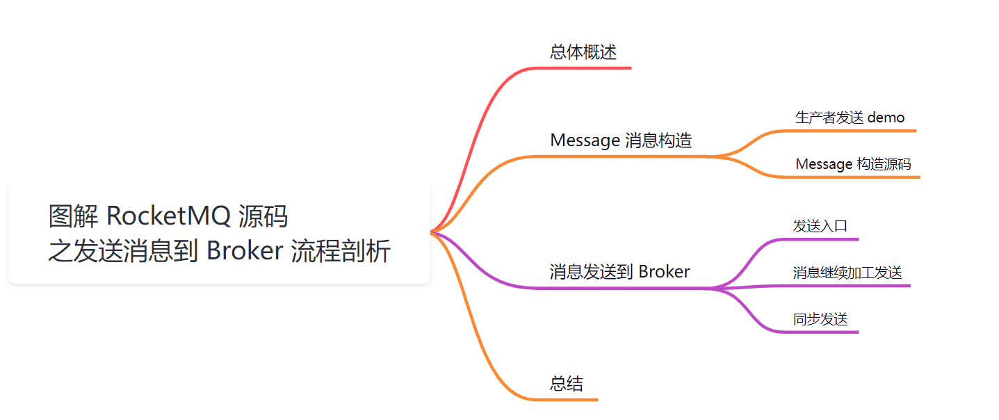
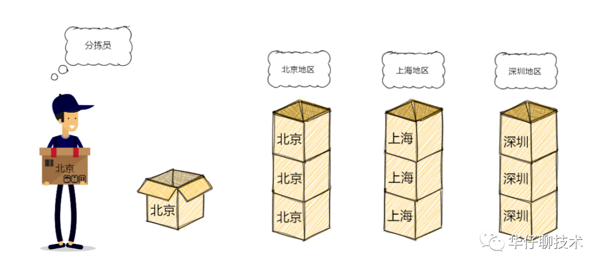
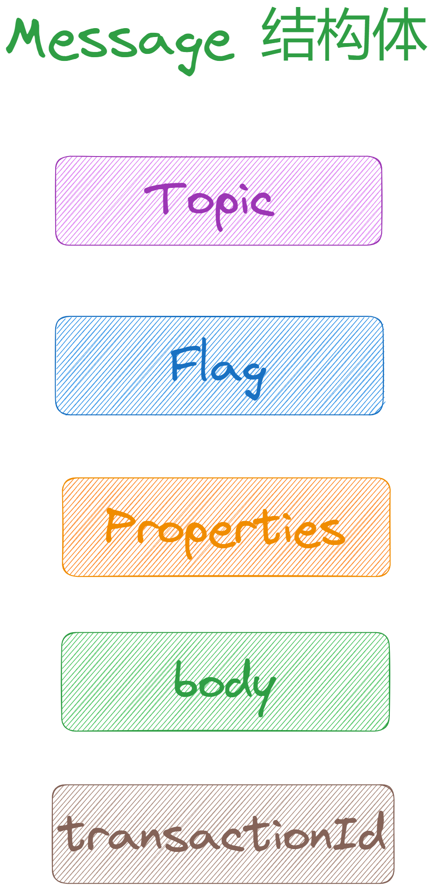
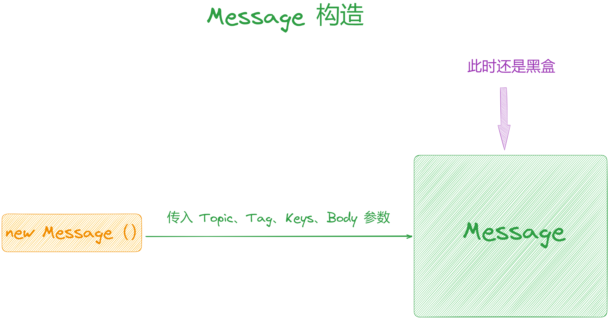
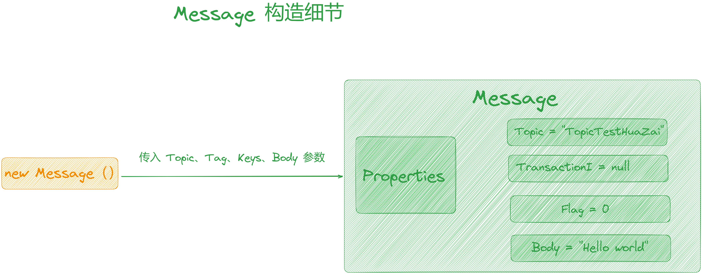
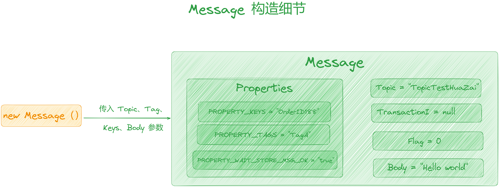
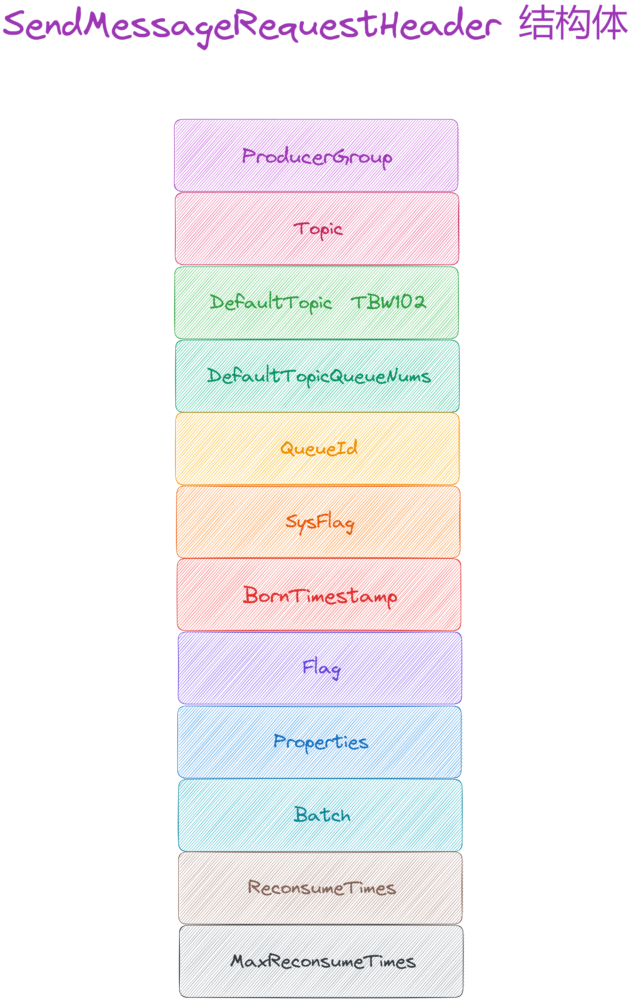

大家好，我是**华仔**, 又跟大家见面了。

从今天开始我将为大家奉上 RocketMQ 生产者源码剖析系列文章，正式开启「**RocketMQ 的生产者源码之旅**」，这是第八篇，我们来剖析下 RocketMQ 源码之消息构造细节设计剖析。

这里我将以「**RocketMQ 4.9.7**」版本为主，通过「**场景驱动**」的方式带大家一点点的对 RocketMQ 源码进行深度剖析，正式开启「**RocketMQ 的源码之旅**」，跟我一起来掌握 RocketMQ 源码核心架构设计思想吧。

  

## **01 总体概述**

在 [【生产者源码分析系列第二篇】图解 RocketMQ 源码之生产者发送消息核心流程剖析](https://articles.zsxq.com/id_tk73pfixne2e.html) 这篇中，我们简单聊了生产者发送消息的流程需要的几个步骤：

1.  拉取 Topic 路由数据。
2.  选择 MessageQueue。
3.  启动 MQClientInstance 网络客户端。
4.  启动 网络通讯组件 NettyRemotingClient，构建与 Broker 间的长连接。
5.  发送消息。

今天我们先来看下生产者是如何发送消息到「**Broker**」的流程。

## **02 Message 消息构造**

在剖析发送消息流程之前，我们先来梳理下消息的构造细节。

## **2.1 生产者发送 demo**

// 创建消息，并指定 Topic，Tag 和消息体

Message msg \= new Message("TopicTestHuaZai",

"TagA",

"OrderID188",

"Hello world".getBytes(RemotingHelper.DEFAULT\_CHARSET));

SendResult sendResult \= producer.send(msg);

// 通过 sendResult 返回消息是否成功送达

System.out.printf("%s%n", sendResult);

可以看到有四个参数，分别是「**Topic**」、「**Tag**」、「**Keys**」、「**Body**」。这里大家可能对这个「**Keys**」不是很了解，它主要是方便「**定位消息丢失问题**」的参数。

也就是说只需要「**指定当前 Message**」需要发到哪个「**Topic**」、需要什么样的「**Tag**」、是否需要指定 「**Keys**」，以及「**消息具体内容**」就可以了。

这里我们就拿寄快递为例，此时需要考虑的点：

1.  首先快递寄送的地址是哪里？在这里对应着「**Topic**」。
2.  其次快递类型是什么？类似物品类型，是食品还是电子产品？在这里对应着「**Tag**」。
3.  最后最重要的一点就是我要寄送什么东西，在这里对应着「**Body**」。

## **2.2 Message 构造源码**

通过发送 demo 可以看出其构造起来很简单，「**Message**」的结构定义也很简单，里面的属性非常少，源码如下。

源码位置：[https://github.com/apache/rocketmq/blob/release-4.9.7/client/src/main/java/org/apache/rocketmq/common/message/Message.java](https://github.com/apache/rocketmq/blob/release-4.9.7/client/src/main/java/org/apache/rocketmq/common/message/Message.java)

// 源码位置:

// 子项目: common

// 包名: org.apache.rocketmq.common.message

// 文件: Message

public class Message implements Serializable {

private static final long serialVersionUID \= 8445773977080406428L;

// 消息的集合

private String topic;

// 标识，这个完全由在使用的时候自己设定，RocketMQ 并不关心，这里可以理解为透传

private int flag;

// 存特定的配置，本质上就是个 Map。

private Map<String, String> properties;

// 消息体

private byte\[\] body;

// 事务id，使用事务消息时的相关字段

private String transactionId;

....

}

看到这里是否会有疑问：RocketMQ 不是通过「**Tag**」来进行「**消息过滤**」吗？为什么结构体中不进行体现呢？

  

不要着急，此时还是一个黑盒状态。我们继续来探索其构造方法，这里会进行揭晓。

## **2.2.1 探索 Message 构造方法**

// 源码位置:

// 子项目: common

// 包名: org.apache.rocketmq.common.message;

// 文件: Message

// 行数: 41

public Message(String topic, String tags, String keys, int flag, byte\[\] body, boolean waitStoreMsgOK) {

// 赋值

this.topic = topic;

this.flag = flag;

this.body = body;

// 如果指定了 tag, 则设置 tag

if (tags != null && tags.length() > 0) {

this.setTags(tags);

}

// 如果指定了 keys, 则设置 keys

if (keys != null && keys.length() > 0) {

this.setKeys(keys);

}

// waitStoreMsgOK 表示是否要在这条 Message 落到磁盘上之后才返回应答

// 这里该变量的值默认为 true, 后面我们详细剖析

this.setWaitStoreMsgOK(waitStoreMsgOK);

}

可以看到上面是由[this.setTags(tags)](http://this.settags\(tags\)/)来对 Tag 进行的处理，而它所做的事情非常简单：

// 源码位置:

// 子项目: common

// 包名: org.apache.rocketmq.common.message;

// 文件: Message

// 行数: 123

public void setTags(String tags) {

this.putProperty(MessageConst.PROPERTY\_TAGS, tags);

}

看到这里，你是否已经理解了 Tag 最终的归属是在 Message 的「**Properties**」当中的。

##   
**2.2.2 探索 Properties 属性**

经过 Message 构造函数的一系列操作后，暂时变成了如下这样：

  

可以看到「**Topic**」、「**Flag**」、「**TransactionId**」、「**Body**」 等字段都已经被赋值，而剩余的「**Tag**」、「**Keys**」以及 「**WaitStoreMsgOk**」等字段都被放到了「**Properties**」这个 Map 属性中。

对于存入该 Map 的 Key， RocketMQ 源码中有相对应的常量定义：

1.  Tags 对应的是[MessageConst.PROPERTY\_TAGS](http://messageconst.property_tags/)。
2.  Keys 对应的是[MessageConst.PROPERTY\_KEYS](http://messageconst.property_keys/)。
3.  WaitStoreMsgOK 对应的是[MessageConst.PROPERTY\_WAIT\_STORE\_MSG\_OK](http://messageconst.property_wait_store_msg_ok/)。

源码位置：[https://github.com/apache/rocketmq/blob/release-4.9.7/client/src/main/java/org/apache/rocketmq/](https://github.com/apache/rocketmq/blob/release-4.9.7/client/src/main/java/org/apache/rocketmq/common/message/MessageConst.java)[common/message/](https://github.com/apache/rocketmq/blob/release-4.9.7/client/src/main/java/org/apache/rocketmq/common/message/MessageConst.java)[MessageConst.java](https://github.com/apache/rocketmq/blob/release-4.9.7/client/src/main/java/org/apache/rocketmq/common/message/MessageConst.java)

MessageConst 对应的源码如下。

// 源码位置:

// 子项目: common

// 包名: org.apache.rocketmq.common.message;

// 文件: MessageConst

public class MessageConst {

public static final String PROPERTY\_KEYS \= "KEYS";

public static final String PROPERTY\_TAGS \= "TAGS";

public static final String PROPERTY\_WAIT\_STORE\_MSG\_OK \= "WAIT";

....

}

将这些字段填充进去之后，Properties 大概就变成了这样：

  

到这里基本可以看清楚 Message 实例化后的内部结构，以及各个字段被赋值之后的状态。

最后来看下 [this.setWaitStoreMsgOK(waitStoreMsgOK);](http://this.setwaitstoremsgok\(waitstoremsgok\);/)，它的本质也是一样的：

// 源码位置:

// 包名: org.apache.rocketmq.common.message;

// 文件: Message

// 行数: 159

public void setWaitStoreMsgOK(boolean waitStoreMsgOK) {

this.putProperty(MessageConst.PROPERTY\_WAIT\_STORE\_MSG\_OK,Boolean.toString(waitStoreMsgOK));

}

该方法的作用是控制生产者「**是否需要等待消息存储成功**」再返回，RocketMQ 提供了多个构造函数的重载方法来满足不同场景下的需求。

本文开头调用的 Message 构造方法如下：

public Message(String topic, byte\[\] body) {

// 最后一个参数 waitStoreMsgOK 为 true

this(topic, "", "", 0, body, true);

}

##   
**03 消息发送到 Broker**

在 [【生产者源码分析系列第二篇】图解 RocketMQ 源码之生产者发送消息核心流程剖析](https://articles.zsxq.com/id_tk73pfixne2e.html) 这篇中我们深度剖析了整个发送消息的流程，这里我们继续接着来剖析。

## **3.1 发送入口**

通过前面的学习了解到 [DefaultMQProducerImpl#sendDefaultImpl](http://defaultmqproducerimpl/#sendDefaultImpl) 方法中会调用 [sendKernelImpl](http://sendkernelimpl/) 方法去发送消息。

首先将消息内容封装到 [SendMessageRequestHeader](http://sendmessagerequestheader/) 对象中，完整源码如下：

/\*\*

\* 消息发送 API 核心入口

\* 1. 根据 MessageQueue 获取 Broker 地址

\* 2. 为消息分配全局唯一 ID，执行消息压缩和事务

\* 3. 如果注册了发送钩子函数，则执行发送之前的钩子函数

\* 4. 构建消息发送请求包

\* 5. 根据消息发送方式（同步、异步、单项）进行网络传输

\* 6. 如果注册了发送钩子函数，执行发送之后的钩子函数

\*

\* @param msg 待发送消息

\* @param mq 发送的消息队列

\* @param communicationMode 消息发送模式：SYNC、ASYNC、ONEWAY

\* @param sendCallback 异步发送回调函数

\* @param topicPublishInfo 主题路由信息

\* @param timeout 消息发送超时时间

\* @return 消息发送结果

\*/

private SendResult sendKernelImpl(final Message msg,

final MessageQueue mq,

final CommunicationMode communicationMode,

final SendCallback sendCallback,

final TopicPublishInfo topicPublishInfo,

final long timeout) throws MQClientException, RemotingException, MQBrokerException, InterruptedException {

long beginStartTime \= System.currentTimeMillis();

// 待发送的 broker 地址，根据 MessageQueue 获取 Broker 的网络地址

String brokerAddr \= this.mQClientFactory.findBrokerAddressInPublish(mq.getBrokerName());

if (null == brokerAddr) {

// 如果 MQClientInstance 的 brokerAddrTable 未缓存该 Broker 信息，则尝试从 nameserever 主动获取 topic 的路由信息

tryToFindTopicPublishInfo(mq.getTopic());

// 重新设置 broker 地址信息

brokerAddr = this.mQClientFactory.findBrokerAddressInPublish(mq.getBrokerName());

}

/\*\*

\* Message消息对象包含的属性

\* private String.topic

\* private int.flag

\* private Map<String,String>.properties

\* private byte\[\].body

\* private String transactionId

\*/

SendMessageContext context \= null;

// 找到 topic 的路由信息

if (brokerAddr != null) {

// 发送消息的特殊通道,目前默认值为 false: 对应 broker 服务器: fastRemoteServer 服务

brokerAddr = MixAll.brokerVIPChannel(this.defaultMQProducer.isSendMessageWithVIPChannel(), brokerAddr);

byte\[\] prevBody = msg.getBody();

try {

//for MessageBatch,ID has been set in the generating process

// 检查消息是否为 MessageBatch 类型

if (!(msg instanceof MessageBatch)) {

// 当不是批量消息时设置消息的全局唯一 ID（UNIQUE\_ID）msg.putProperty，对于批量消息，在生成过程中已经设置了 ID

MessageClientIDSetter.setUniqID(msg);

}

// 处理命名空间逻辑

boolean topicWithNamespace \= false;

// 检查客户端配置中是否设置了命名空间

if (null != this.mQClientFactory.getClientConfig().getNamespace()) {

msg.setInstanceId(this.mQClientFactory.getClientConfig().getNamespace());

topicWithNamespace = true;

}

// sysFlag 是消息的系统标志位，包含压缩标志位、事务标志位、批量标志位、多队列标志位等

// 处理压缩，默认消息体超过 4KB 的消息进行 zip 压缩，并设置压缩标识

int sysFlag \= 0;

boolean msgBodyCompressed \= false;

// 消息超过 4 KB 则尝试进行压缩，如果是批量消息忽略压缩

if (this.tryToCompressMessage(msg)) {

// 或运算 增加压缩标记以及采用的压缩算法

sysFlag |= MessageSysFlag.COMPRESSED\_FLAG;

sysFlag |= compressType.getCompressionFlag();

msgBodyCompressed = true;

}

// "TRAN\_MSG”事务消息，标记处理事务 Prepared 消息，并设置事务标识

final String tranMsg \= msg.getProperty(MessageConst.PROPERTY\_TRANSACTION\_PREPARED);

// 检查消息是否为事务消息

if (Boolean.parseBoolean(tranMsg)) {

// 或运算增加事务消息标记

sysFlag |= MessageSysFlag.TRANSACTION\_PREPARED\_TYPE;

}

// 校验禁用钩子

if (hasCheckForbiddenHook()) {

CheckForbiddenContext checkForbiddenContext \= new CheckForbiddenContext();

checkForbiddenContext.setNameSrvAddr(this.defaultMQProducer.getNamesrvAddr());

checkForbiddenContext.setGroup(this.defaultMQProducer.getProducerGroup());

checkForbiddenContext.setCommunicationMode(communicationMode);

checkForbiddenContext.setBrokerAddr(brokerAddr);

checkForbiddenContext.setMessage(msg);

checkForbiddenContext.setMq(mq);

checkForbiddenContext.setUnitMode(this.isUnitMode());

this.executeCheckForbiddenHook(checkForbiddenContext);

}

// 发送消息前的钩子函数

if (this.hasSendMessageHook()) {

context = new SendMessageContext();

context.setProducer(this);

context.setProducerGroup(this.defaultMQProducer.getProducerGroup());

context.setCommunicationMode(communicationMode);

context.setBornHost(this.defaultMQProducer.getClientIP());

context.setBrokerAddr(brokerAddr);

context.setMessage(msg);

context.setMq(mq);

context.setNamespace(this.defaultMQProducer.getNamespace());

String isTrans \= msg.getProperty(MessageConst.PROPERTY\_TRANSACTION\_PREPARED);

if (isTrans != null && isTrans.equals("true")) {

// 事务消息类型为半消息

context.setMsgType(MessageType.Trans\_Msg\_Half);

}

if (msg.getProperty("\_\_STARTDELIVERTIME") != null || msg.getProperty(MessageConst.PROPERTY\_DELAY\_TIME\_LEVEL) != null) {

// 延迟消息

context.setMsgType(MessageType.Delay\_Msg);

}

// 消息发送钩子函数 Before 函数执行

this.executeSendMessageHookBefore(context);

}

// 构建消息发送请求

// 设置发送消息的请求头

SendMessageRequestHeader requestHeader \= new SendMessageRequestHeader();

// 设置生产者组

requestHeader.setProducerGroup(this.defaultMQProducer.getProducerGroup());

// 设置 topic

requestHeader.setTopic(msg.getTopic());

// 设置默认的 topic:TBW102

requestHeader.setDefaultTopic(this.defaultMQProducer.getCreateTopicKey());

// 设置默认的队列数量：4

requestHeader.setDefaultTopicQueueNums(this.defaultMQProducer.

getDefaultTopicQueueNums());

// 设置 queueid

requestHeader.setQueueId(mq.getQueueId());

// 设置 sysFlag，它是消息的系统标志位，包含压缩标志位、事务标志位、批量标志位、多队列标志位等

requestHeader.setSysFlag(sysFlag);

//TODO:设置消息的生产时间

requestHeader.setBornTimestamp(System.currentTimeMillis());

requestHeader.setFlag(msg.getFlag());

// 设置 properties,比如 TAGS,KEYS

requestHeader.setProperties(MessageDecoder.messageProperties2String

(msg.getProperties()));

requestHeader.setReconsumeTimes(0);

requestHeader.setUnitMode(this.isUnitMode());

// 是否为批量消息

requestHeader.setBatch(msg instanceof MessageBatch);

requestHeader.setBname(mq.getBrokerName());

// 如果是重发消息，则设置重发消息的次数

if (requestHeader.getTopic().startsWith(MixAll.RETRY\_GROUP\_TOPIC\_PREFIX)) {

// 重发消息的次数

String reconsumeTimes \= MessageAccessor.getReconsumeTime(msg);

if (reconsumeTimes != null) {

// 设置重发消息的次数

requestHeader.setReconsumeTimes(Integer.valueOf(reconsumeTimes));

// 清除消息的重发次数属性，因为消息的重发次数属性是在消息重发时设置的

MessageAccessor.clearProperty(msg, MessageConst.PROPERTY\_RECONSUME\_TIME);

}

// 消息的最大重发次数

String maxReconsumeTimes \= MessageAccessor.getMaxReconsumeTimes(msg);

// 消息重试最大次数 顺序消息和非顺序消息不同 在消息消费失败时设置值

if (maxReconsumeTimes != null) {

// 设置消息的最大重发次数

requestHeader.setMaxReconsumeTimes(Integer.valueOf(maxReconsumeTimes));

// 清除消息的最大重发次数属性，因为消息的最大重发次数属性是在消息重发时设置的

MessageAccessor.clearProperty(msg, MessageConst.PROPERTY\_MAX\_RECONSUME\_TIMES);

}

}

// 根据消息发送方式进行网络传输

SendResult sendResult \= null;

// 选择发送模式

switch (communicationMode) {

case ASYNC:

Message tmpMessage \= msg;

boolean messageCloned \= false;

if (msgBodyCompressed) {

//If msg body was compressed, msgbody should be reset using prevBody.

//Clone new message using commpressed message body and recover origin massage.

//Fix bug:https://github.com/apache/rocketmq-externals/issues/66

tmpMessage = MessageAccessor.cloneMessage(msg);

messageCloned = true;

// 防止压缩后的消息体重发时被再次压缩

msg.setBody(prevBody);

}

if (topicWithNamespace) {

if (!messageCloned) {

tmpMessage = MessageAccessor.cloneMessage(msg);

messageCloned = true;

}

// 防止设置了命名空间的topic重发时被再次设置命名空间

msg.setTopic(NamespaceUtil.withoutNamespace(msg.getTopic(), this.defaultMQProducer.getNamespace()));

}

long costTimeAsync \= System.currentTimeMillis() - beginStartTime;

if (timeout < costTimeAsync) {

throw new RemotingTooMuchRequestException("sendKernelImpl call timeout");

}

// 异步发送：Producer 发出消息后无需等待 MQ 返回 ACK，直接发送下⼀条消息。该方式的消息可靠性可以得到保障，消息发送效率也可以。

sendResult = this.mQClientFactory.getMQClientAPIImpl().sendMessage(

brokerAddr,

mq.getBrokerName(),

tmpMessage,

requestHeader,

timeout - costTimeAsync,

communicationMode,

sendCallback,

topicPublishInfo,

this.mQClientFactory,

this.defaultMQProducer.getRetryTimesWhenSendAsyncFailed(),

context,

this);

break;

case ONEWAY:

case SYNC:

long costTimeSync \= System.currentTimeMillis() - beginStartTime;

if (timeout < costTimeSync) {

throw new RemotingTooMuchRequestException("sendKernelImpl call timeout");

}

// 执行客户端同步发送方法：Producer 发出⼀条消息后，会在收到 MQ 返回的 ACK 之后才发下⼀条消息。该方式的消息可靠性最高，但消息发送效率太低。

sendResult = this.mQClientFactory.getMQClientAPIImpl().sendMessage(

brokerAddr,

mq.getBrokerName(),

msg,

requestHeader,

timeout - costTimeSync,

communicationMode,

context,

this);

break;

default:

assert false;

break;

}

// 发送消息后的钩子

if (this.hasSendMessageHook()) {

context.setSendResult(sendResult);

this.executeSendMessageHookAfter(context);

}

return sendResult;

} catch (RemotingException e) {

if (this.hasSendMessageHook()) {

context.setException(e);

this.executeSendMessageHookAfter(context);

}

throw e;

} catch (MQBrokerException e) {

if (this.hasSendMessageHook()) {

context.setException(e);

this.executeSendMessageHookAfter(context);

}

throw e;

} catch (InterruptedException e) {

if (this.hasSendMessageHook()) {

context.setException(e);

this.executeSendMessageHookAfter(context);

}

throw e;

} finally {

msg.setBody(prevBody);

msg.setTopic(NamespaceUtil.withoutNamespace(msg.getTopic(), this.defaultMQProducer.getNamespace()));

}

}

// 主动更新后还是找不到路由信息，则抛出异常

throw new MQClientException("The broker\[" + mq.getBrokerName() + "\] not exist", null);

}

该方法较长，总结下来主要干了以下几件事情：

1.  根据 [BrokerName](http://brokername/) 获取 [BrokerName](http://brokername/) 的 IP 和端口地址。
2.  各种前置属性的设置，非批量消息设置唯一id、压缩、事务标记。
3.  执行 [hook](http://hook/) 函数。
4.  创建 [SendMessageRequestHeader](http://sendmessagerequestheader%20/) 设置消息请求头属性，请求体为 msg 的 body 字节数组。 
5.  最后根据不同的请求方式继续调用发送消息的方法，这一层的方法是通过调用[mQClientFactory#MQClientAPIImpl](http://mqclientfactory/#MQClientAPIImpl)[#sendMessage](http://#sendMessage)。
6.  [mQClientFactory](http://mqclientfactory/) 主要处理与 [Borker](http://borker/) 的通信以及关于消息消费的调度任务，消费者生产着都依赖这个实例，这个实例可能存在一个或多个。
7.  [MQClientAPIImpl](http://mqclientapiimpl/) 作为 [mQClientFactory](http://mqclientfactory/) 的一个内部实例，主要负责与外部的通信。

## **3.2 消息继续加工发送**

源码位置：[https://github.com/apache/rocketmq/blob/release-4.9.7/client/src/main/java/org/apache/rocketmq/client/impl/MQClientAPIImpl.java](https://github.com/apache/rocketmq/blob/release-4.9.7/client/src/main/java/org/apache/rocketmq/client/impl/MQClientAPIImpl.java)

public SendResult sendMessage(

final String addr,

final String brokerName,

final Message msg,

final SendMessageRequestHeader requestHeader,

final long timeoutMillis,

final CommunicationMode communicationMode,

final SendCallback sendCallback,

final TopicPublishInfo topicPublishInfo,

final MQClientInstance instance,

final int retryTimesWhenSendFailed,

final SendMessageContext context,

final DefaultMQProducerImpl producer

) throws RemotingException, MQBrokerException, InterruptedException {

long beginStartTime \= System.currentTimeMillis();

RemotingCommand request \= null;

// 在正常的消息发送流程 msgType 应该为 null, isReply也就为 false

// PROPERTY\_MESSAGE\_TYPE REPLY\_MESSAGE\_FLAG 这两个属性没有在正常的业务处理流程中发现设置的地方

String msgType \= msg.getProperty(MessageConst.PROPERTY\_MESSAGE\_TYPE);

boolean isReply \= msgType != null && msgType.equals(MixAll.REPLY\_MESSAGE\_FLAG);

if (isReply) {

// sendSmartMsg 默认为 true，用来优化对象的属性 key

if (sendSmartMsg) {

SendMessageRequestHeaderV2 requestHeaderV2 \= SendMessageRequestHeaderV2.createSendMessageRequestHeaderV2(requestHeader);

// 创建远程命令，code=RequestCode.SEND\_REPLY\_MESSAGE\_V2

request = RemotingCommand.createRequestCommand(RequestCode.SEND\_REPLY\_MESSAGE\_V2, requestHeaderV2);

} else {

// 创建远程命令，code=RequestCode.SEND\_REPLY\_MESSAGE

request = RemotingCommand.createRequestCommand(RequestCode.SEND\_REPLY\_MESSAGE, requestHeader);

}

} else {

if (sendSmartMsg || msg instanceof MessageBatch) {

// SendMessageRequestHeaderV2 使用短变量名加快 FastJson 反序列化过程

SendMessageRequestHeaderV2 requestHeaderV2 \= SendMessageRequestHeaderV2.createSendMessageRequestHeaderV2(requestHeader);

// 创建远程命令

request = RemotingCommand.createRequestCommand(msg instanceof MessageBatch ? RequestCode.SEND\_BATCH\_MESSAGE : RequestCode.SEND\_MESSAGE\_V2, requestHeaderV2);

} else {

// 创建远程命令，code=RequestCode.SEND\_MESSAGE

request = RemotingCommand.createRequestCommand(RequestCode.SEND\_MESSAGE, requestHeader);

}

}

request.setBody(msg.getBody());

switch (communicationMode) {

// 单向发送

case ONEWAY:

this.remotingClient.invokeOneway(addr, request, timeoutMillis);

return null;

// 异步发送

case ASYNC:

final AtomicInteger times \= new AtomicInteger();

long costTimeAsync \= System.currentTimeMillis() - beginStartTime;

if (timeoutMillis < costTimeAsync) {

throw new RemotingTooMuchRequestException("sendMessage call timeout");

}

this.sendMessageAsync(addr, brokerName, msg, timeoutMillis - costTimeAsync, request, sendCallback, topicPublishInfo, instance,

retryTimesWhenSendFailed, times, context, producer);

return null;

// 同步发送

case SYNC:

long costTimeSync \= System.currentTimeMillis() - beginStartTime;

if (timeoutMillis < costTimeSync) {

throw new RemotingTooMuchRequestException("sendMessage call timeout");

}

return this.sendMessageSync(addr, brokerName, msg, timeoutMillis - costTimeSync, request);

default:

assert false;

break;

}

return null;

}

}

该方法是继续对消息进行加工精简，减少发送报文的大小，加快序列化与反序列化。

最终会将 [SendMessageRequestHeader](http://sendmessagerequestheader/) 转换为 [SendMessageRequestHeaderV2](http://sendmessagerequestheaderv2/)，并最终创建[RemotingCommand](http://remotingcommand/) 对象，它代表了一次真正意义上的与外部通信的抽象，也是 Netty 编解码操作的对象。

接下来我们简单剖析下「**同步发送方式**」的流程，其他方式类似。

## **3.3 同步发送**

private SendResult sendMessageSync(

final String addr,

final String brokerName,

final Message msg,

final long timeoutMillis,

final RemotingCommand request

) throws RemotingException, MQBrokerException, InterruptedException {

// 直接调用 remotingClient#invokeSync

RemotingCommand response \= this.remotingClient.invokeSync(addr, request, timeoutMillis);

assert response != null;

return this.processSendResponse(brokerName, msg, response, addr);

}

// 客户端发送逻辑

// 源码位置如下：

// 子项目: remoting

// 包名: org.apache.rocketmq.remoting.netty;

// 文件: NettyRemotingClient

// 行数: 378

@Override

public RemotingCommand invokeSync(String addr, // broker地址 或者 namesrv地址 具体看是要发给谁

final RemotingCommand request, // 消息信息 网络传输对象

long timeoutMillis) // 超时时间

throws InterruptedException, RemotingConnectException, RemotingSendRequestException, RemotingTimeoutException {

// 根据地址获取 broker 连接 channel

long beginStartTime \= System.currentTimeMillis();

// 获取或者创建channel

final Channel channel \= this.getAndCreateChannel(addr);

if (channel != null && channel.isActive()) {

try {

// 执行before rpc 钩子扩展方法

doBeforeRpcHooks(addr, request);

// 计算花费时间

long costTime \= System.currentTimeMillis() - beginStartTime;

// 条件成立：说明已经达到超时时间 扔出超时异常

if (timeoutMillis < costTime) {

throw new RemotingTimeoutException("invokeSync call the addr\[" + addr + "\] timeout");

}

// 调用 NettyRemotingAbstract#invokeSyncImpl() 底层方法进行同步发送

// 参数一:channel，参数二:请求对象，参数三:更新后的超时时间

RemotingCommand response \= this.invokeSyncImpl(channel, request, timeoutMillis - costTime);

// 执行 after rpc 钩子扩展方法

doAfterRpcHooks(RemotingHelper.parseChannelRemoteAddr(channel), request, response);

return response;

} catch (RemotingSendRequestException e) {

log.warn("invokeSync: send request exception, so close the channel\[{}\]", addr);

this.closeChannel(addr, channel);

throw e;

} catch (RemotingTimeoutException e) {

if (nettyClientConfig.isClientCloseSocketIfTimeout()) {

this.closeChannel(addr, channel);

log.warn("invokeSync: close socket because of timeout, {}ms, {}", timeoutMillis, addr);

}

log.warn("invokeSync: wait response timeout exception, the channel\[{}\]", addr);

throw e;

}

} else {

this.closeChannel(addr, channel);

throw new RemotingConnectException(addr);

}

}

这里的核心点就在于调用 Netty Channel 对象的 [writeAndFlush](http://writeandflush/) 方法，将 [request](http://request/) 对象发往 [Broker](http://broker/) 服务器。因为是同步的方法，所以需要在未超时的时间内阻塞等待 [Broker](http://broker/) 响应结果。

// 同步发送

// 源码位置如下：

// 子项目: remoting

// 包名: org.apache.rocketmq.remoting.netty;

// 文件: NettyRemotingAbstract

// 行数: 409

// @param channel:channel

// @param request:请求对象

// @param timeoutMillis:更新后的超时时间

public RemotingCommand invokeSyncImpl(final Channel channel, final RemotingCommand request,

final long timeoutMillis)

throws InterruptedException, RemotingSendRequestException, RemotingTimeoutException {

// request请求的唯一标志，获取请求id 是一个自增的整数值 requestId.getAndIncrement()

final int opaque \= request.getOpaque();

try {

// 生成 responseFuture 对象

final ResponseFuture responseFuture \= new ResponseFuture(channel, // channel

opaque, // 请求对象

timeoutMillis, // 更新后的超时时间

null, // 由于是同步调用 因此无回调 为null

null); // 是否是单向请求 不是 因此为null

// responseTable 是一个 ConcurrentMap,标记 opaque 与 responseFuture,可以理解为 请求上下文对象

// 将响应 future 添加到 responseTable 响应映射表中

this.responseTable.put(opaque, responseFuture);

//

final SocketAddress addr \= channel.remoteAddress();

// 发送信息，将数据写入到对端 成功写入到对端以后会回调监听器

// Netty异步操作 设置监听器回写操作状态，需要经 Netty 的出站 Handlerex:NettyEncoder 进行消息的编码

channel.writeAndFlush(request).addListener(new ChannelFutureListener() {

@Override

public void operationComplete(ChannelFuture f) throws Exception {

// 如果成功发送，设置发送请求成功标志

if (f.isSuccess()) {

responseFuture.setSendRequestOK(true);

return;

} else {

// 请求失败

responseFuture.setSendRequestOK(false);

}

// 执行到这里，说明发送消息失败了

// 从 responseTable 缓存删除响应 future

responseTable.remove(opaque);

// 设置原因

responseFuture.setCause(f.cause());

// 设置响应结果 唤醒在responseFuture阻塞的线程

responseFuture.putResponse(null);

log.warn("send a request command to channel <" + addr + "> failed.");

}

});

// 等待响应返回

// responseFuture 内部存在一个 countDownLatch

// 同步发送时,业务处理线程同步阻塞等待 timeoutMillis

RemotingCommand responseCommand \= responseFuture.waitResponse(timeoutMillis);

// 执行到这里，有两种可能

// 1.在指定超时时间内 namrsrv 返回了数据

// 2.到达超时时间

// 响应为空说明到达超时时间

if (null == responseCommand) {

// countDownLatch 等待 timeoutMillis 后醒来,若任然没有 Remotingcommand 结果 则抛出异常

if (responseFuture.isSendRequestOK()) {

// 超时异常

throw new RemotingTimeoutException(RemotingHelper.parseSocketAddressAddr(addr), timeoutMillis,

responseFuture.getCause());

} else {

// 请求异常

throw new RemotingSendRequestException(RemotingHelper.parseSocketAddressAddr(addr), responseFuture.getCause());

}

}

// 执行到这里，说明在指定时间内返回了数据 返回响应对象

return responseCommand;

} finally {

// 删除响应 future

this.responseTable.remove(opaque);

}

}

  
这里来看一下 [RemotingCommand](http://remotingcommand/) 对象在被写入 [Netty](http://netty/) 的调用链 [Pipeline](http://pipeline/) 之后，需要经过的一个关键[ChannelHandler](http://channelhandler/) --> [NettyEncoder](http://nettyencoder/)，这个 [ChannelHandler](http://channelhandler/) 主要负责请求对象的编码，将对象编码为字节流之后以便在网络上面传输。

// Netty 对象编码

// 源码位置如下：

// 子项目: remoting

// 包名: org.apache.rocketmq.remoting.netty;

// 文件: NettyEncoder

// 行数: 29

public class NettyEncoder extends MessageToByteEncoder<RemotingCommand> {

private static final InternalLogger log \= InternalLoggerFactory.getLogger(RemotingHelper.ROCKETMQ\_REMOTING);

@Override

public void encode(ChannelHandlerContext ctx, RemotingCommand remotingCommand, ByteBuf out)

throws Exception {

try {

// 编码消息头

remotingCommand.fastEncodeHeader(out);

byte\[\] body = remotingCommand.getBody();

if (body != null) {

// 写入消息体

out.writeBytes(body);

}

} catch (Exception e) {

log.error("encode exception, " + RemotingHelper.parseChannelRemoteAddr(ctx.channel()), e);

if (remotingCommand != null) {

log.error(remotingCommand.toString());

}

RemotingUtil.closeChannel(ctx.channel());

}

}

}

这里 [NettyEncoder](http://nettyencoder/) 具体的编码规范，默认为 JSON 序列化。

在 [RocketMQ](http://rocketmq/) 的「**解码器**」采用的是 [Netty](http://netty/) 提供的 [LengthFieldBasedFrameDecoder](http://lengthfieldbasedframedecoder/) 基于长度属性的解码器，以上的编码规则也是为了适用于这个解码器，避免了「**粘包拆包**」问题。

public void fastEncodeHeader(ByteBuf out) {

// body 的长度

int bodySize \= this.body != null ? this.body.length : 0;

// 记录写 index

int beginIndex \= out.writerIndex();

// skip 8 bytes

out.writeLong(0);

int headerSize;

// 两个序列化类型(ROCKETMQ,JSON)

if (SerializeType.ROCKETMQ == serializeTypeCurrentRPC) {

if (customHeader != null && !(customHeader instanceof FastCodesHeader)) {

this.makeCustomHeaderToNet();

}

headerSize = RocketMQSerializable.rocketMQProtocolEncode(this, out);

} else {

// 默认 json

// 将 customHeader 利用反射放入 extFields

this.makeCustomHeaderToNet();

// JSON字符串 然后编码为字节

byte\[\] header = RemotingSerializable.encode(this);

headerSize = header.length;

// 写入 header

out.writeBytes(header);

}

// 前四个字节写入消息的总体长度

// 总长度组成:

// 4 字节的长度表示:markProtocolType(headerSize,serializeTypeCurrentRPC)

// headerSize 头长度

// bodySize 体长度

out.setInt(beginIndex, 4 + headerSize + bodySize);

// 后四个字节写入系列化协议以及 header 的长度,只有知道 header 的长度 才能解码 body 的长度

out.setInt(beginIndex + 4, markProtocolType(headerSize, serializeTypeCurrentRPC));

}

剖析至此，一条普通的消息已经发往 [Broker](http://broker/) 服务器去了，客户端的处理流程讲解完成。