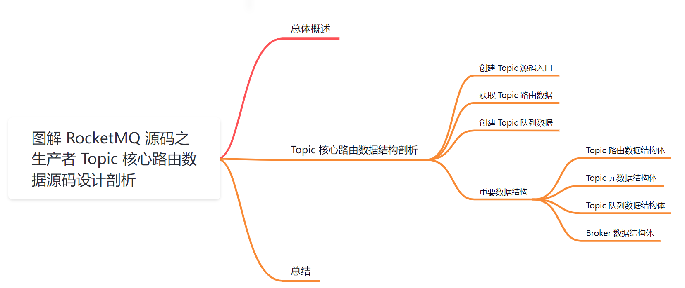
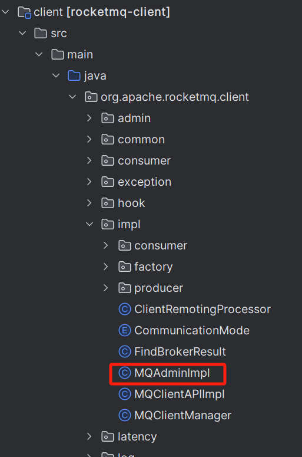
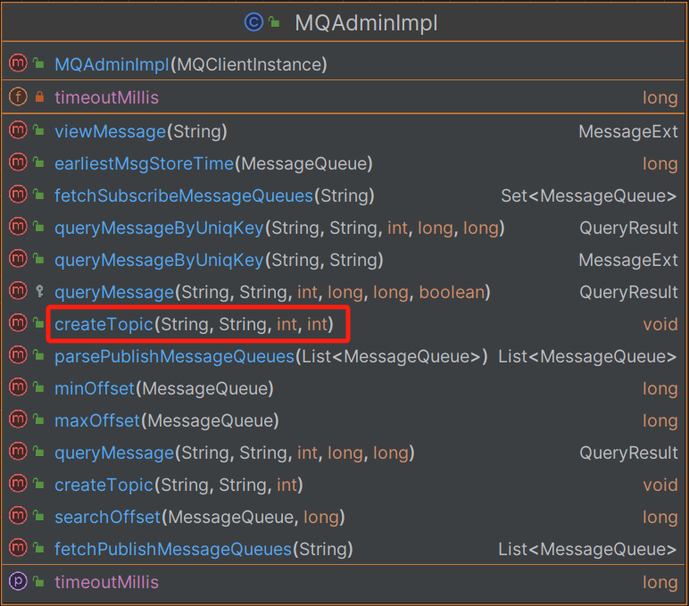
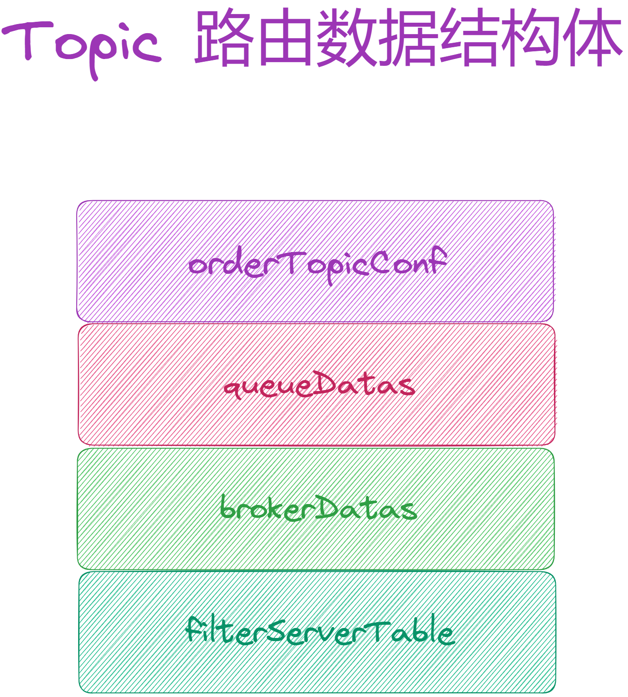
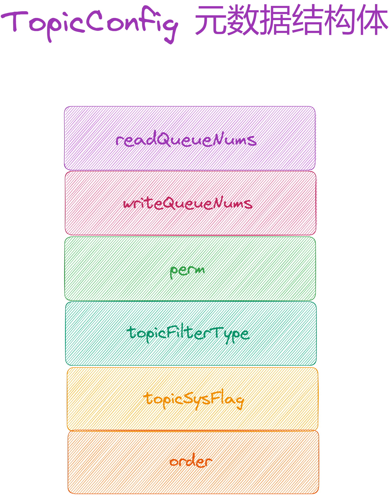
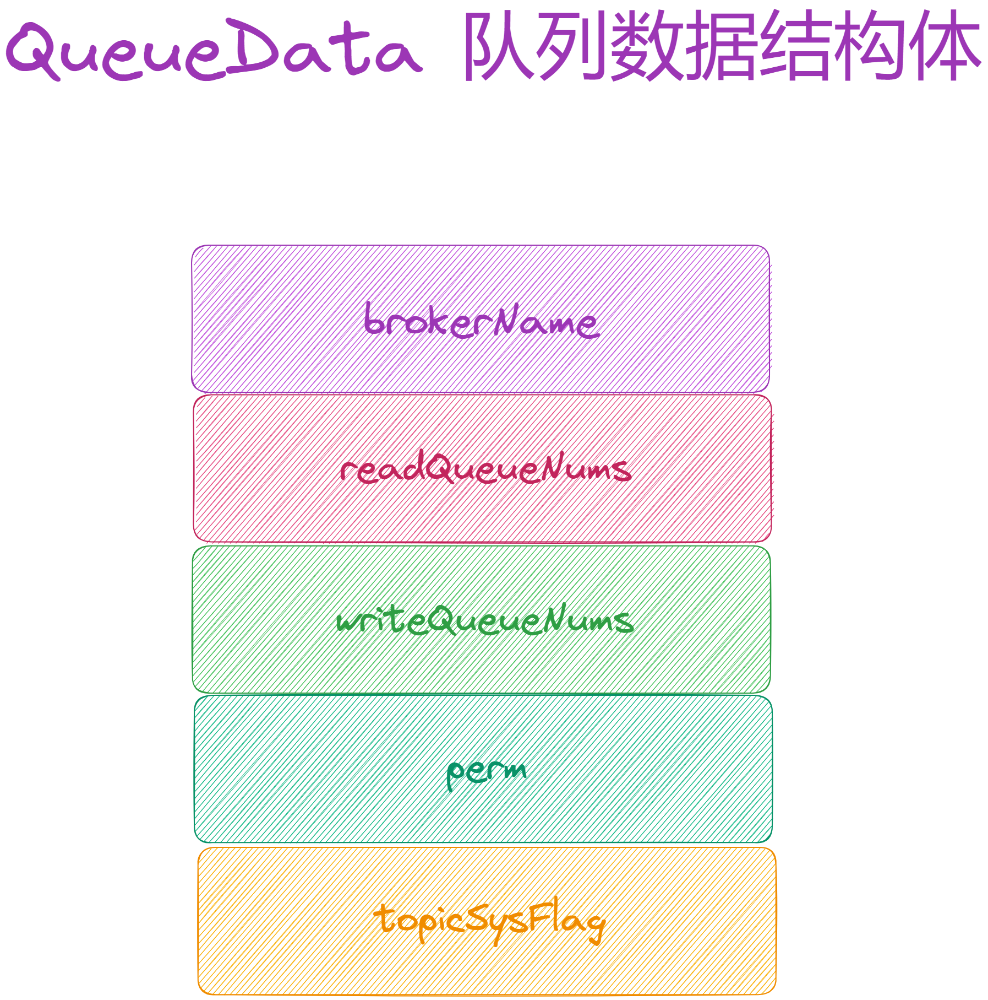
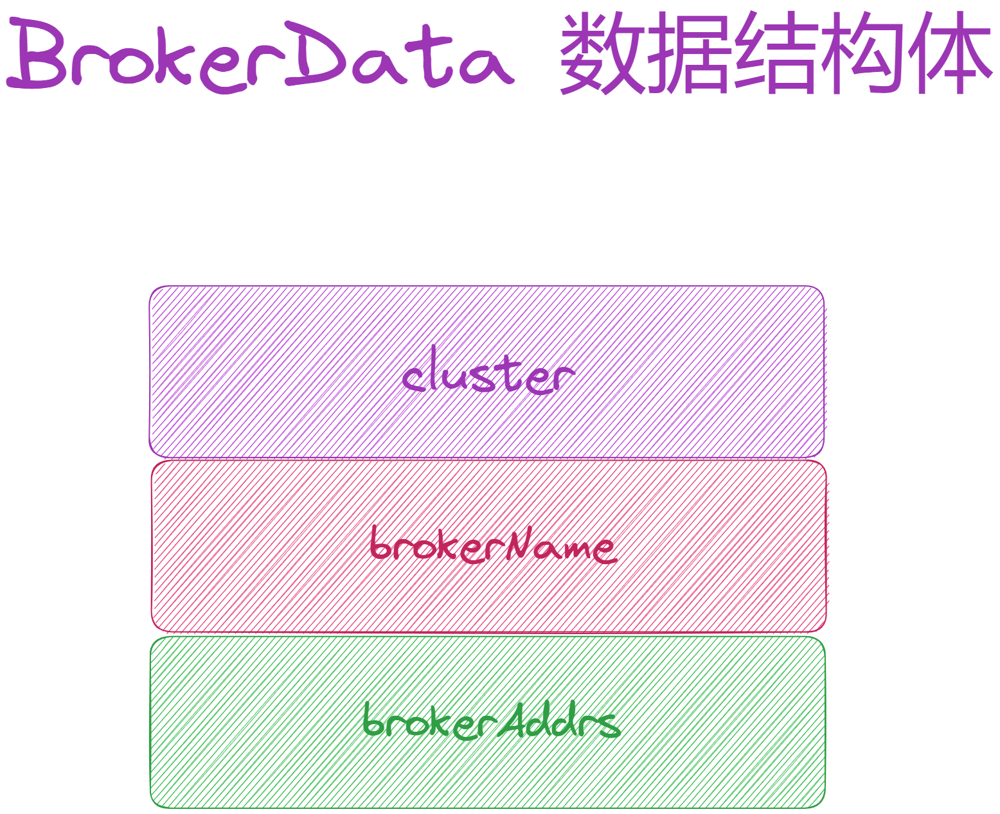

大家好，我是**华仔**, 又跟大家见面了。

从今天开始我将为大家奉上 RocketMQ 生产者源码剖析系列文章，正式开启「**RocketMQ 的生产者源码之旅**」，这是第五篇，我们来剖析下 RocketMQ 源码之生产者 Topic 核心路由数据源码设计剖析。

这里我将以「**RocketMQ 4.9.7**」版本为主，通过「**场景驱动**」的方式带大家一点点的对 RocketMQ 源码进行深度剖析，正式开启「**RocketMQ 的源码之旅**」，跟我一起来掌握 RocketMQ 源码核心架构设计思想吧。

  

## **01 总体概述**

我们都知道在 RocketMQ 中，生产者想发送 Topic 信息到 Broker 端，都需要通过从 NameServer 获取 Topic 的路由信息数据，然后才能发送。同理，消费者再拉取消息时同样需要 Topic 路由消息。

那么这个 Topic 核心路由数据就变得非常重要了，它内部都存储了哪些信息，生产者又是如何进行获取的？接下来会逐一讲解说明。

##   
**02 Topic 核心路由数据结构剖析**

这里我从「**创建 Topic**」开始说起，对于这种操作都是属于 MQAdmin 管理工具来完成的，对应的源码位置如下：

可以看到该类有很多操作方法，这里我们重点来剖析了「**创建 Topic**」方法。

## **2.1 创建 Topic**

源码位置：[https://github.com/apache/rocketmq/blob/release-4.9.7/tools/src/main/java/org/apache/rocketmq/](https://github.com/apache/rocketmq/blob/release-4.9.7/tools/src/main/java/org/apache/rocketmq/client/impl/MQAdminImpl.java)[client/impl/](https://github.com/apache/rocketmq/blob/release-4.9.7/tools/src/main/java/org/apache/rocketmq/client/impl/MQAdminImpl.java)[MQAdminImpl.java](https://github.com/apache/rocketmq/blob/release-4.9.7/tools/src/main/java/org/apache/rocketmq/client/impl/MQAdminImpl.java)

/\*\*

\* key Topic key 可有可无

\* newTopic Topic 名称

\* queueNum Topic 包含多少个 queue，queue 是逻辑上的数据分区概念

\* topicSysFlag Topic 系统标识

\*/

public void createTopic(String key, String newTopic, int queueNum, int topicSysFlag) throws MQClientException {

try {

Validators.checkTopic(newTopic);

Validators.isSystemTopic(newTopic);

// 1、根据指定的 key 从 NameServer 中获取 Topic 路由数据信息

TopicRouteData topicRouteData \= this.mQClientFactory.getMQClientAPIImpl().getTopicRouteInfoFromNameServer(key, timeoutMillis);

// 2、从路由数据中解析出 Broker 相关数据，可以获取到你要分散的各个 Broker 分组以及机器数据

List<BrokerData> brokerDataList = topicRouteData.getBrokerDatas();

// 如果不为空表示 broker 信息获取到了

if (brokerDataList != null && !brokerDataList.isEmpty()) {

Collections.sort(brokerDataList);

boolean createOKAtLeastOnce \= false;

MQClientException exception \= null;

StringBuilder orderTopicString \= new StringBuilder();

// 3、遍历每个 Broker 分组

for (BrokerData brokerData : brokerDataList) {

// 获取到每个 broker 分组里面的 master 的机器

String addr \= brokerData.getBrokerAddrs().get(MixAll.MASTER\_ID);

if (addr != null) {

// 构建一个 Topic 配置

TopicConfig topicConfig \= new TopicConfig(newTopic);

// 一个 Topic 创建的时候在每个 broker 上要有几个 queues

topicConfig.setReadQueueNums(queueNum);

topicConfig.setWriteQueueNums(queueNum);

topicConfig.setTopicSysFlag(topicSysFlag);

boolean createOK \= false;

// 通过网络请求发送到 broker 分组的 master 机器里面去给该 Topic 创建多个 queues

for (int i \= 0; i < 5; i++) { // 可以尝试 5 次

try {

this.mQClientFactory.getMQClientAPIImpl().createTopic(addr, key, topicConfig, timeoutMillis);

createOK = true;

createOKAtLeastOnce = true;

break;

} catch (Exception e) {

if (4 == i) {

exception = new MQClientException("create topic to broker exception", e);

}

}

}

// 如果成功后拼接数据

if (createOK) {

orderTopicString.append(brokerData.getBrokerName());

orderTopicString.append(":");

orderTopicString.append(queueNum);

orderTopicString.append(";");

}

}

}

if (exception != null && !createOKAtLeastOnce) {

throw exception;

}

} else {

throw new MQClientException("Not found broker, maybe key is wrong", null);

}

} catch (Exception e) {

throw new MQClientException("create new topic failed", e);

}

}

该方法比较简单，重要步骤如下：

1.  首先根据指定的 key 从 NameServer 中获取 Topic 路由数据信息。
2.  只有获取到 Topic 路由数据才能进行后续操作，接着从路由数据中解析出 Broker 相关数据，可以获取到你要分散的各个 Broker 分组以及机器数据。
3.  遍历每个 Broker 分组，然后分别对 Broker 分组中的 master 进行 Topic 读写队列创建。

这里最关键的是第一步：获取 Topic 路由数据，第三步：创建 Topic 队列数据 我们分别来看下。

## **2.2 获取 Topic 路由数据**

源码位置：[https://github.com/apache/rocketmq/blob/release-4.9.7/tools/src/main/java/org/apache/rocketmq/](https://github.com/apache/rocketmq/blob/release-4.9.7/tools/src/main/java/org/apache/rocketmq/client/impl/MQClientAPIImpl.java)[client/impl/](https://github.com/apache/rocketmq/blob/release-4.9.7/tools/src/main/java/org/apache/rocketmq/client/impl/MQClientAPIImpl.java)[MQClientAPIImpl.java](https://github.com/apache/rocketmq/blob/release-4.9.7/tools/src/main/java/org/apache/rocketmq/client/impl/MQClientAPIImpl.java)

// 网络通信客户端API实现组件

public class MQClientAPIImpl {

private final static InternalLogger log \= ClientLogger.getLog();

private static boolean sendSmartMsg \=

Boolean.parseBoolean(System.getProperty("org.apache.rocketmq.client.sendSmartMsg", "true"));

static {

System.setProperty(RemotingCommand.REMOTING\_VERSION\_KEY, Integer.toString(MQVersion.CURRENT\_VERSION));

}

// netty远程通信客户端组件

private final RemotingClient remotingClient;

// 地址组件

private final TopAddressing topAddressing;

// 客户端远程请求处理组件

private final ClientRemotingProcessor clientRemotingProcessor;

// nameserver 地址

private String nameSrvAddr \= null;

// 客户端配置组件

private ClientConfig clientConfig;

....

public TopicRouteData getTopicRouteInfoFromNameServer(final String topic, final long timeoutMillis)

throws RemotingException, MQClientException, InterruptedException {

return getTopicRouteInfoFromNameServer(topic, timeoutMillis, true);

}

// 从 NameServer 获取 topic 路由信息

public TopicRouteData getTopicRouteInfoFromNameServer(final String topic, final long timeoutMillis,

boolean allowTopicNotExist) throws MQClientException, InterruptedException, RemotingTimeoutException, RemotingSendRequestException, RemotingConnectException {

GetRouteInfoRequestHeader requestHeader \= new GetRouteInfoRequestHeader();

// 设置请求头 Topic

requestHeader.setTopic(topic);

// 构建请求头

RemotingCommand request \= RemotingCommand.createRequestCommand(RequestCode.GET\_ROUTEINFO\_BY\_TOPIC, requestHeader);

// 构建请求响应

RemotingCommand response \= this.remotingClient.invokeSync(null, request, timeoutMillis);

assert response != null;

switch (response.getCode()) {

case ResponseCode.TOPIC\_NOT\_EXIST: {

if (allowTopicNotExist) {

log.warn("get Topic \[{}\] RouteInfoFromNameServer is not exist value", topic);

}

break;

}

// 成功解析创建结果

case ResponseCode.SUCCESS: {

byte\[\] body = response.getBody();

if (body != null) {

return TopicRouteData.decode(body, TopicRouteData.class);

}

}

default:

break;

}

throw new MQClientException(response.getCode(), response.getRemark());

}

}

## **2.3 创建 Topic 队列数据**

public void createTopic(final String addr, final String defaultTopic, final TopicConfig topicConfig,

final long timeoutMillis)

throws RemotingException, MQBrokerException, InterruptedException, MQClientException {

// 构建请求头

CreateTopicRequestHeader requestHeader \= new CreateTopicRequestHeader();

// 设置 topic 名称

requestHeader.setTopic(topicConfig.getTopicName());

// 设置默认 topic

requestHeader.setDefaultTopic(defaultTopic);

// 设置读队列数

requestHeader.setReadQueueNums(topicConfig.getReadQueueNums());

// 设置写队列数

requestHeader.setWriteQueueNums(topicConfig.getWriteQueueNums());

// 设置 Topic 的读写模式 6：同时支持读写 4：禁写 2：禁读 一般情况设置为: 6

requestHeader.setPerm(topicConfig.getPerm());

// 设置 Topic 过滤类型

requestHeader.setTopicFilterType(topicConfig.getTopicFilterType().name());

// 设置 Topic 系统表示

requestHeader.setTopicSysFlag(topicConfig.getTopicSysFlag());

requestHeader.setOrder(topicConfig.isOrder());

// 构建请求

RemotingCommand request \= RemotingCommand.createRequestCommand(RequestCode.UPDATE\_AND\_CREATE\_TOPIC, requestHeader);

// 构建响应

RemotingCommand response \= this.remotingClient.invokeSync(MixAll.brokerVIPChannel(this.clientConfig.isVipChannelEnabled(), addr),

request, timeoutMillis);

assert response != null;

switch (response.getCode()) {

case ResponseCode.SUCCESS: {

return;

}

default:

break;

}

throw new MQClientException(response.getCode(), response.getRemark());

}

可以看到这两个方法都比较简单，就三步：

1.  构建请求。
2.  构建响应结果。
3.  对结果进行状态码处理。

在整个执行过程中会用到几个重要的数据结构，下面我来看下。

## **2.4 重要数据结构**

### **2.4.1 Topic 路由数据结构体**

/\*\*

\* topic 路由数据

\*/

public class TopicRouteData extends RemotingSerializable {

// order Topic 配置

private String orderTopicConf;

// 队列数据 list，该 topic 在每个 broker 上都有一个队列数据，在 broker 上有几个读写队列

private List<QueueData> queueDatas;

// broker 数据 list topic 在哪些 broker 上面，每个 BrokerData 是一个组，每个组里有哪几台机器

private List<BrokerData> brokerDatas;

// 过滤服务映射关系表，消息过滤时使用

private HashMap<String/\* brokerAddr \*/, List<String>/\* Filter Server \*/\> filterServerTable;

....

}

### **2.4.2 Topic 元数据结构体**

/\*\*

\* 核心的 Topic 元数据结构

\*/

public class TopicConfig {

// 连接符

private static final String SEPARATOR \= " ";

// 默认读队列个数

public static int defaultReadQueueNums \= 16;

// 默认写队列个数

public static int defaultWriteQueueNums \= 16;

// topic 名称

private String topicName;

// 读队列数

private int readQueueNums \= defaultReadQueueNums;

// 写队列数

private int writeQueueNums \= defaultWriteQueueNums;

// 读写模式权限

private int perm \= PermName.PERM\_READ | PermName.PERM\_WRITE;

// topic 过滤类型

private TopicFilterType topicFilterType \= TopicFilterType.SINGLE\_TAG;

private int topicSysFlag \= 0;

private boolean order \= false;

....

}

### 

### **2.4.3 Topic 队列数据结构体**

/\*\*

\* 队列数据结构

\*/

public class QueueData implements Comparable<QueueData> {

// 每个 queue 都属于一个数据分区，一定是在一个 broker 组里，所以这里要指定 broker 名称，代表了当前的 broker 组

private String brokerName;

// 读队列数 用来消费数据的路由

private int readQueueNums;

// 写队列数 用来写入数据的路由

private int writeQueueNums;

/\*\*

\* 在 broker 里，假如该 topic 有 4 个 write queue，4 个 read queue。随机的从 4 个 write queue里获取到一个 queue 来写入数据，在消费的时候，从 4 个 read queue 里随机的挑选一个，来读取数据。

\* 这里举 2 个 例子，如下：

\* （1）、4 个 write queue，2 个 read queue -> 会均匀的写入到 4 个 write queue 里去，读数据的时候仅仅会读里面的 2 个 queue 的数据

\* （2）、4 个 write queue，8个 read queue -> 此时只会写入 4 个queue里，但是消费的时候随机从 8 个queue里消费的

\* 所以区分读写队列作用是帮助我们对 topic 的 queues 进行扩容和缩容，8 个 write queue + 8 个 read queue

\* 4 个 write queue -> 写入数据仅仅会进入这 4 个 write queue 里去

\* 8 个 read queue，读取数据，有 4 个 queue 持续消费到最新的数据，另外 4 个 queue 不会写入新数据，但是会把他已有的数据全部消费完毕，最后 8 个 read queue -> 4 个 read queue

\*/

// 设置该 Topic 的读写模式 6：同时支持读写 4：禁写 2：禁读 一般情况设置为: 6

private int perm;

private int topicSysFlag;

....

}

### **2.4.4 Broker 数据结构体**

/\*\*

\* broker 数据结构

\*/

public class BrokerData implements Comparable<BrokerData> {

// broker 集群拓扑架构，一个 broker 集群 -> 多个 broker 组（broker name）-> 多个 broker 机器（主从复制，高可用），这一组 broker 是属于哪个 cluster

private String cluster;

// broker name 代表了当前的 broker 组

private String brokerName;

// 当前这一组 broker 里面包含了具体的几个 broker 机器，

private HashMap<Long/\* brokerId \*/, String/\* broker address \*/\> brokerAddrs;

private final Random random \= new Random();

....

public String selectBrokerAddr() {

// 默认就把一组 broker 里的 id = 0 的那个 broker 作为 master

String addr \= this.brokerAddrs.get(MixAll.MASTER\_ID);

// 如果 master 没找到，就随机选择一个 broker

if (addr == null) {

List<String> addrs = new ArrayList<String>(brokerAddrs.values());

return addrs.get(random.nextInt(addrs.size()));

}

return addr;

}

....

}

## **03 总结**

本篇通过「**场景驱动**」方式，以 「**创建 Topic**」源码入手，剖析了整个过程中关于 Topic 核心路由数据的组成部分，主要用到了以下数据结构。

1.  Topic 路由数据结构体。
2.  Topic 元数据结构体。
3.  Topic 队列数据结构体。
4.  Broker 数据结构体。