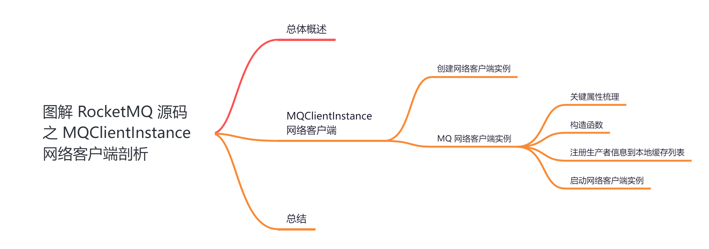
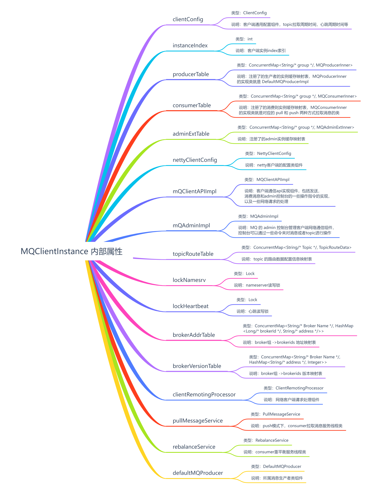
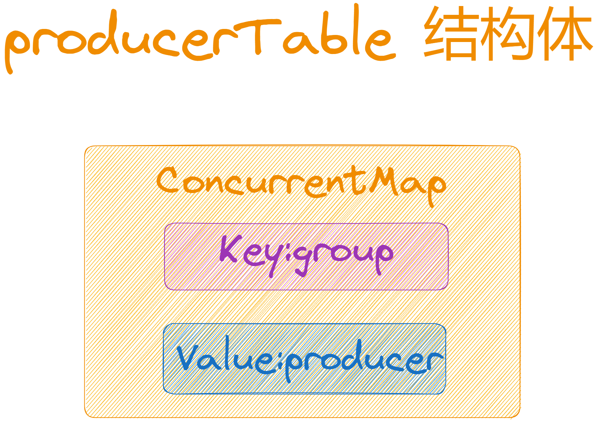
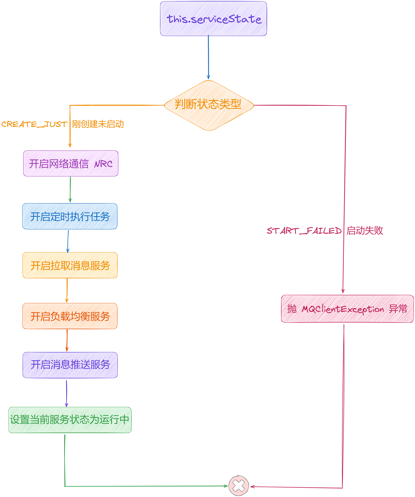
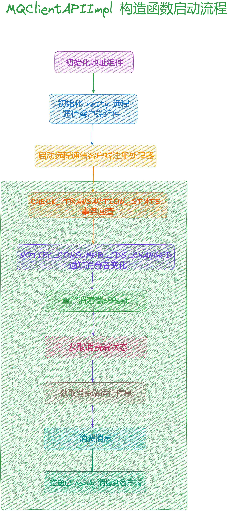
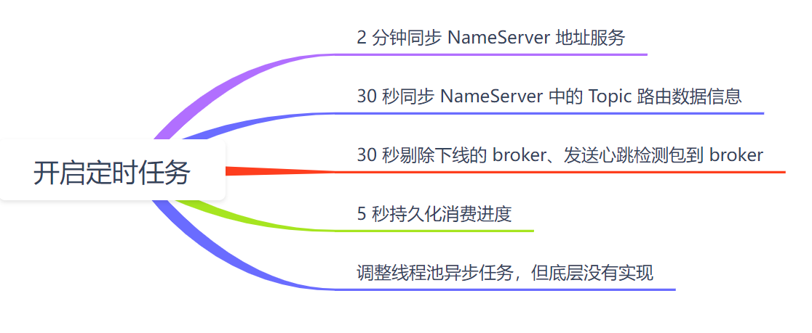
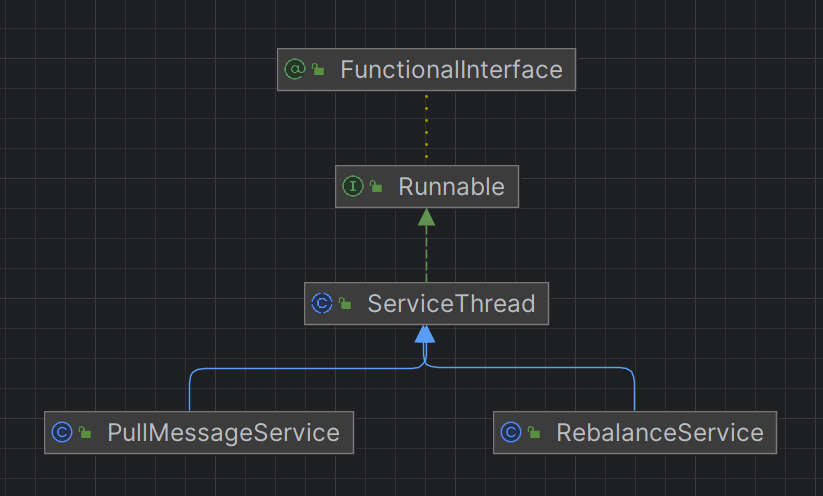
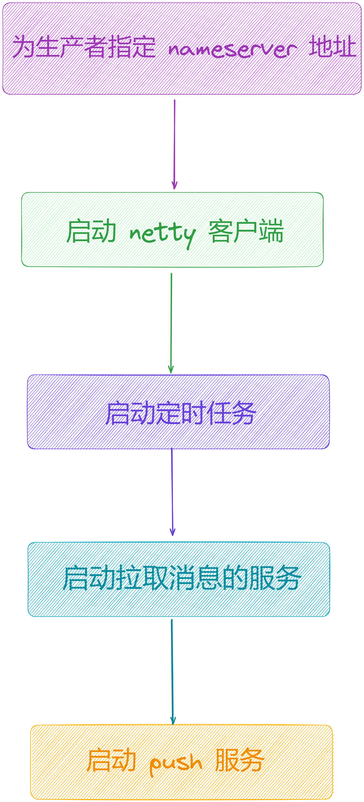
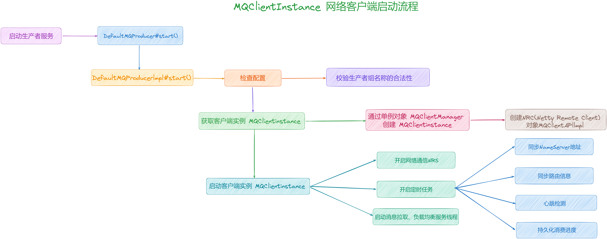

大家好，我是**华仔**, 又跟大家见面了。

从今天开始我将为大家奉上 RocketMQ 生产者源码剖析系列文章，正式开启「**RocketMQ 的生产者源码之旅**」，这是第七篇，我们来剖析下 RocketMQ 源码之「**MQClientInstance**」网络客户端剖析。

这里我将以「**RocketMQ 4.9.7**」版本为主，通过「**场景驱动**」的方式带大家一点点的对 RocketMQ 源码进行深度剖析，正式开启「**RocketMQ 的源码之旅**」，跟我一起来掌握 RocketMQ 源码核心架构设计思想吧。

  

## **01 总体概述**

在 [【生产者源码分析系列第二篇】图解 RocketMQ 源码之生产者发送消息核心流程剖析](https://articles.zsxq.com/id_tk73pfixne2e.html) 这篇中，我们简单聊了生产者发送消息的流程需要的几个步骤：

1.  拉取 Topic 路由数据。
2.  选择 MessageQueue。
3.  启动 MQClientInstance 网络客户端。
4.  启动 网络通讯组件 NettyRemotingClient，构建与 Broker 间的长连接。
5.  发送消息。

今天我们先来看下生产者是如何启动「**MQClientInstance**」以及「**MQClientInstance**」是如何运行的。

## **02 MQClientInstance 网络客户端**

源码位置：[https://github.com/apache/rocketmq/blob/release-4.9.7/client/src/main/java/org/apache/rocketmq/client/impl/producer/DefaultMQProducerImpl.java](https://github.com/apache/rocketmq/blob/release-4.9.7/client/src/main/java/org/apache/rocketmq/client/impl/producer/DefaultMQProducerImpl.java)

在启动生产者实例 [DefaultMQProducerImpl#start()](http://defaultmqproducerimpl/#start\(\)) 的时候，会启动「**MQClientInstance**」实例，部分源码如下：

public class DefaultMQProducerImpl implements MQProducerInner {

// 网络客户端

private MQClientInstance mQClientFactory;

....

// 启动生产者

public void start(final boolean startFactory) throws MQClientException {

switch (this.serviceState) {

// 刚刚创建

case CREATE\_JUST:

....

// 创建 MQ 网络客户端实例

this.mQClientFactory = MQClientManager.getInstance().getOrCreateMQClientInstance(this.defaultMQProducer, rpcHook);

....

if (startFactory) {

// 启动 MQ 网络客户端实例

mQClientFactory.start();

}

....

this.serviceState = ServiceState.RUNNING;

break;

....

}

// 发送心跳请求

this.mQClientFactory.sendHeartbeatToAllBrokerWithLock();

}

}

## **2.1 创建网络客户端实例**

[MQClientManager](http://mqclientmanager/) 是单例对象，整个 JVM 中只存在一个 [MQClientManager](http://mqclientmanager/) 实例。

// MQ 网络客户端管理器，单例对象

// 源码位置如下：

// 子项目: client

// 包名: org.apache.rocketmq.client.impl;

// 文件: MQClientManager

// 行数: 47

public class MQClientManager {

// 单例模式

private static MQClientManager instance \= new MQClientManager();

// MQ 实例表缓存，客户端 Id 与 MQClientInstance 的映射关系

private ConcurrentMap<String/\* clientId \*/, MQClientInstance> factoryTable =

new ConcurrentHashMap<String, MQClientInstance>();

// 私有构造器

private MQClientManager() {

}

// 单例模式实例

public static MQClientManager getInstance() {

return instance;

}

// 获取或者创建MQ客户端实例

public MQClientInstance getOrCreateMQClientInstance(final ClientConfig clientConfig, RPCHook rpcHook) {

// 1、创建客户端Id IP@实例名@unitName

String clientId \= clientConfig.buildMQClientId();

// 2、根据客户端 id 从缓存列表中获取 MQClientInstance

MQClientInstance instance \= this.factoryTable.get(clientId);

// 3、若为空，则创建实例并添加到实例表中

if (null == instance) {

// 创建 MQClientInstance 实例

instance =

new MQClientInstance(clientConfig.cloneClientConfig(),

this.factoryIndexGenerator.getAndIncrement(), clientId, rpcHook);

// 添加进 factoryTable 缓存列表中

MQClientInstance prev \= this.factoryTable.putIfAbsent(clientId, instance);

if (prev != null) {

instance = prev;

log.warn("Returned Previous MQClientInstance for clientId:\[{}\]", clientId);

} else {

log.info("Created new MQClientInstance for clientId:\[{}\]", clientId);

}

}

// 返回实例

return instance;

}

}

该方法用来获取或者创建 MQ 客户端实例，步骤如下：

1.  首先创建客户端Id ，形式如 [IP@实例名@unitName](http://IP%40%E5%AE%9E%E4%BE%8B%E5%90%8D@unitname/)。
2.  然后根据客户端 id 从缓存列表中获取 [MQClientInstance](http://mqclientinstance/) 实例，第一次进来肯定为空。
3.  若 instance 为空，则创建实例并添加到实例表中，
4.  创建 [MQClientInstance](http://mqclientinstance/) 实例。
5.  添加进 [factoryTable](http://factorytable/) 缓存列表中，下次直接从缓存中获取。
6.  最后返回找到的 instance 实例。

一个 [clientId](http://clientid/) 只会创建一个「**MQClientInstance**」，添加进 [MQClientManager](http://mqclientmanager/) 的缓存表。[clientId](http://clientid/) 的生成规则[IP@instanceName@unitName](http://IP%40instanceName@unitname/)。假如我们不设置 [instanceName](http://instancename/)，默认使用 client 的 pid 作为 clientId，这块使用的时候需要注意一下。

// 创建客户端Id 生成规则：IP@instanceName@unitName

// 源码位置如下：

// 子项目: client

// 包名: org.apache.rocketmq.client;

// 文件: ClientConfig

// 行数: 75

public String buildMQClientId() {

StringBuilder sb \= new StringBuilder();

// 客户端 IP

sb.append(this.getClientIP());

sb.append("@");

// 实例名称

sb.append(this.getInstanceName());

if (!UtilAll.isBlank(this.unitName)) {

sb.append("@");

// unitName

sb.append(this.unitName);

}

if (enableStreamRequestType) {

sb.append("@");

sb.append(RequestType.STREAM);

}

}

对于 RocketMQ 来说，「**生产者**」、「**消费者**」都属于客户端，每个客户端就是一个 「**MQClientInstance**」，而每一个 [ClientConfig](http://clientconfig/) 对应一个实例。

##   
**2.2 MQ 网络客户端实例**

本篇的重点是「**MQClientInstance**」，为什么要单独来剖析呢？

无论是生产者还是消息者，其底层都会与 broker 进行打交道。从源码层面上，这部分的功能被抽象成一个单独的类，负责和 broker 打交道。

这里我们可以理解为是一个工厂，是对「**生产者**」、「**消费者**」以及「**控制台**」三者的合集，内部封装了「**Netty 客户端**」、消息的「**生产**」、「**消费**」、「**负载均衡**」的实现类等。

另外「**MQClientInstance**」的实例化并不是直接new后使用，而是通过「**MQClientManager**」这个单例类，使用饿汉模式设计保证线程安全。

## **2.2.1 关键属性梳理**

这里先来看下「**MQClientInstance**」的关键属性。

源码位置：[https://github.com/apache/rocketmq/blob/release-4.9.7/client/src/main/java/org/apache/rocketmq/client/impl/factory/MQClientInstance.java](https://github.com/apache/rocketmq/blob/release-4.9.7/client/src/main/java/org/apache/rocketmq/client/latency/MQFaultStrategy.java)

// 网络通信客户端实例组件

// 源码位置如下：

// 子项目: client

// 包名: org.apache.rocketmq.client.impl.factory;

// 文件: MQClientInstance

// 行数: 89

public class MQClientInstance {

....

// 客户端配置组件（对应生产者 DefaultMQProducer、消费者 DefaultMQPushConsumer）

private final ClientConfig clientConfig;

// 客户端实例index索引

private final int instanceIndex;

// 客户端id

private final String clientId;

// 客户端组件启动时间戳

private final long bootTimestamp \= System.currentTimeMillis();

// producer组件映射表

private final ConcurrentMap<String/\* group \*/, MQProducerInner> producerTable = new ConcurrentHashMap<String, MQProducerInner>();

// consumer组件映射表

private final ConcurrentMap<String/\* group \*/, MQConsumerInner> consumerTable = new ConcurrentHashMap<String, MQConsumerInner>();

// admin组件映射表

private final ConcurrentMap<String/\* group \*/, MQAdminExtInner> adminExtTable = new ConcurrentHashMap<String, MQAdminExtInner>();

// netty客户端配置组件

private final NettyClientConfig nettyClientConfig;

// 客户端通信api实现组件

private final MQClientAPIImpl mQClientAPIImpl;

// admin管理客户端网络通信组件

private final MQAdminImpl mQAdminImpl;

// topic路由数据映射表

private final ConcurrentMap<String/\* Topic \*/, TopicRouteData> topicRouteTable = new ConcurrentHashMap<String, TopicRouteData>();

// nameserver读写锁

private final Lock lockNamesrv \= new ReentrantLock();

// 心跳读写锁

private final Lock lockHeartbeat \= new ReentrantLock();

// broker组->brokerids映射表

private final ConcurrentMap<String/\* Broker Name \*/, HashMap<Long/\* brokerId \*/, String/\* address \*/\>> brokerAddrTable =

new ConcurrentHashMap<String, HashMap<Long, String>>();

private final ConcurrentMap<String/\* Broker Name \*/, HashMap<String/\* address \*/, Integer>> brokerVersionTable =

new ConcurrentHashMap<String, HashMap<String, Integer>>();

// 调度线程池

private final ScheduledExecutorService scheduledExecutorService \= Executors.newSingleThreadScheduledExecutor(new ThreadFactory() {

@Override

public Thread newThread(Runnable r) {

return new Thread(r, "MQClientFactoryScheduledThread");

}

});

// 网络客户端请求处理组件

private final ClientRemotingProcessor clientRemotingProcessor;

// consumer拉取消息服务线程

private final PullMessageService pullMessageService;

// consumer重平衡服务线程

private final RebalanceService rebalanceService;

// 所属消息生产者组件

private final DefaultMQProducer defaultMQProducer;

// consumer指标统计管理组件

private final ConsumerStatsManager consumerStatsManager;

// 发送心跳次数统计

private final AtomicLong sendHeartbeatTimesTotal \= new AtomicLong(0);

// 组件服务状态

private ServiceState serviceState \= ServiceState.CREATE\_JUST;

// 随机数

private Random random \= new Random();

....

}

这里「**MQClientInstance**」通过 [ClientConfig](http://clientconfig/) 属性，既关联「**生产者**」又关联「**消费者**」。

不同的「**生产者**」、「**消费者**」，如果引用同一个客户端配置 [ClientConfig](http://clientconfig/)，则它们会「**共享**」同一个「**MQClientInstance**」实例，所以在定义的时候如果「**生产者**」和「**消费者**」分组名相同容易导致这个问题。

## **2.2.2 构造函数**

// 网络通信客户端实例构造函数

// 源码位置如下：

// 子项目: client

// 包名: org.apache.rocketmq.client.impl.factory;

// 文件: MQClientInstance

// 行数: 127

public MQClientInstance(ClientConfig clientConfig, int instanceIndex, String clientId, RPCHook rpcHook) {

this.clientConfig = clientConfig;

this.instanceIndex = instanceIndex;

this.nettyClientConfig = new NettyClientConfig();

this.nettyClientConfig.setClientCallbackExecutorThreads(

clientConfig.getClientCallbackExecutorThreads());

this.nettyClientConfig.setUseTLS(clientConfig.isUseTLS());

// 客户端远程处理器

this.clientRemotingProcessor = new ClientRemotingProcessor(this);

// 初始化远程客户端 NRC(Netty Remoting Client)，注册功能与 clientRemotingProcessor 的映射关系

this.mQClientAPIImpl = new MQClientAPIImpl(this.nettyClientConfig, this.clientRemotingProcessor, rpcHook, clientConfig);

if (this.clientConfig.getNamesrvAddr() != null) {

this.mQClientAPIImpl.updateNameServerAddressList(this.clientConfig.getNamesrvAddr());

log.info("user specified name server address: {}", this.clientConfig.getNamesrvAddr());

}

this.clientId = clientId;

this.mQAdminImpl = new MQAdminImpl(this);

this.pullMessageService = new PullMessageService(this);

this.rebalanceService = new RebalanceService(this);

this.defaultMQProducer = new DefaultMQProducer(MixAll.CLIENT\_INNER\_PRODUCER\_GROUP);

this.defaultMQProducer.resetClientConfig(clientConfig);

this.consumerStatsManager = new ConsumerStatsManager(this.scheduledExecutorService);

log.info("Created a new client Instance, InstanceIndex:{}, ClientID:{}, ClientConfig:{}, ClientVersion:{}, SerializerType:{}",

this.instanceIndex,

this.clientId,

this.clientConfig,

MQVersion.getVersionDesc(MQVersion.CURRENT\_VERSION), RemotingCommand.getSerializeTypeConfigInThisServer());

}

在创建「**MQClientInstance**」对象时，会初始化远程客户端「**MQClientAPIImpl**」，用来网络处理 API，是「**生产者**」、「**消费者**」与 「**NameServer**」、「**Broker**」进行打交道的网络通道。

##   
**2.2.3** **注册生产者信息到本地缓存列表**

在生产者实例启动时，会进行注册生产者实例，源码如下：

boolean registerOK \= mQClientFactory.registerProducer(this.defaultMQProducer.getProducerGroup(), this);

// 网络通信客户端实例构造函数

// 源码位置如下：

// 子项目: client

// 包名: org.apache.rocketmq.client.impl.factory;

// 文件: MQClientInstance

// 行数: 913

public synchronized boolean registerProducer(final String group, final DefaultMQProducerImpl producer) {

if (null == group || null == producer) {

return false;

}

// 将生产者组名称与生产者实例映射关系 添加进 MQClientInstance 中

MQProducerInner prev \= this.producerTable.putIfAbsent(group, producer);

// 如果 MQClientInstanc 已存在生产者实例，注册失败

if (prev != null) {

log.warn("the producer group\[{}\] exist already.", group);

return false;

}

// 否则注册成功

return true;

}

该方法就是将生产者实例注册到客户端实例「**MQClientInstance**」中的 [producerTable](http://producertable/) 缓存表中。

  

##   
**2.2.4 启动网络客户端实例**

// DefaultMQProducerImpl#start

public void start() throws MQClientException {

this.start(true);

}

// DefaultMQProducerImpl#start(true)

public void start(final boolean startFactory) throws MQClientException {

switch (this.serviceState) {

case CREATE\_JUST:

// 当 startFactory == true 启动 MQClientInstance 实例

if (startFactory) {

mQClientFactory.start();

}

break;

....

}

....

}

// MQClientInstance#start

public void start() throws MQClientException {

synchronized (this) {

switch (this.serviceState) {

// 刚创建未启动

case CREATE\_JUST:

this.serviceState = ServiceState.START\_FAILED;

// 未指定NameServer地址，通过http的方式远程调用NameServer服务，获取NameServer地址

if (null == this.clientConfig.getNamesrvAddr()) {

this.mQClientAPIImpl.fetchNameServerAddr();

}

// 开启网络通信 NRC

this.mQClientAPIImpl.start();

// 开启定时任务

this.startScheduledTask();

// 开启拉取消息服务

this.pullMessageService.start();

// 开启负载均衡服务

this.rebalanceService.start();

// 开启消息推送服务

this.defaultMQProducer.getDefaultMQProducerImpl().start(false);

log.info("the client factory \[{}\] start OK", this.clientId);

// 设置当前服务状态为运行中

this.serviceState = ServiceState.RUNNING;

break;

case START\_FAILED:

throw new MQClientException("The Factory object\[" + this.getClientId() + "\] has been created before, and failed.", null);

default:

break;

}

}

}

接下来我们挨个看下这几个重要启动步骤。

### **2.2.4.1 开启网络通讯 NRC 服务**

这里会涉及到另外一个组件「**MQClientAPIImpl**」，它是网络通信客户端API实现组件。

源码位置：[https://github.com/apache/rocketmq/blob/release-4.9.7/client/src/main/java/org/apache/rocketmq/client/impl/](https://github.com/apache/rocketmq/blob/release-4.9.7/client/src/main/java/org/apache/rocketmq/client/impl/MQClientAPIImpl.java)[MQClientAPIImpl](https://github.com/apache/rocketmq/blob/release-4.9.7/client/src/main/java/org/apache/rocketmq/client/impl/MQClientAPIImpl.java)[.java](https://github.com/apache/rocketmq/blob/release-4.9.7/client/src/main/java/org/apache/rocketmq/client/impl/MQClientAPIImpl.java)

// 网络通信客户端API实现组件

// 源码位置如下：

// 子项目: client

// 包名: org.apache.rocketmq.client.impl;

// 文件: MQClientAPIImpl

// 行数: 172

public class MQClientAPIImpl {

....

// netty 远程通信客户端组件

private final RemotingClient remotingClient;

// 地址组件

private final TopAddressing topAddressing;

// 客户端远程请求处理组件

private final ClientRemotingProcessor clientRemotingProcessor;

// nameserver地址

private String nameSrvAddr \= null;

// 客户端配置组件

private ClientConfig clientConfig;

public MQClientAPIImpl(final NettyClientConfig nettyClientConfig,

final ClientRemotingProcessor clientRemotingProcessor,

RPCHook rpcHook, final ClientConfig clientConfig) {

this.clientConfig = clientConfig;

// 初始化地址组件

topAddressing = new TopAddressing(MixAll.getWSAddr(), clientConfig.getUnitName());

// 初始化 netty 远程通信客户端组件

this.remotingClient = new NettyRemotingClient(nettyClientConfig, null);

this.clientRemotingProcessor = clientRemotingProcessor;

// Inject stream rpc hook first to make reserve field signature

if (clientConfig.isEnableStreamRequestType()) {

this.remotingClient.registerRPCHook(new StreamTypeRPCHook());

}

this.remotingClient.registerRPCHook(rpcHook);

// 远程通信客户端注册处理器

// (1) CHECK\_TRANSACTION\_STATE 事务回查

this.remotingClient.registerProcessor(RequestCode.CHECK\_TRANSACTION\_STATE, this.clientRemotingProcessor, null);

// (2) NOTIFY\_CONSUMER\_IDS\_CHANGED 通知消费者变化

this.remotingClient.registerProcessor(RequestCode.NOTIFY\_CONSUMER\_IDS\_CHANGED, this.clientRemotingProcessor, null);

// (3) 重置消费端offset

this.remotingClient.registerProcessor(RequestCode.RESET\_CONSUMER\_CLIENT\_OFFSET, this.clientRemotingProcessor, null);

// (4) 获取消费端状态

this.remotingClient.registerProcessor(RequestCode.GET\_CONSUMER\_STATUS\_FROM\_CLIENT, this.clientRemotingProcessor, null);

// (5) 获取消费端运行信息

this.remotingClient.registerProcessor(RequestCode.GET\_CONSUMER\_RUNNING\_INFO, this.clientRemotingProcessor, null);

// (6) 消费消息

this.remotingClient.registerProcessor(RequestCode.CONSUME\_MESSAGE\_DIRECTLY, this.clientRemotingProcessor, null);

// (7) 推送已 ready 消息到客户端

this.remotingClient.registerProcessor(RequestCode.PUSH\_REPLY\_MESSAGE\_TO\_CLIENT, this.clientRemotingProcessor, null);

}

....

}

这里主要是创建了 [remotingClient](http://remotingclient/)，并注册了几个请求对应的处理器。

// 开启网络通信 NRC

this.mQClientAPIImpl.start();

// 网络通信客户端API实现组件启动方法

// 源码位置如下：

// 子项目: client

// 包名: org.apache.rocketmq.client.impl;

// 文件: MQClientAPIImpl

// 行数: 250

public void start() {

this.remotingClient.start();

}

内部调用了 [remotingClient#start](http://remotingclient/#start)，实现类是 [NettyRemotingClient](http://nettyremotingclient/)，我们会放到下一篇进行剖析。

### **2.2.4.2 开启定时任务**

// 开启定时任务

// 源码位置如下：

// 子项目: client

// 包名: org.apache.rocketmq.client.impl.factory;

// 文件: MQClientInstance

// 行数: 289

// 生产者或者消费者不是实时感知 Broker 的状态，而是会有一定的偏差，所以如果服务器出现宕机，生产者或者消费要自行处理故障

private void startScheduledTask() {

// 2 分钟同步 NameServer 地址服务

// 如果 namesrv 没指定，开启动态搜索 namesrv 的定时任务

if (null == this.clientConfig.getNamesrvAddr()) {

this.scheduledExecutorService.scheduleAtFixedRate(new Runnable() {

@Override

public void run() {

try {

// 拉取 NameServer 地址

MQClientInstance.this.mQClientAPIImpl.fetchNameServerAddr();

} catch (Exception e) {

log.error("ScheduledTask fetchNameServerAddr exception", e);

}

}

}, 1000 \* 10, 1000 \* 60 \* 2, TimeUnit.MILLISECONDS);

}

// 30 秒同步 NameServer 中的 Topic 路由数据信息

this.scheduledExecutorService.scheduleAtFixedRate(new Runnable() {

@Override

public void run() {

try {

MQClientInstance.this.updateTopicRouteInfoFromNameServer();

} catch (Exception e) {

log.error("ScheduledTask updateTopicRouteInfoFromNameServer exception", e);

}

}

// private int pollNameServerInterval = 1000 \* 30;

}, 10, this.clientConfig.getPollNameServerInterval(), TimeUnit.MILLISECONDS);

// 30 秒剔除下线的 broker、发送心跳检测包到 broker

this.scheduledExecutorService.scheduleAtFixedRate(new Runnable() {

@Override

public void run() {

try {

MQClientInstance.this.cleanOfflineBroker();

MQClientInstance.this.sendHeartbeatToAllBrokerWithLock();

} catch (Exception e) {

log.error("ScheduledTask sendHeartbeatToAllBroker exception", e);

}

}

// private int heartbeatBrokerInterval = 1000 \* 30;

}, 1000, this.clientConfig.getHeartbeatBrokerInterval(), TimeUnit.MILLISECONDS);

// 5 秒持久化消费进度

this.scheduledExecutorService.scheduleAtFixedRate(new Runnable() {

@Override

public void run() {

try {

MQClientInstance.this.persistAllConsumerOffset();

} catch (Exception e) {

log.error("ScheduledTask persistAllConsumerOffset exception", e);

}

}

// private int persistConsumerOffsetInterval = 1000 \* 5;

}, 1000 \* 10, this.clientConfig.getPersistConsumerOffsetInterval(), TimeUnit.MILLISECONDS);

// 动态调整消费者的线程池大小 但是从底层代码来看并没有实现

this.scheduledExecutorService.scheduleAtFixedRate(new Runnable() {

@Override

public void run() {

try {

MQClientInstance.this.adjustThreadPool();

} catch (Exception e) {

log.error("ScheduledTask adjustThreadPool exception", e);

}

}

}, 1, 1, TimeUnit.MINUTES);

}

### **2.2.4.3 开启拉取消息服务**

源码位置：[https://github.com/apache/rocketmq/blob/release-4.9.7/client/src/main/java/org/apache/rocketmq/client/impl/](https://github.com/apache/rocketmq/blob/release-4.9.7/client/src/main/java/org/apache/rocketmq/client/impl/consumer/PullMessageService.java)[consumer/PullMessageService](https://github.com/apache/rocketmq/blob/release-4.9.7/client/src/main/java/org/apache/rocketmq/client/impl/consumer/PullMessageService.java)[.java](https://github.com/apache/rocketmq/blob/release-4.9.7/client/src/main/java/org/apache/rocketmq/client/impl/consumer/PullMessageService.java)

// 启动拉取消息服务

this.pullMessageService.start();

// 开启拉取消息服务

// 源码位置如下：

// 子项目: client

// 包名: org.apache.rocketmq.client.impl.consumer;

// 文件: PullMessageService

// 行数: 90

public class PullMessageService extends ServiceThread {

// 链表实现的无界阻塞队列

private final LinkedBlockingQueue<PullRequest> pullRequestQueue = new LinkedBlockingQueue<PullRequest>();

....

@Override

public void run() {

log.info(this.getServiceName() + " service started");

while (!this.isStopped()) {

try {

// 从请求队列里取出一个请求

PullRequest pullRequest \= this.pullRequestQueue.take();

// 开始拉取消息

this.pullMessage(pullRequest);

} catch (InterruptedException ignored) {

} catch (Exception e) {

log.error("Pull Message Service Run Method exception", e);

}

}

log.info(this.getServiceName() + " service end");

}

....

}

private void pullMessage(final PullRequest pullRequest) {

//根据组名获取对应的消费者 一个mqClientInstance里一个consumerGroup只有一个消费者对应

final MQConsumerInner consumer \= this.mQClientFactory.selectConsumer(pullRequest.getConsumerGroup());

if (consumer != null) {

DefaultMQPushConsumerImpl impl \= (DefaultMQPushConsumerImpl) consumer;

//实际是根据组名获取对应的消费者来发起消息拉取

impl.pullMessage(pullRequest);

} else {

log.warn("No matched consumer for the PullRequest {}, drop it", pullRequest);

}

}

可以看到会从请求队列里取出一个请求，然后开始拉取。关于具体的细节我们在消费者系列篇再详细剖析。

### **2.2.4.4 开启负载均衡服务**

源码位置：[https://github.com/apache/rocketmq/blob/release-4.9.7/client/src/main/java/org/apache/rocketmq/client/impl/](https://github.com/apache/rocketmq/blob/release-4.9.7/client/src/main/java/org/apache/rocketmq/client/impl/consumer/RebalanceService.java)[consumer/RebalanceService](https://github.com/apache/rocketmq/blob/release-4.9.7/client/src/main/java/org/apache/rocketmq/client/impl/consumer/RebalanceService.java)[.java](https://github.com/apache/rocketmq/blob/release-4.9.7/client/src/main/java/org/apache/rocketmq/client/impl/consumer/RebalanceService.java)

// 启动消费队列负载均衡

this.rebalanceService.start();

// 开启负载均衡服务

// 源码位置如下：

// 子项目: client

// 包名: org.apache.rocketmq.client.impl.consumer;

// 文件: PullMessageService

// 行数: 90

public class RebalanceService extends ServiceThread {

// 每次负载均衡间隔时间，默认 20 秒

private static long waitInterval \=

Long.parseLong(System.getProperty(

"rocketmq.client.rebalance.waitInterval", "20000"));

@Override

public void run() {

log.info(this.getServiceName() + " service started");

while (!this.isStopped()) {

// ① 默认阻塞20秒 即20秒进行一次负载均衡

this.waitForRunning(waitInterval);

// ② 调用 mqClientFactory.doRebalance 进行实际的负载均衡操作

this.mqClientFactory.doRebalance();

}

log.info(this.getServiceName() + " service end");

}

}

开启负载均衡服务就两步：

1.  默认阻塞20秒 即20秒进行一次负载均衡。
2.  调用 [mqClientFactory.doRebalance](http://mqclientfactory.dorebalance/) 进行实际的负载均衡操作。

关于第二步具体的细节我们在消费者系列篇再详细剖析。

通过剖析可以发现，[PullMessageService](http://pullmessageservice/)、[RebalanceService](http://rebalanceservice/) 这两个服务继承自 [ServiceThread](http://servicethread/)。

类图关系如下：

// 服务线程抽象类，实现了Runnable接口，用于派生出具体的服务线程类

// 源码位置如下：

// 子项目: common

// 包名: org.apache.rocketmq.common;

// 文件: ServiceThread

// 行数: 45

public abstract class ServiceThread implements Runnable {

....

private static final long JOIN\_TIME \= 90 \* 1000; // 线程加入时间，90秒

private Thread thread; // 线程对象

protected final CountDownLatch2 waitPoint \= new CountDownLatch2(1); // 用于线程同步的CountDownLatch

protected volatile AtomicBoolean hasNotified \= new AtomicBoolean(false); // 用于线程间通知的原子布尔变量

protected volatile boolean stopped \= false; // 用于标识线程是否停止

protected boolean isDaemon = false; // 标识线程是否为守护线程

// 用于标识线程是否已经启动，可以用于重启线程

private final AtomicBoolean started \= new AtomicBoolean(false);

/\*\*

\* 抽象方法，由子类实现，用于获取服务线程的名称

\* @return 服务线程的名称

\*/

public abstract String getServiceName();

/\*\*

\* 启动服务线程

\*/

public void start() {

log.info("Try to start service thread:{} started:{} lastThread:{}", getServiceName(), started.get(), thread);

if (!started.compareAndSet(false, true)) { // 只有当线程还未启动时，才执行下面的逻辑

return;

}

stopped = false; // 设置stopped为false，表示线程未停止

this.thread = new Thread(this, getServiceName()); // 创建一个新的线程

this.thread.setDaemon(isDaemon); // 设置线程是否为守护线程

this.thread.start(); // 启动线程

}

}

此处只是开启了线程，具体执行逻辑在 [PullMessageService](http://pullmessageservice/)、[RebalanceService](http://rebalanceservice/) 的重写方法 [run()](http://run\(\)/) 中。

### **2.2.4.5 开启内部的 defaultMQProducer 服务**

这个在 [【生产者源码分析系列第一篇】图解 RocketMQ 源码之生产者启动流程剖析](https://articles.zsxq.com/id_rsd4cze4huin.html) 篇最后已经剖析过了，这里也就不赘述了。

## **03 总结**

本篇主要剖析了「**MQClientInstance**」网络客户端的底层实现，这里来一个总结图。

