大家好，我是**华仔**, 又跟大家见面了。

从今天开始我将为大家奉上 RocketMQ 生产者源码剖析系列文章，正式开启「**RocketMQ 的生产者源码之旅**」，这是第八篇，我们来剖析下 RocketMQ 源码之生产者流程总结篇。

这里我将以「**RocketMQ 4.9.7**」版本为主，通过「**场景驱动**」的方式带大家一点点的对 RocketMQ 源码进行深度剖析，正式开启「**RocketMQ 的源码之旅**」，跟我一起来掌握 RocketMQ 源码核心架构设计思想吧。

##   
**01 总体概述**

  
通过「**场景驱动**」的方式，前面十篇文章，我们已经从一条消息的构造，生产者客户端启动，到生产者如何进行消息发送，再到生产者 Topic 核心路由、如何进行选择 MessageQueue，到最后构造 Request 请求并通过网络组件 NettyRemotingClient 将消息发送出去整个过程的源码进行了详细的剖析。

今天我们就来总结下这整个过程。

1.  生产者初始化核心流程。
2.  生产者 Topic 核心路由数据拉取流程。
3.  生产者如何选择 MessageQueue 进行消息发送。
4.  网络客户端 MQClientInstance 组件启动。
5.  网络通信组件 NettyRemotingClient 启动。
6.  整个生产者发送流程总结。

## **02 生产者初始化核心流程**

详情请点击 [【生产者源码分析系列第一篇】图解 RocketMQ 源码之生产者启动流程剖析](https://articles.zsxq.com/id_rsd4cze4huin.html)

## **2.1 生产者发送示例**

// 同步发送

public class Producer {

public static void main(String\[\] args) throws MQClientException, InterruptedException {

// 1、实例化消息生产者 Producer

DefaultMQProducer producer \= new DefaultMQProducer("rocketmq-test-huazai-group");

// 2、启动 Producer 实例

producer.start();

// 3、发送消息到 broker

for (int i \= 0; i < 128; i++)

try {

{

// 创建消息，并指定 Topic，Tag 和消息体

Message msg \= new Message("TopicTestHuaZai",

"TagA",

"OrderID188",

"Hello world".getBytes(RemotingHelper.DEFAULT\_CHARSET));

SendResult sendResult \= producer.send(msg);

// 通过 sendResult 返回消息是否成功送达

System.out.printf("%s%n", sendResult);

}

} catch (Exception e) {

e.printStackTrace();

}

// 如果不再发送消息，关闭 Producer 实例。

producer.shutdown();

}

}

主要就是这三步：

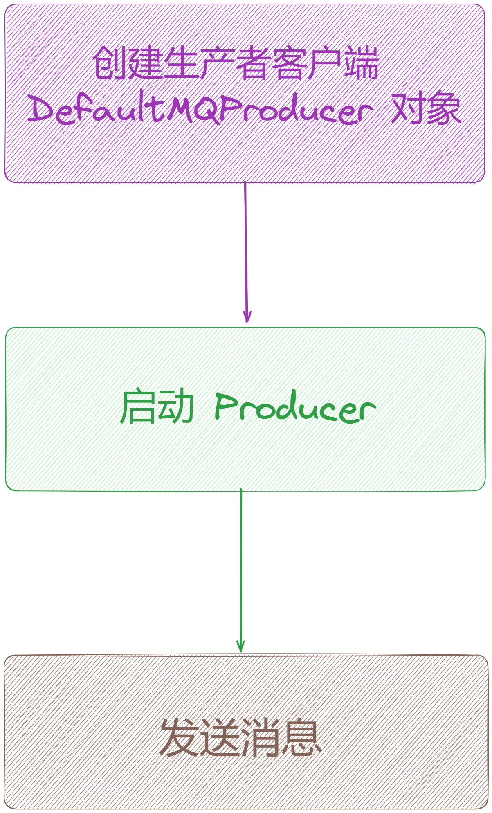

## **2.2 初始化生产者客户端对象**

// 实例化消息生产者 Producer,指定生产者组名称

DefaultMQProducer producer \= new DefaultMQProducer("rocketmq-test-huazai-group");

public DefaultMQProducer() {

this(null, MixAll.DEFAULT\_PRODUCER\_GROUP, null);

}

public DefaultMQProducer(final String namespace, final String producerGroup, RPCHook rpcHook) {

this.namespace = namespace;

// 赋值 ProducerGroup 名称

this.producerGroup = producerGroup;

// 它才是真正工作的类，将 defaultMQProducerImpl 对象保存在成员变量中

defaultMQProducerImpl = new DefaultMQProducerImpl(this, rpcHook);

}

public DefaultMQProducerImpl(final DefaultMQProducer defaultMQProducer, RPCHook rpcHook) {

// 将 defaultMQProducer 对象保存在成员变量中

this.defaultMQProducer = defaultMQProducer;

this.rpcHook = rpcHook;

// 1、创建一个异步发送的队列

this.asyncSenderThreadPoolQueue = new LinkedBlockingQueue<Runnable>(50000);

// 2、创建一个异步发送的线程池

this.defaultAsyncSenderExecutor = new ThreadPoolExecutor(

Runtime.getRuntime().availableProcessors(),

Runtime.getRuntime().availableProcessors(),

1000 \* 60,

TimeUnit.MILLISECONDS,

this.asyncSenderThreadPoolQueue,

new ThreadFactory() {

private AtomicInteger threadIndex \= new AtomicInteger(0);

@Override

public Thread newThread(Runnable r) {

return new Thread(r, "AsyncSenderExecutor\_" + this.threadIndex.incrementAndGet());

}

});

}

整个生产者客户端对象初始化主要做了下面 4 件事情：

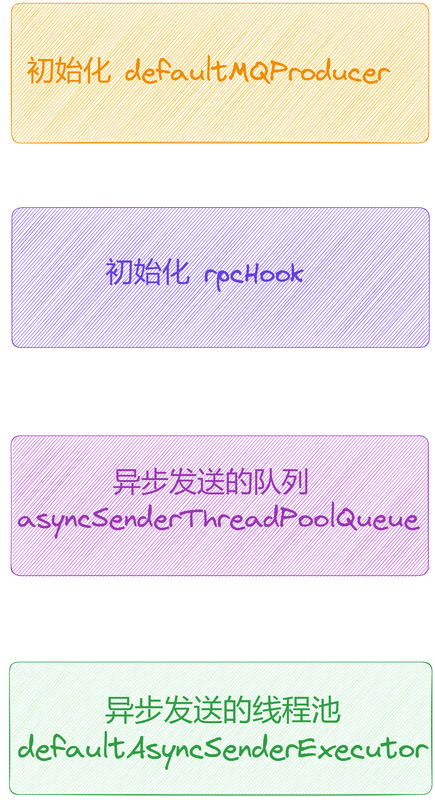

## **2.3 生产者启动**

很简单，只需要执行下面代码即可启动上方初始化的 producer 对象。

// 启动生产者客户端服务

producer.start();

public void start() throws MQClientException {

// 基于命名空间对 ProducerGroup 再次封装, 一般用于在不同的业务场景下做隔离

// 设置生产者组，由于 DefaultMQProducer 继承了 ClientConfig，所以可以直接使用 ClientConfig#withNamespace 方法

this.setProducerGroup(withNamespace(this.producerGroup));

// 调用 DefaultMQProducerImpl#start()方法启动生产者服务

this.defaultMQProducerImpl.start();

// 用于做消息追踪，消息轨迹追踪功能可以通过 DefaultMQProducer 对象的多个参数的构造器来开启，默认是关闭

if (null != traceDispatcher) {

try {

// 启动消息轨迹追踪

traceDispatcher.start(this.getNamesrvAddr(), this.getAccessChannel());

} catch (MQClientException e) {

log.warn("trace dispatcher start failed ", e);

}

}

}

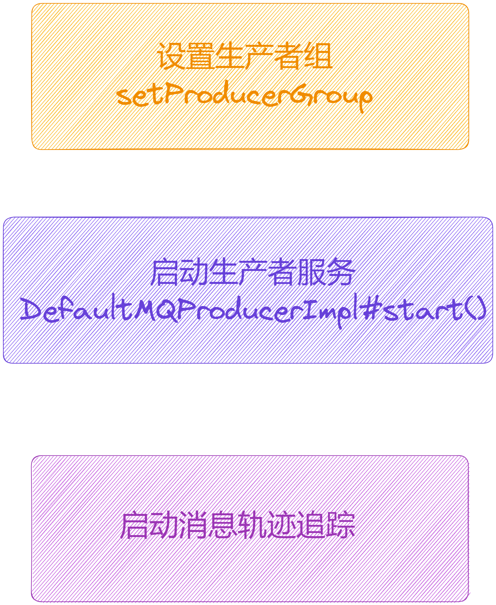

具体细节请看 [【生产者源码分析系列第一篇】图解 RocketMQ 源码之生产者启动流程剖析](https://articles.zsxq.com/id_rsd4cze4huin.html)

## **03 生产者 Topic 核心路由数据拉取流程**

详情请点击 [【生产者源码分析系列第三篇】图解 RocketMQ 源码之生产者 Topic 核心路由数据源码设计剖析](https://articles.zsxq.com/id_3ttveco9ihmr.html)

## **3.1 获取 Topic 路由数据**

// 网络通信客户端API实现组件

public class MQClientAPIImpl {

private final static InternalLogger log \= ClientLogger.getLog();

private static boolean sendSmartMsg \=

Boolean.parseBoolean(System.getProperty("org.apache.rocketmq.client.sendSmartMsg", "true"));

static {

System.setProperty(RemotingCommand.REMOTING\_VERSION\_KEY, Integer.toString(MQVersion.CURRENT\_VERSION));

}

// netty远程通信客户端组件

private final RemotingClient remotingClient;

// 地址组件

private final TopAddressing topAddressing;

// 客户端远程请求处理组件

private final ClientRemotingProcessor clientRemotingProcessor;

// nameserver 地址

private String nameSrvAddr \= null;

// 客户端配置组件

private ClientConfig clientConfig;

....

public TopicRouteData getTopicRouteInfoFromNameServer(final String topic, final long timeoutMillis)

throws RemotingException, MQClientException, InterruptedException {

return getTopicRouteInfoFromNameServer(topic, timeoutMillis, true);

}

// 从 NameServer 获取 topic 路由信息

public TopicRouteData getTopicRouteInfoFromNameServer(final String topic, final long timeoutMillis,

boolean allowTopicNotExist) throws MQClientException, InterruptedException, RemotingTimeoutException, RemotingSendRequestException, RemotingConnectException {

GetRouteInfoRequestHeader requestHeader \= new GetRouteInfoRequestHeader();

// 设置请求头 Topic

requestHeader.setTopic(topic);

// 构建请求头

RemotingCommand request \= RemotingCommand.createRequestCommand(RequestCode.GET\_ROUTEINFO\_BY\_TOPIC, requestHeader);

// 构建请求响应

RemotingCommand response \= this.remotingClient.invokeSync(null, request, timeoutMillis);

assert response != null;

switch (response.getCode()) {

case ResponseCode.TOPIC\_NOT\_EXIST: {

if (allowTopicNotExist) {

log.warn("get Topic \[{}\] RouteInfoFromNameServer is not exist value", topic);

}

break;

}

// 成功解析创建结果

case ResponseCode.SUCCESS: {

byte\[\] body = response.getBody();

if (body != null) {

return TopicRouteData.decode(body, TopicRouteData.class);

}

}

default:

break;

}

throw new MQClientException(response.getCode(), response.getRemark());

}

}

重点就是从 NameServer 拉取 topic 路由信息。

这里重点剖析几个数据结构。

## **3.2 重要数据结构**

### **3.2.1 Topic 路由数据结构体**

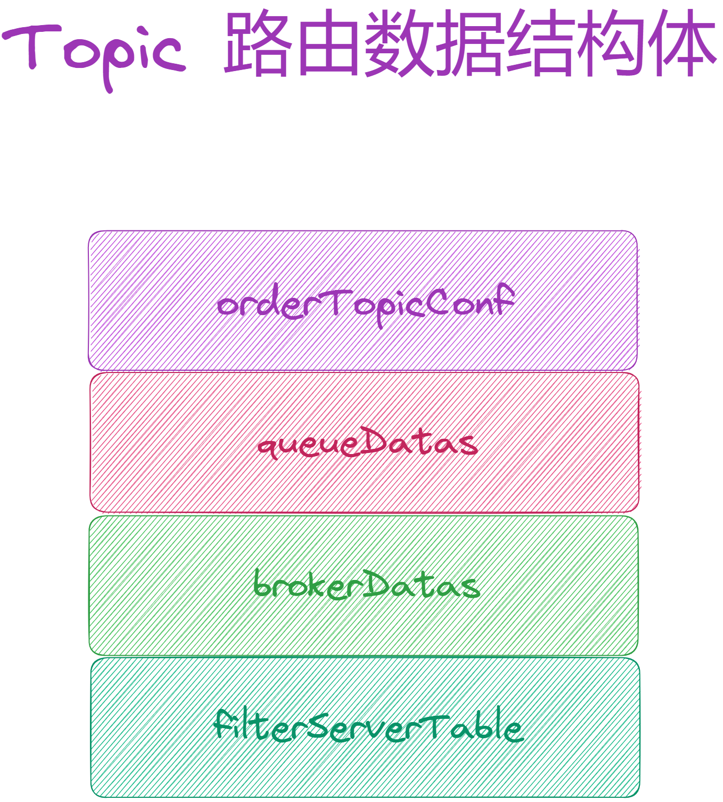

### **3.2.2 Topic 元数据结构体**

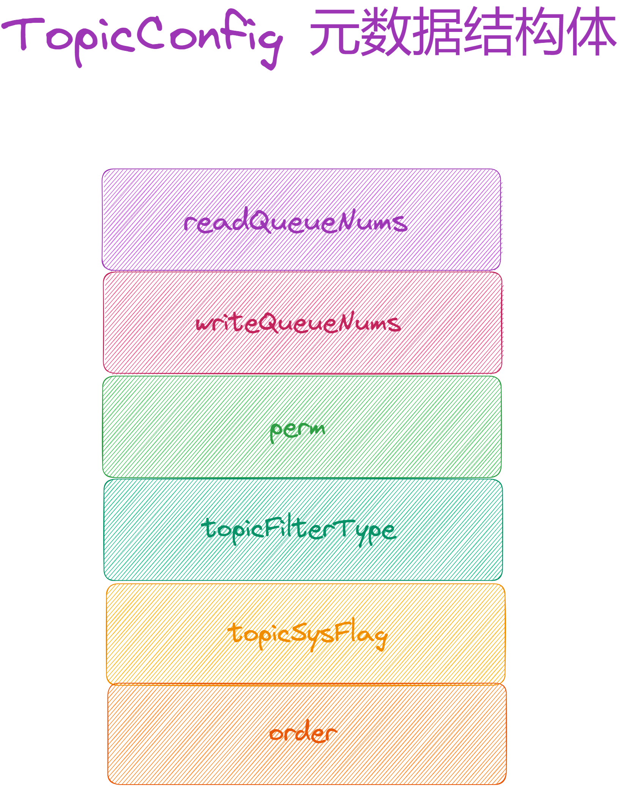

### **3.2.3 Topic 队列数据结构体**

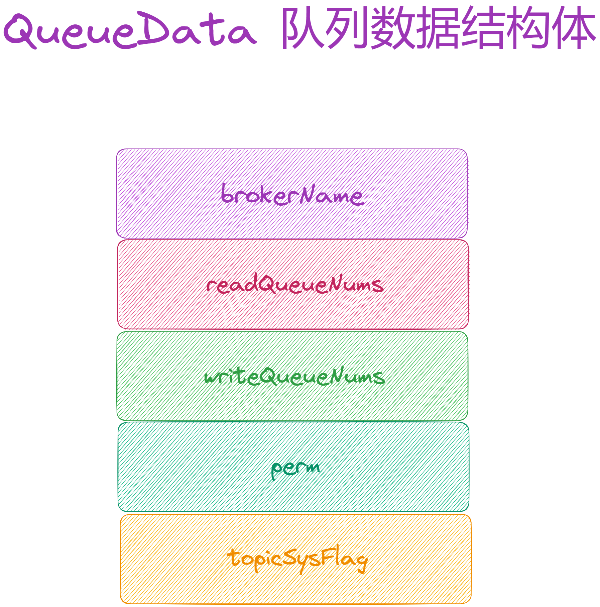

### **3.2.4 Broker 数据结构体**

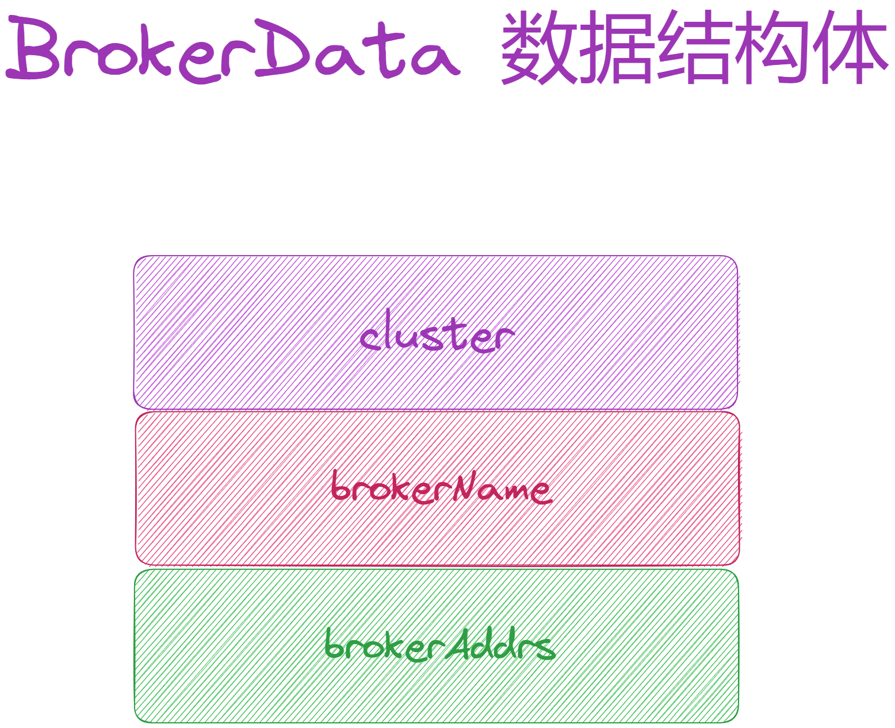

## **04 生产者如何选择 MessageQueue 进行消息发送**

详情请点击 [【生产者源码分析系列第四篇】图解 RocketMQ 源码之生产者选择 MessageQueue 发送消息流程剖析](https://articles.zsxq.com/id_eqpqeg7e8r5w.html)

这里分为两种情况：

1.  [sendLatencyFaultEnable=false](http://sendlatencyfaultenable=false/)，默认不启用 Broker 故障延迟机制。
2.  [sendLatencyFaultEnable=true](http://sendlatencyfaultenable=true/)，启用 Broker 故障延迟机制。

/\*\*

\* 选择队列

\* 上一次发送成功则选择下一个队列，上一次发送失败会规避上次发送的 MessageQueue 所在的 Broker

\* 源码位置:

\* 子项目: client

\* 包名: org.apache.rocketmq.client.impl.producer;

\* 文件: TopicPublishInfo

\* 行数: 69

\* @param lastBrokerName 上次发送的 Broker 名称，如果为空表示上次发送成功

\* @return

\*/

public MessageQueue selectOneMessageQueue(final String lastBrokerName) {

if (lastBrokerName == null) {

// 轮询队列，选择下一个队列

return selectOneMessageQueue();

} else {

// 上次发送失败，规避上次发送的 MessageQueue 所在的 Broker

for (int i \= 0; i < this.messageQueueList.size(); i++) {

int index \= this.sendWhichQueue.incrementAndGet();

int pos \= Math.abs(index) % this.messageQueueList.size();

if (pos < 0)

pos = 0;

MessageQueue mq \= this.messageQueueList.get(pos);

if (!mq.getBrokerName().equals(lastBrokerName)) {

return mq;

}

}

return selectOneMessageQueue();

}

}

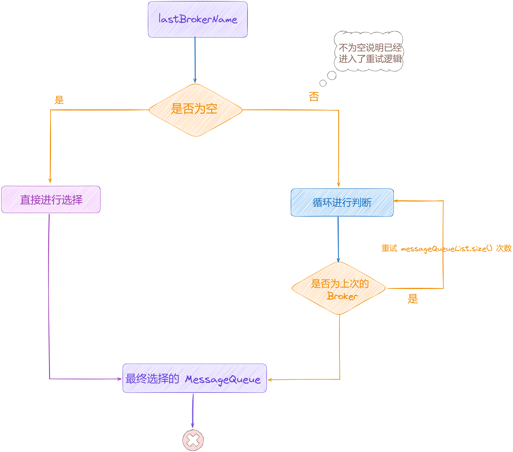

// 源码位置:

// 子项目: client

// 包名: org.apache.rocketmq.client.impl.producer;

// 文件: TopicPublishInfo

// 行数: 87

public MessageQueue selectOneMessageQueue() {

// 拿到 sendWhichQueue，从 sendWhichQueue 当中，取出一个值 index

// 首次 sendWhichQueue 是没有值的，后续所有的调用都是在最开始的随机值基础上自增

int index \= this.sendWhichQueue.incrementAndGet();

// 对 messageQueue 列表长度取余

int pos \= Math.abs(index) % this.messageQueueList.size();

// 计算出来的 pos 如果小于 0, 就给个兜底 0

if (pos < 0)

pos = 0;

// 从队列中获取下标为 pos 的 messageQueue

return this.messageQueueList.get(pos);

}

public class TopicPublishInfo {

....

private List<MessageQueue> messageQueueList = new ArrayList<MessageQueue>();

// 发送到哪个队列

private volatile ThreadLocalIndex sendWhichQueue \= new ThreadLocalIndex();

private TopicRouteData topicRouteData;

....

}

// 源码位置:

// 子项目: client

// 包名: org.apache.rocketmq.client.common;

// 文件: ThreadLocalIndex

// 行数: 87

public class ThreadLocalIndex {

private final ThreadLocal<Integer> threadLocalIndex = new ThreadLocal<Integer>();

private final Random random \= new Random();

private final static int POSITIVE\_MASK \= 0x7FFFFFFF;

public int incrementAndGet() {

// 从ThreadLocal中获取index的值

Integer index \= this.threadLocalIndex.get();

if (null == index) {

// 使用随机数初始化index

index = Math.abs(random.nextInt());

// 将初始化的index存入ThreadLocal

this.threadLocalIndex.set(index);

}

// 对index进行递增操作

this.threadLocalIndex.set(++index);

// 返回index与正数掩码进行与操作后的绝对值

return Math.abs(index & POSITIVE\_MASK);

}

....

}

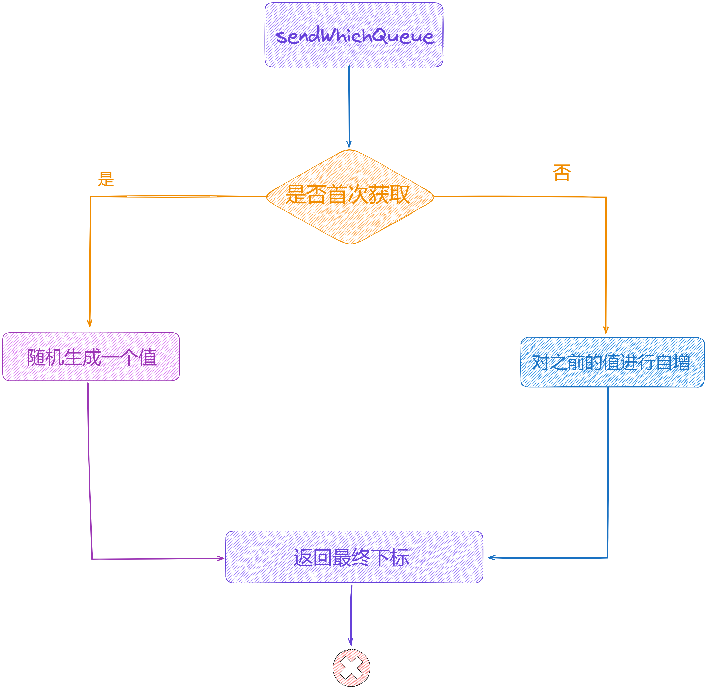

## **05 网络客户端 MQClientInstance 组件启动**

详情请点击 [【生产者源码分析系列第四篇】图解 RocketMQ 源码之生产者选择 MessageQueue 发送消息流程剖析](https://articles.zsxq.com/id_eqpqeg7e8r5w.html)

public class DefaultMQProducerImpl implements MQProducerInner {

// 网络客户端

private MQClientInstance mQClientFactory;

....

// 启动生产者

public void start(final boolean startFactory) throws MQClientException {

switch (this.serviceState) {

// 刚刚创建

case CREATE\_JUST:

....

// 创建 MQ 网络客户端实例

this.mQClientFactory = MQClientManager.getInstance().getOrCreateMQClientInstance(this.defaultMQProducer, rpcHook);

....

if (startFactory) {

// 启动 MQ 网络客户端实例

mQClientFactory.start();

}

....

this.serviceState = ServiceState.RUNNING;

break;

....

}

// 发送心跳请求

this.mQClientFactory.sendHeartbeatToAllBrokerWithLock();

}

}

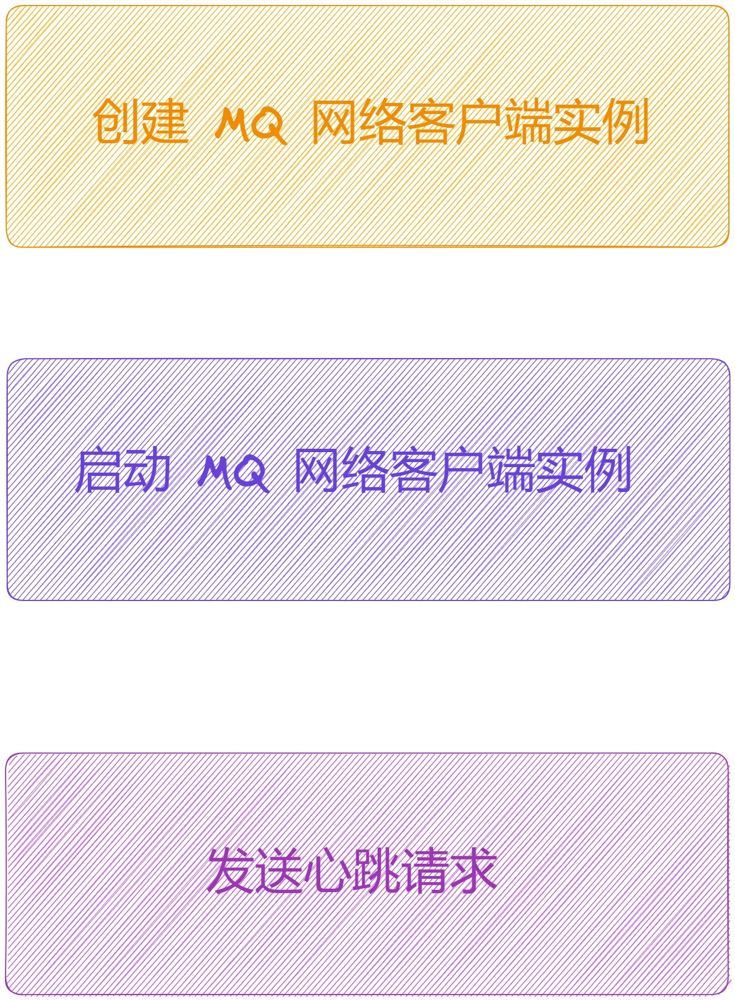

这里通过一个总结图来梳理网络客户端的启动流程。

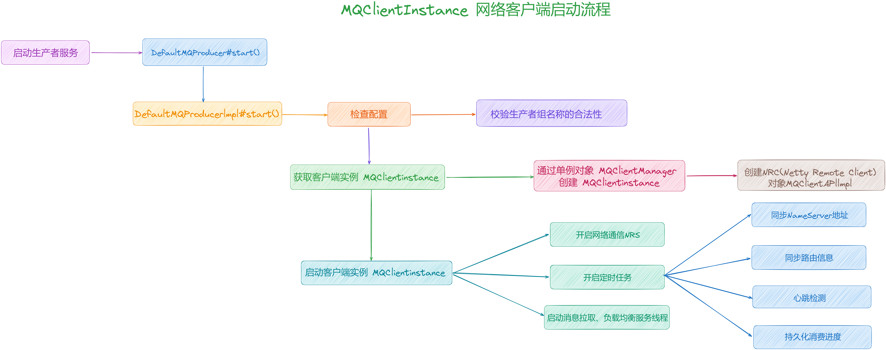

## **06 网络通信组件 NettyRemotingClient 启动**

我们先来看下 RocketMQ 底层网络通讯顶层设计，其类图设计如下：

其类依赖关系详细图如下：

根据上图的整个通信类结构可以看到，[NettyRemotingAbstract](http://nettyremotingabstract/) 抽象类是真正实现「**处理请求命令**」、「**处理响应命令**」、「**发送同步请求**」、「**发送异步请求**」、「**发送单向请求**」等。

这里来简单的梳理下其调用关系：

1.  **RemotingService：**它是远程通信服务的**顶级接口**，内部定义了「**启动**」、「**关闭**」、「**钩子注册**」3个方法。
2.  **RemotingClient：**它是远程通信客户端接口，其继承 [RemotingService](http://remotingservice/)，另外扩展了「**获取/更新 NameServer 地址**」、「**同步、异步、单向**」3种请求、「**注册请求处理器**」、「**添加回调执行器**」等方法。
3.  **RemotingServer：**它是远程通信服务端接口，其继承 [RemotingService](http://remotingservice/)，另外扩展了「**注册请求处理器**」、「**获取<请求处理器,执行器>**」、「**同步、异步、单向**」3种请求等方法。
4.  **NettyRemotingAbstract：**它是 Netty 远程服务抽象类，内部封装了「**获取通道事件监听器**」、「**添加 Netty Event 到执行器中**」、「**处理消息接收**」、「**处理请求命令**」、「**处理返回命令**」、「**获取 RPC 钩子**」、「**获取回调执行器**」、「**同步、异步、单向**」3种请求实现方法。
5.  **NettyRemotingClient：**它是 Netty 远程通信客户端类，其继承自 [NettyRemotingAbstract](http://nettyremotingabstract/) 实现了[RemotingClient](http://remotingclient/) 接口，复写「**同步、异步、单向**」3种请求，扩展了「**关闭通道**」方法。
6.  **NettyRemotingServer：**它是 Netty 远程通信服务端类，其继承自 [NettyRemotingAbstract](http://nettyremotingabstract/) 实现了[RemotingServer](http://remotingserver/) 接口，复写「**同步、异步、单向**」3种请求。

由于服务端我们还没剖析，这里暂不深入剖析，后续会来一个整体的梳理和总结。

## **6.1 NettyRemtingClient 实现类**

NettyRemotingClient 的初始化是在生产者启动时的进行的，如下图所示：

## 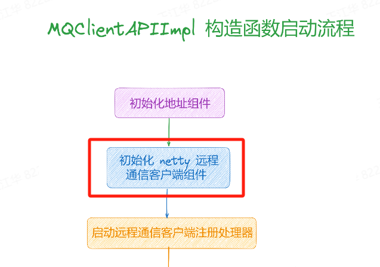

这里主要是创建了 [remotingClient](http://remotingclient/)，并注册了几个请求对应的处理器。

// 开启网络通信 NRC

this.mQClientAPIImpl.start();

// 网络通信客户端API实现组件启动方法

// 源码位置如下：

// 子项目: client

// 包名: org.apache.rocketmq.client.impl;

// 文件: MQClientAPIImpl

// 行数: 250

public void start() {

this.remotingClient.start();

}

关于该类的内部属性如下：

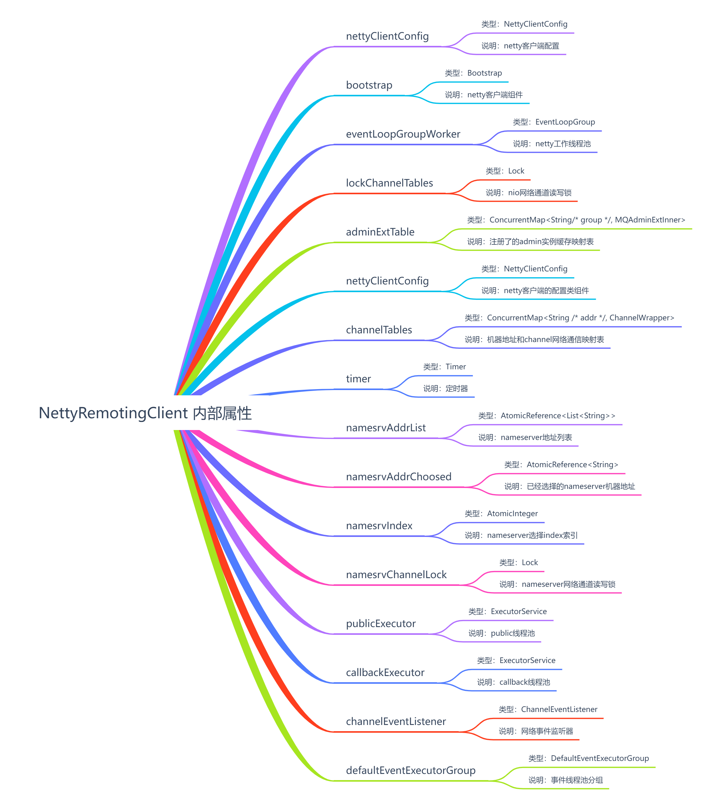

具体如何发送可以点击 [【生产者源码分析系列第六篇】图解 RocketMQ 源码之网络通讯组件 NettyRemotingClient 架构设计](https://articles.zsxq.com/id_zgofuq2lee3e.html)，[【生产者源码分析系列第七篇】图解 RocketMQ 源码之发送消息到 Broker 流程剖析](https://articles.zsxq.com/id_negumdmcswv2.html)

## **07 整个生产者发送流程总结**

详情请点击 [【生产者源码分析系列第二篇】图解 RocketMQ 源码之生产者发送消息核心流程剖析](https://articles.zsxq.com/id_tk73pfixne2e.html)

这里给出一个详细的流程图来总结，如下：

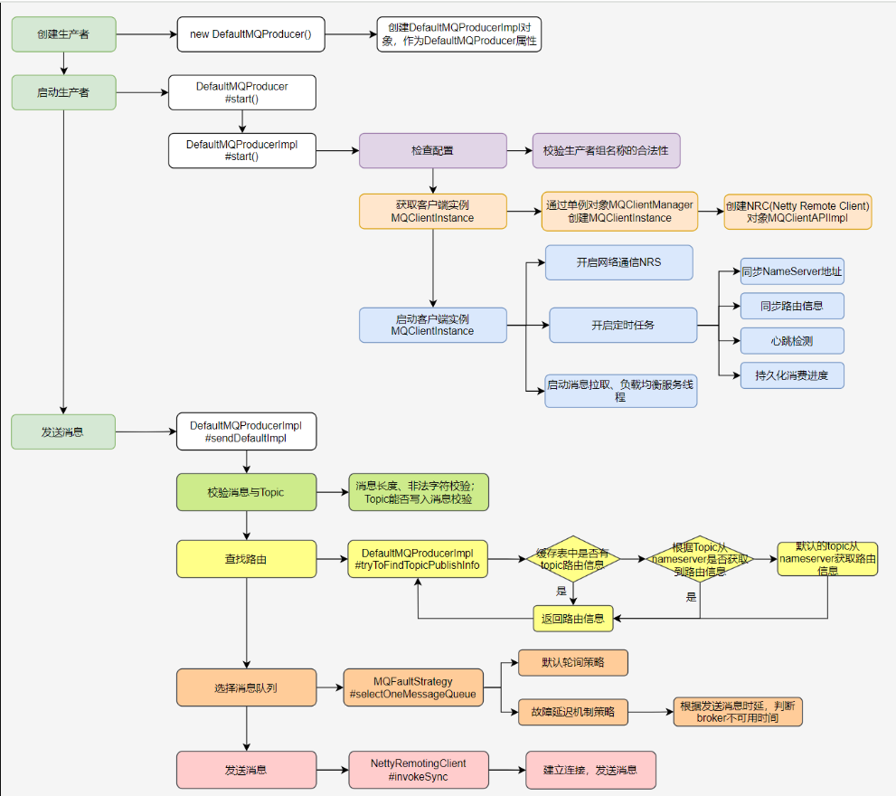