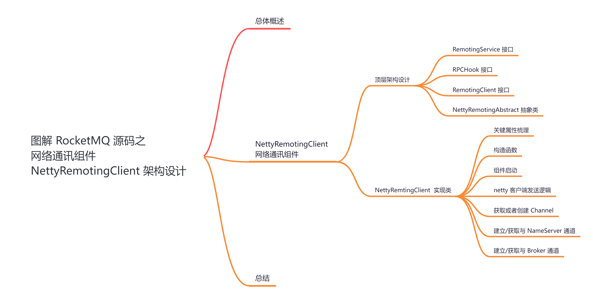
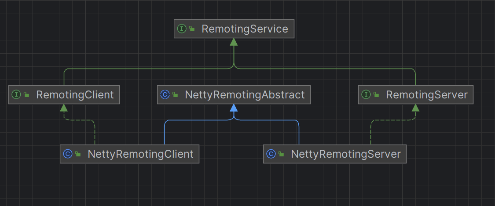
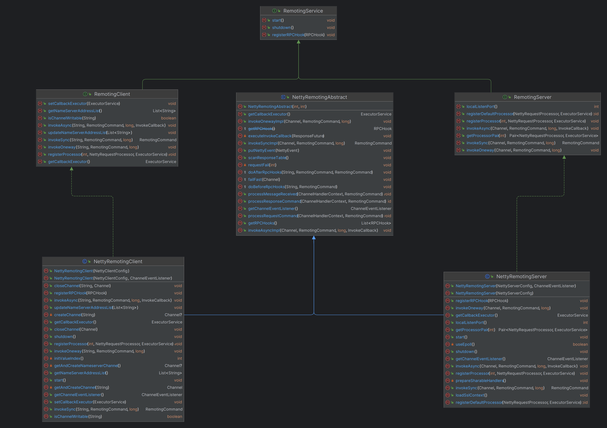
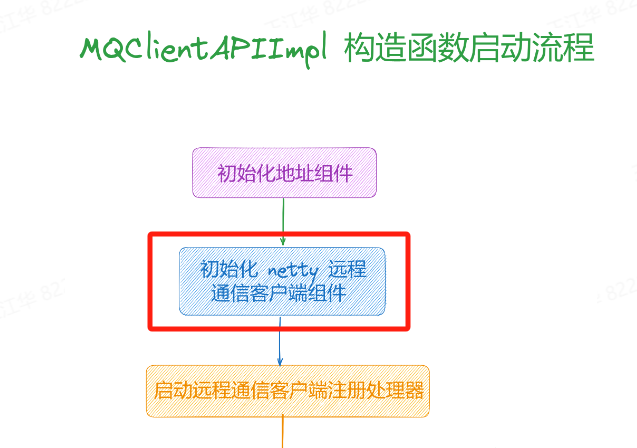

大家好，我是**华仔**, 又跟大家见面了。

从今天开始我将为大家奉上 RocketMQ 生产者源码剖析系列文章，正式开启「**RocketMQ 的生产者源码之旅**」，这是第八篇，我们来剖析下 RocketMQ 源码之网络通讯组件「**NettyRemotingClient**」架构设计剖析。

这里我将以「**RocketMQ 4.9.7**」版本为主，通过「**场景驱动**」的方式带大家一点点的对 RocketMQ 源码进行深度剖析，正式开启「**RocketMQ 的源码之旅**」，跟我一起来掌握 RocketMQ 源码核心架构设计思想吧。

  

##   
**01 总体概述**

在 [【生产者源码分析系列第二篇】图解 RocketMQ 源码之生产者发送消息核心流程剖析](https://articles.zsxq.com/id_tk73pfixne2e.html) 这篇中，我们简单聊了生产者发送消息的流程需要的几个步骤：

1.  拉取 Topic 路由数据。
2.  选择 MessageQueue。
3.  启动 MQClientInstance 网络客户端。
4.  启动 网络通讯组件 NettyRemotingClient，构建与 Broker 间的长连接。
5.  发送消息。

今天我们先来看下生产者是如何启动网络通讯组件「**NettyRemotingClient**」以及它是如何运行的。

## **02 NettyRemotingClient 网络通讯组件**

我们知道 RocketMQ 通信模块基于 Netty 实现，总体代码量相对不多。主要是 「**NettyRemotingServer**」和「**NettyRemotingClient**」，分别对应通信的服务端和客户端。

如果你理解 Netty 示例，理解 RocketMQ 是如何基于 Netty 进行通信，只需要知道以下 4 点：

1.  [NettyRemotingServer](http://nettyremotingserver/) 如何初始化。
2.  [NettyRemotingClient](http://nettyremotingclient/) 初始化。
3.  如何基于 [NettyRemotingClient](http://nettyremotingclient/) 发送消息
4.  无论是客户端还是服务端收到数据后都需要 Handler 来处理。

本篇我们重点剖析「**NettyRemotingClient**」，在 [【生产者源码分析系列第五篇】图解 RocketMQ 源码之 MQClientInstance 网络客户端剖析](https://articles.zsxq.com/id_srtcfq6nowor.html) 这篇中，我们已经剖析了「**MQClientInstance**」启动以及运行流程。

在启动「**MQClientAPIImpl**」组件时会初始化网络通讯组件「**NettyRemotingClient**」。

##   
**2.1 顶层架构设计**

我们先来看下 RocketMQ 底层网络通讯顶层设计，其类图设计如下：

其类依赖关系详细图如下：

根据上图的整个通信类结构可以看到，[NettyRemotingAbstract](http://nettyremotingabstract/) 抽象类是真正实现「**处理请求命令**」、「**处理响应命令**」、「**发送同步请求**」、「**发送异步请求**」、「**发送单向请求**」等。

这里来简单的梳理下其调用关系：

1.  **RemotingService：**它是远程通信服务的**顶级接口**，内部定义了「**启动**」、「**关闭**」、「**钩子注册**」3个方法。
2.  **RemotingClient：**它是远程通信客户端接口，其继承 [RemotingService](http://remotingservice/)，另外扩展了「**获取/更新 NameServer 地址**」、「**同步、异步、单向**」3种请求、「**注册请求处理器**」、「**添加回调执行器**」等方法。
3.  **RemotingServer：**它是远程通信服务端接口，其继承 [RemotingService](http://remotingservice/)，另外扩展了「**注册请求处理器**」、「**获取<请求处理器,执行器>**」、「**同步、异步、单向**」3种请求等方法。
4.  **NettyRemotingAbstract：**它是 Netty 远程服务抽象类，内部封装了「**获取通道事件监听器**」、「**添加 Netty Event 到执行器中**」、「**处理消息接收**」、「**处理请求命令**」、「**处理返回命令**」、「**获取 RPC 钩子**」、「**获取回调执行器**」、「**同步、异步、单向**」3种请求实现方法。
5.  **NettyRemotingClient：**它是 Netty 远程通信客户端类，其继承自 [NettyRemotingAbstract](http://nettyremotingabstract/) 实现了[RemotingClient](http://remotingclient/) 接口，复写「**同步、异步、单向**」3种请求，扩展了「**关闭通道**」方法。
6.  **NettyRemotingServer：**它是 Netty 远程通信服务端类，其继承自 [NettyRemotingAbstract](http://nettyremotingabstract/) 实现了[RemotingServer](http://remotingserver/) 接口，复写「**同步、异步、单向**」3种请求。

在 RocketMQ 中自定义了**通信协议并在 Netty 的基础上扩展了通信模块**。

首先通信的两端分为「**客户端**」和「**服务端**」，客户端和服务端都有「**启动**」、「**关闭**」的方法，为了在处理请求之前和返回响应之后做一些事情，采用「**钩子机制**」来扩展，所以还需要一个「**注册钩子**」的方法，定义的客户端和服务端的公共接口。

## **2.1.1 RemotingService 接口**

源码位置：[https://github.com/apache/rocketmq/blob/release-4.9.7/client/src/main/java/org/apache/rocketmq/](https://github.com/apache/rocketmq/blob/release-4.9.7/client/src/main/java/org/apache/rocketmq/remoting/RemotingService.java)[remoting/RemotingService](https://github.com/apache/rocketmq/blob/release-4.9.7/client/src/main/java/org/apache/rocketmq/remoting/RemotingService.java)[.java](https://github.com/apache/rocketmq/blob/release-4.9.7/client/src/main/java/org/apache/rocketmq/remoting/RemotingService.java)

// RemotingService 接口

// 源码位置如下：

// 子项目: remoting

// 包名: org.apache.rocketmq.remoting;

// 文件: RemotingService

// 行数: 20

package org.apache.rocketmq.remoting;

public interface RemotingService {

// 启动

void start();

// 关闭

void shutdown();

// 注册钩子

void registerRPCHook(RPCHook rpcHook);

}

## **2.1.2 RPCHook 接口**

源码位置：[https://github.com/apache/rocketmq/blob/release-4.9.7/client/src/main/java/org/apache/rocketmq/](https://github.com/apache/rocketmq/blob/release-4.9.7/client/src/main/java/org/apache/rocketmq/remoting/RPCHook.java)[remoting](https://github.com/apache/rocketmq/blob/release-4.9.7/client/src/main/java/org/apache/rocketmq/remoting/RPCHook.java)[/](https://github.com/apache/rocketmq/blob/release-4.9.7/client/src/main/java/org/apache/rocketmq/remoting/RPCHook.java)[RPCHook](https://github.com/apache/rocketmq/blob/release-4.9.7/client/src/main/java/org/apache/rocketmq/remoting/RPCHook.java)[.java](https://github.com/apache/rocketmq/blob/release-4.9.7/client/src/main/java/org/apache/rocketmq/remoting/RPCHook.java)

// RPCHook 接口

// 源码位置如下：

// 子项目: remoting

// 包名: org.apache.rocketmq.remoting;

// 文件: RPCHook

// 行数: 22

package org.apache.rocketmq.remoting;

// 省略import

public interface RPCHook {

// 在处理请求之前调用

void doBeforeRequest(final String remoteAddr, final RemotingCommand request);

// 在返回响应之后调用

void doAfterResponse(final String remoteAddr, final RemotingCommand request,

final RemotingCommand response);

}

[RPCHook](http://rpchook/) 的作用是更好的扩展性，允许用户在「**请求之前**」和「**响应之后**」做一些事情。从上面代码可以看出，钩子接口 [RPCHook](http://rpchook/) 有两个方法：

1.  [doBeforeRequest](http://dobeforerequest/) 方法在请求之前调用，参数 [remoteAddr](http://remoteaddr/) 是请求地址，[request](http://request/) 是请求参数。
2.  [doAfterResponse](http://doafterresponse/) 在响应之后调用，参数 [remoteAddr](http://remoteaddr/) 是请求地址，[request](http://request/)是请求参数，[response](http://response/) 是响应参数，类型是 [RemotingCommand](http://remotingcommand/)，这个会在下面进行剖析。

##   
**2.1.3 RemotingClient 接口**

// RemotingClient 接口

// 源码位置如下：

// 子项目: remoting

// 包名: org.apache.rocketmq.remoting;

// 文件: RemotingClient

// 行数: 28

package org.apache.rocketmq.remoting;

// 省略import

public interface RemotingClient extends RemotingService {

// 更新 nameServer 的所有地址

void updateNameServerAddressList(final List<String> addrs);

// 获取所有的nameServer地址

List<String> getNameServerAddressList();

// 同步发送

RemotingCommand invokeSync(final String addr, final RemotingCommand request,

final long timeoutMillis) throws InterruptedException, RemotingConnectException,

RemotingSendRequestException, RemotingTimeoutException;

// 异步发送

void invokeAsync(final String addr, final RemotingCommand request, final long timeoutMillis,

final InvokeCallback invokeCallback) throws InterruptedException, RemotingConnectException,

RemotingTooMuchRequestException, RemotingTimeoutException, RemotingSendRequestException;

// 单向发送

void invokeOneway(final String addr, final RemotingCommand request, final long timeoutMillis)

throws InterruptedException, RemotingConnectException, RemotingTooMuchRequestException,

RemotingTimeoutException, RemotingSendRequestException;

// 注册处理器

void registerProcessor(final int requestCode, final NettyRequestProcessor processor,

final ExecutorService executor);

// 设置回调线程执行器

void setCallbackExecutor(final ExecutorService callbackExecutor);

// 获取回调执行器

ExecutorService getCallbackExecutor();

// 通道是否可写

boolean isChannelWritable(final String addr);

}

## **2.1.4 NettyRemotingAbstract 抽象类**

[【网络通信源码分析系列第二篇源码】图解 RocketMQ 源码之 NettyRemotingAbstract 抽象类实现](https://articles.zsxq.com/id_gid958lent4m.html)

好了，至此「**NettyRemotingAbstract**」类的重要方法就剖析完毕了，接下来我们来重点剖析下「**NettyRemotingClient**」的源码实现。

##   
**2.2 NettyRemtingClient 实现类**

NettyRemotingClient 的初始化是在生产者启动时的进行的，如下图所示：

## 

这里主要是创建了 [remotingClient](http://remotingclient/)，并注册了几个请求对应的处理器。

// 开启网络通信 NRC

this.mQClientAPIImpl.start();

// 网络通信客户端API实现组件启动方法

// 源码位置如下：

// 子项目: client

// 包名: org.apache.rocketmq.client.impl;

// 文件: MQClientAPIImpl

// 行数: 250

public void start() {

this.remotingClient.start();

}

内部调用了 [remotingClient#start](http://remotingclient/#start)，实现类是 [NettyRemotingClient](http://nettyremotingclient/)。

源码位置：[https://github.com/apache/rocketmq/blob/release-4.9.7/client/src/main/java/org/apache/rocketmq/remoting/netty/NettyRemotingClient.java](https://github.com/apache/rocketmq/blob/release-4.9.7/client/src/main/java/org/apache/rocketmq/remoting/netty/NettyRemotingClient.java)

## **2.2.1 关键属性梳理**

// MQClientAPIImpl 构造方法

this.remotingClient = new NettyRemotingClient(nettyClientConfig, null);

// netty 远程通信客户端组件

// 源码位置如下：

// 子项目: remoting

// 包名: org.apache.rocketmq.remoting.netty;

// 文件: NettyRemotingClient

// 行数: 152

public class NettyRemotingClient extends NettyRemotingAbstract implements RemotingClient {

private static final InternalLogger log \= InternalLoggerFactory.getLogger(RemotingHelper.ROCKETMQ\_REMOTING);

private static final long LOCK\_TIMEOUT\_MILLIS \= 3000;

// netty客户端配置

private final NettyClientConfig nettyClientConfig;

// netty客户端组件

private final Bootstrap bootstrap \= new Bootstrap();

// netty工作线程池

private final EventLoopGroup eventLoopGroupWorker;

// nio网络通道读写锁

private final Lock lockChannelTables \= new ReentrantLock();

// 机器地址和channel网络通信映射表

private final ConcurrentMap<String /\* addr \*/, ChannelWrapper> channelTables = new ConcurrentHashMap<String, ChannelWrapper>();

// 定时器

private final Timer timer \= new Timer("ClientHouseKeepingService", true);

// nameserver地址列表

private final AtomicReference<List<String>> namesrvAddrList = new AtomicReference<List<String>>();

// 已经选择的nameserver机器地址

private final AtomicReference<String> namesrvAddrChoosed = new AtomicReference<String>();

// nameserver选择index索引

private final AtomicInteger namesrvIndex \= new AtomicInteger(initValueIndex());

// nameserver网络通道读写锁

private final Lock namesrvChannelLock \= new ReentrantLock();

// public线程池

private final ExecutorService publicExecutor;

// callback线程池

private ExecutorService callbackExecutor;

// 网络事件监听器

private final ChannelEventListener channelEventListener;

// 事件线程池分组

private DefaultEventExecutorGroup defaultEventExecutorGroup;

....

}

从上面可以看出，[NettyRemotingClient](http://nettyremotingclient/) 类继承了 [NettyRemotingAbstract](http://nettyremotingabstract/) 方法，并且实现了 [RemotingClient](http://remotingclient/)接口。

## **2.2.2 构造函数**

// netty 远程通信客户端组件

// 源码位置如下：

// 子项目: remoting

// 包名: org.apache.rocketmq.remoting.netty;

// 文件: NettyRemotingClient

// 行数: 152

public class NettyRemotingClient extends NettyRemotingAbstract implements RemotingClient {

....

public NettyRemotingClient(final NettyClientConfig nettyClientConfig) {

this(nettyClientConfig, null);

}

// 构造函数初始化

public NettyRemotingClient(final NettyClientConfig nettyClientConfig,

final ChannelEventListener channelEventListener) {

// 先调用父类构造函数

super(nettyClientConfig.getClientOnewaySemaphoreValue(), nettyClientConfig.getClientAsyncSemaphoreValue());

// netty客户端配置

this.nettyClientConfig = nettyClientConfig;

// 网络事件监听器

this.channelEventListener = channelEventListener;

// public线程池数量

int publicThreadNums \= nettyClientConfig.getClientCallbackExecutorThreads();

if (publicThreadNums <= 0) {

publicThreadNums = 4;

}

// 构建一个public线程池

this.publicExecutor = Executors.newFixedThreadPool(publicThreadNums, new ThreadFactory() {

private AtomicInteger threadIndex \= new AtomicInteger(0);

@Override

public Thread newThread(Runnable r) {

return new Thread(r, "NettyClientPublicExecutor\_" + this.threadIndex.incrementAndGet());

}

});

// 构建netty线程池

this.eventLoopGroupWorker = new NioEventLoopGroup(1, new ThreadFactory() {

private AtomicInteger threadIndex \= new AtomicInteger(0);

@Override

public Thread newThread(Runnable r) {

return new Thread(r, String.format("NettyClientSelector\_%d", this.threadIndex.incrementAndGet()));

}

});

if (nettyClientConfig.isUseTLS()) {

try {

sslContext = TlsHelper.buildSslContext(true);

log.info("SSL enabled for client");

} catch (IOException e) {

log.error("Failed to create SSLContext", e);

} catch (CertificateException e) {

log.error("Failed to create SSLContext", e);

throw new RuntimeException("Failed to create SSLContext", e);

}

}

}

....

}

## **2.2.3 组件启动**

// netty 远程通信客户端启动

// 源码位置如下：

// 子项目: remoting

// 包名: org.apache.rocketmq.remoting.netty;

// 文件: NettyRemotingClient

// 行数: 152

public class NettyRemotingClient extends NettyRemotingAbstract implements RemotingClient {

....

@Override

// netty网络客户端启动

public void start() {

// 创建默认的客户端事件线程池，内部默认线程数量为 4 用于执行配置的 ChannelHandler 逻辑

this.defaultEventExecutorGroup = new DefaultEventExecutorGroup(

nettyClientConfig.getClientWorkerThreads(),

new ThreadFactory() {

private AtomicInteger threadIndex = new AtomicInteger(0);

@Override

public Thread newThread(Runnable r) {

return new Thread(r, "NettyClientWorkerThread\_" + this.threadIndex.incrementAndGet());

}

});

// 构建 netty 客户端启动器 Bootstrap

// 通过客户端启动类配置 worker 组 由于是客户端线程数量为1

// 而配置的参数和 NettyRemotingServer 大同小异，后面剖析

// 唯一不同的地方在于 NettyRemotingServer 配置的最后一个 Handler 为 NettyServerHandler

// 而 NettyRemotingClient 配置的最后一个 Handler 为 NettyClientHandler

Bootstrap handler = this.bootstrap.group(this.eventLoopGroupWorker).channel(NioSocketChannel.class)

// 关闭 Nagle 算法 避免产生时延

.option(ChannelOption.TCP\_NODELAY, true)

// 不启用 tcp 的心跳机制

.option(ChannelOption.SO\_KEEPALIVE, false)

// 连接超时时间，3秒连接超时

.option(ChannelOption.CONNECT\_TIMEOUT\_MILLIS, nettyClientConfig.getConnectTimeoutMillis())

// 处理器

.handler(new ChannelInitializer<SocketChannel>() {

@Override

public void initChannel(SocketChannel ch) throws Exception {

ChannelPipeline pipeline = ch.pipeline();

if (nettyClientConfig.isUseTLS()) {

if (null != sslContext) {

pipeline.addFirst(defaultEventExecutorGroup, "sslHandler", sslContext.newHandler(ch.alloc()));

log.info("Prepend SSL handler");

} else {

log.warn("Connections are insecure as SSLContext is null!");

}

}

pipeline.addLast(

defaultEventExecutorGroup,

// 消息编码器

new NettyEncoder(),

// 消息解码器

new NettyDecoder(),

// 空闲处理器

new IdleStateHandler(0, 0, nettyClientConfig.getClientChannelMaxIdleTimeSeconds()),

// 连接管理处理器

new NettyConnectManageHandler(),

// netty客户端处理器

new NettyClientHandler());

}

});

....

// 定时任务扫描响应映射表，每秒处理丢弃超时的请求

this.timer.scheduleAtFixedRate(new TimerTask() {

@Override

public void run() {

try {

NettyRemotingClient.this.scanResponseTable();

} catch (Throwable e) {

log.error("scanResponseTable exception", e);

}

}

}, 1000 \* 3, 1000);

// 启动通道事件处理监听器

if (this.channelEventListener != null) {

this.nettyEventExecutor.start();

}

}

....

}

该方法用来启动 Netty 网络通信组件的，其线程模型比较简单，属于「**Reactor 单线程模型**」，主要做了以下几件事：

1.  为客户端启动器，设置各种属性参数、处理器，并且启动了netty客户端。处理器包括编码处理器、解码处理器、netty客户端管理器实际就是调用 [NettyRemotingAbstract#processMessageReceived](http://nettyremotingabstract/#processMessageReceived) 方法处理接收到的信息，[processMessageReceived](http://processmessagereceived/) 方法的分析已经在上面讲述过了。编码处理器、解码处理器内容将在下面讲述通信协议的设计以及通信编解码进行讲述。
2.  定时任务扫描响应，调用 [NettyRemotingAbstract#scanResponseTable](http://nettyremotingabstract/#scanResponseTable) 方法扫描已过期的响应。这部分内容已经在上面剖析过了。
3.  启动通道事件监听器，就是调用 [NettyRemotingAbstract](http://nettyremotingabstract/) 的内部类 [NettyEventExecutor#start](http://nettyeventexecutor/#start) 方法，启动线程不断从队列中取出事件，根据事件类型进行调用监听器的不同处理方法，这部分内容也在 [NettyRemotingAbstract](http://nettyremotingabstract%20/) 剖析过了。

## **2.2.4 netty 客户端发送逻辑**

// 客户端发送逻辑

// 源码位置如下：

// 子项目: remoting

// 包名: org.apache.rocketmq.remoting.netty;

// 文件: NettyRemotingClient

// 行数: 378

@Override

public RemotingCommand invokeSync(String addr, // broker地址 或者 namesrv地址 具体看是要发给谁

final RemotingCommand request, // 消息信息 网络传输对象

long timeoutMillis) // 超时时间

throws InterruptedException, RemotingConnectException, RemotingSendRequestException, RemotingTimeoutException {

// 发送请求开始时间

long beginStartTime \= System.currentTimeMillis();

// 获取或者创建channel

// 以生产者为例：生产者向 namesrv 或者 broker 发起socket连接然后获取到连接成功的通道

final Channel channel \= this.getAndCreateChannel(addr);

if (channel != null && channel.isActive()) {

try {

// 执行before rpc 钩子扩展方法

doBeforeRpcHooks(addr, request);

// 计算花费时间

long costTime \= System.currentTimeMillis() - beginStartTime;

// 条件成立：说明已经达到超时时间 扔出超时异常

if (timeoutMillis < costTime) {

throw new RemotingTimeoutException("invokeSync call the addr\[" + addr + "\] timeout");

}

// 调用 NettyRemotingAbstract#invokeSyncImpl() 底层方法进行同步发送

// 参数一:channel，参数二:请求对象，参数三:更新后的超时时间

RemotingCommand response \= this.invokeSyncImpl(channel, request, timeoutMillis - costTime);

// 执行 after rpc 钩子扩展方法

doAfterRpcHooks(RemotingHelper.parseChannelRemoteAddr(channel), request, response);

return response;

} catch (RemotingSendRequestException e) {

log.warn("invokeSync: send request exception, so close the channel\[{}\]", addr);

this.closeChannel(addr, channel);

throw e;

} catch (RemotingTimeoutException e) {

if (nettyClientConfig.isClientCloseSocketIfTimeout()) {

this.closeChannel(addr, channel);

log.warn("invokeSync: close socket because of timeout, {}ms, {}", timeoutMillis, addr);

}

log.warn("invokeSync: wait response timeout exception, the channel\[{}\]", addr);

throw e;

}

} else {

this.closeChannel(addr, channel);

throw new RemotingConnectException(addr);

}

}

该方法用来进行同步发送消息的，主要做了以下几件事：

1.  发送请求开始时间。
2.  获取或者创建 [channel](http://channel/)，以生产者为例：生产者向 namesrv 或者 broker 发起 socket 连接然后获取到连接成功的通道。
3.  执行 before rpc 钩子扩展方法。
4.  计算花费时间，条件成立：说明已经达到超时时间 扔出超时异常。
5.  调用 [NettyRemotingAbstract#invokeSyncImpl()](http://nettyremotingabstract/#invokeSyncImpl\(\)) 底层方法进行同步发送。
6.  执行 after rpc 钩子扩展方法。

这里重点关注第二步骤。

## **2.2.5 获取或者创建 Channel**

该方法的 addr 参数说明：

1.  当需要和 [nameServer](http://nameserver/) 交互进行获取路由信息的时候，addr 为 null。
2.  当需要和 [broker](http://broker/) 交互进行发送消息的时候，addr 为具体的 [broker](http://broker/) 地址。

// 获取或者创建 Channel

// 源码位置如下：

// 子项目: remoting

// 包名: org.apache.rocketmq.remoting.netty;

// 文件: NettyRemotingClient

// 行数: 411

// @param addr 地址 有可能为空，有可能不为空

// @return 连接成功后返回的 channel

private Channel getAndCreateChannel(final String addr) throws RemotingConnectException, InterruptedException {

// addr 为空说明是和 nameServer 进行交互

if (null == addr) {

return getAndCreateNameserverChannel();

}

// 当执行到这里，说明是和 broker进行交互，首先尝试从 channelTables 缓存中获取存在的 Channel

ChannelWrapper cw \= this.channelTables.get(addr);

// 说明从缓存中获取到 Channel，直接返回

if (cw != null && cw.isOK()) {

return cw.getChannel();

}

// 此时需要进行 connect 操作，并且 connect 操作完成后将 channel 放入"缓存" 中

return this.createChannel(addr);

}

该方法主要用来获取或者创建 Channel 的，分两种情况：

1.  如果 [addr](http://addr/) 为空则说明是和 [NameServer](http://nameserver/) 进行交互，则执行与 [NameServer](http://nameserver/) 之间的通道。
2.  如果 [addr](http://addr/) 不为空则说明是和 [broker](http://broker/) 进行交互，首先尝试从 [channelTables](http://channeltables%20/) 缓存中获取存在的 [Channel](http://channel/)。
3.  如果缓存中存在 [Channel](http://channel/) 则直接返回，否则创建 [Channel](http://channel/)。

接下来先看下与 [NameServer](http://nameserver/) 的通道建立。

## **2.2.6 建立/获取与 NameServer 通道**

// 建立/获取与 NameServer 通道

// 源码位置如下：

// 子项目: remoting

// 包名: org.apache.rocketmq.remoting.netty;

// 文件: NettyRemotingClient

// 行数: 424

// @param addr 地址 有可能为空，有可能不为空

// @return 连接成功后返回的 channel

private Channel getAndCreateNameserverChannel() throws RemotingConnectException, InterruptedException {

// 获取上次被选择的 nameServer 地址

String addr \= this.namesrvAddrChoosed.get();

// 如果 addr 不为空则说明上次存在被选择的 nameServer 地址

if (addr != null) {

// 根据地址到缓存中获取现有的 channel

ChannelWrapper cw \= this.channelTables.get(addr);

// 存在现有的channel则直接返回

if (cw != null && cw.isOK()) {

return cw.getChannel();

}

}

// 当执行到这里，则说明可能第一次进行连接 nameserver 或者缓存中不存在 channel

// 此时需要先获取到指定的 namesrv 地址列表，即创建 Producer 或 Consumer 时指定的 namesrv 列表，namesrv 支持集群化部署，这里可能存在多个

final List<String> addrList = this.namesrvAddrList.get();

// 加锁处理

if (this.namesrvChannelLock.tryLock(LOCK\_TIMEOUT\_MILLIS, TimeUnit.MILLISECONDS)) {

try {

// 再次尝试获取上次被选择的 nameServer 地址

addr = this.namesrvAddrChoosed.get();

// 此时 addr 不为空则说明上次存在被选择的 nameServer 地址

if (addr != null) {

// 再次根据地址到缓存中获取现有的 channel

ChannelWrapper cw \= this.channelTables.get(addr);

// 存在现有的channel则直接返回

if (cw != null && cw.isOK()) {

return cw.getChannel();

}

}

// 下面通过负载均衡的从namesrv列表中随机获取一个namesrv尝试进行连接创建并且连接channel，并且将 channel 和选择的 namesrv 地址都缓存起来，方便下次直接获取

if (addrList != null && !addrList.isEmpty()) {

for (int i \= 0; i < addrList.size(); i++) {

// 获取索引

int index \= this.namesrvIndex.incrementAndGet();

index = Math.abs(index);

index = index % addrList.size();

// 随机获取一个 namesrv 地址

String newAddr \= addrList.get(index);

// 设置被选择的 namesrv 地址

this.namesrvAddrChoosed.set(newAddr);

log.info("new name server is chosen. OLD: {} , NEW: {}. namesrvIndex = {}", addr, newAddr, namesrvIndex);

// 创建channel

Channel channelNew \= this.createChannel(newAddr);

if (channelNew != null) {

return channelNew;

}

}

throw new RemotingConnectException(addrList.toString());

}

} finally {

this.namesrvChannelLock.unlock();

}

} else {

log.warn("getAndCreateNameserverChannel: try to lock name server, but timeout, {}ms", LOCK\_TIMEOUT\_MILLIS);

}

return null;

}

与 [NameServer](http://nameserver/) 的通道建立/获取流程相对比较简单，如下：

1.  尝试从缓存中获取上次选择的 [NameServer](http://nameserver/)地址。
2.  根据上次选择的 [NameServer](http://nameserver/) 地址到缓存中获取对应的 [Channel](http://channel/)。
3.  如果缓存未命中则根据负载均衡算法从 [NameServer](http://nameserver/) 地址列表中选择一个 [NameServer](http://nameserver/) 地址。
4.  根据地址创建 [Channel](http://channel/) 并返回。

接下来再来看下与 [Broker](http://broker/) 的通道建立。

## **2.2.7 建立/获取与 Broker** **通道**

// 建立/获取与 Broker 通道

// 源码位置如下：

// 子项目: remoting

// 包名: org.apache.rocketmq.remoting.netty;

// 文件: NettyRemotingClient

// 行数: 470

// @param addr broker 地址

// @return 连接成功后返回的 channel

private Channel createChannel(final String addr) throws InterruptedException {

// 首先尝试从 channelTables 缓存中获取存在的 Channel

ChannelWrapper cw \= this.channelTables.get(addr);

// 缓存中存在直接返回对应的 channel

if (cw != null && cw.isOK()) {

return cw.getChannel();

}

// 加锁处理

if (this.lockChannelTables.tryLock(LOCK\_TIMEOUT\_MILLIS, TimeUnit.MILLISECONDS)) {

try {

// 是否需要创建new连接标识

boolean createNewConnection;

// 再次从缓存中获取 channel

cw = this.channelTables.get(addr);

// 如果缓存中获取到 channel

if (cw != null) {

// 如果连接可用则返回连接

if (cw.isOK()) {

return cw.getChannel();

} else if (!cw.getChannelFuture().isDone()) {

createNewConnection = false;

} else {

// 执行到这里，则说明连接不可用，需要移除缓存重新创建 channel

this.channelTables.remove(addr);

createNewConnection = true;

}

} else {

createNewConnection = true;

}

// 当 createNewConnection 为 true 则说明需要创建 new 连接

if (createNewConnection) {

// 进行 connect 操作连接到对端，这里返回的是 Future 对象

// connect 操作是异步进行的，因此可能连接不一定成功，可能仍然处于连接中

ChannelFuture channelFuture \= this.bootstrap.connect(RemotingHelper.string2SocketAddress(addr));

log.info("createChannel: begin to connect remote host\[{}\] asynchronously", addr);

// 包装 channelFuture

cw = new ChannelWrapper(channelFuture);

// 放入 channel 缓存映射表 方便获取获取

this.channelTables.put(addr, cw);

}

} catch (Exception e) {

log.error("createChannel: create channel exception", e);

} finally {

this.lockChannelTables.unlock();

}

} else {

log.warn("createChannel: try to lock channel table, but timeout, {}ms", LOCK\_TIMEOUT\_MILLIS);

}

if (cw != null) {

ChannelFuture channelFuture \= cw.getChannelFuture();

// 尝试等待3秒，等待连接操作完成，

if (channelFuture.awaitUninterruptibly(this.nettyClientConfig.getConnectTimeoutMillis())) {

if (cw.isOK()) {

log.info("createChannel: connect remote host\[{}\] success, {}", addr, channelFuture.toString());

return cw.getChannel();

} else {

log.warn("createChannel: connect remote host\[" + addr + "\] failed, " + channelFuture, channelFuture.cause());

}

} else {

log.warn("createChannel: connect remote host\[{}\] timeout {}ms, {}", addr, this.nettyClientConfig.getConnectTimeoutMillis(),

channelFuture.toString());

}

}

return null;

}

## **03 总结**

本篇从顶层设计开始剖析了「**NettyRemotingClient**」的上层依赖以及本身的设计。