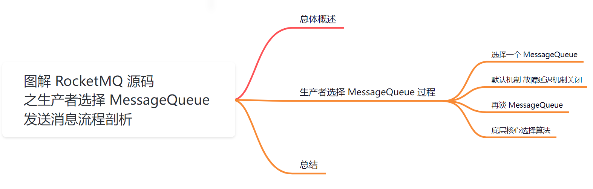
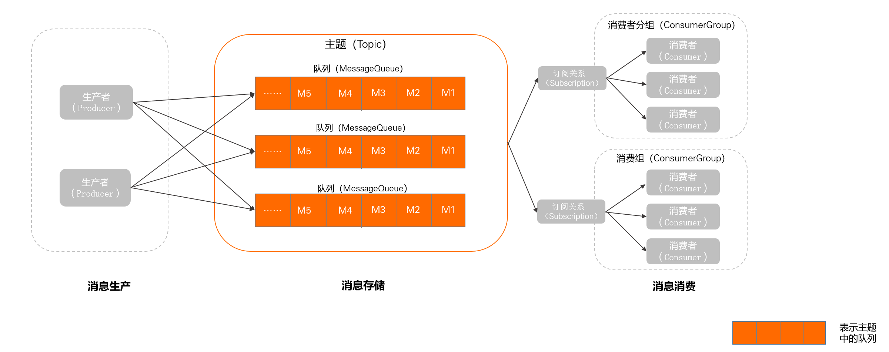
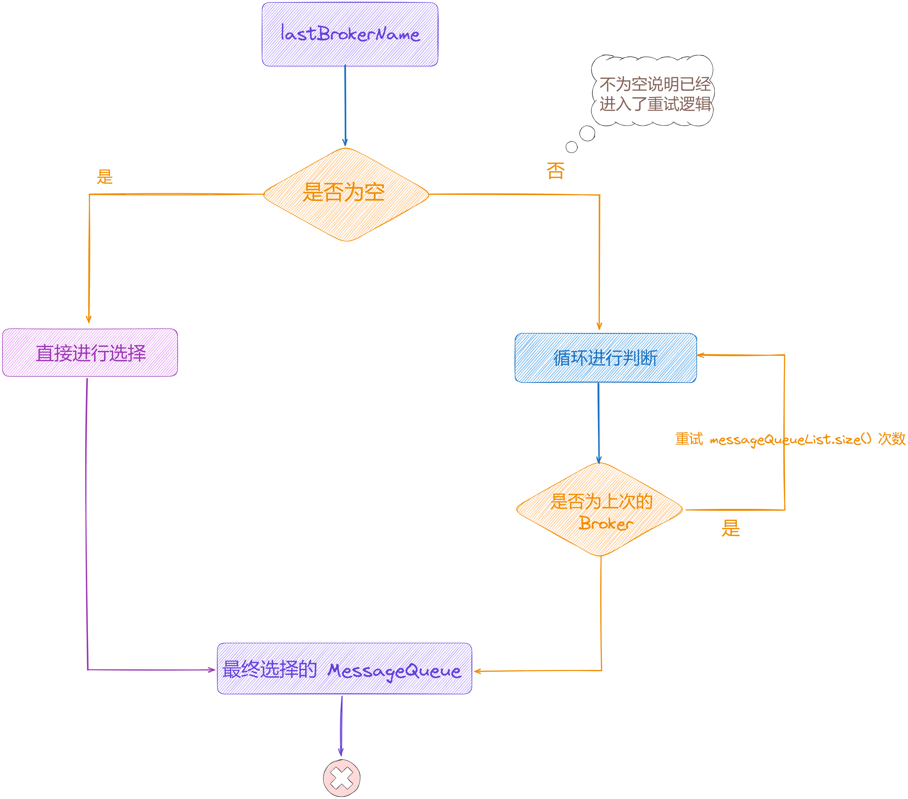
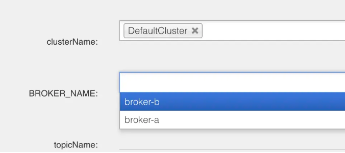
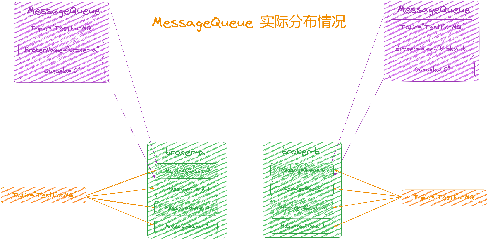
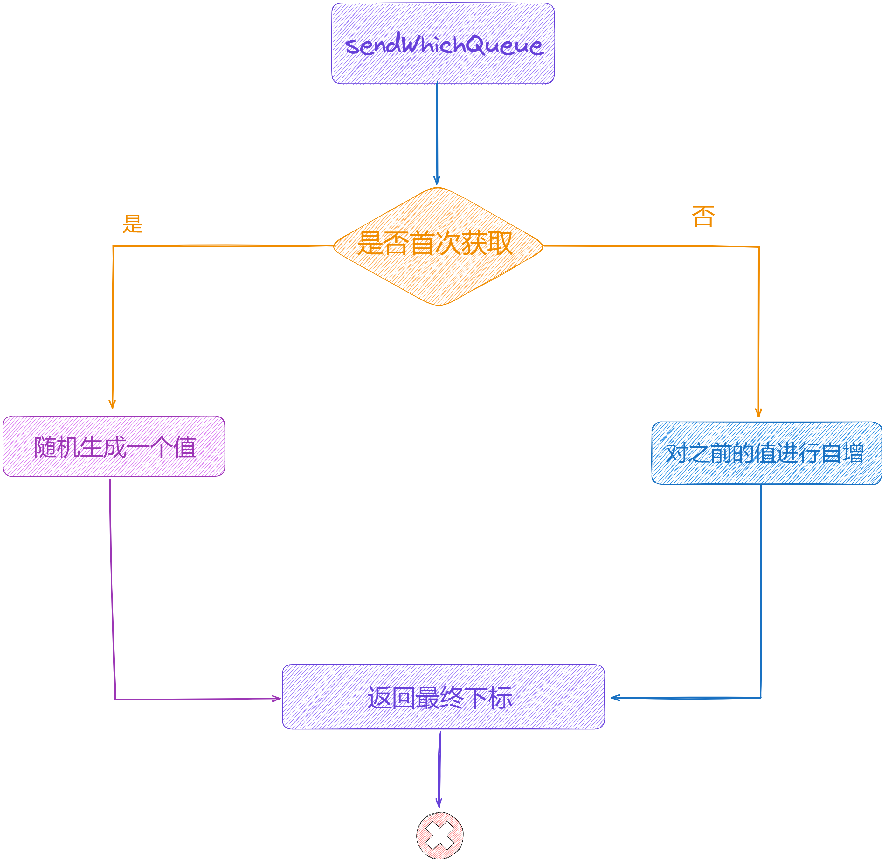

大家好，我是**华仔**, 又跟大家见面了。

从今天开始我将为大家奉上 RocketMQ 生产者源码剖析系列文章，正式开启「**RocketMQ 的生产者源码之旅**」，这是第六篇，我们来剖析下 RocketMQ 源码之生产者选择「**MessageQueue**」发送消息流程剖析。

这里我将以「**RocketMQ 4.9.7**」版本为主，通过「**场景驱动**」的方式带大家一点点的对 RocketMQ 源码进行深度剖析，正式开启「**RocketMQ 的源码之旅**」，跟我一起来掌握 RocketMQ 源码核心架构设计思想吧。

  

## **01 总体概述**

在 [【生产者源码分析系列第二篇】图解 RocketMQ 源码之生产者发送消息核心流程剖析](https://articles.zsxq.com/id_tk73pfixne2e.html) 这篇中，我们简单聊了生产者发送消息的流程需要的几个步骤：

1.  拉取 Topic 路由数据。
2.  选择 MessageQueue。
3.  启动 MQClientInstance 网络客户端。
4.  启动 网络通讯组件 NettyRemotingClient，构建与 Broker 间的长连接。
5.  发送消息。

今天我们先来看下生产者是如何选择「**MessageQueue**」进行消息发送的。

## **02 生产者选择 MessageQueue 过程**

在发送消息之前，生产者会通过「**NameServer**」拉取对应 Topic 的详细路由数据「**TopicPublishInfo**」，其中包含了该 Topic 下的所有「**MessageQueue**」。

在发送消息篇，我们只知道会从这些「**MessageQueue**」中选一个出来，但具体怎么选还不知道，而怎么选就是j接下来我们探索的重点。

先来看一个关键源码：

// 选择一个 queue

// 源码位置如下：

// 子项目: client 包名: org.apache.rocketmq.client.impl.producer;

// 文件: DefaultMQProducerImpl 行数: 559

MessageQueue mqSelected = this.selectOneMessageQueue(topicPublishInfo, lastBrokerName);

public MessageQueue selectOneMessageQueue(final TopicPublishInfo tpInfo, final String lastBrokerName) {

return this.mqFaultStrategy.selectOneMessageQueue(tpInfo, lastBrokerName);

}

这块代码的选择逻辑发生在计算重试次数之后，可以看到 [selectOneMessageQueue](http://selectonemessagequeue/) 方法的入参当中就有「**TopicPublishInfo**」，底层调用 [mqFaultStrategy#selectOneMessageQueue()](http://mqfaultstrategy/#selectOneMessageQueue\(\)) 方法。

## **2.1 选择一个 MessageQueue**

来看看底层是如何选择 queue 的。

源码位置：[https://github.com/apache/rocketmq/blob/release-4.9.7/client/src/main/java/org/apache/rocketmq/client/latency/MQFaultStrategy.java](https://github.com/apache/rocketmq/blob/release-4.9.7/client/src/main/java/org/apache/rocketmq/client/latency/MQFaultStrategy.java)

/\*\*

\* 选择发送的队列，根据是否启用 Broker 故障延迟机制走不同逻辑

\*

\* sendLatencyFaultEnable=false，默认不启用 Broker 故障延迟机制

\* sendLatencyFaultEnable=true，启用 Broker 故障延迟机制

\*

\* @param tpInfo

\* @param lastBrokerName

\* @return

\*/

public MessageQueue selectOneMessageQueue(final TopicPublishInfo tpInfo, final String lastBrokerName) {

// 是否启用 Broker 故障延迟机制，默认为关闭

if (this.sendLatencyFaultEnable) {

try {

// 轮询获取一个消息队列，获取 MessageQueue 选择索引并 + 1

int index \= tpInfo.getSendWhichQueue().incrementAndGet();

for (int i \= 0; i < tpInfo.getMessageQueueList().size(); i++) {

// index 与 messageQueueSize 取余，如果可用则返回，否则选择下一个 MessageQueue

int pos \= Math.abs(index++) % tpInfo.getMessageQueueList().size();

if (pos < 0)

pos = 0;

MessageQueue mq \= tpInfo.getMessageQueueList().get(pos);

// 验证该消息队列是否可用，规避注册过不可用的 Broker。

if (latencyFaultTolerance.isAvailable(mq.getBrokerName()))

return mq;

}

// 如果没有可用的 Broker，尝试从规避的 Broker 中选择一个可用的 Broker，如果没有找到，返回 null

final String notBestBroker \= latencyFaultTolerance.pickOneAtLeast();

// 轮询选择一个写队列

int writeQueueNums \= tpInfo.getQueueIdByBroker(notBestBroker);

if (writeQueueNums > 0) {

final MessageQueue mq \= tpInfo.selectOneMessageQueue();

if (notBestBroker != null) {

mq.setBrokerName(notBestBroker);

mq.setQueueId(tpInfo.getSendWhichQueue().incrementAndGet() % writeQueueNums);

}

return mq;

} else {

latencyFaultTolerance.remove(notBestBroker);

}

} catch (Exception e) {

log.error("Error occurred when selecting message queue", e);

}

return tpInfo.selectOneMessageQueue();

}

// 默认只会走这里，轮询选择 MessageQueue

return tpInfo.selectOneMessageQueue(lastBrokerName);

}

这里可以看到整体的逻辑被 [sendLatencyFaultEnable](http://sendlatencyfaultenable/) 这个变量分成了两部分，我们有两种方案，一种称之为「**默认选择方案**」，另一种为「**启用 Broker 故障延迟机制方案**」。可以看到启用故障延迟后的方案实际调用了默认的方案，不过默认不会启用 Broker 故障延迟机制，即 [sendLatencyFaultEnable](http://sendlatencyfaultenable/) 的默认值为 [false](http://false/)，所以默认不会走这个逻辑，只会走最下面的这个选择逻辑，我们先来看下这部分的源码实现。

##   
**2.2** **默认机制 故障延迟机制关闭**

默认调用如下：

tpInfo.selectOneMessageQueue(lastBrokerName);

而这里的 [tpInfo](http://tpinfo/) 是上面我们获取的 topic 路由信息对象 [TopicPublishInfo](http://topicpublishinfo/)，其内部包含了队列的信息:

public class TopicPublishInfo {

private boolean orderTopic \= false;

private boolean haveTopicRouterInfo \= false;

// 保存着队列信息，默认是 4 个 queue

private List<MessageQueue> messageQueueList = new ArrayList<MessageQueue>();

// 发送到哪个队列

private volatile ThreadLocalIndex sendWhichQueue \= new ThreadLocalIndex();

private TopicRouteData topicRouteData;

....

}

队列的选择算法主要有两种：

1.  **轮询算法**：该算法保证了每个 Queue 中可以均匀的获取到消息。
2.  **最小投递延迟算法**：该算法会统计每次消息投递的时间延迟，然后根据统计出的结果将消息投递到时间延迟最小的 Queue。如果延迟相同，则采用轮询算法投递。该算法可以有效提升消息的投递性能。
3.  默认使用的是**轮询算法**。

所以，通过轮询算法从 [TopicPublishInfo](http://topicpublishinfo/) 对象的 queue 集合 [messageQueueList](http://messagequeuelist/) 中获取一个 [MessageQueue](http://messagequeue/)。

其中 [selectOneMessageQueue](http://selectonemessagequeue/) 方法就是选择一个可用的 [MessageQueue](http://messagequeue/)发送消息。

如上图所示，[MessageQueue](http://messagequeue/) 有一个三元组标识唯一一个队列，即[(topic, brokerName, queueId)](http://\(topic,%20brokername,%20queueid\)/)，最上方的[MessageQueue](http://messagequeue/) 的三元组可能是 [(TopicTestHuaZai, broker-a, 0)](http://\(topictesthuazai,%20broker-a,%200\)/) 。

我们来看下源码实现，

源码位置：[https://github.com/apache/rocketmq/blob/release-4.9.7/client/src/main/java/org/apache/rocketmq/client/impl/producer/](https://github.com/apache/rocketmq/blob/release-4.9.7/client/src/main/java/org/apache/rocketmq/client/impl/producer/TopicPublishInfo.java)[TopicPublishInfo.java](https://github.com/apache/rocketmq/blob/release-4.9.7/client/src/main/java/org/apache/rocketmq/client/impl/producer/TopicPublishInfo.java)

/\*\*

\* 选择队列

\* 上一次发送成功则选择下一个队列，上一次发送失败会规避上次发送的 MessageQueue 所在的 Broker

\* 源码位置:

\* 子项目: client

\* 包名: org.apache.rocketmq.client.impl.producer;

\* 文件: TopicPublishInfo

\* 行数: 69

\* @param lastBrokerName 上次发送的 Broker 名称，如果为空表示上次发送成功

\* @return

\*/

public MessageQueue selectOneMessageQueue(final String lastBrokerName) {

if (lastBrokerName == null) {

// 轮询队列，选择下一个队列

return selectOneMessageQueue();

} else {

// 上次发送失败，规避上次发送的 MessageQueue 所在的 Broker

for (int i \= 0; i < this.messageQueueList.size(); i++) {

int index \= this.sendWhichQueue.incrementAndGet();

int pos \= Math.abs(index) % this.messageQueueList.size();

if (pos < 0)

pos = 0;

MessageQueue mq \= this.messageQueueList.get(pos);

if (!mq.getBrokerName().equals(lastBrokerName)) {

return mq;

}

}

return selectOneMessageQueue();

}

}

可以看到该方法内部也被[lastBrokerName](http://lastbrokername/)是否为空分成了两部分，这个[lastBrokerName](http://lastbrokername/) 代表上次选择的 「**MessageQueue**」所在的 Broker，它只会在第一次投递失败之后的重试流程中才有值。

这个 [lastBrokerName](http://lastbrokername/) 在哪里计算的，我们来看下主方法。

// 源码位置:

// 子项目: client

// 包名: org.apache.rocketmq.client.impl.producer;

// 文件: DefaultMQProducerImpl

// 行数: 549

private SendResult sendDefaultImpl(

Message msg,

final CommunicationMode communicationMode,

final SendCallback sendCallback,

final long timeout

) throws MQClientException, RemotingException, MQBrokerException, InterruptedException {

....

TopicPublishInfo topicPublishInfo \= this.tryToFindTopicPublishInfo(msg.getTopic());

if (topicPublishInfo != null && topicPublishInfo.ok()) {

....

// 循环外定义的 mq，所以第一次肯定为空

MessageQueue mq \= null;

....

for (; times < timesTotal; times++) {

// 这里只有第 2、3 次循环才会有值

String lastBrokerName \= null == mq ? null : mq.getBrokerName();

MessageQueue mqSelected \= this.selectOneMessageQueue(topicPublishInfo, lastBrokerName);

}

....

}

}

从这段源码可以看到变量[mq](http://mq/)是在「**循环外**」定义的，所以在第一次正常发送消息时肯定为空。只有在第 2、3 次循环时mq才有值，而如果执行到了第 2、3 次则说明「**第一次发送失败，需要重新进行选择**」。

下面通过一张流程图来剖析下 [selectOneMessageQueue](http://selectonemessagequeue/) 的执行流程：

当 [lastBrokerName](http://lastbrokername/) 不为空，表示「**第一次发送失败了**」，而选择「**MessageQueue**」的背后还有一个隐含的逻辑，那就是「**选择 Broker**」。

从 「**MessageQueue**」的底层三元组结构体源码如下：

// 源码位置:

// 子项目: common

// 包名: org.apache.rocketmq.common.message;

// 文件: MessageQueue

// 行数: 21

public class MessageQueue implements Comparable<MessageQueue>, Serializable {

// topic

private String topic;

// broker 名称

private String brokerName;

// 队列 id

private int queueId;

}

这样的一个三元组表示唯一「**MessageQueue**」，也就是说最终一个「**MessageQueue**」是需要存在与某个 Broker 上的，因此选择「**MessageQueue**」也就是「**选择 Broker**」。

而「**发送消息失败**」则可能由于 Broker 的网络或者所在机器出了问题，那么下次重新选择时，如果再选到同一台 Broker 进行发送大概率还是会「**继续失败**」，所以为了尽可能地让发送消息成功，会「**选择其他 Broker**」进行发送。

## **2.3 再谈 MessageQueue**

在创建 Topic 时，我们可以选择在哪些 Broker 上创建 Topic，如下图所示：

  

这里可以看到，Topic 并不是一定存在所有的 Broker 上，在创建时我们可以选择具体在「**哪些 Broker**」上创建。

假设我们现在有个 Topic 名称叫TestForMQ，然后「**读写队列数为 4**」，并在[broker-a](http://broker-a/)和[broker-b](http://broker-b/)上都创建了该 Topic。

当该 Topic 在[broker-a](http://broker-a/)和[broker-b](http://broker-b/) 上创建成功之后，实际上「**MessageQueue**」的分布应该是这样：

这里我们选择将 Topic="TestForMQ"存储在两台 Broker 上，所以每台 Broker 上都有「**完整的MessageQueue**」。

// selectOneMessageQueue 方法

for (int i \= 0; i < this.messageQueueList.size(); i++) {

....

}

所以上面这个循环中，[this.messageQueueList](http://this.messagequeuelist/)中 MessageQueue 数量「**不是 4**」，而是「**4 \* 2 = 8**」个，这里的 2 就是「**Broker 的数量**」。

## **2.4 底层核心选择算法**

在深入了解了 Topic 和 MessageQueue 的实际情况后，接下来我们就来仔细剖析下底层选择算法的核心实现了。

其实也很简单，源码位置：[https://github.com/apache/rocketmq/blob/release-4.9.7/client/src/main/java/org/apache/rocketmq/client/impl/producer/](https://github.com/apache/rocketmq/blob/release-4.9.7/client/src/main/java/org/apache/rocketmq/client/impl/producer/TopicPublishInfo.java)[TopicPublishInfo.java](https://github.com/apache/rocketmq/blob/release-4.9.7/client/src/main/java/org/apache/rocketmq/client/impl/producer/TopicPublishInfo.java)

// 源码位置:

// 子项目: client

// 包名: org.apache.rocketmq.client.impl.producer;

// 文件: TopicPublishInfo

// 行数: 87

public MessageQueue selectOneMessageQueue() {

// 拿到 sendWhichQueue，从 sendWhichQueue 当中，取出一个值 index

// 首次 sendWhichQueue 是没有值的，后续所有的调用都是在最开始的随机值基础上自增

int index \= this.sendWhichQueue.incrementAndGet();

// 对 messageQueue 列表长度取余

int pos \= Math.abs(index) % this.messageQueueList.size();

// 计算出来的 pos 如果小于 0, 就给个兜底 0

if (pos < 0)

pos = 0;

// 从队列中获取下标为 pos 的 messageQueue

return this.messageQueueList.get(pos);

}

public class TopicPublishInfo {

....

private List<MessageQueue> messageQueueList = new ArrayList<MessageQueue>();

// 发送到哪个队列

private volatile ThreadLocalIndex sendWhichQueue \= new ThreadLocalIndex();

private TopicRouteData topicRouteData;

....

}

这里我们看到 [sendWhichQueue](http://sendwhichqueue/)，它是「**TopicPublishInfo**」类中的一个字段实际上就是一个数字，其核心的计算逻辑就是将这个index和「**MessageQueue**」队列的数量进行「**取余**」，得到的结果就是[this.messageQueueList](http://this.messagequeuelist/)数组的下标比如 0，那么就选择下标为 0 的「**MessageQueue**」。

  
而计算和获取[sendWhichQueue](http://sendwhichqueue/)的逻辑就更简单了，源码位置：[https://github.com/apache/rocketmq/blob/release-4.9.7/client/src/main/java/org/apache/rocketmq/client/common/](https://github.com/apache/rocketmq/blob/release-4.9.7/client/src/main/java/org/apache/rocketmq/client/common/ThreadLocalIndex.java)[ThreadLocalIndex](https://github.com/apache/rocketmq/blob/release-4.9.7/client/src/main/java/org/apache/rocketmq/client/common/ThreadLocalIndex.java)[.java](https://github.com/apache/rocketmq/blob/release-4.9.7/client/src/main/java/org/apache/rocketmq/client/common/ThreadLocalIndex.java)

// 源码位置:

// 子项目: client

// 包名: org.apache.rocketmq.client.common;

// 文件: ThreadLocalIndex

// 行数: 87

public class ThreadLocalIndex {

private final ThreadLocal<Integer> threadLocalIndex = new ThreadLocal<Integer>();

private final Random random \= new Random();

private final static int POSITIVE\_MASK \= 0x7FFFFFFF;

public int incrementAndGet() {

// 从ThreadLocal中获取index的值

Integer index \= this.threadLocalIndex.get();

if (null == index) {

// 使用随机数初始化index

index = Math.abs(random.nextInt());

// 将初始化的index存入ThreadLocal

this.threadLocalIndex.set(index);

}

// 对index进行递增操作

this.threadLocalIndex.set(++index);

// 返回index与正数掩码进行与操作后的绝对值

return Math.abs(index & POSITIVE\_MASK);

}

....

}

在首次进入该方法时，index肯定是null，所以这里会随机生成一个数，而后续的调用都会在最初生成的随机值上「**进行自增**」。

  

这里举个简单的例子，假如最初生成的随机值是 10，总共有 4 个「**MessageQueue**」，那么首次计算出来的下标就是「**10 % 4 = 2**」，所以首次选择的结果就是下标为 2 的「**MessageQueue**」。

同理，第二次选择时由于[this.threadLocalIndex.get()](http://this.threadlocalindex.get\(\)/) 可能就拿到了，所以就会在之前的值上自增，那么第二次的计算逻辑就是「**11 % 4 = 3**」，即本次选择的结果就是下标为 3 的「**MessageQueue**」。

看到这里你是否发现了一个规律，就是说对于这种选择的算法，「**MessageQueue**」列表中的每个 「**MessageQueue**」是按着「**顺序挨个被选择出来的**」。

所以我们可以把这个算法理解成一个「**线性轮询负载均衡算法**」，它可以将流量均匀地分发给不同的 「**MessageQueue**」中，而「**MessageQueue**」又分布在「**不同的 Broker 上**」，这样就达到对最终消息存储的负载均衡，避免造成数据倾斜。

## **03 总结**

本篇主要剖析了发送消息过程中是如何选择「**MessageQueue**」的，而 RocketMQ 采用一些巧妙的方式实现了选择算法。

简单来说，就是将「**index**」和「**MessageQueue**」的数量进行「**取余计算**」，就是我们从「**MessageQueue**」列表中需要取出元素的「**下标**」。

这里值得注意的是，如果当前发送模式是「**同步发送**」，就会有「**重发逻辑**」，即在第一次发送失败、进行重发之后，就会有一个简单的「**延迟故障逻辑**」，如果当前选中的「**MessageQueue**」所在的「**Broker**」还是「**上次发送失败的 Broker**」，则会重新进行选择，有多少个「**MessageQueue**」就会重新选择多少次。并且在达到最大重新计算次数之后，还有一次不带对「**lastBrokerName**」校验的兜底选择，来保证「**不中断进行重发逻辑**」。