大家好，我是**华仔**, 又跟大家见面了。

从今天开始我将继续为大家奉上 RocketMQ 消费者源码剖析系列文章，正式开启「**RocketMQ 的网络通信源码之旅**」，这是第一篇，本篇我们将以「**RocketMQ 5.1.2**」版本为主，来剖析下 RocketMQ 源码之 [NettyRemotingServer](http://nettyremotingserver%20/) 初始化全流程剖析。

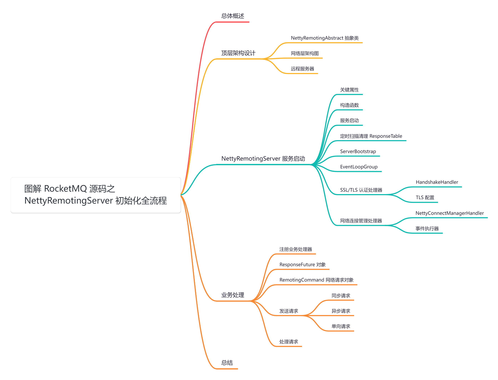

## **01 总体概述**

我们知道 RocketMQ 通信模块基于 Netty 实现，总体代码量相对不多。主要是 「**NettyRemotingServer**」和「**NettyRemotingClient**」，分别对应通信的服务端和客户端。

如果你理解 Netty 示例，理解 RocketMQ 是如何基于 Netty 进行通信，只需要知道以下 4 点：

1.  [NettyRemotingServer](http://nettyremotingserver/) 如何初始化。
2.  [NettyRemotingClient](http://nettyremotingclient/) 初始化。
3.  如何基于 [NettyRemotingClient](http://nettyremotingclient/) 发送消息
4.  无论是客户端还是服务端收到数据后都需要 Handler 来处理。

在 [【生产者源码分析系列第六篇】图解 RocketMQ 源码之网络通讯组件 NettyRemotingClient 架构设计](https://articles.zsxq.com/id_zgofuq2lee3e.html) 这篇中已经剖析了网络通讯组件「**NettyRemotingClient**」，今天我们先来看下「**NettyRemotingServer**」是如何初始化和运行的。

## **02 顶层架构设计**

我们再来回顾下 RocketMQ 底层网络通讯顶层设计，其类图设计如下：

  

其类依赖关系详细图如下：

  

根据上图的整个通信类结构可以看到，[NettyRemotingAbstract](http://nettyremotingabstract/) 抽象类是真正实现「**处理请求命令**」、「**处理响应命令**」、「**发送同步请求**」、「**发送异步请求**」、「**发送单向请求**」等。

这里来简单的梳理下其调用关系：

1.  **RemotingService：**它是远程通信服务的**顶级接口**，内部定义了「**启动网络层**」、「**关闭网络层**」、「**注册请求前后的钩子**」等3个方法。
2.  **RemotingClient：**它是远程通信客户端接口，其继承 [RemotingService](http://remotingservice/)，另外扩展了「**获取/更新 NameServer 地址**」、「**同步、异步、单向**」3种请求、「**注册请求处理器**」、「**添加回调执行器**」等方法。
3.  **RemotingServer：**它是远程通信服务端接口，位于第二层，其继承 [RemotingService](http://remotingservice/)，另外扩展了「**注册请求处理器**」、「**获取<请求处理器,执行器>**」、「**同步、异步、单向**」3种请求等方法。
4.  **NettyRemotingAbstract：**它是 Netty 远程服务抽象类，位于第二层，内部封装了「**获取通道事件监听器**」、「**添加 Netty Event 到执行器中**」、「**处理消息接收**」、「**处理请求命令**」、「**处理返回命令**」、「**获取 RPC 钩子**」、「**获取回调执行器**」、「**同步、异步、单向**」3种请求实现方法。主要定义了 Server 和 client 公用的方法和属性：
5.  控制异步请求和单向请求的并发控制器 Semaphore。
6.  响应对象映射表：[protected final ConcurrentMap<Integer /\* opaque \*/, ResponseFuture> responseTable](http://protected%20final%20concurrentmapinteger%20/*%20opaque%20*/,%20ResponseFuture%20responseTable)。
7.  请求处理器映射表：[protected final HashMap<Integer/\* request code \*/, Pair<NettyRequestProcessor, ExecutorService>> processorTable](http://protected%20final%20hashmapinteger/*%20request%20code%20*/,%20PairNettyRequestProcessor,%20ExecutorService%20processorTable)。
8.  Netty 事件监听线程池：[protected final NettyEventExecutor nettyEventExecutor](http://protected%20final%20nettyeventexecutor%20nettyeventexecutor/)。
9.  默认的请求处理器对：[protected Pair<NettyRequestProcessor, ExecutorService> defaultRequestProcessor](http://protected%20PairNettyRequestProcessor,%20ExecutorService%20defaultRequestProcessor%E9%92%A9%E5%AD%90%E9%9B%86%E5%90%88%EF%BC%9Aprotected%20ListRPCHook%20rpcHooks)
10.  [钩子集合：protected List<RPCHook> rpcHooks](http://protected%20PairNettyRequestProcessor,%20ExecutorService%20defaultRequestProcessor%E9%92%A9%E5%AD%90%E9%9B%86%E5%90%88%EF%BC%9Aprotected%20ListRPCHook%20rpcHooks)。
11.  **NettyRemotingClient：**它是 Netty 远程通信客户端类，其继承自 [NettyRemotingAbstract](http://nettyremotingabstract/) 实现了[RemotingClient](http://remotingclient/) 接口，复写「**同步、异步、单向**」3种请求，扩展了「**关闭通道**」方法。
12.  **NettyRemotingServer：**它是 Netty 远程通信服务端类，其继承自 [NettyRemotingAbstract](http://nettyremotingabstract/) 实现了[RemotingServer](http://remotingserver/) 接口，复写「**同步、异步、单向**」3种请求。

在 RocketMQ 中自定义了**通信协议并在 Netty 的基础上扩展了通信模块**。

首先通信的两端分为「**客户端**」和「**服务端**」，客户端和服务端都有「**启动**」、「**关闭**」的方法，为了在处理请求之前和返回响应之后做一些事情，采用「**钩子机制**」来扩展，所以还需要一个「**注册钩子**」的方法，定义的客户端和服务端的公共接口。

## **2.1 NettyRemotingAbstract 抽象类**

[NettyRemotingAbstract](http://nettyremotingabstract/) 类是客户端具体实现类 [NettyRemotingClient](http://nettyremotingclient/) 和服务端具体实现类[NettyRemotingServer](http://nettyremotingserver/) 的抽象类，[NettyRemotingAbstract](http://nettyremotingabstract/) 类实现 [NettyRemotingClient](http://nettyremotingclient/) 和[NettyRemotingServer](http://nettyremotingserver/) 的一些公共方法，不同抽象方法交给 [NettyRemotingClient](http://nettyremotingclient/) 和 [NettyRemotingServer](http://nettyremotingserver/) 去具体实现。

点击查看 [【网络通信源码分析系列第二篇源码】图解 RocketMQ 源码之 NettyRemotingAbstract 抽象类实现](https://articles.zsxq.com/id_gid958lent4m.html)，这里不再展开，重点看下 [NettyRemotingServer](http://nettyremotingserver/) 该类的实现。

## **2.2 网络层架构图**

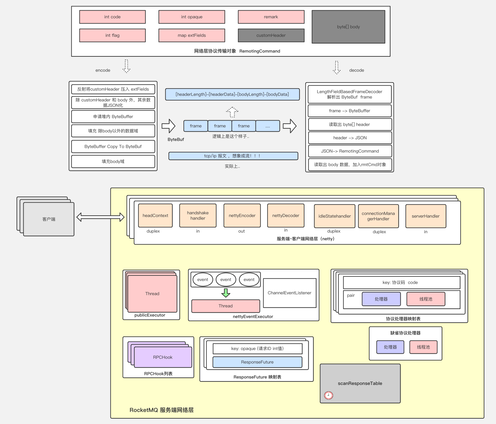

(图片来自网络)

## **2.3 远程服务器**

[NamesrvController](http://namesrvcontroller%20/) 中初始化创建了远程服务器 [RemotingServer](http://remotingserver/)，实现类为 [NettyRemotingServer](http://nettyremotingserver/)，并注册了默认的请求处理器 [DefaultRequestProcessor](http://defaultrequestprocessor/)，从这可以看出 RocketMQ 是基于 Netty 进行 RPC 网络通信的，这两个组件就是 [NameServer](http://nameserver%20/) 处理客户端请求的核心所在。

private void initiateNetworkComponents() {

// 创建 Netty 远程通信服务器，就是初始化 ServerBootstrap

this.remotingServer = new NettyRemotingServer(this.nettyServerConfig, this.brokerHousekeepingService);

....

}

private void initiateThreadExecutors() {

// 线程池队列

this.defaultThreadPoolQueue = new LinkedBlockingQueue<>(this.namesrvConfig.getDefaultThreadPoolQueueCapacity());

// 业务处理线程池，默认线程数 8 个

this.defaultExecutor = new ThreadPoolExecutor(this.namesrvConfig.getDefaultThreadPoolNums(), this.namesrvConfig.getDefaultThreadPoolNums(), 1000 \* 60, TimeUnit.MILLISECONDS, this.defaultThreadPoolQueue, new ThreadFactoryImpl("RemotingExecutorThread\_")) {

@Override

protected <T> RunnableFuture<T> newTaskFor(final Runnable runnable, final T value) {

return new FutureTaskExt<>(runnable, value);

}

};

}

private void registerProcessor() {

if (namesrvConfig.isClusterTest()) {

this.remotingServer.registerDefaultProcessor(new ClusterTestRequestProcessor(this, namesrvConfig.getProductEnvName()), this.defaultExecutor);

} else {

// Support get route info only temporarily

ClientRequestProcessor clientRequestProcessor \= new ClientRequestProcessor(this);

this.remotingServer.registerProcessor(RequestCode.GET\_ROUTEINFO\_BY\_TOPIC, clientRequestProcessor, this.clientRequestExecutor);

// 注册默认处理器和线程池

// 参数1:缺省协议处理器

// 参数2:处理器工作时使用的线程池，这里使用的是业务线程池

this.remotingServer.registerDefaultProcessor(new DefaultRequestProcessor(this), this.defaultExecutor);

}

}

## **03 NettyRemotingServer 服务启动**

[NettyRemotingSever](http://nettyremotingsever%20/) 作为 Server 端的底层，实现了核心的业务逻辑。

源码位置：[https://github.com/apache/rocketmq/blob/release-5.1.2/](https://github.com/apache/rocketmq/blob/release-5.1.2/remoting/src/main/java/org/apache/rocketmq/remoting/netty/NettyRemotingServer.java)[remoting](https://github.com/apache/rocketmq/blob/release-5.1.2/remoting/src/main/java/org/apache/rocketmq/remoting/netty/NettyRemotingServer.java)[/src/main/java/org/apache/rocketmq/](https://github.com/apache/rocketmq/blob/release-5.1.2/remoting/src/main/java/org/apache/rocketmq/remoting/netty/NettyRemotingServer.java)[remoting](https://github.com/apache/rocketmq/blob/release-5.1.2/remoting/src/main/java/org/apache/rocketmq/remoting/netty/NettyRemotingServer.java)[/](https://github.com/apache/rocketmq/blob/release-5.1.2/remoting/src/main/java/org/apache/rocketmq/remoting/netty/NettyRemotingServer.java)[netty/NettyRemotingServer.j](https://github.com/apache/rocketmq/blob/release-5.1.2/remoting/src/main/java/org/apache/rocketmq/remoting/netty/NettyRemotingServer.java)[ava](https://github.com/apache/rocketmq/blob/release-5.1.2/remoting/src/main/java/org/apache/rocketmq/remoting/netty/NettyRemotingServer.java)

我们先来看下该类的主要属性。

## **3.1 关键属性**

public class NettyRemotingServer extends NettyRemotingAbstract implements RemotingServer {

// netty 服务端启动对象

private final ServerBootstrap serverBootstrap;

// worker 组线程池 负责处理网络IO请求读取和处理的线程组

private final EventLoopGroup eventLoopGroupSelector;

// boss 组线程池 负责和客户端建立网络连接的线程组

private final EventLoopGroup eventLoopGroupBoss;

// netty 服务端网络配置

private final NettyServerConfig nettyServerConfig;

// 业务公共线程池，注册处理器的时候如果没有指定线程池，则使用此线程池

private final ExecutorService publicExecutor;

// 调度任务服务

private final ScheduledExecutorService scheduledExecutorService;

// 通道事件监听器

// \[namesrv使用\]HouseKeepingService BrokerHouseKeepingService|\[broker使用\] ClientHouseKeepingservice

private final ChannelEventListener channelEventListener;

// 定时器，执行scanResponseTable任务

private final HashedWheelTimer timer \= new HashedWheelTimer(r -> new Thread(r, "ServerHouseKeepingService"));

// 默认执行器线程组 当向 channelPipeline 添加 handler 时 ，指定了 group 时，网络事件传播到当前 handler 时，事件处理由分配给 handler 的线程执行

private DefaultEventExecutorGroup defaultEventExecutorGroup;

/\*\*

\* NettyRemotingServer may hold multiple SubRemotingServer, each server will be stored in this container with a ListenPort key.

\*/

private final ConcurrentMap<Integer/\*Port\*/, NettyRemotingAbstract> remotingServerTable = new ConcurrentHashMap<>();

public static final String HANDSHAKE\_HANDLER\_NAME \= "handshakeHandler";

public static final String TLS\_HANDLER\_NAME \= "sslHandler";

public static final String FILE\_REGION\_ENCODER\_NAME \= "fileRegionEncoder";

// TCP SSL 握手处理器

private HandshakeHandler handshakeHandler;

// 协议编码处理器

private NettyEncoder encoder;

// 连接管理器

private NettyConnectManageHandler connectionManageHandler;

// Netty 服务端核心业务处理器

private NettyServerHandler serverHandler;

private RemotingCodeDistributionHandler distributionHandler;

....

}

从上面可以看出，[NettyRemotingServer](http://nettyremotingserver%20/) 类继承了 [NettyRemotingAbstract](http://nettyremotingabstract/) 方法，并且实现了 [RemotingServer](http://remotingserver/) 接口。

[NettyRemotingAbstract](http://nettyremotingabstract%20/) 的核心原理就是「**发送请求**」和「**处理响应**」，「**发送请求**」时支持「**同步执行**」、「**异步执行**」、「**OneWay 执行**」三种方式。建议先看下 [NettyRemotingAbstract 的实现原理](http://xn--%20rocketmq%20%20nettyremotingabstract%20-hq13bib8584zencf8xirylxaz53qwm8bm5xesn8bts9dua4033esq9bva3318blqh6mlvzh5t6aumgr83qf57aok3c/)，有助于理解服务端实现。

[NettyRemotingServer](http://nettyremotingserver%20/) 的成员属性很好理解，主要就是 Netty 服务器相关的组件：

1.  [ServerBootstrap](http://serverbootstrap/)：Netty 服务器启动类。
2.  [EventLoopGroup](http://eventloopgroup/)：工作线程组，有 [bossGroup](http://bossgroup%20/) 和 [workerGroup](http://workergroup/)。
3.  处理器：[HandshakeHandler](http://handshakehandler/)、[NettyEncoder](http://nettyencoder/)、[NettyConnectManageHandler](http://nettyconnectmanagehandler/)、[NettyServerHandler](http://nettyserverhandler%20/) 等。

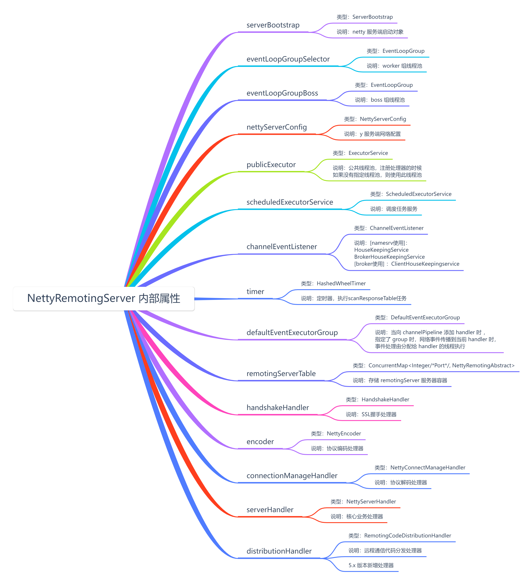

## **3.2 构造函数**

我们都知道，5.x 版本对 4.9.x 版本的源码进行了重构和封装，所以看起来比较清爽。

[NettyRemotingServer](http://nettyremotingserver%20/) 构造方法需要 [NettyServerConfig](http://nettyserverconfig/) 和 [ChannelEventListener](http://channeleventlistener/) 两个组件，[NettyServerConfig](http://nettyserverconfig%20/) 是 Netty 服务端相关配置。[ChannelEventListener](http://channeleventlistener%20/) 是网络连接事件处理器。

[NettyRemotingServer](http://nettyremotingserver%20/) 初始化的流程主要如下：

1.  创建 Netty 服务器 [ServerBootstrap](http://serverbootstrap/)。
2.  创建固定线程数的公共执行器，默认的线程数为 4。
3.  根据不同平台，使用不同的 [EventLoopGroup](http://eventloopgroup/)。
4.  最后加载 SSL 配置。

如下：

public NettyRemotingServer(final NettyServerConfig nettyServerConfig,

final ChannelEventListener channelEventListener) {

// 服务器向客户端主动发起请求时并发限制。

// 1、单向请求的并发限制

// 2、异步请求的并发限制

// OneWay 和异步请求 的请求信号量限制，默认为 256、64

super(nettyServerConfig.getServerOnewaySemaphoreValue(), nettyServerConfig.getServerAsyncSemaphoreValue());

// Netty 服务端启动类

this.serverBootstrap = new ServerBootstrap();

// Netty 配置

this.nettyServerConfig = nettyServerConfig;

// 通道事件监听器

this.channelEventListener = channelEventListener;

// 公共线程池，用于执行回调

this.publicExecutor = buildPublicExecutor(nettyServerConfig);

// 创建公共线程池

this.scheduledExecutorService = buildScheduleExecutor();

// 创建两个 netty 的线程组，一个是boss组，一个是worker组。

this.eventLoopGroupBoss = buildBossEventLoopGroup();

this.eventLoopGroupSelector = buildEventLoopGroupSelector();

// 加载 SSL 配置

loadSslContext();

}

// 公共线程池的线程数量，默认给的 0，这里最终修改为 4。

private ExecutorService buildPublicExecutor(NettyServerConfig nettyServerConfig) {

// Netty 公共线程池线程数，默认为 0

int publicThreadNums \= nettyServerConfig.getServerCallbackExecutorThreads();

if (publicThreadNums <= 0) {

publicThreadNums = 4;

}

// 公共线程池，用于执行回调

return Executors.newFixedThreadPool(publicThreadNums, new ThreadFactoryImpl("NettyServerPublicExecutor\_"));

}

// 调度任务服务

private ScheduledExecutorService buildScheduleExecutor() {

return new ScheduledThreadPoolExecutor(1,

new ThreadFactoryImpl("NettyServerScheduler\_", true),

new ThreadPoolExecutor.DiscardOldestPolicy());

}

// 创建 netty boss 线程组，eventLoopGroupBoss 负责监听 TCP 网络连接请求

private EventLoopGroup buildBossEventLoopGroup() {

// Linux 平台下使用 epoll

// boss group：负责和客户端建立网络连接的线程组，只有一个线程

if (useEpoll()) {

// epoch 模型

return new EpollEventLoopGroup(1, new ThreadFactoryImpl("NettyEPOLLBoss\_"));

} else {

// nio 模型

return new NioEventLoopGroup(1, new ThreadFactoryImpl("NettyNIOBoss\_"));

}

}

// 创建 netty worker 线程组，是在 eventLoopGroupBoss 接受到连接的时候，它负责将建立好连接的 socket注册到 selector 上去

private EventLoopGroup buildEventLoopGroupSelector() {

// worker group：负责处理网络IO请求读取和处理的线程组，默认是3个线程

if (useEpoll()) {

// epoch 模型

return new EpollEventLoopGroup(nettyServerConfig.getServerSelectorThreads(), new ThreadFactoryImpl("NettyServerEPOLLSelector\_"));

} else {

// nio 模型

return new NioEventLoopGroup(nettyServerConfig.getServerSelectorThreads(), new ThreadFactoryImpl("NettyServerNIOSelector\_"));

}

}

从构造函数可以看出：

1.  从 NettyServerConfig 获取并发控制参数，初始化父类。
2.  单向请求的并发限制。
3.  异步请求的并发限制。
4.  创建 Netty Server ServerBootStrap
5.  创建公共线程池，指定线程数为 4，同时指定线程工厂，设置线程名称的前缀 [NettyServerPublicExecutor\_](http://nettyserverpublicexecutor_/)。
6.  根据是否使用 epoll 函数，来创建 2 个 Netty 线程组。
7.  一个boss 线程组，[eventLoopGroupBoss](http://eventloopgroupboss%20/) 负责监听 TCP 网络连接请求。
8.  一个 worker 线程组，是在 [eventLoopGroupBoss](http://eventloopgroupboss%20/) 接受到连接的时候，它负责将建立好连接的 socket 注册到 selector 上去。

## **3.3 服务启动**

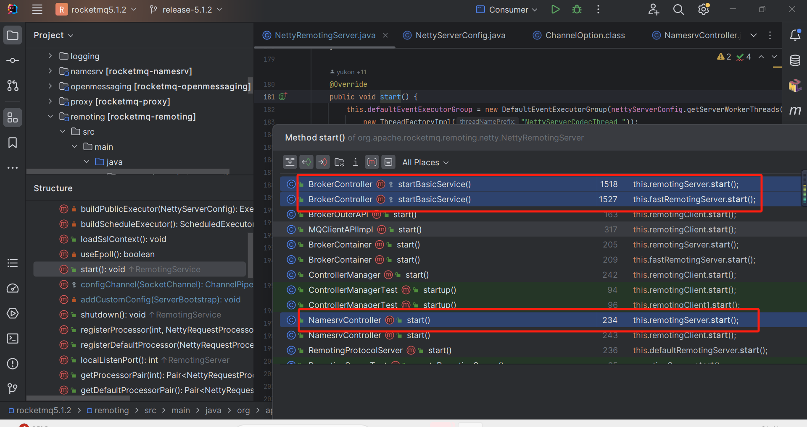

可以看到在「**NameServer**」、「**Broker**」启动服务时会启动 「**NettyRemotingServer**」服务，我们来看看 「**NettyRemotingServer**」服务启动时都干了什么？

// 启动 Netty 服务器

@Override

public void start() {

// 1、创建默认的事件处理器线程组，当向 ChannelPipeline 添加 Handler 时，如果指定了线程组，那么当网络事件传递到当前 Handler 时，事件由指定的线程组线程执行。

this.defaultEventExecutorGroup = new DefaultEventExecutorGroup(nettyServerConfig.getServerWorkerThreads(),

new ThreadFactoryImpl("NettyServerCodecThread\_"));

// 2、初始化共享的处理器 Handler，注意：这里会初始化一个 NettyServerHandler，这个类是当前类的内部类，它是一个入站缓冲区处理器，重写了 channelRead0 方法，也就是请求处理的入口函数。

prepareSharableHandlers();

// 3、Netty 经典的启动流程，根据构造函数传进来的 NettyServerConfig 来配置启动参数启动 Netty

// 配置服务端启动对象

// 配置工作组 boss 和 worker 组，这里 eventLoopGroupBoss 认为是 mainReactor，eventLoopGroupSelector 认为是 subReactor

// 这里的 Worker 线程池是专门用于处理 Netty 网络通信相关的（包括编码/解码、空闲链接管理、网络连接管理以及网络请求处理）

// RocketMQ -> Java NIO的1+N+M模型：1个acceptor线程，N个IO线程，M1个worker 线程。

serverBootstrap.group(this.eventLoopGroupBoss, this.eventLoopGroupSelector)

// 设置网络通信通道，负责监听指定的端口。根据是否支持 epoll 设置服务端 ServerSocketChannel 类型

.channel(useEpoll() ? EpollServerSocketChannel.class : NioServerSocketChannel.class)

// 设置服务端 ch 选项

/\*\*

\* SO\_BACKLOG 设置全连接队列大小，默认 1024

\* 对应的是tcp/ip协议listen函数中的backlog参数，函数listen用来初始化服务端可连接队列，服务端处理客户端连接请求是顺序处理的，所以同一时间只能处理一个客户端连接，多个客户端来的时候，

服务端将不能处理的客户端连接请求放在队列中等待处理，backlog参数指定了队列的大小

\*/

.option(ChannelOption.SO\_BACKLOG, 1024)

// SO\_REUSEADDR 让端口释放后立即就可以被再次使用，允许重复使用本地地址和端口

.option(ChannelOption.SO\_REUSEADDR, true)

// RocketMQ 有心跳机制，长连接属性设置 false

.childOption(ChannelOption.SO\_KEEPALIVE, false)

// 禁止使用 Nagle 算法，Nagle 算法的作用是减少小包的数量

.childOption(ChannelOption.TCP\_NODELAY, true)

// 绑定本地监听的端口，配置的为 9876

.localAddress(new InetSocketAddress(this.nettyServerConfig.getBindAddress(),

this.nettyServerConfig.getListenPort()))

// 添加处理器

// 初始化客户端 ch pipeline 的逻辑, 同时指定了线程池为 defaultEventExecutorGroup

.childHandler(new ChannelInitializer<SocketChannel>() {

@Override

public void initChannel(SocketChannel ch) {

// 当 Worker 线程拿到网络数据后，就交给 Netty 的 ChannelPipeline（其采用责任链设计模式），从 Head 到 Tail 的一个个 Handler 执行下去，这些 Handler 是在创建 NettyRemotingServer 实例时候指定的。

configChannel(ch);

}

});

// 添加客户端配置

addCustomConfig(serverBootstrap);

try {

// 服务器绑定端口

ChannelFuture sync \= serverBootstrap.bind().sync();

InetSocketAddress addr \= (InetSocketAddress) sync.channel().localAddress();

if (0 == nettyServerConfig.getListenPort()) {

this.nettyServerConfig.setListenPort(addr.getPort());

}

log.info("RemotingServer started, listening {}:{}", this.nettyServerConfig.getBindAddress(),

this.nettyServerConfig.getListenPort());

this.remotingServerTable.put(this.nettyServerConfig.getListenPort(), this);

} catch (Exception e) {

throw new IllegalStateException(String.format("Failed to bind to %s:%d", nettyServerConfig.getBindAddress(),

nettyServerConfig.getListenPort()), e);

}

// 4、channel状态监听器不为空， 则创建网络事件执行器

if (this.channelEventListener != null) {

this.nettyEventExecutor.start();

}

// 5、提交定时任务，每秒执行一次

TimerTask timerScanResponseTable \= new TimerTask() {

@Override

public void run(Timeout timeout) {

try {

// 扫描 responseTable 表，将过期的 responseFuture 移除

NettyRemotingServer.this.scanResponseTable();

} catch (Throwable e) {

log.error("scanResponseTable exception", e);

} finally {

timer.newTimeout(this, 1000, TimeUnit.MILLISECONDS);

}

}

};

this.timer.newTimeout(timerScanResponseTable, 1000 \* 3, TimeUnit.MILLISECONDS);

// 定时任务

scheduledExecutorService.scheduleWithFixedDelay(() -> {

try {

NettyRemotingServer.this.printRemotingCodeDistribution();

} catch (Throwable e) {

TRAFFIC\_LOGGER.error("NettyRemotingServer print remoting code distribution exception", e);

}

}, 1, 1, TimeUnit.SECONDS);

}

启动「**NettyRemotingServer**」服务，主要做了以下几件事情：

1.  创建默认的事件处理器线程组 DefaultEventExecutorGroup，这个主要用于执行自定义的处理器的业务逻辑。当向 [ChannelPipeline](http://channelpipeline%20/) 添加 Handler 时，如果指定了线程组，那么当网络事件传递到当前 Handler 时，事件由指定的线程组线程执行。
2.  初始化共享的处理器 Handler，就是成员属性中的 [HandshakeHandler](http://handshakehandler/)、[NettyEncoder](http://nettyencoder/)、[NettyConnectManageHandler](http://nettyconnectmanagehandler/)、[NettyServerHandler](http://nettyserverhandler%20/) 几个处理器。注意：这里会初始化一个 [NettyServerHandler](http://nettyserverhandler/)，这个类是当前类的内部类，它是一个入站缓冲区处理器，重写了 [channelRead0](http://channelread0%20/) 方法，也就是请求处理的入口函数。
3.  接着就是最核心的配置 [ServerBootstrap](http://serverbootstrap/)，添加一系列的处理器，然后绑定（bind）监听的端口（9876），这是 Netty 经典的启动流程，根据构造函数传进来的 [NettyServerConfig](http://nettyserverconfig/) 来配置启动参数启动 Netty。
4.  如果存在 [Channel](http://channel/) 事件监听器，那么就创建网络事件处理器 [NettyEventExecutor](http://nettyeventexecutor/)。它是 [NettyRemotingAbstract](http://nettyremotingabstract%20/) 中定义的，主要的作用就是处理 Netty 事件。
5.  最后启动一个定时任务，提交定时任务每秒执行 1 次，扫描 [ResponeseFuture](http://responesefuture/)，将过期的 [Response Future](http://response%20future/) 剔除。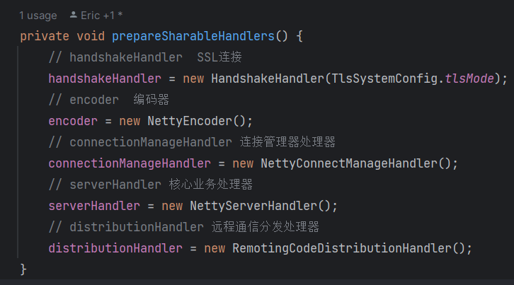

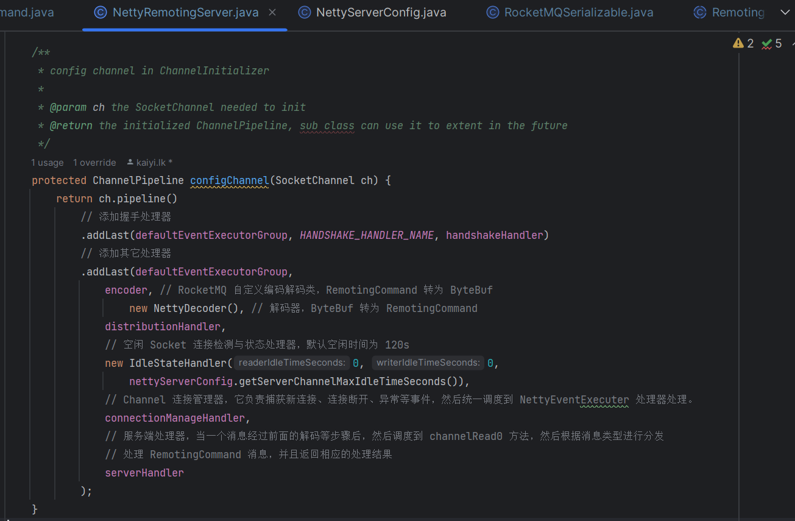

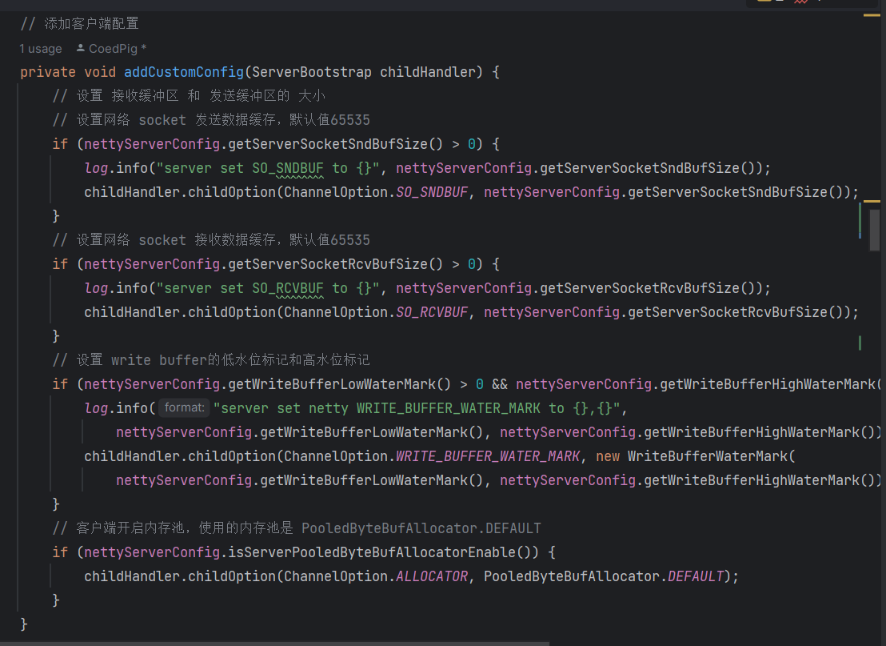

由于之前我们剖析过了「**NameServer**」的启动过程，这里通过一张图来展示下「**NameServer**」 服务端启动所做的事情。

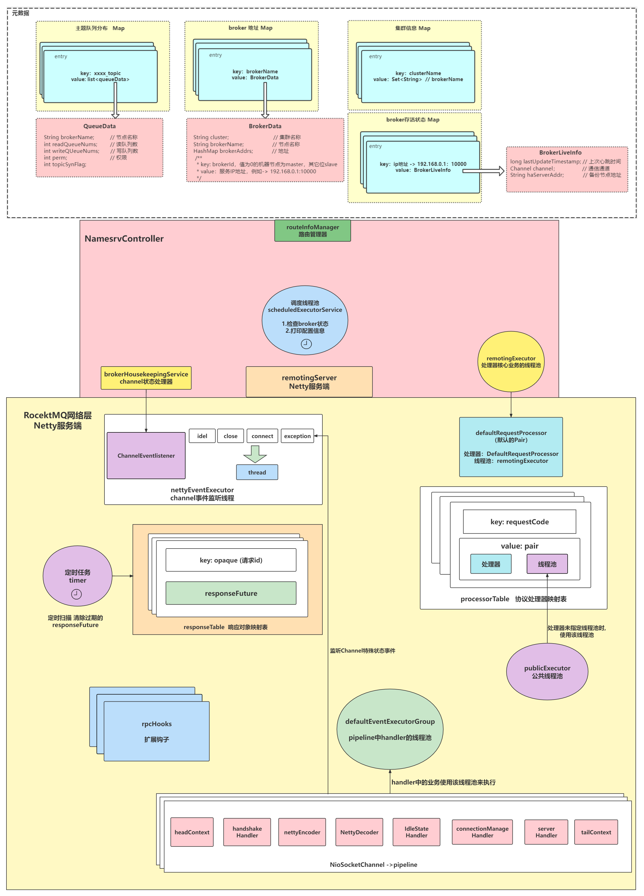

（图片来自网络）

## **3.4 定时扫描清理 ResponseTable**

在每次请求时，会将 [ResponseFuture](http://responsefuture%20/) 放入 [responseTable](http://responsetable%20/) 中缓存，定时任务每隔1秒调用一次 [scanResponseTable](http://scanresponsetable/)，通过定时扫描 [responseTable](http://responsetable/) 响应表中的 value，根据 [ResponseFuture](http://responsefuture/) 记录的开始时间和超时时间来判断是否超时，如果请求超时了，就将其从响应表移除，并释放占用的资源（信号量），并且对于超时的请求，会直接执行回调。

其实我们就是要注意对于内存表中的数据，一定要有过期机制，比如这里采用的定时任务扫描过期的数据，然后从内存表中移除，避免内存表越来越大而发生 [OOM](http://oom%20/) 的情况。

public void scanResponseTable() {

final List<ResponseFuture> rfList = new LinkedList<>();

Iterator<Entry<Integer, ResponseFuture>> it = this.responseTable.entrySet().iterator();

// 1、循环遍历 ResponseTable，如果超时了就释放信号量，从映射表移除 Response Future，并加入到被移除的Future集合

while (it.hasNext()) {

Entry<Integer, ResponseFuture> next = it.next();

ResponseFuture rep \= next.getValue();

// 当前时间大于请求开始时间 + 超时等待时间 + 1秒，则认为该请求已超时，然后释放资源并移除该元素

if ((rep.getBeginTimestamp() + rep.getTimeoutMillis() + 1000) <= System.currentTimeMillis()) {

rep.release(); // 释放资源

it.remove(); // 移除该元素

rfList.add(rep); // 添加到 ResponseFuture List

log.warn("remove timeout request, " + rep);

}

}

// 2、遍历所有超时被移除的 ResponseFuture 执行回调逻辑，防止调用的业务线程一直阻塞。

for (ResponseFuture rf : rfList) {

try {

executeInvokeCallback(rf);

} catch (Throwable e) {

log.warn("scanResponseTable, operationComplete Exception", e);

}

}

}

1.  循环遍历 [ResponseTable](http://responsetable/)，如果超时了就释放信号量，从映射表移除 [ResponseFuture](http://responsefuture/)，并加入到被移除的 Future 集合。
2.  遍历所有被移除的 [ResponseFuture](http://responsefuture%20/) 执行回调逻辑，防止调用的业务线程一直阻塞。

> 这里扫描主要是为了保证正常业务执行。服务端发往客户端的异步请求成功了，但是客户端处理过程超时了，这时就需要服务端自管理的方式释放锁资源，防止资源被无效占用，阻塞正常业务的执行。

## **3.5 ServerBootstrap**

[ServerBootstrap](http://serverbootstrap%20/) 的配置其实就是标准的 Netty 服务器的配置，看着是不是很熟悉。

网络连接的一些配置如下：

1.  [SO\_BACKLOG](http://so_backlog/)：全连接队列大小，通过serverSocketBacklog配置，默认 1024。
2.  [SO\_REUSEADDR](http://so_reuseaddr/)：端口释放后立即就可以被再次使用，默认 true。
3.  [SO\_KEEPALIVE](http://so_keepalive/)：是否保持网络连接，默认 false。
4.  [TCP\_NODELAY](http://tcp_nodelay/)：禁用 Nagle 算法，默认 true。
5.  [SO\_SNDBUF](http://so_sndbuf/)：TCP发送缓冲区的容量上限，通过 [serverSocketSndBufSize](http://serversocketsndbufsize/) 配置，默认 0，一般系统默认 64k。
6.  [SO\_RCVBUF](http://so_rcvbuf/)：TCP接受缓冲区的容量上限，通过 [serverSocketRcvBufSize](http://serversocketrcvbufsize/) 配置，默认 0，一般系统默认 64k。
7.  [WRITE\_BUFFER\_WATER\_MARK](http://write_buffer_water_mark/)：配置内核缓冲区高低水位线，通过writeBufferHighWaterMark配置，默认 0。
8.  [ALLOCATOR](http://allocator/)：设置Buffer分配器，采用池化的模式，默认开启。

[ServerBootstrap](http://serverbootstrap%20/) 依次添加了如下几个处理器：

1.  [HandshakeHandler](http://handshakehandler/)：SSL/TLS 握手处理器。
2.  [NettyEncoder](http://nettyencoder/)：编码器。
3.  [NettyDecoder](http://nettydecoder/)：解码器。
4.  [IdleStateHandler](http://idlestatehandler/)：空闲状态处理器。
5.  [NettyConnectManageHandler](http://nettyconnectmanagehandler/)：网络连接管理器。
6.  [NettyServerHandler](http://nettyserverhandler/)：服务端处理器。

## **3.6 EventLoopGroup**

在初始化 [EventLoopGroup](http://eventloopgroup%20/) 时，如果当前系统是 Linux 平台，且支持 [epoll](http://epoll/)，则创建 [EpollEventLoopGroup](http://epolleventloopgroup/)，否则创建 [NioEventLoopGroup](http://nioeventloopgroup/)。

epoll 是支持 I/O 多路复用的系统调用，是实现高性能网络服务器的关键。

private boolean useEpoll() {

return NetworkUtil.isLinuxPlatform()

&& nettyServerConfig.isUseEpollNativeSelector()

&& Epoll.isAvailable();

}

需要注意的是，在 [NettyServerConfig](http://nettyserverconfig%20/) 中 [useEpollNativeSelector](http://useepollnativeselector%20/) 默认为 false，在 Linux 平台上建议修改为 true。

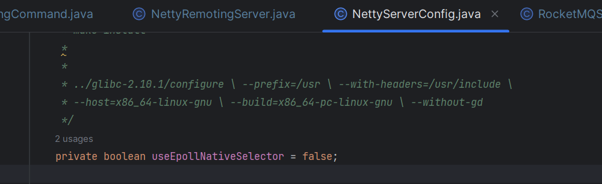

[EventLoopGroup](http://eventloopgroup%20/) 需要创建两个：

1.  [eventLoopGroupBoss](http://eventloopgroupboss/)：负责和客户端建立网络连接的线程组，固定只有一个线程。
2.  [eventLoopGroupSelector](http://eventloopgroupselector/)：负责处理网络IO请求读取和处理的线程组，默认是3个线程。

[eventLoopGroupSelector](http://eventloopgroupselector%20/) 是 [workerGroup](http://workergroup/)，默认 3 个线程，通过 [serverSelectorThreads](http://serverselectorthreads%20/) 配置。

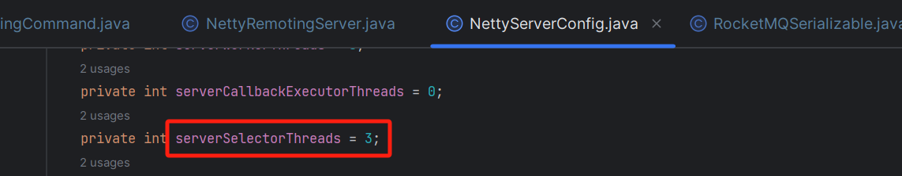

需要注意的是，真正的业务处理并不是在 [eventLoopGroupSelector](http://eventloopgroupselector%20/) 中进行，[eventLoopGroupSelector](http://eventloopgroupselector%20/) 实际上只负责「**网络 I/O**」以及「**序列化**」。真正的业务处理在 [NettyRemotingAbstract](http://nettyremotingabstract%20/)，业务处理会封装成一个 [Runnable](http://runnable/)，提交到「**处理器所绑定的线程池**」中异步处理。

而这个线程池的线程数由 [serverWorkerThreads](http://serverworkerthreads%20/) 配置，默认为 8。所以如果要调整业务线程池线程数应该修改这个配置值。

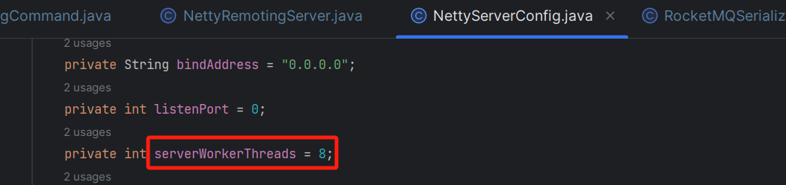

## **3.7 SSL/TLS 认证处理器**

服务端 [ChannelPipeline](http://channelpipeline%20/) 添加的第一个处理器是 [HandshakeHandler](http://handshakehandler/)，它是在网络连接建立握手时的处理器，在握手时判断是否要「**SSL/TLS**」加密传输，如果要加密传输，则添加 [SslHandler](http://sslhandler/)。

## **3.7.1 HandshakeHandler**

[HandshakeHandler](http://handshakehandler%20/) 是一个通道输入处理器，它的主要功能是判断客户端是否要建立 SSL/TLS 连接，如果是的，则向 [ChannelPipeline](http://channelpipeline/) 中添加 [SslHandler](http://sslhandler%20/) 和 [FileRegionEncoder](http://fileregionencoder%20/) 两个处理器。

客户端如果要开启「**SSL/TLS**」加密功能，也需要添加 [SslHandler](http://sslhandler%20/) 处理器，它会在发送数据时对「**数据加密**」，服务端接收到数据时则对「**数据解密**」。

@ChannelHandler.Sharable

public class HandshakeHandler extends SimpleChannelInboundHandler<ByteBuf> {

// 模式：DISABLED（禁用）、PERMISSIVE（可选的）、ENFORCING（强制加密）

private final TlsMode tlsMode;

// 建立 SSL 握手标识

private static final byte HANDSHAKE\_MAGIC\_CODE \= 0x16;

HandshakeHandler(TlsMode tlsMode) {

this.tlsMode = tlsMode;

}

@Override

protected void channelRead0(ChannelHandlerContext ctx, ByteBuf msg) {

// 读取第一个字节

// Peek the first byte to determine if the content is starting with TLS handshake

byte b \= msg.getByte(0);

// SSL/TLS 握手

if (b == HANDSHAKE\_MAGIC\_CODE) {

switch (tlsMode) {

case DISABLED:

// 服务端禁用 SSL，客户端开启 SSL，关闭通道

ctx.close();

log.warn("Clients intend to establish an SSL connection while this server is running in SSL disabled mode");

break;

case PERMISSIVE:

case ENFORCING:

if (null != sslContext) {

// 如果需要加密，添加 SslHandler、FileRegionEncoder 两个处理器

ctx.pipeline()

.addAfter(defaultEventExecutorGroup, HANDSHAKE\_HANDLER\_NAME, TLS\_HANDLER\_NAME, sslContext.newHandler(ctx.channel().alloc()))

.addAfter(defaultEventExecutorGroup, TLS\_HANDLER\_NAME, FILE\_REGION\_ENCODER\_NAME, new FileRegionEncoder());

log.info("Handlers prepended to channel pipeline to establish SSL connection");

} else {

ctx.close();

log.error("Trying to establish an SSL connection but sslContext is null");

}

break;

default:

log.warn("Unknown TLS mode");

break;

}

} else if (tlsMode == TlsMode.ENFORCING) {

ctx.close(); // 强制 SSL 校验，客户端没有 SSL 认证，则直接关闭通道

log.warn("Clients intend to establish an insecure connection while this server is running in SSL enforcing mode");

}

try {

// Remove this handler

// 移除当前处理器，避免循环处理

ctx.pipeline().remove(this);

} catch (NoSuchElementException e) {

log.error("Error while removing HandshakeHandler", e);

}

// 触发后续的处理器继续操作

// Hand over this message to the next .

ctx.fireChannelRead(msg.retain());

}

}

## **3.7.2 TLS 配置**

[NettyRemotingServer](http://nettyremotingserver%20/) 构造方法中，最后一步调用 [loadSslContext()](http://%20loadsslcontext\(\)/) 来加载 [SslContext](http://sslcontext/)，从这段代码可以知道 TLS 的配置属性在 [TlsSystemConfig](http://tlssystemconfig%20/) 中。

public void loadSslContext() {

TlsMode tlsMode \= TlsSystemConfig.tlsMode;

log.info("Server is running in TLS {} mode", tlsMode.getName());

if (tlsMode != TlsMode.DISABLED) {

try {

sslContext = TlsHelper.buildSslContext(false);

log.info("SSLContext created for server");

} catch (CertificateException | IOException e) {

log.error("Failed to create SSLContext for server", e);

}

}

}

经过剖析源码可以得知，TLS 的配置文件默认路径为 [/etc/rocketmq/tls.properties](http://etc/rocketmq/tls.properties)，也可以通过系统参数 [tls.config.file](http://tls.config.file/) 指定配置文件的路径。

在 [TlsSystemConfig](http://tlssystemconfig%20/) 中可以看到有如下的一些配置参数。

public class TlsSystemConfig {

// TLS 模式，有 disabled、permissive、enforcing 三种，默认为 permissive

public static final String TLS\_SERVER\_MODE \= "tls.server.mode";

public static final String TLS\_ENABLE \= "tls.enable";

// TLS 配置文件路径，默认为 /etc/rocketmq/tls.properties

public static final String TLS\_CONFIG\_FILE \= "tls.config.file";

// 测试模式，默认 true

public static final String TLS\_TEST\_MODE\_ENABLE \= "tls.test.mode.enable";

// Server 端是否对 Client 进行认证，默认 none

public static final String TLS\_SERVER\_NEED\_CLIENT\_AUTH \= "tls.server.need.client.auth";

// Server 端私钥路径

public static final String TLS\_SERVER\_KEYPATH \= "tls.server.keyPath";

// Server 端私钥密码

public static final String TLS\_SERVER\_KEYPASSWORD \= "tls.server.keyPassword";

// Server 端证书路径

public static final String TLS\_SERVER\_CERTPATH \= "tls.server.certPath";

// 是否严格认证客户端证书，默认 false

public static final String TLS\_SERVER\_AUTHCLIENT \= "tls.server.authClient";

// 信任 Client 端证书的证书

public static final String TLS\_SERVER\_TRUSTCERTPATH \= "tls.server.trustCertPath";

// Client 端私钥路径

public static final String TLS\_CLIENT\_KEYPATH \= "tls.client.keyPath";

// Client 端密码

public static final String TLS\_CLIENT\_KEYPASSWORD \= "tls.client.keyPassword";

// Client 端证书路径

public static final String TLS\_CLIENT\_CERTPATH \= "tls.client.certPath";

// 是否认证服务端的证书，默认 false

public static final String TLS\_CLIENT\_AUTHSERVER \= "tls.client.authServer";

// 信任证书路径

public static final String TLS\_CLIENT\_TRUSTCERTPATH \= "tls.client.trustCertPath";

}

## **3.8 网络连接管理处理器**

## **3****.8.1 NettyConnectManagerHandler**

[NettyConnectManageHandler](http://nettyconnectmanagehandler%20/) 的主要功能是，在各种事件发生时，如果连接「**激活**」、「**关闭**」、「**空闲**」、「**异常**」等事件发生时，去发布一个 Netty 事件。

@ChannelHandler.Sharable

public class NettyConnectManageHandler extends ChannelDuplexHandler {

....

// 连接激活

@Override

public void channelActive(ChannelHandlerContext ctx) throws Exception {

final String remoteAddress \= RemotingHelper.parseChannelRemoteAddr(ctx.channel());

log.info("NETTY SERVER PIPELINE: channelActive, the channel\[{}\]", remoteAddress);

super.channelActive(ctx);

// 发布连接事件

if (NettyRemotingServer.this.channelEventListener != null) {

NettyRemotingServer.this.putNettyEvent(new NettyEvent(NettyEventType.CONNECT, remoteAddress, ctx.channel()));

}

}

....

}

public enum NettyEventType {

CONNECT, // 建立连接

CLOSE, // 连接关闭

IDLE, // 连接空闲

EXCEPTION // 出现异常

}

## **3****.8.2 事件执行器**

发布事件都是在调用父类 [NettyRemotingAbstract#putNettyEvent](http://nettyremotingabstract/#putNettyEvent) 方法，父类封装了一个执行器 [NettyEventExecutor](http://nettyeventexecutor%20/) 来处理事件。

/\*\*

\* Put a netty event to the executor.

\* @param event Netty event instance.

\*/

public void putNettyEvent(final NettyEvent event) {

this.nettyEventExecutor.putNettyEvent(event);

}

[NettyEventExecutor](http://nettyeventexecutor%20/) 继承自 [ServiceThread](http://servicethread/)，[ServiceThread](http://servicethread%20/) 之前已经介绍过了，它会绑定一个线程在后台运行任务，并提供了优雅的线程终止方式。

[NettyEventExecutor](http://nettyeventexecutor%20/) 内部使用了一个「**阻塞队列**」来存放事件，然后不断从「**阻塞队列**」消费事件，根据事件类型触发对应的操作。

// NettyRemotingAbstract 子类

class NettyEventExecutor extends ServiceThread {

// 事件队列

private final LinkedBlockingQueue<NettyEvent> eventQueue = new LinkedBlockingQueue<>();

// 放入 Netty 事件

public void putNettyEvent(final NettyEvent event) {

int currentSize \= this.eventQueue.size();

int maxSize \= 10000; // 最大大小为 10000

if (currentSize <= maxSize) {

this.eventQueue.add(event);

} else {

// 超出队列大小直接丢弃...

log.warn("event queue size \[{}\] over the limit \[{}\], so drop this event {}", currentSize, maxSize, event.toString());

}

}

@Override

public void run() {

log.info(this.getServiceName() + " service started");

// 通道监听事件

final ChannelEventListener listener \= NettyRemotingAbstract.this.getChannelEventListener();

// 循环运行

while (!this.isStopped()) {

try {

// 消费队列中的事件

NettyEvent event \= this.eventQueue.poll(3000, TimeUnit.MILLISECONDS);

if (event != null && listener != null) {

switch (event.getType()) {

case IDLE:

listener.onChannelIdle(event.getRemoteAddr(), event.getChannel());

break;

case CLOSE:

listener.onChannelClose(event.getRemoteAddr(), event.getChannel());

break;

case CONNECT:

listener.onChannelConnect(event.getRemoteAddr(), event.getChannel());

break;

case EXCEPTION:

listener.onChannelException(event.getRemoteAddr(), event.getChannel());

break;

default:

break;

}

}

} catch (Exception e) {

log.warn(this.getServiceName() + " service has exception. ", e);

}

}

log.info(this.getServiceName() + " service end");

}

@Override

public String getServiceName() {

return NettyEventExecutor.class.getSimpleName();

}

}

[NettyEventExecutor](http://nettyeventexecutor%20/) 内部使用了阻塞队列 [LinkedBlockingQueue](http://linkedblockingqueue%20/) 来存放事件，控制的最大容量为 10000，可以看到，在 [putNettyEvent](http://putnettyevent/) 添加事件时，如果阻塞队列容量超过 10000 时，会直接丢弃这个事件，这种方式还是要考虑对业务没有太大的影响才可以丢弃。

需要注意的是，它这里的判断方式是「**非原子性**」的，可能会有「**并发问题**」，高并发时有可能「**阻塞队列**」的容量会超过 10000，不过从这里的场景来看这种误差是可以接受的。如果要保证并发的安全性，可以直接使用「**阻塞队列**」来控制容量，首先给队列设置大小，然后用 [offer()](http://offer\(\)/) 方法即可。

**04 业务处理**

## **4.1 注册业务处理器**

[NettyRemotingServer](http://nettyremotingserver%20/) 构造方法中创建了默认 4 个线程的公共执行器，这个线程池主要用在如下两个地方。

1、注册处理器时，如果没有传入线程池，则使用公共线程池。

// NettyRemotingAbstract 类属性

protected final HashMap<Integer/\* request code \*/, Pair<NettyRequestProcessor, ExecutorService>> processorTable = new HashMap<>(64);

// 注册业务处理器

@Override

public void registerProcessor(int requestCode, NettyRequestProcessor processor, ExecutorService executor) {

ExecutorService executorThis \= executor;

// 1、判断是否指定了业务处理线程池，没有就给处理器绑定公共业务线程池

// 线程池为 null，则默认用公共线程池

if (null == executor) {

executorThis = this.publicExecutor;

}

Pair<NettyRequestProcessor, ExecutorService> pair = new Pair<>(processor, executorThis);

// 2、将业务代码，处理器和对应的处理线程池添加到处理器映射表

this.processorTable.put(requestCode, pair);

}

// 注册默认业务处理器

@Override

public void registerDefaultProcessor(NettyRequestProcessor processor, ExecutorService executor) {

this.defaultRequestProcessorPair = new Pair<>(processor, executor);

}

都比较简单，来看下处理器映射表的结构示意图：

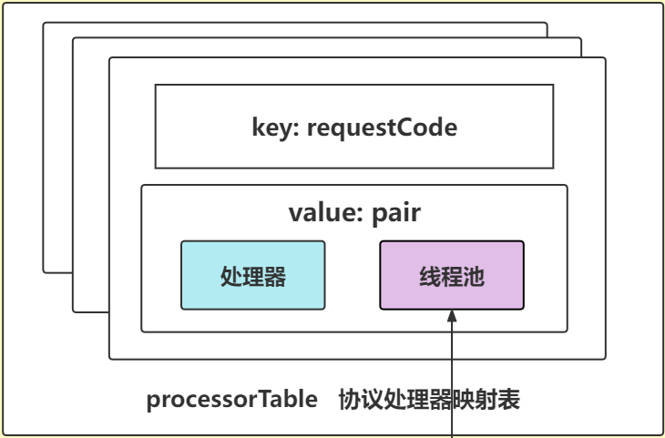

2、[NettyRemotingAbstract](http://nettyremotingabstract%20/) 中所需的回调线程池也是用的这个公共线程池

@Override

public ExecutorService getCallbackExecutor() {

return this.publicExecutor;

}

公共线程池的线程数通过 [serverCallbackExecutorThreads](http://servercallbackexecutorthreads%20/) 配置，如果需要调整可修改这个配置。

## **4.2 ResponseFuture 对象**

在每执行一次请求时，都会创建一个 [ResponseFuture](http://responsefuture/) 对象，该对象根据名字就可以看出是和响应信息相关的。在该对象中记录了请求的一些基本信息以及响应信息和回调方法等。

源码位置：[https://github.com/apache/rocketmq/blob/release-5.1.2/](https://github.com/apache/rocketmq/blob/release-5.1.2/remoting/src/main/java/org/apache/rocketmq/remoting/netty/ResponseFuture.java)[remoting](https://github.com/apache/rocketmq/blob/release-5.1.2/remoting/src/main/java/org/apache/rocketmq/remoting/netty/ResponseFuture.java)[/src/main/java/org/apache/rocketmq/](https://github.com/apache/rocketmq/blob/release-5.1.2/remoting/src/main/java/org/apache/rocketmq/remoting/netty/ResponseFuture.java)[remoting](https://github.com/apache/rocketmq/blob/release-5.1.2/remoting/src/main/java/org/apache/rocketmq/remoting/netty/ResponseFuture.java)[/](https://github.com/apache/rocketmq/blob/release-5.1.2/remoting/src/main/java/org/apache/rocketmq/remoting/netty/ResponseFuture.java)[netty/ResponseFuture.j](https://github.com/apache/rocketmq/blob/release-5.1.2/remoting/src/main/java/org/apache/rocketmq/remoting/netty/ResponseFuture.java)[ava](https://github.com/apache/rocketmq/blob/release-5.1.2/remoting/src/main/java/org/apache/rocketmq/remoting/netty/ResponseFuture.java)

public class ResponseFuture {

// 请求执行的 Channel

private final Channel channel;

// 一个对应于请求的序列号

private final int opaque;

// //封装的请求信息

private final RemotingCommand request;

// 请求超时时间

private final long timeoutMillis;

// 回调接口

private final InvokeCallback invokeCallback;

// 请求开始时间

private final long beginTimestamp \= System.currentTimeMillis();

// 对响应进行阻塞

private final CountDownLatch countDownLatch \= new CountDownLatch(1);

// 信号量资源

private final SemaphoreReleaseOnlyOnce once;

// 判断是否回调方法已执行，避免重复调用

private final AtomicBoolean executeCallbackOnlyOnce \= new AtomicBoolean(false);

// 封装的响应信息

private volatile RemotingCommand responseCommand;

// 记录是否请求发送成功

private volatile boolean sendRequestOK \= true;

// 异常信息

private volatile Throwable cause;

// 是否可中断

private volatile boolean interrupted \= false;

....

}

##   
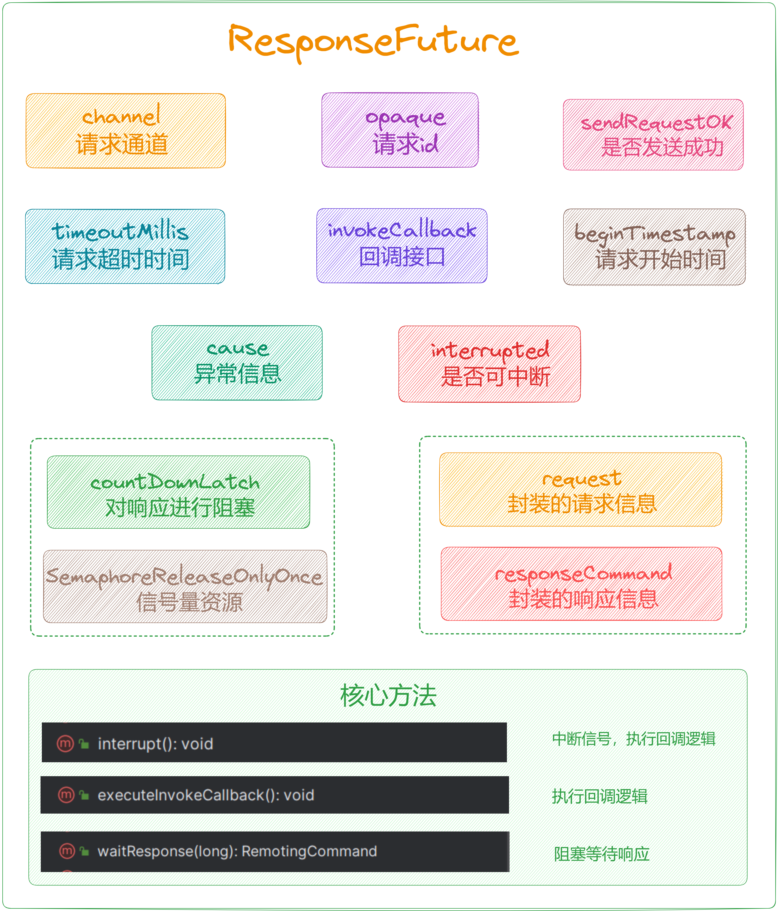

## **4.3 RemotingCommand 网络请求对象**

源码位置：[https://github.com/apache/rocketmq/blob/release-5.1.2/](https://github.com/apache/rocketmq/blob/release-5.1.2/remoting/src/main/java/org/apache/rocketmq/remoting/protocol/RemotingCommand.java)[remoting](https://github.com/apache/rocketmq/blob/release-5.1.2/remoting/src/main/java/org/apache/rocketmq/remoting/protocol/RemotingCommand.java)[/src/main/java/org/apache/rocketmq/](https://github.com/apache/rocketmq/blob/release-5.1.2/remoting/src/main/java/org/apache/rocketmq/remoting/protocol/RemotingCommand.java)[remoting](https://github.com/apache/rocketmq/blob/release-5.1.2/remoting/src/main/java/org/apache/rocketmq/remoting/protocol/RemotingCommand.java)[/](https://github.com/apache/rocketmq/blob/release-5.1.2/remoting/src/main/java/org/apache/rocketmq/remoting/protocol/RemotingCommand.java)[protocol](https://github.com/apache/rocketmq/blob/release-5.1.2/remoting/src/main/java/org/apache/rocketmq/remoting/protocol/RemotingCommand.java)[/](https://github.com/apache/rocketmq/blob/release-5.1.2/remoting/src/main/java/org/apache/rocketmq/remoting/protocol/RemotingCommand.java)[RemotingCommand](https://github.com/apache/rocketmq/blob/release-5.1.2/remoting/src/main/java/org/apache/rocketmq/remoting/protocol/RemotingCommand.java)[.java](https://github.com/apache/rocketmq/blob/release-5.1.2/remoting/src/main/java/org/apache/rocketmq/remoting/protocol/RemotingCommand.java)

在客户端和服务端之间完成一次消息发送时，需要对发送的消息进行一个协议约定，因此就有必要自定义RocketMQ 的消息协议。

同时，为了高效地在网络中传输消息和对收到的消息读取，就需要对消息进行编解码。在 RocketMQ 中，所有的网络请求都会被封装为一个 [RemotingCommand](http://remotingcommand/) 对象，不但包含了所有的数据结构，还包含了编码解码操作。

public class RemotingCommand {

....

// Request:请求操作响应码，业务方根据不同的请求码进行不同的业务处理

// Response:应答响应码，0表示成功，非0表示各种错误

private int code;

// Request:请求方使用的语言

// Response:请求方程序的版本

private LanguageCode language \= LanguageCode.JAVA,

// Request:请求方程序的版本

// Response:响应方程序的版本

private int version \= 0;

// Request: 请求id

// Response:

private int opaque \= requestId.getAndIncrement();

// Request: 区分是普通RPC还是单向RPC

// Response:

private int flag \= 0;

// Request:传输自定义文本信息

// Response:

private String remark;

// Request:自定义扩展字段

// Response:

private HashMap<String, String> extFields;

// Request:自定义请求头

// Response:自定义响应头

private transient CommandCustomHeader customHeader;

// Request:当前序列化方式

// Response:

private SerializeType serializeTypeCurrentRPC = serializeTypeConfigInThisServer;

// Request:消息体

// Response:

private transient byte\[\] body;

private boolean suspended;

private Stopwatch processTimer;

....

}

其字段和含义如下表所示：

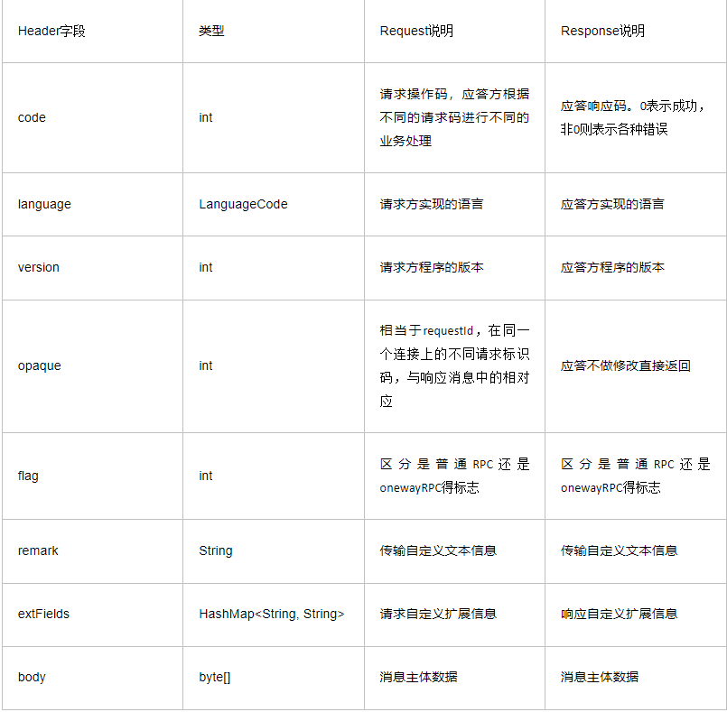

传输内容主要可以分为以下 4 部分：

1.  消息长度：总长度，四个字节存储，占用一个 int 类型。
2.  序列化类型&消息头长度：同样占用一个 int 类型，第一个字节表示序列化类型，后面三个字节表示消息头长度。
3.  消息头数据：经过序列化后的消息头数据。
4.  消息主体数据：消息主体的二进制字节数据内容。

该类除了包含数据结构外，还包含了消息的编解码功能，具体的源码我们会单独篇章剖析。

## **4.3 发送请求**

在 RocketMQ 中，请求有以下三种模式：

1.  同步请求：[invokeSync](http://invokesync/)。
2.  异步请求：[invokeAsync](http://invokeasync/)。
3.  单向请求：[invokeOneway](http://invokeoneway/)。

我们分别来看下其处理逻辑。

### **4.3.1 同步请求**

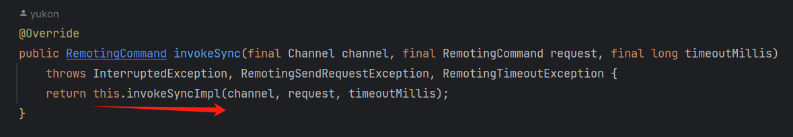

### **4.3.2 异步请求**

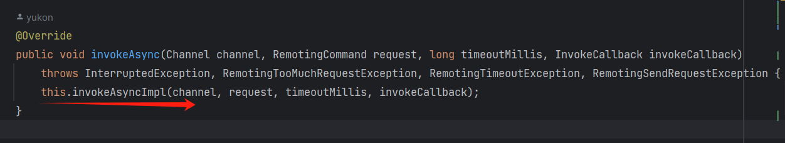

### **4.3.3 单向请求**

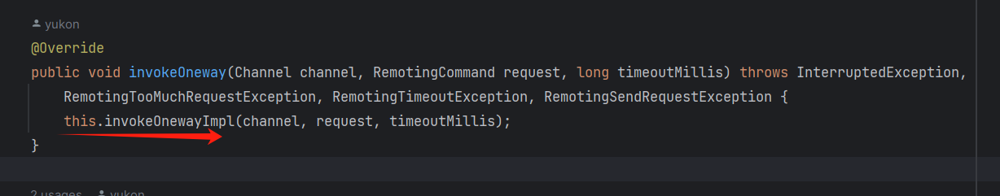

可以看到这里只是透传参数调用了 [NettyRemotingAbstract](http://nettyremotingabstract%20/) 抽象类中的对应 impl 方法，关于每个方法的细节也可以直接点击这里 [【网络通信源码分析系列第二篇源码】图解 RocketMQ 源码之 NettyRemotingAbstract 抽象类实现](https://articles.zsxq.com/id_gid958lent4m.html) 查看。

## **4.4 处理请求**

在**3.3 小节 Netty 服务启动**的时候，，分析过有一个 [prepareShareHandlers](http://preparesharehandlers/) 方法，[ServerBootstrap](http://serverbootstrap/) 添加的最后一个处理器是 [NettyServerHandler](http://nettyserverhandler/)，这就是最后的业务分发处理器了，可以看到它其实就是在调用父类的 [processMessageReceived](http://processmessagereceived/) 方法，来处理器请求和响应。

这个类重写 [ChannelRead0](http://channelread0/)，也就是请求处理的入口函数。

这里需要了解 NettyServerHandler 是负责处理请求的，在这之前请求的数据经过 decoder 已经解码成一个RemotingCommand 对象。

而解码操作是通过 [NettyDecoder](http://nettydecoder/) 类对请求数据进行解码，最终是调用的 [RemotingCommand#decode](http://remotingcommand/#decode) 方法。

[NettyServerHandler](http://nettyserverhandler/) 是 [NettyRemotingServer](http://nettyremotingserver/) 的一个内部类。其实现的是 [SimpleChannelInboundHandler](http://simplechannelinboundhandler/)类。在 [channelRead0](http://channelread0/) 方法中调用 [NettyRemotingAbstract#processMessageReceived](http://nettyremotingabstract/#processMessageReceived) 方法将请求分为了[Request](http://request/) 请求和 [Response](http://response/) 请求，分别调用对应的方法进行处理。

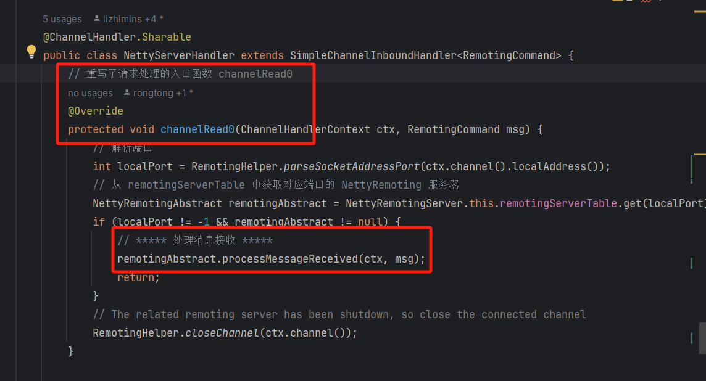

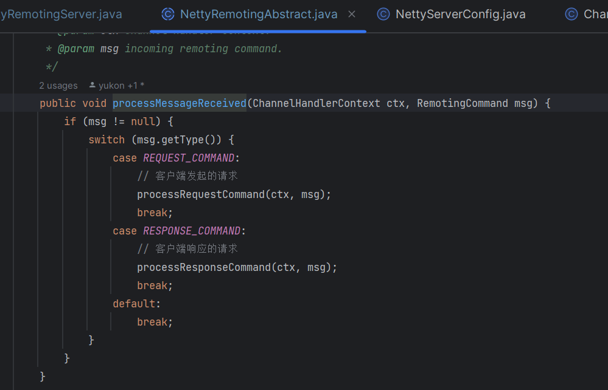

比较简单，从这里可以看到：

1.  从客户端发起的请求数据会通过 [processRequestCommand](http://processrequestcommand/) 方法进行处理。
2.  客户端响应给服务端的请求数据会通过 [processResponseCommand](http://processresponsecommand/) 方法处理。

关于这两个方法的实现细节，可以点击 [【网络通信源码分析系列第二篇源码】图解 RocketMQ 源码之 NettyRemotingAbstract 抽象类实现](https://articles.zsxq.com/id_gid958lent4m.html) 查看。

为了更好的帮助你理解，最后总结下：

1.  [NettyServerHandler](http://nettyserverhandler/) 其实很简单，看过 Netty 源码都知道，相当于 [Netty Server](http://netty%20server/) 端的入口，你可以理解为从这里就可以拿到通过 Netty 传送给服务器的数据了。
2.  接下来它会去判断请求是客户端的请求还是客户端会服务端的响应，如果是处理响应请求，它会使用业务线程池来回调之前设置的 listener。
3.  如果是处理客户端请求，通过 [requestCode](http://requestcode/) 从 ProcessorTable 处理器缓存表中找对应的[Pair<NettyRequestProcessor, ExecutorService>](http://pairnettyrequestprocessor,%20executorservice/) ，如果找不到就用「**默认的协议处理器**」，然后调用「**协议处理器**」的处理方法将这部分封装成一个 task 任务，丢给「**协议处理器**」对应的业务线程池执行。

对于第三点的「**默认的协议处理器**」，在「**NameSrvController**」初始化时会创建「**NettyRemotingServer**」 ，同时注册「**默认的协议处理器**」。

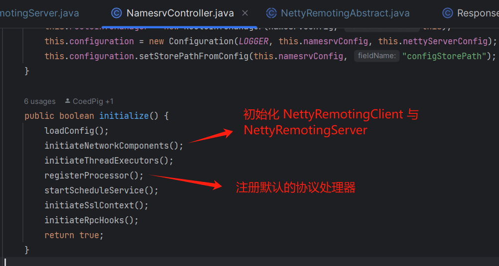

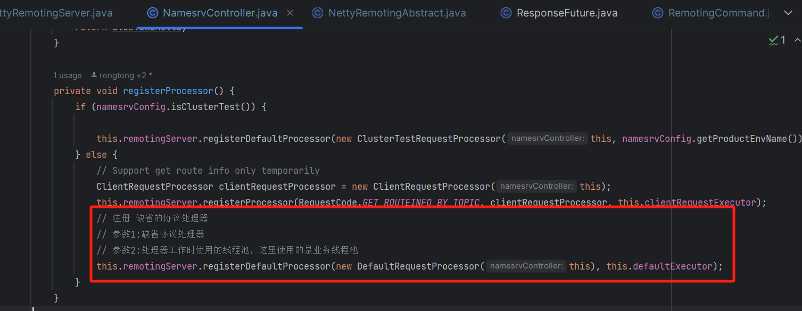

这里最终会调用「**NettyRemotingServer**」的 [registerDefaultProcessor](http://registerdefaultprocessor/) 方法注册默认的协议处理器。

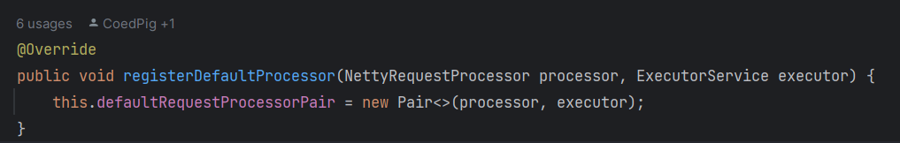

会 new 一个 Pair 简单的映射对象：

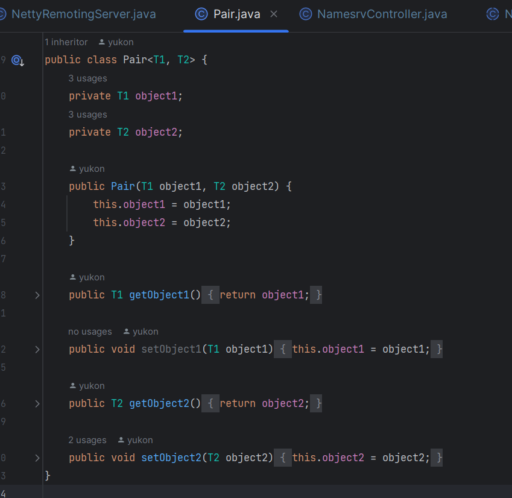

这里的 [DefaultRequestProcessor](http://defaultrequestprocessor/) 实现了 [NettyRequestProcessor](http://nettyrequestprocessor/) 接口，是网络处理器解析请求类型，通过[processRequest](http://processrequest/) 方法可以看到，根据不同的请求类型会将请求转发到不同的方法进行处理。比如请求类型为 [RequestCode.REGISTER\_BROKER](http://requestcode.register_broker/)，则请求最后会被转发到 [RouteInfoManager.registerBroker](http://routeinfomanager.registerbroker/) 方法。

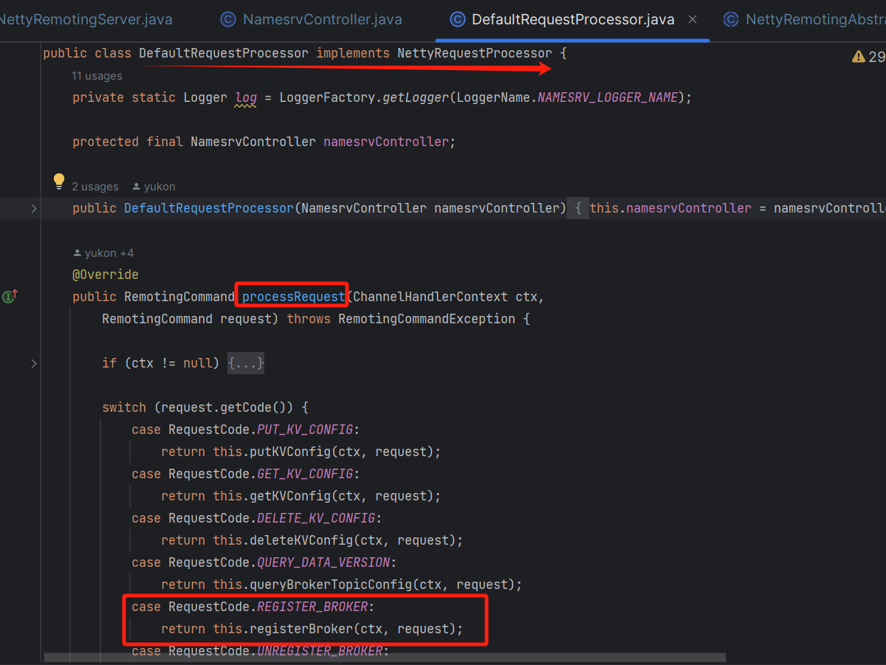

## **05 总结**

最后通过一张图来总结全文。

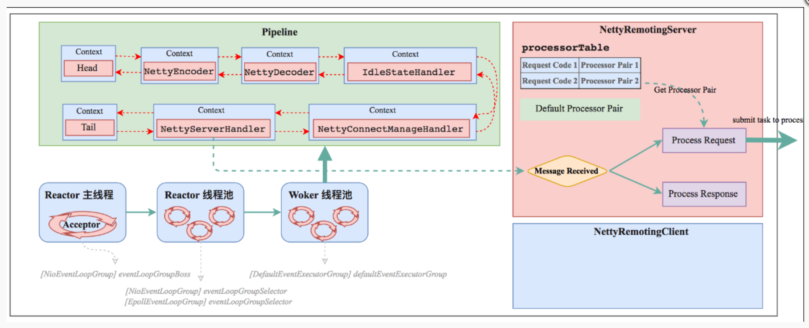（图片来自网络）

1.  一个 [Reactor](http://reactor%20/) 主线程负责监听 TCP 连接请求，建立好连接后丢给 [Reactor](http://reactor%20/) 线程池，它负责将建立好连接的 socket 注册到 [selector](http://selector%20/) 上去（通过本文的了解有两种方式，NIO 和 Epoll，可配置），然后监听真正的网络数据。当拿到网络数据后，再丢给 [Worker](http://worker%20/) 线程池。
2.  [Worker](http://worker%20/) 线程池拿到网络数据后，就交给 [Pipeline](http://pipeline/)，从 [Head](http://head%20/) 到 [Tail](http://tail%20/) 一个个 [Handler](http://handler%20/) 执行下去，这些 [Handler](http://handler%20/) 是在创建 「**NettyRemotingServer**」的时候指定的。[NettyEncoder](http://nettyencoder%20/) 和 [NettyDecoder](http://nettydecoder%20/) 负责网络数据和 [RemotingCommand](http://remotingcommand%20/) 之间的编解码。
3.  当 [NettyServerHandler](http://nettyserverhandler%20/) 拿到解码得到的 [RemotingCommand](http://remotingcommand%20/) 后，根据 [RemotingCommand.type](http://remotingcommand.type/) 来判断是 request 还是 response，如果是 request 就根据 [RomotingCommand](http://romotingcommand%20/) 的 code 去 [processorTable](http://processortable%20/) 找到对应的 [processor](http://processor/) 然后封装成 [task](http://task%20/) 后，丢给对应的 [processor](http://processor%20/) 线程池；如果是 response 就根据[RemotingCommand.opaque](http://remotingcommand.opaque/) 去 [responseTable](http://responsetable%20/) 中拿到对应的 [ResponseFuture](http://responsefuture/) 把结果 set 给它。
4.  对于客户端，经过 [Pipeline](http://pipeline%20/) 的顺序是从 [Tail](http://tail%20/) 到 [Head](http://head/)。不管是服务端和客户端，并不是每次数据流转都得经过所有的 [Handler](http://handler/)，而是会根据 [Context](http://context%20/) 中的一些信息去判断。
5.  在整个数据流转过程中还有很多 [hook](http://hook/) 函数, 比如处理 [command](http://command%20/) 前，处理 [command](http://command%20/) 后，发送数据前，发送数据后等。