大家好，我是**华仔**, 又跟大家见面了。

从今天开始我将继续为大家奉上 RocketMQ 消费者源码剖析系列文章，正式开启「**RocketMQ 的网络通信源码之旅**」，这是第三篇，本篇我们将以「**RocketMQ 5.1.2**」版本为主，来剖析下 RocketMQ 源码之 RPC 网络通信协议设计剖析。

这里我将以「**RocketMQ 5.1.2**」版本为主，通过「**场景驱动**」的方式带大家一点点的对 RocketMQ 源码进行深度剖析，正式开启「**RocketMQ 的源码之旅**」，跟我一起来掌握 RocketMQ 源码核心架构设计思想吧。

  
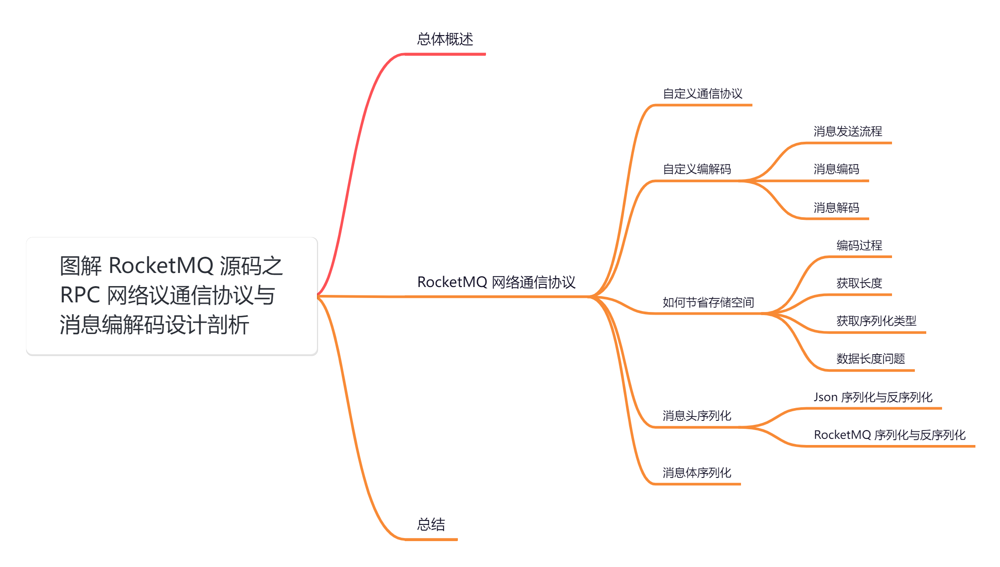

## **01 总体概述**

通过前面的分析，我们知道了 [rocketmq-remoting](http://rocketmq-remoting/) 模块承担了远程通信的任务，相关代码都存在于[org.apache.rocketmq.remoting](http://org.apache.rocketmq.remoting/) 包下面。

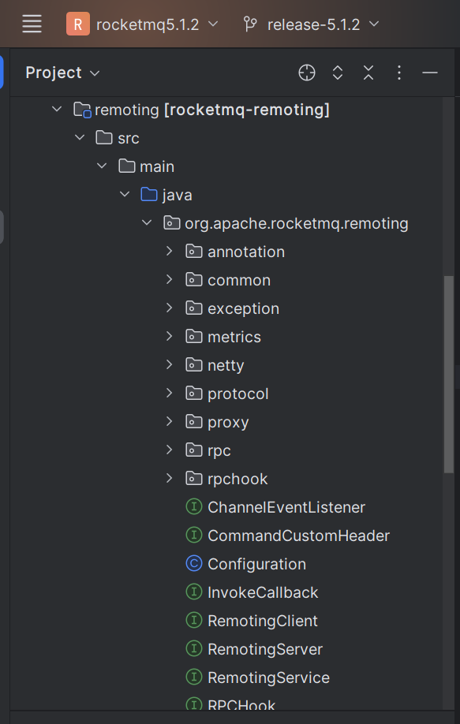

从目录名称或者文件名称就可以看出来是做什么的，这里就不一一介绍了。

这里为什么 RocketMQ 要自己设计一套「**通信协议**」和 「**编解码**」呢，而不是直接使用 「**Netty**」 自提供的？

> Netty 本身已经对网络问题进行了处理，并且相对于 原生的 Java NIO API 来说大幅简化了网络编程，但是我们在开发时大多情况下仍然是在应用层进行的。所以我们在采用 TCP 作为传输层协议时，需要考虑 TCP 流协议的特性，自定义一个应用层协议以便解决所谓的“粘包”，“半包”问题。
> 
> 考虑到通信性能等因素，自定义应用层协议是最好的选择。而 Netty 本身也提供了通用的编码器以及解码器，用于解决 TCP 传输问题，例如 LengthFieldBasedFrameDecoder 但是我们在其上抽象出一层专用的通信 API 是更好的选择。同时当我们不使用 Netty 作为底层通信框架时，其他模块也是无感的。

我们再来回顾下 RocketMQ 底层网络通讯顶层设计，其类图设计如下：

其类依赖关系详细图如下：

在 RocketMQ 中自定义了**通信协议并在 Netty 的基础上扩展了通信模块**。

## **02 RocketMQ 网络通信协议**

在 [【网络通信源码分析系列第二篇】图解 RocketMQ 源码之 NettyRemotingAbstract 抽象类实现](https://articles.zsxq.com/id_gid958lent4m.html) 已经简单剖析过，这里再来看下。

源码位置：[https://github.com/apache/rocketmq/blob/release-5.1.2/](https://github.com/apache/rocketmq/blob/release-5.1.2/remoting/src/main/java/org/apache/rocketmq/remoting/protocol/RemotingCommand.java)[remoting](https://github.com/apache/rocketmq/blob/release-5.1.2/remoting/src/main/java/org/apache/rocketmq/remoting/protocol/RemotingCommand.java)[/src/main/java/org/apache/rocketmq/](https://github.com/apache/rocketmq/blob/release-5.1.2/remoting/src/main/java/org/apache/rocketmq/remoting/protocol/RemotingCommand.java)[remoting](https://github.com/apache/rocketmq/blob/release-5.1.2/remoting/src/main/java/org/apache/rocketmq/remoting/protocol/RemotingCommand.java)[/](https://github.com/apache/rocketmq/blob/release-5.1.2/remoting/src/main/java/org/apache/rocketmq/remoting/protocol/RemotingCommand.java)[protocol](https://github.com/apache/rocketmq/blob/release-5.1.2/remoting/src/main/java/org/apache/rocketmq/remoting/protocol/RemotingCommand.java)[/](https://github.com/apache/rocketmq/blob/release-5.1.2/remoting/src/main/java/org/apache/rocketmq/remoting/protocol/RemotingCommand.java)[RemotingCommand](https://github.com/apache/rocketmq/blob/release-5.1.2/remoting/src/main/java/org/apache/rocketmq/remoting/protocol/RemotingCommand.java)[.java](https://github.com/apache/rocketmq/blob/release-5.1.2/remoting/src/main/java/org/apache/rocketmq/remoting/protocol/RemotingCommand.java)

在客户端和服务端之间完成一次消息发送时，需要对发送的消息进行一个协议约定，因此就有必要自定义[RocketMQ](http://rocketmq%20/) 的消息协议。

同时，为了高效地在网络中传输消息和对收到的消息读取，就需要对消息进行编解码。在 RocketMQ 中，所有的网络请求都会被封装为一个 [RemotingCommand](http://remotingcommand/) 对象，不但包含了所有的数据结构，还包含了编码解码操作。

## **2.1 自定义通信协议**

下面是 [RocketMQ](http://rocketmq/) 所使用协议字段：

public class RemotingCommand {

....

// Request:请求操作响应码，业务方根据不同的请求码进行不同的业务处理

// Response:应答响应码，0表示成功，非0表示各种错误

private int code;

// Request:请求方使用的语言

// Response:请求方程序的版本

private LanguageCode language \= LanguageCode.JAVA,

// Request:请求方程序的版本

// Response:响应方程序的版本

private int version \= 0;

// Request: 请求id

// Response:

private int opaque \= requestId.getAndIncrement();

// Request: 区分是普通RPC还是单向RPC

// Response:

private int flag \= 0;

// Request:传输自定义文本信息

// Response:

private String remark;

// Request:自定义扩展字段

// Response:

private HashMap<String, String> extFields;

// Request:自定义请求头

// Response:自定义响应头

private transient CommandCustomHeader customHeader;

// Request:当前序列化方式

// Response:

private SerializeType serializeTypeCurrentRPC \= serializeTypeConfigInThisServer;

// Request:消息体

// Response:

private transient byte\[\] body;

private boolean suspended;

private Stopwatch processTimer;

....

}

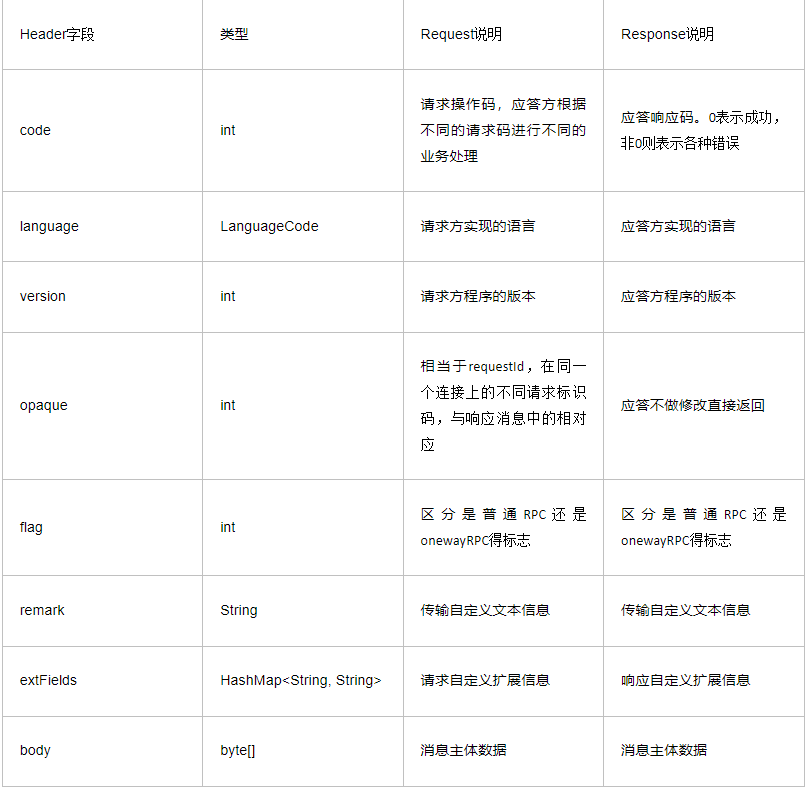

传输内容主要可以分为以下 4 部分：

1.  消息长度：总长度，四个字节存储，占用一个 int 类型。
2.  序列化类型&消息头长度：同样占用一个 int 类型，第一个字节表示序列化类型，后面三个字节表示消息头长度。
3.  消息头数据：经过序列化后的消息头数据。
4.  消息主体数据：消息主体的二进制字节数据内容。

对其进行编码以后，一个完整的消息结构如下所示：

  
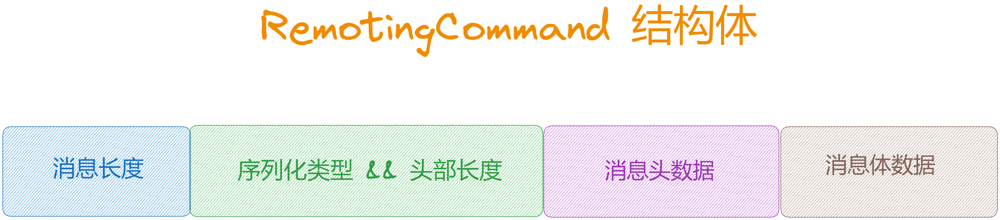

除了上面讲解的 [RemotingCommand](http://remotingcommand%20/) 类的私有字段外，再来看2个比较重要的字段。

1.  [customHeader](http://customheader/)：用来简化 [RemotingCommand](http://remotingcommand/) 的构造，它的类型为 [CommandCustomHeader](http://commandcustomheader/) 接口，你可以实现这个接口用来自定义额外的协议头信息，这些信息最终将会编码到[extFields](http://extfields/)字段中。
2.  [serializeTypeCurrentRPC](http://serializetypecurrentrpc/)：表示 [RemotingCommand](http://remotingcommand/) 类的序列化方式，当前实现存在 json 序列化以及紧凑型序列化两种方式，第二种方法将协议头字段紧密排列在一起，以减少数据流的大小，默认使用 json 序列化方式。

## **2.2 自定义编解码**

在剖析之前，我们先来拿生产者发送消息为例，来看下 RocketMQ 是如何进行消息编解码的。

## **2.2.1 消息发送流程**

1、生产者发送消息，这里我们进去第5步看发送消息的流程。

//1、初始化 mq producer

DefaultMQProducer mqProducer \=new DefaultMQProducer("iscys-test");

//2、设置nameServer 地址

mqProducer.setNamesrvAddr("localhost:9876");

//3、开启mq producer,这一步是必须的，会做一些连接初始化检测工作

mqProducer.start();

//4、创建 Message

Message msg \= new Message("test-topis", "iscys-test".getBytes());

//5、发送消息

mqProducer.send(msg, new SendCallback() {

@Override

public void onSuccess(SendResult sendResult) {

//在消息发送成功之后，我们收到broker的响应通知后，会进行回调

System.out.println("send success");

}

@Override

public void onException(Throwable e) {

System.out.println("send fail");

}

});

2、消息发送必须经过如下代码，将消息组装成 [RemotingCommand](http://remotingcommand%20/) 对象，无论是发送还是服务端返回消息，都会封装成这个对象。

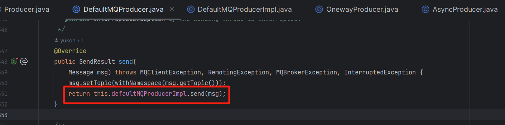

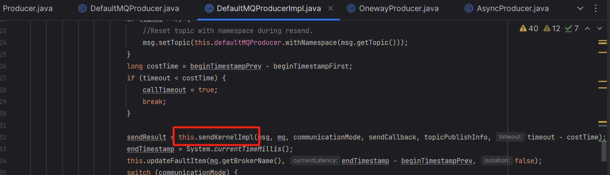

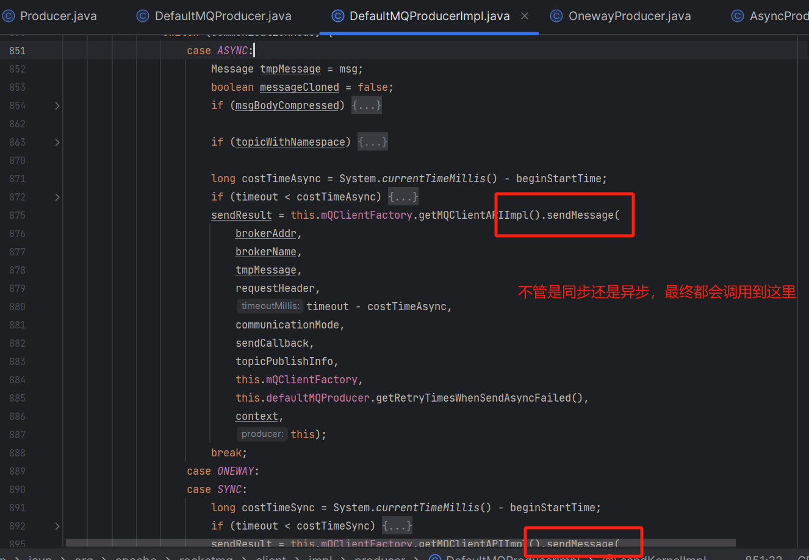

源码位置：[https://github.com/apache/rocketmq/blob/release-5.1.2/client/src/main/java/org/apache/rocketmq/remoting/](https://github.com/apache/rocketmq/blob/release-5.1.2/client/src/main/java/org/apache/rocketmq/remoting/impl/MQClientAPIImpl.java)[impl/MQClientAPIImpl](https://github.com/apache/rocketmq/blob/release-5.1.2/client/src/main/java/org/apache/rocketmq/remoting/impl/MQClientAPIImpl.java)[.java](https://github.com/apache/rocketmq/blob/release-5.1.2/client/src/main/java/org/apache/rocketmq/remoting/impl/MQClientAPIImpl.java)

public SendResult sendMessage(

final String addr,

final String brokerName,

final Message msg,

final SendMessageRequestHeader requestHeader,

final long timeoutMillis,

final CommunicationMode communicationMode,

final SendCallback sendCallback,

final TopicPublishInfo topicPublishInfo,

final MQClientInstance instance,

final int retryTimesWhenSendFailed,

final SendMessageContext context,

final DefaultMQProducerImpl producer

) throws RemotingException, MQBrokerException, InterruptedException {

// 1、初始化 RemotingCommand 对象

long beginStartTime \= System.currentTimeMillis();

RemotingCommand request \= null;

String msgType \= msg.getProperty(MessageConst.PROPERTY\_MESSAGE\_TYPE);

boolean isReply \= msgType != null && msgType.equals(MixAll.REPLY\_MESSAGE\_FLAG);

if (isReply) {

if (sendSmartMsg) {

SendMessageRequestHeaderV2 requestHeaderV2 \= SendMessageRequestHeaderV2.createSendMessageRequestHeaderV2(requestHeader);

request = RemotingCommand.createRequestCommand(RequestCode.SEND\_REPLY\_MESSAGE\_V2, requestHeaderV2);

} else {

request = RemotingCommand.createRequestCommand(RequestCode.SEND\_REPLY\_MESSAGE, requestHeader);

}

} else {

// 2、设置消息头

if (sendSmartMsg || msg instanceof MessageBatch) {

// 多条 message

SendMessageRequestHeaderV2 requestHeaderV2 \= SendMessageRequestHeaderV2.createSendMessageRequestHeaderV2(requestHeader);

request = RemotingCommand.createRequestCommand(msg instanceof MessageBatch ? RequestCode.SEND\_BATCH\_MESSAGE : RequestCode.SEND\_MESSAGE\_V2, requestHeaderV2);

} else {

// 单条 message

request = RemotingCommand.createRequestCommand(RequestCode.SEND\_MESSAGE, requestHeader);

}

}

// 3、将 message 内容放入 request 中

request.setBody(msg.getBody());

//4、发送消息

switch (communicationMode) {

case ONEWAY: // 单项发送

this.remotingClient.invokeOneway(addr, request, timeoutMillis);

return null;

case ASYNC: // 异步发送

final AtomicInteger times \= new AtomicInteger();

long costTimeAsync \= System.currentTimeMillis() - beginStartTime;

if (timeoutMillis < costTimeAsync) {

throw new RemotingTooMuchRequestException("sendMessage call timeout");

}

this.sendMessageAsync(addr, brokerName, msg, timeoutMillis - costTimeAsync, request, sendCallback, topicPublishInfo, instance,

retryTimesWhenSendFailed, times, context, producer);

return null;

case SYNC: // 同步发送

long costTimeSync \= System.currentTimeMillis() - beginStartTime;

if (timeoutMillis < costTimeSync) {

throw new RemotingTooMuchRequestException("sendMessage call timeout");

}

return this.sendMessageSync(addr, brokerName, msg, timeoutMillis - costTimeSync, request);

default:

assert false;

break;

}

return null;

}

看到这里，是不是很熟悉了，这里用到了我们上面剖析的 [RemotingCommand](http://remotingcommand/) 对象。

3、发送消息，这里以「**异步发送**」为例。

  
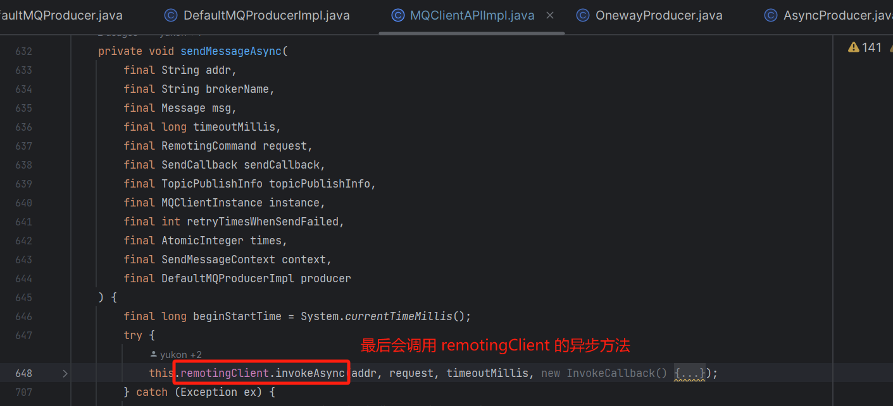

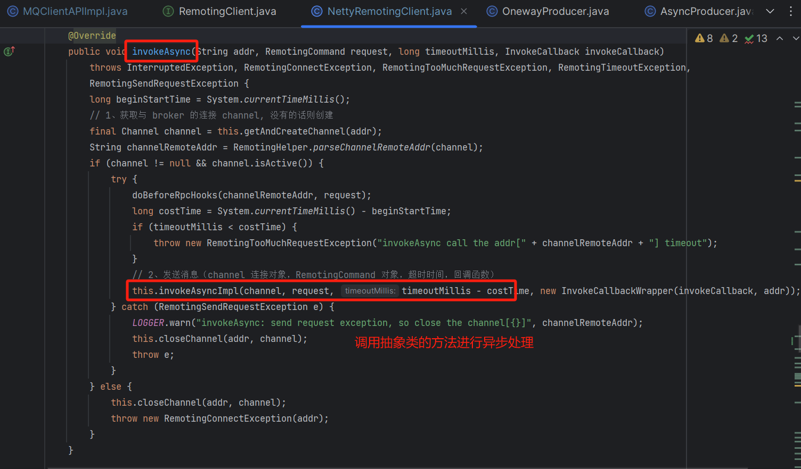

4.设置 [response](http://%20response%20/) 对象设置，方便进行发送成功后的回调，进行真实发送。

  
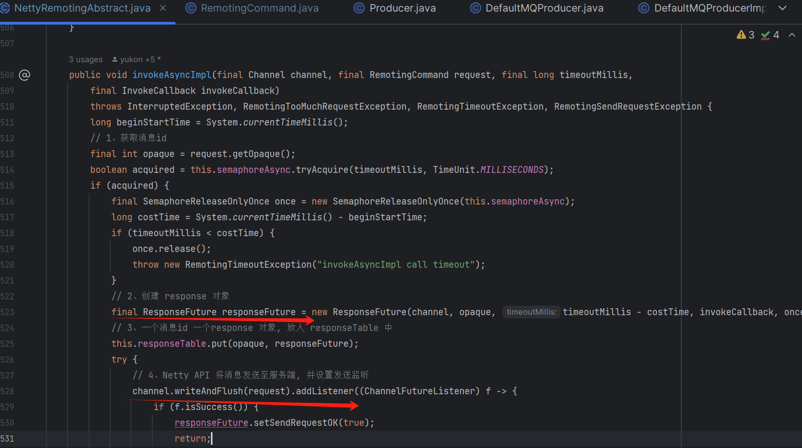

从消息发送流程中，我们得知 [RocketMQ](http://rocketmq%20/) 在发送消息的时候，都会把消息封装成 [RemotingCommand](http://remotingcommand%20/) 对象，做过网络编程的都知道 TCP 网络传输会出现「**拆包**」与「**粘包**」的问题，那么 RocketMq 是怎么解决这个问题呢？

关于「**拆包**」与「**粘包**」的问题，常用的有以下 4 种解决方案：

1.  **消息定长**：一条消息发送设置固定的长度，长度不够就空行补全。
2.  **消息分隔符**：通过设置标志符，进行消息的解析。
3.  **换行分割**
4.  **自定义消息长度**：设置消息头，来解析消息的长度。

RocketMq 采用的是最后一种解决方案，也是很容易操控的一种解决方案，具体实现我们看 [RocketMq Netty Client bootstrap](http://rocketmq%20netty%20client%20bootstrap/) 初始化的 [pipeline](http://pipeline%20/) 。

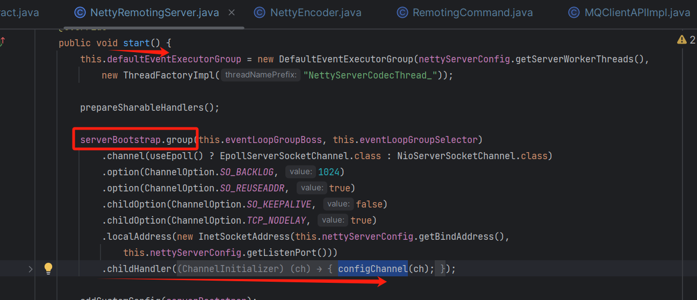

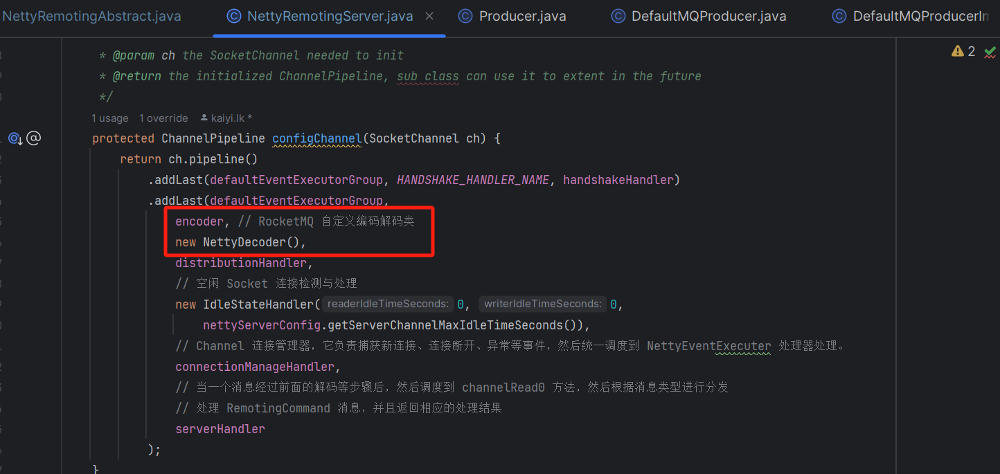

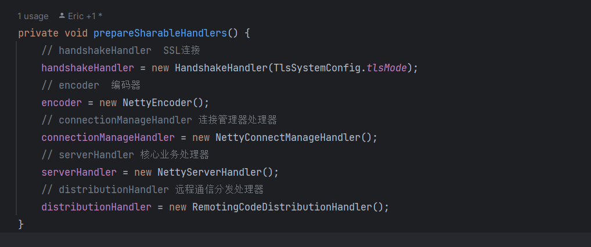

可以看到 [ServerBootstrap](http://serverbootstrap%20/) 添加了多个处理器，第一个 [HandshakeHandler](http://handshakehandler%20/) 处理器接收的入参是 [ByteBuf](http://bytebuf/)，倒数第二个 [NettyServerHandler](http://nettyserverhandler%20/) 接收的入参是 [RemotingCommand](http://remotingcommand/)。[ByteBuf](http://bytebuf%20/) 就是从网络传输进来的字节数据，[RemotingCommand](http://remotingcommand%20/) 可以认为是 [RocketMQ](http://rocketmq%20/) 自定义的通信协议。

public class HandshakeHandler extends SimpleChannelInboundHandler<ByteBuf>

public class NettyServerHandler extends SimpleChannelInboundHandler<RemotingCommand>

在读取数据的时候要将 [ByteBuf](http://bytebuf/) 转成 [RemotingCommand](http://remotingcommand/)，在发送数据的时候，要将 [RemotingCommand](http://remotingcommand%20/) 转成 [ByteBuf](http://bytebuf/)，这就会涉及到数据的序列化以及编码和解码，对应就是 [NettyEncoder](http://nettyencoder%20/) 和 [NettyDecoder](http://nettydecoder/)。下面就来看下 [RocketMQ](http://rocketmq%20/) 是如何实现序列化以及编解码的。

## **2.2.2 消息编码**

源码位置：[https://github.com/apache/rocketmq/blob/release-5.1.2/](https://github.com/apache/rocketmq/blob/release-5.1.2/remoting/src/main/java/org/apache/rocketmq/remoting/netty/NettyEncoder.java)[remoting](https://github.com/apache/rocketmq/blob/release-5.1.2/remoting/src/main/java/org/apache/rocketmq/remoting/netty/NettyEncoder.java)[/src/main/java/org/apache/rocketmq/](https://github.com/apache/rocketmq/blob/release-5.1.2/remoting/src/main/java/org/apache/rocketmq/remoting/netty/NettyEncoder.java)[remoting](https://github.com/apache/rocketmq/blob/release-5.1.2/remoting/src/main/java/org/apache/rocketmq/remoting/netty/NettyEncoder.java)[/](https://github.com/apache/rocketmq/blob/release-5.1.2/remoting/src/main/java/org/apache/rocketmq/remoting/netty/NettyEncoder.java)[netty/NettyEncoder](https://github.com/apache/rocketmq/blob/release-5.1.2/remoting/src/main/java/org/apache/rocketmq/remoting/netty/NettyEncoder.java)[.java](https://github.com/apache/rocketmq/blob/release-5.1.2/remoting/src/main/java/org/apache/rocketmq/remoting/netty/NettyEncoder.java)

我们先来剖析下 [NettyEncoder](http://nettyencoder%20/) 编码处理流程，[NettyEncoder](http://nettyencoder%20/) 的顶层接口是 [ChannelOutboundHandler](http://channeloutboundhandler/)，这是输出时的一个处理器，[NettyEncoder](http://nettyencoder%20/) 就是负责在发送请求时对 [RemotingCommand](http://remotingcommand%20/) 进行编码，将其转成 [ByteBuf](http://bytebuf/)。

> 注意这里是将 RemotingCommand 和 body 分开写入的。

@ChannelHandler.Sharable

public class NettyEncoder extends MessageToByteEncoder<RemotingCommand> {

private static final Logger log \= LoggerFactory.getLogger(LoggerName.ROCKETMQ\_REMOTING\_NAME);

@Override

public void encode(ChannelHandlerContext ctx, RemotingCommand remotingCommand, ByteBuf out)

throws Exception {

try {

// 1、对 RemotingCommand 编码，将请求头 RemotingCommand 转成字节然后写入 ByteBuf 中

remotingCommand.fastEncodeHeader(out);

// 2、如果有请求体 body，再将请求体 body 再写入 ByteBuf 中

byte\[\] body = remotingCommand.getBody();

if (body != null) {

out.writeBytes(body);

}

} catch (Exception e) {

log.error("encode exception, " + RemotingHelper.parseChannelRemoteAddr(ctx.channel()), e);

if (remotingCommand != null) {

log.error(remotingCommand.toString());

}

RemotingHelper.closeChannel(ctx.channel());

}

}

}

从上面的剖析可以看出，「**编码**」的逻辑主要是 [RemotingCommand#fastEncodeHeader](http://remotingcommand/#fastEncodeHeader%20) 方法。

## **序列化方式**

序列化的方式有以下两种：

1.  JSON 序列化
2.  RocketMQ 自定义的 ROCKETMQ 序列化。

可以看到默认是 JSON 序列化，序列化方式可以通过环境变量 [ROCKETMQ\_SERIALIZE\_TYPE](http://rocketmq_serialize_type%20/) 指定，或者通过配置 [rocketmq.serialize.type](http://rocketmq.serialize.type/) 来指定。

JSON 序列化的体积比较大，一般我们可以修改配置指定为 [ROCKETMQ](http://rocketmq%20/) 序列化。

public class RemotingCommand {

// 序列化类型 JSON

private static SerializeType serializeTypeConfigInThisServer \= SerializeType.JSON;

static {

// 从配置文件或环境变量中读取序列化类型配置

final String protocol \= System.getProperty("rocketmq.serialize.type", System.getenv("ROCKETMQ\_SERIALIZE\_TYPE"));

if (!isBlank(protocol)) {

serializeTypeConfigInThisServer = SerializeType.valueOf(protocol);

}

}

// 序列化类型

private SerializeType serializeTypeCurrentRPC \= serializeTypeConfigInThisServer;

}

在 [NettyEncoder](http://nettyencoder%20/) 中调用了 [RemotingCommand](http://remotingcommand%20/) 的成员方法 [fastEncodeHeader](http://fastencodeheader%20/) 来对数据编码，它的核心逻辑就是将 [RemotingCommand](http://remotingcommand%20/) 转成字节，写入 [ByteBuf](http://bytebuf%20/) 中。

前面说过，消息的前4个字节是用来标识消息的总长度的，所以在写数据的时候，要计算每个写入数据的字节长度的总和。因为 body 和 customHeader 是 [transient](http://transient%20/) 标识的不会被序列化，所以计算长度的时候要把 body 的长度算进去，它这里就包括请求头 [RemotingCommand](http://remotingcommand%20/) 和请求体 [body](http://body%20/) 的长度之和。

> 需要注意它前 4 个字节是保存的消息字节总长度，接着的 4 个字节存储了请求头的长度和序列化的方式，所以在解码反序列化的时候，它一定会读这 4 个字节，看请求头的长度是多少，这样才能和请求头分开。并从这 4 个字节读取序列化的方式，然后用相同的方式来反序列化。

public void fastEncodeHeader(ByteBuf out) {

// 消息主体的字节长度

int bodySize \= this.body != null ? this.body.length : 0;

// 初始位置

int beginIndex \= out.writerIndex();

// skip 8 bytes

// 先占用8个字节

out.writeLong(0);

int headerSize;

// ROCKETMQ 序列化

if (SerializeType.ROCKETMQ == serializeTypeCurrentRPC) {

if (customHeader != null && !(customHeader instanceof FastCodesHeader)) {

// customHeader 转到 extFields

this.makeCustomHeaderToNet();

}

// ROCKETMQ 序列化

headerSize = RocketMQSerializable.rocketMQProtocolEncode(this, out);

} else { // JSON 序列化

// customHeader 转到 extFields

this.makeCustomHeaderToNet();

// JSON 序列化

byte\[\] header = RemotingSerializable.encode(this);

headerSize = header.length;

// 直接写入字节

out.writeBytes(header);

}

// 前4个字节写入消息的长度

out.setInt(beginIndex, 4 + headerSize + bodySize);

// 4-8个字节写入序列化的类型和请求头长度

out.setInt(beginIndex + 4, markProtocolType(headerSize, serializeTypeCurrentRPC));

}

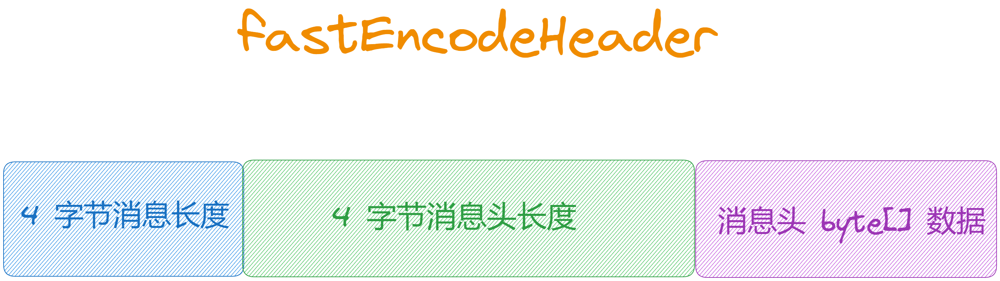

在 [out.writeBytes(body)](http://out.writebytes\(body\)/) 后，写入body 消息后我们的消息结构是如下这个样子的：

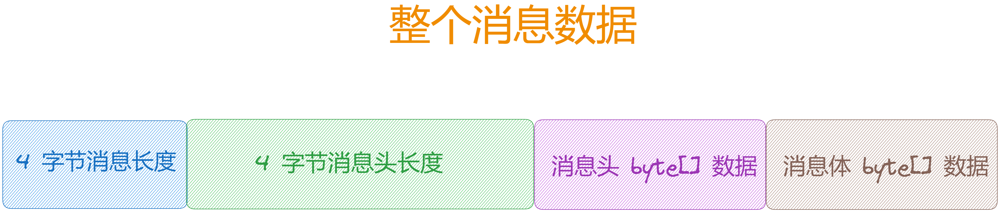

## **自定义请求头转换**

不管是哪种序列化方式，如果传入了自定义请求头 [CommandCustomHeader](http://commandcustomheader/)，就会将这个对象中的字段和值解析出来，放入 [extFields](http://extfields%20/) 扩展字段表中。可以看到它就是通过反射的方式，获取对象中的所有字段，然后通过反射的方式获取字段值。

public void makeCustomHeaderToNet() {

if (this.customHeader != null) {

// 获取自定义请求头类中的字段

Field\[\] fields = getClazzFields(customHeader.getClass());

if (null == this.extFields) {

this.extFields = new HashMap<>();

}

for (Field field : fields) {

// 非静态字段

if (!Modifier.isStatic(field.getModifiers())) {

String name \= field.getName();

if (!name.startsWith("this")) {

Object value \= null;

try {

// 反射读值

field.setAccessible(true);

value = field.get(this.customHeader);

} catch (Exception e) {

log.error("Failed to access field \[{}\]", name, e);

}

if (value != null) {

// 添加到 extFields

this.extFields.put(name, value.toString());

}

}

}

}

}

}

## **2.2.3 消息解码**

[NettyDecoder](http://nettydecoder%20/) 的顶层接口是 [ChannelInboundHandler](http://channelinboundhandler/)，这是输入时的一个处理器，[NettyDecoder](http://nettydecoder%20/) 负责在接收请求时对 [ByteBuf](http://bytebuf%20/) 解码，将其转成 [RemotingCommand](http://remotingcommand/)。

public class NettyDecoder extends LengthFieldBasedFrameDecoder {

private static final Logger log \= LoggerFactory.getLogger(LoggerName.ROCKETMQ\_REMOTING\_NAME);

private static final int FRAME\_MAX\_LENGTH \=

Integer.parseInt(System.getProperty("com.rocketmq.remoting.frameMaxLength", "16777216"));

public NettyDecoder() {

// 从 0 开始，用 4 个字节来表示长度，解码时删除前 4 个字节

// LengthFieldBasedFrameDecoder(int maxFrameLength, int lengthFieldOffset, int lengthFieldLength,

// int lengthAdjustment, int initialBytesToStrip)

super(FRAME\_MAX\_LENGTH, 0, 4, 0, 4);

}

@Override

public Object decode(ChannelHandlerContext ctx, ByteBuf in) throws Exception {

ByteBuf frame \= null;

Stopwatch timer \= Stopwatch.createStarted();

try {

// 解码 frame

frame = (ByteBuf) super.decode(ctx, in);

if (null == frame) {

return null;

}

// ByteBuf 解码为 RemotingCommand

RemotingCommand cmd \= RemotingCommand.decode(frame);

cmd.setProcessTimer(timer);

return cmd;

} catch (Exception e) {

log.error("decode exception, " + RemotingHelper.parseChannelRemoteAddr(ctx.channel()), e);

RemotingHelper.closeChannel(ctx.channel());

} finally {

if (null != frame) {

frame.release(); // 释放资源

}

}

return null;

}

}

[NettyDecoder](http://nettydecoder/) 继承自 [LengthFieldBasedFrameDecoder](http://lengthfieldbasedframedecoder/)，也就是说它是基于「**固定长度**」的一个解码器。可以看到默认长度为 [16777216](http://1.0.0.0/)，也就是 16M，就是说「**单次请求**」最大不能超过 16M 的数据，否则就会报错，当然可以通过参数 [com.rocketmq.remoting.frameMaxLength](http://com.rocketmq.remoting.framemaxlength/) 修改这个限制。

从构造方法可以看出，消息的前 4 个字节用来表示消息的总长度，所以在编码的时候，前 4 个字节一定会写入消息的总长度，然后它的第五个参数 [initialBytesToStrip](http://initialbytestostrip/) 表示要去掉前4个字节，所以在 [decode](http://decode/) 中拿到的 [ByteBuf](http://bytebuf/) 是不包含这个总长度的。

然后解码的核心逻辑，其实就是调用 [RemotingCommand.decode(ByteBuf)](http://remotingcommand.decode\(bytebuf\)/) 方法来解码，将 [ByteBuf](http://bytebuf/) 转成了 [RemotingCommand](http://remotingcommand/)，如下：

// RemotingCommand 类方法

public static RemotingCommand decode(final ByteBuf byteBuffer) throws RemotingCommandException {

// 数据总长度

int length \= byteBuffer.readableBytes();

// 读取第4-8字节（前4个字节标识总长度，已被去掉）

int oriHeaderLen \= byteBuffer.readInt();

// 请求头的长度

int headerLength \= getHeaderLength(oriHeaderLen);

if (headerLength > length - 4) {

throw new RemotingCommandException("decode error, bad header length: " + headerLength);

}

// 解码得到 RemotingCommand

RemotingCommand cmd \= headerDecode(byteBuffer, headerLength, getProtocolType(oriHeaderLen));

// 剩下的长度就是 body 部分

int bodyLength \= length - 4 - headerLength;

byte\[\] bodyData = null;

if (bodyLength > 0) {

bodyData = new byte\[bodyLength\];

byteBuffer.readBytes(bodyData);

}

// 读出 body

cmd.body = bodyData;

return cmd;

}

[NettyDecoder](http://nettydecoder%20/) 中调用了 [RemotingCommand](http://remotingcommand%20/) 的静态方法 [decode(ByteBuf byteBuffer)](http://decode\(bytebuf%20bytebuffer\)/) 来对传入的数据解码，就是将 [ByteBuf](http://bytebuf%20/) 成 [RemotingCommand](http://remotingcommand/)。

步骤如下：

1.  首先读取数据的总长度。
2.  接着读取前四个字节（注意最开始的前四个字节存储的数据总长度，已经去掉）。
3.  从这个整数中去读取请求头的长度和序列化的方式。
4.  对请求头反序列化得到 [RemotingCommand](http://remotingcommand/)。
5.  最后，总长度减去请求头的长度，以及前4个字节，剩下的就是请求体 body 了。

在对请求头解码时，其实就是从 [ByteBuf](http://bytebuf%20/) 读取字节数据转成 [RemotingCommand](http://remotingcommand/)。根据序列化类型的不同，用对应的方式来反序列化。

// RemotingCommand 类方法

private static RemotingCommand headerDecode(ByteBuf byteBuffer, int len,

SerializeType type) throws RemotingCommandException {

switch (type) {

case JSON:

byte\[\] headerData = new byte\[len\];

// 读取指定长度的字节到字节数组中

byteBuffer.readBytes(headerData);

// JSON 反序列化

RemotingCommand resultJson \= RemotingSerializable.decode(headerData, RemotingCommand.class);

resultJson.setSerializeTypeCurrentRPC(type);

return resultJson;

case ROCKETMQ:

// ROCKETMQ 反序列化

RemotingCommand resultRMQ \= RocketMQSerializable.rocketMQProtocolDecode(byteBuffer, len);

resultRMQ.setSerializeTypeCurrentRPC(type);

return resultRMQ;

default:

break;

}

return null;

}

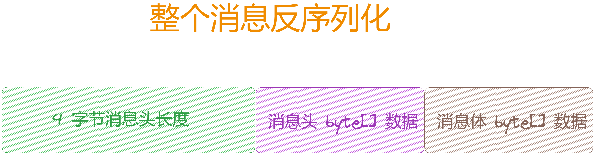

## **2.3 如何节省存储空间**

编码时，是将请求头与请求体分开存储的，这就需要记录「**请求头**」或「**请求体**」的长度，这样才能分割这两部分的字节。可以看到编码时 [RocketMQ](http://rocketmq%20/) 用一个 int 型整数就存储了「**请求头长度**」和「**序列化类型**」两个状态，这样就能节省内存空间，来看下它是如何实现的。

## **2.3.1 编码过程**

一个 int 有 4 个字节，一个字节有 8 个 bit 位，它这里其实就是用第 1 个字节来存储「**序列化类型**」，后3个字节用来存储「**请求头长度**」。

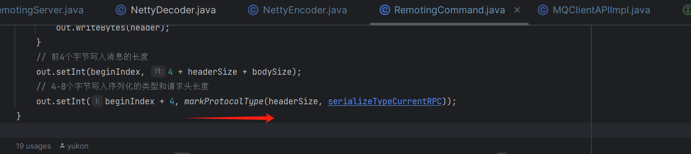

// RemotingCommand 类方法

public static int markProtocolType(int source, SerializeType type) {

return (type.getCode() << 24) | (source & 0x00FFFFFF);

}

通过前面知道，[SerializeType](http://serializetype%20/) 有两种类型 ：

1.  JSON：用 0 表示。
2.  ROCKETMQ：用 1 表示。

也就是将 0 或 1 左移 [<<](http://%20/) 24 位。拿 [ROCKETMQ](http://rocketmq%20/) 类型来说，这个 int 的二进制如下：

0 0 0 0 0 0 0 1 | 0 0 0 0 0 0 0 0 | 0 0 0 0 0 0 0 0 | 0 0 0 0 0 0 0 0 (1 << 24)

接着将「**请求头长度**」与 [0x00FFFFFF](http://0x00ffffff%20/) 按位与（&），[0x00FFFFFF](http://0x00ffffff%20/) 的二进制后三个字节全是 1，其实就是将整数转为二进制。

假设请求头的长度为 555，其二进制就是 [1000101011](http://59.156.84.147/)，按位与的结果如下：

0 0 0 0 0 0 0 0 | 1 1 1 1 1 1 1 1 | 1 1 1 1 1 1 1 1 | 1 1 1 1 1 1 1 1 (0x00FFFFFF)

& 0 0 0 0 0 0 0 0 | 0 0 0 0 0 0 0 0 | 0 0 0 0 0 0 1 0 | 0 0 1 0 1 0 1 1 (555)

\= 0 0 0 0 0 0 0 0 | 0 0 0 0 0 0 0 0 | 0 0 0 0 0 0 1 0 | 0 0 1 0 1 0 1 1 (555)

最后再按位或 | 操作，将两部分合为一个整数，这样就可以用一个整数存储两个状态了：

0 0 0 0 0 0 0 1 | 0 0 0 0 0 0 0 0 | 0 0 0 0 0 0 0 0 | 0 0 0 0 0 0 0 0 (1 << 24)

| 0 0 0 0 0 0 0 0 | 0 0 0 0 0 0 0 0 | 0 0 0 0 0 0 1 0 | 0 0 1 0 1 0 1 1 (555)

\= 0 0 0 0 0 0 0 1 | 0 0 0 0 0 0 0 0 | 0 0 0 0 0 0 1 0 | 0 0 1 0 1 0 1 1 (16777771)

## **2.3.2 获取长度**

解码时会先将前面那个整数读取出来，然后从这个整数中读取「**请求头长度**」。

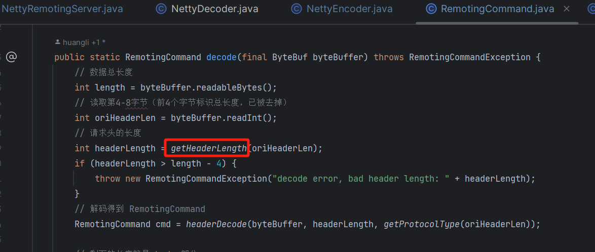

public static int getHeaderLength(int length) {

return length & 0xFFFFFF;

}

因为「**请求头长度**」是存储在后 3 个字节，所以和 [0x00FFFFFF](http://0x00ffffff%20/) 按位与 & 就能得到后 3 个字节的值：

0 0 0 0 0 0 0 1 | 0 0 0 0 0 0 0 0 | 0 0 0 0 0 0 1 0 | 0 0 1 0 1 0 1 1 (16777771)

& 0 0 0 0 0 0 0 0 | 1 1 1 1 1 1 1 1 | 1 1 1 1 1 1 1 1 | 1 1 1 1 1 1 1 1 (0x00FFFFFF)

\= 0 0 0 0 0 0 0 0 | 0 0 0 0 0 0 0 0 | 0 0 0 0 0 0 1 0 | 0 0 1 0 1 0 1 1 (555)

## **2.3.3 获取序列化类型**

同样的，可以从这个整数中读取「**序列化类型**」。

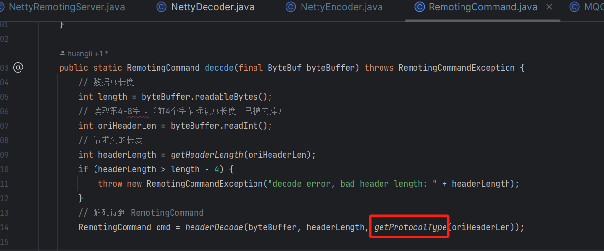

public static SerializeType getProtocolType(int source) {

return SerializeType.valueOf((byte) ((source >> 24) & 0xFF));

}

「**序列化类型**」存储在第一个字节，所以只需将其右移 >> 24 位就可以得到第一个字节的值：

0 0 0 0 0 0 0 1 | 0 0 0 0 0 0 0 0 | 0 0 0 0 0 0 1 0 | 0 0 1 0 1 0 1 1 (16777771)

0 0 0 0 0 0 0 0 | 0 0 0 0 0 0 0 0 | 0 0 0 0 0 0 0 0 | 0 0 0 0 0 0 0 1 (16777771 >> 24)

& 0 0 0 0 0 0 0 0 | 0 0 0 0 0 0 0 0 | 0 0 0 0 0 0 0 0 | 1 1 1 1 1 1 1 1 (0xFF)

\= 0 0 0 0 0 0 0 0 | 0 0 0 0 0 0 0 0 | 0 0 0 0 0 0 0 0 | 0 0 0 0 0 0 0 1 (1)

## **2.3.4 数据长度问题**

通过上述剖析，知道后三个字节用来存储「**请求头长度**」，所以「**请求头**」的最大长度为 [16777215](http://0.255.255.255/)（[0x00FFFFFF](http://0.255.255.255/)），需要注意控制「**请求头**」的大小不能超过这个阈值。

[NettyDecoder](http://nettydecoder%20/) 中解析数据设置的最大长度为 [16777216](http://1.0.0.0/)，而这个长度是包括「**请求头**」和「**请求体**」两部分的长度，所以如果「**请求头**」和「**请求体**」都比较长，需要修改这个限制。

## **2.4 消息头序列化**

## **Json 序列化**

如果是 JSON 序列化，会调用 [RemotingSerializable#encode](http://remotingserializable/#encode%20) 方法来序列化 [RemotingCommand](http://remotingcommand/)。

byte\[\] header = RemotingSerializable.encode(this);

进去可以看到，它其实就是用 [fastjson](http://fastjson%20/) 包来序列化对象成字符串，然后返回字符串的字节数组。

源码位置：[https://github.com/apache/rocketmq/blob/release-5.1.2/](https://github.com/apache/rocketmq/blob/release-5.1.2/remoting/src/main/java/org/apache/rocketmq/remoting/protocol/RemotingSerializable.java)[remoting](https://github.com/apache/rocketmq/blob/release-5.1.2/remoting/src/main/java/org/apache/rocketmq/remoting/protocol/RemotingSerializable.java)[/src/main/java/org/apache/rocketmq/remoting/](https://github.com/apache/rocketmq/blob/release-5.1.2/remoting/src/main/java/org/apache/rocketmq/remoting/protocol/RemotingSerializable.java)[protocol/RemotingSerializable](https://github.com/apache/rocketmq/blob/release-5.1.2/remoting/src/main/java/org/apache/rocketmq/remoting/protocol/RemotingSerializable.java)[.java](https://github.com/apache/rocketmq/blob/release-5.1.2/remoting/src/main/java/org/apache/rocketmq/remoting/protocol/RemotingSerializable.java)

public abstract class RemotingSerializable {

private final static Charset CHARSET\_UTF8 \= StandardCharsets.UTF\_8;

public static byte\[\] encode(final Object obj) {

if (obj == null) {

return null;

}

final String json \= toJson(obj, false);

return json.getBytes(CHARSET\_UTF8);

}

public static String toJson(final Object obj, boolean prettyFormat) {

return JSON.toJSONString(obj, prettyFormat);

}

....

}

## **Json 反序列化**

反序列化时，它是从 [ByteBuf](http://bytebuf%20/) 读取请求头长度的字节数据，然后调用 [RemotingSerializable#decode](http://remotingserializable/#decode) 方法来反序列化得到 [RemotingCommand](http://remotingcommand/)。

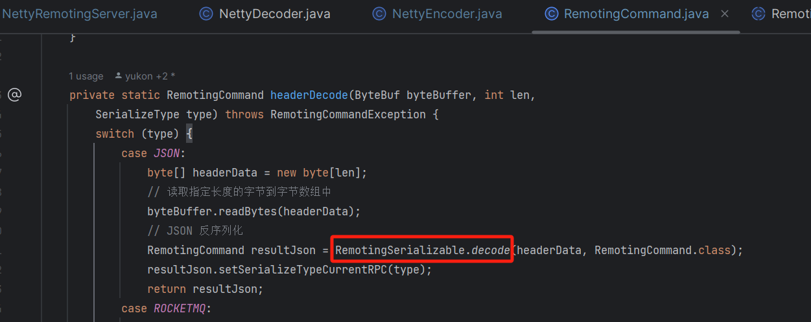

进去可以看到，它就是将字节数组转为字符串，然后用 [fastjson](http://fastjson%20/) 反序列化成对象。

public abstract class RemotingSerializable {

public static <T> T decode(final byte\[\] data, Class<T> classOfT) {

return fromJson(data, classOfT);

}

public static <T> T fromJson(String json, Class<T> classOfT) {

return JSON.parseObject(json, classOfT);

}

....

}

## **RocketMQ 序列化**

如果是 ROCKETMQ 序列化，会调用 [RocketMQSerializable#rocketMQProtocolEncode](http://rocketmqserializable/#rocketMQProtocolEncode) 方法来序列化 [RemotingCommand](http://remotingcommand/)。

// ROCKETMQ 序列化

headerSize = RocketMQSerializable.rocketMQProtocolEncode(this, out);

进去可以看到，它其实就是将 [RemotingCommand](http://remotingcommand%20/) 中的属性挨个写入 [ByteBuf](http://bytebuf%20/) 中，那么在读取的时候必定也是按写入的顺序读取。

public static int rocketMQProtocolEncode(RemotingCommand cmd, ByteBuf out) {

int beginIndex \= out.writerIndex();

// int code(~32767)

out.writeShort(cmd.getCode());

// LanguageCode language

out.writeByte(cmd.getLanguage().getCode());

// int version(~32767)

out.writeShort(cmd.getVersion());

// int opaque

out.writeInt(cmd.getOpaque());

// int flag

out.writeInt(cmd.getFlag());

// String remark

String remark \= cmd.getRemark();

if (remark != null && !remark.isEmpty()) {

writeStr(out, false, remark);

} else {

out.writeInt(0); // 数据长度为0

}

int mapLenIndex \= out.writerIndex();

out.writeInt(0);

if (cmd.readCustomHeader() instanceof FastCodesHeader) {

((FastCodesHeader) cmd.readCustomHeader()).encode(out);

}

HashMap<String, String> map = cmd.getExtFields();

if (map != null && !map.isEmpty()) {

map.forEach((k, v) -> {

if (k != null && v != null) {

writeStr(out, true, k);

writeStr(out, false, v);

}

});

}

// 写入 map 的长度

out.setInt(mapLenIndex, out.writerIndex() - mapLenIndex - 4);

// 返回写入的总长度

return out.writerIndex() - beginIndex;

}

写入数据时，要记录数据的总长度，写完后用结束时的 [writerIndex](http://writerindex%20/) 和起始的 [writerIndex](http://writerindex%20/) 相减得到写入的数据总长度。

对于 int、short、byte 等类型的长度是固定的，所以读取的时候就读取对应长度的数据即可。但如果是字符串、或是 Map 等对象类型，它的长度就不是固定的了。

例如写入字符串时，可以看到，它会固定用一个 int(4字节) 来标识字符串的长度，如果字符串为空，则长度为 0。这样在读取数据时，就会先读取这个长度，再读取后面指定长度的字节，这样就能读取变长数据了。

public static void writeStr(ByteBuf buf, boolean useShortLength, String str) {

// 起始位置

int lenIndex \= buf.writerIndex();

if (useShortLength) {

// 用 short 来记录长度

buf.writeShort(0);

} else {

// 用 int 来记录长度

buf.writeInt(0);

}

// 写入字符串

int len \= buf.writeCharSequence(str, StandardCharsets.UTF\_8);

// 写入数据长度

if (useShortLength) {

buf.setShort(lenIndex, len);

} else {

buf.setInt(lenIndex, len);

}

}

可以看到，读取的时候就是先读取数据长度，再往后读取指定长度的字节。

private static String readStr(ByteBuf buf, boolean useShortLength, int limit) throws RemotingCommandException {

// 读取长度

int len \= useShortLength ? buf.readShort() : buf.readInt();

if (len == 0) {

return null;

}

if (len > limit) {

throw new RemotingCommandException("string length exceed limit:" + limit);

}

// 读取指定长度的数据

CharSequence cs \= buf.readCharSequence(len, StandardCharsets.UTF\_8);

return cs \=\= null ? null : cs.toString();

}

## **RocketMQ 反序列化**

ROCKETMQ 反序列化，会调用 [RocketMQSerializable#rocketMQProtocolDecode](http://rocketmqserializable/#rocketMQProtocolDecode) 方法来反序列化 [ByteBuf](http://bytebuf%20/) 得到 [RemotingCommand](http://remotingcommand/)。

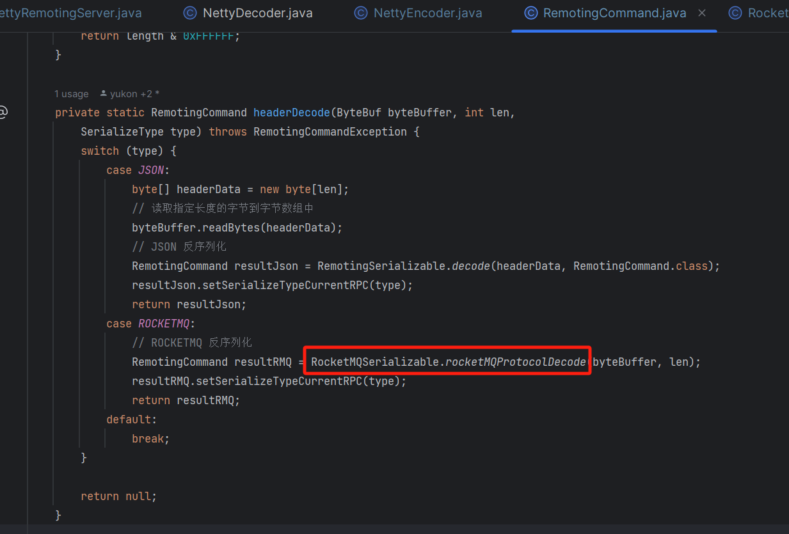

进去可以看到，其实就是序列化时的逆向过程，再挨个按顺序将数据读取出来设置到 [RemotingCommand](http://remotingcommand%20/) 中。

public static RemotingCommand rocketMQProtocolDecode(final ByteBuf headerBuffer,

int headerLen) throws RemotingCommandException {

RemotingCommand cmd \= new RemotingCommand();

// int code(~32767)

cmd.setCode(headerBuffer.readShort());

// LanguageCode language

cmd.setLanguage(LanguageCode.valueOf(headerBuffer.readByte()));

// int version(~32767)

cmd.setVersion(headerBuffer.readShort());

// int opaque

cmd.setOpaque(headerBuffer.readInt());

// int flag

cmd.setFlag(headerBuffer.readInt());

// String remark

cmd.setRemark(readStr(headerBuffer, false, headerLen));

// HashMap<String, String> extFields

// 读取扩展Map

int extFieldsLength \= headerBuffer.readInt();

if (extFieldsLength > 0) {

if (extFieldsLength > headerLen) {

throw new RemotingCommandException("RocketMQ protocol decoding failed, extFields length: " + extFieldsLength + ", but header length: " + headerLen);

}

cmd.setExtFields(mapDeserialize(headerBuffer, extFieldsLength));

}

return cmd;

}

## **2.5 消息体序列化**

剖析完消息头序列化，我们来看下消息主体 body 在设置的时候就是字节数组，是怎么序列化的呢。

public void setBody(byte\[\] body) {

this.body = body;

}

我们以获取路由数据为例来看看，可以看到它是调用 [TopicRouteData](http://topicroutedata%20/) 对象的 [encode](http://encode%20/) 方法来编码成字节数组。

public RemotingCommand getRouteInfoByTopic(ChannelHandlerContext ctx, RemotingCommand request) throws RemotingCommandException {

// 创建相应

final RemotingCommand response \= RemotingCommand.createResponseCommand(null);

// 获取路由数据

TopicRouteData topicRouteData \= this.namesrvController.getRouteInfoManager().pickupTopicRouteData(requestHeader.getTopic());

// TopicRouteData 编码成字节数组

byte\[\] content = topicRouteData.encode();

// 设置请求体

response.setBody(content);

return response;

}

可以看到 [TopicRouteData](http://topicroutedata%20/) 是继承自 [RemotingSerializable](http://remotingserializable%20/) 类，这不就是前面提供 [JSON](http://json%20/) 序列化的类吗。

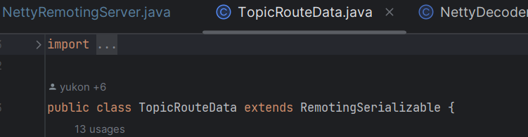

而所调用的 [encode()](http://encode\(\)/) 方法实际就是调用的 [RemotingSerializable#encode](http://remotingserializable/#encode) 方法，它就是将当前对象序列化为 [json](http://json%20/) 字符串，然后返回字符串的字节数组。

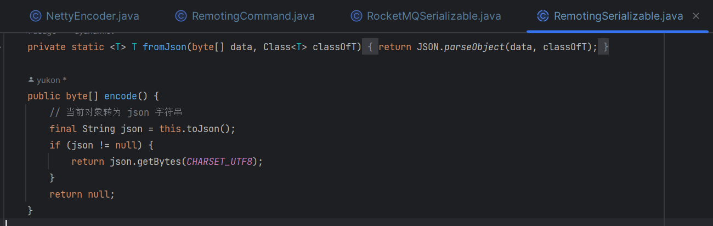

而在获取到数据后，就是在调用 [RemotingSerializable#decode](http://remotingserializable/#decode) 方法来反序列化成指定的对象。

byte\[\] body = response.getBody();

if (body != null) {

return TopicRouteData.decode(body, TopicRouteData.class);

}

public static <T> T decode(final byte\[\] data, Class<T> classOfT) {

final String json \= new String(data, CHARSET\_UTF8);

return fromJson(json, classOfT);

}

public static <T> T fromJson(String json, Class<T> classOfT) {

return JSON.parseObject(json, classOfT);

}

从上面的分析可以看出，如果要传输 body 数据，需自定义数据对象继承自 [RemotingSerializable](http://remotingserializable/)，然后调用 encode 和 decode 方法来序列化和反序列化对象。

通过上面的剖析可以得知：

1.  请求体 body 部分的序列化是基于 [JSON](http://json%20/) 的序列化方式。
2.  请求头是支持 [JSON](http://json%20/) 和 [ROCKETMQ](http://rocketmq%20/) 两种序列化方式的。

## **2.6 创建请求与响应**

// 创建请求对象

public static RemotingCommand createRequestCommand(int code, CommandCustomHeader customHeader) {

RemotingCommand cmd \= new RemotingCommand();

cmd.setCode(code); // 请求编码

cmd.customHeader = customHeader; // 请定义请求头

setCmdVersion(cmd);

return cmd;

}

// 创建响应

public static RemotingCommand createResponseCommand(int code, String remark, Class<? extends CommandCustomHeader> classHeader) {

RemotingCommand cmd \= new RemotingCommand();

cmd.markResponseType(); // 设置为响应类型（默认为请求类型）

cmd.setCode(code); // 请求编码

cmd.setRemark(remark);

setCmdVersion(cmd);

// 设置响应头

if (classHeader != null) {

try {

CommandCustomHeader objectHeader \= classHeader.getDeclaredConstructor().newInstance();

cmd.customHeader = objectHeader;

} catch (InstantiationException e) {

return null;

} catch (IllegalAccessException e) {

return null;

} catch (InvocationTargetException e) {

return null;

} catch (NoSuchMethodException e) {

return null;

}

}

return cmd;

}

## **03 总结**