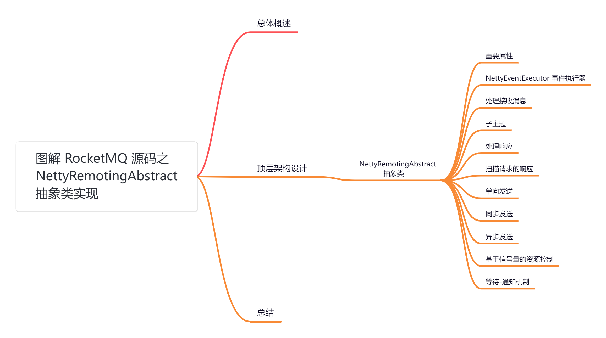
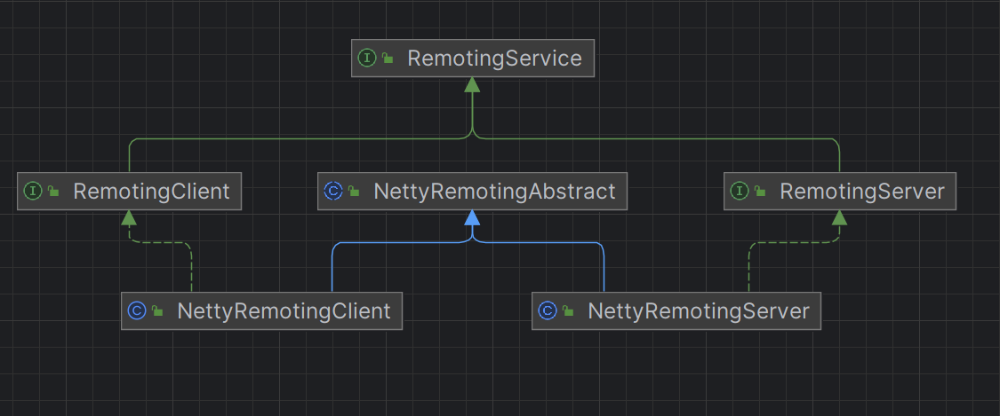
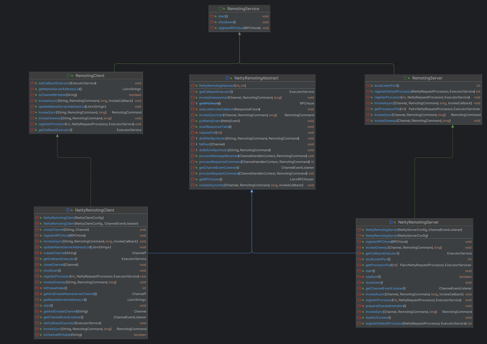
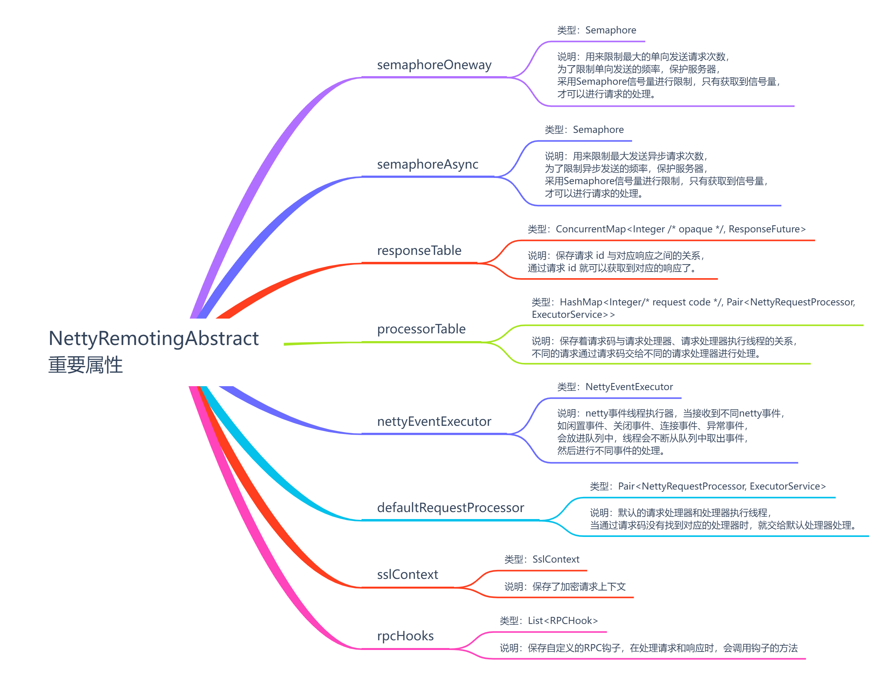
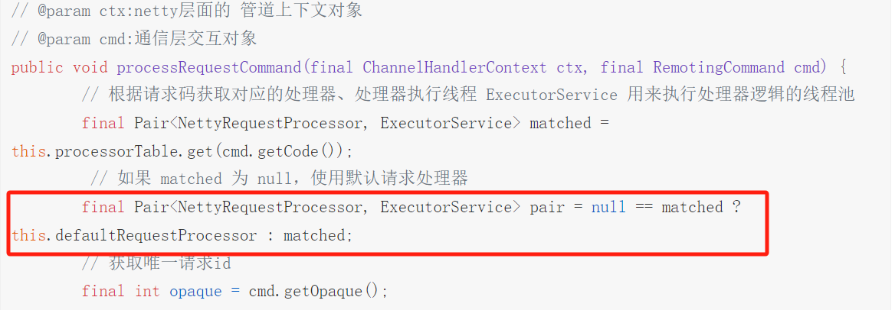
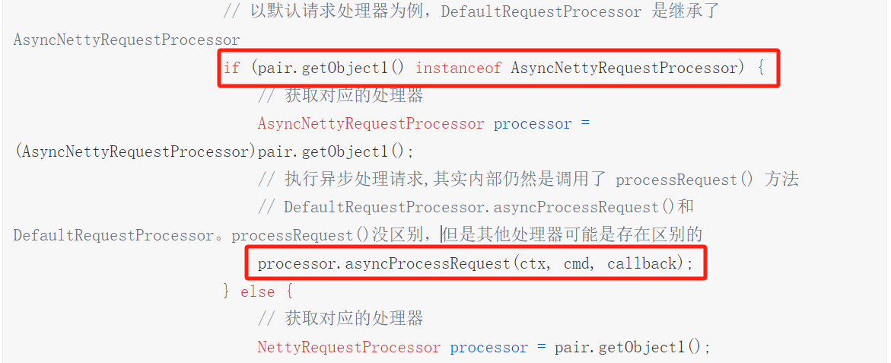
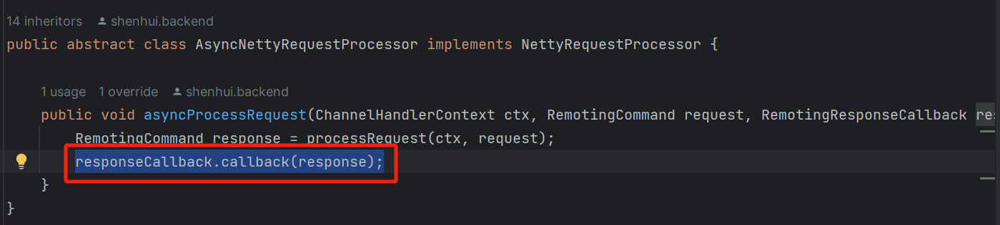
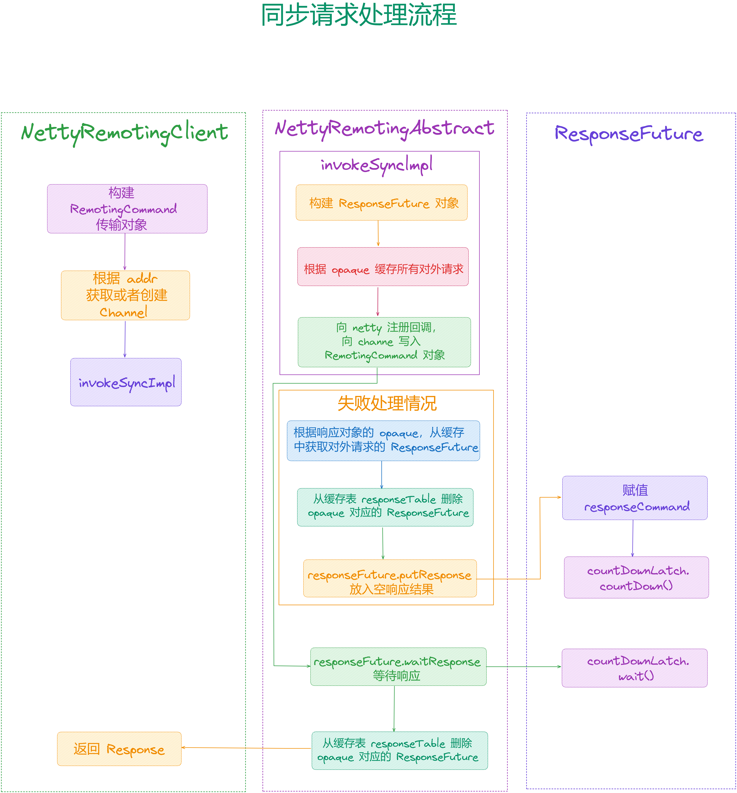
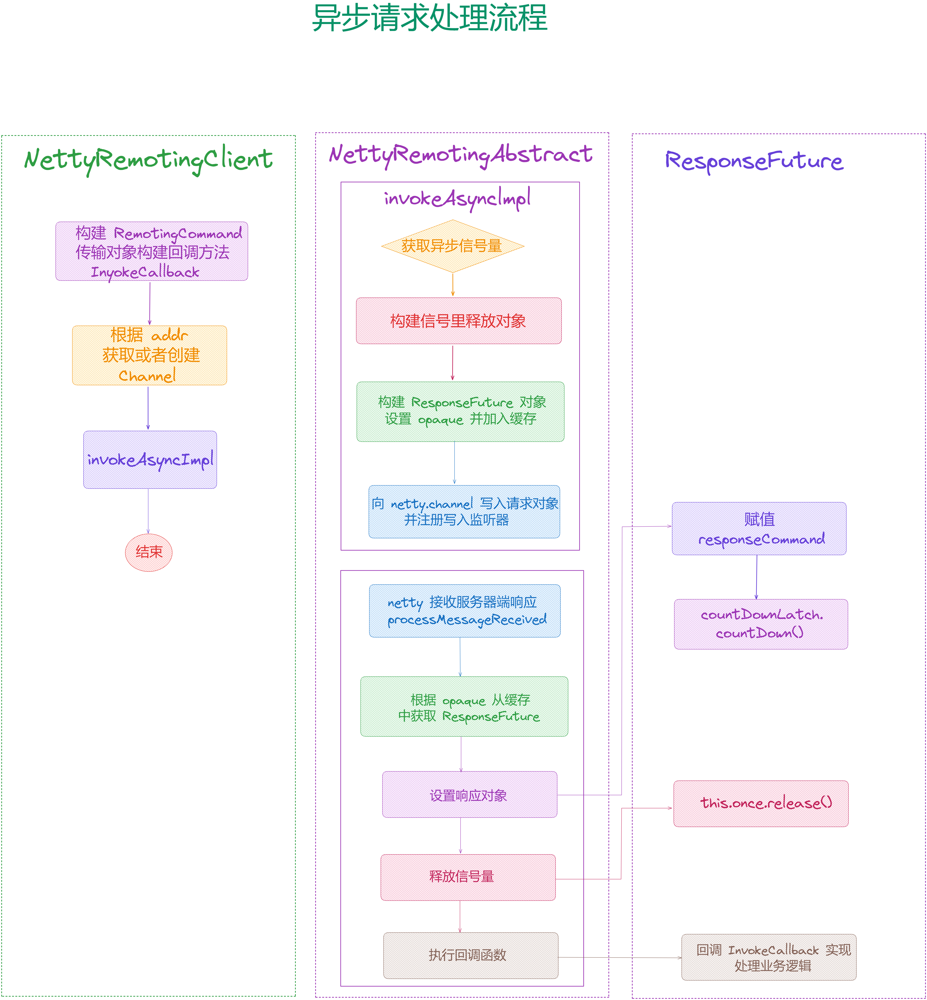

大家好，我是**华仔**, 又跟大家见面了。

从今天开始我将继续为大家奉上 RocketMQ 消费者源码剖析系列文章，正式开启「**RocketMQ 的网络通信源码之旅**」，这是第一篇，本篇我们将以「**RocketMQ 5.1.2**」版本为主，来剖析下 RocketMQ 源码之 [NettyRemotingAbstract](http://nettyremotingabstract%20%20/) 抽象类实现剖析。

这里我将以「**RocketMQ 5.1.2**」版本为主，通过「**场景驱动**」的方式带大家一点点的对 RocketMQ 源码进行深度剖析，正式开启「**RocketMQ 的源码之旅**」，跟我一起来掌握 RocketMQ 源码核心架构设计思想吧。

  

##   
**01 总体概述**

我们知道 RocketMQ 通信模块基于 Netty 实现，总体代码量相对不多。主要是 「**NettyRemotingServer**」和「**NettyRemotingClient**」，分别对应通信的服务端和客户端。

如果你理解 Netty 示例，理解 RocketMQ 是如何基于 Netty 进行通信，只需要知道以下 4 点：

1.  [NettyRemotingServer](http://nettyremotingserver/) 如何初始化。
2.  [NettyRemotingClient](http://nettyremotingclient/) 初始化。
3.  如何基于 [NettyRemotingClient](http://nettyremotingclient/) 发送消息
4.  无论是客户端还是服务端收到数据后都需要 Handler 来处理。

在 [【生产者源码分析系列第六篇】图解 RocketMQ 源码之网络通讯组件 NettyRemotingClient 架构设计](https://articles.zsxq.com/id_zgofuq2lee3e.html) ，[【网络通信源码分析系列第一篇源码】图解 RocketMQ 源码之 NettyRemotingServer 初始化全流程](https://articles.zsxq.com/id_r2fzf5hwlm8g.html) 这两篇中已经剖析了网络通讯组件「**NettyRemotingClient**」、「**NettyRemotingServer**」，今天我们来看下「**NettyRemotingAbstract**」抽象类是如何实现的。

## **02 顶层架构设计**

我们再来回顾下 RocketMQ 底层网络通讯顶层设计，其类图设计如下：

其类依赖关系详细图如下：

根据上图的整个通信类结构可以看到，[NettyRemotingAbstract](http://nettyremotingabstract/) 抽象类是真正实现「**处理请求命令**」、「**处理响应命令**」、「**发送同步请求**」、「**发送异步请求**」、「**发送单向请求**」等。

这里来简单的梳理下其调用关系：

1.  **RemotingService：**它是远程通信服务的**顶级接口**，内部定义了「**启动网络层**」、「**关闭网络层**」、「**注册请求前后的钩子**」等3个方法。
2.  **RemotingClient：**它是远程通信客户端接口，其继承 [RemotingService](http://remotingservice/)，另外扩展了「**获取/更新 NameServer 地址**」、「**同步、异步、单向**」3种请求、「**注册请求处理器**」、「**添加回调执行器**」等方法。
3.  **RemotingServer：**它是远程通信服务端接口，位于第二层，其继承 [RemotingService](http://remotingservice/)，另外扩展了「**注册请求处理器**」、「**获取<请求处理器,执行器>**」、「**同步、异步、单向**」3种请求等方法。
4.  **NettyRemotingAbstract：**它是 Netty 远程服务抽象类，位于第二层，内部封装了「**获取通道事件监听器**」、「**添加 Netty Event 到执行器中**」、「**处理消息接收**」、「**处理请求命令**」、「**处理返回命令**」、「**获取 RPC 钩子**」、「**获取回调执行器**」、「**同步、异步、单向**」3种请求实现方法。主要定义了 Server 和 client 公用的方法和属性：
5.  控制异步请求和单向请求的并发控制器 Semaphore。
6.  响应对象映射表：[protected final ConcurrentMap<Integer /\* opaque \*/, ResponseFuture> responseTable](http://protected%20final%20concurrentmapinteger%20/*%20opaque%20*/,%20ResponseFuture%20responseTable)。
7.  请求处理器映射表：[protected final HashMap<Integer/\* request code \*/, Pair<NettyRequestProcessor, ExecutorService>> processorTable](http://protected%20final%20hashmapinteger/*%20request%20code%20*/,%20PairNettyRequestProcessor,%20ExecutorService%20processorTable)。
8.  Netty 事件监听线程池：[protected final NettyEventExecutor nettyEventExecutor](http://protected%20final%20nettyeventexecutor%20nettyeventexecutor/)。
9.  默认的请求处理器对：[protected Pair<NettyRequestProcessor, ExecutorService> defaultRequestProcessor](http://xn--protected%20pairnettyrequestprocessor,%20executorservice%20defaultrequestprocessor:protected%20listrpchook%20rpchooks-8537rut7v3en1dmpsb/)
10.  [钩子集合：protected List<RPCHook> rpcHooks](http://xn--protected%20pairnettyrequestprocessor,%20executorservice%20defaultrequestprocessor:protected%20listrpchook%20rpchooks-8537rut7v3en1dmpsb/)。
11.  **NettyRemotingClient：**它是 Netty 远程通信客户端类，其继承自 [NettyRemotingAbstract](http://nettyremotingabstract/) 实现了[RemotingClient](http://remotingclient/) 接口，复写「**同步、异步、单向**」3种请求，扩展了「**关闭通道**」方法。
12.  **NettyRemotingServer：**它是 Netty 远程通信服务端类，其继承自 [NettyRemotingAbstract](http://nettyremotingabstract/) 实现了[RemotingServer](http://remotingserver/) 接口，复写「**同步、异步、单向**」3种请求。

在 RocketMQ 中自定义了**通信协议并在 Netty 的基础上扩展了通信模块**。

首先通信的两端分为「**客户端**」和「**服务端**」，客户端和服务端都有「**启动**」、「**关闭**」的方法，为了在处理请求之前和返回响应之后做一些事情，采用「**钩子机制**」来扩展，所以还需要一个「**注册钩子**」的方法，定义的客户端和服务端的公共接口。

##   
**2.1 NettyRemotingAbstract 抽象类**

[NettyRemotingAbstract](http://nettyremotingabstract/) 类是客户端具体实现类 [NettyRemotingClient](http://nettyremotingclient/) 和服务端具体实现类[NettyRemotingServer](http://nettyremotingserver/) 的抽象类，[NettyRemotingAbstract](http://nettyremotingabstract/) 类实现 [NettyRemotingClient](http://nettyremotingclient/) 和[NettyRemotingServer](http://nettyremotingserver/) 的一些公共方法，不同抽象方法交给 [NettyRemotingClient](http://nettyremotingclient/) 和 [NettyRemotingServer](http://nettyremotingserver/) 去具体实现。

源码位置：[https://github.com/apache/rocketmq/blob/release-5.1.2/client/src/main/java/org/apache/rocketmq/](https://github.com/apache/rocketmq/blob/release-5.1.2/client/src/main/java/org/apache/rocketmq/remoting/netty/NettyRemotingAbstract.java)[remoting](https://github.com/apache/rocketmq/blob/release-5.1.2/client/src/main/java/org/apache/rocketmq/remoting/netty/NettyRemotingAbstract.java)[/](https://github.com/apache/rocketmq/blob/release-5.1.2/client/src/main/java/org/apache/rocketmq/remoting/netty/NettyRemotingAbstract.java)[netty/NettyRemotingAbstract](https://github.com/apache/rocketmq/blob/release-5.1.2/client/src/main/java/org/apache/rocketmq/remoting/netty/NettyRemotingAbstract.java)[.java](https://github.com/apache/rocketmq/blob/release-5.1.2/client/src/main/java/org/apache/rocketmq/remoting/netty/NettyRemotingAbstract.java)

## **2.1.1 重要属性**

// NettyRemotingAbstract

// 源码位置如下：

// 子项目: remoting

// 包名: org.apache.rocketmq.remoting.netty;

// 文件: NettyRemotingAbstract

// 行数: 55

public abstract class NettyRemotingAbstract {

/\*\*

\* Remoting logger instance.

\*/

private static final InternalLogger log \= InternalLoggerFactory.getLogger(RemotingHelper.ROCKETMQ\_REMOTING);

// 限制最大的单向发送请求次数，默认最大单向并发数量为 65535

protected final Semaphore semaphoreOneway;

// 限制最大发送异步请求并发次数，默认最大异步并发数量为 65535

protected final Semaphore semaphoreAsync;

// 保存请求id与对应响应之间的关系

// 缓存所有正在进行处理的请求，为什么要缓存？以生产者向 NameServer 同步获取路由信息为例，ResponseFuture 内部实现了可以让生产者线程进行阻塞等待 NameServer 结果的逻辑，如果不缓存的话，NameServer 响应的时候无法获取到生产者线程进行唤醒或者无法执行指定的异步回调函数。并且会定时扫描此表中过期的请求，防止长时间请求未响应导致线程永久阻塞。

protected final ConcurrentMap<Integer /\* opaque \*/, ResponseFuture> responseTable =

new ConcurrentHashMap<Integer, ResponseFuture>(256);

// 请求处理器映射表，保存请求码与处理器、处理器执行线程的关系。根据协议码 code 获取不同的请求处理器进行不同的业务逻辑处理

protected final HashMap<Integer/\* request code \*/, Pair<NettyRequestProcessor, ExecutorService>> processorTable =

new HashMap<Integer, Pair<NettyRequestProcessor, ExecutorService>>(64);

//netty事件线程执行器

protected final NettyEventExecutor nettyEventExecutor \= new NettyEventExecutor();

//默认的请求处理器和处理器执行线程

protected Pair<NettyRequestProcessor, ExecutorService> defaultRequestProcessor;

// ssl 上下文

protected volatile SslContext sslContext;

//自定义的RPC钩子

protected List<RPCHook> rpcHooks = new ArrayList<RPCHook>();

....

}

[NettyRemotingAbstract](http://nettyremotingabstract/) 类的一些重要属性如下：

## **2.1.2 NettyEventExecutor 事件执行器**

// NettyEventExecutor 事件执行器

// 源码位置如下：

// 子项目: remoting

// 包名: org.apache.rocketmq.remoting.netty;

// 文件: NettyRemotingAbstract

// 行数: 55

class NettyEventExecutor extends ServiceThread {

// 保存 netty 事件队列

private final LinkedBlockingQueue<NettyEvent> eventQueue = new LinkedBlockingQueue<NettyEvent>();

private final int maxSize \= 10000;

// 将事件添加到队列中

public void putNettyEvent(final NettyEvent event) {

int currentSize \= this.eventQueue.size();

// 没超限之前可以继续添加事件

if (currentSize <= maxSize) {

this.eventQueue.add(event);

} else {

log.warn("event queue size \[{}\] over the limit \[{}\], so drop this event {}", currentSize, maxSize, event.toString());

}

}

@Override

public void run() {

log.info(this.getServiceName() + " service started");

// 通道事件监听器

final ChannelEventListener listener \= NettyRemotingAbstract.this.getChannelEventListener();

// 线程一直运行

while (!this.isStopped()) {

try {

// 从队列中不断拿出事件，根据事件类型调用事件监听器的不同处理方法

NettyEvent event \= this.eventQueue.poll(3000, TimeUnit.MILLISECONDS);

if (event != null && listener != null) {

switch (event.getType()) {

case IDLE:

listener.onChannelIdle(event.getRemoteAddr(), event.getChannel());

break;

case CLOSE:

listener.onChannelClose(event.getRemoteAddr(), event.getChannel());

break;

case CONNECT:

listener.onChannelConnect(event.getRemoteAddr(), event.getChannel());

break;

case EXCEPTION:

listener.onChannelException(event.getRemoteAddr(), event.getChannel());

break;

default:

break;

}

}

} catch (Exception e) {

log.warn(this.getServiceName() + " service has exception. ", e);

}

}

log.info(this.getServiceName() + " service end");

}

@Override

public String getServiceName() {

return NettyEventExecutor.class.getSimpleName();

}

}

[NettyEventExecutor](http://nettyeventexecutor/) 类是 [NettyRemotingAbstract](http://nettyremotingabstract/) 类的一个内部类，实现上是一个线程。其中 [eventQueue](http://eventqueue/) 是一个「**保存事件**」的「**阻塞队列**」，最大只能保存「**10000**」个事件，当超过最大的容量时，将事件丢弃。

当 [NettyEventExecutor](http://nettyeventexecutor/) 启动时，不断从队列中取出事件，根据「**事件类型**」将事件交给「**通道监听器**」的「**不同方法**」进行处理。

在 [NettyRemotingAbstract](http://nettyremotingabstract/) 类中，将添加事件委托给 [NettyEventExecutor](http://nettyeventexecutor/) 类 [putNettyEvent](http://putnettyevent/) 方法进行添加到队列中。

接下来我们来剖析下该类的重要方法。

## **2.1.3 处理接收消息**

// 处理接收消息方法

// 源码位置如下：

// 子项目: remoting

// 包名: org.apache.rocketmq.remoting.netty;

// 文件: NettyRemotingAbstract

// 行数: 153

// @param ctx:netty层面 channelHandler上下文

// @param msg:rocketMQ通信层交互对象

public void processMessageReceived(ChannelHandlerContext ctx, RemotingCommand msg) throws Exception {

final RemotingCommand cmd \= msg;

if (cmd != null) {

// 根据不同命令类型进行不同逻辑处理

// 具体判断逻辑其实是请求头中的flag属性的

// flag 字段低 1 位为 0，代表是请求命令

// flag 字段低 1 位为 1，代表是响应命令

switch (cmd.getType()) {

// 处理请求命令逻辑

case REQUEST\_COMMAND:

processRequestCommand(ctx, cmd);

break;

// 处理响应命令逻辑

case RESPONSE\_COMMAND:

processResponseCommand(ctx, cmd);

break;

default:

break;

}

}

}

假如此时处于服务端，当客户端发送消息过来之后，首先会进行「**解码操作**」，随后 RocketMQ 通过配置的[NettyServerHandler](http://nettyserverhandler/) 读取到消息以后调用本方法处理接收消息逻辑。

简单的处理方法就是：根据 [flag](http://flag/) 字段判断是「**请求命令**」还是「**响应命令**」。

1.  将请求类型交给 [processRequestCommand](http://processrequestcommand/) 方法处理。
2.  将响应类型交给 [processResponseCommand](http://processresponsecommand/) 方法处理。

那么何时执行到「**处理请求命令**」的逻辑？

当 [Broker](http://broker/) 启动后会向 [NameServer](http://nameserver/) 注册自身相关的信息，此时 [NameServer](http://nameserver/) 就需要执行「**处理请求命令**」逻辑，当处理完成以后向 [Broker](http://broker/) 返回响应，此时的 [Broker](http://broker/) 也会走处理「**响应命令**」逻辑。

## **2.1.4 处理请求**

// 处理远程对等方发出的传入请求命令

// 源码位置如下：

// 子项目: remoting

// 包名: org.apache.rocketmq.remoting.netty;

// 文件: NettyRemotingAbstract

// 行数: 192

// @param ctx:netty层面的 管道上下文对象

// @param cmd:通信层交互对象

public void processRequestCommand(final ChannelHandlerContext ctx, final RemotingCommand cmd) {

// 根据请求码获取对应的处理器、处理器执行线程 ExecutorService 用来执行处理器逻辑的线程池

final Pair<NettyRequestProcessor, ExecutorService> matched = this.processorTable.get(cmd.getCode());

// 如果该 Code 没有注册的 RequestProcessor，则采用 DefaultRequestProcessor 作为默认请求处理器，使用 remotingExecutor 作为默认请求执行器

final Pair<NettyRequestProcessor, ExecutorService> pair = null == matched ? this.defaultRequestProcessor : matched;

// 获取唯一请求id

final int opaque \= cmd.getOpaque();

if (pair != null) {

// 创建执行请求处理的线程任务，处理请求以及响应的逻辑

Runnable run \= new Runnable() {

/\*\*

\* 执行此方法的时候 说明 已经被包装为了 RequestTask 对象，并且提交到了线程池

\*/

@Override

public void run() {

try {

// 获取对端远程地址

String remoteAddr \= RemotingHelper.parseChannelRemoteAddr(ctx.channel());

// 请求之前执行 RPC 钩子

doBeforeRpcHooks(remoteAddr, cmd);

// 定义 callback 对象此方法不会立即执行而是被请求处理器执行完毕后进行回调

final RemotingResponseCallback callback \= new RemotingResponseCallback() {

@Override

public void callback(RemotingCommand response) {

// 如果执行到这里则说明已经处理完毕，可能会存在返回值

// 响应之后执行 RPC 钩子

doAfterRpcHooks(remoteAddr, cmd, response);

if (!cmd.isOnewayRPC()) { // 非单向请求

// 响应不为空，将响应返回

if (response != null) {

// 设置请求唯一id

response.setOpaque(opaque);

// 标记为响应类型数据 其实就是 flag 字段的低 0 位的值是 1

response.markResponseType();

response.setSerializeTypeCurrentRPC(cmd.getSerializeTypeCurrentRPC());

try {

// 写入对端

ctx.writeAndFlush(response);

} catch (Throwable e) {

log.error("process request over, but response failed", e);

log.error(cmd.toString());

log.error(response.toString());

}

} else {

}

}

}

};

// 调用处理器处理请求

// 以默认请求处理器为例，DefaultRequestProcessor 是继承了AsyncNettyRequestProcessor

if (pair.getObject1() instanceof AsyncNettyRequestProcessor) {

// 获取对应的处理器

AsyncNettyRequestProcessor processor \= (AsyncNettyRequestProcessor)pair.getObject1();

// 执行异步处理请求,其实内部仍然是调用了 processRequest() 方法

// DefaultRequestProcessor.asyncProcessRequest()和DefaultRequestProcessor。processRequest()没区别，但是其他处理器可能是存在区别的

processor.asyncProcessRequest(ctx, cmd, callback);

} else {

// 如果处理器不是异步请求处理器，那么调用同步处理的方法processRequest获取响应，然后同步调用callback回调方法

// 获取对应的处理器

NettyRequestProcessor processor \= pair.getObject1();

// 处理同步请求

RemotingCommand response \= processor.processRequest(ctx, cmd);

// 处理完成后调用回调方法

callback.callback(response);

}

} catch (Throwable e) {

log.error("process request exception", e);

log.error(cmd.toString());

// 如果不是单向RPC请求，直接返回系统错误

// 单向请求是指 对端发送数据之后，不需要响应对象

if (!cmd.isOnewayRPC()) {

final RemotingCommand response \= RemotingCommand.createResponseCommand(RemotingSysResponseCode.SYSTEM\_ERROR,

RemotingHelper.exceptionSimpleDesc(e));

response.setOpaque(opaque);

ctx.writeAndFlush(response);

}

}

}

};

// 如果处理器拒绝请求，则直接返回系统忙碌的响应 SYSTEM\_BUSY

if (pair.getObject1().rejectRequest()) {

// 创建 响应对象 响应码类型为 系统忙碌 SYSTEM\_BUSY

final RemotingCommand response \= RemotingCommand.createResponseCommand(RemotingSysResponseCode.SYSTEM\_BUSY,

"\[REJECTREQUEST\]system busy, start flow control for a while");

// 设置请求带来的唯一id

response.setOpaque(opaque);

// 写回对端

ctx.writeAndFlush(response);

return;

}

// 将上面的 run 包装成请求任务，并且提交给线程进行执行

// 也就是构建请求线程任务，然后通过执行器线程池执行

try {

// 包装成RequestTask对象

// @param run:runnable对象

// @param channel:通道关联的channel

// @param cmd:cmd对象 通信对象

final RequestTask requestTask \= new RequestTask(run, ctx.channel(), cmd);

// pair 内部存在两个对象 object1是处理器，object2是执行此处理器逻辑的线程池

// 此处时向线程池提交 requestTask 任务，这里支持多线程并发的执行请求处理

pair.getObject2().submit(requestTask);

} catch (RejectedExecutionException e) {

// 发生拒绝执行异常 打印系统忙碌的日志

if ((System.currentTimeMillis() % 10000) == 0) {

log.warn(RemotingHelper.parseChannelRemoteAddr(ctx.channel())

\+ ", too many requests and system thread pool busy, RejectedExecutionException "

\+ pair.getObject2().toString()

\+ " request code: " + cmd.getCode());

}

// 如果不是单向的RPC请求，则返回系统忙碌的响应

if (!cmd.isOnewayRPC()) {

final RemotingCommand response \= RemotingCommand.createResponseCommand(RemotingSysResponseCode.SYSTEM\_BUSY,

"\[OVERLOAD\]system busy, start flow control for a while");

response.setOpaque(opaque);

ctx.writeAndFlush(response);

}

}

} else {

// 如果没有处理器，则返回请求类型不支持的响应

String error \= " request type " + cmd.getCode() + " not supported";

final RemotingCommand response \=

RemotingCommand.createResponseCommand(RemotingSysResponseCode.REQUEST\_CODE\_NOT\_SUPPORTED, error);

response.setOpaque(opaque);

ctx.writeAndFlush(response);

log.error(RemotingHelper.parseChannelRemoteAddr(ctx.channel()) + error);

}

}

该方法是用来处理请求操作的，代码比较长，重要步骤如下：

1.  首先根据「**请求码**」获取「**处理器**」、「**处理器执行线程**」，如果获取不到请求处理器和处理器执行线程，则采用「**默认的请求处理器**」和「**线程执行器**」。
2.  当通过上述操作处理器还是为空的话，则返回请求类型不支持的响应。
3.  如果处理器不为空，将处理请求和响应的逻辑封装在 Runnable 类的 run 方法中。
4.  在请求处理之前，遍历所有钩子并执行钩子的请求之前方法。
5.  判断处理器是「**同步处理器**」还是「**异步处理器**」。
6.  如果是「**异步处理器**」，那么就通过「**异步处理器**」的异步处理方法处理请求。
7.  否则通过「**同步处理器**」的同步处理方法处理请求，等「**同步处理器**」处理完请求时，则调用响应的回调方法，回调方法会遍历所有钩子并执行钩子的响应之后方法。
8.  在处理器处理请求时，如果发生异常，并且请求不是单向的，则直接返回系统错误的响应。
9.  如果是处理器的拒绝请求，则直接返回「**系统忙碌**」的响应，然后将请求逻辑包装成请求任务，并且提交给线程进行执行。
10.  线程在执行过程中发生「**拒绝执行异常**」，则进行打印系统繁忙的日志。
11.  如果不是单向的 RPC 发送请求，则返回系统忙碌的响应。

为了方便你理解，这里我们以 [Broker](http://broker/) 向 [NameServer](http://nameserver/) 发送心跳包信息为例来梳理下处理逻辑，根据请求协议码 code 获取到默认的请求处理器，以默认的请求处理器为切入点来剖析下上面的「**处理请求命令**」的后续逻辑。

## 

然后会进入到 [processRequest()](http://processrequest\(\)/) 逻辑。根据协议码去执行不同的业务逻辑，以 [Broker](http://broker/) 向 [NameServer](http://nameserver/) 为例，code 码为 [REGISTER\_BROKER](http://register_broker/)，因此会走 [registerBrokerWithFilterServer()](http://registerbrokerwithfilterserver\(\)/) 逻辑。

源码位置：[https://github.com/apache/rocketmq/blob/release-5.1.2/client/src/main/java/org/apache/rocketmq/nameserver/](https://github.com/apache/rocketmq/blob/release-5.1.2/client/src/main/java/org/apache/rocketmq/nameserver/processor/DefaultRequestProcessor.java)[processor](https://github.com/apache/rocketmq/blob/release-5.1.2/client/src/main/java/org/apache/rocketmq/nameserver/processor/DefaultRequestProcessor.java)[/DefaultRequestProcessor.java](https://github.com/apache/rocketmq/blob/release-5.1.2/client/src/main/java/org/apache/rocketmq/nameserver/processor/DefaultRequestProcessor.java)

// 默认处理器处理请求逻辑

// 源码位置如下：

// 子项目: namesrv

// 包名: org.apache.rocketmq.namesrv.processor;

// 文件: DefaultRequestProcessor

// 行数: 192

// @param ctx:netty层面的 管道上下文对象

// @param request:请求

@Override

public RemotingCommand processRequest(ChannelHandlerContext ctx,

RemotingCommand request) throws RemotingCommandException {

....

// 根据请求code码 执行不同的业务逻辑

switch (request.getCode()) {

case RequestCode.PUT\_KV\_CONFIG:

return this.putKVConfig(ctx, request);

case RequestCode.GET\_KV\_CONFIG:

return this.getKVConfig(ctx, request);

case RequestCode.DELETE\_KV\_CONFIG:

return this.deleteKVConfig(ctx, request);

case RequestCode.QUERY\_DATA\_VERSION:

return queryBrokerTopicConfig(ctx, request);

case RequestCode.REGISTER\_BROKER:

// 获取 broker 的版本号

Version brokerVersion \= MQVersion.value2Version(request.getVersion());

// 如果条件成立，说明 mq 版本大于 3.0.11 我们是4.9.7 因此关注此逻辑

if (brokerVersion.ordinal() >= MQVersion.Version.V3\_0\_11.ordinal()) {

return this.registerBrokerWithFilterServer(ctx, request);

} else {

return this.registerBroker(ctx, request);

}

case RequestCode.UNREGISTER\_BROKER:

return this.unregisterBroker(ctx, request);

case RequestCode.GET\_ROUTEINFO\_BY\_TOPIC:

// 根据 topic 获取路由信息

// 以生产者发送消息为例 当生产者本地缓存映射表中不存在指定的topic时

// 会向 namesrv 获取 topic 路由信息 code 码为 GET\_ROUTEINFO\_BY\_TOPIC

return this.getRouteInfoByTopic(ctx, request);

// 获取 broker 集群信息

case RequestCode.GET\_BROKER\_CLUSTER\_INFO:

return this.getBrokerClusterInfo(ctx, request);

....

default:

break;

}

return null;

}

public RemotingCommand registerBrokerWithFilterServer(ChannelHandlerContext ctx, RemotingCommand request)

throws RemotingCommandException {

// 创建 SYSTEM\_ERROR 响应命令对象

// RemotingCommand.customHeader = 反射创建RegisterBrokerResponseHeader的对象

final RemotingCommand response \= RemotingCommand.createResponseCommand(RegisterBrokerResponseHeader.class);

// 获取自定义header RegisterBrokerResponseHeader

final RegisterBrokerResponseHeader responseHeader \= (RegisterBrokerResponseHeader) response.readCustomHeader();

// 从request中提取RegisterBrokerRequestHeader信息 此时正常情况下requestHeader中的属性是有值的。比如 brokerName、brokerAddr、clusterName、haServerAddr、brokerId

final RegisterBrokerRequestHeader requestHeader \=

(RegisterBrokerRequestHeader) request.decodeCommandCustomHeader(RegisterBrokerRequestHeader.class);

// 用于数据校验 crc32 循环冗余校验

if (!checksum(ctx, request, requestHeader)) {

response.setCode(ResponseCode.SYSTEM\_ERROR);

response.setRemark("crc32 not match");

return response;

}

// 生成注册broker需要的body数据 主要存放topic相关信息

RegisterBrokerBody registerBrokerBody \= new RegisterBrokerBody();

if (request.getBody() != null) {

try {

// 提取body数据到registerBrokerBody中

registerBrokerBody = RegisterBrokerBody.decode(request.getBody(), requestHeader.isCompressed());

} catch (Exception e) {

throw new RemotingCommandException("Failed to decode RegisterBrokerBody", e);

}

} else {

registerBrokerBody.getTopicConfigSerializeWrapper().getDataVersion().setCounter(new AtomicLong(0));

registerBrokerBody.getTopicConfigSerializeWrapper().getDataVersion().setTimestamp(0);

}

// 通过 routeInfoManager 注册broker 关键方法

RegisterBrokerResult result \= this.namesrvController.getRouteInfoManager().registerBroker(

requestHeader.getClusterName(), // 集群名称

requestHeader.getBrokerAddr(), // broker地址

requestHeader.getBrokerName(), // broker名称

requestHeader.getBrokerId(), // brokerID

requestHeader.getHaServerAddr(), // ha服务地址

registerBrokerBody.getTopicConfigSerializeWrapper(), // TopicConfigSerializeWrapper 存放topic相关信息

registerBrokerBody.getFilterServerList(), // 模式消息过滤相关

ctx.channel());

// 设置结果对象

responseHeader.setHaServerAddr(result.getHaServerAddr());

responseHeader.setMasterAddr(result.getMasterAddr());

byte\[\] jsonValue = this.namesrvController.getKvConfigManager().getKVListByNamespace(NamesrvUtil.NAMESPACE\_ORDER\_TOPIC\_CONFIG);

response.setBody(jsonValue);

response.setCode(ResponseCode.SUCCESS);

response.setRemark(null);

return response;

}

至此以路由注册请求举例，将整个请求链路梳理清楚了。其他的请求流程也是类似的，会根据不同的 code 值进行不同的业务处理。

## **2.1.5 处理响应**

既然是「**处理响应命令**」的，肯定是要向「**对端**」发送了请求，然后「**对端**」返回了结果，需要对结果进行处理。

以生产者同步向 [NameServer](http://nameserver/) 请求获取路由信息为例，会生成请求唯一id 「**opaque**」和 「**ResponseFuture**」对象，然后以「**opaque**」为key，value为「**ResponseFuture**」对象写入到「**responseTable**」表中。之后生产者线程会通过「**ResponseFuture**」进行线程阻塞，当 [NameServer](http://nameserver/) 将响应结果发送给生产者的时候，并且携带生产者生成的「**opaque**」值，生产者此时就需要执行 [processResponseCommand()](http://processresponsecommand\(\)/) 方法了。

根据「**opaque**」到「**responseTable**」映射表中获取对应的「**ResponseFuture**」，然后「**唤醒**」内部的生产者线程，并且将响应结果写入到「**ResponseFuture**」中，生产者线程可以从「**阻塞**」的状态恢复到「**运行态**」，并且根据「**ResponseFuture**」中的响应结果进行后续的处理逻辑。

这里再简单提一下，[ResponseFuture](http://responsefuture%20/) 内部实现线程阻塞的方式其实就是通过 JUC 包下的 [CountDownLatch](http://countdownlatch/)。

// 处理响应

// 源码位置如下：

// 子项目: remoting

// 包名: org.apache.rocketmq.remoting.netty;

// 文件: NettyRemotingAbstract

// 行数: 289

public void processResponseCommand(ChannelHandlerContext ctx, RemotingCommand cmd) {

// 获取唯一请求id

final int opaque \= cmd.getOpaque();

// 获取请求时放入的 future 如果未获取到说明可能 请求超时了

final ResponseFuture responseFuture \= responseTable.get(opaque);

if (responseFuture != null) {

// 设置结果

responseFuture.setResponseCommand(cmd);

// 根据请求 id 从映射表中移除保存的响应

responseTable.remove(opaque);

// 异步:执行回调不为空，执行异步回调方法

if (responseFuture.getInvokeCallback() != null) {

executeInvokeCallback(responseFuture);

} else {

// 执行到这里，说明是同步，生产者线程此时正处于阻塞

// 设置响应 putResponse 内部会调用 this.countDownLatch.countDown()

responseFuture.putResponse(cmd);

// 释放响应 future

responseFuture.release();

}

} else {

log.warn("receive response, but not matched any request, " + RemotingHelper.parseChannelRemoteAddr(ctx.channel()));

log.warn(cmd.toString());

}

}

public void putResponse(final RemotingCommand responseCommand) {

this.responseCommand = responseCommand;

// 实现线程阻塞，响应回来后计数器减 1（减为 0）

this.countDownLatch.countDown();

}

该方法主要用来处理响应的，相对比较简单，重要步骤如下：

1.  通过「**请求 id**」从 responseTable 缓存中获取到对应的「**响应 future**」。
2.  当「**响应 future**」不为空时，则删除保存在缓存中的「**响应 future**」。
3.  判断响应回调方法是否为空。
4.  如果不是则执行回调方法。
5.  否则释放「**响应 future**」。

> 注意这里的 opaque 不是 NameServer 生成的，而是生产者将 opaque 的值发送给 NameServer，然后NameServer 又将此值返回了，也就是说整个通信过程 opaque 的值都是不变的。

## **2.1.6 扫描请求的响应**

在剖析该类的重要属性的时候，知道「**请求**」与「**响应**」的对应关系是通过「**responseTable**」来保存的，通过「**请求 id**」就能获取到对应的「**响应**」，当接收到「**异步请求**」时，就将「**请求 id**」和「**响应**」保存在「**responseTable**」中，然后进行「**异步处理请求**」，如果请求「**已经超时**」了，那么就直接处理响应了，本方法就是干这件事情的，我们来看下：

// 扫描请求响应

// 源码位置如下：

// 子项目: remoting

// 包名: org.apache.rocketmq.remoting.netty;

// 文件: NettyRemotingAbstract

// 行数: 385

public void scanResponseTable() {

// 保存已经过期的响应

final List<ResponseFuture> rfList = new LinkedList<ResponseFuture>();

Iterator<Entry<Integer, ResponseFuture>> it = this.responseTable.entrySet().iterator();

// 遍历所有的响应，过滤出已经过期的响应

while (it.hasNext()) {

Entry<Integer, ResponseFuture> next = it.next();

ResponseFuture rep \= next.getValue();

// 已经过期，则释放响应，并删除缓存，保存已经过期响应到 list

if ((rep.getBeginTimestamp() + rep.getTimeoutMillis() + 1000) <= System.currentTimeMillis()) {

// 释放响应

rep.release();

// 删除缓存

it.remove();

// 保存已经过期响应到 list

rfList.add(rep);

log.warn("remove timeout request, " + rep);

}

}

// 遍历已经过期的响应，然后执行响应回调方法

for (ResponseFuture rf : rfList) {

try {

// 执行响应回调方法

executeInvokeCallback(rf);

} catch (Throwable e) {

log.warn("scanResponseTable, operationComplete Exception", e);

}

}

}

其步骤如下：

1.  遍历保存在 [responseTable](http://responsetable/) 的所有响应。
2.  如果过期则从 [responseTable](http://responsetable/) 删除，并将已过期的响应保存到 list 中。
3.  后续遍历已经过期的响应列表，执行响应回调方法。

会在客户端和服务端启动的时候，都会启动一个定时任务调用 [scanResponseTable](http://scanresponsetable/) 方法扫描已经过期的响应。

接下来，我们来看下发送消息的三种方式：「**单向发送**」、「**同步发送**」、「**异步发送**」。

## **2.1.7 单向发送**

整个发送单向请求的逻辑是最简单的，因为不需要获取到结果，所以也不需要将请求缓存到「**responseTable**」中。

// 单向发送

// 源码位置如下：

// 子项目: remoting

// 包名: org.apache.rocketmq.remoting.netty;

// 文件: NettyRemotingAbstract

// 行数: 532

public void invokeOnewayImpl(final Channel channel,

final RemotingCommand request, // 数据交互对象

final long timeoutMillis) // 超时时间

throws InterruptedException, RemotingTooMuchRequestException, RemotingTimeoutException, RemotingSendRequestException {

// 设置单向发送的标志，标记此次请求为单向请求 其实是将 flag 字段的低2位的值更改位1

request.markOnewayRPC();

// 尝试获取信号量，进行单向发送请求限流

boolean acquired \= this.semaphoreOneway.tryAcquire(timeoutMillis, TimeUnit.MILLISECONDS);

// 如果获取到信号量，则进行发送信息

if (acquired) {

// 此类用于释放获取的信号量

final SemaphoreReleaseOnlyOnce once \= new SemaphoreReleaseOnlyOnce(this.semaphoreOneway);

try {

// 发送消息，并且监听响应释放信号量，即将数据写入到对端

channel.writeAndFlush(request).addListener(new ChannelFutureListener() {

@Override

public void operationComplete(ChannelFuture f) throws Exception {

// 写入完成 回调监听器的此方法

// 释放信号量

once.release();

// 如果不成功，则打印日志

if (!f.isSuccess()) {

log.warn("send a request command to channel <" + channel.remoteAddress() + "> failed.");

}

}

});

} catch (Exception e) {

// 释放信号量

once.release();

log.warn("write send a request command to channel <" + channel.remoteAddress() + "> failed.");

// 抛出异常

throw new RemotingSendRequestException(RemotingHelper.parseChannelRemoteAddr(channel), e);

}

} else {

// 没有获取到信号量，如果超时时间小于等于0，抛出异常请求太快异常

if (timeoutMillis <= 0) {

throw new RemotingTooMuchRequestException("invokeOnewayImpl invoke too fast");

} else {

// 获取信号超时，抛出异常

String info \= String.format(

"invokeOnewayImpl tryAcquire semaphore timeout, %dms, waiting thread nums: %d semaphoreOnewayValue: %d",

timeoutMillis,

this.semaphoreOneway.getQueueLength(),

this.semaphoreOneway.availablePermits()

);

log.warn(info);

throw new RemotingTimeoutException(info);

}

}

}

该方法是用来处理单向发送的，其步骤如下：

1.  设置单向发送的标志。
2.  通过 [Semaphore](http://semaphore/) 信号量进行限流，只有获取到信号量，才进行请求。
3.  如果获取信号量失败，则抛出异常给请求端进行处理。
4.  如果获取信号量成功，通过 netty 将请求发送出去，并且监听响应。
5.  但并没有将响应返回，当请求完成后释放信号量。
6.  如果发送出现异常，也是抛出异常。

## **2.1.8 同步发送**

此方法用来向对端发送数据，是同步的。

以生产者向 [NameServer](http://nameserver/) 获取路由信息为例，生产者会调用此方法进行发送数据，等待 [NameServer](http://nameserver/) 返回路由数据就行处理。

// 同步发送

// 源码位置如下：

// 子项目: remoting

// 包名: org.apache.rocketmq.remoting.netty;

// 文件: NettyRemotingAbstract

// 行数: 409

// @param channel:channel

// @param request:请求对象

// @param timeoutMillis:更新后的超时时间

public RemotingCommand invokeSyncImpl(final Channel channel, final RemotingCommand request,

final long timeoutMillis)

throws InterruptedException, RemotingSendRequestException, RemotingTimeoutException {

// 获取请求id 是一个自增的整数值 requestId.getAndIncrement()

final int opaque \= request.getOpaque();

try {

// 构建 responseFuture 对象

final ResponseFuture responseFuture \= new ResponseFuture(channel, // channel

opaque, // 请求对象

timeoutMillis, // 更新后的超时时间

null, // 由于是同步调用 因此无回调 为null

null); // 是否是单向请求 不是 因此为null

// 将响应 future 添加到 responseTable 响应映射表中

this.responseTable.put(opaque, responseFuture);

final SocketAddress addr \= channel.remoteAddress();

// 发送信息，将数据写入到对端 成功写入到对端以后会回调监听器

channel.writeAndFlush(request).addListener((ChannelFutureListener) f -> {

if (f.isSuccess()) {

// 如果成功发送，设置发送请求成功标志，退出监听器

responseFuture.setSendRequestOK(true);

return;

}

// 请求失败

responseFuture.setSendRequestOK(false);

// 执行到这里，说明发送消息失败了

// 从 responseTable 缓存删除响应 future

responseTable.remove(opaque);

// 设置原因

responseFuture.setCause(f.cause());

// 设置响应结果 唤醒在 responseFuture 阻塞的线程

responseFuture.putResponse(null);

log.warn("Failed to write a request command to {}, caused by underlying I/O operation failure", addr);

});

// 等待响应返回

// responseFuture 内部存在一个 countDownLatch

// 以生产者向 namrsrv 发送消息为例，写 namesrv 发送数据以后，生产者线程会调用responseFuture 内部的 countDownLatch 阻塞自己，等待 namesrv 响应数据，如果在指定的超时时间没不存在结果，生产者线程会从阻塞状态更改为运行态，会抛出异常

RemotingCommand responseCommand \= responseFuture.waitResponse(timeoutMillis);

// 执行到这里，有两种可能

// 1.在指定超时时间内 namrsrv 返回了数据

// 2.到达超时时间

// 响应为空说明到达超时时间

if (null == responseCommand) {

if (responseFuture.isSendRequestOK()) {

// 超时异常

throw new RemotingTimeoutException(RemotingHelper.parseSocketAddressAddr(addr), timeoutMillis,

responseFuture.getCause());

} else {

// 请求异常

throw new RemotingSendRequestException(RemotingHelper.parseSocketAddressAddr(addr), responseFuture.getCause());

}

}

// 执行到这里，说明在指定时间内返回了数据 返回响应对象

return responseCommand;

} finally {

// 删除响应 future

this.responseTable.remove(opaque);

}

}

该方法是用来处理同步发送的，其步骤如下：

1.  首先获取请求 id，并创建响应 future，将请求 id 和响应 future 添加到 [responseTable](http://responsetable/) 。
2.  然后发送请求并等待响应返回。
3.  同步发送也会监听发送请求是否已经完成。
4.  当请求完成时，设置响应 future 的相关属性并且从 [responseTable](http://responsetable/) 删除响应 future。
5.  当响应返回时，如果响应为空，根据发送是否成功标志，抛出超时异常或者请求异常。

以生产者向 [NameServer](http://nameserver/) 获取路由信息为例梳理下流程：

1.  生成唯一请求id opaque。
2.  生成 [ResponseFutrue](http://responsefutrue/) 对象。
3.  以 [opaque](http://opaque/) 为key，value为 [ResponseFutrue](http://responsefutrue/)，放入 [responseTable](http://responsetable/) 映射表中。
4.  调用 [Netty](http://netty/) 通道的 [writeAndFlush()](http://writeandflush\(\)/) 方法。
5.  生产者线程进行阻塞等待 [NameServer](http://nameserver/) 返回路由数据。
6.  返回响应结果。

当生产者线程阻塞后，[NameServer](http://nameserver/) 返回数据给生产者，根据「**opaque**」在「**responseTable**」映射表中获取「**ResponseFuture**」对象，将生产者线程唤醒，生产者线程继续执行后续逻辑。

## **2.1.9 异步发送**

异步一般链路耗时比较长， 为了防止本地缓存的 Netty 请求过多， 使用信号量控制上限默认2048个。整个异步过程其实是和同步过程类似的，区别在于「**生产者线程不会阻塞**」，而是指定一个「**异步回调函数**」保存在「**ResponseFuture**」，当 [NameServer](http://nameserver/) 返回数据后根据「**opaque**」在「**responseTable**」映射表中获取「**ResponseFuture**」对象，执行异步回调函数逻辑。

// 异步发送

// 源码位置如下：

// 子项目: remoting

// 包名: org.apache.rocketmq.remoting.netty;

// 文件: NettyRemotingAbstract

// 行数: 451

public void invokeAsyncImpl(final Channel channel, // channel

final RemotingCommand request, // 请求对象 网络交互对象

final long timeoutMillis, // 超时时间

final InvokeCallback invokeCallback) // 结果回调函数

throws InterruptedException, RemotingTooMuchRequestException, RemotingTimeoutException, RemotingSendRequestException {

// 请求开始时间

long beginStartTime \= System.currentTimeMillis();

// 请求id

final int opaque \= request.getOpaque();

// 尝试获取信号量 用于限制异步并发数量 65536

boolean acquired \= this.semaphoreAsync.tryAcquire(timeoutMillis, TimeUnit.MILLISECONDS);

if (acquired) {

// 后续用于释放获取到的信号量

final SemaphoreReleaseOnlyOnce once \= new SemaphoreReleaseOnlyOnce(this.semaphoreAsync);

long costTime \= System.currentTimeMillis() - beginStartTime;

// 判断是否已经超时了，超时抛出超时异常

if (timeoutMillis < costTime) {

once.release();

throw new RemotingTimeoutException("invokeAsyncImpl call timeout");

}

// 构建 ResponseFuture 对象

// 将请求 id 和响应 future 添加到 responseTable，responseFuture 内部保存回调函数

// 可以利用 ResponseFuture 执行回调函数

final ResponseFuture responseFuture \= new ResponseFuture(channel,

opaque, // opaque 请求id

timeoutMillis - costTime, // 超时时间

invokeCallback, // 回调函数

once); // 后续用于释放 获取到的信号量

// 写入到请求映射表中 所有已发送未完成的请求都会缓存在此表中，用于判断是否超时以及实现线程阻塞等逻辑

this.responseTable.put(opaque, responseFuture);

try {

// 发送信息，并且监听请求已经完成 即将数据写入对端

channel.writeAndFlush(request).addListener(new ChannelFutureListener() {

@Override

public void operationComplete(ChannelFuture f) throws Exception {

// 如果成功，设置发送请求标志

if (f.isSuccess()) {

// 写入对端成功，设置响应结果

responseFuture.setSendRequestOK(true);

return;

}

// 如果失败，则从 responseTable 删除响应 future，并且调用响应回调方法

requestFail(opaque);

log.warn("send a request command to channel <{}> failed.", RemotingHelper.parseChannelRemoteAddr(channel));

}

});

} catch (Exception e) {

// 发生异常，释放 responseFuture，抛出发送请求异常

responseFuture.release();

log.warn("send a request command to channel <" + RemotingHelper.parseChannelRemoteAddr(channel) + "> Exception", e);

throw new RemotingSendRequestException(RemotingHelper.parseChannelRemoteAddr(channel), e);

}

} else {

// 抛出异常，超时请求、请求太快异常

if (timeoutMillis <= 0) {

throw new RemotingTooMuchRequestException("invokeAsyncImpl invoke too fast");

} else {

String info \=

String.format("invokeAsyncImpl tryAcquire semaphore timeout, %dms, waiting thread nums: %d semaphoreAsyncValue: %d",

timeoutMillis,

this.semaphoreAsync.getQueueLength(),

this.semaphoreAsync.availablePermits()

);

log.warn(info);

throw new RemotingTimeoutException(info);

}

}

}

该方法是用来处理异步发送的，其步骤如下：

1.  首先将请求 id 和响应 future 保存到 [responseTable](http://responsetable/) 中。
2.  然后获取到信号才进行发送信息。
3.  对请求进行监听，唯一不同的就是，不用阻塞等到响应，也不用将响应返回。
4.  而是在请求完成时，将调用响应回调方法，对返回的响应交给回调方法进行处理。

## **2.1.10 基于信号量的资源控制**

一般如果想要控制并发、资源隔离，可以通过线程池或者信号量来实现，[NettyRemotingAbstract](http://nettyremotingabstract%20/) 中使用信号量来控制异步请求和 Oneway 请求的并发。

同步执行 [invokeAsyncImpl](http://invokeasyncimpl%20/) 是在主线程中执行并同步等待响应结果，因此主线程的线程数就是最大的并发度，无需控制并发。

## **异步执行信号量**

异步执行 [invokeAsyncImpl](http://invokeasyncimpl%20/) 由于是异步等待执行结果，要保存 [ResponseFuture](http://responsefuture%20/) 到响应表 [responseTable](http://responsetable%20/) 中。为了避免内存资源占用过大，使用了一个信号量 [semaphoreAsync](http://semaphoreasync%20/) 来控制并发度，信号量许可证数量默认为 64。

boolean acquired \= this.semaphoreAsync.tryAcquire(timeoutMillis, TimeUnit.MILLISECONDS);

为了释放这个许可证，RocketMQ 将信号量封装到 [SemaphoreReleaseOnlyOnce](http://semaphorereleaseonlyonce%20/) 中，它会保证只会释放一个许可证给信号量，这个是通过原子类 [AtomicBoolean](http://atomicboolean%20/) 来控制的。

public class SemaphoreReleaseOnlyOnce {

private final AtomicBoolean released \= new AtomicBoolean(false);

private final Semaphore semaphore;

public SemaphoreReleaseOnlyOnce(Semaphore semaphore) {

this.semaphore = semaphore;

}

public void release() {

if (this.semaphore != null) {

if (this.released.compareAndSet(false, true)) {

this.semaphore.release();

}

}

}

public Semaphore getSemaphore() {

return semaphore;

}

}

[SemaphoreReleaseOnlyOnce](http://semaphorereleaseonlyonce%20/) 会放入 [ResponseFuture](http://responsefuture%20/) 中，在 [processResponseCommand](http://processresponsecommand%20/) 中处理响应时，就会去释放这个许可证。

responseFuture.release();

// 释放许可证

public void release() {

if (this.once != null) {

this.once.release();

}

}

从上面的流程可以看出，异步请求的信号量并发控制是从发起请求，直到响应回来之后才会释放许可证。

## **OneWay 执行信号量**

[Oneway](http://oneway%20/) 执行 [invokeOnewayImpl](http://invokeonewayimpl%20/) 是发送请求后就不关注响应结果，也不需要保存 [ResponseFuture](http://responsefuture/)，照理来说无需控制并发度，不过 [Oneway](http://oneway%20/) 请求也通过一个信号量 [semaphoreOneway](http://semaphoreoneway%20/) 来控制并发度，信号量许可证数量默认是 256，这个并发度比异步执行的高很多。

boolean acquired \= this.semaphoreOneway.tryAcquire(timeoutMillis, TimeUnit.MILLISECONDS);

Oneway执行也会将创建一个 [SemaphoreReleaseOnlyOnce](http://semaphorereleaseonlyonce/)，不过它的释放是在发送请求完成后就释放。

channel.writeAndFlush(request).addListener((ChannelFutureListener) f -> {

once.release(); // 释放许可证

if (!f.isSuccess()) {

log.warn("send a request command to channel <" + channel.remoteAddress() + "> failed.");

}

});

## **2.1.11 等待-通知机制**

同步执行或异步执行会将当前「**Channel**」、「**请求ID**」等封装创建一个 [ResponseFuture](http://responsefuture/)，然后将其放入响应表 [responseTable](http://responsetable%20/) 中，在响应回来之后再取出来做后续的处理。

## **ResponseFuture**

[ResponseFuture](http://responsefuture%20/) 主要有「**Channel**」、「**请求ID**」、「**执行回调**」等属性，其使用 [CountDownLatch](http://countdownlatch%20/) 来实现等待-通知的效果。

public class ResponseFuture {

// 请求的网络通道

private final Channel channel;

// 请求ID

private final int opaque;

// 请求命令

private final RemotingCommand request;

// 超时时间

private final long timeoutMillis;

// 回调函数

private final InvokeCallback invokeCallback;

// 开始时间

private final long beginTimestamp \= System.currentTimeMillis();

// 计数器

private final CountDownLatch countDownLatch \= new CountDownLatch(1);

// 支持 Semaphore 仅释放一次的组件

private final SemaphoreReleaseOnlyOnce once;

// 仅执行回调的标识

private final AtomicBoolean executeCallbackOnlyOnce \= new AtomicBoolean(false);

// 响应命令

private volatile RemotingCommand responseCommand;

// 请求是否发送成功

private volatile boolean sendRequestOK \= true;

// RPC 请求一次

private volatile Throwable cause;

// 是否可中断

private volatile boolean interrupted \= false;

....

}

## **同步等待-通知**

同步 [invokeSyncImpl](http://invokesyncimpl%20/) 执行时，创建好 [ResponseFuture](http://responsefuture%20/) 放入 [responseTable](http://responsetable%20/) 中，然后就调用 [responseFuture.waitResponse](http://responsefuture.waitresponse/) 开始等待响应结果。

// 封装响应 Future

final ResponseFuture responseFuture \= new ResponseFuture(channel, opaque, timeoutMillis, null, null);

// 暂存到响应表

this.responseTable.put(opaque, responseFuture);

//...

// 同步等待响应直到完成或超时

RemotingCommand responseCommand \= responseFuture.waitResponse(timeoutMillis);

可以看到它是通过 [CountDownLatch](http://countdownlatch%20/) 来等待，[CountDownLatch](http://countdownlatch%20/) 的计数为 1，只要另一个地方调用了 [countDown](http://countdown%20/) 这边就会收到通知，然后返回 [responseCommand](http://responsecommand/)。

public RemotingCommand waitResponse(final long timeoutMillis) throws InterruptedException {

this.countDownLatch.await(timeoutMillis, TimeUnit.MILLISECONDS);

return this.responseCommand;

}

这个通知的操作就是在 [processResponseCommand](http://processresponsecommand%20/) 中，可以看到响应回来之后，会从 [responseTable](http://responsetable%20/) 中取出 [ResponseFuture](http://responsefuture/)，并设置 [RemotingCommand](http://remotingcommand/)，对于同步调用，就会调用 [ResponseFuture](http://responsefuture%20/) 的 [putResponse](http://putresponse%20/) 和 [release](http://release%20/) 方法。

public void processResponseCommand(ChannelHandlerContext ctx, RemotingCommand cmd) {

// 获取唯一请求id

final int opaque \= cmd.getOpaque();

// 获取请求时放入的 future 如果未获取到说明可能 请求超时了

final ResponseFuture responseFuture \= responseTable.get(opaque);

if (responseFuture != null) {

// 设置结果

responseFuture.setResponseCommand(cmd);

// 根据请求 id 从映射表中移除保存的响应

responseTable.remove(opaque);

// 异步:执行回调不为空，执行异步回调方法

if (responseFuture.getInvokeCallback() != null) {

executeInvokeCallback(responseFuture);

} else {

// 执行到这里，说明是同步，生产者线程此时正处于阻塞

// 设置响应 putResponse 内部会调用 this.countDownLatch.countDown()

responseFuture.putResponse(cmd);

// 释放响应 future

responseFuture.release();

}

} else {

log.warn("receive response, but not matched any request, " + RemotingHelper.parseChannelRemoteAddr(ctx.channel()));

log.warn(cmd.toString());

}

}

可以看到，[putResponse](http://putresponse%20/) 内就是调用 [countDownLatch.countDown()](http://countdownlatch.countdown\(\)/) 通知等待结束。

public void putResponse(final RemotingCommand responseCommand) {

this.responseCommand = responseCommand;

// 实现线程阻塞，响应回来后计数器减 1（减为 0）

this.countDownLatch.countDown();

}

从上面分析就可以知道 RocketMQ 使用 [CountDownLatch](http://countdownlatch%20/) 来实现同步调用中的等待-通知机制。

## **异步回调**

异步 [invokeAsyncImpl](http://invokeasyncimpl%20/) 执行时，创建好 [ResponseFuture](http://responsefuture%20/) 并放入 [responseTable](http://responsetable%20/) 中，注意异步调用时会传入一个 [InvokeCallback](http://invokecallback%20/) 执行回调，会一并放入 [ResponseFuture](http://responsefuture%20/) 中。

// 2、创建 responseFuture 对象，请求回来后再执行回调

final ResponseFuture responseFuture \= new ResponseFuture(channel, opaque, timeoutMillis - costTime, invokeCallback, once);

// 3、一个消息id 一个response 对象, 放入 responseTable 中

this.responseTable.put(opaque, responseFuture);

响应回来后，在 [processResponseCommand](http://processresponsecommand%20/) 中就会执行这个回调，如果子类 [getCallbackExecutor()](http://getcallbackexecutor\(\)/) 能返回线程池，将使用线程池异步执行回调，执行完后再释放资源；如果没有线程池，或者异步执行错误，将在主线程同步执行回调，然后释放信号量。

private void executeInvokeCallback(final ResponseFuture responseFuture) {

boolean runInThisThread \= false;

ExecutorService executor \= this.getCallbackExecutor();

if (executor != null && !executor.isShutdown()) {

try {

// 有回调线程池则异步执行回调

executor.submit(() -> {

try {

responseFuture.executeInvokeCallback();

} catch (Throwable e) {

log.warn("execute callback in executor exception, and callback throw", e);

} finally {

responseFuture.release();

}

});

} catch (Exception e) {

// 线程池执行报错在主线程执行

runInThisThread = true;

log.warn("execute callback in executor exception, maybe executor busy", e);

}

} else {

runInThisThread = true;

}

// 没有线程池则同步回调

if (runInThisThread) {

try {

responseFuture.executeInvokeCallback();

} catch (Throwable e) {

log.warn("executeInvokeCallback Exception", e);

} finally {

responseFuture.release();

}

}

}

好了，至此「**NettyRemotingAbstract**」类的重要方法就剖析完毕了。

##   
**03 总结**

通过本文的剖析，相信你对 RocketMQ 的通信处理机制已经大概了解了，最后通过一张图来总结下：

