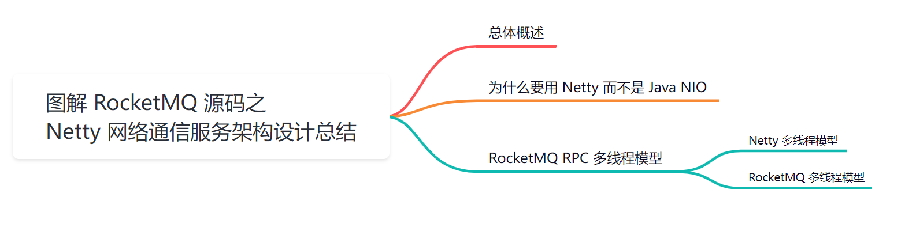
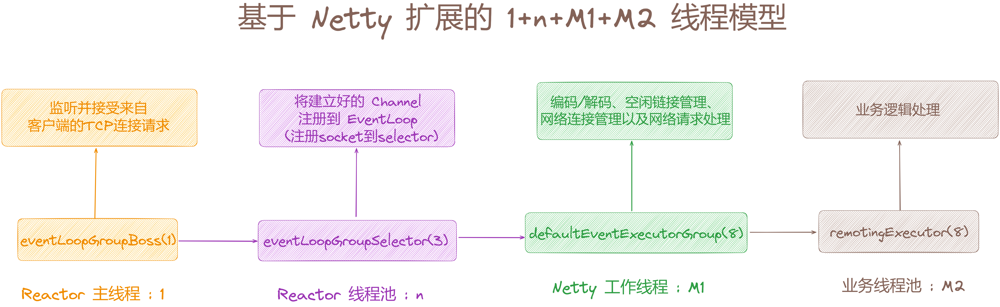
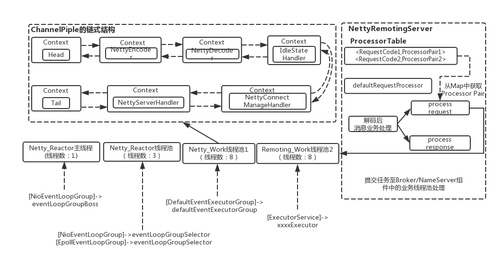
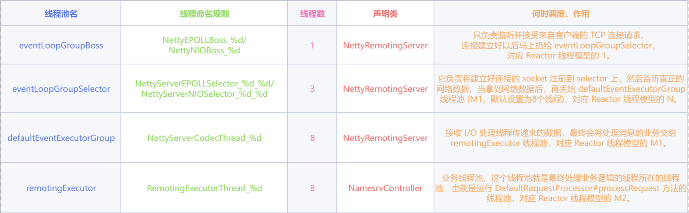
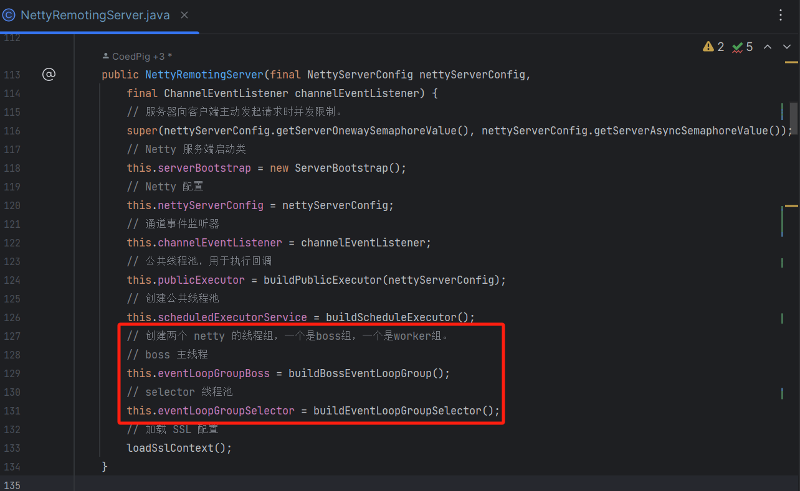
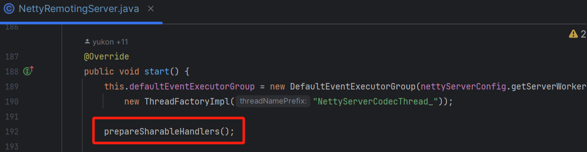
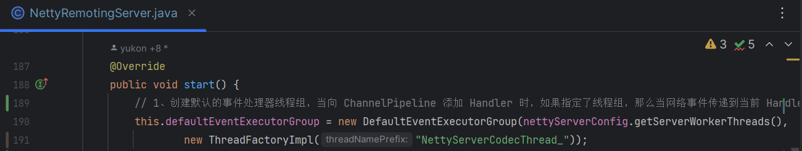
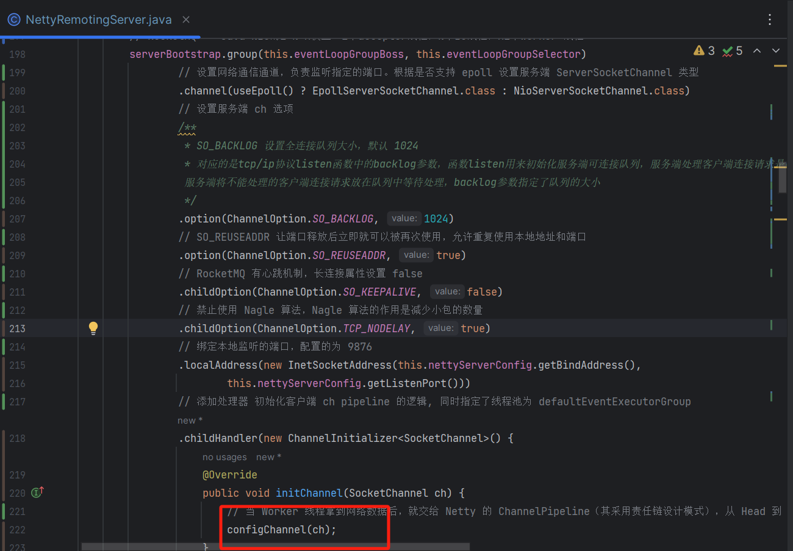
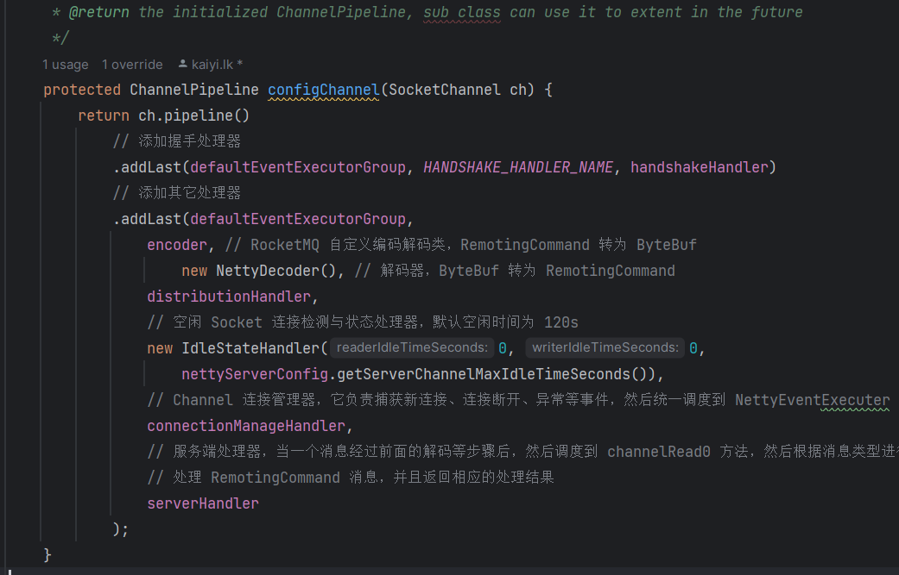
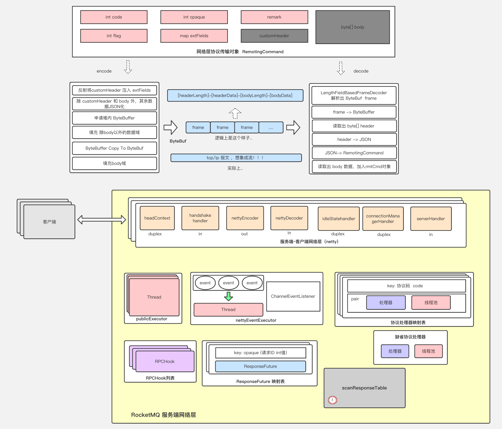

大家好，我是**华仔**, 又跟大家见面了。

从今天开始我将继续为大家奉上 RocketMQ 消费者源码剖析系列文章，正式开启「**RocketMQ 的网络通信源码之旅**」，这是第三篇，本篇我们将以「**RocketMQ 5.1.2**」版本为主，来剖析下 RocketMQ 源码之 Netty 网络通信服务架构设计总结。

这里我将以「**RocketMQ 5.1.2**」版本为主，通过「**场景驱动**」的方式带大家一点点的对 RocketMQ 源码进行深度剖析，正式开启「**RocketMQ 的源码之旅**」，跟我一起来掌握 RocketMQ 源码核心架构设计思想吧。

  

## **01 总体概述**

通过前面几篇的剖析，我们基本掌握了 RocketMQ 中的网络通信是如何接收请求、处理响应的，以及如何进行编解码处理，具体可以点击下面链接查看。

[【生产者源码分析系列第六篇】图解 RocketMQ 源码之网络通讯组件 NettyRemotingClient 架构设计](https://articles.zsxq.com/id_zgofuq2lee3e.html)

[【网络通信源码分析系列第一篇】图解 RocketMQ 源码之 NettyRemotingServer 初始化全流程](https://articles.zsxq.com/id_r2fzf5hwlm8g.html)

[【网络通信源码分析系列第二篇】图解 RocketMQ 源码之 NettyRemotingAbstract 抽象类实现](https://articles.zsxq.com/id_gid958lent4m.html)

[【网络通信源码分析系列第三篇】图解 RocketMQ 源码之 RPC 网络议通信协议与消息编解码设计剖析](https://articles.zsxq.com/id_3zfswowppc36.html)

今天我就来带大家对 RocketMQ 中 Netty 网络通信服务进行一个总结。

## **02 为什么要用 Netty 而不是 Java NIO**

在剖析「**NettyRemotingServer**」的时候知道中 RocketMQ 使用的是 Netty 来进行网络编程的，那么RocketMQ 为何要选择 Netty 而不直接使用 JDK 的 NIO 进行网络编程呢？

这里先来简单介绍下 Netty。

> Netty 是一个封装了 JDK 的 NIO 库的高性能网络通信开源框架。它提供异步的、事件驱动的网络应用程序框架和工具，用以快速开发高性能、高可靠性的网络服务器和客户端程序。

这里列举一些 RPC 通信模块会选择 Netty 作为底层通信库的理由:

1.  Netty API 使用比较简单，开发门槛低，无需编程者去关注和了解太多的 NIO 编程概念与模型底层。
2.  对于开发者来说，可根据业务的要求进行定制化地开发，通过 Netty 的 ChannelHandler 对通信框架进行灵活的定制化扩展。
3.  Netty 网络编程框架本身支持拆包/解包，异常检测等机制，让开发者可以从 JAVA NIO 的繁琐细节中解脱，而只需要关注业务处理逻辑。
4.  Netty 通过另外一种方式完美规避了 JDK NIO 的 Epoll bug，会导致 Selector 空轮询，最终导致 CPU 100%。
5.  Netty 网络编程框架内部对线程，selector 做了一些细节的优化，精心设计的 reactor 多线程模型，可以实现非常高效地并发处理。
6.  Netty已经在多个大型开源项目中都得到了充分验证，健壮性/可靠性比较好。

## **03 RocketMQ RPC 多线程模型**

通过前面剖析「**NameServer**」的启动流程，我们可以看到其中创建了许多的线程池「**1**」、「**n**」、「**M1**」、「**M2**」，来执行客户端请求或者执行定时任务。

这就是接下来我们要讨论的「**RocketMQ**」中的 RPC 通信 + 业务处理的线程模型：「**1+n+M1+M2**」线程模型。

在 RocketMQ 中，组件之间的 PRC 通信采用 Netty， Netty 的设计就是 「**Reactor 线程模型**」，但 Netty 不是采用的「**传统的 Reactor 线程模型（1 + n）**」即一个线程接收连接、一组线程处理IO事件。而是在此基础上加以扩展，发展成了「**1+n+M1+M2**」线程模型。

## **3.1 Netty 多线程模型**

这里直接查看星球嘉宾的文章：[详细图解Netty Reactor启动全流程 | 万字长文 | 多图预警](https://mp.weixin.qq.com/s/sn_M09ia11iCWj03TgRKVQ)，写的很棒，就不展开了。

## **3.2 RocketMQ 多线程模型**

上面我们说过了，RocketMQ 的通信是采用 Netty 组件作为底层通信库。同样的它也遵循 Reactor 多线程模型，并在此基础上做了一些优化。

完整的可以参照官网的这张图：

从官方的这张图中可以大致了解 RocketMQ 中 [NettyRemotingServer](http://nettyremotingserver/) 的 [Reactor](http://reactor/) 多线程模型。

这里简单的解释下：

1.  「**主线程**」：1个 Reactor 主线程 [eventLoopGroupBoss](http://eventloopgroupboss/)，它的任务是负责监听并接受来自客户端的 TCP 连接请求，连接建立好以后马上扔给 [eventLoopGroupSelector](http://eventloopgroupselector/)「**n**」即有连接请求过来时候，创建 [SocketChannel](http://socketchannel/)，并注册到 [selector](http://selector%20/) 上。
2.  「**worker 线程池**」：RocketMQ 的源码中会选择 NIO 或 Epoll，来监听网络数据，当监听到网络数据过来时，读取数据并丢给 Worker 线程池 [eventLoopGroupSelector](http://eventloopgroupselector/)，源码中默认设置线程数为 3。
3.  [eventLoopGroupSelector](http://eventloopgroupselector/) 的任务是在上一步的基础上将建立好的 Channel 注册到 [EventLoop](http://eventloop/) 上（此处是指 [NioEventLoop](http://nioeventloop/)），对应到 java 底层就是调用 NIO 接口将 [SocketChannel](http://socketchannel%20/) 注册到 [selector](http://selector/) 上。然后监听网络数据，拿到网络数据后丢给 [defaultEventExecutorGroup](http://defaulteventexecutorgroup/)「**M1**」线程池。
4.  「**M1**」：执行业务之前的各种杂事交付给这些工作交给 [defaultEventExecutorGroup](http://defaulteventexecutorgroup%20/) 去处理，源码中默认线程数设置为 8。
5.  [defaultEventExecutorGroup](http://defaulteventexecutorgroup/) 的任务主要是负责处理网络通信相关，具体是「**编码/解码**」、「**序列化/反序列化**」、「**SSL 认证**」、「**空闲连接管理**」、「**网络连接管理**」以及「**网络请求处理**」，分别对应如下几个ChannelHandler：NettyEncoder/NettyDecoder、IdleStateHandler、NettyConnectManageHandler、NettyServerHandler。当「**M1**」处理好这些任务后，将最终处理业务逻辑的工作交给 remotingExecutor「**M2**」处理。
6.  「**M2**」：剩下处理业务的操作，就直接放在业务线程池中执行了。按照之前说的，依据 [RequestCode](http://requestcode%20/) 去 [processorTable](http://processortable%20/) 本地缓存中找到对应的 [processor](http://processor/)，并封装成 [task](http://task/) 任务，在丢给对应的业务 [processor](http://processor/) 线程池来处理。

具体的源码实现就是 [【网络通信源码分析系列第一篇】图解 RocketMQ 源码之 NettyRemotingServer 初始化全流程](https://articles.zsxq.com/id_r2fzf5hwlm8g.html)。

看到这里，大家应该就对 [RocketMQ](http://rocketmq/) 的 RPC 网络通信的 Netty 部分有了一个比较全面的理解了，我们来回顾下， 在 [NettyRemotingServer](http://nettyremotingserver/) 的实例初始化时，会初始化各个相关的变量包括 [serverBootstrap](http://serverbootstrap/)、[nettyServerConfig](http://nettyserverconfig/)参数、[channelEventListener](http://channeleventlistener/) 监听器并同时初始化 [eventLoopGroupBoss](http://eventloopgroupboss/) 和 [eventLoopGroupSelector](http://eventloopgroupselector/) 两个Netty 的 [EventLoopGroup](http://eventloopgroup/) 线程池。这里需要注意的是，如果是 Linux 平台，并且开启了 native epoll，就用[EpollEventLoopGroup](http://epolleventloopgroup/)，这个也就是用 JNI 调的 c 写的 epoll。否则，就用 Java NIO 的 [NioEventLoopGroup](http://nioeventloopgroup/)。

在 [NettyRemotingServer](http://nettyremotingserver/) 实例初始化完成后就是启动它。Server 端在启动阶段会将之前实例化好「**1**」个 [acceptor](http://acceptor/)主线程 [eventLoopGroupBoss](http://eventloopgroupboss/)，「**N**」个 I/O worker 线程 [eventLoopGroupSelector](http://eventloopgroupselector%20/)，「**M1**」个 [worker](http://worker/) 线程 [defaultEventExecutorGroup](http://defaulteventexecutorgroup%20/) 绑定上去。

前面部分也已经介绍过各个线程池的作用了。 这里需要说明的是，[worker](http://worker%20/) 线程拿到网络数据后，就交给 Netty 的[ChannelPipeline](http://channelpipeline/)，它采用责任链设计模式，从 [Head](http://head/) 到 [Tail](http://tail/) 的一个个 [Handler](http://handler/) 执行下去，这些 [Handler](http://handler/) 是在创建 [NettyRemotingServer](http://nettyremotingserver/) 实例时候指定的，他、如下：

[NettyEncoder](http://nettyencoder/) 和 [NettyDecoder](http://nettydecoder%20/) 负责网络传输数据和 [RemotingCommand](http://remotingcommand%20/) 之间的编解码，[NettyServerHandler](http://nettyserverhandler%20/) 拿到解码得到的 [RemotingCommand](http://remotingcommand%20/) 后，根据 [RemotingCommand.type](http://remotingcommand.type/) 来判断是 [request](http://request%20/) 还是 [response](http://response/) 来进行相应处理，根据业务请求码封装成不同的 [task](http://task/) 任务后，提交给对应的业务[processor](http://processor/) 处理线程池处理。

整个网络层组件架构如下：

