大家好，我是**华仔**, 又跟大家见面了。

从今天开始我将继续为大家奉上 RocketMQ 消费者源码剖析系列文章，正式开启「**RocketMQ 的服务端 Broker 源码之旅**」，这是第一篇，本篇我们将以「**RocketMQ 5.1.2**」版本为主，来剖析下 RocketMQ 源码之 Broker 启动流程剖析。

这里我将以「**RocketMQ 5.1.2**」版本为主，通过「**场景驱动**」的方式带大家一点点的对 RocketMQ 源码进行深度剖析，正式开启「**RocketMQ 的源码之旅**」，跟我一起来掌握 RocketMQ 源码核心架构设计思想吧。

  
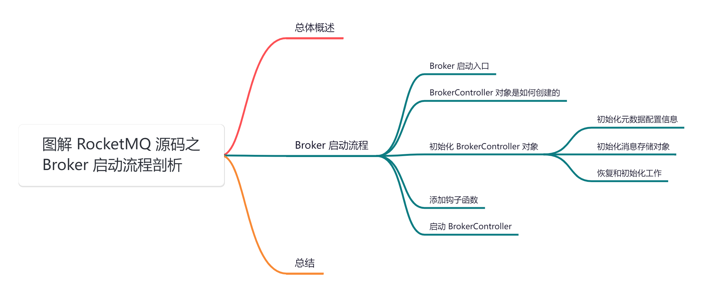

##   
**01 总体概述**

Broker 是 RocketMQ 中最为复杂的一个模块，绝大部分消息队列的特性都在这个模块中实现，它主要负责消息的「**存储**」、「**投递**」和「**查询**」以及「**服务高可用**」保证。

单机可以支撑**上万队列规模**，具有**上亿级消息堆积能力，可以严格保证消息的有序性**。

Broker 相关代码集中在 [rocketmq-broker](http://rocketmq-broker/) 模块下，如下：

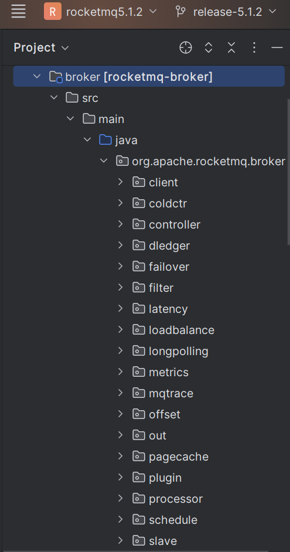

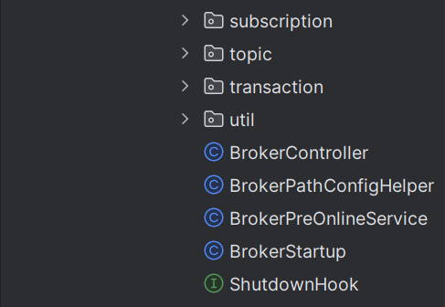

模块如下：

1.  [client](http://client/)：生产者管理器、消费者管理器、Broker-Client 调用器等。
2.  [Controller](http://controller/)：ReplicasManager 相关，controller 模式。
3.  [dledger](http://dledger/)：基于 DLedger 技术的 Broker 高可用。
4.  [filter](http://filter/)：ConsumerFilter 相关，用于消费者消费消息过滤
5.  [longpolling](http://longpolling/)：PullRequest 相关，消费者读取消息。
6.  [offset](http://offset/)：ComsumerOffset 相关，消费偏移量管理。
7.  [processor](http://processor/)：Broker 的 Netty 处理器。
8.  [schedule](http://schedule/)：定时任务相关。
9.  [salve](http://salve/)：主从同步组件。
10.  [subscription](http://subscription/)：订阅组管理。
11.  [topic](http://topic/)：Topic 管理。
12.  [transaction](http://transaction/)：事务管理。

重要模块组成如下：

1.  **远程连接模块**：指整个 Broker 实体，负责处理来自客户端请求。
2.  **客户端管理模块**：负责管理客户端「**Producer**」、「**Consumer**」和维护 Consumer 上的 Topic 订阅信息。
3.  **存储服务模块**：提供了方便简单的 API 接口来处理消息，存储到物理硬盘以及查询相关功能。
4.  **HA 服务模块**：提供高可用服务，Master Broker 和 Slave Broker 之间的数据同步功能。
5.  **索引服务**：创建消息的索引，以提供快速查询功能。

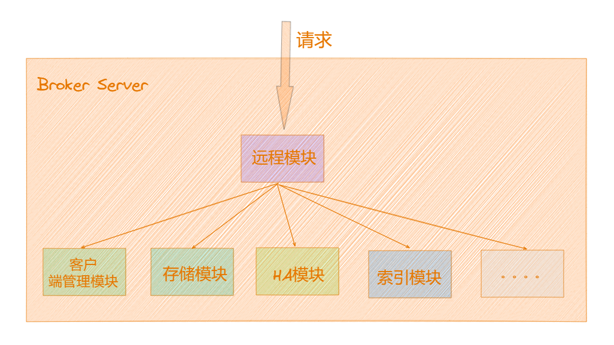

## **02 Broker 启动流程**

在剖析「**NameServer**」时， 我们知道它的启动类和控制器分别为「**NameSrvStartup**」 、「**NameSrvController**」，对应的 Broker 的启动类和控制器分别为「**BrokerStartup**」、「**BrokerController**」，这就是 Broker 源码的入口。

与 「**NameSrvStartup**」类似，「**BrokerStartup**」也是会先构建控制器「**BrokerController**」，再调用其 [start()](http://start\(\)/) 方法进行启动 Broker。

换句话说就是 Broker 启动的大部分逻辑都在「**BrokerController**」中。

源码位置：[https://github.com/apache/rocketmq/blob/release-5.1.2/](https://github.com/apache/rocketmq/blob/release-5.1.2/broker/src/main/java/org/apache/rocketmq/broker/BrokerStartup.java)[broker](https://github.com/apache/rocketmq/blob/release-5.1.2/broker/src/main/java/org/apache/rocketmq/broker/BrokerStartup.java)[/src/main/java/org/apache/rocketmq/](https://github.com/apache/rocketmq/blob/release-5.1.2/broker/src/main/java/org/apache/rocketmq/broker/BrokerStartup.java)[broker](https://github.com/apache/rocketmq/blob/release-5.1.2/broker/src/main/java/org/apache/rocketmq/broker/BrokerStartup.java)[/](https://github.com/apache/rocketmq/blob/release-5.1.2/broker/src/main/java/org/apache/rocketmq/broker/BrokerStartup.java)[BrokerStartup](https://github.com/apache/rocketmq/blob/release-5.1.2/broker/src/main/java/org/apache/rocketmq/broker/BrokerStartup.java)[.java](https://github.com/apache/rocketmq/blob/release-5.1.2/broker/src/main/java/org/apache/rocketmq/broker/BrokerStartup.java)

## **2.1 Broker 启动入口**

// 创建 Broker 控制器并启动 Broker 控制器

public static void main(String\[\] args) {

start(createBrokerController(args));

}

public static BrokerController start(BrokerController controller) {

try {

// 启动 Broker 控制器

controller.start();

String tip \= String.format("The broker\[%s, %s\] boot success. serializeType=%s",

controller.getBrokerConfig().getBrokerName(), controller.getBrokerAddr(),

RemotingCommand.getSerializeTypeConfigInThisServer());

if (null != controller.getBrokerConfig().getNamesrvAddr()) {

tip += " and name server is " + controller.getBrokerConfig().getNamesrvAddr();

}

// 打印日志与输出

log.info(tip);

System.out.printf("%s%n", tip);

return controller;

} catch (Throwable e) {

e.printStackTrace();

System.exit(-1);

}

return null;

}

知道了入口之后，接下来就来剖析下它是如何启动的，启动的过程中都做了什么?

从上面的部分代码中，不难看出，它首先就是创建「**BrokerController**」对象，然后调用 [start()](http://start\(\)/) 方法启动，那就一步一步走进去看看细节吧。

## **2.2 BrokerController 对象是如何创建的**

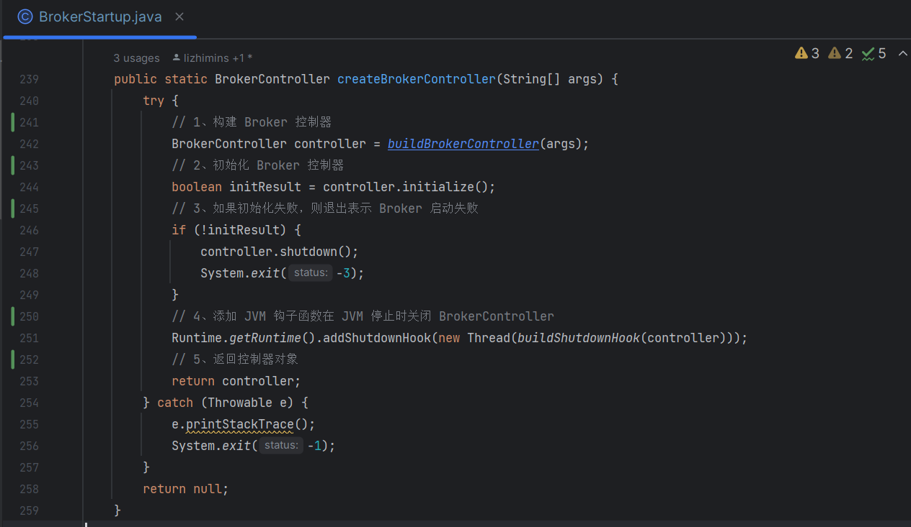

总共 5 个操作步骤：

1.  构建 Broker 控制器。
2.  初始化 Broker 控制器。
3.  如果初始化失败，则退出表示 Broker 启动失败。
4.  添加 JVM 钩子函数在 JVM 停止时关闭 [BrokerController](http://brokercontroller/)。
5.  返回控制器对象。

我们来分别看下每一步的操作。

### **2.2.1 构建 Broker 控制器**

public static BrokerController buildBrokerController(String\[\] args) throws Exception {

// 利用 System.setProperty() 设置 RocketMQ 的版本号

System.setProperty(RemotingCommand.REMOTING\_VERSION\_KEY, Integer.toString(MQVersion.CURRENT\_VERSION));

// 1、创建 broker 的相关配置类对象

// Broker核心配置类 : 用来封装其绝大多数基本配置信息，比如ROCKETMQ\_HOME

final BrokerConfig brokerConfig \= new BrokerConfig();

// Netty服务器配置类：Broker 作为服务端，比如接受来自客户端(Producer/Consumer)的消息的时候

final NettyServerConfig nettyServerConfig \= new NettyServerConfig();

// Netty 客户端配置类：Broker 作为客户端，比如连接 NameServer 的时候

final NettyClientConfig nettyClientConfig \= new NettyClientConfig();

// Broker 存储对象配置类：例如各种文件大小等

final MessageStoreConfig messageStoreConfig \= new MessageStoreConfig();

// 2、设置 netty 的服务端监听的端口号 10911,对外提供消息读写服务的端口，Broker 存储对象配置端口 10912

nettyServerConfig.setListenPort(10911);

messageStoreConfig.setHaListenPort(0);

// 3、构建命令行操作

Options options \= ServerUtil.buildCommandlineOptions(new Options());

// 解析命令行为 'mgbroker’的参数

CommandLine commandLine \= ServerUtil.parseCmdLine(

"mqbroker", args, buildCommandlineOptions(options), new DefaultParser());

if (null == commandLine) {

// 如果为空，直接退出，退出状态码为-1

System.exit(-1);

}

Properties properties \= null;

// 解析外部配置文件，读取 broker.conf 配置文件，-c 参数指定 Broker 配置文件

// 判断命令行中是否包含字符'-c’(即为否包含通过命令行指定配置文件的命令)

// 例如 broker 启动的时候添加的 -c /home/wangjianghua/src/rocketmq/rocketmq-all-4.9.4-bin-release/conf/broker.conf命令

if (commandLine.hasOption('c')) {

// 获取该命令指定的配置文件

String file \= commandLine.getOptionValue('c');

if (file != null) {

CONFIG\_FILE\_HELPER.setFile(file);

BrokerPathConfigHelper.setBrokerConfigPath(file);

// 加载配置文件到 properties，基于缓冲输入流

properties = CONFIG\_FILE\_HELPER.loadConfig();

}

}

// 4、加载配置文件中的配置

if (properties != null) { // 得到的 properties 配置不为空

// 将配置文件内容利用反射设置到对应的配置类中

// 将 rmgAddressServerDomain、rmgAddressServerSubGroup 属性设置为系统属性

properties2SystemEnv(properties);

// 设置 brokerConfig 的配置信息

MixAll.properties2Object(properties, brokerConfig);

// 设置 nettyservice 的配置信息

MixAll.properties2Object(properties, nettyServerConfig);

// 设置 nettyClient 的配置信息

MixAll.properties2Object(properties, nettyClientConfig);

// 设置 messageStore 的配置信息

MixAll.properties2Object(properties, messageStoreConfig);

}

// 4、加载命令行中的参数

MixAll.properties2Object(ServerUtil.commandLine2Properties(commandLine), brokerConfig);

if (null == brokerConfig.getRocketmqHome()) {

// 如果从 brokerConfig 配置文件中获取到的 RocketmgHome 为空，打印提示并设置系统状态码为 -2，需要我们自己设置一下环境变量

System.out.printf("Please set the %s variable in your environment " +

"to match the location of the RocketMQ installation", MixAll.ROCKETMQ\_HOME\_ENV);

System.exit(-2);

}

// Validate namesrvAddr

// 5、获取Nameserver地址，用 ; 分割解析为数组，Nameserver 可能为集群 所以有多个

String namesrvAddr \= brokerConfig.getNamesrvAddr();

if (StringUtils.isNotBlank(namesrvAddr)) {

try {

// 拆分 NameServer 的地址

// 可以指定多个 NameServer 的地址，以";"分隔，形成一个地址宇符串数组

String\[\] addrArray = namesrvAddr.split(";");

// 将字符串的地址，转换为网络连接的 scoketAddress，检查格式是否正确

for (String addr : addrArray) {

NetworkUtil.string2SocketAddress(addr);

}

} catch (Exception e) {

System.out.printf("The Name Server Address\[%s\] illegal, please set it as follows, " + "\\"127.0.0.1:9876;192.168.0.1:9876\\"%n", namesrvAddr);

System.exit(-3);

}

}

/\*\*

\* 6、Slave-Broker的参数配置信息

\* 如果 broker 的角色是 slave (默认 broker 的角色是异步 master)，设置命中消息在内存的最大比例

\* 超过所设置的最大内存，消息将被置换出内存; 设置成比默认的 40 %，还要小 10 %

\*/

if (BrokerRole.SLAVE == messageStoreConfig.getBrokerRole()) {

int ratio \= messageStoreConfig.getAccessMessageInMemoryMaxRatio() - 10;

messageStoreConfig.setAccessMessageInMemoryMaxRatio(ratio);

}

// Set broker role according to ha config

// 7、不启动控制器模式，不支持自动切换主从角色。

if (!brokerConfig.isEnableControllerMode()) {

// 判断 Broker 角色作相应的处理，这里 master 有两种同步消息方式

// 设置、校验brokerId

// 根据检查 broker 的角色配置 brokerId: 默认角色是 ASYNC\_MASTER

// 通过此配置可知 brokerId 为 0 表示 master，非 0 表示 slave

// broker 的角色分为:

// ASYNC\_MASTER : 异步同步消息到 slave

// SYNCMASTER : 同步同步消息到 s1ave

// SLAVE

switch (messageStoreConfig.getBrokerRole()) {

// 异步复制:生产者写入消息到 Master 后无需等待消息复制到 slave 即可返回，消息的复制由旁路线程进行异步复制

case ASYNC\_MASTER:

/\*\*

\* 同步复制的方式，表现出来的是类似同步双写的策略。即 Master 写入完消息之后，需要等待 Slave 的复制成功。

\* 注:这里只需要有一个 Slave 复制成功并成功应答即算成功，所以在这种模式下，如果有 3 个 Slave，当生产者获得

\* SEND\_OK 的应答时，代表消息已经达到 Master 和一个 Slave （注：这里并不代表已经持久化到磁盘，而只能证明

\* 肯定到了 PageCache，是否能刷到磁盘取决于刷盘策略是同步刷盘还是异步刷盘），而还有两个 Slave 实际上是无法保证的，

\* 并且这里也不支持配置，即不支持如 ”同步半数以上” 之类的设置

\*/

case SYNC\_MASTER:

// 如果是 master 角色，设置 brokerId = 0

brokerConfig.setBrokerId(MixAll.MASTER\_ID);

break;

/\*\*

\* 消息发送的状态除了 SEND\_OK 外，还会多出以下的状态：

\* FLUSH\_SLAVE\_TIMEOUT:同步到 slave 等待超时，即一直等 Slave 上报同步的进度，但过了超时时间都没有成功没有同步完。

\* SLAVE\_NOT\_AVAILABLE:当前没有可用的 Slave。注：如果 Slave 落后 Master 实在太多，那个 slave 也会认为是暂时不

\* 可用的 Slave，直到它同步到接近的范围为止，这个不可用的阈值由 broker 配置 haSlaveFallbehindMax（默认是1024 \* 1024 \* 256）决定

\*/

case SLAVE:

// 如果是 slave 角色，需要 brokerId > 0

if (brokerConfig.getBrokerId() <= MixAll.MASTER\_ID) {

System.out.printf("Slave's brokerId must be > 0%n");

System.exit(-3);

}

break;

default:

break;

}

}

// 7、是否基于 DLeger (即是否启用RocketMQ 主从切换，默认值是false )技术来管理主从同步和 CommitLog，如果需要开启主从切换，则该值需要设置为true，那么设置 brokerId = -1

if (messageStoreConfig.isEnableDLegerCommitLog()) {

brokerConfig.setBrokerId(-1);

}

if (brokerConfig.isEnableControllerMode() && messageStoreConfig.isEnableDLegerCommitLog()) {

System.out.printf("The config enableControllerMode and enableDLegerCommitLog cannot both be true.%n");

System.exit(-4);

}

// 8、设置 Ha 存储监听端口 10912

// 设置高可用通信监听端口，为监听端口+1，默认就是10912

// 该端口主要用于:比如主从同步之类的高可用操作，在配置 broker 集群的时候需要注意，配置集群时可能会抛出: Address already in use

// 这是因为一个 broker 机器会占用三个端口，监所 ip 端口，以及监听 ip 端口 + 1的端口，监听ip 端口 - 2 的端口

if (messageStoreConfig.getHaListenPort() <= 0) {

messageStoreConfig.setHaListenPort(nettyServerConfig.getListenPort() + 1);

}

// 设置 broker 容器:默认为false，不能进行手动设置，这个和启动模式有关

// 1.通过 Brokerstartup 启动 broker 则为 false

// 2.通过 BrokerContainer 启动 broker 则为 true

brokerConfig.setInBrokerContainer(false);

// 日志相关配置

System.setProperty("brokerLogDir", "");

// isIso1ateLogEnab1e 属性表示在同一台机器上部署多个 broker 时是否区分日志路径，默认 fa1se

if (brokerConfig.isIsolateLogEnable()) {

System.setProperty("brokerLogDir", brokerConfig.getBrokerName() + "\_" + brokerConfig.getBrokerId());

}

if (brokerConfig.isIsolateLogEnable() && messageStoreConfig.isEnableDLegerCommitLog()) {

System.setProperty("brokerLogDir", brokerConfig.getBrokerName() + "\_" + messageStoreConfig.getdLegerSelfId());

}

// 9、通过 -p 参数打印所有参数项， 启动时候日志打印配置信息

if (commandLine.hasOption('p')) {

Logger console \= LoggerFactory.getLogger(LoggerName.BROKER\_CONSOLE\_NAME);

MixAll.printObjectProperties(console, brokerConfig);

MixAll.printObjectProperties(console, nettyServerConfig);

MixAll.printObjectProperties(console, nettyClientConfig);

MixAll.printObjectProperties(console, messageStoreConfig);

System.exit(0);

// 通过 -m 打印重要的参数项，即解析命令行参数"-m”，启动时候日志打印导入的配置信息。

} else if (commandLine.hasOption('m')) {

Logger console \= LoggerFactory.getLogger(LoggerName.BROKER\_CONSOLE\_NAME);

MixAll.printObjectProperties(console, brokerConfig, true);

MixAll.printObjectProperties(console, nettyServerConfig, true);

MixAll.printObjectProperties(console, nettyClientConfig, true);

MixAll.printObjectProperties(console, messageStoreConfig, true);

System.exit(0);

}

// 打印当前 broker 的配置日志

log = LoggerFactory.getLogger(LoggerName.BROKER\_LOGGER\_NAME);

MixAll.printObjectProperties(log, brokerConfig);

MixAll.printObjectProperties(log, nettyServerConfig);

MixAll.printObjectProperties(log, nettyClientConfig);

MixAll.printObjectProperties(log, messageStoreConfig);

// 10、基于上面的配置参数来构建 BrokerController

final BrokerController controller \= new BrokerController(

brokerConfig, nettyServerConfig, nettyClientConfig, messageStoreConfig);

// 将所有的 -c 的外部信息配置，保存到 NamesrvContro1ler 中的 Configuration 对象屈性的a11Config 属性中

// Remember all configs to prevent discard

controller.getConfiguration().registerConfig(properties);

return controller;

}

看完是不是觉得 [BrokerController](http://brokercontroller%20/) 构建的逻辑与 [NamesrvController](http://namesrvcontroller%20/) 是类似的，构建命令行参数、处理一些配置、创建 [BrokerController](http://brokercontroller%20/) 等，核心的逻辑如下：

1.  创建「**Broker**」、「**Netty 服务端/客户端**」、「**消息存储**」等配置对象，可以看到，Broker 是既有 [NettyServer](http://nettyserver/)，又有 [NettyClient](http://nettyclient%20/) 的配置对象，因为 [Broker](http://broker/)会作为客户端调用 [NameServer](http://nameserver/)，也会作为服务端被生产者/消费者调用。
2.  [Broker](http://broker/) 端的 [NettyServer](http://nettyserver%20/) 监听端口默认设置为 10911。
3.  构建 [Broker](http://broker/) 端的命令行 [CommandLine](http://commandline/)，这个就是用来在启动 [Broker](http://broker/) 时进行命令行参数交互的。
4.  读取命令行 -c 参数指定的 Broker 配置文件加载配置，再读取命令行中的参数。
5.  获取 [Nameserver](http://nameserver/) 地址，用 ; 分割解析为数组， [Nameserver](http://nameserver/) 可能为集群 所以有多个。
6.  判断 [broker](http://broker%20/) 是否为 [slave](http://slave/)， 如果是则将消息占用内存百度分减去 10 %, 默认 40 %,超过内存的消息将置换出内存。
7.  如果是 Master 节点，设置 brokerId=0，Slave 节点的 bokerId 必须大于 0；而如果启用了 DLeger 技术，brokerId 都设置为 -1。
8.  设置 Ha 存储监听端口 10912。
9.  可以通过 -p 参数打印所有参数项，通过 -m 打印重要的参数项。
10.  最后通过配置对象创建 [BrokerController](http://brokercontroller/)。

别看这么多，其实创建 [BrokerController](http://brokercontroller/) 时，核心就做了2件事情：

1.  解析各种配置 命令行等、创建 [BrokerController](http://brokercontroller/) 需要的各种配置对象：[BrokerConfig](http://brokerconfig/)、[NettyServerConfig](http://nettyserverconfig/)、[NettyClientConfig](http://nettyclientconfig/)、[MessageStoreConfig](http://messagestoreconfig/)。
2.  [BrokerController](http://brokercontroller/) 相当于 [Broker](http://broker/) 的一个中央控制类。创建了 [BrokerController](http://brokercontroller/) 的对象后，再调用 [BrokerController](http://brokercontroller/) 对象的 [initialize](http://initialize/) 方法，进行初始化操作。

从构建 [BrokerController](http://brokercontroller/) 的代码中可以看出，[BrokerController](http://brokercontroller/) 的依赖的四个核心配置如下图所示：

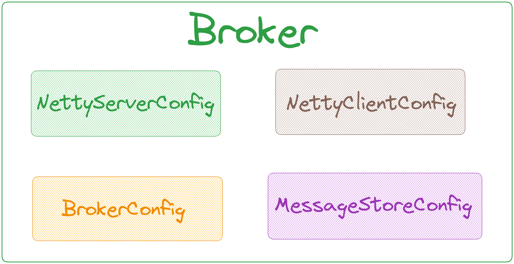

这些配置类实际上就是一些普通的 [POJO](http://pojo/) 类。所以此时 [Broker](http://broker/) 的整个组件结构应该是这样的：

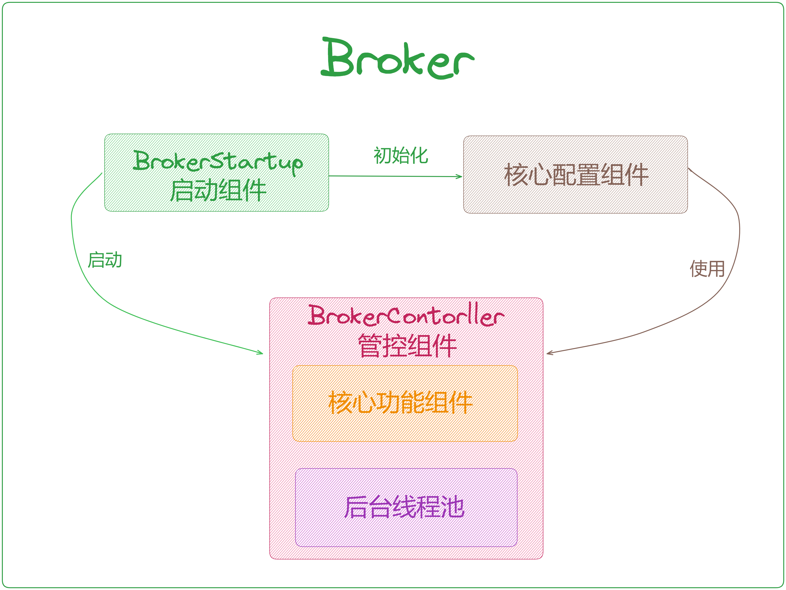

这里来重点看下部分步骤。

### **2.2.1.1 创建配置对象**

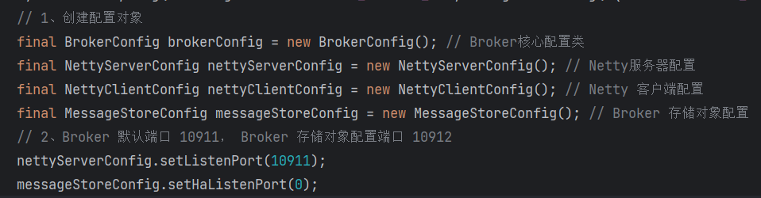

**这里主要创建了几个重要的配置对象：**

1.  创建 Broker 核心配置对象。
2.  创建 Netty 客户端 和 服务端配置对象。
3.  创建存储对象的配置。
4.  设置 Broker 默认端口 10911 以及Ha初始端口 0，后面会设置为 10912。

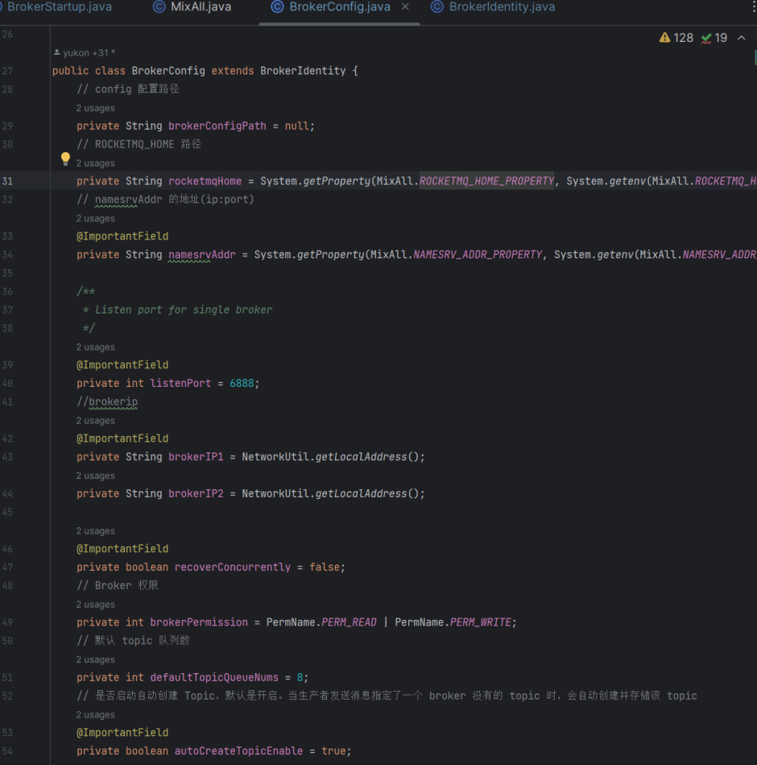

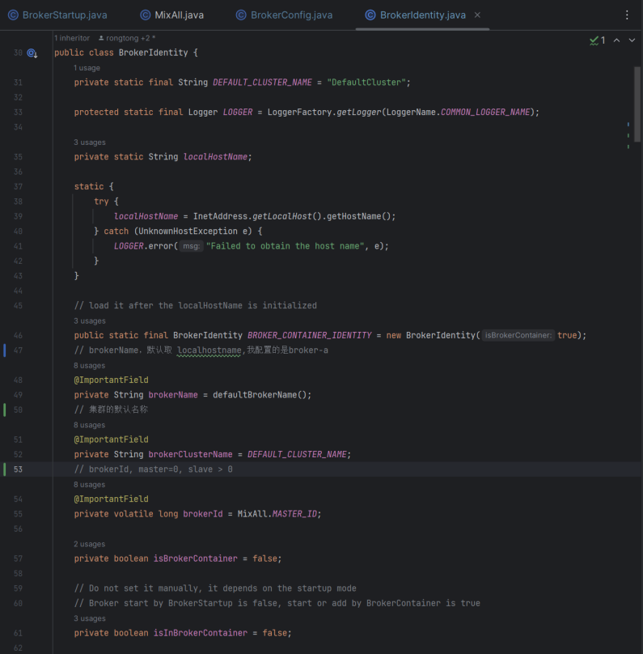

public class MessageStoreConfig {

public static final String MULTI\_PATH\_SPLITTER \= System.getProperty("rocketmq.broker.multiPathSplitter", ",");

//The root directory in which the log data is kept

// 消息存储的根路径，默认是 $user.home/store/

// 比如，我在broker.conf配置的是：/home/wangjianghua/ROCKETMQ\_HOME/store/

@ImportantField

private String storePathRootDir \= System.getProperty("user.home") + File.separator + "store";

//The directory in which the commitlog is kept

// 存储 CommitLog 真正的消息的路径，默认是 $user.home/store/commitlog

@ImportantField

private String storePathCommitLog \= null;

// 存储 DLedgerCommitLog 真正的消息路径

@ImportantField

private String storePathDLedgerCommitLog \= null;

// CommitLog file size,default is 1G

// 每一个存储消息的文件默认是1G

private int mappedFileSizeCommitLog \= 1024 \* 1024 \* 1024;

// ConsumeQueue file size,default is 30W

// 每一个 ConsumeQueue 默认存储30个索引单元

private int mappedFileSizeConsumeQueue \= 300000 \* ConsumeQueue.CQ\_STORE\_UNIT\_SIZE;

// When to delete,default is at 4 am

// 默认凌晨4点删除过期文件

@ImportantField

private String deleteWhen \= "04";

// The number of hours to keep a log file before deleting it (in hours)

// 文件默认保留3天，超过3天就是过期，然后就可以删除了

@ImportantField

private int fileReservedTime \= 72;

// The maximum size of message body,default is 4M,4M only for body length,not include others.

// 每个消息的最大限制为4M

private int maxMessageSize \= 1024 \* 1024 \* 4;

public String getStorePathCommitLog() {

if (storePathCommitLog == null) {

return storePathRootDir + File.separator + "commitlog";

}

return storePathCommitLog;

}

// TODO........还有很多配置

### **2.2.1.2 读取配置文件**

读取 broker 启动时指定的 [broker.conf](http://broker.conf/) 配置文件，将配置信息映射到上面的配置类中。

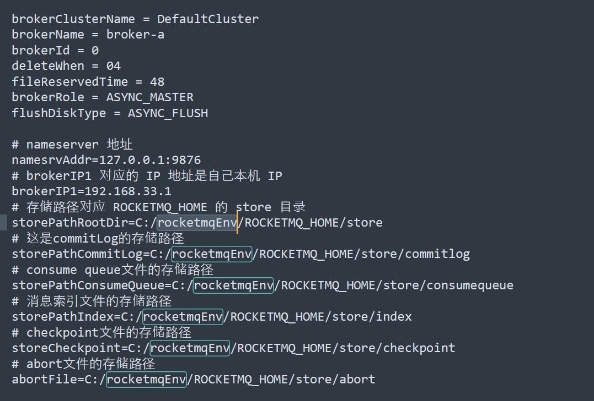

还有一些其他配置：

1.  比如设置 [master](http://master/) 和 [slave](http://slave/) 通信的端口为 [10912](http://0.0.42.160/)，即就是 [broker](http://broker/) 客户端通信端口 + 1。
2.  设置 [brokerId](http://brokerid/)，如果是 [master](http://master/) 则 brokerid=0 ; [slave](http://slave/) 则 brokerid > 0。

### **2.2.1.3 构建 BrokerController 对象**

源码位置：[https://github.com/apache/rocketmq/blob/release-5.1.2/](https://github.com/apache/rocketmq/blob/release-5.1.2/broker/src/main/java/org/apache/rocketmq/broker/BrokerController.java)[broker](https://github.com/apache/rocketmq/blob/release-5.1.2/broker/src/main/java/org/apache/rocketmq/broker/BrokerController.java)[/src/main/java/org/apache/rocketmq/](https://github.com/apache/rocketmq/blob/release-5.1.2/broker/src/main/java/org/apache/rocketmq/broker/BrokerController.java)[broker](https://github.com/apache/rocketmq/blob/release-5.1.2/broker/src/main/java/org/apache/rocketmq/broker/BrokerController.java)[/](https://github.com/apache/rocketmq/blob/release-5.1.2/broker/src/main/java/org/apache/rocketmq/broker/BrokerController.java)[BrokerController](https://github.com/apache/rocketmq/blob/release-5.1.2/broker/src/main/java/org/apache/rocketmq/broker/BrokerController.java)[.java](https://github.com/apache/rocketmq/blob/release-5.1.2/broker/src/main/java/org/apache/rocketmq/broker/BrokerController.java)

将上面创建的 4 个配置类对象通过构造参数传递到 [BrokerController](http://brokercontroller/) 类中，实例化 [BrokerController](http://brokercontroller/) 的时候，会一块实例化很多的配置类和线程池队列，如下：

public BrokerController(

final BrokerConfig brokerConfig,

final NettyServerConfig nettyServerConfig,

final NettyClientConfig nettyClientConfig,

final MessageStoreConfig messageStoreConfig

) {

// 通过构造器传递进来的配置信息对象

// broker 基本信息

this.brokerConfig = brokerConfig;

// 作为 netty 服务端与客户端交互的配置

this.nettyServerConfig = nettyServerConfig;

// 作为 netty 客户端与服务端交互的配置

this.nettyClientConfig = nettyClientConfig;

// 消息存储的配置

this.messageStoreConfig = messageStoreConfig;

// 设置存储 host

this.setStoreHost(new InetSocketAddress(this.getBrokerConfig().getBrokerIP1(), getListenPort()));

// broker状态管理器，保存 broker 的运行状态

this.brokerStatsManager = messageStoreConfig.isEnableLmq() ? new LmqBrokerStatsManager(this.brokerConfig.getBrokerClusterName(), this.brokerConfig.isEnableDetailStat()) : new BrokerStatsManager(this.brokerConfig.getBrokerClusterName(), this.brokerConfig.isEnableDetailStat());

// 消费者偏移量管理器，维护 offset 进度信息

this.consumerOffsetManager = messageStoreConfig.isEnableLmq() ? new LmqConsumerOffsetManager(this) : new ConsumerOffsetManager(this);

// 广播偏移量管理器

this.broadcastOffsetManager = new BroadcastOffsetManager(this);

// topic 配置管理器，管理 broker 中存储的所有 topic 的配置

this.topicConfigManager = messageStoreConfig.isEnableLmq() ? new LmqTopicConfigManager(this) : new TopicConfigManager(this);

// topic 队列映射管理器

this.topicQueueMappingManager = new TopicQueueMappingManager(this);

// 拉取消息处理器，用于处理拉取消息的请求

this.pullMessageProcessor = new PullMessageProcessor(this);

// peek 消息处理器

this.peekMessageProcessor = new PeekMessageProcessor(this);

// 长轮询线程 拉取请求挂起服务，consumer 使用 push 方式的长轮询机制拉去请求时保存使用，当有消息到达时进行推送处理，当 consumer 拉取消息时，如果没有消息则挂起请求

this.pullRequestHoldService = messageStoreConfig.isEnableLmq() ? new LmqPullRequestHoldService(this) : new PullRequestHoldService(this);

// Broker处理POP消费模式的两个处理器之一: Pop 拉取消息的处理器

this.popMessageProcessor = new PopMessageProcessor(this);

// 通知处理器

this.notificationProcessor = new NotificationProcessor(this);

// 轮询信息处理器

this.pollingInfoProcessor = new PollingInfoProcessor(this);

// Broker处理POP消费模式的两个处理器之二: Ack 消息处理器

this.ackMessageProcessor = new AckMessageProcessor(this);

this.changeInvisibleTimeProcessor = new ChangeInvisibleTimeProcessor(this);

this.sendMessageProcessor = new SendMessageProcessor(this);

this.replyMessageProcessor = new ReplyMessageProcessor(this);

// 消息送达的监听器，生产者消息到达时通过该监听器

this.messageArrivingListener = new NotifyMessageArrivingListener(this.pullRequestHoldService, this.popMessageProcessor, this.notificationProcessor);

// 消费者 id 变化监听器（主要是重平衡时工作)

this.consumerIdsChangeListener = new DefaultConsumerIdsChangeListener(this);

// consumer 管理器对象，维护消费者组的注册实例信息以及 topic 的订阅信并对消费者 id 变化进行监听

this.consumerManager = new ConsumerManager(this.consumerIdsChangeListener, this.brokerStatsManager, this.brokerConfig);

// producer 管理器对象，包含生产者的注册信息，按照 groupName 进行分类

this.producerManager = new ProducerManager(this.brokerStatsManager);

// consumer filter 管理器对象（消息过滤时会用），按照topic进行分类

this.consumerFilterManager = new ConsumerFilterManager(this);

// consumer 顺序消息管理器

this.consumerOrderInfoManager = new ConsumerOrderInfoManager(this);

this.popInflightMessageCounter = new PopInflightMessageCounter(this);

// 客户端连接心跳服务，用于定时扫描生产者和消费者客户端，并将不活跃的客户端通道及相关信息移除

this.clientHousekeepingService = new ClientHousekeepingService(this);

// broker对外访问的API，向客户端发送消息时会用，比如向客户端发起重平衡，检查生产者的事务状态，重置offset

this.broker2Client = new Broker2Client(this);

// 订阅信息组管理器对象

this.subscriptionGroupManager = messageStoreConfig.isEnableLmq() ? new LmqSubscriptionGroupManager(this) : new SubscriptionGroupManager(this);

// 调度管理器

this.scheduleMessageService = new ScheduleMessageService(this);

this.coldDataPullRequestHoldService = new ColdDataPullRequestHoldService(this);

this.coldDataCgCtrService = new ColdDataCgCtrService(this);

if (nettyClientConfig != null) {

// broker 对外访问的 API，处理 broker 对外的发起请求，比如 nameServer 注册，向 master、slave 发起的请求时会用

this.brokerOuterAPI = new BrokerOuterAPI(nettyClientConfig);

}

this.queryAssignmentProcessor = new QueryAssignmentProcessor(this);

this.clientManageProcessor = new ClientManageProcessor(this);

// 用于从节点，定时向主节点发起请求i同步数据，例如 topic 配置，消费位移等

this.slaveSynchronize = new SlaveSynchronize(this);

this.endTransactionProcessor = new EndTransactionProcessor(this);

// TODO:各种队列

// 初始化各种阻塞队列，将会被设置到相应的处理不同客户端的线程池执行器中处理来自生产者的发送消息的请求的队列

this.sendThreadPoolQueue = new LinkedBlockingQueue<>(this.brokerConfig.getSendThreadPoolQueueCapacity());

this.putThreadPoolQueue = new LinkedBlockingQueue<>(this.brokerConfig.getPutThreadPoolQueueCapacity());

// 处理来自消费者的拉取消息的请求的队列

this.pullThreadPoolQueue = new LinkedBlockingQueue<>(this.brokerConfig.getPullThreadPoolQueueCapacity());

this.litePullThreadPoolQueue = new LinkedBlockingQueue<>(this.brokerConfig.getLitePullThreadPoolQueueCapacity());

this.ackThreadPoolQueue = new LinkedBlockingQueue<>(this.brokerConfig.getAckThreadPoolQueueCapacity());

// 处理 reply 消息的请求的队列，RocketMQ 4.7.0 版本中加了request-reply 新特性，该特性允许 producer 在发送消息后同步或者异步等待 consumer

// 消费完消息并返回响应消息，类似 rpc 调用效果

this.replyThreadPoolQueue = new LinkedBlockingQueue<>(this.brokerConfig.getReplyThreadPoolQueueCapacity());

// 处理查询请求的队列

this.queryThreadPoolQueue = new LinkedBlockingQueue<>(this.brokerConfig.getQueryThreadPoolQueueCapacity());

// 客户端管理器的队列

this.clientManagerThreadPoolQueue = new LinkedBlockingQueue<>(this.brokerConfig.getClientManagerThreadPoolQueueCapacity());

// 消费者管理器的队列

this.consumerManagerThreadPoolQueue = new LinkedBlockingQueue<>(this.brokerConfig.getConsumerManagerThreadPoolQueueCapacity());

// 心跳处理队列

this.heartbeatThreadPoolQueue = new LinkedBlockingQueue<>(this.brokerConfig.getHeartbeatThreadPoolQueueCapacity());

// 事务消息相关处理的队列

this.endTransactionThreadPoolQueue = new LinkedBlockingQueue<>(this.brokerConfig.getEndTransactionPoolQueueCapacity());

this.adminBrokerThreadPoolQueue = new LinkedBlockingQueue<>(this.brokerConfig.getAdminBrokerThreadPoolQueueCapacity());

this.loadBalanceThreadPoolQueue = new LinkedBlockingQueue<>(this.brokerConfig.getLoadBalanceThreadPoolQueueCapacity());

// broker 快速失败服务

this.brokerFastFailure = new BrokerFastFailure(this);

String brokerConfigPath;

if (brokerConfig.getBrokerConfigPath() != null && !brokerConfig.getBrokerConfigPath().isEmpty()) {

brokerConfigPath = brokerConfig.getBrokerConfigPath();

} else {

brokerConfigPath = BrokerPathConfigHelper.getBrokerConfigPath();

}

this.configuration = new Configuration(

LOG,

brokerConfigPath,

this.brokerConfig, this.nettyServerConfig, this.nettyClientConfig, this.messageStoreConfig

);

this.brokerStatsManager.setProduerStateGetter(new BrokerStatsManager.StateGetter() {

@Override

public boolean online(String instanceId, String group, String topic) {

if (getTopicConfigManager().getTopicConfigTable().containsKey(NamespaceUtil.wrapNamespace(instanceId, topic))) {

return getProducerManager().groupOnline(NamespaceUtil.wrapNamespace(instanceId, group));

} else {

return getProducerManager().groupOnline(group);

}

}

});

this.brokerStatsManager.setConsumerStateGetter(new BrokerStatsManager.StateGetter() {

@Override

public boolean online(String instanceId, String group, String topic) {

String topicFullName \= NamespaceUtil.wrapNamespace(instanceId, topic);

if (getTopicConfigManager().getTopicConfigTable().containsKey(topicFullName)) {

return getConsumerManager().findSubscriptionData(NamespaceUtil.wrapNamespace(instanceId, group), topicFullName) != null;

} else {

return getConsumerManager().findSubscriptionData(group, topic) != null;

}

}

});

this.brokerMemberGroup = new BrokerMemberGroup(this.brokerConfig.getBrokerClusterName(), this.brokerConfig.getBrokerName());

this.brokerMemberGroup.getBrokerAddrs().put(this.brokerConfig.getBrokerId(), this.getBrokerAddr());

this.escapeBridge = new EscapeBridge(this);

this.topicRouteInfoManager = new TopicRouteInfoManager(this);

if (this.brokerConfig.isEnableSlaveActingMaster() && !this.brokerConfig.isSkipPreOnline()) {

this.brokerPreOnlineService = new BrokerPreOnlineService(this);

}

}

不难发现，创建 [BrokerController](http://brokercontroller/) 对象时，其内部也会构建很多的对象。简单说几个，其他的有个印象就行，后面遇到再说。

1.  [BrokerOuterAPI](http://brokerouterapi/): [broker](http://broker%20/) 向 [NameServer](http://nameserver%20/) 发消息时会用。其内部会创建 [NettyRemotingClient](http://nettyremotingclient/) 对象，向 [NameServer](http://nameserver/) 发起请求底层用的就是它。另外还有 [NettyRemotingServer](http://nettyremotingserver/) 对象，它是 broker 接收客户端请求的。
2.  [Broker2Client](http://broker2client/): [broker](http://broker%20/) 向客户端发起请求时会工作。比如向消费者发起重平衡。
3.  [PullMessageProcessor](http://pullmessageprocessor/): 拉取消息的处理器。当消费者消费时，从 [broker](http://broker/) 拉取消息会使用它。
4.  [pullRequestHoldService](http://pullrequestholdservice/)：长轮询线程，挂起拉取请求，当 [consumer](http://consumer/) 拉取消息时，如果没有消息则挂起请求
5.  [popMessageProcessor](http://popmessageprocessor/)：Pop 拉取消息的处理器，5.x 版本新增的消费功能。
6.  [subscriptionGroupManager](http://subscriptiongroupmanager/)：订阅信息组管理器对象，当消费者消费时，从 [broker](http://broker/) 拉取消息会使用它。

## **2.3 初始化 BrokerController 对象**

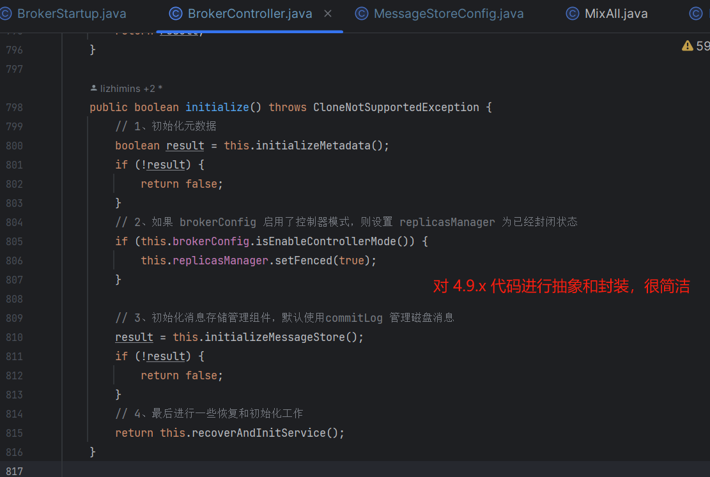

我们分别来看下。

### **2.3.1 初始化元数据配置信息**

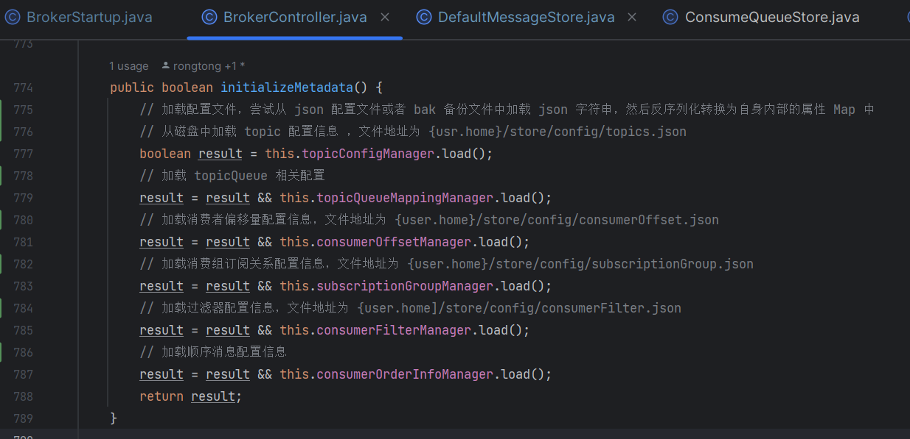

这里以加载 topic 配置信息为例进行简单剖析。

[TopicConfigManager](http://topicconfigmanager/) 对象根据配置文件路径读取出文件的内容解析成 JSON 字符串。其默认存储路径：[$user.home/store/config/topics.json](http://$user.home/store/config/topics.json)。

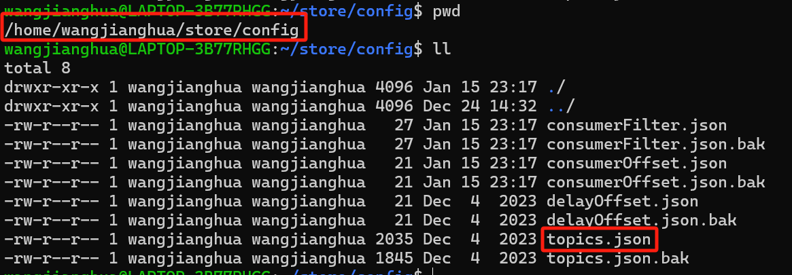

将 JSON 字符串转换成 Java 对象 [TopicConfigSerializeWrapper](http://topicconfigserializewrapper%20/) JSON内容：

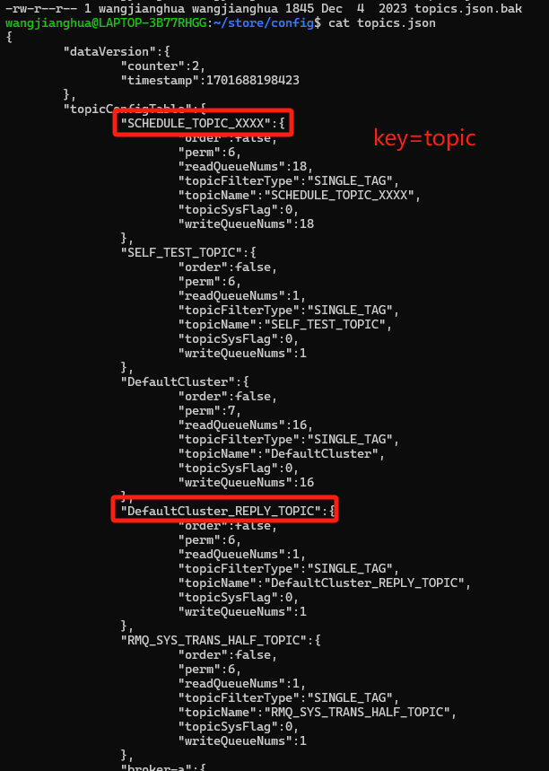

将 JSON 内容保存到 [TopicConfigManager](http://topicconfigmanager/) 对象的 topic 配置表中。

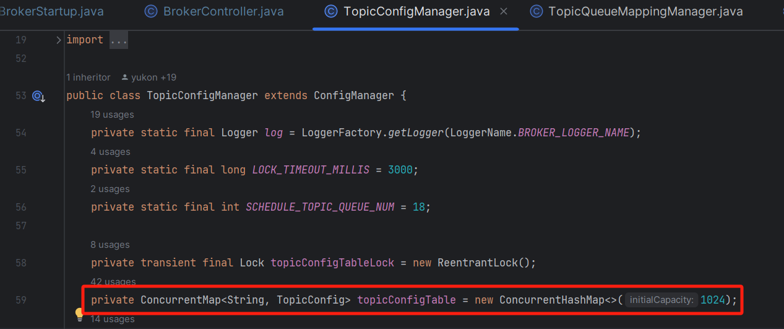

同理，其他管理器也类似。

[ConsumerOffsetManager](http://consumeroffsetmanager/) 将读取 [$user.home/store/config/consumerOffset.json](http://$user.home/store/config/consumerOffset.json) 文件的内容映射到其内部的[offset](http://offset/) 表中。

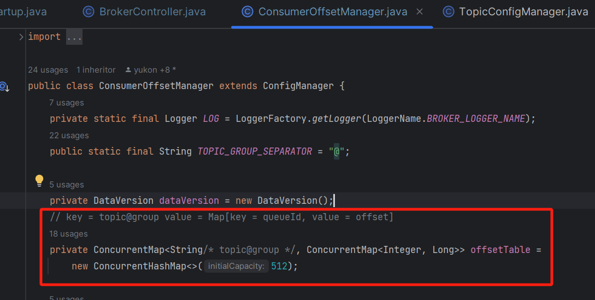

[SubscriptionGroupManager](http://subscriptiongroupmanager/) 将读取 [$user.home/store/config/subscriptionGroup.json](http://$user.home/store/config/subscriptionGroup.json) 文件的内容映射到其内部的订阅组表中。

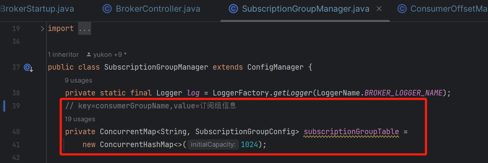

[ConsumerFilterManager](http://consumerfiltermanager/) 将读取 [$user.home/store/config/consumerFilter.json](http://$user.home/store/config/consumerFilter.json) 文件的内容映射到其内部的Map 中。消费者订阅消息时如果是根据 SQL92 过滤的，则将 topic,sql 等信息保存到这里。

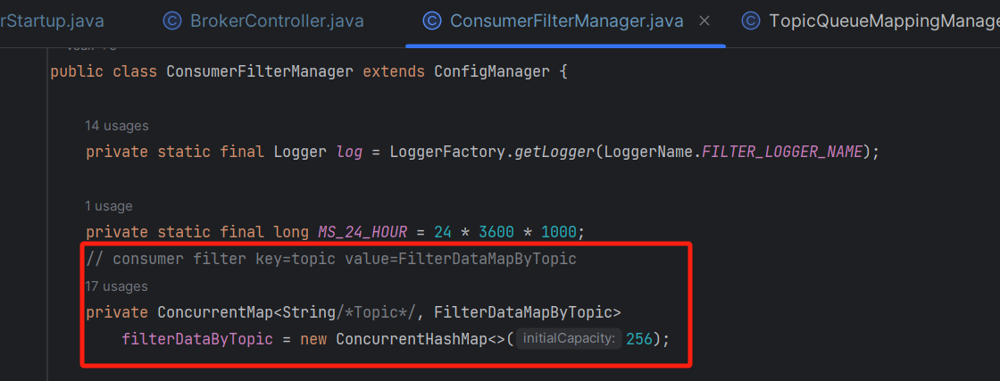

### **2.3.2 初始化消息存储对象**

public boolean initializeMessageStore() {

// 如果上一步 initializeMetadata 方法加载配置全部成功

// 注意:这里所谓的加载成功，只是在加载过程中没有抛出异常、即便是没有对应的文件和临时文件，只装没有抛出异常，也会返回true，表示加载成功

// 初始化消息存储服务相关类 DefaultMessageStore

boolean result \= true;

try {

/\*\*

\* 创建并进行实例化消息存储管理组件 DefaultMessageStore，默认使用commitLog 管理磁盘消息

\* 它是 RocketMQ 的核心文件存储控制类，是 RocketMQ 对于消息存储和获取功能的抽象

\* 该类位于 store 模块，通过该类可以直按控制管理 commitLog、consumeQueue、indexFile 等文件内容的读、写

\* 在启动 Broker 的时候，就会创建-个 DefaultMessageStore 对象，实例化之后将会调用 load 方法将磁盘中的 commitLog、ConsumeQueue、IndexFile文件的数据

\* 加载到内存中，还会进行数据恢复操作

\*/

DefaultMessageStore defaultMessageStore \= new DefaultMessageStore(this.messageStoreConfig, this.brokerStatsManager, this.messageArrivingListener, this.brokerConfig, topicConfigManager.getTopicConfigTable());

/\*\*

\* 如果启动了 enableDLegerCommitLog，就创建 DLeger 组件 DLedgerRoleChangeHandler，默认 false 如果需要开启则该值需要设置为 true

\* 在启用 enableDLegerCommitLog 情况下，broker 通过 raft 协议来进行选主，可以实现主从角色自动切换，这是 4.5 版本之后的新功能

\* 简单来说，如果启动了 enableDLegerCommitLog 就表示启用 RocketMQ 的容灾机制--自动主从切换

\*/

if (messageStoreConfig.isEnableDLegerCommitLog()) {

DLedgerRoleChangeHandler roleChangeHandler \=

new DLedgerRoleChangeHandler(this, defaultMessageStore);

((DLedgerCommitLog) defaultMessageStore.getCommitLog())

.getdLedgerServer().getDLedgerLeaderElector().addRoleChangeHandler(roleChangeHandler);

}

// broker 的统计服务类，保存了 broker 的一些统计数据

// 例如 msgPutTotalTodayNow-- 现在存储的消息数量，msgPutTotalTodayMorning)-- 今天存储的消息数量

this.brokerStats = new BrokerStats(defaultMessageStore);

// Load store plugin

// 加载存在的消息存储插件

MessageStorePluginContext context \= new MessageStorePluginContext(

messageStoreConfig, brokerStatsManager, messageArrivingListener, brokerConfig, configuration);

// 利用信息存储工厂类构建信息存储对象 messageStore

this.messageStore = MessageStoreFactory.build(context, defaultMessageStore);

// 添加一个针对布隆过滤器的消费过滤类

this.messageStore.getDispatcherList().addFirst(new CommitLogDispatcherCalcBitMap(this.brokerConfig, this.consumerFilterManager));

// 如果启用了控制器模式，则创建 ReplicasManager 实例

if (this.brokerConfig.isEnableControllerMode()) {

this.replicasManager = new ReplicasManager(this);

}

// 如果启用了时间轮特性，则进行时间轮相关的初始化工作，包括创建 TimerCheckpoint 和 TimerMetrics 实例，以及创建 TimerMessageStore 实例并进行相关设置。

if (messageStoreConfig.isTimerWheelEnable()) {

this.timerCheckpoint = new TimerCheckpoint(BrokerPathConfigHelper.getTimerCheckPath(messageStoreConfig.getStorePathRootDir()));

TimerMetrics timerMetrics \= new TimerMetrics(BrokerPathConfigHelper.getTimerMetricsPath(messageStoreConfig.getStorePathRootDir()));

this.timerMessageStore = new TimerMessageStore(messageStore, messageStoreConfig, timerCheckpoint, timerMetrics, brokerStatsManager);

this.timerMessageStore.registerEscapeBridgeHook(msg -> escapeBridge.putMessage(msg));

this.messageStore.setTimerMessageStore(this.timerMessageStore);

}

} catch (IOException e) {

result = false;

LOG.error("BrokerController#initialize: unexpected error occurs", e);

}

return result;

}

### **2.3.2.1 创建消息存储对象**

创建默认的消息存储对象 [DefaultMessageStore](http://defaultmessagestore/)，这里简单了解下，会在后面篇章单独深度剖析的。

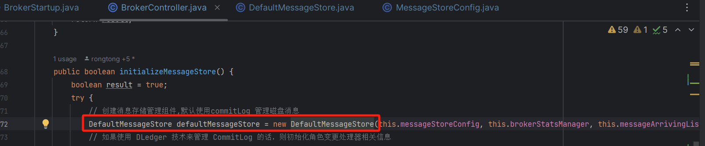

如果上面的配置文件都加载成功，则创建负责消息存储相关的对象 [defaultMessageStore](http://defaultmessagestore/)。

> 注意，这里所谓的加载成功，是指在加载过程中没有抛出异常，即使是没有对应的文件和临时文件，只要没有抛出异常，也会返回 true，表示加载成功。

[DefaultMessageStore](http://defaultmessagestore/) 是 [RocketMQ](http://rocketmq/) 的核心文件存储控制类，是 [RocketMQ](http://rocketmq/) 对于消息存储和获取功能的抽象，位于 [store](http://store%20/) 模块，通过该类可以直接控制管理 [commitLog](http://commitlog/)、[consumeQueue](http://consumequeue/)、[indexFile](http://indexfile/) 等文件内容的读、写，非常重要。

在启动 [Broker](http://broker/) 的时候，就会创建一个 [defaultMessagStore](http://defaultmessagstore/) 对象，随后通过 [load](http://load/) 方法进行磁盘文件的加载和异常数据的恢复。

public DefaultMessageStore(final MessageStoreConfig messageStoreConfig, final BrokerStatsManager brokerStatsManager,

final MessageArrivingListener messageArrivingListener, final BrokerConfig brokerConfig, final ConcurrentMap<String, TopicConfig> topicConfigTable) throws IOException {

// 通过构造器传递一些配置对象

// 消息送达的监听器，生产者消息到达时通过该监听器触发 pullRequestHoldservice，通知 pullRequestHoldservice

this.messageArrivingListener = messageArrivingListener;

// broker 的配置类，包含 broker 的各种配置，例如 ROCKTEMQ\_HOME 等

this.brokerConfig = brokerConfig;

// broker的消息存储配置，例如各种文件的大小等

this.messageStoreConfig = messageStoreConfig;

// 获取活动副本数

this.aliveReplicasNum = messageStoreConfig.getTotalReplicas();

// broker 的状态管理器，保存 broker 运行时状态，统计工作

this.brokerStatsManager = brokerStatsManager;

this.topicConfigTable = topicConfigTable;

// 创建分配 MappedFile 文件的服务对象，用于初始化MappedFile和预热MappedFile

this.allocateMappedFileService = new AllocateMappedFileService(this);

// 是否支持使用 DLedger 技术来管理 CommitLog

// 实例化 CommitLog,DLedgerCommitLog表示支持主从自动切换功能，默认是 false

// 默认类型是 CommitLog 类型

if (messageStoreConfig.isEnableDLegerCommitLog()) {

// 创建 DLedgerCommitLog 对象

this.commitLog = new DLedgerCommitLog(this);

} else {

// 创建 CommitLog 对象

this.commitLog = new CommitLog(this);

}

// ConsumeQueue 存储队列服务

this.consumeQueueStore = new ConsumeQueueStore(this, this.messageStoreConfig);

// ConsumeQueue文件的刷盘服务

this.flushConsumeQueueService = new FlushConsumeQueueService();

// 清理过期的 CommitLog 服务

this.cleanCommitLogService = new CleanCommitLogService();

// 清理 ConsumeQueue 文件服务

this.cleanConsumeQueueService = new CleanConsumeQueueService();

// 校正逻辑偏移服务

this.correctLogicOffsetService = new CorrectLogicOffsetService();

// 存储一些统计指标信息的服务

this.storeStatsService = new StoreStatsService(getBrokerIdentity());

// 创建 IndexFile 索引文件服务，根据消息 key 来构建索引

this.indexService = new IndexService(this);

// DLedgerCommitLog 表示支持主从自动切换功能，默认是false，isDuplicationEnable 表示是否重复复制功能，默认是 false

if (!messageStoreConfig.isEnableDLegerCommitLog() && !this.messageStoreConfig.isDuplicationEnable()) {

// 是否启动控制器模式，支持自动切换代理的角色。默认是false

if (brokerConfig.isEnableControllerMode()) {

// 创建 HA 自动切换高可用服务，用来做数据同步

this.haService = new AutoSwitchHAService();

LOGGER.warn("Load AutoSwitch HA Service: {}", AutoSwitchHAService.class.getSimpleName());

} else {

// 创建 HA 服务

this.haService = ServiceProvider.loadClass(HAService.class);

if (null == this.haService) {

// 创建高可用服务，用来做数据同步

this.haService = new DefaultHAService();

LOGGER.warn("Load default HA Service: {}", DefaultHAService.class.getSimpleName());

}

}

}

// 根据CommitLog文件，更新index文件索引和ConsumeQueue文件偏移量的服务

if (!messageStoreConfig.isEnableBuildConsumeQueueConcurrently()) {

// 构建默认消息分发服务，就是用来构建消息的 ConsumeQueue 索引和 IndexFile 索引

this.reputMessageService = new ReputMessageService();

} else {

// 构建并发消息分发服务，就是用来构建消息的 ConsumeQueue 索引和 IndexFile 索引

this.reputMessageService = new ConcurrentReputMessageService();

}

// 初始化 MappedFile 的时候进行 ByteBuffer 的分配回收

this.transientStorePool = new TransientStorePool(this);

// 构建延迟消息服务

this.scheduledExecutorService =

Executors.newSingleThreadScheduledExecutor(new ThreadFactoryImpl("StoreScheduledThread", getBrokerIdentity()));

// 设置消息分发服务列表组件，分别是构建 ConsumeQueue 索引和 IndexFile 索引，监听CommitLog文件中的新消息存储，然后会调用列表中的CommitLogDispatcher#dispatch方法

this.dispatcherList = new LinkedList<>();

// 通知 ConsumeQueue 的 Dispatcher,可用于更新 ConsumeQueue 的偏移量等信息

this.dispatcherList.addLast(new CommitLogDispatcherBuildConsumeQueue());

// 通知 IndexFie 的 Dispatcher,可用于更新 IndexFile 的时间戳信息

this.dispatcherList.addLast(new CommitLogDispatcherBuildIndex());

// 是否启用压缩，默认为true 启用

if (messageStoreConfig.isEnableCompaction()) {

this.compactionStore = new CompactionStore(this);

this.compactionService = new CompactionService(commitLog, this, compactionStore);

this.dispatcherList.addLast(new CommitLogDispatcherCompaction(compactionService));

}

// 获取锁文件

File file \= new File(StorePathConfigHelper.getLockFile(messageStoreConfig.getStorePathRootDir()));

// 确保创建 file 文件的父目录

UtilAll.ensureDirOK(file.getParent());

// 确保创建 commitLog 目录

UtilAll.ensureDirOK(getStorePathPhysic());

//确保创建 consumeQueue 日录

UtilAll.ensureDirOK(getStorePathLogic());

// 创建 lockfile 文件，名为 1ock，权限是"读写"，这是一个锁文件，用于获取文件锁

// 文件锁用来保证磁盘上的这些存储文件同时只能有一个 broker 的 messageStore 来操作

lockFile = new RandomAccessFile(file, "rw");

// 解析延迟级别

parseDelayLevel();

}

public boolean parseDelayLevel() {

HashMap<String, Long> timeUnitTable = new HashMap<>();

timeUnitTable.put("s", 1000L);

timeUnitTable.put("m", 1000L \* 60);

timeUnitTable.put("h", 1000L \* 60 \* 60);

timeUnitTable.put("d", 1000L \* 60 \* 60 \* 24);

/\*\*

\* 延迟时长:"1s 5s 10s 30s 1m 2m 3m 4m5m 6m 7m 8m 9m 10m 20m 30m 1h 2h"

\* 将各个等级的延迟时长等级获取成一个延迟时长字符串

\*/

String levelString \= messageStoreConfig.getMessageDelayLevel();

try {

// 将字符串以空格为分隔符，分割成延迟等级字符串数组

String\[\] levelArray = levelString.split(" ");

// 遍历字符串数组

for (int i \= 0; i < levelArray.length; i++) {

// 获取单个的延迟时长

String value \= levelArray\[i\];

// 获取延迟等级对应的时间单位

String ch \= value.substring(value.length() - 1);

// 根据时间单位去 timeUnitTable 中获取对应的 value

Long tu \= timeUnitTable.get(ch);

int level \= i + 1;

// 更新最大延迟等级

if (level > this.maxDelayLevel) {

this.maxDelayLevel = level;

}

/\*\*

\* 举例说明，例如:

\* num = 3

\* tu = 1000L \* 60

\* delayTimeMillis = tu \* num = 1000L \* 60 \* 3

\*/

long num \= Long.parseLong(value.substring(0, value.length() - 1));

long delayTimeMillis \= tu \* num;

// 将延迟等级 以及 对应的时长，放入延迟等级表中

this.delayLevelTable.put(level, delayTimeMillis);

}

} catch (Exception e) {

LOGGER.error("parse message delay level failed. messageDelayLevel = {}", levelString, e);

return false;

}

return true;

}

不难发现，构建 [DefaultMessageStore](http://defaultmessagestore/) 对象时，其内部也创建了非常多的对象。

1.  [AllocateMappedFileService](http://allocatemappedfileservice/): 它是用来做 [MappedFile](http://mappedfile/) 文件预热的。
2.  [IndexService](http://indexservice/): 如果消息设置了 key，则它会根据 key 来构建索引。
3.  [ReputMessageService](http://reputmessageservice/): 消息分发服务，当消息写入成功后，则它会去创建consumequeue索引和IndexFile索引
4.  [ScheduleMessageService](http://schedulemessageservice/): 延迟消息的服务对象
5.  [CommitLog](http://commitlog/)：可以简单理解为读取message的。在创建它的时候，它的内部还会创建一个叫的[MappedFileQueue](http://mappedfilequeue/)对象, 而[MappedFileQueue](http://mappedfilequeue/) 对象内部维护了很多的 [MappedFile](http://mappedfile/)，而 [MappedFile](http://mappedfile/) 可以理解为实际存储消息文件的映射。

### **2.3.3 恢复和初始化工作**

public boolean recoverAndInitService() throws CloneNotSupportedException {

boolean result \= true;

// 如果 messageStore 不为空

if (messageStore != null) {

// 注册消息存储钩子

registerMessageStoreHook();

// 加载 messageStore 服务

/\*\*

\* 如果上一步加载配置全部成功

\* 通过消息存储服务加载消息存储的相关文件

\* 比如: commitLog 日志文件、ConsumeQueue 消费消息队列文件的加载、indexFiles 索引文件的构建

\* messageStore 还会将这些文件的内容加载到内存中。并且完威 RocketMQ 的数据恢复

\* 这是 broker 启动核心步骤之一

\*/

// \]oad(）万法在 DefaultMessageStore 类中

result = this.messageStore.load();

}

//

/\*\*

\* 是否启动时间轮，默认启用

\* 主要用来解决:比如延迟生产、延迟拉取以及延迟删除等问题

\*/

if (messageStoreConfig.isTimerWheelEnable()) {

// 加载 timerMessageStore 服务

result = result && this.timerMessageStore.load();

}

// 加载定时任务调度服务

// 加载 RocketMQ 延迟消息的服务，包括延时等缓，配置文件等等

//scheduleMessageService load after messageStore load success

result = result && this.scheduleMessageService.load();

// 遍历 brokerAttachedPlugins 附加插件集合，这是个接口

for (BrokerAttachedPlugin brokerAttachedPlugin : brokerAttachedPlugins) {

// 附加插件接口不为空

if (brokerAttachedPlugin != null) {

// 加载代理附加插件接口

result = result && brokerAttachedPlugin.load();

}

}

// 对 broker 标签进行管理、监控

this.brokerMetricsManager = new BrokerMetricsManager(this);

// 如果上一步加戟配置全部成功

if (result) {

// 启动 Netty 服务器

/\*\*

\* 初始化 Broker 通信层，创建 netty 远程服务器 (remotingServer 和 fastRemotingServer)

\* 创建 broker 的 netty 远程服务 端口为 10911，可用于处理客户端的所有请求

\* 创建 broker 的快速 netty 远程服务，端口号为普通端口号-2 (默认10909)，这就是所谓的快速通道，对应可以处理客户端除了拉取消息之外的所有请求、所谓的 VIP 端口。

\*/

initializeRemotingServer();

/\*\*

\* 创建各种线程池，主要有两类:

\* 1、负责处理别人发过来的请求。

\* 2、负责处理自己的一些后台任务

\* 这一步创建了很多线程池，因为 RocketMQ 为了性能，对过多的请求进行异步优化处理，因此需要许多线程池

\*/

initializeResources();

/\*\*

\* RocketMQ 底层通信基于 netty，这里注册 netty 消息处理器

\* 1、registerProcessor 方法将处理器利对应的线程池绑定为一个 Pair 对象，并且将这个 Pair 对象放入 processorTable 中，其值就是 Pair 对象，key 就是对应的请求编码

\* RequestCode

\* 2、每个请求都会根据自己携带的 RequestCode 在 processorTable 中查找对应的处理器以及对应的执行器线程池来处理请求

\* RocketMQ 通过这样的方式来提升处理请求的性能。

\*/

registerProcessor();

/\*\*

\* 启动一系列定时周期任务 (定时调度线程池的后台执行）

\* 在注册了 netty 消息处理器之后，将会启动一系列的定时任务，这些定时任务由 BrokerController 中的 scheduledExecutorService 去执行，该线程池只有一个线程

\*/

initializeScheduledTasks();

/\*\*

\* 初始化事务消息相关服务，采用 Java SPI 的方式进行加载

\* 主要初始化量个服务:

\* 1、TransactionalMessageService (事务消息服务):用于处理、检查事务消息

\* 2、TransactionalMessageCheckListener (事务消息监查监所器):监所网查消息

\* 3、TransactionalMessageCheckService (事务消息检查服务):提供了事务消总回查的逻辑，默认情况下 6 秒以上没有 commit/rollback 的事务消息才会触发事务回查，而如果回查次数超过了15次则丢弃事务

\*/

initialTransaction();

/\*\*

\* 初始化 Acl 权限相关服务: 加载权限相关校验器

\* 同样是基于 Java SPI 机制进行查找，并且会将找到校验器注册到 RpcHook 中，在请求执行之会执行权限校验

\*/

initialAcl();

/\*\*

\* 初始化 RPC 调用的钩子函数

\* RpcHook 是 RocketMQ 提供的钩子类，提供一种类似于 AOP 的功能 可以在请求被处理之前和响应被返回之前执行对应的方法。

\*/

initialRpcHooks();

// TlS 传输相关配置，通信安全的文件监听模块，用来观察网络加密配置文件的更改。默认是 PERMISSIVE，因此会进入代码块

if (TlsSystemConfig.tlsMode != TlsMode.DISABLED) {

// Register a listener to reload SslContext

try {

// 实例化文件监听服务，并目初始化事务消息服务

fileWatchService = new FileWatchService(

new String\[\] {

TlsSystemConfig.tlsServerCertPath,

TlsSystemConfig.tlsServerKeyPath,

TlsSystemConfig.tlsServerTrustCertPath

},

new FileWatchService.Listener() {

boolean certChanged, keyChanged = false;

@Override

public void onChanged(String path) {

if (path.equals(TlsSystemConfig.tlsServerTrustCertPath)) {

// 信任证书已更改，请重新加载 ssl 上下文

LOG.info("The trust certificate changed, reload the ssl context");

reloadServerSslContext();

}

if (path.equals(TlsSystemConfig.tlsServerCertPath)) {

certChanged = true;

}

if (path.equals(TlsSystemConfig.tlsServerKeyPath)) {

keyChanged = true;

}

if (certChanged && keyChanged) {

// 证书和私钥已更改，请重新加载 ssl 上下文

LOG.info("The certificate and private key changed, reload the ssl context");

certChanged = keyChanged = false;

reloadServerSslContext();

}

}

private void reloadServerSslContext() {

((NettyRemotingServer) remotingServer).loadSslContext();

((NettyRemotingServer) fastRemotingServer).loadSslContext();

}

});

} catch (Exception e) {

result = false;

LOG.warn("FileWatchService created error, can't load the certificate dynamically");

}

}

}

return result;

}

至此，初始化步骤大致如下：

1.  加载配置文件：[topic](http://topic%20/) 配置文件、[topicQueue](http://topicqueue/) 相关配置、消费者消费偏移量配置文件、订阅分组配置文件、消费者订单信息管理文件。
2.  实例化和初始化消息存储服务相关类 [DefaultMessageStore](http://defaultmessagestore/)。
3.  通过 [DefaultMessageStore](http://defaultmessagestore/) 加载消息存储的相关文件。
4.  比如：[commitLog](http://commitlog/) 日志文件、[consumequeue](http://consumequeue/) 消费消息队列文件的加载、[indexFiles](http://indexfiles/) 索引文件的构建 [messsageStore](http://messsagestore/) 还会将这些文件的内容加载到内存中，并且完成 [RocketMQ](http://rocketmq/) 的数据恢复 这是 [broker](http://broker/) 启动是核心步骤之一。
5.  初始化 [Broker](http://broker/) 通信层，创建 [netty](http://netty/) 远程服务 （[remotingServer](http://remotingserver%20/) 和 [fastRemotingServer](http://fastremotingserver/)）。
6.  创建 [broker](http://broker/) 的 [netty](http://netty/) 远程服务，端口为 [10911](http://0.0.42.159/)，可用于处理客户端的所有请求； 创建 [broker](http://broker/) 的快速 [netty](http://netty/) 远程服务，端口号为普通端口号-2（默认[10909](http://0.0.42.157/)），这就是所谓的快速通道，对应可以处理客户端除了拉取消息之外的所有请求，所谓的VIP端口。
7.  创建各种线程池，主要有两类：
8.  第一类：负责处理别人发过来的请求。
9.  第二类：负责处理自己的一些后台任务。
10.  这一步创建了很多线程池，因为 [RocketMQ](http://rocketmq/) 为了性能，对过多的请求进行异步优化处理，因此需要许多线程池。
11.  [RocketMQ](http://rocketmq%20/) 底层通信基于 [netty](http://netty/)，这里注册 [netty](http://netty/) 请求处理器。
12.  [registerProcessor](http://registerprocessor/) 方法将处理器和对应的线程池绑定为一个 [Pair](http://pair/) 对象，并且将这个 [pair](http://pair/) 对象放入 [processorTable](http://processortable/) 中， 其值就是 [pair](http://pair%20/) 对象，[key](http://key/) 就是对应的请求编码 [RequestCode](http://requestcode/)。
13.  每个请求都会根据自己携带的 [RequestCode](http://requestcode/) 在 [processorTable](http://processortable/) 中查找对应的处理器以及对应的执行器线程池来处理请求。 [RocketMQ](http://rocketmq/) 通过这样的方式来提升处理请求的性能。
14.  启动一系列定时周期任务（定时调度线程池的后台执行）。
15.  在注册了 [netty](http://netty/) 消息处理器之后，将会启动一系列的定时任务 这些定时任务由 [BrokerController](http://brokercontroller/) 中的[scheduledExecutorService](http://scheduledexecutorservice/) 去执行，该线程池只有一个线程。
16.  初始化事务消息相关服务。
17.  初始化服务采用 Java SPI 的方式进行加载 主要初始化三个服务：
18.  （1）[transactionalMessageService](http://transactionalmessageservice/)（事务消息服务）：用于处理、检查事务消息
19.  （2）[transactionalMessageCheckListener](http://transactionalmessagechecklistener/)（事务消息监查监听器）：监听回查消息
20.  （3）[transactionalMessageCheckService](http://transactionalmessagecheckservice/)（事务消息检查服务）：提供了事务消息回查的逻辑，默认情况下 6s 以上没[commit/rollback](http://commit/rollback) 的事务消息才会触发事务回查，而如果回查次数超过了 15 次则丢弃事务
21.  初始化 Acl 权限相关服务:加载权限相关校验器
22.  同样是基于 Java SPI 机制进行查找，并且会将找到校验器注册到 [RpcHook](http://rpchook/) 中，在请求执行之前会执行权限校验。
23.  初始化 RPC 调用的钩子函数。
24.  [RpcHook](http://rpchook/) 是 [RocketMQ](http://rocketmq/) 提供的钩子类，提供一种类似于类似于 [AOP](http://aop/) 的功能。 可以在请求被处理之前和响应被返回之前执行对应的方法。
25.  除了以上步骤以外，还有 [TLS](http://tls/) 传输相关配置，通信安全的文件监听模块，用来观察网络加密配置文件的更改。

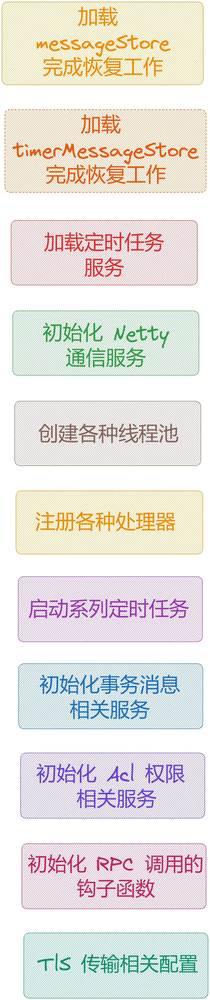

限于篇幅问题，细节就不展开了，会放到 [【Broker 端源码分析系列第二篇】图解 RocketMQ 源码之 Broker 启动流程核心控制器组件剖析](https://articles.zsxq.com/id_chxqzhg8psk4.html) 。

## **2.4 添加钩子函数**

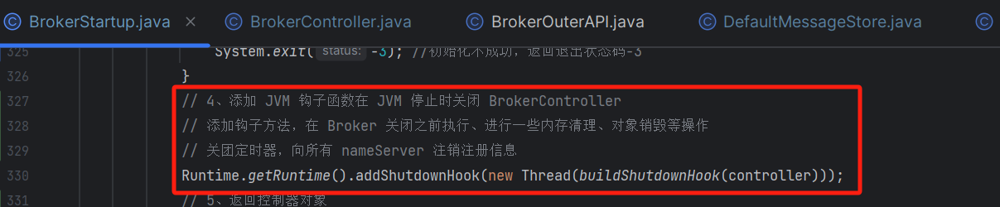

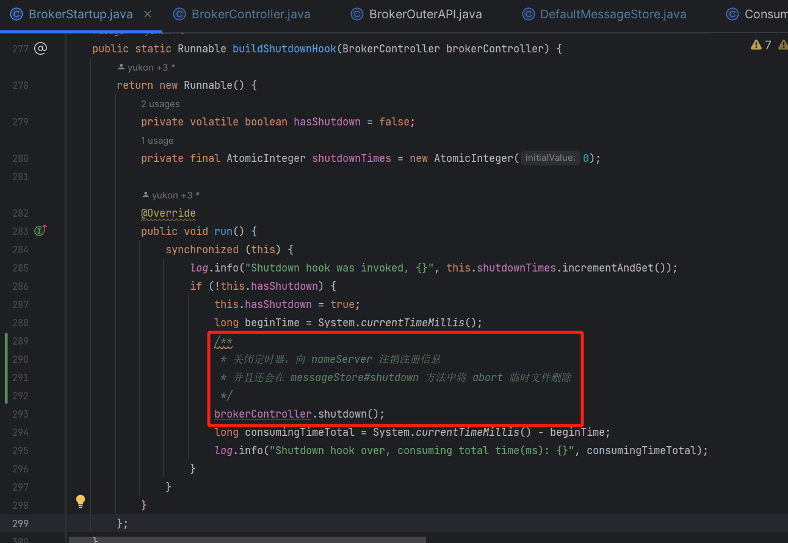

public void shutdown() {

// 关闭基础服务

shutdownBasicService();

for (ScheduledFuture<?> scheduledFuture : scheduledFutures) {

scheduledFuture.cancel(true);

}

if (this.brokerOuterAPI != null) {

// 关闭 broker 对外访问的 API

this.brokerOuterAPI.shutdown();

}

}

protected void shutdownBasicService() {

// 关闭标识

shutdown = true;

// 向 NameServer 注销所有 broker

this.unregisterBrokerAll();

if (this.shutdownHook != null) {

this.shutdownHook.beforeShutdown(this);

}

// 关闭各种服务以及定时任务服务

// 关闭 netty 路由服务

if (this.remotingServer != null) {

this.remotingServer.shutdown();

}

// 关闭快速 netty 路由服务

if (this.fastRemotingServer != null) {

this.fastRemotingServer.shutdown();

}

// 关闭 broker 状态管理器

if (this.brokerStatsManager != null) {

this.brokerStatsManager.shutdown();

}

// 关闭客户端连接心跳服务启动

if (this.clientHousekeepingService != null) {

this.clientHousekeepingService.shutdown();

}

// 关闭长轮询挂起服务

if (this.pullRequestHoldService != null) {

this.pullRequestHoldService.shutdown();

}

{

// 关闭 pop 长轮询服务

this.popMessageProcessor.getPopLongPollingService().shutdown();

// 关闭队列锁管理器

this.popMessageProcessor.getQueueLockManager().shutdown();

}

{

this.popMessageProcessor.getPopBufferMergeService().shutdown();

this.ackMessageProcessor.shutdownPopReviveService();

}

if (this.notificationProcessor != null) {

// 关闭通知处理器长轮询服务

this.notificationProcessor.getPopLongPollingService().shutdown();

}

// 关闭消费者 id 变化监听器

if (this.consumerIdsChangeListener != null) {

this.consumerIdsChangeListener.shutdown();

}

if (this.topicQueueMappingCleanService != null) {

this.topicQueueMappingCleanService.shutdown();

}

//it is better to make sure the timerMessageStore shutdown firstly

// 关闭时间轮存储服务

if (this.timerMessageStore != null) {

this.timerMessageStore.shutdown();

}

// 关闭文件监听服务

if (this.fileWatchService != null) {

this.fileWatchService.shutdown();

}

// 关闭广播偏移量管理器

if (this.broadcastOffsetManager != null) {

this.broadcastOffsetManager.shutdown();

}

// 关闭存储服务

if (this.messageStore != null) {

this.messageStore.shutdown();

}

// 关闭复制服务

if (this.replicasManager != null) {

this.replicasManager.shutdown();

}

// 关闭定时任务

shutdownScheduledExecutorService(this.scheduledExecutorService);

if (this.sendMessageExecutor != null) {

// 关闭发送服务

this.sendMessageExecutor.shutdown();

}

// 关闭 pull 模式拉取服务

if (this.litePullMessageExecutor != null) {

this.litePullMessageExecutor.shutdown();

}

// 关闭 pull 模式拉取服务

if (this.pullMessageExecutor != null) {

this.pullMessageExecutor.shutdown();

}

if (this.replyMessageExecutor != null) {

this.replyMessageExecutor.shutdown();

}

if (this.putMessageFutureExecutor != null) {

this.putMessageFutureExecutor.shutdown();

}

if (this.ackMessageExecutor != null) {

this.ackMessageExecutor.shutdown();

}

if (this.adminBrokerExecutor != null) {

this.adminBrokerExecutor.shutdown();

}

this.consumerOffsetManager.persist();

if (this.brokerFastFailure != null) {

this.brokerFastFailure.shutdown();

}

if (this.consumerFilterManager != null) {

this.consumerFilterManager.persist();

}

if (this.consumerOrderInfoManager != null) {

this.consumerOrderInfoManager.persist();

}

if (this.scheduleMessageService != null) {

this.scheduleMessageService.persist();

this.scheduleMessageService.shutdown();

}

if (this.clientManageExecutor != null) {

this.clientManageExecutor.shutdown();

}

if (this.queryMessageExecutor != null) {

this.queryMessageExecutor.shutdown();

}

if (this.heartbeatExecutor != null) {

this.heartbeatExecutor.shutdown();

}

if (this.consumerManageExecutor != null) {

this.consumerManageExecutor.shutdown();

}

if (this.transactionalMessageCheckService != null) {

this.transactionalMessageCheckService.shutdown(false);

}

if (this.endTransactionExecutor != null) {

this.endTransactionExecutor.shutdown();

}

if (this.escapeBridge != null) {

escapeBridge.shutdown();

}

if (this.topicRouteInfoManager != null) {

this.topicRouteInfoManager.shutdown();

}

if (this.brokerPreOnlineService != null && !this.brokerPreOnlineService.isStopped()) {

this.brokerPreOnlineService.shutdown();

}

if (this.coldDataPullRequestHoldService != null) {

this.coldDataPullRequestHoldService.shutdown();

}

if (this.coldDataCgCtrService != null) {

this.coldDataCgCtrService.shutdown();

}

shutdownScheduledExecutorService(this.syncBrokerMemberGroupExecutorService);

shutdownScheduledExecutorService(this.brokerHeartbeatExecutorService);

this.topicConfigManager.persist();

this.subscriptionGroupManager.persist();

for (BrokerAttachedPlugin brokerAttachedPlugin : brokerAttachedPlugins) {

if (brokerAttachedPlugin != null) {

brokerAttachedPlugin.shutdown();

}

}

}

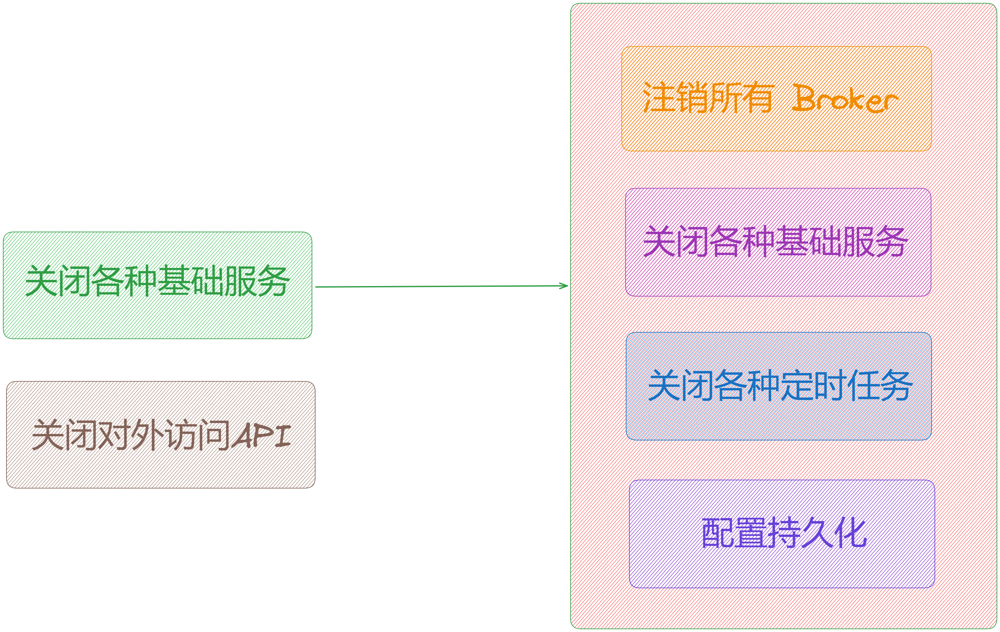

## **2.5 启动 BrokerController**

public void start() throws Exception {

// 起始时间

this.shouldStartTime = System.currentTimeMillis() + messageStoreConfig.getDisappearTimeAfterStart();

// 副本数 > 1 && 是否启用主从切换 || 是启动控制器模式，支持自动切换代理的角色。

if (messageStoreConfig.getTotalReplicas() > 1 && this.brokerConfig.isEnableSlaveActingMaster()) {

isIsolated = true;

}

// 代理外部API 不为空

if (this.brokerOuterAPI != null) {

// 启动 broker 对外访问的 API

this.brokerOuterAPI.start();

}

// 启动基础服务

startBasicService();

// 如果 isIsolated 为 false && 没有开启 DLeger 的相关配置 && 没有开启重复复制的功能

if (!isIsolated && !this.messageStoreConfig.isEnableDLegerCommitLog() && !this.messageStoreConfig.isDuplicationEnable()) {

// 更改 brokerId 为 0

changeSpecialServiceStatus(this.brokerConfig.getBrokerId() == MixAll.MASTER\_ID);

/\*\*

\* 在 broker 首次启动时，强制注册当前 broker 信息到所有的 nameServer 中

\*/

this.registerBrokerAll(true, false, true);

}

/\*\*

\* 设置一个定时任务，默认情况下每隔 30s 向所有的 nameServer 进行一次注册 broker 信息，时间间隔可以配置 registorNameServerPeriod属性，

\* 允许的值是在 1万 到 6万 毫秒之间，也就是（10s到60s的范围）

\* 这个定时任务就是 broker 向 nameServer 发送的心跳包的定时任务，包括 topic名，读、写队列个数，队列权限，是否有序等信息。

\*/

scheduledFutures.add(this.scheduledExecutorService.scheduleAtFixedRate(new AbstractBrokerRunnable(this.getBrokerIdentity()) {

@Override

public void run0() {

try {

if (System.currentTimeMillis() < shouldStartTime) {

BrokerController.LOG.info("Register to namesrv after {}", shouldStartTime);

return;

}

if (isIsolated) {

BrokerController.LOG.info("Skip register for broker is isolated");

return;

}

// 向所有 NameServer 注册 broker

BrokerController.this.registerBrokerAll(true, false, brokerConfig.isForceRegister());

} catch (Throwable e) {

BrokerController.LOG.error("registerBrokerAll Exception", e);

}

}

}, 1000 \* 10, Math.max(10000, Math.min(brokerConfig.getRegisterNameServerPeriod(), 60000)), TimeUnit.MILLISECONDS));

/\*\*

\* isEnableSlaveActingMaster()，默认为 false。不启用 slave 代理 master

\* 故障切换时，slave 将充当 master。例如：如果 master 关闭，定时消息或事务消息在 slave 中过期

\*/

if (this.brokerConfig.isEnableSlaveActingMaster()) {

// 定时发送心跳

scheduleSendHeartbeat();

scheduledFutures.add(this.syncBrokerMemberGroupExecutorService.scheduleAtFixedRate(new AbstractBrokerRunnable(this.getBrokerIdentity()) {

@Override

public void run0() {

try {

// 同步 broker 成员组执行器服务

BrokerController.this.syncBrokerMemberGroup();

} catch (Throwable e) {

BrokerController.LOG.error("sync BrokerMemberGroup error. ", e);

}

}

}, 1000, this.brokerConfig.getSyncBrokerMemberGroupPeriod(), TimeUnit.MILLISECONDS));

}

/\*\*

\* isEnableControllerMode():是否启动控制器模式，支持自动切换代理的角色。默认为 false

\*/

if (this.brokerConfig.isEnableControllerMode()) {

scheduleSendHeartbeat();

}

/\*\*

\* isSkipPreOnline():默认为false

\*/

if (brokerConfig.isSkipPreOnline()) {

// 无条件启动 broker

startServiceWithoutCondition();

}

}

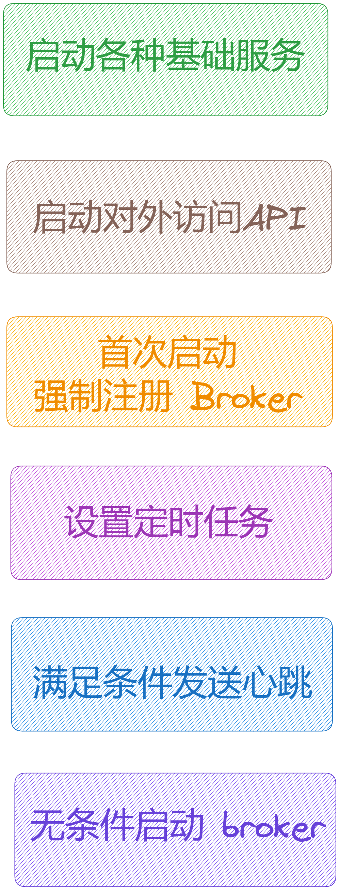

限于篇幅问题，细节就不展开了，会放到 [【Broker 端源码分析系列第二篇】图解 RocketMQ 源码之 Broker 启动流程核心控制器组件剖析](https://articles.zsxq.com/id_chxqzhg8psk4.html) 。

## **03 总结**

最后，总结下 [BrokerStartup](http://brokerstartup%20/) 的启动初始化流程，如下图：

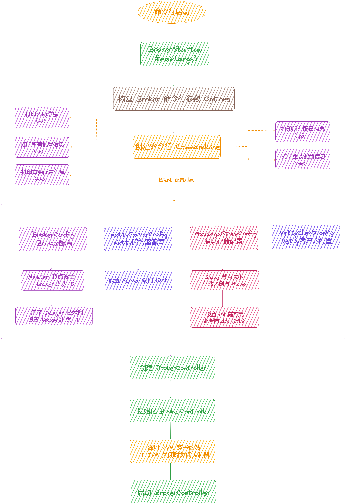