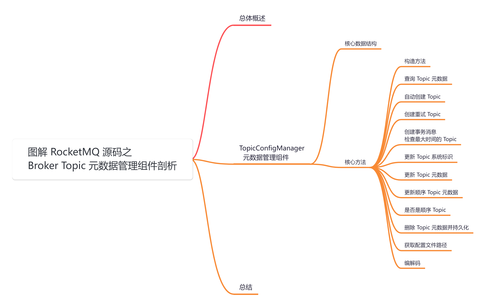
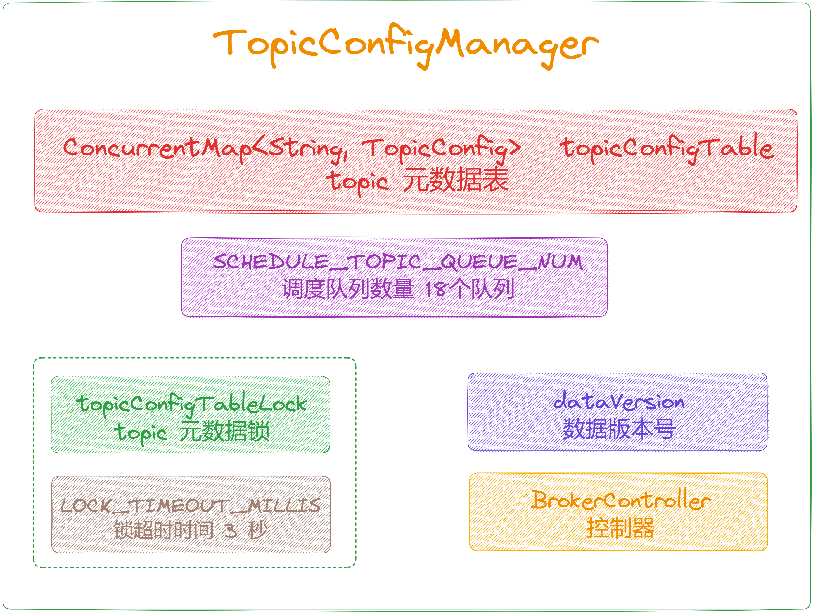
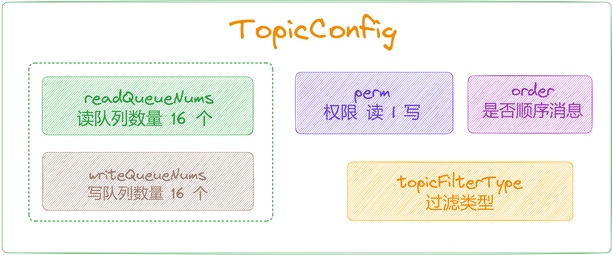
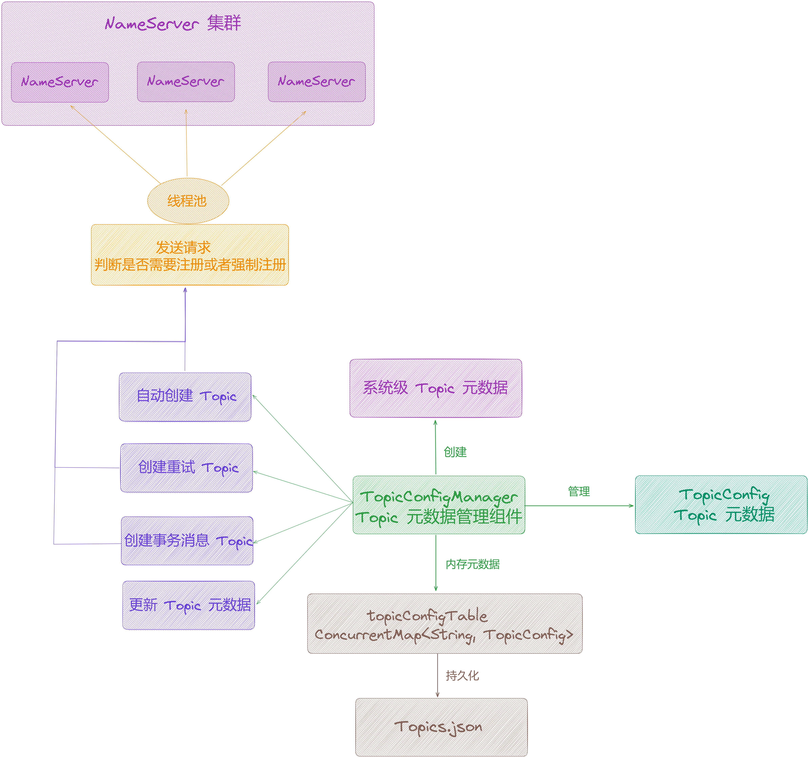
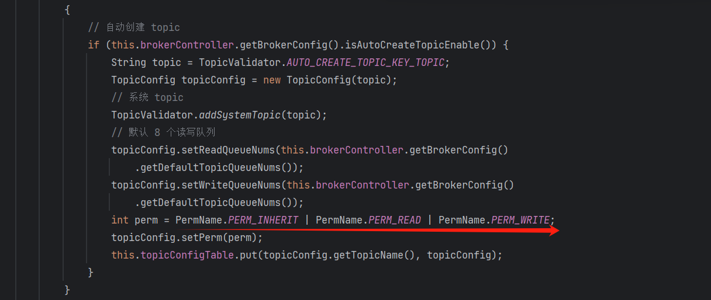
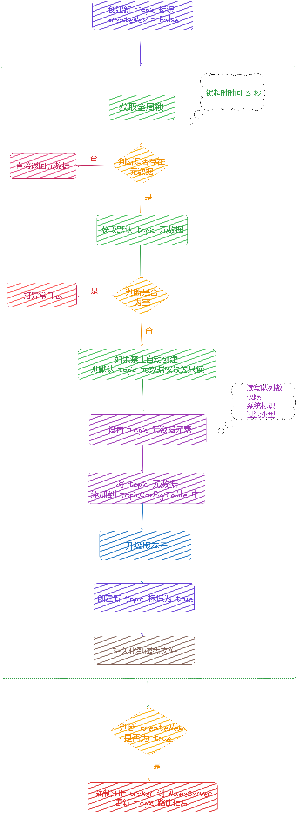
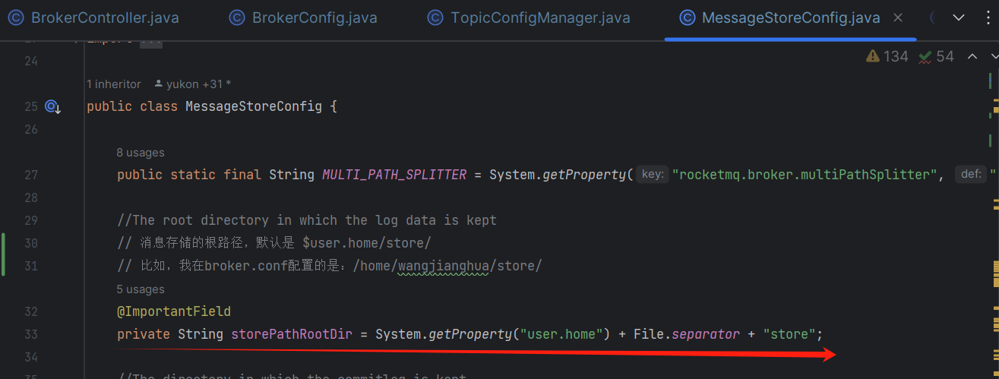
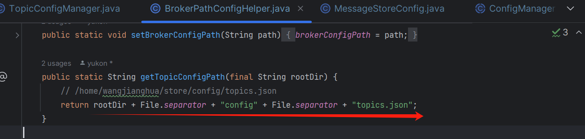

大家好，我是**华仔**, 又跟大家见面了。

从今天开始我将继续为大家奉上 RocketMQ 消费者源码剖析系列文章，正式开启「**RocketMQ 的服务端 Broker 源码之旅**」，这是第三篇，本篇我们将以「**RocketMQ 5.1.2**」版本为主，来剖析下 RocketMQ 源码之 Broker Topic 元数据管理组件剖析。

这里我将以「**RocketMQ 5.1.2**」版本为主，通过「**场景驱动**」的方式带大家一点点的对 RocketMQ 源码进行深度剖析，正式开启「**RocketMQ 的源码之旅**」，跟我一起来掌握 RocketMQ 源码核心架构设计思想吧。

  

## **01 总体概述**

在上一篇中，我们深度剖析了「**BrokerController**」初始化和启动流程，也深度剖析了注册「**Broker**」到 「**NameServer**」的全过程，在初始化过程中，[BrokerController](http://brokercontroller%20/) 会创建多个配置管理器，其中跟本文有关的「**TopicConfigManager**」。

## **02 TopicConfigManager**

通过[上篇的简单剖析](https://articles.zsxq.com/id_chxqzhg8psk4.html)，得知它主要负责管理 Broker 端的 [topicConfig](http://topicconfig/) 元数据信息，通过代码得知它继承了 [ConfigManager](http://configmanager/) 组件，且定时将内存中维护的 [topic](http://topic/) 元数据信息，注册到远程 [NameServer](http://nameserver/) 集群，并持久化到磁盘文件中。

源码位置：[https://github.com/apache/rocketmq/blob/release-5.1.2/](https://github.com/apache/rocketmq/blob/release-5.1.2/broker/src/main/java/org/apache/rocketmq/broker/topic/TopicConfigManager.java)[broker](https://github.com/apache/rocketmq/blob/release-5.1.2/broker/src/main/java/org/apache/rocketmq/broker/topic/TopicConfigManager.java)[/src/main/java/org/apache/rocketmq/](https://github.com/apache/rocketmq/blob/release-5.1.2/broker/src/main/java/org/apache/rocketmq/broker/topic/TopicConfigManager.java)[broker](https://github.com/apache/rocketmq/blob/release-5.1.2/broker/src/main/java/org/apache/rocketmq/broker/topic/TopicConfigManager.java)[/](https://github.com/apache/rocketmq/blob/release-5.1.2/broker/src/main/java/org/apache/rocketmq/broker/topic/TopicConfigManager.java)[topic/TopicConfigManager](https://github.com/apache/rocketmq/blob/release-5.1.2/broker/src/main/java/org/apache/rocketmq/broker/topic/TopicConfigManager.java)[.java](https://github.com/apache/rocketmq/blob/release-5.1.2/broker/src/main/java/org/apache/rocketmq/broker/topic/TopicConfigManager.java)

## **2.1 核心数据结构**

topic 元数据管理组件最核心的数据结构是，它所维护的 [topicConfigTable](http://topicconfigtable%20/)，即 topic 元数据表，其中 key 是[topicName](http://topicname/)，value 是 topic 元数据对象。

public class TopicConfigManager extends ConfigManager {

private static final Logger log \= LoggerFactory.getLogger(LoggerName.BROKER\_LOGGER\_NAME);

// 锁超时时间3秒

private static final long LOCK\_TIMEOUT\_MILLIS \= 3000;

// 调度队列数量 18个队列

private static final int SCHEDULE\_TOPIC\_QUEUE\_NUM \= 18;

// topic 元数据锁

private transient final Lock topicConfigTableLock \= new ReentrantLock();

// 核心: topic 元数据表，key 是 topicName， value 是 topic 元数据

private ConcurrentMap<String, TopicConfig> topicConfigTable = new ConcurrentHashMap<>(1024);

// 数据版本号

private DataVersion dataVersion \= new DataVersion();

private transient BrokerController brokerController;

....

}

来深入了解下 [TopicConfig](http://topicconfig/) 元数据对象，主要包含了「**主题名称**」、「**队列数量**」、「**权限**」、「**过滤类型**」等核心结构。

源码位置：[https://github.com/apache/rocketmq/blob/release-5.1.2/](https://github.com/apache/rocketmq/blob/release-5.1.2/common/src/main/java/org/apache/rocketmq/common/TopicConfig.java)[common](https://github.com/apache/rocketmq/blob/release-5.1.2/common/src/main/java/org/apache/rocketmq/common/TopicConfig.java)[/src/main/java/org/apache/rocketmq/](https://github.com/apache/rocketmq/blob/release-5.1.2/common/src/main/java/org/apache/rocketmq/common/TopicConfig.java)[common](https://github.com/apache/rocketmq/blob/release-5.1.2/common/src/main/java/org/apache/rocketmq/common/TopicConfig.java)[/](https://github.com/apache/rocketmq/blob/release-5.1.2/common/src/main/java/org/apache/rocketmq/common/TopicConfig.java)[TopicConfig](https://github.com/apache/rocketmq/blob/release-5.1.2/common/src/main/java/org/apache/rocketmq/common/TopicConfig.java)[.java](https://github.com/apache/rocketmq/blob/release-5.1.2/common/src/main/java/org/apache/rocketmq/common/TopicConfig.java)

public class TopicConfig {

private static final String SEPARATOR \= " ";

// 默认读写队列数量，都是16个

public static int defaultReadQueueNums \= 16;

public static int defaultWriteQueueNums \= 16;

private static final TypeReference<Map<String, String>> ATTRIBUTES\_TYPE\_REFERENCE = new TypeReference<Map<String, String>>() {

};

// 主题名称

private String topicName;

// 读写队列数量

private int readQueueNums \= defaultReadQueueNums;

private int writeQueueNums \= defaultWriteQueueNums;

// 权限

private int perm \= PermName.PERM\_READ | PermName.PERM\_WRITE;

// 过滤类型

private TopicFilterType topicFilterType \= TopicFilterType.SINGLE\_TAG;

// 系统标识

private int topicSysFlag \= 0;

// 是否顺序消息

private boolean order \= false;

....

}

## **2.2 核心方法**

接下来，我们来剖析下 [topic](http://topic/) 元数据管理组件的核心方法。

在创建对象实例阶段，初始化了大量系统级 [topic](http://topic%20/) 元数据，都继承了 [ConfigManager](http://configmanager/) 的「**持久化数据**」与「**磁盘文件加载**」的基础功能。并且还提供了大量可以「**自动创建 Topic**」的方法，在创建和更新内存中的 [topic](http://topic%20/) 元数据后，会将「**元数据信息**」并发注册到所有的 [NameServer](http://nameserver/) 集群节点且「**持久化数据到磁盘文件**」。

整个交互示意图如下：

这些方法都比较简单，我们分别来看下。

### **2.2.1 构造方法**

public TopicConfigManager(BrokerController brokerController) {

this.brokerController = brokerController;

// 初始化系统元数据

{

// 系统测试 topic

String topic \= TopicValidator.RMQ\_SYS\_SELF\_TEST\_TOPIC;

TopicConfig topicConfig \= new TopicConfig(topic);

// 系统 topic

TopicValidator.addSystemTopic(topic);

// 只有一个读写队列

topicConfig.setReadQueueNums(1);

topicConfig.setWriteQueueNums(1);

this.topicConfigTable.put(topicConfig.getTopicName(), topicConfig);

}

{

// 自动创建 topic

if (this.brokerController.getBrokerConfig().isAutoCreateTopicEnable()) {

String topic \= TopicValidator.AUTO\_CREATE\_TOPIC\_KEY\_TOPIC;

TopicConfig topicConfig \= new TopicConfig(topic);

// 系统 topic

TopicValidator.addSystemTopic(topic);

// 默认 8 个读写队列

topicConfig.setReadQueueNums(this.brokerController.getBrokerConfig()

.getDefaultTopicQueueNums());

topicConfig.setWriteQueueNums(this.brokerController.getBrokerConfig()

.getDefaultTopicQueueNums());

int perm \= PermName.PERM\_INHERIT | PermName.PERM\_READ | PermName.PERM\_WRITE;

topicConfig.setPerm(perm);

this.topicConfigTable.put(topicConfig.getTopicName(), topicConfig);

}

}

{

// 性能测试 topic

String topic \= TopicValidator.RMQ\_SYS\_BENCHMARK\_TOPIC;

TopicConfig topicConfig \= new TopicConfig(topic);

// 系统 topic

TopicValidator.addSystemTopic(topic);

// 读写队列 1024 个

topicConfig.setReadQueueNums(1024);

topicConfig.setWriteQueueNums(1024);

this.topicConfigTable.put(topicConfig.getTopicName(), topicConfig);

}

{

// 集群 topic

String topic \= this.brokerController.getBrokerConfig().getBrokerClusterName();

TopicConfig topicConfig \= new TopicConfig(topic);

TopicValidator.addSystemTopic(topic);

int perm \= PermName.PERM\_INHERIT;

if (this.brokerController.getBrokerConfig().isClusterTopicEnable()) {

perm |= PermName.PERM\_READ | PermName.PERM\_WRITE;

}

topicConfig.setPerm(perm);

this.topicConfigTable.put(topicConfig.getTopicName(), topicConfig);

}

{

// broker topic

String topic \= this.brokerController.getBrokerConfig().getBrokerName();

TopicConfig topicConfig \= new TopicConfig(topic);

TopicValidator.addSystemTopic(topic);

int perm \= PermName.PERM\_INHERIT;

if (this.brokerController.getBrokerConfig().isBrokerTopicEnable()) {

perm |= PermName.PERM\_READ | PermName.PERM\_WRITE;

}

// 只有一个读写队列

topicConfig.setReadQueueNums(1);

topicConfig.setWriteQueueNums(1);

topicConfig.setPerm(perm);

this.topicConfigTable.put(topicConfig.getTopicName(), topicConfig);

}

{

// 位移事件清理 Topic

String topic \= TopicValidator.RMQ\_SYS\_OFFSET\_MOVED\_EVENT;

TopicConfig topicConfig \= new TopicConfig(topic);

TopicValidator.addSystemTopic(topic);

// 只有一个读写队列

topicConfig.setReadQueueNums(1);

topicConfig.setWriteQueueNums(1);

this.topicConfigTable.put(topicConfig.getTopicName(), topicConfig);

}

{

// 定时任务调度 topic

String topic \= TopicValidator.RMQ\_SYS\_SCHEDULE\_TOPIC;

TopicConfig topicConfig \= new TopicConfig(topic);

TopicValidator.addSystemTopic(topic);

// 调度队列数量 18个队列

topicConfig.setReadQueueNums(SCHEDULE\_TOPIC\_QUEUE\_NUM);

topicConfig.setWriteQueueNums(SCHEDULE\_TOPIC\_QUEUE\_NUM);

this.topicConfigTable.put(topicConfig.getTopicName(), topicConfig);

}

{

// trace topic

if (this.brokerController.getBrokerConfig().isTraceTopicEnable()) {

String topic \= this.brokerController.getBrokerConfig().getMsgTraceTopicName();

TopicConfig topicConfig \= new TopicConfig(topic);

TopicValidator.addSystemTopic(topic);

// 只有一个读写队列

topicConfig.setReadQueueNums(1);

topicConfig.setWriteQueueNums(1);

this.topicConfigTable.put(topicConfig.getTopicName(), topicConfig);

}

}

{

// reply topic

String topic \= this.brokerController.getBrokerConfig().getBrokerClusterName() + "\_" + MixAll.REPLY\_TOPIC\_POSTFIX;

TopicConfig topicConfig \= new TopicConfig(topic);

TopicValidator.addSystemTopic(topic);

// 只有一个读写队列

topicConfig.setReadQueueNums(1);

topicConfig.setWriteQueueNums(1);

this.topicConfigTable.put(topicConfig.getTopicName(), topicConfig);

}

{

// PopAckConstants.REVIVE\_TOPIC

String topic \= PopAckConstants.buildClusterReviveTopic(this.brokerController.getBrokerConfig().getBrokerClusterName());

TopicConfig topicConfig \= new TopicConfig(topic);

TopicValidator.addSystemTopic(topic);

topicConfig.setReadQueueNums(this.brokerController.getBrokerConfig().getReviveQueueNum());

topicConfig.setWriteQueueNums(this.brokerController.getBrokerConfig().getReviveQueueNum());

this.topicConfigTable.put(topicConfig.getTopicName(), topicConfig);

}

{

// sync broker member group topic

String topic \= TopicValidator.SYNC\_BROKER\_MEMBER\_GROUP\_PREFIX + this.brokerController.getBrokerConfig().getBrokerName();

TopicConfig topicConfig \= new TopicConfig(topic);

TopicValidator.addSystemTopic(topic);

// 只有一个读写队列

topicConfig.setReadQueueNums(1);

topicConfig.setWriteQueueNums(1);

topicConfig.setPerm(PermName.PERM\_INHERIT);

this.topicConfigTable.put(topicConfig.getTopicName(), topicConfig);

}

{

// TopicValidator.RMQ\_SYS\_TRANS\_HALF\_TOPIC

String topic \= TopicValidator.RMQ\_SYS\_TRANS\_HALF\_TOPIC;

TopicConfig topicConfig \= new TopicConfig(topic);

TopicValidator.addSystemTopic(topic);

// 只有一个读写队列

topicConfig.setReadQueueNums(1);

topicConfig.setWriteQueueNums(1);

this.topicConfigTable.put(topicConfig.getTopicName(), topicConfig);

}

{

// TopicValidator.RMQ\_SYS\_TRANS\_OP\_HALF\_TOPIC

String topic \= TopicValidator.RMQ\_SYS\_TRANS\_OP\_HALF\_TOPIC;

TopicConfig topicConfig \= new TopicConfig(topic);

TopicValidator.addSystemTopic(topic);

// 只有一个读写队列

topicConfig.setReadQueueNums(1);

topicConfig.setWriteQueueNums(1);

this.topicConfigTable.put(topicConfig.getTopicName(), topicConfig);

}

}

### **2.2.2 查询 Topic 元数据**

// 查询 topic 元数据，直接从 topic 元数据表中获取对应 Topic 的元数据

public TopicConfig selectTopicConfig(final String topic) {

return this.topicConfigTable.get(topic);

}

### **2.2.3 自动创建 Topic**

// 在发送消息时，自动创建 topic

public TopicConfig createTopicInSendMessageMethod(final String topic, final String defaultTopic,

final String remoteAddress, final int clientDefaultTopicQueueNums, final int topicSysFlag) {

TopicConfig topicConfig \= null;

boolean createNew \= false;

try {

// 获取一把全局锁，防止并发创建 topic，超时时间 3 秒

if (this.topicConfigTableLock.tryLock(LOCK\_TIMEOUT\_MILLIS, TimeUnit.MILLISECONDS)) {

try {

// 如果存在 topic 元数据，直接返回 topic 元数据

topicConfig = this.topicConfigTable.get(topic);

if (topicConfig != null) {

return topicConfig;

}

// 获取默认 topic 元数据

TopicConfig defaultTopicConfig \= this.topicConfigTable.get(defaultTopic);

if (defaultTopicConfig != null) {

// 默认 topic 是 TBW102

if (defaultTopic.equals(TopicValidator.AUTO\_CREATE\_TOPIC\_KEY\_TOPIC)) {

// 如果禁止自动创建，则默认 topic 元数据权限为只读

if (!this.brokerController.getBrokerConfig().isAutoCreateTopicEnable()) {

defaultTopicConfig.setPerm(PermName.PERM\_READ | PermName.PERM\_WRITE);

}

}

// 如果默认 topic 元数据是允许继承，根据默认 topic 创建

if (PermName.isInherited(defaultTopicConfig.getPerm())) {

topicConfig = new TopicConfig(topic);

// 选择最小队列数 从客户端默认 Topic 里面的 queue 数量与服务端默认 Topic 里面的 queue 数量对比

int queueNums \= Math.min(clientDefaultTopicQueueNums, defaultTopicConfig.getWriteQueueNums());

if (queueNums < 0) {

queueNums = 0;

}

// 设置读写队列数

topicConfig.setReadQueueNums(queueNums);

topicConfig.setWriteQueueNums(queueNums);

// 设置权限

int perm \= defaultTopicConfig.getPerm();

perm &= ~PermName.PERM\_INHERIT;

topicConfig.setPerm(perm);

// 设置系统标识

topicConfig.setTopicSysFlag(topicSysFlag);

// 设置过滤类型

topicConfig.setTopicFilterType(defaultTopicConfig.getTopicFilterType());

} else {

log.warn("Create new topic failed, because the default topic\[{}\] has no perm \[{}\] producer:\[{}\]",

defaultTopic, defaultTopicConfig.getPerm(), remoteAddress);

}

} else {

log.warn("Create new topic failed, because the default topic\[{}\] not exist. producer:\[{}\]",

defaultTopic, remoteAddress);

}

if (topicConfig != null) {

log.info("Create new topic by default topic:\[{}\] config:\[{}\] producer:\[{}\]",

defaultTopic, topicConfig, remoteAddress);

// 将 topic 元数据添加到 topicConfigTable 中

this.topicConfigTable.put(topic, topicConfig);

long stateMachineVersion \= brokerController.getMessageStore() != null ? brokerController.getMessageStore().getStateMachineVersion() : 0;

// 升级版本号

dataVersion.nextVersion(stateMachineVersion);

// 创建 topic 标识为 true

createNew = true;

// 最后持久化元数据

this.persist();

}

} finally {

// 释放锁

this.topicConfigTableLock.unlock();

}

}

} catch (InterruptedException e) {

log.error("createTopicInSendMessageMethod exception", e);

}

if (createNew) {

// 如果新创建 topic 则强制注册 broker 到 NameServer 更新 Topic 路由信息

this.brokerController.registerBrokerAll(false, true, true);

}

return topicConfig;

}

在这里有个需要关注的点就是，如果没有开启「**自动创建 Topic**」，此时是没有 [inherite](http://inherite/) 权限的，也就是说「**无法继承**」默认 Topic 「**TBW102**」的一些元数据属性，只有开启了「**自动创建 Topic**」，此时就有 [inherite](http://%20inherite%20/) 权限的，理所当然也就「**可以继承**」默认 Topic 「**TBW102**」的一些元数据属性了。

### **2.2.4 创建重试 Topic**

public TopicConfig createTopicInSendMessageBackMethod(

final String topic,

final int clientDefaultTopicQueueNums,

final int perm,

final int topicSysFlag) {

return createTopicInSendMessageBackMethod(topic, clientDefaultTopicQueueNums, perm, false, topicSysFlag);

}

// 创建重试 topic

public TopicConfig createTopicInSendMessageBackMethod(

final String topic,

final int clientDefaultTopicQueueNums,

final int perm,

final boolean isOrder,

final int topicSysFlag) {

TopicConfig topicConfig \= this.topicConfigTable.get(topic);

if (topicConfig != null) {

// 非顺序消息 重新更新 topic 元数据

if (isOrder != topicConfig.isOrder()) {

topicConfig.setOrder(isOrder);

this.updateTopicConfig(topicConfig);

}

return topicConfig;

}

// 是否创建新的 Topic

boolean createNew \= false;

try {

// 获取一把全局锁，防止并发创建topic，超时时间3秒

if (this.topicConfigTableLock.tryLock(LOCK\_TIMEOUT\_MILLIS, TimeUnit.MILLISECONDS)) {

try {

// 如果存在元数据，直接返回

topicConfig = this.topicConfigTable.get(topic);

if (topicConfig != null) {

return topicConfig;

}

topicConfig = new TopicConfig(topic);

// 设置读写队列数

topicConfig.setReadQueueNums(clientDefaultTopicQueueNums);

topicConfig.setWriteQueueNums(clientDefaultTopicQueueNums);

// 设置权限

topicConfig.setPerm(perm);

// 设置系统标识

topicConfig.setTopicSysFlag(topicSysFlag);

// 设置是否顺序消息

topicConfig.setOrder(isOrder);

log.info("create new topic {}", topicConfig);

// 如果不存在，则创建

this.topicConfigTable.put(topic, topicConfig);

// 创建新 Topic 标识为 true

createNew = true;

long stateMachineVersion \= brokerController.getMessageStore() != null ? brokerController.getMessageStore().getStateMachineVersion() : 0;

// 升级版本号

dataVersion.nextVersion(stateMachineVersion);

// 持久化

this.persist();

} finally {

// 释放锁

this.topicConfigTableLock.unlock();

}

}

} catch (InterruptedException e) {

log.error("createTopicInSendMessageBackMethod exception", e);

}

if (createNew) {

// 如果新创建 topic 则强制注册 broker 到 NameServer 更新 Topic 路由信息

this.brokerController.registerBrokerAll(false, true, true);

}

return topicConfig;

}

### **2.2.5 创建事务消息检查最大时间的 Topic**

// 创建事务消息检查最大时间的topic

public TopicConfig createTopicOfTranCheckMaxTime(final int clientDefaultTopicQueueNums, final int perm) {

TopicConfig topicConfig \= this.topicConfigTable.get(TopicValidator.RMQ\_SYS\_TRANS\_CHECK\_MAX\_TIME\_TOPIC);

if (topicConfig != null)

return topicConfig;

boolean createNew \= false;

try {

// 获取一把全局锁，防止并发创建topic，超时时间3秒

if (this.topicConfigTableLock.tryLock(LOCK\_TIMEOUT\_MILLIS, TimeUnit.MILLISECONDS)) {

try {

// 获取事务消息检查最大时间的 topic 元数据

topicConfig = this.topicConfigTable.get(TopicValidator.RMQ\_SYS\_TRANS\_CHECK\_MAX\_TIME\_TOPIC);

if (topicConfig != null)

return topicConfig;

topicConfig = new TopicConfig(TopicValidator.RMQ\_SYS\_TRANS\_CHECK\_MAX\_TIME\_TOPIC);

// 设置读写队列

topicConfig.setReadQueueNums(clientDefaultTopicQueueNums);

topicConfig.setWriteQueueNums(clientDefaultTopicQueueNums);

// 设置权限

topicConfig.setPerm(perm);

// 设置系统标识

topicConfig.setTopicSysFlag(0);

log.info("create new topic {}", topicConfig);

// 如果不存在，则创建

this.topicConfigTable.put(TopicValidator.RMQ\_SYS\_TRANS\_CHECK\_MAX\_TIME\_TOPIC, topicConfig);

// 创建新 Topic 标识为 true

createNew = true;

long stateMachineVersion \= brokerController.getMessageStore() != null ? brokerController.getMessageStore().getStateMachineVersion() : 0;

// 升级版本号

dataVersion.nextVersion(stateMachineVersion);

// 持久化

this.persist();

} finally {

// 释放锁

this.topicConfigTableLock.unlock();

}

}

} catch (InterruptedException e) {

log.error("create TRANS\_CHECK\_MAX\_TIME\_TOPIC exception", e);

}

if (createNew) {

// 如果新创建 topic 则强制注册 broker 到 NameServer 更新 Topic 路由信息

this.brokerController.registerBrokerAll(false, true, true);

}

return topicConfig;

}

以上这几个创建 Topic 的方法步骤都类似，只不过「**主题名称**」、「**队列数量**」、「**权限**」、「**过滤类型**」不同而已。

### **2.2.6 更新 Topic 系统标识**

// 更新 topic 系统标识

public void updateTopicUnitFlag(final String topic, final boolean unit) {

TopicConfig topicConfig \= this.topicConfigTable.get(topic);

if (topicConfig != null) {

// 更新系统标识

int oldTopicSysFlag \= topicConfig.getTopicSysFlag();

if (unit) {

topicConfig.setTopicSysFlag(TopicSysFlag.setUnitFlag(oldTopicSysFlag));

} else {

topicConfig.setTopicSysFlag(TopicSysFlag.clearUnitFlag(oldTopicSysFlag));

}

log.info("update topic sys flag. oldTopicSysFlag={}, newTopicSysFlag={}", oldTopicSysFlag,

topicConfig.getTopicSysFlag());

// 存入内存数元数据 table

this.topicConfigTable.put(topic, topicConfig);

long stateMachineVersion \= brokerController.getMessageStore() != null ? brokerController.getMessageStore().getStateMachineVersion() : 0;

// 更新数据版本号

dataVersion.nextVersion(stateMachineVersion);

// 持久化

this.persist();

// 强制注册所有 broker 信息到 nameServer 更新 Topic 路由信息

this.brokerController.registerBrokerAll(false, true, true);

}

}

### **2.2.7 更新 Topic 元数据**

// 更新 topic 元数据

public void updateTopicConfig(final TopicConfig topicConfig) {

checkNotNull(topicConfig, "topicConfig shouldn't be null");

Map<String, String> newAttributes = request(topicConfig);

Map<String, String> currentAttributes = current(topicConfig.getTopicName());

Map<String, String> finalAttributes = alterCurrentAttributes(

this.topicConfigTable.get(topicConfig.getTopicName()) == null,

ImmutableMap.copyOf(currentAttributes),

ImmutableMap.copyOf(newAttributes));

// 设置属性

topicConfig.setAttributes(finalAttributes);

// 写入 Topic 元数据表

TopicConfig old \= this.topicConfigTable.put(topicConfig.getTopicName(), topicConfig);

if (old != null) {

log.info("update topic config, old:\[{}\] new:\[{}\]", old, topicConfig);

} else {

log.info("create new topic \[{}\]", topicConfig);

}

long stateMachineVersion \= brokerController.getMessageStore() != null ? brokerController.getMessageStore().getStateMachineVersion() : 0;

// 更新数据版本号

dataVersion.nextVersion(stateMachineVersion);

// 持久化元数据到磁盘

this.persist(topicConfig.getTopicName(), topicConfig);

}

### **2.2.8 更新 Topic 元数据**

// 更新顺序 topic 元数据

public void updateOrderTopicConfig(final KVTable orderKVTableFromNs) {

if (orderKVTableFromNs != null && orderKVTableFromNs.getTable() != null) {

boolean isChange \= false;

Set<String> orderTopics = orderKVTableFromNs.getTable().keySet();

for (String topic : orderTopics) {

TopicConfig topicConfig \= this.topicConfigTable.get(topic);

if (topicConfig != null && !topicConfig.isOrder()) {

// 在顺序 topic 列表中，更新 topic 为顺序 topic

topicConfig.setOrder(true);

isChange = true;

log.info("update order topic config, topic={}, order={}", topic, true);

}

}

// We don't have a mandatory rule to maintain the validity of order conf in NameServer,

// so we may overwrite the order field mistakenly.

// To avoid the above case, we comment the below codes, please use mqadmin API to update

// the order filed.

/\*for (Map.Entry<String, TopicConfig> entry : this.topicConfigTable.entrySet()) {

String topic = entry.getKey();

if (!orderTopics.contains(topic)) {

TopicConfig topicConfig = entry.getValue();

if (topicConfig.isOrder()) {

topicConfig.setOrder(false);

isChange = true;

log.info("update order topic config, topic={}, order={}", topic, false);

}

}

}\*/

if (isChange) {

long stateMachineVersion \= brokerController.getMessageStore() != null ? brokerController.getMessageStore().getStateMachineVersion() : 0;

// 更新数据版本号

dataVersion.nextVersion(stateMachineVersion);

// 持久化元数据到磁盘

this.persist();

}

}

}

### **2.2.9 是否是顺序 Topic**

// 是否是顺序 Topic

public boolean isOrderTopic(final String topic) {

// 从 Topic 元数据表获取对应的 Topic 元数据

TopicConfig topicConfig \= this.topicConfigTable.get(topic);

if (topicConfig == null) {

return false;

} else {

// 返回是否是顺序 Topic

return topicConfig.isOrder();

}

}

### **2.2.10 删除 Topic 元数据并持久化**

// 删除topic元数据，并持久化

public void deleteTopicConfig(final String topic) {

// 从 Topic 元数据表删除对应的 Topic 元数据

TopicConfig old \= this.topicConfigTable.remove(topic);

if (old != null) {

log.info("delete topic config OK, topic: {}", old);

long stateMachineVersion \= brokerController.getMessageStore() != null ? brokerController.getMessageStore().getStateMachineVersion() : 0;

// 升级版本号

dataVersion.nextVersion(stateMachineVersion);

// 持久化到磁盘文件

this.persist();

} else {

log.warn("delete topic config failed, topic: {} not exists", topic);

}

}

### **2.2.11 获取配置文件路径**

@Override

public String configFilePath() {

return BrokerPathConfigHelper.getTopicConfigPath(this.brokerController.

getMessageStoreConfig().getStorePathRootDir());

}

### **2.2.12 编解码**

很简单，[encode](http://encode%20/) 就是将 [topicConfigTable](http://topicconfigtable/)、[dataVersion](http://dataversion/) 序列化成 json 字符串，[decode](http://decode%20/) 就是将 json 字符串解码成对象。

// 将 topicConfigTable、dataVersion 序列化成 json 字符串

public String encode(final boolean prettyFormat) {

TopicConfigSerializeWrapper topicConfigSerializeWrapper \= new TopicConfigSerializeWrapper();

topicConfigSerializeWrapper.setTopicConfigTable(this.topicConfigTable);

topicConfigSerializeWrapper.setDataVersion(this.dataVersion);

return topicConfigSerializeWrapper.toJson(prettyFormat);

}

// 将 json 字符串解码成对象

@Override

public void decode(String jsonString) {

if (jsonString != null) {

// 将 json 字符串解码成对象

TopicConfigSerializeWrapper topicConfigSerializeWrapper \=

TopicConfigSerializeWrapper.fromJson(jsonString, TopicConfigSerializeWrapper.class);

if (topicConfigSerializeWrapper != null) {

// 写入 Topic 元数据表

this.topicConfigTable.putAll(topicConfigSerializeWrapper.getTopicConfigTable());

// 更新版本号

this.dataVersion.assignNewOne(topicConfigSerializeWrapper.getDataVersion());

// 打印日志

this.printLoadDataWhenFirstBoot(topicConfigSerializeWrapper);

}

}

}

## **03 总结**

本篇主要剖析了 [BrokerController](http://brokercontroller%20/) 初始化时中用到的配置管理器 「**TopicConfigManager**」，它会「**持久化数据**」到磁盘，启动时也会从磁盘「**加载文件数据到**」内存。