大家好，我是**华仔**, 又跟大家见面了。

从今天开始我将继续为大家奉上 RocketMQ 消费者源码剖析系列文章，正式开启「**RocketMQ 的服务端 Broker 源码之旅**」，这是第二篇，本篇我们将以「**RocketMQ 5.1.2**」版本为主，来剖析下 RocketMQ 源码之 Broker 启动流程核心控制器组件剖析。

这里我将以「**RocketMQ 5.1.2**」版本为主，通过「**场景驱动**」的方式带大家一点点的对 RocketMQ 源码进行深度剖析，正式开启「**RocketMQ 的源码之旅**」，跟我一起来掌握 RocketMQ 源码核心架构设计思想吧。

  
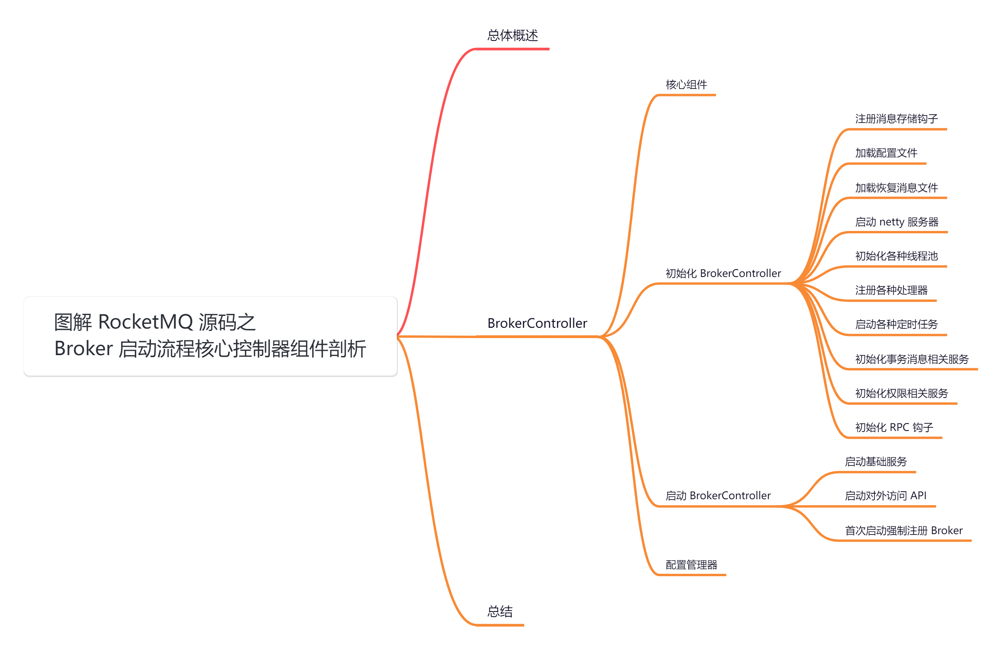

## **01 总体概述**

在[上一篇](https://articles.zsxq.com/id_em1wtu9mb5u4.html)中，我们剖析了 「**RocketMQ Broker**」启动流程，当我们用 [mqbroker](http://mqbroker%20/) 脚本启动的 [JVM](http://jvm%20/) 进程，实际上你可以认为就是一个 [Broker](http://broker/)，这里 [Broker](http://broker/) 实际上应该是代表了一个 JVM 进程的概念。

然后 [BrokerStartup](http://brokerstartup/) 作为一个[main class](http://main%20class/)，它的作用是准备好「**核心配置组件**」，然后就是「**创建 BrokerController**」、「**初始化 BrokerController**」以及「**启动 BrokerController**」这个核心组件，也就是启动一个 [Broker](http://broker%20/) 管理控制组件，让「**BrokerController**」去「**控制**」和「**管理**」Broker 这个 JVM 进程运行过程中的一切操作，包括「**接收网络请求**」、「**管理磁盘消息数据**」以及「**一大堆后台线程的运行**」。

由于篇幅问题，上篇基本是点到为止，今天我们就来深度剖析下这个非常重要的控制器管理组件吧。

##   
**02 BrokerController**

通过上篇的剖析，我们了解到「**BrokerController**」中依赖了非常多的组件，与 「**NamesrvController**」类似，大部分「**核心组件的始化**」都在该控制器中进行。

在 RocketMQ 中定义了大量的「**职责独立的组件**」，避免多个类互相耦合，依赖关系混乱导致系统的结构变得很复杂。

其实不难发现，「**BrokerController**」、「**NamesrvController**」都是采用的「**中介者模式**」来避免组件之间直接依赖。

所谓「**中介者模式**」其实就是用一个「**中介对象**」来封装一系列的对象交互，「**中介者**」使各对象不需要显式地相互引用，从而使其耦合松散，而且可以独立地改变它们之间的交互。其它对象则直接依赖「**中介者对象**」，也就是「**BrokerController**」，然后通过「**BrokerController**」来获得想要的组件。

如下图，图片来自争哥的[设计模式专栏](https://time.geekbang.org/column/article/226710?utm_campaign=geektime_search&utm_content=geektime_search&utm_medium=geektime_search&utm_source=geektime_search&utm_term=geektime_search)。

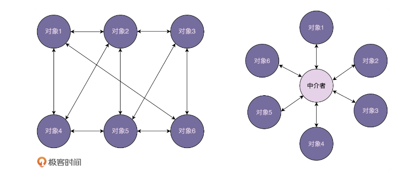

## **2.1 核心组件**

BrokerController 作为「**中介者**」依赖了大量的组件。

源码位置：[https://github.com/apache/rocketmq/blob/release-5.1.2/](https://github.com/apache/rocketmq/blob/release-5.1.2/broker/src/main/java/org/apache/rocketmq/broker/BrokerController.java)[broker](https://github.com/apache/rocketmq/blob/release-5.1.2/broker/src/main/java/org/apache/rocketmq/broker/BrokerController.java)[/src/main/java/org/apache/rocketmq/](https://github.com/apache/rocketmq/blob/release-5.1.2/broker/src/main/java/org/apache/rocketmq/broker/BrokerController.java)[broker](https://github.com/apache/rocketmq/blob/release-5.1.2/broker/src/main/java/org/apache/rocketmq/broker/BrokerController.java)[/](https://github.com/apache/rocketmq/blob/release-5.1.2/broker/src/main/java/org/apache/rocketmq/broker/BrokerController.java)[BrokerController](https://github.com/apache/rocketmq/blob/release-5.1.2/broker/src/main/java/org/apache/rocketmq/broker/BrokerController.java)[.java](https://github.com/apache/rocketmq/blob/release-5.1.2/broker/src/main/java/org/apache/rocketmq/broker/BrokerController.java)

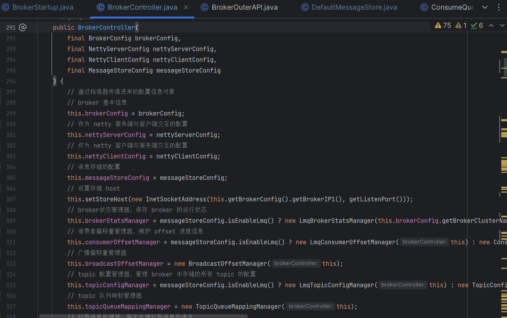

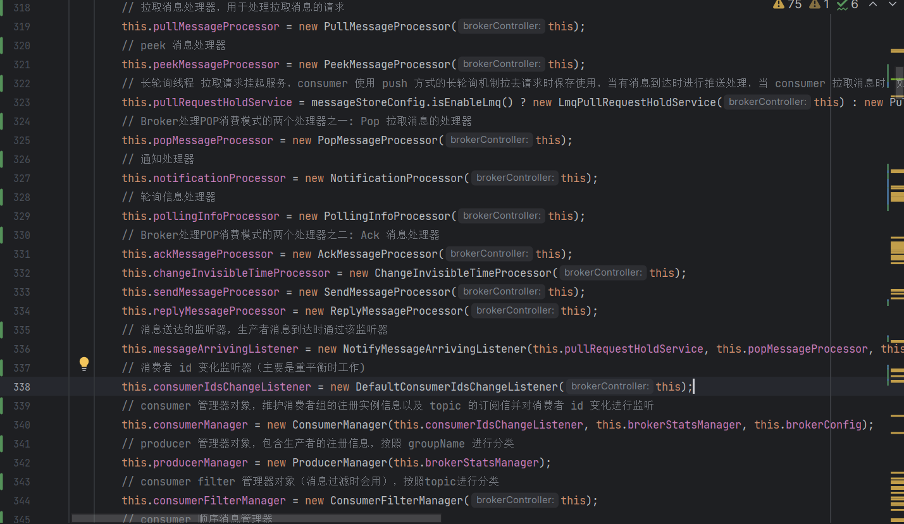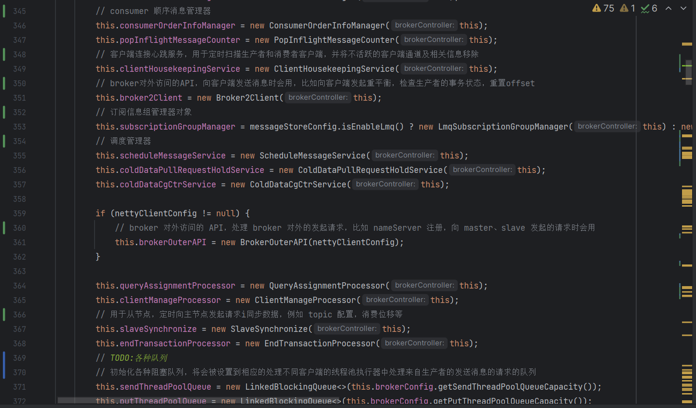

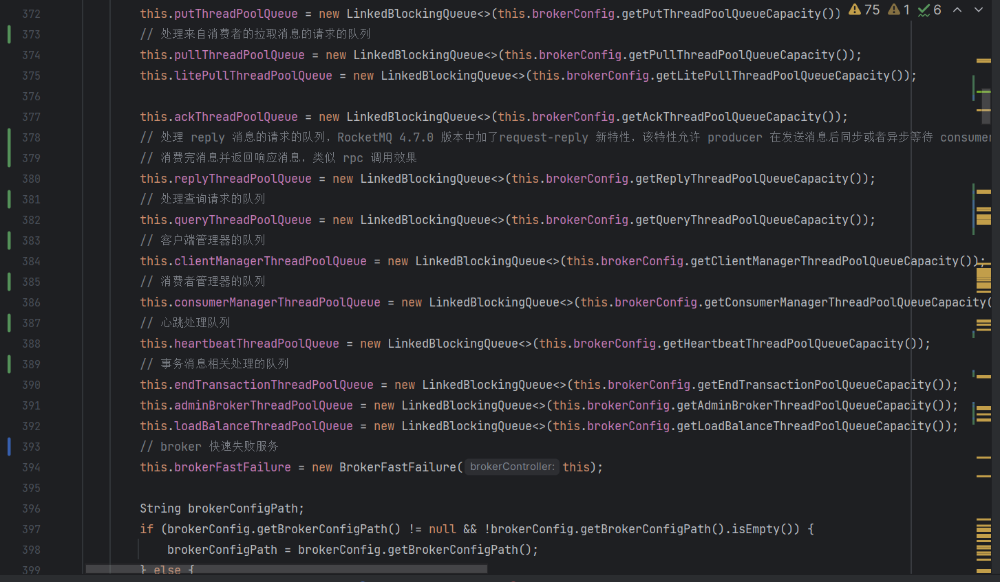

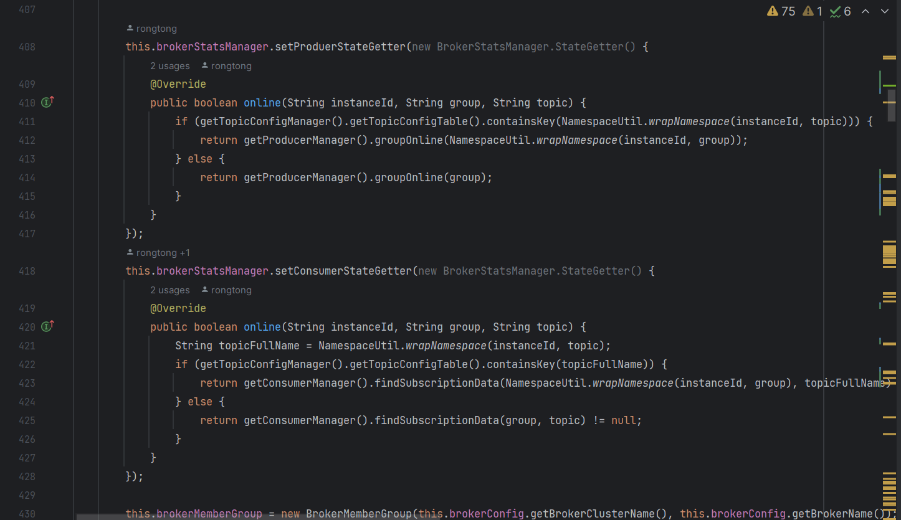

整整有 150+ 行，这个构造函数是不是很长，其实比较简单，就是在组合创建各个组件，这里我对其简单归类，如下：

1.  配置对象：Broker、Netty 客户端/服务端、消息存储等配置。
2.  网络组件：基于 Netty 的服务器和客户端、API调用等。
3.  Broker管理组件：Broker 配置管理、Topic 管理、订阅管理、状态统计等组件。
4.  生产者组件：生产者管理组件。
5.  消费者组件：消费者管理、拉取消息、消费偏移量管理等组件。
6.  消息存储：消息本地存储组件。
7.  事务管理：事务消息相关组件。
8.  请求处理器：Broker 接收生产者、消费者请求的处理器，调用 NameServer 的处理器。
9.  线程池：各个请求处理器绑定的线程池和阻塞队列。

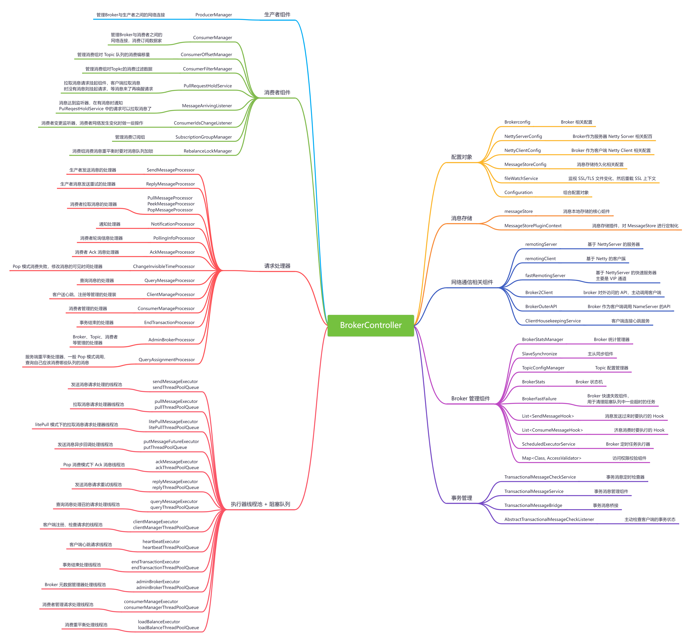

## **2.3 初始化 BrokerController**

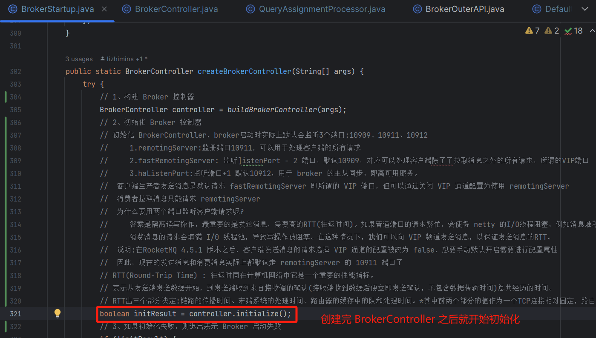

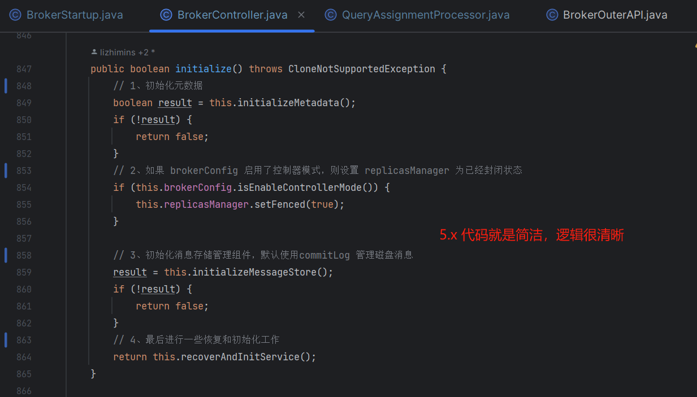

这 4 个方法在[上一篇](https://articles.zsxq.com/id_em1wtu9mb5u4.html)中已经剖析过了，这里再来深度剖析下第 4 部分。

### **2.3.1 注册消息存储钩子**

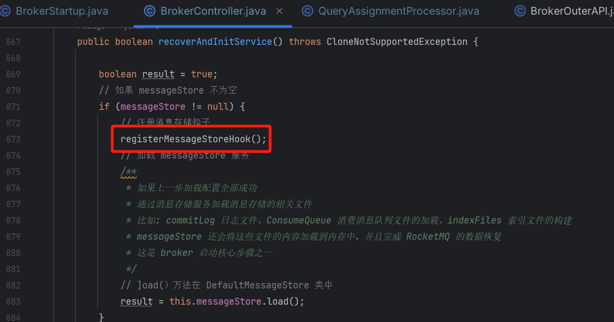

public void registerMessageStoreHook() {

// 1、messageStore 中消息存储的钧子集合

List<PutMessageHook> putMessageHookList = messageStore.getPutMessageHookList();

// 2、往钩子集合中添加新的钩子函数

putMessageHookList.add(new PutMessageHook() {

// 设置钩子函数名称为 checkBeforePutMessage

@Override

public String hookName() {

return "checkBeforePutMessage";

}

// 在放置消息之前执行。例如:消息验证或特殊消息转换

@Override

public PutMessageResult executeBeforePutMessage(MessageExt msg) {

return HookUtils.checkBeforePutMessage(BrokerController.this, msg);

}

});

// 3、往钩子集合中添加新的钩子函数

putMessageHookList.add(new PutMessageHook() {

// 设置钩子函数的名称为 innerBatchChecker 内部批处理检查器

@Override

public String hookName() {

return "innerBatchChecker";

}

@Override

public PutMessageResult executeBeforePutMessage(MessageExt msg) {

// instanceof 是 Java 的保留关键字。它的作用是测试它左边的对象是否是它右边的类的实例，返回 boolean 的数据类型,

if (msg instanceof MessageExtBrokerInner) {

return HookUtils.checkInnerBatch(BrokerController.this, msg);

}

return null;

}

});

// 3、往钩子集合中添加新的钩子函数

putMessageHookList.add(new PutMessageHook() {

// 设置钩子函数的名称为 handleScheduleMessage 处理计划消息

@Override

public String hookName() {

return "handleScheduleMessage";

}

@Override

public PutMessageResult executeBeforePutMessage(MessageExt msg) {

if (msg instanceof MessageExtBrokerInner) {

return HookUtils.handleScheduleMessage(BrokerController.this, (MessageExtBrokerInner) msg);

}

return null;

}

});

// 4、HA握手时，从设备以一定的偏移量将消息发送回主设备

SendMessageBackHook sendMessageBackHook \= new SendMessageBackHook() {

@Override

public boolean executeSendMessageBack(List<MessageExt> msgList, String brokerName, String brokerAddr) {

return HookUtils.sendMessageBack(BrokerController.this, msgList, brokerName, brokerAddr);

}

};

// 5、如果消息不为空，设置发送消息回钩

if (messageStore != null) {

messageStore.setSendMessageBackHook(sendMessageBackHook);

}

}

就是注册钩子，在适当的时候执行钩子函数。

### **2.3.2 加载配置文件**

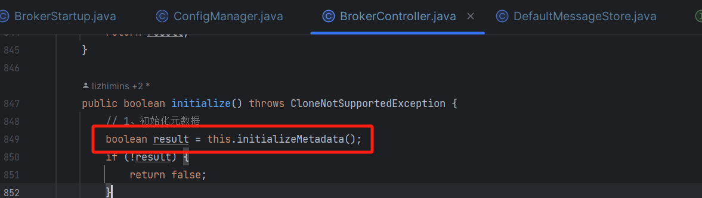

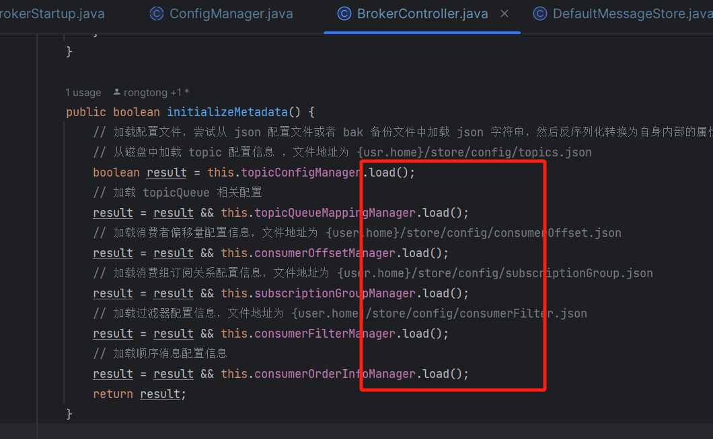

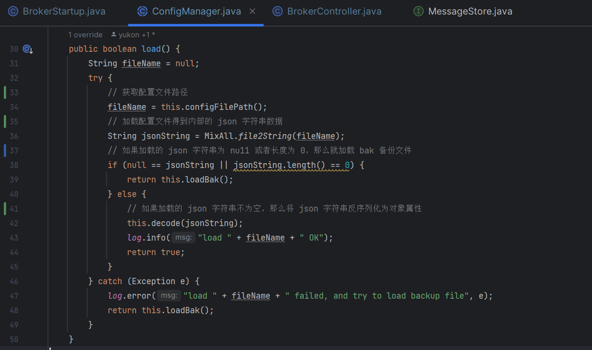

### **2.3.3 加载恢复消息文件**

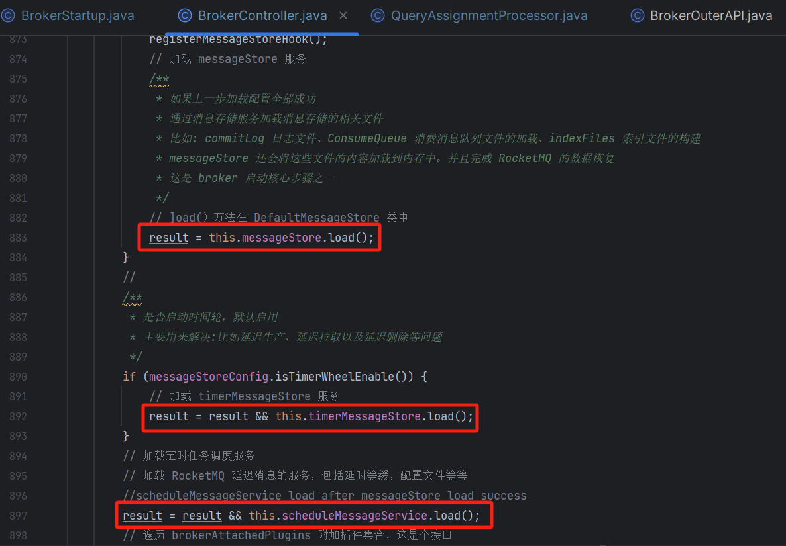

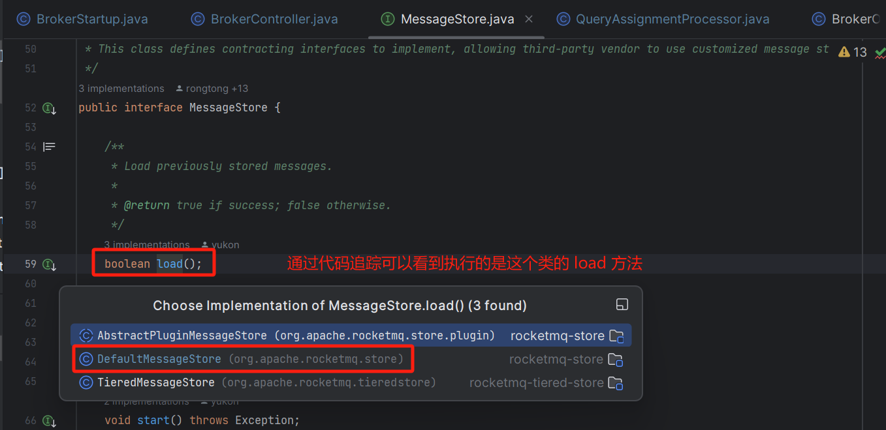

[DefaultMesageStore](http://defaultmesagestore/) 实例化之后，将会调用 load 方法将磁盘中的 [commitLog](http://commitlog/)、[ConsumeQueue](http://consumequeue/)、[IndexFile](http://indexfile/) 文件的数据加载到内存，还会进行数据恢复操作。

源码位置：[https://github.com/apache/rocketmq/blob/release-5.1.2/](https://github.com/apache/rocketmq/blob/release-5.1.2/store/src/main/java/org/apache/rocketmq/store/DefaultMessageStore.java)[store](https://github.com/apache/rocketmq/blob/release-5.1.2/store/src/main/java/org/apache/rocketmq/store/DefaultMessageStore.java)[/src/main/java/org/apache/rocketmq/](https://github.com/apache/rocketmq/blob/release-5.1.2/store/src/main/java/org/apache/rocketmq/store/DefaultMessageStore.java)[store](https://github.com/apache/rocketmq/blob/release-5.1.2/store/src/main/java/org/apache/rocketmq/store/DefaultMessageStore.java)[/](https://github.com/apache/rocketmq/blob/release-5.1.2/store/src/main/java/org/apache/rocketmq/store/DefaultMessageStore.java)[DefaultMessageStore](https://github.com/apache/rocketmq/blob/release-5.1.2/store/src/main/java/org/apache/rocketmq/store/DefaultMessageStore.java)[.java](https://github.com/apache/rocketmq/blob/release-5.1.2/store/src/main/java/org/apache/rocketmq/store/DefaultMessageStore.java)

/\*\*

\* 加载 CommitLog、ConsumeQueue、indexFile 等文件，将数据将到内存中并且完成数据的恢复

\* @throws IOException

\*/

@Override

public boolean load() {

boolean result \= true;

try {

/\*\*

\* 1、判断上次 broker 是否是正常退出，如果是正常退出不会保留 abort 文件，异常退出则会保留 abort 文件

\* broker 在启动时会创建 abort 文件，并且注册钩子函数: 在 \]VM 退出时删除 abort 文件

\* 如果下一次启动时存在 abort 文件，说明 broker 是异常退出的，文件数据可能不一致需要进行数据修复

\*/

boolean lastExitOK \= !this.isTempFileExist();

LOGGER.info("last shutdown {}, store path root dir: {}",

lastExitOK ? "normally" : "abnormally", messageStoreConfig.getStorePathRootDir());

// load Commit Log

/\*\*

\* 2、加载 CommitLog 日志文件，目录路径取自 broker.conf 文件中的 storePathCommitLog 属性

\* CommitLog文件是真正存结消息内容的地方，单个文件大小默认1G

\*/

result = this.commitLog.load();

// load Consume Queue

/\*\*

\* 3、加载 ConsumeQueue 文件，目录路径取自 broker.conf 文件中的 storePathConsumeQueue 属性，文件组织方式为topic/queueId/fileName

\* ConsumeQueue文件可以看作是CommitLog是索引文件，其存储了它所属topic的信息在CommitLog中的偏移量\*消费者村取消息的时候，可以从CosumeQueue中快速的根据偏移量定位消息在CommitLog中的位置

\*/

result = result && this.consumeQueueStore.load();

// 判断是否启用压缩功能，默认启用

if (messageStoreConfig.isEnableCompaction()) {

// 进行压缩服务的加载

result = result && this.compactionService.load(lastExitOK);

}

if (result) {

/\*\*

\* 4、加载 checkpoint 检查点文件，目录路径取自 broker.conf 文件中的 storeCheckpoint 属性，

\* StoreCheckpoint 记录这 commitLog、ConsumeQueue、IndexFile 文件的最后更新时间点

\* 当上一次 broker 是异常结束时，会根据 StoreCheckpoint 的数据进行恢复、这决定着文件从那里开始恢复，甚至是删除文件

\*/

this.storeCheckpoint =

new StoreCheckpoint(

StorePathConfigHelper.getStoreCheckpoint(this.messageStoreConfig.getStorePathRootDir()));

this.masterFlushedOffset = this.storeCheckpoint.getMasterFlushedOffset();

setConfirmOffset(this.storeCheckpoint.getConfirmPhyOffset());

/\*\*

\* 5、加载 index 索引文件，目录路径取自 broker.conf 文件中的 storePathIndex 属性，

\* index 索引文件用以通过时间区间来快速查询消息，底层为 HashMap 结构，实现为 hash 索引

\* 如果不是正常退出、并且最大更新时问截比 checkpoint 文件中的时间戳大，则删除该 index 文件

\*/

result = this.indexService.load(lastExitOK);

/\*\*

\* 6、恢复 ConsumeQueue 文件相 CommitLog 文件，将正确的数据恢复至内存，删除错误数据和文件

\*/

this.recover(lastExitOK);

LOGGER.info("message store recover end, and the max phy offset = {}", this.getMaxPhyOffset());

}

long maxOffset \= this.getMaxPhyOffset();

this.setBrokerInitMaxOffset(maxOffset);

LOGGER.info("load over, and the max phy offset = {}", maxOffset);

} catch (Exception e) {

LOGGER.error("load exception", e);

result = false;

}

if (!result) {

// 如果上面的操作抛出异常，则文件服务停止

this.allocateMappedFileService.shutdown();

}

return result;

}

主要步骤如下：

1.  调用 [isTempFileExit](http://istempfileexit/) 方法判断上次 broker 是否是正常退出。如果是正常退出不会保留 [abort](http://abort%20/) 文件，异常退出则会；broker在启动时会创建 [abort](http://abort%20/) 文件，并且注册钩子函数，在 JVM 退出时删除 [abort](http://abort/) 文件，如果下一次启动时存在 [abort](http://abort/) 文件，说明 broker 是异常退出的，文件数据可能存在不一致的情况，需要进行数据修复。
2.  加载 [CommitLog](http://commitlog/) 日志文件。[CommitLog](http://commitlog/) 文件才是真正消息存储的地方（即消息主题以及元数据的存储主题，存储Producer端写入的消息主题内容，消息内容是不定长的）。单个大小默认1G。
3.  官方描述如下：单个文件大小默认1G，文件名长度为20位，左边补零，剩余为起始偏移量，比如[00000000000000000000](http://0.0.0.0/)代表了第一个文件，起始偏移量为 0，文件大小为 1G=1073741824；当第一个文件写满了，第二个文件为[00000000001073741824](http://00000000001073741824)，起始偏移量为[1073741824](http://64.0.0.0/)，以此类推。消息顺序写入日志文件，效率很高，当文件满了，写入下一个文件。
4.  加载 [ConusmeQueue](http://conusmequeue/) 文件。 [ConsumeQueue](http://consumequeue/) 文件可以看作是 [CommitLog](http://commitlog/) 是索引文件，其存储了它所属 topic 的信息在 [CommitLog](http://commitlog/) 中的偏移量。消费者拉取消息的时候，可以从 [ConsumeQueue](http://consumequeue/) 中快速的根据偏移量定位消息在[CommitLog](http://commitlog/) 中的位置。
5.  加载 [checkpoint](http://checkpoint/) 检查点文件。[StoreCheckpoint](http://storecheckpoint/) 记录这 [commitLog](http://commitlog/)、[ConsumeQueue](http://consumequeue/)、[IndexFile](http://indexfile%20/) 文件的最后更新时间点。当上一次 broker 是异常结束时，会根据 [StoreCheckpoint](http://storecheckpoint/) 的数据进行恢复，这决定着文件从哪里开始恢复，甚至是删除文件。
6.  加载 [indexFile](http://indexfile%20/) 索引文件。 [indexFile](http://indexfile/) 索引文件用以通过时间区间快速查询消息，底层为HashMap结构，实现为hash索引。如果不是正常退出，并且最大更新时间比 [checkpoint](http://checkpoint/) 文件中是时间戳大，则删除该 [index](http://index/) 文件。
7.  恢复 [ConsumeQueue](http://consumequeue/) 文件和 [CommitLog](http://commitlog/) 文件，将正确的数据恢复至内存，删除错误数据和文件。

下面我们分别看下每个操作步骤。

### **2.3.3.1 判断是否存在临时文件**

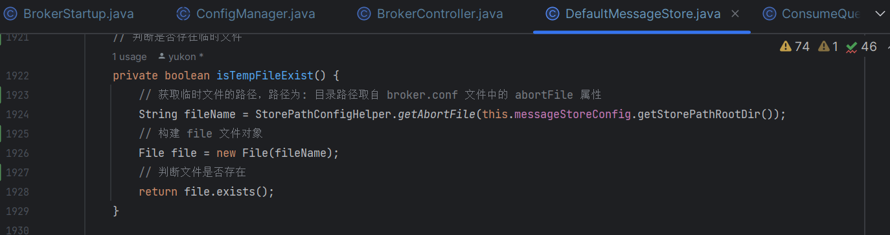

### **2.3.3.2 加载消息日志文件**

通过内部的 [CommitLog](http://commitlog/) 对象的 [load](http://load/) 方法加载 [CommitLog](http://commitlog/) 日志文件。[CommitLog#load](http://commitlog/#load) 方法实际上是委托内部的 [mappedFileQueue#load](http://mappedfilequeue/#load) 方法进行加载。

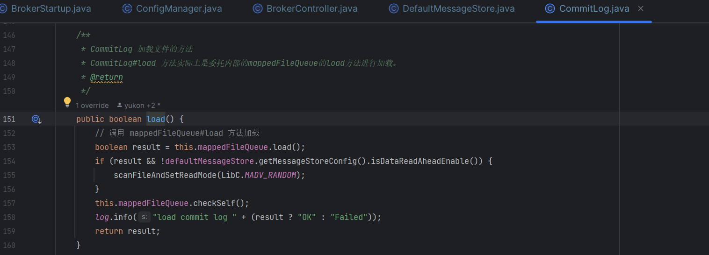

而 [MappedFileQueue#load](http://mappedfilequeue/#load)方法会就是将 [commitLog](http://commitlog/) 目录路径下的 [commotlog](http://commotlog/) 文件进行全部的加载为[MappedFile](http://mappedfile/) 对象。

这里简单过下，有个印象，后面会单独剖析。

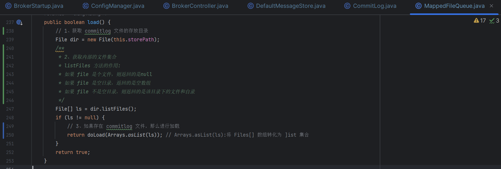

public class MappedFileQueue implements Swappable {

// 线程安全的 list

protected final CopyOnWriteArrayList<MappedFile> mappedFiles = new CopyOnWriteArrayList<>();

public boolean doLoad(List<File> files) {

// ascending order

// 1、对 CommitLog 文件按照文件名升序排序

files.sort(Comparator.comparing(File::getName));

// 2、遍历文件列表

for (File file : files) {

if (file.isDirectory()) {

continue;

}

// 3、校验文件实际大小是否等于预定的文件大小，如果不相等则直接返回 fa1se，不再加载其他文件

if (file.length() != this.mappedFileSize) {

log.warn(file + "\\t" + file.length()

\+ " length not matched message store config value, please check it manually");

return false;

}

try {

/\*\*

\* 4、核心逻辑：实例化 MappedFile 对象， 通过 DefaultMappedFile 类生成

\* 每一个 CommitLog 文件都创建一个对应的 MappedFile 对象

\* 在物理上，CommitLog 日录下面是一个个的 CommitLog 文件，但是在 \]ava 中进行了三层射: CommitLog -> MappedFileQueue -> MappedFile

\* CommitLog 中包含 MappedFileQueue，以及 CommitLog 相关的其他服务，例如:刷盘服务: MappedFileQueue 中包含 MappedFile 集合，以及单个 CommitLog 文件大小等属性

\* 而 MappedFile 才是真正的一个 CommitLog 文件在 \]ava 中的映射，包含文件名、大小、mmap 对象 mappedByteBuffer 等属性

\* 实际上 MappedFileQueue 和 MappedFile 都是通用类 CommitLog、ConsumeQueue、IndexFile 文件都会使用到。

\*/

MappedFile mappedFile \= new DefaultMappedFile(file.getPath(), mappedFileSize);

// 将 wrotePosition、flushedPosition、commitPosition 默认设置为文件大小

// 5、当前文件所映射到的消息写入page cache的位置

mappedFile.setWrotePosition(this.mappedFileSize);

// 6、刷盘的最新位置

mappedFile.setFlushedPosition(this.mappedFileSize);

// 7、已提交的最新位置

mappedFile.setCommittedPosition(this.mappedFileSize);

// 8、添加到 MappedFileQueue 内部的 mappedFiles 集合中

this.mappedFiles.add(mappedFile);

log.info("load " + file.getPath() + " OK");

} catch (IOException e) {

log.error("load file " + file + " error", e);

return false;

}

}

return true;

}

}

实际上 [MappedFileQueue](http://mappedfilequeue/) 和 [MappedFile](http://mappedfile/) 都是通用类，[CommitLog](http://commitlog/)、[ComsumeQueue](http://comsumequeue/)、[IndexFile](http://indexfile%20/) 文件都会使用到。

这里主要创建 [MappedFile](http://mappedfile/) 映射文件。[MappedFile](http://mappedfile/) 作为一个 [RocketMQ](http://rocketmq/) 的物理文件在 Java 中的映射类。[CommitLog](http://commitlog/)、[ComsumeQueue](http://comsumequeue/)、[IndexFile](http://indexfile/) 这 3 种文件磁盘的读写都是通过 [MappedFile](http://mappedfile/) 操作的。

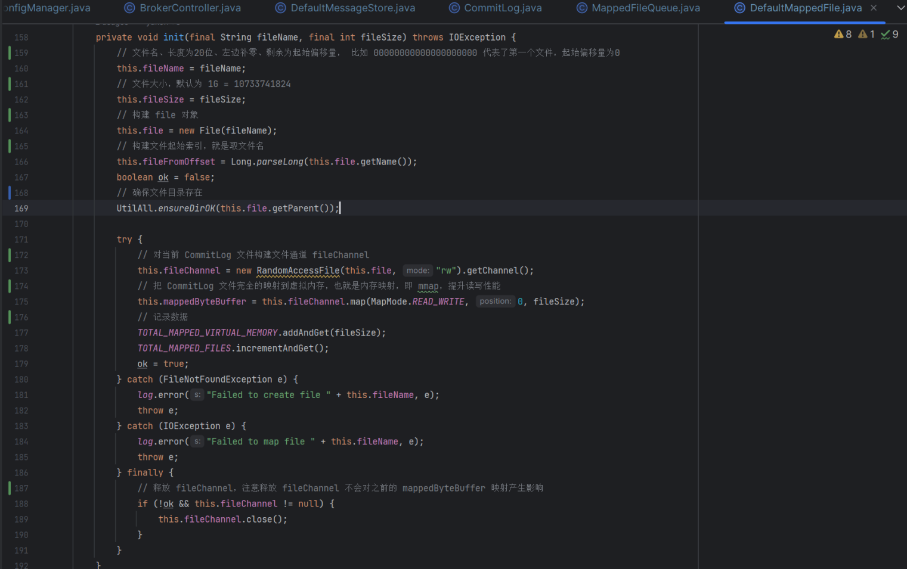

### **2.3.3.3 加载消息队列文件**

public class ConsumeQueueStore {

protected final ConcurrentMap<String/\* topic \*/, ConcurrentMap<Integer/\* queueId \*/, ConsumeQueueInterface>> consumeQueueTable;

/\*\*

\* 该方法用于加载消费队列文件，ConsumeQueue 文件可以看作是 CommitLog 的索引文件，其存储了它所属 topic 的消息在 CommitLog 中的偏移量。

\* 消费者拉取消息时，可以从 ConsumeQueue 中快速的根据编移量定位消息在 CommitLog 中位置

\* 一个队列 id 日录对应着一个 ConsumeQueue 对象， 其内部保在者一个 mappedFileQueue 对象，其表示当前队列 id 日录下面的 ConsumeQueue 文件集合，

\* 同样一个 ConsumeQueue 文件被映射为-个 MappedFile 对象，随后 ConsumeQueue 以及 topic 和 queueId 的对应关系被存入 DefaultMessageStore#consumeQueueTable 属性集合中

\* @param storePath

\* @param cqType

\* @return

\*/

private boolean loadConsumeQueues(String storePath, CQType cqType) {

// 获取 ConsumeQueue 文件所在目录，目录路径取自 broker.conf 文件中的 storePathIndex 属性consumegueue

File dirLogic \= new File(storePath);

/// 获取目录下文件列表，实际上是 topic 目录列表

File\[\] fileTopicList = dirLogic.listFiles();

if (fileTopicList != null) {

// 遍历 topic 目录

for (File fileTopic : fileTopicList) {

// 获取 topic 目录下面的队列 id 目录

String topic \= fileTopic.getName();

// 获取 queueId 文件列表

File\[\] fileQueueIdList = fileTopic.listFiles();

if (fileQueueIdList != null) {

for (File fileQueueId : fileQueueIdList) {

int queueId;

try {

// 获取队列 id

queueId = Integer.parseInt(fileQueueId.getName());

} catch (NumberFormatException e) {

continue;

}

queueTypeShouldBe(topic, cqType);

/\*\*

\* 创建 ConsumeQueue 对象，一个队列 id 目录对应并一个 ConsumeQueue 对象

\* ConsumeQueue 文件可以看成是基于 topic 的 CommitLog 索引文件: ConsumeQueue 文件夹的组织方式如下: topic/queue/file 三层组织结构

\* ConsumeQueue 文件中的条目采取定长设计，每个条目一共 20 个字节 分别是:

\* 8 个字节的 CommitLog 物理便宜量

\* 4 个字节的消息长度

\* 8 个字节的 tag hashcode

\* 单个文件由 30w 条目录组成，可以像数组一样随机访问每一条日录、每个 ConsumeQueue 文件大小约 5.72 M

\*/

ConsumeQueueInterface logic \= createConsumeQueueByType(cqType, topic, queueId, storePath);

// 将当前 ConsumeQueue 对象以及对应关系存入 consumeQueueTable 中

this.putConsumeQueue(topic, queueId, logic);

// 加载 consumeQueue 文件

if (!this.load(logic)) {

return false;

}

}

}

}

}

log.info("load {} all over, OK", cqType);

return true;

}

}

[ConsumeQueue](http://consumequeue/) 对象建立之后，会对自己管理的队列 id 目录下面的 [ConsumeQueue](http://consumequeue/) 文件进行加载。内部就是调用 [mappedFileQueue#load](http://mappedfilequeue/#load) 方法会对每个 [ConsumeQueue](http://consumequeue/) 文件创建一个 [MappedFile](http://mappedfile/) 对象并且进行内存映射[mmap](http://mmap/) 操作。

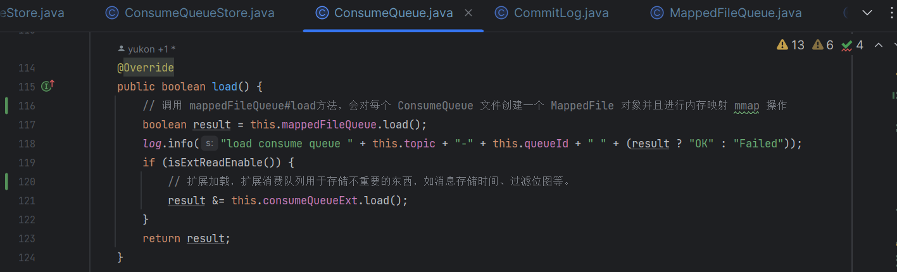

### **2.3.3.4 创建 StoreCheckpoint 检查点对象**

在 [CommitLog](http://commitlog%20/) 和 [ConsumeQueue](http://consumequeue%20/) 文件都加载成功之后，加载 [checkpoint](http://checkpoint%20/) 检查点文件，创建 [StoreCheckpoint](http://storecheckpoint/)对象。

[StoreCheckpoint](http://storecheckpoint/) 记录着 [CommitLog](http://commitlog/)、[ConsumeQueue](http://consumequeue/)、[indexFile](http://indexfile%20/) 文件的最后更新时间点，当上一次 Broker是异常结束时，会根据 [StoreCheckpoint](http://storecheckpoint/) 的数据进行恢复，这决定着文件从哪里开始恢复，甚至是删除文件。

源码位置：[https://github.com/apache/rocketmq/blob/release-5.1.2/](https://github.com/apache/rocketmq/blob/release-5.1.2/store/src/main/java/org/apache/rocketmq/store/StoreCheckpoint.java)[store](https://github.com/apache/rocketmq/blob/release-5.1.2/store/src/main/java/org/apache/rocketmq/store/StoreCheckpoint.java)[/src/main/java/org/apache/rocketmq/](https://github.com/apache/rocketmq/blob/release-5.1.2/store/src/main/java/org/apache/rocketmq/store/StoreCheckpoint.java)[store](https://github.com/apache/rocketmq/blob/release-5.1.2/store/src/main/java/org/apache/rocketmq/store/StoreCheckpoint.java)[/](https://github.com/apache/rocketmq/blob/release-5.1.2/store/src/main/java/org/apache/rocketmq/store/StoreCheckpoint.java)[StoreCheckpoint](https://github.com/apache/rocketmq/blob/release-5.1.2/store/src/main/java/org/apache/rocketmq/store/StoreCheckpoint.java)[.java](https://github.com/apache/rocketmq/blob/release-5.1.2/store/src/main/java/org/apache/rocketmq/store/StoreCheckpoint.java)

public class StoreCheckpoint {

private static final Logger log \= LoggerFactory.getLogger(LoggerName.STORE\_LOGGER\_NAME);

private final RandomAccessFile randomAccessFile;

private final FileChannel fileChannel;

private final MappedByteBuffer mappedByteBuffer;

private volatile long physicMsgTimestamp \= 0;

private volatile long logicsMsgTimestamp \= 0;

private volatile long indexMsgTimestamp \= 0;

private volatile long masterFlushedOffset \= 0;

private volatile long confirmPhyOffset \= 0;

/\*\*

\* StoreCheckpoint 记录着 CommitLog、ConsumeQueue、indexFile 文件的最后更新时间点，当上一次 Broker是异常结束时，会根据 StoreCheckpoint 的数据进行恢复，这决定着文件从哪里开始恢复，甚至是删除文件。

\* StoreCheckpoint 记录了五个关键属性

\* 1.physicMsgTimestamp:最新 CommitLog 文件刷盘时间戳，单位毫秒

\* 2.logicsMsgTimestamp:最新 consumeQueue 文件的剧盘时间截，单位毫秒

\* 3.indexMsgTimestamp:创建最新 IndexFile 文件的时间戳，单位毫秒

\* 4.masterFlushedOffset:获取 master 刷新偏移

\* 5.confirmPhyOffset:获取确认物理偏移量

\* @param scpPath

\* @throws IOException

\*/

public StoreCheckpoint(final String scpPath) throws IOException {

File file \= new File(scpPath);

// 判断存在当前文件

UtilAll.ensureDirOK(file.getParent());

boolean fileExists \= file.exists();

// 对 checkpoint 文件同样执行 mmap 操作

this.randomAccessFile = new RandomAccessFile(file, "rw");

this.fileChannel = this.randomAccessFile.getChannel();

// mmap 大小为 OS\_PAGE\_SIZE，即 OS 一页，4k

this.mappedByteBuffer = fileChannel.map(MapMode.READ\_WRITE, 0, DefaultMappedFile.OS\_PAGE\_SIZE);

if (fileExists) {

log.info("store checkpoint file exists, " + scpPath);

// 获取 commitLog 文件的时间戳，即最新 commitLog 文件刷盘时间戳

this.physicMsgTimestamp = this.mappedByteBuffer.getLong(0);

// 获取 consumeQueue 文件的时间戳，即最新 ConsumeQueue 文件的刷盘时间戳

this.logicsMsgTimestamp = this.mappedByteBuffer.getLong(8);

// 获取 IndexFile 文件的时间戳，即创建最新 IndexFile 文件的刷盘时间戳

this.indexMsgTimestamp = this.mappedByteBuffer.getLong(16);

// 获取 master 刷新偏移

this.masterFlushedOffset = this.mappedByteBuffer.getLong(24);

// 获取确认物理偏移量

this.confirmPhyOffset = this.mappedByteBuffer.getLong(32);

log.info("store checkpoint file physicMsgTimestamp " + this.physicMsgTimestamp + ", "

\+ UtilAll.timeMillisToHumanString(this.physicMsgTimestamp));

log.info("store checkpoint file logicsMsgTimestamp " + this.logicsMsgTimestamp + ", "

\+ UtilAll.timeMillisToHumanString(this.logicsMsgTimestamp));

log.info("store checkpoint file indexMsgTimestamp " + this.indexMsgTimestamp + ", "

\+ UtilAll.timeMillisToHumanString(this.indexMsgTimestamp));

log.info("store checkpoint file masterFlushedOffset " + this.masterFlushedOffset);

log.info("store checkpoint file confirmPhyOffset " + this.confirmPhyOffset);

} else {

log.info("store checkpoint file not exists, " + scpPath);

}

}

}

### **2.3.3.5 加载 indexFile 文件**

index 索引文件用于通过时间区间来快速查询消息，底层为 [HashMap](http://hashmap/) 结构，实现为 [hash](http://hash/) 索引。

最终一个 [index](http://index/) 文件对应着一个 [IndexFile](http://indexfile/) 实例，并且会加到 [indexFileList](http://indexfilelist/) 集合中。还会判断如果上次 [broker](http://broker/) 不是正常退出，并且并且当前 [index](http://index/) 文件中最后一个消息的落盘时间戳大于 [StoreCheckpoint](http://storecheckpoint/) 中的最后一个 [index](http://index/) 索引文件创建时间，则该索引文件被删除。

public class IndexService {

private static final Logger LOGGER \= LoggerFactory.getLogger(LoggerName.STORE\_LOGGER\_NAME);

/\*\*

\* Maximum times to attempt index file creation.

\*/

private static final int MAX\_TRY\_IDX\_CREATE \= 3;

private final DefaultMessageStore defaultMessageStore;

private final int hashSlotNum;

private final int indexNum;

private final String storePath;

private final ArrayList<IndexFile> indexFileList = new ArrayList<>();

private final ReadWriteLock readWriteLock \= new ReentrantReadWriteLock();

public IndexService(final DefaultMessageStore store) {

this.defaultMessageStore = store;

this.hashSlotNum = store.getMessageStoreConfig().getMaxHashSlotNum();

this.indexNum = store.getMessageStoreConfig().getMaxIndexNum();

this.storePath =

StorePathConfigHelper.getStorePathIndex(defaultMessageStore.

getMessageStoreConfig().getStorePathRootDir());

}

/\*\*

\* indexFile 提供了一种可以通过 key 或时间区间来查询消息的方法

\* indexFile 是以创建时的时间戳命名的，固定的单个 indexFile 文件大小约为 400M,一个 indexFile 可以保存 2000 个索引

\* indexFile 的底层存储设计为 HashMap 结构，所以 RocketMQ 的索引文件其底层实现为 hash 索引

\* @param lastExitOK

\* @return

\*/

public boolean load(final boolean lastExitOK) {

// 获取上级目录名称 目录路径取自 broker.conf 文件中的 storePathIndex 属性

File dir \= new File(this.storePath);

// 获取内部的 index 索引文件

File\[\] files = dir.listFiles();

if (files != null) {

// ascending order

// 按照文件名字中的时间戳进行升序排序

Arrays.sort(files);

for (File file : files) {

try {

// 一个 index 文件对应着一个 IndexFile 实例

IndexFile f \= new IndexFile(file.getPath(), this.hashSlotNum, this.indexNum, 0, 0);

// 加载 index 文件

f.load();

// 如果上一次是异常退出，并且当前 index 文件中最后一个消息的落盘时间大于最后一个 index 索引文件的创建时间，则该索引文件被删除

if (!lastExitOK) {

if (f.getEndTimestamp() > this.defaultMessageStore.getStoreCheckpoint()

.getIndexMsgTimestamp()) {

// 删除该索引文件

f.destroy(0);

continue;

}

}

LOGGER.info("load index file OK, " + f.getFileName());

// 加入到索引文件集合中

this.indexFileList.add(f);

} catch (IOException e) {

LOGGER.error("load file {} error", file, e);

return false;

} catch (NumberFormatException e) {

LOGGER.error("load file {} error", file, e);

}

}

}

return true;

}

}

### **2.3.3.6 恢复数据文件**

/\*\*

\* DefaultMessageStore 类方法

\* 恢复 ConsumeQueue 文件、CommitLog 文件，将正确的数据恢复至内存，删除错误数据和文什

\* @param lastExitOK

\*/

private void recover(final boolean lastExitOK) {

// 是否并发恢复，默认为false

boolean recoverConcurrently \= this.brokerConfig.isRecoverConcurrently();

// 判断 recover 恢复模式的并发还是正常(默认是正常)

LOGGER.info("message store recover mode: {}", recoverConcurrently ? "concurrent" : "normal");

// recover consume queue

long recoverConsumeQueueStart \= System.currentTimeMillis();

/\*\*

\* 恢复所有的 ConsumeQueue 文件

\* 1、恢复规则：

\* RocketMQ不会也没有必要对所有的 ConsumeQueue 文件进行恢复校验，如果 ConsumeQueue 文件数量大于等于3个，那么就取最新的3个

\* ConsumeQueue 文件执行恢复，否则对全部 ConsumeQueue 文件进行恢复

\* 2、所谓的恢复:就是找出当前 queueId 的 ConsumeQueue 下的浙有 ConsumeQueue 文件中最大的有效的 CommitLog 消息日志文件的物理仙移，

\* 以及该索引文件自身的最大有效数据偏移量，随后对文件自身的最大有效数据信移量 processOffset 之后的所有文件和数据进行更新或者删除

\* 3、如何判斯 ConsumeQueue 索引文件中的一个索引条目是否有效或者说是有效数据？

\* 只要该条目保存的对应消息在 commitLog 文件中的物理偏移量和该条目保存的对应消息在 commitLog 文件中的总长度大于 0 则表示该条目有效，否则

\* 表示该条目无效，并且不会对后续的条目和文件进行恢复

\* 4、最大的有效 commitLog 消息物理偏移量就是指最后一个有效条目中保存的 commitLog 文件的物理偏移量而不是文件自身的最大有效数据偏移量

\*

\*/

this.recoverConsumeQueue();

// 获得 ConsumeQueue 存储的最大有效 commitLog 偏移量

long maxPhyOffsetOfConsumeQueue \= this.getMaxOffsetInConsumeQueue();

long recoverConsumeQueueEnd \= System.currentTimeMillis();

// recover commitlog

if (lastExitOK) {

// 正常恢复 commitLog

this.commitLog.recoverNormally(maxPhyOffsetOfConsumeQueue);

} else {

// 正常恢复 commitLog

/\*\*

\* 异常恢复 CommitLog：该方法用于 broker 上次异常关闭的时候恢复 CommitLog， 其逻辑与 CommitLog 文件的正常恢复方法 recoverNormally 有些

\* 区別、但是核心逻辑都是一样的，对于异常恢复的 CommitLog 不再是最多取后三个文件进行恢复，而是倒序遍历所有的 CommitLog 文件进行校验和恢复的操作，

\* 直到找到第一个消息正常存储的 CommitLog 文件。

\* 为什么要这么做呢?

\* 因为异常恢复不能确定最后的刷盘点在哪个文件里，只能遍历查找

\* 1、首先倒序遍历井通过调用 isMappedFileMatchedRecover 方法判断当前文件是否是一个正常的 CommitLog 文件。

\* 包括:文件魔术的校验|文件消息存盘时间校验、StoreCheckpoint 较验等。如果找到一个正确的 CommitLog 文件，则停止遍历

\* 2、然后从第一个正确的 CommitLog 文件开始向后遍历恢复 CommitLog，如果某个消息是正常的，那么通过 defaultMessageStore#doDispatch

\* 方法调用 commitLogDispatch 重新构建当前消息的 IndexFile 索引和 ConsumeQueue 索引。

\* 3、恢复完毕之后的处理逻辑和 CommitLog 文件正常恢复的流程是一样的。

\* 例如:删除文件最大有效数据编移量 processOffset 之后的所有 CommitLog 数据，清除 ConsumeQueue 文件中的脏数据等等。

\*/

this.commitLog.recoverAbnormally(maxPhyOffsetOfConsumeQueue);

}

// recover consume offset table

long recoverCommitLogEnd \= System.currentTimeMillis();

// 最后恢复 topicQueueTable

this.recoverTopicQueueTable();

long recoverConsumeOffsetEnd \= System.currentTimeMillis();

// 打印上面恢复过程所用的时间信息

LOGGER.info("message store recover total cost: {} ms, " +

"recoverConsumeQueue: {} ms, recoverCommitLog: {} ms, recoverOffsetTable: {} ms",

recoverConsumeOffsetEnd - recoverConsumeQueueStart, recoverConsumeQueueEnd - recoverConsumeQueueStart,

recoverCommitLogEnd - recoverConsumeQueueEnd, recoverConsumeOffsetEnd - recoverCommitLogEnd);

}

### **2.3.4 启动 netty 服务器**

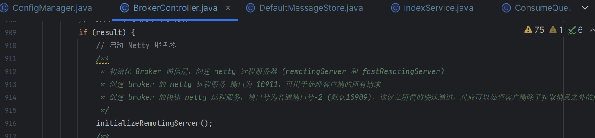

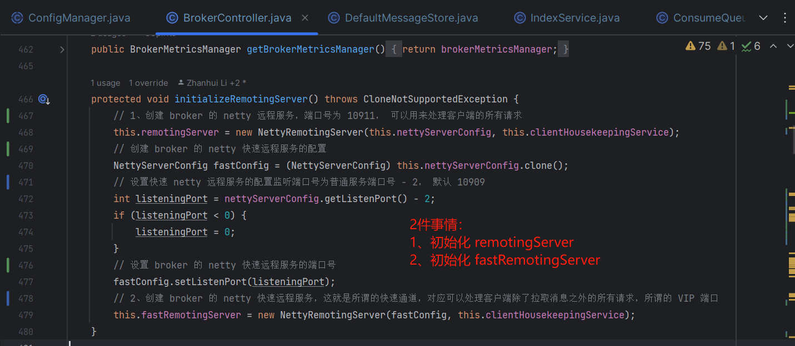

### **2.3.5 初始化各种线程池**

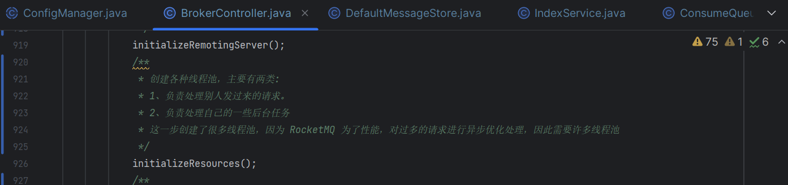

主要有两类：

1.  负责处理别人发过来的请求。
2.  负责处理自己的一些后台任务。

这里创建了很多线程池，因为 RocketMQ 为了性能，对过多的请求进行异步优化处理，因此需要许多线程池。

上面提到过，[BrokerController](http://brokercontroller%20/) 定义了很多「**线程池**」和「**阻塞队列**」，其中「**阻塞队列**」的容量和线程池的大小都是可以配置的，这块可以根据实际需要进行调优。

/\*\*

\* Initialize resources including remoting server and thread executors.

\* 初始化资源，包括远程处理服务器和线程执行器。

\*/

protected void initializeResources() {

// 创建 Broker 控制器计划线程池

this.scheduledExecutorService = new ScheduledThreadPoolExecutor(1,

new ThreadFactoryImpl("BrokerControllerScheduledThread", true, getBrokerIdentity()));

// 创建处理发送消息请求的线程池

this.sendMessageExecutor = new BrokerFixedThreadPoolExecutor(

this.brokerConfig.getSendMessageThreadPoolNums(), // 核心线程数

this.brokerConfig.getSendMessageThreadPoolNums(),

1000 \* 60,

TimeUnit.MILLISECONDS,

this.sendThreadPoolQueue, // 阻塞队列

new ThreadFactoryImpl("SendMessageThread\_", getBrokerIdentity()));

// 创建处理拉取消息请求的线程池

this.pullMessageExecutor = new BrokerFixedThreadPoolExecutor(

this.brokerConfig.getPullMessageThreadPoolNums(), // 核心线程数

this.brokerConfig.getPullMessageThreadPoolNums(),

1000 \* 60,

TimeUnit.MILLISECONDS,

this.pullThreadPoolQueue, // 阻塞队列

new ThreadFactoryImpl("PullMessageThread\_", getBrokerIdentity()));

// 创建 litePull 模式下拉取消息执行器

this.litePullMessageExecutor = new BrokerFixedThreadPoolExecutor(

this.brokerConfig.getLitePullMessageThreadPoolNums(), // 核心线程数

this.brokerConfig.getLitePullMessageThreadPoolNums(),

1000 \* 60,

TimeUnit.MILLISECONDS,

this.litePullThreadPoolQueue, // 阻塞队列

new ThreadFactoryImpl("LitePullMessageThread\_", getBrokerIdentity()));

// 创建发送消息异步回调处理线程池

this.putMessageFutureExecutor = new BrokerFixedThreadPoolExecutor(

this.brokerConfig.getPutMessageFutureThreadPoolNums(), // 核心线程数

this.brokerConfig.getPutMessageFutureThreadPoolNums(),

1000 \* 60,

TimeUnit.MILLISECONDS,

this.putThreadPoolQueue, // 阻塞队列

new ThreadFactoryImpl("SendMessageThread\_", getBrokerIdentity()));

// 创建 Pop 消费模式下 Ack 消息线程池

this.ackMessageExecutor = new BrokerFixedThreadPoolExecutor(

this.brokerConfig.getAckMessageThreadPoolNums(), // 核心线程数

this.brokerConfig.getAckMessageThreadPoolNums(),

1000 \* 60,

TimeUnit.MILLISECONDS,

this.ackThreadPoolQueue, // 阻塞队列

new ThreadFactoryImpl("AckMessageThread\_", getBrokerIdentity()));

// 创建查询消息处理的请求处理线程池

this.queryMessageExecutor = new BrokerFixedThreadPoolExecutor(

this.brokerConfig.getQueryMessageThreadPoolNums(), // 核心线程数

this.brokerConfig.getQueryMessageThreadPoolNums(),

1000 \* 60,

TimeUnit.MILLISECONDS,

this.queryThreadPoolQueue, // 阻塞队列

new ThreadFactoryImpl("QueryMessageThread\_", getBrokerIdentity()));

// Broker 元数据管理器处理线程池，作为默认处理器的线程池

this.adminBrokerExecutor = new BrokerFixedThreadPoolExecutor(

this.brokerConfig.getAdminBrokerThreadPoolNums(), // 核心线程数

this.brokerConfig.getAdminBrokerThreadPoolNums(),

1000 \* 60,

TimeUnit.MILLISECONDS,

this.adminBrokerThreadPoolQueue, // 阻塞队列

new ThreadFactoryImpl("AdminBrokerThread\_", getBrokerIdentity()));

// 创建客户端管理的线程池

this.clientManageExecutor = new BrokerFixedThreadPoolExecutor(

this.brokerConfig.getClientManageThreadPoolNums(), // 核心线程数

this.brokerConfig.getClientManageThreadPoolNums(),

1000 \* 60,

TimeUnit.MILLISECONDS,

this.clientManagerThreadPoolQueue, // 阻塞队列

new ThreadFactoryImpl("ClientManageThread\_", getBrokerIdentity()));

// 创建 broker 心跳处理的线程池

this.heartbeatExecutor = new BrokerFixedThreadPoolExecutor(

this.brokerConfig.getHeartbeatThreadPoolNums(), // 核心线程数

this.brokerConfig.getHeartbeatThreadPoolNums(),

1000 \* 60,

TimeUnit.MILLISECONDS,

this.heartbeatThreadPoolQueue, // 阻塞队列

new ThreadFactoryImpl("HeartbeatThread\_", true, getBrokerIdentity()));

// 创建消费者管理的线程池

this.consumerManageExecutor = new BrokerFixedThreadPoolExecutor(

this.brokerConfig.getConsumerManageThreadPoolNums(), // 核心线程数

this.brokerConfig.getConsumerManageThreadPoolNums(),

1000 \* 60,

TimeUnit.MILLISECONDS,

this.consumerManagerThreadPoolQueue, // 阻塞队列

new ThreadFactoryImpl("ConsumerManageThread\_", true, getBrokerIdentity()));

// 创建发送消息请求重试线程池

this.replyMessageExecutor = new BrokerFixedThreadPoolExecutor(

this.brokerConfig.getProcessReplyMessageThreadPoolNums(), // 核心线程数

this.brokerConfig.getProcessReplyMessageThreadPoolNums(),

1000 \* 60,

TimeUnit.MILLISECONDS,

this.replyThreadPoolQueue, // 阻塞队列

new ThreadFactoryImpl("ProcessReplyMessageThread\_", getBrokerIdentity()));

// 创建事务结東处理线程池

this.endTransactionExecutor = new BrokerFixedThreadPoolExecutor(

this.brokerConfig.getEndTransactionThreadPoolNums(), // 核心线程数

this.brokerConfig.getEndTransactionThreadPoolNums(), // 最大线程数

1000 \* 60,

TimeUnit.MILLISECONDS,

this.endTransactionThreadPoolQueue, // 阻塞队列

new ThreadFactoryImpl("EndTransactionThread\_", getBrokerIdentity()));

// 创建负载均衡的线程池

this.loadBalanceExecutor = new BrokerFixedThreadPoolExecutor(

this.brokerConfig.getLoadBalanceProcessorThreadPoolNums(), // 核心线程数

this.brokerConfig.getLoadBalanceProcessorThreadPoolNums(), // 最大线程数

1000 \* 60,

TimeUnit.MILLISECONDS,

this.loadBalanceThreadPoolQueue, // 阻塞队列

new ThreadFactoryImpl("LoadBalanceProcessorThread\_", getBrokerIdentity()));

// 创建同步 broker 成员组执行器服务

this.syncBrokerMemberGroupExecutorService = new ScheduledThreadPoolExecutor(1,

new ThreadFactoryImpl("BrokerControllerSyncBrokerScheduledThread", getBrokerIdentity()));

// 创建 broker 心跳执行器服务

this.brokerHeartbeatExecutorService = new ScheduledThreadPoolExecutor(1,

new ThreadFactoryImpl("BrokerControllerHeartbeatScheduledThread", getBrokerIdentity()));

// 创建 topic 队列映射清理服务

this.topicQueueMappingCleanService = new TopicQueueMappingCleanService(this);

}

### **2.3.6 注册各种处理器**

[BrokerController](http://brokercontroller/) 初始化时，创建好各个线程池之后，会去「**注册请求处理器**」。其实就是「**一类请求**」用「**一个单独的处理器**」，然后「**每个处理器**」绑定一个「**单独的线程池**」单独的线程池，避免各类请求互相影响，如下：

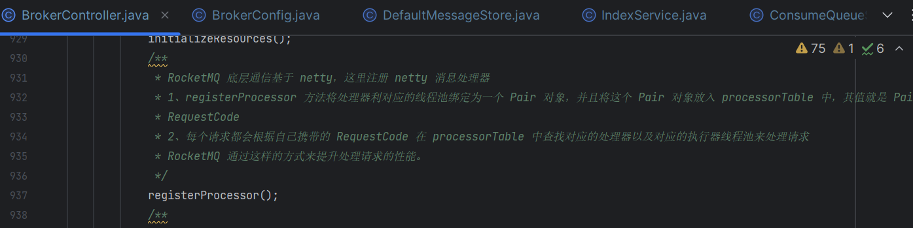

/\*\*

\* 从这里能够看出来，除了 pullMessageProcessor 处理器只会被注册到 remotingServer 之外，

\* 其他处理器会被注册到 remotingServer 和 fastRemotingServer 这两个 netty 服务中。

\* 所以 VIP 通道服务不能够处理拉取消息的请求

\*/

public void registerProcessor() {

/\*

\* SendMessageProcessor

\* 创建发送消息处理器

\*/

sendMessageProcessor.registerSendMessageHook(sendMessageHookList);

sendMessageProcessor.registerConsumeMessageHook(consumeMessageHookList);

// 向服务器注册处理器和线程池

this.remotingServer.registerProcessor(RequestCode.SEND\_MESSAGE, sendMessageProcessor, this.sendMessageExecutor);

this.remotingServer.registerProcessor(RequestCode.SEND\_MESSAGE\_V2, sendMessageProcessor, this.sendMessageExecutor);

this.remotingServer.registerProcessor(RequestCode.SEND\_BATCH\_MESSAGE, sendMessageProcessor, this.sendMessageExecutor);

this.remotingServer.registerProcessor(RequestCode.CONSUMER\_SEND\_MSG\_BACK, sendMessageProcessor, this.sendMessageExecutor);

this.fastRemotingServer.registerProcessor(RequestCode.SEND\_MESSAGE, sendMessageProcessor, this.sendMessageExecutor);

this.fastRemotingServer.registerProcessor(RequestCode.SEND\_MESSAGE\_V2, sendMessageProcessor, this.sendMessageExecutor);

this.fastRemotingServer.registerProcessor(RequestCode.SEND\_BATCH\_MESSAGE, sendMessageProcessor, this.sendMessageExecutor);

this.fastRemotingServer.registerProcessor(RequestCode.CONSUMER\_SEND\_MSG\_BACK, sendMessageProcessor, this.sendMessageExecutor);

/\*\*

\* PullMessageProcessor

\*/

this.remotingServer.registerProcessor(RequestCode.PULL\_MESSAGE, this.pullMessageProcessor, this.pullMessageExecutor);

this.remotingServer.registerProcessor(RequestCode.LITE\_PULL\_MESSAGE, this.pullMessageProcessor, this.litePullMessageExecutor);

this.pullMessageProcessor.registerConsumeMessageHook(consumeMessageHookList);

/\*\*

\* PeekMessageProcessor

\*/

this.remotingServer.registerProcessor(RequestCode.PEEK\_MESSAGE, this.peekMessageProcessor, this.pullMessageExecutor);

/\*\*

\* PopMessageProcessor

\*/

this.remotingServer.registerProcessor(RequestCode.POP\_MESSAGE, this.popMessageProcessor, this.pullMessageExecutor);

/\*\*

\* AckMessageProcessor

\*/

this.remotingServer.registerProcessor(RequestCode.ACK\_MESSAGE, this.ackMessageProcessor, this.ackMessageExecutor);

this.fastRemotingServer.registerProcessor(RequestCode.ACK\_MESSAGE, this.ackMessageProcessor, this.ackMessageExecutor);

/\*\*

\* ChangeInvisibleTimeProcessor

\*/

this.remotingServer.registerProcessor(RequestCode.CHANGE\_MESSAGE\_INVISIBLETIME, this.changeInvisibleTimeProcessor, this.ackMessageExecutor);

this.fastRemotingServer.registerProcessor(RequestCode.CHANGE\_MESSAGE\_INVISIBLETIME, this.changeInvisibleTimeProcessor, this.ackMessageExecutor);

/\*\*

\* notificationProcessor

\*/

this.remotingServer.registerProcessor(RequestCode.NOTIFICATION, this.notificationProcessor, this.pullMessageExecutor);

/\*\*

\* pollingInfoProcessor

\*/

this.remotingServer.registerProcessor(RequestCode.POLLING\_INFO, this.pollingInfoProcessor, this.pullMessageExecutor);

/\*\*

\* ReplyMessageProcessor

\*/

replyMessageProcessor.registerSendMessageHook(sendMessageHookList);

this.remotingServer.registerProcessor(RequestCode.SEND\_REPLY\_MESSAGE, replyMessageProcessor, replyMessageExecutor);

this.remotingServer.registerProcessor(RequestCode.SEND\_REPLY\_MESSAGE\_V2, replyMessageProcessor, replyMessageExecutor);

this.fastRemotingServer.registerProcessor(RequestCode.SEND\_REPLY\_MESSAGE, replyMessageProcessor, replyMessageExecutor);

this.fastRemotingServer.registerProcessor(RequestCode.SEND\_REPLY\_MESSAGE\_V2, replyMessageProcessor, replyMessageExecutor);

/\*\*

\* QueryMessageProcessor

\*/

NettyRequestProcessor queryProcessor \= new QueryMessageProcessor(this);

this.remotingServer.registerProcessor(RequestCode.QUERY\_MESSAGE, queryProcessor, this.queryMessageExecutor);

this.remotingServer.registerProcessor(RequestCode.VIEW\_MESSAGE\_BY\_ID, queryProcessor, this.queryMessageExecutor);

this.fastRemotingServer.registerProcessor(RequestCode.QUERY\_MESSAGE, queryProcessor, this.queryMessageExecutor);

this.fastRemotingServer.registerProcessor(RequestCode.VIEW\_MESSAGE\_BY\_ID, queryProcessor, this.queryMessageExecutor);

/\*\*

\* ClientManageProcessor

\*/

this.remotingServer.registerProcessor(RequestCode.HEART\_BEAT, clientManageProcessor, this.heartbeatExecutor);

this.remotingServer.registerProcessor(RequestCode.UNREGISTER\_CLIENT, clientManageProcessor, this.clientManageExecutor);

this.remotingServer.registerProcessor(RequestCode.CHECK\_CLIENT\_CONFIG, clientManageProcessor, this.clientManageExecutor);

this.fastRemotingServer.registerProcessor(RequestCode.HEART\_BEAT, clientManageProcessor, this.heartbeatExecutor);

this.fastRemotingServer.registerProcessor(RequestCode.UNREGISTER\_CLIENT, clientManageProcessor, this.clientManageExecutor);

this.fastRemotingServer.registerProcessor(RequestCode.CHECK\_CLIENT\_CONFIG, clientManageProcessor, this.clientManageExecutor);

/\*\*

\* ConsumerManageProcessor

\*/

ConsumerManageProcessor consumerManageProcessor \= new ConsumerManageProcessor(this);

this.remotingServer.registerProcessor(RequestCode.GET\_CONSUMER\_LIST\_BY\_GROUP, consumerManageProcessor, this.consumerManageExecutor);

this.remotingServer.registerProcessor(RequestCode.UPDATE\_CONSUMER\_OFFSET, consumerManageProcessor, this.consumerManageExecutor);

this.remotingServer.registerProcessor(RequestCode.QUERY\_CONSUMER\_OFFSET, consumerManageProcessor, this.consumerManageExecutor);

this.fastRemotingServer.registerProcessor(RequestCode.GET\_CONSUMER\_LIST\_BY\_GROUP, consumerManageProcessor, this.consumerManageExecutor);

this.fastRemotingServer.registerProcessor(RequestCode.UPDATE\_CONSUMER\_OFFSET, consumerManageProcessor, this.consumerManageExecutor);

this.fastRemotingServer.registerProcessor(RequestCode.QUERY\_CONSUMER\_OFFSET, consumerManageProcessor, this.consumerManageExecutor);

/\*\*

\* QueryAssignmentProcessor

\*/

this.remotingServer.registerProcessor(RequestCode.QUERY\_ASSIGNMENT, queryAssignmentProcessor, loadBalanceExecutor);

this.fastRemotingServer.registerProcessor(RequestCode.QUERY\_ASSIGNMENT, queryAssignmentProcessor, loadBalanceExecutor);

this.remotingServer.registerProcessor(RequestCode.SET\_MESSAGE\_REQUEST\_MODE, queryAssignmentProcessor, loadBalanceExecutor);

this.fastRemotingServer.registerProcessor(RequestCode.SET\_MESSAGE\_REQUEST\_MODE, queryAssignmentProcessor, loadBalanceExecutor);

/\*\*

\* EndTransactionProcessor

\*/

this.remotingServer.registerProcessor(RequestCode.END\_TRANSACTION, endTransactionProcessor, this.endTransactionExecutor);

this.fastRemotingServer.registerProcessor(RequestCode.END\_TRANSACTION, endTransactionProcessor, this.endTransactionExecutor);

/\*

\* Default

\*/

AdminBrokerProcessor adminProcessor \= new AdminBrokerProcessor(this);

this.remotingServer.registerDefaultProcessor(adminProcessor, this.adminBrokerExecutor);

this.fastRemotingServer.registerDefaultProcessor(adminProcessor, this.adminBrokerExecutor);

}

这里的「**注册处理器**」其实就是注册到「**NettyRemotingAbstract**」 的处理器表中，在处理请求时，则从这个表中「**拿出请求码**」对应的「**处理器**」和「**线程池**」来处理业务请求。

1.  [registerProcessor](http://registerprocessor/) 方法将处理器和对应的线程池绑定为一个 Pair 对象，并且将这个 Pair 对象放入 [processorTable](http://processortable/) 中， 其值就是 Pair 对象，key 就是对应的请求编码 [RequestCode](http://requestcode/)。
2.  每个请求，都会根据自己携带的 [RequestCode](http://requestcode/) 在 [processorTable](http://processortable/) 中查找对应的处理器以及对应的执行器线程池来处理请求。

RocketMQ 通过这样的方式来提升处理请求的性能。

/\*\*

\* This container holds all processors per request code, aka, for each incoming request, we may look up the

\* responding processor in this map to handle the request.

\*/

protected final HashMap<Integer/\* request code \*/, Pair<NettyRequestProcessor, ExecutorService>> processorTable = new HashMap<>(64);

@Override

public void registerProcessor(int requestCode, NettyRequestProcessor processor, ExecutorService executor) {

ExecutorService executorThis \= executor;

// 判断是否指定了业务处理线程池，没有就给处理器绑定公共业务线程池

if (null == executor) {

executorThis = this.publicExecutor;

}

Pair<NettyRequestProcessor, ExecutorService> pair = new Pair<>(processor, executorThis);

// 将业务代码，处理器和对应的处理线程池添加到处理器映射表

this.processorTable.put(requestCode, pair);

}

比较简单，处理器映射表的结构示意图如下：

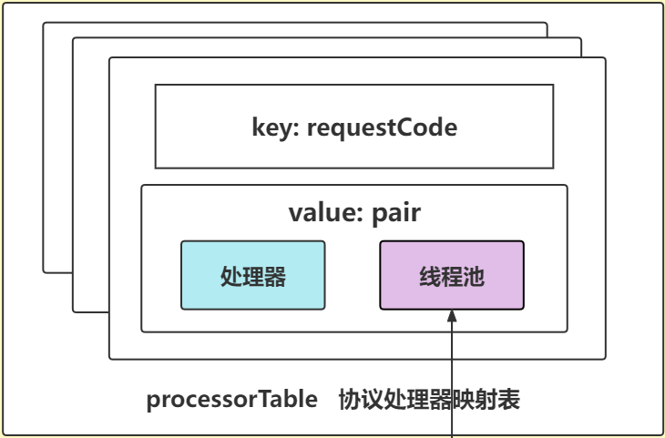

### **2.3.7 启动各种定时任务**

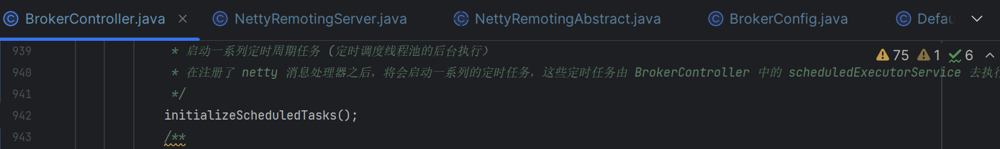

在注册了 Netty 请求处理器之后，将会启动一系列的「**定时任务**」。这些「**定时任务**」由 [BrokerController](http://brokercontroller/) 中的[scheduledExecutorService](http://scheduledexecutorservice/) 去执行，该「**线程池**」只有「**一个线程**」。

protected void initializeScheduledTasks() {

// 初始化 broker 定时任务

initializeBrokerScheduledTasks();

// 每隔 5s 进行 ScheduledTask 元数据的刷新

this.scheduledExecutorService.scheduleAtFixedRate(new Runnable() {

@Override

public void run() {

try {

BrokerController.this.brokerOuterAPI.refreshMetadata();

} catch (Exception e) {

LOG.error("ScheduledTask refresh metadata exception", e);

}

}

}, 10, 5, TimeUnit.SECONDS);

/\*\*

\* BrokerController 初始化方法中会去设置 BrokerOuterAPI 的 NameServer 地址。如果配置中指定了 NameServer

\* 的地址，就使用配置中的 NameServer 地址。可以看到还有另一种方式就是部署一个 AddressServer，然后定期从

\* AddressServer 拉取 NameServer 的地址。

\*/

// 如果 namesrvAddr 不为 null,每隔 120s 更新一次 nameServer 地址列表

if (this.brokerConfig.getNamesrvAddr() != null) {

this.updateNamesrvAddr();

LOG.info("Set user specified name server address: {}", this.brokerConfig.getNamesrvAddr());

// also auto update namesrv if specify

this.scheduledExecutorService.scheduleAtFixedRate(new Runnable() {

@Override

public void run() {

try {

BrokerController.this.updateNamesrvAddr();

} catch (Throwable e) {

LOG.error("Failed to update nameServer address list", e);

}

}

}, 1000 \* 10, 1000 \* 60 \* 2, TimeUnit.MILLISECONDS);

} else if (this.brokerConfig.isFetchNamesrvAddrByAddressServer()) {

// 没有配置 NameServer 地址时每隔 120s 从 AddressServer 拉取 NameServer 地址更新

this.scheduledExecutorService.scheduleAtFixedRate(new Runnable() {

@Override

public void run() {

try {

BrokerController.this.brokerOuterAPI.fetchNameServerAddr();

} catch (Throwable e) {

LOG.error("Failed to fetch nameServer address", e);

}

}

}, 1000 \* 10, 1000 \* 60 \* 2, TimeUnit.MILLISECONDS);

}

}

protected void initializeBrokerScheduledTasks() {

// 延迟启动的时间

final long initialDelay \= UtilAll.computeNextMorningTimeMillis() - System.currentTimeMillis();

// 执行周期 24 小时执行一次

final long period \= TimeUnit.DAYS.toMillis(1);

// 每隔 24 小时执行一次，打印昨天生产和消费的消息数量

this.scheduledExecutorService.scheduleAtFixedRate(new Runnable() {

@Override

public void run() {

try {

BrokerController.this.getBrokerStats().record();

} catch (Throwable e) {

LOG.error("BrokerController: failed to record broker stats", e);

}

}

}, initialDelay, period, TimeUnit.MILLISECONDS);

// 每隔 5s 将消费者 offset 进行持久化操作，存入 consumerOffset.json 文件中

this.scheduledExecutorService.scheduleAtFixedRate(new Runnable() {

@Override

public void run() {

try {

BrokerController.this.consumerOffsetManager.persist();

} catch (Throwable e) {

LOG.error(

"BrokerController: failed to persist config file of consumerOffset", e);

}

}

}, 1000 \* 10, this.brokerConfig.getFlushConsumerOffsetInterval(), TimeUnit.MILLISECONDS);

// 每隔 10s 将消费过滤信息 和 消费者顺序信息 进行持久化

this.scheduledExecutorService.scheduleAtFixedRate(new Runnable() {

@Override

public void run() {

try {

// 将消费过滤信息进行持久化存入 consumerFilter.json 文件

BrokerController.this.consumerFilterManager.persist();

// 将消费者顺序信息进行持久化存入 consumerOrderInfo.json 文件

BrokerController.this.consumerOrderInfoManager.persist();

} catch (Throwable e) {

LOG.error(

"BrokerController: failed to persist config file of consumerFilter or consumerOrderInfo",

e);

}

}

}, 1000 \* 10, 1000 \* 10, TimeUnit.MILLISECONDS);

/\*\*

\* 每隔 3 分钟将检查消费者的消费进度

\* 每当消费者 isDisableConsumeIfConsumerReadSlowly （消费者消费缓慢）= true（默认false） 并且进度落后阈值的时候 ，

\* 就停止消费者消费，保护 broker 避免消息积压

\*/

this.scheduledExecutorService.scheduleAtFixedRate(new Runnable() {

@Override

public void run() {

try {

BrokerController.this.protectBroker();

} catch (Throwable e) {

LOG.error("BrokerController: failed to protectBroker", e);

}

}

}, 3, 3, TimeUnit.MINUTES);

/\*\*

\* 每隔 1s 将打印如下信息

\* 发送消息线程池队列，

\* 拉取消息线程池队列，

\* 查询消息线程池队列，

\* litePull 拉取线程池队列、

\* 结束事务线程池队列

\* 客户端管理器线程池队列、

\* 心跳线程池队列、

\* ack线程池队列的大小

\*/

this.scheduledExecutorService.scheduleAtFixedRate(new Runnable() {

@Override

public void run() {

try {

BrokerController.this.printWaterMark();

} catch (Throwable e) {

LOG.error("BrokerController: failed to print broker watermark", e);

}

}

}, 10, 1, TimeUnit.SECONDS);

// 每隔 1 分钟将打印已经存储在 CommitLog 提交日志文件中，但尚未分派到 ConsumeQueue 消费队列的字节数

this.scheduledExecutorService.scheduleAtFixedRate(new Runnable() {

@Override

public void run() {

try {

// 调度任务落后于提交日志｛｝字节

LOG.info("Dispatch task fall behind commit log {}bytes",

BrokerController.this.getMessageStore().dispatchBehindBytes());

} catch (Throwable e) {

LOG.error("Failed to print dispatchBehindBytes", e);

}

}

}, 1000 \* 10, 1000 \* 60, TimeUnit.MILLISECONDS);

// 如果没有开启 DLeger 技术（DLeger开启后表示支持高可用的主从自动切换）&& 不允许重复复制 && 没有启动控制器模式，不支持自动切换代理的角色。

if (!messageStoreConfig.isEnableDLegerCommitLog() && !messageStoreConfig.isDuplicationEnable() && !brokerConfig.isEnableControllerMode()) {

// 如果当前的 broker 是从节点

if (BrokerRole.SLAVE == this.messageStoreConfig.getBrokerRole()) {

//根据是否配置了 HA 地址 && HA 地址的长度是否大于等于设置的默认最小长度（6）

if (this.messageStoreConfig.getHaMasterAddress() != null && this.messageStoreConfig.getHaMasterAddress().length() >= HA\_ADDRESS\_MIN\_LENGTH) {

// 更新 HA 地址

this.messageStore.updateHaMasterAddress(this.messageStoreConfig.getHaMasterAddress());

this.updateMasterHAServerAddrPeriodically = false;

} else {

this.updateMasterHAServerAddrPeriodically = true;

}

// 每隔 3s 同步一次 slave 从节点信息

this.scheduledExecutorService.scheduleAtFixedRate(new Runnable() {

@Override

public void run() {

try {

// 如果当前时间 - 上一次的同步时间 > 6s

if (System.currentTimeMillis() - lastSyncTimeMs > 60 \* 1000) {

/\*\*

\* 更新从机配置信息，包括：

\* 同步topic配置信息

\* 同步消费者Offset信息

\* 同步延迟Offset信息

\* 同步订阅组配置信息

\* 同步消息请求模式信息

\* 如果启用了计时器车轮，还需要同步计时器指标

\*/

BrokerController.this.getSlaveSynchronize().syncAll();

// 更新上一次同步的时间

lastSyncTimeMs = System.currentTimeMillis();

}

//timer checkpoint, latency-sensitive, so sync it more frequently

if (messageStoreConfig.isTimerWheelEnable()) {

BrokerController.this.getSlaveSynchronize().syncTimerCheckPoint();

}

} catch (Throwable e) {

// 未能同步从属设备的所有配置

LOG.error("Failed to sync all config for slave.", e);

}

}

}, 1000 \* 10, 3 \* 1000, TimeUnit.MILLISECONDS);

} else {

// 如果是主节点，每隔 60s 将打印主从节点的差异

this.scheduledExecutorService.scheduleAtFixedRate(new Runnable() {

@Override

public void run() {

try {

BrokerController.this.printMasterAndSlaveDiff();

} catch (Throwable e) {

LOG.error("Failed to print diff of master and slave.", e);

}

}

}, 1000 \* 10, 1000 \* 60, TimeUnit.MILLISECONDS);

}

}

if (this.brokerConfig.isEnableControllerMode()) {

// 如果启动控制器模式，支持自动切换代理的角色。

this.updateMasterHAServerAddrPeriodically = true;

}

}

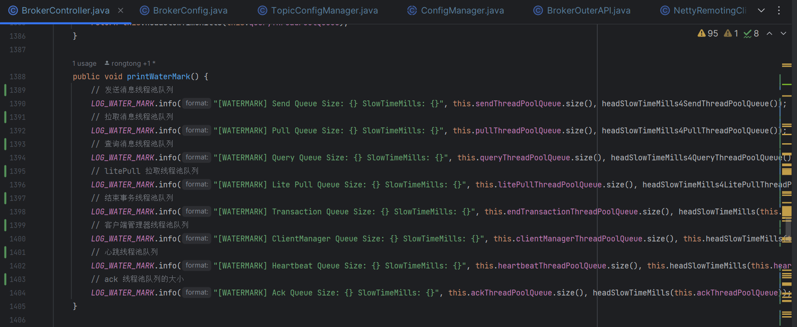

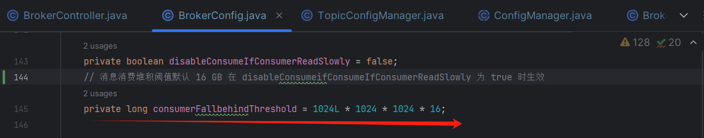

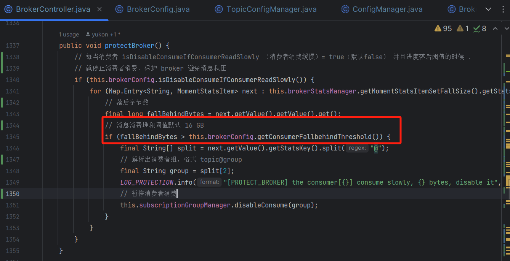

关于服务端配置可以查看这里：[https://rocketmq.apache.org/zh/docs/4.x/parameterConfiguration/02server](https://rocketmq.apache.org/zh/docs/4.x/parameterConfiguration/02server)

### **2.3.8 初始化事务消息相关服务**

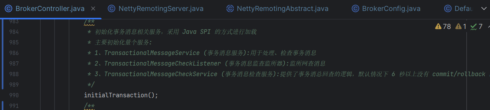

private void initialTransaction() {

/\*\*

\* 基于 Java SPI 机制，查找 "META-INF/service/org.apache.rocketmq.broker.transaction.TransactionalMessageService" 文件里面的 SPI 实现

\* 事务消息服务:用于处理、检查事务消息。

\*/

this.transactionalMessageService = ServiceProvider.loadClass(TransactionalMessageService.class);

if (null == this.transactionalMessageService) {

// 如果没有通过 SPI 指定具体的实现，那么就使用默认实现 TransactionalMessageServiceImpl

this.transactionalMessageService = new TransactionalMessageServiceImpl(

new TransactionalMessageBridge(this, this.getMessageStore()));

// 加载默认事务消息挂钩服务：｛｝

LOG.warn("Load default transaction message hook service: {}",

TransactionalMessageServiceImpl.class.getSimpleName());

}

/\*\*

\* 基于 Java SPI 机制，查找 "META-INF/service/org.apache.rocketmq.broker.transaction.AbstractTransactionalMessageCheckListener"文件里面的SPI实现

\* 事务消息回查服务监听器:监听回查消息

\*/

this.transactionalMessageCheckListener = ServiceProvider.loadClass(

AbstractTransactionalMessageCheckListener.class);

if (null == this.transactionalMessageCheckListener) {

// 如果没有通过 SPI 制定具体的实现，那么使用默认实现 DefaultTransactionalMessageCheckListener

this.transactionalMessageCheckListener = new DefaultTransactionalMessageCheckListener();

// 加载默认丢弃消息挂钩服务：｛｝

LOG.warn("Load default discard message hook service: {}",

DefaultTransactionalMessageCheckListener.class.getSimpleName());

}

this.transactionalMessageCheckListener.setBrokerController(this);

/\*\*

\* 事务消息检查服务:提供了事务消息回查的逻辑。

\* 创建 TransactionMessageCheckService 服务，该服务内部有一个线程

\* 默认情况下，6 秒以上没 commit/rollback 的事务消息才会触发事务回查，而如果回查次数超过 15 次则丢弃事务。

\*/

this.transactionalMessageCheckService = new TransactionalMessageCheckService(this);

}

这里初始化服务采用 Java SPI 的方式进行加载，主要初始化三个服务：

1.  [transactionalMessageService](http://transactionalmessageservice/)：这是事务消息服务，用于处理、检查事务消息。
2.  [transactionalMessageCheckListener](http://transactionalmessagechecklistener/)：这是事务消息监查监听器，监听回查消息。
3.  [transactionalMessageCheckService](http://transactionalmessagecheckservice/)：这是事务消息检查服务，提供了事务消息回查的逻辑，默认情况下 6s 以上没[commit/rollback](http://commit/rollback%20) 的事务消息才会触发事务回查，而如果回查次数超过了 15 次则丢弃事务。

### **2.3.9 初始化权限相关服务**

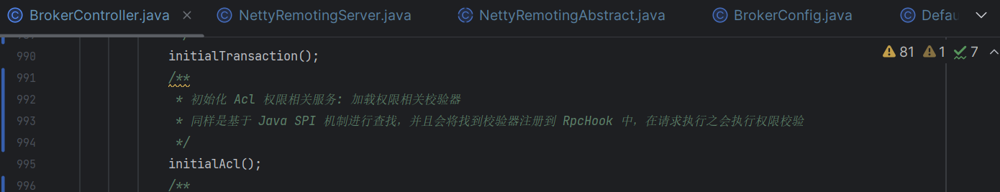

同样是基于 [Java SPI](http://java%20spi/) 机制进行查找，并且会将找到校验器注册到 [RpcHook](http://rpchook/) 中，在请求执行之前会执行权限校验。

private void initialAcl() {

// 校验是都开启了 Acl，默认为 false 直接返回

if (!this.brokerConfig.isAclEnable()) {

// 未启用 Acl

LOG.info("The broker dose not enable acl");

return;

}

// 如果开启了 Acl,则首先通过 Java SPI 机制获取 AccessValidator

List<AccessValidator> accessValidators = ServiceProvider.load(AccessValidator.class);

if (accessValidators.isEmpty()) {

// ServiceProvider 加载了没有 AccessValidator，使用default org.apache.rocketmq.acl.plain.plainAccessValidator 默认的访问验证器

LOG.info("ServiceProvider loaded no AccessValidator, using default org.apache.rocketmq.acl.plain.PlainAccessValidator");

accessValidators.add(new PlainAccessValidator());

}

// 将校验器存入 accessValidatorMap 并且注册到 RpcHook 中，在请求之前会执行校验

for (AccessValidator accessValidator : accessValidators) {

final AccessValidator validator \= accessValidator;

// 将校验器存入 accessValidatorMap

accessValidatorMap.put(validator.getClass(), validator);

// 注册 RPC 钩子函数

this.registerServerRPCHook(new RPCHook() {

@Override

public void doBeforeRequest(String remoteAddr, RemotingCommand request) {

//Do not catch the exception

// 在执行之前会进行校验

validator.validate(validator.parse(request, remoteAddr));

}

@Override

public void doAfterResponse(String remoteAddr, RemotingCommand request, RemotingCommand response) {

}

});

}

}

### **2.3.10 初始化 RPC 钩子**

[RpcHook](http://rpchook/) 是 [RocketMQ](http://rocketmq/) 提供的钩子类，提供一种类似于类似于 AOP 的功能。 可以在请求被处理之前和响应被返回之前执行对应的方法。

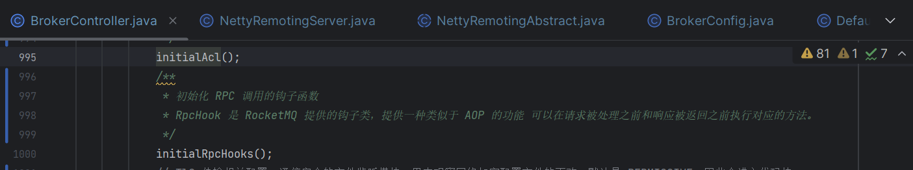

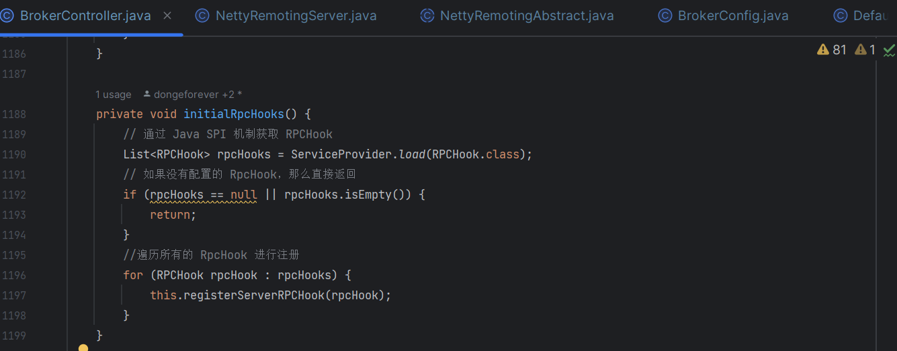

至此，整个 [BrokerController](http://brokercontroller%20/) 的初始化流程就剖析完了。

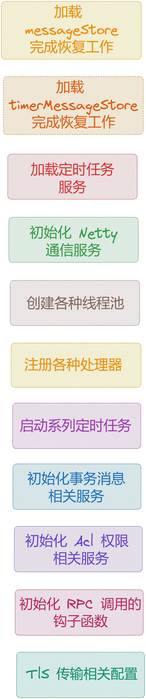

接下来，我们重点来剖析了 [BrokerController](http://brokercontroller/) 的启动流程。

## **2.4 启动 BrokerController**

public void start() throws Exception {

// 起始时间

this.shouldStartTime = System.currentTimeMillis() + messageStoreConfig.getDisappearTimeAfterStart();

// 副本数 > 1 && 是否启用主从切换 || 是启动控制器模式，支持自动切换代理的角色。

if (messageStoreConfig.getTotalReplicas() > 1 && this.brokerConfig.isEnableSlaveActingMaster()) {

isIsolated = true;

}

// 代理外部API 不为空

if (this.brokerOuterAPI != null) {

// 启动 broker 对外访问的 API

this.brokerOuterAPI.start();

}

// 启动基础服务

startBasicService();

// 如果 isIsolated 为 false && 没有开启 DLeger 的相关配置 && 没有开启重复复制的功能

if (!isIsolated && !this.messageStoreConfig.isEnableDLegerCommitLog() && !this.messageStoreConfig.isDuplicationEnable()) {

// 更改 brokerId 为 0

changeSpecialServiceStatus(this.brokerConfig.getBrokerId() == MixAll.MASTER\_ID);

/\*\*

\* 在 broker 首次启动时，强制注册当前 broker 信息到所有的 nameServer 中

\*/

this.registerBrokerAll(true, false, true);

}

/\*\*

\* 设置一个定时任务，默认情况下每隔 30s 向所有的 nameServer 进行一次注册 broker 信息，时间间隔可以配置 registorNameServerPeriod属性，允许的值是在 1万 到 6万 毫秒之间，也就是（10s到60s的范围）

\* 这个定时任务就是 broker 向 nameServer 发送的心跳包的定时任务，包括 topic名，读、写队列个数，队列权限，是否有序等信息。

\*/

scheduledFutures.add(this.scheduledExecutorService.scheduleAtFixedRate(new AbstractBrokerRunnable(this.getBrokerIdentity()) {

@Override

public void run0() {

try {

if (System.currentTimeMillis() < shouldStartTime) {

BrokerController.LOG.info("Register to namesrv after {}", shouldStartTime);

return;

}

if (isIsolated) {

BrokerController.LOG.info("Skip register for broker is isolated");

return;

}

// 向所有 NameServer 注册 broker

BrokerController.this.registerBrokerAll(true, false, brokerConfig.isForceRegister());

} catch (Throwable e) {

BrokerController.LOG.error("registerBrokerAll Exception", e);

}

}

}, 1000 \* 10, Math.max(10000, Math.min(brokerConfig.getRegisterNameServerPeriod(), 60000)), TimeUnit.MILLISECONDS));

/\*\*

\* isEnableSlaveActingMaster()，默认为 false。不启用 slave 代理 master

\* 故障切换时，slave 将充当 master。例如：如果 master 关闭，定时消息或事务消息在 slave 中过期

\*/

if (this.brokerConfig.isEnableSlaveActingMaster()) {

// 定时发送心跳

scheduleSendHeartbeat();

scheduledFutures.add(this.syncBrokerMemberGroupExecutorService.scheduleAtFixedRate(new AbstractBrokerRunnable(this.getBrokerIdentity()) {

@Override

public void run0() {

try {

// 同步 broker 成员组执行器服务

BrokerController.this.syncBrokerMemberGroup();

} catch (Throwable e) {

BrokerController.LOG.error("sync BrokerMemberGroup error. ", e);

}

}

}, 1000, this.brokerConfig.getSyncBrokerMemberGroupPeriod(), TimeUnit.MILLISECONDS));

}

/\*\*

\* isEnableControllerMode():是否启动控制器模式，支持自动切换代理的角色。默认为 false

\*/

if (this.brokerConfig.isEnableControllerMode()) {

scheduleSendHeartbeat();

}

/\*\*

\* isSkipPreOnline():默认为false

\*/

if (brokerConfig.isSkipPreOnline()) {

// 无条件启动 broker

startServiceWithoutCondition();

}

}

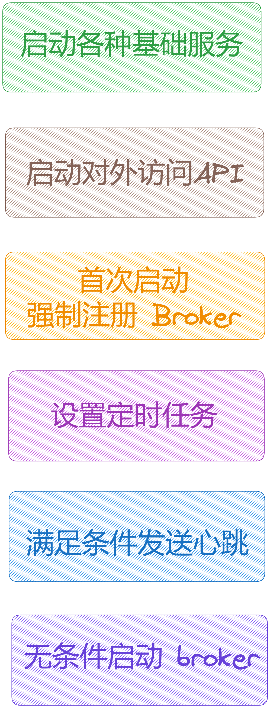

### **2.4.1 启动基础服务**

protected void startBasicService() throws Exception {

/\*\*

\* 启动消息存储服务

\* 处理消息存储相关的日志，比如 CommitLog、ConsumeQueue 等

\*/

if (this.messageStore != null) {

this.messageStore.start();

}

// 启动定时消息存储

if (this.timerMessageStore != null) {

this.timerMessageStore.start();

}

// 启动复制副本管理器功能

if (this.replicasManager != null) {

this.replicasManager.start();

}

if (remotingServerStartLatch != null) {

remotingServerStartLatch.await();

}

/\*\*

\* 启动 netty 远程服务

\* broker的服务端，处理消费者和生产者的请求

\*/

if (this.remotingServer != null) {

this.remotingServer.start();

// In test scenarios where it is up to OS to pick up an available port, set the listening port back to config

if (null != nettyServerConfig && 0 == nettyServerConfig.getListenPort()) {

nettyServerConfig.setListenPort(remotingServer.localListenPort());

}

}

/\*\*

\* 启动快速 netty 远程服务

\* 只给消息生产者的服务端

\*/

if (this.fastRemotingServer != null) {

this.fastRemotingServer.start();

}

this.storeHost = new InetSocketAddress(this.getBrokerConfig().getBrokerIP1(), this.getNettyServerConfig().getListenPort());

for (BrokerAttachedPlugin brokerAttachedPlugin : brokerAttachedPlugins) {

if (brokerAttachedPlugin != null) {

// 启动附加插件服务

brokerAttachedPlugin.start();

}

}

if (this.popMessageProcessor != null) {

// 启动 Pop 模式下长轮询服务

this.popMessageProcessor.getPopLongPollingService().start();

// Pop 和 ACK 的过程主要实现在 PopMessageProcessor 和 PopBufferMergeService 两个组件中。

// 其中，MergeService 负责将 ACK 和 Checkpoint 消息进行匹配，并在所有消息都被 ACK 后更新消费的进度。

this.popMessageProcessor.getPopBufferMergeService().start();

// 启动 Pop 模式下的加锁管理服务

this.popMessageProcessor.getQueueLockManager().start();

}

if (this.ackMessageProcessor != null) {

// 启动 Pop 恢复服务

this.ackMessageProcessor.startPopReviveService();

}

if (this.notificationProcessor != null) {

// 启动通知处理器服务

this.notificationProcessor.getPopLongPollingService().start();

}

if (this.topicQueueMappingCleanService != null) {

// 启动 topic 队列映射清理服务

this.topicQueueMappingCleanService.start();

}

/\*\*

\* 文件监听器启动，关注文件变更的服务，及时加载最新的ssl证书

\* 通过对文件进行hash，判断新的hash和当前hash是否一致

\* 如果不一致，表示文件变更了

\*/

if (this.fileWatchService != null) {

this.fileWatchService.start();

}

/\*\*

\* 长轮询拉取消息挂起服务启动

\* 处理 push 模式消费，或者延迟消费的服务

\*/

if (this.pullRequestHoldService != null) {

this.pullRequestHoldService.start();

}

/\*\*

\* 客户端连接心跳服务启动

\* 启动定时器 每10s清理没用的链接

\*/

if (this.clientHousekeepingService != null) {

this.clientHousekeepingService.start();

}

// 启动 broker 状态管理器服务

if (this.brokerStatsManager != null) {

this.brokerStatsManager.start();

}

// 启动 broker 快速失败服务

if (this.brokerFastFailure != null) {

this.brokerFastFailure.start();

}

// 启动广播偏移量管理器

if (this.broadcastOffsetManager != null) {

this.broadcastOffsetManager.start();

}

if (this.escapeBridge != null) {

this.escapeBridge.start();

}

// 启动 topic 路由信息管理器服务

if (this.topicRouteInfoManager != null) {

this.topicRouteInfoManager.start();

}

if (this.brokerPreOnlineService != null) {

this.brokerPreOnlineService.start();

}

if (this.coldDataPullRequestHoldService != null) {

this.coldDataPullRequestHoldService.start();

}

if (this.coldDataCgCtrService != null) {

this.coldDataCgCtrService.start();

}

}

### **2.4.2 启动对外访问 API**

Broker 首先会作为客户端的服务器被调用，例如「**生产者发送消息**」、「**消费者拉取消息**」。

Boker 网络服务器组件是 [NettyRemotingServer](http://nettyremotingserver/)，这个组件在前面介绍 NameServer 网络服务器时已经详细分析过了，可以点击查看：[【网络通信源码分析系列第一篇】图解 RocketMQ 源码之 NettyRemotingServer 初始化全流程](https://articles.zsxq.com/id_r2fzf5hwlm8g.html)。

另外 Broker 还会作为「**网络客户端**」调用「**NameServer**」，或者「**Slave 节点**」调用「**Master 节点**」来同步数据，这里的调用组件就是 [BrokerOuterAPI](http://brokerouterapi/)。

[BrokerOuterAPI](http://brokerouterapi%20/) 的初始化比较简单，其核心组件主要在于 [RemotingClient](http://remotingclient/)，这就是基于 [Netty](http://netty%20/) 的网络客户端，对网络服务器的 RPC 调用最终都是通过这个组件进行的。

构造方法中创建了 [NettyRemotingClient](http://nettyremotingclient/)，并在 [start()](http://start\(\)/) 方法中启动网络客户端。

public class BrokerOuterAPI {

private static final Logger LOGGER \= LoggerFactory.getLogger(LoggerName.BROKER\_LOGGER\_NAME);

// Netty 客户端

private final RemotingClient remotingClient;

// AddressServer 配置

private final TopAddressing topAddressing \= new DefaultTopAddressing(MixAll.getWSAddr());

// 线程池

private final BrokerFixedThreadPoolExecutor brokerOuterExecutor \= new BrokerFixedThreadPoolExecutor(4, 10, 1, TimeUnit.MINUTES,

new ArrayBlockingQueue<>(32), new ThreadFactoryImpl("brokerOutApi\_thread\_", true));

// 客户端元数据

private final ClientMetadata clientMetadata;

// rpc 客户端

private final RpcClient rpcClient;

// NameServer 地址

private String nameSrvAddr \= null;

public BrokerOuterAPI(final NettyClientConfig nettyClientConfig) {

this(nettyClientConfig, new DynamicalExtFieldRPCHook(), new ClientMetadata());

}

private BrokerOuterAPI(final NettyClientConfig nettyClientConfig, RPCHook rpcHook, ClientMetadata clientMetadata) {

// 创建 Netty 客户端

this.remotingClient = new NettyRemotingClient(nettyClientConfig);

this.clientMetadata = clientMetadata;

// 注册 RPC 钩子函数

this.remotingClient.registerRPCHook(rpcHook);

// 创建 RPC 客户端

this.rpcClient = new RpcClientImpl(this.clientMetadata, this.remotingClient);

}

// 启动 Netty 客户端

public void start() {

this.remotingClient.start();

}

....

}

[BrokerOuterAPI](http://brokerouterapi%20/) 主要提供了如下的一些 API 调用，可以看出 [Broker](http://broker%20/) 作为客户端主要是向 「**NameServer**」注册，以及「**Slave 节点**」从「**Master 节点**」同步数据，这里只简单看下，后面需要在单独剖析。

// 向所有 NameServer 注册 Broker

public List<RegisterBrokerResult> registerBrokerAll()

// 向所有 NameServer 下线 Broker

public void unregisterBrokerAll()

// Slave 节点从 Master 同步 Topic 配置数据

public TopicConfigSerializeWrapper getAllTopicConfig(final String addr)

// Slave 节点从 Master 同步消费偏移量

public ConsumerOffsetSerializeWrapper getAllConsumerOffset(final String addr)

// Slave 节点从 Master 同步延迟偏移量

public String getAllDelayOffset(final String addr)

// Slave 节点从 Master 同步订阅组数据

public SubscriptionGroupWrapper getAllSubscriptionGroupConfig(final String addr)

### **2.4.3 首次启动强制注册 Broker**

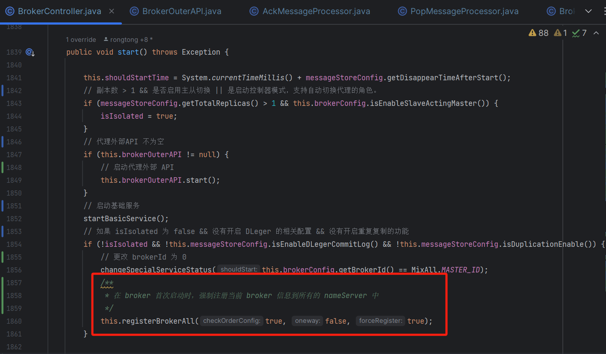

/\*\*

\* 把 broker 注册到所有的 nameServer 中，发送心跳包

\* @param checkOrderConfig 是否校验 顺序消息配置

\* @param oneway 是否是单向发送， 单向发送不接收返回值

\* @param forceRegister 是否是强制注册

\*/

public synchronized void registerBrokerAll(final boolean checkOrderConfig, boolean oneway, boolean forceRegister) {

/\*\*

\* 根据 topicConfigManager 中的 topic 信息构建 topic 信息的传输协议对象 topicConfigWrapper

\* 在此前 topicConfigManager.load() 方法中已经加载了所有的 topic 信息

\* topicConfigWrapper 中封装了该 broker 上的 topic 信息和 dataVersion

\*/

TopicConfigAndMappingSerializeWrapper topicConfigWrapper \= new TopicConfigAndMappingSerializeWrapper();

// 设置版本号

topicConfigWrapper.setDataVersion(this.getTopicConfigManager().getDataVersion());

// 设置 TopicConfigTable 表

topicConfigWrapper.setTopicConfigTable(this.getTopicConfigManager().getTopicConfigTable());

// 设置 TopicQueueMappingInfoMap

topicConfigWrapper.setTopicQueueMappingInfoMap(this.getTopicQueueMappingManager().getTopicQueueMappingTable().entrySet().stream().map(

entry -> new AbstractMap.SimpleImmutableEntry<>(entry.getKey(), TopicQueueMappingDetail.cloneAsMappingInfo(entry.getValue()))

).collect(Collectors.toMap(Map.Entry::getKey, Map.Entry::getValue)));

/\*\*

\* 将 topicConfigWrapper 中的值取出来重新封装一遍，又再塞回 topicConfigWrapper

\* 理解：这么做的目的主要是为了将 this.brokerConfig.getBrokerPermission() 的属性值 set 进去

\* 不过这并不是重要的细节，我们只需要知道 topicConfigWrapper 中至少包含了该 broker 上的 topic 信息以及 dataVersion 即可

\*/

// 如果当前 broker 权限不支持读或者写

if (!PermName.isWriteable(this.getBrokerConfig().getBrokerPermission())

|| !PermName.isReadable(this.getBrokerConfig().getBrokerPermission())) {

ConcurrentHashMap<String, TopicConfig> topicConfigTable = new ConcurrentHashMap<>();

for (TopicConfig topicConfig : topicConfigWrapper.getTopicConfigTable().values()) {

// 重新配置 topic 权限

TopicConfig tmp \=

new TopicConfig(topicConfig.getTopicName(), topicConfig.getReadQueueNums(), topicConfig.getWriteQueueNums(),

topicConfig.getPerm() & this.brokerConfig.getBrokerPermission(), topicConfig.getTopicSysFlag());

topicConfigTable.put(topicConfig.getTopicName(), tmp);

}

topicConfigWrapper.setTopicConfigTable(topicConfigTable);

}

/\*\*

\* 这里是重点

\* needRegister() 方法用于判断当前 broker 是否需要向 nameServer 进行注册，当 forceRegister 参数为 true 时，表示强制注册

\* 那么 needRegister() 方法的结果是无所谓的，如果 forceRegister 为 false，那么 broker 是否需要向 nameServer 注册就得看 needRegister() 方法的结果了

\*/

if (forceRegister || needRegister(this.brokerConfig.getBrokerClusterName(),

this.getBrokerAddr(),

this.brokerConfig.getBrokerName(),

this.brokerConfig.getBrokerId(),

this.brokerConfig.getRegisterBrokerTimeoutMills(),

this.brokerConfig.isInBrokerContainer())) {

// 向所有 NameServer 执行注册

doRegisterBrokerAll(checkOrderConfig, oneway, topicConfigWrapper);

}

}

这里看到并不是所有的情况都会发送心跳执行注册，以下两个条件要满足其中一个：

1.  forceRegister 为 true，此参数在 Broker 首次启动时是 true，即强制进行注册。
2.  needRegister 为 true，即 RocketMQ 经过检查后发现是否需要执行注册。

  
由于 Broker 启动时 [forceRegister](http://forceregister%20/) 一定为 true，如下：

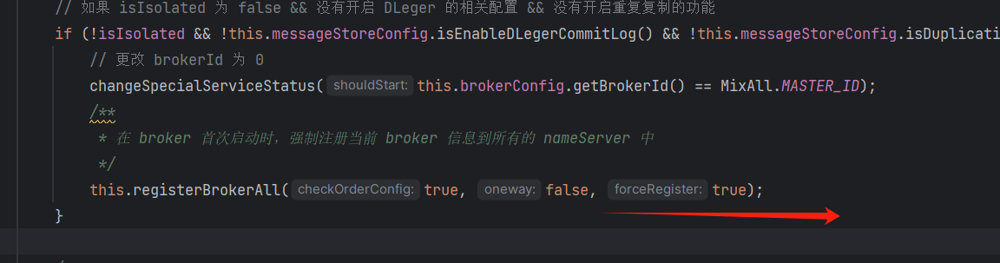

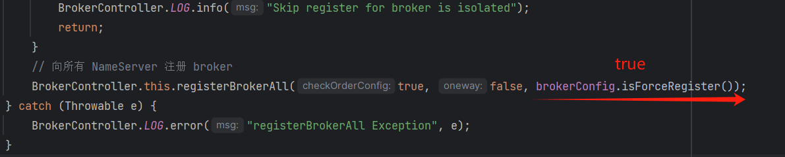

所以启动时，Broker 一定会执行一次心跳处理。心跳的流程也很好理解，因为它不仅仅是「**心跳本身**」，还会「**传输数据**」，而这就必然会涉及这些操作，即构建「**Header**」、「**Body**」，然后发送请求。

### **心跳传输数据**

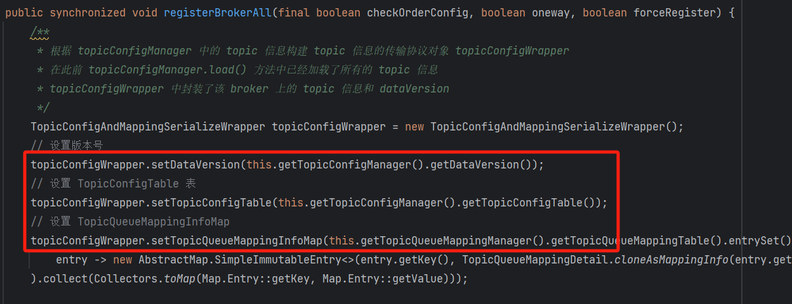

1.  [topicConfigTable](http://topicconfigtable/)：是个 Map，Key 就是 Topic 名称，Value 则是 [TopicConfig](http://topicconfig/)。就拿咱们发送消息时创建的 Topic 举例子，里面有读、写 MessageQueue 的数量、Topic 名称之类的数据
2.  [dataVersion](http://dataversion/)：里面就两个字段，分别是 [dataVersion](http://dataversion%20/) 和 [counter](http://counter/)，分别表示上次更新的时间戳以及更新的次数。

简单来说就是：「**数据详情**」和「**数据版本**」。

### **2.4.3.1 是否需要注册**

了解了 [DataVersion](http://dataversion/) 之后，我们来看该方法的判断逻辑了。

因为只有当 [forceRegister](http://forceregister/) 为 false 时，只有 [needRegister()](http://needregister\(\)/) 方法判定为 true 时，才会执行注册逻辑。这里的判断逻辑实际上很简单粗暴，[Broker](http://broker%20/) 会去请求所有的 [NameServer](http://nameserver/)，查询自己传给 [NameServer](http://nameserver%20/) 的数据，然后跟自己本地的数据版本做一个对比。

只要有「**任何一台**」NameServer 的数据是旧的，Broker 就会重新执行心跳。拿到结果之后，会对所有的[changed](http://changed/) 进行判定，但凡有一个 [changed](http://changed%20/) 是 true，就会直接把 [needRegister](http://needregister%20/) 设置为 true，并终止判断逻辑，返回结果。

/\*\*

\* broker是否需要向nameServer中注册

\* @param clusterName 集群名

\* @param brokerAddr broker地址

\* @param brokerName broker名字

\* @param brokerId brokerId

\* @param timeoutMills 超时时间

\* @param isInBrokerContainer 是否在broker容器中

\* @return broker是否需要向nameServer中注册

\*/

private boolean needRegister(final String clusterName,

final String brokerAddr,

final String brokerName,

final long brokerId,

final int timeoutMills,

final boolean isInBrokerContainer) {

/\*\*

\* 根据 topicConfigManager 中的 topic 信息构建 topic 信息的传输协议对象 topicConfigWrapper

\* 在此前 topicConfigManager.load() 方法中已经加载了所有的 topic 信息

\* topicConfigWrapper 中封装了该 broker 上的 topic 信息和 dataVersion

\*/

TopicConfigSerializeWrapper topicConfigWrapper \= this.getTopicConfigManager().buildTopicConfigSerializeWrapper();

/\*\*

\* 获取 nameServer 的 DataVerison 数据，与自身数据对比是否一致

\* 如果有一个 nameServer 的 DataVersion 数据版本不一致则重新注册

\*/

List<Boolean> changeList = brokerOuterAPI.needRegister(clusterName, brokerAddr, brokerName, brokerId, topicConfigWrapper, timeoutMills, isInBrokerContainer);

boolean needRegister \= false;

// 如果有一个和 nameServer 的数据版本不一致，则需要重新注册

for (Boolean changed : changeList) {

if (changed) {

needRegister = true;

break;

}

}

return needRegister;

}

### **2.4.3.2 执行注册 Broker 操作**

/\*\*

\* 向所有 NameServer 执行注册操作

\* 1、调用 brokerOuterAPI.registerBrokerAll 进行注册

\* 2、处理注册结果，registerBrokerResultList：进行 master 地址的更新、顺序消息 Topic 的配置更新

\* @param checkOrderConfig 是否检测顺序topic

\* @param oneway 是否是单向

\* @param topicConfigWrapper topic信息的传输协议包装对象

\*/

protected void doRegisterBrokerAll(boolean checkOrderConfig, boolean oneway,

TopicConfigSerializeWrapper topicConfigWrapper) {

if (shutdown) {

// broker 已经关闭，无需再进行注册

BrokerController.LOG.info("BrokerController#doResterBrokerAll: broker has shutdown, no need to register any more.");

return;

}

// 1、调用 brokerOuterAPI.registerBrokerAll 发送请求到 NameServer 进行注册，返回注册结果

// 执行注册，broker 作为客户端向所有 nameServer 进行注册

List<RegisterBrokerResult> registerBrokerResultList = this.brokerOuterAPI.registerBrokerAll(

this.brokerConfig.getBrokerClusterName(),

this.getBrokerAddr(),

this.brokerConfig.getBrokerName(),

this.brokerConfig.getBrokerId(),

this.getHAServerAddr(),

// 包含了携带 topic 信息的 topicConfigTable，以及版本信息的 dataVersion，这两个信息保存在持久化文件 topics.json 中

topicConfigWrapper,

Lists.newArrayList(),

oneway,

this.brokerConfig.getRegisterBrokerTimeoutMills(),

this.brokerConfig.isEnableSlaveActingMaster(),

this.brokerConfig.isCompressedRegister(),

this.brokerConfig.isEnableSlaveActingMaster() ? this.brokerConfig.getBrokerNotActiveTimeoutMillis() : null,

this.getBrokerIdentity());

// 2、对注册结果进行处理

handleRegisterBrokerResult(registerBrokerResultList, checkOrderConfig);

}

/\*\*

\* 对注册结果进行处理

\* @param registerBrokerResultList

\* @param checkOrderConfig

\*/

protected void handleRegisterBrokerResult(List<RegisterBrokerResult> registerBrokerResultList,

boolean checkOrderConfig) {

for (RegisterBrokerResult registerBrokerResult : registerBrokerResultList) {

if (registerBrokerResult != null) {

if (this.updateMasterHAServerAddrPeriodically && registerBrokerResult.getHaServerAddr() != null) {

// 更新 HA 地址

this.messageStore.updateHaMasterAddress(registerBrokerResult.getHaServerAddr());

// 更新 Master 节点地址

this.messageStore.updateMasterAddress(registerBrokerResult.getMasterAddr());

}

// 主从节点，设置 Master 地址

this.slaveSynchronize.setMasterAddr(registerBrokerResult.getMasterAddr());

if (checkOrderConfig) {

this.getTopicConfigManager().updateOrderTopicConfig(registerBrokerResult.getKvTable());

}

break;

}

}

}

### **2.4.3.3 调用 brokerOuterAPI 方法进行注册 Broker 操作**

[BrokerOuterAPI#registerBrokerAll](http://brokerouterapi/#registerBrokerAll) 方法才是真正向 [NameServer](http://nameserver%20/) 注册 Broker。

1.  注册 Broker 时是向所有 [NameServer](http://nameserver%20/) 异步注册，通过 [CountDownLatch](http://countdownlatch%20/) 等待所有注册返回。NameServer 集群是无状态的，每个 NameServer 都有一份完成的 Broker 数据，因为 Broker 会将自己注册给每个 NameServer。
2.  注册的请求码为 [REGISTER\_BROKER](http://register_broker/)，就是将 Broker 端的数据封装到 [RemotingCommand](http://remotingcommand%20/) 中，然后调用 [RemotingClient](http://remotingclient%20/) 执行 RPC 调用。
3.  注册完成后，[NameServer](http://nameserver%20/) 会返回 Broker 组中的 master 地址，HA 地址等，Broker 再去更新这些信息。

/\*\*

\* Considering compression brings much CPU overhead to name server, stream API will not support compression and

\* compression feature is deprecated.

\* broker 向 所有 nameServer 进行注册

\* @param clusterName

\* @param brokerAddr

\* @param brokerName

\* @param brokerId

\* @param haServerAddr

\* @param topicConfigWrapper

\* @param filterServerList

\* @param oneway

\* @param timeoutMills

\* @param compressed default false

\* @return

\*/

public List<RegisterBrokerResult> registerBrokerAll(

final String clusterName,

final String brokerAddr,

final String brokerName,

final long brokerId,

final String haServerAddr,

final TopicConfigSerializeWrapper topicConfigWrapper,

final List<String> filterServerList,

final boolean oneway,

final int timeoutMills,

final boolean enableActingMaster,

final boolean compressed,

final Long heartbeatTimeoutMillis,

final BrokerIdentity brokerIdentity) {

// 创建一个 CopyOnWriteArrayList 类型的集合 用来保存请求的返回结果

final List<RegisterBrokerResult> registerBrokerResultList = new CopyOnWriteArrayList<>();

// 获得 nameServer 的地址信息集合

List<String> nameServerAddressList = this.remotingClient.getAvailableNameSrvList();

// 如果获取到的 nameServer 地址信息集合不为 null && 集合长度 > 0

if (nameServerAddressList != null && nameServerAddressList.size() > 0) {

// 封装请求头

final RegisterBrokerRequestHeader requestHeader \= new RegisterBrokerRequestHeader();

requestHeader.setBrokerAddr(brokerAddr); // broker地址 ip:port

requestHeader.setBrokerId(brokerId); // brokerId 也就是角色，等于 0 为 master， 大于 0 为 slave

requestHeader.setBrokerName(brokerName);

requestHeader.setClusterName(clusterName); // broker 集群名称

requestHeader.setHaServerAddr(haServerAddr); // haServer 地址

requestHeader.setEnableActingMaster(enableActingMaster); // 是否替代主节点

requestHeader.setCompressed(false); // 是否开启压缩

if (heartbeatTimeoutMillis != null) {

// 如果心跳超时毫秒不为 null ，将其也封装在请求头里面

requestHeader.setHeartbeatTimeoutMillis(heartbeatTimeoutMillis);

}

/\*\*

\* 封装请求体

\* 当前 broker 所有的 topic 信息，名称，读写队列数以及版本信息 dataVersion

\* 依次向各个 nameServer 注册

\*/

RegisterBrokerBody requestBody \= new RegisterBrokerBody();

requestBody.setTopicConfigSerializeWrapper(TopicConfigAndMappingSerializeWrapper.from(topicConfigWrapper));

requestBody.setFilterServerList(filterServerList);

final byte\[\] body = requestBody.encode(compressed);

final int bodyCrc32 \= UtilAll.crc32(body);

requestHeader.setBodyCrc32(bodyCrc32);

/\*\*

\* CountDownLatch：

\* 它是一个同步工具类，用来协调多个线程之间的同步，或者说起到线程之间的通信（而不是用作互斥的作用）。

\* 它能够使一个线程在等待另外一些线程完成各自工作之后，再继续执行。使用一个计数器进行实现。计数器初始值为线程的数量。

\* 当每一个线程完成自己任务后，计数器的值就会减一。当计数器的值为0时，表示所有的线程都已经完成一些任务，然后在CountDownLatch上等待的线程就可以恢复执行接下来的任务。

\* 使用 CountDownLatch 作为倒数计数器，用于并发控制

\* CountDownLatch 使得只有所有 nameServer 的响应结果都返回时才会继续执行后续的逻辑

\*/

final CountDownLatch countDownLatch \= new CountDownLatch(nameServerAddressList.size());

/\*\*

\* 采用线程池的方式，即多线程并发的向所有的 nameServer 发起注册请求

\* 遍历所有的 nameServer，并将注册任务 registerBroker 丢进 brokerOuterExecutor 线程池中执行

\*/

for (final String namesrvAddr : nameServerAddressList) {

// 并发的执行线程任务

brokerOuterExecutor.execute(new AbstractBrokerRunnable(brokerIdentity) {

@Override

public void run0() {

try {

// 真正执行注册的地方

RegisterBrokerResult result \= registerBroker(namesrvAddr, oneway, timeoutMills, requestHeader, body);

if (result != null) {

registerBrokerResultList.add(result);

}

// 已完成当前 broker 注册到 nameServer。目标主机=｛｝

LOGGER.info("Registering current broker to name server completed. TargetHost={}", namesrvAddr);

} catch (Exception e) {

LOGGER.error("Failed to register current broker to name server. TargetHost={}", namesrvAddr, e);

} finally {

// 每一个请求执行完毕，无论是正常还是异常，都需要减少一个计数

countDownLatch.countDown();

}

}

});

}

try {

// 主线程在此限时等待 6000 ms，直到上面的任务全部执行完毕之后计数变为 0，会唤醒主线程继续执行后面的逻辑

if (!countDownLatch.await(timeoutMills, TimeUnit.MILLISECONDS)) {

LOGGER.warn("Registration to one or more name servers does NOT complete within deadline. Timeout threshold: {}ms", timeoutMills);

}

} catch (InterruptedException ignore) {

}

}

return registerBrokerResultList;

}

/\*\*

\* 通过底层的 NettyClient 把这个请求发送到 NameServer 进行注册

\* @param namesrvAddr

\* @param oneway

\* @param timeoutMills

\* @param requestHeader

\* @param body

\* @return

\* @throws RemotingCommandException

\* @throws MQBrokerException

\* @throws RemotingConnectException

\* @throws RemotingSendRequestException

\* @throws RemotingTimeoutException

\* @throws InterruptedException

\*/

private RegisterBrokerResult registerBroker(

final String namesrvAddr,

final boolean oneway,

final int timeoutMills,

final RegisterBrokerRequestHeader requestHeader,

final byte\[\] body

) throws RemotingCommandException, MQBrokerException, RemotingConnectException, RemotingSendRequestException, RemotingTimeoutException,

InterruptedException {

// 构建远程调用请求对象，code 为 REGISTER\_BROKER = 103

RemotingCommand request \= RemotingCommand.createRequestCommand(RequestCode.REGISTER\_BROKER, requestHeader);

request.setBody(body);

/\*\*

\* 对于 RocketMQ RPC 通信有三种执行方式：

\* invokeSync方法：以同步的方式向客户端发送消息

\* invokeAsync方法：以异步的方式向客户端发送消息

\* invokeOneway方法：只向客户端发送消息，而不处理客户端返回的消息

\*/

// 如果是单向请求，则 broker 发起异步请求即可返回，不必关心执行结果，注册请求不是单向请求

if (oneway) {

try {

this.remotingClient.invokeOneway(namesrvAddr, request, timeoutMills);

} catch (RemotingTooMuchRequestException e) {

// Ignore

}

return null;

}

/\*\*

\* 最核心的就是 invokeSync() 方法在 NettyRemotingClient 类中

\* 创建连接最终的核心：NettyRemotingClient 底层是基于 Netty 的 Bootstrap 类的 connect 方法，创建了一个连接

\* 发送请求最终的核心：NettyRemotingClient 底层是基于 Netty 的 Channel API，把注册的请求给发送到了 NameServer 就可以了

\*/

// 通过 remotingClient（这个 RemotingClient 其实就是 Netty 客户端） 发起同步调用，非单向请求，即需要同步的获取结果

RemotingCommand response \= this.remotingClient.invokeSync(namesrvAddr, request, timeoutMills);

assert response != null;

switch (response.getCode()) {

case ResponseCode.SUCCESS: {

// 解析响应数据，封装结果

RegisterBrokerResponseHeader responseHeader \=

(RegisterBrokerResponseHeader) response.decodeCommandCustomHeader(RegisterBrokerResponseHeader.class);

RegisterBrokerResult result \= new RegisterBrokerResult();

result.setMasterAddr(responseHeader.getMasterAddr());

result.setHaServerAddr(responseHeader.getHaServerAddr());

if (response.getBody() != null) {

result.setKvTable(KVTable.decode(response.getBody(), KVTable.class));

}

return result;

}

default:

break;

}

throw new MQBrokerException(response.getCode(), response.getRemark(), requestHeader == null ? null : requestHeader.getBrokerAddr());

}

关于 [invokeSync](http://invokesync/) 以及底层的 [invokeSyncImpl](http://invokesyncimpl/) 处理逻辑在 Netty 网络模块已经剖析过了，可以点击：[【生产者源码分析系列第六篇】图解 RocketMQ 源码之网络通讯组件 NettyRemotingClient 架构设计](https://articles.zsxq.com/id_zgofuq2lee3e.html)，[【网络通信源码分析系列第二篇】图解 RocketMQ 源码之 NettyRemotingAbstract 抽象类实现](https://articles.zsxq.com/id_gid958lent4m.html)。

而 [NameServer](http://nameserver%20/) 端的注册逻辑，主要就是将 [Broker](http://broker%20/) 信息注册到路由管理器 [RouteInfoManager](http://routeinfomanager/)，点击查看：[【NameServer源码分析系列第四篇】图解 RocketMQ 源码之RouteInfoManager组件源码设计剖析](https://articles.zsxq.com/id_8boaz51jqig2.html)。

### **2.4.4 定时心跳注册**

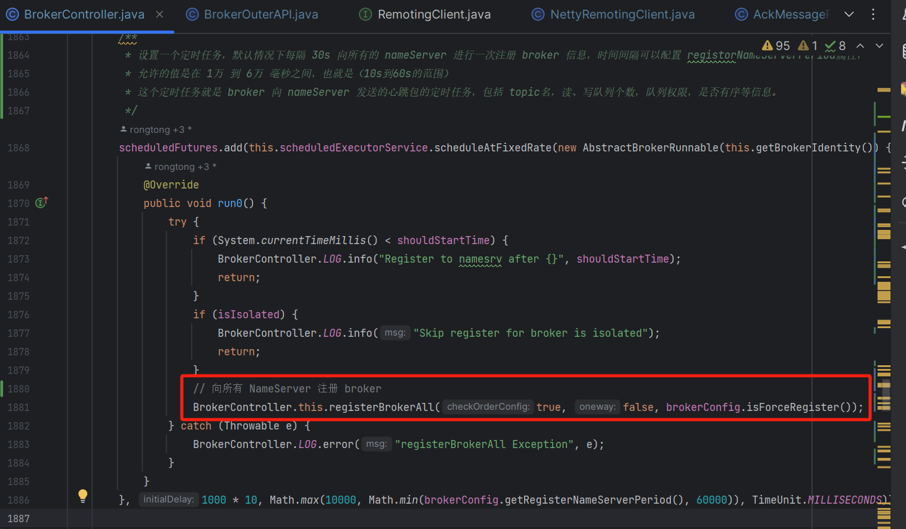

可以看到在启动时有一个调度器每隔 30秒 调用一次 [registerBrokerAll](http://registerbrokerall%20/) 方法来注册 Broker。调度的周期可以通过 [registerNameServerPeriod](http://registernameserverperiod%20/) 来配置，默认为 30秒，不过看代码可以知道调度周期在 10~60 秒。

在注册时，会创建一个 [BrokerLiveInfo](http://brokerliveinfo%20/) 来保持与 Broker 的连接，其 [lastUpdateTimestamp](http://lastupdatetimestamp%20/) 参数就是 Broker 最近一次注册时间。

// 创建 Broker 保活信息

BrokerLiveInfo prevBrokerLiveInfo \= this.brokerLiveTable.put(brokerAddrInfo,

new BrokerLiveInfo(

System.currentTimeMillis(), // 当前时间

timeoutMillis == null ? DEFAULT\_BROKER\_CHANNEL\_EXPIRED\_TIME : timeoutMillis,

topicConfigWrapper == null ? new DataVersion() : topicConfigWrapper.getDataVersion(), // Broker Topic 版本

channel,

haServerAddr));

而在 [NamesrvController](http://namesrvcontroller/) 中启动了一个调度器，每隔 10s 调用一次 [RouteInfoManager#scanNotActiveBroker](http://routeinfomanager/#scanNotActiveBroker)方法。可以看到其核心逻辑就是定时扫描 [brokerLiveTable](http://brokerlivetable/)，判断如果 [BrokerLiveInfo](http://brokerliveinfo%20/) 超过 2 分钟未更新，则判定 Broker 连接失活，会移除 Broker 相关信息，如图：

### **2.4.5 Broker 下线**

当 Broker 下线时，会向 [NameServer](http://nameserver%20/) 下线，下线逻辑相对比较简单，就是遍历每个 [NameServer](http://nameserver/)，发送下线请求。

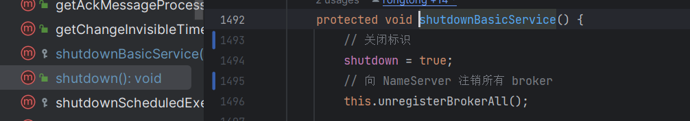

protected void unregisterBrokerAll() {

this.brokerOuterAPI.unregisterBrokerAll(

this.brokerConfig.getBrokerClusterName(),

this.getBrokerAddr(),

this.brokerConfig.getBrokerName(),

this.brokerConfig.getBrokerId());

}

[NameServer](http://nameserver%20/) 处理下线请求就是从 [RouteInfoManager](http://routeinfomanager%20/) 中移除其相关信息。

通过前面的剖析，Broker 注册、心跳的架构图如下图所示，其核心逻辑主要在于 [RouteInfoManager](http://routeinfomanager%20/) 对各个内存结构的更新。

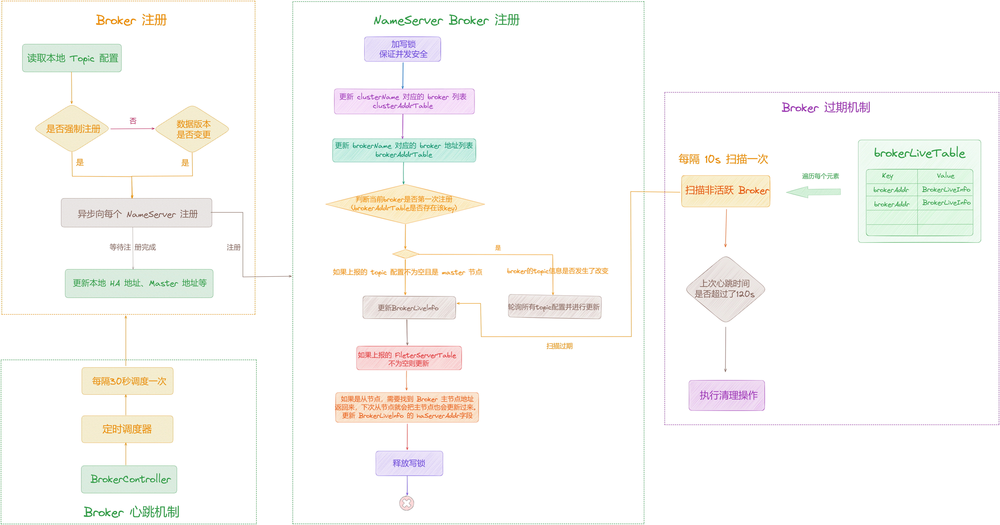

## **2.5 配置管理器**

通过前面的剖析，我们知道在 Broker 启动时，[BrokerController](http://brokercontroller%20/) 构造方法中会创建多个配置管理器，这部分配置会「**持久化**」到磁盘，启动时也会从磁盘「**加载到**」内存。

Broker 管理活动相关的配置主要有如下几个：

1.  [TopicConfigManager](http://topicconfigmanager/)：Topic 配置。
2.  [ConsumerOffsetManager](http://consumeroffsetmanager/)：消费偏移量。
3.  [ConsumerFilterManager](http://consumerfiltermanager/)：消费过滤器。
4.  [SubscriptionGroupManager](http://subscriptiongroupmanager/)：订阅组配置。

启动 Broker 后，就可以看到这几个配置管理器对应的配置文件。

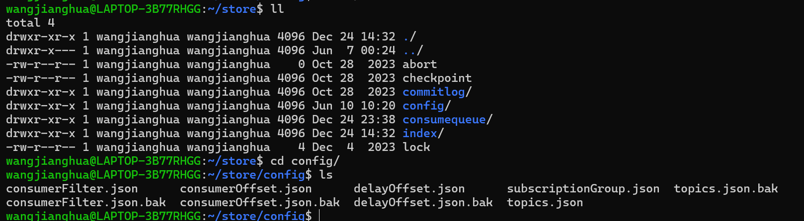

这几个配置管理器都继承自 [ConfigManager](http://configmanager/)，[ConfigManager](http://configmanager%20/) 提供了从磁盘加载配置文件到内存，以及将内存数据持久化到磁盘的基础功能。

[ConfigManager](http://configmanager%20/) 有如下几个抽象方法需要子类实现，提供配置文件的路径、编码、解码的方法。

public abstract class ConfigManager {

// 将内存数据编码成 json 字符串

public abstract String encode();

// 配置文件的路径

public abstract String configFilePath();

// 将 json 字符串解码成内存数据

public abstract void decode(final String jsonString);

// 编码成 json 字符串

public abstract String encode(final boolean prettyFormat);

}

上面已经剖析过，这里再来过一下，拿 [TopicConfigManager](http://topicconfigmanager%20/) 为例，[encode](http://encode%20/) 就是将 [topicConfigTable](http://topicconfigtable/)、[dataVersion](http://dataversion/) 序列化成 json 字符串，[decode](http://decode%20/) 就是将 json 字符串解码成对象。

配置文件的路径默认为：[${user.home}/store/config/topics.json](http://${user.home}/store/config/topics.json)，可以通过 [storePathRootDir](http://storepathrootdir%20/) 指定根目录。

public class TopicConfigManager extends ConfigManager {

// 核心: topic 元数据表，key 是 topicName， value 是 topic 元数据

private final ConcurrentMap<String, TopicConfig> topicConfigTable = new ConcurrentHashMap<>(1024);

// 数据版本号

private final DataVersion dataVersion \= new DataVersion();

private transient BrokerController brokerController;

@Override

public String encode() {

return encode(false);

}

@Override

public String configFilePath() {

return BrokerPathConfigHelper.getTopicConfigPath(

this.brokerController.getMessageStoreConfig().getStorePathRootDir());

}

@Override

public void decode(String jsonString) {

if (jsonString != null) {

// 将 json 字符串解码成对象

TopicConfigSerializeWrapper topicConfigSerializeWrapper \=

TopicConfigSerializeWrapper.fromJson(jsonString, TopicConfigSerializeWrapper.class);

if (topicConfigSerializeWrapper != null) {

this.topicConfigTable.putAll(topicConfigSerializeWrapper.getTopicConfigTable());

this.dataVersion.assignNewOne(topicConfigSerializeWrapper.getDataVersion());

this.printLoadDataWhenFirstBoot(topicConfigSerializeWrapper);

}

}

}

public String encode(final boolean prettyFormat) {

TopicConfigSerializeWrapper topicConfigSerializeWrapper \= new TopicConfigSerializeWrapper();

// 将 topicConfigTable、dataVersion 序列化成 json 字符串

topicConfigSerializeWrapper.setTopicConfigTable(this.topicConfigTable);

topicConfigSerializeWrapper.setDataVersion(this.dataVersion);

return topicConfigSerializeWrapper.toJson(prettyFormat);

}

}

另外 [ConfigManager](http://configmanager%20/) 还提供了 load 方法来从「**磁盘读取配置文件**」，如果配置文件没有内容，则加载 .bak 的备份文件，然后将内容「**解码到内存**」中。当修改了内存数据后，就会调用 [persist](http://persist%20/) 来将数据持久化到磁盘文件中，持久化的时候会自动创建一个 [.bak](http://.bak/) 的备份文件。

public abstract class ConfigManager {

// 从磁盘加载配置文件

public boolean load() {

String fileName \= null;

try {

// 获取配置文件路径

fileName = this.configFilePath();

// 加载配置文件得到内部的 json 字符串数据

String jsonString \= MixAll.file2String(fileName);

// 如果加载的 json 字符串为 nu11 或者长度为 0，那么就加载 bak 备份文件

if (null == jsonString || jsonString.length() == 0) {

// 加载 .bak 备份文件

return this.loadBak();

} else {

// 如果加载的 json 字符串不为空，那么将 json 字符串反序列化为对象属性

this.decode(jsonString);

log.info("load " + fileName + " OK");

return true;

}

} catch (Exception e) {

log.error("load " + fileName + " failed, and try to load backup file", e);

// 加载备份文件

return this.loadBak();

}

}

// 加载 .bak 配置文件

private boolean loadBak() {

String fileName \= null;

try {

fileName = this.configFilePath();

// 加载 bak 备份配置文件得到内部的 json 字符串数据

String jsonString \= MixAll.file2String(fileName + ".bak");

if (jsonString != null && jsonString.length() > 0) {

// 如果加载的 json 字符串不为空，那么将 json 字符串反序列化为对象属性

this.decode(jsonString);

log.info("load " + fileName + " OK");

return true;

}

} catch (Exception e) {

log.error("load " + fileName + " Failed", e);

return false;

}

return true;

}

// 持久化到磁盘

public synchronized void persist() {

// 解码 json 数据

String jsonString \= this.encode(true);

if (jsonString != null) {

// 获取配置文件路径

String fileName \= this.configFilePath();

try {

// 持久化到磁盘

MixAll.string2File(jsonString, fileName);

} catch (IOException e) {

log.error("persist file " + fileName + " exception", e);

}

}

}

}

## **03 总结**

最后通过一张图来总结下，Broker 即作为网络服务器，又作为网络客户端，所以 [BrokerController](http://brokercontroller%20/) 在初始化时会创建 Netty 服务器 [ServerBootstrap](http://serverbootstrap%20/) 和 Netty 客户端 [Bootstrap](http://bootstrap/)。

角色不同，网络连接管道 [ChannelPipeline](http://channelpipeline%20/) 所绑定的处理器不同，调用时机也会不同。