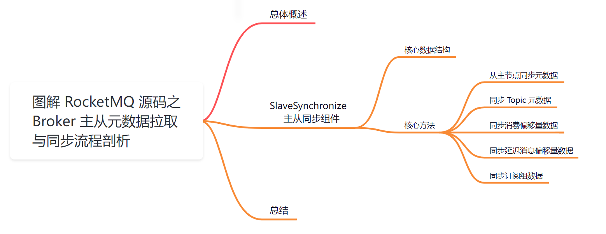
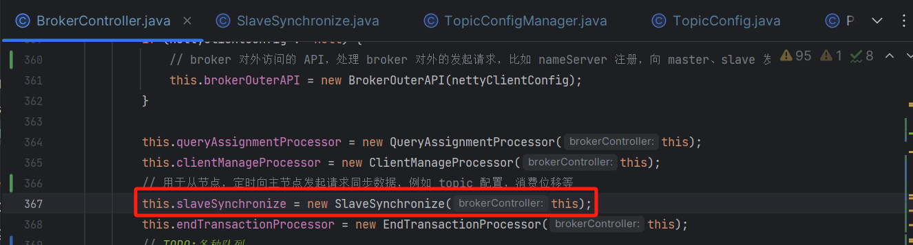
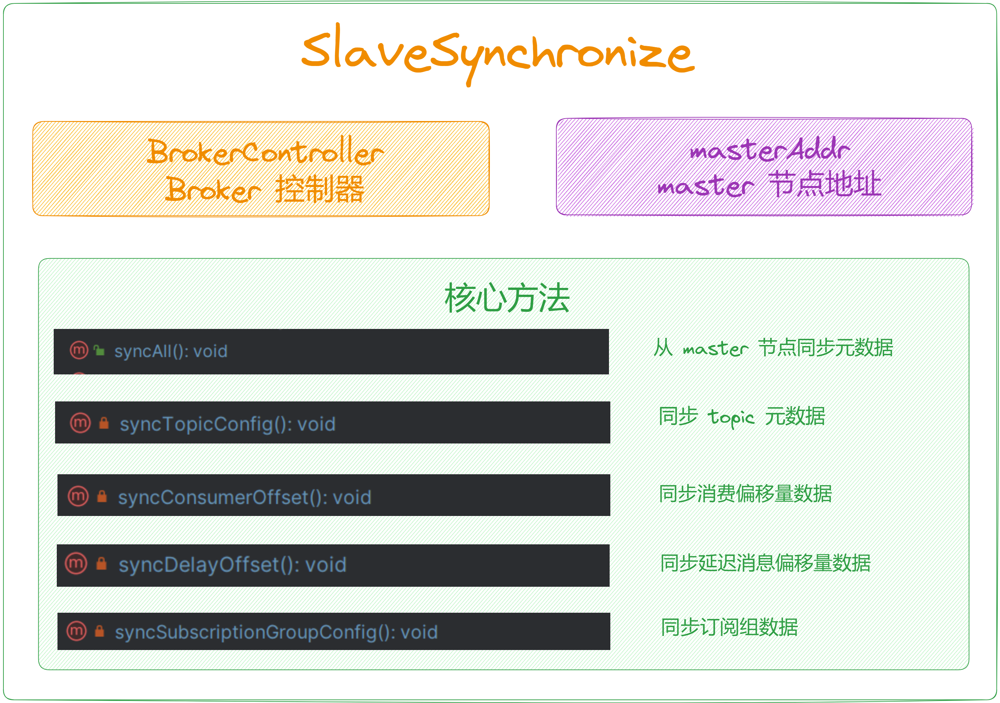
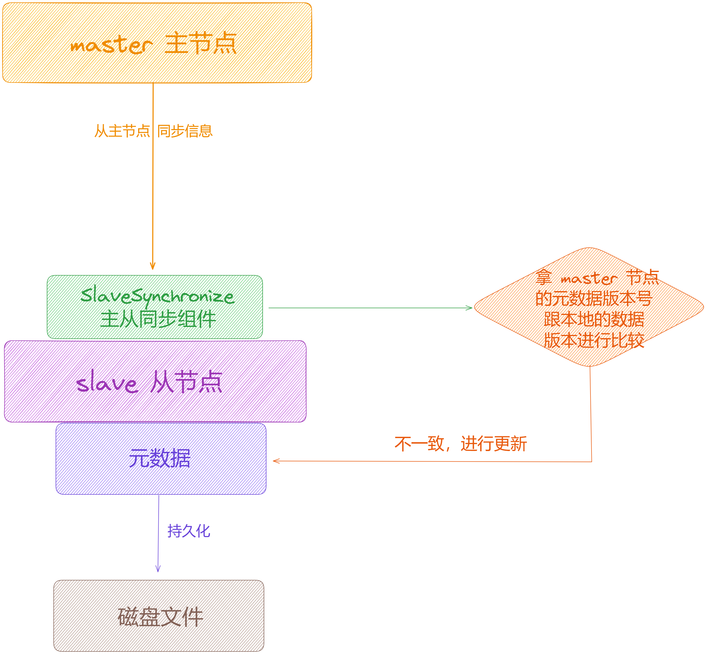

大家好，我是**华仔**, 又跟大家见面了。

从今天开始我将继续为大家奉上 RocketMQ 消费者源码剖析系列文章，正式开启「**RocketMQ 的服务端 Broker 源码之旅**」，这是第四篇，本篇我们将以「**RocketMQ 5.1.2**」版本为主，来剖析下 RocketMQ 源码之 Broker 主从元数据拉取与同步流程剖析。

这里我将以「**RocketMQ 5.1.2**」版本为主，通过「**场景驱动**」的方式带大家一点点的对 RocketMQ 源码进行深度剖析，正式开启「**RocketMQ 的源码之旅**」，跟我一起来掌握 RocketMQ 源码核心架构设计思想吧。

  

## **01 总体概述**

[在 BrokerController 构造方法](https://articles.zsxq.com/id_chxqzhg8psk4.html)里面创建了很多「**管理器**」、「**处理器**」、「**线程队列**」等，跟本文有关系的就是下面这个组件，主要用来从主节点拉取 Topic 元数据，消费偏移量，延迟消息偏移量，订阅组数据等。

今天我们就来重点剖析下这个组件。

## **02 SlaveSynchronize 主从同步组件**

这个组件主要是在「**主从架构**」模式下，从节点来使用的，主要负责从「**主节点**」拉取元数据信息「**Topic 元数据**」、「**消费偏移量数据**」、「**延迟消息偏移量数据**」、「**订阅消费组数据**」等，然后和「**本地元数据**」进行比较，如果不一样就「**更新本地元数据**」，且「**持久化**」到磁盘文件。

源码位置：[https://github.com/apache/rocketmq/blob/release-5.1.2/broker/src/main/java/org/apache/rocketmq/broker/](https://github.com/apache/rocketmq/blob/release-5.1.2/broker/src/main/java/org/apache/rocketmq/broker/slave/SlaveSynchronize.java)[slave/SlaveSynchronize](https://github.com/apache/rocketmq/blob/release-5.1.2/broker/src/main/java/org/apache/rocketmq/broker/slave/SlaveSynchronize.java)[.java](https://github.com/apache/rocketmq/blob/release-5.1.2/broker/src/main/java/org/apache/rocketmq/broker/slave/SlaveSynchronize.java)

## **2.1 核心数据结构**

/\*\*

\* 主从同步组件，从主节点拉取Topic元数据，消费偏移量，延迟消息偏移量，订阅组数据

\*/

public class SlaveSynchronize {

private static final Logger LOGGER \= LoggerFactory.getLogger(LoggerName.BROKER\_LOGGER\_NAME);

private final BrokerController brokerController;

// master 节点地址

private volatile String masterAddr \= null;

public SlaveSynchronize(BrokerController brokerController) {

this.brokerController = brokerController;

}

....

}

## **2.2 核心方法**

主要方法就一个，[syncAll()](http://syncall\(\)/) 从主节点同步元数据。都比较简单，这里就过一下有个记忆就行，后续用到再深度剖析。

### **2.2.1 从主节点同步元数据**

// 从主节点同步信息

public void syncAll() {

// 同步 Topic 元数据

this.syncTopicConfig();

// 同步消费偏移量数据

this.syncConsumerOffset();

// 同步延迟消息偏移量数据

this.syncDelayOffset();

// 同步订阅组数据

this.syncSubscriptionGroupConfig();

this.syncMessageRequestMode();

// 开启时间轮

if (brokerController.getMessageStoreConfig().isTimerWheelEnable()) {

this.syncTimerMetrics();

}

}

### **2.2.2 同步 Topic 元数据**

// 同步 topic 元数据

private void syncTopicConfig() {

// 定义一个备份地址

String masterAddrBak \= this.masterAddr;

// master 节点地址不能等于当前节点，只有 slave 节点才需要从 master 节点拉取 Topic 元数据

if (masterAddrBak != null && !masterAddrBak.equals(brokerController.getBrokerAddr())) {

try {

// 作为 slave 节点，从 master 节点去发送请求查询获取到一份 Topic 元数据

TopicConfigAndMappingSerializeWrapper topicWrapper \=

this.brokerController.getBrokerOuterAPI().getAllTopicConfig(masterAddrBak);

// 从 master 节点拉取 Topic 元数据，和本地的 Slave 节点的 Topic 元数据的 DataVersion 进行对比

// 如果不相等，则更新 slave 节点本地 Topic 元数据版本号，且持久化到磁盘文件

if (!this.brokerController.getTopicConfigManager().getDataVersion()

.equals(topicWrapper.getDataVersion())) {

// 更新 slave 节点本地的 Topic 元数据版本号

this.brokerController.getTopicConfigManager().getDataVersion()

.assignNewOne(topicWrapper.getDataVersion());

// 获取 master 节点的 Topic 元数据

ConcurrentMap<String, TopicConfig> newTopicConfigTable = topicWrapper.getTopicConfigTable();

//delete

// 获取 slave 节点本地的 Topic 元数据

ConcurrentMap<String, TopicConfig> topicConfigTable = this.brokerController.getTopicConfigManager().getTopicConfigTable();

for (Iterator<Map.Entry<String, TopicConfig>> it = topicConfigTable.entrySet().iterator(); it.hasNext(); ) {

Map.Entry<String, TopicConfig> item = it.next();

// 移除 slave 节点本地不存在的元素，保持一致性

if (!newTopicConfigTable.containsKey(item.getKey())) {

it.remove();

}

}

//update

// 更新 slave 节点本地的 Topic 元数据

topicConfigTable.putAll(newTopicConfigTable);

// 持久化数据到本地磁盘

this.brokerController.getTopicConfigManager().persist();

}

// 下面的处理逻辑类似 这块是处理 Topic 队列映射关系

if (topicWrapper.getTopicQueueMappingDetailMap() != null

&& !topicWrapper.getMappingDataVersion().equals(this.brokerController.getTopicQueueMappingManager().getDataVersion())) {

this.brokerController.getTopicQueueMappingManager().getDataVersion()

.assignNewOne(topicWrapper.getMappingDataVersion());

ConcurrentMap<String, TopicConfig> newTopicConfigTable = topicWrapper.getTopicConfigTable();

//delete

ConcurrentMap<String, TopicConfig> topicConfigTable = this.brokerController.getTopicConfigManager().getTopicConfigTable();

for (Iterator<Map.Entry<String, TopicConfig>> it = topicConfigTable.entrySet().iterator(); it.hasNext(); ) {

Map.Entry<String, TopicConfig> item = it.next();

if (!newTopicConfigTable.containsKey(item.getKey())) {

it.remove();

}

}

//update

topicConfigTable.putAll(newTopicConfigTable);

this.brokerController.getTopicQueueMappingManager().persist();

}

LOGGER.info("Update slave topic config from master, {}", masterAddrBak);

} catch (Exception e) {

LOGGER.error("SyncTopicConfig Exception, {}", masterAddrBak, e);

}

}

}

### **2.2.3 同步消费偏移量数据**

// 同步消费偏移量数据

private void syncConsumerOffset() {

// 定义一个备份地址

String masterAddrBak \= this.masterAddr;

// master 节点地址不能等于当前节点，只有 slave 节点才需要从 master 节点拉取消费偏移量数据

if (masterAddrBak != null && !masterAddrBak.equals(brokerController.getBrokerAddr())) {

try {

// 向 master 节点发送请求获取消费偏移量进度信息

ConsumerOffsetSerializeWrapper offsetWrapper \=

this.brokerController.getBrokerOuterAPI().getAllConsumerOffset(masterAddrBak);

// 将获取到的消费偏移量数据写入到 slave 节点本地的

this.brokerController.getConsumerOffsetManager().getOffsetTable()

.putAll(offsetWrapper.getOffsetTable());

// 更新 slave 节点本地的消费偏移量版本号

this.brokerController.getConsumerOffsetManager().getDataVersion().assignNewOne(offsetWrapper.getDataVersion());

// 将获取到的消费偏移量进度数据进行持久化

this.brokerController.getConsumerOffsetManager().persist();

LOGGER.info("Update slave consumer offset from master, {}", masterAddrBak);

} catch (Exception e) {

LOGGER.error("SyncConsumerOffset Exception, {}", masterAddrBak, e);

}

}

}

### **2.2.4 同步延迟消息偏移量数据**

// 同步延迟消息偏移量数据

private void syncDelayOffset() {

// 定义一个备份地址

String masterAddrBak \= this.masterAddr;

// master 节点地址不能等于当前节点，只有 slave 节点才需要从 master 节点拉取消费偏移量数据

if (masterAddrBak != null && !masterAddrBak.equals(brokerController.getBrokerAddr())) {

try {

// 向 master 节点发送请求获取延迟消费偏移量进度信息

String delayOffset \=

this.brokerController.getBrokerOuterAPI().getAllDelayOffset(masterAddrBak);

if (delayOffset != null) {

// 获取磁盘文件名称

String fileName \=

StorePathConfigHelper.getDelayOffsetStorePath(this.brokerController

.getMessageStoreConfig().getStorePathRootDir());

try {

// 持久化到磁盘

MixAll.string2File(delayOffset, fileName);

// 启动调度服务进行加载

this.brokerController.getScheduleMessageService().load();

} catch (IOException e) {

LOGGER.error("Persist file Exception, {}", fileName, e);

}

}

LOGGER.info("Update slave delay offset from master, {}", masterAddrBak);

} catch (Exception e) {

LOGGER.error("SyncDelayOffset Exception, {}", masterAddrBak, e);

}

}

}

### **2.2.5 同步订阅组数据**

// 同步订阅组数据

private void syncSubscriptionGroupConfig() {

// 定义一个备份地址

String masterAddrBak \= this.masterAddr;

// master 节点地址不能等于当前节点，只有 slave 节点才需要从 master 节点拉取消费偏移量数据

if (masterAddrBak != null && !masterAddrBak.equals(brokerController.getBrokerAddr())) {

try {

// 向 master 节点发送请求获取消费订阅组数据信息

SubscriptionGroupWrapper subscriptionWrapper =

this.brokerController.getBrokerOuterAPI()

.getAllSubscriptionGroupConfig(masterAddrBak);

// 从 master 节点拉取订阅组数据，和本地的 Slave 节点的订阅组数据的 DataVersion 进行对比

// 如果不相等，则更新 slave 节点本地订阅组数据版本号，且持久化到磁盘文件

if (!this.brokerController.getSubscriptionGroupManager().getDataVersion()

.equals(subscriptionWrapper.getDataVersion())) {

// slave 节点本地的订阅组管理器

SubscriptionGroupManager subscriptionGroupManager =

this.brokerController.getSubscriptionGroupManager();

// 更新 slave 节点本地的订阅组版本号

subscriptionGroupManager.getDataVersion().assignNewOne(

subscriptionWrapper.getDataVersion());

// 清理 slave 节点本地的订阅组数据

subscriptionGroupManager.getSubscriptionGroupTable().clear();

// 将 master 节点获取到的订阅组数据写入到 slava 节点的订阅组数据表中

subscriptionGroupManager.getSubscriptionGroupTable().putAll(

subscriptionWrapper.getSubscriptionGroupTable());

// 持久化到磁盘文件

subscriptionGroupManager.persist();

LOGGER.info("Update slave Subscription Group from master, {}", masterAddrBak);

}

} catch (Exception e) {

LOGGER.error("SyncSubscriptionGroup Exception, {}", masterAddrBak, e);

}

}

}

## **03 总结**

本篇主要剖析了 [BrokerController](http://brokercontroller%20/) 初始化时中用到的主从同步组件 「**SlaveSynchronize**」，主要负责从「**主节点**」拉取元数据信息「**Topic 元数据**」、「**消费偏移量数据**」、「**延迟消息偏移量数据**」、「**订阅消费组数据**」等，然后和「**本地元数据**」进行比较，如果不一样就「**更新本地元数据**」，且「**持久化**」到磁盘文件。

示意图如下：

