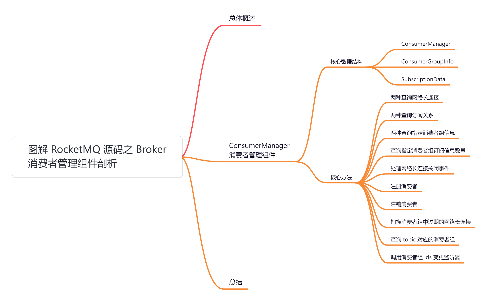
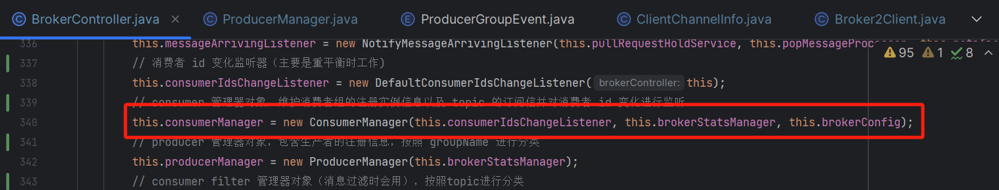
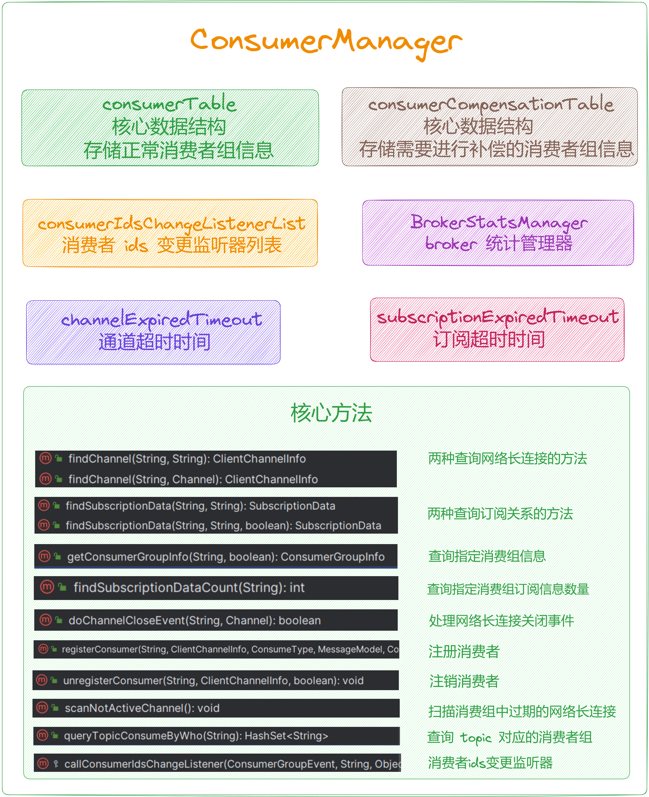
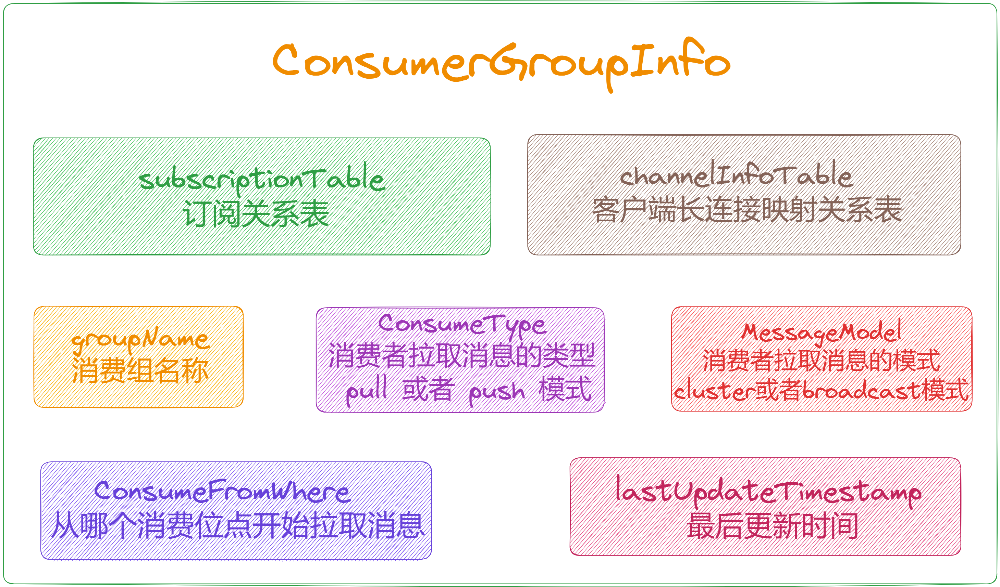
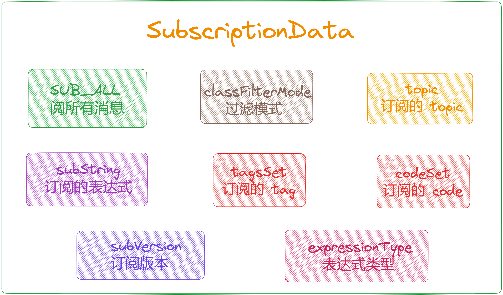
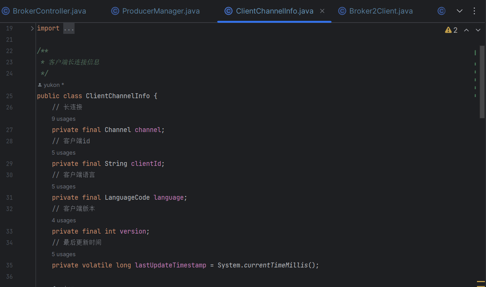
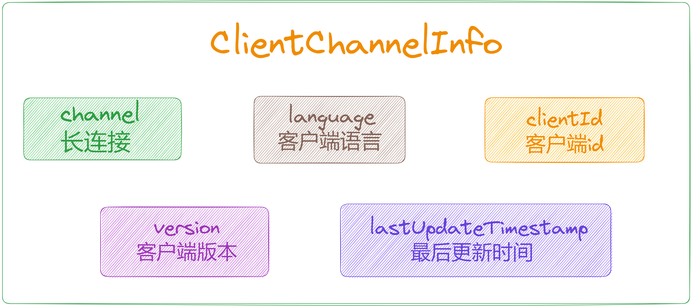
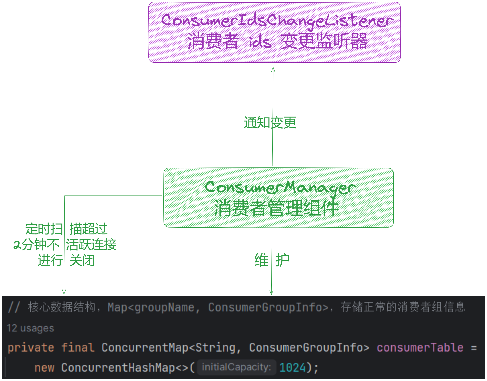

大家好，我是**华仔**, 又跟大家见面了。

从今天开始我将继续为大家奉上 RocketMQ 消费者源码剖析系列文章，正式开启「**RocketMQ 的服务端 Broker 源码之旅**」，这是第七篇，本篇我们将以「**RocketMQ 5.1.2**」版本为主，来剖析下 RocketMQ 源码之 Broker 消费者管理组件剖析。

这里我将以「**RocketMQ 5.1.2**」版本为主，通过「**场景驱动**」的方式带大家一点点的对 RocketMQ 源码进行深度剖析，正式开启「**RocketMQ 的源码之旅**」，跟我一起来掌握 RocketMQ 源码核心架构设计思想吧。

  

## **01 总体概述**

[在 BrokerController 构造方法](https://articles.zsxq.com/id_chxqzhg8psk4.html)里面创建了很多「**管理器**」、「**处理器**」、「**线程队列**」等，跟本文有关系的就是下面这个组件，主要负责管理「**消费者连接**」，在内存中维护了所有消费者相关的消费组到 topic 订阅关系，并且在网络连接发生变化「**注册**」、「**下线**」、「**关闭**」、「**消费者扩缩容**」时，会「**同步维护内存信息**」，且通知到消费组内所有消费者。

今天我们就来重点剖析下这个组件。

## **02 ConsumerManager**

源码位置：[https://github.com/apache/rocketmq/blob/release-5.1.2/broker/src/main/java/org/apache/rocketmq/broker/client/](https://github.com/apache/rocketmq/blob/release-5.1.2/broker/src/main/java/org/apache/rocketmq/broker/client/ConsumerManager.java)[ConsumerManager](https://github.com/apache/rocketmq/blob/release-5.1.2/broker/src/main/java/org/apache/rocketmq/broker/client/ConsumerManager.java)[.java](https://github.com/apache/rocketmq/blob/release-5.1.2/broker/src/main/java/org/apache/rocketmq/broker/client/ConsumerManager.java)

## **2.1 核心数据结构**

/\*\*

\* 消费者管理组件

\*/

public class ConsumerManager {

private static final Logger LOGGER \= LoggerFactory.getLogger(LoggerName.BROKER\_LOGGER\_NAME);

// 核心数据结构，Map<groupName, ConsumerGroupInfo>，存储正常的消费者组信息

private final ConcurrentMap<String, ConsumerGroupInfo> consumerTable =

new ConcurrentHashMap<>(1024);

// 核心数据结构，Map<groupName, ConsumerGroupInfo>，存储需要进行补偿的消费者组信息

private final ConcurrentMap<String, ConsumerGroupInfo> consumerCompensationTable =

new ConcurrentHashMap<>(1024);

// 消费者 ids 变更监听器列表

private final List<ConsumerIdsChangeListener> consumerIdsChangeListenerList = new CopyOnWriteArrayList<>();

// broker 统计管理器

protected final BrokerStatsManager brokerStatsManager;

// 通道超时时间

private final long channelExpiredTimeout;

// 订阅超时时间

private final long subscriptionExpiredTimeout;

public ConsumerManager(final ConsumerIdsChangeListener consumerIdsChangeListener,

final BrokerStatsManager brokerStatsManager, BrokerConfig brokerConfig) {

this.consumerIdsChangeListenerList.add(consumerIdsChangeListener);

this.brokerStatsManager = brokerStatsManager;

this.channelExpiredTimeout = brokerConfig.getChannelExpiredTimeout();

this.subscriptionExpiredTimeout = brokerConfig.getSubscriptionExpiredTimeout();

}

....

}

  

再来深入看下 [ConsumerGroupInfo](http://consumergroupinfo/) 的数据结构，比较重要的是：

1.  Map<topic, SubscriptionData> ：topic与topic订阅关系映射元数据。
2.  Map<长连接, 客户端长连接信息> ：网络通信长连接元数据。

源码位置：[https://github.com/apache/rocketmq/blob/release-5.1.2/broker/src/main/java/org/apache/rocketmq/broker/client/](https://github.com/apache/rocketmq/blob/release-5.1.2/broker/src/main/java/org/apache/rocketmq/broker/client/ConsumerGroupInfo.java)[ConsumerGroupInfo](https://github.com/apache/rocketmq/blob/release-5.1.2/broker/src/main/java/org/apache/rocketmq/broker/client/ConsumerGroupInfo.java)[.java](https://github.com/apache/rocketmq/blob/release-5.1.2/broker/src/main/java/org/apache/rocketmq/broker/client/ConsumerGroupInfo.java)

/\*\*

\* 核心数据结构：消费者组信息

\*/

public class ConsumerGroupInfo {

private static final Logger log \= LoggerFactory.getLogger(LoggerName.BROKER\_LOGGER\_NAME);

// 消费组名称

private final String groupName;

// 订阅关系表

private final ConcurrentMap<String/\* Topic \*/, SubscriptionData> subscriptionTable =

new ConcurrentHashMap<>();

// 客户端长连接映射关系表

private final ConcurrentMap<Channel, ClientChannelInfo> channelInfoTable =

new ConcurrentHashMap<>(16);

// 消费者拉取消息的类型 pull 或者 push 模式

private volatile ConsumeType consumeType;

// 消费者拉取消息的模式 cluster 或者 broadcast 模式

private volatile MessageModel messageModel;

// 消费者从哪里拉取消息，从哪个消费位点开始拉取消息

private volatile ConsumeFromWhere consumeFromWhere;

// 最后更新时间

private volatile long lastUpdateTimestamp \= System.currentTimeMillis();

....

}

接着来深入看下 [SubscriptionData](http://subscriptiondata/) 数据结构：包含了所有订阅相关的信息，包括「**订阅表达式**」、「**订阅 Tag**」、「**订阅 code**」、「**订阅版本**」 等。

/\*\*

\* 核心数据结构：订阅关系信息

\* 包含了所有订阅相关的信息，包括订阅表达式、订阅 tag 等

\*/

public class SubscriptionData implements Comparable<SubscriptionData> {

// 这里 \* 代表订阅所有消息

public final static String SUB\_ALL \= "\*";

// 过滤模式

private boolean classFilterMode \= false;

// 订阅的 topic

private String topic;

// 订阅的表达式

private String subString;

// 订阅的 tag

private Set<String> tagsSet = new HashSet<>();

// 订阅的 code

private Set<Integer> codeSet = new HashSet<>();

// 订阅版本

private long subVersion \= System.currentTimeMillis();

// 表达式类型

private String expressionType \= ExpressionType.TAG;

....

}

最后再来深入看下 [ClientChannelInfo](http://clientchannelinfo%20/) 客户端长连接信息的数据结构：包含了「**客户端id**」、「**版本**」、「**网络通信长连接**」等网络通信元数据信息。

## **2.2 核心方法**

其核心方法比较简单，主要是对内存数据结构的维护，同时也会调用 [ConsumerIdsChangeListener](http://consumeridschangelistener%20/) 监听器，通知相关组件变更事件，我们分别来看下。

### **2.2.1 两种查询网络长连接**

// 查询指定消费组指定客户端id的网络长连接

public ClientChannelInfo findChannel(final String group, final String clientId) {

// 根据指定消费者组获取对应详情信息

ConsumerGroupInfo consumerGroupInfo \= this.consumerTable.get(group);

if (consumerGroupInfo != null) {

// 再从详情信息中通过客户端id获取对应的网络长连接

return consumerGroupInfo.findChannel(clientId);

}

return null;

}

// 查询指定消费组指定客户端长连接对应的网络长连接

public ClientChannelInfo findChannel(final String group, final Channel channel) {

// 根据指定消费者组获取对应详情信息

ConsumerGroupInfo consumerGroupInfo \= this.consumerTable.get(group);

if (consumerGroupInfo != null) {

// 再从详情信息中通过客户端长连接获取对应的网络长连接

return consumerGroupInfo.findChannel(channel);

}

return null;

}

### **2.2.2 两种查询订阅关系**

// 查询指定消费组指定主题的订阅信息

public SubscriptionData findSubscriptionData(final String group, final String topic) {

// 如果为空，则从补偿的消费组组信息中获取

return findSubscriptionData(group, topic, true);

}

// 查询指定消费组指定主题的订阅信息

public SubscriptionData findSubscriptionData(final String group, final String topic,

boolean fromCompensationTable) {

// 获取消费者组信息

ConsumerGroupInfo consumerGroupInfo \= getConsumerGroupInfo(group, false);

if (consumerGroupInfo != null) {

// 获取订阅关系

SubscriptionData subscriptionData \= consumerGroupInfo.findSubscriptionData(topic);

if (subscriptionData != null) {

return subscriptionData;

}

}

// 如果消费者组信息为空 && fromCompensationTable 为 true

if (fromCompensationTable) {

// 从补偿的消费组组信息中获取

ConsumerGroupInfo consumerGroupCompensationInfo \= consumerCompensationTable.get(group);

if (consumerGroupCompensationInfo != null) {

// 获取订阅关系

return consumerGroupCompensationInfo.findSubscriptionData(topic);

}

}

return null;

}

// ConsumerGroupInfo 类方法

public SubscriptionData findSubscriptionData(final String topic) {

return this.subscriptionTable.get(topic);

}

### **2.2.3 两种查询指定消费者组信息**

// 查询指定消费组信息

public ConsumerGroupInfo getConsumerGroupInfo(final String group) {

return getConsumerGroupInfo(group, false);

}

// 查询指定消费组信息

public ConsumerGroupInfo getConsumerGroupInfo(String group, boolean fromCompensationTable) {

// 先从 consumerTable 中进行获取

ConsumerGroupInfo consumerGroupInfo \= consumerTable.get(group);

// 如果为空 && fromCompensationTable 为 true

if (consumerGroupInfo == null && fromCompensationTable) {

// 从补偿的消费组组信息中获取

consumerGroupInfo = consumerCompensationTable.get(group);

}

return consumerGroupInfo;

}

### **2.2.4 查询指定消费者组订阅信息数量**

// 查询指定消费者组订阅信息数量

public int findSubscriptionDataCount(final String group) {

// 查询指定消费组信息

ConsumerGroupInfo consumerGroupInfo \= this.getConsumerGroupInfo(group);

if (consumerGroupInfo != null) {

// 查询对应订阅关系的数量

return consumerGroupInfo.getSubscriptionTable().size();

}

return 0;

}

### **2.2.5 处理网络长连接关闭事件**

public boolean doChannelCloseEvent(final String remoteAddr, final Channel channel) {

boolean removed \= false;

// 遍历 consumerTable 元素

Iterator<Entry<String, ConsumerGroupInfo>> it = this.consumerTable.entrySet().iterator();

while (it.hasNext()) {

Entry<String, ConsumerGroupInfo> next = it.next();

ConsumerGroupInfo info \= next.getValue();

// 处理网络长连接关闭事件，删除内存中的长连接

ClientChannelInfo clientChannelInfo \= info.doChannelCloseEvent(remoteAddr, channel);

if (clientChannelInfo != null) {

callConsumerIdsChangeListener(ConsumerGroupEvent.CLIENT\_UNREGISTER, next.getKey(), clientChannelInfo, info.getSubscribeTopics());

if (info.getChannelInfoTable().isEmpty()) {

// 如果当前消费组没有任何网络长连接，则删除消费组

ConsumerGroupInfo remove \= this.consumerTable.remove(next.getKey());

if (remove != null) {

LOGGER.info("unregister consumer ok, no any connection, and remove consumer group, {}",

next.getKey());

// 通知消费组信息变更，事件为：注销消费者组

callConsumerIdsChangeListener(ConsumerGroupEvent.UNREGISTER, next.getKey());

}

}

// 通知消费组信息变更，事件为：消费者组成员变更

callConsumerIdsChangeListener(ConsumerGroupEvent.CHANGE, next.getKey(), info.getAllChannel());

}

}

return removed;

}

// ConsumerGroupInfo 类方法

public ClientChannelInfo doChannelCloseEvent(final String remoteAddr, final Channel channel) {

// 直接删除 channelInfoTable 中对应 channel 的信息

final ClientChannelInfo info \= this.channelInfoTable.remove(channel);

if (info != null) {

log.warn(

"NETTY EVENT: remove not active channel\[{}\] from ConsumerGroupInfo groupChannelTable, consumer group: {}",

info.toString(), groupName);

}

return info;

}

### **2.2.6 注册消费者**

// 注册消费者

public boolean registerConsumer(final String group, final ClientChannelInfo clientChannelInfo,

ConsumeType consumeType, MessageModel messageModel, ConsumeFromWhere consumeFromWhere,

final Set<SubscriptionData> subList, boolean isNotifyConsumerIdsChangedEnable) {

return registerConsumer(group, clientChannelInfo, consumeType, messageModel, consumeFromWhere, subList,

isNotifyConsumerIdsChangedEnable, true);

}

// 注册消费者

public boolean registerConsumer(final String group, final ClientChannelInfo clientChannelInfo,

ConsumeType consumeType, MessageModel messageModel, ConsumeFromWhere consumeFromWhere,

final Set<SubscriptionData> subList, boolean isNotifyConsumerIdsChangedEnable, boolean updateSubscription) {

long start \= System.currentTimeMillis();

// 获取消费者组信息

ConsumerGroupInfo consumerGroupInfo \= this.consumerTable.get(group);

if (null == consumerGroupInfo) {

// 通知消费组信息变更，事件为：消费者组成员注册

callConsumerIdsChangeListener(ConsumerGroupEvent.CLIENT\_REGISTER, group, clientChannelInfo,

subList.stream().map(SubscriptionData::getTopic).collect(Collectors.toSet()));

ConsumerGroupInfo tmp \= new ConsumerGroupInfo(group, consumeType, messageModel, consumeFromWhere);

ConsumerGroupInfo prev \= this.consumerTable.putIfAbsent(group, tmp);

consumerGroupInfo = prev != null ? prev : tmp;

}

// 更新客户端长连接信息

boolean r1 \=

consumerGroupInfo.updateChannel(clientChannelInfo, consumeType, messageModel,

consumeFromWhere);

boolean r2 \= false;

if (updateSubscription) {

// 更新消费组订阅信息

r2 = consumerGroupInfo.updateSubscription(subList);

}

if (r1 || r2) {

// 是否通知变更

if (isNotifyConsumerIdsChangedEnable) {

// 通知其他消费者，消费者组成员变更

callConsumerIdsChangeListener(ConsumerGroupEvent.CHANGE, group, consumerGroupInfo.getAllChannel());

}

}

if (null != this.brokerStatsManager) {

//

this.brokerStatsManager.incConsumerRegisterTime((int) (System.currentTimeMillis() - start));

}

// 通知消费组信息变更，更新 ConsumerFilterManager 订阅信息

callConsumerIdsChangeListener(ConsumerGroupEvent.REGISTER, group, subList, clientChannelInfo);

return r1 || r2;

}

### **2.2.7 注销消费者**

// 注销消费者，与注册逻辑类似

public void unregisterConsumer(final String group, final ClientChannelInfo clientChannelInfo,

boolean isNotifyConsumerIdsChangedEnable) {

// 获取消费者组信息

ConsumerGroupInfo consumerGroupInfo \= this.consumerTable.get(group);

if (null != consumerGroupInfo) {

// 先移除 channelInfoTable 对应 channel 信息

boolean removed \= consumerGroupInfo.unregisterChannel(clientChannelInfo);

if (removed) {

// 移除成功后，通知消费组信息变更，事件为：注销消费者

callConsumerIdsChangeListener(ConsumerGroupEvent.CLIENT\_UNREGISTER, group, clientChannelInfo, consumerGroupInfo.getSubscribeTopics());

}

// 如果已经全部移除

if (consumerGroupInfo.getChannelInfoTable().isEmpty()) {

// 则将 consumerTable 中移除整个 group

ConsumerGroupInfo remove \= this.consumerTable.remove(group);

if (remove != null) {

LOGGER.info("unregister consumer ok, no any connection, and remove consumer group, {}", group);

// 移除成功后，通知消费组信息变更，事件为：注销消费者组

callConsumerIdsChangeListener(ConsumerGroupEvent.UNREGISTER, group);

}

}

// 是否通知消费者 ids 变更

if (isNotifyConsumerIdsChangedEnable) {

// 通知消费组信息变更，事件为：消费者组成员变更

callConsumerIdsChangeListener(ConsumerGroupEvent.CHANGE, group, consumerGroupInfo.getAllChannel());

}

}

}

// ConsumerGroupInfo 类方法

public boolean unregisterChannel(final ClientChannelInfo clientChannelInfo) {

// 移除 channelInfoTable 对应 channel 信息

ClientChannelInfo old \= this.channelInfoTable.remove(clientChannelInfo.getChannel());

if (old != null) {

log.info("unregister a consumer\[{}\] from consumerGroupInfo {}", this.groupName, old.toString());

return true;

}

return false;

}

### **2.2.8 扫描消费者组中过期的网络长连接**

// 扫描消费组中过期的网络长连接

public void scanNotActiveChannel() {

// 遍历 consumerTable 元素

Iterator<Entry<String, ConsumerGroupInfo>> it = this.consumerTable.entrySet().iterator();

while (it.hasNext()) {

Entry<String, ConsumerGroupInfo> next = it.next();

String group \= next.getKey();

ConsumerGroupInfo consumerGroupInfo \= next.getValue();

ConcurrentMap<Channel, ClientChannelInfo> channelInfoTable =

consumerGroupInfo.getChannelInfoTable();

// 遍历 channelInfoTable 元素

Iterator<Entry<Channel, ClientChannelInfo>> itChannel = channelInfoTable.entrySet().iterator();

while (itChannel.hasNext()) {

Entry<Channel, ClientChannelInfo> nextChannel = itChannel.next();

ClientChannelInfo clientChannelInfo \= nextChannel.getValue();

// 遍历所有消费组长连接信息，判断是否过期

long diff \= System.currentTimeMillis() - clientChannelInfo.getLastUpdateTimestamp();

if (diff > channelExpiredTimeout) {

LOGGER.warn(

"SCAN: remove expired channel from ConsumerManager consumerTable. channel={}, consumerGroup={}",

RemotingHelper.parseChannelRemoteAddr(clientChannelInfo.getChannel()), group);

// 通知消费组信息变更，事件为：注销消费者

callConsumerIdsChangeListener(ConsumerGroupEvent.CLIENT\_UNREGISTER, group, clientChannelInfo, consumerGroupInfo.getSubscribeTopics());

// 如果长连接过期，就关闭长连接，然后删除内存中的引用

RemotingHelper.closeChannel(clientChannelInfo.getChannel());

// 移除过期长连接

itChannel.remove();

}

}

// 整个 channelInfoTable 被移除后

if (channelInfoTable.isEmpty()) {

LOGGER.warn(

"SCAN: remove expired channel from ConsumerManager consumerTable, all clear, consumerGroup={}",

group);

// 移除整个消费者组

it.remove();

}

}

// 删除过期消费者组信息

removeExpireConsumerGroupInfo();

}

public void removeExpireConsumerGroupInfo() {

// 用于存储需要移除的消费者组的列表

List<String> removeList = new ArrayList<>();

// 遍历consumerCompensationTable中的消费者组信息

consumerCompensationTable.forEach((group,consumerGroupInfo) -> {

// 用于存储需要移除的主题的列表

List<String> removeTopicList = new ArrayList<>();

// 获取当前消费者组的订阅信息

ConcurrentMap<String,SubscriptionData> subscriptionTable = consumerGroupInfo.getSubscriptionTable();

// 遍历订阅信息中的主题

subscriptionTable.forEach((topic,subscriptionData) -> {

// 计算主题的订阅时间与当前时间的差值

long diff \= System.currentTimeMillis() - subscriptionData.getSubVersion();

// 如果差值大于订阅过期时间，则将该主题加入removeTopicList

if (diff > subscriptionExpiredTimeout) {

removeTopicList.add(topic);

}

});

// 移除过期的主题信息，并将空的消费者组加入removeList

for (String topic :removeTopicList) {

subscriptionTable.remove(topic);

if (subscriptionTable.isEmpty()) {

removeList.add(group);

}

}

});

// 移除空的消费者组

for (String group :removeList) {

consumerCompensationTable.remove(group);

}

}

### **2.2.9 查询 topic 对应的消费者组**

// 查询 topic 对应的消费者组

public HashSet<String> queryTopicConsumeByWho(final String topic) {

// 创建一个HashSet用于存储消费者组

HashSet<String> groups = new HashSet<>();

// 获取consumerTable的迭代器

Iterator<Entry<String,ConsumerGroupInfo>> it = this.consumerTable.entrySet().iterator();

// 遍历consumerTable中的每个消费者组

while (it.hasNext()) {

Entry<String,ConsumerGroupInfo> entry = it.next();

// 获取当前消费者组的订阅信息

ConcurrentMap<String,SubscriptionData> subscriptionTable = entry.getValue().getSubscriptionTable();

// 如果订阅信息中包含指定主题，将消费者组名称加入到groups中

if (subscriptionTable.containsKey(topic)) {

groups.add(entry.getKey());

}

}

// 返回订阅了指定主题的消费者组集合

return groups;

}

### **2.2.10 调用消费者 ids 变更监听器**

/\*\*

\* 调用消费者 ids 变更监听器

\* @param event

\* @param group

\* @param args

\*/

protected void callConsumerIdsChangeListener(ConsumerGroupEvent event, String group, Object... args) {

for (ConsumerIdsChangeListener listener : consumerIdsChangeListenerList) {

try {

// 调用其 handle 进行事件处理

listener.handle(event, group, args);

} catch (Throwable t) {

LOGGER.error("err when call consumerIdsChangeListener", t);

}

}

}

## **03 总结**

本篇主要剖析了 [BrokerController](http://brokercontroller%20/) 初始化时中用到的 「**ConsumerManager**」，主要负责管理「**消费者连接**」，在内存中维护了所有消费者相关的消费组到 topic 订阅关系，并且在网络连接发生变化「**注册**」、「**下线**」、「**关闭**」、「**消费者扩缩容**」时，会「**同步维护内存信息**」，且通知到消费组内所有消费者。

示意图如下：

