大家好，我是**华仔**, 又跟大家见面了。

从今天开始我将继续为大家奉上 RocketMQ 消费者源码剖析系列文章，正式开启「**RocketMQ 的服务端 Broker 源码之旅**」，这是第三十一篇，本篇我们将以「**RocketMQ 5.1.2**」版本为主，来剖析下 RocketMQ 源码之 Broker 端整体流程剖析总结篇。

这里我将以「**RocketMQ 5.1.2**」版本为主，通过「**场景驱动**」的方式带大家一点点的对 RocketMQ 源码进行深度剖析，正式开启「**RocketMQ 的源码之旅**」，跟我一起来掌握 RocketMQ 源码核心架构设计思想吧。

##   
**01 总体概述**

通过「**场景驱动**」的方式，当消息发送到 Broker 端之后，RocketMQ Broker 服务端整个处理过程的源码进行了详细的剖析。

今天我们就来总结下这整个过程。

1.  Broker 服务端启动核心流程。
2.  Broker 服务端元数据核心流程。
3.  Broker 服务端各基础组件介绍。
4.  Broker 服务端是接收数据核心流程。
5.  Broker 服务端整个日志存储系统核心流程。
6.  Broker 服务端主从 HA 架构。
7.  Broker 服务端 DLedger 高可用及日志复制架构。
8.  Broker 服务端事务消息处理核心流程。
9.  Broker 服务端延迟消息实现机制。

## **02 Broker 服务端启动核心流程**

详情请点击 [【Broker 端源码分析系列第一篇】图解 RocketMQ 源码之 Broker 启动流程剖析](https://articles.zsxq.com/id_em1wtu9mb5u4.html) 、[【Broker 端源码分析系列第二篇】图解 RocketMQ 源码之 Broker 启动流程核心控制器组件剖析](https://articles.zsxq.com/id_chxqzhg8psk4.html)

[BrokerStartup](http://brokerstartup%20/) 的启动初始化流程：

  
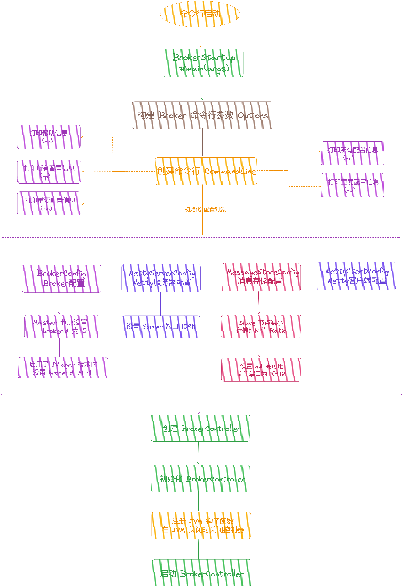

[BrokerController](http://brokercontroller%20/) 是整个 Broker 控制中心，其组成部分如下：

当「**Broker**」启动后，会强制向「**NameServer**」发送心跳包进行注册，并定时扫描「**非活跃 Broker**」。

## **03 Broker 服务端元数据核心流程**

详情请点击 [【Broker 端源码分析系列第三篇】图解 RocketMQ 源码之 Broker Topic 元数据管理组件剖析](https://articles.zsxq.com/id_sh0f2rz7jqor.html) 、[【Broker 端源码分析系列第四篇】图解 RocketMQ 源码之 Broker 主从元数据拉取与同步流程剖析](https://articles.zsxq.com/id_wnu9c1dgdbuq.html)

当 [BrokerController](http://brokercontroller%20/) 初始化时会进行配置管理器 「**TopicConfigManager**」初始化，它会「**持久化数据**」到磁盘，启动时也会从磁盘「**加载文件数据到**」内存。

  
整个交互示意图如下：

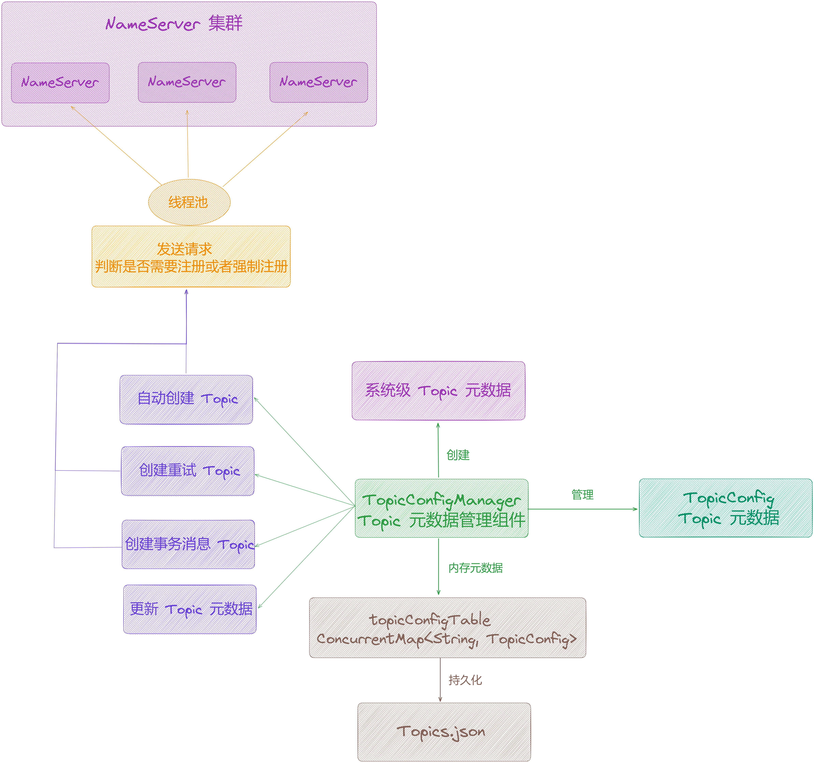

另外会启动主从同步组件 「**SlaveSynchronize**」，主要负责从「**主节点**」拉取元数据信息「**Topic 元数据**」、「**消费偏移量数据**」、「**延迟消息偏移量数据**」、「**订阅消费组数据**」等，然后和「**本地元数据**」进行比较，如果不一样就「**更新本地元数据**」，且「**持久化**」到磁盘文件。

整个交互示意图如下：

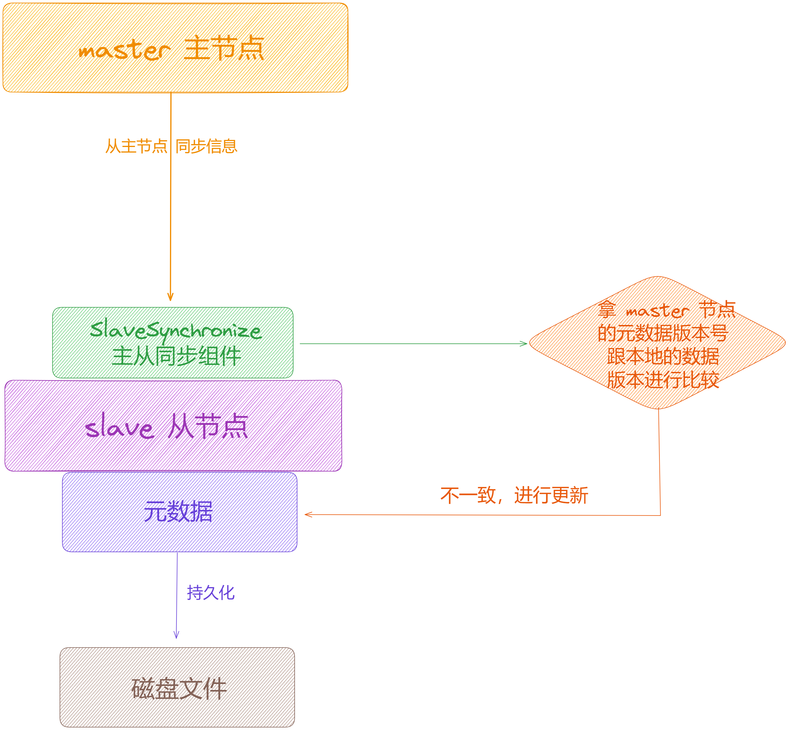

## **04 Broker 服务端各基础组件介绍**

在 BrokerController 构造函数中会初始化各种基础组件，如下：

public BrokerController(

final BrokerConfig brokerConfig,

final NettyServerConfig nettyServerConfig,

final NettyClientConfig nettyClientConfig,

final MessageStoreConfig messageStoreConfig

) {

// 通过构造器传递进来的配置信息对象

// broker 基本信息

this.brokerConfig = brokerConfig;

// 作为 netty 服务端与客户端交互的配置

this.nettyServerConfig = nettyServerConfig;

// 作为 netty 客户端与服务端交互的配置

this.nettyClientConfig = nettyClientConfig;

// 消息存储的配置

this.messageStoreConfig = messageStoreConfig;

// 设置默认数据存储地址就是 broker 自己的地址

this.setStoreHost(new InetSocketAddress(this.getBrokerConfig().getBrokerIP1(), getListenPort()));

// broker状态管理器，保存 broker 的运行状态

this.brokerStatsManager = messageStoreConfig.isEnableLmq() ? new LmqBrokerStatsManager(this.brokerConfig.getBrokerClusterName(), this.brokerConfig.isEnableDetailStat()) :

new BrokerStatsManager(this.brokerConfig.getBrokerClusterName(), this.brokerConfig.isEnableDetailStat());

// 消费者偏移量管理器，维护 offset 进度信息

this.consumerOffsetManager = messageStoreConfig.isEnableLmq() ? new LmqConsumerOffsetManager(this) : new ConsumerOffsetManager(this);

// 广播偏移量管理器

this.broadcastOffsetManager = new BroadcastOffsetManager(this);

// topic 配置管理器，管理 broker 中存储的所有 topic 的配置

this.topicConfigManager = messageStoreConfig.isEnableLmq() ? new LmqTopicConfigManager(this) : new TopicConfigManager(this);

// topic 队列映射管理器

this.topicQueueMappingManager = new TopicQueueMappingManager(this);

// 拉取消息处理器，用于处理拉取消息的请求

this.pullMessageProcessor = new PullMessageProcessor(this);

// peek 消息处理器

this.peekMessageProcessor = new PeekMessageProcessor(this);

// 长轮询线程 拉取请求挂起服务，consumer 使用 push 方式的长轮询机制拉去请求时保存使用，当有消息到达时进行推送处理，当 consumer 拉取消息时，如果没有消息则挂起请求

this.pullRequestHoldService = messageStoreConfig.isEnableLmq() ? new LmqPullRequestHoldService(this) : new PullRequestHoldService(this);

// Broker处理POP消费模式的两个处理器之一: Pop 拉取消息的处理器

this.popMessageProcessor = new PopMessageProcessor(this);

// 通知处理器

this.notificationProcessor = new NotificationProcessor(this);

// 轮询信息处理器

this.pollingInfoProcessor = new PollingInfoProcessor(this);

// Broker处理POP消费模式的两个处理器之二: Ack 消息处理器

this.ackMessageProcessor = new AckMessageProcessor(this);

this.changeInvisibleTimeProcessor = new ChangeInvisibleTimeProcessor(this);

this.sendMessageProcessor = new SendMessageProcessor(this);

this.replyMessageProcessor = new ReplyMessageProcessor(this);

// 消息送达的监听器，生产者消息到达时通过该监听器

this.messageArrivingListener = new NotifyMessageArrivingListener(this.pullRequestHoldService, this.popMessageProcessor, this.notificationProcessor);

// 消费者 id 变化监听器（主要是重平衡时工作)

this.consumerIdsChangeListener = new DefaultConsumerIdsChangeListener(this);

// consumer 管理器对象，维护消费者组的注册实例信息以及 topic 的订阅信并对消费者 id 变化进行监听

this.consumerManager = new ConsumerManager(this.consumerIdsChangeListener, this.brokerStatsManager, this.brokerConfig);

// producer 管理器对象，包含生产者的注册信息，按照 groupName 进行分类

this.producerManager = new ProducerManager(this.brokerStatsManager);

// consumer filter 管理器对象（消息过滤时会用），按照topic进行分类

this.consumerFilterManager = new ConsumerFilterManager(this);

// consumer 顺序消息管理器

this.consumerOrderInfoManager = new ConsumerOrderInfoManager(this);

this.popInflightMessageCounter = new PopInflightMessageCounter(this);

// 客户端连接心跳服务，用于定时扫描生产者和消费者客户端，并将不活跃的客户端通道及相关信息移除

this.clientHousekeepingService = new ClientHousekeepingService(this);

// broker对外访问的API，向客户端发送消息时会用，比如向客户端发起重平衡，检查生产者的事务状态，重置offset

this.broker2Client = new Broker2Client(this);

// 订阅信息组管理器对象

this.subscriptionGroupManager = messageStoreConfig.isEnableLmq() ? new LmqSubscriptionGroupManager(this) :

new SubscriptionGroupManager(this);

....

}

这里我带大家剖析了一些重点的基础组件，详情请点击：

[【Broker端源码分析系列第五篇】图解 RocketMQ 源码之Broker2Client客户端发送请求组件设计剖析](https://articles.zsxq.com/id_o0elirh0nfu6.html)

[【Broker端源码分析系列第六篇】图解 RocketMQ 源码之 Broker 生产者管理组件剖析](https://articles.zsxq.com/id_ldrw3itu74gh.html)

[【Broker端源码分析系列第七篇】图解 RocketMQ 源码之 Broker 消费者管理组件剖析](https://articles.zsxq.com/id_vr5ha35i76ab.html)

[【Broker端源码分析系列第八篇】图解 RocketMQ 源码之 Broker 消费偏移量管理组件剖析](https://articles.zsxq.com/id_d0vw2pqcu2np.html)

[【Broker端源码分析系列第九篇】图解 RocketMQ 源码之 Broker 消费者数据过滤管理组件剖析](https://articles.zsxq.com/id_84qpb71zoutw.html)

[【Broker端源码分析系列第十篇】图解 RocketMQ 源码之 Broker 消费者 ids 变更监听器组件剖析](https://articles.zsxq.com/id_4ps272e8oktw.html)

[【Broker端源码分析系列第十一篇】图解 RocketMQ 源码之 Broker 消费者订阅组管理组件剖析](https://articles.zsxq.com/id_21qjfp7qw34v.html)

[【Broker端源码分析系列第十二篇】图解 RocketMQ 源码之 Broker 客户端网络连接监听服务组件剖析](https://articles.zsxq.com/id_6s6kno2i6sqs.html)

[【Broker端源码分析系列第十三篇】图解 RocketMQ 源码之 Broker 指标统计管理组件剖析](https://articles.zsxq.com/id_ejg04al7399d.html)

[【Broker端源码分析系列第十四篇】图解 RocketMQ 源码之 BrokerOuterAPI 发送请求组件剖析](https://articles.zsxq.com/id_7dr7wo59iuca.html)

## **05 Broker 服务端接收数据核心流程**

当 Broker 启动完成、加载元数据并组成集群后，此时就可以接收来自客户端的请求了，这里主要来看下是如何接收生产者发送的消息的。

详情请点击 [【Broker端源码分析系列第十五篇】图解 RocketMQ 源码之 Broker 心跳机制和接收数据流程剖析](https://articles.zsxq.com/id_f6x7p8pral0c.html)

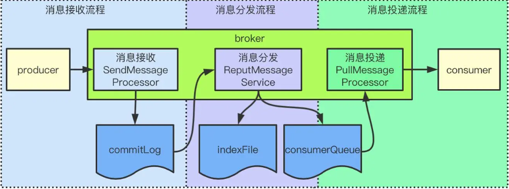

(图片来自网络)

RocketMQ 消息处理整个流程如下：

1.  **消息接收阶段**：接收 producer 的消息处理类是 [SendMessageProcessor](http://sendmessageprocessor/)，最后将消息写入到 [commigLog](http://commiglog/) 文件后，接收流程处理完毕。
2.  **消息分发阶段**：broker 处理消息分发的类是 [ReputMessageService](http://reputmessageservice/)，它会启动一个线程，不断地将 [commitLog](http://commitlog/) 分到到对应的 [consumerQueue](http://consumerqueue/)，这一步操作会写两个文件：[consumerQueue](http://consumerqueue/) 与 [indexFile](http://indexfile/)，写入后，消息分发流程处理完毕。
3.  **消息投递阶段**：将消息发往 consumer 的流程，consumer 会发起获取消息的请求，broker 收到请求后调用[PullMessageProcessor](http://pullmessageprocessor/) 类处理，从 [consumerQueue](http://consumerqueue/) 文件获取消息返回给 consumer 后，投递流程处理完毕。

## **06 Broker 服务端整个日志存储系统核心流程**

日志存储系统这是 Broker 端最核心最重要的，它又是如何高性能存储和读取的。详情请点击：

[【Broker端源码分析系列第十六篇】图解 RocketMQ 源码之 Broker MessageStore 存储架构](https://articles.zsxq.com/id_fon03obc0q26.html)

[【Broker端源码分析系列第十七篇】图解 RocketMQ 源码之 Broker 端存储模块堆外内存架构剖析](https://articles.zsxq.com/id_0rufq5khepju.html)

[【Broker端源码分析系列第十八篇】图解 RocketMQ 源码之 Broker 端三大底层存储文件剖析](https://articles.zsxq.com/id_nwm33ku2srs5.html)

[【Broker端源码分析系列第十九篇】图解 RocketMQ 源码之 Broker 端CommitLog存储架构设计剖析](https://articles.zsxq.com/id_k1dlpc0wpe8p.html)

[【Broker端源码分析系列第二十篇】图解 RocketMQ 源码之Broker端MappedFile底层架构设计剖析](https://articles.zsxq.com/id_o1mnfdtpq25o.html)

[【Broker端源码分析系列第二十一篇】图解 RocketMQ 源码之 Broker 端消息刷盘机制流程剖析](https://articles.zsxq.com/id_86ia3r5lx5mx.html)

[【Broker端源码分析系列第二十二篇】图解 RocketMQ 源码之 Broker 端消息过期清理与恢复机制流程剖析](https://articles.zsxq.com/id_x5wtt4s2rlvb.html)

[【Broker端源码分析系列第二十七篇】图解 RocketMQ 源码之Broker端 ConsumeQueue 架构设计](https://articles.zsxq.com/id_wfu6wxlbedo6.html)

[【Broker端源码分析系列第二十八篇】图解 RocketMQ 源码之Broker 端 IndexFile 架构设计剖析](https://articles.zsxq.com/id_uwoshcv9pujj.html)

[DefaultMessageStore](http://defaultmessagestore/) 是 RocketMQ 底层存储对外层提供服务的窗口，它是 RocketMQ 最核心最底层的存储实现类，通过组织 [CommitLog](http://commitlog/)、[ConsumeQueue](http://consumequeue/)、[IndexFile](http://indexfile/) 来完成 RocketMQ 存储的核心功能。

  
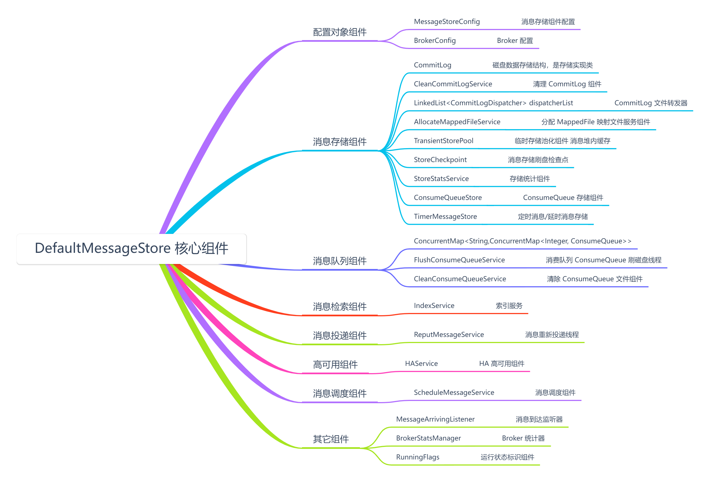

RocketMQ 采用的是「**混合型存储结构**」。在 Broker 单个实例下所有的队列共用一个日志数据文件「**CommitLog**」来存储，即多个 [Topic](http://topic/) 的消息实体内容都存储于一个「**CommitLog**」文件中。

整个日志存储在磁盘的体现如下图所示：

整个 [CommitLog](http://commitlog%20/) 写入消息的流程如下：

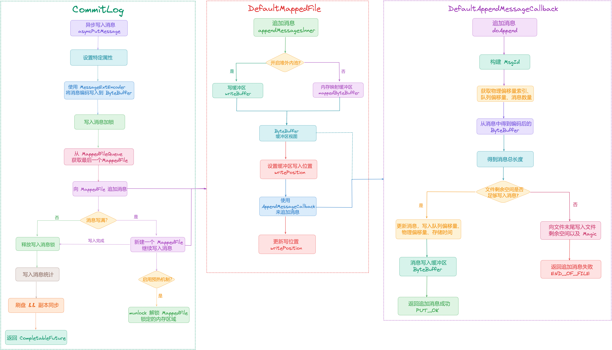

而日志底层是基于 [MappedFile](http://mappedfile%20/) 作为最小单元来构建的，如下：

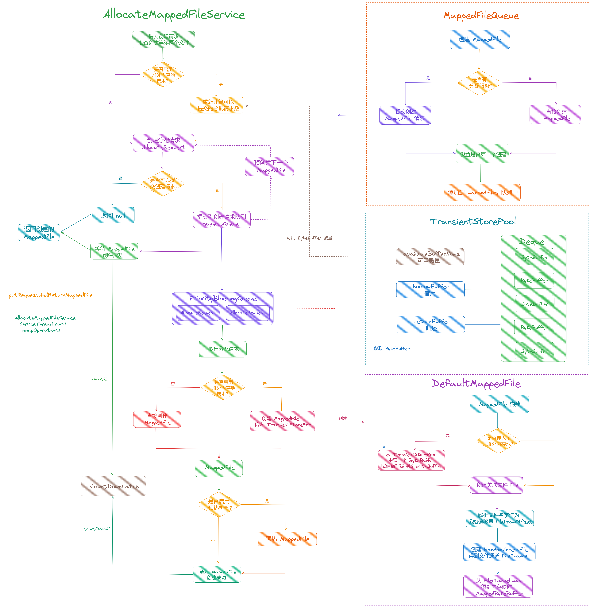

当 [CommitLog](http://commitlog%20/) 日志写入完成后，在 [Broker](http://broker/) 端启动一个后台服务线程 [ReputMessageService](http://reputmessageservice/) 不停地分发请求并异步构建「**ConsumeQueue 逻辑消费队列文件**」和「**IndexFile 索引文件**」数据。

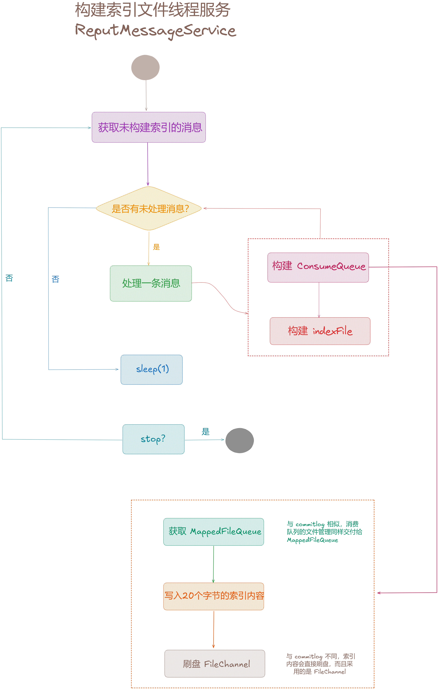

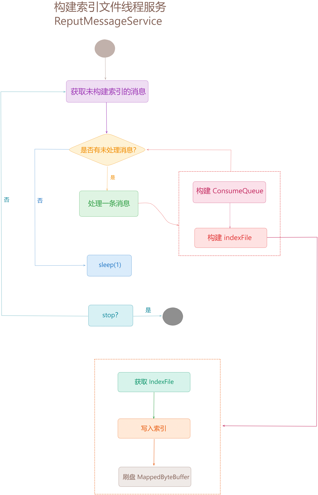

我们来看下 [ConsumeQueue](http://consumequeue/)、[IndexFile](http://indexfile%20/) 的核心架构。

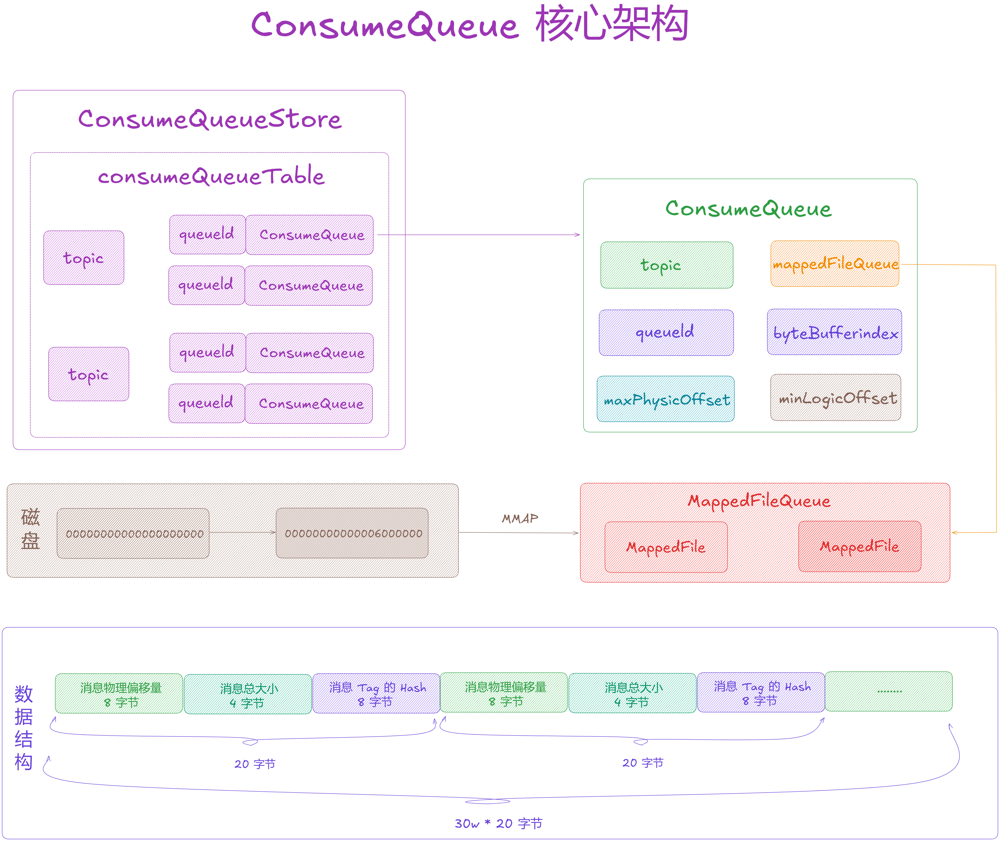

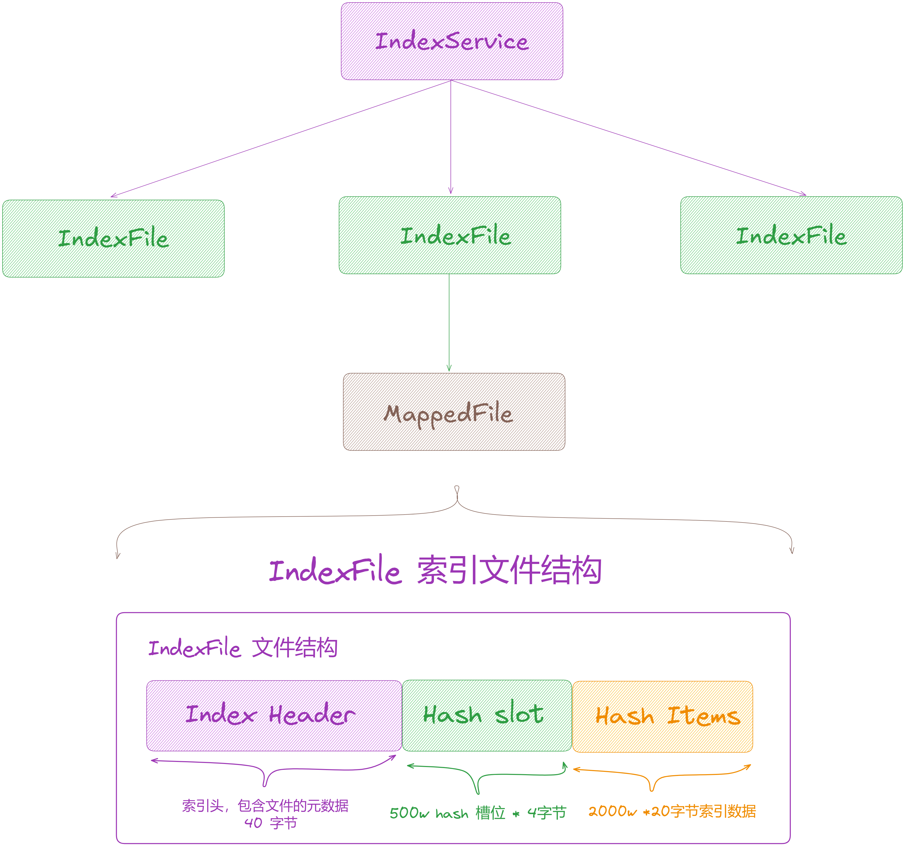

最后来看下整个消息存储的整体架构图，如下：

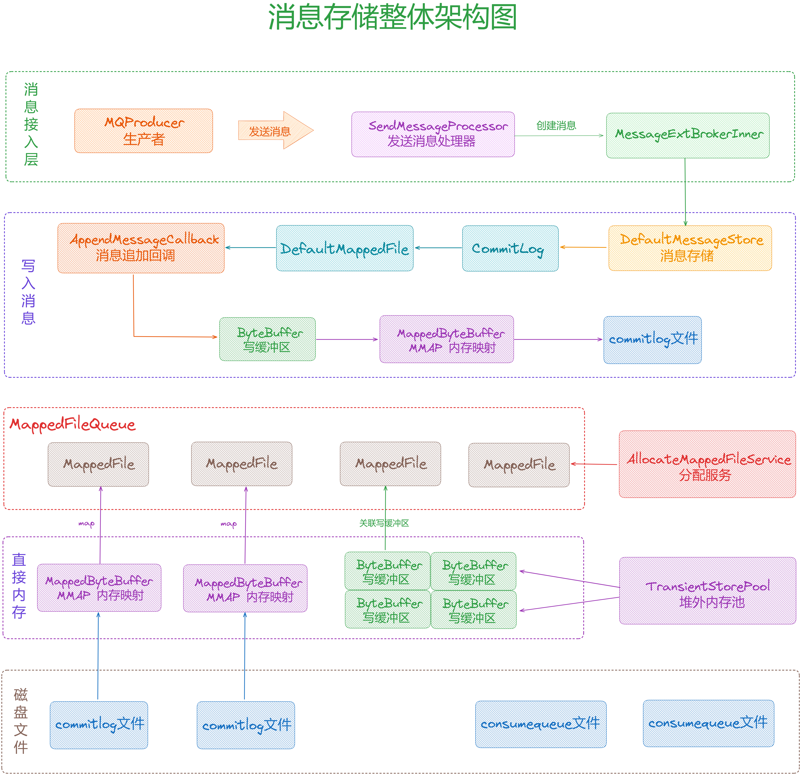

## **07 Broker 服务端主从 HA 架构**

详情请点击：[【Broker端源码分析系列第二十三篇】图解 RocketMQ 源码之 Broker 端 HA 主从同步架构设计剖析](https://articles.zsxq.com/id_qqiirivm0nhm.html)

因为「**主从复制**」逻辑相对比较简单，且从节点数目有限，因此 RocketMQ 没有使用 Netty 为底层网络框架，而是通过 Java NIO 技术实现了 Socket 服务。

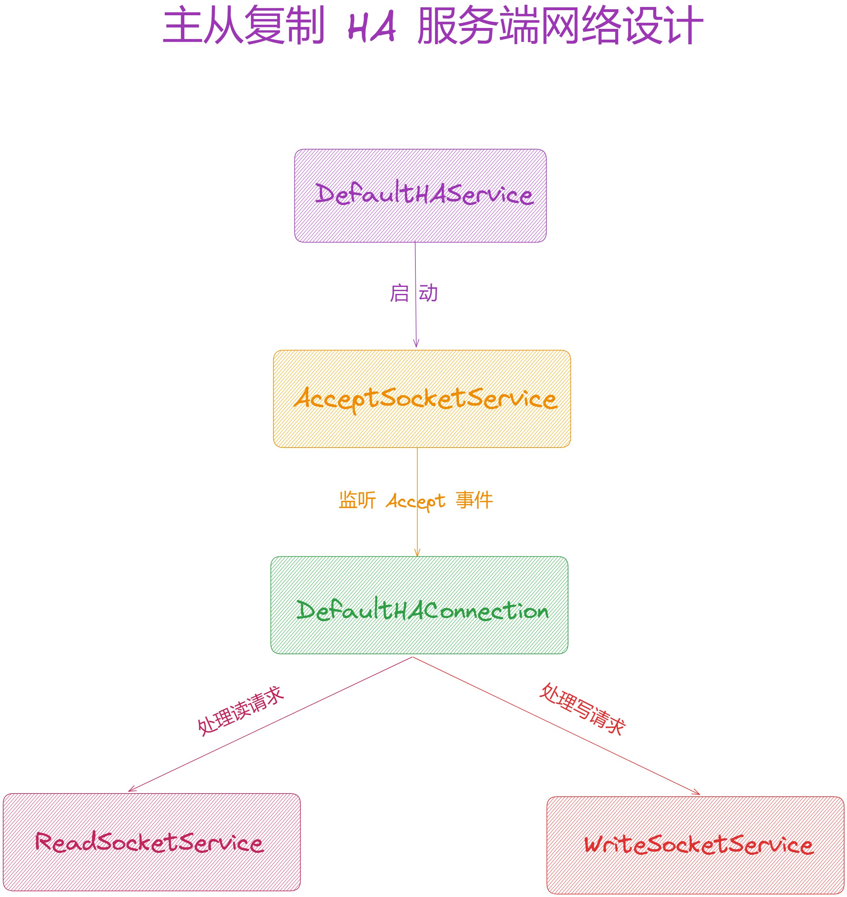

通过一张图来总结下主从同步流程：

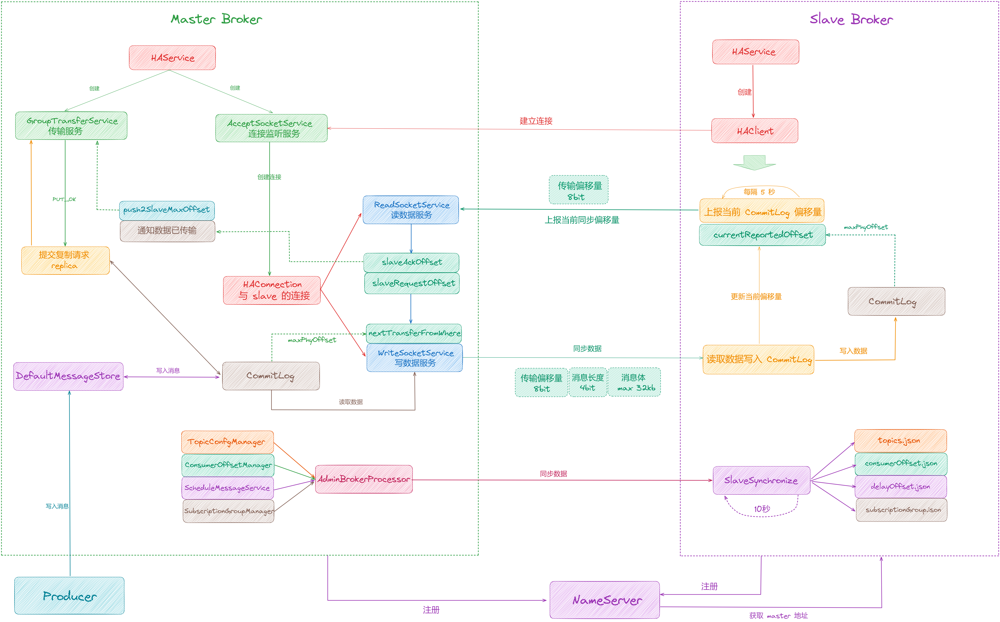

## **08 Broker 服务端DLedger 高可用及日志复制架构**

详情请点击：[【Broker端源码分析系列第二十四篇】图解 RocketMQ 源码之 Broker 端 DLedger 高可用框架初探](https://articles.zsxq.com/id_ssg269444aix.html) 、[【Broker端源码分析系列第二十六篇】图解 RocketMQ 源码之Broker端DLedger日志复制架构深度剖析](https://articles.zsxq.com/id_1q1qcm3cn5w1.html)

  
原先的「**主从同步复制的架构**」有个缺陷就是「**出现故障时无法自动切换主从节点**」，于是在新版本中就引入了「**DLedger**」高可用技术。

  
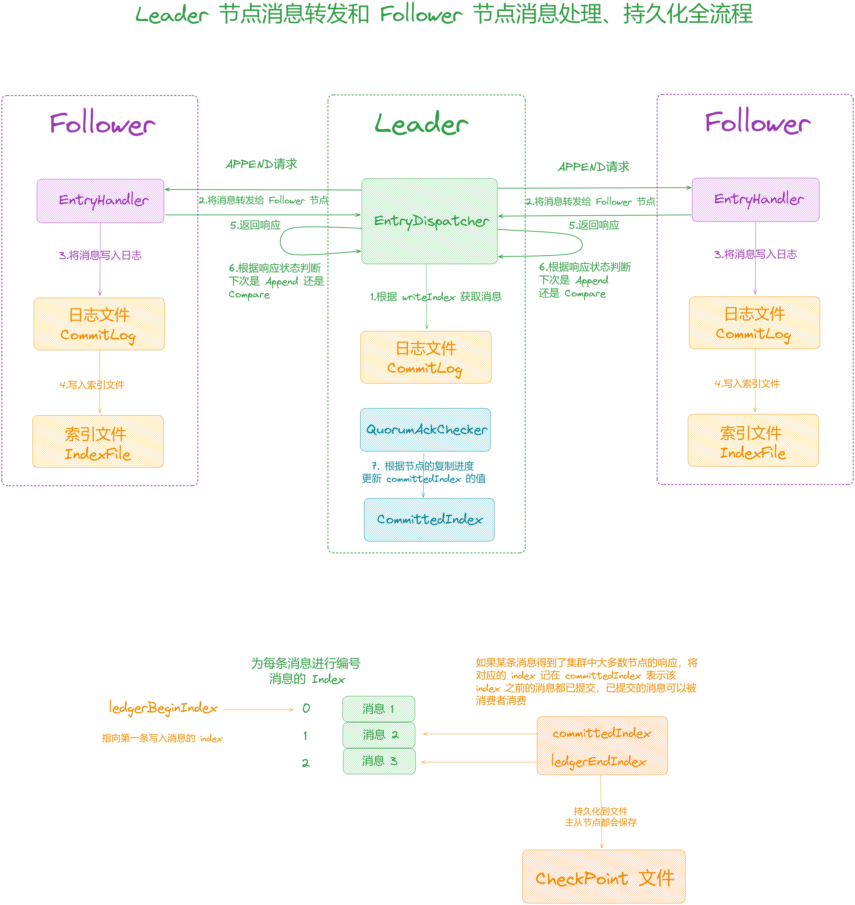

## **09 Broker 服务端事务消息处理核心流程**

详情请点击 [【Broker端源码分析系列第二十九篇】图解 RocketMQ 源码之 Broker 端事务消息架构设计剖析](https://articles.zsxq.com/id_kotf3fj9vw42.html)

对于「**事务消息**」来说主要是通过消息的「**异步处理**」，可以保证「**本地事务**」和「**消息发送同时成功或者失败**」，从而保证数据的「**最终一致性**」，这里我们先看看一条事务消息从诞生到结束的整个时间线流程图，如下：

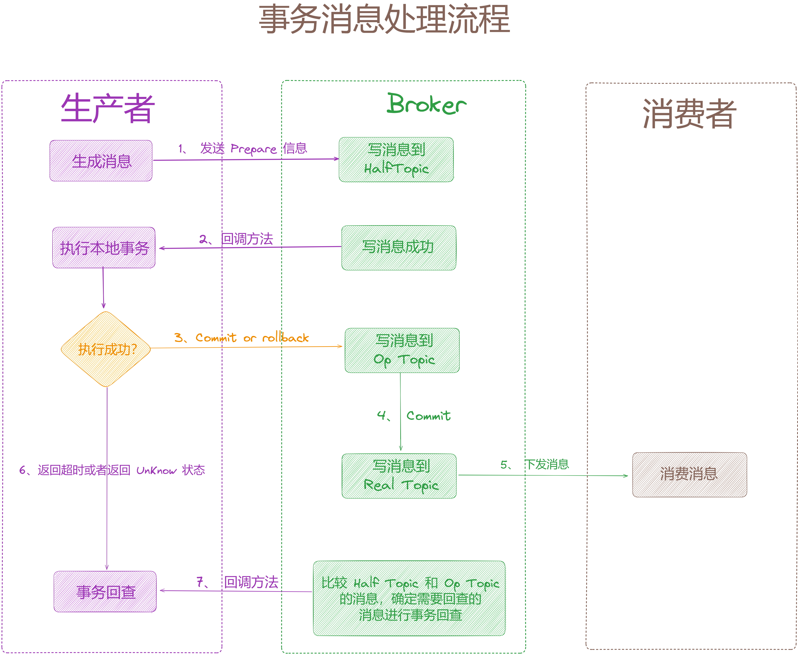

## **10 Broker 服务端延迟消息实现机制**

详情请点击 [【Broker端源码分析系列第三十篇】图解 RocketMQ 源码之 Broker 端延迟消息架构设计剖析](https://articles.zsxq.com/id_7ox9ujcnmshf.html)

延迟消息分两种：「**延迟等级的延迟消息**」、「**支持任意时间的延迟消息**」。

  
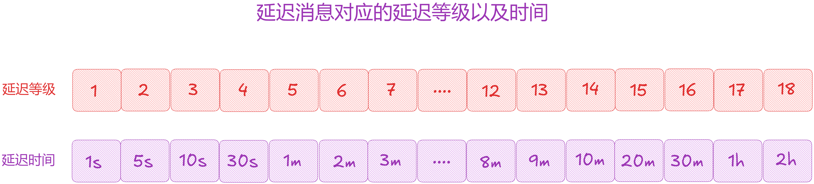

对于「**传统的延迟消息**」就是 18个等级，在 Broker 端构建 [ConsumeQueue](http://consumequeue/) 时，将原来应该存储 [tag.hashCode](http://tag.hashcode/) 的位置，改为存储目标投递时间戳。然后 [ScheduleMessageService](http://schedulemessageservice/) 服务会启动后台线程消费 [SCHEDULE\_TOPIC\_XXXX](http://schedule_topic_xxxx/) 中每个队列的消息。如果 [ConsumeQueue](http://consumequeue/) 中记录的投递时间到期，则投递到用户原始消息 topic和queue；如果 [ConsumeQueue](http://consumequeue/) 中记录的投递时间未到期，则延迟一会再进行消费。

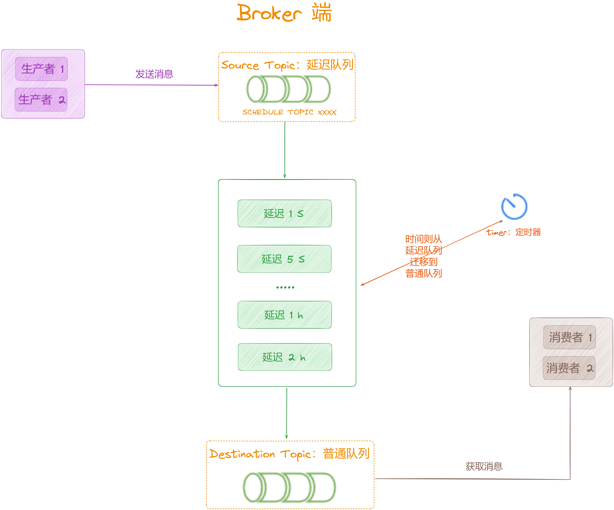

而 Timer 消息大流程分为三步：

1.  用户消息转换为 [wheel\_timer](http://wheel_timer/) 消息（[topic=rmq\_sys\_wheel\_timer，queueId=0](http://topic=rmq_sys_wheel_timer,queueid=0/)）。
2.  构造时间轮（[enqueue](http://enqueue/)），包括 [timerlog](http://timerlog/) 和 [timerwheel](http://timerwheel/) 两个新文件。
3.  处理时间轮（[dequeue](http://dequeue/)），按照时间顺序，将到期消息滚动 | 投递到目标队列。

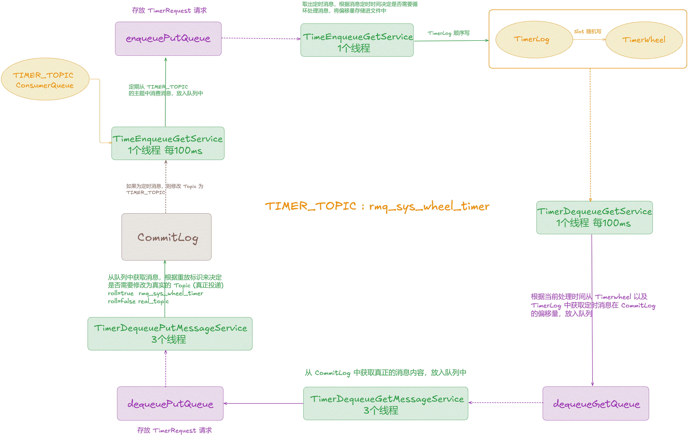

Timer 消息的时间轮主要分为两部分数据：[TimerWheel](http://timerwheel/) 和 [TimerLog](http://timerlog/)。

1.  [TimerLog](http://timerlog/)：顺序写，同样延迟时间的记录形成链表结构，也记录了消息在 [CommitLog](http://commitlog/) 中的物理位置。
2.  [TimerWheel](http://timerwheel/) ：随机写，存储 n 个时间槽 Slot，每个槽指向 [TimerLog](http://timerlog/) 中的一条记录（主要是 last 指针）。每次新 [TimerLog](http://timerlog/) 生成，都会定位 Slot 后修改指针指向。

在 [dequeue](http://dequeue/) 阶段，通过到期时间戳定位 [timerwheel](http://timerwheel/) 中的一个槽，再从 [timerlog](http://timerlog/) 中读取 [CommitLog](http://commitlog/) 位置定位消息。

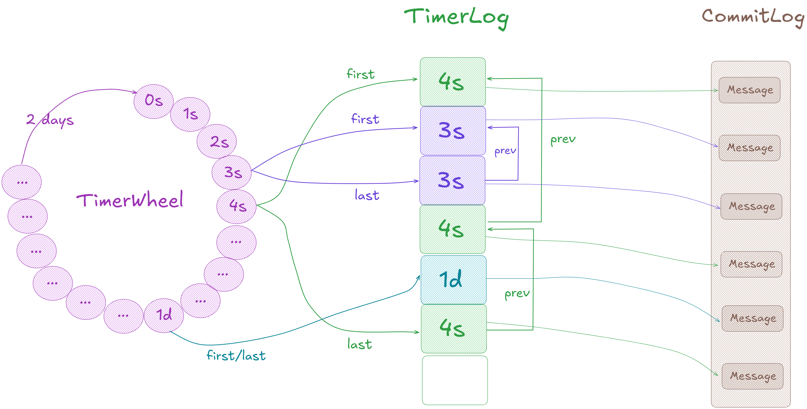