大家好，我是**华仔**, 又跟大家见面了。

从今天开始我将继续为大家奉上 RocketMQ Broker 源码剖析系列文章，正式开启「**RocketMQ 的服务端 Broker 源码之旅**」，这是第三十二篇，本篇我们将以「**RocketMQ 5.3.1**」版本为主，来剖析下 RocketMQ 源码中消息不丢失核心配置详解。

## **01 总体概述**

我们都知道 RocketMQ 数据刷盘的策略默认是使用「**异步刷盘**」，异步刷盘除非服务器真的宕机，数据才会丢失。为了性能我们一般设置「**异步刷盘**」，因为消息的丢失风险在合理范围 (业务可接受)。

  
RocketMQ 宕机数据并不会丢失，因为数据都存在操作系统的 pageCache 里面，而不是 JVM 内存中。

最近我在研究 RocketMQ 「**消息不丢失**」的一些细节，所以关注到了 5.x 版本中的一个新参数 [allAckInSyncStateSet](http://allackinsyncstateset/)，消息一条都不丢的代价很大，我们需要在「**消息丢失**」和「**性能**」之间找到一个平衡，在保证「**性能**」的同时尽量减少「**消息丢失**」风险。

## **02 RocketMQ 主从同步配置**

RocketMQ 主从之间的数据同步有很多配置供我们选择，合理的设置这些参数才能尽可能在保证性能的同时减少在宕机时消息的丢失 比如有如下一些配置:

  
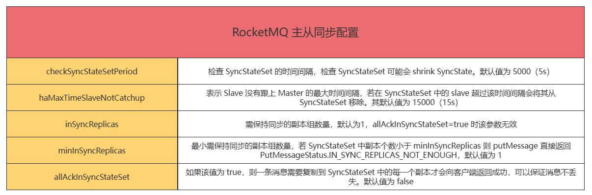

参考官网：[https://rocketmq.apache.org/zh/docs/deploymentOperations/03autofailover/](https://rocketmq.apache.org/zh/docs/deploymentOperations/03autofailover/)

## **2.1 allAckInSyncStateSet 配置**

在上图中我们看到一个很关键的参数：[allAckInSyncStateSet](http://allackinsyncstateset/)。

官方的说法就是**如果该值为 true，则一条消息需要复制到 SyncStateSet 中的每一个副本才会向客户端返回成功，可以保证消息不丢失，默认为 false**。

那么就有如下几个疑惑了，我们来分别看下：

### **2.1.1 每一个副本指在 SyncStateSet 里面的副本吗？**

比如现在一个集群有三个节点

1.  Broker-a-master
2.  Broker-a-slave
3.  Broker-a-slave2

此时的 [SyncStateSet](http://syncstateset%20/) 中的数据，在同步中的 broker 如下：

1.  Broker-a-master 192.168.31.1
2.  Broker-a-slave 192.168.31.2
3.  Broker-a-slave2 192.168.31.3

如果此时 [broker-a-master](http://broker-a-master/) 宕机，随机选出一个 slave broker 切换成 master。此时的 [SyncStateSet](http://syncstateset/) 数据，在同步中的 broker 如下：

1.  Broker-a-master 192.168.31.2
2.  Broker-a-slave 192.168.31.3 不在同步中的 broker
3.  Broker-a-slave2 192.168.31.1

### **2.1.2 此时宕机的 192.168.31.1 还需要返回 ack 才能算消息写入成功吗？**

如果是，那么整个 Broker-a 集群会处于「**无法写入**」的状态，也「**无法恢复**」，对整个集群的可用性影响太大了。

### **2.1.3 最大需要间隔多久才能将宕机的 master 移出到不在同步的 broker 呢？**

是否有以下疑惑：

1.  返回 ack 是所有存活的 broker 还是在同步中的 broker
2.  什么时候将异常的 broker 移出在同步中的 broker

接下来我们就上面的 2 个问题我们结合源码分析来找到答案。

## **2.2 allAckInSyncStateSet 在哪里被使用**

我们在整个 RocketMQ 代码中全局搜索 [allAckInSyncStateSet](http://allackinsyncstateset/)，使用关键字能直接找到[org.apache.rocketmq.store.ha.GroupTransferService#doWaitTransfer](http://org.apache.rocketmq.store.ha.grouptransferservice/#doWaitTransfer) 中有使用。

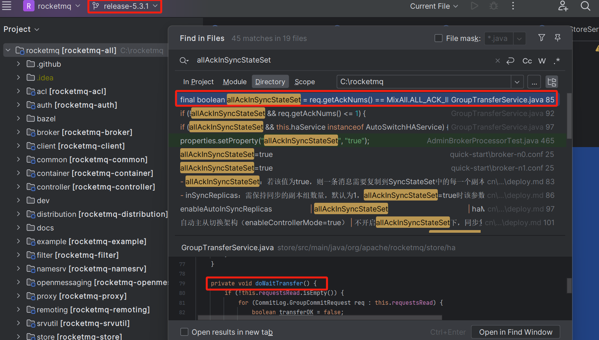

这里我们可以看到获取的同步副本 [syncStateSet](http://syncstateset/) 是通过 [autoSwitchHAService.getSyncStateSet()](http://autoswitchhaservice.getsyncstateset\(\)/) 获取的。

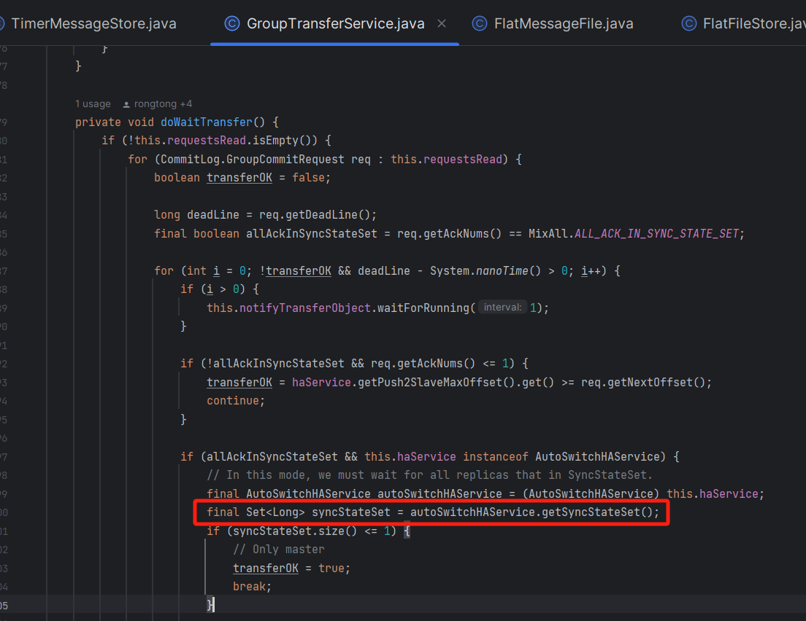

所以判断需要返回多少个 ack 主要是基于 [syncStateSet](http://syncstateset/) 来判断的，即 [AutoSwitchHAService#syncStateSet](http://autoswitchhaservice/#syncStateSet) 属性。

  
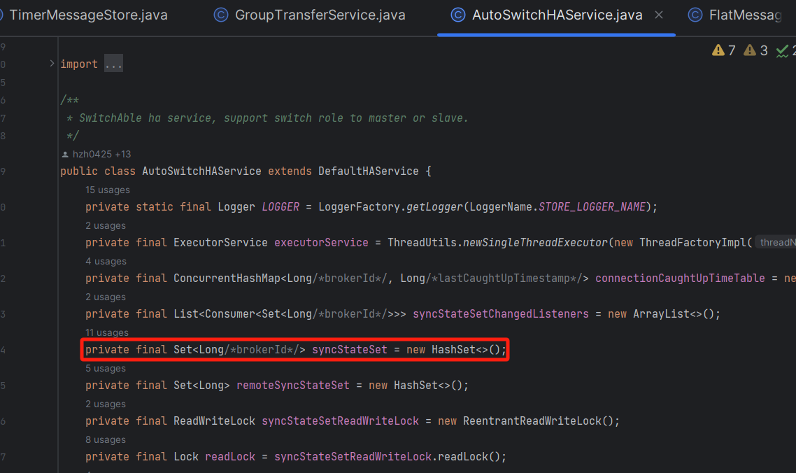

既然通过 [autoSwitchHAService.getSyncStateSet()](http://autoswitchhaservice.getsyncstateset\(\)/) 获取的要同步的副本列表，那么何时调用 [org.apache.rocketmq.store.ha.autoswitch.AutoSwitchHAService#setSyncStateSet](http://org.apache.rocketmq.store.ha.autoswitch.autoswitchhaservice/#setSyncStateSet) 方法来更新 [syncStateSet](http://syncstateset/)呢？

  
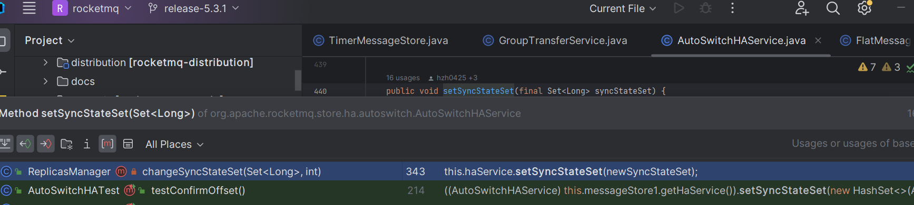

可以看到有三处调用：

1.  changeSyncStateSet
2.  schedulingSyncBrokerMetadata
3.  doReportSyncStateSetChanged

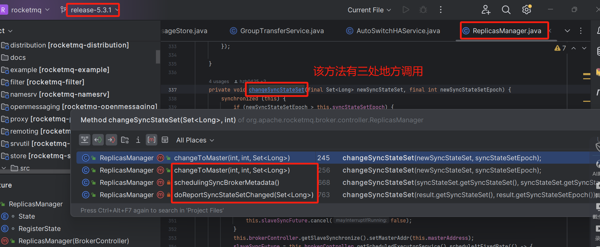

这里，我们先看看 [doReportSyncStateSetChanged](http://doreportsyncstatesetchanged/) 这个方法。

###   
**2.3 doReportSyncStateSetChanged 方法**

可以看到这里主要是与 [controller](http://controller%20/) 进行通信。

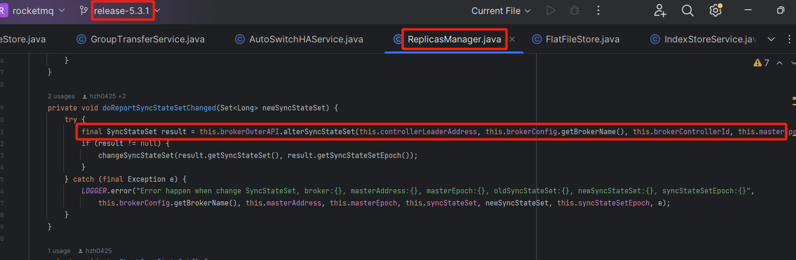

我们查看请求状态码为 [CONTROLLER\_ALTER\_SYNC\_STATE\_SET](http://controller_alter_sync_state_set/)。

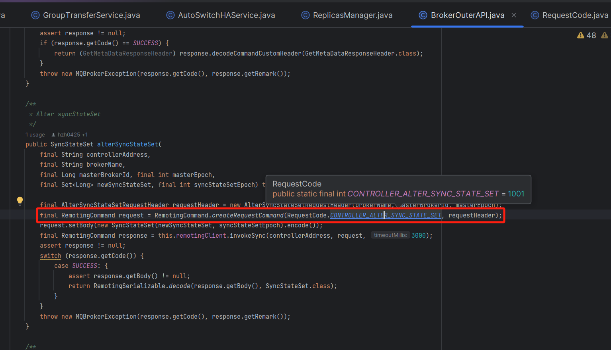

然后拿取到 [controller](http://controller/) 的元数据结果进行本地同步，应该是没有相关的同步状态下线操作，如下：

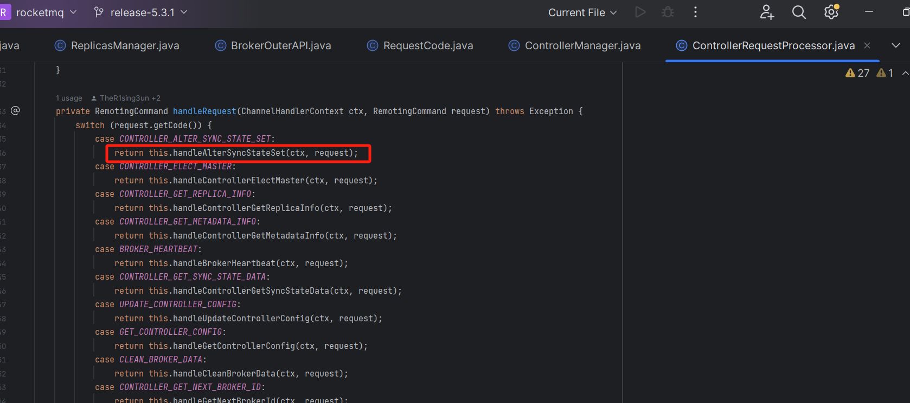

这里有两种实现：

1.  DLedgerController
2.  JRaftController（5.2.0 Controller 开始支持 JRaft 内核启动，不支持 DLedger 内核到 JRaft 内核原地升级）。

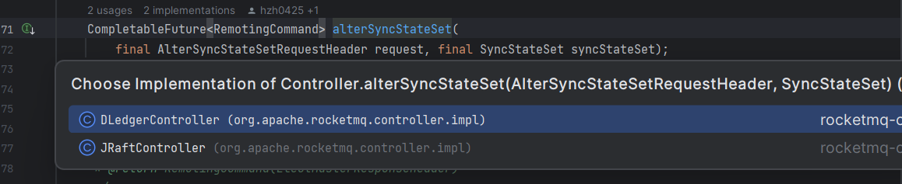

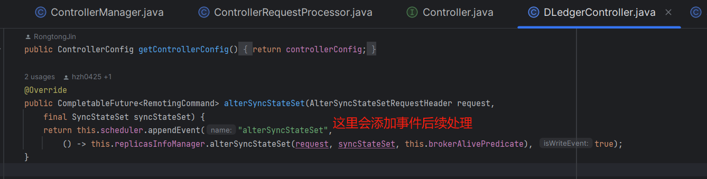

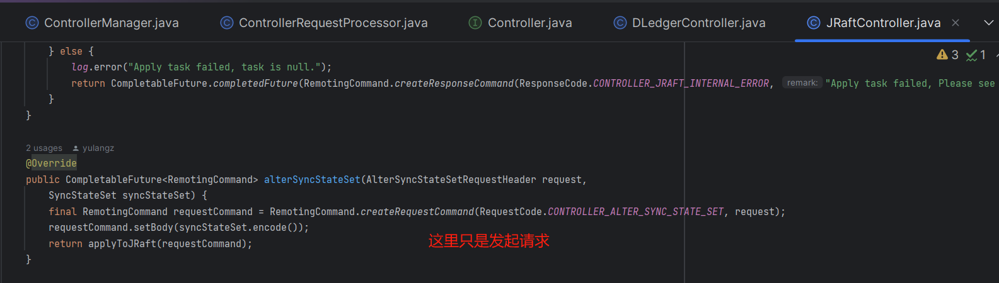

我们继续看看 [schedulingSyncBrokerMetadata](http://schedulingsyncbrokermetadata/) 方法。

### **2.4 schedulingSyncBrokerMetadata 方法**

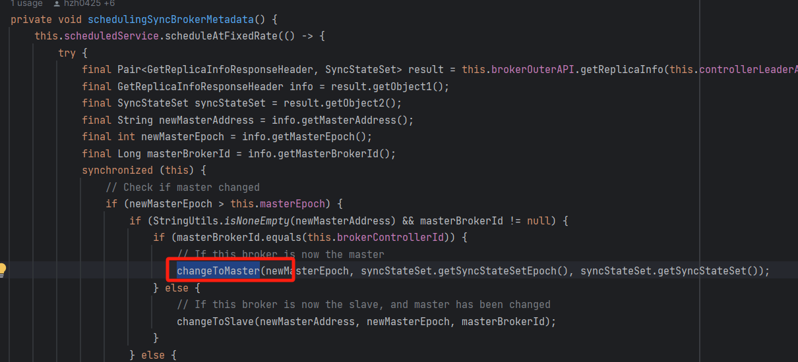

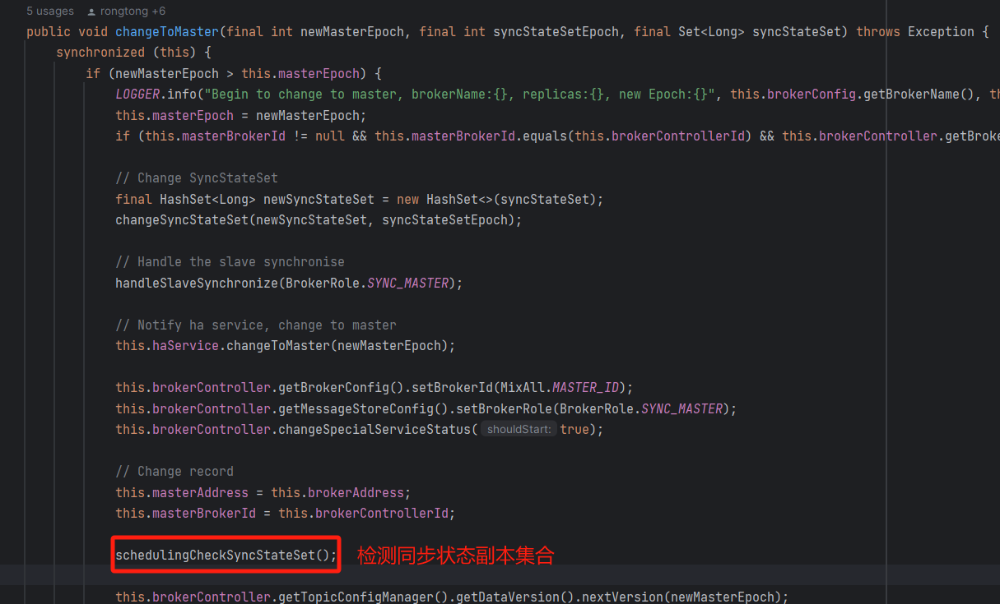

我们再来看看 [schedulingCheckSyncStateSet](http://schedulingchecksyncstateset%20/) 方法。

  
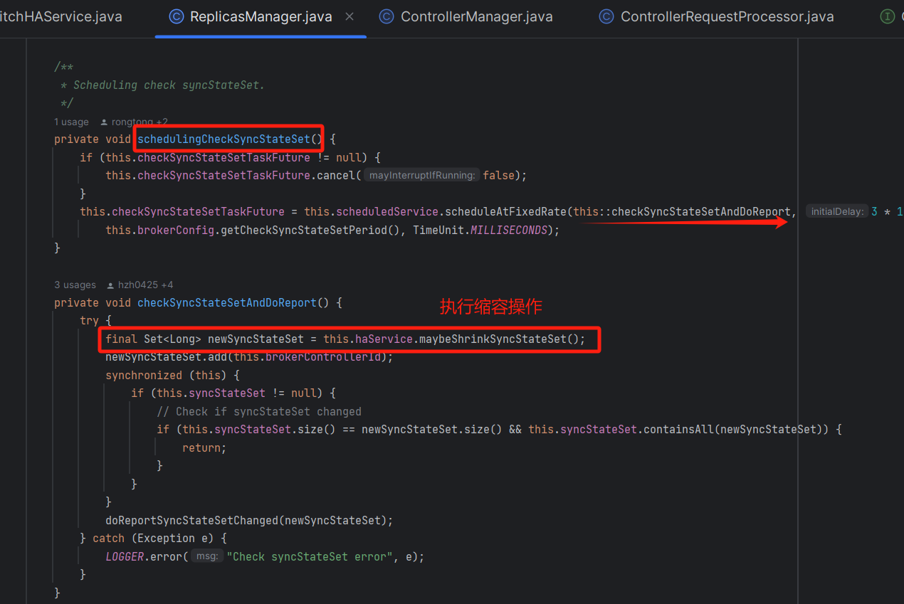

该方法作用是在适当的时候对状态集合进行缩容，以释放内存。

/\*\*

\* 可能会缩小同步状态集合的方法。

\* 该方法会根据当前连接状态和时间来判断是否需要从同步状态集合中移除某些元素。

\*

\* @return 返回一个新的同步状态集合

\*/

public Set<Long> maybeShrinkSyncStateSet() {

// 获取本地同步状态集合

final Set<Long> newSyncStateSet = getLocalSyncStateSet();

// 标记同步状态集合是否发生变化

boolean isSyncStateSetChanged \= false;

// 获取最大时间间隔，超过该时间间隔后，从节点仍未追上主节点

final long haMaxTimeSlaveNotCatchup \= this.defaultMessageStore.getMessageStoreConfig().getHaMaxTimeSlaveNotCatchup();

// 遍历连接追上时间表

for (Map.Entry<Long, Long> next : this.connectionCaughtUpTimeTable.entrySet()) {

final Long slaveBrokerId \= next.getKey();

// 如果新的同步状态集合包含从节点ID

if (newSyncStateSet.contains(slaveBrokerId)) {

final Long lastCaughtUpTimeMs \= next.getValue();

// 如果当前时间与上次追上时间的差值大于最大时间间隔

if ((System.currentTimeMillis() - lastCaughtUpTimeMs) > haMaxTimeSlaveNotCatchup) {

// 从新的同步状态集合中移除该从节点ID

newSyncStateSet.remove(slaveBrokerId);

// 标记同步状态集合发生变化

isSyncStateSetChanged = true;

}

}

}

// 如果从节点ID在同步状态集合中，但不在连接追上时间表中，说明该代理尚未连接

Iterator<Long> iterator = newSyncStateSet.iterator();

while (iterator.hasNext()) {

Long slaveBrokerId \= iterator.next();

// 如果从节点ID不等于本地 BrokerID 且不在连接追上时间表中

if (!Objects.equals(slaveBrokerId, this.localBrokerId) && !this.connectionCaughtUpTimeTable.containsKey(slaveBrokerId)) {

// 从新的同步状态集合中移除该从节点ID

iterator.remove();

// 标记同步状态集合发生变化

isSyncStateSetChanged = true;

}

}

// 如果同步状态集合发生变化，更新同步状态集合

if (isSyncStateSetChanged) {

markSynchronizingSyncStateSet(newSyncStateSet);

}

// 返回新的同步状态集合

return newSyncStateSet;

}

其中 [lastCaughtUpTimeMs](http://lastcaughtuptimems/) 获取值如下：

  
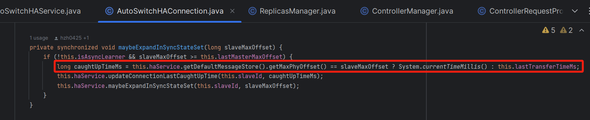  

1.  如果 slave 最大偏移量不等于 master 最大偏移量，则不更新同步时间。
2.  如果相等则更新同步时间为最新时间
3.  可以看到会与最大不同步时间进行判断 [haMaxTimeSlaveNotCatchup](http://hamaxtimeslavenotcatchup/)(默认15s)。15s 内 slave 与 master 最大偏移量不同步，则移出 [syncStateSet](http://syncstateset/)。

  
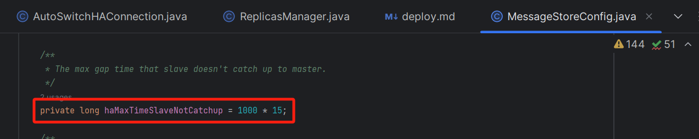

那么这个检测任务是多久执行一次呢？

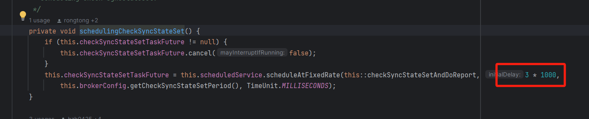

可以看到是 3s 执行一次，所以最多需要 15s 才能将异常的 broker 移除在同步状态的 broker 中。

## **03 总结**

总的来说开启 [allAckInSyncStateSet](http://allackinsyncstateset/) 最多会在 master 节点宕机后 15s 内集群写入不可用，等异常的 broker 被移出 [syncStateSet](http://syncstateset%20/) 集合后就可以继续正常写入了。

比如有三个集群：

1.  broker-a
2.  broker-b
3.  broker-c

一个集群比如 broker-a 在 15s 内不可写入也是可以接受的，因为还有两个集群可以写入，生产者也是有消息重试的。

如果不开启 [allAckInSyncStateSet](http://allackinsyncstateset/)，一条消息写入 master 后还没来得及同步给 slave 就宕机，消息丢失的风险还是太大。

综上，生产环境还是推荐开启 [allAckInSyncStateSet](http://allackinsyncstateset/) 参数配置，防止消息丢失。