大家好，我是**华仔**, 又跟大家见面了。

从今天开始我将继续为大家奉上 RocketMQ 消费者源码剖析系列文章，正式开启「**RocketMQ 的服务端 Broker 源码之旅**」，这是第三十篇，本篇我们将以「**RocketMQ 5.1.2**」版本为主，来剖析下 RocketMQ 源码之 Broker 端 延迟消息架构设计剖析。

这里我将以「**RocketMQ 5.1.2**」版本为主，通过「**场景驱动**」的方式带大家一点点的对 RocketMQ 源码进行深度剖析，正式开启「**RocketMQ 的源码之旅**」，跟我一起来掌握 RocketMQ 源码核心架构设计思想吧。

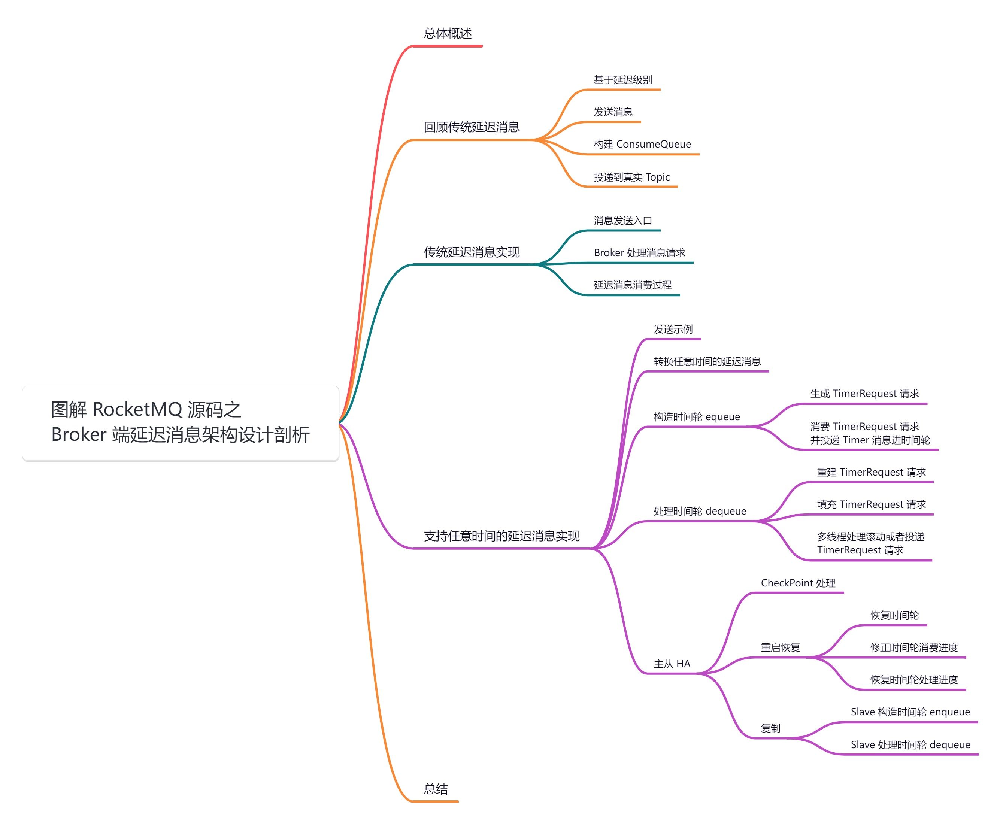

##   
**01 总体概述**

在 RocketMQ 中是支持 「**延迟消息**」的，今天我们就来深度剖析下「**延迟消息**」的底层架构设计。

这里我打算通过深度剖析早期的固定延迟等级的「**延迟消息**」以及基于「**时间轮实现的延迟消息**」。

##   
**02 回顾传统延迟消息**

## **2.1 基于延迟级别**

传统延迟消息，仅支持通过设置「**延迟级别**」的方式进行发送。

DefaultMQProducer producer \= new DefaultMQProducer("producer-test-group");

producer.setNamesrvAddr("localhost:9876");

producer.start();

Message msg \= new Message(

"huazai-test", // topic

"TagA", // tag

("Hello Delay " + i).getBytes(StandardCharsets.UTF\_8) // body

);

msg.setDelayTimeLevel(3); // 延迟级别=3 10s

SendResult sendResult \= producer.send(msg); // 发送消息

默认 RocketMQ 延时消息共有 18 个等级，在broker端可配置，即[MessageStoreConfig#messageDelayLevel](http://messagestoreconfig/#messageDelayLevel)。

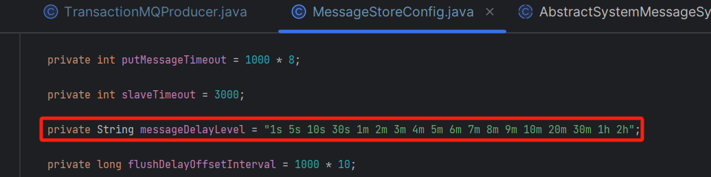

## **2.2 发送消息**

Broker 端会将延迟消息转换后投递到 [topic=SCHEDULE\_TOPIC\_XXXX](http://topic=schedule_topic_xxxx/)。投递队列与延迟级别 mapping[（queueId=delayLevel-1）](http://\(queueid=delaylevel-1\)/)。

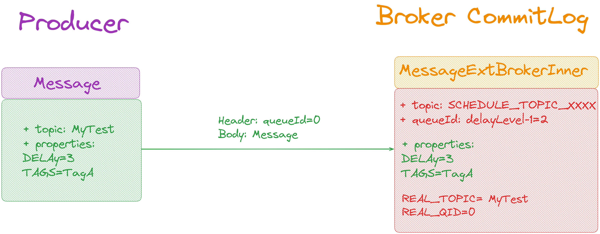

## **2.3 构建 ConsumeQueue**

Broker 端构建 [ConsumeQueue](http://consumequeue/) 时，将原来应该存储 [tag.hashCode](http://tag.hashcode/) 的位置，改为存储目标投递时间戳。

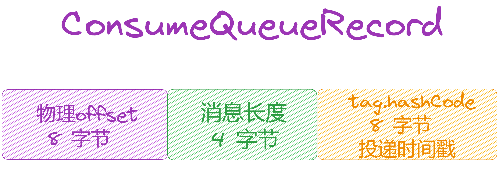

## **2.4 投递到真实 Topic**

在 Broker 端，[ScheduleMessageService](http://schedulemessageservice/) 服务会启动后台线程消费 [SCHEDULE\_TOPIC\_XXXX](http://schedule_topic_xxxx/) 中每个队列的消息。

> 注意：从 4.9 版本开始每个延迟级别一个线程，在 4.9 版本之前是 JDK 的 Timer 来实现，一个线程处理所有延迟级别。

如果 [ConsumeQueue](http://consumequeue/) 中记录的投递时间到期，则投递到用户原始消息 topic和queue；如果 [ConsumeQueue](http://consumequeue/) 中记录的投递时间未到期，则延迟一会再进行消费。

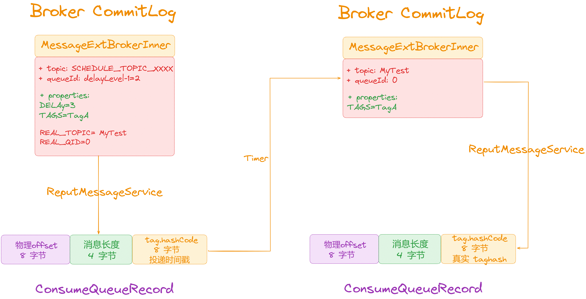

综上得出传统延迟消息，它的延迟级别有限可穷举，可以 [mapping](http://mapping%20/) 到队列数量。这样能保证「**每个队列**」中的消息是「**按照目标投递时间有序**」，其中 [目标投递时间=生产消息时间+固定延迟](http://xn--=+-682cx14af3fprfk1cw4fppjda729ch7swixczf268h8wa298ega/)，但是如果要实现 [Timer](http://timer/) 消息就行不通了。

由于 [CommitLog](http://commitlog/) 和 [ConsumeQueue](http://consumequeue/) 文件都是顺序追加写的，因此没办法做到「**早投递的消息晚触达**」，「**晚投递的消息早触达**」。

所以想要实现 [Timer](http://timer/) 消息就需要能「**按照时间有序的方式**」消费系统 Topic，投递到用户 Topic。

接下来我们先来深度剖析下「**传统延迟消息**」的源码是如何实现的，然后再来深度剖析下支持「**任意时间的延迟消息**」是如何实现的，内部又是使用了什么黑科技呢？

##   
**03 传统延迟消息实现**

## **3.1 消息发送入口**

这里的我们先从消息的发送开始讲起。

  
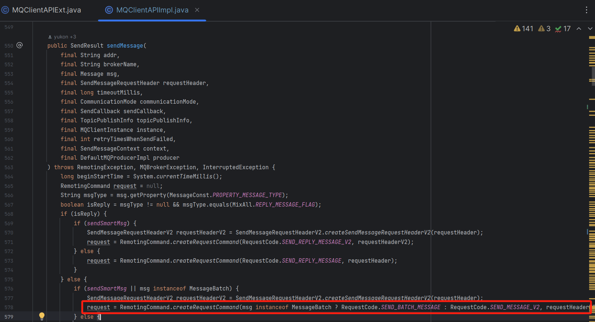

消息发送最终的请求状态码是 310。

  
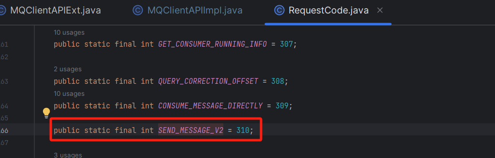

可以看到实际消息发送和普通消息没有什么区别，所以我们还要去 Broker 端看看有没有什么特殊处理？

##   
**3.2 Broker 处理消息请求**

通过之前的文章得知，Broker 端处理消息方法入口如下：[org.apache.rocketmq.broker.processor.SendMessageProcessor#processRequest](http://org.apache.rocketmq.broker.processor.sendmessageprocessor/#processRequest)。

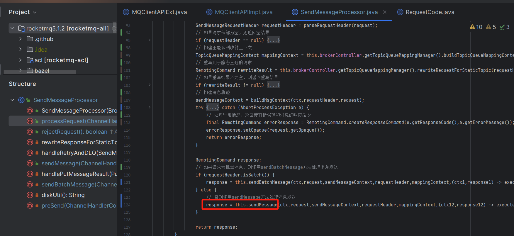

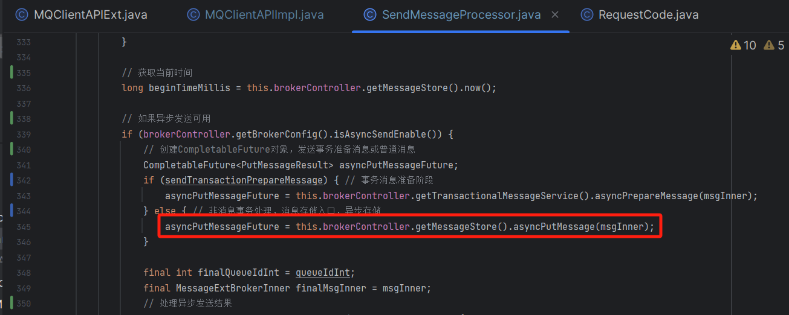

这里需要注意的是，我们只剖析「**延迟消息**」，所以只关注「**延迟消息**」和「**普通消息**」的处理区别。

  
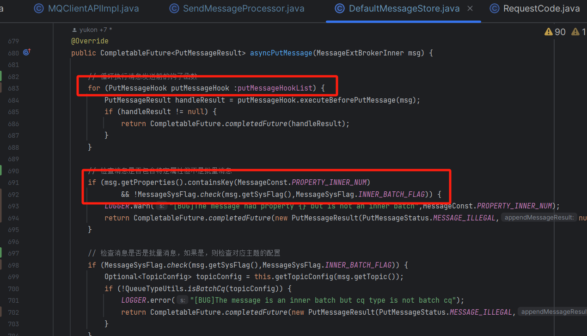

到这里 topic 还是我们正常指定的 [huazai-topic](http://huazai-topic/)，但是这里会执行多个消息的后置处理器 [putMessageHookList](http://putmessagehooklist/)

我们看看 [putMessageHookList](http://putmessagehooklist/) 有哪些：

public void registerMessageStoreHook() {

// 1、messageStore 中消息存储的钩子集合

List<PutMessageHook> putMessageHookList = messageStore.getPutMessageHookList();

// 2、往钩子集合中添加新的钩子函数

putMessageHookList.add(new PutMessageHook() {

// 设置钩子函数名称为 checkBeforePutMessage

@Override

public String hookName() {

return "checkBeforePutMessage";

}

// 在放置消息之前执行。例如:消息验证或特殊消息转换

@Override

public PutMessageResult executeBeforePutMessage(MessageExt msg) {

return HookUtils.checkBeforePutMessage(BrokerController.this, msg);

}

});

// 3、往钩子集合中添加新的钩子函数

putMessageHookList.add(new PutMessageHook() {

// 设置钩子函数的名称为 innerBatchChecker 内部批处理检查器

@Override

public String hookName() {

return "innerBatchChecker";

}

@Override

public PutMessageResult executeBeforePutMessage(MessageExt msg) {

// instanceof 是 Java 的保留关键字。它的作用是测试它左边的对象是否是它右边的类的实例，返回 boolean 的数据类型,

if (msg instanceof MessageExtBrokerInner) {

return HookUtils.checkInnerBatch(BrokerController.this, msg);

}

return null;

}

});

// 3、往钩子集合中添加新的钩子函数

putMessageHookList.add(new PutMessageHook() {

// 设置钩子函数的名称为 handleScheduleMessage 处理计划消息

@Override

public String hookName() {

return "handleScheduleMessage";

}

@Override

public PutMessageResult executeBeforePutMessage(MessageExt msg) {

if (msg instanceof MessageExtBrokerInner) {

return HookUtils.handleScheduleMessage(BrokerController.this, (MessageExtBrokerInner) msg);

}

return null;

}

});

// 4、HA握手时，从设备以一定的偏移量将消息发送回主设备

SendMessageBackHook sendMessageBackHook \= new SendMessageBackHook() {

@Override

public boolean executeSendMessageBack(List<MessageExt> msgList, String brokerName, String brokerAddr) {

return HookUtils.sendMessageBack(BrokerController.this, msgList, brokerName, brokerAddr);

}

};

// 5、如果消息不为空，设置发送消息回钩

if (messageStore != null) {

messageStore.setSendMessageBackHook(sendMessageBackHook);

}

}

这里可以看到主要是 3 个：

1.  [checkBeforePutMessage](http://checkbeforeputmessage/)
2.  [innerBatchChecker](http://innerbatchchecker/)
3.  [handleScheduleMessage](http://handleschedulemessage/)

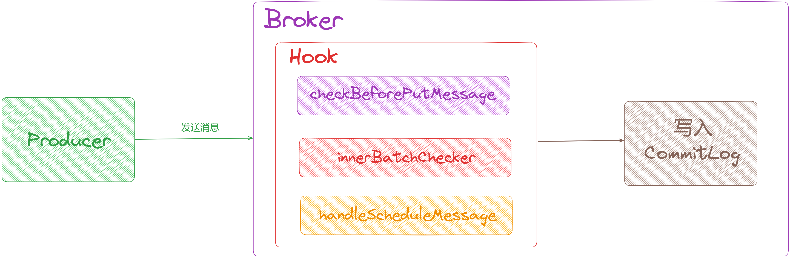

通过方法名可以确定是 [handleScheduleMessage](http://handleschedulemessage/) 这个方法来处理「**延迟消息**」的，所以重点剖析它。

### **3.2.1 handleScheduleMessage**

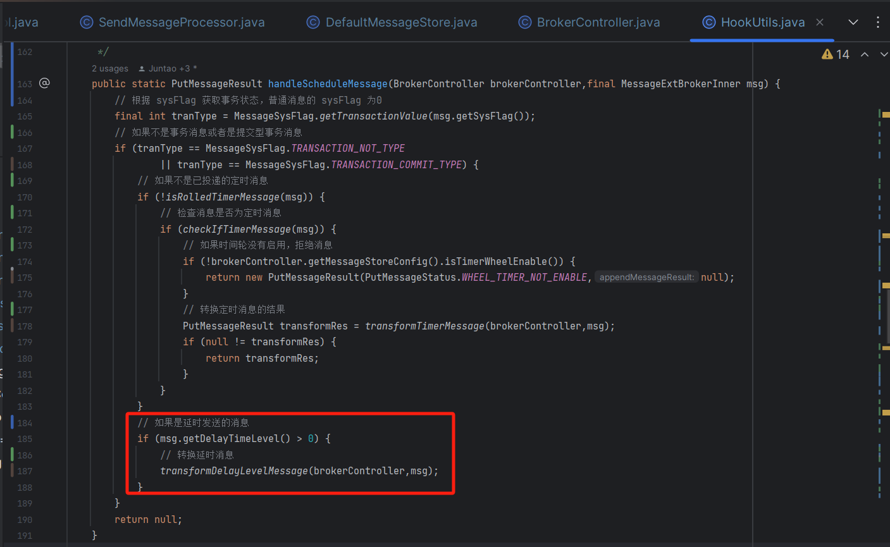

我们再来深度剖析 [transformDelayLevelMessage](http://transformdelaylevelmessage/) 方法。

/\*\*

\* 处理延迟消息

\* @param brokerController

\* @param msg

\*/

public static void transformDelayLevelMessage(BrokerController brokerController, MessageExtBrokerInner msg) {

// 判断是否超过最大延时级别 18 如果超过则设置为最大延时等级

if (msg.getDelayTimeLevel() > brokerController.getScheduleMessageService().getMaxDelayLevel()) {

msg.setDelayTimeLevel(brokerController.getScheduleMessageService().getMaxDelayLevel());

}

// Backup real topic, queueId

// 这里先备份真实的 topic queueId

MessageAccessor.putProperty(msg, MessageConst.PROPERTY\_REAL\_TOPIC, msg.getTopic());

MessageAccessor.putProperty(msg, MessageConst.PROPERTY\_REAL\_QUEUE\_ID, String.valueOf(msg.getQueueId()));

msg.setPropertiesString(MessageDecoder.messageProperties2String(msg.getProperties()));

// 设置延迟消息为 SCHEDULE\_TOPIC\_XXXX 这个固定的topic

msg.setTopic(TopicValidator.RMQ\_SYS\_SCHEDULE\_TOPIC);

// 设置延迟消息的 queueID = delayLevel - 1

msg.setQueueId(ScheduleMessageService.delayLevel2QueueId(msg.getDelayTimeLevel()));

}

这里总结一下：

1.  将原先的 topic 替换为延迟消息固定的 topic: [SCHEDULE\_TOPIC\_XXXX](http://schedule_topic_xxxx/)。
2.  将原先 queueId 替换为 [delayLevel - 1](http://delaylevel%20-%201/)。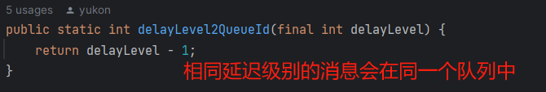
3.  备份原先 topic、queueId, 保存到原先消息的 [properties](http://properties/) 属性中。

  
这样就处理完了一条延迟消息，然后就是存储消息，和普通一样就不赘述了 。不过在消息分发构建消息索引时，将索引单元的的 [tag hashcode](http://tag%20hashcode/) 替换为消息的投递时间。

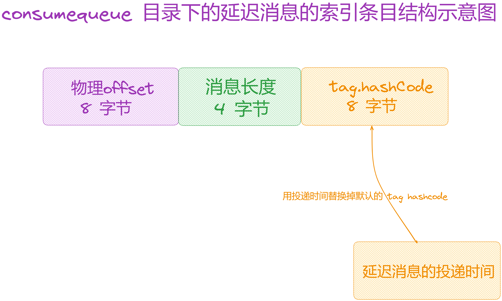

再来深度剖析下延迟消息的消费过程。

## **3.3 延迟消息消费过程**

我们通过查看 [SCHEDULE\_TOPIC\_XXXX](http://schedule_topic_xxxx/) 的调用关系发现有一个方法如下：

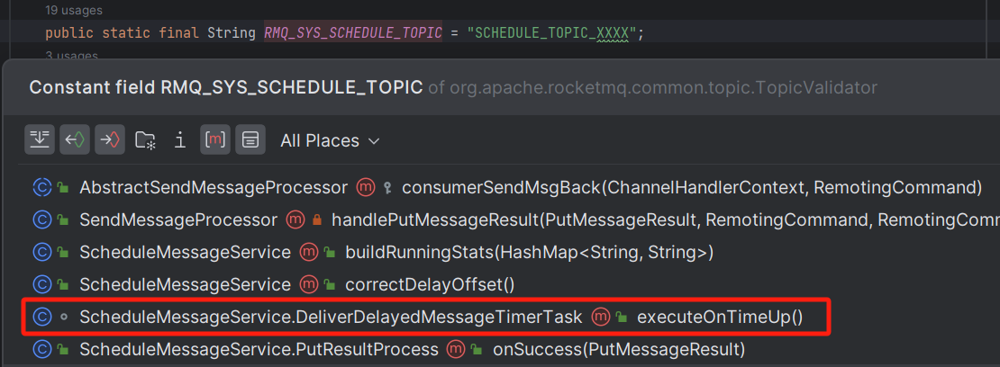

源码位置：[https://github.com/apache/rocketmq/blob/release-5.1.2/store/src/main/java/org/apache/rocketmq/broker/](https://github.com/apache/rocketmq/blob/release-5.1.2/store/src/main/java/org/apache/rocketmq/broker/schedule/ScheduleMessageService.java)[schedule/ScheduleMessageService.](https://github.com/apache/rocketmq/blob/release-5.1.2/store/src/main/java/org/apache/rocketmq/broker/schedule/ScheduleMessageService.java)[java](https://github.com/apache/rocketmq/blob/release-5.1.2/store/src/main/java/org/apache/rocketmq/broker/schedule/ScheduleMessageService.java)

查看其调用链关系：

  
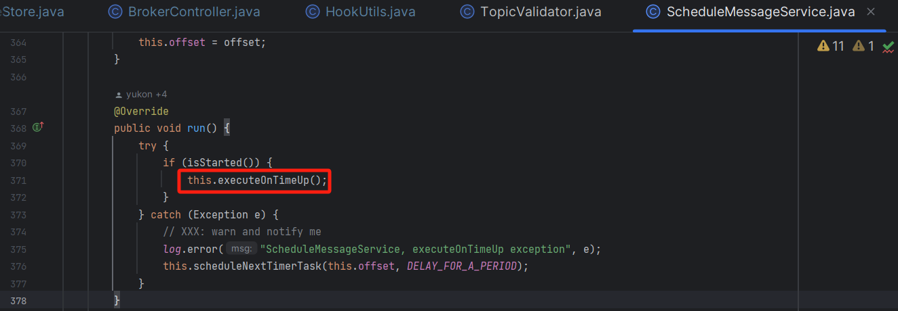

发现很明显使用了一个「**定时器**」定时器去执行的，我们来进一步看下。

public void start() {

// 通过原子操作判断服务是否已经启动，如果未启动则执行以下操作

if (started.compareAndSet(false,true)) {

// 加载相关配置

this.load();

// 创建用来投递延迟消息的定时线程池，最大延迟级别为 maxDelayLevel

this.deliverExecutorService = new ScheduledThreadPoolExecutor(this.maxDelayLevel,new ThreadFactoryImpl("ScheduleMessageTimerThread\_"));

// 如果开启了异步投递，则创建用来处理异步投递的定时线程池

if (this.enableAsyncDeliver) {

this.handleExecutorService = new ScheduledThreadPoolExecutor(this.maxDelayLevel,new ThreadFactoryImpl("ScheduleMessageExecutorHandleThread\_"));

}

// 遍历延迟级别表，为每个级别设置定时任务

for (Map.Entry<Integer,Long> entry :this.delayLevelTable.entrySet()) {

Integer level \= entry.getKey();

Long timeDelay \= entry.getValue();

Long offset \= this.offsetTable.get(level);

if (null == offset) {

offset = 0L;

}

// 如果存在延迟时间，则根据延迟级别创建定时任务

if (timeDelay != null) {

if (this.enableAsyncDeliver) {

this.handleExecutorService.schedule(new HandlePutResultTask(level),FIRST\_DELAY\_TIME,TimeUnit.MILLISECONDS);

}

this.deliverExecutorService.schedule(new DeliverDelayedMessageTimerTask(level,offset),FIRST\_DELAY\_TIME,TimeUnit.MILLISECONDS);

}

}

// 定时持久化任务，定期将数据持久化到存储设备

scheduledPersistService.scheduleAtFixedRate(() -> {

try {

ScheduleMessageService.this.persist();

} catch (Throwable e) {

log.error("scheduleAtFixedRate flush exception",e);

}

},10000,this.brokerController.getMessageStoreConfig().getFlushDelayOffsetInterval(),TimeUnit.MILLISECONDS);

}

}

该方法的关键操作：

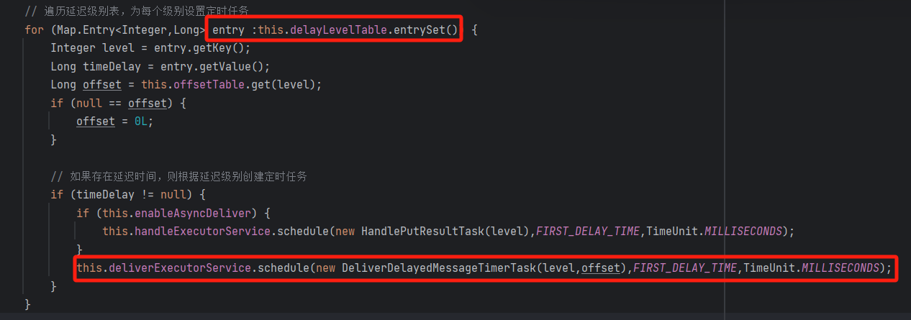

此处的 delayLevelTable 存放的是 18 个延迟等级：

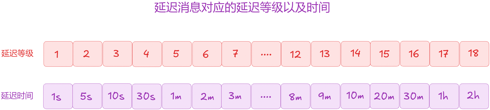

[deliverExecutorService](http://deliverexecutorservice/) 的核心线程数也是 18 个。

// 创建用来投递延迟消息的定时线程池，最大延迟级别为 maxDelayLevel

this.deliverExecutorService = new ScheduledThreadPoolExecutor(this.maxDelayLevel,new ThreadFactoryImpl("ScheduleMessageTimerThread\_"));

[DeliverDelayedMessageTimerTask](http://deliverdelayedmessagetimertask/) 是 [TimerTask](http://timertask/) 的子类，表示一个线程任务；其主要作用是扫描延迟消息队列[SCHEDULE\_TOPIC\_XXXX](http://schedule_topic_xxxx/) 的消息，将该延迟消息转换为真实 Topic 的消息。其核心逻辑都被封装在 [executeOnTimeup](http://executeontimeup/) 方法中，我们重点来剖析。

public void executeOnTimeUp() {

// 根据延迟 topic 和延迟 queueId 去获取 ConsumeQueue

ConsumeQueueInterface cq \=

ScheduleMessageService.this.brokerController.getMessageStore().getConsumeQueue(TopicValidator.RMQ\_SYS\_SCHEDULE\_TOPIC,

delayLevel2QueueId(delayLevel));

// 如果 ConsumeQueue 为空则新增一个 DeliverDelayedMessageTimerTask 丢到 deliverExecutorService 再定时执行，延时时间默认为 100 毫秒

if (cq == null) {

this.scheduleNextTimerTask(this.offset, DELAY\_FOR\_A\_WHILE);

return;

}

// ConsumeQueue 存在但是没有消费文件 一样延时100毫秒后继续重复执行

ReferredIterator<CqUnit> bufferCQ = cq.iterateFrom(this.offset);

if (bufferCQ == null) {

long resetOffset;

if ((resetOffset = cq.getMinOffsetInQueue()) > this.offset) {

log.error("schedule CQ offset invalid. offset={}, cqMinOffset={}, queueId={}",

this.offset, resetOffset, cq.getQueueId());

} else if ((resetOffset = cq.getMaxOffsetInQueue()) < this.offset) {

log.error("schedule CQ offset invalid. offset={}, cqMaxOffset={}, queueId={}",

this.offset, resetOffset, cq.getQueueId());

} else {

resetOffset = this.offset;

}

this.scheduleNextTimerTask(resetOffset, DELAY\_FOR\_A\_WHILE);

return;

}

// 下一次偏移量，offset 用来标记队列读取到哪里了

long nextOffset \= this.offset;

try {

while (bufferCQ.hasNext() && isStarted()) {

CqUnit cqUnit \= bufferCQ.next();

// 解析出 物理偏移量、消息大小、 tagCode

long offsetPy \= cqUnit.getPos();

int sizePy \= cqUnit.getSize();

long tagsCode \= cqUnit.getTagsCode();

if (!cqUnit.isTagsCodeValid()) {

//can't find ext content.So re compute tags code.

log.error("\[BUG\] can't find consume queue extend file content!addr={}, offsetPy={}, sizePy={}",

tagsCode, offsetPy, sizePy);

long msgStoreTime \= ScheduleMessageService.this.brokerController.getMessageStore().getCommitLog().pickupStoreTimestamp(offsetPy, sizePy);

tagsCode = computeDeliverTimestamp(delayLevel, msgStoreTime);

}

// 当前时间

long now \= System.currentTimeMillis();

// 计算投递时间，时间存储在了tag hashcode 中了

// 延时消息时间校验，如果超过 deliverTimestamp now + delayLevel 时间则矫正为 now + delayLevel

long deliverTimestamp \= this.correctDeliverTimestamp(now, tagsCode);

// 当前偏移量

long currOffset \= cqUnit.getQueueOffset();

assert cqUnit.getBatchNum() == 1;

nextOffset = currOffset + cqUnit.getBatchNum();

long countdown \= deliverTimestamp - now;

// 如果延时时间超过当前时间，证明还未到消息处理时间

if (countdown > 0) {

this.scheduleNextTimerTask(currOffset, DELAY\_FOR\_A\_WHILE);

ScheduleMessageService.this.updateOffset(this.delayLevel, currOffset);

return;

}

// 从 Broker 中加载出延时消息

MessageExt msgExt \= ScheduleMessageService.this.brokerController.getMessageStore().lookMessageByOffset(offsetPy, sizePy);

if (msgExt == null) {

continue;

}

// 构建新的消息体，将原来的消息信息设置到这里，并将 topic 和 queueId 设置为原始的 topic 和 queueId (前面备份过）

MessageExtBrokerInner msgInner \= ScheduleMessageService.this.messageTimeUp(msgExt);

if (TopicValidator.RMQ\_SYS\_TRANS\_HALF\_TOPIC.equals(msgInner.getTopic())) {

log.error("\[BUG\] the real topic of schedule msg is {}, discard the msg. msg={}",

msgInner.getTopic(), msgInner);

continue;

}

boolean deliverSuc;

// 将消息再次写入 CommitLog 中，topic 是原始 topic,这样消费者就可以去消费了

if (ScheduleMessageService.this.enableAsyncDeliver) {

deliverSuc = this.asyncDeliver(msgInner, msgExt.getMsgId(), currOffset, offsetPy, sizePy);

} else {

// 将消息写入到 CommitLog 中

deliverSuc = this.syncDeliver(msgInner, msgExt.getMsgId(), currOffset, offsetPy, sizePy);

}

if (!deliverSuc) {

// 没有投递成功的话，一样延时100毫秒后继续重复执行

this.scheduleNextTimerTask(nextOffset, DELAY\_FOR\_A\_WHILE);

return;

}

}

} catch (Exception e) {

log.error("ScheduleMessageService, messageTimeUp execute error, offset = {}", nextOffset, e);

} finally {

// 释放资源

bufferCQ.release();

}

// 延时100毫秒后继续重复执行

this.scheduleNextTimerTask(nextOffset, DELAY\_FOR\_A\_WHILE);

}

我们简单来总结下：

1.  根据延迟 topic 和延迟 queueId 获取对应的 [ConsumeQueue](http://consumequeue/)，并从队列中读取索引单元。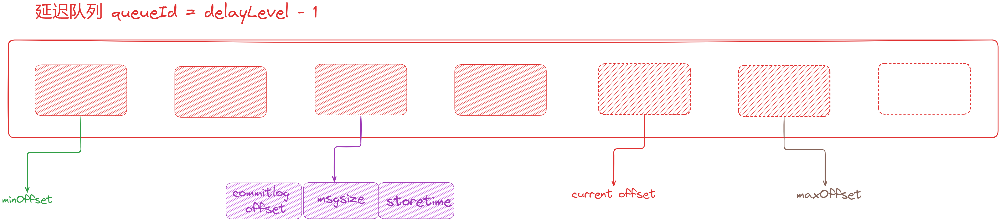
2.  计算消息的投递时间。从索引单元中取出消息的保存时间：延迟消息的索引单元会将 [tag hashcode](http://tag%20hashcode/) 替换为消息的存储时间，然后根据延迟等级获取出延迟时间，然后相加就是消息的投递时间。
3.  如果投递时间到了：
4.  根据索引单元中的 [CommitLog offsetPy](http://commitlog%20offsetpy/) 和 [msg sizePy](http://msg%20sizepy/) 将该条消息从 [CommitLog](http://commitlog%20/) 中读取出来。
5.  将读取出来的消息属性复制到一个新的消息对象体 B 中，将 A 中备份的原始 topic, queueId 读取出来重新设置到 B 中，并清除延迟属性使其成为一条普通消息。
6.  调用 [syncDeliver](http://syncdeliver%20/) 方法，再次将消息 B 写入到 [CommitLog](http://commitlog/) 中。这样消费者就可以消费到订阅了该 topic 的消息。
7.  如果投递时间没到：
8.  计算剩余投递时间 [countdown](http://countdown/)（投递时间-当前时间)，然后开启一个 JDK 的 Timer 延迟任务，延迟时间就是 [countdown](http://countdown/) 继续执行 [DeliverDelayedMessageTimerTask](http://deliverdelayedmessagetimertask/) 的逻辑。
9.  更新延迟消息队列的消费进度。

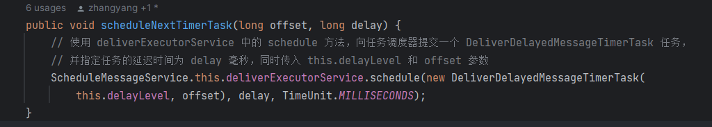

/\*\*

\* 校正投递时间

\* @param now

\* @param deliverTimestamp

\* @return

\*/

private long correctDeliverTimestamp(final long now, final long deliverTimestamp) {

// 将投递时间戳设置为初始结果

long result \= deliverTimestamp;

// 计算最大时间戳，即当前时间 + 当前延迟级别的最大延迟时间

long maxTimestamp \= now + ScheduleMessageService.this.delayLevelTable.get(this.delayLevel);

// 如果投递时间戳大于最大时间戳，则将结果修正为当前时间

if (deliverTimestamp > maxTimestamp) {

result = now;

}

// 返回校正后的结果

return result;

}

最终消息的重新投递是通过 [syncDeliver](http://syncdeliver/) 方法处理的：

private boolean syncDeliver(MessageExtBrokerInner msgInner, String msgId, long offset, long offsetPy,

int sizePy) {

// 投递消息

PutResultProcess resultProcess \= deliverMessage(msgInner, msgId, offset, offsetPy, sizePy, false);

// 获取结果集

PutMessageResult result \= resultProcess.get();

boolean sendStatus \= result != null && result.getPutMessageStatus() == PutMessageStatus.PUT\_OK;

if (sendStatus) {

// 发送成功后更新偏移量

ScheduleMessageService.this.updateOffset(this.delayLevel, resultProcess.getNextOffset());

}

return sendStatus;

}

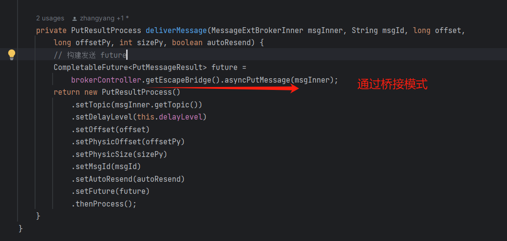

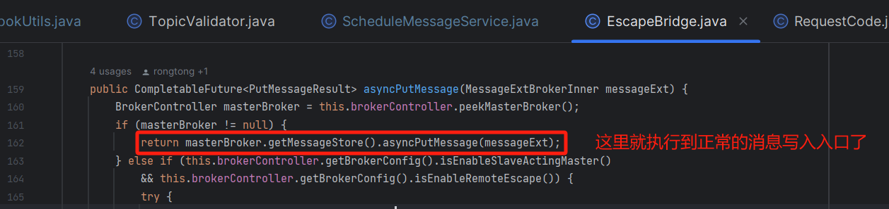

最后如果成功则更新「**延迟消息**」的消费进度，注意「**延迟消息**」的消费进度是存储在 [$user.home/store/config/delayOffset.json](http://$user.home/store/config/delayOffset.json) 中。

> 通过定时任务，每隔 10s 将延迟队列的消费进度 offset 写到文件中。

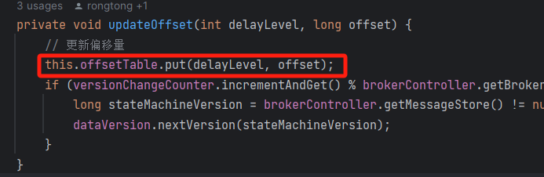

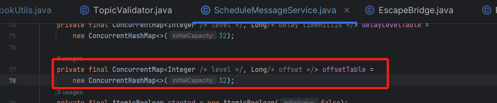

这里简单说下：同一个 [Queue (delayLevel - 1)](http://queue%20\(delaylevel%20-%201\)/) 中消息投递时间的「**延迟等级**」是相同的。那么投递时间就取决于消息存储时间了，即按照消息被发送到 Broker 的时间进行排序的。

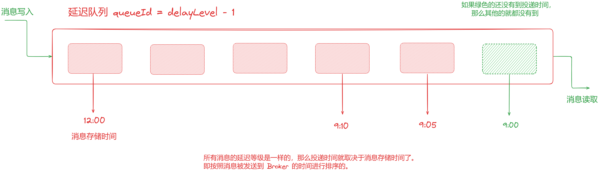

## **04 支持任意时间的延迟消息实现**

在 Rocketmq 5.x 的客户端中，在构造消息时提供了 3 个 API 来指定延迟时间或定时时间。

Message message \= new Message(TOPIC, ("Hello scheduled message " + i).getBytes(StandardCharsets.UTF\_8));

// 延迟 10s 后投递

message.setDelayTimeSec(10);

// 延迟 10000ms 后投递

message.setDelayTimeMs(10\_000L);

// 定时投递，定时时间为当前时间 + 10000ms

message.setDeliverTimeMs(System.currentTimeMillis() + 10\_000L);

// 发送消息

SendResult result \= producer.send(message);

任意时间定时消息的实现存在一定的难点，所以 4.x 版本才会实现「**18 个延迟等级**」的定时消息，作为一个折衷的方案。

个人认为任意时间定时消息的主要难点有以下几个：

1.  [任意的延迟时间](http://xn--boq820b9qbqxin4x1y8ap5i/)：Rocketmq 4.x 的延迟消息的原理简单来说是：将延迟消息先存到一个「**延迟 Topic**」，然后周期性扫描这个 Topic 还未投递的消息是否到期，到期则投递到「**真实 Topic**」中。这个方案的局限性在于扫描的每个队列的消息延迟时间必须是相同的，否则会出现先扫描的消息要后投递的情况。但任意时间定时消息不可能无限制地增加延迟时长对应的队列数量，这是一个难点。
2.  [延迟消息的存储和消息老化](http://xn--k0q02db6a24ojyewqcda339xea011ut1xpq7b/)：在 Rocketmq 的消息是有老化时间的，默认时间为 3 天。这就意味着延迟时间超过 3 天的消息可能会被老化清除，永远无法投递。让定时消息不受老化时间的限制，这也是一个难点。
3.  [大量延迟消息的极端情况](http://xn--87q54pq5edtbkmu74atsk06r4ljkx6c3pe/)：在延迟消息场景下有一种极端情况，就是在同一时刻定时了超大量的消息，需要在一瞬间投递（比如在 8 点延迟了 1 亿条消息）。如果不进行流控直接写入，会把 RocketMQ 冲垮。

基于这些难点我们来看看任意时间的延迟消息是如何实现的，这里我先来设想一下实现思路。

### **任意时间延迟**

实现任意时间的延迟的要点在于知道在某一时刻需要投递哪些消息，以及破除一个队列只能保存同一个延迟等级的消息的限制。

这里是否联想到 RocketMQ 的索引存储文件 [IndexFile](http://indexfile/)，可以通过索引文件来辅助定时消息的查询。需要建立这样的一个索引结构：[Key 是时间戳，Value 表示这个时间要投递的所有定时消息](http://xn--key%20,value%20-my3x448nggsbvhzhu7dnz1blad22ln4l786c4t2c6oq3n1i8dhz08c4sbq86hpa/)。类似如下的结构：

Map<Long /\* 投递时间戳 \*/, List<Message /\* 被延迟的消息 \*/\>>

把这个索引结构以文件的形式实现，其中的 Message 可以仅保存消息的存储位置，投递的时候再查出来。[RIP-43](https://github.com/apache/rocketmq/issues/4557) 中就引入了这样的两个存储文件：[TimerWheel](http://timerwheel/) 和 [TimerLog](http://timerlog/)。

1.  [TimerWheel](http://timerwheel%20/) 是时间轮的抽象，表示投递时间，它保存了 2 天（默认）内的所有时间窗。每个槽位表示一个对应的投递时间窗，并且可以调整槽位对应的时间窗长度来控制定时的精确度。采用时间轮的好处是它可以复用，在 2 天之后无需新建时间轮文件，而是只要将当前的时间轮直接覆盖即可。
2.  [TimerLog](http://timerlog%20/) 是定时消息文件，保存定时消息的索引（在 [CommitLog](http://commitlog%20/) 中存储的位置）。它的存储结构类似 [CommitLog](http://commitlog/)，是 [Append-only Log](http://append-only%20log/)。
3.  [TimerWheel](http://timerwheel%20/) 中的每个槽位都可以保存一个指向 [TimerLog](http://timerlog%20/) 中某个元素的索引，[TimerLog](http://timerlog%20/) 中的元素又保存它前一个元素的索引。也就是说 [TimerLog](http://timerlog%20/) 呈链表结构，存储着 [TimerWheel](http://timerwheel%20/) 对应槽位时间窗所要投递的所有定时消息。

### **任意时间延迟轮转：避免消息延迟老化被删除**

为了防止定时消息在投递之前就被老化删除，能想到的办法主要是两个：

1.  用单独的文件存储，不受 RocketMQ 老化时间限制。这里需要引入新的存储文件，占用磁盘空间。
2.  在定时消息被老化之前，重新将他放入 [CommitLog](http://commitlog/)。这里需要在消息被老化前重新将其放入 [CommitLog](http://commitlog/)，增加了处理逻辑的复杂性。

[RIP-43](https://github.com/apache/rocketmq/issues/4557) 中选择了第二种方案，在定时消息放入时间轮前进行判断，如果在 2 天内要投递（在时间轮的时间窗口之内），则放入时间轮，否则重新放入 [CommitLog](http://commitlog%20/) 进行轮转。

### **任意时间延迟消息划分与解耦**

[RIP-43](https://github.com/apache/rocketmq/issues/4557) 中，将定时消息的「**保存**」和「**投递**」分为多个步骤。为每个步骤单独定义了一个服务线程来处理。

保存：

1.  从定时消息 Topic 中扫描定时消息。
2.  将定时消息的偏移量放入 [TimerLog](http://timerlog%20/) 和 [TimeWheel](http://timewheel%20/) 保存。

投递：

1.  从时间轮中扫描到期的定时消息的偏移量。
2.  根据定时消息偏移量，到 [CommitLog](http://commitlog%20/) 中查询完整的消息体。
3.  将查到的消息投递到 [CommitLog](http://commitlog%20/) 的目标 [Topic](http://topic/)。

每两个步骤之间都使用了生产-消费模式，用一个有界的 [BlockingQueue](http://blockingqueue%20/) 作为任务的缓冲区，通过缓冲区实现每个步骤的流量控制。当队列满时，新的任务需要等待，无法直接执行。

接下来我们深度剖析下其源码实现，前面剖析过，[HookUtils#handleScheduleMessage](http://hookutils/#handleScheduleMessage)：当 Broker 收到 Producer 消息后，这里会处理「**延迟消息**」逻辑。

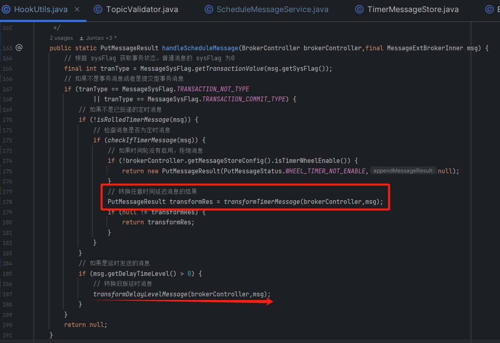

## **4.1 转换任意时间的延迟消息**

/\*\*

\* 转换任意时间的延迟消息

\* @param brokerController

\* @param msg

\* @return

\*/

private static PutMessageResult transformTimerMessage(BrokerController brokerController,

MessageExtBrokerInner msg) {

// 1、将 producer 端设置延迟时间的不同方式，统一转换为目标投递时间戳。

int delayLevel \= msg.getDelayTimeLevel();

long deliverMs;

try {

// 解析消息属性，计算消息的投递时间

if (msg.getProperty(MessageConst.PROPERTY\_TIMER\_DELAY\_SEC) != null) {

deliverMs = System.currentTimeMillis() + Long.parseLong(msg.getProperty(MessageConst.PROPERTY\_TIMER\_DELAY\_SEC)) \* 1000;

} else if (msg.getProperty(MessageConst.PROPERTY\_TIMER\_DELAY\_MS) != null) {

deliverMs = System.currentTimeMillis() + Long.parseLong(msg.getProperty(MessageConst.PROPERTY\_TIMER\_DELAY\_MS));

} else {

deliverMs = Long.parseLong(msg.getProperty(MessageConst.PROPERTY\_TIMER\_DELIVER\_MS));

}

} catch (Exception e) {

return new PutMessageResult(PutMessageStatus.WHEEL\_TIMER\_MSG\_ILLEGAL,null);

}

// 2、最大延迟时间拦截，Timer 消息也并非完全任意时间延迟，有最大延迟时间，默认配置 timerMaxDelaySec = 3天

// 如果消息的投递时间大于当前时间

if (deliverMs > System.currentTimeMillis()) {

// 延迟最大时间 = timerMaxDelaySec = 3600\*24\*3秒 = 3天

if (delayLevel <= 0 && deliverMs - System.currentTimeMillis() > brokerController.getMessageStoreConfig().getTimerMaxDelaySec() \* 1000L) {

return new PutMessageResult(PutMessageStatus.WHEEL\_TIMER\_MSG\_ILLEGAL,null);

}

// 3、延迟时间精度处理， 默认时间精度 timerPrecisionMs = 1000ms，就是目标投递时间会取整到 1s。

int timerPrecisionMs \= brokerController.getMessageStoreConfig().getTimerPrecisionMs();

// 对时间进行处理

if (deliverMs % timerPrecisionMs == 0) {

deliverMs -= timerPrecisionMs;

} else {

deliverMs = deliverMs / timerPrecisionMs \* timerPrecisionMs;

}

// 4、对于时间轮 Slot 级别流控，默认阈值Integer.MAX\_VALUE

// 如果消息存储拒绝了该时间点的消息

if (brokerController.getTimerMessageStore().isReject(deliverMs)) {

return new PutMessageResult(PutMessageStatus.WHEEL\_TIMER\_FLOW\_CONTROL,null);

}

// 5、转换 wheel\_timer 时间轮消息

// 设置消息属性，并修改消息的主题和队列ID

MessageAccessor.putProperty(msg,MessageConst.PROPERTY\_TIMER\_OUT\_MS,deliverMs + "");

// 使用扩展属性 REAL\_TOPIC 记录真实 topic

MessageAccessor.putProperty(msg,MessageConst.PROPERTY\_REAL\_TOPIC,msg.getTopic());

// 使用扩展属性 REAL\_QID 记录真实 queueId

MessageAccessor.putProperty(msg,MessageConst.PROPERTY\_REAL\_QUEUE\_ID,String.valueOf(msg.getQueueId()));

msg.setPropertiesString(MessageDecoder.messageProperties2String(msg.getProperties()));

// 更改 topic 和 queueId 为延迟队列的 topic 和 queueId

msg.setTopic(TimerMessageStore.TIMER\_TOPIC);

// 将目标 queue 替换为 0

msg.setQueueId(0);

} else if (null != msg.getProperty(MessageConst.PROPERTY\_TIMER\_DEL\_UNIQKEY)) {

return new PutMessageResult(PutMessageStatus.WHEEL\_TIMER\_MSG\_ILLEGAL,null);

}

return null;

}

至此 [Timer](http://timer%20/) 消息转换结束，投递到系统 [topic](http://topic%20/) 中，[Timer](http://timer%20/) 消息对应的 [ConsumeQueue](http://consumequeue/) 并不会做特殊处理。

## **4.2 构造时间轮 equeue**

源码位置：[https://github.com/apache/rocketmq/blob/release-5.1.2/store/src/main/java/org/apache/rocketmq/](https://github.com/apache/rocketmq/blob/release-5.1.2/store/src/main/java/org/apache/rocketmq/store/timer/TimerMessageStore.java)[store/timer/TimerMessageStore.](https://github.com/apache/rocketmq/blob/release-5.1.2/store/src/main/java/org/apache/rocketmq/store/timer/TimerMessageStore.java)[java](https://github.com/apache/rocketmq/blob/release-5.1.2/store/src/main/java/org/apache/rocketmq/store/timer/TimerMessageStore.java)

在 Broker 启动时会启动一些基础服务，这里就包括「**任意时间延迟消息服务**」并在初始化服务时对 [TimeMessageStore](http://timemessagestore/) 服务进行加载。

  
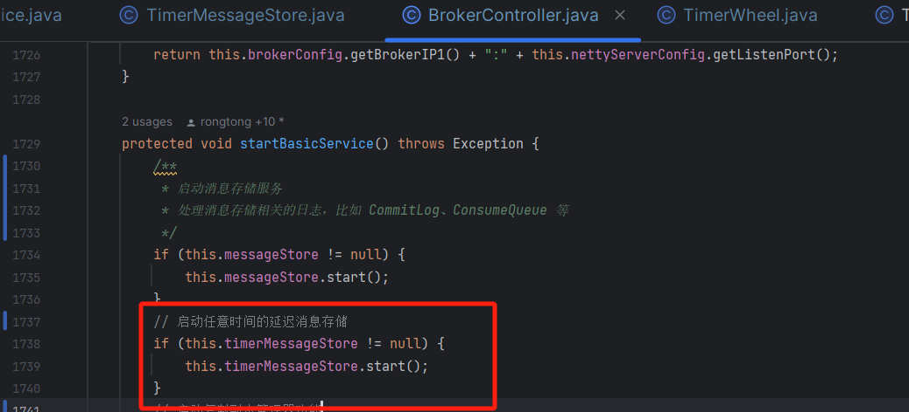

  
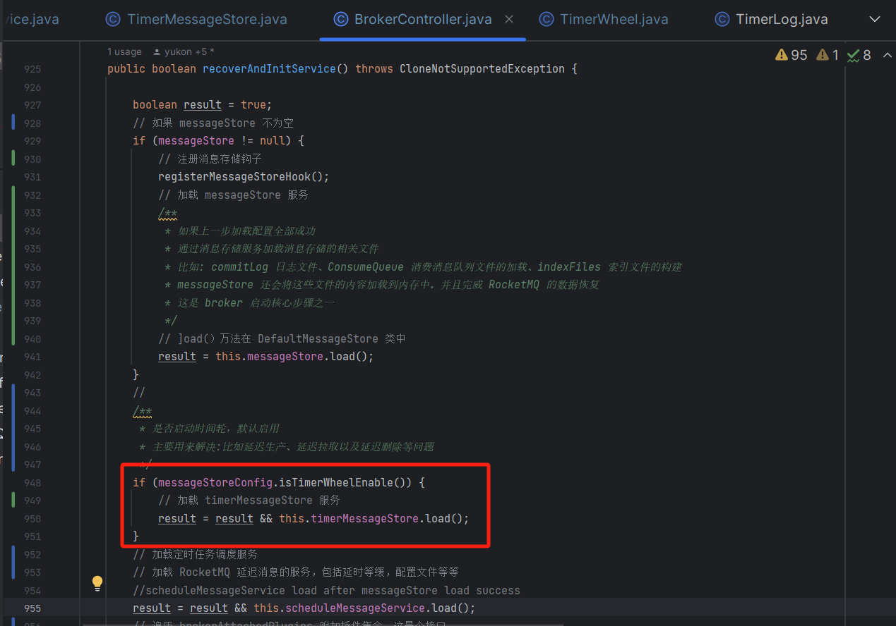

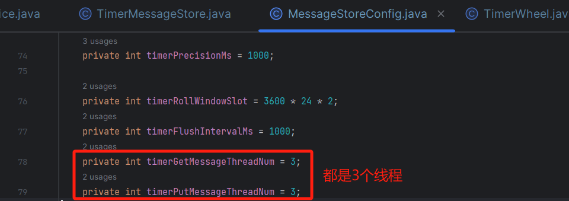

public void initService() {

// 初始化定时器服务实例

enqueueGetService = new TimerEnqueueGetService();

enqueuePutService = new TimerEnqueuePutService();

dequeueWarmService = new TimerDequeueWarmService();

dequeueGetService = new TimerDequeueGetService();

timerFlushService = new TimerFlushService();

// 获取指定数量的消息出队服务线程数, 3个

int getThreadNum \= Math.max(storeConfig.getTimerGetMessageThreadNum(),1);

dequeueGetMessageServices = new TimerDequeueGetMessageService\[getThreadNum\];

// 初始化指定数量的消息出队服务

for (int i \= 0;i < dequeueGetMessageServices.length;i++) {

dequeueGetMessageServices\[i\] = new TimerDequeueGetMessageService();

}

// 获取指定数量的消息入队服务线程数，3个

int putThreadNum \= Math.max(storeConfig.getTimerGetMessageThreadNum(),1);

dequeuePutMessageServices = new TimerDequeuePutMessageService\[putThreadNum\];

// 初始化指定数量的消息入队服务

for (int i \= 0;i < dequeuePutMessageServices.length;i++) {

dequeuePutMessageServices\[i\] = new TimerDequeuePutMessageService();

}

}

public boolean load() {

// 调用初始化服务方法

this.initService();

// 加载定时日志

boolean load \= timerLog.load();

// 加载定时指标并与之前的结果进行与运算

load = load && this.timerMetrics.load();

// 数据恢复

recover();

// 计算定时分布

calcTimerDistribution();

// 返回加载结果

return load;

}

对于时间轮消息而言主要是在 [TimeMessageStore](http://timemessagestore/) 类中实现，它有着多个 [Service](http://service/) 用来处理「**任意时间延迟消息**」在 RocketMQ 内部的各种流转。

  
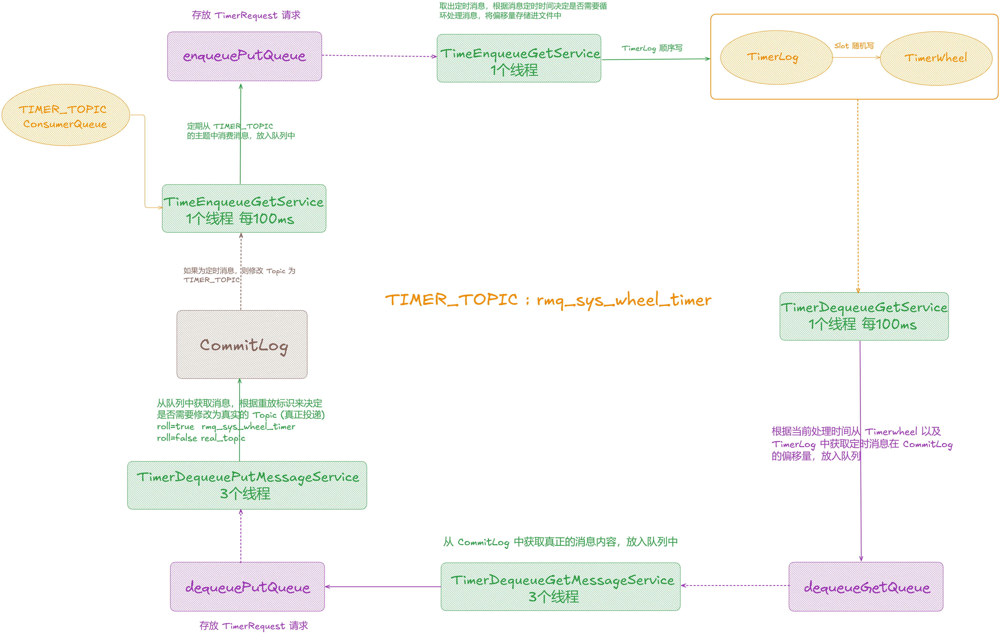

[rmq\_sys\_wheel\_timer](http://rmq_sys_wheel_timer/) 消息会由两个线程处理：[TimerEnqueueGetService](http://timerenqueuegetservice/) 和 [TimerEnqueuePutService](http://timerenqueueputservice/)。

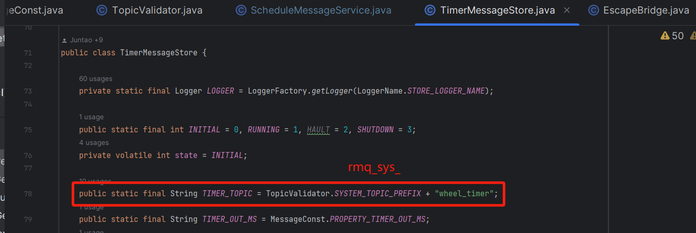

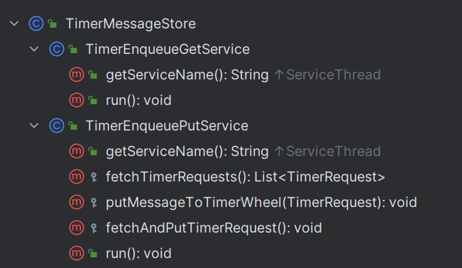

### **4.2.1 生成 TimerRequest 请求**  

[rmq\_sys\_wheel\_timer](http://rmq_sys_wheel_timer/) 只有一个队列，[TimerEnqueueGetService](http://timerenqueuegetservice/) 单线程消费。将每条消息转换为 [TimerRequest](http://timerrequest/)放入内存队列 [enqueuePutQueue](http://enqueueputqueue/)。

/\*\*

\* 该服务负责从主题为 TIMER\_TOPIC 中读取定时消息，并将消息放入 enqueuePutQueue 中

\*/

public class TimerEnqueueGetService extends ServiceThread {

@Override

public String getServiceName() {

return getServiceThreadName() + this.getClass().getSimpleName();

}

/\*\*

\* 每隔 100ms 从 TIMER\_TOPIC 的 ConsumerQueue 中获取消息在 CommitLog 中的位置信息

\*/

@Override

public void run() {

TimerMessageStore.LOGGER.info(this.getServiceName() + " service start");

while (!this.isStopped()) {

try {

// 每隔 100ms 从 TIMER\_TOPIC 的 ConsumerQueue 中获取消息在 CommitLog 中的位置信息

if (!TimerMessageStore.this.enqueue(0)) {

waitForRunning(100L \* precisionMs / 1000);

}

} catch (Throwable e) {

TimerMessageStore.LOGGER.error("Error occurred in " + getServiceName(), e);

}

}

TimerMessageStore.LOGGER.info(this.getServiceName() + " service end");

}

}

生成 [TimerRequest](http://timerrequest%20/) 对应的方法是 [TimerMessageStore#enqueue](http://timermessagestore/#enqueue)，我们先来看下。

/\*\*

\* 从 commitLog 读取指定主题（TIMER\_TOPIC）的定时消息，生成 TimerRequest，放入 enqueuePutQueue

\* @param queueId 定时消息主题队列 ID，默认为 0（定时消息主题只有一个队列）

\* @return 是否取到消息

\*/

public boolean enqueue(int queueId) {

// 未启动时间轮

if (storeConfig.isTimerStopEnqueue()) {

return false;

}

// 未正在运行入队

if (!isRunningEnqueue()) {

return false;

}

// 1、 查询 rmg\_sys\_wheel\_timer 对应的消费队列 ConsumeQueue

ConsumeQueue cq \= (ConsumeQueue) this.messageStore.getConsumeQueue(TIMER\_TOPIC, queueId);

if (null == cq) {

return false;

}

// 如果当前队列偏移量小于 TIMER\_TOPIC 的最小队列偏移量

if (currQueueOffset < cq.getMinOffsetInQueue()) {

LOGGER.warn("Timer currQueueOffset:{} is smaller than minOffsetInQueue:{}",

currQueueOffset, cq.getMinOffsetInQueue());

// 更新当前读取的队列偏移量

currQueueOffset = cq.getMinOffsetInQueue();

}

// 初始化偏移量

long offset \= currQueueOffset;

//2、 根据消费进度，拿到 ConsumeQueue 底层 buffer

SelectMappedBufferResult bufferCQ \= cq.getIndexBuffer(offset);

if (null == bufferCQ) {

return false;

}

try {

int i \= 0;

// 3、循环每条 ConsumeQueue 记录

// 遍历消费队列中的索引，查询消息，封装成 TimerRequest，放入 enqueuePutQueue

for (; i < bufferCQ.getSize(); i += ConsumeQueue.CQ\_STORE\_UNIT\_SIZE) {

perfCounterTicks.startTick("enqueue\_get");

try {

// CommitLog 物理 offset

long offsetPy \= bufferCQ.getByteBuffer().getLong();

// CommitLog 消息大小

int sizePy \= bufferCQ.getByteBuffer().getInt();

bufferCQ.getByteBuffer().getLong(); //tags code

// 4、根据 CommitLog 物理偏移量 + 消息大小从 CommitLog 中获取消息内容

MessageExt msgExt \= getMessageByCommitOffset(offsetPy, sizePy);

if (null == msgExt) {

perfCounterTicks.getCounter("enqueue\_get\_miss");

} else {

lastEnqueueButExpiredTime = System.currentTimeMillis();

lastEnqueueButExpiredStoreTime = msgExt.getStoreTimestamp();

long delayedTime \= Long.parseLong(msgExt.getProperty(TIMER\_OUT\_MS));

// use CQ offset, not offset in Message

msgExt.setQueueOffset(offset + (i / ConsumeQueue.CQ\_STORE\_UNIT\_SIZE));

// 5、 构建 TimerRequest 投递到 enqueuePutQueue ---> TimerEngueuePutService 线程 // 将消息在 CommitLog 的物理偏移量、消息大小、延迟时间、当前时间以及消息本体封装成一个对象 TimerRequest

TimerRequest timerRequest \= new TimerRequest(offsetPy, sizePy, delayedTime, System.currentTimeMillis(), MAGIC\_DEFAULT, msgExt);

// System.out.printf("build enqueue request, %s%n", timerRequest);

// 6、重试入队 enqueuePutQueue，直到成功放入 enqueuePutQueue，达到流控效果

while (!enqueuePutQueue.offer(timerRequest, 3, TimeUnit.SECONDS)) {

if (!isRunningEnqueue()) {

return false;

}

}

}

} catch (Exception e) {

// here may cause the message loss

if (storeConfig.isTimerSkipUnknownError()) {

LOGGER.warn("Unknown error in skipped in enqueuing", e);

} else {

holdMomentForUnknownError();

throw e;

}

} finally {

perfCounterTicks.endTick("enqueue\_get");

}

// if broker role changes, ignore last enqueue

if (!isRunningEnqueue()) {

return false;

}

// 重新计算 currQueueOffset

// 移动消费队列下标，到下一个消费队列索引

currQueueOffset = offset + (i / ConsumeQueue.CQ\_STORE\_UNIT\_SIZE);

}

// 重新计算 currQueueOffset

currQueueOffset = offset + (i / ConsumeQueue.CQ\_STORE\_UNIT\_SIZE);

return i > 0;

} catch (Exception e) {

LOGGER.error("Unknown exception in enqueuing", e);

} finally {

// 释放 bufferCQ 资源

bufferCQ.release();

}

return false;

}

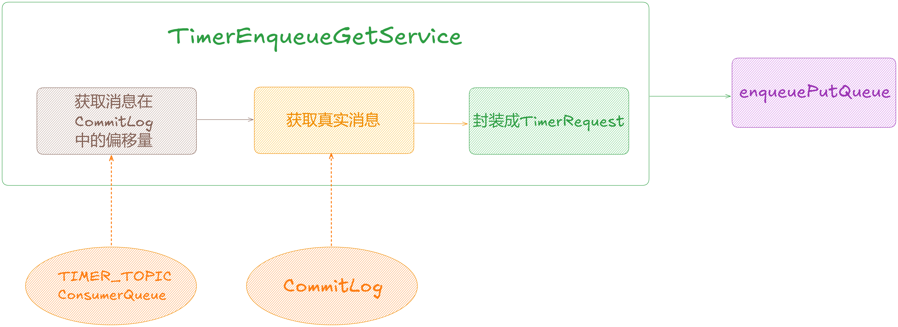

  
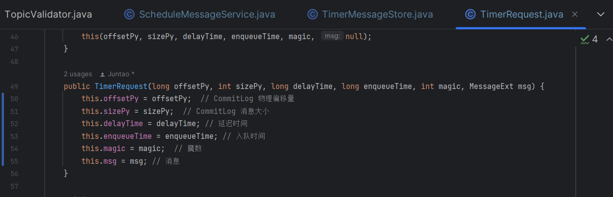

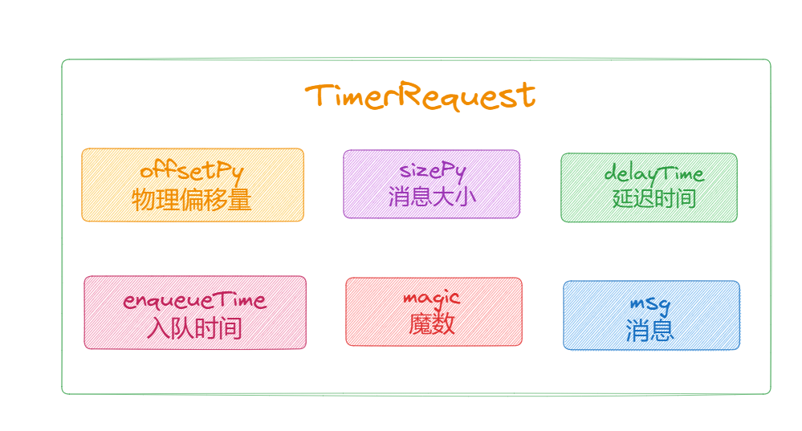

此处的魔数值作用：

> 初始化位置：在 TimerEnqueuePutService 中，根据消息定时时间以及消息中是否携带删除标识（TIMER\_DEL\_UNIQKEY）决定

1.  [DEFAULT](http://default/)：无作用
2.  [ROLL](http://roll/)：表明本条定时消息需要在 [TimerMessageStore](http://timermessagestore/) 的处理中循环处理，直到真正达到消息的定时时刻。
3.  该魔法值也是为了解决消息在 [commitLog](http://commitlog/) 的存储时间问题，要是消息的定时时间过长，将会导致消息超过消费时间，从而被 RockerMQ 清理导致消息丢失。消息每次在被 [TimerMessageStore](http://timermessagestore/) 处理时，都会从[commitLog](http://commitlog/) 取出并消费，此时就会更新销毁时间，那么消息丢失的问题便解决了。
4.  [DELETE](http://delete/)：无实际意义，目前仅用于单元测试。个人猜测在未来的版本中将提供删除未消费 Timer 消息的功能。

### **4.2.2 消费 TimerRequest 请求并投递 Timer 消息进时间轮**

此时，需要处理的延迟消息存放在 [enqueuePutQueue](http://enqueueputqueue/) 中，[TimerEnqueuePutService](http://timerenqueueputservice/) 线程用来消费刚刚生成的 [TimerRequest](http://timerrequest/)，然后批量获取后统一处理，更新 [rmq\_sys\_wheel\_timer](http://rmq_sys_wheel_timer/) 的内存消费进度 [commitQueueOffset](http://commitqueueoffset/)。

public class TimerEnqueuePutService extends ServiceThread {

@Override

public String getServiceName() {

return getServiceThreadName() + this.getClass().getSimpleName();

}

/\*\*

\* collect the requests

\*/

protected List<TimerRequest> fetchTimerRequests() throws InterruptedException {

// 初始化一个 TimerRequest 列表， 合并 11 个请求为一批次

List<TimerRequest> trs = null;

// 从队列中获取第一个定时请求

TimerRequest firstReq \= enqueuePutQueue.poll(10,TimeUnit.MILLISECONDS);

// 如果队列中有 TimerRequest，循环将队列中的所有 TimerRequest 都取出

if (null != firstReq) {

trs = new ArrayList<>(16);

trs.add(firstReq);

// 循环获取队列中的其他请求，最多获取 10 个请求

while (true) {

TimerRequest tmpReq \= enqueuePutQueue.poll(3,TimeUnit.MILLISECONDS);

if (null == tmpReq) {

break;

}

trs.add(tmpReq);

// 最多 10 个请求

if (trs.size() > 10) {

break;

}

}

}

// 返回获取到的请求列表

return trs;

}

/\*\*

\* 写入消息到时间轮中

\* @param req

\*/

protected void putMessageToTimerWheel(TimerRequest req) {

try {

// 开始性能计数

perfCounterTicks.startTick(ENQUEUE\_PUT);

// 计数器+1

DefaultStoreMetricsManager.incTimerEnqueueCount(getRealTopic(req.getMsg()));

// 如果应该运行出队，并且请求的延迟时间小于当前 TimerLog 写入时间，说明消息已经到期则将请求放入出队队列准备投递到 CommitLog，否则执行入队操作

if (shouldRunningDequeue && req.getDelayTime() < currWriteTimeMs) {

dequeuePutQueue.put(req);

} else {

// 执行实际的 TimerRequest 消息入队操作，并进行幂等性释放，处理延迟消息请求成功，CountDownLatch -1

boolean doEnqueueRes \= doEnqueue(req.getOffsetPy(),req.getSizePy(),req.getDelayTime(),req.getMsg());

req.idempotentRelease(doEnqueueRes || storeConfig.isTimerSkipUnknownError());

}

// 结束性能计数

perfCounterTicks.endTick(ENQUEUE\_PUT);

} catch (Throwable t) {

// 记录错误信息并根据配置执行幂等性释放或暂停一段时间后重试

LOGGER.error("Unknown error",t);

if (storeConfig.isTimerSkipUnknownError()) {

req.idempotentRelease(true); // 处理延迟消息请求成功，CountDownLatch -1

} else {

holdMomentForUnknownError();

}

}

}

/\*\*

\* 获取并更新提交队列偏移量

\* @throws Exception

\*/

protected void fetchAndPutTimerRequest() throws Exception {

// 保存当前队列偏移量

long tmpCommitQueueOffset \= currQueueOffset;

// 获取 timer 请求

List<TimerRequest> trs = this.fetchTimerRequests();

// 如果请求列表为空，更新 commitQueueOffset 和 currWriteTimeMs

if (CollectionUtils.isEmpty(trs)) {

commitQueueOffset = tmpCommitQueueOffset;

maybeMoveWriteTime();

return;

}

while (!isStopped()) {

// 创建 CountdownLatch，并发将 TimerRequest 中的消息写入到 TimerLog 中

CountDownLatch latch \= new CountDownLatch(trs.size());

for (TimerRequest req : trs) {

req.setLatch(latch);

this.putMessageToTimerWheel(req);

}

// 检查出队 latch，等待这批 wheel\_timer 所有请求处理完成

checkDequeueLatch(latch, -1);

// 检查请求是否全部处理成功，若是则结束循环，否则暂停一段时间后重试

boolean allSuccess \= trs.stream().allMatch(TimerRequest::isSucc);

if (allSuccess) {

break; // 全部写入成功

} else { // 有写入失败，等待 0.05s

holdMomentForUnknownError();

}

}

// 更新 commitQueueOffset 和 currWriteTimeMs

commitQueueOffset = trs.get(trs.size() - 1).getMsg().getQueueOffset();

maybeMoveWriteTime();

}

@Override

public void run() {

TimerMessageStore.LOGGER.info(this.getServiceName() + " service start");

// 当服务未停止且队列不为空时循环执行

while (!this.isStopped() || enqueuePutQueue.size() != 0) {

try {

// 获取并更新提交队列偏移量

fetchAndPutTimerRequest();

} catch (Throwable e) {

TimerMessageStore.LOGGER.error("Unknown error", e);

}

}

TimerMessageStore.LOGGER.info(this.getServiceName() + " service end");

}

}

源码位置：[https://github.com/apache/rocketmq/blob/release-5.1.2/store/src/main/java/org/apache/rocketmq/](https://github.com/apache/rocketmq/blob/release-5.1.2/store/src/main/java/org/apache/rocketmq/store/timer/TimerWheel.java)[store/timer/TimerWheel.](https://github.com/apache/rocketmq/blob/release-5.1.2/store/src/main/java/org/apache/rocketmq/store/timer/TimerWheel.java)[java](https://github.com/apache/rocketmq/blob/release-5.1.2/store/src/main/java/org/apache/rocketmq/store/timer/TimerWheel.java)

Timer 消息的时间轮主要分为两部分数据：[TimerWheel](http://timerwheel/) 和 [TimerLog](http://timerlog/)。

1.  [TimerLog](http://timerlog/)：顺序写，同样延迟时间的记录形成链表结构，也记录了消息在 [CommitLog](http://commitlog%20/) 中的物理位置。
2.  [TimerWheel](http://timerwheel/) ：随机写，存储 n 个时间槽 Slot，每个槽指向 [TimerLog](http://timerlog/) 中的一条记录（主要是 last 指针）。每次新 [TimerLog](http://timerlog/) 生成，都会定位 Slot 后修改指针指向。

[TimerWheel](http://timerwheel%20/) 按照默认时间精度包含 2 天（[timerRollWindowSlot](http://timerrollwindowslot/)）/1s 个 Slot。这里需要注意时间轮上的几个参数限制：

1.  时间轮总槽位：固定写死14天。
2.  时间轮精度：[timerPrecisionMs](http://timerprecisionms/)，默认 1000 ms，槽位=(目标投递时间戳/timerPrecisionMs)%槽位数。
3.  最大延迟时间：[timerMaxDelaySec](http://timermaxdelaysec/)，默认 3 天，延迟超过 3 天发送 timer 消息失败。
4.  时间轮滚动阈值：[timerRollWindowSlot](http://timerrollwindowslot/)，默认 2 天，即 2-3 天延迟时间的消息都需要滚动，多次写[rmq\_sys\_wheel\_timer](http://rmq_sys_wheel_timer/) 消息。

/\*\*

\* 将 CommitLog 中的定时消息放入 TimerLog 和时间轮

\* @param offsetPy 索引项在 TimerLog 中的物理偏移量

\* @param sizePy 索引项在 TimerLog 中的大小

\* @param delayedTime 延迟投递时间

\* @param messageExt 索引项对应的消息

\* @return 写入 TimerLog 是否成功

\*/

public boolean doEnqueue(long offsetPy, int sizePy, long delayedTime, MessageExt messageExt) {

LOGGER.debug("Do enqueue \[{}\] \[{}\]", new Timestamp(delayedTime), messageExt);

//copy the value first, avoid concurrent problem

long tmpWriteTimeMs \= currWriteTimeMs;

// 1、处理时间轮滚动逻辑

// timerRollWindowSlots 槽位最多2天，超过2天的延迟，需要滚动

boolean needRoll \= delayedTime - tmpWriteTimeMs >= (long) timerRollWindowSlots \* precisionMs;

int magic \= MAGIC\_DEFAULT;

// 如果需要滚动，确定延迟时间在哪个 slot

if (needRoll) {

// 对于延迟超出 2 天的时间需要执行滚动，2~2.66 天会放在 1 天的槽位上，2.66~3 天（前面限制最多 3 天）会放在 2 天的槽位上。

magic = magic | MAGIC\_ROLL;

if (delayedTime - tmpWriteTimeMs - (long) timerRollWindowSlots \* precisionMs < (long) timerRollWindowSlots / 3 \* precisionMs) {

//give enough time to next roll

// 2天~2.66天 ---> 槽位延迟时间 = 1天

delayedTime = tmpWriteTimeMs + (long) (timerRollWindowSlots / 2) \* precisionMs;

} else {

// 2.66天~3天 ---> 槽位延迟时间 = 2天

delayedTime = tmpWriteTimeMs + (long) timerRollWindowSlots \* precisionMs;

}

}

// 是否是取消延迟消息

boolean isDelete \= messageExt.getProperty(TIMER\_DELETE\_UNIQUE\_KEY) != null;

if (isDelete) {

magic = magic | MAGIC\_DELETE;

}

// 真实 Topic

String realTopic \= messageExt.getProperty(MessageConst.PROPERTY\_REAL\_TOPIC);

// 对于延迟小于2天，直接能根据延迟时间找到对应槽位

// 2、定位时间轮 slot

Slot slot \= timerWheel.getSlot(delayedTime);

// 构建 timerLog

ByteBuffer tmpBuffer \= timerLogBuffer;

tmpBuffer.clear(); // 先清空

tmpBuffer.putInt(TimerLog.UNIT\_SIZE); //size

tmpBuffer.putLong(slot.lastPos); //prev pos Slot 中上一条 TimerLog 物理 offset

tmpBuffer.putInt(magic); //magic 是否滚动、是否删除

tmpBuffer.putLong(tmpWriteTimeMs); //currWriteTime

tmpBuffer.putInt((int) (delayedTime - tmpWriteTimeMs)); //delayTime

tmpBuffer.putLong(offsetPy); //offset 消息物理 offset

tmpBuffer.putInt(sizePy); //size 消息大小

tmpBuffer.putInt(hashTopicForMetrics(realTopic)); //hashcode of real topic

tmpBuffer.putLong(0); //reserved value, just set to 0 now

// 3、顺序写 timerLog

long ret \= timerLog.append(tmpBuffer.array(), 0, TimerLog.UNIT\_SIZE);

if (-1 != ret) {

// If it's a delete message, then slot's total num -1

// TODO: check if the delete msg is in the same slot with "the msg to be deleted".

// 写入 TimerLog 成功，将写入 TimerLog 的消息加入时间轮

timerWheel.putSlot(delayedTime, slot.firstPos == -1 ? ret : slot.firstPos, ret,

isDelete ? slot.num - 1 : slot.num + 1, slot.magic);

addMetric(messageExt, isDelete ? -1 : 1);

}

return -1 != ret;

}

public class TimerLog {

private static Logger log \= LoggerFactory.getLogger(LoggerName.STORE\_LOGGER\_NAME);

// BLANK\_MAGIC\_CODE的值

public final static int BLANK\_MAGIC\_CODE \= 0xBBCCDDEE ^ 1880681586 + 8;

// 最小空白长度

private final static int MIN\_BLANK\_LEN \= 4 + 8 + 4;

// 定时消息单元的大小

public final static int UNIT\_SIZE \= 4 //size

\+ 8 //prev pos

\+ 4 //magic value

\+ 8 //curr write time,for trace

\+ 4 //delayed time,for check

\+ 8 //offsetPy

\+ 4 //sizePy

\+ 4 //hash code of real topic

\+ 8;//reserved value,just in case of

// 用于消息单元的预定义大小

public final static int UNIT\_PRE\_SIZE\_FOR\_MSG \= 28;

// 用于度量单元的预定义大小

public final static int UNIT\_PRE\_SIZE\_FOR\_METRIC \= 40;

// MappedFileQueue实例

private final MappedFileQueue mappedFileQueue;

// 文件大小

private final int fileSize;

public TimerLog(final String storePath, final int fileSize) {

this.fileSize = fileSize;

this.mappedFileQueue = new MappedFileQueue(storePath, fileSize, null);

}

/\*\*

\* 将定时消息索引写入 TimerLog

\* @param data

\* @param pos

\* @param len

\* @return 写入的物理偏移量，写入失败返回 -1

\*/

public long append(byte\[\] data, int pos, int len) {

// 获取最后一个 mappedFile

MappedFile mappedFile \= this.mappedFileQueue.getLastMappedFile();

// 如果最后一个 mappedFile 为空或已满

if (null == mappedFile || mappedFile.isFull()) {

// 获取第一个 mappedFile

mappedFile = this.mappedFileQueue.getLastMappedFile(0);

}

if (null == mappedFile) {

log.error("Create mapped file1 error for timer log");

return -1;

}

// 如果待追加的数据长度加上最小空白长度大于映射文件剩余空间

if (len + MIN\_BLANK\_LEN > mappedFile.getFileSize() - mappedFile.getWrotePosition()) {

// 创建一个ByteBuffer，并放入空白信息

ByteBuffer byteBuffer \= ByteBuffer.allocate(MIN\_BLANK\_LEN);

byteBuffer.putInt(mappedFile.getFileSize() - mappedFile.getWrotePosition());

byteBuffer.putLong(0);

byteBuffer.putInt(BLANK\_MAGIC\_CODE);

// 将 ByteBuffer 中的内容追加到 mappedFile 中

if (mappedFile.appendMessage(byteBuffer.array())) {

//need to set the wrote position

// 设置写入位置为 mappedFile 大小

mappedFile.setWrotePosition(mappedFile.getFileSize());

} else {

log.error("Append blank error for timer log");

return -1;

}

// 获取第一个 mappedFile

mappedFile = this.mappedFileQueue.getLastMappedFile(0);

if (null == mappedFile) {

log.error("create mapped file2 error for timer log");

return -1;

}

}

// 计算当前位置为 mappedFile 起始偏移量加上写入位置

long currPosition \= mappedFile.getFileFromOffset() + mappedFile.getWrotePosition();

// 将定时消息索引写入 TimerLog

if (!mappedFile.appendMessage(data, pos, len)) {

log.error("Append error for timer log");

return -1;

}

return currPosition;

}

public SelectMappedBufferResult getTimerMessage(long offsetPy) {

// 根据物理偏移量找到对应的 mappedFile

MappedFile mappedFile \= mappedFileQueue.findMappedFileByOffset(offsetPy);

// 如果找不到 mappedFile，则返回null

if (null == mappedFile)

return null;

// 选取 mappedFile 中，从偏移量对映射文件大小取模的位置开始的映射缓冲区

return mappedFile.selectMappedBuffer((int) (offsetPy % mappedFile.getFileSize()));

}

/\*\*

\* 根据偏移量获取 Buffer

\* @param offsetPy

\* @return

\*/

public SelectMappedBufferResult getWholeBuffer(long offsetPy) {

// 根据物理偏移量查找对应的映射文件

MappedFile mappedFile \= mappedFileQueue.findMappedFileByOffset(offsetPy);

// 如果映射文件为空，则返回null

if (null == mappedFile)

return null;

// 从映射文件中选择整个映射缓冲区的内容并返回

return mappedFile.selectMappedBuffer(0);

}

}

重要处理逻辑有以下两步：

1.  处理时间轮滚动逻辑。
2.  对于延迟小于 2 天，直接能根据延迟时间找到对应槽位。
3.  对于延迟超出 2 天的时间需要执行滚动，2~2.66 天会放在1天的槽位上，2.66~3天（前面限制最多3天）会放在 2 天的槽位上。
4.  根据延迟时间定位时间轮 Slot，顺序写入 [TimerLog](http://timerlog/)，timer 目录下多个定长 100M 文件 。
5.  [TimerLog](http://timerlog%20/) 包含几个关键字段：
6.  [slot.lastPos](http://slot.lastpos/)：同一个 Slot 中的消息在 TimerLog 中形成单向链表，用来后续遍历。
7.  [offsetPy/sizePy](http://offsetpy/sizePy)：原始消息的物理offset和大小，用来后续定位消息。
8.  [magic](http://magic/)：是否滚动、是否删除；
9.  [tmpWriteTimeMs](http://tmpwritetimems/)：写时间。
10.  [delayedTime-tmpWriteTimeMs](http://delayedtime-tmpwritetimems/)：相较于写时间的延迟秒数。
11.  顺序写，更新 TimerWheel 中 Slot 信息，其中 [timerwheel](http://timerwheel/) 文件，默认 2天/1s 个 slot 大小。

注意：Slot 不存储实际数据，是指向 [TimerLog](http://timerlog%20/) 的指针。

/\*\*

\* 时间轮，用于定时消息到时

\*/

public class TimerWheel {

/\*\*

\* 将 TimerLog 写入的消息放入时间轮槽位：Slot 不存储实际数据，是指向 TimerLog 的指针。

\* @param timeMs 延迟时间

\* @param firstPos Slot 中第一个消息对应 timerLog 的物理 offset

\* @param lastPos Slot 中最后一个消息对应 timerLog 的物理 offset

\* @param num Slot 中消息数量

\* @param magic 魔数 保留位

\*/

public void putSlot(long timeMs, long firstPos, long lastPos, int num, int magic) {

localBuffer.get().position(getSlotIndex(timeMs) \* Slot.SIZE);

localBuffer.get().putLong(timeMs / precisionMs); // 延迟时间

localBuffer.get().putLong(firstPos); // Slot 中第一个消息对应 timerLog 的物理 offset

localBuffer.get().putLong(lastPos); // Slot 中最后一个消息对应 timerLog 的物理 offset

localBuffer.get().putInt(num); // Slot 中消息数量

localBuffer.get().putInt(magic); // 魔数 保留位

}

public int getSlotIndex(long timeMs) {

// 根据目标延迟时间找 Slot 按照 slot 数量取模

// 时间除以精度，然后对槽位总数 \* 2 取余

return (int) (timeMs / precisionMs % (slotsTotal \* 2));

}

}

从 [TimeMessageStore](http://timemessagestore/) 类构造方法中 [timerwheel](http://timerwheel%20/) 文件大小的角度来看，实际底层有 2 倍 [slotsTotal](http://slotstotal/) 个 Slot，硬编码 14 天，但这并不妨碍由[timerRollWindowSlot](http://timerrollwindowslot/) 控制按照 2 天进行滚动。

// 时间轮过期时间 7 天

public static final int TIMER\_WHEEL\_TTL\_DAY \= 7;

// 一天秒数

public static final int DAY\_SECS \= 24 \* 3600;

// TimerWheel contains the fixed number of slots regardless of precision.

this.slotsTotal = TIMER\_WHEEL\_TTL\_DAY \* DAY\_SECS;

this.timerWheel = new TimerWheel(

getTimerWheelPath(storeConfig.getStorePathRootDir()), this.slotsTotal, precisionMs);

这里我们来总结下：

1\. 先判断对象的延迟时间是否已经过期了，如果过期了就马上放到 [dequeuePutQueue](http://dequeueputqueue%20/) 队列中。

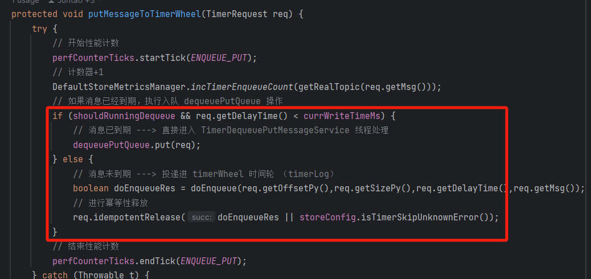

2\. 根据对象的延迟时间减去当前写入时间轮的时间要是大于重试的时间，则将该消息对应的 [TimerRequest](http://timerrequest%20/) 魔数值标识为 [ROLL](http://roll/)。

// 计算公式

boolean needRoll \= delayedTime - tmpWriteTimeMs >= (long) timerRollWindowSlots \* precisionMs;

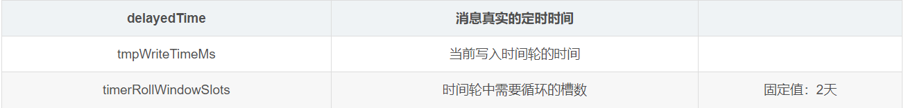在计算完 [ROLL](http://roll%20/) 的魔数值后，还会看消息是否携带 [TIMER\_DEL\_UNIQKEY](http://timer_del_uniqkey/) 属性来设置该消息用于删除其他定时消息。

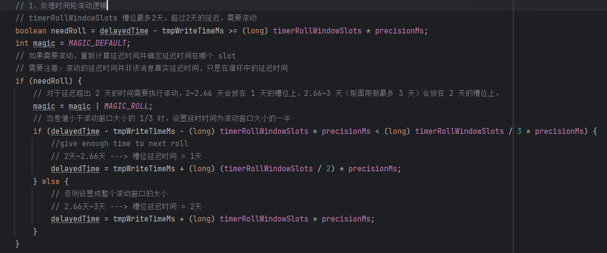

3\. 从 [TimerRequest](http://timerrequest/) 对象中获取以下关键信息持久化到 [TimerLog](http://timerlog/) 中。

[RIP-43](https://github.com/apache/rocketmq/issues/4557) 中就引入了这样的两个存储文件：[TimerWheel](http://timerwheel%20/) 和 [TimerLog](http://timerlog/)，[TimerLog](http://timerlog%20/) 与 [TimerWheel](http://timerwheel%20/) 配合，一起表示某一时刻需要投递的定时消息集合。

它的形式是与 [CommitLog](http://commitlog%20/) 相似的 [Append-only Log](http://append-only%20log/)，不过每一项不需要保存消息的全量信息，只保存了消息在 [CommitLog](http://commitlog%20/) 上的物理偏移量，节省空间。

它与 [TimerWheel](http://timerwheel%20/) 中的槽位组成链表结构，所以它的每一项也有一个指向该项上一项的指针。

  
它的每一项结构如下：

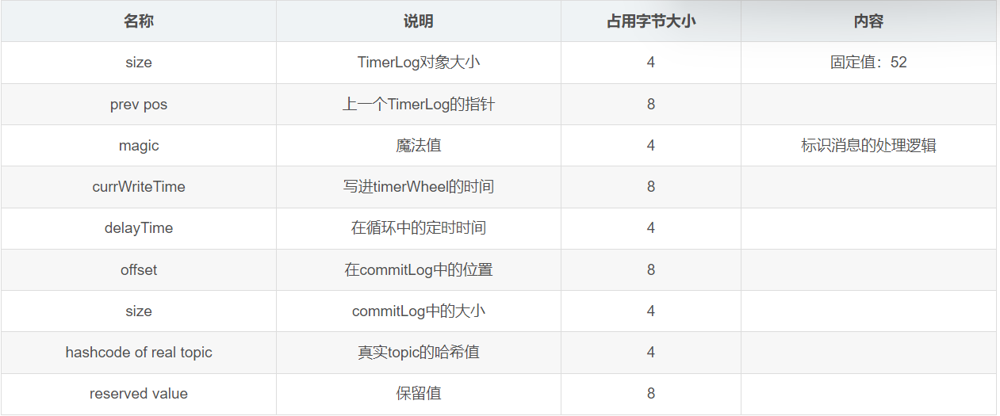

4\. 根据当前写入时间轮时间获取时间轮对应的槽后，将上面第 3 步持久化成功后 [TimerLog](http://timerlog/) 得到的位置偏移量更新到 [TimerWheel](http://timerwheel/) 中，维持时间轮中槽的最后一条 [TimerLog](http://timerlog/) 消息位置。

时间轮是对时刻表的抽象，内部实际上是一个数组，表示一段时间。每项都是一个槽位，表示时刻表上的每一秒。采用时间轮的好处在于它可以循环使用，在时间轮表示的这段时间过去之后，无需创建新的文件，直接可以表示下一段时间。时间轮的每个槽位表示这一时刻需要投递的所有定时消息，槽位中保存了指向 [TimerLog](http://timerlog/) 的指针，与 [TimerLog](http://timerlog/) 一同构成一个链表，表示这组消息。

时间轮槽结构：

  

带字段和大小时间轮槽结构：

1.  [first\_pos](http://first_pos/)： [TimerLog](http://timerlog/) 中该时刻定时消息链表的第一个消息的物理偏移量（链表尾）。
2.  [last\_pos](http://last_pos/)： [TimerLog](http://timerlog/) 中该时刻定时消息链表的最后（最新）一个消息的物理偏移量（链表头）。

5\. 等待该批次的 [TimerRequest](http://timerrequest/) 都处理完成后，才进行下一次的循环。

总之，[TimerEnqueuePutService](http://timerenqueueputservice/) 会使用 [CountDownLatch](http://countdownlatch/) 等待每批次的消息都处理完成（保存或者入队到[dequeuePutQueue](http://dequeueputqueue/) 中）才进行下一批次的处理。

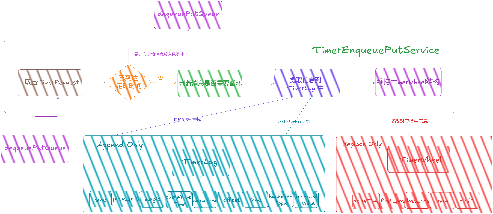

## **4.3 处理时间轮 dequeue**

当消息进入「**时间轮**」后就可以「**按照时间顺序**」进行处理了。

### **4.3.1 重建 TimerRequest 请求**

/\*\*

\* 重建 TimerRequest

\* 获取时间轮一个槽位中对应的 TimerLog 定时消息请求列表，放入 dequeueGetQueue 中处理

\* @return 0：当前读取的时间轮槽为空 no message，1：处理成功，2：处理失败

\* @throws Exception

\*/

public int dequeue() throws Exception {

// 未启动时间轮

if (storeConfig.isTimerStopDequeue()) {

return -1;

}

// 未正在运行出队

if (!isRunningDequeue()) {

return -1;

}

if (currReadTimeMs >= currWriteTimeMs) {

return -1;

}

// 1、TimerDequeueGetService 单线程根据时间找到时间轮对应 Slot。

// 这部分消息可能是未到期需要滚动的（2-3天），也可能是已经到期的（2天内），这会在最后一步处理。

Slot slot \= timerWheel.getSlot(currReadTimeMs);

if (-1 == slot.timeMs) {

moveReadTime(); // 如果当前槽为空，推进时间轮并返回

return 0;

}

try {

//clear the flag

dequeueStatusChangeFlag = false;

// 2、根据 Slot 的 lastPos 从后向前依次处理 TimerLog 记录。

// 从 slot 中最后一条 TimerLog 记录开始处理

long currOffsetPy \= slot.lastPos;

// 存储需要删除的唯一键

Set<String> deleteUniqKeys = new ConcurrentSkipListSet<>();

// 存储正常消息和删除消息

LinkedList<TimerRequest> normalMsgStack = new LinkedList<>();

LinkedList<TimerRequest> deleteMsgStack = new LinkedList<>();

// 存储读取的 SelectMappedBufferResult

LinkedList<SelectMappedBufferResult> sbrs = new LinkedList<>();

SelectMappedBufferResult timeSbr \= null;

//read the timer log one by one

// 从 TimerLog 链表中一个一个读取索引项，放入请求栈

while (currOffsetPy != -1) {

perfCounterTicks.startTick("dequeue\_read\_timerlog");

// 从 timerLog 读取 buffer

if (null == timeSbr || timeSbr.getStartOffset() > currOffsetPy) {

timeSbr = timerLog.getWholeBuffer(currOffsetPy);

if (null != timeSbr) {

// 存储读取结果集

sbrs.add(timeSbr);

}

}

if (null == timeSbr) {

break;

}

long prevPos \= -1; // TimerLog 链表前一个索引项的物理偏移量

try {

// 3、将 TimerLog 记录重新组装为 TimerRequest

int position \= (int) (currOffsetPy % timerLogFileSize);

timeSbr.getByteBuffer().position(position);

timeSbr.getByteBuffer().getInt(); //size

prevPos = timeSbr.getByteBuffer().getLong();

int magic \= timeSbr.getByteBuffer().getInt(); // 魔数

long enqueueTime \= timeSbr.getByteBuffer().getLong(); // 入队时间

long delayedTime \= timeSbr.getByteBuffer().getInt() + enqueueTime; // 延迟时间

long offsetPy \= timeSbr.getByteBuffer().getLong(); // CommitLog 物理偏移量

int sizePy \= timeSbr.getByteBuffer().getInt(); // CommitLog 消息大小

// 构建 TimerRequest 请求

TimerRequest timerRequest \= new TimerRequest(offsetPy, sizePy, delayedTime, enqueueTime, magic);

timerRequest.setDeleteList(deleteUniqKeys);

if (needDelete(magic) && !needRoll(magic)) {

deleteMsgStack.add(timerRequest); // 取消延迟消息

} else {

// 添加正常消息

normalMsgStack.addFirst(timerRequest);

}

} catch (Exception e) {

LOGGER.error("Error in dequeue\_read\_timerlog", e);

} finally {

currOffsetPy = prevPos; // 读取 TimerLog 链表中前一项

perfCounterTicks.endTick("dequeue\_read\_timerlog");

}

}

if (deleteMsgStack.size() == 0 && normalMsgStack.size() == 0) {

LOGGER.warn("dequeue time:{} but read nothing from timerLog", currReadTimeMs);

}

for (SelectMappedBufferResult sbr : sbrs) {

if (null != sbr) {

sbr.release();

}

}

if (!isRunningDequeue()) {

return -1;

}

// 4、删除消息处理：将 TimerRequest 分批放入内存队列 dequeueGetQueue，CountDownLatch 等待处理完成

CountDownLatch deleteLatch \= new CountDownLatch(deleteMsgStack.size());

//read the delete msg: the msg used to mark another msg is deleted

for (List<TimerRequest> deleteList : splitIntoLists(deleteMsgStack)) {

for (TimerRequest tr : deleteList) {

tr.setLatch(deleteLatch);

}

// 分批放入内存队列 dequeueGetQueue

dequeueGetQueue.put(deleteList);

}

//do we need to use loop with tryAcquire

// 等待延迟消息删除请求处理（放入 dequeuePutQueue）

checkDequeueLatch(deleteLatch, currReadTimeMs);

// 5、正常消息处理：将 TimerRequest 分批放入内存队列 dequeueGetQueue，CountDownLatch 等待处理完成

CountDownLatch normalLatch \= new CountDownLatch(normalMsgStack.size());

//read the normal msg

for (List<TimerRequest> normalList : splitIntoLists(normalMsgStack)) {

for (TimerRequest tr : normalList) {

tr.setLatch(normalLatch);

}

dequeueGetQueue.put(normalList);

}

// 等待正常消息请求处理（放入 dequeuePutQueue）

checkDequeueLatch(normalLatch, currReadTimeMs);

// if master -> slave -> master, then the read time move forward, and messages will be lossed

if (dequeueStatusChangeFlag) {

return -1;

}

if (!isRunningDequeue()) {

return -1;

}

moveReadTime(); // 推进时间轮

} catch (Throwable t) {

LOGGER.error("Unknown error in dequeue process", t);

if (storeConfig.isTimerSkipUnknownError()) {

moveReadTime(); // 推进时间轮

}

}

return 1;

}

重要步骤如下：

1.  [TimerDequeueGetService](http://timerdequeuegetservice/) 单线程根据时间找到时间轮对应 Slot。
2.  这部分消息可能是未到期需要滚动的（2-3天），也可能是已经到期的（2天内），这会在最后一步处理。
3.  根据 Slot 的 [lastPos](http://lastpos/) 从后向前依次处理 [TimerLog](http://timerlog/) 记录。
4.  将 [TimerLog](http://timerlog/) 记录重新组装为 [TimerRequest](http://timerrequest/)。
5.  将 [TimerRequest](http://timerrequest/) 分批放入内存队列 [dequeueGetQueue](http://dequeuegetqueue/)，[CountDownLatch](http://countdownlatch%20/) 等待处理完成。

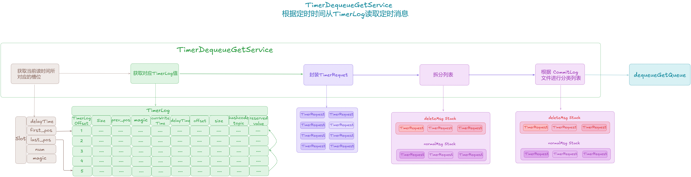

###   
**4.3.2 填充 TimerRequest 请求**

这一步开始多线程处理（默认3个线程），因为所有 [TimerRequest](http://timerrequest/) 都需要滚动或投递。

[TimerDequeueGetMessageService](http://timerdequeuegetmessageservice/) 线程的作用就是，从 [CommitLog](http://commitlog%20/) 读消息，填充 [TimerRequest](http://timerrequest/)，提交[TimerRequest](http://timerrequest/) 到下一个内存队列。

/\*\*

\* 从 CommitLog 读消息，填充 TimerRequest，提交TimerRequest 到下一个内存队列

\*/

public class TimerDequeueGetMessageService extends AbstractStateService {

@Override

public String getServiceName() {

return getServiceThreadName() + this.getClass().getSimpleName();

}

@Override

public void run() {

// 设置状态 启动

setState(AbstractStateService.START);

TimerMessageStore.LOGGER.info(this.getServiceName() + " service start");

while (!this.isStopped()) {

try {

// 设置状态 等待中

setState(AbstractStateService.WAITING);

// 1、从出队队列中获取到期的 TimerRequest 请求

List<TimerRequest> trs = dequeueGetQueue.poll(100L \* precisionMs / 1000,TimeUnit.MILLISECONDS);

if (null == trs || trs.size() == 0) {

continue;

}

// 设置状态 运行中

setState(AbstractStateService.RUNNING);

// 遍历处理每个 TimerRequest 请求

for (int i \= 0;i < trs.size();) {

TimerRequest tr \= trs.get(i);

boolean doRes \= false;

try {

long start \= System.currentTimeMillis();

// 2、根据偏移量和大小从 CommitLog 中获取目标消息

MessageExt msgExt \= getMessageByCommitOffset(tr.getOffsetPy(),tr.getSizePy());

if (null != msgExt) {

// 判断是否需要删除，并进行相应处理

if (needDelete(tr.getMagic()) && !needRoll(tr.getMagic())) {

// 删除消息请求

if (msgExt.getProperty(MessageConst.PROPERTY\_TIMER\_DEL\_UNIQKEY) != null && tr.getDeleteList() != null) {

tr.getDeleteList().add(msgExt.getProperty(

MessageConst.PROPERTY\_TIMER\_DEL\_UNIQKEY));

}

// 进行幂等性释放，处理延迟消息请求成功，CountDownLatch -1

tr.idempotentRelease();

doRes = true;

} else {

// 普通消息请求，生成唯一键，并处理消息放入入队队列

String uniqueKey \= MessageClientIDSetter.getUniqID(msgExt);

if (null == uniqueKey) {

LOGGER.warn("No uniqueKey for msg:{}",msgExt);

}

if (null != uniqueKey && tr.getDeleteList() != null && tr.getDeleteList().size() > 0 && tr.getDeleteList().contains(uniqueKey)) {

doRes = true; // 延迟消息取消，什么都不做

// 进行幂等性释放，处理定时消息请求成功，CountDownLatch -1

tr.idempotentRelease();

perfCounterTicks.getCounter("dequeue\_delete").flow(1);

} else {

// 3、目标消息填充 TimerRequest, 放入 dequeuePutQueue 中，准备投递到 CommitLog

tr.setMsg(msgExt);

while (!isStopped() && !doRes) {

doRes = dequeuePutQueue.offer(tr,3,TimeUnit.SECONDS);

}

}

perfCounterTicks.getCounter("dequeue\_get\_msg").flow(System.currentTimeMillis() - start);

}

} else {

// 消息不存在时进行处理

// 进行幂等性释放，处理延迟消息请求成功，CountDownLatch -1

tr.idempotentRelease();

doRes = true;

perfCounterTicks.getCounter("dequeue\_get\_msg\_miss").flow(System.currentTimeMillis() - start);

}

} catch (Throwable e) {

LOGGER.error("Unknown exception",e);

if (storeConfig.isTimerSkipUnknownError()) {

tr.idempotentRelease(); // 处理延迟消息请求成功，CountDownLatch -1

doRes = true;

} else {

holdMomentForUnknownError();

}

} finally {

// 本 TimerRequest 求处理成功，处理下一个 TimerRequest，否则重新处理本 TimerRequest

if (doRes) {

i++;

}

}

}

trs.clear();

} catch (Throwable e) {

TimerMessageStore.LOGGER.error("Error occurred in " + getServiceName(),e);

}

}

TimerMessageStore.LOGGER.info(this.getServiceName() + " service end");

// 设置状态 结束

setState(AbstractStateService.END);

}

}

### **4.3.3 多线程处理滚动或者投递 TimerRequest 请求**

[TimerDequeuePutMessageService#run](http://timerdequeueputmessageservice/#run)：多线程处理，默认3个线程将消息转换，再次投递消息。

/\*\*

\* 投递消息

\*/

public class TimerDequeuePutMessageService extends AbstractStateService {

@Override

public String getServiceName() {

return getServiceThreadName() + this.getClass().getSimpleName();

}

@Override

public void run() {

// 设置状态 启动

setState(AbstractStateService.START);

TimerMessageStore.LOGGER.info(this.getServiceName() + " service start");

// 当服务未停止或者出队队列不为空时执行

while (!this.isStopped() || dequeuePutQueue.size() != 0) {

try {

// 设置状态 等待中

setState(AbstractStateService.WAITING);

// 1、从出队队列中获取 TimerRequest 请求

TimerRequest tr \= dequeuePutQueue.poll(10, TimeUnit.MILLISECONDS);

if (null == tr) {

continue;

}

// 设置状态 运行中

setState(AbstractStateService.RUNNING);

boolean doRes \= false; // 投递结果是否成功

boolean tmpDequeueChangeFlag \= false;

try {

// 2、遍历处理消息入队

while (!isStopped() && !doRes) {

// 当服务未停止且 doRes 为 false 时执行循环

if (!isRunningDequeue()) {

// 如果消息出队服务未在运行，则设置标志并跳出循环

dequeueStatusChangeFlag = true;

tmpDequeueChangeFlag = true;

break;

}

try {

// 开始性能计数

perfCounterTicks.startTick(DEQUEUE\_PUT);

// 增加计数器以跟踪计时器出队数目

DefaultStoreMetricsManager.incTimerDequeueCount(getRealTopic(tr.getMsg()));

// 添加度量标准

addMetric(tr.getMsg(),-1);

// 3、消息转换，将原始定时消息的 Topic 和 QueueId 等信息复原，构造一个新的消息

MessageExtBrokerInner msg \= convert(tr.getMsg(),tr.getEnqueueTime(),needRoll(tr.getMagic()));

// 4、执行消息入队操作，投递到 CommitLog

doRes = PUT\_NEED\_RETRY != doPut(msg,needRoll(tr.getMagic()));

while (!doRes && !isStopped()) {

// 5、在消息未成功入队且服务未停止的情况下继续尝试，等待{精确度 / 2}时间然后重新投递

if (!isRunningDequeue()) {

// 如果消息出队服务未在运行，则设置标志并跳出循环

dequeueStatusChangeFlag = true;

tmpDequeueChangeFlag = true;

break;

}

// 5、继续执行消息入队操作

doRes = PUT\_NEED\_RETRY != doPut(msg,needRoll(tr.getMagic()));

// 等待一段时间再尝试

Thread.sleep(500L \* precisionMs / 1000);

}

// 结束性能计数

perfCounterTicks.endTick(DEQUEUE\_PUT);

} catch (Throwable t) {

// 捕获可能的异常

LOGGER.info("Unknown error",t);

if (storeConfig.isTimerSkipUnknownError()) {

// 如果配置要求跳过未知错误，则将doRes设置为true

doRes = true;

} else {

// 否则进行未知错误的处理

holdMomentForUnknownError();

}

}

}

} finally {

// 进行消息的幂等性释放，处理延迟消息请求成功，CountDownLatch -1

tr.idempotentRelease(!tmpDequeueChangeFlag);

}

} catch (Throwable e) {

TimerMessageStore.LOGGER.error("Error occurred in " + getServiceName(), e);

}

}

TimerMessageStore.LOGGER.info(this.getServiceName() + " service end");

// 设置状态 结束

setState(AbstractStateService.END);

}

}

接下来我们来看下消息转换：

public MessageExtBrokerInner convert(MessageExt messageExt,long enqueueTime,boolean needRoll) {

// 如果消息的入队时间不为-1，则将入队时间属性添加到消息属性中

if (enqueueTime != -1) {

MessageAccessor.putProperty(messageExt,TIMER\_ENQUEUE\_MS,enqueueTime + "");

}

// 如果需要滚动，则增加滚动次数属性到消息中

if (needRoll) {

if (messageExt.getProperty(TIMER\_ROLL\_TIMES) != null) {

MessageAccessor.putProperty(messageExt,TIMER\_ROLL\_TIMES,Integer.parseInt(messageExt.getProperty(TIMER\_ROLL\_TIMES)) + 1 + "");

} else {

MessageAccessor.putProperty(messageExt,TIMER\_ROLL\_TIMES,1 + "");

}

}

// 将当前时间添加到消息属性中作为出队时间

MessageAccessor.putProperty(messageExt,TIMER\_DEQUEUE\_MS,System.currentTimeMillis() + "");

// 调用 convertMessage 方法转换消息为 Broker 内部消息

MessageExtBrokerInner message \= convertMessage(messageExt,needRoll);

// 返回转换后的消息

return message;

}

/\*\*

\* 消息转换

\* @param msgExt

\* @param needRoll

\* @return

\*/

public MessageExtBrokerInner convertMessage(MessageExt msgExt,boolean needRoll) {

// 创建新的消息对象

MessageExtBrokerInner msgInner \= new MessageExtBrokerInner();

// 设置消息体

msgInner.setBody(msgExt.getBody());

// 设置消息标志

msgInner.setFlag(msgExt.getFlag());

// 设置消息属性

MessageAccessor.setProperties(msgInner,msgExt.getProperties());

// 解析消息主题过滤类型

TopicFilterType topicFilterType \= MessageExt.parseTopicFilterType(msgInner.getSysFlag());

// 将消息的标签字符串转换为标签编码

long tagsCodeValue \= MessageExtBrokerInner.tagsString2tagsCode(topicFilterType,msgInner.getTags());

msgInner.setTagsCode(tagsCodeValue);

// 将消息属性转换为字符串

msgInner.setPropertiesString(MessageDecoder.messageProperties2String(msgExt.getProperties()));

// 设置消息的系统标志

msgInner.setSysFlag(msgExt.getSysFlag());

// 设置消息的生成时间戳

msgInner.setBornTimestamp(msgExt.getBornTimestamp());

// 设置消息的生成主机

msgInner.setBornHost(msgExt.getBornHost());

// 设置消息的存储主机

msgInner.setStoreHost(msgExt.getStoreHost());

// 设置消息的重新消费次数

msgInner.setReconsumeTimes(msgExt.getReconsumeTimes());

// 设置是否等待消息存储成功

msgInner.setWaitStoreMsgOK(false);

// 根据需要是否执行滚动，仍然投递到 topic = rmg\_sys\_wheel\_timer, queueId = 0

if (needRoll) {

// 设置消息的主题 rmg\_sys\_wheel\_timer

msgInner.setTopic(msgExt.getTopic());

// 设置消息的队列ID 0

msgInner.setQueueId(msgExt.getQueueId());

} else { // 到时间了，修改为用户真实 topic 和 queue

// 设置消息的真实主题

msgInner.setTopic(msgInner.getProperty(MessageConst.PROPERTY\_REAL\_TOPIC));

// 设置消息的真实队列ID

msgInner.setQueueId(Integer.parseInt(msgInner.getProperty(MessageConst.PROPERTY\_REAL\_QUEUE\_ID)));

// 清除消息的真实主题属性

MessageAccessor.clearProperty(msgInner,MessageConst.PROPERTY\_REAL\_TOPIC);

// 清除消息的真实队列ID属性

MessageAccessor.clearProperty(msgInner,MessageConst.PROPERTY\_REAL\_QUEUE\_ID);

}

// 返回转换后的消息

return msgInner;

}

滚动实际的操作是再次投递消息到 [rmq\_sys\_wheel\_timer](http://rmq_sys_wheel_timer/)，即重新发送一条 [Timer](http://timer/) 消息，重新执行上述流程。所以如果延迟时间超过滚动阈值 2天 ，会增加消息写 [CommitLog](http://commitlog/) 次数。

## **4.4 主从 HA**

### **4.4.1 CheckPoint 处理**

[Timer](http://timer%20/) 消息的流转大致是「**延迟 Topic**」---\-> 「**时间轮**」--\-->「**用户真实 Topic**」，其中涉及三份逻辑上的物理文件，所以有三个数据需要记录。

这三个数据都记录在内存 [TimerCheckpoint](http://timercheckpoint/) 中。

1.  [lastTimerQueueOffset](http://lasttimerqueueoffset/)：[rmq\_sys\_wheel\_timer](http://rmq_sys_wheel_timer/) 消费进度。传统延迟消息记录在 [delayOffset.json](http://delayoffset.json/) 中，而 [Timer](http://timer/) 消息只需要记录 [queueId=0](http://queueid=0/) 的一个消费进度即可。
2.  [lastTimerLogFlushPos](http://lasttimerlogflushpos/)：时间轮刷盘进度。[rmq\_sys\_wheel\_timer](http://rmq_sys_wheel_timer/) 消费的目的是写入时间轮 [timerLog](http://timerlog/) 和 [timerWheel](http://timerwheel/)。[timerLog](http://timerlog/) 是顺序写，可以记录刷盘进度，[timerWheel](http://timerwheel/) 是随机写，可以通过 [timerLog](http://timerlog/) 进行恢复。
3.  [lastReadTimeMs](http://lastreadtimems/)：时间轮处理进度。即到期时间 t 之前的消息已经投递到目标队列（或滚动）。

public class TimerCheckpoint {

private static final Logger log \= LoggerFactory.getLogger(LoggerName.STORE\_LOGGER\_NAME);

private final RandomAccessFile randomAccessFile;

private final FileChannel fileChannel;

private final MappedByteBuffer mappedByteBuffer;

// 时间轮处理进度 --- 时间戳

private volatile long lastReadTimeMs \= 0; //if it is slave, need to read from master

// TimerLog 刷盘进度

private volatile long lastTimerLogFlushPos \= 0;

// 延迟 topic (wheel\_timer) 消费进度 --- 当前实例

private volatile long lastTimerQueueOffset \= 0;

// 延迟 topic (wheel\_timer) 消费进度 --- master

private volatile long masterTimerQueueOffset \= 0; // read from master

....

}

[TimerFlushService](http://timerflushservice%20/) 线程就是用来每隔 1s 处理 [checkpoint](http://checkpoint/) 和时间轮刷盘。

/\*\*

\* TimerFlushService 线程每隔 1s 处理 checkpoint 和时间轮刷盘操作

\*/

public class TimerFlushService extends ServiceThread {

private final SimpleDateFormat sdf \= new SimpleDateFormat("MM-dd HH:mm:ss");

@Override public String getServiceName() {

String brokerIdentifier \= "";

if (TimerMessageStore.this.messageStore instanceof DefaultMessageStore && ((DefaultMessageStore) TimerMessageStore.this.messageStore).getBrokerConfig().isInBrokerContainer()) {

brokerIdentifier = ((DefaultMessageStore) TimerMessageStore.this.messageStore).getBrokerConfig().getIdentifier();

}

return brokerIdentifier + this.getClass().getSimpleName();

}

private String format(long time) {

return sdf.format(new Date(time));

}

@Override

public void run() {

TimerMessageStore.LOGGER.info(this.getServiceName() + " service start");

long start \= System.currentTimeMillis();

while (!this.isStopped()) {

try {

// checkpoint 内存更新

prepareTimerCheckPoint();

// 时间轮刷盘

timerLog.getMappedFileQueue().flush(0);

timerWheel.flush();

// checkpoint 刷盘

timerCheckpoint.flush();

if (System.currentTimeMillis() - start > storeConfig.getTimerProgressLogIntervalMs()) {

start = System.currentTimeMillis();

long tmpQueueOffset \= currQueueOffset;

ConsumeQueue cq \= (ConsumeQueue) messageStore.getConsumeQueue(TIMER\_TOPIC, 0);

long maxOffsetInQueue \= cq == null ? 0 : cq.getMaxOffsetInQueue();

TimerMessageStore.LOGGER.info("\[{}\]Timer progress-check commitRead:\[{}\] currRead:\[{}\] currWrite:\[{}\] readBehind:{} currReadOffset:{} offsetBehind:{} behindMaster:{} " +

"enqPutQueue:{} deqGetQueue:{} deqPutQueue:{} allCongestNum:{} enqExpiredStoreTime:{}",

storeConfig.getBrokerRole(),

format(commitReadTimeMs), format(currReadTimeMs), format(currWriteTimeMs), getDequeueBehind(),

tmpQueueOffset, maxOffsetInQueue - tmpQueueOffset, timerCheckpoint.getMasterTimerQueueOffset() - tmpQueueOffset,

enqueuePutQueue.size(), dequeueGetQueue.size(), dequeuePutQueue.size(), getAllCongestNum(), format(lastEnqueueButExpiredStoreTime));

}

timerMetrics.persist();

// 每隔 1s 跑一次

waitForRunning(storeConfig.getTimerFlushIntervalMs());

} catch (Throwable e) {

TimerMessageStore.LOGGER.error("Error occurred in " + getServiceName(), e);

}

}

TimerMessageStore.LOGGER.info(this.getServiceName() + " service end");

}

}

根据运行时的情况，收集各个线程的处理进度，包括「**时间轮刷盘**」、「**时间轮处理**」、「**Timer 消息消费**」等。

/\*\*

\* checkpoint 内存更新

\*/

public void prepareTimerCheckPoint() {

// 时间轮刷盘进度

timerCheckpoint.setLastTimerLogFlushPos(timerLog.getMappedFileQueue().getFlushedWhere());

// 时间轮处理进度

timerCheckpoint.setLastReadTimeMs(commitReadTimeMs);

if (shouldRunningDequeue) {

// master 或代理 master

timerCheckpoint.setMasterTimerQueueOffset(commitQueueOffset);

if (commitReadTimeMs != lastCommitReadTimeMs || commitQueueOffset != lastCommitQueueOffset) {

timerCheckpoint.updateDateVersion(messageStore.getStateMachineVersion());

lastCommitReadTimeMs = commitReadTimeMs;

lastCommitQueueOffset = commitQueueOffset;

}

}

// timer 消息消费进度

timerCheckpoint.setLastTimerQueueOffset(Math.min(commitQueueOffset, timerCheckpoint.getMasterTimerQueueOffset()));

}

最终 [checkpoint](http://checkpoint/) 在磁盘上存储在 [config](http://config/) 目录的 [timercheck](http://timercheck/) 文件中。

### **4.4.2 重启恢复**

Broker 可能存在正常或者异常宕机。[TimerLog](http://timerlog%20/) 和 [TimerWheel](http://timerwheel%20/) 都有做定时持久化，所以对于已经持久化的数据影响不大。

对于在内存中「**还未持久化**」的数据，可以通过 [TimerLog](http://timerlog%20/) 原封不动地还原出来。在 [RIP-43](https://github.com/apache/rocketmq/issues/4557) 中设置了 [CheckPoint](http://checkpoint%20/) 文件，以记录 [TimerLog](http://timerlog%20/) 中已经被 [TimerWheel](http://timerwheel%20/) 记录的消息 [offset](http://offset/)。在重新启动时，将从该 [CheckPoint](http://checkpoint/) 记录的位置重新开始向后遍历 [TimerLog](http://timerlog%20/) 文件，并开始修正 [TimerWheel](http://timerwheel%20/) 每一格中的头尾消息索引。

在 Broker 重启初始化阶段，根据 [checkpoint](http://checkpoint/) 文件和物理文件恢复内存数据。

@SuppressWarnings("NonAtomicOperationOnVolatileField")

public void recover() {

//recover timerLog

// 1、恢复定时器日志

// 根据 checkpoint 的 timerLog 刷盘进度，往前推 100M

// 恢复 timerLog 和 timerWheel

// 返回 timerLog 的当前进度

long lastFlushPos \= timerCheckpoint.getLastTimerLogFlushPos();// 获取最后一次刷写的位置

MappedFile lastFile \= timerLog.getMappedFileQueue().getLastMappedFile();// 获取最后一个映射文件

if (null != lastFile) { // 如果最后一个映射文件不为空

lastFlushPos = lastFlushPos - lastFile.getFileSize();// 计算最后一次刷写位置减去最后一个映射文件的大小

}

if (lastFlushPos < 0) { // 如果最后一次刷写位置小于0

lastFlushPos = 0;// 将最后一次刷写位置设为0

}

long processOffset \= recoverAndRevise(lastFlushPos,true);// 恢复并修正存储偏移量

timerLog.getMappedFileQueue().setFlushedWhere(processOffset);// 设置已刷写位置

//revise queue offset 修正队列偏移量

// 2、根据 timerLog 刷盘进度，修正 wheel\_timer 消费进度(#7480)

long queueOffset \= reviseQueueOffset(processOffset);

if (-1 == queueOffset) { // 如果队列偏移量为-1

currQueueOffset = timerCheckpoint.getLastTimerQueueOffset();// 设置当前队列偏移量为最后的队列偏移量

} else {

currQueueOffset = queueOffset + 1;// 设置当前队列偏移量为修正后的队列偏移量加1

}

currQueueOffset = Math.min(currQueueOffset,timerCheckpoint.getMasterTimerQueueOffset());// 取当前队列偏移量和主队列偏移量的最小值

//check timer wheel 检查定时器轮

// 3、恢复时间轮处理时间 currReadTimeMs

currReadTimeMs = timerCheckpoint.getLastReadTimeMs();// 获取最后的读取时间

// 计算下一个读取时间

long nextReadTimeMs \= formatTimeMs(System.currentTimeMillis()) - (long) slotsTotal \* precisionMs + (long) TIMER\_BLANK\_SLOTS \* precisionMs;

if (currReadTimeMs < nextReadTimeMs) { // 如果最后读取时间小于下一个读取时间

currReadTimeMs = nextReadTimeMs;// 将当前读取时间设为下一个读取时间

}

//the timer wheel may contain physical offset bigger than timerLog

//This will only happen when the timerLog is damaged

//hard to test

// 4、定时器轮可能包含大于定时器日志的物理偏移量

// 这只会在定时器日志损坏时发生

long minFirst \= timerWheel.checkPhyPos(currReadTimeMs,processOffset);// 检查最小的第一次

if (debug) { // 如果是调试模式

minFirst = 0;// 将最小的第一次设为0

}

if (minFirst < processOffset) { // 如果最小的第一次小于存储偏移量

LOGGER.warn("Timer recheck because of minFirst:{} processOffset:{}",minFirst,processOffset);// 输出警告日志

recoverAndRevise(minFirst,false);// 恢复并修正

}

LOGGER.info("Timer recover ok currReadTimerMs:{} currQueueOffset:{} checkQueueOffset:{} processOffset:{}",

currReadTimeMs,currQueueOffset,timerCheckpoint.getLastTimerQueueOffset(),processOffset);// 输出恢复信息

commitReadTimeMs = currReadTimeMs;// 提交读取时间

commitQueueOffset = currQueueOffset;// 提交队列偏移量

prepareTimerCheckPoint();// 准备定时器检查点

}

下面分步进行拆解剖析。

### **4.4.2.1 恢复时间轮**

[TimerLog](http://timerlog/) 会从 [checkpoint](http://checkpoint/) 记录的刷盘进度往前推 100M（一个 [TimerLog](http://timerlog/) 定长文件的大小）开始处理。

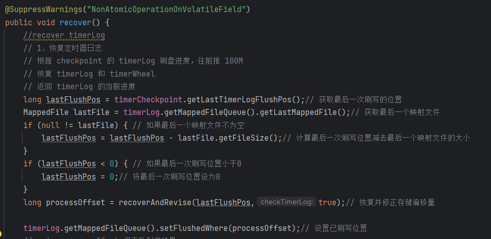

[TimerLog](http://timerlog/) 数据完整性校验（size和magic），修正 [TimerWheel](http://timerwheel/) 中对应延迟时间 [Slot](http://slot/) 的 [lastPos](http://lastpos/) 指向，返回[TimerLog](http://timerlog/) 实际刷盘进度。

//recover timerLog and revise timerWheel

//return process offset

private long recoverAndRevise(long beginOffset, boolean checkTimerLog) {

LOGGER.info("Begin to recover timerLog offset:{} check:{}", beginOffset, checkTimerLog);

// 获取最后一个 mappedFile

MappedFile lastFile \= timerLog.getMappedFileQueue().getLastMappedFile();

if (null == lastFile) {

return 0;

}

// 1、从 offset 开始（checkpoint-100M），查找 offset 所在 TimerLog 文件，从那个文件开始处理

List<MappedFile> mappedFiles = timerLog.getMappedFileQueue().getMappedFiles();

int index \= mappedFiles.size() - 1;

for (; index >= 0; index--) {

MappedFile mappedFile \= mappedFiles.get(index);

if (beginOffset >= mappedFile.getFileFromOffset()) {

break;

}

}

if (index < 0) {

index = 0;

}

// 2、循环 TimerLog 文件

long checkOffset \= mappedFiles.get(index).getFileFromOffset();

for (; index < mappedFiles.size(); index++) {

MappedFile mappedFile \= mappedFiles.get(index);

SelectMappedBufferResult sbr \= mappedFile.selectMappedBuffer(0, checkTimerLog ? mappedFiles.get(index).getFileSize() : mappedFile.getReadPosition());

ByteBuffer bf \= sbr.getByteBuffer();

// TimerLog 进度

int position \= 0;

boolean stopCheck \= false;

// 每条 TimerLog 记录 52B

for (; position < sbr.getSize(); position += TimerLog.UNIT\_SIZE) {

try {

bf.position(position);

int size \= bf.getInt();//size

bf.getLong();//prev pos

int magic \= bf.getInt();

if (magic == TimerLog.BLANK\_MAGIC\_CODE) {

break;

}

// 2-1、magic 为 0 处理结束

if (checkTimerLog && (!isMagicOK(magic) || TimerLog.UNIT\_SIZE != size)) {

stopCheck = true;

break;

}

// 恢复 delayTime = TimerLog 写入时间戳+延迟毫秒数

long delayTime \= bf.getLong() + bf.getInt();

if (TimerLog.UNIT\_SIZE == size && isMagicOK(magic)) {

// 2-2、修正 delayTime 对应 Slot 的 lastPos 指向

timerWheel.reviseSlot(delayTime, TimerWheel.IGNORE, sbr.getStartOffset() + position, true);

}

} catch (Exception e) {

LOGGER.error("Recover timerLog error", e);

stopCheck = true;

break;

}

}

sbr.release();

// TimerLog 实际进度

checkOffset = mappedFiles.get(index).getFileFromOffset() + position;

if (stopCheck) {

break;

}

}

// 3、根据 TimerLog 数据完整情况，截断物理文件

if (checkTimerLog) {

timerLog.getMappedFileQueue().truncateDirtyFiles(checkOffset);

}

// TimerLog 刷盘进度

return checkOffset;

}

### **4.4.2.2 修正时间轮消费进度**

修正 [rmq\_sys\_wheel\_timer](http://rmq_sys_wheel_timer/) 的消费进度，就是修正从哪里开始构建时间轮。[rmq\_sys\_wheel\_timer](http://rmq_sys_wheel_timer/) 的消费进度并非完全取决于 [checkpoint](http://checkpoint/)，优先会按照 [TimerLog](http://timerlog/) 的刷盘进度来恢复。可以理解只有 [TimerLog](http://timerlog/) 写入成功，才代表 [rmq\_sys\_wheel\_timer](http://rmq_sys_wheel_timer/) 消费成功。

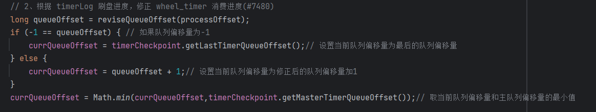

从 [TimerLog](http://timerlog/) 最后一条记录开始向前匹配 [ConsumeQueue](http://consumequeue/)，直到找到 [TimerLog](http://timerlog/) 记录的 [CommitLog](http://commitlog/) 消息位置和[ConsumeQueue](http://consumequeue/) 记录的 [CommitLog](http://commitlog/) 消息位置一致，返回对应消息在[ConsumeQueue](http://consumequeue/) 中的逻辑 [offset](http://offset/)。

public long reviseQueueOffset(long processOffset) {

// 1、从timerLog读取最后一条记录

SelectMappedBufferResult selectRes \= timerLog.getTimerMessage(processOffset - (TimerLog.UNIT\_SIZE - TimerLog.UNIT\_PRE\_SIZE\_FOR\_MSG));

if (null == selectRes) {

return -1;

}

try {

// 物理偏移量

long offsetPy \= selectRes.getByteBuffer().getLong();

// 消息大小

int sizePy \= selectRes.getByteBuffer().getInt();

// 2、 从 CommitLog 中读取对应消息

MessageExt messageExt \= getMessageByCommitOffset(offsetPy, sizePy);

if (null == messageExt) {

return -1;

}

// check offset in msg is equal to offset of cq.

// if not, use cq offset.

long msgQueueOffset \= messageExt.getQueueOffset();

int queueId \= messageExt.getQueueId();

// 3、 找到对应的 ConsumeQueue

ConsumeQueue cq \= (ConsumeQueue) this.messageStore.getConsumeQueue(TIMER\_TOPIC, queueId);

if (null == cq) {

return msgQueueOffset;

}

long cqOffset \= msgQueueOffset;

long tmpOffset \= msgQueueOffset;

int maxCount \= 20000;

// 4、TimerLog 匹配 ConsumeQueue

while (maxCount-- > 0) {

if (tmpOffset < 0) {

LOGGER.warn("reviseQueueOffset check cq offset fail, msg in cq is not found.{}, {}",

offsetPy, sizePy);

break;

}

// 根据 CommitLog 中的消息的逻辑 offset，查找 ConsumeQueue 记录

SelectMappedBufferResult bufferCQ \= cq.getIndexBuffer(tmpOffset);

if (null == bufferCQ) {

// offset in msg may be greater than offset of cq.

tmpOffset -= 1; // 向前继续找

continue;

}

try {

long offsetPyTemp \= bufferCQ.getByteBuffer().getLong();

int sizePyTemp \= bufferCQ.getByteBuffer().getInt();

// TimerLog 记录的消息物理位置 匹配 ConsumeQueue 的消息物理位置

if (offsetPyTemp == offsetPy && sizePyTemp == sizePy) {

LOGGER.info("reviseQueueOffset check cq offset ok. {}, {}, {}",

tmpOffset, offsetPyTemp, sizePyTemp);

cqOffset = tmpOffset;

break;

}

tmpOffset -= 1; // 向前继续找

} catch (Throwable e) {

LOGGER.error("reviseQueueOffset check cq offset error.", e);

} finally {

bufferCQ.release();

}

}

return cqOffset;

} finally {

selectRes.release();

}

}

### **4.4.2.3 恢复时间轮处理进度**

时间轮的处理进度 [readTimeMs](http://readtimems/) 有特殊处理。如果 [checkpoint](http://checkpoint/) 中的 [lastReadTimeMs](http://lastreadtimems/) 距离现在超过 7 天[slotsTotal](http://slotstotal/)，则从 7 天前的时间戳开始处理时间轮。

1.  历史7天之前的数据，不会再投递给客户端，这部分数据丢失。
2.  历史7天内的数据，仍然会投递给客户端，即使已经不符合目标投递时间要求。

  
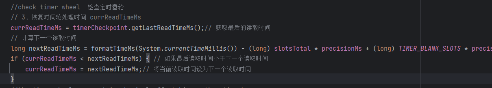

**看到这里是否会有疑惑：如果历史 7 天之前的数据不清理，是否会导致 14 天** [getSlotIndex](http://%20getslotindex%20/) **后读取到历史数据呢？**

[TimerWheel#getSlot](http://timerwheel/#getSlot)：在处理时间轮时，[getSlot](http://getslot/) 会做兼容处理，如果 [currReadTimeMs](http://currreadtimems/) 不等于 Slot 的 [timeMs](http://timems/)会返回 -1。

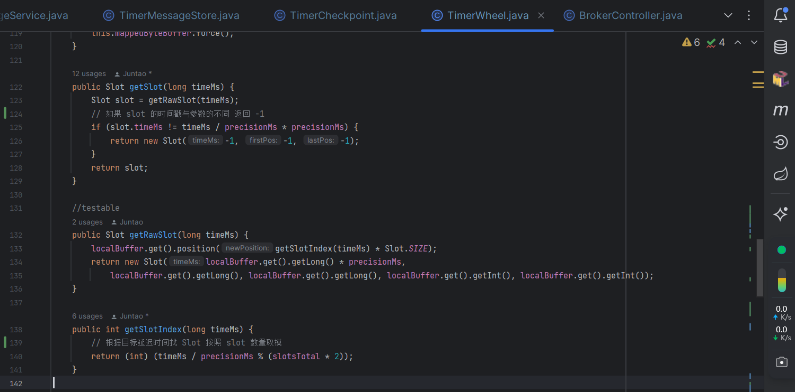

具体例子，假设将当前时间放入时间轮，过了 14 天后来取，处于同一 [Slot](http://slot/)，但是取出来的数据都是-1，不会投递。

@Test

public void testExpireData() throws IOException {

int slotsTotal \= 7 \* 24 \* 3600; // 7天

int precisionMs \= 1000; // 1s精度

String dir \= StoreTestUtils.createBaseDir();

TimerWheel tw \= new TimerWheel(dir, slotsTotal, precisionMs);

// 将当前时间放入时间轮

long now \= System.currentTimeMillis() / precisionMs \* precisionMs;

tw.putSlot(now, 1, 2);

Slot slot \= tw.getSlot(now);

assertEquals(now, slot.timeMs);

assertEquals(1, slot.firstPos);

assertEquals(2, slot.lastPos);

// 14天后来取

long now\_plus14 \= now + TimeUnit.DAYS.toMillis(14) / precisionMs \* precisionMs;

// 处于同一Slot

assertEquals(tw.getSlotIndex(now), tw.getSlotIndex(now\_plus14));

// 查询14天后数据

Slot slot14 \= tw.getSlot(now\_plus14);

assertEquals(-1, slot14.timeMs);

assertEquals(-1, slot14.lastPos); // 失效

assertEquals(-1, slot14.firstPos);

tw.shutdown();

StoreTestUtils.deleteFile(dir);

}

### **4.4.3 复制**

Timer 消息新增了三个文件：[timercheck](http://timercheck/)（[checkpoint](http://checkpoint/)）、[timerlog](http://timerlog/)、[timerwheel](http://timerwheel/)，实际复制的是什么？

[checkpoint](http://checkpoint/) 的复制方式和 [config](http://config/) 目录下其他文件一致（消费进度、topic配置等），[slave](http://slave/) 主动从 [master](http://master/) 拉取，只不过频率更高，这里是 3s 一次。

在 [BrokerController#initializeBrokerScheduledTasks](http://brokercontroller/#initializeBrokerScheduledTasks) 方法会同步 slave 节点消息，此处只复制 [checkpoint](http://checkpoint/)（[timercheck](http://timercheck/) 文件） 。

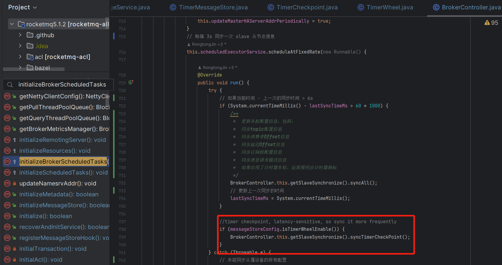

[SlaveSynchronize#syncTimerCheckPoint](http://slavesynchronize/#syncTimerCheckPoint)：[slave](http://slave/) 节点从 [master](http://master/) 节点同步 [checkpoint](http://checkpoint/) 文件：

1.  时间轮的处理进度 [lastReadTimeMs](http://lastreadtimems/)。
2.  延迟 Topic：[wheel\_timer](http://wheel_timer/) 消息的消费进度 [masterTimerQueueOffset](http://mastertimerqueueoffset/)。

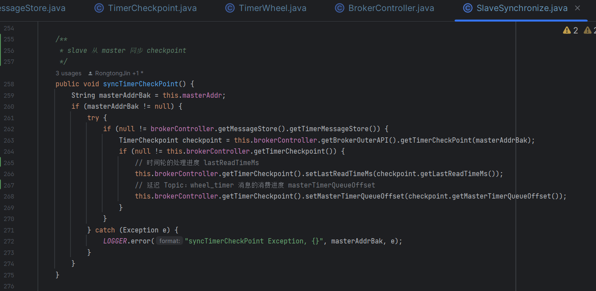

### **4.4.3.1 Slave 构造时间轮 enqueue**

只同步 [checkpoint](http://checkpoint/)，需要 [slave](http://slave/) 节点消费 [wheel\_timer](http://wheel_timer/) 消息来构造时间轮。此时 [TimerEnqueueGetService](http://timerenqueuegetservice/) 线程需要判断是否执行 [enqueue](http://enqueue/)。

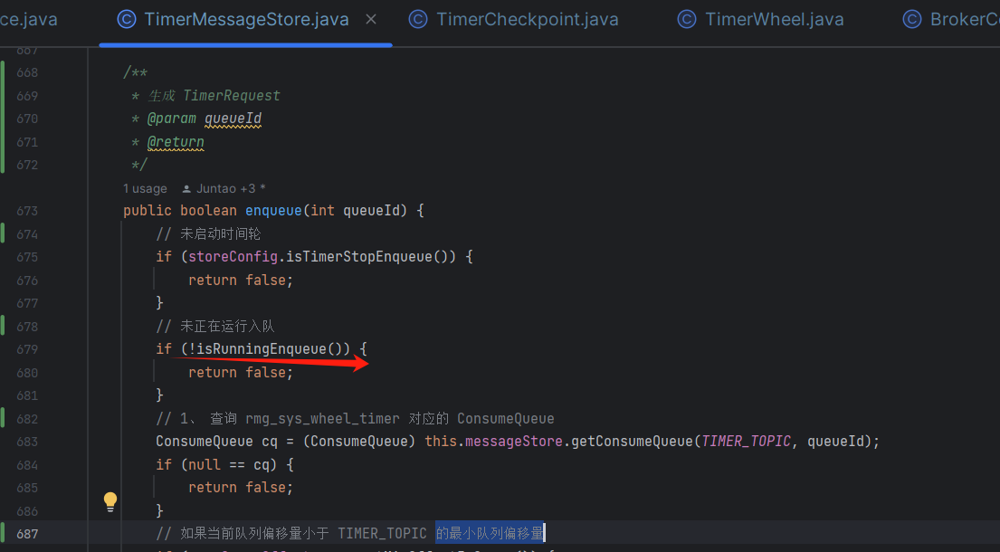

/\*\*

\* 是否正在运行入队

\* @return

\*/

private boolean isRunningEnqueue() {

// 检查 Broker 的角色是否变更

checkBrokerRole();

// CASE1 不构造时间轮的情况

// 如果没有运行出队 && 不是主节点 && 当前队列偏移量大于主节点的定时器队列偏移量，则返回 false

if (!shouldRunningDequeue // slaveActingMaster 模式，代理 master 会变化

&& !isMaster() // slave角色 controller 模式/DLedgerCommitLog 模式会变化

// 标准 slave，slave追上master消费进度

&& currQueueOffset >= timerCheckpoint.getMasterTimerQueueOffset()) {

return false;

}

// CASE2 构造时间轮的情况

// 1、shouldRunningDequeue(代理master或master)

// 2、master

// 3、标准slave currQueueOffset < master 消费进度

return isRunning();

}

1.  普通 [master-slave](http://master-slave/) 情况下，如果 [slave](http://slave%20/) 节点的 [wheel\_timer](http://wheel_timer/) 消费进度未赶上 [master](http://master/) 节点的进度，返回 true 需要执行 [enqueue](http://enqueue/)，其实和 [slave](http://slave%20/) 节点同步 [CommitLog](http://commitlog/) 后构造 [ConsumeQueue](http://consumequeue%20/) 逻辑是一样的。
2.  [slaveActingMaster](http://slaveactingmaster/) 模式下，[master](http://master/) 节点下线，最小 [brokerId](http://brokerid/) 成为代理 [master](http://master/)，[shouldRunningDequeue=true](http://shouldrunningdequeue=true/)，需要执行 [enqueue](http://enqueue/)。
3.  5.x的 [controller](http://controller%20/) 模式/4.x的 [DLedgerCommitLog](http://dledgercommitlog/) 模式，运行时 [broker](http://broker%20/) 角色会发生变化，所以要先 [checkBrokerRole](http://checkbrokerrole/) 后判断是否需要执行 [enqueue](http://enqueue/)。

###   
**4.4.3.2 Slave 处理时间轮 dequeue**

一般情况下 [slave](http://slave/) 节点不会处理时间轮，即将到期消息投递到目标队列。这里主要是看一下 [slaveActingMaster](http://slaveactingmaster/) 模式下，成为代理 [master](http://master%20/) 节点后，[shouldRunningDequeue=true](http://shouldrunningdequeue=true/)，会执行时间轮处理。

private boolean isRunningDequeue() {

if (!this.shouldRunningDequeue) {

// slave

syncLastReadTimeMs();

return false;

}

return isRunning();

}

在最后「**滚动**」和「**投递**」阶段，同样会走消息逃逸逻辑 [escapeBridgeHook](http://escapebridgehook/)。

//0 succ; 1 fail, need retry; 2 fail, do not retry;

public int doPut(MessageExtBrokerInner message, boolean roll) throws Exception {

// 如果消息不需要回滚并且存在定时消息的UNIQ\_KEY属性，则记录警告日志并返回PUT\_NO\_RETRY

if (!roll && null != message.getProperty(MessageConst.PROPERTY\_TIMER\_DEL\_UNIQKEY)) {

LOGGER.warn("Trying do put delete timer msg:\[{}\] roll:\[{}\]",message,roll);

return PUT\_NO\_RETRY;

}

PutMessageResult putMessageResult \= null;

// 如果存在逃逸钩子，调用逃逸钩子的应用方法

if (escapeBridgeHook != null) {

// 二级消息逃逸

putMessageResult = escapeBridgeHook.apply(message);

} else {

// 否则调用消息存储的putMessage方法

putMessageResult = messageStore.putMessage(message);

}

int retryNum \= 0;

// 最多重试3次

while (retryNum < 3) {

if (null == putMessageResult || null == putMessageResult.getPutMessageStatus()) {

retryNum++;

} else {

switch (putMessageResult.getPutMessageStatus()) {

// 如果消息存储成功

case PUT\_OK:

if (brokerStatsManager != null) {

// 更新Broker统计信息

this.brokerStatsManager.incTopicPutNums(message.getTopic(),1,1);

this.brokerStatsManager.incTopicPutSize(message.getTopic(),

putMessageResult.getAppendMessageResult().getWroteBytes());

this.brokerStatsManager.incBrokerPutNums(message.getTopic(),1);

}

return PUT\_OK;

// 如果服务不可用，需要重试

case SERVICE\_NOT\_AVAILABLE:

return PUT\_NEED\_RETRY;

// 如果消息非法或者属性大小超过限制，不需要重试

case MESSAGE\_ILLEGAL:

case PROPERTIES\_SIZE\_EXCEEDED:

return PUT\_NO\_RETRY;

// 其他情况，进行重试

case CREATE\_MAPPED\_FILE\_FAILED:

case FLUSH\_DISK\_TIMEOUT:

case FLUSH\_SLAVE\_TIMEOUT:

case OS\_PAGE\_CACHE\_BUSY:

case SLAVE\_NOT\_AVAILABLE:

case UNKNOWN\_ERROR:

default:

retryNum++;

}

}

// 休眠50毫秒

Thread.sleep(50);

// 重新调用消息存储的putMessage方法

putMessageResult = messageStore.putMessage(message);

LOGGER.warn("Retrying to do put timer msg retryNum:{} putRes:{} msg:{}",retryNum,putMessageResult,message);

}

return PUT\_NO\_RETRY;

}

## **05 总结**

本文深度剖析了早期的固定延迟等级的「**延迟消息**」以及基于「**时间轮实现的延迟消息**」。

对于「**传统的延迟消息**」就是 18个等级，在 Broker 端构建 [ConsumeQueue](http://consumequeue/) 时，将原来应该存储 [tag.hashCode](http://tag.hashcode/) 的位置，改为存储目标投递时间戳。然后 [ScheduleMessageService](http://schedulemessageservice/) 服务会启动后台线程消费 [SCHEDULE\_TOPIC\_XXXX](http://schedule_topic_xxxx/) 中每个队列的消息。如果 [ConsumeQueue](http://consumequeue/) 中记录的投递时间到期，则投递到用户原始消息 topic和queue；如果 [ConsumeQueue](http://consumequeue/) 中记录的投递时间未到期，则延迟一会再进行消费。

  

而 Timer 消息大流程分为三步：

1.  用户消息转换为 [wheel\_timer](http://wheel_timer/) 消息（[topic=rmq\_sys\_wheel\_timer，queueId=0](http://topic=rmq_sys_wheel_timer,queueid=0/)）。
2.  构造时间轮（[enqueue](http://enqueue/)），包括 [timerlog](http://timerlog/) 和 [timerwheel](http://timerwheel/) 两个新文件。
3.  处理时间轮（[dequeue](http://dequeue/)），按照时间顺序，将到期消息滚动 | 投递到目标队列。

Timer 消息的时间轮主要分为两部分数据：[TimerWheel](http://timerwheel/) 和 [TimerLog](http://timerlog/)。

1.  [TimerLog](http://timerlog/)：顺序写，同样延迟时间的记录形成链表结构，也记录了消息在 [CommitLog](http://commitlog/) 中的物理位置。
2.  [TimerWheel](http://timerwheel/) ：随机写，存储 n 个时间槽 Slot，每个槽指向 [TimerLog](http://timerlog/) 中的一条记录（主要是 last 指针）。每次新 [TimerLog](http://timerlog/) 生成，都会定位 Slot 后修改指针指向。

在 [dequeue](http://dequeue/) 阶段，通过到期时间戳定位 [timerwheel](http://timerwheel/) 中的一个槽，再从 [timerlog](http://timerlog/) 中读取 [CommitLog](http://commitlog/) 位置定位消息。

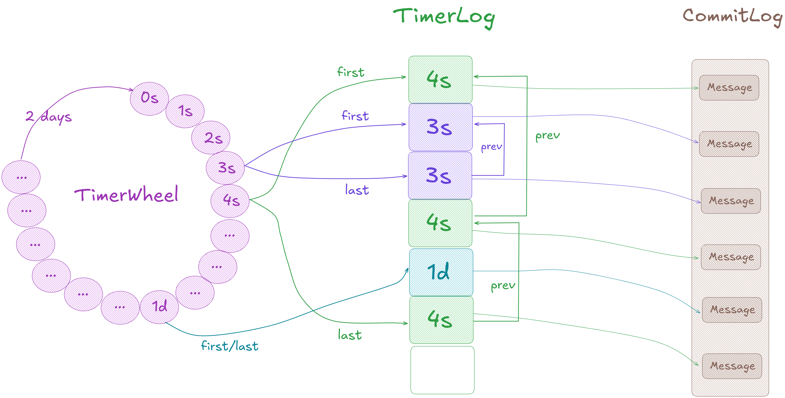