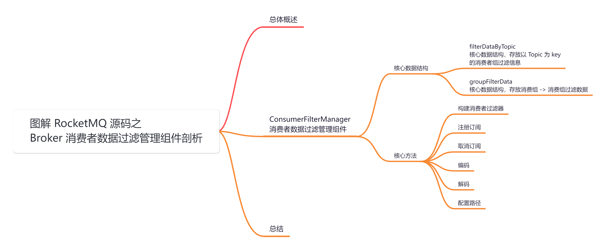
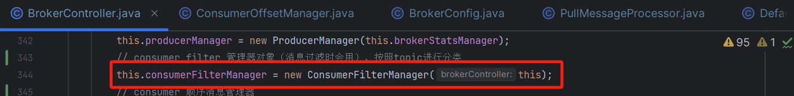
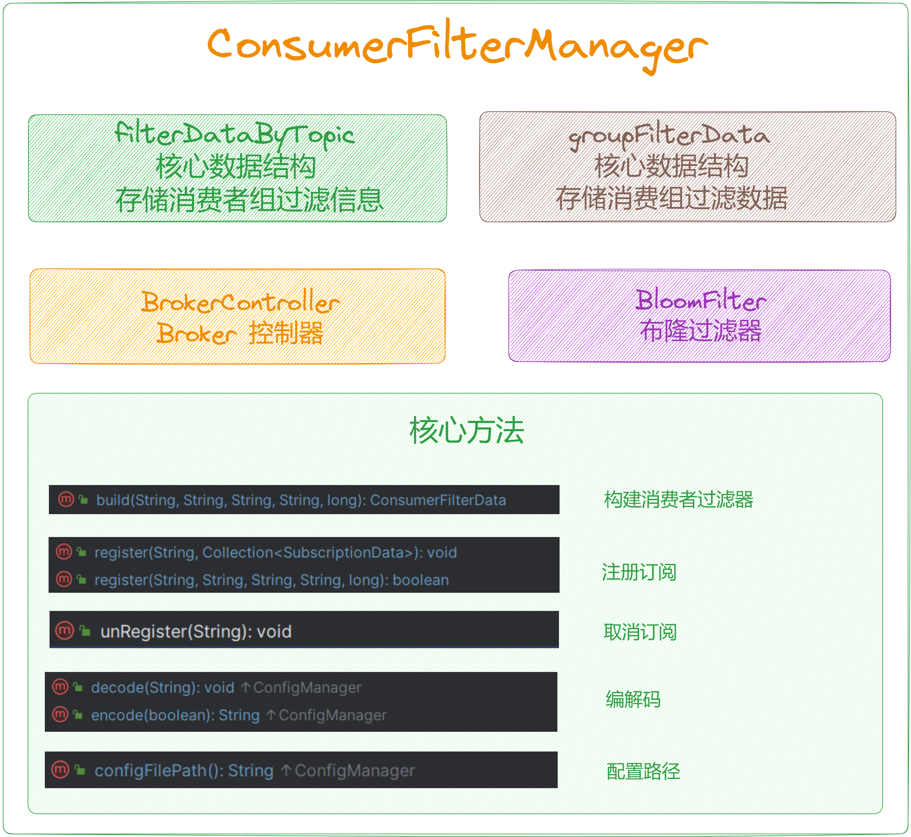
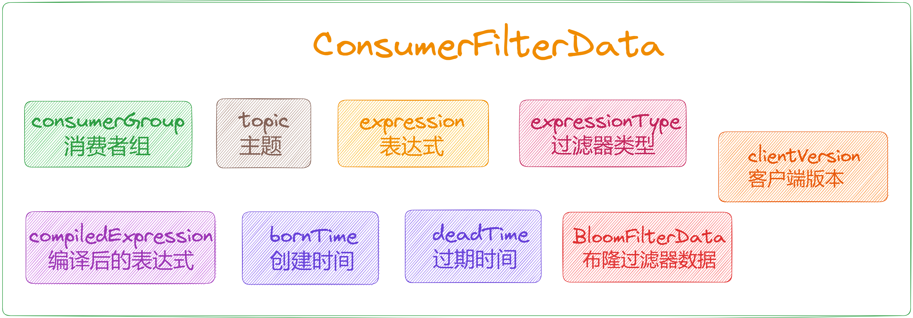
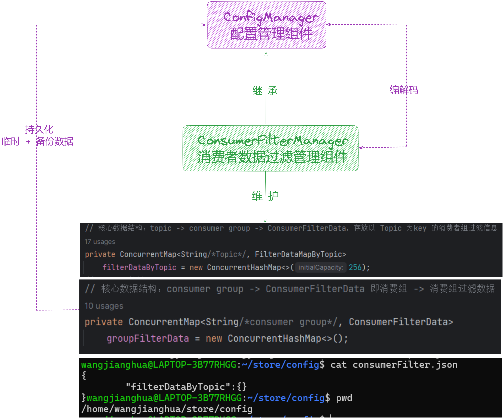

大家好，我是**华仔**, 又跟大家见面了。

从今天开始我将继续为大家奉上 RocketMQ 消费者源码剖析系列文章，正式开启「**RocketMQ 的服务端 Broker 源码之旅**」，这是第九篇，本篇我们将以「**RocketMQ 5.1.2**」版本为主，来剖析下 RocketMQ 源码之 Broker

消费者数据过滤管理组件剖析。

这里我将以「**RocketMQ 5.1.2**」版本为主，通过「**场景驱动**」的方式带大家一点点的对 RocketMQ 源码进行深度剖析，正式开启「**RocketMQ 的源码之旅**」，跟我一起来掌握 RocketMQ 源码核心架构设计思想吧。

  

## **01 总体概述**

[在 BrokerController 构造方法](https://articles.zsxq.com/id_chxqzhg8psk4.html)里面创建了很多「**管理器**」、「**处理器**」、「**线程队列**」等，跟本文有关系的就是下面这个组件，主要负责管理 Broker 端的「**消费偏移量**」，它继承了 [ConfigManager](http://configmanager/) 组件，且定时将内存中维护的「**消费偏移量数据**」，「**持久化**」到磁盘文件。

  
该组件继承了 [ConfigManager](http://configmanager/) 配置管理组件，它会将内存数据持久化到磁盘文件 [consumerFilter.json](http://consumerfilter.json/)。主要负责对在消费者拉取消息时进行「**消息数据过滤**」，且只针对使用「**表达式过滤**」的消费者「**有效**」。

## **02 ConsumerFilterManager**

源码位置：[https://github.com/apache/rocketmq/blob/release-5.1.2/broker/src/main/java/org/apache/rocketmq/broker/](https://github.com/apache/rocketmq/blob/release-5.1.2/broker/src/main/java/org/apache/rocketmq/broker/filter/ConsumerFilterManager.java)[filter](https://github.com/apache/rocketmq/blob/release-5.1.2/broker/src/main/java/org/apache/rocketmq/broker/filter/ConsumerFilterManager.java)[/](https://github.com/apache/rocketmq/blob/release-5.1.2/broker/src/main/java/org/apache/rocketmq/broker/filter/ConsumerFilterManager.java)[ConsumerFilterManager](https://github.com/apache/rocketmq/blob/release-5.1.2/broker/src/main/java/org/apache/rocketmq/broker/filter/ConsumerFilterManager.java)[.java](https://github.com/apache/rocketmq/blob/release-5.1.2/broker/src/main/java/org/apache/rocketmq/broker/filter/ConsumerFilterManager.java)

## **2.1 核心数据结构**

/\*\*

\* Consumer filter data manager.Just manage the consumers use expression filter.

\* 消费者过滤数据管理组件，只管理使用表达式过滤的消费者。

\*/

public class ConsumerFilterManager extends ConfigManager {

private static final Logger log \= LoggerFactory.getLogger(LoggerName.FILTER\_LOGGER\_NAME);

private static final long MS\_24\_HOUR \= 24 \* 3600 \* 1000;

// consumer filter key=topic value=FilterDataMapByTopic

// 核心数据结构：topic -> consumer group -> ConsumerFilterData，存放以 Topic 为key 的消费者组过滤信息

private ConcurrentMap<String/\*Topic\*/, FilterDataMapByTopic>

filterDataByTopic = new ConcurrentHashMap<>(256);

// Broker 控制器

private transient BrokerController brokerController;

// 布隆过滤器

private transient BloomFilter bloomFilter;

public ConsumerFilterManager() {

// just for test

this.bloomFilter = BloomFilter.createByFn(20, 64);

}

public ConsumerFilterManager(BrokerController brokerController) {

this.brokerController = brokerController;

// 初始化布隆过滤器

this.bloomFilter = BloomFilter.createByFn(

brokerController.getBrokerConfig().getMaxErrorRateOfBloomFilter(),

brokerController.getBrokerConfig().getExpectConsumerNumUseFilter()

);

// then set bit map length of store config.

brokerController.getMessageStoreConfig().setBitMapLengthConsumeQueueExt(

this.bloomFilter.getM()

);

}

....

}

再来剖析下 [FilterDataMapByTopic](http://filterdatamapbytopic%20/) 类，它是上面数据结构的一个子集，内部维护了 [消费组 -> 消费组过滤数据](http://xn--%20-%20-9n9nr8l1qzha092bi91eia9166cja332i/)映射关系。

public static class FilterDataMapByTopic {

// 核心数据结构：consumer group -> ConsumerFilterData 即消费组 -> 消费组过滤数据

private ConcurrentMap<String/\*consumer group\*/, ConsumerFilterData>

groupFilterData = new ConcurrentHashMap<>();

private String topic;

....

}

最后再来剖析下 [ConsumerFilterData](http://%20consumerfilterdata/) 的数据结构，内部包含了全部与消费者过滤有关的关键信息。

/\*\*

\* Filter data of consumer.

\*/

public class ConsumerFilterData {

// 消费者组

private String consumerGroup;

// 主题

private String topic;

// 表达式

private String expression;

// 过滤器类型

private String expressionType;

// 过滤器编译后的表达式

private transient Expression compiledExpression;

// 过滤器创建时间

private long bornTime;

// 过滤器过期时间

private long deadTime \= 0;

// 布隆过滤器数据

private BloomFilterData bloomFilterData;

// 客户端版本

private long clientVersion;

....

}

##   
**2.2 核心方法**

该类主要是「**注册订阅**」、「**取消订阅**」、「**清理过期订阅**」、「**序列化**」、「**反序列化**」等维护内存元数据的行方法。但是「**过滤行为**」不在这个组件里体现，在其他调用方法中会有具体使用方式。

### **2.2.1 构建消费者过滤器**

/\*\*

\* 构建消费者过滤器数据。注意，布隆过滤器数据不包含在内。

\* Build consumer filter data.Be care, bloom filter data is not included.

\* @return 可能为空

\*/

public static ConsumerFilterData build(final String topic,final String consumerGroup,

final String expression,final String type,

final long clientVersion) {

if (ExpressionType.isTagType(type)) {

// 如果表达式类型是标签类型，返回null

return null;

}

// 创建消费者过滤器数据对象

ConsumerFilterData consumerFilterData \= new ConsumerFilterData();

consumerFilterData.setTopic(topic);// 设置主题

consumerFilterData.setConsumerGroup(consumerGroup);// 设置消费者组

consumerFilterData.setBornTime(System.currentTimeMillis());// 设置产生时间为当前时间

consumerFilterData.setDeadTime(0);// 设置过期时间为0，表示不过期

consumerFilterData.setExpression(expression);// 设置过滤表达式

consumerFilterData.setExpressionType(type);// 设置表达式类型

consumerFilterData.setClientVersion(clientVersion);// 设置客户端版本号

try {

// 编译表达式

consumerFilterData.setCompiledExpression(

FilterFactory.INSTANCE.get(type).compile(expression)

);

} catch (Throwable e) {

// 捕获异常，记录错误日志并返回null

log.error("parse error:expr={},topic={},group={},error={}",expression,topic,consumerGroup,e.getMessage());

return null;

}

return consumerFilterData;// 返回构建的消费者过滤器数据对象

}

### **2.2.2 注册订阅**

// 该方法用于注册消费者组的订阅信息，并处理非法的主题。

public void register(final String consumerGroup,final Collection<SubscriptionData> subList) {

// 遍历订阅数据列表，逐个注册

for (SubscriptionData subscriptionData :subList) {

// 注册

register(

subscriptionData.getTopic(),

consumerGroup,

subscriptionData.getSubString(),

subscriptionData.getExpressionType(),

subscriptionData.getSubVersion()

);

}

// 处理非法的主题

Collection<ConsumerFilterData> groupFilterData = getByGroup(consumerGroup); // 获取消费者组的过滤器数据列表

Iterator<ConsumerFilterData> iterator = groupFilterData.iterator();

// 遍历消费者组的过滤器数据列表

while (iterator.hasNext()) {

ConsumerFilterData filterData \= iterator.next();

boolean exist \= false;

// 检查订阅数据列表中是否包含过滤器数据中的主题

for (SubscriptionData subscriptionData :subList) {

if (subscriptionData.getTopic().equals(filterData.getTopic())) {

exist = true;

break;

}

}

// 如果过滤器数据对应的主题不包含在订阅数据列表中，并且未过期，则标记为过期

if (!exist && !filterData.isDead()) {

// 设置过期事件

filterData.setDeadTime(System.currentTimeMillis());

log.info("Consumer filter changed:{},make illegal topic dead:{}",consumerGroup,filterData);

}

}

}

// 注册指定主题的消费者组过滤器数据

public boolean register(final String topic,final String consumerGroup,final String expression,

final String type,final long clientVersion) {

// 不支持tag类型

// 如果表达式类型是标签类型，则返回 false

if (ExpressionType.isTagType(type)) {

return false;

}

// 如果表达式为空，则返回 false

if (expression == null || expression.length() == 0) {

return false;

}

// 获取指定主题的 FilterDataMapByTopic 对象

FilterDataMapByTopic filterDataMapByTopic \= this.filterDataByTopic.get(topic);

if (filterDataMapByTopic == null) {

// 如果 FilterDataMapByTopic 对象不存在，创建一个新的并放入 filterDataByTopic 中

FilterDataMapByTopic temp \= new FilterDataMapByTopic(topic);

FilterDataMapByTopic prev \= this.filterDataByTopic.putIfAbsent(topic,temp);

filterDataMapByTopic = prev != null ? prev : temp;

}

// 生成布隆过滤器数据

BloomFilterData bloomFilterData \= bloomFilter.generate(consumerGroup + "#" + topic);

// 调用 FilterDataMapByTopic#register 方法注册过滤器数据

return filterDataMapByTopic.register(consumerGroup,expression,type,

bloomFilterData,clientVersion);

}

public static class FilterDataMapByTopic {

// FilterDataMapByTopic 类方法

public boolean register(String consumerGroup,String expression,String type,BloomFilterData bloomFilterData,

long clientVersion) {

// 获取消费者组的过滤器数据

ConsumerFilterData old \= this.groupFilterData.get(consumerGroup);

// 如果旧的过滤器数据不存在

if (old == null) {

// 创建新的消费者过滤器数据对象

ConsumerFilterData consumerFilterData \= build(topic,consumerGroup,expression,type,clientVersion);

// 如果创建失败，返回false

if (consumerFilterData == null) {

return false;

}

// 设置布隆过滤器数据

consumerFilterData.setBloomFilterData(bloomFilterData);

// 将新的过滤器数据放入groupFilterData中

old = this.groupFilterData.putIfAbsent(consumerGroup,consumerFilterData);

// 如果putIfAbsent返回的old为null，表示成功注册新的过滤器数据

if (old == null) {

log.info("New consumer filter registered:{}",consumerFilterData);

return true;

} else {

// 否则表示存在并发注册

if (clientVersion <= old.getClientVersion()) {

// 如果客户端版本号小于等于旧数据的版本号，则忽略注册请求

if (!type.equals(old.getExpressionType()) || !expression.equals(old.getExpression())) {

log.warn("Ignore consumer({} :{}) filter(concurrent),because of version {} <= {},but maybe info changed!old={}:{},ignored={}:{}",

consumerGroup,topic,

clientVersion,old.getClientVersion(),

old.getExpressionType(),old.getExpression(),

type,expression);

}

// 如果客户端版本号等于旧数据的版本号，并且旧数据处于过期状态，则重新激活旧数据

if (clientVersion == old.getClientVersion() && old.isDead()) {

reAlive(old);

return true;

}

return false;

} else {

// 否则更新过滤器数据

this.groupFilterData.put(consumerGroup,consumerFilterData);

log.info("New consumer filter registered(concurrent):{},old:{}",consumerFilterData,old);

return true;

}

}

} else {

// 旧的过滤器数据存在

if (clientVersion <= old.getClientVersion()) {

// 如果客户端版本号小于等于旧数据的版本号，进行相关处理并返回相应结果

if (!type.equals(old.getExpressionType()) || !expression.equals(old.getExpression())) {

log.info("Ignore consumer({}:{}) filter,because of version {} <= {},but maybe info changed!old={}:{},ignored={}:{}",

consumerGroup,topic,

clientVersion,old.getClientVersion(),

old.getExpressionType(),old.getExpression(),

type,expression);

}

// 如果客户端版本号等于旧数据的版本号，并且旧数据处于过期状态，则重新激活旧数据

if (clientVersion == old.getClientVersion() && old.isDead()) {

reAlive(old);

return true;

}

return false;

}

// 判断是否需要更新过滤器数据

boolean change \= !old.getExpression().equals(expression) || !old.getExpressionType().equals(type);

if (old.getBloomFilterData() == null && bloomFilterData != null) {

change = true;

}

if (old.getBloomFilterData() != null && !old.getBloomFilterData().equals(bloomFilterData)) {

change = true;

}

// 如果过滤器数据发生变化，创建新的过滤器数据对象，并更新到groupFilterData中

// if subscribe data is changed, or consumer is died too long.

if (change) {

ConsumerFilterData consumerFilterData \= build(topic,consumerGroup,expression,type,clientVersion);

if (consumerFilterData == null) {

// 如果新的表达式编译出错，移除旧数据，让客户端报告错误

// new expression compile error, remove old, let client report error.

this.groupFilterData.remove(consumerGroup);

return false;

}

consumerFilterData.setBloomFilterData(bloomFilterData);

this.groupFilterData.put(consumerGroup,consumerFilterData);

log.info("Consumer filter info change,old:{},new:{},change:{}",

old,consumerFilterData,change);

return true;

} else {

// 否则更新旧数据的客户端版本号，如果旧数据处于过期状态则重新激活

old.setClientVersion(clientVersion);

if (old.isDead()) {

reAlive(old);

}

return true;

}

}

}

/\*\*

\* 重新激活消费者过滤器数据

\* @param filterData

\*/

protected void reAlive(ConsumerFilterData filterData) {

long oldDeadTime \= filterData.getDeadTime(); // 获取原来的过期时间

filterData.setDeadTime(0); // 设置过期时间为0，表示不再过期，重新激活

log.info("Re alive consumer filter:{},oldDeadTime:{}",filterData,oldDeadTime); // 打印重新激活信息和原有的过期时间

}

}

可以看到注册，无非就是循环对 [groupFilterData](http://groupfilterdata/) 这个非常重要的数据结构的内存数据进行维护，并对其进行重新激活。

### **2.2.3 取消订阅**

public void unRegister(final String consumerGroup) {

for (Entry<String, FilterDataMapByTopic> entry : filterDataByTopic.entrySet()) {

entry.getValue().unRegister(consumerGroup);

}

}

// 子类

public static class FilterDataMapByTopic {

public void unRegister(String consumerGroup) {

// 如果不包含指定消费者组的过滤器数据，直接返回

if (!this.groupFilterData.containsKey(consumerGroup)) {

return;

}

// 获取指定消费者组的过滤器数据

ConsumerFilterData data \= this.groupFilterData.get(consumerGroup);

// 如果过滤器数据为null或已经过期，直接返回

if (data == null || data.isDead()) {

return;

}

// 获取当前时间

long now \= System.currentTimeMillis();

// 记录取消注册的消费者过滤器数据以及当前时间

log.info("Unregister consumer filter:{},deadTime:{}",data,now);

// 设置过期时间为当前时间，表示取消注册

data.setDeadTime(now);

}

}

很简单，取消订阅无非就是循环对 [groupFilterData](http://groupfilterdata/) 这个非常重要的数据结构设置过期时间为当前时间。

### **2.2.4 编码**

@Override

public String encode() {

// 以默认的格式将对象编码为字符串并返回

return encode(false);

}

@Override

public String encode(final boolean prettyFormat) {

// clean

// 首先调用了 clean 方法以确保数据的一致性

{

clean();

}

// 使用 RemotingSerializable 工具类将对象转换为 JSON 字符串

return RemotingSerializable.toJson(this, prettyFormat);

}

public void clean() {

Iterator<Map.Entry<String,FilterDataMapByTopic>> topicIterator = this.filterDataByTopic.entrySet().iterator();

// 遍历topic，清理过期的数据

while (topicIterator.hasNext()) {

Map.Entry<String,FilterDataMapByTopic> filterDataMapByTopic = topicIterator.next();

Iterator<Map.Entry<String,ConsumerFilterData>> filterDataIterator = filterDataMapByTopic.getValue().getGroupFilterData().entrySet().iterator();

// 遍历消费者组数据，清理过期的数据

while (filterDataIterator.hasNext()) {

Map.Entry<String,ConsumerFilterData> filterDataByGroup = filterDataIterator.next();

ConsumerFilterData filterData \= filterDataByGroup.getValue();

// 如果过期时间超过指定时限，则从数据中移除

if (filterData.howLongAfterDeath() >= (this.brokerController == null ?MS\_24\_HOUR :this.brokerController.getBrokerConfig().getFilterDataCleanTimeSpan())) {

log.info("Remove filter consumer {},died too long!",filterDataByGroup.getValue());

filterDataIterator.remove();

}

}

if (filterDataMapByTopic.getValue().getGroupFilterData().isEmpty()) {

log.info("Topic has no consumer,remove it!{}",filterDataMapByTopic.getKey());

topicIterator.remove(); // 如果消费者组数据为空，则移除对应的topic

}

}

}

先清理过期数据，然后再进行编码，将以默认的格式将对象编码为字符串并返回。

### **2.2.5 解码**

// 将json字符串反序列化为ConsumerFilterManager对象

@Override

public void decode(final String jsonString) {

// 解析JSON字符串为ConsumerFilterManager对象

ConsumerFilterManager load \= RemotingSerializable.fromJson(jsonString,ConsumerFilterManager.class);

if (load != null && load.filterDataByTopic != null) {

boolean bloomChanged \= false;

// 对从JSON中加载的ConsumerFilterManager对象进行处理

for (Entry<String,FilterDataMapByTopic> entry :load.filterDataByTopic.entrySet()) {

FilterDataMapByTopic dataMapByTopic \= entry.getValue();

if (dataMapByTopic == null) {

continue;

}

// 遍历topic下的消费者组数据

for (Entry<String,ConsumerFilterData> groupEntry :dataMapByTopic.getGroupFilterData().entrySet()) {

ConsumerFilterData filterData \= groupEntry.getValue();

if (filterData == null) {

continue;

}

try {

// 尝试重新编译表达式

filterData.setCompiledExpression(

FilterFactory.INSTANCE.get(filterData.getExpressionType()).compile(filterData.getExpression())

);

} catch (Exception e) {

log.error("load filter data error," + filterData,e);

}

// 检查布隆过滤器是否发生了改变

// 如果改变了，忽略之前计算的位图

// check whether bloom filter is changed

// if changed, ignore the bit map calculated before.

if (!this.bloomFilter.isValid(filterData.getBloomFilterData())) {

bloomChanged = true;

log.info("Bloom filter is changed!So ignore all filter data persisted!{},{}",this.bloomFilter,filterData.getBloomFilterData());

break;

}

log.info("load exist consumer filter data:{}",filterData);

// 如果消费者的过期时间为0，表示已过期

if (filterData.getDeadTime() == 0) {

// 在加载时，默认认为所有的消费者都已经过期

long deadTime \= System.currentTimeMillis() - 30 \* 1000;

filterData.setDeadTime(

deadTime <= filterData.getBornTime() ?filterData.getBornTime() :deadTime

);

}

}

}

// 如果布隆过滤器没有改变，则使用从JSON中加载的数据

if (!bloomChanged) {

this.filterDataByTopic = load.filterDataByTopic;

}

}

}

### **2.2.6 配置路径**

@Override

public String configFilePath() {

if (this.brokerController != null) {

// 配置存储路径 config/consumerFilter.json

return BrokerPathConfigHelper.getConsumerFilterPath(

this.brokerController.getMessageStoreConfig().getStorePathRootDir()

);

}

return BrokerPathConfigHelper.getConsumerFilterPath("./unit\_test");

}

## **03 总结**

本篇主要剖析了 [BrokerController](http://brokercontroller%20/) 初始化时中用到的 「**ConsumerFilterManager**」，主要负责对在消费者拉取消息时进行「**消息数据过滤**」，且只针对使用「**表达式过滤**」的消费者「**有效**」。

示意图如下：

