大家好，我是**华仔**, 又跟大家见面了。

从今天开始我将继续为大家奉上 RocketMQ 消费者源码剖析系列文章，正式开启「**RocketMQ 的服务端 Broker 源码之旅**」，这是第二十一篇，本篇我们将以「**RocketMQ 5.1.2**」版本为主，来剖析下 RocketMQ 源码之 Broker 端消息刷盘机制流程剖析。

这里我将以「**RocketMQ 5.1.2**」版本为主，通过「**场景驱动**」的方式带大家一点点的对 RocketMQ 源码进行深度剖析，正式开启「**RocketMQ 的源码之旅**」，跟我一起来掌握 RocketMQ 源码核心架构设计思想吧。

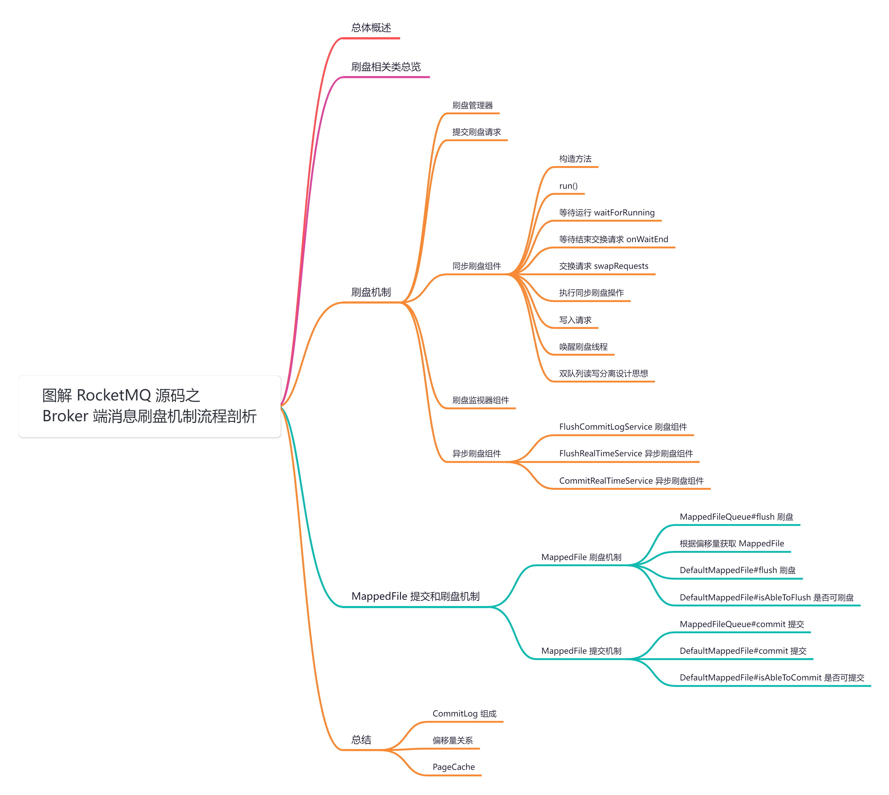

##   
**01 总体概述**

在 [【Broker端源码分析系列第二十篇】图解 RocketMQ 源码之Broker端MappedFile底层架构设计剖析](https://articles.zsxq.com/id_o1mnfdtpq25o.html) 中我主要带大家剖析了消息写入 [MappedFile](http://mappedfile/) 的全过程。

但这其内部还有很多关键的点并没有深度剖析，你是否会有下面疑惑：

1.  当消息写入到写缓冲区 [writeBuffer](http://writebuffer%20/) 后是如何同步到文件 [FileChannel](http://filechannel%20/) 中的呢？
2.  当消息同步到文件 [FileChannel](http://filechannel/) 中之后又是如何进行刷盘的呢？
3.  对于 [CommitLog](http://commitlog%20/) 日志文件数量是不可能无限增长，那么其过期机制又是什么？
4.  系统宕机后 [CommitLog](http://commitlog%20/) 数据是如何恢复的呢？

带着这些问题，我们来深度剖析下 Broker 端消息刷盘策略的全流程。

## **02 刷盘相关类总览**

我们知道在 [RocketMQ](http://rocketmq/) 中，刷盘策略有以下两种：

1.  同步刷盘：Broker 消息已经被「**持久化到磁盘**」后才会向客户端返回成功。同步刷盘的优点是「**能够保证消息不丢失**」，但是会以「**牺牲写入性能为代价**」的。
2.  异步刷盘：Broker 将信息存储到「**PageCache**」后就立即向客户端返回成功，然后会有一个「**异步线程**」定时将内存中的数据写入磁盘，其默认时间间隔为 500 ms。

在深度剖析这个消息机制之前，我们先来对刷盘的相关类进行总览一下，做到心中有数。

源码位置：[https://github.com/apache/rocketmq/blob/release-5.1.2/store/src/main/java/org/apache/rocketmq/store/](https://github.com/apache/rocketmq/blob/release-5.1.2/store/src/main/java/org/apache/rocketmq/store/CommitLog.java)[CommitLog](https://github.com/apache/rocketmq/blob/release-5.1.2/store/src/main/java/org/apache/rocketmq/store/CommitLog.java)[.java](https://github.com/apache/rocketmq/blob/release-5.1.2/store/src/main/java/org/apache/rocketmq/store/CommitLog.java)

我们在 [CommitLog](http://commitlog/) 中看到好多内部类：

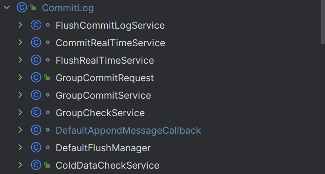

其中 [FlushCommitLogService](http://flushcommitlogservice%20/) 及其子类 [CommitRealTimeService](http://commitrealtimeservice/)、[GroupCommitService](http://groupcommitservice/)、[FlushRealTimeService](http://flushrealtimeservice/) 分别是用于「**不同场景**」下的「**不同刷盘行为**」，它们会单独或者配合起来使用。

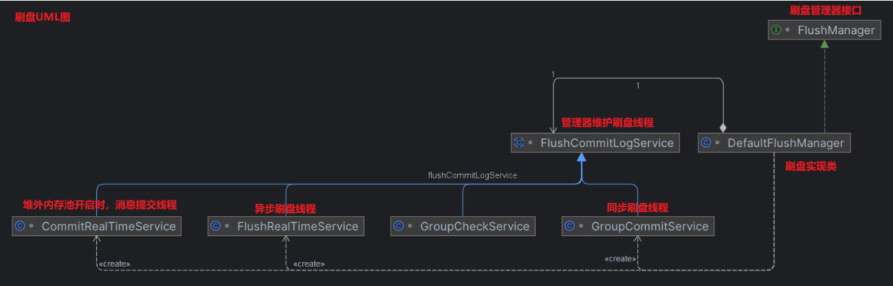

  
如果是「**同步刷盘**」会使用 [GroupCommitService](http://groupcommitservice/)。如果是「**异步刷盘**」，并且「**未启用**」堆外内存池[TransientStorePool](http://transientstorepool/)，则采用 [FlushRealTimeService](http://flushrealtimeservice/) 线程类进行刷盘。如果是「**异步刷盘**」，并且「**启用**」堆外内存池，则会使用 [FlushRealTimeService](http://flushrealtimeservice/) 与 [CommitRealTimeService](http://commitrealtimeservice/) 线程类进行配合刷盘。

在 RocketMQ 中，这些服务主要负责「**消息的持久化**」和「**相关维护工作**」，以确保消息存储系统的「**可靠性**」、「**一致性**」和「**高效性**」。

1.  [FlushCommitLogService](http://flushcommitlogservice/)：该服务负责定期或按需将内存中的 [CommitLog](http://commitlog/) 日志刷盘到磁盘，保证消息的持久化。通过定时任务或触发机制来执行刷盘操作，防止因系统崩溃导致内存中的数据丢失。
2.  [CommitRealTimeService](http://commitrealtimeservice/)：该服务致力于实现消息「**异步实时转存**」到 [CommitLog](http://commitlog%20/) 并尽可能减少消息丢失的风险。
3.  [GroupCommitService](http://groupcommitservice/)：该服务是针对「**批量消息**」进行「**同步刷盘**」的优化策略，它将多个待刷盘的消息请求收集起来，然后一次性批量地将这批消息写入磁盘，以此提高磁盘 I/O 效率并降低延迟。
4.  [FlushRealTimeService](http://flushrealtimeservice/)：该服务用于处理「**异步实时刷盘**」需求，即当消息到达时尽快将其刷。

> 默认情况下的刷盘策略是：异步 && 关闭堆外内存池，因此默认是采用 FlushRealTimeService 线程进行刷盘。

## **03 刷盘机制**

在 [【Broker端源码分析系列第二十篇】图解 RocketMQ 源码之Broker端MappedFile底层架构设计剖析](https://articles.zsxq.com/id_o1mnfdtpq25o.html) 这篇中，我们知道 [CommitLog](http://commitlog%20/) 写入消息是从 [MappedFileQueue](http://mappedfilequeue%20/) 中获取最后一个 [MappedFile](http://mappedfile/)，然后将消息通过[appendMessagesInner](http://appendmessagesinner/) 方法追加到 [MappedFile](http://mappedfile/) 中。

[MappedFile](http://mappedfile%20/) 在创建时，如果开启了「**堆外内存池**」[TransientStorePool](http://transientstorepool/)，就会从中取一块 [ByteBuffer](http://bytebuffer%20/) 作为「**堆写缓冲区**」[writeBuffer](http://writebuffer/)。

[MappedFile](http://mappedfile%20/) 初始化的时候通过 [RandomAccessFile](http://randomaccessfile%20/) 关联到磁盘上的 [commitlog](http://commitlog%20/) 文件，然后再拿到 [FileChannel](http://filechannel%20/) 通道，然后通过 [fileChannel.map()](http://filechannel.map\(\)/) 拿到了内存映射区 [MappedByteBuffer](http://mappedbytebuffer/)，这样读写就会更快。

到这里你是否会有以下疑问：

1.  写缓冲区什么时候同步数据到 [FileChannel](http://filechannel/) 中？
2.  [FileChannel](http://filechannel%20/) 什么时候将数据刷新到磁盘文件？

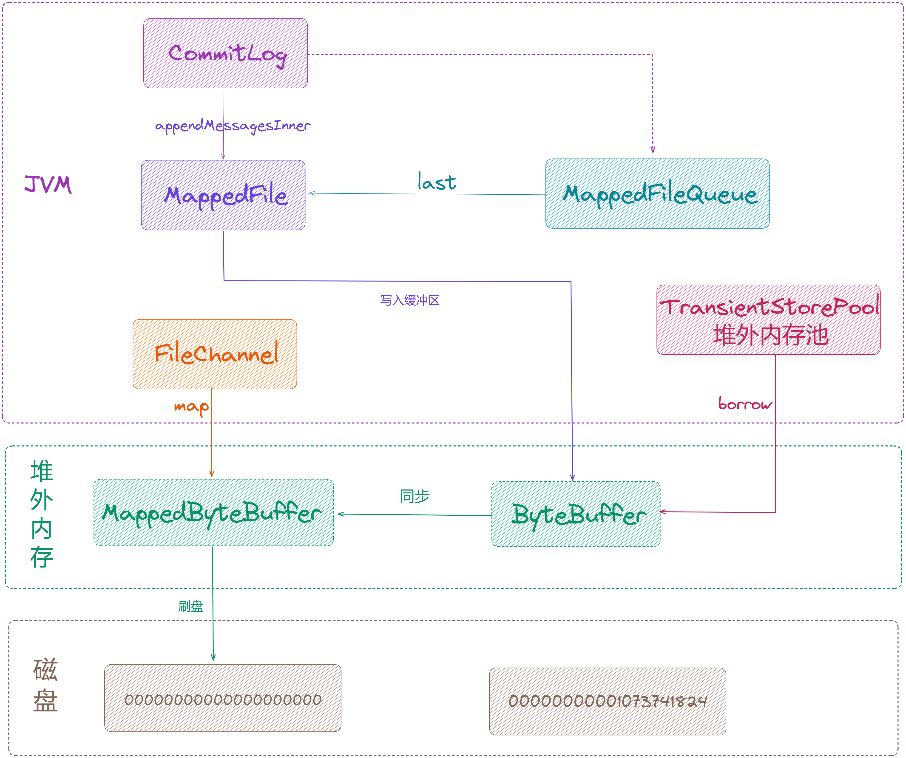

## **3.1 刷盘管理器**

在 [CommitLog](http://commitlog%20/) 构造方法中，有这样的一个组件：[DefaultFlushManager](http://defaultflushmanager/)，从名字看就是「**刷盘管理器**」，我就带着大家从这个「**刷盘管理器**」开始剖析。

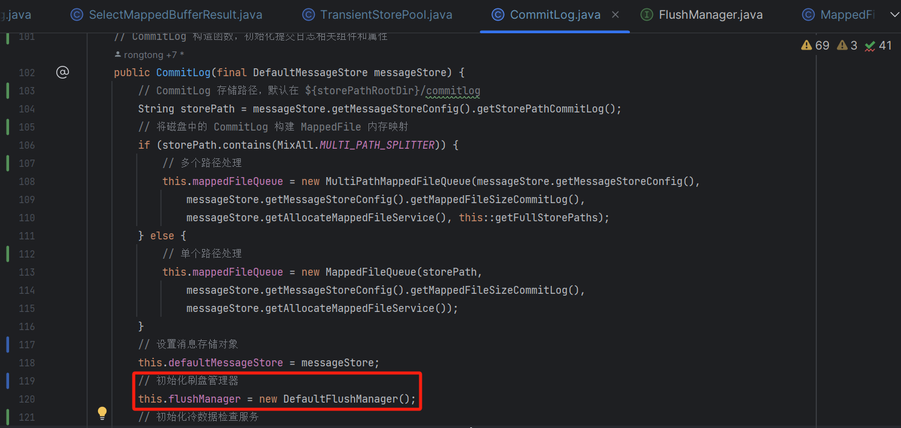

在「**刷盘管理器**」的构造方法中会初始化该 [CommitLog](http://commitlog/) 对应的存储服务。

/\*\*

\* GroupCommitService:同步刷盘服务

\* FlushRealTimeService:异步刷盘服务

\* CommitRealTimeService:实时异步提交转存服务

\* 在刷盘管理器中的这些服务本身就是一个个的线程任务，在创建了这些服务之后，在 CommitLog#start() 方法中将会对启动该管理器服务

\*/

class DefaultFlushManager implements FlushManager {

// 刷盘 commitLog 服务

private final FlushCommitLogService flushCommitLogService;

// 异步转存 commitLog 服务

//If TransientStorePool enabled, we must flush message to FileChannel at fixed periods

private final FlushCommitLogService commitRealTimeService;

public DefaultFlushManager() {

// 如果是同步刷盘，则初始化 GroupCommitLogService 服务

if (FlushDiskType.SYNC\_FLUSH == CommitLog.this.defaultMessageStore.getMessageStoreConfig().getFlushDiskType()) {

this.flushCommitLogService = new CommitLog.GroupCommitService();

} else {

// 如果是异步刷盘，则初始化 FlushRealTimeService 服务

this.flushCommitLogService = new CommitLog.FlushRealTimeService();

}

// 实时异步提交转存数据服务:将堆外内存的数据提交到 fileChannel

this.commitRealTimeService = new CommitLog.CommitRealTimeService();

}

....

}

这里根据 RocketMQ 配置决定使用哪种刷盘服务策略。

1.  判断 [getFlushDiskType()](http://getflushdisktype\(\)/) 的值，如果为 [FlushDiskType.SYNC\_FLUSH](http://flushdisktype.sync_flush/)，则说明配置要求采用「**同步刷盘**」策略。在这种情况下，创建并初始化一个 [CommitLog.GroupCommitService](http://commitlog.groupcommitservice/) 实例作为刷盘服务，这意味着消息在内存写入后将立即执行磁盘同步操作，确保数据持久化。
2.  如果是「**异步刷盘**」策略，则创建并初始化一个 [CommitLog.FlushRealTimeService](http://commitlog.flushrealtimeservice/) 实例作为刷盘服务，这通常意味着采用「**异步**」或者「**实时**」（基于时间间隔或消息数量）刷盘策略，这种策略可以提高系统的「**吞吐量**」，但可能会牺牲一定的数据持久性保证。
3.  此外，无论何种刷盘策略，都会实例化一个 [CommitLog.CommitRealTimeService](http://commitlog.commitrealtimeservice/) 对象作为「**实时**」提交服务，该服务可能与消息的实时处理和提交有关，确保消息尽快被处理和存储到合适的位置。

通过源码得知这些服务本身就是一个个的「**线程任务**」，在创建了这些服务之后会通过 [CommitLog#start()](http://commitlog/#start\(\)) 方法中将会对这些服务进行启动。

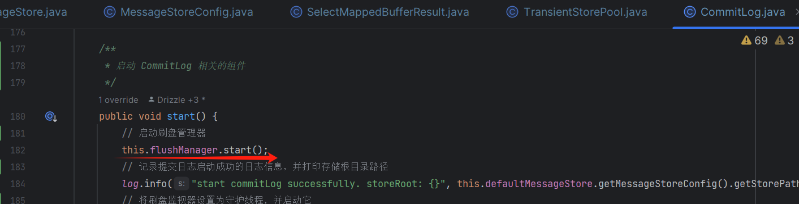

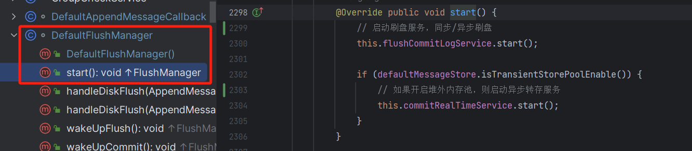

## **3.2 提交刷盘请求**

在 CommitLog 日志写入的方法最后会处理「**提交刷盘请求**」、「**提交副本同步请求**」，如下：

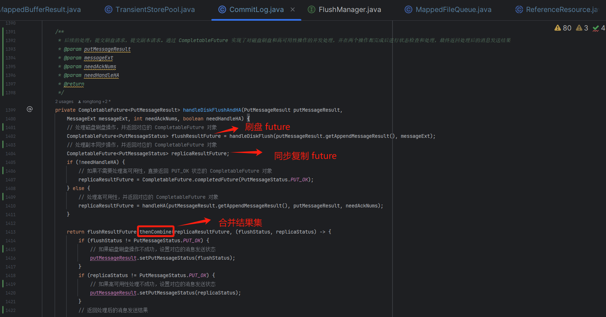

这段代码中，当 [CommitLog](http://commitlog%20/) 执行完 [appendMessage](http://appendmessage%20/) 后， 需要执行「**提交刷盘请求**」、「**提交副本同步请求**」两个任务。但这两个任务并不是同步执行，而是异步的方式，使用了 [CompletableFuture](http://completablefuture%20/) 这个异步神器。

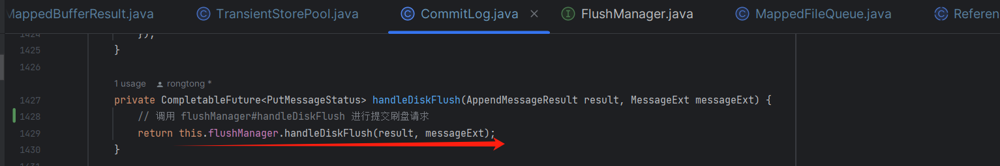

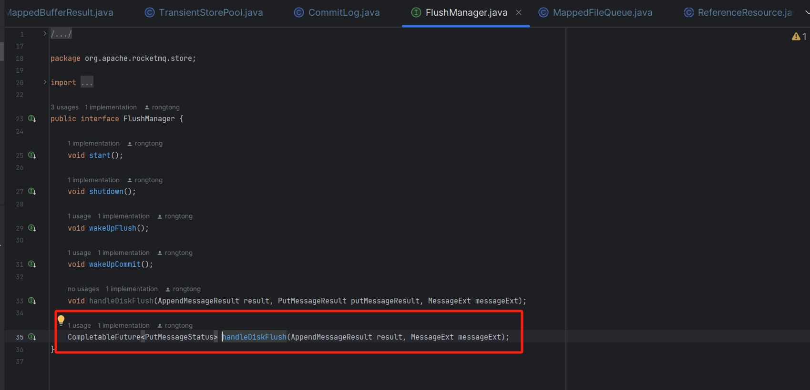

可以看到最后调用的是 [CompletableFuture](http://completablefuture/) 这个异步神器的方法。

/\*\*

\* 提交刷盘请求 刷盘操作：消息从内存映射文件写入到磁盘

\* 同步刷盘：

\* step1：创建组提交线程 GroupCommitService

\* step2：创建刷盘任务请求对象 GroupCommitRequest，并提交任务

\* step3：刷盘任务请求对象添加到 flushDiskWatcher，监控刷盘，如：刷盘超时处理

\* step4：阻塞，获取刷盘结果

\* 异步刷盘：

\* transientStorePoolEnable是否开启堆外内存池：

\* 作用：申请与目前Commitlog文件大小相同的堆外内存，并锁定内存避免与虚拟内存置换

\* 过程：有堆外内存：消息追加到堆外内存，然后commit文件内存映射，最后flush写入磁盘

\* 无堆外内存：消息直接追加到文件内存映射，最后flush写入磁盘

\* {@link CommitRealTimeService}：默认每200ms将消息追加到文件内存映射中（commitPosition移到当前wrotePosition且flushedPosition移到当前wrotePosition）

\* {@link FlushRealTimeService}：默认每500ms将文件内存映射写入磁盘（flushedPosition移到当前wrotePosition）

\* @param result 追加消息到内存映射文件的结果

\* @param messageExt 消息扩展

\* @return 同步或异步返回写入结果

\*/

@Override

public CompletableFuture<PutMessageStatus> handleDiskFlush(AppendMessageResult result, MessageExt messageExt) {

// Synchronization flush

// 同步刷盘策略

if (FlushDiskType.SYNC\_FLUSH == CommitLog.this.defaultMessageStore.getMessageStoreConfig().getFlushDiskType()) {

// 获取同步刷盘线程服务 GroupCommitService

final GroupCommitService service \= (GroupCommitService) this.flushCommitLogService;

// 消息成功提交到文件内存映射中，判断消息是否需要等待存储完成后才返回

if (messageExt.isWaitStoreMsgOK()) {

// 同步刷盘并且需要等待刷盘结果

// 构建同步刷盘请求对象 GroupCommitRequest

// 刷盘偏移量 nextOffset = 当前写入偏移量 getWroteOffset + 当前消息写入字节大小 getWroteBytes，其中 wroteOffset = fileFromOffset + byteBuffer.position()，也就是这条消息开始写入的物理偏移量，

// syncFlushTimeout：同步超时时间默认是5秒

GroupCommitRequest request \= new GroupCommitRequest(result.getWroteOffset() + result.getWroteBytes(), CommitLog.this.defaultMessageStore.getMessageStoreConfig().getSyncFlushTimeout());

// 将请求加入到刷盘监视器内部的 commitRequests 中，监控刷盘是否完成线程，如：刷盘超时处理

flushDiskWatcher.add(request);

// 将请求存入内部的 requestWrite，即提交任务到线程并且唤醒同步刷盘线程

service.putRequest(request);

// 阻塞，获取刷盘结果，这里仅仅返回 future，没有填充结果

// 返回 Future 对象。这个 future 对象就是同步的关键，GroupCommitService 提交请求后，处理完请求会将 flush 结果通过 GroupCommitRequest 的 wakeupCustomer 来传递，future 就会同步拿到处理结果。

return request.future();

} else {

// 同步刷盘不需要等待刷盘结果，此时唤醒同步刷盘线程，随后直接返回 PUT\_OK

service.wakeup();

return CompletableFuture.completedFuture(PutMessageStatus.PUT\_OK);

}

}

// Asynchronous flush

// 异步刷盘策略

else {

// 判断是否启用了堆外内存池，读写分离

if (!CommitLog.this.defaultMessageStore.isTransientStorePoolEnable()) {

// 如果没有启动了堆外内存池，那么唤醒异步刷盘服务 FlushRealTimeService

flushCommitLogService.wakeup();

} else {

// 如果启动了堆外内存池，那么唤醒异步提交转存服务 commitLogService

commitRealTimeService.wakeup();

}

// 直接返回 PUT\_OK

return CompletableFuture.completedFuture(PutMessageStatus.PUT\_OK);

}

}

该方法中将会根据broker的配置选择不同的刷盘策略：

1.  如果是同步刷盘，那么获取同步刷盘服务 [GroupCommitService](http://groupcommitservice/) ，用它来提交请求：
2.  同步等待：如果消息的配置需要等待存储完成后才返回「**构建消息时默认为 true**」，那么构建同步刷盘请求 [GroupCommitRequest](http://groupcommitrequest/)，并且将请求存入内部的 [requestWrite](http://requestwrite/)，并且唤醒同步刷盘线程，然后仅仅返回 [future](http://future/)，没有填充刷盘结果，将会在外部 [thenCombine](http://thencombine/) 方法处阻塞等待。这是同步刷盘的默认配置。
3.  同步不等待：如果消息的配置不需要等待存储完成后才返回，即不需要等待刷盘结果，那么唤醒同步刷盘线程就可以了，随后直接返回 [PUT\_OK](http://put_ok/)。
4.  如果是异步刷盘：
5.  如果启动了堆外内存池读写分离，即 [transientStorePoolEnable](http://transientstorepoolenable/) 为 true 并且不是 [SLAVE](http://slave/)，那么唤醒异步转存服务 [CommitRealTimeService](http://commitrealtimeservice/)。
6.  如果没有启动堆外内存池，那么唤醒异步刷盘服务 [FlushRealTimeService](http://flushrealtimeservice/)。这个是异步刷盘服务的默认配置。

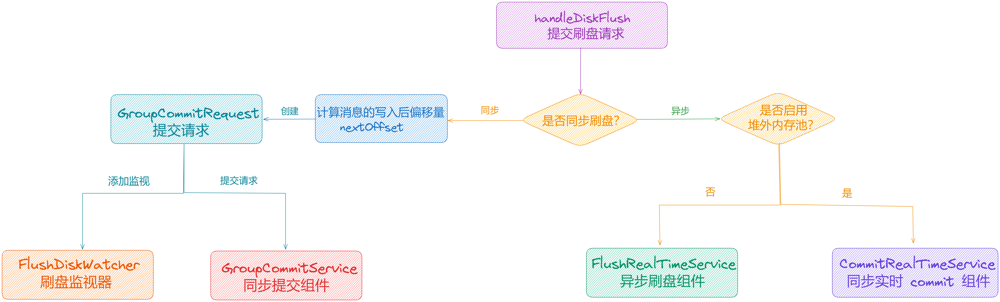

下面我们分别来看下这几个组件的实现。

## **3.3 同步刷盘组件**

同步刷盘服务为 [GroupCommitService](http://groupcommitservice/)，将消息追加到「**内存映射文件**」后，立即将数据从内存刷写到磁盘文件。它继承自 [FlushCommitLogService](http://flushcommitlogservice/)，它又继承自 [ServiceThread](http://servicethread/)，也就是说 [GroupCommitService](http://groupcommitservice%20/) 是一个线程在跑任务。

### **3.3.1 构造方法**

在创建 [GroupCommitService](http://groupcommitservice/) 对象时，将会初始化两个「**内部队列集合**」，分别是 [requestsWrite](http://requestswrite/) 和 [requestsRead](http://requestsread/)。

1.  [requestsWrite](http://requestswrite/) 用来存放 [putRequest](http://putrequest%20/) 方法写入的刷盘请求，
2.  [requestsRead](http://requestsread/) 用来存放 [doCommit](http://docommit/) 方法读取的刷盘请求。

通过使用两个队列实现「**读写分离**」在「**高并发**」写入消息的时候避免「**读写并发**」的问题，比如可以避免 [putRequest](http://putrequest/) 提交刷盘请求与 [doCommit](http://docommit/) 消费刷盘请求之间的锁竞争。

/\*\*

\* GroupCommit Service

\* 同步刷盘服务

\*/

class GroupCommitService extends FlushCommitLogService {

// 用来存放 putRequest 方法写入的刷盘请求

private volatile LinkedList<GroupCommitRequest> requestsWrite = new LinkedList<>();

// 用来存放 doCommit 方法读取的刷盘请求

private volatile LinkedList<GroupCommitRequest> requestsRead = new LinkedList<>();

// 同步服务独占锁，用来保证存入请求和交换请求操作的线程安全

private final PutMessageSpinLock lock \= new PutMessageSpinLock();

....

}

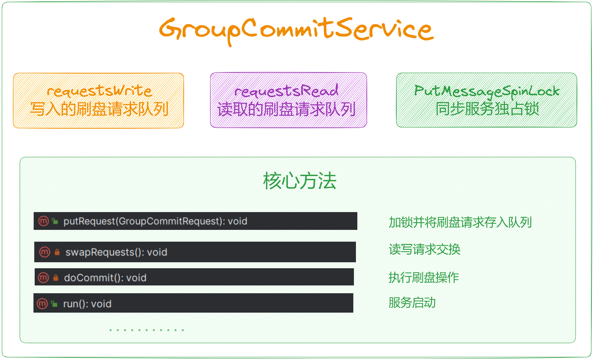

### **3.3.2 run()**

[GroupCommitService](http://groupcommitservice%20/) 本身是一个「**线程任务**」，其内部还保存着一个「**线程**」，当「**线程启动**」之后将会执行run方法，该方法就是同步刷盘的核心方法。

/\*\*

\* 服务启动刷盘操作

\*/

@Override

public void run() {

CommitLog.log.info(this.getServiceName() + " service started");

/\*\*

\* 运行时的处理逻辑

\* 如果服务没有停止，则在死循环中执行刷盘的操作

\* 1. waitForRunning:等待执行刷盘操作并且交换请求，同步刷盘服务最多等待 10ms

\* 2. doCommit:尝试执行批量刷盘

\*/

while (!this.isStopped()) {

try {

// 等待执行刷盘操作并且交换请求，固定最多每 10ms 执行一次

this.waitForRunning(10);

// 尝试执行批量刷盘

this.doCommit();

} catch (Exception e) {

CommitLog.log.warn(this.getServiceName() + " service has exception. ", e);

}

}

// Under normal circumstances shutdown, wait for the arrival of the

// request, and then flush

/\*\*

\* 停止时候的处理逻辑

\* 在正常情况下服务关闭，线程将会等待 10ms，等待请求到达然后一次性将剩余 request 进行刷盘

\*/

try {

Thread.sleep(10);

} catch (InterruptedException e) {

CommitLog.log.warn("GroupCommitService Exception, ", e);

}

// 交换请求

this.swapRequests();

// 尝试执行批量刷盘

this.doCommit();

CommitLog.log.info(this.getServiceName() + " service end");

}

这里分两种情况：

1.  线程服务运行时，将会在死循环中不断的执行刷盘的操作，主要是循环执行两个方法：
2.  [waitForRunning](http://waitforrunning/)：等待执行刷盘操作并且交换请求，同步刷盘服务最多等大10ms。
3.  [doCommit](http://docommit/)：尝试执行批量刷盘。
4.  线程服务停止时，线程将会等待 10ms，等待请求到达然后一次性将剩余 request 进行刷盘。
5.  [swapRequests](http://swaprequests/)：交换请求。
6.  [doCommit](http://docommit/)：尝试执行批量刷盘。

### **3.3.3 等待运行 waitForRunning**

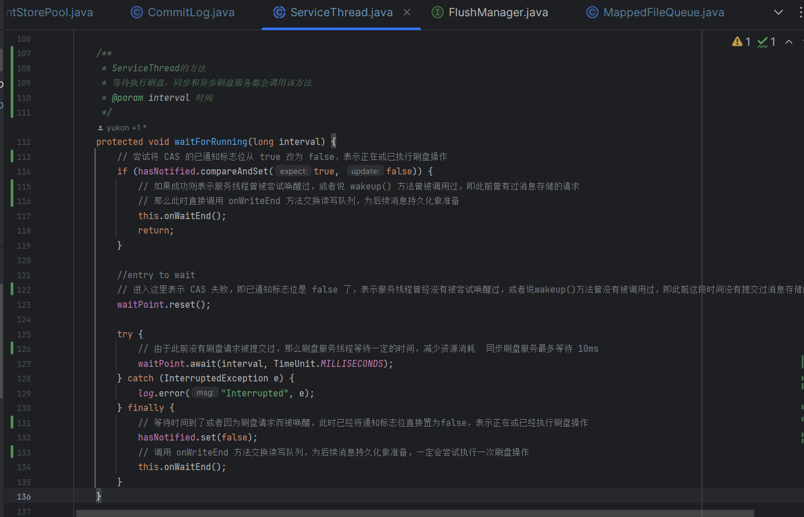

可以看到，该方法首先会尝试一次 CAS，如果成功则表示此前有过提交请求，则交换读写队列并结束，否则会进行等待，知道超时或者被提交请求唤醒。另外，同步刷盘服务在没有提交请求的时候同样会等待，只不过最多等待10ms。

### **3.3.4 等待结束交换请求 onWaitEnd**

该方法被 [GroupCommitService](http://groupcommitservice/) 类重写了，用来交换读写队列。

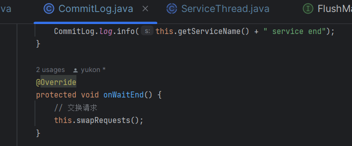

### **3.3.5 交换请求 swapRequests**

// 交换请求：交换读写队列引用，在交换的时候需要进行加锁

private void swapRequests() {

// 加锁

lock.lock();

try {

// 交换读写队列

LinkedList<GroupCommitRequest> tmp = this.requestsWrite;

// requestRead 是一个空队列

this.requestsWrite = this.requestsRead;

this.requestsRead = tmp;

} finally {

// 释放锁

lock.unlock();

}

}

说白了这里就是交换读写队列引用，在交换的时候需要加锁。

### **3.3.6 执行同步刷盘操作**

当 Broker 将消息内容追加到「**内存映射文件**」后，需要「**同步**」将内存中的数据进行「**刷盘**」，该方法主要是来消费 [requestsRead](http://requestsread%20/) 队列中的 [GroupCommitRequest](http://groupcommitrequest%20/) 请求。

/\*\*

\* 执行同步刷盘操作：在交换了读写队列之后，requestRead实际上引用到了requestWrite队列。

\* 1、如果队列为空也需要进行刷盘，因为某些消息的设置是同步刷盘但是不等待直接进行刷盘即可，无需唤醒线程等操作

\* 2、如果队列不为空，表示有提交同步等待刷盘请求，那么遍历队列依次刷盘。

\* step1：逐一从 requestsRead 队列取出刷盘任务进行刷盘操作

\* step2：this.mappedFileQueue.getFlushedWhere() >= req.getNextOffset()，表示刷盘任务完成，避免两次刷盘操作

\* step3：最终使用 FileChannel.force() 完成刷盘

\* step4：每个刷盘任务完成后，通知调用方刷盘结果

\* step5：requestsRead 的所有任务完成后，进行更新 Checkpoint（只是更新 Checkpoint 内存映射，并没有进行刷盘操作：

\* CommitLog 转发到消费队列中进行触发 Checkpoint 刷盘）

\*/

private void doCommit() {

if (!this.requestsRead.isEmpty()) {

// 如果 requestRead 读队列不为空，表示有提交请求，那么全部刷盘

for (GroupCommitRequest req : this.requestsRead) {

// There may be a message in the next file, so a maximum of

// two times the flush

// flushOK 表示刷盘任务完成，避免两次刷盘操作

boolean flushOK \= CommitLog.this.mappedFileQueue.getFlushedWhere() >= req.getNextOffset();

/\*\*

\* 一个同步刷盘请求最多进行两次刷盘操作，因为文件是固定大小的，第一次刷盘可能出现上一个文件剩余大小不足的情况

\* 消息只能再一次刷到下一个文件中，因此最多会出现两次刷盘的情况

\*

\* 如果 flushWhere 大于下一个刷盘点位，则表示该位置的数据已经刷盘成功了，不再需要刷盘

\* flushedWhere 的 CommitLog 的整体已刷盘物理偏移量

\*/

// 最多循环刷盘两次

for (int i \= 0; i < 2 && !flushOK; i++) {

// 执行强制刷盘操作，最少刷 0 页，即所有消息都会刷盘

CommitLog.this.mappedFileQueue.flush(0);

// 判断是否刷盘成功，如果上一个文件剩余大小不足，则 flushWhere 会小于 nextOffset 那么还需要再刷一次

flushOK = CommitLog.this.mappedFileQueue.getFlushedWhere() >= req.getNextOffset();

}

// 内部调用 flushOKFuture.complete 方法存入结果

req.wakeupCustomer(flushOK ? PutMessageStatus.PUT\_OK : PutMessageStatus.FLUSH\_DISK\_TIMEOUT);

}

// 获取存储时间戳

long storeTimestamp \= CommitLog.this.mappedFileQueue.getStoreTimestamp();

/\*\*

\* 这里用于重启数据恢复，修改 StoreCheckpoint 中的 physicMsgTimestamp：最新 CommitLog 文件的刷盘时间戳，单位毫秒

\*/

if (storeTimestamp > 0) {

CommitLog.this.defaultMessageStore.getStoreCheckpoint().setPhysicMsgTimestamp(storeTimestamp);

}

// requestRead 重新创建一个空的队列，当下一次交换队列的时候，requestWrite 又会成为一个空队列

this.requestsRead = new LinkedList<>();

} else {

// Because of individual messages is set to not sync flush, it

// will come to this process

// 某些消息的设置是同步刷盘但是不等待，因此这里直接进行刷盘即可，无需唤醒线程等操作

CommitLog.this.mappedFileQueue.flush(0);

}

}

在交换了读写队列之后，[requestRead](http://requestread/) 队列实际上引用到了 [requestsWrite](http://requestswrite/) 队列，[doCommit](http://docommit/) 方法将会执行刷盘操作，大概步骤为：

1.  判断 [requestsRead](http://requestsread/) 队列是否不为空，如果为空也需要进行刷盘，因为某些消息的设置是同步刷盘但是不等待，直接调用[mappedFileQueue.flush(0)](http://mappedfilequeue.flush\(0\)/) 方法进行一次同步刷盘即可，无需唤醒线程等操作。
2.  如果队列不为空，表示有「**提交同步等待刷盘请求**」，那么遍历该队列依次进行刷盘操作。
3.  每次刷盘请求最多刷盘两次：
4.  首先判断如果 [flushWhere](http://flushwhere/)（[CommitLog](http://commitlog%20/) 的整体已刷盘物理偏移量）大于等于下一个刷盘点位，则表示该位置的数据已经刷盘成功了，不再需要刷盘，此时刷盘 0 次。
5.  如果小于下一个刷盘点位，则调用 [mappedFileQueue.flush(0)](http://mappedfilequeue.flush\(0\)/) 方法进行一次「**同步刷盘**」，并且再次判断 [flushedWhere](http://flushedwhere/) 是否大于等于下一个刷盘点位，如果是则不再刷盘，此时刷盘 1 次。
6.  如果再次判断 [flushedWhere](http://flushedwhere/) 仍然小于下一个刷盘点位，那么再次刷盘。因为「**MappedFile**」文件是固定大小的，第一次刷盘可能出现上一个文件剩余大小不足的情况，消息只能再一次刷盘到下一个文件中，因为最多会出现两次刷盘的情况。
7.  调用 [wakeupCustomer](http://wakeupcustomer/) 方法，实际上内部调用 [flushOKFuture.complete](http://flushokfuture.complete/) 方法存入结果，将唤醒因为提交同步刷盘请求而被阻塞的线程。
8.  刷盘结束后，将会修改 [StoreCheckpoint](http://storecheckpoint/) 中的 [physicMsgTimestamp](http://physicmsgtimestamp/)（最新 [commitlog](http://commitlog/) 文件的刷盘时间戳，单位毫秒），用于重启数据恢复。
9.  最后为 [requestRead](http://requestread/) 重新创建一个空的队列，从这里可以得知当下一次交换队列到时候，[requestWrite](http://requestwrite/) 又会成为一个空队列。

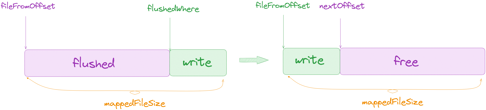

###   
**3.3.7 写入请求**

/\*\*

\* 加锁并将刷盘请求存入 requestWrite 集合，然后调用 wakeup 方法唤醒同步刷盘线程

\* @param request

\*/

public void putRequest(final GroupCommitRequest request) {

// 加锁

lock.lock();

try {

// 存入

this.requestsWrite.add(request);

} finally {

// 解锁

lock.unlock();

}

// 唤醒同步刷盘线程

this.wakeup();

}

很简单，加锁并将刷盘请求存入 [requestWrite](http://requestwrite/) 集合，然后调用 [wakeup](http://wakeup/) 方法唤醒同步刷盘线程。

这就是 [handleDiskFlush](http://handlediskflush%20/) 方法中执行「**同步刷盘**」操作的调用点，仅仅需要将请求存入队列，同步刷盘服务线程将会自动会去处理这些请求。

### **3.3.8 唤醒刷盘线程**

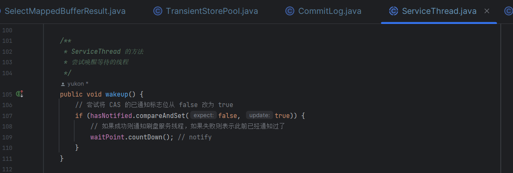

此时尝试唤醒同步刷盘线程，表示有新的「**同步等待刷盘请求**」被提交。

### **3.3.9 双队列读写分离设计思想**

在同步刷盘 [GroupCommitService](http://groupcommitservice/) 服务中，有两个队列 [requestWrite](http://requestwrite/) 和 [requestRead](http://requestread/)，[requestWrite](http://requestwrite/) 用来存放写入的刷盘请求队列，[requestsRead](http://requestsread/) 用来存放读取的刷盘请求队列。

首先调用 [putRequest](http://putrequest/) 方法将请求存入 [requestsWrite](http://requestswrite/) 队列中，而同步刷盘 [GroupCommitService](http://groupcommitservice/) 服务会「**最多每隔 10 ms**」就会调用 [swapRequests](http://swaprequests%20/) 方法进行「**读写队列引用交换**」，即 [requestsWrite](http://requestswrite/) 指向原 [requestsRead](http://requestsread/)指向的队列，[requestsRead](http://requestsread/) 指向原 [requestsWrite](http://requestswrite/) 指向的队列。并且 [putRequest](http://putrequest/) 方法和 [swapRequests](http://swaprequests/) 方法会「**竞争同一把锁**」。

在 [doCommit](http://docommit/) 刷盘方法中，只会获取 [requestsRead](http://requestsread/) 中的「**刷盘请求**」进行刷盘，并且在刷盘的最后会将[requestsRead](http://requestsread/) 队列重新构建一个空队列，而此过程中的刷盘请求都被提交到 [requestsWrite](http://requestswrite/)。

通过这些我们可以得知，调用一次 [doCommit](http://docommit/) 刷盘方法，可以进行「**多个请求**」的「**批量刷盘**」。这里使用两个队列实现「**读写分离**」，以及「**重置队列**」的操作，可以使得 [putRequest](http://putrequest/) 方法「**提交刷盘请求**」与 [doCommit](http://docommit/) 方法「**消费刷盘请求**」同时进行，避免了它们之间的锁竞争。

## **3.4 刷盘监视器组件**

/\*\*

\* 刷盘监视器，它也是一个线程任务

\*/

public class FlushDiskWatcher extends ServiceThread {

private static final Logger log \= LoggerFactory.getLogger(LoggerName.STORE\_LOGGER\_NAME);

// 使用这个阻塞队列来存放添加进来的 GroupCommitRequest，运行任务就是在消费这个阻塞队列。

private final LinkedBlockingQueue<GroupCommitRequest> commitRequests = new LinkedBlockingQueue<>();

@Override

public String getServiceName() {

return FlushDiskWatcher.class.getSimpleName();

}

/\*\*

\* 线程主循环，处理提交的 GroupCommitRequest

\*/

@Override

public void run() {

// 只要线程没有被停止，就一直循环

while (!isStopped()) {

// 初始化 GroupCommitRequest 对象

GroupCommitRequest request \= null;

try {

// 从队列中获取提交的 GroupCommitRequest，如果队列为空则会阻塞线程

request = commitRequests.take();

} catch (InterruptedException e) {

// 继续下一次循环

// 记录日志，表示从队列获取 GroupCommitRequest 时被中断

log.warn("take flush disk commit request,but interrupted,this may be caused by shutdown");

continue;

}

// 当 GroupCommitRequest 的 future 没有完成时，在循环中检查是否超时

while (!request.future().isDone()) {

// 获取当前时间的纳秒值

long now \= System.nanoTime();

// 如果当前时间减去请求的截止时间大于等于 0

if (now - request.getDeadLine() >= 0) {

// 唤醒相关的消费者线程，通知刷盘超时

request.wakeupCustomer(PutMessageStatus.FLUSH\_DISK\_TIMEOUT);

break;

}

// 为避免频繁的线程切换，用睡眠来代替 future.get() 方法

long sleepTime \= (request.getDeadLine() - now) / 1\_000\_000; // 计算需要睡眠的时间（毫秒为单位）

// 取较小值作为实际需要睡眠的时间，最大不超过 10 毫秒

sleepTime = Math.min(10,sleepTime);

if (sleepTime == 0) {

// 如果睡眠时间为 0，则表示超时，唤醒相关的消费者线程，通知刷盘超时

request.wakeupCustomer(PutMessageStatus.FLUSH\_DISK\_TIMEOUT);

break;

}

try {

// 线程睡眠指定的时间

Thread.sleep(sleepTime);

} catch (InterruptedException e) {

// 记录日志，表示在等待刷盘操作完成时被中断

log.warn("An exception occurred while waiting for flushing disk to complete.this may be caused by shutdown");

break;

}

}

}

}

public void add(GroupCommitRequest request) {

// 添加请求到阻塞队列中

commitRequests.add(request);

}

public int queueSize() {

// 获取队列大小

return commitRequests.size();

}

}

在同步刷盘时会将 [GroupCommitRequest](http://groupcommitrequest/) 添加到刷盘监视器 [FlushDiskWatcher](http://flushdiskwatcher/)，先看一下它主要是做什么的。

从源码看 [FlushDiskWatcher](http://flushdiskwatcher%20/) 继承自 [ServiceThread](http://servicethread/)，就是说它也是一个「**独立线程**」一直在后台运行一个任务。它内部有一个 [commitRequests](http://commitrequests%20/) 的阻塞队列来放添加进来的 [GroupCommitRequest](http://groupcommitrequest/)，运行任务就是在消费这个阻塞队列。

其 run 方法中，就是 FlushDiskWatcher 监听器的主要功能：

1.  循环从 [commitRequests](http://commitrequests%20/) 取出 [GroupCommitRequest](http://groupcommitrequest/) 请求，如果这个刷盘请求还没有完成且已经超时（默认5秒），就标记为刷盘超时 [FLUSH\_DISK\_TIMEOUT](http://flush_disk_timeout/)。
2.  如果没有超时，就会通过 [sleep 10](http://sleep%2010/) 毫秒继续来循环处理。

是不是觉得 [FlushDiskWatcher](http://flushdiskwatcher%20/) 的功能很简单，就是判断 [GroupCommitRequest](http://groupcommitrequest%20/) 是否超时了，如果超时就直接「**通知刷盘超时**」了。

## **3.5 异步刷盘组件**

所谓异步刷盘就是将消息追加到「**内存映射文件中**」，立刻返回给「**客户端**」。

这里需要注意异步刷盘根据是否开启「**堆外内存池**」[TransientStorePool](http://transientstorepool/)（[transientStorePoolEnable](http://transientstorepoolenable/) 默认[false](http://false/)，表示未开启），会执行不同的线程：

1.  **未开启堆外内存池**：唤醒 [FlushRealTimeService](http://flushrealtimeservice/) 直接执行刷盘，即：[commitPosition](http://commitposition/) 移到当前[wrotePosition](http://wroteposition/)，[flushedPosition](http://flushedposition/) 移到当前 [wrotePosition](http://wroteposition/)。
2.  **未开启堆外内存池**：唤醒 [CommitRealTimeServic](http://commitrealtimeservice/)，提交所有消息到「**内存映射文件中**」，再执行刷盘，即：[flushedPosition](http://flushedposition/) 移到当前 [wrotePosition](http://wroteposition/)。
3.  [FlushRealTimeService](http://flushrealtimeservice/)、[CommitRealTimeServic](http://commitrealtimeservice/) 这两个组件都是继承 [ServiceThread](http://servicethread/)，作为「**异步线程**」一直在运行任务。

### **3.5.1 FlushCommitLogService 刷盘组件**

这是一个抽象类，就一个变量 [RETRY\_TIMES\_OVER](http://retry_times_over/) 用来重试多少次刷盘操作，可以看到这里是硬编码 10 次。

abstract class FlushCommitLogService extends ServiceThread {

protected static final int RETRY\_TIMES\_OVER \= 10;

}

### **3.5.1 FlushRealTimeService 异步刷盘组件**

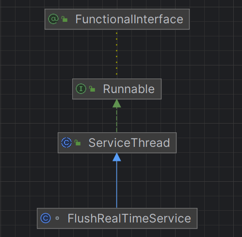

从它的源码可以了解到，默认每 [500ms](http://%20500ms/) 就会执行一次 [MappedFileQueue#flush](http://mappedfilequeue/#flush) 方法，刷盘的参数

[flushPhysicQueueLeastPages](http://flushphysicqueueleastpages%20/) 表示「**至少刷多少缓存页**」，默认是「**4 页**」，这个其实是表示至少有「**4 页**」 的脏数据才会执行刷盘，否则不会执行刷盘。

此外它还有一个机制是每隔[10秒](http://xn--10-gc0f/)，会将刷盘页数设置为 0，刷盘页为 0 时，就不管有「**多少页脏数据**」都会进行「**强制刷盘**」的操作，可以避免一些小的数据「**长时间没有刷盘**」。

最后，如果程序正常下线，还会强制刷盘，确保缓存页的数据flush到磁盘中。

整体看下来，[FlushRealTimeService](http://flushrealtimeservice%20/) 其实就是在异步的「**每隔 500 ms 刷盘一次**」，「**每隔 10 s 强制刷盘一次**」。

/\*\*

\* 未开启堆外内存池唤醒的线程

\*/

class FlushRealTimeService extends FlushCommitLogService {

// 记录最后一次完整刷盘操作的时间戳

private long lastFlushTimestamp \= 0;

// 用来控制打印刷盘进度信息的频率计数器

private long printTimes \= 0;

/\*\*

\* 1. 获取一系列的配置参数：

\* 1）.是否是定时刷盘，默认是 true，即开启（4.9.1版本之后默认改为 true），可通过 flushCommitLogTimed 配置

\* 2）.获取刷盘间隔时间，默认 500ms，可通过 flushIntervalCommitLog 配置

\* 3）.获取每次刷盘的最少页数，默认 4页，可通过 flushCommitLogLeastPages 配置

\* 4）.获取强制物理刷盘间隔时间，默认 10s，可通过 flushCommitLogThoroughInterval 配置，即距离上一次刷盘超过 10s 时，不管页数是否超过 4页，都会刷盘

\* 2. 如果当前时间距离上次刷盘时间大于等于 10s，那么必定刷盘，因此设置刷盘的最少页数为 0，更新刷盘时间戳为当前时间。

\* 3. 判断是否是定时刷盘，如果是定时刷盘那么当前线程 sleep 睡眠指定的间隔时间，否则那么调用 waitForRunning 方法，线程最多阻塞指定的间隔时间，但可以被中途的wakeup方法唤醒进而直接尝试进行刷盘。

\* 4. 线程醒来后调用 mappedFileQueue.flush 方法刷盘，指定最少页数，随后更新最新的 CommitLog 文件的刷盘时间戳，单位毫秒，用于启动恢复。

\* 5. 当刷盘服务正常关闭后，则确保所有消息写入磁盘，默认执行 10 次刷盘操作，让消息尽量少丢失。

\* 可以看到，在异步刷盘的情况下，默认最少需要 4 页的脏数据才会刷盘，另外还可以配置定时策略，默认 500ms，且最长刷盘延迟间隔时间，默认达到了 10s。

\* 这些延迟刷盘的配置，可以保证 RocketMQ 有尽可能高的效率，但是同样会增加消息丢失的可能， 例如机器掉电。

\*/

@Override

public void run() {

// 刷盘服务启动

CommitLog.log.info(this.getServiceName() + " service started");

/\*\*

\* 运行时逻辑：

\* 如果服务没有停止，则在死循环中执行刷盘的操作

\*/

while (!this.isStopped()) {

// 是否定时刷盘 CommitLog，默认开启

boolean flushCommitLogTimed \= CommitLog.this.defaultMessageStore.getMessageStoreConfig().isFlushCommitLogTimed();

// 获取刷盘间隔时间，默认 500ms，可通过 flushIntervalCommitLog 配置

int interval \= CommitLog.this.defaultMessageStore.getMessageStoreConfig().getFlushIntervalCommitLog();

// 获取每次刷盘的最少页数，默认4页，即 16k，可通过 flushCommitLogLeastPages 配置

int flushPhysicQueueLeastPages \= CommitLog.this.defaultMessageStore.getMessageStoreConfig().getFlushCommitLogLeastPages();

// 获取强制物理刷盘间隔时间，默认 10s，可通过flushCommitLogThoroughInterval配置，即距离上一次刷盘超过 10s 时，不管页数是否超过4页，都会刷盘

int flushPhysicQueueThoroughInterval \=

CommitLog.this.defaultMessageStore.getMessageStoreConfig().getFlushCommitLogThoroughInterval();

boolean printFlushProgress \= false;

// Print flush progress

// 获取当前时间

long currentTimeMillis \= System.currentTimeMillis();

// 如果当前时间距离上次刷盘时间大于等于10s，强制刷盘

if (currentTimeMillis >= (this.lastFlushTimestamp + flushPhysicQueueThoroughInterval)) {

// 更新刷盘时间戳为当前时间

this.lastFlushTimestamp = currentTimeMillis;

// 最少刷盘页数为 0，即不管页数是否超过4页，都会刷盘

flushPhysicQueueLeastPages = 0;

printFlushProgress = (printTimes++ % 10) == 0;

}

try {

// 判断是否是定时刷盘

if (flushCommitLogTimed) {

// 如果是定时刷盘，那么当前线程睡眠指定的间隔时间休眠，这里为 500ms

Thread.sleep(interval);

} else {

// 如果不是定时刷盘，那么调用 waitForRunning 方法，线程最多睡眠 500ms

// 可以被中途的 wakeup 方法唤醒进而直接尝试进行刷盘

this.waitForRunning(interval);

}

if (printFlushProgress) {

// 打印刷盘进度

this.printFlushProgress();

}

// 开始刷盘时间

long begin \= System.currentTimeMillis();

// 开始刷盘，这里指定刷盘页数，其最终调用FileChannel#force(boolean)

CommitLog.this.mappedFileQueue.flush(flushPhysicQueueLeastPages);

// 获取存储时间戳

long storeTimestamp \= CommitLog.this.mappedFileQueue.getStoreTimestamp();

/\*\*

\* 刷盘完成后，更新检查点 StoreCheckpoint 中的 physicMsgTimestamp：最新 CommitLog 文件的刷盘时间戳，单位毫秒

\* 这里用于重启数据恢复

\* 注意：并没有进行 Checkpoint 文件刷盘，其刷盘为消费队列刷盘时触发，入口 DefaultMessageStore.FlushConsumeQueueService

\*/

if (storeTimestamp > 0) {

CommitLog.this.defaultMessageStore.getStoreCheckpoint().setPhysicMsgTimestamp(storeTimestamp);

}

// 刷盘消耗时间

long past \= System.currentTimeMillis() - begin;

CommitLog.this.getMessageStore().getPerfCounter().flowOnce("FLUSH\_DATA\_TIME\_MS", (int) past);

if (past > 500) {

log.info("Flush data to disk costs {} ms", past);

}

} catch (Throwable e) {

CommitLog.log.warn(this.getServiceName() + " service has exception. ", e);

this.printFlushProgress();

}

}

// Normal shutdown, to ensure that all the flush before exit

/\*\*

\* 停止时逻辑：刷盘线程正常关闭后，则确保所有消息写入磁盘，一次性执行 10 次刷盘操作

\*/

boolean result \= false;

for (int i \= 0; i < RETRY\_TIMES\_OVER && !result; i++) {

result = CommitLog.this.mappedFileQueue.flush(0);

CommitLog.log.info(this.getServiceName() + " service shutdown, retry " + (i + 1) + " times " + (result ? "OK" : "Not OK"));

}

// 打印刷盘进度

this.printFlushProgress();

// 刷盘服务结束

CommitLog.log.info(this.getServiceName() + " service end");

}

@Override

public String getServiceName() {

if (CommitLog.this.defaultMessageStore.getBrokerConfig().isInBrokerContainer()) {

return CommitLog.this.defaultMessageStore.getBrokerConfig().getIdentifier() + FlushRealTimeService.class.getSimpleName();

}

return FlushRealTimeService.class.getSimpleName();

}

private void printFlushProgress() {

// CommitLog.log.info("how much disk fall behind memory, "

// + CommitLog.this.mappedFileQueue.howMuchFallBehind());

}

@Override

public long getJoinTime() {

return 1000 \* 60 \* 5;

}

}

重要方法是 run()，其重要步骤如下：

1.  如果服务没有停止，则将会在死循环中不断的「**执行刷盘**」的操作，首先获取一系列配置参数：
2.  是否是定时刷盘，默认是 true，即开启（4.9.1版本之后默认改为 true），可通过 [flushCommitLogTimed](http://flushcommitlogtimed%20/) 配置。
3.  获取刷盘间隔时间，默认 500ms，可通过 [flushIntervalCommitLog](http://flushintervalcommitlog%20/) 配置。
4.  获取每次刷盘的最少页数，默认 4页，可通过 [flushCommitLogLeastPages](http://flushcommitlogleastpages%20/) 配置。
5.  获取强制物理刷盘间隔时间，默认 10s，可通过 [flushCommitLogThoroughInterval](http://flushcommitlogthoroughinterval%20/) 配置，即距离上一次刷盘超过 10s 时，不管页数是否超过 4页，都会刷盘
6.  如果当前时间距离上次刷盘时间大于等于 10s，那么必定刷盘，因此设置刷盘的最少页数为 0，更新刷盘时间戳为当前时间。
7.  判断是否是定时刷盘，如果是定时刷盘那么当前线程 sleep 睡眠指定的间隔时间，否则那么调用 [waitForRunning](http://waitforrunning%20/) 方法，线程最多阻塞指定的间隔时间，但可以被中途的 [wakeup](http://wakeup/) 方法唤醒进而直接尝试进行刷盘。
8.  线程醒来后调用 [mappedFileQueue.flush](http://mappedfilequeue.flush/) 方法刷盘，指定最少页数，随后更新最新的 [CommitLog](http://commitlog%20/) 文件的刷盘时间戳，单位毫秒，用于启动恢复。
9.  当刷盘服务正常关闭后，则确保所有消息写入磁盘，默认执行 10 次刷盘操作，让消息尽量少丢失。

综上，「**异步刷盘**」的情况下，默认「**最少需要 4 页的脏数据**」才会刷盘，另外还可以配置「**定时刷盘策略**」，默认 [500 ms](http://500ms/)，且「**强制物理刷盘间隔时间**」，默认达到了 10s。通过这些「**延迟刷盘**」的配置，可以保证RocketMQ 有尽可能更高的效率，但是同样会增加消息丢失的可能，例如「**机器掉电**」等。

### **3.5.2 CommitRealTimeService 异步刷盘组件**

「**异步堆外内存刷盘服务**」为 [CommitRealTimeService](http://commitrealtimeservice/)，其同样是一个线程任务，并且内部持有一个单独的线程。

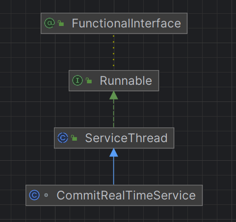

从它的源码可以了解到， [CommitRealTimeService](http://commitrealtimeservice%20/) 线程默认每隔 [200ms](http://200ms/) 将消息追加到「**内存映射文件**」中（即 ：[commitPosition](http://commitposition/) 移到当前 [wrotePosition](http://wroteposition/)），再进行刷盘（即：[flushedPosition](http://flushedposition/) 移到当前 [wrotePosition](http://wroteposition/)）。

/\*\*

\* 开启堆外内存池唤醒的线程

\* 消息提交过程，先 commit 再 flush

\*/

class CommitRealTimeService extends FlushCommitLogService {

// 记录最后一次提交操作的时间戳

private long lastCommitTimestamp \= 0;

@Override

public String getServiceName() {

if (CommitLog.this.defaultMessageStore.getBrokerConfig().isInBrokerContainer()) {

return CommitLog.this.defaultMessageStore.getBrokerIdentity().getIdentifier() + CommitRealTimeService.class.getSimpleName();

}

return CommitRealTimeService.class.getSimpleName();

}

/\*\*

\* 执行异步堆外内存刷盘服务

\* 1. 获取一系列的配置参数：

\* 1）.获取提交间隔时间，默认 200ms，可通过 commitIntervalCommitLog 配置。

\* 2）.获取提交的最少页数，默认4页，即 16k，可通过 commitCommitLogLeastPages 配置。

\* 3）.获取强制物理提交间隔时间，默认 200ms，可通过 commitCommitLogThoroughInterval 配置，

\* 即距离上一次刷盘超过 200ms 时，不管页数是否超过4页，都会提交。

\* 2. 如果当前时间距离上次刷盘时间大于等于 200ms，强制提交，因此设置刷盘的最少页数为 0，更新刷盘时间戳为当前时间。

\* 3. 调用 commit 进行提交操作

\*/

@Override

public void run() {

//

CommitLog.log.info(this.getServiceName() + " service started");

/\*\*

\* 运行时逻辑

\* 如果服务没有停止，则在死循环中执行刷盘的操作

\*/

while (!this.isStopped()) {

// 获取提交间隔时间，默认 200ms，可通过 CommitIntervalCommitLog 进行配置

int interval \= CommitLog.this.defaultMessageStore.getMessageStoreConfig().getCommitIntervalCommitLog();

// 获取提交的最少页数， 默认 4页，即 16k，可通过 CommitCommitLogLeastPages 进行配置

int commitDataLeastPages \= CommitLog.this.defaultMessageStore.getMessageStoreConfig().getCommitCommitLogLeastPages();

// 获取强制物理提交间隔时间，默认 200ms，可通过 CommitCommitLogThoroughInterval 配置，即距离上一次刷盘超过 200ms时，不管页数是否超过4页，都会进行刷盘操作

int commitDataThoroughInterval \=

CommitLog.this.defaultMessageStore.getMessageStoreConfig().getCommitCommitLogThoroughInterval();

// 开始提交时间

long begin \= System.currentTimeMillis();

// 如果当前时间距离上次刷盘时间大于等于 200ms，强制刷盘

if (begin >= (this.lastCommitTimestamp + commitDataThoroughInterval)) {

// 更新上次提交时间戳为当前时间

this.lastCommitTimestamp = begin;

// 最少提交页数为 0，即不管页数是否超过 4页，都会刷盘

commitDataLeastPages = 0;

}

try {

// 看到这里调用 commit 方法提交数据，而不是直接调用 flush 方法进行刷盘

boolean result \= CommitLog.this.mappedFileQueue.commit(commitDataLeastPages);

// 结束时间

long end \= System.currentTimeMillis();

// 如果已经提交了一些脏数据到 fileChannel

if (!result) {

// 更新最后提交的时间戳

this.lastCommitTimestamp = end; // result = false means some data committed.

// 唤醒 flushCommitService 异步刷盘服务进行刷盘操作

CommitLog.this.flushManager.wakeUpFlush();

}

CommitLog.this.getMessageStore().getPerfCounter().flowOnce("COMMIT\_DATA\_TIME\_MS", (int) (end - begin));

if (end - begin > 500) {

log.info("Commit data to file costs {} ms", end - begin);

}

// 等待执行

this.waitForRunning(interval);

} catch (Throwable e) {

CommitLog.log.error(this.getServiceName() + " service has exception. ", e);

}

}

/\*\*

\* 停止时逻辑：提交线程正常关闭后，则确保所有消息写入磁盘，一次性执行 10 次提交操作

\*/

boolean result \= false;

for (int i \= 0; i < RETRY\_TIMES\_OVER && !result; i++) {

result = CommitLog.this.mappedFileQueue.commit(0);

CommitLog.log.info(this.getServiceName() + " service shutdown, retry " + (i + 1) + " times " + (result ? "OK" : "Not OK"));

}

CommitLog.log.info(this.getServiceName() + " service end");

}

}

重要方法是 run()，其重要步骤如下：

1.  如果服务没有停止，则将会在死循环中不断的「**执行提交**」的操作，首先获取一系列的配置参数：
2.  获取提交间隔时间，默认 200ms，可通过 [commitIntervalCommitLog](http://commitintervalcommitlog/) 配置。
3.  获取提交的最少页数，默认4页，即16k，可通过 [commitCommitLogLeastPages](http://commitcommitlogleastpages/) 配置。
4.  获取强制物理提交间隔时间，默认 200ms，可通过 [commitCommitLogThoroughInterval](http://commitcommitlogthoroughinterval/) 配置，即距离上一次刷盘超过200ms 时，不管页数是否超过 4页，都会刷盘。
5.  如果当前时间距离上次刷盘时间大于等于 200ms，强制提交，因此设置刷盘的最少页数为 0，更新刷盘时间戳为当前时间。
6.  调用 [mappedFileQueue.commit](http://mappedfilequeue.commit/) 方法提交数据到 [fileChannel](http://filechannel/)，而不是直接 [flush](http://flush/) 刷盘，如果已经提交了一些脏数据到[fileChannel](http://filechannel/)，那么更新最后提交的时间戳，并且唤醒 [FlushRealTimeService](http://flushrealtimeservice/) 异步刷盘服务进行真正的刷盘操作。
7.  调用 [waitForRunning](http://waitforrunning/) 方法，线程最多阻塞指定的间隔时间，但可以被中途的 [wakeup](http://wakeup%20/) 方法唤醒进而进行下一轮循环。
8.  当刷盘服务被关闭时，默认执行 10 次提交操作，让消息尽量少丢失。

综上可以发现，「**异步堆外内存提交**」和「**普通异步刷盘**」的逻辑都差不多，最主要的区别就是「**异步堆外内存提交服务**」并不会真正的执行刷盘操作，而是调用 [commit](http://commit/) 方法提交数据到 [fileChannel](http://filechannel/)。

当开启了「**堆外内存池服务**」之后，消息会先被追加写到「**堆外内存**」 [writebuffer](http://writebuffer/)，而「**读数据**」始终从 [MappedByteBuffer](http://mappedbytebuffer/) 中读取，两者通过「**异步堆外内存提交服务**」[CommitRealTimeService](http://commitrealtimeservice/) 实现数据同步。该服务会「**异步**」（最多每 [200ms](http://200ms/) 执行一次，因为默认刷盘时间间隔 [200ms](http://200ms/)）将「**堆外内存**」 [writebuffer](http://writebuffer/) 中的脏数据「**提交**」到 [commitlog](http://commitlog/) 文件的文件通道 [FileChannel](http://filechannel/) 中，而该文件被执行了内存映射 [mmap](http://mmap/) 操作，因此可以从对应的 [MappedByteBuffer](http://mappedbytebuffer/) 中直接获取提交到 [FileChannel](http://filechannel/) 的数据，但仍有延迟。最后「**唤醒异步刷盘服务**」[FlushRealTimeService](http://flushrealtimeservice/)，由该 [FlushRealTimeService](http://flushrealtimeservice/) 服务（每最多 [500ms](http://500ms/) 执行一次），最终「**异步**」的将 [MappedByteBuffer](http://mappedbytebuffer/) 中的数据刷新到磁盘。

在「**高并发**」下「**频繁**」写入 [PageCache](http://pagecache%20/) 可能会造成「**刷脏页时磁盘压力较高**」，导致写入时出现「**毛刺现象**」。「**读写分离**」能「**缓解频繁**」写入 [PageCache](http://pagecache/) 的压力，但会增加消息不一致的风险，使得数据一致性降低到最低。  

这里的关于「**文件检查点文件**」[Checkpoint](http://checkpoint/) 文件的刷盘动作在「**刷盘消息消费队列线程**」中执行，其入口为[org.apache.rocketmq.store.DefaultMessageStore.FlushConsumeQueueService](http://org.apache.rocketmq.store.defaultmessagestore.flushconsumequeueservice/)。由于「**消息消费队列**」、「**索引文件**」的刷盘实现原理与 [Commitlog](http://commitlog/) 文件的刷盘机制类同，我们会在后面篇章单独剖析，这里不展开。

最后通过一张图梳理流程：

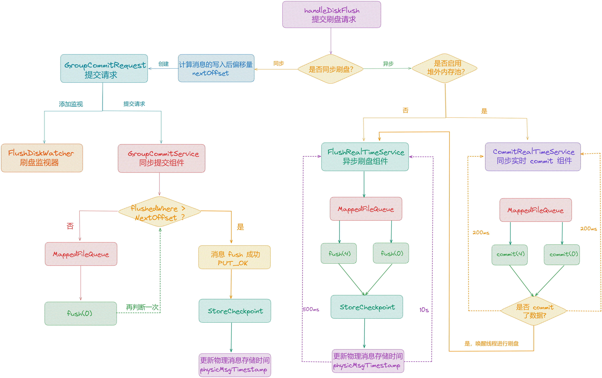

## **04 MappedFile 提交和刷盘机制**

## **4.1 MappedFile 刷盘机制**

源码位置：[https://github.com/apache/rocketmq/blob/release-5.1.2/store/src/main/java/org/apache/rocketmq/store/MappedFileQueue.java](https://github.com/apache/rocketmq/blob/release-5.1.2/store/src/main/java/org/apache/rocketmq/store/MappedFileQueue.java)

### **4.1.1 MappedFileQueue#flush 刷盘**

不论是同步和异步刷盘服务，最终都是调用 [MappedFileQueue#flush](http://mappedfilequeue/#flush) 方法执行刷盘。

/\*\*

\* 执行刷盘：同步和异步刷盘服务，最终否是调用 MappedFileQueue#flush 方法执行刷盘

\* 主要步骤：

\* 1、首先根据最新刷盘物理位置 flushWhere 去查找到对应的 MappedFile。

\* 2、如果 flushWhere 为 0，表示还没有开始写消息，则获取第一个 MappedFile。

\* 3、然后调用 mappedFile#flush 方法执行真正的刷盘操作。

\* @param flushLeastPages 最少刷盘的页数

\* @return

\*/

public boolean flush(final int flushLeastPages) {

boolean result \= true;

// 根据最新刷盘物理位置 flushedWhere，去找到对应的 MappedFile

MappedFile mappedFile \= this.findMappedFileByOffset(this.flushedWhere, this.flushedWhere == 0);

if (mappedFile != null) {

// 获取存储时间戳，storeTimestamp 在 appendMessagesInner 方法中被更新

long tmpTimeStamp \= mappedFile.getStoreTimestamp();

/\*\*

\* 执行刷盘操作

\*/

int offset \= mappedFile.flush(flushLeastPages);

// 获取最新刷盘物理偏移量

long where \= mappedFile.getFileFromOffset() + offset;

// 刷盘结果

result = where == this.flushedWhere;

// 更新刷盘物理位置

this.flushedWhere = where;

// 如果最少刷盘页数为 0，则更新存储时间戳

if (0 == flushLeastPages) {

this.storeTimestamp = tmpTimeStamp;

}

}

return result;

}

真正的刷盘操作在 [DefaultMappedFile#flush](http://defaultmappedfile/#flush) 中，这里只是封装和处理刷盘结果，步骤如下：

1.  首先根据最新刷盘物理位置 [flushWhere](http://flushwhere%20/) 去查找到对应的 [MappedFile](http://mappedfile/)。
2.  如果 [flushWhere](http://flushwhere%20/) 为 0，表示还没有开始写消息，则获取第一个 [MappedFile](http://mappedfile/)。
3.  然后调用 [DefaultMappedFile#flush](http://defaultmappedfile/#flush) 方法执行真正的刷盘操作。

### **4.1.2 根据偏移量获取 MappedFile**

/\*\*

\* Finds a mapped file by offset.

\* 根据偏移量获取 MappedFile

\* @param offset Offset.

\* @param returnFirstOnNotFound If the mapped file is not found, then return the first one.

\* @return Mapped file or null (when not found and returnFirstOnNotFound is <code>false</code>).

\*/

public MappedFile findMappedFileByOffset(final long offset, final boolean returnFirstOnNotFound) {

try {

// 获取第一个 MappedFile

MappedFile firstMappedFile \= this.getFirstMappedFile();

// 获取最后一个 MappedFile

MappedFile lastMappedFile \= this.getLastMappedFile();

// 都不为空

if (firstMappedFile != null && lastMappedFile != null) {

// 如果偏移量不在正确的范围内，则打印异常日志

if (offset < firstMappedFile.getFileFromOffset() || offset >= lastMappedFile.getFileFromOffset() + this.mappedFileSize) {

LOG\_ERROR.warn("Offset not matched. Request offset: {}, firstOffset: {}, lastOffset: {}, mappedFileSize: {}, mappedFiles count: {}",

offset,

firstMappedFile.getFileFromOffset(),

lastMappedFile.getFileFromOffset() + this.mappedFileSize,

this.mappedFileSize,

this.mappedFiles.size());

} else {

// 获取当前 offset 属于的 MappedFile 在 mappedFiles 集合中的索引位置

int index \= (int) ((offset / this.mappedFileSize) - (firstMappedFile.getFileFromOffset() / this.mappedFileSize));

MappedFile targetFile \= null;

try {

// 根据索引位置获取对应的 MappedFile 文件

targetFile = this.mappedFiles.get(index);

} catch (Exception ignored) {

}

// 如果指定 offset 在 targetFile 的 offset 范围内，那么返回

if (targetFile != null && offset >= targetFile.getFileFromOffset()

&& offset < targetFile.getFileFromOffset() + this.mappedFileSize) {

return targetFile;

}

// 否则，遍历 mappedFiles，依次对每个 MappedFile 的 offset 进行判断，找到对应的 tmpMappedFile 并返回

for (MappedFile tmpMappedFile : this.mappedFiles) {

// mappedFile 目标文件大小为 1G 即 this.mappedFileSize

if (offset >= tmpMappedFile.getFileFromOffset()

&& offset < tmpMappedFile.getFileFromOffset() + this.mappedFileSize) {

return tmpMappedFile;

}

}

}

// 到这里表示没找到任何 MappedFile，如果 returnFirstOnNotFound 为 true，则返回第一个文件

if (returnFirstOnNotFound) {

return firstMappedFile;

}

}

} catch (Exception e) {

log.error("findMappedFileByOffset Exception", e);

}

return null;

}

该方法用来根据偏移量获取对应的 [MappedFile](http://mappedfile/)，逻辑比较简单，大概步骤如下：

1.  首先获取 [mappedFiles](http://mappedfiles/) 集合中的第一个 [MappedFile](http://mappedfile/) 和最后一个 [MappedFile](http://mappedfile/)。
2.  接着获取当前 [offset](http://offset%20/) 属于的 [MappedFile](http://mappedfile/) 在 [mappedFiles](http://mappedfiles/) 集合中的索引位置。因为 [MappedFile](http://mappedfile/) 的名字则是该[MappedFile](http://mappedfile/) 的起始 [offset](http://offset/)，而每个 [MappedFile](http://mappedfile/) 的大小一般是固定 1G 的，所以查找的方法很简单：当前 [int index = (int) ((offset / this.mappedFileSize) - (firstMappedFile.getFileFromOffset() / this.mappedFileSize))](http://int%20index%20=%20\(int\)%20\(\(offset%20/%20this.mappedFileSize\)%20-%20\(firstMappedFile.getFileFromOffset\(\)%20/%20this.mappedFileSize\)\))。
3.  接着根据索引位置从 [mappedFiles](http://mappedfiles/) 中获取对应的 [MappedFile](http://mappedfile/) 文件 [targetFile](http://targetfile/)，如果指定 [offset](http://offset/) 在 [targetFile](http://targetfile/) 的 [offset](http://offset/) 范围内，那么返回该 [targetFile](http://targetfile/)。
4.  否则，遍历 [mappedFiles](http://mappedfiles/)，依次对每个 [MappedFile](http://mappedfile/) 的 [offset](http://offset/) 范围进行判断，找到对应的 [tmpMappedFile](http://tmpmappedfile/) 并返回。
5.  执行到这里，表示没找到任何 [MappedFile](http://mappedfile/)，如果 [returnFirstOnNotFound](http://returnfirstonnotfound/) 为 [true](http://true/)，则返回第一个文件。
6.  最后还是不满足条件则返回 [null](http://null/)。

###   
**4.2.3 DefaultMappedFile#flush 刷盘**

源码位置：[https://github.com/apache/rocketmq/blob/release-5.1.2/store/src/main/java/org/apache/rocketmq/store/](https://github.com/apache/rocketmq/blob/release-5.1.2/store/src/main/java/org/apache/rocketmq/store/logfile/DefaultMappedFile.java)[logfile/DefaultMappedFile](https://github.com/apache/rocketmq/blob/release-5.1.2/store/src/main/java/org/apache/rocketmq/store/logfile/DefaultMappedFile.java)[.java](https://github.com/apache/rocketmq/blob/release-5.1.2/store/src/main/java/org/apache/rocketmq/store/logfile/DefaultMappedFile.java)

/\*\*

\* 刷盘操作

\* @return The current flushed position

\*/

@Override

public int flush(final int flushLeastPages) {

/\*\*

\* 判断是否可以刷盘

\* 如果文件已经满了，或者如果 flushLeastPages 大于 0，且脏页数量大于等于 flushLeastPages

\* 或者如果 flushLeastPages 等于 0 并且存在脏数据，这几种情况都会进行刷盘

\*/

if (this.isAbleToFlush(flushLeastPages)) {

// 增加对该 MappedFile 的引用次数

if (this.hold()) {

// 获取写入位置

int value \= getReadPosition();

try {

// 只将数据追加到 fileChannel 或 mappedByteBuffer 中，不会同时追加到这两个里面

this.mappedByteBufferAccessCountSinceLastSwap++;

//We only append data to fileChannel or mappedByteBuffer, never both.

// 如果使用了堆外内存，那么通过 fileChannel 强制刷盘，这是异步堆外内存执行的逻辑

if (writeBuffer != null || this.fileChannel.position() != 0) {

this.fileChannel.force(false);

} else {

// 如果没有使用堆外内存，那么通过 mappedByteBuffe r强制刷盘，这里是同步或者异步刷盘执行的逻辑

this.mappedByteBuffer.force();

}

// 更新最后一次刷盘时间

this.lastFlushTime = System.currentTimeMillis();

} catch (Throwable e) {

log.error("Error occurred when force data to disk.", e);

}

// 设置刷盘位置为写入位置

FLUSHED\_POSITION\_UPDATER.set(this, value);

// 减少对该 MappedFile 的引用次数

this.release();

} else {

log.warn("in flush, hold failed, flush offset = " + FLUSHED\_POSITION\_UPDATER.get(this));

FLUSHED\_POSITION\_UPDATER.set(this, getReadPosition());

}

}

// 获取最新刷盘位置

return this.getFlushedPosition();

}

无论是「**同步刷盘**」还是「**异步刷盘**」，最终都是调用该方法来完成刷盘操作，大概步骤如下：

1.  判断是否可以刷盘。如果文件已经满了，或者如果 [flushLeastPages](http://flushleastpages/) 大于0，且脏页数量大于等于 [flushLeastPages](http://flushleastpages/)，或者如果 [flushLeastPages](http://flushleastpages/) 等于0并且存在脏数据，这几种情况都会刷盘。
2.  如果可以刷盘了：那么增加引用次数，并且进行刷盘操作。
3.  如果使用了堆外内存，那么通过[fileChannel#force](http://filechannel/#force)强制刷盘，这是异步堆外内存执行的逻辑。
4.  如果没有使用堆外内存，那么通过 [mappedByteBuffer#force](http://mappedbytebuffer/#force) 强制刷盘，这是同步或者异步刷盘执行的逻辑。
5.  最后更新刷盘位置为写入位置，并返回。

###   
**4.1.4 DefaultMappedFile#isAbleToFlush 是否可刷盘**

/\*\*

\* 是否支持刷盘

\* 1. 首先获取刷盘位置 flush 和写入位置 write。

\* 2. 判断如果文件满了，即写入位置等于文件大小，那么直接返回 true。

\* 3. 如果至少刷盘的页数 flushLeastPages 大于 0，则需要比较写入位置与刷盘位置的差值，当差值大于指定的最少页数才可以进行刷盘，此举可以防止频繁刷盘。

\* 3. 否则 flushLeastPages 为 0，那么只要写入位置大于刷盘位置，即存在脏数据此时就一定会刷盘。

\* @param flushLeastPages 至少刷盘的页数

\* @return

\*/

private boolean isAbleToFlush(final int flushLeastPages) {

// 获取刷盘位置

int flush \= FLUSHED\_POSITION\_UPDATER.get(this);

// 获取写入位置

int write \= getReadPosition();

// 如果文件已经满了，那么返回 true

if (this.isFull()) {

return true;

}

// 如果至少刷盘的页数大于 0，则需要比较写入位置与刷盘位置的差值

// 当差值大于等于指定的页数才能刷盘，此举是为了防止频繁刷盘

if (flushLeastPages > 0) {

return ((write / OS\_PAGE\_SIZE) - (flush / OS\_PAGE\_SIZE)) >= flushLeastPages;

}

//否则 flushLeastPages 为 0，那么只要写入位置大于刷盘位置，即存在脏数据就会进行刷盘

return write > flush;

}

该方法用来判断当前是否可刷盘，大概步骤如下：

1.  首先获取刷盘位置 [flush](http://flush/) 和写入位置 [write](http://write/)。然后判断如果文件满了，即写入位置等于文件大小，那么直接返回 [true](http://true/)。
2.  如果至少刷盘的页数 [flushLeastPages](http://flushleastpages/) 大于0，则需要比较写入位置与刷盘位置的差值，当差值大于等于指定的最少页数才能刷盘，此举可以防止频繁的刷盘。
3.  否则 [flushLeastPages](http://flushleastpages/) 为 0，那么只要写入位置大于刷盘位置，即存在脏数据那么就一定会刷盘。

##   
**4.2 MappedFile 提交机制**

### **4.2.1 MappedFileQueue#commit 提交**

/\*\*

\* 提交刷盘：

\* 主要步骤：

\* 1、首先根据最新提交物理位置 committedWhere，去找到对应的 MappedFile。如果 committedWhere 为 0，表示还没有开始写消息，则获取第一个 MappedFile。

\* 2、然后调用 DefaultMappedFile#commit 方法执行真正的提交操作

\* @param commitLeastPages 最少提交的页数

\* @return 如果 false 表示提交了部分数据

\*/

public synchronized boolean commit(final int commitLeastPages) {

boolean result \= true;

// 根据最新提交的物理位置 committedWhere，去找到对应的 MappedFile。

// 如果 committedWhere 为 0，表示还没有开始提交消息，则获取第一个 MappedFile

MappedFile mappedFile \= this.findMappedFileByOffset(this.committedWhere, this.committedWhere == 0);

if (mappedFile != null) {

/\*\*

\* 执行提交操作

\*/

int offset \= mappedFile.commit(commitLeastPages);

// 获取最新提交物理偏移量

long where \= mappedFile.getFileFromOffset() + offset;

// 如果不相等表示只是提交了部分数据

result = where == this.committedWhere;

// 更新提交物理位置

this.committedWhere = where;

}

return result;

}

真正的提交刷盘操作在 [DefaultMappedFile#commit](http://defaultmappedfile/#commit) 中，这里只是封装和处理刷盘结果，大概步骤如下：

1.  首先根据最新提交物理位置 [commitedWhere](http://commitedwhere/)，去找到对应的 [MappedFile](http://mappedfile/)。如果 [commitedWhere](http://commitedwhere/) 为0，表示还没有开始写消息，则获取第一个 [MappedFile](http://mappedfile/)。
2.  然后调用 [DefaultMappedFile#commit](http://defaultmappedfile/#commit) 方法执行真正的刷盘操作。

###   
**4.2.2 DefaultMappedFile#commit 提交**

/\*\*

\* 提交操作

\* @param commitLeastPages the least pages to commit

\* @return

\*/

@Override

public int commit(final int commitLeastPages) {

// 如果堆外内存为 null，那么不需要提交fileChannel，只需要将wrotePosition视为committedPosition返回即可

if (writeBuffer == null) {

//no need to commit data to file channel, so just regard wrotePosition as committedPosition.

return WROTE\_POSITION\_UPDATER.get(this);

}

//no need to commit data to file channel, so just set committedPosition to wrotePosition.

if (transientStorePool != null && !transientStorePool.isRealCommit()) {

COMMITTED\_POSITION\_UPDATER.set(this, WROTE\_POSITION\_UPDATER.get(this));

} else if (this.isAbleToCommit(commitLeastPages)) { // 是否支持提交，其判断逻辑和 isAbleToFlush 方法一致

// 增加对该 MappedFile 的引用次数

if (this.hold()) {

// 将堆外内存中的全部脏数据提交到 fileChannel

commit0();

// 减少对该 MappedFile 的引用次数

this.release();

} else {

log.warn("in commit, hold failed, commit offset = " + COMMITTED\_POSITION\_UPDATER.get(this));

}

}

// All dirty data has been committed to FileChannel.

// 所有的脏数据被提交到了 FileChannel，那么归还堆外内存

if (writeBuffer != null && this.transientStorePool != null && this.fileSize == COMMITTED\_POSITION\_UPDATER.get(this)) {

// 将堆外内存重置，并存入内存 availableBuffer 的头部

this.transientStorePool.returnBuffer(writeBuffer);

// 将 writeBuffer 置为 null，下次再重新获取

this.writeBuffer = null;

}

// 返回提交位置

return COMMITTED\_POSITION\_UPDATER.get(this);

}

/\*\*

\* 将堆外内存中的全部脏数据提交到 fileChannel

\*/

protected void commit0() {

// 获取当前写入位置

int writePos \= WROTE\_POSITION\_UPDATER.get(this);

// 获取上一次已提交的位置

int lastCommittedPosition \= COMMITTED\_POSITION\_UPDATER.get(this);

// 如果有新数据需要提交

if (writePos - lastCommittedPosition > 0) {

try {

// 创建一个只读的 ByteBuffer

ByteBuffer byteBuffer \= writeBuffer.slice();

// 设置 byteBuffer 的 position 和 limit，指定写入范围

byteBuffer.position(lastCommittedPosition);

byteBuffer.limit(writePos);

// 设置文件通道的位置

this.fileChannel.position(lastCommittedPosition);

// 将 byteBuffer 中的数据写入文件通道

this.fileChannel.write(byteBuffer);

// 更新已提交的位置

COMMITTED\_POSITION\_UPDATER.set(this,writePos);

} catch (Throwable e) {

// 捕获可能的异常，记录日志

log.error("Error occurred when commit data to FileChannel.",e);

}

}

}

### **4.2.3 DefaultMappedFile#isAbleToCommit 是否可提交**

/\*\*

\* 是否支持提交

\* 1. 首先获取提交位置 commit 和写入位置 write。

\* 2. 判断如果文件满了，即写入位置等于文件大小，那么直接返回 true。

\* 3. 如果至少提交的页数 commitLeastPages 大于 0，则需要比较写入位置与提交位置的差值，当差值大于指定的最少页数才可以进行提交，此举可以防止频繁提交。

\* 3. 否则 commitLeastPages 为 0，那么只要写入位置大于提交位置，即存在脏数据此时就一定会提交。

\* @param commitLeastPages 至少提交的页数

\* @return

\*/

protected boolean isAbleToCommit(final int commitLeastPages) {

// 获取提交位置

int commit \= COMMITTED\_POSITION\_UPDATER.get(this);

// 获取写入位置

int write \= WROTE\_POSITION\_UPDATER.get(this);

// 如果文件已经满了，那么返回 true

if (this.isFull()) {

return true;

}

// 如果至少提交的页数大于 0，则需要比较写入位置与提交位置的差值

// 当差值大于等于指定的页数才能提交，此举是为了防止频繁提交

if (commitLeastPages > 0) {

return ((write / OS\_PAGE\_SIZE) - (commit / OS\_PAGE\_SIZE)) >= commitLeastPages;

}

// 否则 commitLeastPages 为 0，那么只要写入位置大于提交位置，即存在脏数据就会进行提交

return write > commit;

}

## **05 总结**

## **5.1 CommitLog 组成**

[CommitLog](http://commitlog%20/) 是 RocketMQ 对存储层的抽象，整体的架构设计如下：

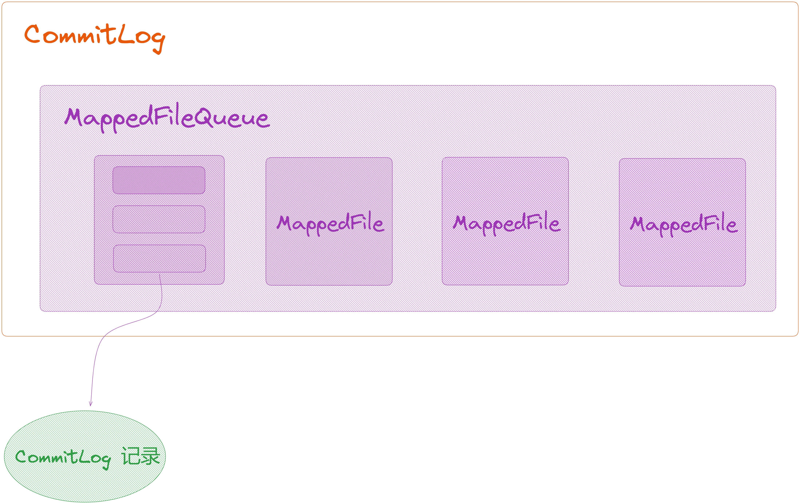

1.  [MappedFile](http://mappedfile/)：作为底层的数据存储，默认情况下单个文件大小 1G。[MappedFile](http://mappedfile%20/) 提供了一些对文件元数据以及可用性的一些操作以及添加消息数据到文件中的接口。
2.  [MappedFileQueue](http://mappedfilequeue/)：将底层的单个数据文件以队列的形式组织起来，主要提供获取单个 [MappedFile](http://mappedfile/) 的一些操作。例如：获取第一个或者最后一个数据文件，以及文件属性的相关操作都是由 [MappedFileQueue](http://mappedfilequeue%20/) 提供。
3.  [CommitLog](http://commitlog/)：整个对外提供服务的封装，同时一些数据刷盘操作都是在 [CommitLog](http://commitlog/) 中实现的。

[MappedFile](http://mappedfile/) 文件列表组成了 [MappedFileQueue](http://mappedfilequeue/)，然后通过增加相关的对外操作于 [MappedFileQueue](http://mappedfilequeue/) 组成了[CommitLog](http://commitlog/)。

## **5.2 偏移量关系**

通过本文的剖析，我们知道 [DefaultMappedFile](http://defaultmappedfile%20/) 中有 [wrotePosition](http://wroteposition/)、[committedPosition](http://committedposition/)、[flushedPosition](http://flushedposition%20/) 三个位置，在 [MappedFileQueue](http://mappedfilequeue%20/) 中还有 [flushedWhere](http://flushedwhere/)、[committedWhere](http://committedwhere%20/) 两个位置，那么这几个变量是什么关系呢，我们来剖析下：

1.  首先要知道，对于单个 [MappedFile](http://mappedfile%20/) 来说，[wrotePosition](http://wroteposition/)、[committedPosition](http://committedposition/)、[flushedPosition](http://flushedposition%20/) 三个位置都是相对于单个文件，偏移量从 0 开始增加，直到达到文件的大小。对于每个 [MappedFile](http://mappedfile%20/) 的起始偏移量 [fileFromOffset](http://filefromoffset%20/) 都是固定的，比如第一个 [MappedFile](http://mappedfile%20/) 起始偏移量 [fileFromOffset](http://filefromoffset/) 是 0，第二个起始偏移量 [fileFromOffset](http://filefromoffset/) 是 [1073741824](http://64.0.0.0/)。
2.  当一个 [MappedFile](http://mappedfile%20/) 写满之后，且 [writeBuffer](http://writebuffer%20/) 已经全部同步到 [FileChannel](http://filechannel%20/) 中，那么 [wrotePosition](http://wroteposition/)，[committedPosition](http://committedposition/)，[flushedPosition](http://flushedposition%20/) 三个位置此时都一样，刚好等于文件大小。然后关联的 [writeBuffer](http://writebuffer%20/) 会置空，返还给 [TransientStorePool](http://transientstorepool%20/) 以复用。
3.  当有新的数据要写入时，先会写入「**堆外内存**」 [writeBuffer](http://writebuffer/) 中，写入多少字节，[writePosition](http://writeposition%20/) 就会增长多少， 它表示的就是「**缓冲区写入的末尾偏移量**」。接着数据从「**堆外内存**」 [writeBuffer](http://writebuffer%20/) 拷贝到 [FileChannel](http://filechannel%20/) 时，会直接拷贝到 [wrotePosition](http://wroteposition/) 的位置，此时 [committedPosition](http://committedposition%20/) 就表示「**拷贝数据的末尾偏移量**」。
4.  当 [FileChannel](http://filechannel%20/) 数据刷盘时，会直接刷到 [committedPosition](http://committedposition%20/) 的位置，此时 [flushedPosition](http://flushedposition%20/) 表示的就是「**内存数据刷盘到磁盘后的末尾偏移量**」。而 [flushedWhere](http://flushedwhere/)、[committedWhere](http://committedwhere%20/) 是一直在累加的，就算前面的 [MappedFile](http://mappedfile%20/) 被删了，这两个值也在一直累加而不会被清空。

  
这里需要注意 [commit](http://commit%20/) 时只针对 [writeBuffer](http://writebuffer/)，只有开启了 [TransientStorePool](http://transientstorepool%20/) 「**堆外内存池**」的时候，[committedPosition](http://committedposition%20/) 和 [committedWhere](http://committedwhere%20/) 才会生效。

综上可以得到如下的关系：

其中 [flushedWhere](http://flushedwhere%20/) 、[committedWhere](http://committedwhere%20/) 这两个字段主要是从 [MappedFileQueue](http://mappedfilequeue/) 的角度去理解的：

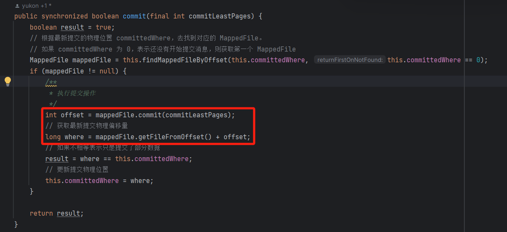

[committedWhere](http://committedwhere/)： 当前 [MappedFile](http://mappedfile/) 的 [fileFromOffset](http://filefromoffset%20/) + 当前 [MappedFile](http://mappedfile/) 的 [committedPosition](http://committedposition/)。

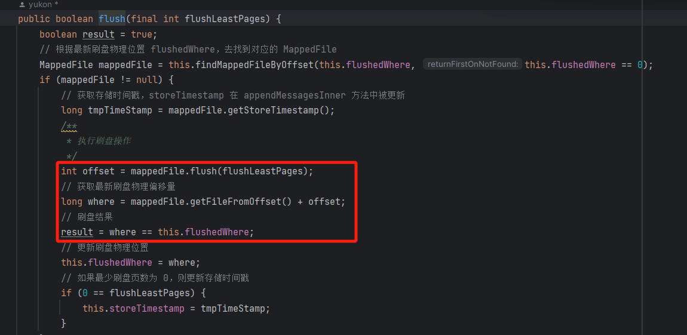

[flushedWhere](http://flushedwhere%20/) ： 当前 [MappedFile](http://mappedfile/) 的 [fileFromOffset](http://filefromoffset%20/) + 当前 [MappedFile](http://mappedfile/) 的 [flushedPosition](http://flushedposition/)。

### **DefaultMappedFile 字段：**

1.  [fileFromOffset](http://filefromoffset/) 表示日志数据存储文件的名称，初始值为 0，每增加增加一个文件默认情况下增加 1024 \* 1024 \* 1024。
2.  [wrotePosition](http://wroteposition/) 表示写入 [FileChannel](http://filechannel/) 的数据，此时这些数据可能还存在内存中未落盘，每次增加日志 [wrotePosition](http://wroteposition/) 就会往后移动。
3.  [committedPosition](http://committedposition/) 只有在「**堆外内存池**」启动的时候才会使用到，「**堆外内存**」提交的 [FileChannel](http://filechannel/) 中的数据位置，这个字段只有启用了「**堆外内存池**」才会用到，要不然就是使用的 [wrotePosition](http://wroteposition/)。
4.  [flushedPosition](http://flushedposition/) 表示落盘的位置，在小于 [flushedPosition](http://flushedposition/) 位置的数据都已经持久化到了磁盘。

###   
**MappedFileQueue 字段：**

1.  [flushedWhere](http://flushedwhere/)：表示整个文件队列的刷盘的位置，异步刷盘由 [FlushRealTimeService](http://flushrealtimeservice%20/) 线程处理，同步刷盘由 [GroupCommitService](http://groupcommitservice%20/) 线程处理。
2.  [committedWhere](http://committedwhere/)：表示「**堆外内存池**」的提交位置，由 [CommitRealTimeService](http://commitrealtimeservice/) 线程处理。

综上得出：

1.  [flushedWhere = fileFromOffset + flushedPosition](http://flushedwhere%20=%20filefromoffset%20+%20flushedposition/)。
2.  [committedWhere = fileFromOffset + committedPosition](http://committedwhere%20=%20filefromoffset%20+%20committedposition/)。
3.  开启了 [TransientStorePool](http://transientstorepool%20/)「**堆外内存池**」时：[wrotePosition >= committedPosition >= flushedPosition](http://wroteposition%20=%20committedposition%20%20=%20flushedposition/)。
4.  未开启 [TransientStorePool](http://transientstorepool%20/)「**堆外内存池**」时：[wrotePosition >= flushedPosition](http://wroteposition%20=%20flushedposition/)。

  
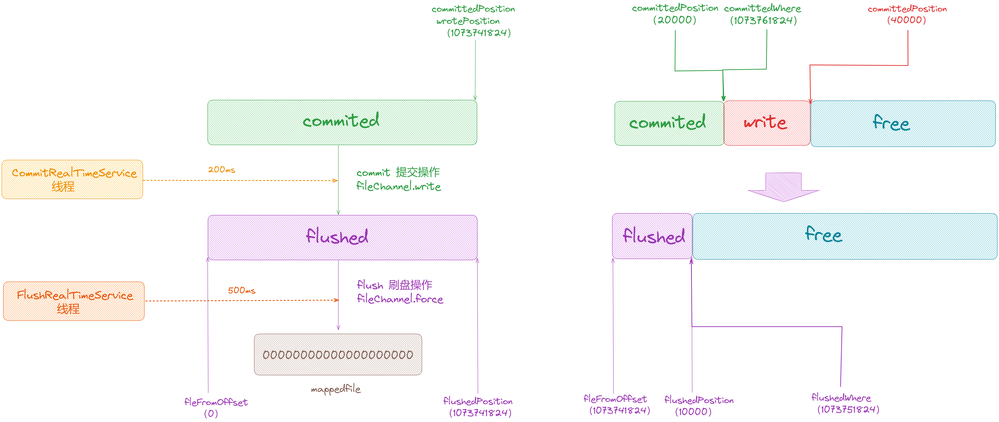

### **5.3 PageCache**

通过源码得知 [DefaultMappedFile#flush](http://defaultmappedfile/#flush) 刷盘就是调用 [FileChannel#force](http://filechannel/#force) 或 [MappedByteBuffer#force](http://mappedbytebuffer/#force) 方法，

**那你是否疑惑为什么要调用 force 方法来执行刷盘呢？**

其实这是与 [PageCache](http://pagecache%20/) 页缓存有关的，它是操作系统内核的一部分用来缓存文件系统中的数据。

1.  当应用程序读取文件时，操作系统会将文件的数据块（通常是以页为单位，一般为4KB）缓存到 [PageCache](http://pagecache%20/) 中，用来提高文件 I/O 的性能。
2.  当应用程序写入文件时，操作系统将数据缓存在 [PageCache](http://pagecache%20/) 中，并延迟将数据写入磁盘，这样可以提高写入性能。

当数据在被写入 [PageCache](http://pagecache%20/) 后，并不意味着立即写入了磁盘，为了保证数据的一致性和持久性，[PageCache](http://pagecache%20/) 有以下策略：

1.  延迟写入 [Delayed Write](http://delayed%20write/)：[PageCache](http://pagecache%20/) 将写入的数据暂时缓存在内存中，并将其标记为「**已修改**」状态。然后操作系统会根据一定的策略如「**内存压力**」、「**磁盘空闲**」等在合适的时机将已修改的数据批量刷写入磁盘。这样可以减少频繁的磁盘访问，提高写入性能。
2.  强制刷新 [Force Flush](http://force%20flush/)：除了延迟写入，[PageCache](http://pagecache/) 还提供了「**强制刷新**」的机制。应用程序可以显式地调用类似于 [fsync()](http://fsync\(\)/) 或 [fdatasync()](http://%20fdatasync\(\)/) 的函数来要求将数据「**强制刷新**」到磁盘，以确保数据的持久性。这会阻塞应用程序，直到数据完全写入磁盘。

[MappedFile](http://mappedfile%20/) 是基于「**内存映射技术 MMAP**」来读写文件的，调用 [FileChannel.map()](http://filechannel.map\(\)/) 方法时，会创建一个映射缓冲区对象 [MappedByteBuffer](http://mappedbytebuffer/)，并将文件的一部分或整个文件映射到进程的虚拟内存空间中，得到一个与文件相关联的「**缓冲区**」。在「**映射缓冲区**」创建过程中，操作系统会将映射的文件数据页加载到 [PageCache](http://pagecache%20/) 中，PageCache 中的数据与映射缓冲区之间通过「**内存映射机制**」来进行交互。

无论是 [MappedByteBuffer](http://mappedbytebuffer%20/) 还是 [FileChannel](http://filechannel%20/) 在写入数据时，实际上只是将数据写入 [PageCache](http://pagecache/)。当我们将数据写入 [PageCache](http://pagecache%20/) 后，即便我们的应用崩溃了，但是只要系统不崩溃，最终数据也会将数据刷入磁盘。而 [force](http://force%20/) 方法就是用于强制将 [PageCache](http://pagecache%20/) 中的脏页数据刷到磁盘文件中，确保所有对文件的更改都被持久化，以便在系统崩溃或断电时不会丢失数据。

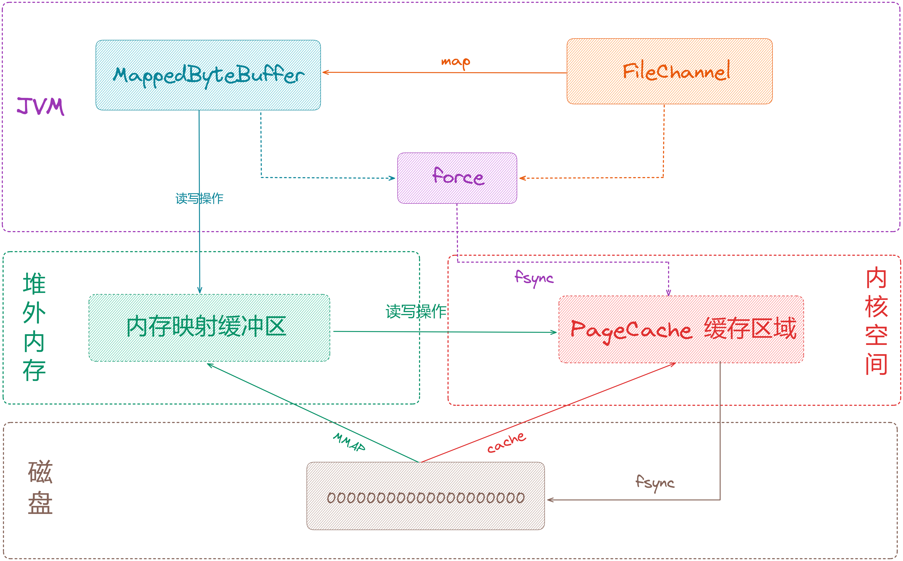