大家好，我是**华仔**, 又跟大家见面了。

从今天开始我将继续为大家奉上 RocketMQ 消费者源码剖析系列文章，正式开启「**RocketMQ 的服务端 Broker 源码之旅**」，这是第二十七篇，本篇我们将以「**RocketMQ 5.1.2**」版本为主，来剖析下 RocketMQ 源码之 Broker 端 [ConsumeQueue](http://consumequeue%20/) 架构设计深度剖析。

这里我将以「**RocketMQ 5.1.2**」版本为主，通过「**场景驱动**」的方式带大家一点点的对 RocketMQ 源码进行深度剖析，正式开启「**RocketMQ 的源码之旅**」，跟我一起来掌握 RocketMQ 源码核心架构设计思想吧。

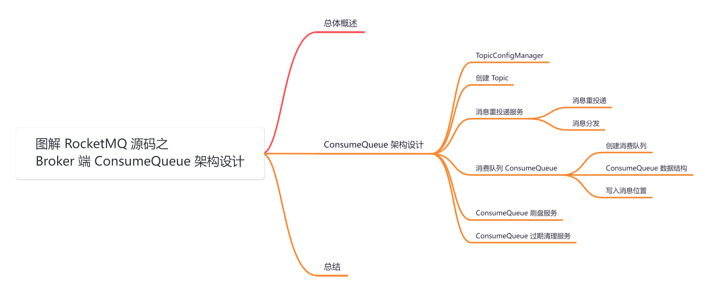

##   
**01 总体概述**

消息存储是 RocketMQ 整个系统的核心，直接决定着吞吐性能和高可用性。RocketMQ 存储消息并没有借助外部组件，而是「**直接操作文件**」，借助 java NIO 的力量使得 I/O 性能十分高。

当消息来的时候，顺序追加写入 [CommitLog](http://commitlog/) 文件中。为了 [Consumer](http://consumer/) 消费消息的时候能够方便的根据 topic 查询消息，在 [CommitLog](http://commitlog/) 文件的基础上衍生出了 [CosumerQueue](http://cosumerqueue/) 文件用来存放了某 topic 的消息在 [CommitLog](http://commitlog/) 中的偏移位置。此外为了支持根据消息 key 查询消息，还构建了 [indexFile](http://indexfile%20/) 文件。

这三个文件就是 RocketMQ 的主要存储内容，大致结构如下图所示：

今天我们继续来剖析下底层三大核心存储文件之一：[ConsumeQueue](http://consumequeue/) 底层存储架构设计究竟是怎样的，它又是在什么时机下产生的呢？

## **02 ConsumeQueue 架构设计**

在深度剖析 [ConsumeQueue](http://consumequeue/) 底层存储架构设计之前，我们先来看下一些基础知识。

## **2.1 TopicConfigManager**

在 RocketMQ 中，消息通过 [Topic](http://topic%20/) 进行分类和管理。[Topic](http://topic/) 是 RocketMQ 中消息发布和订阅的。在生产者发送消息时，需要指定消息所属的 [Topic](http://topic/)，而消费者在订阅消息时，也需要指定订阅哪个 [Topic](http://topic/) 的消息。

[TopicConfigManager](http://topicconfigmanager%20/) 就是 Broker 管理 [Topic](http://topic%20/) 元数据的组件，可以看到它就是用一个 [topicConfigTable](http://topicconfigtable%20/) 表来存储 [Topic](http://topic/) 元数据，它的 key 就是对应的 [Topic](http://topic/) 名称，值就是 [TopicConfig](http://topicconfig/)。

另外它还用了一个 [DataVersion](http://dataversion%20/) 来存储当前数据的版本，当 [Topic](http://topic/) 数据变更后版本号也会变更，这个就可以用来多个地方「**同步数据**」时判断数据是否变更。

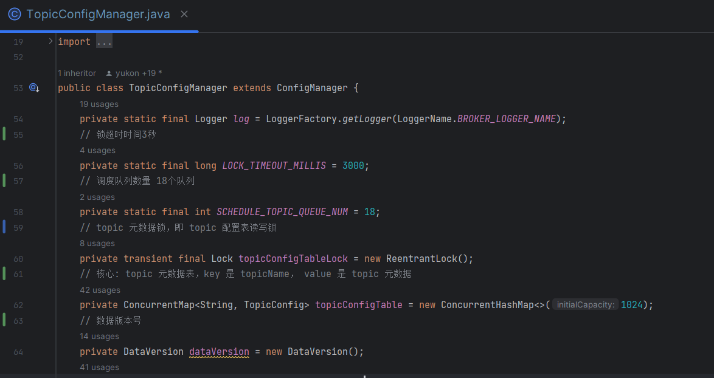

[TopicConfig](http://topicconfig%20/) 有如下属性：

1.  [topicName](http://topicname/)：Topic 名称。
2.  [readQueueNums](http://readqueuenums/)：读消息的队列数量，用来创建消息队列时的队列数。
3.  [writeQueueNums](http://writequeuenums/)：写消息的队列数量，用来创建消息队列时的队列数。
4.  [perm](http://perm/)：权限，默认具有 [READ](http://read%20/) 和 [WRITE](http://write%20/) 的权限。
5.  [topicFilterType](http://topicfiltertype/)：Topic 过滤类型。
6.  [topicSysFlag](http://topicsysflag/)：是否为系统 Topic，Broker 在启动时会创建一些系统 Topic 来处理一些特殊的情况。

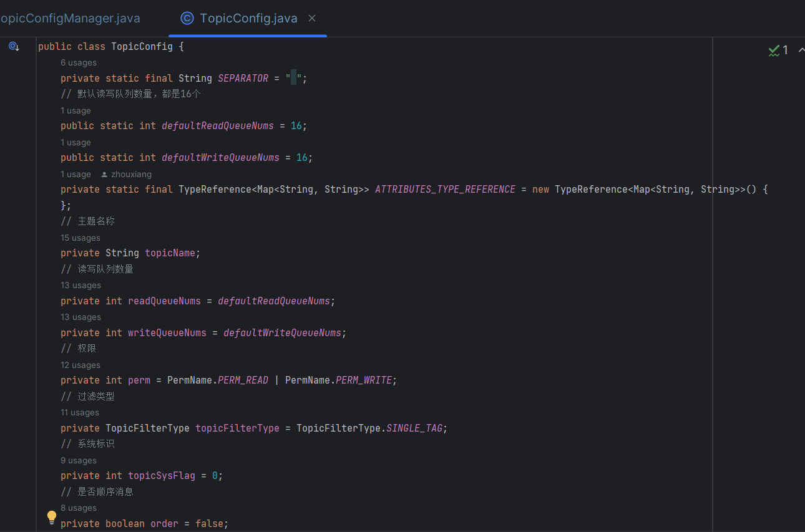

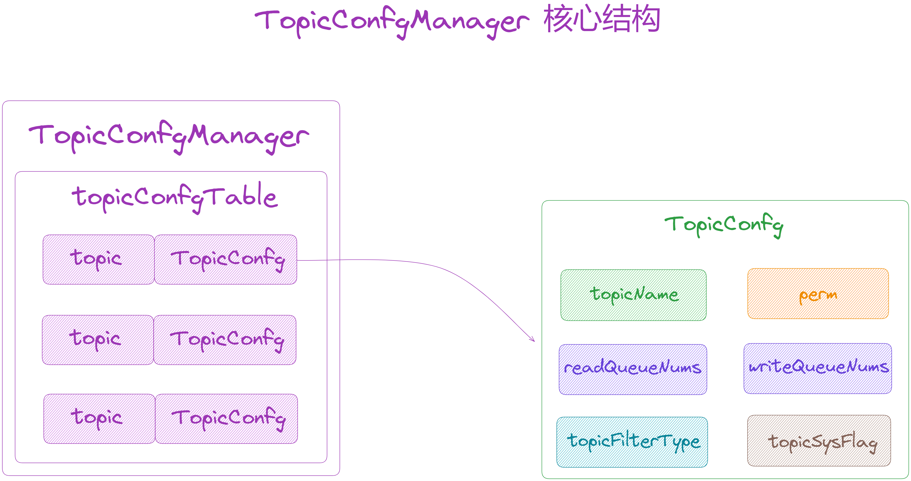

[TopicConfigManager](http://topicconfigmanager%20/) 是 [BrokerController](http://brokercontroller%20/) 中的管理组件，[TopicConfigManager](http://topicconfigmanager%20/) 创建时会初始化创建一些「**系统内置 Topic**」，默认会创建如下一些内置的 [Topic](http://topic/)：

1.  [SELF\_TEST\_TOPIC](http://self_test_topic/)：自我测试的 Topic。
2.  [TBW102](http://tbw102/)：自动创建 Topic 相关。
3.  [BenchmarkTest](http://benchmarktest/)：进行压力测试相关的 Topic。
4.  [DefaultCluster](http://defaultcluster/)：以Broker集群名称创建的 Topic，用于写入和消费 Broker 集群自身的一些元数据的 Topic。
5.  [broker](http://broker/)：以 Broker 组名称创建的 Topic，对 Broker 组读写相关的 Topic。
6.  [OFFSET\_MOVED\_EVENT](http://offset_moved_event/)：偏移量移动事件 Topic。
7.  [SCHEDULE\_TOPIC\_XXXX](http://schedule_topic_xxxx/)：调度相关 Topic。
8.  [RMQ\_SYS\_TRACE\_TOPIC](http://rmq_sys_trace_topic/)：系统追踪相关 Topic。
9.  [ClusterName\_REPLY\_TOPIC](http://clustername_reply_topic/)：集群重试相关。

以创建 [TBW102](http://tbw102/) 为例，并添加为系统 [Topic](http://topic/)，然后设置了「**继承**」、「**可读**」、「**可写**」三种权限，读写队列数为 8 个，最后将这个 [TopicConfig](http://topicconfig%20/) 放入 [topicConfigTable](http://topicconfigtable%20/) 表中。

public class TopicConfigManager extends ConfigManager {

public TopicConfigManager(BrokerController brokerController) {

{

// 自动创建 topic

if (this.brokerController.getBrokerConfig().isAutoCreateTopicEnable()) {

// 创建内置 Topic: TBW102，自动创建 Topic 相关

String topic \= TopicValidator.AUTO\_CREATE\_TOPIC\_KEY\_TOPIC;

TopicConfig topicConfig \= new TopicConfig(topic);

// 系统 topic

TopicValidator.addSystemTopic(topic);

// 默认 8 个读写队列

topicConfig.setReadQueueNums(this.brokerController.getBrokerConfig()

.getDefaultTopicQueueNums());

topicConfig.setWriteQueueNums(this.brokerController.getBrokerConfig()

.getDefaultTopicQueueNums());

// 三种权限都有

int perm \= PermName.PERM\_INHERIT | PermName.PERM\_READ | PermName.PERM\_WRITE;

topicConfig.setPerm(perm);

this.topicConfigTable.put(topicConfig.getTopicName(), topicConfig);

}

}

{......}

}

}

可以看到 [TopicConfigManager](http://topicconfigmanager%20/) 继承自 [ConfigManager](http://configmanager/)，它主要就是用来「**将配置文件中得数据读取到内存**」和「**将内存数据持久化到配置文件**」，也就是说 [ConfigManager](http://configmanager%20/) 的子类都是基于文件的一种配置持久化方式。

那么它要存储的配置数据就是 [topicConfigTable](http://topicconfigtable/)，其存储路径通过 [configFilePath()](http://configfilepath\(\)/) 方法提供，可以看到默认的存储文件就是 [/store/config/topics.json](http://store/config/topics.json)。

@Override

public String configFilePath() {

return BrokerPathConfigHelper.getTopicConfigPath(this.brokerController.

getMessageStoreConfig().getStorePathRootDir());

}

当程序运行之后可以在 [/store/config](http://store/config) 目录下看到很多类似的 [json](http://json%20/) 配置文件，这些文件就是存储 RocketMQ 中用到的一些元数据。

其中 [.bak](http://.bak/) 结尾的文件是对应的备份文件。这些配置文件包含「**Topic 配置数据**」、「**消费偏移量数据**」、「**订阅组数据**」等等，都是与消息消费相关的元数据文件。

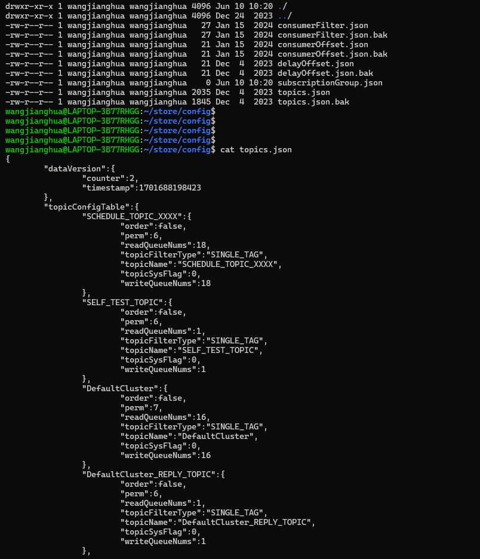

## **2.2 创建 Topic**

当发送消息时如果发现 [Topic](http://topic/) 不存在，则会自动创建 [Topic](http://topic/)，我们直接来看 [TopicConfigManager](http://topicconfigmanager%20/) 中 [topic](http://topic%20/) 是如何被创建出来的？

在发送消息时创建 [Topic](http://topic%20/) 的方法 [createTopicInSendMessageMethod](http://createtopicinsendmessagemethod/)：

public TopicConfig createTopicInSendMessageMethod(final String topic, // 要创建的 topic

final String defaultTopic,// 默认 topic，根据这个默认 topic 新建 topic，客户端发送过来的默认topic为 TBW102

final String remoteAddress, // 客户端机器地址

final int clientDefaultTopicQueueNums, // 默认的队列数，生产者发送过来的默认队列数为 4

final int topicSysFlag) { // 是否为系统主题，默认 false

TopicConfig topicConfig \= null;

boolean createNew \= false;

try {

// 获取一把全局锁，防止并发创建 topic，超时时间 3 秒

if (this.topicConfigTableLock.tryLock(LOCK\_TIMEOUT\_MILLIS, TimeUnit.MILLISECONDS)) {

try {

// 如果存在 topic 元数据，直接返回 topic 元数据

topicConfig = this.topicConfigTable.get(topic);

if (topicConfig != null) {

return topicConfig;

}

// 获取默认 topic 元数据

TopicConfig defaultTopicConfig \= this.topicConfigTable.get(defaultTopic);

if (defaultTopicConfig != null) {

// 默认 topic 是 TBW102

if (defaultTopic.equals(TopicValidator.AUTO\_CREATE\_TOPIC\_KEY\_TOPIC)) {

// 如果禁止自动创建，则默认 topic 元数据权限为只读

if (!this.brokerController.getBrokerConfig().isAutoCreateTopicEnable()) {

defaultTopicConfig.setPerm(PermName.PERM\_READ | PermName.PERM\_WRITE);

}

}

// 如果默认 topic 元数据是允许继承，根据默认 topic 创建

if (PermName.isInherited(defaultTopicConfig.getPerm())) {

topicConfig = new TopicConfig(topic);

// 选择最小队列数 从客户端默认 Topic 里面的 queue 数量与服务端默认 Topic 里面的 queue 数量对比

int queueNums \= Math.min(clientDefaultTopicQueueNums, defaultTopicConfig.getWriteQueueNums());

if (queueNums < 0) {

queueNums = 0;

}

// 设置读写队列数

topicConfig.setReadQueueNums(queueNums);

topicConfig.setWriteQueueNums(queueNums);

// 设置权限

int perm \= defaultTopicConfig.getPerm();

perm &= ~PermName.PERM\_INHERIT;

topicConfig.setPerm(perm);

// 设置系统标识

topicConfig.setTopicSysFlag(topicSysFlag);

// 设置过滤类型

topicConfig.setTopicFilterType(defaultTopicConfig.getTopicFilterType());

} else {

log.warn("Create new topic failed, because the default topic\[{}\] has no perm \[{}\] producer:\[{}\]",

defaultTopic, defaultTopicConfig.getPerm(), remoteAddress);

}

} else {

log.warn("Create new topic failed, because the default topic\[{}\] not exist. producer:\[{}\]",

defaultTopic, remoteAddress);

}

if (topicConfig != null) {

log.info("Create new topic by default topic:\[{}\] config:\[{}\] producer:\[{}\]",

defaultTopic, topicConfig, remoteAddress);

// 将 topic 元数据添加到 topicConfigTable 中

this.topicConfigTable.put(topic, topicConfig);

long stateMachineVersion \= brokerController.getMessageStore() != null ? brokerController.getMessageStore().getStateMachineVersion() : 0;

// 更新配置表版本号

dataVersion.nextVersion(stateMachineVersion);

// 创建新 topic 标识为 true

createNew = true;

// 最后持久化元数据配置

this.persist();

}

} finally {

// 释放锁

this.topicConfigTableLock.unlock();

}

}

} catch (InterruptedException e) {

log.error("createTopicInSendMessageMethod exception", e);

}

if (createNew) {

// 如果新创建 topic 则强制注册 broker 到 NameServer 更新 Topic 路由信息

this.brokerController.registerBrokerAll(false, true, true);

}

return topicConfig;

}

1.  创建 [Topic](http://topic%20/) 前先加同步锁，避免并发更新 [topicConfigTable](http://topicconfigtable%20/) 表。
2.  接着判断 [topicConfigTable](http://topicconfigtable%20/) 表中是否已经存在相同的 topic，存在则不创建。
3.  不存在则获取 [defaultTopic（TBW102）](http://defaulttopic\(tbw102\)/)，这个默认 topic 要可继承，然后就会根据这个默认 topic 来创建一个新的 [TopicConfig](http://topicconfig/)，设置它的权限、队列数等。
4.  将其放入 [topicConfigTable](http://topicconfigtable%20/) 表中，数据更新，数据版本 [DataVersion](http://dataversion%20/) 变更，然后将 [TopicConfigManager](http://topicconfigmanager%20/) 持久化到文件中。
5.  最后，对于新建的 Topic，还要将元数据同步注册到所有的 [NameServer](http://nameserver%20/) 中，然后其它的 Broker 也能从 [NameServer](http://nameserver%20/) 拉取到最新的元数据信息。

简单了解这些之后，我们就来深度剖析今天得重点内容。

## **2.3 消息重投递服务**

源码位置：[https://github.com/apache/rocketmq/blob/release-5.1.2/store/src/main/java/org/apache/rocketmq/store/](https://github.com/apache/rocketmq/blob/release-5.1.2/store/src/main/java/org/apache/rocketmq/store/DefaultMessageStore.java)[DefaultMessageStore](https://github.com/apache/rocketmq/blob/release-5.1.2/store/src/main/java/org/apache/rocketmq/store/DefaultMessageStore.java)[.java](https://github.com/apache/rocketmq/blob/release-5.1.2/store/src/main/java/org/apache/rocketmq/store/DefaultMessageStore.java)

在 [DefaultMessageStore](http://defaultmessagestore%20/) 中有一个 [ReputMessageService](http://reputmessageservice%20/) 线程服务，它主要就是用来将 [CommitLog](http://commitlog%20/) 中的消息重新投递到「**消费队列**」和「**索引文件**」中的。

当 [DefaultMessageStore](http://defaultmessagestore%20/) 启动时，会启动 [ReputMessageService](http://reputmessageservice/)，并计算设置「**重新投递起始偏移量**」。其计算方式是取「**CommitLog 最小偏移量**」和「**消费队列逻辑最大物理偏移量**」的较大值，之后就会从这个位置开始将 [CommitLog](http://commitlog%20/) 的数据进行重新投递。

/\*\*

\* DefaultMessageStore 消息存储组件

\*/

public class DefaultMessageStore implements MessageStore {

// 消息重新投递线程

private ReputMessageService reputMessageService;

public DefaultMessageStore(final MessageStoreConfig messageStoreConfig, final BrokerStatsManager brokerStatsManager,

final MessageArrivingListener messageArrivingListener, final BrokerConfig brokerConfig, final ConcurrentMap<String, TopicConfig> topicConfigTable) throws IOException {

....

// 根据CommitLog文件，更新index文件索引和ConsumeQueue文件偏移量的服务

if (!messageStoreConfig.isEnableBuildConsumeQueueConcurrently()) {

// 构建默认消息分发服务，就是用来构建消息的 ConsumeQueue 索引和 IndexFile 索引

this.reputMessageService = new ReputMessageService();

} else {

// 构建并发消息分发服务，就是用来构建消息的 ConsumeQueue 索引和 IndexFile 索引

this.reputMessageService = new ConcurrentReputMessageService();

}

....

}

/\*\*

\* 启动 MessageStore

\* @throws Exception

\*/

@Override

public void start() throws Exception {

....

// 设置 ReputMessageService 的重放起始偏移量，启动消息分发投递服务

this.reputMessageService.setReputFromOffset(this.commitLog.getConfirmOffset());

this.reputMessageService.start();

....

}

}

这里有两种实现：[ReputMessageService](http://reputmessageservice/)、[ConcurrentReputMessageService](http://concurrentreputmessageservice/)。这两个类都是 [DefaultMessageStore](http://defaultmessagestore/) 类的子类，这里我们以 [ReputMessageService](http://reputmessageservice/) 为例进行讲解。

[ReputMessageService](http://reputmessageservice%20/) 是一个后台线程，在其线程启动时会不断地进行消息重放。

@Override

public void run() {

DefaultMessageStore.LOGGER.info(this.getServiceName() + " service started");

while (!this.isStopped()) {

try {

TimeUnit.MILLISECONDS.sleep(1);

// 不停地消息重放

this.doReput();

} catch (Exception e) {

DefaultMessageStore.LOGGER.warn(this.getServiceName() + "service has exception.", e);

}

}

DefaultMessageStore.LOGGER.info(this.getServiceName() + " service end");

}

接下来，我们重点剖析下 [doReput](http://doreput%20/) 方法地处理逻辑。

### **2.3.1 消息重投递**

public void doReput() {

// 如果待转发的偏移量小于 CommitLog 的最小偏移量，初始化重新投递的起始偏移量为第一个 MappedFile 的 fileFromOffset

if (this.reputFromOffset < DefaultMessageStore.this.commitLog.getMinOffset()) {

LOGGER.warn("The reputFromOffset={} is smaller than minPyOffset={}, this usually indicate that the dispatch behind too much and the commitlog has expired.",

this.reputFromOffset, DefaultMessageStore.this.commitLog.getMinOffset());

// 将 reputFromOffset 设置为 CommitLog 的最小偏移量

this.reputFromOffset = DefaultMessageStore.this.commitLog.getMinOffset();

}

// 循环执行消息转发直到没有新消息或者处理完当前文件

// CommitLog 可用则一直进行循环扫描

for (boolean doNext \= true; this.isCommitLogAvailable() && doNext; ) {

// 从 CommitLog 中上一条消息的结束位置开始获取下一条消息

SelectMappedBufferResult result \= DefaultMessageStore.this.commitLog.getData(reputFromOffset);

if (result == null) {

break; // 如果获取的结果为null，退出循环

}

try {

// 设置当前处理的偏移量为 result 的起始偏移量

this.reputFromOffset = result.getStartOffset();

// 循环处理每一条消息，直到达到待拉取的偏移量或者处理完当前文件

for (int readSize \= 0; readSize < result.getSize() && reputFromOffset < DefaultMessageStore.this.getConfirmOffset() && doNext; ) {

// 检查消息是否合法，返回要分发的请求，依次读取每一条消息，构建消息的DispatchRequest

DispatchRequest dispatchRequest \=

DefaultMessageStore.this.commitLog.checkMessageAndReturnSize

(result.getByteBuffer(), false, false, false);

// 获取消息大小

int size \= dispatchRequest.getBufferSize() == -1 ? dispatchRequest.getMsgSize() : dispatchRequest.getBufferSize();

// 如果处理的消息偏移量加上消息大小大于待拉取消息的偏移量，则退出

if (reputFromOffset + size > DefaultMessageStore.this.getConfirmOffset()) {

doNext = false;

break;

}

if (dispatchRequest.isSuccess()) { // 如果消息处理成功

if (size > 0) { // 如果消息大小大于 0

// 执行消息分发，分发到 ConsumeQueue 和 IndexService

DefaultMessageStore.this.doDispatch(dispatchRequest);

// 如果开启长轮询且消息到达监听器不为空

// 通知消息消费长轮询线程，有新的消息落盘，立即唤醒挂起的消息拉取请求

if (DefaultMessageStore.this.brokerConfig.isLongPollingEnable()

&& DefaultMessageStore.this.messageArrivingListener != null) {

// 触发消息到达事件通知

DefaultMessageStore.this.messageArrivingListener.

arriving(dispatchRequest.getTopic(),

dispatchRequest.getQueueId(),

dispatchRequest.getConsumeQueueOffset() + 1,

dispatchRequest.getTagsCode(),

dispatchRequest.getStoreTimestamp(),

dispatchRequest.getBitMap(), dispatchRequest.getPropertiesMap());

// 多路分发，通知多个队列消息到达

notifyMessageArrive4MultiQueue(dispatchRequest);

}

// 更新待转发消息的偏移量

this.reputFromOffset += size;

// 更新读取的消息大小

readSize += size;

// 如果不启用消息去重 && 当前 Broker 角色为 Slave

if (!DefaultMessageStore.this.getMessageStoreConfig().isDuplicationEnable() &&

DefaultMessageStore.this.getMessageStoreConfig().getBrokerRole() == BrokerRole.SLAVE) {

// 更新存储统计信息

DefaultMessageStore.this.storeStatsService

.getSinglePutMessageTopicTimesTotal(dispatchRequest.getTopic()).add(dispatchRequest.getBatchSize());

DefaultMessageStore.this.storeStatsService

.getSinglePutMessageTopicSizeTotal(dispatchRequest.getTopic())

.add(dispatchRequest.getMsgSize());

}

} else if (size == 0) { // 返回成功而且 size = 0，说明是读到文件末尾的空消息了，表示这个文件读到末尾了

// 使 reputFromOffset 指向下一个 MappedFile 文件，继续处理

this.reputFromOffset = DefaultMessageStore.this.commitLog.rollNextFile(this.reputFromOffset);

// 将 readSize 设置为当前结果的大小，读了整个结果，可以停止for循环了

readSize = result.getSize();

}

} else {

// 如果消息处理失败

if (size > 0) {

// 如果消息大小大于0

LOGGER.error("\[BUG\]read total count not equals msg total size. reputFromOffset={}", reputFromOffset);

// 更新待转发消息的偏移量

this.reputFromOffset += size;

} else {

// 如果消息大小为 0，设置 doNext 为 false

doNext = false;

// If user open the dledger pattern or the broker is master node,

// it will not ignore the exception and fix the reputFromOffset variable

// 如果启用 DLedger CommitLog 或者 Broker 角色为 Master

if (DefaultMessageStore.this.getMessageStoreConfig().isEnableDLegerCommitLog() ||

DefaultMessageStore.this.brokerConfig.getBrokerId() == MixAll.MASTER\_ID) {

LOGGER.error("\[BUG\]dispatch message to consume queue error, COMMITLOG OFFSET: {}",

this.reputFromOffset);

// 修复 reputFromOffset 变量

this.reputFromOffset += result.getSize() - readSize;

}

}

}

}

} finally {

// 释放结果资源

result.release();

}

}

}

处理逻辑如下：

1.  重新投递的起始偏移量最小是从第一个 [MappedFile](http://mappedfile%20/) 文件开始重新投递。
2.  从 [CommitLog](http://commitlog%20/) 获取数据，这里只传入了一个起始偏移量，它会读取从起始偏移量到当前 [MappedFile](http://mappedfile%20/) 的最后一条数据。
3.  只要 [reputFromOffset](http://reputfromoffset%20/) 小于 [CommitLog](http://commitlog%20/) 的最大偏移量，也就是当前写入位置，就会一直读取，这种情况出现在有多个 [MappedFile](http://mappedfile/) 时，一个文件读完了接着读下一个文件。
4.  读取出来的数据就循环地去把一条条完整的数据读出来，得到一个分发请求 [DispatchRequest](http://dispatchrequest/)，分发请求有消息，就会将其分发出去 [doDispatch](http://dodispatch/)。
5.  当分发之后，如果是 master 节点且启用了长轮询机制，就会发一个消息到达的通知，然后进行一个消息多路分发的处理（默认关闭）。
6.  最后再更新 [reputFromOffset](http://reputfromoffset%20/) 加上当前处理的消息长度。
7.  如果读出来的分发请求没有消息了，则说明已经读到文件的末尾，这是就会切换到下一个 [MappedFile](http://mappedfile%20/) 继续读数据出来重新投递。

  
在 [checkMessageAndReturnSize](http://checkmessageandreturnsize%20/) 方法中，就是在按写入的顺序读取出一条完整的消息来，如果读出来的 magic是 [BLANK\_MAGIC\_CODE](http://blank_magic_code/)，说明读取到文件的末尾了，返回的消息大小就是 0，就会切换到下一个文件继续读取。

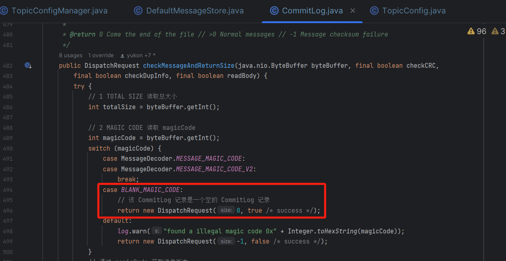

如果是正常的消息，就会继续读取剩余的数据，然后做一些校验，比如「**消息体的 CRC 校验**」，「**消息长度的校验**」等，最后将读出来的消息封装到 [DispatchRequest](http://dispatchrequest%20/) 中。

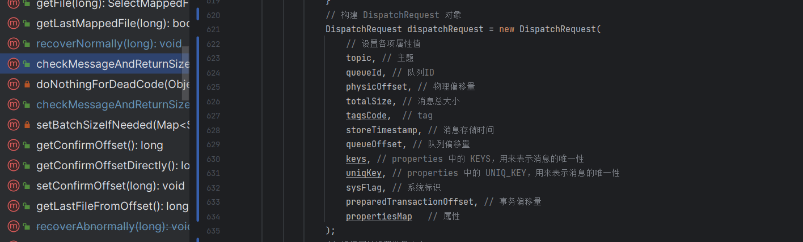

/\*\*

\* 根据多队列消息通知到达

\* @param dispatchRequest

\*/

private void notifyMessageArrive4MultiQueue(DispatchRequest dispatchRequest) {

// 获取消息属性映射

Map<String,String> prop = dispatchRequest.getPropertiesMap();

// 如果消息属性映射为空或者主题以重试主题前缀开头

if (prop == null || dispatchRequest.getTopic().startsWith(MixAll.RETRY\_GROUP\_TOPIC\_PREFIX)) {

return;

}

// 获取内部多队列消息分发属性值

String multiDispatchQueue \= prop.get(MessageConst.PROPERTY\_INNER\_MULTI\_DISPATCH);

// 获取内部多队列消息偏移量属性值

String multiQueueOffset \= prop.get(MessageConst.PROPERTY\_INNER\_MULTI\_QUEUE\_OFFSET);

// 如果多队列消息分发属性值或多队列消息偏移量属性值为空

if (StringUtils.isBlank(multiDispatchQueue) || StringUtils.isBlank(multiQueueOffset)) {

return;

}

// 按多队列分隔符拆分多队列消息分发属性值，分隔符为“，”

String\[\] queues = multiDispatchQueue.split(MixAll.MULTI\_DISPATCH\_QUEUE\_SPLITTER);

// 按多队列分隔符拆分多队列消息偏移量属性值，分隔符为“，”

String\[\] queueOffsets = multiQueueOffset.split(MixAll.MULTI\_DISPATCH\_QUEUE\_SPLITTER);

// 如果队列数量和偏移量数量不一致

if (queues.length != queueOffsets.length) {

return;

}

// 遍历每个队列

for (int i \= 0;i < queues.length;i++) {

String queueName \= queues\[i\];// 获取队列名称

long queueOffset \= Long.parseLong(queueOffsets\[i\]);// 将偏移量转换为长整型

int queueId \= dispatchRequest.getQueueId();// 获取队列ID

// 如果启用了 LMQ 并且队列名称是 LMQ 类型

if (DefaultMessageStore.this.getMessageStoreConfig().isEnableLmq() && MixAll.isLmq(queueName)) {

// 将队列ID设置为 0

queueId = 0;

}

// 触发消息到达事件通知

DefaultMessageStore.this.messageArrivingListener.arriving(

queueName,queueId,queueOffset + 1,dispatchRequest.getTagsCode(),

dispatchRequest.getStoreTimestamp(),dispatchRequest.getBitMap(),dispatchRequest.getPropertiesMap());

}

}

### **2.3.2 消息分发**

读取出来的一条完整消息 [DispatchRequest](http://dispatchrequest/)，会被分发 [doDispatch](http://dodispatch/) 出去，分发处理的接口是 [CommitLogDispatcher](http://commitlogdispatcher/)。

[DefaultMessageStore](http://defaultmessagestore%20/) 创建时默认创建了两个分发处理器 [CommitLogDispatcherBuildConsumeQueue](http://commitlogdispatcherbuildconsumequeue%20/) 和 [CommitLogDispatcherBuildIndex](http://commitlogdispatcherbuildindex/)，看名字就知道是分发出去构建「**消息队列 ConsumeQueue**」和「**索引 IndexFile**」。

public class DefaultMessageStore implements MessageStore {

// CommitLog 文件转发器组件

private final LinkedList<CommitLogDispatcher> dispatcherList;

public DefaultMessageStore(final MessageStoreConfig messageStoreConfig, final BrokerStatsManager brokerStatsManager,

final MessageArrivingListener messageArrivingListener, final BrokerConfig brokerConfig, final ConcurrentMap<String, TopicConfig> topicConfigTable) throws IOException {

// 设置消息分发服务列表组件，分别是构建 ConsumeQueue 索引和 IndexFile 索引，监听CommitLog文件中的新消息存储，然后会调用列表中的CommitLogDispatcher#dispatch方法

this.dispatcherList = new LinkedList<>();

// 通知 ConsumeQueue 的 Dispatcher,可用于更新 ConsumeQueue 的偏移量等信息

this.dispatcherList.addLast(new CommitLogDispatcherBuildConsumeQueue());

// 通知 IndexFie 的 Dispatcher,可用于更新 IndexFile 的时间戳信息

this.dispatcherList.addLast(new CommitLogDispatcherBuildIndex());

}

// 循环进行分发

public void doDispatch(DispatchRequest req) {

for (CommitLogDispatcher dispatcher : this.dispatcherList) {

dispatcher.dispatch(req);

}

}

}

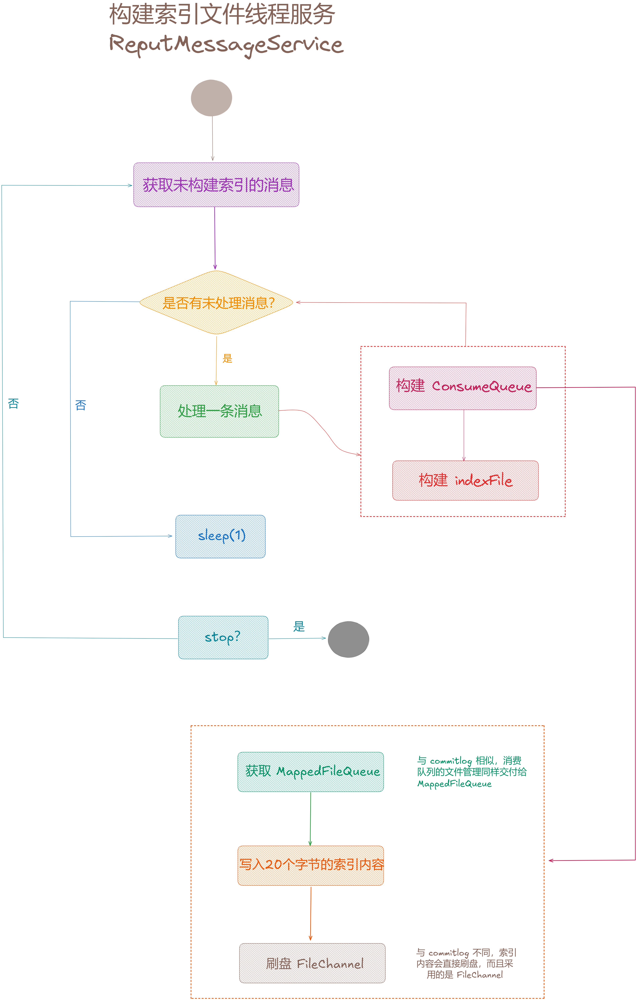

## **2.4 消费队列 ConsumeQueue**

源码位置：[https://github.com/apache/rocketmq/blob/release-5.1.2/store/src/main/java/org/apache/rocketmq/store/](https://github.com/apache/rocketmq/blob/release-5.1.2/store/src/main/java/org/apache/rocketmq/store/queue/ConsumeQueueStore.java)[queue/ConsumeQueueStore](https://github.com/apache/rocketmq/blob/release-5.1.2/store/src/main/java/org/apache/rocketmq/store/queue/ConsumeQueueStore.java)[.java](https://github.com/apache/rocketmq/blob/release-5.1.2/store/src/main/java/org/apache/rocketmq/store/queue/ConsumeQueueStore.java)

### **2.4.1 创建消费队列**

先来看看创建 「**消费队列**」，消息分发到消费队列，会先获取主题 [topic](http://topic%20/) 和队列 [queueId](http://queueid/) 所在的消费队列 [ConsumeQueue](http://consumequeue/)，然后将消息写入消费队列中。

// DefaultMessageStore 类方法

class CommitLogDispatcherBuildConsumeQueue implements CommitLogDispatcher {

@Override

public void dispatch(DispatchRequest request) {

// 获取消息事务类型

final int tranType \= MessageSysFlag.getTransactionValue(request.getSysFlag());

// 根据事务类型进行处理

switch (tranType) {

// 如果为非事务消息 || 已提交的事务消息 才执行分发

case MessageSysFlag.TRANSACTION\_NOT\_TYPE:

case MessageSysFlag.TRANSACTION\_COMMIT\_TYPE:

// 将消息位置信息存储到消费队列中

DefaultMessageStore.this.putMessagePositionInfo(request);

break;

// 如果为预备的事务消息 || 回滚的事务消息 什么都不执行

case MessageSysFlag.TRANSACTION\_PREPARED\_TYPE:

case MessageSysFlag.TRANSACTION\_ROLLBACK\_TYPE:

break;

}

}

}

// DefaultMessageStore 类方法

public void putMessagePositionInfo(DispatchRequest dispatchRequest) {

// 向消费队列写入消息

this.consumeQueueStore.putMessagePositionInfoWrapper(dispatchRequest);

}

// ConsumeQueueStore 类方法

/\*\*

\* 将请求分发到具体的 ConsumeQueue

\* @param dispatchRequest 消息的分发请求

\*/

public void putMessagePositionInfoWrapper(DispatchRequest dispatchRequest) {

// 根据 topic 和 queueId 查找消费队列，没有则新建

ConsumeQueueInterface cq \= this.findOrCreateConsumeQueue(dispatchRequest.getTopic(), dispatchRequest.getQueueId());

// 向消费队列写入消息

this.putMessagePositionInfoWrapper(cq, dispatchRequest);

}

可以看到这里会根据 [topic](http://topic/) 和 [queueId](http://queueid%20/) 查找消费队列，就是从 [consumeQueueTable](http://consumequeuetable%20/) 表获取主题下的队列，如果没有就会创建一个新的 Map 放入 [consumeQueueTable](http://consumequeuetable/)。接着从队列表里取出 [ConsumeQueue](http://consumequeue/)，如果没有同样会创建一个新的 [ConsumeQueue](http://consumequeue/)，从这里可以看出消费队列默认的存储路径是 [~/store/consumequeue/](http://~/store/consumequeue/)。

public ConsumeQueueInterface findOrCreateConsumeQueue(String topic,int queueId) {

return doFindOrCreateConsumeQueue(topic,queueId);// 调用内部方法进行消费队列的查找或创建

}

/\*\*

\* 查找或者创建 ConsumeQueue

\* @param topic

\* @param queueId

\* @return

\*/

private ConsumeQueueInterface doFindOrCreateConsumeQueue(String topic,int queueId) {

// 从消费队列表中获取特定主题的消费队列映射

ConcurrentMap<Integer,ConsumeQueueInterface> map = consumeQueueTable.get(topic);

if (null == map) {

// 创建一个新的 map

ConcurrentMap<Integer,ConsumeQueueInterface> newMap = new ConcurrentHashMap<>(128);

// 如果之前不存在，则将新 map 加入消费队列表

ConcurrentMap<Integer,ConsumeQueueInterface> oldMap = consumeQueueTable.putIfAbsent(topic,newMap);

if (oldMap != null) {

map = oldMap;// 使用之前的 map

} else {

map = newMap;// 使用新的 map

}

}

// 从映射中获取特定队列 ID 的消费队列

ConsumeQueueInterface logic \= map.get(queueId);

// 如果消费队列已存在

if (logic != null) {

// 直接返回该消费队列

return logic;

}

// 用于存储新创建的消费队列实例

ConsumeQueueInterface newLogic;

// 获取指定主题的配置信息

Optional<TopicConfig> topicConfig = this.messageStore.getTopicConfig(topic);

// TODO maybe the topic has been deleted.

// 如果消费队列的类型为 BatchCQ

if (Objects.equals(CQType.BatchCQ,QueueTypeUtils.getCQType(topicConfig))) {

newLogic = new BatchConsumeQueue( // 创建批量消费队列实例

topic,

queueId,

getStorePathBatchConsumeQueue(this.messageStoreConfig.getStorePathRootDir()),

this.messageStoreConfig.getMapperFileSizeBatchConsumeQueue(),// 批量消费队列文件大小，映射 MappedFile

this.messageStore);

} else {

newLogic = new ConsumeQueue( // 创建默认的消费队列实例

topic,

queueId,

getStorePathConsumeQueue(this.messageStoreConfig.getStorePathRootDir()),

this.messageStoreConfig.getMappedFileSizeConsumeQueue(),// 消费队列文件大小，映射 MappedFile

this.messageStore);

}

// 将新创建的消费队列放入映射中

ConsumeQueueInterface oldLogic \= map.putIfAbsent(queueId,newLogic);

// 如果之前已存在消费队列

if (oldLogic != null) {

// 直接使用之前的消费队列

logic = oldLogic;

} else {

// 使用新创建的消费队列

logic = newLogic;

}

return logic;

}

而 [ConsumeQueue](http://consumequeue%20/) 对应的 [MappedFile](http://mappedfile%20/) 文件大小是通过计算得来的，[ConsumeQueue](http://consumequeue%20/) 存储是以 20 字节为一个存储单元 [CQ\_STORE\_UNIT\_SIZE](http://cq_store_unit_size/)，[MappedFile](http://mappedfile%20/) 文件大小也必须是 20 的倍数，默认情况下一个 [ConsumeQueue](http://consumequeue%20/) 文件可以存 30万 个单位数据，那么一个 [MappedFile](http://mappedfile%20/) 文件大小就是 [300000\*20](http://300000%2A20/) 。

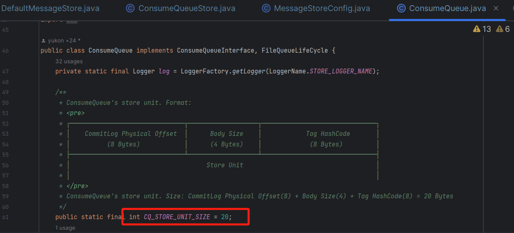

// ConsumeQueue file size,default is 30W

// 每一个 ConsumeQueue 默认存储30个索引单元

private int mappedFileSizeConsumeQueue \= 300000 \* ConsumeQueue.CQ\_STORE\_UNIT\_SIZE;

public int getMappedFileSizeConsumeQueue() {

int factor \= (int) Math.ceil(this.mappedFileSizeConsumeQueue / (ConsumeQueue.CQ\_STORE\_UNIT\_SIZE \* 1.0));

return (int) (factor \* ConsumeQueue.CQ\_STORE\_UNIT\_SIZE);

}

### **2.4.2 ConsumeQueue 数据结构**

接着来看下 [ConsumeQueue](http://consumequeue%20/) 的数据结构，可以看出 [ConsumeQueue](http://consumequeue%20/) 表示的是 [topic](http://topic%20/) 下的一个队列，前面得知一个 [Topic](http://topic%20/) 下有多个读写队列，消息写入的时候会指定写入的 topic 和 queueId。

[ConsumeQueue](http://consumequeue%20/) 与 [CommitLog](http://commitlog%20/) 底层是类似的都是基于「**文件存储**」的，其存储路径是 [~/consumequeue/{topic}/{queueId}](http://~/consumequeue/%7Btopic%7D/%7BqueueId%7D)，[ConsumeQueue](http://consumequeue%20/) 一个文件默认最多存「**30 万**」个单元 20 字节的数据，一个文件写满了之后就会继续写下一个文件。

所以也会创建一个 [MappedFileQueue](http://mappedfilequeue%20/) 来管理队列下的文件，每个文件会映射为一个 [MappedFile](http://mappedfile/)，而文件的名称同样是该文件的起始偏移量。

public class ConsumeQueue implements ConsumeQueueInterface, FileQueueLifeCycle {

private static final Logger log \= LoggerFactory.getLogger(LoggerName.STORE\_LOGGER\_NAME);

/\*\*

\* 存储单元，一个单元20字节

\* ConsumeQueue's store unit. Format:

\* <pre>

\* ┌───────────────────────────────┬───────────────────┬───────────────────────────────┐

\* │ CommitLog Physical Offset │ Body Size │ Tag HashCode │

\* │ (8 Bytes) │ (4 Bytes) │ (8 Bytes) │

\* ├───────────────────────────────┴───────────────────┴───────────────────────────────┤

\* │ Store Unit │

\* │ │

\* </pre>

\* ConsumeQueue's store unit. Size: CommitLog Physical Offset(8) + Body Size(4) + Tag HashCode(8) = 20 Bytes

\*/

public static final int CQ\_STORE\_UNIT\_SIZE \= 20;

public static final int MSG\_TAG\_OFFSET\_INDEX \= 12;

private static final Logger LOG\_ERROR \= LoggerFactory.getLogger(LoggerName.STORE\_ERROR\_LOGGER\_NAME);

private final MessageStore messageStore;

// MappedFile 队列，ConsumeQueue 也是基于 MappedFile 内存映射来实现的

private final MappedFileQueue mappedFileQueue;

// 所属的 topic

private final String topic;

// 所属的 topic 里的 queueId

private final int queueId;

private final ByteBuffer byteBufferIndex;

// ConsumeQueue 存储路径

private final String storePath;

// MappedFile 文件大小

private final int mappedFileSize;

// 最大物理偏移量

private long maxPhysicOffset \= -1;

/\*\*

\* Minimum offset of the consume file queue that points to valid commit log record.

\* 最小逻辑偏移量

\*/

private volatile long minLogicOffset \= 0;

private ConsumeQueueExt consumeQueueExt \= null;

public ConsumeQueue(

final String topic,

final int queueId,

final String storePath,

final int mappedFileSize,

final MessageStore messageStore) {

this.storePath = storePath;

this.mappedFileSize = mappedFileSize;

this.messageStore = messageStore;

// 所属 topic 和 queueId

this.topic = topic;

this.queueId = queueId;

// ~/consumequeue/{topic}/{queueId}

String queueDir \= this.storePath

\+ File.separator + topic

\+ File.separator + queueId;

// 创建 MappedFileQueue

this.mappedFileQueue = new MappedFileQueue(queueDir, mappedFileSize, null);

// 一个存储单元的缓冲区 20 个字节

this.byteBufferIndex = ByteBuffer.allocate(CQ\_STORE\_UNIT\_SIZE);

if (messageStore.getMessageStoreConfig().isEnableConsumeQueueExt()) {

this.consumeQueueExt = new ConsumeQueueExt(

topic,

queueId,

StorePathConfigHelper.getStorePathConsumeQueueExt(messageStore.getMessageStoreConfig().getStorePathRootDir()),

messageStore.getMessageStoreConfig().getMappedFileSizeConsumeQueueExt(),

messageStore.getMessageStoreConfig().getBitMapLengthConsumeQueueExt()

);

}

}

}

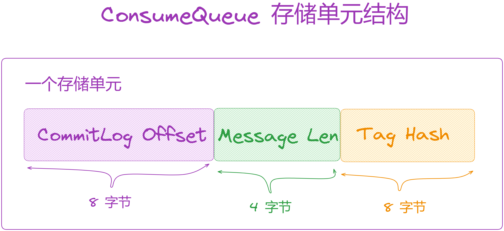

1.  消息在 [CommitLog](http://commitlog%20/) 文件的偏移量，占用8个字节。
2.  消息大小，占用 4 个字节。
3.  消息 Tag 的 hashcode 值，用于 tag 过滤，占用 8 个字节。

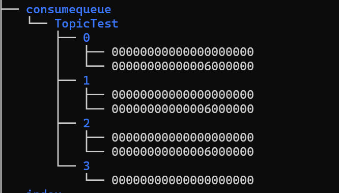

### **2.4.3 写入消息位置**

接着再来看消息分发到 [ConsumeQueue](http://consumequeue%20/) 的过程，如下：

1.  首先会判断磁盘是否可以写入数据，比如磁盘快没有剩余空间时，就不能写入数据了。
2.  接着在写入消息位置信息，写入成功后更新存储检查点中的物理消息时间戳（[commitlog](http://commitlog/)）和逻辑消息时间戳（[consumequeue](http://consumequeue/)）。

/\*\*

\* 写入消息位置信息

\* @param request the request containing dispatch information.

\*/

@Override

public void putMessagePositionInfoWrapper(DispatchRequest request) {

final int maxRetries \= 30;

// 当前是否可写入，会有一个线程检测磁盘是否满了，是否可以写入数据

boolean canWrite \= this.messageStore.getRunningFlags().isCQWriteable();

// 循环处理

for (int i \= 0; i < maxRetries && canWrite; i++) {

// tag

long tagsCode \= request.getTagsCode();

if (isExtWriteEnable()) {

ConsumeQueueExt.CqExtUnit cqExtUnit \= new ConsumeQueueExt.CqExtUnit();

cqExtUnit.setFilterBitMap(request.getBitMap());

cqExtUnit.setMsgStoreTime(request.getStoreTimestamp());

cqExtUnit.setTagsCode(request.getTagsCode());

long extAddr \= this.consumeQueueExt.put(cqExtUnit);

if (isExtAddr(extAddr)) {

tagsCode = extAddr;

} else {

log.warn("Save consume queue extend fail, So just save tagsCode! {}, topic:{}, queueId:{}, offset:{}", cqExtUnit,

topic, queueId, request.getCommitLogOffset());

}

}

// 写入消息位置信息

boolean result \= this.putMessagePositionInfo(request.getCommitLogOffset(),

request.getMsgSize(), tagsCode, request.getConsumeQueueOffset());

if (result) {

// slave 节点或者启用了 DLedger 技术，更新存储检查点钟物理消息时间戳 CommitLog

if (this.messageStore.getMessageStoreConfig().getBrokerRole() == BrokerRole.SLAVE ||

this.messageStore.getMessageStoreConfig().isEnableDLegerCommitLog()) {

this.messageStore.getStoreCheckpoint().setPhysicMsgTimestamp(request.getStoreTimestamp());

}

// 更新逻辑消息时间戳 ConsumeQueue

this.messageStore.getStoreCheckpoint().setLogicsMsgTimestamp(request.getStoreTimestamp());

if (checkMultiDispatchQueue(request)) {

multiDispatchLmqQueue(request, maxRetries);

}

return;

} else {

// XXX: warn and notify me

log.warn("\[BUG\]put commit log position info to " + topic + ":" + queueId + " " + request.getCommitLogOffset()

\+ " failed, retry " + i + " times");

try {

Thread.sleep(1000);

} catch (InterruptedException e) {

log.warn("", e);

}

}

}

// XXX: warn and notify me

log.error("\[BUG\]consume queue can not write, {} {}", this.topic, this.queueId);

this.messageStore.getRunningFlags().makeLogicsQueueError();

}

从源码来看，[ConsumeQueue](http://consumequeue%20/) 是以 20 字节为一个存储单元，所以它用了一块 20 字节的缓冲区 [byteBufferIndex](http://bytebufferindex%20/) 来写数据，从这可以知道这 20 字节存储了消息的 3 个属性：

1.  offset：消息的物理偏移量，表示的是 [CommitLog](http://commitlog%20/) 中的物理偏移量。
2.  size：消息的总大小。
3.  tagsCode：消息tag hash 码。

另外参数中还有一个 [cqOffset](http://cqoffset/)，这个表示消息在这个 [topic](http://topic%20/) 队列下的索引（0,1,2...），这个索引从 0 开始，每写入一条消息自增1。

1.  一条消息在 [ConsumeQueue](http://consumequeue%20/) 中占 20 字节，那么接下来要写入位置的偏移量 [expectLogicOffset = cqOffset \* CQ\_STORE\_UNIT\_SIZE](http://expectlogicoffset%20=%20cqoffset%20%2A%20cq_store_unit_size/)。
2.  然后可以通过 [expectLogicOffset](http://expectlogicoffset%20/) 找到要写入的 [MappedFile](http://mappedfile/)。
3.  如果是第一次创建的 [MappedFile](http://mappedfile%20/) 且没有写入数据，会按 20 字节为单元预填充空白数据（0），起到一个磁盘预热的目的。
4.  更新当前最大的物理偏移量 [maxPhysicOffset](http://maxphysicoffset/)，可以看出它表示的是消息在 [CommitLog](http://commitlog%20/) 中的偏移量。
5.  最后再将位置信息写入 [MappedFile](http://mappedfile/)。

/\*\*

\* 写入消息位置

\* 往 ConsumeQueue 中写入索引项，该只有一个线程调用，所以不需要加锁

\* ConsumeQueue 是以 20 字节为一个存储单元，所以它用了一块 20字节的缓冲区 byteBufferIndex 来写数据

\* @param offset 消息物理偏移量，表示的是 commitlog 中的物理偏移量

\* @param size 消息大小

\* @param tagsCode 消息 tags

\* @param cqOffset 消息在ConsumeQueue中的逻辑偏移量。在 CommitLog#doAppend 方法中已经生成并保存

\* @return

\*/

private boolean putMessagePositionInfo(final long offset, final int size, final long tagsCode,

final long cqOffset) {

// CommitLog offset + size 小于 ConsumeQueue 中保存的最大 CommitLog 物理偏移量，说明这个消息重复生成 ConsumeQueue，直接返回

// 此情况多用在关机恢复的场景。关机恢复从倒数第 3 个 CommitLog 文件开始重新转发消息生成ConsumeQueue

if (offset + size <= this.maxPhysicOffset) {

log.warn("Maybe try to build consume queue repeatedly maxPhysicOffset={} phyOffset={}", maxPhysicOffset, offset);

return true;

}

// 索引缓冲区，NIO ByteBuffer 写入三个参数

this.byteBufferIndex.flip();

this.byteBufferIndex.limit(CQ\_STORE\_UNIT\_SIZE);

this.byteBufferIndex.putLong(offset);

this.byteBufferIndex.putInt(size);

this.byteBufferIndex.putLong(tagsCode);

// 计算本次期望写入 ConsumeQueue 的物理偏移量

final long expectLogicOffset \= cqOffset \* CQ\_STORE\_UNIT\_SIZE;

// 通过期望的偏移量来定位 MappedFile，满了会自动创建新的 MappedFile

MappedFile mappedFile \= this.mappedFileQueue.getLastMappedFile(expectLogicOffset);

if (mappedFile != null) {

// 第一次创建，还没写入数据

// 纠正 MappedFile 逻辑队列索引顺序，如果 MappedFileQueue 中的 MappedFile 列表被删除

// 这时需要保证消息队列的逻辑位置和 ConsumeQueue 文件的起始文件的偏移量一致，要补充空的消息索引

if (mappedFile.isFirstCreateInQueue() && cqOffset != 0 && mappedFile.getWrotePosition() == 0) {

// 对于一个新的 MappedFile ，当前最小逻辑偏移量

this.minLogicOffset = expectLogicOffset;

// flushedWhere

this.mappedFileQueue.setFlushedWhere(expectLogicOffset);

// committedWhere

this.mappedFileQueue.setCommittedWhere(expectLogicOffset);

// 新的 MappedFile 文件预填入空白消息

this.fillPreBlank(mappedFile, expectLogicOffset);

log.info("fill pre blank space " + mappedFile.getFileName() + " " + expectLogicOffset + " " \+ mappedFile.getWrotePosition());

}

if (cqOffset != 0) {

// 当前 ConsumeQueue 被写过的物理 offset = 该 MappedFile 被写过的位置 + 该 MappedFile起始物理偏移量

// 注意：此时消息还没从内存刷到磁盘，如果是异步刷盘，Broker 断电就会存在数据丢失的情况

// 此时消费者消费不到，所以在重要业务中使用同步刷盘确保数据不丢失

long currentLogicOffset \= mappedFile.getWrotePosition() + mappedFile.getFileFromOffset();

// 如果期望写入的位置 < 当前 ConsumeQueue 被写过的位置，说明是重复写入，直接返回

if (expectLogicOffset < currentLogicOffset) {

log.warn("Build consume queue repeatedly, expectLogicOffset: {} currentLogicOffset: {} Topic: {} QID: {} Diff: {}",

expectLogicOffset, currentLogicOffset, this.topic, this.queueId, expectLogicOffset - currentLogicOffset);

return true;

}

// 期望写入的位置应该等于被写过的位置

if (expectLogicOffset != currentLogicOffset) {

LOG\_ERROR.warn(

"\[BUG\]logic queue order maybe wrong, expectLogicOffset: {} currentLogicOffset: {} Topic: {} QID: {} Diff: {}",

expectLogicOffset,

currentLogicOffset,

this.topic,

this.queueId,

expectLogicOffset - currentLogicOffset

);

}

}

// 最大的消息物理偏移量

this.maxPhysicOffset = offset + size;

// 追加消息，此时并未刷盘

return mappedFile.appendMessage(this.byteBufferIndex.array());

}

return false;

}

到这里我们就知道了 [ConsumeQueue](http://consumequeue%20/) 的结构，[ConsumeQueueStore](http://consumequeuestore%20/) 中有一个消费队列表 [consumeQueueTable](http://consumequeuetable%20/) 存储了各个 [topic](http://topic%20/) 下的队列，每个队列对应着一个 [ConsumeQueue](http://consumequeue/)，一个 [topic](http://topic/) 有几个队列是由 [TopicConfig](http://topicconfig%20/) 决定的，一般在发送消息时会随机指定一个队列。

[ConsumeQueue](http://consumequeue%20/) 以 20 字节为一个单元，存储了消息的位置信息，包括消息在 [CommitLog](http://commitlog%20/) 中的「**物理偏移量 8 字节**」、「**消息总大小 4 字节**」，「**Tag 信息 8 字节**」。[ConsumeQueue](http://consumequeue%20/) 同时使用 [MappedFileQueue](http://mappedfilequeue%20/) 来管理磁盘文件，每个 [ConsumeQueue](http://consumequeue%20/) 会映射为一个 [MappedFile](http://mappedfile/)。一个 [ConsumeQueue](http://consumequeue/) 文件默认最多存储 30 万条消息的位置信息，所以一个文件写满了之后会创建一个新的文件继续写入。

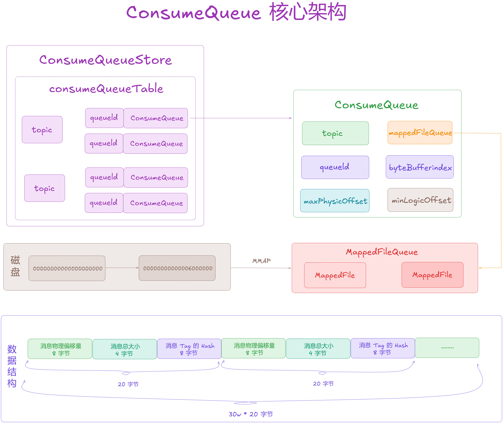

## **2.5 ConsumeQueue 刷盘服务**

DefaultMessageStore 会启动一个「**刷盘消费队列**」的线程服务来定时将「**消费队列**」的数据刷到磁盘中。

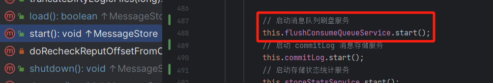

该线程会「**每隔 1 秒**」执行一次刷盘，但每个消费队列至少有「**2 个缓存页**」的脏数据才会刷盘，但每隔 60 秒还会「**强制刷盘**」一次。

/\*\*

\* 消息队列刷盘服务

\*/

class FlushConsumeQueueService extends ServiceThread {

private static final int RETRY\_TIMES\_OVER \= 3;

private long lastFlushTimestamp \= 0;

private void doFlush(int retryTimes) {

// 刷新缓冲区，默认至少刷 2 页

// 该变量含义：如果大于 0，则表示本次刷盘必须刷多少个 page，如果等于 0，则有多少刷多少。

int flushConsumeQueueLeastPages \= DefaultMessageStore.this.getMessageStoreConfig().getFlushConsumeQueueLeastPages();

if (retryTimes == RETRY\_TIMES\_OVER) { // 如果重试次数达到上限

// 将刷盘消费队列至少的页数设为 0

flushConsumeQueueLeastPages = 0;

}

// 逻辑消息时间戳初始化为 0

long logicsMsgTimestamp \= 0;

// 一定时间内未执行刷盘，会强制刷盘，默认刷消费队列间隔时间 60秒

int flushConsumeQueueThoroughInterval \= DefaultMessageStore.this.getMessageStoreConfig().getFlushConsumeQueueThoroughInterval();

long currentTimeMillis \= System.currentTimeMillis();

// 每隔 60 秒强制刷盘

if (currentTimeMillis >= (this.lastFlushTimestamp + flushConsumeQueueThoroughInterval)) {

// 当时间满足 flushConsumeQueueThoroughInterval 时，即使写入的数量不足flushConsumeQueueLeastPages 也进行刷盘

// 更新上次刷盘时间为当前时间

this.lastFlushTimestamp = currentTimeMillis;

// 将刷盘消费队列至少的页数设为 0

flushConsumeQueueLeastPages = 0;

// 获取逻辑消息时间戳

logicsMsgTimestamp = DefaultMessageStore.this.getStoreCheckpoint().getLogicsMsgTimestamp();

}

// 获取 ConsumeQueueTable 表数据

ConcurrentMap<String, ConcurrentMap<Integer, ConsumeQueueInterface>> tables = DefaultMessageStore.this.getConsumeQueueTable();

// 循环进行消费队列刷盘

for (ConcurrentMap<Integer, ConsumeQueueInterface> maps : tables.values()) {

for (ConsumeQueueInterface cq : maps.values()) { // 遍历消费队列

boolean result \= false;

// 根据重试次数执行刷盘，直到成功或达到重试次数

for (int i \= 0; i < retryTimes && !result; i++) {

// 执行刷盘操作

result = DefaultMessageStore.this.consumeQueueStore.flush(cq, flushConsumeQueueLeastPages);

}

}

}

if (messageStoreConfig.isEnableCompaction()) { // 如果启用了消息内容压缩

// 执行压缩存储刷盘操作

compactionStore.flush(flushConsumeQueueLeastPages);

}

// 更新 CheckPoint中ConsumeQueue 最新刷盘时间

// 如果刷盘消费队列至少的页数为 0

if (0 == flushConsumeQueueLeastPages) {

// 如果逻辑消息时间戳大于 0

if (logicsMsgTimestamp > 0) {

// 更新存储点检查点的逻辑消息时间戳

DefaultMessageStore.this.getStoreCheckpoint().

setLogicsMsgTimestamp(logicsMsgTimestamp);

}

// 刷新存储点检查点

DefaultMessageStore.this.getStoreCheckpoint().flush();

}

}

@Override

public void run() {

DefaultMessageStore.LOGGER.info(this.getServiceName() + " service started");

while (!this.isStopped()) {

try {

// 刷队列间隔时间 1秒

int interval \= DefaultMessageStore.this.getMessageStoreConfig().getFlushIntervalConsumeQueue();

this.waitForRunning(interval);

this.doFlush(1);

} catch (Exception e) {

DefaultMessageStore.LOGGER.warn(this.getServiceName() + " service has exception. ", e);

}

}

// 强制刷盘

this.doFlush(RETRY\_TIMES\_OVER);

DefaultMessageStore.LOGGER.info(this.getServiceName() + " service end");

}

@Override

public String getServiceName() {

if (DefaultMessageStore.this.brokerConfig.isInBrokerContainer()) {

return DefaultMessageStore.this.getBrokerIdentity().getIdentifier() + FlushConsumeQueueService.class.getSimpleName();

}

return FlushConsumeQueueService.class.getSimpleName();

}

@Override

public long getJoinTime() {

return 1000 \* 60;

}

}

## **2.6 ConsumeQueue 过期清理服务**

DefaultMessageStore 会在启动时通过「**定时任务**」的方式周期性的执行过期清理服务。

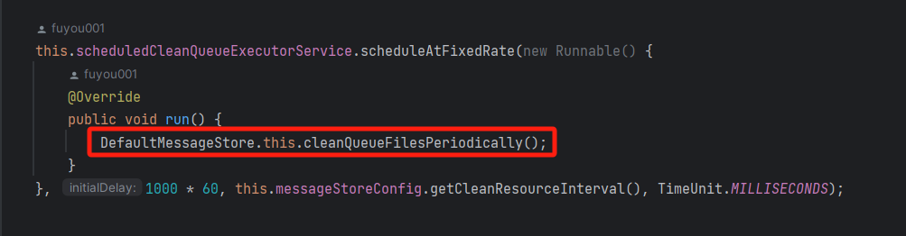

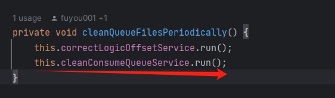

/\*\*

\* ConsumeQueue 过期清理服务

\*/

class CleanConsumeQueueService {

// 上次存储的最小物理偏移量

private long lastPhysicalMinOffset \= 0;

/\*\*

\* 执行清理消费队列的服务

\*/

public void run() {

try {

// 执行删除过期文件操作

this.deleteExpiredFiles();

} catch (Throwable e) {

DefaultMessageStore.LOGGER.warn(this.getServiceName() + " service has exception. ", e);

}

}

// 删除过期文件

private void deleteExpiredFiles() {

// 获取删除逻辑文件的间隔

int deleteLogicsFilesInterval \= DefaultMessageStore.this.getMessageStoreConfig().getDeleteConsumeQueueFilesInterval();

// 获取当前 CommitLog 中的最小偏移量

long minOffset \= DefaultMessageStore.this.commitLog.getMinOffset();

// 如果当前最小偏移量大于上次存储的最小物理偏移量

if (minOffset > this.lastPhysicalMinOffset) {

// 更新上次存储的最小物理偏移量为当前偏移量

this.lastPhysicalMinOffset = minOffset;

// 获取消费队列 ConsumeQueue 缓存表

ConcurrentMap<String, ConcurrentMap<Integer, ConsumeQueueInterface>> tables = DefaultMessageStore.this.getConsumeQueueTable();

// 遍历消费队列表

for (ConcurrentMap<Integer, ConsumeQueueInterface> maps : tables.values()) {

// 遍历消费队列

for (ConsumeQueueInterface logic : maps.values()) {

// 删除过期文件并返回删除的文件数量

int deleteCount \= DefaultMessageStore.this.consumeQueueStore.deleteExpiredFile(logic, minOffset);

// 如果删除的文件数量大于0且删除逻辑文件的间隔大于0

if (deleteCount > 0 && deleteLogicsFilesInterval > 0) {

try {

// 休眠一段时间

Thread.sleep(deleteLogicsFilesInterval);

} catch (InterruptedException ignored) {

}

}

}

}

// 删除过期的索引文件

DefaultMessageStore.this.indexService.deleteExpiredFile(minOffset);

}

}

public String getServiceName() {

return DefaultMessageStore.this.brokerConfig.getIdentifier() + CleanConsumeQueueService.class.getSimpleName();

}

}

## **03 总结**

本文深度剖析了 「**ConsumeQueue**」底层架构，以及它是如何生成和写入数据的，内容非常多，希望大家好好理解吸收下。