大家好，我是**华仔**, 又跟大家见面了。

从今天开始我将继续为大家奉上 RocketMQ 消费者源码剖析系列文章，正式开启「**RocketMQ 的服务端 Broker 源码之旅**」，这是第二十三篇，本篇我们将以「**RocketMQ 5.1.2**」版本为主，来剖析下 RocketMQ 源码之 Broker 端 HA 主从同步架构设计剖析。

这里我将以「**RocketMQ 5.1.2**」版本为主，通过「**场景驱动**」的方式带大家一点点的对 RocketMQ 源码进行深度剖析，正式开启「**RocketMQ 的源码之旅**」，跟我一起来掌握 RocketMQ 源码核心架构设计思想吧。

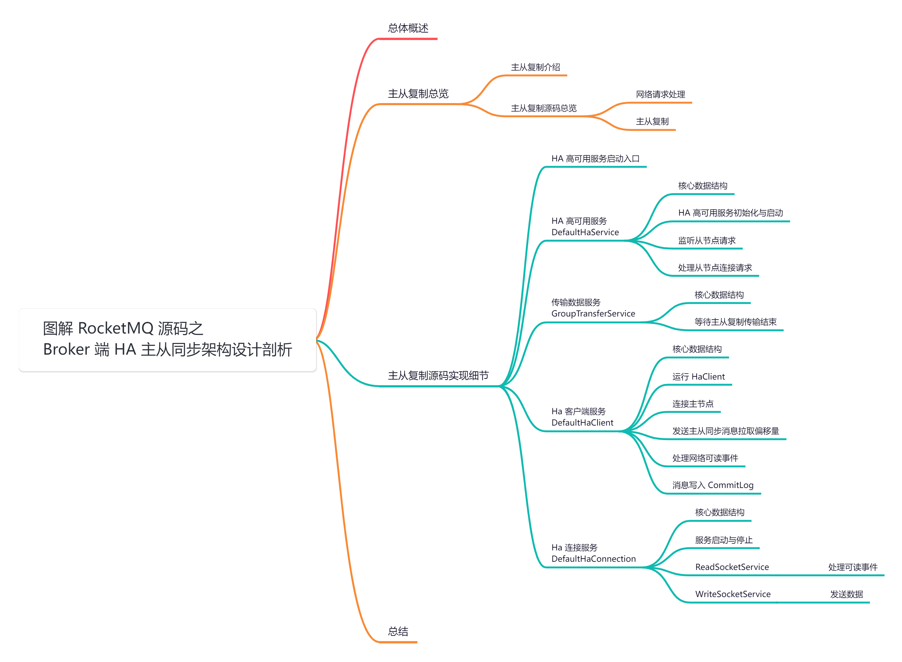

##   
**01 总体概述**

高可用是分布式系统必备的机制之一，RocketMQ 主要通过「**主从复制**」[HA（High Available)](http://ha\(high%20available\)%20/) 的方式来保证消息的高可用，这跟 Kafka 「**分区副本**」的 [Leader-Follower](http://leader-follower/) 模型不同，今天我们就来深度剖析下 RocketMQ 下「**主从复制**」是如何实现的，当然该模式下无法自动切换主从，再后续篇章会单独剖析关于「**DLedger 架构下的主从复制和自动主从切换**」。

关于「**主从复制**」的原理可以查看之前的这篇：[【原理分析系列第四篇】图解 RocketMQ Broker 主从同步与集群模式原理](https://articles.zsxq.com/id_x09mz42l01r3.html)，先了解完原理再来看源码会更加容易些。

生产者向 [Master](http://master%20/) 节点写入数据，然后将数据同步给 [Slave](http://slave%20/) 节点做数据备份，消费者可以从 [Master](http://master/) 或 [Slave](http://slave/) 节点消费数据。RocketMQ 默认配置下是开启主从复制，核心组件为 [HAService](http://haservice/)，功能就是将 [Master](http://master/) 数据复制到 [Slave](http://slave/) 节点。但其不支持主从自动切换，这种模式下 [Master](http://master/) 宕机后，集群将不能继续写入消息，但可以从 [Slave](http://slave/) 节点消费消息。

## **02 主从复制总览**

## **2.1 主从复制介绍**

当消息到达「**主服务器**」后，需将消息同步至「**从服务器**」。在 RocketMQ 中支持「**同步复制**」和「**异步复制**」两种复制模式，在生产环境中，为兼顾可靠性和效率，通常采用「**异步刷盘**」、「**同步复制**」的策略。

当 broker 启动时，会对外暴露 [10912](http://10912%20/) 端口用来「**主从复制**」。

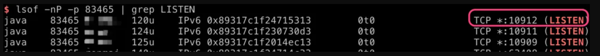

## **2.2 主从复制源码总览**

在 RocketMQ 中，负责「**主从复制**」的类都位于 [store](http://store%20/) 存储模块的 [ha](http://ha/) 目录中，如下：

  
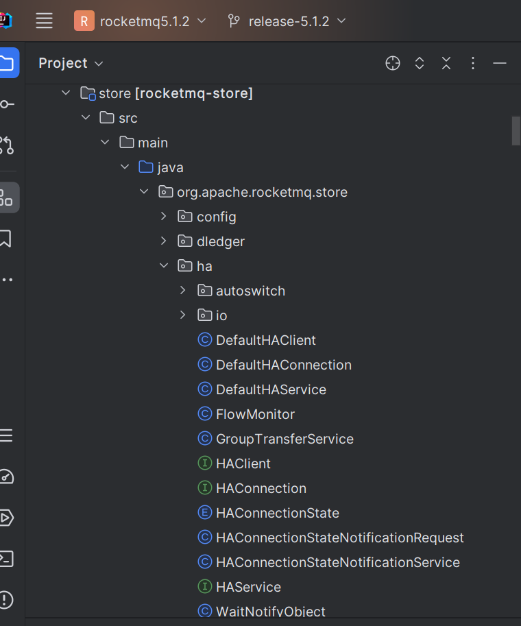

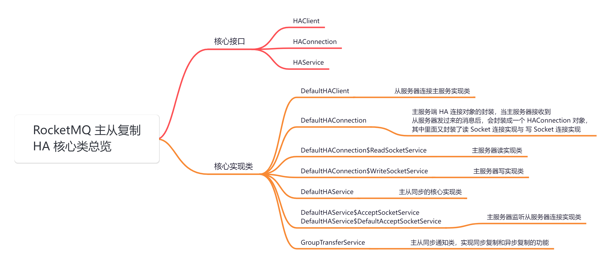

主从同步的整体工作机制大体如下：

1.  「**从服务器**」主动建立 TCP 连接主服务器，然后「**每隔 5s**」向主服务器发送 [commitLog](http://commitlog%20/) 文件「**最大偏移量**」拉取「**还未同步**」的消息。
2.  「**主服务器**」开启监听端口，监听「**从服务器**」发送过来的信息，「**主服务器**」收到「**从服务器**」发过来的偏移量进行解析，并返回查找出「**未同步**」的消息给「**从服务器**」。
3.  客户端收到「**主服务器**」的消息后，将这批消息写入 [commitLog](http://commitlog%20/) 文件中，然后更新 [commitLog](http://commitlog%20/) 拉取偏移量，接着继续向「**主服务器**」拉取未同步的消息。

从功能上分为「**网络请求处理**」和「**主从复制逻辑处理**」两部分。

### **2.2.1 网络请求处理**

### **2.2.1.1 服务端设计**

因为「**主从复制**」逻辑相对比较简单，且从节点数目有限，因此 RocketMQ 没有使用 Netty 为底层网络框架，而是通过 Java NIO 技术实现了 Socket 服务。

  
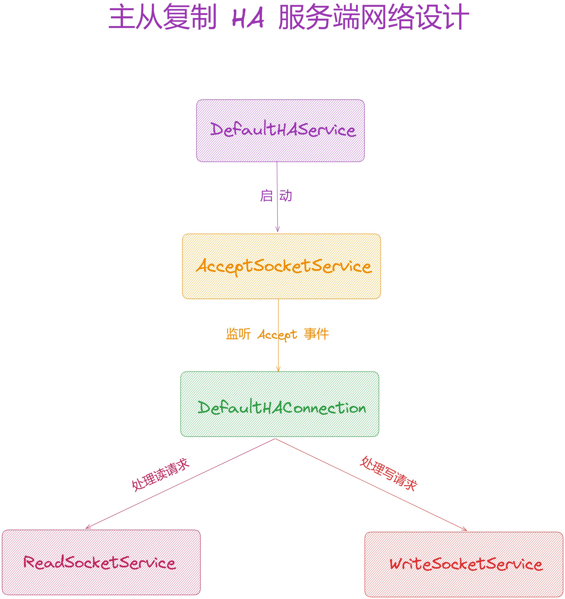

1.  在 [DefaultHAService](http://defaulthaservice%20/) 类「**启动**」时会调用其子类 [AcceptSocketService#beginAccept](http://acceptsocketservice/#beginAccept) 方法，来完成 [ServerSocket](http://serversocket%20/) 的创建以及初始化工作。
2.  然后调用 [AcceptSocketService#start](http://%20acceptsocketservice/#start) 方法开启线程，「**每隔 1s**」监听一次 [accept](http://accept%20/) 事件。
3.  当监听到 [accept](http://accept%20/) 事件时，将 [ON\_READ](http://on_read%20/) 和 [ON\_WRITE](http://on_write%20/) 事件委托给 [DefaultHAConnection](http://defaulthaconnection%20/) 类。
4.  [DefaultHAConnection](http://defaulthaconnection/) 又启动 [ReadSocketService](http://readsocketservice%20/) 和 [WriteSocketService](http://writesocketservice%20/) 两个线程来分别处理「**读写事件**」。
5.  RocketMQ 就是通过这种简易 Reactor 模式有效支撑了客户端的请求。

### **2.2.1.2 客户端设计**

客户端逻辑主要由 [DefaultHAClient](http://defaulthaclient%20/) 类实现。当 [HAClient](http://haclient%20/) 线程被启动后，直接与「**主节点**」建立 Socket 连接，「**每隔 1s**」处理一次「**读事件**」，具体细节我们在第三节展开。

### **2.2.2 主从复制**

「**主从节点**」以「**长连接**」的形式进行交互，两者「**每隔 5s**」互相发送心跳包，避免链接断开。「**消息复制**」的发起方是 [DefaultHAClient](http://defaulthaclient/)，「**从节点**」维护其 Broker 持久化的 [offset](http://offset/)，最多「**每隔 5s**」向「**主节点**」上报一次，

上报有以下两点意义：

1.  同步复制逻辑：主节点触发同步复制逻辑后，将复制的消息的 [offset](http://offset%20/) 阻塞在 [GroupTransferService#doWaitTransfer](http://grouptransferservice/#doWaitTransfer) 方法上，该方法「**每隔 1s**」检查「**从节点复制进度**」与「**待复制消息**」这两个 offset 的大小关系，当「**复制进度**」超过「**待复制消息**」 offset 后，返回同步复制成功；否则继续等待直到超时或者成功。
2.  消息复制请求：主节点的 [ReadSocketService](http://readsocketservice%20/) 线程读取到从节点的 offset 进度后，将其保存到 [slaveRequestOffset](http://slaverequestoffset%20/) 中，随后触发 [WriteSocketService](http://writesocketservice%20/) 线程进行消息写入的流程。
3.  发送的消息分为 [header](http://header%20/) 和 [body](http://body%20/) 两个部分，[header](http://header%20/) 为 12 字节：8 字节的起始 offset 和 4 字节的消息 size。[body](http://body%20/) 就是自起始位置起 [commitlog](http://commitlog%20/) 的所有数据，最大为 32kb。
4.  「**从节点**」获取到「**主节点**」返回数据后，首先校验传过来的起始位置是否与传入的 offset 匹配，如果不匹配则断开与「**主节点**」的链接，这意味着与「**主节点**」的数据出现不一致，所以要关闭链接。
5.  校验 offset 通过后，直接将 [ByteBuffer](http://bytebuffer%20/) 中的数据写入本地 [Commitlog](http://commitlog%20/) 中（主节点已经做过校验，此处不需要做更多校验）写入成功后再次向「**主节点**」上报进度，以让阻塞在同步复制上的线程快速唤醒。

##   
**03 主从复制源码实现细节**

接下来，我们深度剖析下主从复制的源码实现细节。

## **3.1 HA 高可用服务启动入口**

我们从其入口开始说起，「**主从同步**」的实现逻辑主要在 [DefaultHAService](http://defaulthaservice/) 类中，在 [DefaultMessageStore](http://defaultmessagestore%20/) 类的构造函数中，对 [DefaultHAService](http://defaulthaservice/) 进行了实例化，并在 start 方法中，启动了 [DefaultHAService](http://defaulthaservice/)：

public class DefaultMessageStore implements MessageStore {

....

// HA 高可用组件

private HAService haService;

....

public DefaultMessageStore(final MessageStoreConfig messageStoreConfig, final BrokerStatsManager brokerStatsManager,

final MessageArrivingListener messageArrivingListener, final BrokerConfig brokerConfig, final ConcurrentMap<String, TopicConfig> topicConfigTable) throws IOException {

....

// DLedgerCommitLog 表示支持主从自动切换功能，默认是false，isDuplicationEnable 表示是否重复复制功能，默认是 false

if (!messageStoreConfig.isEnableDLegerCommitLog() && !this.messageStoreConfig.isDuplicationEnable()) {

// 是否启动控制器模式，支持自动切换代理的角色。默认是false

if (brokerConfig.isEnableControllerMode()) {

// 创建 HA 自动切换高可用服务，用来做数据同步

this.haService = new AutoSwitchHAService();

LOGGER.warn("Load AutoSwitch HA Service: {}", AutoSwitchHAService.class.getSimpleName());

} else {

// 创建 HA 服务

this.haService = ServiceProvider.loadClass(HAService.class);

if (null == this.haService) {

// 创建高可用服务，用来做数据同步

this.haService = new DefaultHAService();

LOGGER.warn("Load default HA Service: {}", DefaultHAService.class.getSimpleName());

}

}

}

....

}

/\*\*

\* 启动 MessageStore

\* @throws Exception

\*/

@Override

public void start() throws Exception {

....

// 如果 HA 服务不为null，启动 HA 高可用服务

if (this.haService != null) {

this.haService.start();

}

....

}

}

## **3.2 HA 高可用服务**

源码位置：[https://github.com/apache/rocketmq/blob/release-5.1.2/store/src/main/java/org/apache/rocketmq/store/ha/DefaultHAService.java](https://github.com/apache/rocketmq/blob/release-5.1.2/store/src/main/java/org/apache/rocketmq/store/ha/DefaultHAService.java)

### **3.2.1 核心数据结构**

public class DefaultHAService implements HAService {

private static final Logger log \= LoggerFactory.getLogger(LoggerName.STORE\_LOGGER\_NAME);

// 连接计数器

protected final AtomicInteger connectionCount \= new AtomicInteger(0);

// 连接列表

protected final List<HAConnection> connectionList = new LinkedList<>();

// 处理从节点的连接请求服务

protected AcceptSocketService acceptSocketService;

// 默认消息存储入口类

protected DefaultMessageStore defaultMessageStore;

// 等待通知对象

protected WaitNotifyObject waitNotifyObject \= new WaitNotifyObject();

// 推送给从服务器的最大偏移量

protected AtomicLong push2SlaveMaxOffset \= new AtomicLong(0);

// 数据传输服务

protected GroupTransferService groupTransferService;

// HA 客户端

protected HAClient haClient;

// HA 连接状态通知服务

protected HAConnectionStateNotificationService haConnectionStateNotificationService;

.....

}

### **3.2.2 HA 高可用服务初始化与启动**

在 [DefaultHAService](http://defaulthaservice/) 类的构造函数中，创建了 [AcceptSocketService](http://acceptsocketservice/)、[GroupTransferService](http://grouptransferservice/) 和 [HAClient](http://haclient/)。

// 默认构造函数

public DefaultHAService() {

}

// 初始化方法

@Override

public void init(final DefaultMessageStore defaultMessageStore) throws IOException {

// 设置默认消息存储入口类

this.defaultMessageStore = defaultMessageStore;

// 创建接收 socket 请求服务, HA 监听端口 10912

this.acceptSocketService = new DefaultAcceptSocketService(defaultMessageStore.getMessageStoreConfig());

// 创建数据传输服务

this.groupTransferService = new GroupTransferService(this, defaultMessageStore);

// 如果当前角色为 SLAVE，则创建 HA 客户端

if (this.defaultMessageStore.getMessageStoreConfig().getBrokerRole() == BrokerRole.SLAVE) {

this.haClient = new DefaultHAClient(this.defaultMessageStore);

}

// 创建 HA 连接状态通知服务

this.haConnectionStateNotificationService = new HAConnectionStateNotificationService(this, defaultMessageStore);

}

在 [start](http://start%20/) 方法中主要做了如下几件事：

1.  调用 [AcceptSocketService#beginAccept](http://acceptsocketservice/#beginAccept) 方法，这一步主要是进行「**端口绑定**」，在端口上监听「**从节点的连接请求**」（可以看做是运行在主节点的）。
2.  调用 [AcceptSocketService#start](http://acceptsocketservice/#start) 方法启动服务，这一步主要为了处理「**从节点的连接请求**」，与「**从节点建立连接**」（可以看做是运行在主节点的）。
3.  调用 [GroupTransferService#start](http://grouptransferservice/#start) 方法，主要用于在「**主从同步**」的时候，「**等待数据传输完毕**」（可以看做是运行在主节点的）。
4.  调用 [HAClient#start](http://haclient/#start) 方法启动，里面与 master 节点建立连接，向 master 上报主从同步进度并存储 master 发送过来的同步数据（可以看做是运行在从节点的）。

这里需要注意的是，HA 监听听端口 [haListenPort](http://halistenport%20%20/) 默认 [10912](http://0.0.42.160/)，但是 [BrokerStartup](http://brokerstartup%20/) 在创建 [BrokerController](http://brokercontroller%20/) 时，会设置 [haListenPort = listenPort + 1](http://halistenport%20=%20listenport%20+%201/)，[listenPort](http://listenport%20/) 就是 [Netty](http://netty%20/) 的监听端口。

> 比如我配置 listenPort=20911，那么 haListenPort=20912。

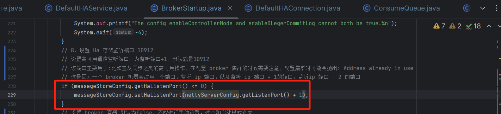

/\*\*

\* 启动相关服务

\* @throws Exception

\*/

@Override

public void start() throws Exception {

// 开启监听从服务器的连接

this.acceptSocketService.beginAccept();

// 启动接收从节点 socket 服务

this.acceptSocketService.start();

// 启动数据传输服务

this.groupTransferService.start();

// 启动 HA 连接状态通知服务

this.haConnectionStateNotificationService.start();

if (haClient != null) {

// 启动 Ha 客户端服务

this.haClient.start();

}

}

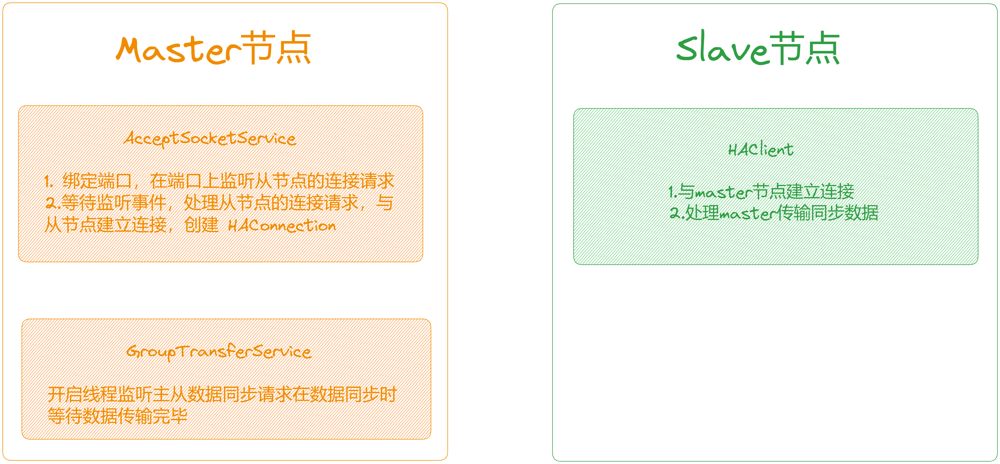

### **3.2.3 监听从节点请求**

[AcceptSocketService](http://acceptsocketservice%20/) 就是用来监听 [slave](http://slave%20/) 的连接，然后创建 [HAConnection](http://haconnection/)，默认监听的端口是 [listenPort + 1](http://listenport%20+%201/)。

[AcceptSocketService#beginAccept](http://acceptsocketservice/#beginAccept) 方法里面首先基于 NIO 去建立监听通道 [ServerSocketChannel](http://serversocketchannel/)，然后进行端口绑定，并注册多路复用器 [Selector](http://selector/)，在 [Selector](http://selector/) 上面注册了 [OP\_ACCEPT](http://op_accept/) 事件的监听，监听从节点的连接请求：

/\*\*

\* Listens to slave connections to create {@link HAConnection}.

\*/

protected abstract class AcceptSocketService extends ServiceThread {

// 监听的 Socket 地址

private final SocketAddress socketAddressListen;

// 服务器端 Socket 通道

private ServerSocketChannel serverSocketChannel;

// 选择器

private Selector selector;

// 消息存储配置

private final MessageStoreConfig messageStoreConfig;

// 构造方法，接收消息存储配置参数

public AcceptSocketService(final MessageStoreConfig messageStoreConfig) {

this.messageStoreConfig = messageStoreConfig;

// 设置监听的 Socket 地址为消息存储配置中的 HA 监听端口

this.socketAddressListen = new InetSocketAddress(messageStoreConfig.getHaListenPort());

}

/\*\*

\* Starts listening to slave connections.

\* 监听从节点的连接

\* @throws Exception If fails.

\*/

public void beginAccept() throws Exception {

// 基于 NIO 建立连接监听

this.serverSocketChannel = ServerSocketChannel.open();

// 获取 selector 多路复用器

this.selector = NetworkUtil.openSelector();

// 设置 socket 重用地址 true

this.serverSocketChannel.socket().setReuseAddress(true);

// 绑定监听端口

this.serverSocketChannel.socket().bind(this.socketAddressListen);

// 设置 Ha 监听端口

if (0 == messageStoreConfig.getHaListenPort()) {

messageStoreConfig.setHaListenPort(this.serverSocketChannel.socket().getLocalPort());

log.info("OS picked up {} to listen for HA", messageStoreConfig.getHaListenPort());

}

// 设置非阻塞

this.serverSocketChannel.configureBlocking(false);

// 注册到 selector 多路复用器，监听 OP\_ACCEPT 连接事件

this.serverSocketChannel.register(this.selector, SelectionKey.OP\_ACCEPT);

}

....

}

### **3.2.4 处理从节点连接请求**

[AcceptSocketService](http://acceptsocketservice%20/) 也是一个 [ServiceThread](http://servicethread/)，在 [AcceptSocketService#run](http://acceptsocketservice/#run) 方法中，对监听到的连接请求进行了处理，处理逻辑大致如下：

1.  从 [selector](http://selector/) 中获取到监听到的事件。
2.  如果是 [OP\_ACCEPT](http://op_accept/) 连接事件，创建与从节点的连接对象 [HAConnection](http://haconnection/) 与从节点建立连接，然后调用 [HAConnection](http://haconnection%20/#start) [#](http://haconnection%20/#start)[start](http://haconnection%20/#start) 方法进行启动，并创建的 [HAConnection](http://haconnection/) 对象加入到连接集合 [List<HAConnection>](http://listhaconnection/) 中，[HAConnection](http://haconnection/) 中封装了 [Master](http://master/) 节点和从节点的数据同步逻辑。

/\*\*

\* {@inheritDoc}

\*/

@Override

public void run() {

// 记录服务启动的日志

log.info(this.getServiceName() + " service started");

// 如果服务未停止

while (!this.isStopped()) {

try {

// 通过选择器监听连接到达事件，最长阻塞时间为 1000 毫秒

this.selector.select(1000);

// 获取监听到的事件, 拿到 SelectionKey

Set<SelectionKey> selected = this.selector.selectedKeys();

// 开始处理事件

if (selected != null) {

for (SelectionKey k : selected) {

// 如果是连接事件

if (k.isAcceptable()) {

// 接受客户端连接，通过 accept 函数完成 TCP 连接，获取到一个网络连接通道 SocketChannel

SocketChannel sc \= ((ServerSocketChannel) k.channel()).accept();

if (sc != null) {

// 记录接收到新连接的日志

DefaultHAService.log.info("HAService receive new connection, "

\+ sc.socket().getRemoteSocketAddress());

try {

// 创建 HA 连接并启动

HAConnection conn \= createConnection(sc);

conn.start();

// 将连接添加到连接列表中

DefaultHAService.this.addConnection(conn);

} catch (Exception e) {

// 如果创建连接出现异常，记录错误日志并关闭连接

log.error("new HAConnection exception", e);

sc.close();

}

}

} else {

// 如果发现了意外的操作类型，记录警告日志

log.warn("Unexpected ops in select " + k.readyOps());

}

}

// 清空已选择的键集合

selected.clear();

}

} catch (Exception e) {

// 捕获异常，记录日志

log.error(this.getServiceName() + " service has exception.", e);

}

}

// 记录服务结束的日志

log.info(this.getServiceName() + " service end");

}

## **3.3 传输数据服务**

源码位置：[https://github.com/apache/rocketmq/blob/release-5.1.2/store/src/main/java/org/apache/rocketmq/store/ha/GroupTransferService.java](https://github.com/apache/rocketmq/blob/release-5.1.2/store/src/main/java/org/apache/rocketmq/store/ha/GroupTransferService.java)

### **3.3.1 核心数据结构**

/\*\*

\* GroupTransferService Service

\*/

public class GroupTransferService extends ServiceThread {

private static final Logger log \= LoggerFactory.getLogger(LoggerName.STORE\_LOGGER\_NAME);

// 通知对象

private final WaitNotifyObject notifyTransferObject \= new WaitNotifyObject();

// 多线程环境中用于保护共享资源，防止多个线程同时修改数据

private final PutMessageSpinLock lock \= new PutMessageSpinLock();

// 消息存储对象

private final DefaultMessageStore defaultMessageStore;

// HA 服务对象

private final HAService haService;

// 待写入的 CommitLog 提交请求集合

private volatile List<CommitLog.GroupCommitRequest> requestsWrite = new LinkedList<>();

// 待读取的 CommitLog 提交请求集合

private volatile List<CommitLog.GroupCommitRequest> requestsRead = new LinkedList<>();

....

}

### **3.3.1 等待主从复制传输结束**

[GroupTransferService#run](http://grouptransferservice/#run) 方法主要是为了在进行「**主从数据同步**」的时候，等待「**从节点数据同步完毕**」。

在运行时首先进会调用 [waitForRunning](http://waitforrunning/) 进行等待，此时可能还有没有开始主从同步，所以先进行等待，之后如果有「**同步请求**」，会唤醒该线程，然后调用 [doWaitTransfer](http://dowaittransfer/) 方法等待数据同步完成：

@Override

public void run() {

// 记录服务启动的日志

log.info(this.getServiceName() + " service started");

// 如果服务未停止

while (!this.isStopped()) {

try {

// 等待运行

this.waitForRunning(10);

// 如果被唤醒，调用 doWaitTransfer 等待主从同步完成

this.doWaitTransfer();

} catch (Exception e) {

log.warn(this.getServiceName() + " service has exception. ", e);

}

}

// 记录服务结束的日志

log.info(this.getServiceName() + " service end");

}

在剖析 [doWaitTransfer](http://dowaittransfer/) 方法之前，先来看下是「**如何判断有数据需要同步的**」。

在 [Master](http://master%20/) 节点中，当消息被写入到 [CommitLog](http://commitlog/) 以后，会调用 [handleDiskFlushAndHA](http://handlediskflushandha%20/) 方法处「**主从同步**」。

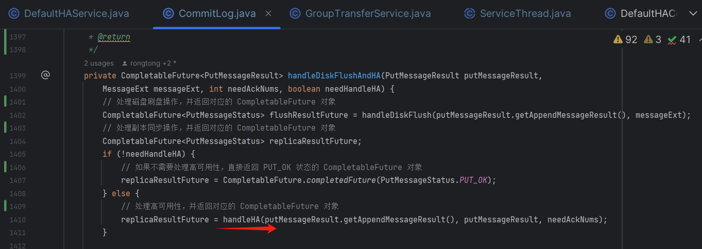

构建消息提交请求 [GroupCommitRequest](http://groupcommitrequest/)，然后调用 [HAService#putRequest](http://haservice/#putRequest) 添加到请求集合中，并唤醒[GroupTransferService](http://grouptransferservice%20/) 中在等待的线程：

/\*\*

\* 处理主从同步

\* @param result

\* @param putMessageResult

\* @param needAckNums

\* @return

\*/

private CompletableFuture<PutMessageStatus> handleHA(AppendMessageResult result, PutMessageResult putMessageResult,

int needAckNums) {

// 如果需要等待的 ack 数在有效范围内（0或1），则直接返回 PUT\_OK

if (needAckNums >= 0 && needAckNums <= 1) {

return CompletableFuture.completedFuture(PutMessageStatus.PUT\_OK);

}

// 从 defaultMessageStore 获取 HAService

HAService haService \= this.defaultMessageStore.getHaService();

// 计算下一条消息的偏移量

long nextOffset \= result.getWroteOffset() + result.getWroteBytes();

// 等待足够数量的从服务器 ack

// 创建 GroupCommitRequest 对象，设置下一条消息的偏移量、从服务器的超时时间和需要等待的 ack 数

// Wait enough acks from different slaves

GroupCommitRequest request \= new GroupCommitRequest(nextOffset, this.defaultMessageStore.getMessageStoreConfig().getSlaveTimeout(), needAckNums);

// 将请求添加到 HA 服务中

haService.putRequest(request);

// 唤醒所有等待的线程

haService.getWaitNotifyObject().wakeupAll();

// 返回 GroupCommitRequest 对应的 CompletableFuture 对象

return request.future();

}

在 [doWaitTransfer](http://dowaittransfer/) 方法中，会判断 [CommitLog](http://commitlog/) 提交请求集合 [requestsRead](http://requestsread/) 是否为空，如果不为空表示有消息写入了[CommitLog](http://commitlog/)，Master 节点需要等待将数据传输给从节点。

/\*\*

\* 处理消息的传输

\* 根据不同的条件和状态，循环检查是否可以进行消息传输，如果传输超时或失败，则记录警告日志。最后，唤醒等待该请求的客户端，并返回相应的状态。

\*/

private void doWaitTransfer() {

// 如果 CommitLog 提交请求集合不为空

if (!this.requestsRead.isEmpty()) {

// 循环处理消息提交请求

for (CommitLog.GroupCommitRequest req : this.requestsRead) {

// 是否同步完成

boolean transferOK \= false;

// 获取请求的截止时间

long deadLine \= req.getDeadLine();

// 当前所有 ack 都在同步状态集合中

final boolean allAckInSyncStateSet \= req.getAckNums() == MixAll.ALL\_ACK\_IN\_SYNC\_STATE\_SET;

// 循环检查是否可以进行消息传输

for (int i \= 0; !transferOK && deadLine - System.nanoTime() > 0; i++) {

// 如果不是第一次等待，则等待线程运行

if (i > 0) {

this.notifyTransferObject.waitForRunning(1);

}

// 如果不是所有 ack 都在同步状态集合中 && 请求的 ack 数小于等于 1

if (!allAckInSyncStateSet && req.getAckNums() <= 1) {

// 判断 push2SlaveMaxOffset 的值是否大于等于请求的下一个偏移量

transferOK = haService.getPush2SlaveMaxOffset().get() >= req.getNextOffset();

continue;

}

// 如果所有 ack 都在同步状态集合中且 HA 服务为 AutoSwitchHAService

if (allAckInSyncStateSet && this.haService instanceof AutoSwitchHAService) {

// In this mode, we must wait for all replicas that in SyncStateSet.

// 在这种模式下，我们必须等待所有在 SyncStateSet 中的副本

// 获取 AutoSwitchHAService 对象

final AutoSwitchHAService autoSwitchHAService \= (AutoSwitchHAService) this.haService;

// 获取同步状态集合

final Set<Long> syncStateSet = autoSwitchHAService.getSyncStateSet();

if (syncStateSet.size() <= 1) {

// 只有主服务器，可以直接进行消息传输

// Only master

transferOK = true;

break;

}

// Include master

int ackNums \= 1; // 包括主服务器

// 循环所有连接列表

for (HAConnection conn : haService.getConnectionList()) {

// 获取与 HA 服务建立的连接

final AutoSwitchHAConnection autoSwitchHAConnection \= (AutoSwitchHAConnection) conn;

// 如果从服务器在同步状态集合中并且其 ack 偏移量大于等于请求的下一个偏移量

if (syncStateSet.contains(autoSwitchHAConnection.getSlaveId()) && autoSwitchHAConnection.getSlaveAckOffset() >= req.getNextOffset()) {

ackNums++;

}

// 如果满足等待的 ack 数，可以进行消息传输

if (ackNums >= syncStateSet.size()) {

transferOK = true;

break;

}

}

} else {

// Include master

int ackNums \= 1; // 包括主服务器

for (HAConnection conn : haService.getConnectionList()) {

// 需要确保每个 HAConnection 代表不同的从服务器

// TODO: We must ensure every HAConnection represents a different slave 我们必须确保每个 HAConnection 代表不同的从服务器

// Solution: Consider assign a unique and fixed IP:ADDR for each different slave 考虑为每个不同的从服务器分配一个唯一且固定的 IP:ADDR

// 如果从服务器的 ack 偏移量大于等于请求的下一个偏移量

if (conn.getSlaveAckOffset() >= req.getNextOffset()) {

ackNums++;

}

// 如果满足等待的 ack 数，可以进行消息传输

if (ackNums >= req.getAckNums()) {

transferOK = true;

break;

}

}

}

}

// 如果传输未成功，记录警告日志

if (!transferOK) {

log.warn("transfer message to slave timeout, offset : {}, request acks: {}",

req.getNextOffset(), req.getAckNums());

}

// 唤醒等待该请求的客户端，传输成功则返回 PUT\_OK，否则返回 FLUSH\_SLAVE\_TIMEOUT

req.wakeupCustomer(transferOK ? PutMessageStatus.PUT\_OK : PutMessageStatus.FLUSH\_SLAVE\_TIMEOUT);

}

// 清空已处理的提交请求列表

this.requestsRead = new LinkedList<>();

}

}

其他方法：

/\*\*

\* 添加提交请求到写入列表，并唤醒等待的线程

\* @param request

\*/

public void putRequest(final CommitLog.GroupCommitRequest request) {

// 使用锁进行同步操作

lock.lock();

try {

// 将提交请求添加到写入列表中

this.requestsWrite.add(request);

} finally {

// 释放锁

lock.unlock();

}

// 唤醒等待的线程

wakeup();

}

/\*\*

\* 唤醒通知对象的等待线程

\*/

public void notifyTransferSome() {

// 唤醒通知对象的等待线程

this.notifyTransferObject.wakeup();

}

/\*\*

\* 交换写入列表和读取列表

\*/

private void swapRequests() {

// 使用锁进行同步操作

lock.lock();

try {

// 交换写入列表和读取列表

List<CommitLog.GroupCommitRequest> tmp = this.requestsWrite;

this.requestsWrite = this.requestsRead;

this.requestsRead = tmp;

} finally {

// 释放锁

lock.unlock();

}

}

## **3.4 Ha 客户端服务**

[AcceptSocketService](http://acceptsocketservice%20/) 是 [Master](http://master%20/) 节点用来接收 [Slave](http://slave%20/) 节点连接请求的，[HAClient](http://haclient%20/) 就是对应的 [Slave](http://slave%20/) 客户端，会去连接 [Master](http://master%20/) 节点。

### **3.4.1 核心数据结构**

public class DefaultHAClient extends ServiceThread implements HAClient {

/\*\*

\* Report header buffer size. Schema: slaveMaxOffset. Format:

\*

\* <pre>

\* ┌───────────────────────────────────────────────┐

\* │ slaveMaxOffset │

\* │ (8bytes) │

\* ├───────────────────────────────────────────────┤

\* │ │

\* │ Report Header │

\* </pre>

\* 

\*/

// 报告头缓冲区大小

public static final int REPORT\_HEADER\_SIZE \= 8;

// 日志记录器

private static final Logger log \= LoggerFactory.getLogger(LoggerName.STORE\_LOGGER\_NAME);

// 读取的最大缓冲区大小 4MB

private static final int READ\_MAX\_BUFFER\_SIZE \= 1024 \* 1024 \* 4;

// 主从 Ha 地址的原子引用

private final AtomicReference<String> masterHaAddress = new AtomicReference<>();

// master 节点的地址

private final AtomicReference<String> masterAddress = new AtomicReference<>();

// 上报的偏移量，报告偏移量的 ByteBuffer

// 从节点收到数据后会返回一个 8 字节的 ack 偏移量

private final ByteBuffer reportOffset \= ByteBuffer.allocate(REPORT\_HEADER\_SIZE);

// 与 Master 的连接通道

private SocketChannel socketChannel;

// NIO 多路复用器

private Selector selector;

// 从主服务器读取数据的最后时间戳

private long lastReadTimestamp \= System.currentTimeMillis();

// 向主服务器报告偏移量的最后时间戳, 即最近写入数据的时间

private long lastWriteTimestamp \= System.currentTimeMillis();

// 当前的主从复制进度

private long currentReportedOffset \= 0;

// 分发位置

private int dispatchPosition \= 0;

// 读缓冲区，会将从 socketChannel 读入缓冲区

private ByteBuffer byteBufferRead \= ByteBuffer.allocate(READ\_MAX\_BUFFER\_SIZE);

// 备份的 ByteBuffer 数据缓冲区

private ByteBuffer byteBufferBackup \= ByteBuffer.allocate(READ\_MAX\_BUFFER\_SIZE);

private DefaultMessageStore defaultMessageStore;

// 当前 HA 连接状态

private volatile HAConnectionState currentState \= HAConnectionState.READY;

// 流量监控对象

private FlowMonitor flowMonitor;

....

}

### **3.4.2 运行 HaClient**

[HAClient](http://haclient/) 可以看做是在「**从节点**」上运行的，根据不同的状态来进行不同的逻辑处理，如下：

/\*\*

\* 服务运行

\*/

@Override

public void run() {

// 记录服务启动的日志

log.info(this.getServiceName() + " service started");

// 启动流量监控

this.flowMonitor.start();

// 如果服务未停止

while (!this.isStopped()) {

try {

// 连接 Master 节点

switch (this.currentState) {

// 如果当前状态为 SHUTDOWN

case SHUTDOWN:

this.flowMonitor.shutdown(true);

return;

// 如果当前状态为 READY

case READY:

// 如果连接到 Master 节点失败

if (!this.connectMaster()) {

log.warn("HAClient connect to master {} failed", this.masterHaAddress.get());

// 等待 5 秒后重试连接

this.waitForRunning(1000 \* 5);

}

continue;

// 如果当前状态为 TRANSFER

case TRANSFER:

// 如果从 Master 节点传输失败

if (!transferFromMaster()) {

// 关闭 Master 节点连接并等待

closeMasterAndWait();

continue;

}

break;

// 默认情况

default:

// 等待 2 秒后继续循环

this.waitForRunning(1000 \* 2);

continue;

}

// 计算间隔时间

long interval \= this.defaultMessageStore.now() - this.lastReadTimestamp;

// 如果间隔时间超过有效维护期限

if (interval > this.defaultMessageStore.getMessageStoreConfig().getHaHousekeepingInterval()) {

log.warn("AutoRecoverHAClient, housekeeping, found this connection\[" + this.masterHaAddress

\+ "\] expired, " + interval);

// 关闭 Master 节点连接

this.closeMaster();

log.warn("AutoRecoverHAClient, master not response some time, so close connection");

}

} catch (Exception e) {

// 记录异常日志并关闭 Master 节点连接

log.warn(this.getServiceName() + " service has exception. ", e);

this.closeMasterAndWait();

}

}

// 停止流量监控

this.flowMonitor.shutdown(true);

// 记录服务结束的日志

log.info(this.getServiceName() + " service end");

}

### **3.4.3 连接主节点**

[HAClient](http://haclient%20/) 在构造方法中会打开多路复用器 [Selector](http://selector/)，在 [connectMaster](http://connectmaster/) 方法中会获取 [Master](http://master/) 节点的地址，并转换为 [SocketAddress](http://socketaddress/) 对象，然后向 [Master](http://master/) 节点请求建立连接，注册到多路复用器 [Selector](http://selector%20/) 上，并在 [selector](http://selector/) 注册 [OP\_READ](http://op_read/) 可读事件监听。

可以看到，[AcceptSocketService](http://acceptsocketservice%20/) 中是监听 [ACCEPT](http://accept%20/) 建立连接事件，[HAClient](http://haclient%20/) 则监听 [READ](http://read%20/) 读消息事件，也就是说主从复制是有 [Master](http://master/) 节点发送数据给 [Slave](http://slave%20/) 节点去同步，然后 [Slave](http://slave/) 节点上报同步的偏移量。

// 当前的主从复制进度

private long currentReportedOffset \= 0;

/\*\*

\* 连接主节点

\* @return

\* @throws ClosedChannelException

\*/

public boolean connectMaster() throws ClosedChannelException {

// 如果 socketChannel 为空

if (null == socketChannel) {

String addr \= this.masterHaAddress.get();

// 如果地址不为空

if (addr != null) {

// 将地址转为 SocketAddress

SocketAddress socketAddress \= NetworkUtil.string2SocketAddress(addr);

// 连接 Master 节点

this.socketChannel = RemotingHelper.connect(socketAddress);

// 如果 socketChannel 不为空

if (this.socketChannel != null) {

// 注册 OP\_READ 可读事件监听到 Selector 里去

this.socketChannel.register(this.selector, SelectionKey.OP\_READ);

log.info("HAClient connect to master {}", addr);

// 修改当前状态为 TRANSFER

this.changeCurrentState(HAConnectionState.TRANSFER);

}

}

// 获取 CommitLog 中当前最大的偏移量

this.currentReportedOffset = this.defaultMessageStore.getMaxPhyOffset();

// 更新上次写入时间

this.lastReadTimestamp = System.currentTimeMillis();

}

return this.socketChannel != null;

}

那 [masterAddress](http://masteraddress%20/) 怎么来的呢，在 Broker 启动时 [BrokerController](http://brokercontroller%20/) 的初始化方法中会去设置 [Master](http://master/) 地址。

在没有启用 [DLedger](http://%20dledger/) 技术的情况下，如果是 [Slave](http://slave%20/) 节点，就会更新 [masterAddress](http://masteraddress%20/) 的地址；如果是 [Master](http://master/) 节点，就会每隔 60 秒打印一次 [Master](http://master/) 和 [Slave](http://slave/) 之间的同步偏移量差距。

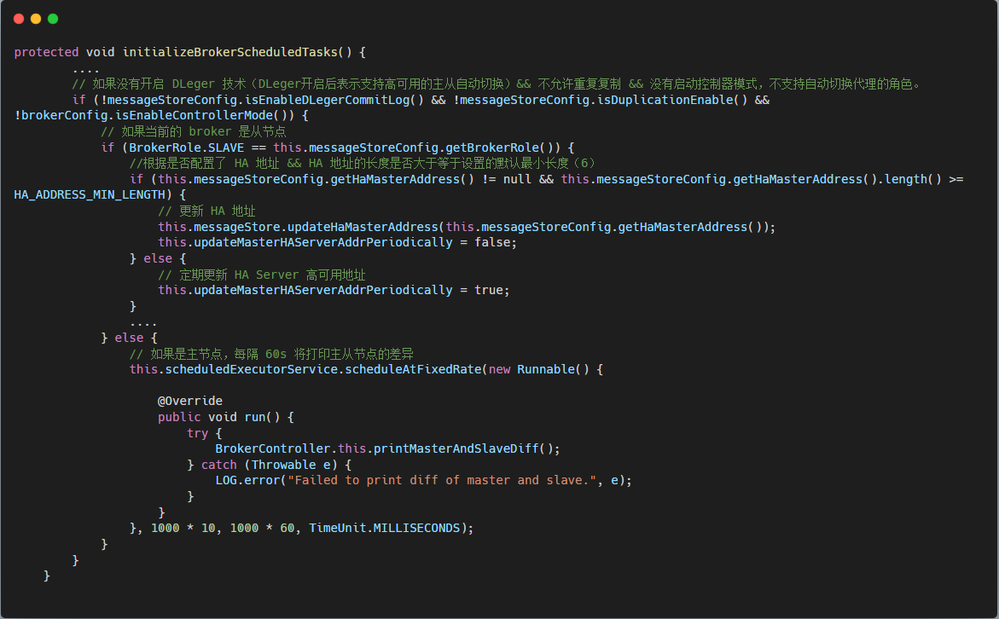

如果配置了 [Master](http://master/) 的地址 [haMasterAddress](http://hamasteraddress/)，就会直接用这个地址。不过一般不用手动设置这个地址，这样它就可以自己周期性的更新 [masterAddress](http://masteraddress/)，如果 [Master](http://master/) 挂了就会主从切换，其它 [Slave](http://slave%20/) 节点还可以自动更新新的 [Master](http://master/) 地址。

Broker 向 [NameServer](http://nameserver%20/) 注册的时候，会返回 [haServerAddr](http://haserveraddr%20/) 和 [masterAddr](http://masteraddr/)，也就是 [Master](http://master/) 的地址，然后更新 [HAClient](http://haclient%20/) 的 [masterAddress](http://masteraddress/)，以及 [SlaveSynchronize](http://slavesynchronize%20/) 的 [masterAddr](http://masteraddr/)。

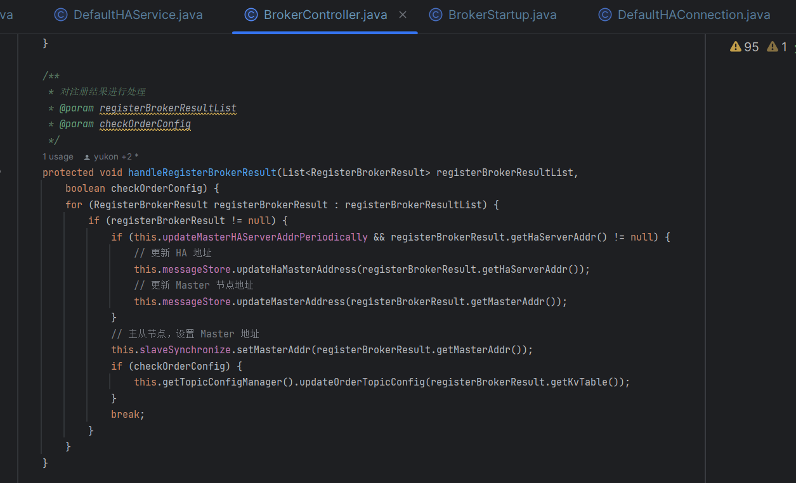

### **3.4.4 发送主从同步消息拉取偏移量**

在 [isTimeToReportOffset](http://istimetoreportoffset/) 方法中

1.  首先获取当前时间与上一次进行主从同步的时间间隔 [interval](http://interval/)。
2.  如果时间间隔[interval](http://interval/) 大于配置的发送心跳时间间隔，表示需要向 [Master](http://master/) 节点发送从节点消息同步的偏移量。
3.  接下来会调用[reportSlaveMaxOffset](http://reportslavemaxoffset/) 方法发送同步偏移量，也就是说从节点会定时向[Master](http://master/)节点发送请求，上报 [CommitLog](http://commitlog/)中同步消息的偏移量。

如下：

// 当前的主从复制进度

private long currentReportedOffset \= 0;

private boolean isTimeToReportOffset() {

// 获取距离上一次主从同步的间隔时间

long interval \= defaultMessageStore.now() - this.lastWriteTimestamp;

// 判断是否超过了配置的发送心跳包时间间隔

return interval > defaultMessageStore.getMessageStoreConfig().getHaSendHeartbeatInterval();

}

/\*\*

\* 发送同步偏移量

\* @param maxOffset 当前的主从复制偏移量 currentReportedOffset

\* @return

\*/

private boolean reportSlaveMaxOffset(final long maxOffset) {

// 重置缓冲区位置和限制

this.reportOffset.position(0);

// 设置数据传输大小为8个字节

this.reportOffset.limit(REPORT\_HEADER\_SIZE);

// 将最大偏移量写入缓冲区

this.reportOffset.putLong(maxOffset);

this.reportOffset.position(0);

this.reportOffset.limit(REPORT\_HEADER\_SIZE);

// 尝试多次向 socketChannel 写入

for (int i \= 0; i < 3 && this.reportOffset.hasRemaining(); i++) {

try {

// 向 Master 节点发送拉取偏移量

this.socketChannel.write(this.reportOffset);

} catch (IOException e) {

log.error(this.getServiceName()

\+ "reportSlaveMaxOffset this.socketChannel.write exception", e);

return false;

}

}

// 更新发送时间

lastWriteTimestamp = this.defaultMessageStore.getSystemClock().now();

// 检查缓冲区是否已全部写入

return !this.reportOffset.hasRemaining();

}

### **3.4.5 处理网络可读事件**

在 [processReadEvent](http://processreadevent/) 方法中处理了可读事件，也就是处理 [Master](http://master/) 节点发送的同步数据。

1.  首先从 [socketChannel](http://socketchannel/) 中读取数据到 [byteBufferRead](http://bytebufferread/) 中，[byteBufferRead](http://bytebufferread/) 是读缓冲区。
2.  读取数据的方法会返回读取到的字节数，对字节数大小进行判断：
3.  如果可读字节数大于0表示有数据需要处理，调用dispatchReadRequest方法进行处理。
4.  如果可读字节数为0表示没有可读数据，此时记录读取到空数据的次数。
5.  如果连续读到空数据的次数大于3次，将终止本次处理。

// 读缓冲区，会将从 socketChannel 读入缓冲区

private ByteBuffer byteBufferRead \= ByteBuffer.allocate(READ\_MAX\_BUFFER\_SIZE);

private boolean processReadEvent() {

int readSizeZeroTimes \= 0;

// 还有剩余

while (this.byteBufferRead.hasRemaining()) {

try {

// 从socketChannel中读取数据到byteBufferRead中，返回读取到的字节数

int readSize \= this.socketChannel.read(this.byteBufferRead);

if (readSize > 0) {

flowMonitor.addByteCountTransferred(readSize);

// 重置 readSizeZeroTimes

readSizeZeroTimes = 0;

// 处理数据

boolean result \= this.dispatchReadRequest();

if (!result) {

log.error("HAClient, dispatchReadRequest error");

return false;

}

lastReadTimestamp = System.currentTimeMillis();

} else if (readSize == 0) {

// 记录读取到空数据的次数

if (++readSizeZeroTimes >= 3) {

break;

}

} else {

log.info("HAClient, processReadEvent read socket < 0");

return false;

}

} catch (IOException e) {

log.info("HAClient, processReadEvent read socket exception", e);

return false;

}

}

return true;

}

### **3.4.6 消息写入 CommitLog**

// 已经处理的数据在读缓冲区中的位置,初始化为0

private int dispatchPosition \= 0;

// 读缓冲区，会将从 socketChannel 读入缓冲区

private ByteBuffer byteBufferRead \= ByteBuffer.allocate(READ\_MAX\_BUFFER\_SIZE);

/\*\*

\* 分发请求 写入 commitLog

\* @return

\*/

private boolean dispatchReadRequest() {

int readSocketPos \= this.byteBufferRead.position();

// 开启循环不断读取数据

while (true) {

// 获可读取的字节数

int diff \= this.byteBufferRead.position() - this.dispatchPosition;

// 如果字节数大于一个消息头的字节数，即读缓冲区还有数据

if (diff >= DefaultHAConnection.TRANSFER\_HEADER\_SIZE) {

// 获取消息在 master 节点的物理偏移量

long masterPhyOffset \= this.byteBufferRead.getLong(this.dispatchPosition);

// 获取消息体大小

int bodySize \= this.byteBufferRead.getInt(this.dispatchPosition + 8);

// 获取从节点当前 CommitLog 的最大物理偏移量

long slavePhyOffset \= this.defaultMessageStore.getMaxPhyOffset();

if (slavePhyOffset != 0) {

// 如果主从偏移量不一致结束处理

if (slavePhyOffset != masterPhyOffset) {

log.error("master pushed offset not equal the max phy offset in slave, SLAVE: " \+ slavePhyOffset + " MASTER: " + masterPhyOffset);

return false;

}

}

// 如果可读取的字节数大于一个消息头的字节数 + 消息体大小

if (diff >= (DefaultHAConnection.TRANSFER\_HEADER\_SIZE + bodySize)) {

// 将度缓冲区的数据转为字节数组

byte\[\] bodyData = byteBufferRead.array();

// 计算消息体在读缓冲区中的起始位置

int dataStart \= this.dispatchPosition + DefaultHAConnection.TRANSFER\_HEADER\_SIZE;

// 从读缓冲区中根据消息的位置读取消息内容，将消息追加到从节点的 CommitLog 中

this.defaultMessageStore.appendToCommitLog(

masterPhyOffset, bodyData, dataStart, bodySize);

// 更新消息读取位置

this.byteBufferRead.position(readSocketPos);

// 更新 dispatchPosition 的值为消息头大小+消息体大小

this.dispatchPosition += DefaultHAConnection.TRANSFER\_HEADER\_SIZE + bodySize;

// 向 Master 节点报告最大偏移量，如果没有完成直接返回 false

if (!reportSlaveMaxOffsetPlus()) {

return false;

}

continue;

}

}

// 如果读缓冲区没有空间则重新分配 buffer

if (!this.byteBufferRead.hasRemaining()) {

this.reallocateByteBuffer();

}

break;

}

return true;

}

// 读缓冲区 byteBufferRead 没有剩余空间时，就会重新分配。虽然 byteBufferRead 写满了，但可能数据还

// 没处理完，这时会先将备份缓冲区 byteBufferBackup 复位到0，将剩余的数据先写入备份缓冲区中，然后将 // byteBufferRead 和 byteBufferBackup 交换，再将处理位置 dispatchPosition 改为 0，之后

// byteBufferRead 可以继续接收消息，然后从 0 开始处理消息。

private void reallocateByteBuffer() {

int remain \= READ\_MAX\_BUFFER\_SIZE - this.dispatchPosition;

// ByteBuffer 已经写满了，但数据还没分发处理完

// 如果剩余空间大于0

if (remain > 0) {

// 设置 byteBufferRead 的位置为 dispatchPosition

this.byteBufferRead.position(this.dispatchPosition);

// 设置 byteBufferBackup 的位置和限制

this.byteBufferBackup.position(0);

this.byteBufferBackup.limit(READ\_MAX\_BUFFER\_SIZE);

// 将剩余 byteBufferRead 中的数据拷贝到备份的缓冲区 byteBufferBackup

this.byteBufferBackup.put(this.byteBufferRead);

}

// 调用 swapByteBuffer 方法，交换 byteBufferRead 和 byteBufferBackup

this.swapByteBuffer();

// 设置 byteBufferRead 的位置和限制

this.byteBufferRead.position(remain);

this.byteBufferRead.limit(READ\_MAX\_BUFFER\_SIZE);

// 交换过后的 byteBufferRead 要从 0 开始处理数据

this.dispatchPosition = 0;

}

private void swapByteBuffer() {

// 交换 byteBufferRead 和 byteBufferBackup

ByteBuffer tmp \= this.byteBufferRead;

this.byteBufferRead = this.byteBufferBackup;

this.byteBufferBackup = tmp;

}

/\*\*

\* 向 Master 节点报告最大偏移量

\* 写完数据后，会重新上报偏移量，进去可以看到，主要是判断 CommitLog 已写入的偏移量如果大于当前上报

\* 的偏移量currentReportedOffset，就会更新 currentReportedOffset 为 CommitLog 的偏移量，然后上报给

\* master 节点。而上报 slave 偏移量其实就是向连接通道写入8字节的偏移量长度。

\* @return

\*/

private boolean reportSlaveMaxOffsetPlus() {

// 默认设置返回值为true

boolean result \= true;

// 获取 salve 节点当前消息存储的最大物理偏移量

long currentPhyOffset \= this.defaultMessageStore.getMaxPhyOffset();

// 如果 CommitLog 写入当前最大物理偏移量大于已报告的最大偏移量

if (currentPhyOffset > this.currentReportedOffset) {

// 更新已报告的最大偏移量为当前 CommitLog 最大物理偏移量

this.currentReportedOffset = currentPhyOffset;

// 重新向 Master 节点报告最大偏移量

result = this.reportSlaveMaxOffset(this.currentReportedOffset);

// 如果报告失败

if (!result) {

// 关闭 Master 节点连接

this.closeMaster();

log.error("HAClient,reportSlaveMaxOffset error," + this.currentReportedOffset);

}

}

// 返回操作结果

return result;

}

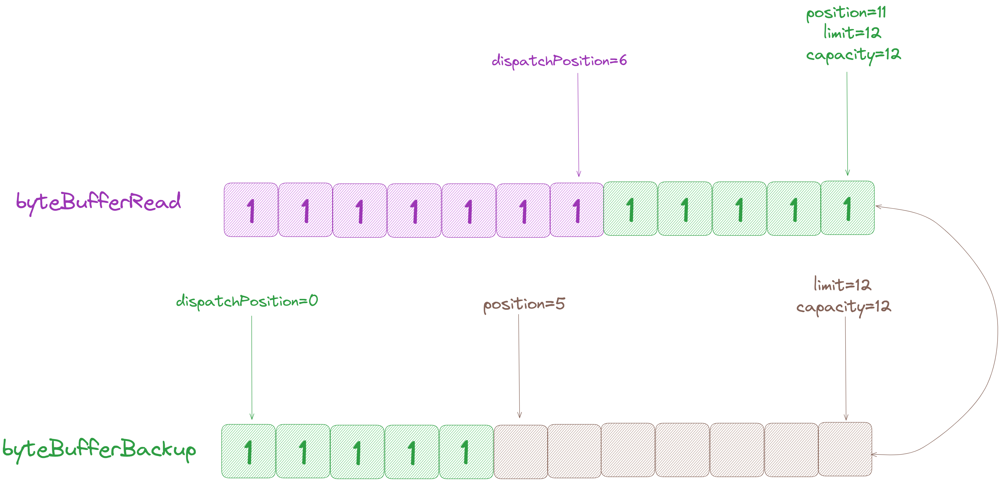

[dispatchReadRequest](http://dispatchreadrequest/) 方法中会将从节点读取到的数据写入 [CommitLog](http://commitlog/)，[dispatchPosition](http://dispatchposition/) 记录了已经处理的数据在读缓冲区中的位置，从读缓冲区 [byteBufferRead](http://bytebufferread/) 获取剩余可读取的字节数，如果可读数据的字节数大于一个消息头的字节数（12个字节），表示有数据还未处理完毕，反之表示消息已经处理完毕结束处理。

对数据的处理逻辑如下：

1.  从缓冲区中读取数据，首先获取到的是消息在 [Master](http://master/) 节点的物理偏移量 [masterPhyOffset](http://masterphyoffset/)。
2.  向后读取 8 个字节，得到消息体内容的字节数 [bodySize](http://bodysize/)。
3.  获取从节点当前 [CommitLog](http://commitlog/) 的最大物理偏移量 [slavePhyOffset](http://slavephyoffset/)，如果不为 0 并且不等于 [masterPhyOffset](http://masterphyoffset/)，表示与[Master](http://master%20/) 节点的传输偏移量不一致，也就是数据不一致，此时终止处理；
4.  如果可读取的字节数大于一个消息头的字节数 + 消息体大小，表示有消息可处理，继续进行下一步。
5.  计算消息体在读缓冲区中的起始位置，从读缓冲区中根据起始位置读取消息内容，将消息追加到从节点的 [CommitLog](http://commitlog/) 中。
6.  更新 [dispatchPosition](http://dispatchposition/) 的值为消息头大小 + 消息体大小，[dispatchPosition](http://dispatchposition/) 之前的数据表示已经处理完毕。

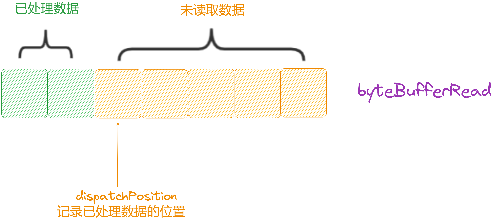

## **3.5 Ha 连接服务**

[DefaultHAConnection](http://defaulthaconnection/) 中封装了 [Master](http://master/) 节点与 [Slave](http://slave/) 节点的网络通信处理，当 [Slave](http://slave%20/) 与 [Master](http://master/) 建立连接后，[Master](http://master/) 会创建一个 [HAConnection](http://haconnection%20/) 来保持与 [Slave](http://slave%20/) 的连接状态，并支持读写数据。

可以看到 [HAConnection](http://haconnection%20/) 在创建时主要是做了一些 [SocketChannel](http://socketchannel%20/) 的配置，然后对 [HAService](http://haservice%20/) 中的连接数量 [connectionCount](http://connectioncount%20/) 自增。其中最重要的便是创建并启动了 [WriteSocketService](http://writesocketservice%20/) 和 [ReadSocketService](http://readsocketservice%20/) 两个组件，看名字就知道是在处理网络连接的写数据和读数据。

这两个组件都是一个 [ServiceThread](http://servicethread/)，也就是后台线程在异步运行着一个任务。另外还有两个偏移量属性，[slaveRequestOffset](http://slaverequestoffset%20/) 表示 [Slave](http://%20slave/) 请求获取的偏移量，[slaveAckOffset](http://slaveackoffset%20/) 表示 [Slave](http://slave/) 同步数据后 [ack](http://ack/) 的偏移量。

### **3.5.1 核心数据结构**

public class DefaultHAConnection implements HAConnection {

/\*\*

\* Transfer Header buffer size. Schema: physic offset and body size. Format:

\*

\* <pre>

\* ┌───────────────────────────────────────────────┬───────────────────────┐

\* │ physicOffset │ bodySize │

\* │ (8bytes) │ (4bytes) │

\* ├───────────────────────────────────────────────┴───────────────────────┤

\* │ │

\* │ Transfer Header │

\* </pre>

\* 

\*/

public static final int TRANSFER\_HEADER\_SIZE \= 8 + 4;

// 日志记录器

private static final Logger log \= LoggerFactory.getLogger(LoggerName.STORE\_LOGGER\_NAME);

// HAService 实例

private final DefaultHAService haService;

// SocketChannel 实例

private final SocketChannel socketChannel;

// 客户端地址

private final String clientAddress;

// 用于写的 WriteSocketService 实例

private WriteSocketService writeSocketService;

// 用于读的 ReadSocketService 实例

private ReadSocketService readSocketService;

// 当前连接状态

private volatile HAConnectionState currentState \= HAConnectionState.TRANSFER;

// 从节点请求偏移量

private volatile long slaveRequestOffset \= -1;

// 从节点确认偏移量

private volatile long slaveAckOffset \= -1;

// 流量监控器

private FlowMonitor flowMonitor;

// 构造函数

public DefaultHAConnection(final DefaultHAService haService,final SocketChannel socketChannel) throws IOException {

// 初始化 haService 和 socketChannel

this.haService = haService;

this.socketChannel = socketChannel;

// 初始化客户端地址

this.clientAddress = this.socketChannel.socket().getRemoteSocketAddress().toString();

// 设置非阻塞模式

this.socketChannel.configureBlocking(false);

this.socketChannel.socket().setSoLinger(false,-1);

this.socketChannel.socket().setTcpNoDelay(true);

// 如果配置了发送缓冲区大小，设置发送缓冲区大小

if (NettySystemConfig.socketSndbufSize > 0) {

this.socketChannel.socket().setReceiveBufferSize(NettySystemConfig.socketSndbufSize);

}

// 如果配置了接收缓冲区大小，设置接收缓冲区大小

if (NettySystemConfig.socketRcvbufSize > 0) {

this.socketChannel.socket().setSendBufferSize(NettySystemConfig.socketRcvbufSize);

}

// 创建并初始化 WriteSocketService 和 ReadSocketService

this.writeSocketService = new WriteSocketService(this.socketChannel);

this.readSocketService = new ReadSocketService(this.socketChannel);

// 增加连接计数，连接数量+1

this.haService.getConnectionCount().incrementAndGet();

// 初始化流量监控器

this.flowMonitor = new FlowMonitor(haService.getDefaultMessageStore().getMessageStoreConfig());

}

....

}

### **3.5.2 服务启动与停止**

public void start() {

// 改变当前状态为TRANSFER

changeCurrentState(HAConnectionState.TRANSFER);

// 开始流量监控

this.flowMonitor.start();

// 开始读取Socket服务

this.readSocketService.start();

// 开始写入Socket服务

this.writeSocketService.start();

}

public void shutdown() {

// 改变当前状态为SHUTDOWN

changeCurrentState(HAConnectionState.SHUTDOWN);

// 关闭写入Socket服务

this.writeSocketService.shutdown(true);

// 关闭读取Socket服务

this.readSocketService.shutdown(true);

// 关闭流量监控

this.flowMonitor.shutdown(true);

// 关闭连接

this.close();

}

public void close() {

// 如果socketChannel不为null，关闭socketChannel

if (this.socketChannel != null) {

try {

this.socketChannel.close();

} catch (IOException e) {

log.error("",e);

}

}

}

### **3.5.3 ReadSocketService**

[HAClient](http://haclient%20/) 中，[Slave](http://slave%20/) 节点每次同步数据后，会向 [Master](http://master%20/) 上报当前 [CommitLog](http://commitlog%20/) 的物理偏移量，每隔 5 秒也会上报一次。

[HAConnection](http://haconnection%20/) 中的 [ReadSocketService](http://readsocketservice%20/) 就是用来监听 [Slave](http://slave%20/) 节点的发送的数据，监听到 [READ](http://read%20/) 事件后，就会调用 [processReadEvent()](http://processreadevent\(\)/) 来处理数据。如果处理 [READ](http://read/) 事件失败或者处理时间超过 20 秒，就认为与 [Slave](http://slave%20/) 的连接超时过期，当前这个连接就不要了这时就会关闭相关资源，让 [Slave](http://slave/) 重新连接。

[ReadSocketService](http://readsocketservice/) 启动后处理监听到的可读事件，前面知道 [HAClient](http://haclient/) 中从节点会定时向 [Master](http://master/) 节点汇报从节点的消息同步偏移量，[Master](http://master/) 节点对上报请求的处理就在这里，如果从网络中监听到了可读事件，会调用[processReadEvent](http://processreadevent/) 处理读事件：

class ReadSocketService extends ServiceThread {

// 读操作的最大缓冲区大小 1M

private static final int READ\_MAX\_BUFFER\_SIZE \= 1024 \* 1024;

// Selector 用于监听通道的事件

private final Selector selector;

// SocketChannel 对象，用于进行 Socket 读写操作

private final SocketChannel socketChannel;

// 读数据缓冲区，ByteBuffer 用于读取数据

private final ByteBuffer byteBufferRead \= ByteBuffer.allocate(READ\_MAX\_BUFFER\_SIZE);

// 数据处理位置

private int processPosition \= 0;

// 最近一次读取数据的时间戳

private volatile long lastReadTimestamp \= System.currentTimeMillis();

// 构造函数

public ReadSocketService(final SocketChannel socketChannel) throws IOException {

// 打开 Selector

this.selector = NetworkUtil.openSelector();

// 获取 SocketChannel 对象

this.socketChannel = socketChannel;

// 将SocketChannel注册到Selector上，监听读事件

this.socketChannel.register(this.selector,SelectionKey.OP\_READ);

// 设置为守护线程

this.setDaemon(true);

}

@Override

public void run() {

// 记录服务启动的日志

log.info(this.getServiceName() + " service started");

while (!this.isStopped()) {

try {

// 通过选择器监听事件，最长阻塞时间为 1000 毫秒

this.selector.select(1000);

// 处理读事件

boolean ok \= this.processReadEvent();

if (!ok) {

log.error("processReadEvent error");

break;

}

// 计算与上次读取时间的时间间隔

long interval \= DefaultHAConnection.this.haService.getDefaultMessageStore().getSystemClock().now() - this.lastReadTimestamp;

// 如果连接超过了高可用保留时间 20 秒，中断连接

if (interval > DefaultHAConnection.this.haService.getDefaultMessageStore().getMessageStoreConfig().getHaHousekeepingInterval()) {

log.warn("ha housekeeping, found this connection\[" + DefaultHAConnection.this.clientAddress + "\] expired, " + interval);

break;

}

} catch (Exception e) {

log.error(this.getServiceName() + " service has exception.", e);

break;

}

}

// 改变当前状态为 SHUTDOWN

changeCurrentState(HAConnectionState.SHUTDOWN);

// 停止当前 ServiceThread 服务

this.makeStop();

// 停止写入 SocketService 服务

writeSocketService.makeStop();

// 从 HAService 中移除此连接

haService.removeConnection(DefaultHAConnection.this);

// 减少连接计数

DefaultHAConnection.this.haService.getConnectionCount().decrementAndGet();

// 取消对通道的注册

SelectionKey sk \= this.socketChannel.keyFor(this.selector);

if (sk != null) {

sk.cancel();

}

try {

// 关闭Selector和SocketChannel

this.selector.close();

this.socketChannel.close();

} catch (IOException e) {

log.error("", e);

}

// 关闭流量监控

flowMonitor.shutdown(true);

// 记录服务结束的日志

log.info(this.getServiceName() + " service end");

}

....

}

### **3.5.3.1 处理可读事件**

在 [HAClient](http://haclient%20/) 中，[Slave](http://slave/) 会监听处理来自 [Master](http://master%20/) 的消息，它会从连接通道把数据读到 [byteBufferRead](http://bytebufferread%20/) 中，如果没有读取到数据，也会重试三次。读取到数据后，就会分发读请求去处理。

private boolean processReadEvent() {

int readSizeZeroTimes \= 0;

// 如果没有可读数据

if (!this.byteBufferRead.hasRemaining()) {

this.byteBufferRead.flip();

// 处理位置置为 0

this.processPosition = 0;

}

// 如果数据未读取完毕

while (this.byteBufferRead.hasRemaining()) {

try {

// 从 socketChannel 读取数据到 byteBufferRead 中，返回读取到的字节数

int readSize \= this.socketChannel.read(this.byteBufferRead);

// 如果读取数据字节数大于0

if (readSize > 0) {

// 重置readSizeZeroTimes

readSizeZeroTimes = 0;

// 获取上次处理读事件的时间戳

this.lastReadTimestamp = DefaultHAConnection.this.haService.getDefaultMessageStore().getSystemClock().now();

// 判断剩余可读取的字节数是否大于等于 DefaultHAClient.REPORT\_HEADER\_SIZE = 8

// 即:至少要读到8个字节(至少是一条数据，一次请求)

if ((this.byteBufferRead.position() - this.processPosition) >= DefaultHAClient.REPORT\_HEADER\_SIZE) {

// 获取偏移量内容的结束位置 // 最后一条消息的末尾偏移量

int pos \= this.byteBufferRead.position() - (this.byteBufferRead.position() % DefaultHAClient.REPORT\_HEADER\_SIZE);

// slave 上报的偏移量，从结束位置向前读取8个字节得到从点发送的同步偏移量

long readOffset \= this.byteBufferRead.getLong(pos - 8);

// 更新处理位置

this.processPosition = pos;

// 更新 slaveAckOffset 为从节点发送的同步进度

DefaultHAConnection.this.slaveAckOffset = readOffset;

// 如果记录的从节点的同步进度小于0，表示还未进行同步

if (DefaultHAConnection.this.slaveRequestOffset < 0) {

// 更新为从节点发送的同步进度

DefaultHAConnection.this.slaveRequestOffset = readOffset;

log.info("slave\[" + DefaultHAConnection.this.clientAddress + "\] request offset " + readOffset);

}

// 更新 Master 节点记录的向从节点同步消息的偏移量

// 从节点已经接收到一些数据了，通知 HAService 传输数据给从节点

DefaultHAConnection.this.haService.notifyTransferSome(

DefaultHAConnection.this.slaveAckOffset);

}

} else if (readSize == 0) {

// 判断连续读取到空数据的次数是否超过三次

if (++readSizeZeroTimes >= 3) {

break;

}

} else {

log.error("read socket\[" + DefaultHAConnection.this.clientAddress + "\] < 0");

return false;

}

} catch (IOException e) {

log.error("processReadEvent exception", e);

return false;

}

}

return true;

}

}

[processReadEvent](http://processreadevent/) 中从网络中处理读事件的方式与前面 [HAClient#dispatchReadRequest](http://haclient/#dispatchReadRequest) 类似，都是将网络中的数据读取到读缓冲区中，并用一个变量记录已读取数据的位置，该方法的处理逻辑如下：

1.  从 [socketChannel](http://socketchannel/) 读取数据到读缓冲区 [byteBufferRead](http://bytebufferread/) 中，返回读取到的字节数。
2.  如果读取到的字节数大于 0 则进入下一步，如果读取到的字节数为 0，记录连续读取到空字节数的次数是否超过三次，如果超过终止处理。
3.  判断剩余可读取的字节数是否大于等于 8，前面知道从节点发送同步消息拉取偏移量的时候设置的字节大小为 8，所以字节数大于等于 8 的时候表示需要读取从节点发送的偏移量。
4.  计算数据在缓冲区中的位置，从缓冲区读取从节点发送的同步偏移量 [readOffset](http://readoffset/)。
5.  更新 [processPosition](http://processposition/) 的值，[processPosition](http://processposition/) 表示读缓冲区中已经处理数据的位置。
6.  更新 [slaveAckOffset](http://slaveackoffset/) 为从节点发送的同步偏移量 [readOffset](http://readoffset/) 的值；
7.  如果当前 [Master](http://master/) 节点记录的从节点的同步偏移量 [slaveRequestOffset](http://slaverequestoffset/) 小于0，表示还未进行同步，此时将[slaveRequestOffset](http://slaverequestoffset/) 更新为从节点发送的同步偏移量。
8.  如果从节点发送的同步偏移量比当前 [Master](http://master/) 节点的最大物理偏移量还要大，终止本次处理。
9.  调用 [notifyTransferSome](http://notifytransfersome/) 更新 [Master](http://master/) 节点记录的向从节点同步消息的偏移量。

[Master](http://master%20/) 写入的请求头占 12 字节，消息不超过 32 KB，[Slave](http://slave%20/) 接收到后会读到 [byteBufferRead](http://bytebufferread%20/) 缓冲区中，这个读缓冲区的大小为 4 MB，所以可以放入很多条来自 [Master](http://master%20/) 的数据。所以 [HAClient](http://haclient%20/) 会有一个 [dispatchPosition](http://dispatchposition%20/) 来表示消息处理的位置。

每次处理的消息至少得有 12 字节，[Master](http://master%20/) 会单独发请求头过来，也可能会接着发送消息数据过来。

1.  首先就会读取请求头数据，前 8 字节的物理偏移量 [masterPhyOffset](http://masterphyoffset/)。
2.  接着 4 字节的消息长度 [bodySize](http://bodysize/)。然后判断当前 [Slave](http://slave%20/) 已经写入的物理偏移量 [slavePhyOffset](http://slavephyoffset/)，与 [Master](http://master/)当前传输的偏移量 [masterPhyOffset](http://masterphyoffset/) 是否一致，如果不一致说明数据同步有问题，这时就会返回 false，返回 false 之后就会关闭连接通道，之后重新连接 [Master](http://master/)，重新建立连接时 [Master](http://master%20/) 中的 [HAConnection](http://haconnection%20/) 也会重建，然后 [Slave](http://slave%20/) 会重新上报当前的偏移量，那么 [WriteSocketService](http://writesocketservice%20/) 中的 [nextTransferFromWhere](http://nexttransferfromwhere%20/) 就会更新为 [Slave](http://slave%20/) 节点的物理偏移量，达到主从偏移量同步的目的。
3.  接着就是将消息体追加到 [CommitLog](http://commitlog%20/) 中，进去可以看到就是将消息体数据写入 [MappedFile](http://mappedfile%20/) 的 [MappedByteBuffer](http://mappedbytebuffer%20/) 中。写完之后就更新 [dispatchPosition](http://dispatchposition/)，表示当前已处理消息的位置，下一次就从这个位置开始处理消息。

  
前面在 [GroupTransferService](http://grouptransferservice/) 中可以看到是通过 [push2SlaveMaxOffset](http://push2slavemaxoffset/) 的值判断本次同步是否完成的，在[notifyTransferSome](http://notifytransfersome/) 方法中可以看到当 [Master](http://master/) 节点收到从节点反馈的消息拉取偏移量时，对[push2SlaveMaxOffset](http://push2slavemaxoffset/) 的值进行了更新：

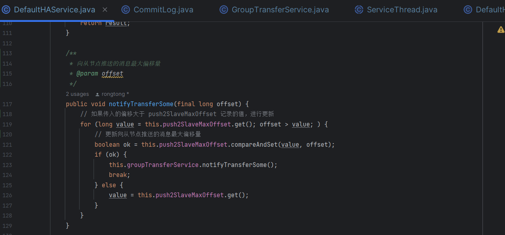

### **3.5.4 WriteSocketService**

可以看到 [WriteSocketService](http://writesocketservice%20/) 在创建时，主要就是会向 [SocketChannel](http://socketchannel%20/) 注册 [WRITE](http://write%20/) 事件，也就是写入数据。

先记住它的一些属性：

1.  [TRANSFER\_HEADER\_SIZE](http://transfer_header_size/)：数据的头大小，可以看出应该是由一个8字节和4字节的数据组成。
2.  [byteBufferHeader](http://bytebufferheader/)：用来写数据头的一个缓冲区，8+4 字节长度。
3.  [nextTransferFromWhere](http://nexttransferfromwhere/)：表示从哪个位置开始传输。
4.  [selectMappedBufferResult](http://selectmappedbufferresult/)：这个是从 [MappedFile](http://mappedfile%20/) 返回的查询数据对象。
5.  [lastWriteOver](http://lastwriteover/)：最后一次写数据是否完成。
6.  [lastWriteTimestamp](http://lastwritetimestamp/)：最后一次写数据的时间戳。

class WriteSocketService extends ServiceThread {

// Selector 用于监听通道的事件

private final Selector selector;

// SocketChannel 对象，用于进行 Socket 读写操作

private final SocketChannel socketChannel;

// 用于写入 Transfer Header 的 ByteBuffer

private final ByteBuffer byteBufferHeader \= ByteBuffer.allocate(TRANSFER\_HEADER\_SIZE);

// 下一次传输的起始位置

private long nextTransferFromWhere \= -1;

// 用于存储选定的映射缓冲区结果

private SelectMappedBufferResult selectMappedBufferResult;

// 上次写入是否结束

private boolean lastWriteOver \= true;

// 上次打印时间戳

private long lastPrintTimestamp \= System.currentTimeMillis();

// 上次写入时间戳

private long lastWriteTimestamp \= System.currentTimeMillis();

// 构造函数

public WriteSocketService(final SocketChannel socketChannel) throws IOException {

// 打开 Selector

this.selector = NetworkUtil.openSelector();

// 获取 SocketChannel 对象

this.socketChannel = socketChannel;

// 将 SocketChannel 注册到 Selector 上，监听通道写事件

this.socketChannel.register(this.selector,SelectionKey.OP\_WRITE);

// 设置为守护线程

this.setDaemon(true);

}

@Override

public void run() {

log.info(this.getServiceName() + " service started");

// 如果服务未停止

while (!this.isStopped()) {

try {

// 通过选择器监听事件，最长阻塞时间为 1000 毫秒

this.selector.select(1000);

// 如果 slaveRequestOffset 为 -1，表示还未收到从节点报告的拉取进度

if (-1 == DefaultHAConnection.this.slaveRequestOffset) {

// 等待一段时间

Thread.sleep(10);

continue;

}

// 初次进行数据同步

if (-1 == this.nextTransferFromWhere) {

// 如果拉取进度为0

if (0 == DefaultHAConnection.this.slaveRequestOffset) {

// 从 master 节点最大偏移量从开始传输

long masterOffset \= DefaultHAConnection.this.haService.getDefaultMessageStore().getCommitLog().getMaxOffset();

masterOffset =

masterOffset

\- (masterOffset % DefaultHAConnection.this.haService.getDefaultMessageStore().getMessageStoreConfig()

.getMappedFileSizeCommitLog());

if (masterOffset < 0) {

masterOffset = 0;

}

// 更新 nextTransferFromWhere

this.nextTransferFromWhere = masterOffset;

} else {

// 根据从节点发送的偏移量开始数据同步

this.nextTransferFromWhere = DefaultHAConnection.this.slaveRequestOffset;

}

log.info("master transfer data from " + this.nextTransferFromWhere + " to slave\[" + DefaultHAConnection.this.clientAddress

\+ "\], and slave request " + DefaultHAConnection.this.slaveRequestOffset);

}

// 判断上次传输是否完毕

if (this.lastWriteOver) {

// 获取当前时间距离上次写入数据的时间间隔

long interval \=

DefaultHAConnection.this.haService.getDefaultMessageStore().getSystemClock().now() - this.lastWriteTimestamp;

// 如果距离上次写入数据的时间间隔超过了设置的心跳时间

if (interval > DefaultHAConnection.this.haService.getDefaultMessageStore().getMessageStoreConfig()

.getHaSendHeartbeatInterval()) {

// Build Header 构建 header

this.byteBufferHeader.position(0);

this.byteBufferHeader.limit(TRANSFER\_HEADER\_SIZE);

this.byteBufferHeader.putLong(this.nextTransferFromWhere);

this.byteBufferHeader.putInt(0);

this.byteBufferHeader.flip();

// 发送心跳包

this.lastWriteOver = this.transferData();

if (!this.lastWriteOver)

continue;

}

} else {

// 未传输完毕，继续上次的传输

this.lastWriteOver = this.transferData();

// 如果依旧未完成，结束本次处理

if (!this.lastWriteOver)

continue;

}

// 根据偏移量获取消息数据

SelectMappedBufferResult selectResult \=

DefaultHAConnection.this.haService.getDefaultMessageStore().getCommitLogData(this.nextTransferFromWhere);

// 获取消息不为空

if (selectResult != null) {

// 获取消息内容大小

int size \= selectResult.getSize();

// 如果消息的字节数大于最大传输的大小

if (size > DefaultHAConnection.this.haService.getDefaultMessageStore().getMessageStoreConfig().getHaTransferBatchSize()) {

// 设置为最大传输大小

size = DefaultHAConnection.this.haService.getDefaultMessageStore().getMessageStoreConfig().getHaTransferBatchSize();

}

// 计算能复制的最大字节

int canTransferMaxBytes \= flowMonitor.canTransferMaxByteNum();

if (size > canTransferMaxBytes) {

if (System.currentTimeMillis() - lastPrintTimestamp > 1000) {

log.warn("Trigger HA flow control, max transfer speed {}KB/s, current speed: {}KB/s",

String.format("%.2f", flowMonitor.maxTransferByteInSecond() / 1024.0),

String.format("%.2f", flowMonitor.getTransferredByteInSecond() / 1024.0));

lastPrintTimestamp = System.currentTimeMillis();

}

size = canTransferMaxBytes;

}

long thisOffset \= this.nextTransferFromWhere;

// 更新下次传输的偏移量地址

this.nextTransferFromWhere += size;

selectResult.getByteBuffer().limit(size);

// 将读取到的消息数据设置到 selectMappedBufferResult

this.selectMappedBufferResult = selectResult;

// Build Header

// 设置消息头

this.byteBufferHeader.position(0);

// 设置消息头大小

this.byteBufferHeader.limit(TRANSFER\_HEADER\_SIZE);

// 设置偏移量地址

this.byteBufferHeader.putLong(thisOffset);

// 设置消息内容大小

this.byteBufferHeader.putInt(size);

this.byteBufferHeader.flip();

// 发送数据

this.lastWriteOver = this.transferData();

} else {

// 等待100ms

DefaultHAConnection.this.haService.getWaitNotifyObject().allWaitForRunning(100);

}

} catch (Exception e) {

DefaultHAConnection.log.error(this.getServiceName() + " service has exception.", e);

break;

}

}

// 将当前线程从等待队列中被移除

DefaultHAConnection.this.haService.getWaitNotifyObject().removeFromWaitingThreadTable();

if (this.selectMappedBufferResult != null) {

this.selectMappedBufferResult.release();

}

// 改变当前状态为 SHUTDOWN

changeCurrentState(HAConnectionState.SHUTDOWN);

// 停止当前服务

this.makeStop();

// 停止读取 SocketService 服务

readSocketService.makeStop();

// 从 HAService 中移除此连接

haService.removeConnection(DefaultHAConnection.this);

// 取消对通道的注册

SelectionKey sk \= this.socketChannel.keyFor(this.selector);

if (sk != null) {

sk.cancel();

}

try {

// 关闭Selector和SocketChannel

this.selector.close();

this.socketChannel.close();

} catch (IOException e) {

DefaultHAConnection.log.error("", e);

}

// 关闭流量监控

flowMonitor.shutdown(true);

DefaultHAConnection.log.info(this.getServiceName() + " service end");

}

....

}

[WriteSocketService](http://writesocketservice/) 用来 [Master](http://master/) 节点向 [Slave](http://slave/) 节点发送同步消息，处理逻辑如下：

1.  根据从节点发送的主从同步消息拉取偏移量 [slaveRequestOffset](http://slaverequestoffset/) 进行判断：
2.  如果 [slaveRequestOffset](http://slaverequestoffset/) 值为-1，表示还未收到从节点报告的同步偏移量，此时睡眠一段时间等待从节点发送消息拉取偏移量。
3.  如果 [slaveRequestOffset](http://slaverequestoffset/) 值不为-1，表示已经开始进行主从同步进行下一步。
4.  判断 [nextTransferFromWhere](http://nexttransferfromwhere/) 值是否为-1，[nextTransferFromWhere](http://nexttransferfromwhere/) 记录了下次需要传输的消息在 [CommitLog](http://commitlog/) 中的偏移量，如果值为-1表示初次进行数据同步，此时有两种情况：
5.  如果从节点发送的拉取偏移量 [slaveRequestOffset](http://slaverequestoffset/) 为0，就从当前 [CommitLog](http://commitlog/) 文件最大偏移量开始同步。
6.  如果 [slaveRequestOffset](http://slaverequestoffset/) 不为0，则从 [slaveRequestOffset](http://slaverequestoffset/) 位置处进行数据同步。
7.  判断上次写事件是否已经将数据都写入到从节点
8.  如果已经写入完毕，判断距离上次写入数据的时间间隔是否超过了设置的心跳时间，如果超过，为了避免连接空闲被关闭，需要发送一个心跳包，此时构建心跳包的请求数据，调用 [transferData](http://transferdata/) 方法传输数据。
9.  如果上次的数据还未传输完毕，调用 [transferData](http://transferdata/) 方法继续传输，如果还是未完成，则结束此处处理；
10.  根据 [nextTransferFromWhere](http://nexttransferfromwhere/) 从 [CommitLog](http://commitlog/) 中获取消息，如果未获取到消息，等待100ms，如果获取到消息，从[CommitLog](http://commitlog/) 中获取消息进行传输：
11.  如果获取到消息的字节数大于最大传输的大小，设置最最大传输数量，分批进行传输。
12.  更新下次传输的偏移量地址也就是 [nextTransferFromWhere](http://nexttransferfromwhere/) 的值。
13.  从 [CommitLog](http://commitlog/) 中获取的消息内容设置到将读取到的消息数据设置到 [selectMappedBufferResult](http://selectmappedbufferresult/) 中。
14.  设置消息头信息，包括消息头字节数、拉取消息的偏移量等。
15.  调用 [transferData](http://transferdata/) 发送数据。

### **3.5.4.1 发送数据**

[transferData](http://transferdata/) 方法的处理逻辑如下：

1.  发送消息头数据。
2.  消息头数据发送完毕之后，发送消息内容，前面知道从 [CommitLog](http://commitlog/) 中读取的消息内容放入到了[selectMappedBufferResult](http://selectmappedbufferresult/)，将 [selectMappedBufferResult](http://selectmappedbufferresult/) 的内容发送给从节点。

/\*\*

\* 发送数据

\* @return

\* @throws Exception

\*/

private boolean transferData() throws Exception {

int writeSizeZeroTimes \= 0;

// 初始化写入大小为零的次数

while (this.byteBufferHeader.hasRemaining()) {

// 当消息头还有剩余时循环发送消息头数据

int writeSize \= this.socketChannel.write(this.byteBufferHeader);

if (writeSize > 0) {

// 如果成功发送消息头，更新发送字节数，并将写入大小为零的次数归零

flowMonitor.addByteCountTransferred(writeSize);

writeSizeZeroTimes = 0;

// 记录最后一次写入的时间戳

this.lastWriteTimestamp = DefaultHAConnection.this.haService.getDefaultMessageStore().getSystemClock().now();

} else if (writeSize == 0) {

// 如果写入大小为零，增加计数，如果连续三次写入大小为零则退出循环

if (++writeSizeZeroTimes >= 3) {

break;

}

} else {

// 如果出现写入错误，抛出异常

throw new Exception("ha master write header error < 0");

}

}

// 如果没有待写入的选择映射缓冲结果，则直接返回消息头或消息内容是否都已经全部发送完成

if (null == this.selectMappedBufferResult) {

return !this.byteBufferHeader.hasRemaining();

}

writeSizeZeroTimes = 0;

// 当消息头数据发送完毕后，发送消息内容

if (!this.byteBufferHeader.hasRemaining()) {

while (this.selectMappedBufferResult.getByteBuffer().hasRemaining()) {

// 循环发送消息内容

int writeSize \= this.socketChannel.write(this.selectMappedBufferResult.getByteBuffer());

if (writeSize > 0) {

// 如果成功发送消息内容，将写入大小为零的次数归零，记录最后一次写入的时间戳

writeSizeZeroTimes = 0;

this.lastWriteTimestamp = DefaultHAConnection.this.haService.getDefaultMessageStore().getSystemClock().now();

} else if (writeSize == 0) {

// 如果写入大小为零，增加计数，如果连续三次写入大小为零则退出循环

if (++writeSizeZeroTimes >= 3) {

break;

}

} else {

// 如果出现写入错误，抛出异常

throw new Exception("ha master write body error < 0");

}

}

}

// 返回消息头和消息内容是否都已经全部发送完成

boolean result \= !this.byteBufferHeader.hasRemaining() && !this.selectMappedBufferResult.getByteBuffer().hasRemaining();

// 如果消息内容已全部发送完成，则释放选择映射缓冲区并置空

if (!this.selectMappedBufferResult.getByteBuffer().hasRemaining()) {

this.selectMappedBufferResult.release();

this.selectMappedBufferResult = null;

}

return result;

}

## **04 总结**

最后通过一张图来总结下主从同步流程：

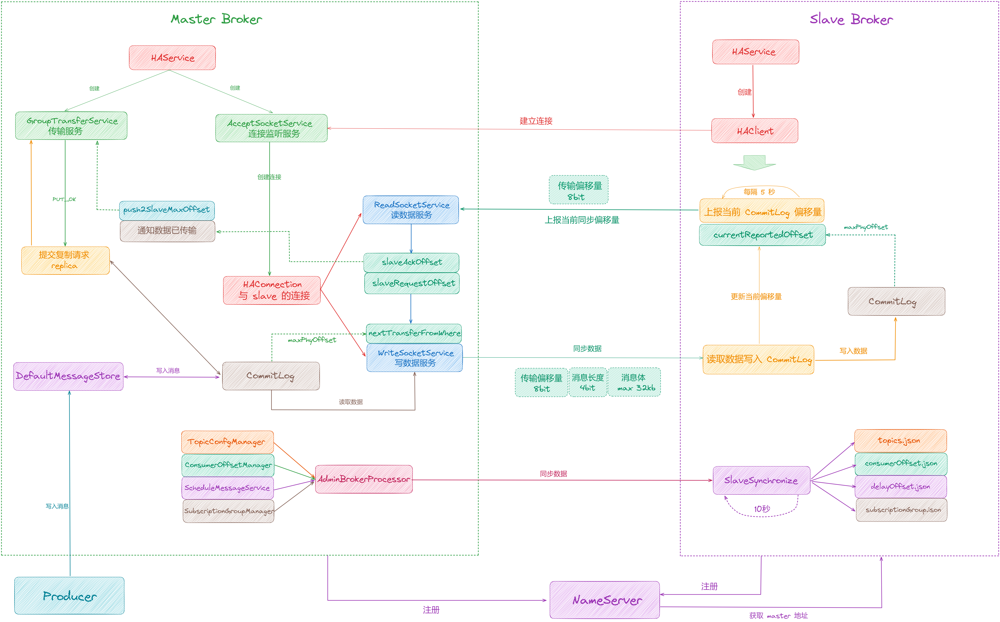

1.  首先 [Master Broker](http://master%20broker/) 和 [Slave Broker](http://slave%20broker/) 都会向 [NameServer](http://nameserver/) 注册，[slave](http://slave/) 节点会从 [NameServer](http://nameserver/) 得到这组 [Broker](http://broker/) 中 [master（brokerId=0）](http://master\(brokerid=0\)/) 的地址 [masterAddress](http://masteraddress/)。
2.  [master](http://master%20/) 节点如果未启用 [DLeger](http://dleger%20/) 技术，默认启用 [HAService](http://haservice%20/) 高可用机制，会创建一个 [HAService](http://haservice%20/) 组件。[HAService](http://haservice%20/) 通过 [AcceptSocketService](http://acceptsocketservice%20/) 来监听 [slave](http://slave%20/) 节点的连接请求。[slave](http://slave%20/) 节点启动时也会创建 [HAService](http://haservice%20/) 组件，然后通过 [HAClient](http://haclient%20/) 来连接 [master](http://master%20/) 节点。
3.  [master](http://master%20/) 中 [AcceptSocketService](http://acceptsocketservice%20/) 监听到连接请求后，会创建一个 [HAConnection](http://haconnection%20/) 来保持与 [slave](http://slave%20/) 之间的连接通道。然后 [HAConnection](http://haconnection%20/) 会创建 [ReadSocketService](http://readsocketservice%20/) 和 [WriteSocketService](http://writesocketservice%20/) 两个线程。
4.  连接到 [master](http://master%20/) 后，[slave](http://slave%20/) 节点先上报自己当前的偏移量 [currentReportedOffset](http://currentreportedoffset/)，之后同步数据后也会不断上报自己的当前偏移量。[ReadSocketService](http://readsocketservice%20/) 接收 [slave](http://slave%20/) 的请求，更新当前的偏移量 [slaveRequestOffset](http://slaverequestoffset/)。
5.  生产者向 [master](http://master%20/) 发生消息，通过 [DefaultMessageStore](http://defaultmessagestore%20/) 写入 [CommitLog](http://commitlog%20/) 中，写入完成后会提交一个 [replica](http://replica%20/) 请求到 [GroupTransferService](http://grouptransferservice%20/) 中，这一步其实就是在等数据同步到 [slave](http://slave%20/) 节点。
6.  [WriteSocketService](http://writesocketservice%20/) 线程则会根据当前 [slave](http://slave%20/) 同步的偏移量 [nextTransferFromWhere](http://nexttransferfromwhere/) ，从 [CommitLog](http://commitlog%20/) 读取数据发送到 [slave](http://slave%20/) 节点，[slave](http://slave%20/) 收到数据后再写入 [CommitLog](http://commitlog/)，之后再上报当前偏移量。
7.  [AcceptSocketService](http://acceptsocketservice%20/) 收到 [slave](http://slave%20/) 上报的偏移量之后，通知 [GroupTransferService](http://grouptransferservice%20/) 数据已经同步了，那么 [CommitLog](http://commitlog%20/) 提交的 [replica](http://replica/) 请求也就完成了。
8.  最后在 [Slave](http://slave%20/) 节点还会启用 [SlaveSynchronize](http://slavesynchronize%20/) 同步组件，每隔 10 秒调度一次，从 [master](http://master%20/) 拉取 [Topic](http://topic/) 元数据、延迟偏移量等数据同步到本地。

当有新消息写入之后的同步流程：

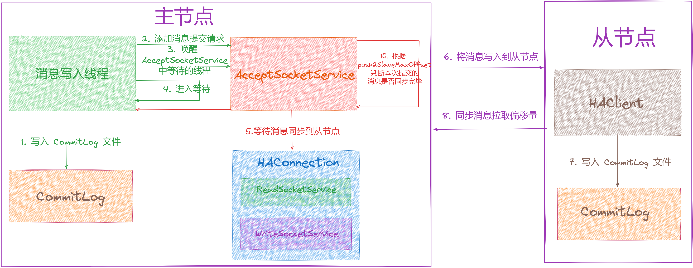