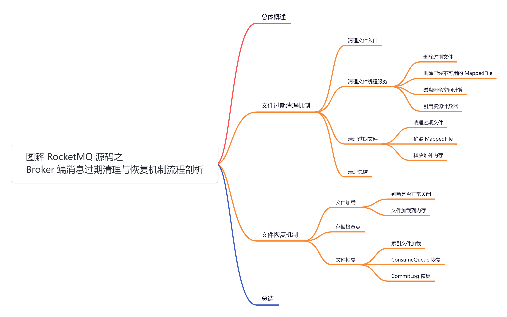
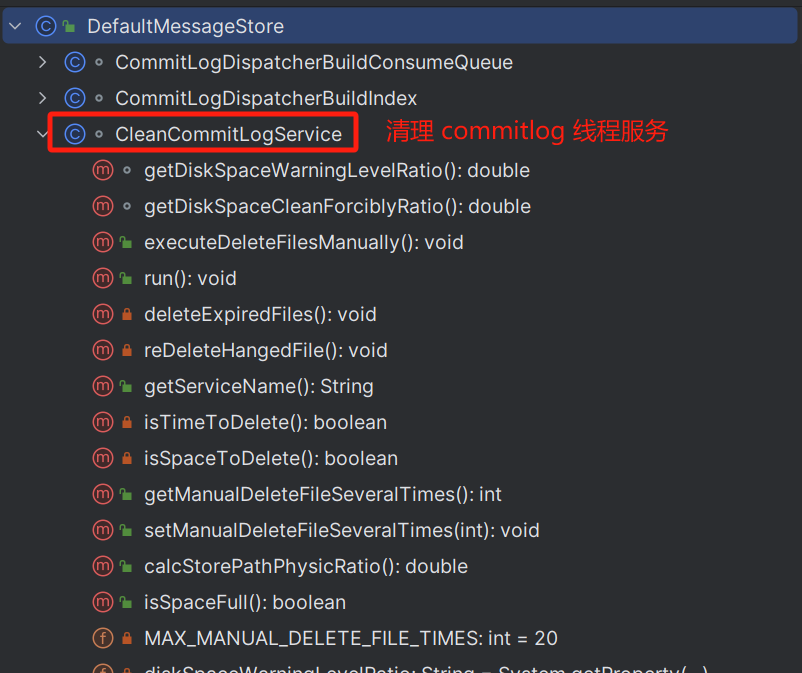
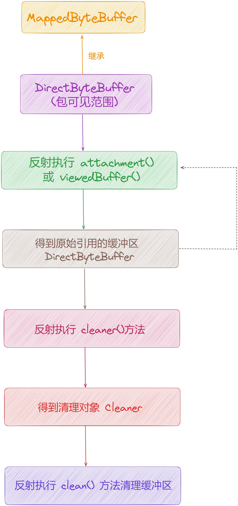
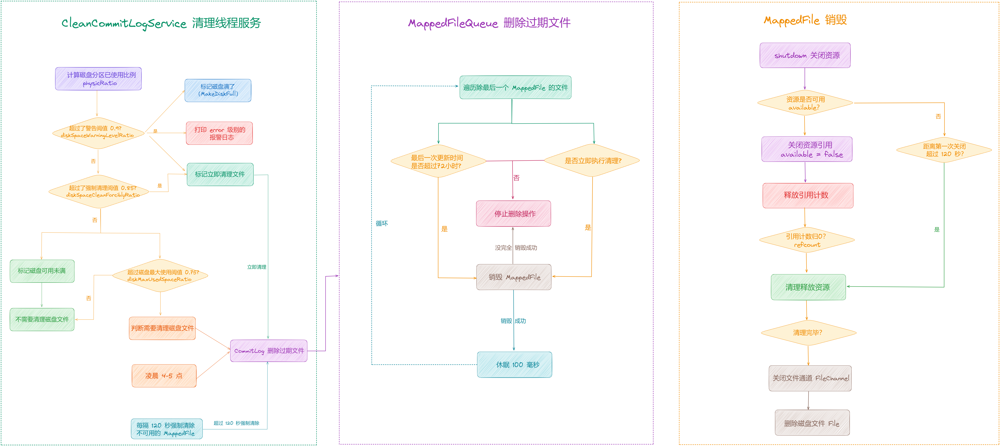
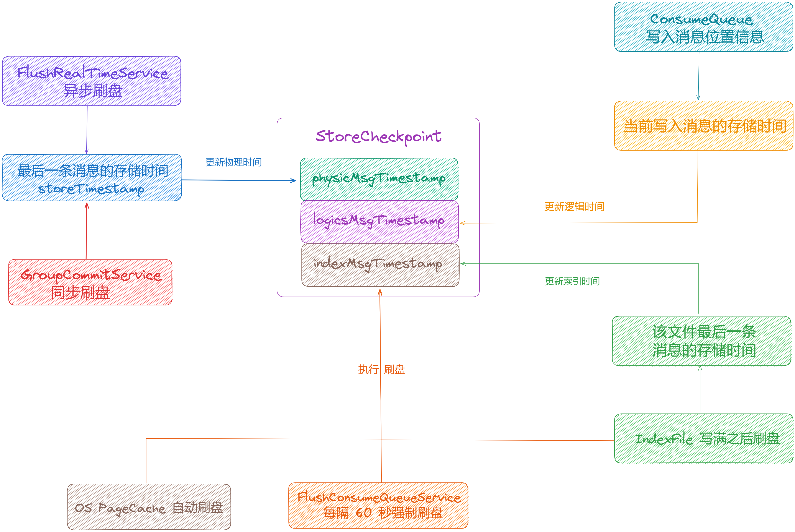
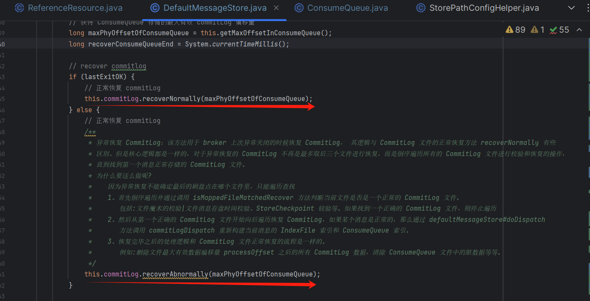

大家好，我是**华仔**, 又跟大家见面了。

从今天开始我将继续为大家奉上 RocketMQ 消费者源码剖析系列文章，正式开启「**RocketMQ 的服务端 Broker 源码之旅**」，这是第二十二篇，本篇我们将以「**RocketMQ 5.1.2**」版本为主，来剖析下 RocketMQ 源码之 Broker 端消息过期清理与恢复机制流程剖析。

这里我将以「**RocketMQ 5.1.2**」版本为主，通过「**场景驱动**」的方式带大家一点点的对 RocketMQ 源码进行深度剖析，正式开启「**RocketMQ 的源码之旅**」，跟我一起来掌握 RocketMQ 源码核心架构设计思想吧。

  

##   
**01 总体概述**

在前面几篇我们深度剖析了，[CommitLog](http://commitlog%20/) 日志文件与 [MappedFile](http://mappedfile%20/) 底层文件映射架构设计的方方面面。

[【Broker端源码分析系列第十八篇】图解 RocketMQ 源码之 Broker 端三大底层存储文件剖析](https://articles.zsxq.com/id_nwm33ku2srs5.html)

[【Broker端源码分析系列第十九篇】图解 RocketMQ 源码之 Broker 端CommitLog存储架构设计剖析](https://articles.zsxq.com/id_k1dlpc0wpe8p.html)

[【Broker端源码分析系列第二十篇】图解 RocketMQ 源码之Broker端MappedFile底层架构设计剖析](https://articles.zsxq.com/id_o1mnfdtpq25o.html)

今天我们就来看下 [CommitLog](http://commitlog%20/) 文件过期后是如何进行清理的，以及在存储服务启动时是如何进行恢复的？

带着这两个问题开始今天的内容。

## **02 文件过期清理机制**

当消息写入 [CommitLog](http://commitlog/) 文件，每个 [CommitLog](http://commitlog/) 文件默认 1GB 大小，文件数量会不断增加，很快就会占满系统磁盘，所以需要一个机制来清理过期的 [CommitLog](http://commitlog/) 文件。

在 [DefaultMessageStore](http://defaultmessagestore%20/) 中会启动一个后台的线程服务 [CleanCommitLogService](http://cleancommitlogservice%20/) 来清理过期的文件。

## **2.1 清理文件入口**

源码位置：[https://github.com/apache/rocketmq/blob/release-5.1.2/store/src/main/java/org/apache/rocketmq/store/](https://github.com/apache/rocketmq/blob/release-5.1.2/store/src/main/java/org/apache/rocketmq/store/DefaultMessageStore.java)[DefaultMessageStore](https://github.com/apache/rocketmq/blob/release-5.1.2/store/src/main/java/org/apache/rocketmq/store/DefaultMessageStore.java)[.java](https://github.com/apache/rocketmq/blob/release-5.1.2/store/src/main/java/org/apache/rocketmq/store/DefaultMessageStore.java)

Broker 在启动的时候会「**注册定时任务**」，「**定时清理过期文件数据**」，默认是「**每隔 10s**」执行一次，分别清理 [CommitLog](http://commitlog/) 文件和 [ConsumeQueue](http://consumequeue/) 文件：

public class DefaultMessageStore implements MessageStore {

// 清理 CommitLog 组件

private final CleanCommitLogService cleanCommitLogService;

// 清理 ConsumeQueue 文件组件

private final CleanConsumeQueueService cleanConsumeQueueService;

/\*\*

\* 启动 MessageStore

\* @throws Exception

\*/

@Override

public void start() throws Exception {

....

// 添加定时任务

this.addScheduleTask();

....

}

private void addScheduleTask() {

// 注册定时定理任务，默认 10s 执行一次

this.scheduledExecutorService.scheduleAtFixedRate(new AbstractBrokerRunnable(this.getBrokerIdentity()) {

@Override

public void run0() {

// 清理数据

DefaultMessageStore.this.cleanFilesPeriodically();

}

}, 1000 \* 60, this.messageStoreConfig.getCleanResourceInterval(), TimeUnit.MILLISECONDS);

....

}

private void cleanFilesPeriodically() {

// 启动 CommitLog 清理

this.cleanCommitLogService.run();

}

}

## **2.2 清理文件线程服务**

源码位置：[https://github.com/apache/rocketmq/blob/release-5.1.2/store/src/main/java/org/apache/rocketmq/store/](https://github.com/apache/rocketmq/blob/release-5.1.2/store/src/main/java/org/apache/rocketmq/store/DefaultMessageStore.java)[DefaultMessageStore](https://github.com/apache/rocketmq/blob/release-5.1.2/store/src/main/java/org/apache/rocketmq/store/DefaultMessageStore.java)[.java](https://github.com/apache/rocketmq/blob/release-5.1.2/store/src/main/java/org/apache/rocketmq/store/DefaultMessageStore.java)

[CleanCommitLogService](http://cleancommitlogservice%20/) 就是在「**执行清理过期文件**」的操作，总共两步：

1.  第一步是删除过期的文件。
2.  第二步是再次删除已经不可用的文件。

先来看下它的几个属性：

/\*\*

\* 文件清理线程

\*/

class CleanCommitLogService {

// 最大手动删除文件次数 20

private final static int MAX\_MANUAL\_DELETE\_FILE\_TIMES \= 20;

// 磁盘空间警告阈值比例，当磁盘空间占用比例达到 0.9 的时候警告

private final String diskSpaceWarningLevelRatio \=

System.getProperty("rocketmq.broker.diskSpaceWarningLevelRatio", "");

// 磁盘空间强制清理比例，当磁盘空间占用比例达到 0.85 的时候强制清理

private final String diskSpaceCleanForciblyRatio \=

System.getProperty("rocketmq.broker.diskSpaceCleanForciblyRatio", "");

// 上一次 Redelete 的时间

private long lastRedeleteTimestamp \= 0;

// 手动删除文件次数

private volatile int manualDeleteFileSeveralTimes \= 0;

// 是否立即执行清理

private volatile boolean cleanImmediately \= false;

// 强制清理失败次数

private int forceCleanFailedTimes \= 0;

double getDiskSpaceWarningLevelRatio() {

double finalDiskSpaceWarningLevelRatio;

if ("".equals(diskSpaceWarningLevelRatio)) {

finalDiskSpaceWarningLevelRatio = DefaultMessageStore.this.getMessageStoreConfig().getDiskSpaceWarningLevelRatio() / 100.0;

} else {

finalDiskSpaceWarningLevelRatio = Double.parseDouble(diskSpaceWarningLevelRatio);

}

// 获取磁盘空间警告阈值比例

if (finalDiskSpaceWarningLevelRatio > 0.90) {

finalDiskSpaceWarningLevelRatio = 0.90;

}

if (finalDiskSpaceWarningLevelRatio < 0.35) {

finalDiskSpaceWarningLevelRatio = 0.35;

}

return finalDiskSpaceWarningLevelRatio;

}

double getDiskSpaceCleanForciblyRatio() {

double finalDiskSpaceCleanForciblyRatio;

if ("".equals(diskSpaceCleanForciblyRatio)) {

finalDiskSpaceCleanForciblyRatio = DefaultMessageStore.this.getMessageStoreConfig().getDiskSpaceCleanForciblyRatio() / 100.0;

} else {

finalDiskSpaceCleanForciblyRatio = Double.parseDouble(diskSpaceCleanForciblyRatio);

}

// 获取磁盘空间强制清理比例

if (finalDiskSpaceCleanForciblyRatio > 0.85) {

finalDiskSpaceCleanForciblyRatio = 0.85;

}

if (finalDiskSpaceCleanForciblyRatio < 0.30) {

finalDiskSpaceCleanForciblyRatio = 0.30;

}

return finalDiskSpaceCleanForciblyRatio;

}

public void executeDeleteFilesManually() {

// 手动执行文件删除动作，并将手动删除文件次数设置为最大值，并记录日志

this.manualDeleteFileSeveralTimes = MAX\_MANUAL\_DELETE\_FILE\_TIMES;

DefaultMessageStore.LOGGER.info("executeDeleteFilesManually was invoked");

}

....

}

接着来看清理过期文件：

public void run() {

try {

// 删除过期的文件

this.deleteExpiredFiles();

// 删除已经不可用的文件

this.reDeleteHangedFile();

} catch (Throwable e) {

DefaultMessageStore.LOGGER.warn(this.getServiceName() + " service has exception. ", e);

}

}

### **2.2.1 删除过期文件**

private void deleteExpiredFiles() {

int deleteCount \= 0;

// 文件被删除前保留多少小时，默认 72小时

long fileReservedTime \= DefaultMessageStore.this.getMessageStoreConfig().getFileReservedTime();

// 删除磁盘中多个 commitlog 文件的间隔时间，100毫秒

int deletePhysicFilesInterval \= DefaultMessageStore.this.getMessageStoreConfig().getDeleteCommitLogFilesInterval();

// 强制销毁 MappedFile 的间隔时间，120秒

int destroyMappedFileIntervalForcibly \= DefaultMessageStore.this.getMessageStoreConfig().getDestroyMapedFileIntervalForcibly();

int deleteFileBatchMax \= DefaultMessageStore.this.getMessageStoreConfig().getDeleteFileBatchMax();

// 早晨 4-5 点删除文件

boolean isTimeUp \= this.isTimeToDelete();

// 空间快满了，要清理文件

boolean isUsageExceedsThreshold \= this.isSpaceToDelete();

// 是否手动删除

boolean isManualDelete \= this.manualDeleteFileSeveralTimes > 0;

if (isTimeUp || isUsageExceedsThreshold || isManualDelete) {

// 如果手动删除，则递减手动删除文件次数

if (isManualDelete) {

this.manualDeleteFileSeveralTimes--;

}

// 开启了强制清理文件，且要立即清理

boolean cleanAtOnce \= DefaultMessageStore.this.getMessageStoreConfig().isCleanFileForciblyEnable() && this.cleanImmediately;

LOGGER.info("begin to delete before {} hours file. isTimeUp: {} isUsageExceedsThreshold: {} manualDeleteFileSeveralTimes: {} cleanAtOnce: {} deleteFileBatchMax: {}",

fileReservedTime,

isTimeUp,

isUsageExceedsThreshold,

manualDeleteFileSeveralTimes,

cleanAtOnce,

deleteFileBatchMax);

// 转换成毫秒

fileReservedTime \*= 60 \* 60 \* 1000;

// 删除过期的文件

deleteCount = DefaultMessageStore.this.commitLog.deleteExpiredFile(fileReservedTime, deletePhysicFilesInterval,

destroyMappedFileIntervalForcibly, cleanAtOnce, deleteFileBatchMax);

// 如果删除成功

if (deleteCount > 0) {

// If in the controller mode, we should notify the AutoSwitchHaService to truncateEpochFile

if (DefaultMessageStore.this.brokerConfig.isEnableControllerMode()) {

if (DefaultMessageStore.this.haService instanceof AutoSwitchHAService) {

final long minPhyOffset \= getMinPhyOffset();

((AutoSwitchHAService) DefaultMessageStore.this.haService).truncateEpochFilePrefix(minPhyOffset - 1);

}

}

} else if (isUsageExceedsThreshold) {

LOGGER.warn("disk space will be full soon, but delete file failed.");

}

}

}

首先是「**删除过期文件的时机**」，如果当前时间是「**早晨 4-5点**」的时候，这个时候一般使用的人比较少，系统比较空闲，或者「**磁盘空间快满了**」，或者「**需要手动删除**」的时候才去删除过期文件。

调用 [CommitLog#deleteExpiredFile](http://commitlog/#deleteExpiredFile) 删除过期文件时，传入了 5 个参数：

1.  [fileReservedTime](http://filereservedtime/)：表示文件要保留 72 小时后才会删除。
2.  [deletePhysicFilesInterval](http://deletephysicfilesinterval/): 这个参数表示删除多个 [commitlog](http://commitlog%20/) 文件之间的间隔时间，默认是 [100](http://0.0.0.100/) 毫秒，增加间隔时间主要是避免磁盘 I/O 太频繁，影响程序 I/O 性能。
3.  [destroyMapedFileIntervalForcibly](http://destroymapedfileintervalforcibly/)：要强制销毁 [MappedFile](http://mappedfile%20/) 的间隔时间，默认是 [120](http://0.0.0.120/) 秒，这个参数是控制如果第一次 [MappedFile](http://mappedfile%20/) 因某些原因没有被清理，那么过了 [120](http://0.0.0.120/) 秒后就必须强制清理。
4.  [cleanAtOnce](http://cleanatonce/)：是否立即清理，默认是开启了强制清理文件的，在判断磁盘剩余空间比例时，如果超过阈值后，就会要求立即清理 [cleanImmediately=true](http://cleanimmediately=true/)，这个时候就不会管是否满足间隔时间 [fileReservedTime](http://filereservedtime%20/) 了。

### **2.2.2 删除已经不可用的 MappedFile**

/\*\*

\* 删除不可用的 MappedFile

\*/

private void reDeleteHangedFile() {

// 每隔 120 秒

int interval \= DefaultMessageStore.this.getMessageStoreConfig().getRedeleteHangedFileInterval();

// 获取当前时间戳

long currentTimestamp \= System.currentTimeMillis();

// 如果距离上次重新删除文件的时间超过了设定的时间间隔

if ((currentTimestamp - this.lastRedeleteTimestamp) > interval) {

this.lastRedeleteTimestamp = currentTimestamp;

// 强制销毁 MappedFile 的间隔时间，120秒

int destroyMappedFileIntervalForcibly \=

DefaultMessageStore.this.getMessageStoreConfig().getDestroyMapedFileIntervalForcibly();

// 尝试删除第一个不可用的文件

if (DefaultMessageStore.this.commitLog.retryDeleteFirstFile(destroyMappedFileIntervalForcibly)) {

}

}

}

### **2.2.3 磁盘剩余空间计算**

随着消息不断写入 [CommitLog](http://commitlog%20/) 文件，[CommitLog](http://commitlog/) 文件数量会不断增长，如果没有及时清理，用不了多久就会把磁盘打满，导致程序直接不可用，这就是非常严重的生产事故了。

那 RocketMQ 是「**如何避免磁盘被打满**」的情况出现呢？

### **2.2.3.1 磁盘文件清理时机**

首先，该线程类定义了几个磁盘使用比例：

1.  [diskMaxUsedSpaceRatio](http://diskmaxusedspaceratio/)：磁盘最大使用比例，默认 0.75。
2.  [diskSpaceWarningLevelRatio](http://diskspacewarninglevelratio/)：磁盘空间使用比例达到 0.9 的时候警告。
3.  [diskSpaceCleanForciblyRatio](http://diskspacecleanforciblyratio/)：磁盘空间使用比例达到 0.85 的时候强制清理。

/\*\*

\* 空间快满了，要清理文件

\* @return

\*/

private boolean isSpaceToDelete() {

// 是否需要立即清理磁盘

cleanImmediately = false;

// CommitLog 存储路径

String commitLogStorePath \= DefaultMessageStore.this.getMessageStoreConfig().getStorePathCommitLog();

// 如果是多个路径

String\[\] storePaths = commitLogStorePath.trim().split(MixAll.MULTI\_PATH\_SPLITTER);

// 快满了的分区路径

Set<String> fullStorePath = new HashSet<>();

// 最小的分区使用比例

double minPhysicRatio \= 100;

// 最小的分区存储路径

String minStorePath \= null;

// 遍历每个存储路径

for (String storePathPhysic : storePaths) {

// 计算磁盘分区使用比例，不同路径可能分区不同

double physicRatio \= UtilAll.getDiskPartitionSpaceUsedPercent(storePathPhysic);

// 如果最小分区使用比例已经大于默认的分区使用比例设置最小分区使用比例和最小存储路径

if (minPhysicRatio > physicRatio) {

minPhysicRatio = physicRatio;

minStorePath = storePathPhysic;

}

// 如果使用比例大于强制清理的阈值，0.85，则将存储路径加入到快满了的分区路径，方便清理

if (physicRatio > getDiskSpaceCleanForciblyRatio()) {

fullStorePath.add(storePathPhysic);

}

}

// 将 fullStorePath 设置到 CommitLog 属性中

DefaultMessageStore.this.commitLog.setFullStorePaths(fullStorePath);

// 磁盘使用比例 大于 告警阈值 0.9

if (minPhysicRatio > getDiskSpaceWarningLevelRatio()) {

// 表示磁盘已经满了，就不能再继续写入消息了

boolean diskFull \= DefaultMessageStore.this.runningFlags.getAndMakeDiskFull();

if (diskFull) {

DefaultMessageStore.LOGGER.error("physic disk maybe full soon " + minPhysicRatio +

", so mark disk full, storePathPhysic=" + minStorePath);

}

// 需要立即清理文件

cleanImmediately = true;

return true;

// 磁盘使用比例 大于 强制清理的阈值，0.85，需要立即清理文件

} else if (minPhysicRatio > getDiskSpaceCleanForciblyRatio()) {

cleanImmediately = true;

return true;

} else {

// 磁盘可用

boolean diskOK \= DefaultMessageStore.this.runningFlags.getAndMakeDiskOK();

if (!diskOK) {

DefaultMessageStore.LOGGER.info("physic disk space OK " + minPhysicRatio +

", so mark disk ok, storePathPhysic=" + minStorePath);

}

}

// 获取逻辑文件存储目录的路径

String storePathLogics \= StorePathConfigHelper

.getStorePathConsumeQueue(DefaultMessageStore.this.getMessageStoreConfig().getStorePathRootDir());

// 获取逻辑文件存储目录的磁盘空间使用比例

double logicsRatio \= UtilAll.getDiskPartitionSpaceUsedPercent(storePathLogics);

// 如果逻辑文件存储目录的磁盘空间使用比例超过警告级别阈值 0.9

if (logicsRatio > getDiskSpaceWarningLevelRatio()) {

// 标记磁盘为即将满状态

boolean diskOK \= DefaultMessageStore.this.runningFlags.getAndMakeDiskFull();

if (diskOK) {

DefaultMessageStore.LOGGER.error("logics disk maybe full soon " + logicsRatio + ", so mark disk full");

}

// 需要立即清理文件

cleanImmediately = true;

return true;

// 如果逻辑文件存储目录的磁盘空间使用比例超过强制清理阈值 0.85，需要立即清理文件

} else if (logicsRatio > getDiskSpaceCleanForciblyRatio()) {

cleanImmediately = true;

return true;

} else {

// 磁盘可用

boolean diskOK \= DefaultMessageStore.this.runningFlags.getAndMakeDiskOK();

if (!diskOK) {

DefaultMessageStore.LOGGER.info("logics disk space OK " + logicsRatio + ", so mark disk ok");

}

}

// 获取磁盘最大使用比例

double ratio \= DefaultMessageStore.this.getMessageStoreConfig().getDiskMaxUsedSpaceRatio() / 100.0;

// 获取每个磁盘分区的副本数量

int replicasPerPartition \= DefaultMessageStore.this.getMessageStoreConfig().getReplicasPerDiskPartition();

// Only one commitLog in node

// 如果只有一个提交日志 (commitLog) 节点

if (replicasPerPartition <= 1) {

// 如果最小物理比例小于 0 或者大于比例阈值

if (minPhysicRatio < 0 || minPhysicRatio > ratio) {

// 记录日志：提交日志磁盘可能即将满，需要回收空间

DefaultMessageStore.LOGGER.info("commitLog disk maybe full soon, so reclaim space, " + minPhysicRatio);

return true;

}

// 如果逻辑磁盘空间小于 0 或者大于比例阈值

if (logicsRatio < 0 || logicsRatio > ratio) {

// 记录日志：消费队列磁盘可能即将满，需要回收空间

DefaultMessageStore.LOGGER.info("consumeQueue disk maybe full soon, so reclaim space, " + logicsRatio);

return true;

}

return false;

} else {

// 如果有多个提交日志节点

// 获取主要文件大小

long majorFileSize \= DefaultMessageStore.this.getMajorFileSize();

// 获取逻辑分区总空间

long partitionLogicalSize \= UtilAll.getDiskPartitionTotalSpace(minStorePath) / replicasPerPartition;

double logicalRatio \= 1.0 \* majorFileSize / partitionLogicalSize;

// 如果逻辑比率大于逻辑磁盘空间强制清理阈值

if (logicalRatio > DefaultMessageStore.this.getMessageStoreConfig().getLogicalDiskSpaceCleanForciblyThreshold()) {

// if logical ratio exceeds 0.80, then clean immediately

DefaultMessageStore.LOGGER.info("Logical disk usage {} exceeds logical disk space clean forcibly threshold {}, forcibly: {}",

logicalRatio, minPhysicRatio, cleanImmediately);

// 设置立即清理标志，并返回需要立即清理的结果

cleanImmediately = true;

return true;

}

// 判断逻辑比率是否超过比例阈值

boolean isUsageExceedsThreshold \= logicalRatio > ratio;

if (isUsageExceedsThreshold) {

DefaultMessageStore.LOGGER.info("Logical disk usage {} exceeds clean threshold {}, forcibly: {}",

logicalRatio, ratio, cleanImmediately);

}

return isUsageExceedsThreshold;

}

}

该方法用来判断磁盘是否满了需要清理，大体步骤如下：

1.  首先它会遍历 [CommitLog](http://commitlog%20/) 的存储路径，[CommitLog](http://commitlog/) 支持存储在多个路径下，不同的路径可能在不同的磁盘分区，所以要分别检查每个路径下的磁盘使用情况。
2.  接着它会计算每个路径下的磁盘分区已使用空间的比例，然后取最小的一个使用比例 [minPhysicRatio](http://minphysicratio/)，如果最小使用比例超过 85%，说明这个路径下的 [CommitLog](http://commitlog/) 需要强制清理。
3.  如果最小的一个分区使用比例都大于了警告阈值，也就是 90%，这时就会直接标记磁盘满了 [makeDiskFull](http://makediskfull/)，[CommitLog](http://commitlog/) 就不能继续写入消息了。然后打印一个磁盘快满了的错误日志，并标记立即执行清理[cleanImmediately](http://cleanimmediately/)。如果 [minPhysicRatio](http://minphysicratio%20/) 只是大于强制清理阈值 85%，就标记立即执行清理（[cleanImmediately](http://cleanimmediately/)。如果并没有超过阈值，比如已经清理了一些文件后，磁盘有足够的空间，这时就会标记磁盘可用 [makeDiskOK](http://makediskok/)。
4.  而磁盘使用比例超过 75%，就会返回 true，表示空间快不够了，可以去删一些文件了。
5.  同理会继续判断 [consumequeue](http://consumequeue%20/) 文件的使用情况进行清理。

所以该方法主要就是判断 [CommitLog](http://commitlog/) 文件所在磁盘分区，已使用的磁盘空间比例是否超过某些阈值，然后做相应的标记处理。

1.  使用比例超过 90% 直接标记磁盘不可以，要立即清理。
2.  超过 85% 要立即清理，磁盘还是可用的。
3.  超过 75% 可以开始清理文件，但不一定立即清理。

### **2.2.3.2 磁盘使用比例计算**

源码位置：[https://github.com/apache/rocketmq/blob/release-5.1.2/store/src/main/java/org/apache/rocketmq/](https://github.com/apache/rocketmq/blob/release-5.1.2/store/src/main/java/org/apache/rocketmq/common/UtilAll.java)[common/UtilAll.](https://github.com/apache/rocketmq/blob/release-5.1.2/store/src/main/java/org/apache/rocketmq/common/UtilAll.java)[java](https://github.com/apache/rocketmq/blob/release-5.1.2/store/src/main/java/org/apache/rocketmq/common/UtilAll.java)

/\*\*

\* 获取指定路径的磁盘空间使用百分比

\* @param path

\* @return

\*/

public static double getDiskPartitionSpaceUsedPercent(final String path) {

if (null == path || path.isEmpty()) {

// 如果路径为空，记录错误日志并返回-1

STORE\_LOG.error("Error when measuring disk space usage,path is null or empty,path :{}",path);

return -1;

}

try {

// 根据路径创建文件对象

File file \= new File(path);

if (!file.exists()) {

// 如果文件不存在，记录错误日志并返回-1

STORE\_LOG.error("Error when measuring disk space usage,file doesn't exist on this path:{}",path);

return -1;

}

// 获取文件系统的总空间大小

long totalSpace \= file.getTotalSpace();

if (totalSpace > 0) {

// 获取文件系统的已使用空间

// 总大小 - 剩余空间大小 = 已使用空间大小

long usedSpace \= totalSpace - file.getFreeSpace();

// 获取文件系统的可用空间大小

long usableSpace \= file.getUsableSpace();

// 整个可使用的空间

long entireSpace \= usedSpace + usableSpace;

// 计算已使用空间占整个空间的百分比

long roundNum \= 0;

if (usedSpace \* 100 % entireSpace != 0) {

roundNum = 1;

}

// 计算已使用比例

long result \= usedSpace \* 100 / entireSpace + roundNum;

// 将百分比转换为小数并返回

return result / 100.0;

}

} catch (Exception e) {

// 捕获异常，记录错误日志并返回-1

STORE\_LOG.error("Error when measuring disk space usage,got exception::",e);

return -1;

}

// 返回-1，表示获取磁盘空间使用百分比出现错误

return -1;

}

接着来看下「**计算磁盘使用比例**」的方法，可以看到就是通过 File 的几个方法计算出来的，我们要明确这几个方法的差别：

1.  [getTotalSpace()](http://gettotalspace\(\)/)：返回文件系统上分区的总大小，表示文件系统的总容量 [totalSpace](http://totalspace/)。
2.  [getFreeSpace()](http://getfreespace\(\)/)：返回文件系统的剩余空间大小，表示文件系统当前可用的剩余容量 [freeSpace](http://freespace/)。
3.  [getUsableSpace()](http://getusablespace\(\)/)：返回文件系统中可用的空间大小，考虑了当前用户的权限限制，表示当前用户可以自由使用的剩余容量 [usableSpace](http://usablespace/)。

计算步骤如下：

1.  首先计算已使用的空间 [usedSpace = totalSpace - freeSpace](http://usedspace%20=%20totalspace%20-%20freespace/)，因为 [freeSpace](http://freespace%20/) 受用户权限限制可能并不准确，但通过 [totalSpace - freeSpace](http://%20totalspace%20-%20freespace/) 计算出已使用的空间是准确的。
2.  然后计算分区整个可使用的空间 [entireSpace = usedSpace + usableSpace](http://entirespace%20=%20usedspace%20+%20usablespace/)，已使用的空间再加上用户确实可以自由使用的空间就能表述出用户使用的整个空间大小。
3.  最后计算磁盘分区使用比例 [physicRatio = usedSpace \* 100 / entireSpace / 100.0](http://physicratio%20=%20usedspace%20%2A%20100%20/%20entireSpace%20/%20100.0)。

### **2.2.4 引用资源计数器**

在对 [MappedFile](http://mappedfile%20/) 的资源清理前，先来了解下引用资源类 [ReferenceResource](http://referenceresource%20/) 的设计，在前面剖析过这里再来重温下，[MappedFile](http://mappedfile%20/) 继承自 [ReferenceResource](http://referenceresource/)，[MappedFile](http://mappedfile%20/) 就是通过它来管理资源引用，判断是否可以被销毁。

[ReferenceResource](http://referenceresource%20/) 提供了 [hold()](http://hold\(\)/) 方法来持有一个引用计数；然后提供了 [release()](http://release\(\)/) 方法来释放一个引用计数，当释放后没有资源引用时，就会调用 [cleanup()](http://cleanup\(\)/) 清理资源，这个是由子类 [DefaultMappedFile](http://defaultmappedfile%20/) 来实现的。

然后提供了 [shutdown()](http://shutdown\(\)/) 方法来关闭资源，[shutdown()](http://shutdown\(\)/) 会先将可用标识 [available](http://available%20/) 设置为 false，表示资源不可用了，并记录了第一次调用 [shutdown()](http://shutdown\(\)/) 的时间。然后调用 [release()](http://release\(\)/) 释放当前资源，但此时可能还有其它地方引用了资源，可能不会立即清理资源 [cleanup()](http://cleanup\(\)/)。所以没有释放的资源，后面可以多次调用 [shutdown()](http://shutdown\(\)/)，如果距离第一次关闭的时间超过了一个阈值，就会直接强制释放和清理资源。

/\*\*

\* 引用资源计数器

\*/

public abstract class ReferenceResource {

// refCount 对象引用数量，其初始值为 1，创建时就被引用了，直到销毁

// 当 refCount <=0 时表示该资源可以释放了，没有任何其它程序依赖它了

protected final AtomicLong refCount \= new AtomicLong(1);

// 是否可用标记， 默认值 true

// 当 available = false 时，表示资源处于非存活状态，不可用

protected volatile boolean available \= true;

// 是否已经清理，默认值 false

// 当执行完子类对象的 cleanUp() 后，该值会设置为 true 表示资源已经全部释放了

protected volatile boolean cleanupOver \= false;

// 第一次尝试关闭资源的时间

private volatile long firstShutdownTimestamp \= 0;

/\*\*

\* 挂起资源，增加引用计数方法 refCount+1

\* @return true 增加成功 false 增加失败

\*/

public synchronized boolean hold() {

if (this.isAvailable()) {

if (this.refCount.getAndIncrement() > 0) {

return true;

} else {

this.refCount.getAndDecrement();

}

}

return false;

}

// 判断资源是否可用

public boolean isAvailable() {

return this.available;

}

/\*\*

\* 关闭资源 ，设置为不可用，然后释放资源

\* @param intervalForcibly 强制关闭资源的时间间隔

\*/

public void shutdown(final long intervalForcibly) {

if (this.available) {

// 资源不存活

this.available = false;

// 初次关闭资源时的系统时间

this.firstShutdownTimestamp = System.currentTimeMillis();

// 释放资源，引用计数 -1，此时资源有可能释放了，也有可能没释放（可能存在引用的地方，就不会立即释放）

this.release();

// 执行到这 说明第一次关闭资源时，并没有释放完资源

} else if (this.getRefCount() > 0) {

// 距离上一次关闭的时间超过了强制关闭的间隔时间，就强制关闭

if ((System.currentTimeMillis() - this.firstShutdownTimestamp) >= intervalForcibly) {

// 强制设置 引用计数为 负数

this.refCount.set(-1000 - this.getRefCount());

// 此时一定会释放资源

this.release();

}

}

}

// 释放资源，减少引用计数 refCount-1，引用计数降为0之后，清理资源

public void release() {

// 引用技术递减

long value \= this.refCount.decrementAndGet();

if (value > 0)

return;

// 执行到这说明当前资源已经没有任何程序占用了，可以调用 cleanUp 释放真正的资源了

synchronized (this) {

this.cleanupOver = this.cleanup(value);

}

}

// 获取引用计数

public long getRefCount() {

return this.refCount.get();

}

// 清理资源，子类实现 cleanup 方法

public abstract boolean cleanup(final long currentRef);

// 是否清理完毕：引用计数降为0 + 清理完毕标识

public boolean isCleanupOver() {

return this.refCount.get() <= 0 && this.cleanupOver;

}

}

## **2.3 清理过期文件**

### **2.3.1 清理过期文件**

源码位置：[https://github.com/apache/rocketmq/blob/release-5.1.2/store/src/main/java/org/apache/rocketmq/store/](https://github.com/apache/rocketmq/blob/release-5.1.2/store/src/main/java/org/apache/rocketmq/store/MappedFileQueue.java)[MappedFileQueue](https://github.com/apache/rocketmq/blob/release-5.1.2/store/src/main/java/org/apache/rocketmq/store/MappedFileQueue.java)[.java](https://github.com/apache/rocketmq/blob/release-5.1.2/store/src/main/java/org/apache/rocketmq/store/MappedFileQueue.java)

[CommitLog](http://commitlog%20/) 删除过期文件，就是调用 [MappedFileQueue#deleteExpiredFileByTime](http://mappedfilequeue/#deleteExpiredFileByTime) 删除过期的 [MappedFile](http://mappedfile/)。

/\*\*

\* MappedFileQueue 类方法

\* 根据文件存活时长删除过期文件

\* @param expiredTime 过期时间

\* @param deleteFilesInterval 删除两个文件之间的时间间隔

\* @param intervalForcibly 强制关闭资源的时间间隔 mf.destory 传递的参数

\* @param cleanImmediately 如果为 true 强制删除,不考虑过期时间这个条件

\* @param deleteFileBatchMax 最大删除批次

\* @return

\*/

public int deleteExpiredFileByTime(final long expiredTime,

final int deleteFilesInterval,

final long intervalForcibly,

final boolean cleanImmediately,

final int deleteFileBatchMax) {

// 获取 mfs 数组，实际上就是将 MappedFile 集合转换成数组

Object\[\] mfs = this.copyMappedFiles(0);

if (null == mfs)

return 0;

// 至少保留最后一个 MappedFile

// \*\*\*\* 这里减 -1是保证当前正在顺序写的 MappedFile 不被删除 \*\*\*\*

int mfsLength \= mfs.length - 1;

// 记录删除的文件数

int deleteCount \= 0;

// 被删除的文件集合

List<MappedFile> files = new ArrayList<>();

int skipFileNum \= 0;

if (null != mfs) {

//do check before deleting

// 删除之前，先校验确保提交日志文件的完整性和一致性

checkSelf();

// // 遍历每一个 MappedFile 进行删除

for (int i \= 0; i < mfsLength; i++) {

MappedFile mappedFile \= (MappedFile) mfs\[i\];

// 计算出当前文件的存活时间截止点 即:上一次修改时间 + 过期时长

long liveMaxTimestamp \= mappedFile.getLastModifiedTimestamp() + expiredTime;

// 条件成立:

// 条件一： 文件存活时间达到上限

// 条件二： disk占用率达到上限会强制删除

if (System.currentTimeMillis() >= liveMaxTimestamp || cleanImmediately) {

if (skipFileNum > 0) {

log.info("Delete CommitLog {} but skip {} files", mappedFile.getFileName(), skipFileNum);

}

// 调用 mappedFile#destroy 删除文件

if (mappedFile.destroy(intervalForcibly)) {

// 添加待删除的 mappedFile 到被删除的文件集合中

files.add(mappedFile);

// 增加删除文件计数

deleteCount++;

// 一次最多清理10个，当超过最大删除批次直接 break 退出

if (files.size() >= deleteFileBatchMax) {

break;

}

// 清理间隔时间

if (deleteFilesInterval > 0 && (i + 1) < mfsLength) {

try {

// 在删除完文件后需要 sleep，然后再去删除下一个文件

Thread.sleep(deleteFilesInterval);

} catch (InterruptedException e) {

}

}

} else {

// 并没有销毁成功

break;

}

} else {

skipFileNum++;

//avoid deleting files in the middle

// 前面的文件没过期，后面的文件就不必判断了

break;

}

}

}

// 将满足删除条件的 mf 文件 从 mappedFiles 内删除

deleteExpiredFile(files);

// 返回已删除的文件数

return deleteCount;

}

// DefaultMappedFile 类方法

@Override

public long getLastModifiedTimestamp() {

return this.file.lastModified();

}

大体步骤如下：

1.  [MappedFileQueue](http://mappedfilequeue%20/) 在删除过期的 [MappedFile](http://mappedfile%20/) 时，会保留最后一个 [MappedFile](http://mappedfile%20/) 不动。
2.  然后依次遍历 [MappedFile](http://mappedfile/)，判断距离 [MappedFile](http://mappedfile%20/) 最后一次更新时间是否超过了 72 小时，或者是要求立即清理文件释放磁盘空间的时候，这时就会去销毁 MappedFile。
3.  如果 [MappedFile](http://mappedfile%20/) 没有过期，或者 [MappedFile](http://mappedfile%20/) 被其它地方引用了，则销毁不成功，就不会继续处理后面的 [MappedFile](http://mappedfile/) 了，因为前面的 [MappedFile](http://mappedfile/) 都达不到清理的条件，那后面的更不用说了。
4.  如果销毁成功，会限制一次最多销毁 10 个 [MappedFile](http://mappedfile/)，主要是为了避免一次性删除文件过多，导致磁盘I/O 过高机器负载增加。然后每个 [MappedFile](http://mappedfile/) 清理的间隔是 100 毫秒，同样也是避免避免频繁的删除文件。
5.  最后移除 [MappedFileQueue](http://mappedfilequeue%20/) 中 [mappedFiles](http://mappedfiles%20/) 列表中的已销毁的文件。

### **2.3.2 销毁 MappedFile**

/\*\*

\* 销毁 MappedFile

\* @param intervalForcibly If {@code true} then this method will destroy the file forcibly and ignore the reference

\* @return

\*/

@Override

public boolean destroy(final long intervalForcibly) {

// 引用资源关闭和释放，MappedFile 清理

this.shutdown(intervalForcibly);

// 引用计数降为 0

if (this.isCleanupOver()) {

try {

// 获取最后更新时间

long lastModified \= getLastModifiedTimestamp();

// 关闭 MappedFile 绑定的文件通道

this.fileChannel.close();

log.info("close file channel " + this.fileName + " OK");

// 获取开始时间

long beginTime \= System.currentTimeMillis();

// 删除文件

boolean result \= this.file.delete();

// 记录删除日志

log.info("delete file\[REF:" + this.getRefCount() + "\] " + this.fileName

\+ (result ? " OK, " : " Failed, ") + "W:" + this.getWrotePosition() + " M:"

\+ this.getFlushedPosition() + ", "

\+ UtilAll.computeElapsedTimeMilliseconds(beginTime)

\+ "," + (System.currentTimeMillis() - lastModified));

} catch (Exception e) {

log.warn("close file channel " + this.fileName + " Failed. ", e);

}

return true;

} else {

log.warn("destroy mapped file\[REF:" + this.getRefCount() + "\] " + this.fileName

\+ " Failed. cleanupOver: " + this.cleanupOver);

}

return false;

}

我们来看下 [MappedFile](http://mappedfile%20/) 是「**如何被销毁的**」，前面知道 [MappedFile](http://mappedfile%20/) 继承自 [ReferenceResource](http://referenceresource/)，[MappedFile](http://mappedfile%20/) 在任何使用的地方都会先通过 [hold()](http://hold\(\)/) 持有一个「**引用计数**」，使用完了之后就会调用 [release()](http://release\(\)/) 释放引用计数。销毁的时候则是先调用 [shutdown()](http://shutdown\(\)/) 来「**关闭**」和「**释放**」资源，如果完全释放成功并执行了 [cleanup()](http://cleanup\(\)%20/) 就会关闭文件通道 [FileChannel](http://filechannel/)，以及「**删除磁盘文件**」。

接着来看 [MappedFile](http://mappedfile%20/) 资源清理的实现，核心就是在清理内存映射缓冲区 [MappedByteBuffer](http://mappedbytebuffer%20/) 的资源占用。

@Override

public boolean cleanup(final long currentRef) {

// 资源可用，不能清理

if (this.isAvailable()) {

log.error("this file\[REF:" + currentRef + "\] " + this.fileName

\+ " have not shutdown, stop unmapping.");

return false;

}

// 已经清理完毕

if (this.isCleanupOver()) {

log.error("this file\[REF:" + currentRef + "\] " + this.fileName

\+ " have cleanup, do not do it again.");

return true;

}

// 清理 MappedByteBuffer 内存映射区

UtilAll.cleanBuffer(this.mappedByteBuffer);

UtilAll.cleanBuffer(this.mappedByteBufferWaitToClean);

this.mappedByteBufferWaitToClean = null;

// MappedFile 占用的总内存扣减

TOTAL\_MAPPED\_VIRTUAL\_MEMORY.addAndGet(this.fileSize \* (-1));

// 数量扣减

TOTAL\_MAPPED\_FILES.decrementAndGet();

log.info("unmap file\[REF:" + currentRef + "\] " + this.fileName + " OK");

return true;

}

### **2.3.3 释放堆外内存**

/\*\*

\* 释放堆外内存

\* @param buffer

\*/

public static void cleanBuffer(final ByteBuffer buffer) {

// 必须是堆外内存才会去清理

if (buffer == null || !buffer.isDirect() || buffer.capacity() == 0) {

return;

}

if (SystemUtils.isJavaVersionAtLeast(JavaVersion.JAVA\_9)) {

try {

Field field \= Unsafe.class.getDeclaredField("theUnsafe");

field.setAccessible(true);

Unsafe unsafe \= (Unsafe) field.get(null);

Method cleaner \= method(unsafe, "invokeCleaner", new Class\[\] {ByteBuffer.class});

cleaner.invoke(unsafe, viewed(buffer));

} catch (Exception e) {

throw new IllegalStateException(e);

}

} else {

// 先得到视图buffer，再反射执行 cleaner 方法，再反射执行 clean 方法.

// DirectByteBuffer -> cleaner（Cleaner） -> clean

invoke(invoke(viewed(buffer), "cleaner"), "clean");

}

}

/\*\*

\* 对内存映射区域去获取一个视图

\* @param buffer

\* @return

\*/

private static ByteBuffer viewed(ByteBuffer buffer) {

if (!buffer.isDirect()) {

throw new IllegalArgumentException("buffer is non-direct");

}

// 通过反射执行，attachment/viewedBuffer

ByteBuffer viewedBuffer \= (ByteBuffer) ((DirectBuffer) buffer).attachment();

if (viewedBuffer == null) {

// 说明获取到最里面的一层了

return buffer;

} else {

// 继续往底层找

return viewed(viewedBuffer);

}

}

/\*\*

\* 反射执行 Method

\* @param target

\* @param methodName

\* @param args

\* @return

\*/

public static Object invoke(final Object target, final String methodName, final Class<?>... args) {

return AccessController.doPrivileged(new PrivilegedAction<Object>() {

@Override

public Object run() {

try {

Method method \= method(target, methodName, args);

method.setAccessible(true);

return method.invoke(target);

} catch (Exception e) {

throw new IllegalStateException(e);

}

}

});

}

// 反射获取方法 Method

public static Method method(Object target, String methodName, Class<?>\[\] args) throws NoSuchMethodException {

try {

return target.getClass().getMethod(methodName, args);

} catch (NoSuchMethodException e) {

return target.getClass().getDeclaredMethod(methodName, args);

}

}

最后来看下「**内存缓冲映射区**」是如何清理回收的，因为内存映射缓冲区 [MappedByteBuffer](http://mappedbytebuffer%20/) 是使用的「**堆外内存**」[DirectByteBuffer](http://directbytebuffer/)，而 [DirectByteBuffer](http://directbytebuffer%20/) 是包可见范围，而 [ByteBuffer](http://bytebuffer%20/) 还可以一层套一层拿到视图，所以外部没法直接释放缓冲区，必须释放「**最原始的缓冲映射区**」，所以它这里是通过反射一层一层的去执行释放操作。

可以看到清理逻辑 [invoke(invoke(viewed(buffer), "cleaner"), "clean")](http://invoke\(invoke\(viewed\(buffer\),%20"cleaner"\),%20"clean"\)/) 嵌套了很多层才清理了「**堆外内存**」。

1.  首先通过反射从 [MappedByteBuffer](http://mappedbytebuffer%20/) 找到名为 [attachment](http://attachment%20/) 或者 [viewedBuffer](http://viewedbuffer%20/) 的方法，执行反射获取到它引用的缓冲区，会一直循环直到拿到最底层的那个原始缓冲区。
2.  拿到原始缓冲区后，再通过反射调用缓冲区的 [cleaner](http://cleaner%20/) 方法得到 [Cleaner](http://cleaner%20/) 对象。
3.  最后再反射调用 [Cleaner](http://cleaner%20/) 的 [clean](http://clean%20/) 方法才清理完成。

  

## **2.4 清理总结**

一个 [CommitLog](http://commitlog%20/) 文件就是1GB，随着消息的写入，[CommitLog](http://commitlog/) 文件会越来越多，不可能让它无限增加下去，否则会将磁盘打满，导致程序不可用。所以在必要的时候必须清理掉已经不需要的文件，我们来总结下 [RocketMQ](http://rocketmq/) 对过期文件的清理机制，如下图：

RocketMQ 会启动一个后台线程服务 [CleanCommitLogService](http://cleancommitlogservice%20/) 去删除过期的文件，它主要是分两个时间段去清理。

1.  一个是早晨 4-5 点，此时系统一般比较空闲，因为删大文件对磁盘 I/O 性能影响是比较大的，所以在系统空闲的时候去清理。
2.  另一个判断磁盘已使用空间的比例，如果超过了配置的阈值就不管系统是否繁忙了，必须要去清理文件，避免把磁盘打满了。而且磁盘使用超过 90% 后，会直接标记磁盘不可用，之后消息就不可以继续写入了，但可以读消息，直到清理文件释放了磁盘空间。

清理过期的文件时，[MappedFileQueue](http://mappedfilequeue%20/) 会从头遍历除最后一个 [MappedFile](http://mappedfile%20/) 之外的所有文件，判断文件是否已经超过 72 小时没做任何更新了，或者是磁盘空间不够了，要求立即清理没有任何引用的文件。

[MappedFile](http://mappedfile%20/) 销毁时，如果还有引用的地方会等120秒，之后就会强制释放资源。清理资源主要就是针对内存映射缓冲区 [MappedByteBuffer](http://mappedbytebuffer%20/) 去清理堆外内存空间，清理完之后就会关闭文件通道 [FileChannel](http://filechannel/)，然后删除磁盘文件 File。

## **03 文件恢复机制**

剖析完 [CleanCommitLogService](http://cleancommitlogservice%20%20/) 清理线程服务之后，我们再来剖析下文件恢复机制。

## **3.1 文件加载**

[DefaultMessageStore](http://defaultmessagestore%20/) 启动时，会去加载磁盘文件中的数据，「**CommitLog 文件**」、「**ConsumeQueue 文件**」、「**IndexFile 文件**」等，并做「**数据恢复**」，主要需要恢复的就是相关的一些「**偏移量位置**」信息。

/\*\*

\* 加载 CommitLog、ConsumeQueue、indexFile 等文件，将数据将到内存中并且完成数据的恢复

\* @throws IOException

\*/

@Override

public boolean load() {

boolean result \= true;

try {

/\*\*

\* 1、判断上次 broker 是否是正常退出，如果是正常退出不会保留 abort 文件，异常退出则会保留 abort 文件

\* broker 在启动时会创建 abort 文件，并且注册钩子函数: 在 \]VM 退出时删除 abort 文件

\* 如果下一次启动时存在 abort 文件，说明 broker 是异常退出的，文件数据可能不一致需要进行数据修复

\*/

boolean lastExitOK \= !this.isTempFileExist();

LOGGER.info("last shutdown {}, store path root dir: {}",

lastExitOK ? "normally" : "abnormally", messageStoreConfig.getStorePathRootDir());

// load Commit Log

/\*\*

\* 2、加载 CommitLog 日志文件，日录路径取自 broker.conf 文件中的 storePathCommitLog 属性

\* CommitLog文件是真正存结消息内容的地方，单个文件大小默认1G

\*/

result = this.commitLog.load();

// load Consume Queue

/\*\*

\* 3、加载 ConsumeQueue 文件，日录路径取自 broker.conf 文件中的 storePathConsumeQueue 属性，文件组织方式为topic/queueId/fileName\*ConsumeQueue文件可以看作是CommitLog是索引文件，其存储了它所属topic的信息在CommitLog中的偏移量\*消费者村取消息的时候，可以从CosumeQueue中快速的根据偏移量定位消息在CommitLog中的位置

\*/

result = result && this.consumeQueueStore.load();

// 判断是否启用压缩功能，默认启用

if (messageStoreConfig.isEnableCompaction()) {

// 进行压缩服务的加载

result = result && this.compactionService.load(lastExitOK);

}

if (result) {

/\*\*

\* 4、加载 checkpoint 检查点文件，日录路径取自 broker.conf 文件中的 storeCheckpoint 属性，

\* StoreCheckpoint 记录这 commitLog、ConsumeQueue、IndexFile 文件的最后更新时间点

\* 当上一次 broker 是异常结束时，会根据 StoreCheckpoint 的数据进行恢复、这决定着文件从那里开始恢复，甚至是删除文件

\*/

this.storeCheckpoint =

new StoreCheckpoint(

StorePathConfigHelper.getStoreCheckpoint(this.messageStoreConfig.getStorePathRootDir()));

this.masterFlushedOffset = this.storeCheckpoint.getMasterFlushedOffset();

setConfirmOffset(this.storeCheckpoint.getConfirmPhyOffset());

/\*\*

\* 5、加载 index 索引文件，日录路径取自 broker.conf 文件中的 storePathIndex 属性，

\* index 索引文件用以通过时间区间来快速查询消息，底层为 HashMap 结构，实现为 hash 索引

\* 如果不是正常退出、并且最大更新时问截比 checkpoint 文件中的时间戳大，则删除该 index 文件

\*/

result = this.indexService.load(lastExitOK);

/\*\*

\* 6、恢复 ConsumeQueue 文件相 CommitLog 文件，将正确的数据恢复至内存，删除错误数据和文件

\*/

this.recover(lastExitOK);

LOGGER.info("message store recover end, and the max phy offset = {}", this.getMaxPhyOffset());

}

long maxOffset \= this.getMaxPhyOffset();

this.setBrokerInitMaxOffset(maxOffset);

LOGGER.info("load over, and the max phy offset = {}", maxOffset);

} catch (Exception e) {

LOGGER.error("load exception", e);

result = false;

}

if (!result) {

// 如果上面的操作抛出异常，则文件服务停止

this.allocateMappedFileService.shutdown();

}

return result;

}

### **3.1.1 判断是否正常关闭**

Broker 「**正常下线**」和「**非正常下线**」肯定是不一样的，正常手动关闭程序时，会去执行 [CommitLog](http://commitlog/)、[ConsumeQueue](http://consumequeue%20/) 等文件的刷盘操作，将缓冲区中的数据刷到磁盘上。

而「**非正常情况下线**」，可能缓冲区中的数据还没有「**刷到磁盘**」，那么磁盘中的数据可能就是不完整的，[CommitLog](http://commitlog/)、[ConsumeQueue](http://consumequeue/)、[IndexFile](http://indexfile%20/) 中的数据可能存在脏数据，所以需要做恢复处理。

**那么如何判断 Broker 是否正常下线呢？**

在 [DefaultMessageStore](http://defaultmessagestore%20/) 初始化完成启动的时候，其它组件都启动完成后，最后会在「**存储根目录**」下创建一个 「**abort 临时文件**」，它就是用来判断「**是否正常下线**」的机制。

/\*\*

\* 启动 MessageStore

\* @throws Exception

\*/

@Override

public void start() throws Exception {

....

// 启动 commitLog 消息存储服务

this.commitLog.start();

....

// 创建 abort 临时文件，添加调度任务，性能统计服务开始工作

this.createTempFile();

....

this.shutdown = false;

}

/\*\*

\* 创建 abort 临时文件

\* @throws IOException

\*/

private void createTempFile() throws IOException {

// ~/store/abort

String fileName \= StorePathConfigHelper.getAbortFile(this.messageStoreConfig.getStorePathRootDir());

File file \= new File(fileName);

// 确认目录是否 ok

UtilAll.ensureDirOK(file.getParent());

// 创建 abort 文件

boolean result \= file.createNewFile();

LOGGER.info(fileName + (result ? " create OK" : " already exists"));

MixAll.string2File(Long.toString(MixAll.getPID()), file.getAbsolutePath());

}

Broker 「**正常下线**」的时候，会先把其它资源都「**关闭释放**」，然后「**删除 abort 文件**」。

> 需要注意的是，如果 CommitLog 中的消息没有全部重新投递到 消费队列和索引文件中，说明不是正常下线，此时会保留 abort 文件，以便下次恢复数据处理。

@Override

public void shutdown() {

// 如果已经执行过关闭操作，则直接返回

if (!this.shutdown) {

this.shutdown = true;// 标记已经执行了关闭操作

....

// 关闭CommitLog

this.commitLog.shutdown();

// 关闭消息恢复服务

this.reputMessageService.shutdown();

// 必须在消息恢复服务关闭后再关闭分发相关服务

this.indexService.shutdown();

....

// 刷写存储检查点

this.storeCheckpoint.flush();

// 关闭存储检查点服务

this.storeCheckpoint.shutdown();

....

// 销毁堆外内存池

this.transientStorePool.destroy();

}

}

而如果 Broker 是「**非正常下线**」的，就不会来调用 [shutdown()](http://shutdown\(\)/) 关闭服务，就不会「**删除 abort 文件**」。所以下一次 Broker 启动后，在加载数据前就会判断下根目录下「**是否存在 abort 文件**」：

1.  如果存在 abort 文件说明上一次 Broker 是「**非正常下线**」的，可能有些数据需要做修复处理。
2.  如果没有 abort 文件，说明上一次 Broker 是「**正常下线**」的。

// 判断是否存在临时文件

private boolean isTempFileExist() {

// 获取临时文件的路径，路径为: 目录路径取自 broker.conf 文件中的 abortFile 属性

String fileName \= StorePathConfigHelper.getAbortFile(this.messageStoreConfig.getStorePathRootDir());

// 构建 file 文件对象

File file \= new File(fileName);

// 判断文件是否存在

return file.exists();

}

### **3.1.2 文件加载到内存**

Broker 启动时，如果磁盘上有数据文件，那么需要将其映射为 [MappedFile](http://mappedfile/) 读取到内存中来。

以 [CommitLog](http://commitlog%20/) 加载为例，其实际是调用 [MappedFileQueue](http://mappedfilequeue%20/) 的加载。[CommitLog](http://commitlog%20/) 加载就是读取存储目录 [~/store/commitlog](http://~/store/commitlog) 下的所有文件，然后按文件名升序排序，开始依次去创建一个 [MappedFile](http://mappedfile%20/) 映射到这个磁盘文件。

然后更新位置信息 [wrotePosition](http://wroteposition/)、[flushedPosition](http://flushedposition/)、[committedPosition](http://committedposition%20/) 为文件的总大小，这明显是不正确的，因为一个文件可能并没有写满，所以后面还会有一个 [recover](http://recover%20/)恢复机制来更新这几个位置信息。

/\*\*

\* 在 broker 启动阶段，加载本地磁盘数据使用的。

\* @return

\*/

public boolean load() {

// 1、创建目录对象，获取 CommitLog 文件的存放目录

File dir \= new File(this.storePath);

/\*\*

\* 2、获取目录下所有的 CommitLog 文件集合

\* listFiles 方法的作用:

\* 如果 file 是个文件，则返回的是 null

\* 如果 file 是空日录，返回的是空数组

\* 如果 file 不是空目录，则返回的是该目录下的文件和自录

\*/

File\[\] ls = dir.listFiles();

if (ls != null) {

// 3、如果存在 CommitLog 文件，那么进行加载

return doLoad(Arrays.asList(ls)); // Arrays.asList(ls):将 Files\[\] 数组转化为 \]ist 集合

}

return true;

}

/\*\*

\* 该方法会读取 "storePath" 目录下的文件，为对应的文件创建 mappedFile 对象，并加入到 List 中

\* @param files

\* @return

\*/

public boolean doLoad(List<File> files) {

// ascending order

// 1、对 CommitLog 文件按照文件名升序排序

files.sort(Comparator.comparing(File::getName));

// 2、遍历文件列表

for (File file : files) {

if (file.isDirectory()) {

continue;

}

// 3、校验文件实际大小是否等于预定的文件大小 1G，如果不相等则直接返回 fa1se，不再加载其他文件

if (file.length() != this.mappedFileSize) {

log.warn(file + "\\t" + file.length()

\+ " length not matched message store config value, please check it manually");

return false;

}

try {

/\*\*

\* 4、核心逻辑：实例化 MappedFile 对象， 通过 DefaultMappedFile 类生成

\* 每一个 CommitLog 文件都创建一个对应的 MappedFile 对象

\* 在物理上，CommitLog 日录下面是一个个的 CommitLog 文件，但是在 \]ava 中进行了三层射: CommitLog -> MappedFileQueue -> MappedFile

\* CommitLog 中包含 MappedFileQueue，以及 CommitLog 相关的其他服务，例如:刷盘服务: MappedFileQueue 中包含 MappedFile 集合，以及单个 CommitLog 文件大小等属性

\* 而 MappedFile 才是真正的一个 CommitLog 文件在 \]ava 中的映射，包含文件名、大小、mmap 对象 mappedByteBuffer 等属性

\* 实际上 MappedFileQueue 和 MappedFile 都是通用类 CommitLog、ConsumeQueue、IndexFile 文件都会使用到。

\*/

MappedFile mappedFile \= new DefaultMappedFile(file.getPath(), mappedFileSize);

// 将 wrotePosition、flushedPosition、commitPosition 默认设置为文件大小

// 需要注意的是这里给的值都是 mappedFileSize, 并不是准确值。 准确值需要recover阶段设置

// 5、当前文件所映射到的消息写入page cache的位置

mappedFile.setWrotePosition(this.mappedFileSize);

// 6、刷盘的最新位置

mappedFile.setFlushedPosition(this.mappedFileSize);

// 7、已提交的最新位置

mappedFile.setCommittedPosition(this.mappedFileSize);

// 8、添加到 MappedFileQueue 内部的 mappedFiles 集合中

this.mappedFiles.add(mappedFile);

log.info("load " + file.getPath() + " OK");

} catch (IOException e) {

log.error("load file " + file + " error", e);

return false;

}

}

return true;

}

## **3.2 存储检查点**

存储检查点 [StoreCheckpoint](http://storecheckpoint%20/) 就是为了「**数据恢复**」而存在的，它存储了 [CommitLog](http://commitlog/)、[ConsumeQueue](http://consumequeue%20/) 等文件最后刷盘的时间等信息，并保证数据持久化到磁盘文件 [checkpoint](http://checkpoint/)，然后就可以用「**存储检查点**」信息来恢复数据。

[StoreCheckpoint](http://storecheckpoint%20/) 关联到磁盘文件 [~/store/checkpoint](http://~/store/checkpoint)，它只存了三个 8 字节的数据：

1.  [physicMsgTimestamp](http://physicmsgtimestamp/)：物理消息时间戳，针对 [CommitLog](http://commitlog/) 文件。
2.  [logicsMsgTimestamp](http://logicsmsgtimestamp/)：逻辑消息时间戳，针对 [ComsumeQueue](http://comsumequeue%20/) 文件。
3.  [indexMsgTimestamp](http://indexmsgtimestamp/)：索引消息时间戳，针对 [IndexFile](http://indexfile%20/) 文件。

/\*\*

\* 存储检查点

\* 为了数据恢复而存在的，它存储了 CommitLog、ConsumeQueue 等文件最后刷盘的时间等信息，并保证数据持久化到磁盘文件 checkpoint，然后就可以用存储检查点的信息来恢复数据

\*/

public class StoreCheckpoint {

private static final Logger log \= LoggerFactory.getLogger(LoggerName.STORE\_LOGGER\_NAME);

private final RandomAccessFile randomAccessFile;

// NIO 文件通道

private final FileChannel fileChannel;

// 内存映射区域

private final MappedByteBuffer mappedByteBuffer;

// 物理消息时间 8字节

private volatile long physicMsgTimestamp \= 0;

// 逻辑消息时间 8字节

private volatile long logicsMsgTimestamp \= 0;

// 索引消息时间 8字节

private volatile long indexMsgTimestamp \= 0;

// 主节点已刷盘偏移量

private volatile long masterFlushedOffset \= 0;

// 确认物理偏移量

private volatile long confirmPhyOffset \= 0;

....

}

这几个时间的更新节点如下图所示：

1.  [CommitLog](http://commitlog%20/) 同步或者异步刷盘后，会更新 [physicMsgTimestamp](http://physicmsgtimestamp%20/) 为当前最后一条消息的存储时间
2.  [CommitLog](http://commitlog/) 消息重投递后，会向 [ConsumeQueue](http://consumequeue%20/) 写入位置信息，这时会更新 [logicsMsgTimestamp](http://logicsmsgtimestamp%20/) 为当前写入消息的存储时间
3.  [CommitLog](http://commitlog/) 消息重投递后，会向 [IndexFile](http://indexfile%20/) 写入偏移量信息，这时会更新 [indexMsgTimestamp](http://indexmsgtimestamp%20/) 为最后一条消息的存储时间。

可以看出，[physicMsgTimestamp](http://physicmsgtimestamp%20/) 之前的消息是一定刷到磁盘的，而 [logicsMsgTimestamp](http://logicsmsgtimestamp%20/) 和 [indexMsgTimestamp](http://indexmsgtimestamp%20/) 则不一定，这两个是在「**写入数据**」后就「**更新时间**」，而「**不是在刷盘之后**」，所以其实最终数据还是要以 [CommitLog](http://commitlog%20/) 中的数据为准。

## **3.3 文件恢复**

### **3.3.1 索引文件加载**

「**索引文件**」的加载机制比较简单粗暴，大体步骤如下：

1.  它首先遍历路径下的索引文件，然后创建加载对应的 [IndexFile](http://indexfile%20/) 文件。
2.  [IndexFile](http://indexfile%20/) 的头部存了这个文件最后写入的消息的存储时间 [endTimestamp](http://endtimestamp/)，在非正常退出的情况下，如果这个时间大于存储检查点中的索引时间 [indexMsgTimestamp](http://indexmsgtimestamp/)，说明这个文件中的数据超前了，数据可能存在不正确的情况。
3.  所以它就直接销毁了这个索引文件，不过不用担心，恢复 [CommitLog](http://commitlog%20/) 数据的时候会重新投递消息出来，就会重新构建索引。

  
源码位置：[https://github.com/apache/rocketmq/blob/release-5.1.2/store/src/main/java/org/apache/rocketmq/store/](https://github.com/apache/rocketmq/blob/release-5.1.2/store/src/main/java/org/apache/rocketmq/store/index/IndexService.java)[index/IndexService](https://github.com/apache/rocketmq/blob/release-5.1.2/store/src/main/java/org/apache/rocketmq/store/index/IndexService.java)[.java](https://github.com/apache/rocketmq/blob/release-5.1.2/store/src/main/java/org/apache/rocketmq/store/index/IndexService.java)

/\*\*

\* IndexFile 类方法

\* indexFile 提供了一种可以通过 key 或时间区间来查询消息的方法

\* indexFile 是以创建时的时间戳命名的，固定的单个 indexFile 文件大小约为 400M,一个 indexFile 可以保存 2000 个索引

\* indexFile 的底层存储设计为 HashMap 结构，所以 RocketMQ 的索引文件其底层实现为 hash 索引

\* @param lastExitOK

\* @return

\*/

public boolean load(final boolean lastExitOK) {

// 获取上级目录名称 目录路径取自 broker.conf 文件中的 storePathIndex 属性

File dir \= new File(this.storePath);

// 获取内部的 index 索引文件

File\[\] files = dir.listFiles();

if (files != null) {

// ascending order

// 按照文件名字中的时间戳进行升序排序

Arrays.sort(files);

for (File file : files) {

try {

// 一个 index 文件对应着一个 IndexFile 实例

IndexFile f \= new IndexFile(file.getPath(), this.hashSlotNum, this.indexNum, 0, 0);

// 加载 index 文件

f.load();

// 如果上一次是异常退出，并且当前 index 文件中最后一个消息的落盘时间大于最后一个 index 索引文件的创建时间，则该索引文件被删除

if (!lastExitOK) {

if (f.getEndTimestamp() > this.defaultMessageStore.getStoreCheckpoint()

.getIndexMsgTimestamp()) {

// 删除该索引文件

f.destroy(0);

continue;

}

}

LOGGER.info("load index file OK, " + f.getFileName());

// 加入到索引文件集合中

this.indexFileList.add(f);

} catch (IOException e) {

LOGGER.error("load file {} error", file, e);

return false;

} catch (NumberFormatException e) {

LOGGER.error("load file {} error", file, e);

}

}

}

return true;

}

### **3.3.2 ConsumeQueue 恢复**

恢复数据时，会先恢复「**ConsumeQueue 文件**」的数据，再恢复「**CommitLog 文件**」的数据，最后恢复 「**topicQueueTable 缓存表**」里的数据，就是每个主题队列下的下标。

/\*\*

\* DefaultMessageStore 类方法

\* 恢复 ConsumeQueue 文件、CommitLog 文件，将正确的数据恢复至内存，删除错误数据和文什

\* @param lastExitOK

\*/

private void recover(final boolean lastExitOK) {

// 是否并发恢复，默认为false

boolean recoverConcurrently \= this.brokerConfig.isRecoverConcurrently();

// 判断 recover 恢复模式的并发还是正常(默认是正常)

LOGGER.info("message store recover mode: {}", recoverConcurrently ? "concurrent" : "normal");

// recover consume queue

long recoverConsumeQueueStart \= System.currentTimeMillis();

/\*\*

\* 恢复所有的 ConsumeQueue 文件

\* 1、恢复规则：

\* RocketMQ不会也没有必要对所有的 ConsumeQueue 文件进行恢复校验，如果 ConsumeQueue 文件数量大于等于3个，那么就取最新的3个

\* ConsumeQueue 文件执行恢复，否则对全部 ConsumeQueue 文件进行恢复

\* 2、所谓的恢复:就是找出当前 queueId 的 ConsumeQueue 下的浙有 ConsumeQueue 文件中最大的有效的 CommitLog 消息日志文件的物理仙移，

\* 以及该索引文件自身的最大有效数据偏移量，随后对文件自身的最大有效数据信移量 processOffset 之后的所有文件和数据进行更新或者删除

\* 3、如何判斯 ConsumeQueue 索引文件中的一个索引条目是否有效或者说是有效数据？

\* 只要该条目保存的对应消息在 commitLog 文件中的物理偏移量和该条目保存的对应消息在 commitLog 文件中的总长度大于 0 则表示该条目有效，否则

\* 表示该条目无效，并且不会对后续的条目和文件进行恢复

\* 4、最大的有效 commitLog 消息物理偏移量就是指最后一个有效条目中保存的 commitLog 文件的物理偏移量而不是文件自身的最大有效数据偏移量

\*

\*/

this.recoverConsumeQueue();

// 获得 ConsumeQueue 存储的最大有效 commitLog 偏移量

long maxPhyOffsetOfConsumeQueue \= this.getMaxOffsetInConsumeQueue();

long recoverConsumeQueueEnd \= System.currentTimeMillis();

// recover commitlog

if (lastExitOK) {

// 正常恢复 commitLog

this.commitLog.recoverNormally(maxPhyOffsetOfConsumeQueue);

} else {

// 正常恢复 commitLog

/\*\*

\* 异常恢复 CommitLog：该方法用于 broker 上次异常关闭的时候恢复 CommitLog， 其逻辑与 CommitLog 文件的正常恢复方法 recoverNormally 有些

\* 区別、但是核心逻辑都是一样的，对于异常恢复的 CommitLog 不再是最多取后三个文件进行恢复，而是倒序遍历所有的 CommitLog 文件进行校验和恢复的操作，

\* 直到找到第一个消息正常存储的 CommitLog 文件。

\* 为什么要这么做呢?

\* 因为异常恢复不能确定最后的刷盘点在哪个文件里，只能遍历查找

\* 1、首先倒序遍历井通过调用 isMappedFileMatchedRecover 方法判断当前文件是否是一个正常的 CommitLog 文件。

\* 包括:文件魔术的校验|文件消息存盘时间校验、StoreCheckpoint 较验等。如果找到一个正确的 CommitLog 文件，则停止遍历

\* 2、然后从第一个正确的 CommitLog 文件开始向后遍历恢复 CommitLog，如果某个消息是正常的，那么通过 defaultMessageStore#doDispatch

\* 方法调用 commitLogDispatch 重新构建当前消息的 IndexFile 索引和 ConsumeQueue 索引。

\* 3、恢复完毕之后的处理逻辑和 CommitLog 文件正常恢复的流程是一样的。

\* 例如:删除文件最大有效数据编移量 processOffset 之后的所有 CommitLog 数据，清除 ConsumeQueue 文件中的脏数据等等。

\*/

this.commitLog.recoverAbnormally(maxPhyOffsetOfConsumeQueue);

}

// recover consume offset table

long recoverCommitLogEnd \= System.currentTimeMillis();

// 最后恢复 topicQueueTable

this.recoverTopicQueueTable();

long recoverConsumeOffsetEnd \= System.currentTimeMillis();

}

而「**ConsumeQueue恢复**」，就是在遍历 [consumeQueueTable](http://consumequeuetable%20/) 表中的每一个 [ConsumeQueue](http://consumequeue/) 来做恢复操作。

恢复操作只针对「**最后三个文件**」，前面的会认为是「**已经完全持久化到磁盘的**」，不需要恢复只加载就行了。

「**ConsumeQueue恢复**」，其实就是按一个存储单元 20字节在读取这个文件的数据。

1.  如果能完整把这个文件读完，说明这个文件是整个刷到磁盘了的。
2.  如果不能完整读出一条数据，说明这个文件未写满，或者是这个单元的数据只刷了一部分到磁盘，此时就可结束读数据了。
3.  通过不断的读数据，直到读到最后一条完整的消息，那么这个位置就代表了文件是刷盘到这个位置，此时就可以去更新 [flushedWhere](http://flushedwhere%20/) 和 [committedWhere](http://committedwhere%20/) 两个信息。

  
源码位置：[https://github.com/apache/rocketmq/blob/release-5.1.2/store/src/main/java/org/apache/rocketmq/store/](https://github.com/apache/rocketmq/blob/release-5.1.2/store/src/main/java/org/apache/rocketmq/store/ConsumeQueue.java)[ConsumeQueue](https://github.com/apache/rocketmq/blob/release-5.1.2/store/src/main/java/org/apache/rocketmq/store/ConsumeQueue.java)[.java](https://github.com/apache/rocketmq/blob/release-5.1.2/store/src/main/java/org/apache/rocketmq/store/ConsumeQueue.java)

/\*\*

\* ConsumeQueue 类方法

\* 恢复 ConsumeQueue 文件

\*/

@Override

public void recover() {

// 获取所有的 mappedFiles 集合

final List<MappedFile> mappedFiles = this.mappedFileQueue.getMappedFiles();

if (!mappedFiles.isEmpty()) {

// 定位到倒数第三个 MappedFile

int index \= mappedFiles.size() - 3;

if (index < 0) {

index = 0;

}

int mappedFileSizeLogics \= this.mappedFileSize;

MappedFile mappedFile \= mappedFiles.get(index);

ByteBuffer byteBuffer \= mappedFile.sliceByteBuffer();

// 已处理的物理偏移量

long processOffset \= mappedFile.getFileFromOffset();

// 文件相对偏移量

long mappedFileOffset \= 0;

long maxExtAddr \= 1;

while (true) {

// 遍历每一个存储单元

for (int i \= 0; i < mappedFileSizeLogics; i += CQ\_STORE\_UNIT\_SIZE) {

// 读取一个存储单元的数据

long offset \= byteBuffer.getLong();

int size \= byteBuffer.getInt();

long tagsCode \= byteBuffer.getLong();

// 这条消息是完整的

if (offset >= 0 && size > 0) {

// 文件偏移量

mappedFileOffset = i + CQ\_STORE\_UNIT\_SIZE;

// 这个队列下的最大物理偏移量

this.maxPhysicOffset = offset + size;

if (isExtAddr(tagsCode)) {

maxExtAddr = tagsCode;

}

} else {

// 后面已经读不到消息了

log.info("recover current consume queue file over, " + mappedFile.getFileName() + " "

\+ offset + " " + size + " " + tagsCode);

break;

}

}

// 遍历到文件末尾，说名这个文件是正常的，

if (mappedFileOffset == mappedFileSizeLogics) {

index++;

if (index >= mappedFiles.size()) {

log.info("recover last consume queue file over, last mapped file "

\+ mappedFile.getFileName());

break;

} else {

// 继续恢复下一个文件

mappedFile = mappedFiles.get(index);

byteBuffer = mappedFile.sliceByteBuffer();

processOffset = mappedFile.getFileFromOffset();

mappedFileOffset = 0;

log.info("recover next consume queue file, " + mappedFile.getFileName());

}

} else {

log.info("recover current consume queue over " + mappedFile.getFileName() + " "

\+ (processOffset + mappedFileOffset));

break;

}

}

// 更新物理偏移量

processOffset += mappedFileOffset;

// 更新 flushedWhere 和 committedWhere 两个位置信息

this.mappedFileQueue.setFlushedWhere(processOffset);

this.mappedFileQueue.setCommittedWhere(processOffset);

// 删除脏文件

this.mappedFileQueue.truncateDirtyFiles(processOffset);

if (isExtReadEnable()) {

// 恢复扩展文件

this.consumeQueueExt.recover();

log.info("Truncate consume queue extend file by max {}", maxExtAddr);

// 清理扩展文件

this.consumeQueueExt.truncateByMaxAddress(maxExtAddr);

}

}

}

最后还有一个脏文件的处理，大体逻辑如下：

1.  根据前面计算出来的物理偏移量，找到这个偏移量所在的 [MappedFile](http://mappedfile/)。
2.  然后计算更新 [wrotePosition](http://wroteposition/)、[committedPosition](http://committedposition/)、[flushedPosition](http://flushedposition%20/) 三个信息。
3.  这三个值在加载的时候默认是文件的大小，这里恢复的时候就会去更新。
4.  而其它不属于这个偏移量的 [MappedFile](http://mappedfile/)，就直接销毁，被当做过期文件删掉。

// MappedFileQueue 类方法

public void truncateDirtyFiles(long offset) {

// 将要删除的文件集合

List<MappedFile> willRemoveFiles = new ArrayList<>();

for (MappedFile file : this.mappedFiles) {

// 计算文件尾部偏移量的值

long fileTailOffset \= file.getFileFromOffset() + this.mappedFileSize;

if (fileTailOffset > offset) {

// 如果 offset 处于文件中间，就把WrotePosition、CommittedPosition、FlushedPosition 指针都强制指向当前 offset

if (offset >= file.getFileFromOffset()) {

// 相对位置

file.setWrotePosition((int) (offset % this.mappedFileSize));

file.setCommittedPosition((int) (offset % this.mappedFileSize));

file.setFlushedPosition((int) (offset % this.mappedFileSize));

} else {

// 那上一个文件从中间“截断了”，后面的文件放入上面的 list

file.destroy(1000);

willRemoveFiles.add(file);

}

}

}

// 执行删除脏文件

this.deleteExpiredFile(willRemoveFiles);

}

### **3.3.3 CommitLog 恢复**

1.  正常恢复时，同样也是遍历最后三个文件，从 [MappedFile](http://mappedfile%20/) 不断读取一条完整的消息数据出来，然后根据读到的物理偏移量更新 [flushedWhere](http://flushedwhere/)、[committedWhere](http://committedwhere%20/) 位置信息，最后删除前面过期的文件，并更新当前偏移量所在的 [MappedFile](http://mappedfile%20/) 中的 [wrotePosition](http://wroteposition/)、[committedPosition](http://committedposition/)、[flushedPosition](http://flushedposition/)。
2.  异常恢复的逻辑与正常恢复有些区別、但是核心逻辑都是一样的，对于异常恢复的 [CommitLog](http://commitlog%20/) 不再是最多取后三个文件进行恢复，而是倒序遍历所有的 [CommitLog](http://commitlog%20/) 文件进行校验和恢复的操作，直到找到第一个消息正常存储的 [CommitLog](http://commitlog%20/) 文件。
3.  为什么要这么做呢? 因为异常恢复不能确定最后的刷盘点在哪个文件里，只能遍历查找
4.  1）、首先倒序遍历并通过调用 [isMappedFileMatchedRecover](http://ismappedfilematchedrecover%20/) 方法判断当前文件是否是一个正常的 [CommitLog](http://commitlog/)文件。包括:文件魔术的校验|文件消息存盘时间校验、[StoreCheckpoint](http://storecheckpoint%20/) 较验等。如果找到一个正确的 [CommitLog](http://commitlog/)文件，则停止遍历
5.  2）、然后从第一个正确的 [CommitLog](http://commitlog/) 文件开始向后遍历恢复 [CommitLog](http://commitlog/)，如果某个消息是正常的，那么通过[defaultMessageStore#doDispatch](http://defaultmessagestore/#doDispatch) 方法调用 [commitLogDispatch](http://commitlogdispatch%20/) 重新构建当前消息的 [IndexFile](http://indexfile%20/) 索引和 [ConsumeQueue](http://consumequeue%20/) 索引。
6.  3）、恢复完毕之后的处理逻辑和 [CommitLog](http://commitlog/) 文件正常恢复的流程是一样的。例如:删除文件最大有效数据编移量 [processOffset](http://processoffset%20/) 之后的所有 [CommitLog](http://commitlog/) 数据，清除 [ConsumeQueue](http://consumequeue%20/) 文件中的脏数据等等。

/\*\*

\* When the normal exit, data recovery, all memory data have been flush

\* 正常恢复 CommitLog 内存数据，在 Broker 启动过程中会调用该方法。

\*/

public void recoverNormally(long maxPhyOffsetOfConsumeQueue) {

// 获取配置

boolean checkCRCOnRecover \= this.defaultMessageStore.getMessageStoreConfig().isCheckCRCOnRecover();

boolean checkDupInfo \= this.defaultMessageStore.getMessageStoreConfig().isDuplicationEnable();

final List<MappedFile> mappedFiles = this.mappedFileQueue.getMappedFiles();

// 判断是否存在映射文件

if (!mappedFiles.isEmpty()) {

// 从倒数第三个文件开始恢复

// 从 MappedFileQueue 的 MappedFiles 列表的倒数第三个对象（即倒数第三个文件）开始遍历每块消息单元，

// 若总共没有三个文件，则从第一个文件开始遍历每块消息单元

int index \= mappedFiles.size() - 3;

if (index < 0) {

index = 0;

}

// 获取 mappedFile 和对应的 ByteBuffer

MappedFile mappedFile \= mappedFiles.get(index);

ByteBuffer byteBuffer \= mappedFile.sliceByteBuffer();

// 获取初始处理偏移量

long processOffset \= mappedFile.getFileFromOffset();

long mappedFileOffset \= 0;

// 获取上一次有效确认的物理偏移量

long lastValidMsgPhyOffset \= this.getConfirmOffset();

// 普通恢复不需要分发

boolean doDispatch \= false;

while (true) {

// 检测消息格式并返回消息大小

DispatchRequest dispatchRequest \= this.checkMessageAndReturnSize(byteBuffer,checkCRCOnRecover,checkDupInfo);

// 从结果集中获取消息大小

int size \= dispatchRequest.getMsgSize();

// 如果是正常的消息数据

if (dispatchRequest.isSuccess() && size > 0) {

// 更新最后一个有效消息的物理偏移量

lastValidMsgPhyOffset = processOffset + mappedFileOffset;

// 偏移量增加

mappedFileOffset += size;

// 在 CommitLog 中进行分发去生成 ConsumeQueue 和 IndexFile

this.getMessageStore().onCommitLogDispatch(dispatchRequest,doDispatch,mappedFile,true,false);

}

// 到文件末尾，切换到下一个文件

else if (dispatchRequest.isSuccess() && size == 0) {

// 在 CommitLog 中进行分发去生成 ConsumeQueue 和 IndexFile，此时已到文件末尾

this.getMessageStore().onCommitLogDispatch(dispatchRequest,doDispatch,mappedFile,true,true);

index++;

if (index >= mappedFiles.size()) {

log.info("recover last 3 physics file over,last mapped file " + mappedFile.getFileName());

break;

} else {

mappedFile = mappedFiles.get(index);

byteBuffer = mappedFile.sliceByteBuffer();

processOffset = mappedFile.getFileFromOffset();

mappedFileOffset = 0;

log.info("recover next physics file," + mappedFile.getFileName());

}

}

// 中间文件读取错误

else if (!dispatchRequest.isSuccess()) {

if (size > 0) {

log.warn("found a half message at {},it will be truncated.",processOffset + mappedFileOffset);

}

log.info("recover physics file end," + mappedFile.getFileName());

break;

}

}

processOffset += mappedFileOffset;

// 根据Broker的模式进行确认偏移量的处理

if (this.defaultMessageStore.getBrokerConfig().isEnableControllerMode()) {

if (this.defaultMessageStore.getConfirmOffset() < this.defaultMessageStore.getMinPhyOffset()) {

log.error("confirmOffset {} is less than minPhyOffset {},correct confirmOffset to minPhyOffset",this.defaultMessageStore.getConfirmOffset(),this.defaultMessageStore.getMinPhyOffset());

this.defaultMessageStore.setConfirmOffset(this.defaultMessageStore.getMinPhyOffset());

} else if (this.defaultMessageStore.getConfirmOffset() > processOffset) {

log.error("confirmOffset {} is larger than processOffset {},correct confirmOffset to processOffset",this.defaultMessageStore.getConfirmOffset(),processOffset);

this.defaultMessageStore.setConfirmOffset(processOffset);

}

} else {

this.setConfirmOffset(lastValidMsgPhyOffset);

}

// 设置文件的刷盘点和提交点

this.mappedFileQueue.setFlushedWhere(processOffset);

this.mappedFileQueue.setCommittedWhere(processOffset);

this.mappedFileQueue.truncateDirtyFiles(processOffset);

// 清除ConsumeQueue中多余的数据

if (maxPhyOffsetOfConsumeQueue >= processOffset) {

log.warn("maxPhyOffsetOfConsumeQueue({}) >= processOffset({}),truncate dirty logic files",maxPhyOffsetOfConsumeQueue,processOffset);

this.defaultMessageStore.truncateDirtyLogicFiles(processOffset);

}

} else {

// Commitlog 文件被删除，删除ConsumeQueue文件

log.warn("The commitlog files are deleted,and delete the consume queue files");

this.mappedFileQueue.setFlushedWhere(0);

this.mappedFileQueue.setCommittedWhere(0);

this.defaultMessageStore.destroyLogics();

}

}

// 异常恢复

@Deprecated

public void recoverAbnormally(long maxPhyOffsetOfConsumeQueue) {

// recover by the minimum time stamp

// 获取配置参数

boolean checkCRCOnRecover \= this.defaultMessageStore.getMessageStoreConfig().isCheckCRCOnRecover();

boolean checkDupInfo \= this.defaultMessageStore.getMessageStoreConfig().isDuplicationEnable();

final List<MappedFile> mappedFiles = this.mappedFileQueue.getMappedFiles();

// 如果mappedFiles不为空

if (!mappedFiles.isEmpty()) {

// Looking beginning to recover from which file

int index \= mappedFiles.size() - 1;

MappedFile mappedFile \= null;

for (;index >= 0;index--) {

mappedFile = mappedFiles.get(index);

if (this.isMappedFileMatchedRecover(mappedFile)) {

log.info("recover from this mapped file " + mappedFile.getFileName());

break;

}

}

if (index < 0) {

index = 0;

mappedFile = mappedFiles.get(index);

}

// 获取对应文件的ByteBuffer和偏移量

ByteBuffer byteBuffer \= mappedFile.sliceByteBuffer();

long processOffset \= mappedFile.getFileFromOffset();

long mappedFileOffset \= 0;

long lastValidMsgPhyOffset \= processOffset;

long lastConfirmValidMsgPhyOffset \= processOffset;

// abnormal recover require dispatching

boolean doDispatch \= true;

// 开始逐个消息逐个文件进行恢复

while (true) {

DispatchRequest dispatchRequest \= this.checkMessageAndReturnSize(byteBuffer,checkCRCOnRecover,checkDupInfo);

int size \= dispatchRequest.getMsgSize();

if (dispatchRequest.isSuccess()) {

// Normal data

if (size > 0) {

// 更新偏移量

lastValidMsgPhyOffset = processOffset + mappedFileOffset;

mappedFileOffset += size;

// 如果开启了消息去重或者控制器模式

if (this.defaultMessageStore.getMessageStoreConfig().isDuplicationEnable() || this.defaultMessageStore.getBrokerConfig().isEnableControllerMode()) {

if (dispatchRequest.getCommitLogOffset() + size <= this.defaultMessageStore.getCommitLog().getConfirmOffset()) {

// 执行消息派发

this.getMessageStore().onCommitLogDispatch(dispatchRequest,doDispatch,mappedFile,true,false);

lastConfirmValidMsgPhyOffset = dispatchRequest.getCommitLogOffset() + size;

}

} else {

this.getMessageStore().onCommitLogDispatch(dispatchRequest,doDispatch,mappedFile,true,false);

}

}

// Come the end of the file,switch to the next file

// Since the return 0 representatives met last hole,this cannot be included in truncate offset

else if (size == 0) {

this.getMessageStore().onCommitLogDispatch(dispatchRequest,doDispatch,mappedFile,true,true);

index++;

if (index >= mappedFiles.size()) {

// The current branch under normal circumstances should

// not happen

log.info("recover physics file over,last mapped file " + mappedFile.getFileName());

break;

} else {

mappedFile = mappedFiles.get(index);

byteBuffer = mappedFile.sliceByteBuffer();

processOffset = mappedFile.getFileFromOffset();

mappedFileOffset = 0;

log.info("recover next physics file," + mappedFile.getFileName());

}

}

} else {

if (size > 0) {

// 如果发现了半条消息，截断消息

log.warn("found a half message at {},it will be truncated.",processOffset + mappedFileOffset);

}

// 记录日志并结束恢复

log.info("recover physics file end," + mappedFile.getFileName() + " pos=" + byteBuffer.position());

break;

}

}

processOffset += mappedFileOffset;

if (this.defaultMessageStore.getBrokerConfig().isEnableControllerMode()) {

// 控制器模式下处理

if (this.defaultMessageStore.getConfirmOffset() < this.defaultMessageStore.getMinPhyOffset()) {

log.error("confirmOffset {} is less than minPhyOffset {},correct confirmOffset to minPhyOffset",this.defaultMessageStore.getConfirmOffset(),this.defaultMessageStore.getMinPhyOffset());

this.defaultMessageStore.setConfirmOffset(this.defaultMessageStore.getMinPhyOffset());

} else if (this.defaultMessageStore.getConfirmOffset() > lastConfirmValidMsgPhyOffset) {

log.error("confirmOffset {} is larger than lastConfirmValidMsgPhyOffset {},correct confirmOffset to lastConfirmValidMsgPhyOffset",this.defaultMessageStore.getConfirmOffset(),lastConfirmValidMsgPhyOffset);

this.defaultMessageStore.setConfirmOffset(lastConfirmValidMsgPhyOffset);

}

} else {

// 设置确认偏移量

this.setConfirmOffset(lastValidMsgPhyOffset);

}

// 设置已刷盘位置和已提交位置

this.mappedFileQueue.setFlushedWhere(processOffset);

this.mappedFileQueue.setCommittedWhere(processOffset);

// 截断脏文件

this.mappedFileQueue.truncateDirtyFiles(processOffset);

// Clear ConsumeQueue redundant data

// 清理逻辑队列中的无效数据

if (maxPhyOffsetOfConsumeQueue >= processOffset) {

log.warn("maxPhyOffsetOfConsumeQueue({}) >= processOffset({}),truncate dirty logic files",maxPhyOffsetOfConsumeQueue,processOffset);

this.defaultMessageStore.truncateDirtyLogicFiles(processOffset);

}

}

// Commitlog case files are deleted

// 如果Commitlog领域文件被删除

else {

log.warn("The commitlog files are deleted,and delete the consume queue files");

this.mappedFileQueue.setFlushedWhere(0);

this.mappedFileQueue.setCommittedWhere(0);

// 销毁逻辑文件

this.defaultMessageStore.destroyLogics();

}

}

## **04 总结**

本文深度剖析了 「**文件清理线程服务及清理操作**」以及「**三大底层文件件恢复机制**」，希望对你理解 RocketMQ 存储底层有所帮助。