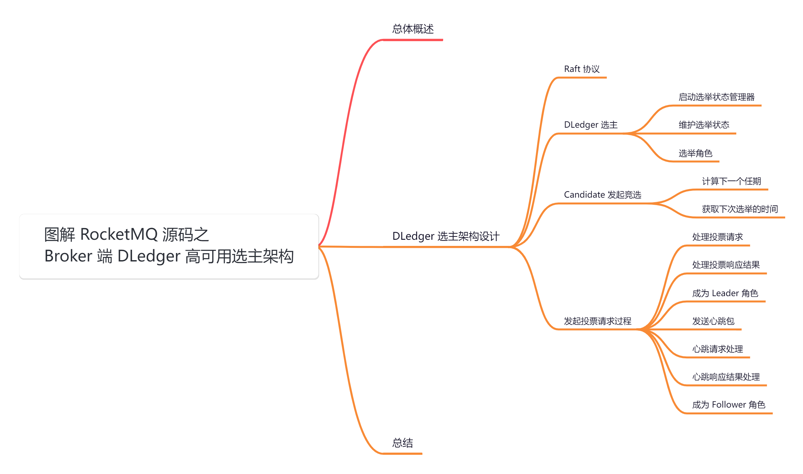
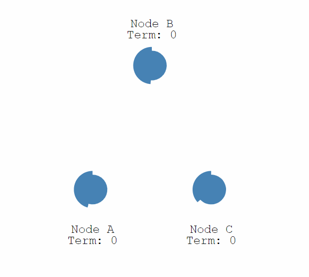
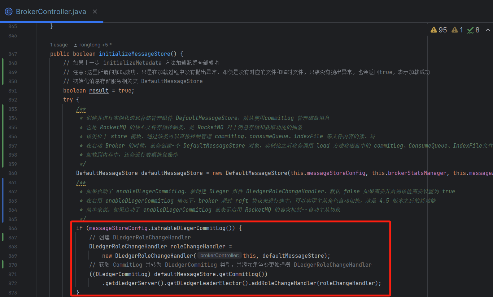
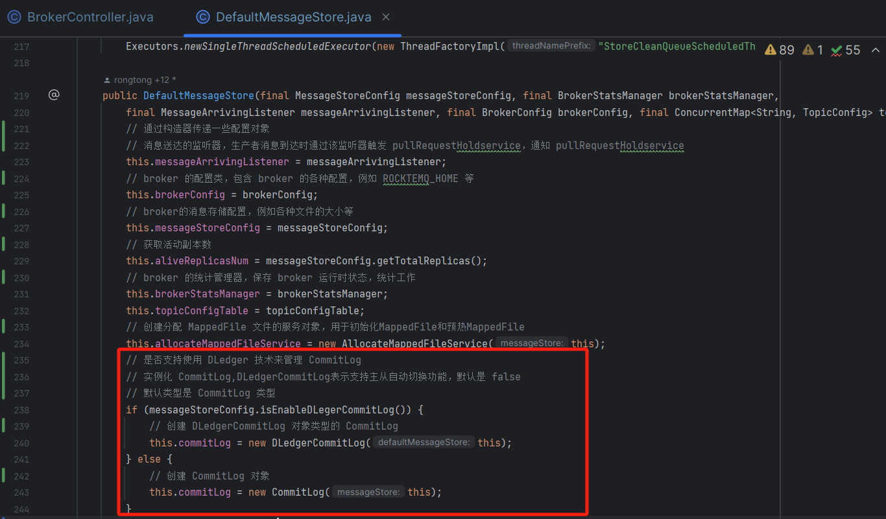
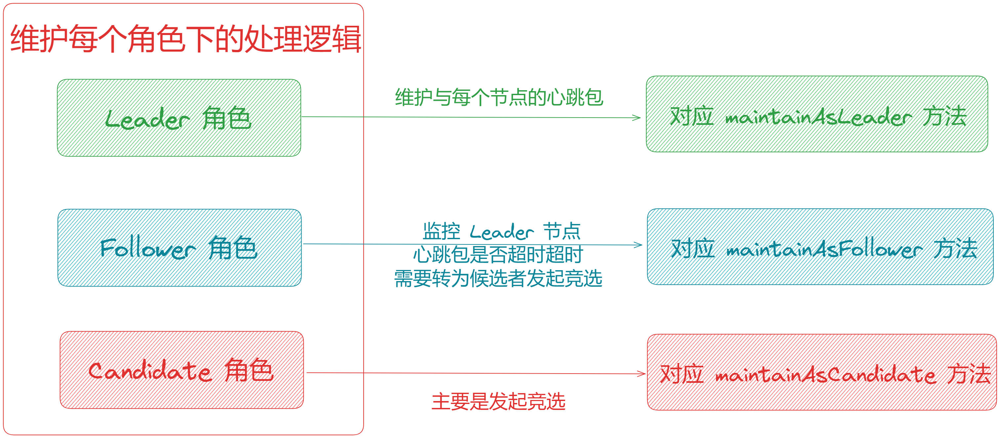
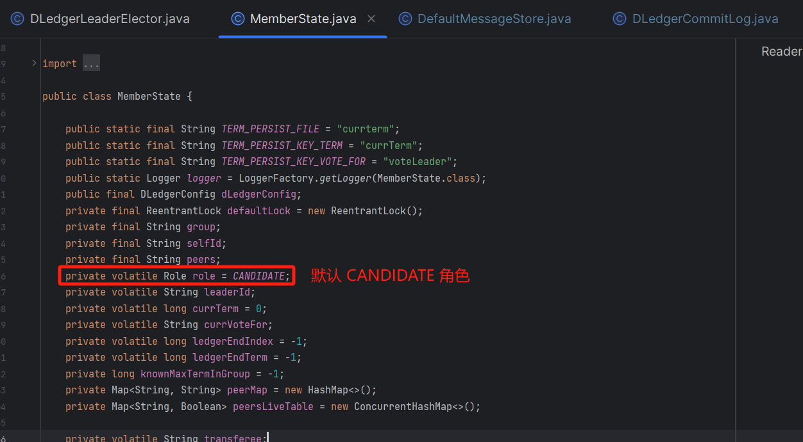
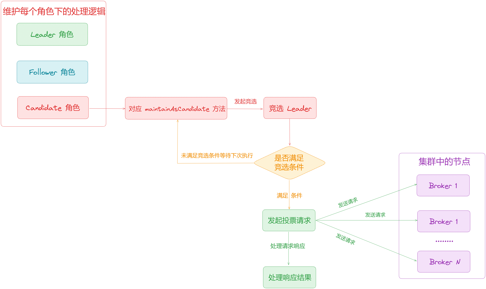
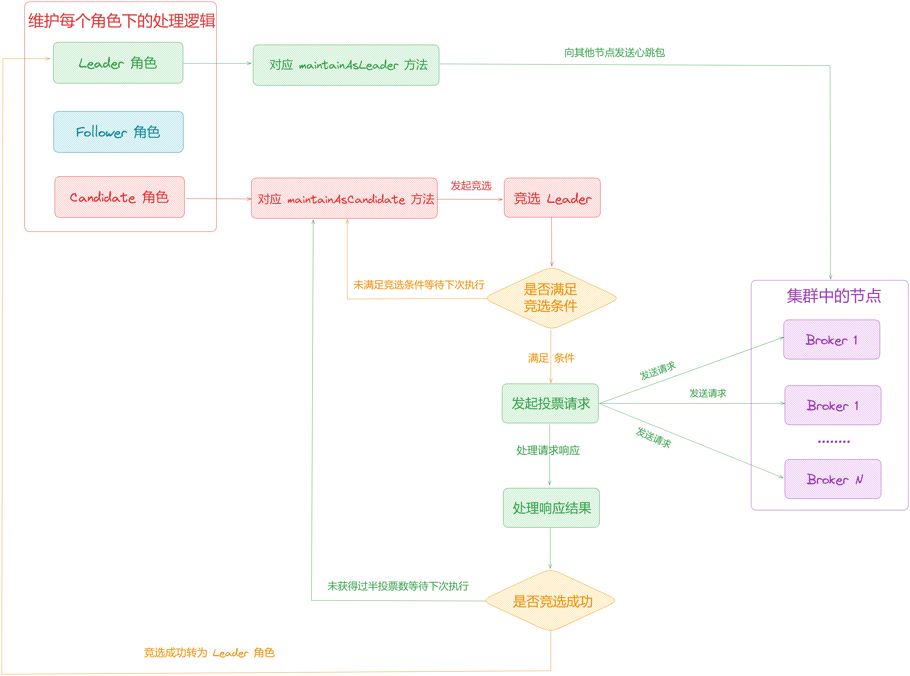
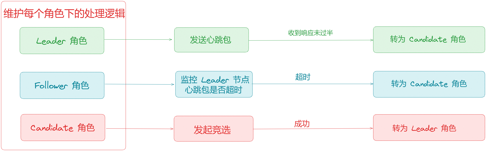
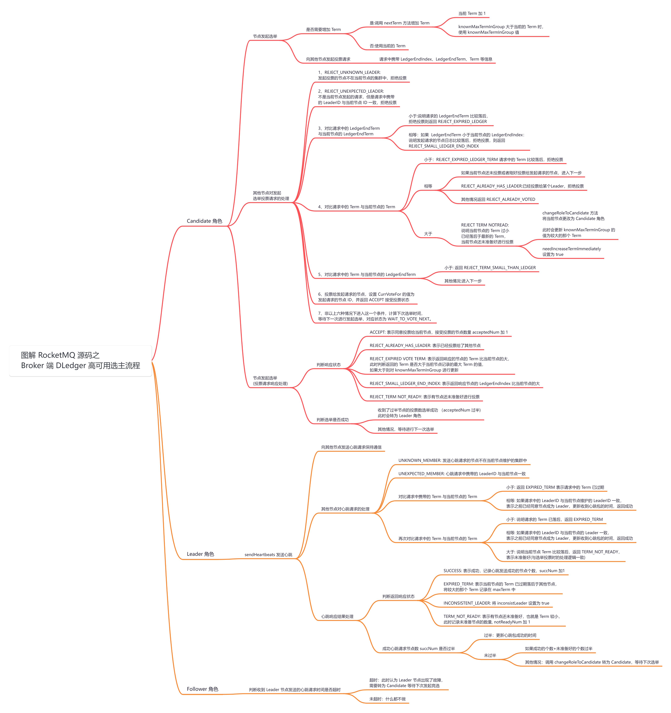

大家好，我是**华仔**, 又跟大家见面了。

从今天开始我将继续为大家奉上 RocketMQ 消费者源码剖析系列文章，正式开启「**RocketMQ 的服务端 Broker 源码之旅**」，这是第二十五篇，本篇我们将以「**RocketMQ 5.1.2**」版本为主，来剖析下 RocketMQ 源码之 Broker 端 DLedger 高可用选主架构深度剖析。

这里我将以「**RocketMQ 5.1.2**」版本为主，通过「**场景驱动**」的方式带大家一点点的对 RocketMQ 源码进行深度剖析，正式开启「**RocketMQ 的源码之旅**」，跟我一起来掌握 RocketMQ 源码核心架构设计思想吧。

  

##   
**01 总体概述**

关于「**DLedger**」架构模式，我们主要剖析两个部分：

1.  「**DLedger**」架构下是如何选主的，它与原来普通的主从架构有什么区别？
2.  「**DLedger**」架构下是如何进行日志复制的，它与原来 [CommitLog](http://commitlog%20/) 日志复制有什么区别？

我们会分为两篇来深度剖析，今天这篇我们先来深度剖析下第一个问题是如何进行选主，以及「**出现故障时无法自动切换主从节点**」的。

## **02 DLedger 选主架构设计**

RocketMQ 4.5 版本之前，可以采用「**主从架构**」进行集群部署，但是如果 [Master](http://master/) 节点挂掉，不能自动在集群中选举出新的 [Master](http://master/) 节点，需要人工介入，在 4.5 版本之后提供了「**DLedger**」架构模式，使用 [Raft](http://raft%20/) 算法，如果[Master](http://master/) 节点出现故障，可以自动选举出新的 [Master](http://master/) 进行切换。

## **2.1 Raft 协议**

Raft 是分布式系统中的一种共识算法，用于在集群中选举 Leader 管理集群，Raft 协议中有以下角色：

1.  [Leader（领导者）](http://xn--leader\(\)-rc6o069zqluc/)：集群中的领导者，负责管理集群。
2.  [Candidate（候选者）](http://xn--candidate\(\)-yv3r2790c83xb/)：具有竞选 [Leader](http://leader%20/) 资格的角色，如果集群需要选举 [Leader](http://leader/)，节点需要先转为候选者角色才可以发起竞选。
3.  [Follower（跟随者 ）](http://xn--follower\(%20\)-jd78ay58jyb3a/)： [Leader](http://leader/) 的跟随者，接收和处理来自 [Leader](http://leader/) 的消息，与 [Leader](http://leader/) 之间保持通信，如果通信超时或者其他原因导致节点与 [Leader](http://leader/) 之间通信失败，节点会认为集群中没有 [Leader](http://leader/)，就会转为候选者发起竞选，推荐自己成为 [Leader](http://leader/)。

Raft 协议中还有一个 [Term](http://term/)（任期）的概念，任期是随着选举的举行而变化，一般是单调进行递增，比如说集群中当前的任期为 1，此时某个节点发现集群中没有 [Leader](http://leader/)，开始发起竞选，此时任期编号就会增加为 2，表示进行了新一轮的选举。一般会为 [Term](http://term/) 较大的那个节点进行投票，当某个节点收到了过半 [Quorum](http://quorum/) 的投票数（一般是集群中的节点数/2 + 1），将会被选举为 [Leader](http://leader/)。

## **2.2 DLedger 选主**

在 [Broker](http://broker/) 启动的时候，会判断是否开启了 [DLedger](http://dledger/)，如果开启会创建角色变更处理器[DLedgerRoleChangeHandler](http://dledgerrolechangehandler/)， 然后获取 [CommitLog](http://commitlog/) 转为 [DLedgerCommitLog](http://dledgercommitlog/) 类型，并「**添加创建的角色变更处理器**」：

public class DLedgerLeaderElector {

private List<RoleChangeHandler> roleChangeHandlers = new ArrayList<>();

// 添加角色变更处理器

public void addRoleChangeHandler(RoleChangeHandler roleChangeHandler) {

if (!roleChangeHandlers.contains(roleChangeHandler)) {

roleChangeHandlers.add(roleChangeHandler);

}

}

}

在 [DefaultMessageStore](http://defaultmessagestore/) 构造函数中可以看到，如果开启了 [DLedger](http://dledger/)，使用的是 [DLedgerCommitLog](http://dledgercommitlog/)，所以上面可以将 [CommitLog](http://commitlog/) 转换为 [DLedgerCommitLog](http://dledgercommitlog/)：

源码位置：[https://github.com/apache/rocketmq/blob/release-5.1.2/store/src/main/java/org/apache/rocketmq/store/](https://github.com/apache/rocketmq/blob/release-5.1.2/store/src/main/java/org/apache/rocketmq/store/dledger/DLedgerCommitLog.java)[dledger/DLedgerCommitLog](https://github.com/apache/rocketmq/blob/release-5.1.2/store/src/main/java/org/apache/rocketmq/store/dledger/DLedgerCommitLog.java)[.java](https://github.com/apache/rocketmq/blob/release-5.1.2/store/src/main/java/org/apache/rocketmq/store/dledger/DLedgerCommitLog.java)

进入到 [DLedgerCommitLog](http://dledgercommitlog/)，可以看到它引用了 [DLedgerServer](http://dledgerserver/)，并在 [start](http://start/) 方法中对其进行了启动，而在[DLedgerServer](http://dledgerserver/) 中又启动了 [DLedgerLeaderElector](http://dledgerleaderelector/) 进行 [Leader](http://leader/) 选举：

public class DLedgerCommitLog extends CommitLog {

// DLedger 服务

private final DLedgerServer dLedgerServer;

@Override

public void start() {

// 启动 DLedgerServer

dLedgerServer.startup();

}

}

// io.openmessaging.storage.dledger

public class DLedgerServer extends AbstractDLedgerServer {

// 表示成员状态的对象

private MemberState memberState;

// DLedger 的配置对象

private DLedgerConfig dLedgerConfig;

// DLedger 存储对象

private DLedgerStore dLedgerStore;

// DLedger RPC 服务对象

private DLedgerRpcService dLedgerRpcService;

// RPC 服务模式

private final RpcServiceMode rpcServiceMode;

// DLedger Entry 推送器对象

private DLedgerEntryPusher dLedgerEntryPusher;

// DLedger Leader 选举器对象

private DLedgerLeaderElector dLedgerLeaderElector;

// 调度执行器服务

private ScheduledExecutorService executorService;

// 可选的状态机调用器对象

private Optional<StateMachineCaller> fsmCaller;

// 同步方法，确保线程安全

public synchronized void startup() {

// 如果尚未启动

if (!isStarted) {

// 启动 DLedger 存储

this.dLedgerStore.startup();

// 如果 RPC 服务模式是独占

if (RpcServiceMode.EXCLUSIVE.equals(this.rpcServiceMode)) {

// 启动 DLedger RPC 服务

this.dLedgerRpcService.startup();

}

// 启动 DLedger Entry 推送器

this.dLedgerEntryPusher.startup();

// 启动 DLedger Leader 选举器

this.dLedgerLeaderElector.startup();

// 定时任务，每隔 1000 毫秒执行一次 checkPreferredLeader 方法

executorService.scheduleAtFixedRate(this::checkPreferredLeader,

1000,1000,TimeUnit.MILLISECONDS);

// 标记为已启动

isStarted = true;

}

}

}

### **2.2.1 启动选举状态管理器**

在 [DLedgerLeaderElector](http://dledgerleaderelector/) 中，引用了 [StateMaintainer](http://statemaintainer/)，并在 [startup](http://startup/) 方法中启动了 [StateMaintainer](http://statemaintainer/)，然后遍历 [RoleChangeHandler](http://rolechangehandler/)，调用其 startup 进行启动状态管理机：

public class DLedgerLeaderElector {

// 随机数生成器，对应raft协议中选举超时时间是一随机数

private Random random \= new Random();

// DLedger 配置对象

private DLedgerConfig dLedgerConfig;

// 节点状态机

private final MemberState memberState;

// DLedger RPC 服务，实现向集群内的节点发送心跳包、投票的 RPC 实现

private DLedgerRpcService dLedgerRpcService;

// 作为服务器处理程序

// 记录上次收到 Leader 心跳包的时间戳

private volatile long lastLeaderHeartBeatTime \= -1;

// 记录上次发送心跳包的时间戳

private volatile long lastSendHeartBeatTime \= -1;

// 记录上次成功收到心跳包的时间戳

private volatile long lastSuccHeartBeatTime \= -1;

// 一个心跳包的周期，默认为2s

private int heartBeatTimeIntervalMs \= 2000;

// 允许最大的 N 个心跳周期内未收到心跳包，状态为 Follower 的节点只有超过 maxHeartBeatLeak \* heartBeatTimeIntervalMs 的时间内未收到主节点的心跳包，才会重新进入 Candidate 状态，重新下一轮的选举

private int maxHeartBeatLeak \= 3;

// 发送下一个心跳包的时间戳

private long nextTimeToRequestVote \= -1;

// 是否应该立即发起投票

private volatile boolean needIncreaseTermImmediately \= false;

// 最小的发送投票间隔时间，默认为 300 ms

private int minVoteIntervalMs \= 300;

// 最大的发送投票的间隔，默认为 1000 ms

private int maxVoteIntervalMs \= 1000;

// 注册的节点状态处理器，通过 addRoleChangeHandler 方法添加

private List<RoleChangeHandler> roleChangeHandlers = new ArrayList<>();

private VoteResponse.ParseResult lastParseResult \= VoteResponse.ParseResult.WAIT\_TO\_REVOTE;

// 上一次投票的开销

private long lastVoteCost \= 0L;

// 状态机管理器

private StateMaintainer stateMaintainer \= new StateMaintainer("StateMaintainer",logger);

// 执行接管领导者任务

private final TakeLeadershipTask takeLeadershipTask \= new TakeLeadershipTask();

// 构造函数

public DLedgerLeaderElector(DLedgerConfig dLedgerConfig,MemberState memberState,

DLedgerRpcService dLedgerRpcService) {

this.dLedgerConfig = dLedgerConfig;

this.memberState = memberState;

this.dLedgerRpcService = dLedgerRpcService;

refreshIntervals(dLedgerConfig);

}

// 启动方法

public void startup() {

// 启动状态维护管理器

stateMaintainer.start();

// 遍历状态改变监听器 RoleChangeHandler

for (RoleChangeHandler roleChangeHandler :roleChangeHandlers) {

// 启动角色变更处理器

// 可通过 DLedgerLeaderElector#addRoleChangeHandler 方法增加状态变化监听器

roleChangeHandler.startup();

}

}

}

### **2.2.2 维护选举状态**

[StateMaintainer](http://statemaintainer/) 是 [DLedgerLeaderElector](http://dledgerleaderelector/) 的内部类，继承了 [ShutdownAbleThread](http://shutdownablethread/)，所以这里其实是开启了一个线程会不断执行 [doWork](http://dowork/) 方法，在 [doWork](http://dowork/) 方法中调用了 [maintainState](http://maintainstate/) 方法维护状态：

public class StateMaintainer extends ShutdownAbleThread {

public StateMaintainer(String name, Logger logger) {

super(name, logger);

}

@Override

public void doWork() {

try {

if (DLedgerLeaderElector.this.dLedgerConfig.isEnableLeaderElector()) {

DLedgerLeaderElector.this.refreshIntervals(dLedgerConfig);

// 维护状态

DLedgerLeaderElector.this.maintainState();

}

// 睡眠10ms

sleep(10);

} catch (Throwable t) {

DLedgerLeaderElector.logger.error("Error in heartbeat", t);

}

}

}

### **2.2.3 选举角色**

在 [maintainState](http://maintainstate/) 方法中，根据 [Raft](http://raft/) 协议可知节点有三种角色，可以看到对节点的角色进行了判断：

1.  如果当前节点是 [Leader](http://leader/)，[Leader](http://leader/) 角色需要定时向 [Follower](http://follower/) 节点发送心跳包保持通信，以便在 [Leader](http://leader/) 节点出现故障的时候，[Follower](http://follower/) 节点可以判断，调用 [maintainAsLeader](http://maintainasleader/) 方法处理。
2.  如果当前节点是 [Follower](http://follower/)，监控收到 [Leader](http://leader/) 节点心跳包的时间，超过一定时间内未收到会认为 [Leader](http://leader/) 节点发生故障，需要转换为 [Candidate](http://candidate/) 角色发起 [Leader](http://leader/) 选举，调用 [maintainAsFollower](http://maintainasfollower/) 方法处理。
3.  如果当前节点是 [Candidate](http://candidate/)，在 [Candidate](http://candidate/) 角色会发起竞选，调用 [maintainAsCandidate](http://maintainascandidate/) 方法处理。

private void maintainState() throws Exception {

if (memberState.isLeader()) {

// 如果是 Leader，向所有成员发送心跳

maintainAsLeader();

} else if (memberState.isFollower()) {

// 如果是 Follower，检测 master 心跳

maintainAsFollower();

} else {

// 如果是 Candidate，进行选举

maintainAsCandidate();

}

}

[MemberState](http://memberstate%20/) 中可以看到 [role](http://role%20/) 的值默认为 [CANDIDATE](http://candidate/)，所以初始状态下，各个节点的角色为 [CANDIDATE](http://candidate/)，接下来进入到 [maintainAsCandidate](http://maintainascandidate/) 方法看下如何发起选举：

[MemberState](http://memberstate/) 维护了当前实例的状态：

1.  [group](http://group/)：raft 组。
2.  [selfId](http://selfid/)：当前实例 id。
3.  [peers](http://peers/)：分割的角色。
4.  [role](http://role/)：角色，刚启动是 [candidate](http://candidate/)，需要经过选举后成为 [Leader](http://leader%20/) 或 [Follower](http://follower/)。
5.  [leaderId](http://leaderid/)：当前实例认同的 [Leader](http://leader%20/) 的 id。
6.  [currTerm](http://currterm/)：当前所处任期 [term](http://term/)。
7.  [currVoteFor](http://currvotefor/)：处于 [candidate](http://candidate/) 状态下票选的 [Leader](http://leader/)。
8.  [ledgerEndIndex/ledgerEndTerm](http://ledgerendindex/ledgerEndTerm)：最大 [raft](http://raft%20/) 日志对应 [index](http://index%20/) 和 [term](http://term/)，可以代表唯一一条 raft 日志。
9.  [peerMap](http://peermap/)：raft 组成员id-通讯地址。

## **2.3 Candidate 发起竞选**

初始状态下，每个节点的角色为 [CANDIDATE](http://candidate/)，所以会进入到 [CANDIDATE](http://candidate/) 的处理逻辑中，在这里会触发一次选举。

private final MemberState memberState;

private void maintainAsCandidate() throws Exception {

// for candidate

// 判断当时时间是否小于下一次投票开始时间&& needIncreaseTermImmediately 为 false

// needIncreaseTermImmediately：默认为 false，为 true 时表示需要增加投票任期 Term 的值，并立刻发起新一轮选举。

if (System.currentTimeMillis() < nextTimeToRequestVote && !needIncreaseTermImmediately) {

return;

}

// 任期

long term;

// Leader 节点的投票任期，也就是最近一次 Leader 选举成功时的那个 Term，会记录在 LedgerEndIndex中。

long ledgerEndTerm;

// 当前记录的 CommitLog 日志的 index。

long ledgerEndIndex;

// 如果不是 Candidate 直接返回

if (!memberState.isCandidate()) {

return;

}

synchronized (memberState) {

// 如果不是 Candidate 直接返回

if (!memberState.isCandidate()) {

return;

}

// 如果上一次选举 Leader 之后的结果是等待下一次重新进行选举或者如果需要立刻增加任期

if (lastParseResult == VoteResponse.ParseResult.WAIT\_TO\_VOTE\_NEXT || needIncreaseTermImmediately) {

// 当前选举的投票任期。

long prevTerm \= memberState.currTerm();

// 增加 Term

term = memberState.nextTerm();

logger.info("{}\_\[INCREASE\_TERM\] from {} to {}", memberState.getSelfId(), prevTerm, term);

// 上一次选举 Leader 之后的结果为等待下一次重新进行选举

lastParseResult = VoteResponse.ParseResult.WAIT\_TO\_REVOTE;

} else {

// 使用获取当前的 Term

term = memberState.currTerm();

}

// 获取 CommitLog 日志的 index

ledgerEndIndex = memberState.getLedgerEndIndex();

// 获取 Leader 的投票任期

ledgerEndTerm = memberState.getLedgerEndTerm();

}

// 如果需要增加投票任期 Term 的值

if (needIncreaseTermImmediately) {

// 更新下次选举的时间

nextTimeToRequestVote = getNextTimeToRequestVote();

// 恢复 needIncreaseTermImmediately 的默认状态

needIncreaseTermImmediately = false;

return;

}

// .... 下面重点讲

}

在该方法中有几个重要属性，如下：

1.  [nextTimeToRequestVote](http://nexttimetorequestvote/)：下次选举的时间，用于每次发起选举前，判断是否到达了选举时间。
2.  [needIncreaseTermImmediately](http://needincreasetermimmediately/)：默认为 false，为 true 时表示需要增加投票任期 Term 的值，并立刻发起新一轮选举。
3.  [currTerm](http://currterm/)：当前的选举投票任期。
4.  [LedgerEndIndex](http://ledgerendindex/)：可以看做当前节点记录最后一条成功写入消息的 index。
5.  [LedgerEndTerm](http://ledgerendterm/)：Leader 节点的投票轮次，也就是最近一次 Leader 选举成功时的那个 Term，会记录在每个节点的[LedgerEndIndex](http://ledgerendindex/) 中。

  
在候选者角色下可以选举 [Leader](http://leader/)，发起选举的过程如下：

1.  首先判断是否满足选举的条件，处于以下两种条件之一表示条件满足，可以继续后面的步骤，否则直接返回，等待下一次处理：
2.  如果未到下一次投票开始时间 [nextTimeToRequestVote](http://nexttimetorequestvote%20/) 并且 [needIncreaseTermImmediately](http://needincreasetermimmediately/) 为 [false](http://false/)，直接返回等待下一次投票。
3.  校验当前角色是否是 [Candidate](http://candidate/)，如果不是直接返回。
4.  由于 [Leader](http://leader/) 选举可能会失败，所以先判断上一次选举的结果，对以下两个条件进行判断，满足两个条件之一，会增加 Term 的值，为新一轮竞选做准备，反之使用当前的 Term 即可：
5.  如果是 [WAIT\_TO\_VOTE\_NEXT](http://wait_to_vote_next/) 状态，也就是等待下一次重新进行选举。
6.  [needIncreaseTermImmediately](http://needincreasetermimmediately%20/) 为 true，表示需要增加 Term 立刻发起选举。
7.  如果 [needIncreaseTermImmediately](http://needincreasetermimmediately/) 为 true，需要重置其状态为 false，并调用 [getNextTimeToRequestVote](http://getnexttimetorequestvote/) 更新下一次发起选举的时间。
8.  调用 [voteForQuorumResponses](http://voteforquorumresponses/) 方法向其他节点发起投票请求。
9.  处理投票结果，这里先省略，下面再讲。

### **2.3.1 计算下一个任期**

public class MemberState {

public synchronized long nextTerm() {

// 校验角色

PreConditions.check(role == CANDIDATE, DLedgerResponseCode.ILLEGAL\_MEMBER\_STATE, "%s != %s", role, CANDIDATE);

// 如果已知集群中最大的 Term 大于当前的 Term，返回集群中最大的 Term 大

if (knownMaxTermInGroup > currTerm) {

currTerm = knownMaxTermInGroup;

} else {

++currTerm; // 否则对 Term 自增

}

currVoteFor = null;

// 持久化

persistTerm();

return currTerm;

}

}

/\*\*

\* 尝试将当前任期信息持久化到文件中

\* 将当前任期信息和投票对象信息持久化到文件中，以便在节点重启后能够恢复到之前的状态。

\*/

private void persistTerm() {

try {

// 创建一个 Properties 对象，用于存储任期信息

Properties properties \= new Properties();

// 将当前任期信息和投票对象存储到 Properties 对象中

properties.put(TERM\_PERSIST\_KEY\_TERM, currTerm);

properties.put(TERM\_PERSIST\_KEY\_VOTE\_FOR, currVoteFor == null ? "" : currVoteFor);

// 将 Properties 对象转换为字符串

String data \= IOUtils.properties2String(properties);

// 将字符串写入文件中，文件路径为 dLedgerConfig.getDefaultPath() + File.separator + TERM\_PERSIST\_FILE

IOUtils.string2File(data, dLedgerConfig.getDefaultPath() + File.separator + TERM\_PERSIST\_FILE);

} catch (Throwable t) {

logger.error("Persist curr term failed", t);

}

}

### **2.3.2 获取下次选举的时间**

// 最小投票时间间隔

private int minVoteIntervalMs \= 300;

// 最大投票时间间隔

private int maxVoteIntervalMs \= 1000;

private long getNextTimeToRequestVote() {

if (isTakingLeadership()) {

return System.currentTimeMillis() + dLedgerConfig.getMinTakeLeadershipVoteIntervalMs() +

random.nextInt(dLedgerConfig.getMaxTakeLeadershipVoteIntervalMs() - dLedgerConfig.getMinTakeLeadershipVoteIntervalMs());

}

// 当前时间 + 300ms + 随机值（在最大和最小投票时间间隔之间也就是300-1000之间生成随机值）

return System.currentTimeMillis() + minVoteIntervalMs + random.nextInt(maxVoteIntervalMs - minVoteIntervalMs);

}

## **2.4 发起投票请求过程**

private List<CompletableFuture<VoteResponse>> voteForQuorumResponses(long term, long ledgerEndTerm, long ledgerEndIndex) throws Exception {

List<CompletableFuture<VoteResponse>> responses = new ArrayList<>();

// 遍历节点

for (String id : memberState.getPeerMap().keySet()) {

// 构建投票请求

VoteRequest voteRequest \= new VoteRequest();

// 设置组

voteRequest.setGroup(memberState.getGroup());

// 设置 LedgerEndIndex、LedgerEndTerm 等信息

voteRequest.setLedgerEndIndex(ledgerEndIndex);

voteRequest.setLedgerEndTerm(ledgerEndTerm);

// 设置 Leader 节点ID

voteRequest.setLeaderId(memberState.getSelfId());

// 设置 Term 信息

voteRequest.setTerm(term);

// 设置目标节点的ID

voteRequest.setRemoteId(id);

voteRequest.setLocalId(memberState.getSelfId());

CompletableFuture<VoteResponse> voteResponse;

// 如果是当前节点自己

if (memberState.getSelfId().equals(id)) {

// 直接调用handleVote处理

voteResponse = handleVote(voteRequest, true);

} else {

//async 发送请求

voteResponse = dLedgerRpcService.vote(voteRequest);

}

responses.add(voteResponse);

}

return responses;

}

在该方法中，对当前节点维护的集群中所有节点进行了遍历，向每一个节点发送投票请求：

1.  构建 [VoteRequest](http://voterequest/) 投票请求。
2.  设置组信息、[LedgerEndIndex](http://ledgerendindex/)、[LedgerEndTerm](http://ledgerendterm/) 等信息。
3.  设置 [Leader](http://leader/) 节点 ID，发起选举的节点会推荐自己成为 [Leader](http://leader/)，所以这里的 [Leader](http://leader/) ID 就是当前发起投票请求的节点的 ID。
4.  设置本次选举的 [Term](http://term%20/) 信息。
5.  设置请求目标节点的 ID。
6.  集群中所有节点包括了当前节点自己，所以这里会判断，如果遍历到了当前节点为自己就在本地 [handleVote](http://handlevote%20/) 方法处理投票请求，否则需要调用 [dLedgerRpcService#vote](http://dledgerrpcservice/#vote) 方法发送网络请求到其他节点进行处理。

### **2.4.1 处理投票请求**

// 处理投票请求

public CompletableFuture<VoteResponse> handleVote(VoteRequest request, boolean self) {

//hold the lock to get the latest term, leaderId, ledgerEndIndex

// 加锁

synchronized (memberState) {

// 判断发起投票的节点是否在当前节点的集群中

if (!memberState.isPeerMember(request.getLeaderId())) {

logger.warn("\[BUG\] \[HandleVote\] remoteId={} is an unknown member", request.getLeaderId());

return CompletableFuture.completedFuture(new VoteResponse(request).term(memberState.currTerm()).voteResult(VoteResponse.RESULT.REJECT\_UNKNOWN\_LEADER));

}

// 如果不是当前节点发起的请求，但是请求中的 LeaderID 与当前节点一致

if (!self && memberState.getSelfId().equals(request.getLeaderId())) {

logger.warn("\[BUG\] \[HandleVote\] selfId={} but remoteId={}", memberState.getSelfId(), request.getLeaderId());

return CompletableFuture.completedFuture(new VoteResponse(request).term(memberState.currTerm()).voteResult(VoteResponse.RESULT.REJECT\_UNEXPECTED\_LEADER));

}

// 如果请求中的 LedgerEndTerm 小于当前节点的 LedgerEndTerm，说明请求的 Term 已过期

if (request.getLedgerEndTerm() < memberState.getLedgerEndTerm()) {

// 返回 REJECT\_EXPIRED\_LEDGER\_TERM

return CompletableFuture.completedFuture(new VoteResponse(request).term(memberState.currTerm()).voteResult(VoteResponse.RESULT.REJECT\_EXPIRED\_LEDGER\_TERM));

} else if (request.getLedgerEndTerm() == memberState.getLedgerEndTerm() && request.getLedgerEndIndex() < memberState.getLedgerEndIndex()) {

// 返回 REJECT\_SMALL\_LEDGER\_END\_INDEX

return CompletableFuture.completedFuture(new VoteResponse(request).term(memberState.currTerm()).voteResult(VoteResponse.RESULT.REJECT\_SMALL\_LEDGER\_END\_INDEX));

}

// 如果请求中的 Term 小于当前节点的 Term

if (request.getTerm() < memberState.currTerm()) {

// 拒绝投票

return CompletableFuture.completedFuture(new VoteResponse(request).term(memberState.currTerm()).voteResult(VoteResponse.RESULT.REJECT\_EXPIRED\_VOTE\_TERM));

// 如果请求中的 Term 等于当前节点的 Term

} else if (request.getTerm() == memberState.currTerm()) {

// 如果当前节点还未投票

if (memberState.currVoteFor() == null) {

//let it go

// 如果当前节点刚好投票给发起请求的节点

} else if (memberState.currVoteFor().equals(request.getLeaderId())) {

//repeat just let it go

} else {

// 如果已经有 Leader

if (memberState.getLeaderId() != null) {

// 返回 REJECT\_ALREADY\_HAS\_LEADER，表示已投过票

return CompletableFuture.completedFuture(new VoteResponse(request).term(memberState.currTerm()).voteResult(VoteResponse.RESULT.REJECT\_ALREADY\_HAS\_LEADER));

} else {

// 拒绝投票

return CompletableFuture.completedFuture(new VoteResponse(request).term(memberState.currTerm()).voteResult(VoteResponse.RESULT.REJECT\_ALREADY\_VOTED));

}

}

} else {

// 执行到这里表示请求中的 Term 大于当前节点记录的 Term

// 当前节点更改为 Candidate 角色

//stepped down by larger term

changeRoleToCandidate(request.getTerm());

// 在下次执行时增加 Term

needIncreaseTermImmediately = true;

//only can handleVote when the term is consistent

// 返回 REJECT\_TERM\_NOT\_READY

return CompletableFuture.completedFuture(new VoteResponse(request).term(memberState.currTerm()).voteResult(VoteResponse.RESULT.REJECT\_TERM\_NOT\_READY));

}

// 如果请求中的 Term 小于当前节点的 LedgerEndTerm

if (request.getTerm() < memberState.getLedgerEndTerm()) {

return CompletableFuture.completedFuture(new VoteResponse(request).term(memberState.getLedgerEndTerm()).voteResult(VoteResponse.RESULT.REJECT\_TERM\_SMALL\_THAN\_LEDGER));

}

if (!self && isTakingLeadership() && request.getLedgerEndTerm() == memberState.getLedgerEndTerm() && memberState.getLedgerEndIndex() >= request.getLedgerEndIndex()) {

return CompletableFuture.completedFuture(new VoteResponse(request).

term(memberState.currTerm()).voteResult(

VoteResponse.RESULT.REJECT\_TAKING\_LEADERSHIP));

}

// 投票给发起请求的节点

memberState.setCurrVoteFor(request.getLeaderId());

// 返回 ACCEPT 接收投票的状态

return CompletableFuture.completedFuture(new VoteResponse(request).term(memberState.currTerm()).voteResult(VoteResponse.RESULT.ACCEPT));

}

}

其他节点收到投票请求后，会对请求进行处理：

1.  首先做一些校验，比如判断发起投票请求的节点是否在当前节点的集群中，如果不在集群中，拒绝投票，返回状态为[REJECT\_UNKNOWN\_LEADER](http://reject_unknown_leader/)。
2.  如果不是当前节点发起的请求，但是请求中携带的 [LeaderID](http://leaderid/) 与当前节点ID一致，拒绝投票，返回状态为[REJECT\_UNEXPECTED\_LEADER](http://reject_unexpected_leader/)。
3.  对比请求中的携带的 [LedgerEndTerm](http://ledgerendterm/) 与当前节点记录的[LedgerEndTerm](http://ledgerendterm/)：
4.  小于：说明请求的 [LedgerEndTerm](http://ledgerendterm/) 比较落后，拒绝投票 [REJECT\_EXPIRED\_LEDGER\_TERM](http://reject_expired_ledger_term/)。
5.  相等，但是 [LedgerEndIndex](http://ledgerendindex/) 小于当前节点维护的 [LedgerEndIndex](http://ledgerendindex/)：说明发起请求的节点日志比较落后拒绝投票，返回[REJECT\_SMALL\_LEDGER\_END\_INDEX](http://reject_small_ledger_end_index/)。
6.  其他情况：继续下一步。
7.  接着对比请求中的 Term 与当前节点的 Term 大小：
8.  小于：说明请求中的 Term 比较落后，拒绝投票返回状态为 [REJECT\_EXPIRED\_LEDGER\_TERM](http://reject_expired_ledger_term/)。
9.  相等：如果当前节点还未投票或者刚好投票给发起请求的节点，进入下一步；如果已经投票给某个 Leader，拒绝投票返回[REJECT\_ALREADY\_HAS\_LEADER](http://reject_already_has_leader/)，除此之外其他情况返回[REJECT\_ALREADY\_VOTED](http://reject_already_voted/)。
10.  大于：说明当前节点的 Term 过小已经落后于最新的 Term，调用 [changeRoleToCandidate](http://changeroletocandidate/) 方法将当前节点更改为[Candidate](http://candidate/) 角色，[needIncreaseTermImmediately](http://needincreasetermimmediately/) 设置为 true，返回 [REJECT\_TERM\_NOT\_READY](http://reject_term_not_ready/) 表示当前节点还未准备好进行投票。
11.  调用 [changeRoleToCandidate](http://changeroletocandidate/) 方法时传入了请求中携带的 Term 的值，在方法内会与当前节点已知的最大 Term 的值[knownMaxTermInGroup](http://knownmaxtermingroup/) 做对比，如果 [knownMaxTermInGroup](http://knownmaxtermingroup/) 比请求中的 Term 小，会更新为请求中的 Term 的值，在上面 [maintainAsCandidate](http://maintainascandidate/) 方法中得知，如果 [needIncreaseTermImmediately](http://needincreasetermimmediately/) 设置为true，会调用 [nextTerm](http://nextterm/) 方法增加 Term，[nextTerm](http://nextterm/) 方法上面也提到过，这个方法中会判断 [knownMaxTermInGroup](http://knownmaxtermingroup/) 是否大于当前的 Term 如果是返回[knownMaxTermInGroup](http://knownmaxtermingroup/) 的值，所以如果当前节点的 Term 落后于发起选举的 Term，不能进行投票，需要在下次更新Term 的值后，与发起 Leader 选举的 Term 一致时才可以投票。
12.  如果请求中的 Term 小于当前节点的 [LedgerEndTerm](http://ledgerendterm/)，拒绝投票，返回 [REJECT\_TERM\_SMALL\_THAN\_LEDGER](http://reject_term_small_than_ledger/)。
13.  投票给发起请求的节点，设置 [CurrVoteFor](http://currvotefor/) 的值为发起请求的节点 ID，并返回 [ACCEPT](http://accept/) 接受投票状态。

### **2.4.2 处理投票响应结果**

private void maintainAsCandidate() throws Exception {

.....

// 开始投票时间

long startVoteTimeMs \= System.currentTimeMillis();

// 发起投票请求，获取投票结果列表

final List<CompletableFuture<VoteResponse>> quorumVoteResponses = voteForQuorumResponses(term,ledgerEndTerm,ledgerEndIndex);

final AtomicLong knownMaxTermInGroup \= new AtomicLong(term);// 初始化已知的最大任期

final AtomicInteger allNum \= new AtomicInteger(0);// 初始化投票数量统计

final AtomicInteger validNum \= new AtomicInteger(0);// 初始化有效投票数量统计

final AtomicInteger acceptedNum \= new AtomicInteger(0);// 初始化被接受的投票数量统计

final AtomicInteger notReadyTermNum \= new AtomicInteger(0);// 初始化未准备好的节点数量统计

final AtomicInteger biggerLedgerNum \= new AtomicInteger(0);// 初始化落后于当前节点的节点数量统计

final AtomicBoolean alreadyHasLeader \= new AtomicBoolean(false);// 初始化已经有 Leader 的标识

CountDownLatch voteLatch \= new CountDownLatch(1);// 创建 voteLatch，用来等待所有投票结果返回

// 遍历投票结果列表

for (CompletableFuture<VoteResponse> future :quorumVoteResponses) {

// 处理每个投票结果的回调操作

future.whenComplete((VoteResponse x,Throwable ex) -> {

try {

// 如果出现异常，抛出异常

if (ex != null) {

throw ex;

}

// 记录投票结果日志

logger.info("\[{}\]\[GetVoteResponse\] {}",memberState.getSelfId(),JSON.toJSONString(x));

if (x.getVoteResult() != VoteResponse.RESULT.UNKNOWN) {

validNum.incrementAndGet(); // 如果投票结果有效，则增加有效投票数量

}

synchronized (knownMaxTermInGroup) {

switch (x.getVoteResult()) { // 根据投票结果进行处理

case ACCEPT:

acceptedNum.incrementAndGet();// 增加被接受的投票数量

break;

case REJECT\_ALREADY\_HAS\_LEADER:

alreadyHasLeader.compareAndSet(false,true);// 设置已经有领导者的标识

break;

case REJECT\_TERM\_SMALL\_THAN\_LEDGER:

case REJECT\_EXPIRED\_VOTE\_TERM:

if (x.getTerm() > knownMaxTermInGroup.get()) {

knownMaxTermInGroup.set(x.getTerm());// 更新已知的最大任期

}

break;

case REJECT\_EXPIRED\_LEDGER\_TERM:

case REJECT\_SMALL\_LEDGER\_END\_INDEX:

biggerLedgerNum.incrementAndGet();// 增加落后于当前节点的节点数量

break;

case REJECT\_TERM\_NOT\_READY:

notReadyTermNum.incrementAndGet();// 增加未准备好的节点数量

break;

case REJECT\_ALREADY\_VOTED:

case REJECT\_TAKING\_LEADERSHIP:

default:

break;

}

}

if (alreadyHasLeader.get() // 如果已经有领导者

|| memberState.isQuorum(acceptedNum.get()) // 或者被接受的投票数量达到法定人数

|| memberState.isQuorum(acceptedNum.get() + notReadyTermNum.get())) { // 或者被接受的投票数量加上未准备好的节点数量达到法定人数

voteLatch.countDown();// 触发倒数门闩

}

} catch (Throwable t) {

logger.error("vote response failed",t);// 记录投票响应失败日志

} finally {

allNum.incrementAndGet();// 增加投票数量统计

if (allNum.get() == memberState.peerSize()) {

voteLatch.countDown();// 触发倒数门闩

}

}

});

}

try {

// 等待一段时间，以便接收足够的投票结果

voteLatch.await(2000 + random.nextInt(maxVoteIntervalMs),TimeUnit.MILLISECONDS);

} catch (Throwable ignore) {

// 异常处理

}

// 计算投票消耗时间

lastVoteCost = DLedgerUtils.elapsed(startVoteTimeMs);

// 定义投票结果

VoteResponse.ParseResult parseResult;

// 判断投票结果

if (knownMaxTermInGroup.get() > term) { // 1.如果其他节点返回的响应中有比当前节点的Term大的

// 等待下一次选举

parseResult = VoteResponse.ParseResult.WAIT\_TO\_VOTE\_NEXT;

// 计算下次发起选举的时间

nextTimeToRequestVote = getNextTimeToRequestVote();

// 转为 Candidate，传入 knownMaxTermInGroup，下次会使用 knownMaxTermInGroup 的值进选举

changeRoleToCandidate(knownMaxTermInGroup.get());

} else if (alreadyHasLeader.get()) { // 2.如果有节点已经投票给了其他节点

// 等待下一次选举

parseResult = VoteResponse.ParseResult.WAIT\_TO\_REVOTE;

// 计算下次发起选举的时间

nextTimeToRequestVote = getNextTimeToRequestVote() + heartBeatTimeIntervalMs \* maxHeartBeatLeak;

} else if (!memberState.isQuorum(validNum.get())) {// 3.如果收到的有效投票数未过半

// 等待下一次选举

parseResult = VoteResponse.ParseResult.WAIT\_TO\_REVOTE;

// 计算下次发起选举的时间

nextTimeToRequestVote = getNextTimeToRequestVote();

} else if (!memberState.isQuorum(validNum.get() - biggerLedgerNum.get())) { // 4.如果收到有效投票数减去比当前节点ledgerEndIndex大的节点个数未过半

parseResult = VoteResponse.ParseResult.WAIT\_TO\_REVOTE; // 等待下一次选举

// 计算下次发起选举的时间

nextTimeToRequestVote = getNextTimeToRequestVote() + maxVoteIntervalMs;// 更新下次请求投票的时间

} else if (memberState.isQuorum(acceptedNum.get())) { // 5.投票数如果达到了 Quorum，选举通过

parseResult = VoteResponse.ParseResult.PASSED;

} else if (memberState.isQuorum(acceptedNum.get() + notReadyTermNum.get())) { // 6. 如果接受投票数+未准备好的节点数过半，立刻进行下一次投票

parseResult = VoteResponse.ParseResult.REVOTE\_IMMEDIATELY;// 立即重新发起选举

} else { // 其他情况

parseResult = VoteResponse.ParseResult.WAIT\_TO\_VOTE\_NEXT;// 等待下一次选举

// 计算下次发起选举的时间

nextTimeToRequestVote = getNextTimeToRequestVote();

}

lastParseResult = parseResult;// 记录解析结果

logger.info("\[{}\] \[PARSE\_VOTE\_RESULT\] cost={} term={} memberNum={} allNum={} acceptedNum={} notReadyTermNum={} biggerLedgerNum={} alreadyHasLeader={} maxTerm={} result={}",

memberState.getSelfId(),lastVoteCost,term,memberState.peerSize(),allNum,acceptedNum,notReadyTermNum,biggerLedgerNum,alreadyHasLeader,knownMaxTermInGroup.get(),parseResult);// 输出解析结果日志

if (parseResult == VoteResponse.ParseResult.PASSED) { // 如果选举通过

logger.info("\[{}\] \[VOTE\_RESULT\] has been elected to be the leader in term {}",memberState.getSelfId(),term);

// 选举成功，转为 Leader 角色

changeRoleToLeader(term);

}

}

1.  [validNum](http://validnum/)：收到有效请求响应节点的个数，只要响应状态不是 [UNKNOWN](http://unknown/) 状态，就算有效请求，个数就增一。
2.  [acceptedNum](http://acceptednum/)：同意当前节点成为 [Leader](http://leader/) 的节点个数。
3.  [alreadyHasLeader](http://alreadyhasleader/)：表示已经投票给了其他节点。
4.  [knownMaxTermInGroup](http://knownmaxtermingroup/)：当前节点记录集群中已知最大的那个Term。
5.  [biggerLedgerNum](http://biggerledgernum/)：比当前节点的 [LedgerEndIndex](http://ledgerendindex/) 大的节点数量。
6.  [notReadyTermNum](http://notreadytermnum/)：未准备好进行投票的节点的数量。

回到发起投票的逻辑中，继续看处理投票结果的部分，向集群中每个节点发起投票请求之后，会等待每个请求返回响应，根据响应状态先做如下处理：

1.  响应状态是 [ACCEPT](http://accept/)：表示同意投票给当前节点，接受投票的节点数量 [acceptedNum](http://acceptednum/) 加 1。
2.  响应状态是 [REJECT\_ALREADY\_VOTED](http://reject_already_voted/) 或者 [REJECT\_TAKING\_LEADERSHIP](http://reject_taking_leadership/)：表示拒绝投票给当前节点。
3.  响应状态是 [REJECT\_ALREADY\_HAS\_LEADER](http://reject_already_has_leader/)：表示已经投票给了其他节点，[alreadyHasLeader](http://alreadyhasleader/) 设置为 true。
4.  响应状态是 [REJECT\_EXPIRED\_VOTE\_TERM](http://reject_expired_vote_term/)：表示返回响应的节点的 Term 比当前节点的大，判断返回的那个 Term 是否大于当前节点记录的最大 Term 的值，如果是对 [knownMaxTermInGroup](http://knownmaxtermingroup/) 进行更新，记录集群中已知最大的那个 Term。
5.  响应状态是 [REJECT\_SMALL\_LEDGER\_END\_INDEX](http://reject_small_ledger_end_index/)：表示返回响应节点的 [LedgerEndIndex](http://ledgerendindex/) 比当前节点的大，[biggerLedgerNum](http://biggerledgernum/) 加 1。
6.  响应状态是 [REJECT\_TERM\_NOT\_READY](http://reject_term_not_ready/)：表示有节点还未准备好进行投票，[notReadyTermNum](http://notreadytermnum/) 加 1。

经过以上处理之后，会等待（2000 + 一个随机数）毫秒，然后再判断本次选举是否成功，总共有以下几种情况：

1.  情况一：其他节点有比当前节点 Term 大的，说明本次选举的 Term 已经落后其他节点，需要使用较大的那个 Term 作为下次竞选的 Term，此时会计算一个下次发起选举的时间，等待下一次发起选举，对应状态为 [WAIT\_TO\_VOTE\_NEXT](http://wait_to_vote_next/)。
2.  判断方式是 [knownMaxTermInGroup](http://knownmaxtermingroup/) 与当前节点记录的 Term 做对比，上面处理响应状态的时候会判断，如果响应中的Term 大，会更新 [knownMaxTermInGroup](http://knownmaxtermingroup/) 的值，所以这里可以通过 [knownMaxTermInGroup](http://knownmaxtermingroup/) 与当前 Term 的值进行判断。
3.  在前面发起竞选的逻辑里面可以看到发起竞选前先会判断是否到达了竞选的时间，这个竞选时间就是这里计算的下次发起选举的时间。
4.  情况二：有节点已经投票给了其他节点 [alreadyHasLeader](http://alreadyhasleader/)为 true，说明有其他节点在竞争 [Leader](http://leader/)，计算下次选举时间，等待下一次进行发起选举，对应状态为 [WAIT\_TO\_VOTE\_NEXT](http://wait_to_vote_next/)。
5.  情况三：收到的有效投票数未过半（[validNum](http://validnum/) 的值未超过集群总节点数的一半），计算下次选举时间，等待下一次进行发起选举，对应状态为 [WAIT\_TO\_VOTE\_NEXT](http://wait_to_vote_next/)。
6.  情况四：收到有效投票数 [validNum](http://validnum/) 减去比当前节点 [ledgerEndIndex](http://ledgerendindex/) 大的节点数 [biggerLedgerNum](http://biggerledgernum/) 未过半，计算下次选举时间并加上一个 [maxVoteIntervalMs](http://maxvoteintervalms/)（1000ms），等待下一次进行发起选举，对应状态为 [WAIT\_TO\_VOTE\_NEXT](http://wait_to_vote_next/)。
7.  这个条件主要是为了判断是否有较多的节点 [LedgerEndIndex](http://ledgerendindex/) 比当前的大，因为走到这一个条件中，说明收到有效投票个数是过半 [Quorum](http://quorum/) 的（如果未过半会先进入情况三），对应状态 [PASS](http://pass/)，如果有比较多的节点 [LedgerEndIndex](http://ledgerendindex/) 比当前的大就会导致相减后的数量未过半。
8.  比如集群中有 10 个节点，收到有效请求响应的个数为 7，[validNum](http://validnum/) 值为 3，其中有 3 个节点的 [LedgerEndIndex](http://ledgerendindex/) 比当前节点大，[biggerLedgerNum](http://biggerledgernum/) 值为3，7-3=4，未超过集群节点一半数量，如果 [biggerLedgerNum](http://biggerledgernum/) 值为1，那么7-1=6，个数过半就不会走到这个条件中。
9.  情况五：接受投票的节点个数 [acceptedNum](http://acceptednum/) 过半也就是达到了 [Quorum](http://quorum/)，表示本轮选举竞选成功，接下来会将节点的角色转为 Leader。
10.  结合情况四，可以看出假如有少部分节点 [LedgerEndIndex](http://ledgerendindex/) 比当前的大，当前节点也可以竞选成功。
11.  情况六：如果接受投票的节点个数 [acceptedNum](http://acceptednum/) \+ 未准备好的节点数 [notReadyTermNum](http://notreadytermnum/) 过半，表示有部分节点 Term落后，与当前选举的 Term 不一致，立刻进行下一次投票，对应状态为 [REVOTE\_IMMEDIATELY](http://revote_immediately/)。
12.  情况七：非以上六种情况下进入这一个条件，计算下次选举时间，等待下一次进行发起选举，对应状态为 [WAIT\_TO\_VOTE\_NEXT](http://wait_to_vote_next/)。

可以看到在以上几种情况中，其他情况下需要等到当前节点到达下一次发起选举的时间，重新发起竞选，只有情况五「**收到的投票数过半**」，才能竞选成功。此时会调用 [changeRoleToLeader](http://changeroletoleader/) 转为 [Leader](http://leader%20/) 角色。

### **2.4.3 成为 Leader 角色**

public void changeRoleToLeader(long term) {

synchronized (memberState) {

// 如果 Term 一致

if (memberState.currTerm() == term) {

// 转为 Leader 角色

memberState.changeToLeader(term);

lastSendHeartBeatTime = -1;

// 触发角色改变事件

handleRoleChange(term, MemberState.Role.LEADER);

logger.info("\[{}\] \[ChangeRoleToLeader\] from term: {} and currTerm: {}", memberState.getSelfId(), term, memberState.currTerm());

} else {

logger.warn("\[{}\] skip to be the leader in term: {}, but currTerm is: {}", memberState.getSelfId(), term, memberState.currTerm());

}

}

}

当节点收到集群中大多数投票后，调用 [changeRoleToLeader](http://changeroletoleader/) 方法转为 Leader 角色：

1.  调用 [memberState#changeToLeader](http://memberstate/#changeToLeader) 方法将角色更改为 Leader。
2.  调用 [handleRoleChange](http://handlerolechange/) 方法触发角色变更事件。

// MemberState 类方法

public class MemberState {

// 将节点的状态切换为 Leader，在切换之前会进行一些状态检查和清理工作。

public synchronized void changeToLeader(long term) {

// 检查当前任期是否等于指定的任期

PreConditions.check(currTerm == term,DLedgerResponseCode.ILLEGAL\_MEMBER\_STATE,"%d != %d",currTerm,term);

// 修改节点角色为 Leader

this.role = LEADER;

// 设置 Leader 的节点ID为当前节点的ID

this.leaderId = selfId;

// 清空节点的活跃表，通常是清空其他节点的状态信息

peersLiveTable.clear();

}

}

// 进行角色变更时的有效性检查和角色变更处理操作

private void handleRoleChange(long term,MemberState.Role role) {

try {

// 尝试调用 takeLeadershipTask#check 方法进行角色变更检查

takeLeadershipTask.check(term,role);

} catch (Throwable t) { // 记录角色变更检查异常日志

logger.error("takeLeadershipTask.check failed.ter={},role={}",term,role,t);

}

// 遍历角色变更处理器列表

for (RoleChangeHandler roleChangeHandler :roleChangeHandlers) {

try {

// 调用每个角色变更处理器的 handle 方法进行角色变更处理

roleChangeHandler.handle(term,role);

} catch (Throwable t) { // 记录角色变更处理器异常日志

logger.warn("Handle role change failed term={} role={} handler={}",term,role,roleChangeHandler.getClass(),t);

}

}

}

当成为 [Leader](http://leader%20/) 角色之后，下次执行 [StateMaintainer#doWork](http://statemaintainer/#doWork) 方法时，调用[DLedgerLeaderElector.this.maintainState()](http://dledgerleaderelector.this.maintainstate\(\)/) 会进入到 [Leader](http://%20leader/) 角色的处理逻辑，也就是 [maintainAsLeader](http://maintainasleader/) 方法中，在方法中会判断上次发送心跳的时间是否大于心跳发送间隔，如果是会进行如下处理：

1.  判断上次发送心跳的时间是否大于心跳发送间隔，如果是进行以下处理：
2.  校验是否是 [Leader](http://leader%20/) 角色，如果不是直接返回。
3.  更新当前任期、当前 Leader 节点 ID、发送心跳的时间。
4.  调用 [sendHeartbeats](http://sendheartbeats/) 方法，向集群中其他节点发送心跳包。

也就是说，如果某个节点成为了 [Leader](http://leader/) 角色，会定期执行进入到 [maintainAsLeader](http://maintainasleader/) 方法中，如果距离上次发送心跳的时间超过了心跳发送间隔，向其他节点发送心跳包保持通信。

private void maintainAsLeader() throws Exception {

// 如果上次发送心跳的时间大于心跳发送间隔

if (DLedgerUtils.elapsed(lastSendHeartBeatTime) > heartBeatTimeIntervalMs) {

long term;

String leaderId;

synchronized (memberState) {

// 校验是否是 Leader

if (!memberState.isLeader()) {

//stop sending

return;

}

// 更新当前任期

term = memberState.currTerm();

// 更新当前 Leader 节点 ID

leaderId = memberState.getLeaderId();

// 更新发送心跳的时间

lastSendHeartBeatTime = System.currentTimeMillis();

}

// 向集群中其他节点发送心跳包

sendHeartbeats(term, leaderId);

}

}

// 开头会调用 DLedgerUtils#elapsed 方法用于计算时间差，使用当前时间减去参数传入的时间，后面会看到某些情况下会将上次发送心跳的时间置为-1，这里相减之后，返回值会大于心跳时间间隔，所以会立刻发送心跳包：

public class DLedgerUtils {

public static long elapsed(long start) {

return System.currentTimeMillis() - start;

}

}

### **2.4.4 发送心跳包**

private void sendHeartbeats(long term, String leaderId) throws Exception {

// 初始化投票数量统计

final AtomicInteger allNum \= new AtomicInteger(1);

// 初始化成功投票数量统计

final AtomicInteger succNum \= new AtomicInteger(1);

// 初始化未准备好的节点数量统计

final AtomicInteger notReadyNum \= new AtomicInteger(0);

// 初始化最大任期

final AtomicLong maxTerm \= new AtomicLong(-1);

final AtomicBoolean inconsistLeader \= new AtomicBoolean(false);

final CountDownLatch beatLatch \= new CountDownLatch(1);

long startHeartbeatTimeMs \= System.currentTimeMillis();

// 遍历集群中的节点

for (String id : memberState.getPeerMap().keySet()) {

if (memberState.getSelfId().equals(id)) { // 如果是当前节点自己，跳过

continue;

}

// 构建心跳请求

HeartBeatRequest heartBeatRequest \= new HeartBeatRequest();

heartBeatRequest.setGroup(memberState.getGroup()); // 设置组信息

heartBeatRequest.setLocalId(memberState.getSelfId()); // 设置当前节点的ID

heartBeatRequest.setRemoteId(id); // 设置目标节点的ID

heartBeatRequest.setLeaderId(leaderId); // 设置LeaderID

heartBeatRequest.setTerm(term); // 设置Term

// 发送心跳请求

CompletableFuture<HeartBeatResponse> future = dLedgerRpcService.heartBeat(heartBeatRequest);

// 先省略心跳响应处理，下面讲

.....

}

这里遍历当前节点维护的集群中所有节点，向除自己以外的其他节点发送心跳请求：

1.  构建 [HeartBeatRequest](http://heartbeatrequest/) 请求。
2.  请求中设置本次选举的相关信息，包括组信息、当前节点的ID、目标节点的ID、LeaderID、当前的Term。
3.  调用 heartBeat 发送心跳请求。
4.  处理心跳请求返回的响应数据，这个下面再讲。

### **2.4.5 心跳请求处理**

public CompletableFuture<HeartBeatResponse> handleHeartBeat(HeartBeatRequest request) throws Exception {

// 判断发送心跳请求的节点是否在集群中

if (!memberState.isPeerMember(request.getLeaderId())) {

logger.warn("\[BUG\] \[HandleHeartBeat\] remoteId={} is an unknown member", request.getLeaderId());

// 返回 UNKNOWN\_MEMBER

return CompletableFuture.completedFuture(new HeartBeatResponse().term(memberState.currTerm()).code(DLedgerResponseCode.UNKNOWN\_MEMBER.getCode()));

}

// 判断心跳请求中携带的 LeaderID 是否是当前节点

if (memberState.getSelfId().equals(request.getLeaderId())) {

logger.warn("\[BUG\] \[HandleHeartBeat\] selfId={} but remoteId={}", memberState.getSelfId(), request.getLeaderId());

// 返回 UNEXPECTED\_MEMBER

return CompletableFuture.completedFuture(new HeartBeatResponse().term(memberState.currTerm()).code(DLedgerResponseCode.UNEXPECTED\_MEMBER.getCode()));

}

// 对比 Term

if (request.getTerm() < memberState.currTerm()) { // 如果请求中的 Term 小于当前节点的 Term

// 返回 EXPIRED\_TERM 表示请求中的 Term 已过期

return CompletableFuture.completedFuture(new HeartBeatResponse().term(memberState.currTerm()).code(DLedgerResponseCode.EXPIRED\_TERM.getCode()));

} else if (request.getTerm() == memberState.currTerm()) { // 如果相等

// 如果请求中的 LeaderID 与当前节点维护的 LeaderID 一致，表示已经同意节点成为 Leader

if (request.getLeaderId().equals(memberState.getLeaderId())) {

lastLeaderHeartBeatTime = System.currentTimeMillis(); // 更新为当前时间

return CompletableFuture.completedFuture(new HeartBeatResponse()); // 返回成功

}

}

//abnormal case

//hold the lock to get the latest term and leaderId

synchronized (memberState) {

// 请求中的 Term 如果小于当前节点的 Term

if (request.getTerm() < memberState.currTerm()) {

// 返回 EXPIRED\_TERM

return CompletableFuture.completedFuture(new HeartBeatResponse().term(memberState.currTerm()).code(DLedgerResponseCode.EXPIRED\_TERM.getCode()));

} else if (request.getTerm() == memberState.currTerm()) { // 如果请求中的 Term 于当前节点的 Term 相等

if (memberState.getLeaderId() == null) { // 如果当前节点记录的 LeaderId 为空

// 转为 Follower 角色

changeRoleToFollower(request.getTerm(), request.getLeaderId());

// 返回成功

return CompletableFuture.completedFuture(new HeartBeatResponse());

// 如果请求中的 LeaderId 与当前节点的 Leader 一致

} else if (request.getLeaderId().equals(memberState.getLeaderId())) {

lastLeaderHeartBeatTime = System.currentTimeMillis();

// 返回成功

return CompletableFuture.completedFuture(new HeartBeatResponse());

} else {

//this should not happen, but if happened

logger.error("\[{}\]\[BUG\] currTerm {} has leader {}, but received leader {}", memberState.getSelfId(), memberState.currTerm(), memberState.getLeaderId(), request.getLeaderId());

// 返回 INCONSISTENT\_LEADER

return CompletableFuture.completedFuture(new HeartBeatResponse().code(DLedgerResponseCode.INCONSISTENT\_LEADER.getCode()));

}

} else { // 如果请求中的 Term 大于当前节点的 Term

//To make it simple, for larger term, do not change to follower immediately

//first change to candidate, and notify the state-maintainer thread

// 转为 Candidate

changeRoleToCandidate(request.getTerm());

needIncreaseTermImmediately = true; // needIncreaseTermImmediately 置为 true

//TOOD notify 返回 TERM\_NOT\_READY

return CompletableFuture.completedFuture(new HeartBeatResponse().code(DLedgerResponseCode.TERM\_NOT\_READY.getCode()));

}

}

}

这里的 [lastLeaderHeartBeatTime](http://lastleaderheartbeattime/)：最近一次收到 [Leader](http://leader/) 心跳请求的时间，用来在 [Follower](http://follower/) 角色下判断心跳时间是否超时使用，如果长时间未收到心跳包，会认为 [Master](http://master/) 故障，转为 [Candidate](http://candidate/) 角色进行竞选。

集群中其他节点收到心跳请求后，对请求的处理在 [handleHeartBeat](http://handleheartbeat/) 方法中：

1.  判断发送心跳请求的节点是否在当前节点维护的集群中，如果不在返回状态为 [UNKNOWN\_MEMBER](http://unknown_member/)。
2.  判断心跳请求中携带的 LeaderID 是否是当前节点，如果是，返回 [UNEXPECTED\_MEMBER](http://unexpected_member/)。
3.  对比请求中携带的 Term 与当前节点的 Term：
4.  小于：返回 [EXPIRED\_TERM](http://expired_term/) 表示请求中的 Term 已过期。
5.  相等：如果请求中的 LeaderID 与当前节点维护的 LeaderID 一致，表示之前已经同意节点成为 Leader，更新收到心跳包的时间 [lastLeaderHeartBeatTime](http://lastleaderheartbeattime/) 为当前时间，返回成功即可。
6.  再次对比请求中的 Term 与当前节点的 Term：
7.  （1）小于：说明请求的 Term 已落后，返回 [EXPIRED\_TERM](http://expired_term/)。
8.  （2）相等：
9.  如果当前节点记录的 LeaderId 为空，调用 [changeRoleToFollower](http://changeroletofollower/) 转为 [Follower](http://follower%20/) 角色，返回成功。
10.  如果请求中的 LeaderId 与当前节点的 [Leader](http://leader%20/) 一致，表示之前已经同意节点成为 [Leader](http://leader/)，更新收到心跳包的时间[lastLeaderHeartBeatTime](http://lastleaderheartbeattime/) 为当前时间，返回成功。
11.  其他情况：主要是为了容错处理，返回 [INCONSISTENT\_LEADER](http://inconsistent_leader/)。
12.  （3）大于：说明当前节点Term比较落后，此时调用 [changeRoleToCandidate](http://changeroletocandidate%20/) 转为 [Candidate](http://candidate/) 角色，然后将[needIncreaseTermImmediately](http://needincreasetermimmediately/) 置为true，返回 [TERM\_NOT\_READY](http://term_not_ready/) 表示未准备好（与选举投票时的处理逻辑一致）。

### **2.4.6 心跳响应结果处理**

private void sendHeartbeats(long term, String leaderId) throws Exception {

....

// 遍历集群中的节点

for (String id : memberState.getPeerMap().keySet()) {

if (memberState.getSelfId().equals(id)) { // 如果是当前节点自己，跳过

continue;

}

// 构建心跳请求

HeartBeatRequest heartBeatRequest \= new HeartBeatRequest();

heartBeatRequest.setGroup(memberState.getGroup());

heartBeatRequest.setLocalId(memberState.getSelfId());

heartBeatRequest.setRemoteId(id);

heartBeatRequest.setLeaderId(leaderId);

heartBeatRequest.setTerm(term);

// 发送心跳

CompletableFuture<HeartBeatResponse> future = dLedgerRpcService.heartBeat(heartBeatRequest);

future.whenComplete((HeartBeatResponse x, Throwable ex) -> {

try {

if (ex != null) {

memberState.getPeersLiveTable().put(id, Boolean.FALSE);

throw ex;

}

switch (DLedgerResponseCode.valueOf(x.getCode())) {

case SUCCESS: // 如果成功

succNum.incrementAndGet(); // 记录成功的数量

break;

case EXPIRED\_TERM: // 如果 Term 过期

maxTerm.set(x.getTerm()); // 使用响应返回的较大的那个 Term 记录在 maxTerm中

break;

case INCONSISTENT\_LEADER: // 如果是 INCONSISTENT\_LEADER

inconsistLeader.compareAndSet(false, true); // inconsistLeader 置为 true

break;

case TERM\_NOT\_READY: // 如果未准备

notReadyNum.incrementAndGet(); // 记录未准备节点的数量

break;

default:

break;

}

if (x.getCode() == DLedgerResponseCode.NETWORK\_ERROR.getCode())

memberState.getPeersLiveTable().put(id, Boolean.FALSE);

else

memberState.getPeersLiveTable().put(id, Boolean.TRUE);

if (memberState.isQuorum(succNum.get())

|| memberState.isQuorum(succNum.get() + notReadyNum.get())) {

beatLatch.countDown();

}

} catch (Throwable t) {

logger.error("heartbeat response failed", t);

} finally {

allNum.incrementAndGet();

if (allNum.get() == memberState.peerSize()) {

beatLatch.countDown();

}

}

});

}

beatLatch.await(heartBeatTimeIntervalMs, TimeUnit.MILLISECONDS);

// 如果集群中过半节点对心跳包返回了成功的状态

if (memberState.isQuorum(succNum.get())) {

// 记录心跳成功的时间

lastSuccHeartBeatTime = System.currentTimeMillis();

} else {

logger.info("\[{}\] Parse heartbeat responses in cost={} term={} allNum={} succNum={} notReadyNum={} inconsistLeader={} maxTerm={} peerSize={} lastSuccHeartBeatTime={}",

memberState.getSelfId(), DLedgerUtils.elapsed(startHeartbeatTimeMs), term, allNum.get(), succNum.get(), notReadyNum.get(), inconsistLeader.get(), maxTerm.get(), memberState.peerSize(), new Timestamp(lastSuccHeartBeatTime));

// 如果成功的个数+未准备好的个数

if (memberState.isQuorum(succNum.get() + notReadyNum.get())) {

lastSendHeartBeatTime = -1; // 上次发送心跳的时间间隔置为-1

} else if (maxTerm.get() > term) { // 如果Term信息过期

// 转为 Candidate 重新选举，这里传入的是 maxTerm 的值

changeRoleToCandidate(maxTerm.get());

} else if (inconsistLeader.get()) { // 如果inconsistLeader为true

// 转为 Candidate 重新选举

changeRoleToCandidate(term);

} else if (DLedgerUtils.elapsed(lastSuccHeartBeatTime) > maxHeartBeatLeak \* heartBeatTimeIntervalMs) {

// 如果上次成功发送心跳的时间大于 最大心跳时间\* 心跳发送间隔

changeRoleToCandidate(term);

}

}

}

接着回到 [sendHeartbeats](http://sendheartbeats/) 方法，当请求返回响应之后，会对返回响应状态进行判断：

1.  [SUCCESS](http://success/)：表示成功，记录心跳发送成功的节点个数，[succNum](http://succnum%20/) 加 1。
2.  [EXPIRED\_TERM](http://expired_term/)：表示当前节点的 Term 已过期落后于其他节点，将较大的那个 Term 记录在 [maxTerm](http://maxterm/) 中。
3.  [INCONSISTENT\_LEADER](http://inconsistent_leader/)：将 [inconsistLeader](http://inconsistleader/) 置为 true。
4.  [TERM\_NOT\_READY](http://term_not_ready/)：表示有节点还未准备好，也就是 Term 较小，此时记录未准备节点的数量，[notReadyNum](http://notreadynum/) 加 1。

接下来根据上面的处理结果进行判断：

1.  如果集群中过半节点对心跳包返回了成功的状态，更新心跳包成功的时间[lastSendHeartBeatTime](http://lastsendheartbeattime/)的值。
2.  如果未过半进行以下判断：
3.  如果成功的个数+未准备好的个数过半，[lastSendHeartBeatTime](http://lastsendheartbeattime/)值置为-1，下次进入 [maintainAsLeader](http://maintainasleader/) 方法会认为已经超过心跳发送时间间隔，所以会立刻发送心跳包。
4.  如果 [maxTerm](http://maxterm/) 值大于当前节点的 Term，表示当前节点 Term 已过期，调用 [changeRoleToCandidate](http://changeroletocandidate/) 转为 [Candidate](http://candidate/)，并使用 [maxTerm](http://maxterm/) 做为下次选举的 Term，等待下次选举。
5.  [inconsistLeader](http://inconsistleader/) 为 true，调用[changeRoleToCandidate](http://changeroletocandidate/) 转为 [Candidate](http://candidate/)，等待下次选举。
6.  如果上次成功发送心跳的时间大于[maxHeartBeatLeak](http://maxheartbeatleak/)（最大心跳时间） \* [heartBeatTimeIntervalMs](http://heartbeattimeintervalms/)（心跳发送间隔），调用 [changeRoleToCandidate](http://changeroletocandidate/) 转为 [Candidate](http://candidate/)，等待下次选举。

**2.4.7 成为 Follower 角色**

private void maintainAsFollower() {

// 上次收到心跳包的时间是否超过了两倍的发送心跳间隔

if (DLedgerUtils.elapsed(lastLeaderHeartBeatTime) > 2 \* heartBeatTimeIntervalMs) {

synchronized (memberState) {

// 如果是 Follower 并且上次收到心跳包的时间大于 最大心跳时间 \* 每次发送心跳的时间间隔

if (memberState.isFollower() && DLedgerUtils.elapsed(lastLeaderHeartBeatTime) > maxHeartBeatLeak \* heartBeatTimeIntervalMs) {

logger.info("\[{}\]\[HeartBeatTimeOut\] lastLeaderHeartBeatTime: {} heartBeatTimeIntervalMs: {} lastLeader={}", memberState.getSelfId(), new Timestamp(lastLeaderHeartBeatTime), heartBeatTimeIntervalMs, memberState.getLeaderId());

// 转为 Candidate 发起竞选

changeRoleToCandidate(memberState.currTerm());

}

}

}

}

当节点收到心跳包并同意发起选举的节点成为 [Leader](http://leader/) 时，会转为 [Follower](http://follower/) 角色，在下次维护角色的处理逻辑时会进入到 [Follower](http://follower/) 角色的处理方法中。

1.  首先会判断上次收到 [Leader](http://leader/) 心跳包的时间是否超过了两倍的发送心跳间隔。
2.  如果超过判断当前节点是否是Follower并且上次收到心跳包的时间大于最大心跳时间 \* 每次发送心跳的时间间隔，如果成立，就会转为 [Candidate](http://candidate/) 等待发起竞选，也就是说如果 [Follower](http://follower/) 节点长时间未收到 [Leader](http://leader/) 节点的心跳请求，会认为[Leader](http://leader/) 出现了故障，会转为 [Candidate](http://candidate/) 角色，在 [Candidate](http://candidate/) 角色下会重新发竞选进行 [Leader](http://leader/) 选举。

## **03 总结**

最后我们来总结下三种角色转换的处理流程：

