大家好，我是**华仔**, 又跟大家见面了。

从今天开始我将继续为大家奉上 RocketMQ 消费者源码剖析系列文章，正式开启「**RocketMQ 的服务端 Broker 源码之旅**」，这是第二十八篇，本篇我们将以「**RocketMQ 5.1.2**」版本为主，来剖析下 RocketMQ 源码之 Broker 端 [ConsumeQueue](http://consumequeue%20/) 架构设计深度剖析。

这里我将以「**RocketMQ 5.1.2**」版本为主，通过「**场景驱动**」的方式带大家一点点的对 RocketMQ 源码进行深度剖析，正式开启「**RocketMQ 的源码之旅**」，跟我一起来掌握 RocketMQ 源码核心架构设计思想吧。

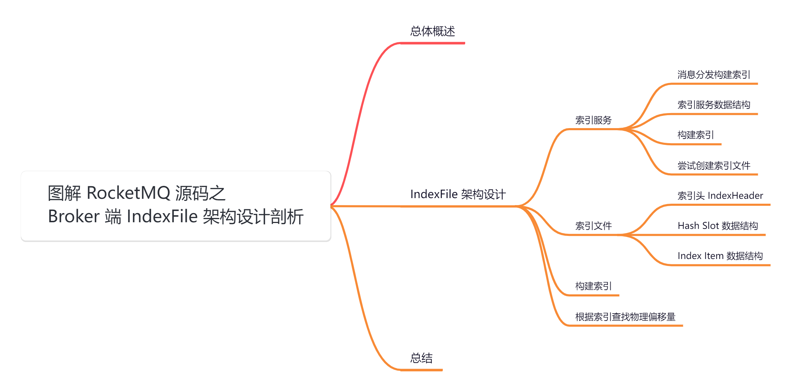

## **01 总体概述**

消息存储是 RocketMQ 整个系统的核心，直接决定着吞吐性能和高可用性。RocketMQ 存储消息并没有借助外部组件，而是「**直接操作文件**」，借助 java NIO 的力量使得 I/O 性能十分高。

当消息来的时候，顺序追加写入 [CommitLog](http://commitlog/) 文件中。为了 [Consumer](http://consumer/) 消费消息的时候能够方便的根据 topic 查询消息，在 [CommitLog](http://commitlog/) 文件的基础上衍生出了 [CosumerQueue](http://cosumerqueue/) 文件用来存放了某 topic 的消息在 [CommitLog](http://commitlog/) 中的偏移位置。此外为了支持根据消息 key 查询消息，还构建了 [indexFile](http://indexfile%20/) 文件。

这三个文件就是 RocketMQ 的主要存储内容，大致结构如下图所示：

今天我们继续来剖析下底层三大核心存储文件之一：[IndexFile](http://indexfile/) 底层存储架构设计究竟是怎样的，它又是在什么时机下产生的呢？

## **02 IndexFile 架构设计**

除了正常的生产、消费消息外，RocketMQ 还提供了根据 [msg key](http://msg%20key/) 进行查询的功能，将消息 key 相同的消息一并查出。

// 构建Message参数

Message msg \= new Message("TopicTest", // 消息topic

"TagA", // 消息Tag

"key1 key2 key3", // 消息keys，多个key用" "隔开

"hello huazai!".getBytes(RemotingHelper.DEFAULT\_CHARSET)); // 消息体

我们当然可以通过扫描全量的 [CommitLog](http://commitlog/) 将相同 [msg key](http://msg%20key/) 类型的消息过滤出来，但性能堪忧，而且涉及大量的[I/O](http://i/O) 运算。

[IndexFile](http://indexfile/) 就是为了实现快速查找目标消息而衍生的索引文件。

## **2.1 索引服务**

当读取出来的一条完整消息 [DispatchRequest](http://dispatchrequest/) 之后，会被分发 [doDispatch](http://dodispatch/) 出去，分发处理的接口是 [CommitLogDispatcher](http://commitlogdispatcher/)。

[DefaultMessageStore](http://defaultmessagestore%20/) 创建时默认创建了两个分发处理器 [CommitLogDispatcherBuildConsumeQueue](http://commitlogdispatcherbuildconsumequeue%20/) 和 [CommitLogDispatcherBuildIndex](http://commitlogdispatcherbuildindex/)，看名字就知道是分发出去构建「**消息队列 ConsumeQueue**」和「**索引 IndexFile**」。

关于构建「**消息队列 ConsumeQueue**」在 [【Broker端源码分析系列第二十七篇】图解 RocketMQ 源码之Broker端 ConsumeQueue 架构设计](https://articles.zsxq.com/id_wfu6wxlbedo6.html) 这篇中已经剖析过。

### **2.1.1 消息分发**

通过上面得知 [CommitLog](http://commitlog/) 消息分发构建索引，默认配置是启用了「**消息索引**」的，所以最终会调用 [IndexService](http://indexservice/) 服务来构建索引。

public class DefaultMessageStore implements MessageStore {

// CommitLog 文件转发器组件

private final LinkedList<CommitLogDispatcher> dispatcherList;

public DefaultMessageStore(final MessageStoreConfig messageStoreConfig, final BrokerStatsManager brokerStatsManager,

final MessageArrivingListener messageArrivingListener, final BrokerConfig brokerConfig, final ConcurrentMap<String, TopicConfig> topicConfigTable) throws IOException {

// 设置消息分发服务列表组件，分别是构建 ConsumeQueue 索引和 IndexFile 索引，监听CommitLog文件中的新消息存储，然后会调用列表中的CommitLogDispatcher#dispatch方法

this.dispatcherList = new LinkedList<>();

....

// 通知 IndexFie 的 Dispatcher,可用于更新 IndexFile 的时间戳信息

this.dispatcherList.addLast(new CommitLogDispatcherBuildIndex());

}

// 循环进行分发

public void doDispatch(DispatchRequest req) {

for (CommitLogDispatcher dispatcher : this.dispatcherList) {

dispatcher.dispatch(req);

}

}

// 构建索引文件

class CommitLogDispatcherBuildIndex implements CommitLogDispatcher {

@Override

public void dispatch(DispatchRequest request) {

// 如果消息索引功能启用

if (DefaultMessageStore.this.messageStoreConfig.isMessageIndexEnable()) {

// 构建消息索引

DefaultMessageStore.this.indexService.buildIndex(request);

}

}

}

}

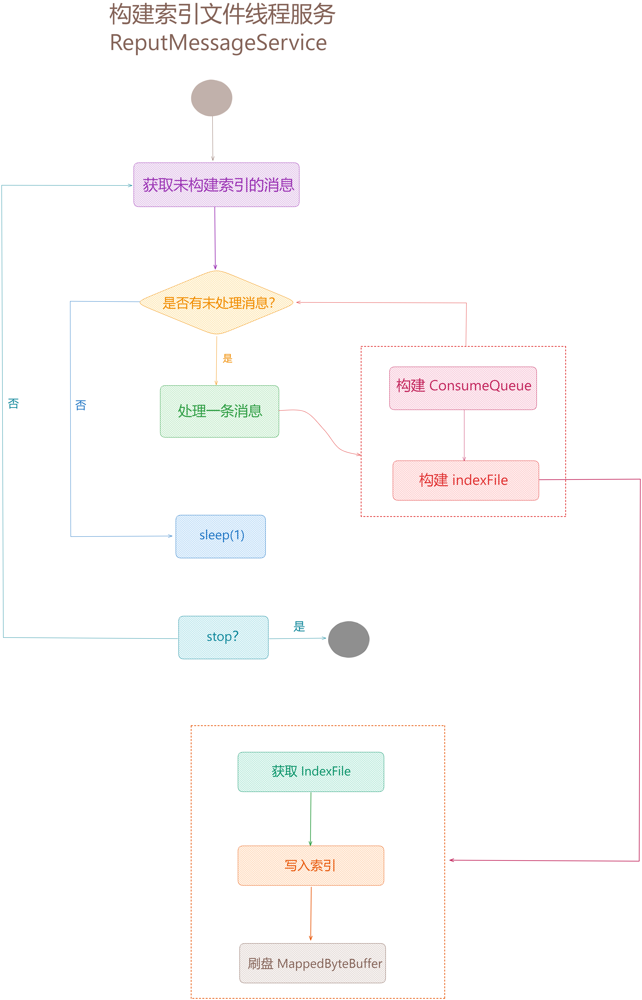

### **2.1.2 索引服务数据结构**

源码位置：[https://github.com/apache/rocketmq/blob/release-5.1.2/store/src/main/java/org/apache/rocketmq/store/](https://github.com/apache/rocketmq/blob/release-5.1.2/store/src/main/java/org/apache/rocketmq/store/index/IndexService.java)[index](https://github.com/apache/rocketmq/blob/release-5.1.2/store/src/main/java/org/apache/rocketmq/store/index/IndexService.java)[/](https://github.com/apache/rocketmq/blob/release-5.1.2/store/src/main/java/org/apache/rocketmq/store/index/IndexService.java)[IndexService](https://github.com/apache/rocketmq/blob/release-5.1.2/store/src/main/java/org/apache/rocketmq/store/index/IndexService.java)[.java](https://github.com/apache/rocketmq/blob/release-5.1.2/store/src/main/java/org/apache/rocketmq/store/index/IndexService.java)

[IndexService](http://indexservice%20/) 也是在 [DefaultMessageStore](http://defaultmessagestore%20/) 创建时初始化的，从构造中可以知道索引的设计有一个 [hash slot](http://%20hash%20slot/)「**Hash 槽**」的概念，默认 [hash slot](http://hash%20slot/) 的数量是「**500 万**」个，然后还有一个「**索引数量**」，默认是「**500 万 \* 4 = 2000 万**」个。然后可能是由多个索引文件 [IndexFile](http://indexfile%20/) 构成，索引文件的存储路径默认是 [~/store/index](http://~/store/index)。

public class IndexService {

private static final Logger LOGGER \= LoggerFactory.getLogger(LoggerName.STORE\_LOGGER\_NAME);

/\*\*

\* Maximum times to attempt index file creation.

\*/

private static final int MAX\_TRY\_IDX\_CREATE \= 3;

private final DefaultMessageStore defaultMessageStore;

// 最大槽位数量（5000000）

private final int hashSlotNum;

// 索引数量（5000000 \* 4）

private final int indexNum;

// 存储路径 ~/store/index

private final String storePath;

// indexFile 列表

private final ArrayList<IndexFile> indexFileList = new ArrayList<>();

// 读写锁

private final ReadWriteLock readWriteLock \= new ReentrantReadWriteLock();

public IndexService(final DefaultMessageStore store) {

this.defaultMessageStore = store;

// 最大槽位数量（5000000）

this.hashSlotNum = store.getMessageStoreConfig().getMaxHashSlotNum();

// 索引数量（5000000 \* 4）

this.indexNum = store.getMessageStoreConfig().getMaxIndexNum();

// 存储路径 ~/store/index

this.storePath =

StorePathConfigHelper.getStorePathIndex(defaultMessageStore.getMessageStoreConfig().getStorePathRootDir());

}

....

}

### **2.1.3 构建索引**

消息分发出来构建索引，核心就两步：

1.  获取或者创建索引文件 [IndexFile](http://indexfile/)。
2.  然后构建索引写入索引文件。

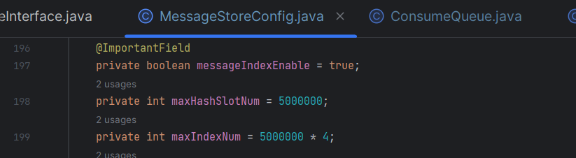

/\*\*

\* 构建索引

\* @param req

\*/

public void buildIndex(DispatchRequest req) {

// 尝试获取并创建索引文件

IndexFile indexFile \= retryGetAndCreateIndexFile();

if (indexFile != null) {

// 获取索引文件的物理偏移量结束位置

long endPhyOffset \= indexFile.getEndPhyOffset();

// 获取请求中的消息

DispatchRequest msg \= req;

// 获取消息的主题

String topic \= msg.getTopic();

// 获取消息的键

String keys \= msg.getKeys();

// 如果消息在索引文件物理偏移量结束位置之前已经提交

if (msg.getCommitLogOffset() < endPhyOffset) {

return;

}

// 获取消息的事务类型

final int tranType \= MessageSysFlag.getTransactionValue(msg.getSysFlag());

// 根据事务类型进行判断

switch (tranType) {

case MessageSysFlag.TRANSACTION\_NOT\_TYPE: // 非事务消息

case MessageSysFlag.TRANSACTION\_PREPARED\_TYPE: // 预备事务消息

case MessageSysFlag.TRANSACTION\_COMMIT\_TYPE: // 提交事务消息

break;

case MessageSysFlag.TRANSACTION\_ROLLBACK\_TYPE: // 事务回滚消息

return;

}

if (req.getUniqKey() != null) { // 如果消息有唯一键

// 将唯一键放入索引文件，消息创建时会去设置消息的唯一ID

indexFile = putKey(indexFile, msg, buildKey(topic, req.getUniqKey()));

if (indexFile == null) {

LOGGER.error("putKey error commitlog {} uniqkey {}", req.getCommitLogOffset(), req.getUniqKey());

return;

}

}

// 如果消息 key 不为空 && 长度大于 0

if (keys != null && keys.length() > 0) {

// 根据 key 分隔符拆分

String\[\] keyset = keys.split(MessageConst.KEY\_SEPARATOR);

// 遍历 keyset

for (int i \= 0; i < keyset.length; i++) {

String key \= keyset\[i\];

if (key.length() > 0) {

// 将 key 放入索引文件，消息创建时会去设置消息的唯一ID

indexFile = putKey(indexFile, msg, buildKey(topic, key));

if (indexFile == null) {

LOGGER.error("putKey error commitlog {} uniqkey {}", req.getCommitLogOffset(), req.getUniqKey());

return;

}

}

}

}

} else {

LOGGER.error("build index error, stop building index");

}

}

private String buildKey(final String topic, final String key) {

return topic + "#" + key;

}

### **2.1.4 尝试创建索引文件**

/\*\*

\* Retries to get or create index file.

\*

\* @return {@link IndexFile} or null on failure.

\*/

public IndexFile retryGetAndCreateIndexFile() {

IndexFile indexFile \= null;

// 最多遍历 3 次

for (int times \= 0; null == indexFile && times < MAX\_TRY\_IDX\_CREATE; times++) {

// 获取或者创建索引文件

indexFile = this.getAndCreateLastIndexFile();

if (null != indexFile) {

break;

}

try {

LOGGER.info("Tried to create index file " + times + " times");

Thread.sleep(1000);

} catch (InterruptedException e) {

LOGGER.error("Interrupted", e);

}

}

if (null == indexFile) {

this.defaultMessageStore.getRunningFlags().makeIndexFileError();

LOGGER.error("Mark index file cannot build flag");

}

return indexFile;

}

public IndexFile getAndCreateLastIndexFile() {

IndexFile indexFile \= null;

// 上一个索引文件

IndexFile prevIndexFile \= null;

// 上一个文件的末尾物理偏移量

long lastUpdateEndPhyOffset \= 0;

// 上一个文件的索引更新时间

long lastUpdateIndexTimestamp \= 0;

{

// 加读锁

this.readWriteLock.readLock().lock();

if (!this.indexFileList.isEmpty()) {

IndexFile tmp \= this.indexFileList.get(this.indexFileList.size() - 1);

// 索引文件未写满

if (!tmp.isWriteFull()) {

indexFile = tmp;

} else {

// 索引文件写满了

lastUpdateEndPhyOffset = tmp.getEndPhyOffset();

lastUpdateIndexTimestamp = tmp.getEndTimestamp();

prevIndexFile = tmp;

}

}

// 解锁

this.readWriteLock.readLock().unlock();

}

if (indexFile == null) {

try {

// 文件路径：${user.home}/store/index/timestamp

String fileName \=

this.storePath + File.separator

\+ UtilAll.timeMillisToHumanString(System.currentTimeMillis());

// 创建索引文件

indexFile =

new IndexFile(fileName, this.hashSlotNum, this.indexNum, lastUpdateEndPhyOffset,

lastUpdateIndexTimestamp);

// 加写锁

this.readWriteLock.writeLock().lock();

// 添加索引文件到列表中

this.indexFileList.add(indexFile);

} catch (Exception e) {

LOGGER.error("getLastIndexFile exception ", e);

} finally {

// 解锁

this.readWriteLock.writeLock().unlock();

}

if (indexFile != null) {

final IndexFile flushThisFile \= prevIndexFile;

Thread flushThread \= new Thread(new AbstractBrokerRunnable(defaultMessageStore.getBrokerConfig()) {

@Override

// 刷新上一个索引文件

public void run0() {

IndexService.this.flush(flushThisFile);

}

}, "FlushIndexFileThread");

// 后台线程

flushThread.setDaemon(true);

// 启动线程

flushThread.start();

}

}

return indexFile;

}

public void flush(final IndexFile f) {

if (null == f) { // 如果索引文件为空 直接返回

return;

}

// 初始化索引消息时间戳为0

long indexMsgTimestamp \= 0;

// 如果索引文件已经写满

if (f.isWriteFull()) {

// 获取索引文件的结束时间戳

indexMsgTimestamp = f.getEndTimestamp();

}

// 调用索引文件的flush方法，将缓冲区数据刷入磁盘

f.flush();

// 如果索引消息时间戳大于0

if (indexMsgTimestamp > 0) {

// 设置存储点的索引消息时间戳为索引消息时间戳

this.defaultMessageStore.getStoreCheckpoint().setIndexMsgTimestamp(indexMsgTimestamp);

// 刷新存储点检查点

this.defaultMessageStore.getStoreCheckpoint().flush();

}

}

1.  获取或者创建索引文件时，会先获取 [indexFileList](http://indexfilelist%20/) 列表中最后一个 [IndexFile](http://indexfile/)，如果 [IndexFile](http://indexfile%20/) 存在且还未写满，说明这个 [IndexFile](http://indexfile%20/) 还可以继续写入。如果 [indexFileList](http://indexfilelist%20/) 中没有索引文件或者 [IndexFile](http://indexfile%20/) 已经写满了，就需要创建一个新的 [IndexFile](http://indexfile/)。
2.  创建新的索引文件时，文件名称是以当前时间戳来命名，创建好新的 [IndexFile](http://indexfile%20/) 后，还会将上一个 [IndexFile](http://indexfile/) 刷盘，进去会发现 [IndexFile](http://indexfile/) 也是基于 [MappedFile](http://mappedfile%20/) 来做文件映射，所以也需要将数据 flush 到磁盘。
3.  [IndexFile](http://indexfile/) 的刷盘不像 [ConsumeQueue](http://consumequeue%20/) 的刷盘，是由一个线程服务来定时刷，[IndexFile](http://indexfile/) 的刷盘是在自己写满之后，创建了一个新的 [IndexFile](http://indexfile/) 的时候才会通过一个后续线程服务去执行刷盘操作。

  
而写入索引，其实就是调用 [IndexFile](http://indexfile%20/) 写入索引信息，而 [IndexFile](http://indexfile/) 写满了之后，会自动创建一个新的 [IndexFile](http://indexfile/) 来写入索引信息。

/\*\*

\* 写入索引消息 key

\* @param indexFile

\* @param msg

\* @param idxKey

\* @return

\*/

private IndexFile putKey(IndexFile indexFile, DispatchRequest msg, String idxKey) {

for (boolean ok \= indexFile.putKey(idxKey, msg.getCommitLogOffset(), msg.getStoreTimestamp()); !ok; ) {

LOGGER.warn("Index file \[" + indexFile.getFileName() + "\] is full, trying to create another one");

// 索引文件写满之后会返回 false，就创建一个新的 IndexFile，继续写入

indexFile = retryGetAndCreateIndexFile();

if (null == indexFile) {

return null;

}

// 写入索引

ok = indexFile.putKey(idxKey, msg.getCommitLogOffset(), msg.getStoreTimestamp());

}

return indexFile;

}

##   
**2.2 索引文件**

[IndexFile](http://indexfile/) 可以看做是一个 key 的哈希索引文件，通过计算 key 的 hash 值，快速找到某个 key 对应的消息在[commitLog](http://commitlog%20/) 中的位置。

综上可以得知它也是通过 [MappedFile](http://mappedfile%20/) 来映射磁盘文件，然后也会拿到一块内存映射缓冲区 [MappedByteBuffer](http://mappedbytebuffer%20/) 来读写数据。

索引文件的名称是以当前时间来命名的，而文件的大小是计算出来的，通过源码可以看到 [IndexFile](http://indexfile%20/) 分为三个部分：文件头、哈希槽、索引。

1.  文件头： [indexHeader](http://indexheader/) 固定占 40 字节。
2.  哈希槽：[hash slot](http://hash%20slot/) 默认是 500W 个，一个占 4 字节，哈希槽占 500W \* 4字节 ≈ 19MB。
3.  索引：[Index](http://index%20/) 索引默认是 500W \* 4 个，一个占 20 字节，索引部分占 500W \* 4 \* 20字节 ≈ 381MB。

如图所示，每个「**IndexFile**」文件的大小是固定的，一个「**IndexFile**」文件大约可以保存「**2000w**」个消息的索引，「**IndexFile**」的索引文件结构如下：

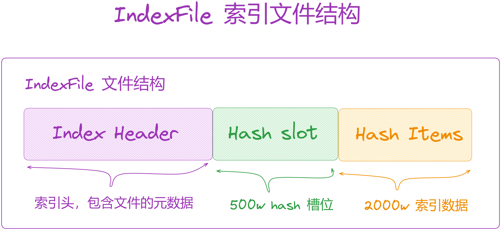

也就是说一个 [index](http://index/) 索引文件的数据由 3 部分组成，大小加起来约等于 [400 MB](http://400mb/)，然后基于此去创建 [MappedFile](http://mappedfile/)。

哈希槽指向索引，主要解决 [hash](http://hash%20/) 冲突的问题，类似于 [HashMap](http://hashmap%20/) 的结构。一个索引固定占 20 字节，索引有一个指针指向下一个索引，形成一个链表。

public class IndexFile {

private static final Logger log \= LoggerFactory.getLogger(LoggerName.STORE\_LOGGER\_NAME);

// hash 槽位大小 4 字节

private static int hashSlotSize \= 4;

/\*\*

\* 索引大小

\* Each index's store unit. Format:

\* <pre>

\* ┌───────────────┬───────────────────────────────┬───────────────┬───────────────┐

\* │ Key HashCode │ Physical Offset │ Time Diff │ Next Index Pos│

\* │ (4 Bytes) │ (8 Bytes) │ (4 Bytes) │ (4 Bytes) │

\* ├───────────────┴───────────────────────────────┴───────────────┴───────────────┤

\* │ Index Store Unit │

\* │ │

\* </pre>

\* Each index's store unit. Size:

\* Key HashCode(4) + Physical Offset(8) + Time Diff(4) + Next Index Pos(4) = 20 Bytes

\*/

private static int indexSize \= 20;

private static int invalidIndex \= 0;

// hash 槽位数量 默认是 500W 个

private final int hashSlotNum;

// 索引数量 默认是 500W \* 4 个

private final int indexNum;

// 文件总大小

private final int fileTotalSize;

// 内存映射文件

private final MappedFile mappedFile;

// 内存映射区域

private final MappedByteBuffer mappedByteBuffer;

// 索引头

private final IndexHeader indexHeader;

public IndexFile(final String fileName, final int hashSlotNum, final int indexNum,

final long endPhyOffset, final long endTimestamp) throws IOException {

// 文件总大小 = 文件头大小 + （哈希槽数量 500w \* 哈希槽大小 4） + （索引数量 2000w \* 索引大小 20）

this.fileTotalSize =

IndexHeader.INDEX\_HEADER\_SIZE + (hashSlotNum \* hashSlotSize) + (indexNum \* indexSize);

// 以 fileName 和 fileTotalSize 为参数创建一个默认的 MappedFile

this.mappedFile = new DefaultMappedFile(fileName, fileTotalSize);

// 获取 MappedByteBuffer

this.mappedByteBuffer = this.mappedFile.getMappedByteBuffer();

// 设置哈希槽数量和索引数量

this.hashSlotNum = hashSlotNum;

this.indexNum = indexNum;

// 创建一个 byteBuffer

ByteBuffer byteBuffer \= this.mappedByteBuffer.slice();

// 创建索引头对象

this.indexHeader = new IndexHeader(byteBuffer);

// 如果 endPhyOffset（物理偏移量）大于 0，则设置索引头的起始和结束物理偏移量为 endPhyOffset

if (endPhyOffset > 0) {

this.indexHeader.setBeginPhyOffset(endPhyOffset);

this.indexHeader.setEndPhyOffset(endPhyOffset);

}

// 如果 endTimestamp（结束时间戳）大于0，则设置索引头的起始和结束时间戳为 endTimestamp

if (endTimestamp > 0) {

this.indexHeader.setBeginTimestamp(endTimestamp);

this.indexHeader.setEndTimestamp(endTimestamp);

}

}

....

}

### **2.2.1 索引头 IndexHeader**

「**IndexHeader**」记录「**IndexFile**」文件的整体信息， 总共占 40 个字节，会存储在索引文件的开头，用来存一些重要的元数据。

/\*\*

\* Index File Header. Format:

\* <pre>

\* ┌───────────────────────────────┬───────────────────────────────┬───────────────────────────────┬───────────────────────────────┬───────────────────┬───────────────────┐

\* │ Begin Timestamp │ End Timestamp │ Begin Physical Offset │ End Physical Offset │ Hash Slot Count │ Index Count │

\* │ (8 Bytes) │ (8 Bytes) │ (8 Bytes) │ (8 Bytes) │ (4 Bytes) │ (4 Bytes) │

\* ├───────────────────────────────┴───────────────────────────────┴───────────────────────────────┴───────────────────────────────┴───────────────────┴───────────────────┤

\* │ Index File Header │

\* │

\* </pre>

\* Index File Header. Size:

\* Begin Timestamp(8) + End Timestamp(8) + Begin Physical Offset(8) + End Physical Offset(8) + Hash Slot Count(4) + Index Count(4) = 40 Bytes

\*/

public class IndexHeader {

// 共 40 个字节

public static final int INDEX\_HEADER\_SIZE \= 40;

// 当前 indexFile 文件中第一条消息的存储时间

private static int beginTimestampIndex \= 0;

// 当前 indexFile 文件中最后一条消息存储时间；

private static int endTimestampIndex \= 8;

// 当前 indexFile 文件中第一条消息在 CommitLog 中的偏移量

private static int beginPhyoffsetIndex \= 16;

// 当前 indexFile 文件中最后一条消息在 CommitLog 中的偏移量

private static int endPhyoffsetIndex \= 24;

// 已经使用的 hash 槽的个数

private static int hashSlotcountIndex \= 32;

// 索引项中记录的所有消息索引总数

private static int indexCountIndex \= 36;

private final ByteBuffer byteBuffer;

// 开始时间 8个字节

private final AtomicLong beginTimestamp \= new AtomicLong(0);

// 结束时间 8个字节

private final AtomicLong endTimestamp \= new AtomicLong(0);

// 索引开始物理偏移量 8个字节

private final AtomicLong beginPhyOffset \= new AtomicLong(0);

// 索引结束物理偏移量 8个字节

private final AtomicLong endPhyOffset \= new AtomicLong(0);

// 哈希槽数量 4个字节

private final AtomicInteger hashSlotCount \= new AtomicInteger(0);

// 索引数量 4个字节

private final AtomicInteger indexCount \= new AtomicInteger(1);

....

}

1.  [beginTimestampIndex](http://begintimestampindex/)：当前 [indexFile](http://indexfile%20/) 文件中第一条消息的存储时间。
2.  [endTimestampIndex](http://endtimestampindex/)：当前 [indexFile](http://indexfile/) 文件中最后一条消息存储时间。
3.  [beginPhyoffsetIndex](http://beginphyoffsetindex/)：当前 [indexFile](http://indexfile/) 文件中第一条消息在 [CommitLog](http://commitlog%20/) 中的偏移量。
4.  [endPhyoffsetIndex](http://endphyoffsetindex/)：当前 [indexFile](http://indexfile/) 文件中最后一条消息在 [CommitLog](http://commitlog/) 中的偏移量。
5.  [hashSlotCountIndex](http://hashslotcountindex/)：已经使用的 hash 槽的个数。
6.  [indexCountIndex](http://indexcountindex/)：索引项中记录的所有消息索引总数。

### **2.2.2 Hash Slot 数据结构**

RocketMQ 在每个「**IndexFile**」文件中划分了「**500w**」个 hash 槽，在向文件中添加「**消息索引**」的时候，会取出消息的 Key 计算 hash 值，然后对 hash 槽总数取余，来判断应该放到哪个 hash 槽。

> 实际会使用 Topic + "#" + key 进行拼装做为 IndexFile 文件的 Key。

每个 hash 槽存储的是 index 索引单元的 [indexNo](http://indexno/)，添加索引时会将 [key 的 hash 值 % 500W](http://key%20%E7%9A%84%20hash%20%E5%80%BC%20%%20500W) 的结果计算哈希槽序号，然后将 index 索引单元的 [indexNo](http://indexno/) 放入 [slot](http://slot%20/) 槽中，[indexNo](http://indexno/) 是 int 类型，[slots](http://slots/) 槽位总共有 [500W](http://500w/) 个，因此 [slots](http://slots/) 槽位占用的大小是 [500w \* 4=2000w](http://500w%20%2A%204=2000w/)。

### **2.2.3 Index Item 数据结构**

索引项中记录每个 Key 的索引信息，其索引单元结构如下：

  
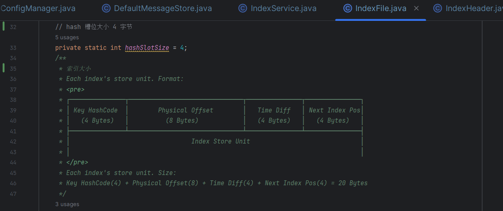

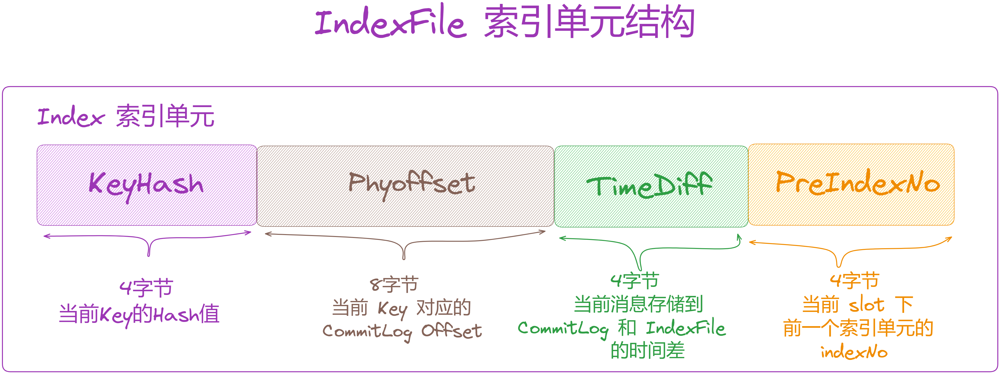

1.  [keyHash](http://keyhash/)：消息的 key 计算出来的的 [hashcode](http://hashcode/) 值。
2.  [phyOffset](http://phyoffset/)：消息在 [CommitLog](http://commitlog/) 中的物理偏移量。
3.  [timeDiff](http://timediff/)：消息的存储时间减去 [IndexHeader](http://indexheader/) 中的 [beginTimestamp](http://begintimestamp/)，当前 [indexFile](http://indexfile/) 文件中第一条消息的存储时间。
4.  [preIndexNo](http://preindexno/)：当哈希冲突的时候，用于指向上一个索引，可以看做当哈希冲突的时候，使用一个链表将该哈希槽下的所有元素串起来，使用头插法增加新的元素。

在 [IndexFile](http://indexfile/) 中最复杂的是 [Slots](http://slots/) 与 [Indexes](http://indexes/) 间的关系。在实际存储时，[Indexes](http://indexes/) 是在 [Slots](http://slots/) 后面的，但为了更好理解，将它们的关系展示为如下形式：

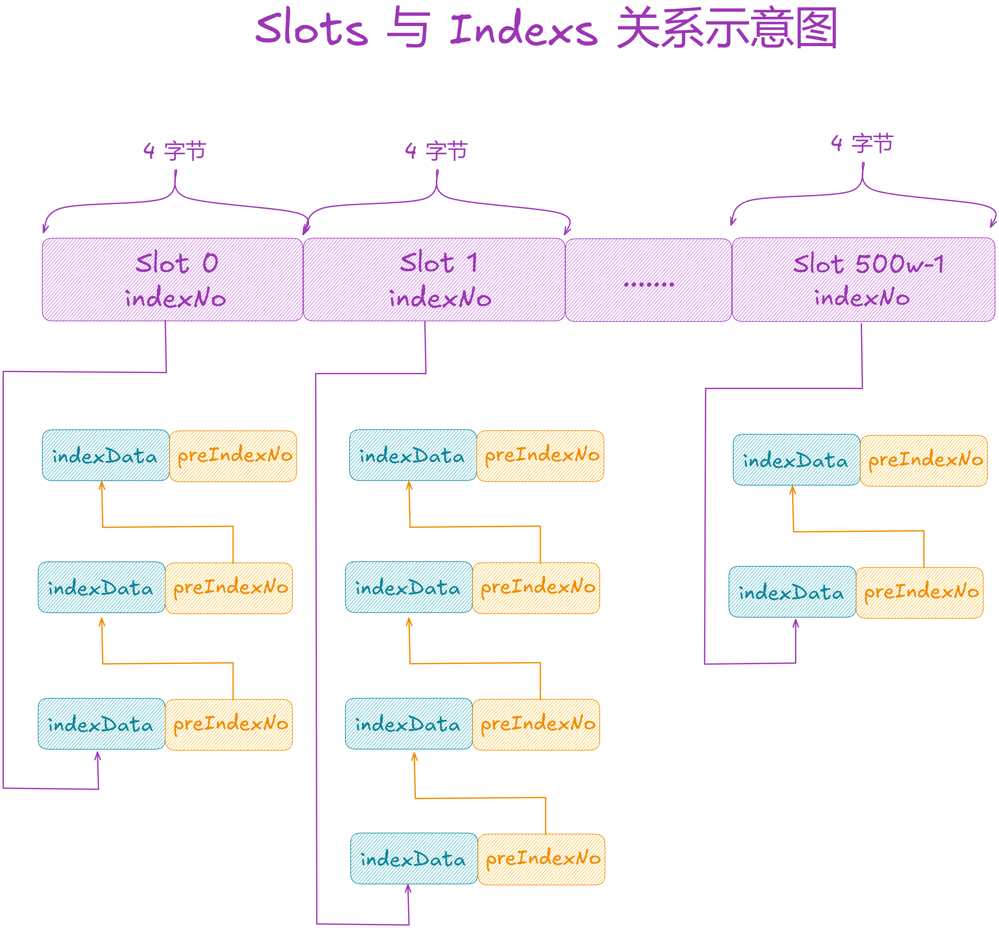

> 每条消息 key 的 hash 值 % 500w 的结果即为 slot 槽位，然后该 slot 记录此 index 索引单元的 indexNo，根据这个 indexNo 可以计算出该 index 单元在 indexFile 中的位置。
> 
> 不过，该取模结果的重复率是很高的， 为了解决该问题，在每个 index 索引单元中增加了 preIndexNo，用来指定该 slot 中当前 index 索引单元的前一个 index 索引单元。如上图所示，每个 index 索引单元都记录此 slot 的前一个索引单元)。
> 
> 而 slot 中始终存放的是其下最新的 index 索引单元的 indexNo，这样的话只要找到了 slot 就可以找到其最新的index 索引单元，而通过这个 index 索引单元就可以依次找到其之前的所有 index 索引单元。
> 
> slot 记录的索引单元的 indexNo 是 index 索引单元在 indexFile 中的流水号，从 0 开始依次递增。即在一个indexFile 中所有 indexNo 都是以此递增的。但是 indexNo 在 index 索引单元中是没有维护的，而是通过 indexes 中依次数出来的。

##   
**2.3 构建索引**

/\*\*

\* 构建索引

\* @param key 消息唯一Key

\* @param phyOffset 消息物理偏移量

\* @param storeTimestamp 消息存储时间

\* @return

\*/

public boolean putKey(final String key, final long phyOffset, final long storeTimestamp) {

if (this.indexHeader.getIndexCount() < this.indexNum) {

// key hash

int keyHash \= indexKeyHashMethod(key);

// hash slot

int slotPos \= keyHash % this.hashSlotNum;

// hash slot 偏移量，前面 500W显示slot，计算出slot的偏移量

int absSlotPos \= IndexHeader.INDEX\_HEADER\_SIZE + slotPos \* hashSlotSize;

try {

// hash slot 里存的索引值（没有值就返回 0）

int slotValue \= this.mappedByteBuffer.getInt(absSlotPos);

if (slotValue <= invalidIndex || slotValue > this.indexHeader.getIndexCount()) {

slotValue = invalidIndex;

}

// 消息存储时间到第一个存储的时间的差值

long timeDiff \= storeTimestamp - this.indexHeader.getBeginTimestamp();

// 单位秒

timeDiff = timeDiff / 1000;

// 不同时间差处理

if (this.indexHeader.getBeginTimestamp() <= 0) {

timeDiff = 0;

} else if (timeDiff > Integer.MAX\_VALUE) {

timeDiff = Integer.MAX\_VALUE;

} else if (timeDiff < 0) {

timeDiff = 0;

}

// 索引绝对位置，索引是顺序写入

int absIndexPos \=

IndexHeader.INDEX\_HEADER\_SIZE + this.hashSlotNum \* hashSlotSize

\+ this.indexHeader.getIndexCount() \* indexSize;

// 写入索引

this.mappedByteBuffer.putInt(absIndexPos, keyHash);

this.mappedByteBuffer.putLong(absIndexPos + 4, phyOffset);

this.mappedByteBuffer.putInt(absIndexPos + 4 + 8, (int) timeDiff);

// 写入 hash slot 里的索引（上一个索引）

this.mappedByteBuffer.putInt(absIndexPos + 4 + 8 + 4, slotValue);

// 更新哈希槽

this.mappedByteBuffer.putInt(absSlotPos, this.indexHeader.getIndexCount());

// 第一个索引，写入开始时的偏移量，和开始存储的时间

if (this.indexHeader.getIndexCount() <= 1) {

this.indexHeader.setBeginPhyOffset(phyOffset);

this.indexHeader.setBeginTimestamp(storeTimestamp);

}

// hash slot 没有值，表示拿了一个新的哈希槽，所以已使用的哈希槽数量自增。

if (invalidIndex == slotValue) {

this.indexHeader.incHashSlotCount();

}

// 索引数量自增

this.indexHeader.incIndexCount();

// 更新结束偏移量和时间

this.indexHeader.setEndPhyOffset(phyOffset);

this.indexHeader.setEndTimestamp(storeTimestamp);

return true;

} catch (Exception e) {

log.error("putKey exception, Key: " + key + " KeyHashCode: " + key.hashCode(), e);

}

} else {

log.warn("Over index file capacity: index count = " + this.indexHeader.getIndexCount()

\+ "; index max num = " + this.indexNum);

}

return false;

}

我们来看索引是怎么构建：

1.  首先根据消息的唯一 Key 计算一个 hash 值，然后模运算除以哈希槽数量得到哈希槽位置，也就是说先锁定某一个哈希槽。然后计算出哈希槽的偏移量 [absSlotPos = 请求头大小 + 哈希槽索引 \* 哈希槽大小](http://xn--absslotpos%20=%20%20+%20%20%2A%20-i421dja0831bsa88bv33gta179rka894i634jma418xsj5p502f/)。
2.  接着读取哈希槽里的值 [slotValue](http://slotvalue/)（一个哈希槽 4 字节），然后计算了当前消息与这个文件的第一条消息的存储时间差 [timeDiff](http://timediff/)。
3.  这里存时间差，而不是当前时间戳，我猜是因为时间差只占 4 个字节，而时间戳要占 8 个字节，主要是为了节省存储空间。
4.  再计算索引写入的偏移量 [absIndexPos = 请求头大小 + 哈希槽数量 \* 哈希槽大小 + 已添加索引数量 \* 索引大小](http://xn--absindexpos%20=%20%20+%20%20%2A%20%20+%20%20%2A%20-fl98fwv6bja2251dsar71e583ktas5650armbka580oja3648hxa9030fma8571bwuzy05vla0402zfvkd1a/)。
5.  因为 [indexCount](http://indexcount%20/) 初始值为 1，所以索引是从下标 1 开始写入数据的，下标 0 的数据库是没有写入索引数据的。
6.  接着就从 [absIndexPos](http://absindexpos%20/) 开始写入索引信息，一个索引信息由四部分组成，共 20 字节：
7.  [keyHash](http://keyhash/)：4 字节，消息唯一 Key 的 hash 值。
8.  [phyOffset](http://phyoffset/)：8 字节，消息的物理偏移量。
9.  [timeDiff](http://timediff/)：4 字节，消息存储的时间差。
10.  [slotValue](http://slotvalue/)：4 字节，写入 hash slot 里的索引值。
11.  索引写入后，再向哈希槽里写入上一次的索引数量，其实这个就代表了索引的下标（0,1,2...），通过这个下标能计算出索引的偏移量。
12.  最后就是在更新索引头 [IndexHeader](http://indexheader%20/) 信息。

此时就可以知道怎么判断索引文件是否写满了，它就是判断当前已使用的索引数量是否超过了配置的索引数量，默认[2000W](http://2000w/)。索引文件写满之后，就会自动创建一个新的索引文件。

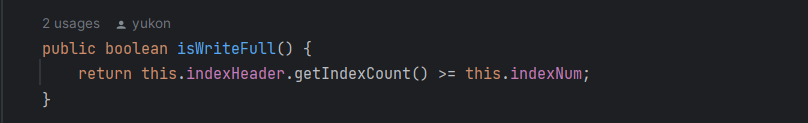

这里举个例子，比如现在有一条消息 Key 值 1，假设哈希槽的个数为 10，这里对哈希计算简化，直接用 1 对哈希槽个数取余，得到值为 0，那么这条消息将落入哈希槽 0 的位置，然后会在索引项区域建立该消息的索引信息：

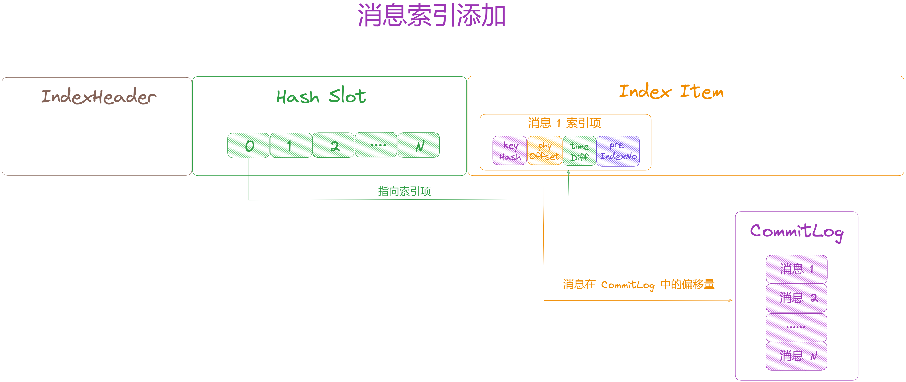

如果新增一条消息 2，它的 Key 值为 2，用 2 对哈希槽个数取余，依旧得到哈希槽 0，此时产生「**哈希冲突**」，将哈希槽 0 处存储的值改为消息 2 的索引项，并将消息 2 索引项中的 [preIndexNo](http://preindexno/) 指向消息 1 的索引项，形成一个链表：

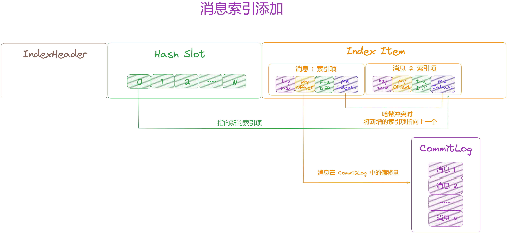

## **2.4 根据索引查找物理偏移量**

接着再来看下 [IndexFile](http://indexfile%20/) 是如何通过「**索引查询消息物理偏移量**」的，参数中 [phyOffsets](http://phyoffsets%20/) 就是要返回的消息物理偏移量，最多会读取 [maxNum](http://maxnum%20/) 条消息的物理偏移量。拿到物理偏移量之后，就可以从 [CommitLog](http://commitlog%20/) 读取到消息。

/\*\*

\* 根据索引查找物理偏移量

\* @param phyOffsets 要返回的消息物理偏移量，最多会读取 maxNum 条消息的物理偏移量

\* @param key 消息唯一Key

\* @param maxNum 最多读取多少条消息的物理偏移量

\* @param begin 查询消息存储的开始时间

\* @param end 查询消息存储的结束时间

\*/

public void selectPhyOffset(final List<Long> phyOffsets, final String key, final int maxNum,

final long begin, final long end) {

if (this.mappedFile.hold()) {

// key hash

int keyHash \= indexKeyHashMethod(key);

// hash slot

int slotPos \= keyHash % this.hashSlotNum;

// hash slot 位置

int absSlotPos \= IndexHeader.INDEX\_HEADER\_SIZE + slotPos \* hashSlotSize;

try {

// 先定位到 hash slot，再遍历其指向的索引链表

int slotValue \= this.mappedByteBuffer.getInt(absSlotPos);

if (slotValue <= invalidIndex || slotValue > this.indexHeader.getIndexCount()

|| this.indexHeader.getIndexCount() <= 1) {

} else {

// 从这个索引开始读，一个hash slot 有多个索引

for (int nextIndexToRead \= slotValue; ; ) {

if (phyOffsets.size() >= maxNum) {

break;

}

// 索引开始的位置

int absIndexPos \=

IndexHeader.INDEX\_HEADER\_SIZE + this.hashSlotNum \* hashSlotSize

\+ nextIndexToRead \* indexSize;

// 读取索引

int keyHashRead \= this.mappedByteBuffer.getInt(absIndexPos);

// 读取物理偏移量

long phyOffsetRead \= this.mappedByteBuffer.getLong(absIndexPos + 4);

// 读取时间差

long timeDiff \= this.mappedByteBuffer.getInt(absIndexPos + 4 + 8);

// 读取上一个索引

int prevIndexRead \= this.mappedByteBuffer.getInt(absIndexPos + 4 + 8 + 4);

if (timeDiff < 0) {

break;

}

timeDiff \*= 1000L;

// 得到存储时的时间

long timeRead \= this.indexHeader.getBeginTimestamp() + timeDiff;

// 判断时间范围

boolean timeMatched \= timeRead >= begin && timeRead <= end;

// hash 值匹配，且时间匹配

if (keyHash == keyHashRead && timeMatched) {

phyOffsets.add(phyOffsetRead);

}

if (prevIndexRead <= invalidIndex

|| prevIndexRead > this.indexHeader.getIndexCount()

|| prevIndexRead == nextIndexToRead || timeRead < begin) {

break;

}

// 指向上一个索引

nextIndexToRead = prevIndexRead;

}

}

} catch (Exception e) {

log.error("selectPhyOffset exception ", e);

} finally {

// 是否映射文件

this.mappedFile.release();

}

}

}

同构建索引类似，来看看是如何查找的：

1.  先根据消息的 key 计算 hash 值，然后算出在哪个哈希槽，得到槽的偏移量 [absSlotPos](http://absslotpos/)，然后读取这个哈希槽里面的值 [slotValue](http://slotvalue/)，这个值就是指向索引的下标。
2.  有了索引下标，就可以计算出要读取的索引位置，再读出这条索引的信息。先根据消息的时间差和索引文件的存储开始时间计算出消息的存储时间，然后判断这条消息是否在查询的时间范围内（[begin、end）](http://xn--beginend\)-zj3h/)，如果是的才会添加到 [phyOffsets](http://phyoffsets%20/) 中。
3.  接着判断存储时间如果小于开始时间，或者索引中记录的上一个索引下标和当前索引下标相同，说明已经没有可读的索引了，否则将继续读取上一个索引下标位置的索引数据。

## **03 总结**

通过全文剖析得出一个 [IndexService](http://indexservice%20/) 下有多个 [IndexFile](http://indexfile%20/) 索引文件，索引文件通过 [MappedFile](http://mappedfile%20/) 来映射磁盘文件。

其中一个 [IndexFile](http://indexfile%20/) 包含顺序的三部分：[索引头 IndexHeader + 哈希槽 HashSlots + 索引 IndexItem](http://xn--%20indexheader%20+%20%20hashslots%20+%20%20indexitem-3r74g594ghy1cldmiby506k79pkkba/)。

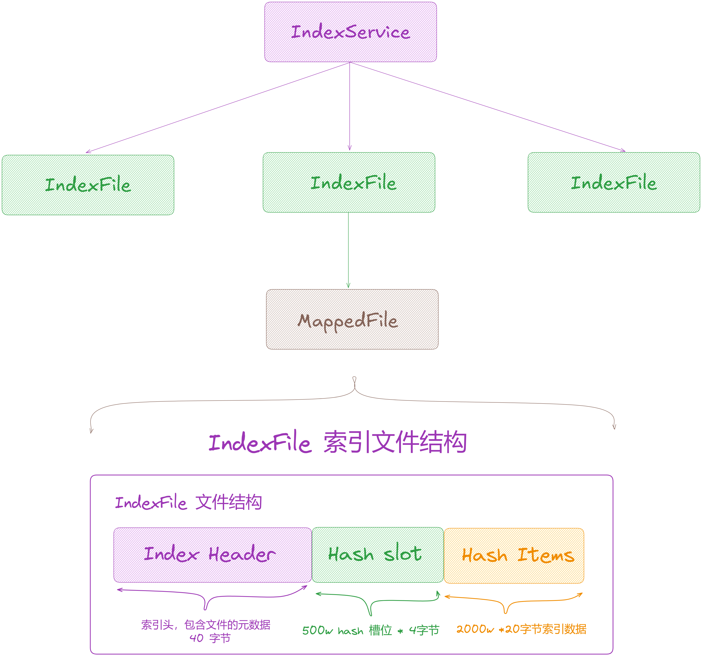