大家好，我是**华仔**, 又跟大家见面了。

从今天开始我将继续为大家奉上 RocketMQ 消费者源码剖析系列文章，正式开启「**RocketMQ 的服务端 Broker 源码之旅**」，这是第二十六篇，本篇我们将以「**RocketMQ 5.1.2**」版本为主，来剖析下 RocketMQ 源码之 Broker 端 DLedger 日志复制架构深度剖析。

这里我将以「**RocketMQ 5.1.2**」版本为主，通过「**场景驱动**」的方式带大家一点点的对 RocketMQ 源码进行深度剖析，正式开启「**RocketMQ 的源码之旅**」，跟我一起来掌握 RocketMQ 源码核心架构设计思想吧。

  
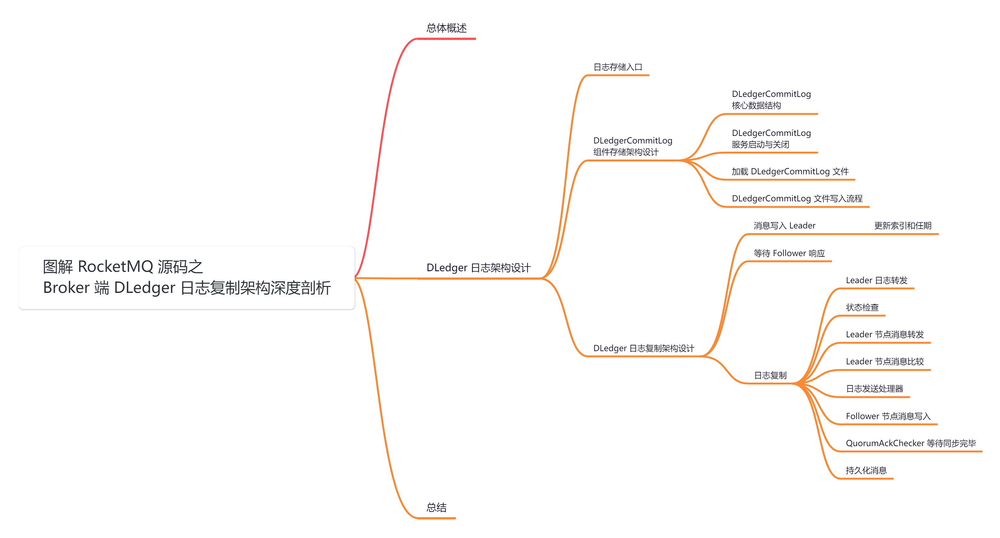

##   
**01 总体概述**

关于「**DLedger**」架构模式，我们主要剖析两个部分：

1.  「**DLedger**」架构下是如何选主的，它与原来普通的主从架构有什么区别？
2.  「**DLedger**」架构下是如何进行日志复制的，它与原来 [CommitLog](http://commitlog%20/) 日志复制有什么区别？

我们会分为两篇来深度剖析，今天这篇我们先来深度剖析下第二个问题是「**DLedger**」架构下是如何进行日志复制的。

##   
**02 DLedger 日志架构设计**

## **2.1 日志存储入口**

在 [【Broker端源码分析系列第十六篇】图解 RocketMQ 源码之 Broker MessageStore 存储架构](https://articles.zsxq.com/id_fon03obc0q26.html) 这篇中，我带大家深度剖析了日志存储的入口组件的底层架构，得知如果 Broker 收到消息之后会对消息进行 [CommitLog](http://commitlog/) 存储，在存储时会根据不同技术支持分配不同的组件进行存储：

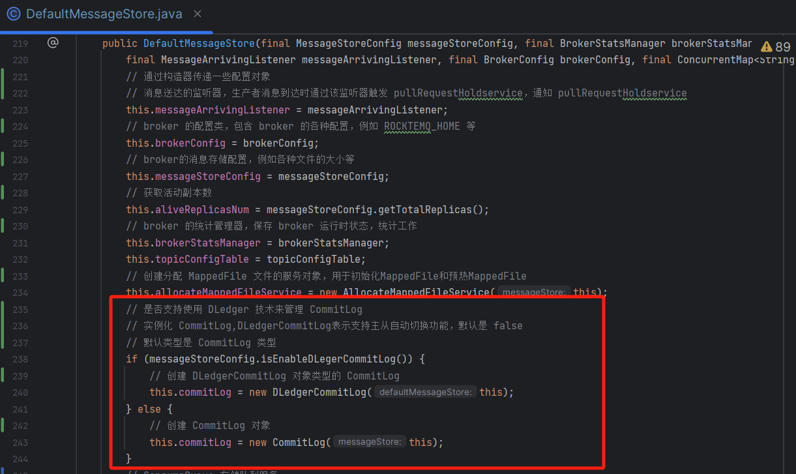

另外在 [【Broker端源码分析系列第十九篇】图解 RocketMQ 源码之 Broker 端CommitLog存储架构设计剖析](https://articles.zsxq.com/id_k1dlpc0wpe8p.html) 这篇中，我们得知单条日志消息写入是通过调用 [commitLog#asyncPutMessage](http://commitlog/#asyncPutMessage) 方法进行写入消息的。

那么如果开启了「**DLedger**」架构模式的话，由于它是继承了 [commitLog](http://commitlog/) 组件的，所以单体消息写入必然是通过

[DLedgerCommitLog#asyncPutMessage](http://dledgercommitlog/#asyncPutMessage) 方法进行写入消息的。

了解了这点之后，我们就来深度剖析下「**DLedger**」架构模式的 [DLedgerCommitLog](http://dledgercommitlog/#asyncPutMessage) 组件的存储架构设计。

## **2.2 DLedgerCommitLog 组件存储架构设计**

源码位置：[https://github.com/apache/rocketmq/blob/release-5.1.2/store/src/main/java/org/apache/rocketmq/store/](https://github.com/apache/rocketmq/blob/release-5.1.2/store/src/main/java/org/apache/rocketmq/store/dledger/DLedgerCommitLog.java)[dledger/DLedger](https://github.com/apache/rocketmq/blob/release-5.1.2/store/src/main/java/org/apache/rocketmq/store/dledger/DLedgerCommitLog.java)[CommitLog.java](https://github.com/apache/rocketmq/blob/release-5.1.2/store/src/main/java/org/apache/rocketmq/store/dledger/DLedgerCommitLog.java)

### **2.2.1 DLedgerCommitLog 核心数据结构**

由于 [DLedgerCommitLog](http://dledgercommitlog/#asyncPutMessage) 继承了 [commitLog](http://commitlog/) 组件，所以其核心数据结构直接继承过来了。这里我们重点看下[DLedgerCommitLog](http://dledgercommitlog/#asyncPutMessage) 类的数据结构。

/\*\*

\* 继承自 CommitLog 类，用来持久化存储元数据、实现恢复功能，并提高数据保护可靠性。

\*/

public class DLedgerCommitLog extends CommitLog {

// DLedger 服务器对象

private final DLedgerServer dLedgerServer;

// DLedger 配置对象

private final DLedgerConfig dLedgerConfig;

// DLedger 存储文件对象

private final DLedgerMmapFileStore dLedgerFileStore;

// DLedger 文件列表对象

private final MmapFileList dLedgerFileList;

// 节点 ID，用于标识 broker 的角色，0 代表 master，其他代表 slave

private final int id;

// 消息序列化器对象

private final MessageSerializer messageSerializer;

// DLedger 锁定开始时间

private volatile long beginTimeInDledgerLock \= 0;

// 用来分隔旧的 CommitLog 和 DLedger CommitLog 的偏移量

private long dividedCommitlogOffset \= -1;

// 是否正在恢复旧的 CommitLog

private boolean isInrecoveringOldCommitlog \= false;

// 消息 ID 构建器对象

private final StringBuilder msgIdBuilder \= new StringBuilder();

// 构造方法，接收 DefaultMessageStore 对象

public DLedgerCommitLog(final DefaultMessageStore defaultMessageStore) {

// 调用父类 CommitLog 的构造方法

super(defaultMessageStore);

// 初始化 DLedgerConfig 对象

dLedgerConfig = new DLedgerConfig();

// 设置 DLedgerConfig 的各项配置信息

.....

// 根据配置的 selfId 计算节点 ID

id = Integer.parseInt(dLedgerConfig.getSelfId().substring(1)) + 1;

// 创建 DLedgerServer 对象

dLedgerServer = new DLedgerServer(dLedgerConfig);

// 获取 DLedger 存储文件对象

dLedgerFileStore = (DLedgerMmapFileStore) dLedgerServer.getdLedgerStore();

// 初始化 appendHook，并添加到 dLedgerFileStore

DLedgerMmapFileStore.AppendHook appendHook \= (entry, buffer, bodyOffset) -> {

assert bodyOffset \=\= DLedgerEntry.BODY\_OFFSET;

buffer.position(buffer.position() + bodyOffset + MessageDecoder.PHY\_POS\_POSITION);

buffer.putLong(entry.getPos() + bodyOffset);

};

dLedgerFileStore.addAppendHook(appendHook);

// 获取 DLedger 文件列表对象

dLedgerFileList = dLedgerFileStore.getDataFileList();

// 初始化消息序列化器对象

this.messageSerializer = new MessageSerializer(defaultMessageStore.getMessageStoreConfig().getMaxMessageSize());

}

....

}

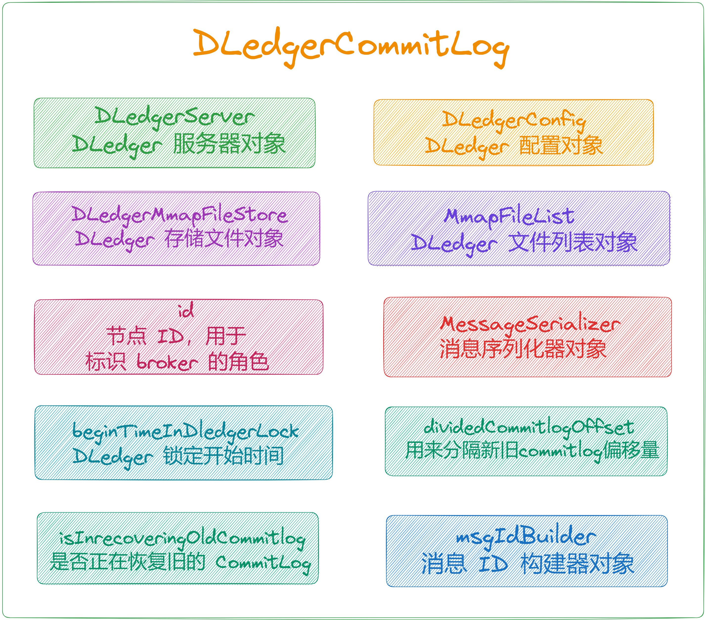

### **2.2.2 DLedgerCommitLog 服务启动与关闭**

它的启动与关闭很简单，就一个 [dLedgerServer](http://dledgerserver%20/) 服务。

public void start() {

// 启动 DLedgerServer

dLedgerServer.startup();

}

public void shutdown() {

// 关闭 DLedgerServer

dLedgerServer.shutdown();

}

### **2.2.3 加载 DLedgerCommitLog 文件**

public boolean load() {

// 很简单，直接调用父类的 load 方法进行加载

return super.load();

}

关于父类的 load 方法可以查看 [【Broker端源码分析系列第十九篇】图解 RocketMQ 源码之 Broker 端CommitLog存储架构设计剖析](https://articles.zsxq.com/id_k1dlpc0wpe8p.html) 中 3.3 节。

### **2.2.5 DLedgerCommitLog 文件写入流程**

在「**DLedger**」架构模式下使用的是 [DLedgerCommitLog](http://dledgercommitlog/)，这里分别来看下 「**单条消息**」和 「**批量消息**」写入流程。

### **2.2.5.1 DLedgerCommitLog 单条消息写入**

// 异步存储单条消息

public CompletableFuture<PutMessageResult> asyncPutMessage(MessageExtBrokerInner msg) {

// 获取存储统计服务对象

StoreStatsService storeStatsService \= this.defaultMessageStore.getStoreStatsService();

// 获取事务类型

final int tranType \= MessageSysFlag.getTransactionValue(msg.getSysFlag());

// 设置消息信息

setMessageInfo(msg, tranType);

// 获取消息的 finalTopic

final String finalTopic \= msg.getTopic();

// 设置消息版本

msg.setVersion(MessageVersion.MESSAGE\_VERSION\_V1);

// 对比 topic 长度，设置不同版本号

boolean autoMessageVersionOnTopicLen \=

this.defaultMessageStore.getMessageStoreConfig().isAutoMessageVersionOnTopicLen();

if (autoMessageVersionOnTopicLen && msg.getTopic().length() > Byte.MAX\_VALUE) {

msg.setVersion(MessageVersion.MESSAGE\_VERSION\_V2);// 如果超限，设置消息版本为 V2

}

// 初始化一些结果对象

AppendMessageResult appendResult;

AppendFuture<AppendEntryResponse> dledgerFuture;

EncodeResult encodeResult;

// 组装主题和队列ID为 key

String topicQueueKey \= msg.getTopic() + "-" + msg.getQueueId();

// 加锁，尝试写入消息

topicQueueLock.lock(topicQueueKey);

try {

// 分配消息的偏移量

defaultMessageStore.assignOffset(msg);

// 序列化消息

encodeResult = this.messageSerializer.serialize(msg);

if (encodeResult.status != AppendMessageStatus.PUT\_OK) {

return CompletableFuture.completedFuture(new PutMessageResult(PutMessageStatus.MESSAGE\_ILLEGAL, new AppendMessageResult(encodeResult.status)));

}

// 获取锁，写入消息

/\*\*

\* 有两种锁，一种是 ReentrantLock 可重入锁，另一种 spin 即 CAS 锁

\* 根据 StoreConfig 的 useReentrantLockWhenPutMessage 决定是否使用可重入锁，默认为 true，使用可重入锁。

\*/

putMessageLock.lock();

long elapsedTimeInLock;

long queueOffset;

try {

// 获取开始时间

beginTimeInDledgerLock = this.defaultMessageStore.getSystemClock().now();

// 根据消息和事务类型获取队列偏移量

queueOffset = getQueueOffsetByKey(msg, tranType);

// 设置队列偏移量

encodeResult.setQueueOffsetKey(queueOffset, false);

// 创建追加请求对象

AppendEntryRequest request \= new AppendEntryRequest();

request.setGroup(dLedgerConfig.getGroup()); // 设置组信息

request.setRemoteId(dLedgerServer.getMemberState().getSelfId()); // 设置远程 ID

request.setBody(encodeResult.getData()); // 设置请求体

// 处理追加请求，返回追加异步结果

dledgerFuture = (AppendFuture<AppendEntryResponse>) dLedgerServer.handleAppend(request);

if (dledgerFuture.getPos() == -1) {

return CompletableFuture.completedFuture(new PutMessageResult(PutMessageStatus.OS\_PAGE\_CACHE\_BUSY, new AppendMessageResult(AppendMessageStatus.UNKNOWN\_ERROR)));

}

// 计算写入偏移量

long wroteOffset \= dledgerFuture.getPos() + DLedgerEntry.BODY\_OFFSET;

// 计算 msgIdLength

int msgIdLength \= (msg.getSysFlag() & MessageSysFlag.STOREHOSTADDRESS\_V6\_FLAG) == 0 ? 4 + 4 + 8 : 16 + 4 + 8;

// 分配缓冲区

ByteBuffer buffer \= ByteBuffer.allocate(msgIdLength);

// 创建消息 ID

String msgId \= MessageDecoder.createMessageId(buffer, msg.getStoreHostBytes(), wroteOffset);

// 计算在 DLedger 锁内的时间

elapsedTimeInLock = this.defaultMessageStore.getSystemClock().now() - beginTimeInDledgerLock;

// 创建追加结果

appendResult = new AppendMessageResult(AppendMessageStatus.PUT\_OK, wroteOffset, encodeResult.getData().length, msgId, System.currentTimeMillis(), queueOffset, elapsedTimeInLock);

} catch (Exception e) {

// 记录异常日志

} finally {

// 重置开始时间

beginTimeInDledgerLock = 0;

// 释放写消息锁

putMessageLock.unlock();

}

if (elapsedTimeInLock > 500) {

// 如果在锁内的时间超过 500 毫秒，记录警告日志

}

// 增加消息的队列偏移量

defaultMessageStore.increaseOffset(msg, getMessageNum(msg));

} finally {

// 释放主题队列锁

topicQueueLock.unlock(topicQueueKey);

}

// 异步回调处理

return dledgerFuture.thenApply(appendEntryResponse -> {

PutMessageStatus putMessageStatus \= PutMessageStatus.UNKNOWN\_ERROR;

// 根据追加请求响应的 code 设置放消息的状态

switch (DLedgerResponseCode.valueOf(appendEntryResponse.getCode())) {

case SUCCESS:

putMessageStatus = PutMessageStatus.PUT\_OK;

break;

case INCONSISTENT\_LEADER:

case NOT\_LEADER:

case LEADER\_NOT\_READY:

case DISK\_FULL:

putMessageStatus = PutMessageStatus.SERVICE\_NOT\_AVAILABLE;

break;

case WAIT\_QUORUM\_ACK\_TIMEOUT:

putMessageStatus = PutMessageStatus.IN\_SYNC\_REPLICAS\_NOT\_ENOUGH;

break;

case LEADER\_PENDING\_FULL:

putMessageStatus = PutMessageStatus.OS\_PAGE\_CACHE\_BUSY;

break;

}

// 创建 PutMessageResult 对象并进行统计

PutMessageResult putMessageResult \= new PutMessageResult(putMessageStatus, appendResult);

// 如果消息成功放入，更新统计信息

if (putMessageStatus == PutMessageStatus.PUT\_OK) {

storeStatsService.getSinglePutMessageTopicTimesTotal(finalTopic).add(1);

storeStatsService.getSinglePutMessageTopicSizeTotal(msg.getTopic()).

add(appendResult.getWroteBytes());

}

return putMessageResult;

});

}

主要处理逻辑如下：

1.  调用 [serialize](http://serialize/) 方法将消息数据序列化。
2.  构建消息追加请求 [AppendEntryRequest](http://appendentryrequest/)，并设置上一步序列化的消息数据。
3.  调用 [dLedgerServer#handleAppend](http://dledgerserver/#handleAppend) 方法提交消息追加请求，进行消息写入。

**2.2.5.2 DLedgerCommitLog 批量消息写入**

// 异步存储批量消息

public CompletableFuture<PutMessageResult> asyncPutMessages(MessageExtBatch messageExtBatch) {

// 获取消息的事务类型

final int tranType \= MessageSysFlag.getTransactionValue(messageExtBatch.getSysFlag());

// 如果消息的事务类型不是默认类型

if (tranType != MessageSysFlag.TRANSACTION\_NOT\_TYPE) {

// 返回一个已完成的异常结果

return CompletableFuture.completedFuture(new PutMessageResult(PutMessageStatus.MESSAGE\_ILLEGAL, null));

}

// 如果消息的延迟级别大于 0

if (messageExtBatch.getDelayTimeLevel() > 0) {

// 返回一个已完成的异常结果

return CompletableFuture.completedFuture(new PutMessageResult(PutMessageStatus.MESSAGE\_ILLEGAL, null));

}

// 设置存储时间戳

messageExtBatch.setStoreTimestamp(System.currentTimeMillis());

// 获取存储统计服务对象

StoreStatsService storeStatsService \= this.defaultMessageStore.getStoreStatsService();

// 消息诞生机器 IPv6 地址标识（发送消息）

InetSocketAddress bornSocketAddress \= (InetSocketAddress) messageExtBatch.getBornHost();

if (bornSocketAddress.getAddress() instanceof Inet6Address) {

messageExtBatch.setBornHostV6Flag();

}

// 消息存储机器 IPv6 地址标识（存储消息）

InetSocketAddress storeSocketAddress \= (InetSocketAddress) messageExtBatch.getStoreHost();

if (storeSocketAddress.getAddress() instanceof Inet6Address) {

messageExtBatch.setStoreHostAddressV6Flag();

}

// 设置消息版本为 V1

messageExtBatch.setVersion(MessageVersion.MESSAGE\_VERSION\_V1);

boolean autoMessageVersionOnTopicLen \=

this.defaultMessageStore.getMessageStoreConfig().isAutoMessageVersionOnTopicLen();

// 如果 topic 长度超过了 Byte.MAX\_VALUE，设置为 MESSAGE\_VERSION\_V2

if (autoMessageVersionOnTopicLen && messageExtBatch.getTopic().length() > Byte.MAX\_VALUE) {

messageExtBatch.setVersion(MessageVersion.MESSAGE\_VERSION\_V2);

}

// 返回结果对象

AppendMessageResult appendResult;

BatchAppendFuture<AppendEntryResponse> dledgerFuture;

EncodeResult encodeResult;

// 序列化批量消息

encodeResult = this.messageSerializer.serialize(messageExtBatch);

// 如果序列化结果不正常

if (encodeResult.status != AppendMessageStatus.PUT\_OK) {

// 返回一个已完成的异常结果

return CompletableFuture.completedFuture(new PutMessageResult(PutMessageStatus.MESSAGE\_ILLEGAL, new AppendMessageResult(encodeResult

.status)));

}

// 获取批量消息数量

int batchNum \= encodeResult.batchData.size();

// 加锁，尝试写入消息

topicQueueLock.lock(encodeResult.queueOffsetKey);

try {

// 分配消息的偏移量 offset

defaultMessageStore.assignOffset(messageExtBatch);

// 获取锁，写入消息

/\*\*

\* 有两种锁，一种是 ReentrantLock 可重入锁，另一种 spin 即 CAS 锁

\* 根据 StoreConfig 的 useReentrantLockWhenPutMessage 决定是否使用可重入锁，默认为 true，使用可重入锁。

\*/

putMessageLock.lock(); //spin or ReentrantLock ,depending on store config

// 重置消息 ID 构建器

msgIdBuilder.setLength(0);

long elapsedTimeInLock;

long queueOffset;

int msgNum \= 0;

try {

// 获取 DLedger 锁定的开始时间

beginTimeInDledgerLock = this.defaultMessageStore.getSystemClock().now();

// 获取消息对应的队列偏移量

queueOffset = getQueueOffsetByKey(messageExtBatch, tranType);

// 设置队列偏移量

encodeResult.setQueueOffsetKey(queueOffset, true);

// 创建批量追加请求对象

BatchAppendEntryRequest request \= new BatchAppendEntryRequest();

request.setGroup(dLedgerConfig.getGroup());// 设置组属性

request.setRemoteId(dLedgerServer.getMemberState().getSelfId());// 设置远程 ID

request.setBatchMsgs(encodeResult.batchData);// 设置批量消息

// 处理追加请求，获取追加异步结果

AppendFuture<AppendEntryResponse> appendFuture = (AppendFuture<AppendEntryResponse>) dLedgerServer.handleAppend(request);

if (appendFuture.getPos() == -1) {

// 如果追加结果的位置为 -1

return CompletableFuture.completedFuture(new PutMessageResult(PutMessageStatus.OS\_PAGE\_CACHE\_BUSY, new AppendMessageResult(AppendMessageStatus.UNKNOWN\_ERROR)));

}

// 强制转换为批量追加异步结果

dledgerFuture = (BatchAppendFuture<AppendEntryResponse>) appendFuture;

long wroteOffset \= 0;

// 计算消息 ID 长度

int msgIdLength \= (messageExtBatch.getSysFlag() & MessageSysFlag.STOREHOSTADDRESS\_V6\_FLAG) == 0 ? 4 + 4 + 8 : 16 + 4 + 8;

ByteBuffer buffer \= ByteBuffer.allocate(msgIdLength);

boolean isFirstOffset \= true;

long firstWroteOffset \= 0;

// 遍历批量追加结果的位置

for (long pos : dledgerFuture.getPositions()) {

// 计算写入偏移量

wroteOffset = pos + DLedgerEntry.BODY\_OFFSET;

// 如果是第一个偏移量

if (isFirstOffset) {

// 记录第一个写入偏移量

firstWroteOffset = wroteOffset;

isFirstOffset = false;

}

// 创建消息 ID

String msgId \= MessageDecoder.createMessageId(buffer, messageExtBatch.getStoreHostBytes(), wroteOffset);

// 如果消息 ID 构建器已经有内容

if (msgIdBuilder.length() > 0) {

// 追加消息 ID

msgIdBuilder.append(',').append(msgId);

} else {

// 设置消息 ID

msgIdBuilder.append(msgId);

}

// 增加消息数量

msgNum++;

}

// 计算在 DLedger 锁定内的时间

elapsedTimeInLock = this.defaultMessageStore.getSystemClock().now() - beginTimeInDledgerLock;

// 创建追加消息的结果

appendResult = new AppendMessageResult(AppendMessageStatus.PUT\_OK, firstWroteOffset, encodeResult.totalMsgLen, msgIdBuilder.toString(), System.currentTimeMillis(), queueOffset, elapsedTimeInLock);

;// 设置消息数量

appendResult.setMsgNum(msgNum);

} catch (Exception e) {

return CompletableFuture.completedFuture(new PutMessageResult(PutMessageStatus.UNKNOWN\_ERROR, new AppendMessageResult(AppendMessageStatus.UNKNOWN\_ERROR)));

} finally {

// 重置 DLedger 锁定的开始时间

beginTimeInDledgerLock = 0;

// 释放写消息锁

putMessageLock.unlock();

}

if (elapsedTimeInLock > 500) {

// 如果在锁内的时间超过 500 毫秒

}

// 增加消息的递增量

defaultMessageStore.increaseOffset(messageExtBatch, (short) batchNum);

} finally {

// 释放主题队列偏移锁

topicQueueLock.unlock(encodeResult.queueOffsetKey);

}

// 异步回调处理

return dledgerFuture.thenApply(appendEntryResponse -> {

// 默认消息放入状态为未知错误

PutMessageStatus putMessageStatus \= PutMessageStatus.UNKNOWN\_ERROR;

// 根据追加请求响应的代码进行处理

switch (DLedgerResponseCode.valueOf(appendEntryResponse.getCode())) {

case SUCCESS: // 如果成功

putMessageStatus = PutMessageStatus.PUT\_OK; // 设置消息放入状态为成功

break;

case INCONSISTENT\_LEADER: // 如果 Leader 不一致

case NOT\_LEADER: // 如果不是 Leader

case LEADER\_NOT\_READY: // 如果 Leader 没有准备好

case DISK\_FULL: // 如果磁盘已满

// 设置消息放入状态为服务不可用

putMessageStatus = PutMessageStatus.SERVICE\_NOT\_AVAILABLE;

break;

case WAIT\_QUORUM\_ACK\_TIMEOUT: // 如果等待确认超时

//Do not return flush\_slave\_timeout to the client, for the client will ignore it.

// 不要返回 flush\_slave\_timeout 给客户端，因为客户端会忽略它

putMessageStatus = PutMessageStatus.IN\_SYNC\_REPLICAS\_NOT\_ENOUGH; // 设置消息放入状态为同步备份不足

break;

case LEADER\_PENDING\_FULL: // 如果 Leader 挂起的已满

putMessageStatus = PutMessageStatus.OS\_PAGE\_CACHE\_BUSY; // 设置消息放入状态为操作系统页面缓存繁忙

break;

}

// 创建 PutMessageResult 对象并进行统计

PutMessageResult putMessageResult \= new PutMessageResult(putMessageStatus, appendResult);

// 如果消息成功放入，更新统计信息

if (putMessageStatus == PutMessageStatus.PUT\_OK) {

// Statistics

storeStatsService.getSinglePutMessageTopicTimesTotal(messageExtBatch.getTopic()).

add(appendResult.getMsgNum()); // 增加主题的消息放入次数总计

storeStatsService.getSinglePutMessageTopicSizeTotal(messageExtBatch.getTopic()).

add(appendResult.getWroteBytes()); // 增加主题的消息放入大小总计

}

return putMessageResult;

});

}

主要处理逻辑如下：

1.  调用 [serialize](http://serialize/) 方法将批量消息数据序列化。
2.  构建批量消息追加请求 [BatchAppendEntryRequest](http://batchappendentryrequest/)，并设置上一步序列化的消息数据。
3.  调用 [dLedgerServer#handleAppend](http://dledgerserver/#handleAppend) 方法提交批量消息追加请求，进行消息写入。

###   
**2.2.5.3 序列化**

这是 [DLedgerCommitLog](http://dledgercommitlog/#asyncPutMessage) 中的子类，这里也分为「**单条消息序列化**」、「**批量消息序列化**」。在其 [serialize](http://serialize/) 方法中，主要是将消息数据序列化到内存 buffer，由于消息可能有多条，所以开启循环读取每一条数据进行序列化。

1.  读取总数据大小、魔数和 CRC 校验和，这三步是为了让 buffer 的读取指针向后移动。
2.  读取 [FLAG](http://flag/)，记在 [flag](http://flag/) 变量。
3.  读取消息长度，记在 [bodyLen](http://bodylen/) 变量。
4.  接下来是消息内容开始位置，将开始位置记录在 [bodyPos](http://bodypos/) 变量。
5.  从消息内容开始位置，读取消息内容计算 CRC 校验和。
6.  更改 [buffer](http://buffer/) 读取指针位置，将指针从 [bodyPos](http://bodypos/) 开始移动 [bodyLen](http://bodylen/) 个位置，也就是跳过消息内容，继续读取下一个数据。
7.  读取消息属性长度，记录消息属性开始位置。
8.  获取主题信息并计算数据的长度。
9.  计算消息长度，并根据消息长度分配内存。
10.  校验消息长度是否超过限制。
11.  初始化内存空间，将消息的相关内容依次写入。
12.  返回序列化结果 [EncodeResult](http://encoderesult/)。

class MessageSerializer {

private final int maxMessageBodySize;

public EncodeResult serialize(final MessageExtBrokerInner msgInner) {

// STORETIMESTAMP + STOREHOSTADDRESS + OFFSET  

// PHY OFFSET 物理偏移量

long wroteOffset \= 0;

// 队列偏移量

long queueOffset \= 0;

// 获取系统标识

int sysflag \= msgInner.getSysFlag();

int bornHostLength \= (sysflag & MessageSysFlag.BORNHOST\_V6\_FLAG) == 0 ? 4 + 4 : 16 + 4;

int storeHostLength \= (sysflag & MessageSysFlag.STOREHOSTADDRESS\_V6\_FLAG) == 0 ? 4 + 4 : 16 + 4;

// 分配内存

ByteBuffer bornHostHolder \= ByteBuffer.allocate(bornHostLength);

ByteBuffer storeHostHolder \= ByteBuffer.allocate(storeHostLength);

// 设置Key：top+queueId

String key \= msgInner.getTopic() + "-" + msgInner.getQueueId();

/\*\*

\* Serialize message

\*/

final byte\[\] propertiesData =

msgInner.getPropertiesString() == null ? null : msgInner.getPropertiesString().getBytes(MessageDecoder.CHARSET\_UTF8);

final int propertiesLength \= propertiesData == null ? 0 : propertiesData.length;

// 消息属性长度是否超过默认大小

if (propertiesLength > Short.MAX\_VALUE) {

return new EncodeResult(AppendMessageStatus.PROPERTIES\_SIZE\_EXCEEDED, null, key);

}

// 获取主题信息

final byte\[\] topicData = msgInner.getTopic().getBytes(MessageDecoder.CHARSET\_UTF8);

// 主题字节数组长度

final int topicLength \= topicData.length;

// 消息体长度

final int bodyLength \= msgInner.getBody() == null ? 0 : msgInner.getBody().length;

// 计算消息长度

final int msgLen \= MessageExtEncoder.calMsgLength(msgInner.getVersion(), msgInner.getSysFlag(), bodyLength, topicLength, propertiesLength);

// 根据消息长度分配内存

ByteBuffer msgStoreItemMemory \= ByteBuffer.allocate(msgLen);

// Exceeds the maximum message

// 如果超过了最大消息大小

if (bodyLength > this.maxMessageBodySize) {

return new EncodeResult(AppendMessageStatus.MESSAGE\_SIZE\_EXCEEDED, null, key);

}

// Initialization of storage space 初始化内存空间

this.resetByteBuffer(msgStoreItemMemory, msgLen);

// 1 TOTALSIZE 写入长度

msgStoreItemMemory.putInt(msgLen);

// 2 MAGICCODE 写入魔数

msgStoreItemMemory.putInt(msgInner.getVersion().getMagicCode());

// 3 BODYCRC 写入CRC校验和

msgStoreItemMemory.putInt(msgInner.getBodyCRC());

// 4 QUEUEID 写入QUEUEID

msgStoreItemMemory.putInt(msgInner.getQueueId());

// 5 FLAG 写入FLAG

msgStoreItemMemory.putInt(msgInner.getFlag());

// 6 QUEUEOFFSET 写入队列偏移量QUEUEOFFSET

msgStoreItemMemory.putLong(queueOffset);

// 7 PHYSICALOFFSET 写入物理偏移量

msgStoreItemMemory.putLong(wroteOffset);

// 8 SYSFLAG 写入系统标识SYSFLAG

msgStoreItemMemory.putInt(msgInner.getSysFlag());

// 9 BORNTIMESTAMP 写入消息产生的时间戳

msgStoreItemMemory.putLong(msgInner.getBornTimestamp());

// 10 BORNHOST

resetByteBuffer(bornHostHolder, bornHostLength);

msgStoreItemMemory.put(msgInner.getBornHostBytes(bornHostHolder));

// 11 STORETIMESTAMP 写入消息存储时间戳

msgStoreItemMemory.putLong(msgInner.getStoreTimestamp());

// 12 STOREHOSTADDRESS

resetByteBuffer(storeHostHolder, storeHostLength);

msgStoreItemMemory.put(msgInner.getStoreHostBytes(storeHostHolder));

//this.msgBatchMemory.put(msgInner.getStoreHostBytes());

// 13 RECONSUMETIMES

msgStoreItemMemory.putInt(msgInner.getReconsumeTimes());

// 14 Prepared Transaction Offset

msgStoreItemMemory.putLong(msgInner.getPreparedTransactionOffset());

// 15 BODY 写入消息内容长度

msgStoreItemMemory.putInt(bodyLength);

if (bodyLength > 0) {

// 写入消息内容

msgStoreItemMemory.put(msgInner.getBody());

}

// 16 TOPIC 写入主题

msgInner.getVersion().putTopicLength(msgStoreItemMemory, topicLength);

msgStoreItemMemory.put(topicData);

// 17 PROPERTIES

// 写入属性长度

msgStoreItemMemory.putShort((short) propertiesLength);

if (propertiesLength > 0) {

msgStoreItemMemory.put(propertiesData);

}

// 返回结果

return new EncodeResult(AppendMessageStatus.PUT\_OK, msgStoreItemMemory, key);

}

public EncodeResult serialize(final MessageExtBatch messageExtBatch) {

// 设置Key：top+queueId

String key \= messageExtBatch.getTopic() + "-" + messageExtBatch.getQueueId();

int totalMsgLen \= 0;

// 获取消息数据

ByteBuffer messagesByteBuff \= messageExtBatch.wrap();

int totalLength \= messagesByteBuff.limit();

if (totalLength > this.maxMessageBodySize) {....}

// 批量消息体

List<byte\[\]> batchBody = new LinkedList<>();

// 获取系统标识

int sysFlag \= messageExtBatch.getSysFlag();

int bornHostLength \= (sysFlag & MessageSysFlag.BORNHOST\_V6\_FLAG) == 0 ? 4 + 4 : 16 + 4;

int storeHostLength \= (sysFlag & MessageSysFlag.STOREHOSTADDRESS\_V6\_FLAG) == 0 ? 4 + 4 : 16 + 4;

// 分配内存

ByteBuffer bornHostHolder \= ByteBuffer.allocate(bornHostLength);

ByteBuffer storeHostHolder \= ByteBuffer.allocate(storeHostLength);

// 是否有剩余数据未读取

while (messagesByteBuff.hasRemaining()) {

// 1 TOTALSIZE 读取总大小

messagesByteBuff.getInt();

// 2 MAGICCODE 读取魔数

messagesByteBuff.getInt();

// 3 BODYCRC 读取CRC校验和

messagesByteBuff.getInt();

// 4 FLAG 读取FLAG

int flag \= messagesByteBuff.getInt();

// 5 BODY 读取消息长度

int bodyLen \= messagesByteBuff.getInt();

// 记录消息内容开始位置

int bodyPos \= messagesByteBuff.position();

// 从消息内容开始位置，读取消息内容计算CRC校验和

int bodyCrc \= UtilAll.crc32(messagesByteBuff.array(), bodyPos, bodyLen);

// 更改位置，将指针从bodyPos开始移动bodyLen个位置，也就是跳过消息内容，继续读取下一个数据

messagesByteBuff.position(bodyPos + bodyLen);

// 6 properties 读取消息属性长度

short propertiesLen \= messagesByteBuff.getShort();

// 记录消息属性位置

int propertiesPos \= messagesByteBuff.position();

// 更改位置，跳过消息属性

messagesByteBuff.position(propertiesPos + propertiesLen);

// 获取主题信息

final byte\[\] topicData = messageExtBatch.getTopic().getBytes(MessageDecoder.CHARSET\_UTF8);

// 主题字节数组长度

final int topicLength \= topicData.length;

// 计算消息长度

final int msgLen \= MessageExtEncoder.calMsgLength(messageExtBatch.getVersion(), messageExtBatch.getSysFlag(), bodyLen, topicLength, propertiesLen);

// 根据消息长度分配内存

ByteBuffer msgStoreItemMemory \= ByteBuffer.allocate(msgLen);

// 更新总长度

totalMsgLen += msgLen;

// Initialization of storage space 初始化内存空间

this.resetByteBuffer(msgStoreItemMemory, msgLen);

// 1 TOTALSIZE 写入长度

msgStoreItemMemory.putInt(msgLen);

// 2 MAGICCODE 写入魔数

msgStoreItemMemory.putInt(messageExtBatch.getVersion().getMagicCode());

// 3 BODYCRC 写入CRC校验和

msgStoreItemMemory.putInt(bodyCrc);

// 4 QUEUEID 写入QUEUEID

msgStoreItemMemory.putInt(messageExtBatch.getQueueId());

// 5 FLAG 写入FLAG

msgStoreItemMemory.putInt(flag);

// 6 QUEUEOFFSET 写入队列偏移量QUEUEOFFSET

msgStoreItemMemory.putLong(0L);

// 7 PHYSICALOFFSET 写入物理偏移量

msgStoreItemMemory.putLong(0);

// 8 SYSFLAG 写入系统标识SYSFLAG

msgStoreItemMemory.putInt(messageExtBatch.getSysFlag());

// 9 BORNTIMESTAMP 写入消息产生的时间戳

msgStoreItemMemory.putLong(messageExtBatch.getBornTimestamp());

// 10 BORNHOST

resetByteBuffer(bornHostHolder, bornHostLength);

msgStoreItemMemory.put(messageExtBatch.getBornHostBytes(bornHostHolder));

// 11 STORETIMESTAMP 写入消息存储时间戳

msgStoreItemMemory.putLong(messageExtBatch.getStoreTimestamp());

// 12 STOREHOSTADDRESS

resetByteBuffer(storeHostHolder, storeHostLength);

msgStoreItemMemory.put(messageExtBatch.getStoreHostBytes(storeHostHolder));

// 13 RECONSUMETIMES

msgStoreItemMemory.putInt(messageExtBatch.getReconsumeTimes());

// 14 Prepared Transaction Offset

msgStoreItemMemory.putLong(0);

// 15 BODY 写入消息内容长度

msgStoreItemMemory.putInt(bodyLen);

if (bodyLen > 0) {

// 写入消息内容

msgStoreItemMemory.put(messagesByteBuff.array(), bodyPos, bodyLen);

}

// 16 TOPIC 写入主题

messageExtBatch.getVersion().putTopicLength(msgStoreItemMemory, topicLength);

msgStoreItemMemory.put(topicData);

// 17 PROPERTIES 写入属性长度

msgStoreItemMemory.putShort(propertiesLen);

if (propertiesLen > 0) {

msgStoreItemMemory.put(messagesByteBuff.array(), propertiesPos, propertiesLen);

}

// 创建字节数组

byte\[\] data = new byte\[msgLen\];

msgStoreItemMemory.clear();

msgStoreItemMemory.get(data);

// 加入到消息集合

batchBody.add(data);

}

// 返回结果

return new EncodeResult(AppendMessageStatus.PUT\_OK, key, batchBody, totalMsgLen);

}

}

### **2.2.5.4 真正写入消息**

将消息数据「**序列化**」后，封装了「**消息追加请求**」，调用 [dledgerServer#handleAppend](http://dledgerserver/#handleAppend) 方法写入消息。

public class DLedgerServer extends AbstractDLedgerServer {

public CompletableFuture<AppendEntryResponse> handleAppend(AppendEntryRequest request) throws IOException {

try {

PreConditions.check(memberState.getSelfId().equals(request.getRemoteId()), DLedgerResponseCode.UNKNOWN\_MEMBER, "%s != %s", request.getRemoteId(), memberState.getSelfId());

PreConditions.check(memberState.getGroup().equals(request.getGroup()), DLedgerResponseCode.UNKNOWN\_GROUP, "%s != %s", request.getGroup(), memberState.getGroup());

// 校验是否是 Leader 节点，如果不是 Leader 抛出 NOT\_LEADER 异常

PreConditions.check(memberState.isLeader(), DLedgerResponseCode.NOT\_LEADER);

PreConditions.check(memberState.getTransferee() == null, DLedgerResponseCode.LEADER\_TRANSFERRING);

long currTerm \= memberState.currTerm(); // 获取当前的 Term

if (dLedgerEntryPusher.isPendingFull(currTerm)) { // 判断 Pengding 请求的数量

AppendEntryResponse appendEntryResponse \= new AppendEntryResponse();

appendEntryResponse.setGroup(memberState.getGroup());

// 设置响应结果 LEADER\_PENDING\_FULL

appendEntryResponse.setCode(DLedgerResponseCode.LEADER\_PENDING\_FULL.getCode());

appendEntryResponse.setTerm(currTerm); // 设置 Term

appendEntryResponse.setLeaderId(memberState.getSelfId()); // 设置 LeaderID

return AppendFuture.newCompletedFuture(-1, appendEntryResponse);

} else {

if (request instanceof BatchAppendEntryRequest) { // 批量请求

BatchAppendEntryRequest batchRequest \= (BatchAppendEntryRequest) request;

if (batchRequest.getBatchMsgs() != null && batchRequest.getBatchMsgs().size() != 0) {

long\[\] positions = new long\[batchRequest.getBatchMsgs().size()\];

DLedgerEntry resEntry \= null;

int index \= 0;

Iterator<byte\[\]> iterator = batchRequest.getBatchMsgs().iterator();

while (iterator.hasNext()) { // 遍历每一个消息

DLedgerEntry dLedgerEntry \= new DLedgerEntry(); // 创建 DLedgerEntry

dLedgerEntry.setBody(iterator.next()); // 设置消息内容

resEntry = dLedgerStore.appendAsLeader(dLedgerEntry); // 写入消息

positions\[index++\] = resEntry.getPos();

} // 为最后一个dLedgerEntry创建异步响应对象

BatchAppendFuture<AppendEntryResponse> batchAppendFuture =

(BatchAppendFuture<AppendEntryResponse>) dLedgerEntryPusher.waitAck(resEntry, true);

batchAppendFuture.setPositions(positions);

return batchAppendFuture;

}

} else { // 普通单条消息

DLedgerEntry dLedgerEntry \= new DLedgerEntry(); // 创建 DLedgerEntry

dLedgerEntry.setBody(request.getBody()); // 设置消息内容

DLedgerEntry resEntry \= dLedgerStore.appendAsLeader(dLedgerEntry); // 写入消息

return dLedgerEntryPusher.waitAck(resEntry, false);// 等待响应，创建异步响应对象

}

}

} catch (DLedgerException e) {

AppendEntryResponse response \= new AppendEntryResponse();

response.copyBaseInfo(request);

response.setCode(e.getCode().getCode());

response.setLeaderId(memberState.getLeaderId());

return AppendFuture.newCompletedFuture(-1, response);

}

}

}

1.  获取当前的 [Term](http://term/)，判断当前 [Term](http://term/) 对应的写入请求数量是否超过了最大值，如果未超过进入下一步，如果超过，设置响应状态为 [LEADER\_PENDING\_FULL](http://leader_pending_full/) 表示处理的消息追加请求数量过多，拒绝处理当前请求。
2.  校验是否是批量请求：
3.  是：遍历每一个消息，为消息创建 [DLedgerEntry](http://dledgerentry/) 对象，调用 [appendAsLeader](http://appendasleader/) 将消息写入到 [Leader](http://leader/) 节点， 并调用 [waitAck](http://waitack/) 为最后最后一条消息创建异步响应对象。
4.  不是：直接为消息创建 [DLedgerEntry](http://dledgerentry/) 对象，调用 [appendAsLeader](http://appendasleader/) 将消息写入到 [Leader](http://leader/) 节点并调用 [waitAck](http://waitack/) 创建异步响应对象。

## **03 DLedger 日志复制架构设计**

在「**DLedger**」架构模式下，消息写入 [Leader](http://leader/) 节点后还需要将消息转发给 [Follower](http://follower/) 节点，当有过半的节点响应成功，消息才算写入成功。这里先来看下消息是如何写入 [Leader](http://leader/) 节点的。

[DLedgerStore](http://dledgerstore/) 有两种的实现类方式，分别为：

1.  [DLedgerMemoryStore](http://dledgermemorystore/)（基于内存存储）。
2.  [DLedgerMmapFileStore](http://dledgermmapfilestore/)（基于Mmap文件映射）。

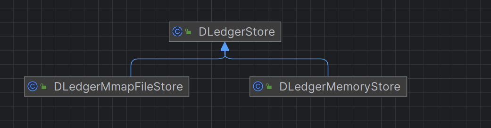

在 [DLedgerServer#createDLedgerStore](http://dledgerserver/#createDLedgerStore) 方法中可以看到，是根据配置的存储类型进行选择的：

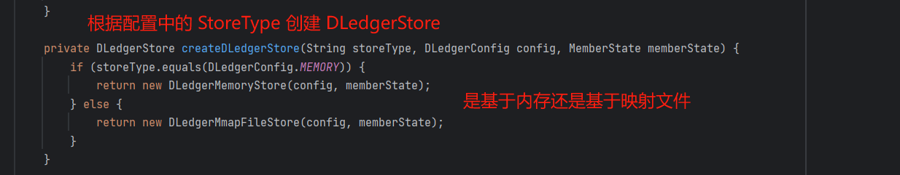

接下来以 [DLedgerMmapFileStore](http://dledgermmapfilestore/) 为例，看下消息的写入 [Leader](http://leader/) 全过程。

## **3.1 消息写入 Leader**

public class DLedgerMmapFileStore extends DLedgerStore {

public List<AppendHook> appendHooks = new ArrayList<>();// 追加钩子列表

// 起始和结束序号

private long ledgerBeginIndex \= -1;

private long ledgerEndIndex \= -1;

// 已提交的序号和位置

private long committedIndex \= -1;

private long committedPos \= -1;

private long ledgerEndTerm; // 序列结束的任期

private DLedgerConfig dLedgerConfig;// DLedger 配置

private MemberState memberState;// 成员状态

private MmapFileList dataFileList;// 数据文件列表

private MmapFileList indexFileList;// 索引文件列表

private ThreadLocal<ByteBuffer> localEntryBuffer;// 日志数据 buffer

private ThreadLocal<ByteBuffer> localIndexBuffer;// 索引数据 buffer

private FlushDataService flushDataService;// 刷盘数据服务

private CleanSpaceService cleanSpaceService;// 清理空间服务

private volatile boolean isDiskFull \= false;// 磁盘是否已满

private long lastCheckPointTimeMs \= System.currentTimeMillis();// 上次检查点时间

private volatile Set<String> fullStorePaths = Collections.emptySet();// 全部存储路径的集合，默认为空集

private boolean enableCleanSpaceService \= true;// 是否启用清理空间服务

public DLedgerEntry appendAsLeader(DLedgerEntry entry) {

// 判断当前节点是否是 Leader

PreConditions.check(memberState.isLeader(), DLedgerResponseCode.NOT\_LEADER);

// 校验磁盘是否已满

PreConditions.check(!isDiskFull, DLedgerResponseCode.DISK\_FULL);

ByteBuffer dataBuffer \= localEntryBuffer.get(); // 获取日志数据 buffer

ByteBuffer indexBuffer \= localIndexBuffer.get(); // 获取索引数据 buffer

DLedgerEntryCoder.encode(entry, dataBuffer); // 将 entry 消息内容写入 dataBuffer

int entrySize \= dataBuffer.remaining();

synchronized (memberState) {

PreConditions.check(memberState.isLeader(), DLedgerResponseCode.NOT\_LEADER, null);

PreConditions.check(memberState.getTransferee() == null, DLedgerResponseCode.LEADER\_TRANSFERRING, null);

long nextIndex \= ledgerEndIndex + 1; // 设置消息的index，为ledgerEndIndex + 1

entry.setIndex(nextIndex);// 设置消息的index

entry.setTerm(memberState.currTerm());// 设置Term

entry.setMagic(CURRENT\_MAGIC);// 设置MAGIC

DLedgerEntryCoder.setIndexTerm(dataBuffer, nextIndex, memberState.currTerm(), CURRENT\_MAGIC);// 设置Term的Index

long prePos \= dataFileList.preAppend(dataBuffer.remaining());

entry.setPos(prePos);

PreConditions.check(prePos != -1, DLedgerResponseCode.DISK\_ERROR, null);

DLedgerEntryCoder.setPos(dataBuffer, prePos);

for (AppendHook writeHook : appendHooks) {

writeHook.doHook(entry, dataBuffer.slice(), DLedgerEntry.BODY\_OFFSET);

}

// 将dataBuffer内容写入日志文件，返回数据的位置

long dataPos \= dataFileList.append(dataBuffer.array(), 0, dataBuffer.remaining());

PreConditions.check(dataPos != -1, DLedgerResponseCode.DISK\_ERROR, null);

PreConditions.check(dataPos == prePos, DLedgerResponseCode.DISK\_ERROR, null);

// 将索引信息写入indexBuffer

DLedgerEntryCoder.encodeIndex(dataPos, entrySize, CURRENT\_MAGIC, nextIndex, memberState.currTerm(), indexBuffer);

// 将indexBuffer内容写入索引文件

long indexPos \= indexFileList.append(indexBuffer.array(), 0, indexBuffer.remaining(), false);

PreConditions.check(indexPos == entry.getIndex() \* INDEX\_UNIT\_SIZE, DLedgerResponseCode.DISK\_ERROR, null);

ledgerEndIndex++;// ledgerEndIndex自增

ledgerEndTerm = memberState.currTerm();// 设置ledgerEndTerm的值为当前Term

if (ledgerBeginIndex == -1) {

ledgerBeginIndex = ledgerEndIndex; // 更新ledgerBeginIndex

}

updateLedgerEndIndexAndTerm();// 更新LedgerEndIndex和LedgerEndTerm

return entry;

}

}

}

处理逻辑如下：

1.  进行 [Leader](http://leader/) 节点校验和磁盘已满校验。
2.  获取日志数据 [buffer](http://buffer/) 和索引数据 [buffer](http://buffer/)，会先将内容写入 [buffer](http://buffer/)，再将 [buffer](http://buffer/) 内容写入文件，将 [entry](http://entry/) 消息内容写入[dataBuffer](http://databuffer/)。
3.  在 [DLedgerEntry](http://%20dledgerentry/) 对象中设置消息的 [index](http://index/)（为每条消息进行了编号），为 [ledgerEndIndex + 1](http://ledgerendindex%20+%201/)，[ledgerEndIndex](http://ledgerendindex/) 初始值为-1，新增一条消息[ledgerEndIndex](http://ledgerendindex/) 的值也会增1，[ledgerEndIndex](http://ledgerendindex/) 是随着消息的增加而递增的，写入成功之后会更新 [ledgerEndIndex](http://ledgerendindex/) 的值，[ledgerEndIndex](http://ledgerendindex/) 记录最后一条成功写入消息的 [index](http://index/)。
4.  调用 [dataFileList#append](http://datafilelist/#append) 方法将 [dataBuffer](http://databuffer/) 内容写入 [commitlog](http://commitlog/) 日志文件，返回数据在文件中的偏移量。
5.  将索引信息写入 [indexBuffer](http://indexbuffer/)，调用 [indexFileList#append](http://indexfilelist/#append) 方法将 [indexBuffer](http://indexbuffer/) 内容写入索引文件。
6.  [ledgerEndIndex](http://ledgerendindex/) 加 1，设置 [ledgerEndTerm](http://ledgerendterm/) 的值为当前 [Term](http://term/)。
7.  调用 [updateLedgerEndIndexAndTerm](http://updateledgerendindexandterm/) 方法更新 [MemberState](http://memberstate/) 中记录的 [LedgerEndIndex](http://ledgerendindex/) 和 [LedgerEndTerm](http://ledgerendterm/) 的值，[LedgerEndIndex](http://ledgerendindex/) 会在 [FLUSH](http://flush/) 的时候，将内容写入到文件进行持久化保存。

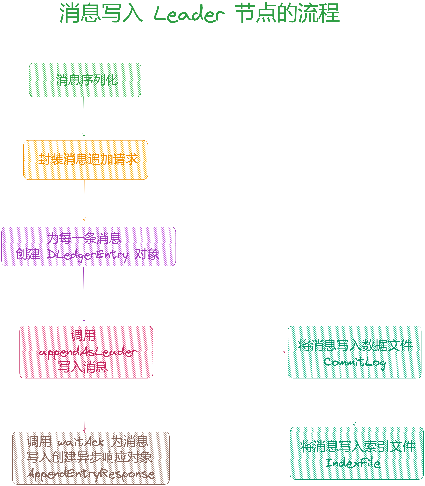

### **3.1.1 更新索引和任期**

在消息写入 [Leader](http://leader/) 之后，会调用 [getLedgerEndIndex](http://getledgerendindex/) 和 [getLedgerEndTerm](http://getledgerendterm/) 法获取 [DLedgerMmapFileStore](http://dledgermmapfilestore/) 中记录的 [LedgerEndIndex](http://ledgerendindex/) 和 [LedgerEndTerm](http://ledgerendterm/) 的值，然后更新到 [MemberState](http://memberstate/) 中：

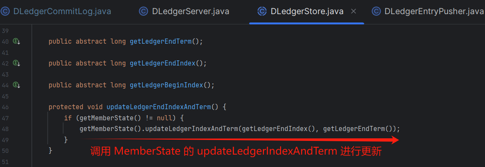

public class MemberState {

private volatile long ledgerEndIndex \= -1;

private volatile long ledgerEndTerm \= -1;

// 更新ledgerEndIndex和ledgerEndTerm

public void updateLedgerIndexAndTerm(long index, long term) {

this.ledgerEndIndex = index;

this.ledgerEndTerm = term;

}

}

## **3.2 等待 Follower 响应**

这里先来看下 [DLedgerEntryPusher](http://dledgerentrypusher/) 的重要数据结构，在 [DLedgerEntryPusher](http://dledgerentrypusher/) 中有一个[pendingAppendResponsesByTerm](http://pendingappendresponsesbyterm/) 成员变量，KEY 为 [Term](http://term/) 的值，VALUE 是一个 [ConcurrentHashMap](http://concurrenthashmap/)，[ConcurrentHashMap](http://concurrenthashmap/) 中的 KEY 为消息的 index（每条消息的编号，从 0 开始，后面会提到），value 为此条消息写入请求的异步响应对象 [AppendEntryResponse](http://appendentryresponse/):

public class DLedgerEntryPusher {

// 外层的 key 为 Term 的值，value 是一个 ConcurrentMap

// ConcurrentMap 的 key 为消息的 index，value 为此条消息写入请求的异步响应对象AppendEntryResponse

private Map<Long, ConcurrentMap<Long, TimeoutFuture<AppendEntryResponse>>> pendingAppendResponsesByTerm = new ConcurrentHashMap<>();

}

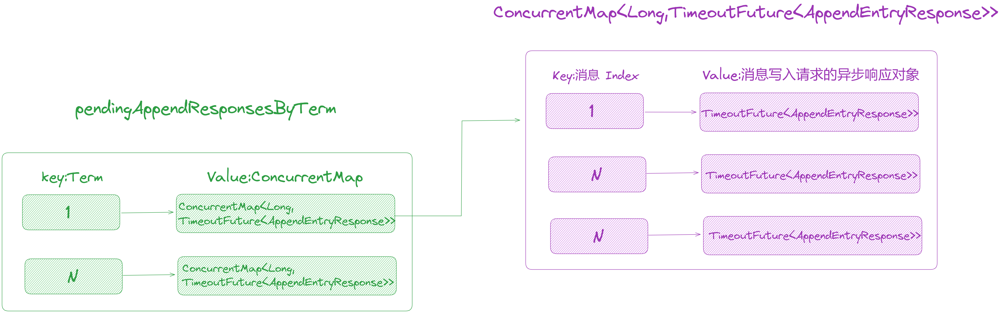

调用 [isPendingFull](http://ispendingfull/) 方法的时候，会先校验当前 Term 是否在 [pendingAppendResponsesByTerm](http://pendingappendresponsesbyterm/) 中有对应的值，如果没有则创建一个 [ConcurrentHashMap](http://concurrenthashmap/) 进行初始化，否则获取对应的 [ConcurrentHashMap](http://concurrenthashmap/) 里面数据的个数，与 [MaxPendingRequestsNum](http://maxpendingrequestsnum/) 做对比校验是否超过了最大值：

public boolean isPendingFull(long currTerm) {

// 校验 currTerm 是否在 pendingAppendResponsesByTerm 中

checkTermForPendingMap(currTerm, "isPendingFull");

// 判断当前 Term 对应的写入请求数量是否超过了最大值

return pendingAppendResponsesByTerm.get(currTerm).size() > dLedgerConfig.getMaxPendingRequestsNum();

}

private void checkTermForPendingMap(long term, String env) {

// 如果 pendingAppendResponsesByTerm 不包含

if (!pendingAppendResponsesByTerm.containsKey(term)) {

// 创建一个 ConcurrentHashMap 加入到 pendingAppendResponsesByTerm

pendingAppendResponsesByTerm.putIfAbsent(term, new ConcurrentHashMap<>());

}

}

那么 [pendingAppendResponsesByTerm](http://pendingappendresponsesbyterm/) 的值是在什么时候加入的？

当消息写入 [Leader](http://leader/) 节点之后，由于 [Leader](http://leader/) 节点需要向 [Follwer](http://follwer/) 节点转发日志，这个过程是「**异步处理**」的，调用 [DLedgerEntryPusher#waitAck](http://dledgerentrypusher/#waitAck) 方法的时候，会为当前的请求创建 [AppendFuture<AppendEntryResponse>](http://appendfutureappendentryresponse/) 异步响应对象加入到 [pendingAppendResponsesByTerm](http://pendingappendresponsesbyterm/) 中，所以可以通过 [pendingAppendResponsesByTerm](http://pendingappendresponsesbyterm/) 中存放的响应对象数量判断当前 [Term](http://term/) 有多少个在等待的写入请求。

public CompletableFuture<AppendEntryResponse> waitAck(DLedgerEntry entry, boolean isBatchWait) {

// 更新当前节点最新写入消息的 index

updatePeerWaterMark(entry.getTerm(), memberState.getSelfId(), entry.getIndex());

checkTermForPendingMap(entry.getTerm(), "waitAck");

AppendFuture<AppendEntryResponse> future; // 响应对象

// 创建 AppendFuture

if (isBatchWait) {

future = new BatchAppendFuture<>(dLedgerConfig.getMaxWaitAckTimeMs()); // 批量

} else {

future = new AppendFuture<>(dLedgerConfig.getMaxWaitAckTimeMs()); // 单条

}

future.setPos(entry.getPos());

// 将创建的 AppendFuture 对象加入到 pendingAppendResponsesByTerm 中

CompletableFuture<AppendEntryResponse> old = pendingAppendResponsesByTerm.get(entry.getTerm()).put(entry.getIndex(), future);

return future;

}

主要处理逻辑如下：

1.  调用 [updatePeerWaterMark](http://updatepeerwatermark/) 更新水位线，因为 [Leader](http://leader/) 节点需要将日志转发给各个 [Follower](http://follower/)，这个水位线其实是记录每个节点消息的复制进度，也就是复制到哪条消息，将消息的 [index](http://index/) 记录下来，这里更新的是 [Leader](http://leader/) 节点最新写入消息的[index](http://index/)，后面会看到 [Follower](http://follower/) 节点的更新。
2.  由于日志转发是异步进行的，所以创建异步响应对象 [AppendFuture<AppendEntryResponse>](http://appendfutureappendentryresponse/)，并将创建的对象加入到[pendingAppendResponsesByTerm](http://pendingappendresponsesbyterm/) 中，[pendingAppendResponsesByTerm](http://pendingappendresponsesbyterm/) 的数据就是在这里加入的。

这里再区分一下 [pendingAppendResponsesByTerm](http://pendingappendresponsesbyterm/) 和 [peerWaterMarksByTerm](http://peerwatermarksbyterm/)：

1.  [pendingAppendResponsesByTerm](http://pendingappendresponsesbyterm/) 中记录的是每条消息写入请求的异步响应对象 [AppendEntryResponse](http://appendentryresponse/)，因为要等待集群中大多数节点的响应，所以使用了异步处理之后获取处理结果。
2.  [peerWaterMarksByTerm](http://peerwatermarksbyterm/) 中记录的是每个节点的消息复制进度，保存的是每个节点最后一条成功写入的消息的 [index](http://index/)。

##   
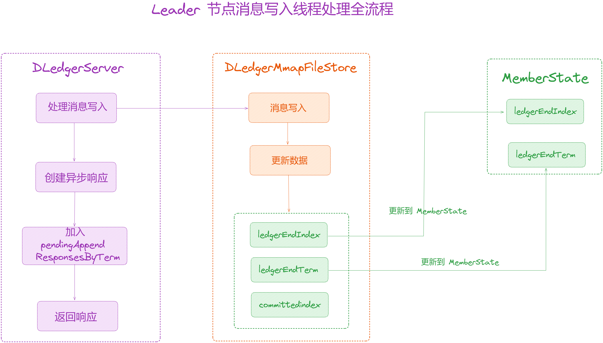

## **3.3 Leader 与 Follower 日志复制**

当消息写入 [Leader](http://leader/) 节点之后，[Leader](http://leader/) 节点会将消息转发给其他 [Follower](http://follower/) 节点，这个过程是异步进行处理的，接下来看下消息的复制过程。

在 [DLedgerEntryPusher#startup](http://dledgerentrypusher/#startup) 方法中会启动以下线程：

1.  [EntryDispatcher](http://entrydispatcher/)：用来 [Leader](http://leader/) 节点向 [Follwer](http://follwer/) 节点转发日志。
2.  [EntryHandler](http://entryhandler/)：用来 [Follwer](http://follwer/) 节点处理 [Leader](http://leader/) 节点发送的日志。
3.  [QuorumAckChecker](http://quorumackchecker/)：用来 [Leader](http://leader/) 节点等待 [Follwer](http://follwer/) 节点同步。

需要注意的是，[Leader](http://leader/) 节点会为每个 [Follwer](http://follwer/) 节点创建 [EntryDispatcher](http://entrydispatcher/) 转发器，每一个 [EntryDispatcher](http://entrydispatcher/) 负责一个节点的日志转发，多个节点之间是并行处理的。

public class DLedgerEntryPusher {

public DLedgerEntryPusher(DLedgerConfig dLedgerConfig, MemberState memberState, DLedgerStore dLedgerStore,DLedgerRpcService dLedgerRpcService) {

this.dLedgerConfig = dLedgerConfig;

this.memberState = memberState;

this.dLedgerStore = dLedgerStore;

this.dLedgerRpcService = dLedgerRpcService;

for (String peer : memberState.getPeerMap().keySet()) {

if (!peer.equals(memberState.getSelfId())) {

// 为集群中除当前节点以外的其他节点创建 EntryDispatcher

dispatcherMap.put(peer, new EntryDispatcher(peer, logger));

}

}

this.entryHandler = new EntryHandler(logger); // 创建 EntryHandler

this.quorumAckChecker = new QuorumAckChecker(logger); // 创建 QuorumAckChecker

this.fsmCaller = Optional.empty();

}

public void startup() {

entryHandler.start(); // 启动 EntryHandler

quorumAckChecker.start(); // 启动 QuorumAckChecker

for (EntryDispatcher dispatcher : dispatcherMap.values()) { // 循环启动 EntryDispatcher

dispatcher.start();

}

}

}

### **3.3.1 Leader 日志转发**

[EntryDispatcher](http://entrydispatcher/) 线程用来 [Leader](http://leader/) 节点向 [Follower](http://follower/) 节点转发日志，它继承了 [ShutdownAbleThread](http://shutdownablethread/)，所以会启

动一个线程，处理向 Follower 转发日志，入口在 [doWork](http://dowork/) 方法中。

1.  校验节点的角色是否是 [Leader](http://leader%20/) 节点。
2.  对消息的转发类型进行判断，有以下两种状态：
3.  [APPEND](http://append/)：消息追加，用于向 [Follower](http://follower%20/) 转发消息。
4.  [COMPARE](http://compare/)：消息对比，一般出现在数据不一致的情况下，需要与 [Follower](http://follower/) 节点的日志进行对比。

public class DLedgerEntryPusher {

// 日志转发线程

private class EntryDispatcher extends ShutdownAbleThread {

public void doWork() {

try {

if (!checkAndFreshState()) { // 检查状态

waitForRunning(1);

return;

}

if (type.get() == PushEntryRequest.Type.APPEND) { // 如果是APPEND类型

if (dLedgerConfig.isEnableBatchPush()) { // 如果开启了批量追加

doBatchAppend();

} else {

doAppend();

}

} else {

doCompare(); // 比较

}

waitForRunning(1);

} catch (Throwable t) {

changeState(-1, PushEntryRequest.Type.COMPARE); // 出现异常转为COMPARE

DLedgerUtils.sleep(500);

}

}

}

}

1.  首先调用 [checkAndFreshState](http://checkandfreshstate/) 校验节点的状态，这一步主要是校验当前节点是否是 [Leader](http://leader/) 节点以及更改消息的推送类型，如果不是 [Leader](http://leader/) 节点结束处理，如果是 [Leader](http://leader/) 节点，对消息的推送类型进行判断：
2.  [APPEND](http://append/)：消息追加，用来向 [Follower](http://follower/) 节点转发消息，批量消息调用 [doBatchAppend](http://dobatchappend/)，否则调用[doAppend](http://doappend/) 处理。
3.  [COMPARE](http://compare/)：消息对比，一般出现在数据不一致的情况下，此时调用 [doCompare](http://docompare/) 对比消息。

### **3.3.2 状态检查**

public class DLedgerEntryPusher {

// 日志转发线程

private class EntryDispatcher extends ShutdownAbleThread {

private long term \= -1;

private String leaderId \= null;

private boolean checkAndFreshState() {

if (!memberState.isLeader()) { // 如果不是Leader节点

return false;

}

// 如果Term与memberState记录的不一致或者LeaderId为空或者LeaderId与memberState的不一致

if (term != memberState.currTerm() || leaderId == null || !leaderId.equals(memberState.getLeaderId())) {

synchronized (memberState) { // 加锁

if (!memberState.isLeader()) {

return false;

}

PreConditions.check(memberState.getSelfId().equals(memberState.getLeaderId()), DLedgerResponseCode.UNKNOWN);

term = memberState.currTerm(); // 当前任期

leaderId = memberState.getSelfId(); // 当前 LeaderId

changeState(-1, PushEntryRequest.Type.COMPARE); // 更改状态为COMPARE

}

}

return true;

}

private synchronized void changeState(long index, PushEntryRequest.Type target) {

// 状态判断

switch (target) {

case APPEND:

compareIndex = -1;// 重置比较索引

// 更新节点的复制进度，改为出现数据不一致的那条消息的index

updatePeerWaterMark(term,peerId,index);

quorumAckChecker.wakeup(); // 唤醒quorumAckChecker

writeIndex = index + 1; // 更新writeIndex

if (dLedgerConfig.isEnableBatchPush()) { // 如果启用批量推送

resetBatchAppendEntryRequest();// 重置批量追加请求

}

break;

case COMPARE:

if (this.type.compareAndSet(PushEntryRequest.Type.APPEND,

PushEntryRequest.Type.COMPARE)) { // 如果当前状态是 APPEND，则设置为 COMPARE

compareIndex = -1;// 重置比较索引

if (dLedgerConfig.isEnableBatchPush()) { // 如果启用批量推送

batchPendingMap.clear();// 清空批量待处理映射

} else {

pendingMap.clear();// 清空待处理映射

}

}

break;

case TRUNCATE:

compareIndex = -1;// 重置比较索引

break;

default:

break;

}

type.set(target);// 设置状态

}

}

}

[EntryDispatcher](http://entrydispatcher/) 中会记录向当前的 [Term](http://term/) 与 [LeaderID](http://leaderid/)，处于以下三种条件之一，会认为集群可能发送了变化，数据处于不一致的状态，此时会将推送类型更改为 [COMPARE](http://compare/)：

（1）[EntryDispatcher](http://entrydispatcher/) 记录的 [Term](http://term%20/) 与 [MemberState](http://memberstate/) 中记录的不一致。

（2）[EntryDispatcher](http://entrydispatcher/) 记录的 [LeaderId](http://leaderid/) 为空。

（3）[EntryDispatcher](http://entrydispatcher/) 记录的 [LeaderId](http://leaderid/) 与 [MemberState](http://memberstate/) 中记录的不一致。

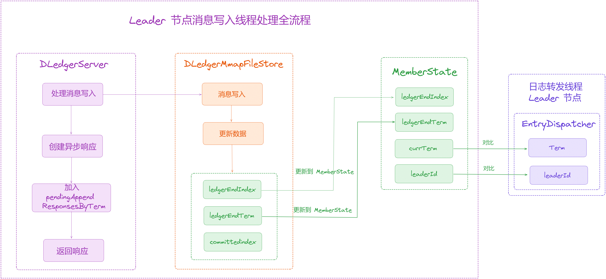

### **3.3.3 Leader 节点消息转发**

public class DLedgerEntryPusher {

// 日志转发线程

private class EntryDispatcher extends ShutdownAbleThread {

private long writeIndex \= -1; // 待转发消息的Index，默认值为-1

// key为消息的index，value为该条消息向Follwer节点转发的时间

private ConcurrentMap<Long, Long> pendingMap = new ConcurrentHashMap<>();

private void doAppend() throws Exception {

while (true) {

if (!checkAndFreshState()) { // 校验状态

break;

}

if (type.get() != PushEntryRequest.Type.APPEND) { // 如果不是APPEND状态，终止

break;

}

if (writeIndex > dLedgerStore.getLedgerEndIndex()) { // 判断待转发消息的Index是否大于LedgerEndIndex

doCommit(); // 向Follower节点发送COMMIT请求更新

doCheckAppendResponse();

break;

}

if (pendingMap.size() >= maxPendingSize || DLedgerUtils.elapsed(lastCheckLeakTimeMs) > 1000) { // 如果pendingMap中的大小超过了maxPendingSize，或者上次检查时间超过了1000ms

// 根据节点peerId获取复制进度

long peerWaterMark \= getPeerWaterMark(term, peerId);

for (Long index : pendingMap.keySet()) { // 遍历pendingMap

if (index < peerWaterMark) { // 如果index小于peerWaterMark

pendingMap.remove(index); // 移除

}

}

lastCheckLeakTimeMs = System.currentTimeMillis(); // 更新检查时间

}

if (pendingMap.size() >= maxPendingSize) {

doCheckAppendResponse();

break;

}

doAppendInner(writeIndex); // 同步消息

writeIndex++; // 更新writeIndex的值

}

}

}

}

如果处于 [APPEND](http://append/) 状态，[Leader](http://leader/) 节点会向 [Follower](http://follower/) 节点发送 [Append](http://append/) 请求，将消息转发给 [Follower](http://follower/) 节点，该方法的处理逻辑如下：

1.  调用 [checkAndFreshState](http://checkandfreshstate/) 进行状态检查。
2.  判断推送类型如果不是 [APPEND](http://append/)，直接返回。
3.  [writeIndex](http://writeindex/) 为待转发消息的Index，默认值为-1，判断是否大于 [LedgerEndIndex](http://ledgerendindex/)，如果大于调用 [doCommit](http://docommit/) 向 [Follower](http://follower/)节点发送 [COMMIT](http://commit/) 请求更新 [committedIndex](http://committedindex/)。
4.  可以看出转发日志的时候也使用了一个计数器 [writeIndex](http://writeindex/) 来记录待转发消息的index，每次根据 [writeIndex](http://writeindex/) 的值从日志中取出消息进行转发，转发成后自增 [writeIndex](http://writeindex/) 的值指向下一条数据。
5.  如果 [pendingMap](http://pendingmap/) 中的大小超过了最大限制 [maxPendingSize](http://maxpendingsize/) 的值，或者上次检查时间超过了1000ms（有较长的时间未进行清理），进行过期数据清理（这一步主要就是为了清理数据）：
6.  [pendingMap](http://pendingmap/) 是一个 [ConcurrentMap](http://concurrentmap/)，key 为消息的 Index，value 为该条消息向 [Follower](http://follower/) 节点转发的时间（[doAppendInner](http://doappendinner/) 方法中会将数据加入到 [pendingMap](http://pendingmap/)）。
7.  前面知道 [peerWaterMark](http://peerwatermark/) 的数据记录了每个节点的消息复制进度，这里根据 Term 和节点ID获取对应的复制进度（最新复制成功的消息的index）记在 [peerWaterMark](http://peerwatermark/) 变量中。
8.  遍历 [pendingMap](http://pendingmap/)，与 [peerWaterMark](http://peerwatermark/) 的值对比， [peerWaterMark](http://peerwatermark/) 之前的消息表示都已成功的写入完毕，所以小于 [peerWaterMark](http://peerwatermark/) 说明已过期可以被清理掉，将数据从 [pendingMap](http://pendingmap/) 移除达到清理空间的目的。
9.  更新检查时间 [lastCheckLeakTimeMs](http://lastcheckleaktimems/) 的值为当前时间。
10.  调用 [doAppendInner](http://doappendinner/) 方法转发消息。
11.  更新 [writeIndex](http://writeindex/) 的值，做自增操作指向下一条待转发的消息 index。

### **3.3.3.1 peerWaterMarksByTerm**

在 [peerWaterMarksByTerm](http://peerwatermarksbyterm%20/) 中记录了「**日志转发**」的进度，其中 key 为 [Term](http://term/)，value 为 [ConcurrentMap](http://concurrentmap/)，[ConcurrentMap](http://concurrentmap/) 中的 key 为 [Follower](http://follower/) 节点的ID [peerId](http://peerid/)，value 为该节点已经同步完毕的最新的那条消息的[index](http://index/)。

public class DLedgerEntryPusher {

// 记录Follower节点的同步进度，key为Term，value为ConcurrentMap

// ConcurrentMap中的key为Follower节点的ID（peerId），value为该节点已经同步完毕的最新的那条消息的index

private Map<Long, ConcurrentMap<String, Long>> peerWaterMarksByTerm = new ConcurrentHashMap<>();

// 获取节点的同步进度

public long getPeerWaterMark(long term, String peerId) {

synchronized (peerWaterMarksByTerm) {

checkTermForWaterMark(term, "getPeerWaterMark");

return peerWaterMarksByTerm.get(term).get(peerId);

}

}

private void checkTermForWaterMark(long term, String env) {

if (!peerWaterMarksByTerm.containsKey(term)) { // 如果peerWaterMarksByTerm不存在

// 创建ConcurrentMap

ConcurrentMap<String, Long> waterMarks = new ConcurrentHashMap<>();

for (String peer : memberState.getPeerMap().keySet()) { // 对集群中的节点进行遍历

waterMarks.put(peer, -1L); // 初始化，key为节点的PEER,value为-1

}

peerWaterMarksByTerm.putIfAbsent(term, waterMarks);// 加入到peerWaterMarksByTerm

}

}

// 更新水位线

private void updatePeerWaterMark(long term, String peerId, long index) {

synchronized (peerWaterMarksByTerm) {

checkTermForWaterMark(term, "updatePeerWaterMark"); // 校验

if (peerWaterMarksByTerm.get(term).get(peerId) < index) {

// 如果之前的水位线小于当前的index进行更新

peerWaterMarksByTerm.get(term).put(peerId, index);

}

}

}

}

1.  首先会调用 [checkTermForWaterMark](http://checktermforwatermark/) 检查 [peerWaterMarksByTerm](http://peerwatermarksbyterm/) 是否存在数据。
2.  如果不存在， 创建[ConcurrentMap](http://concurrentmap/)。
3.  遍历集群中的节点，加入到[ConcurrentMap](http://concurrentmap/)，其中 key 为节点的ID，value 为默认值-1。
4.  当消息成功写入[Follower](http://follower/)节点后，会调用[updatePeerWaterMark](http://updatepeerwatermark/)更同步进度。

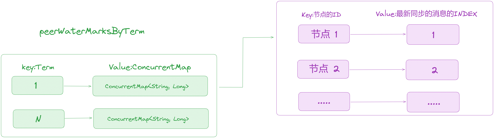

### **3.3.3.2 同步转发消息**

// 日志转发线程

private class EntryDispatcher extends ShutdownAbleThread {

private void doAppendInner(long index) throws Exception {

// 根据index从日志获取消息Entry

DLedgerEntry entry \= getDLedgerEntryForAppend(index);

if (null == entry) {

return;

}

checkQuotaAndWait(entry);

// 构建日志转发请求PushEntryRequest

PushEntryRequest request \= buildPushRequest(entry, PushEntryRequest.Type.APPEND);

// 添加日志转发请求，发送给Follower节点

CompletableFuture<PushEntryResponse> responseFuture = dLedgerRpcService.push(request);

// 加入到pendingMap中，key为消息的index，value为当前时间

pendingMap.put(index, System.currentTimeMillis());

responseFuture.whenComplete((x, ex) -> {

try {

PreConditions.check(ex == null, DLedgerResponseCode.UNKNOWN);// 处理请求响应

DLedgerResponseCode responseCode \= DLedgerResponseCode.valueOf(x.getCode());

switch (responseCode) {

case SUCCESS: // 如果成功

pendingMap.remove(x.getIndex());// 从pendingMap中移除

// 更新updatePeerWaterMark

updatePeerWaterMark(x.getTerm(), peerId, x.getIndex());

quorumAckChecker.wakeup(); // 唤醒

break;

case INCONSISTENT\_STATE: // 如果响应状态为 INCONSISTENT\_STATE Leader 不一致

// 转为COMPARE状态

changeState(-1, PushEntryRequest.Type.COMPARE);

break;

default:

break;

}

} catch (Throwable t) {

logger.error("", t);

}

});

lastPushCommitTimeMs = System.currentTimeMillis();

}

}

private PushEntryRequest buildPushRequest(DLedgerEntry entry, PushEntryRequest.Type target) {

PushEntryRequest request \= new PushEntryRequest();// 创建PushEntryRequest

request.setGroup(memberState.getGroup());

request.setRemoteId(peerId);

request.setLeaderId(leaderId);

request.setLocalId(memberState.getSelfId());

request.setTerm(term); // 设置Term

request.setEntry(entry); // 设置消息

request.setType(target);

// 设置commitIndex,最后一条得到集群中大多数节点响应的消息index

request.setCommitIndex(dLedgerStore.getCommittedIndex());

return request;

}

private void checkQuotaAndWait(DLedgerEntry entry) {

// 检查是否达到最大 pending 大小

if (dLedgerStore.getLedgerEndIndex() - entry.getIndex() <= maxPendingSize) {

return;

}

// 如果存储是 DLedgerMemoryStore 类型，直接返回

if (dLedgerStore instanceof DLedgerMemoryStore) {

return;

}

// 获取 DLedgerMmapFileStore 类型的存储

DLedgerMmapFileStore mmapFileStore \= (DLedgerMmapFileStore) dLedgerStore;

// 如果待写入的位置和 entry 的位置之差小于对等推送限制点

if (mmapFileStore.getDataFileList().getMaxWrotePosition() - entry.getPos() < dLedgerConfig.getPeerPushThrottlePoint()) {

return;

}

// 采样当前 entry 的大小

quota.sample(entry.getSize());

// 如果已经达到限制

if (quota.validateNow()) {

// 获取当前的剩余配额

long leftNow \= quota.leftNow();

// 休眠一段时间

DLedgerUtils.sleep(leftNow);

}

}

1.  根据消息的 [index](http://index/) 从日志获取消息 [Entry](http://entry/)。
2.  调用 [buildPushRequest](http://buildpushrequest/) 方法构建日志转发请求 [PushEntryRequest](http://pushentryrequest/)，在请求中设置了消息 entry、当前 Term、Leader 节点的 [commitIndex](http://commitindex/)（最后一条得到集群中大多数节点响应的消息index）等信息。
3.  调用 [dLedgerRpcService#push](http://dledgerrpcservice/#push) 方法将请求发送给 [Follower](http://follower/) 节点。
4.  将本条消息对应的 index 加入到 [pendingMap](http://pendingmap/) 中记录消息的发送时间（key为消息的index，value为当前时间）；
5.  等待[Follower](http://follower/)节点返回响应：
6.  （1）如果响应状态为 [SUCCESS](http://success/)， 表示节点写入成功：
7.  从 [pendingMap](http://pendingmap/) 中移除本条消息 index 的信息。
8.  更新当前节点的复制进度，也就是 [updatePeerWaterMark](http://updatepeerwatermark/) 中的值。
9.  调用 [quorumAckChecker#wakeup](http://quorumackchecker/#wakeup)，唤醒 [QuorumAckChecker](http://quorumackchecker/) 线程。
10.  （2）如果响应状态为 [INCONSISTENT\_STATE](http://inconsistent_state/)，表示 [Follower](http://follower/) 节点数据出现了不一致的情况，需要调用 [changeState](http://changestate/) 更改状态为[COMPARE](http://compare/)。

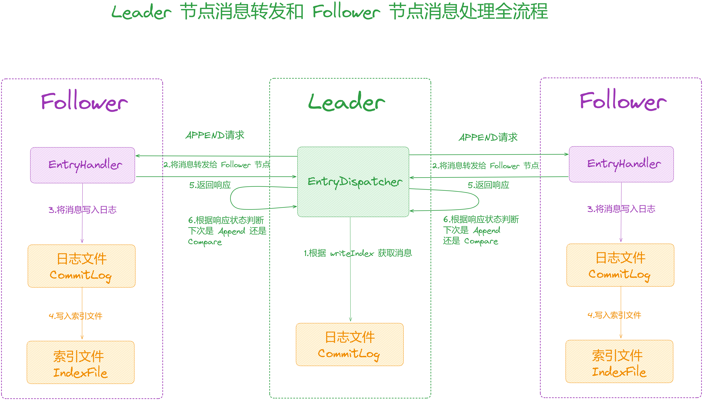

### **3.3.4 Leader 节点消息比较**

public class DLedgerEntryPusher {

// 日志转发线程

private class EntryDispatcher extends ShutdownAbleThread {

private void doCompare() throws Exception {

while (true) {

if (!checkAndFreshState()) { // 校验状态

break;

}

if (type.get() != PushEntryRequest.Type.COMPARE

&& type.get() != PushEntryRequest.Type.TRUNCATE) {

// 如果不是COMPARE请求也不是TRUNCATE请求

break;

}

if (compareIndex == -1 && dLedgerStore.getLedgerEndIndex() == -1) {

break; // 如果compareIndex为-1并且LedgerEndIndex为-1

}

// 如果compareIndex为-1

if (compareIndex == -1) {

// 获取LedgerEndIndex作为compareIndex

compareIndex = dLedgerStore.getLedgerEndIndex();

} else if (compareIndex > dLedgerStore.getLedgerEndIndex() || compareIndex < dLedgerStore.getLedgerBeginIndex()) {// 依旧获取LedgerEndIndex作为compareIndex，这里应该是为了打印日志所以单独又加了一个if条件

compareIndex = dLedgerStore.getLedgerEndIndex();

}

// 根据compareIndex获取消息

DLedgerEntry entry \= dLedgerStore.get(compareIndex);

PreConditions.check(entry != null, DLedgerResponseCode.INTERNAL\_ERROR, "compareIndex=%d", compareIndex);

// 构建COMPARE请求

PushEntryRequest request \= buildPushRequest(entry, PushEntryRequest.Type.COMPARE);

// 发送COMPARE请求

CompletableFuture<PushEntryResponse> responseFuture = dLedgerRpcService.push(request);

// 获取响应结果

PushEntryResponse response \= responseFuture.get(3, TimeUnit.SECONDS);

PreConditions.check(response != null, DLedgerResponseCode.INTERNAL\_ERROR, "compareIndex=%d", compareIndex);

PreConditions.check(response.getCode() == DLedgerResponseCode.INCONSISTENT\_STATE.getCode() || response.getCode() == DLedgerResponseCode.SUCCESS.getCode() , DLedgerResponseCode.valueOf(response.getCode()), "compareIndex=%d", compareIndex);

long truncateIndex \= -1;

// 如果返回成功

if (response.getCode() == DLedgerResponseCode.SUCCESS.getCode()) {

if (compareIndex == response.getEndIndex()) {

// 如果compareIndex与 follower的EndIndex相等,改为APPEND状态

changeState(compareIndex, PushEntryRequest.Type.APPEND);

break;

} else {

truncateIndex = compareIndex;// 将truncateIndex设置为compareIndex

}

} else if (response.getEndIndex() < dLedgerStore.getLedgerBeginIndex()

|| response.getBeginIndex() > dLedgerStore.getLedgerEndIndex()) {

// 如果请求中返回的EndIndex小于当前节点的LedgerBeginIndex，或者BeginIndex大于LedgerEndIndex

// 当follower与leader的index不相交时，这种情况通常Follower节点出现故障了很长一段时间，在此期间Leader节点删除了一些过期的消息

// 将truncateIndex设置为Leader的BeginIndex

truncateIndex = dLedgerStore.getLedgerBeginIndex();

} else if (compareIndex < response.getBeginIndex()) {

// compareIndex比follower的BeginIndex小，通常发生在磁盘出现故障的时候

// 将truncateIndex设置为Leader的BeginIndex

truncateIndex = dLedgerStore.getLedgerBeginIndex();

} else if (compareIndex > response.getEndIndex()) {

// compareIndex比follower的EndIndex大

// compareIndexx设置为Follower的EndIndex

compareIndex = response.getEndIndex();

} else {

// 比较失败

compareIndex--;

}

// 如果compareIndex比当前节点的LedgerBeginIndex小

if (compareIndex < dLedgerStore.getLedgerBeginIndex()) {

truncateIndex = dLedgerStore.getLedgerBeginIndex();

}

// 如果truncateIndex的值不为-1，调用doTruncate开始删除

if (truncateIndex != -1) {

changeState(truncateIndex, PushEntryRequest.Type.TRUNCATE);

doTruncate(truncateIndex);

break;

}

}

}

}

}

对于下面两种情况之一时，会认为数据出现了不一致的情况，将状态更改为 Compare：

1.  [Leader](http://leader/) 节点在调用 [checkAndFreshState](http://checkandfreshstate/) 检查的时候，发现当前 [Term](http://term/) 与 [memberState](http://memberstate/) 记录的不一致或者 [LeaderId](http://leaderid/) 为空或者 [LeaderId](http://leaderid/) 与 [memberState](http://memberstate/) 记录的 [LeaderId](http://leaderid/) 不一致。
2.  [Follower](http://follower/) 节点在处理消息 [APPEND](http://append/) 请求在进行校验的时候，发现数据出现了不一致，会在请求的响应中设置不一致的状态[INCONSISTENT\_STATE](http://inconsistent_state/)，通知 [Leader](http://leader/) 节点。

在 [COMPARE](http://compare/) 状态下，会调用 [doCompare](http://docompare/) 方法向 [Follower](http://follower/) 节点发送比较请求，处理逻辑如下：

1.  调用 [checkAndFreshState](http://checkandfreshstate/) 校验状态。
2.  判断不是 [COMPARE](http://compare/) 或者 [TRUNCATE](http://truncate/) 请求，直接返回。
3.  如果 [compareIndex](http://compareindex/) 为-1（在 [changeState](http://changestate/) 方法将状态改为 [COMPARE](http://compare/) 时中会将 [compareIndex](http://compareindex/) 设置为 -1），获取[LedgerEndIndex](http://ledgerendindex/) 作为 [compareIndex](http://compareindex/) 的值进行更新。
4.  如果 [compareIndex](http://compareindex/) 的值大于 [LedgerEndIndex](http://ledgerendindex/) 或者小于 [LedgerBeginIndex](http://ledgerbeginindex/)，依旧使用 [LedgerEndIndex](http://ledgerendindex/) 作为[compareIndex](http://compareindex/) 的值，所以这里单独加一个判断条件是为了打印日志，与步骤 3 做区分。
5.  根据 [compareIndex](http://compareindex/) 获取消息 entry 对象，调用 [buildPushRequest](http://buildpushrequest/) 方法构建 [COMPARE](http://compare/) 请求。

当状态更改为 [COMPARE](http://compare/) 之后，[compareIndex](http://compareindex/) 的值会被初始化为 -1，在 [doCompare](http://docompare/) 中，会将 [compareIndex](http://compareindex/)的值更改为 [Leader](http://leader/) 节点的最后一条写入的消息，也就是 [LedgerEndIndex](http://ledgerendindex/) 的值，发给 [Follower](http://follower/) 节点进行对比。

向 [Follower](http://follower/) 节点发起请求后，等待 [COMPARE](http://compare/) 请求返回响应，请求中会将 [Follower](http://follower/) 节点最后成功写入的消息的index 设置在响应对象的 [EndIndex](http://endindex/) 变量中，第一条写入的消息记录在 [BeginIndex](http://beginindex/) 变量中：

1.  请求响应成功：
2.  如果 [compareIndex](http://compareindex/) 与 [Follower](http://follower/) 返回请求中的 [EndIndex](http://endindex/) 相等，表示没有数据不一致的情况，将状态更改为 [APPEND](http://append/)。
3.  其他情况，将 [truncateIndex](http://truncateindex/) 的值置为 [compareIndex](http://compareindex/)。
4.  如果请求中返回的 [EndIndex](http://endindex/) 小于当前节点的 [LedgerBeginIndex](http://ledgerbeginindex/)，或者 [BeginIndex](http://beginindex/) 大于 [LedgerEndIndex](http://ledgerendindex/)，也就是[Follower](http://follower%20/) 节点与 [Leader](http://leader%20/) 节点的 index 不相交时， 将[truncateIndex](http://truncateindex/) 设置为 Leader 节点的 [BeginIndex](http://beginindex/)。
5.  根据代码中的注释来看，这种情况通常发生在 [Follower](http://follower/) 节点出现故障了很长一段时间，在此期间 [Leader](http://leader/) 节点删除了一些过期的消息；
6.  [compareIndex](http://compareindex/) 比 [Follower](http://follower%20/) 节点的 [BeginIndex](http://beginindex/) 小，将 [truncateIndex](http://truncateindex/) 设置为 [Leader](http://leader%20/) 节点的 [BeginIndex](http://beginindex/)。
7.  根据代码中的注释来看，这种情况请通常发生在磁盘出现故障的时候。
8.  其他情况，将 [compareIndex](http://compareindex/) 的值-1，从上一条消息开始继续对比。
9.  如果 [truncateIndex](http://truncateindex/) 的值不为-1，调用 [doTruncate](http://dotruncate/) 方法进行处理。

### **3.3.4.1 截断数据**

public class DLedgerEntryPusher {

// 日志转发线程

private class EntryDispatcher extends ShutdownAbleThread {

private void doTruncate(long truncateIndex) throws Exception {

PreConditions.check(type.get() == PushEntryRequest.Type.TRUNCATE, DLedgerResponseCode.UNKNOWN);

DLedgerEntry truncateEntry \= dLedgerStore.get(truncateIndex);

PreConditions.check(truncateEntry != null, DLedgerResponseCode.UNKNOWN);

// 构建TRUNCATE请求

PushEntryRequest truncateRequest \= buildPushRequest(truncateEntry, PushEntryRequest.Type.TRUNCATE);

// 向Follower节点发送TRUNCATE请求

PushEntryResponse truncateResponse \= dLedgerRpcService.push(truncateRequest).get(3, TimeUnit.SECONDS);

PreConditions.check(truncateResponse != null, DLedgerResponseCode.UNKNOWN, "truncateIndex=%d", truncateIndex);

PreConditions.check(truncateResponse.getCode() == DLedgerResponseCode.SUCCESS.getCode(), DLedgerResponseCode.valueOf(truncateResponse.getCode()), "truncateIndex=%d", truncateIndex);

lastPushCommitTimeMs = System.currentTimeMillis();

changeState(truncateIndex, PushEntryRequest.Type.APPEND); // 更改回APPEND状态

}

private synchronized void changeState(long index, PushEntryRequest.Type target) {

// 状态判断

switch (target) {

case APPEND:

compareIndex = -1;// 重置比较索引

// 更新节点的复制进度，改为出现数据不一致的那条消息的index

updatePeerWaterMark(term,peerId,index);

quorumAckChecker.wakeup(); // 唤醒quorumAckChecker

writeIndex = index + 1; // 更新writeIndex

if (dLedgerConfig.isEnableBatchPush()) { // 如果启用批量推送

resetBatchAppendEntryRequest();// 重置批量追加请求

}

break;

....

}

type.set(target);// 设置状态

}

}

}

1.  首先会构建 [TRUNCATE](http://truncate/) 请求设置 [truncateIndex](http://truncateindex/)(要删除的消息的index)，发送给[Follower](http://follower/)节点，通知 [Follower](http://follower/) 节点将数据不一致的那条消息删除。
2.  如果响应成功，可以看到接下来调用了 [changeState](http://changestate/) 将状态改为 [APPEND](http://append/)，在 [changeState](http://changestate/) 中，调用了[updatePeerWaterMark](http://updatepeerwatermark/) 更新节点的复制进度为出现数据不一致的那条消息的 [index](http://index/)。
3.  接着更新了[writeIndex](http://writeindex/)，下次从[writeIndex](http://writeindex/)处重新给[Follower](http://follower/)节点发送[APPEND](http://append/)请求进行消息写入。

### **3.3.5 日志发送处理器**

[EntryHandler](http://entryhandler/) 线程用来 [Follower](http://follower/) 节点处理 [Leader](http://leader/) 节点发送的消息请求，对请求的处理在 [handlePush](http://handlepush/) 方法中，根据请求类型的不同做如下处理：

1.  如果是 [APPEND](http://append/) 请求，将请求加入到 [writeRequestMap](http://writerequestmap/) 中。
2.  如果是 [COMMIT](http://commit/) 请求，将请求加入到[compareOrTruncateRequests](http://compareortruncaterequests/)。
3.  如果是 [COMPARE](http://compare/) 或者 [TRUNCATE](http://truncate/)，将请求加入到 [compareOrTruncateRequests](http://compareortruncaterequests/)。

可以看到这里只是将「**不同类型**」的请求加入到「**不同请求集合**」中，请求的处理是在 [doWork](http://dowork/) 方法中处理的。

public class DLedgerEntryPusher {

private class EntryHandler extends ShutdownAbleThread {

// 写入请求映射，用于存储推送请求和对应的 CompletableFuture

ConcurrentMap<Long, Pair<PushEntryRequest, CompletableFuture<PushEntryResponse>>> writeRequestMap = new ConcurrentHashMap<>();

// 比较或截断请求阻塞队列，用于存储比较或截断请求和对应的 CompletableFuture

BlockingQueue<Pair<PushEntryRequest, CompletableFuture<PushEntryResponse>>> compareOrTruncateRequests = new ArrayBlockingQueue<Pair<PushEntryRequest, CompletableFuture<PushEntryResponse>>>(1024);

// 构造函数，初始化 EntryHandler

public EntryHandler(Logger logger) {

// 调用父类构造函数，设置线程名称为 "EntryHandler-" 加上自身 ID

super("EntryHandler-" + memberState.getSelfId(), logger);

}

// 处理推送请求的方法

public CompletableFuture<PushEntryResponse> handlePush(PushEntryRequest request) throws Exception {

// 超时时间应该小于远程层的请求超时时间

CompletableFuture<PushEntryResponse> future = new TimeoutFuture<>(1000);

switch (request.getType()) {

case APPEND: // 如果是追加请求

if (request.isBatch()) { // 如果是批量请求

PreConditions.check(request.getBatchEntry() != null && request.getCount() > 0, DLedgerResponseCode.UNEXPECTED\_ARGUMENT);

} else {

PreConditions.check(request.getEntry() != null, DLedgerResponseCode.UNEXPECTED\_ARGUMENT);

}

long index \= request.getFirstEntryIndex(); // 获取第一个 entry 的索引

// 将请求加入到 writeRequestMap

Pair<PushEntryRequest, CompletableFuture<PushEntryResponse>> old = writeRequestMap.putIfAbsent(index, new Pair<>(request, future));

if (old != null) { // 如果之前的请求已存在

// 完成 CompletableFuture，表示重复的推送请求

future.complete(buildResponse(request, DLedgerResponseCode.REPEATED\_PUSH.getCode()));

}

break;

case COMMIT: // 如果是提交请求

synchronized (this) {

// 如果比较或截断请求阻塞队列已满

if (!compareOrTruncateRequests.offer(new Pair<>(request, future))) {

// 完成 CompletableFuture，表示推送请求已满

future.complete(buildResponse(request, DLedgerResponseCode.PUSH\_REQUEST\_IS\_FULL.getCode()));

}

}

break;

case COMPARE: // 如果是比较请求

case TRUNCATE: // 如果是截断请求

PreConditions.check(request.getEntry() != null, DLedgerResponseCode.UNEXPECTED\_ARGUMENT);

writeRequestMap.clear(); // 清空 writeRequestMap

synchronized (this) {

if (!compareOrTruncateRequests.offer(new Pair<>(request, future))) {

// 如果比较或截断请求阻塞队列已满，完成 CompletableFuture，表示推送请求已满

future.complete(buildResponse(request, DLedgerResponseCode.PUSH\_REQUEST\_IS\_FULL.getCode()));

}

}

break;

default: // 默认情况

// 完成 CompletableFuture，表示不期望的请求参数

future.complete(buildResponse(request, DLedgerResponseCode.UNEXPECTED\_ARGUMENT.getCode()));

break;

}

wakeup(); // 唤醒 EntryHandler 线程

return future; // 返回处理后的 CompletableFuture

}

}

}

### **3.3.5.1 日志请求发送**

可以看到 [EntryHandler](http://entryhandler/) 线程同样继承了 [ShutdownAbleThread](http://shutdownablethread/)，所以会启动线程执行 [doWork](http://dowork/) 方法。

public class DLedgerEntryPusher {

private class EntryHandler extends ShutdownAbleThread {

public void doWork() {

try {

if (!memberState.isFollower()) { // 如果当前节点不是 follower

clearCompareOrTruncateRequestsIfNeed(); // 清理比较或截断请求队列

waitForRunning(1); // 等待 1 毫秒以便后续操作

return;

}

// 如果compareOrTruncateRequests不为空

if (compareOrTruncateRequests.peek() != null) {

Pair<PushEntryRequest, CompletableFuture<PushEntryResponse>> pair = compareOrTruncateRequests.poll(); // 从队列中取出请求

PreConditions.check(pair != null, DLedgerResponseCode.UNKNOWN);

switch (pair.getKey().getType()) {

case TRUNCATE: // 处理截断请求

handleDoTruncate(pair.getKey().getEntry().getIndex(), pair.getKey(), pair.getValue());

break;

case COMPARE:// 处理比较请求

handleDoCompare(pair.getKey().getEntry().getIndex(), pair.getKey(), pair.getValue());

break;

case COMMIT:// 处理提交请求

handleDoCommit(pair.getKey().getCommitIndex(), pair.getKey(), pair.getValue());

break;

default:

break;

}

} else {

// 设置消息Index，为最后一条成功写入的消息index + 1

long nextIndex \= dLedgerStore.getLedgerEndIndex() + 1;

// 从writeRequestMap取出请求

Pair<PushEntryRequest, CompletableFuture<PushEntryResponse>> pair = writeRequestMap.remove(nextIndex);

if (pair == null) { // 如果获取的请求为空，调用checkAbnormalFuture进行检查

checkAbnormalFuture(dLedgerStore.getLedgerEndIndex()); // 检查异常的 CompletableFuture

waitForRunning(1); // 等待 1 毫秒以便后续操作

return;

}

PushEntryRequest request \= pair.getKey();

if (request.isBatch()) { // 如果是批量请求

handleDoBatchAppend(nextIndex, request, pair.getValue()); // 处理批量追加请求

} else {

handleDoAppend(nextIndex, request, pair.getValue());// 处理追加请求

}

}

} catch (Throwable t) {

DLedgerUtils.sleep(100); // 休眠 100 毫秒

}

}

}

}

1.  如果 [compareOrTruncateRequests](http://compareortruncaterequests/) 不为空，对请求类型进行判断：
2.  [TRUNCATE](http://truncate/)：调用[handleDoTruncate](http://handledotruncate/)处理。
3.  [COMPARE](http://compare/)：调用[handleDoCompare](http://handledocompare/)处理。
4.  [COMMIT](http://commit/)：调用[handleDoCommit](http://handledocommit/)处理。
5.  否则是 [APPEND](http://append/) 请求：
6.  [LedgerEndIndex](http://ledgerendindex/) 记录了最后一条成功写入消息的 index，对其 + 1表示下一条待写入消息的 index。
7.  根据待写入消息的[index](http://index/)从[writeRequestMap](http://writerequestmap/)获取数据，如果获取为空，调用[checkAbnormalFuture](http://checkabnormalfuture/)进行检查。
8.  获取不为空，调用[handleDoAppend](http://handledoappend/)方法处理消息写入。

> 这里得出 Follower 是从当前记录的最后一条成功写入的 LedgerEndIndex ，然后 +1 来处理下一条需要写入的消息的

### **3.3.5.2 Follower 数据一致性检查**

public class DLedgerEntryPusher {

private class EntryHandler extends ShutdownAbleThread {

private void checkAbnormalFuture(long endIndex) {

if (DLedgerUtils.elapsed(lastCheckFastForwardTimeMs) < 1000) {

return; // 如果距离上次检查的时间未超过1000ms

}

lastCheckFastForwardTimeMs = System.currentTimeMillis(); // 更新检查时间

if (writeRequestMap.isEmpty()) { //如果writeRequestMap为空表示没有写入请求，暂不需要处理

return;

}

// 检查

checkAppendFuture(endIndex);

}

private void checkAppendFuture(long endIndex) {

long minFastForwardIndex \= Long.MAX\_VALUE; // 初始化为最大值

for (Pair<PushEntryRequest, CompletableFuture<PushEntryResponse>> pair : writeRequestMap.values()) { // 遍历writeRequestMap的value

// 获取每个请求里面的第一条消息index

long firstEntryIndex \= pair.getKey().getFirstEntryIndex();

// 获取每个请求里面的最后一条消息index

long lastEntryIndex \= pair.getKey().getLastEntryIndex();

// 如果小于等于endIndex

if (lastEntryIndex <= endIndex) {

try {

if (pair.getKey().isBatch()) { // 批量请求

// 遍历所有的消息

for (DLedgerEntry dLedgerEntry : pair.getKey().getBatchEntry()) {

// 校验与当前节点存储的消息是否一致PreConditions.check(dLedgerEntry.equals(dLedgerStore.get(dLedgerEntry.getIndex())), DLedgerResponseCode.INCONSISTENT\_STATE);

}

} else {

DLedgerEntry dLedgerEntry \= pair.getKey().getEntry();

// 校验请求中的消息与当前节点存储的消息是否一致PreConditions.check(dLedgerEntry.equals(dLedgerStore.get(dLedgerEntry.getIndex())), DLedgerResponseCode.INCONSISTENT\_STATE);

}

pair.getValue().complete(buildResponse(pair.getKey(), DLedgerResponseCode.SUCCESS.getCode())); // 设置完成

} catch (Throwable t) {

pair.getValue().complete(buildResponse(pair.getKey(), DLedgerResponseCode.INCONSISTENT\_STATE.getCode()));// 如果出现了异常，向Leader节点发送数据不一致的请求

}

// 处理之后从writeRequestMap移除

writeRequestMap.remove(pair.getKey().getFirstEntryIndex());

continue;

}

if (firstEntryIndex == endIndex + 1) {// 如果firstEntryIndex与endIndex + 1相等，表示该请求是endIndex之后的消息请求，结束本次检查

return;

}

TimeoutFuture<PushEntryResponse> future = (TimeoutFuture<PushEntryResponse>) pair.getValue();// 判断响应是否超时，如果未超时，继续处理下一个

if (!future.isTimeOut()) {

continue;

}

if (firstEntryIndex < minFastForwardIndex) {// 如果firstEntryIndex比minFastForwardIndex小

minFastForwardIndex = firstEntryIndex;// 更新minFastForwardIndex

}

}

if (minFastForwardIndex == Long.MAX\_VALUE) { // 如果minFastForwardIndex依旧是MAX\_VALUE，表示没有数据不一致的消息，直接返回

return;

}

// 根据minFastForwardIndex获取请求

Pair<PushEntryRequest, CompletableFuture<PushEntryResponse>> pair = writeRequestMap.get(minFastForwardIndex);

if (pair == null) { // 如果未获取到直接返回

return;

}

// 向Leader返回响应，响应状态为INCONSISTENT\_STATE

pair.getValue().complete(buildResponse(pair.getKey(), DLedgerResponseCode.INCONSISTENT\_STATE.getCode()));

}

private PushEntryResponse buildResponse(PushEntryRequest request, int code) {

PushEntryResponse response \= new PushEntryResponse(); // 构建请求响应

response.setGroup(request.getGroup());

response.setCode(code); // 设置响应状态

response.setTerm(request.getTerm()); // 设置Term

if (request.getType() != PushEntryRequest.Type.COMMIT) { // 如果不是COMMIT

response.setIndex(request.getFirstEntryIndex()); // 设置Index

response.setCount(request.getCount());

}// 设置当前节点的LedgerBeginIndex

response.setBeginIndex(dLedgerStore.getLedgerBeginIndex());

response.setEndIndex(dLedgerStore.getLedgerEndIndex());// 设置LedgerEndIndex

return response;

}

}

}

该方法中的入参 [endIndex](http://endindex/)，表示当前待写入消息的 index，也就是当前节点记录的最后一条成功写入的 index 值+1，处理逻辑如下：

1.  将 [minFastForwardIndex](http://minfastforwardindex/) 初始化为最大值，[minFastForwardIndex](http://minfastforwardindex/) 用来找到最小的那个出现数据不一致的消息index。
2.  遍历 [writeRequestMap](http://writerequestmap/)，处理每一个正在进行中的写入请求：
3.  由于消息可能是批量的，所以获取当前请求中的第一条消息 index，记为 [firstEntryIndex](http://firstentryindex/)。
4.  获取当前请求中的最后一条消息index，记为 [lastEntryIndex](http://lastentryindex/)。
5.  如果 [lastEntryIndex](http://lastentryindex/) 如果小于等于 [endIndex](http://endindex/) 的值，进行如下处理：
6.  对比请求中的消息与当前节点存储的消息是否一致，如果是批量消息，遍历请求中的每一个消息，并根据消息的index从当前节的日志中获取消息进行对比，由于 [endIndex](http://endindex/) 之前的消息都已成功写入，对应的写入请求还在 [writeRequestMap](http://writerequestmap/) 中表示可能由于某些原因未能从 [writeRequestMap](http://writerequestmap/) 中移除，所以如果数据对比一致的情况下可以将对应的请求响应设置为完成，并从 [writeRequestMap](http://writerequestmap/) 中移除；如果对比不一致，进入到异常处理，构建响应请求，状态设置为[INCONSISTENT\_STATE](http://inconsistent_state/)，通知 [Leader](http://leader/) 节点出现了数据不一致的情况。
7.  如果第一条消息 [firstEntryIndex](http://firstentryindex/) 与 [endIndex + 1](http://endindex%20+%201/) 相等（这里不太明白为什么不是与endIndex 相等而是需要加1），表示该请求是 [endIndex](http://endindex/) 之后的消息请求，结束本次检查。
8.  判断当前请求的处理时间是否超时，如果未超时，继续处理下一个请求，如果超时进入到下一步。
9.  走到这里，如果 [firstEntryIndex](http://firstentryindex/) 比 [minFastForwardIndex](http://minfastforwardindex/) 小，说明出现了数据不一致的情况，此时更新[minFastForwardIndex](http://minfastforwardindex/)，记录最小的那个数据不一致消息的 index。
10.  如果 [minFastForwardIndex](http://minfastforwardindex/) 依旧是MAX\_VALUE，表示没有数据不一致的消息，直接返回。
11.  根据 [minFastForwardIndex](http://minfastforwardindex/) 从 [writeRequestMap](http://writerequestmap/) 获取请求，如果获取为空，直接返回，否则调用[buildBatchAppendResponse](http://buildbatchappendresponse/) 方法构建请求响应，表示数据出现了不一致，在响应中通知 [Leader](http://leader/) 节点。

## **3.4 Follower 节点消息写入**

该方法用于处理 [Append](http://append/) 请求，将 [Leader](http://leader/) 转发的消息写入到日志文件：

1.  从请求中获取消息 [Entry](http://entry/)，调用 [appendAsFollower](http://appendasfollower/) 方法将消息写入文件。
2.  调用 [updateCommittedIndex](http://updatecommittedindex/) 方法将 [Leader](http://leader/) 请求中携带的 [commitIndex](http://commitindex/) 更新到 [Follower](http://follower/) 本地。

public class DLedgerEntryPusher {

private class EntryHandler extends ShutdownAbleThread {

private void handleDoAppend(long writeIndex, PushEntryRequest request,

CompletableFuture<PushEntryResponse> future) {

try {

PreConditions.check(writeIndex == request.getEntry().getIndex(), DLedgerResponseCode.INCONSISTENT\_STATE);

// 将消息写入日志

DLedgerEntry entry \= dLedgerStore.appendAsFollower(request.getEntry(), request.getTerm(), request.getLeaderId());

PreConditions.check(entry.getIndex() == writeIndex, DLedgerResponseCode.INCONSISTENT\_STATE);

future.complete(buildResponse(request, DLedgerResponseCode.SUCCESS.getCode()));

// 更新 CommitIndex

updateCommittedIndex(request.getTerm(), request.getCommitIndex());

} catch (Throwable t) {

future.complete(buildResponse(request, DLedgerResponseCode.INCONSISTENT\_STATE.getCode()));

}

}

}

}

### **3.4.1 写入文件**

同样以 [DLedgerMmapFileStore](http://dledgermmapfilestore/) 为例，看下 [appendAsFollower](http://appendasfollower/) 方法的处理过程，前面已经讲过[appendAsLeader](http://appendasleader/) 的处理逻辑，他们的处理过程相似，基本就是将 [entry](http://entry/) 内容写入 [buffer](http://buffer/)，然后再将 [buffer](http://buffer/) 写入数据文件和索引文件。

public class DLedgerMmapFileStore extends DLedgerStore {

public DLedgerEntry appendAsFollower(DLedgerEntry entry, long leaderTerm, String leaderId) {

PreConditions.check(memberState.isFollower(), DLedgerResponseCode.NOT\_FOLLOWER, "role=%s", memberState.getRole());

PreConditions.check(!isDiskFull, DLedgerResponseCode.DISK\_FULL);

ByteBuffer dataBuffer \= localEntryBuffer.get(); // 获取数据 Buffer

ByteBuffer indexBuffer \= localIndexBuffer.get(); // 获取索引 Buffer

DLedgerEntryCoder.encode(entry, dataBuffer);

int entrySize \= dataBuffer.remaining();

synchronized (memberState) {

PreConditions.check(memberState.isFollower(), DLedgerResponseCode.NOT\_FOLLOWER, "role=%s", memberState.getRole());

long nextIndex \= ledgerEndIndex + 1;

PreConditions.check(nextIndex == entry.getIndex(), DLedgerResponseCode.INCONSISTENT\_INDEX, null);

PreConditions.check(leaderTerm == memberState.currTerm(), DLedgerResponseCode.INCONSISTENT\_TERM, null);

PreConditions.check(leaderId.equals(memberState.getLeaderId()), DLedgerResponseCode.INCONSISTENT\_LEADER, null);

// 写入数据文件

long dataPos \= dataFileList.append(dataBuffer.array(), 0, dataBuffer.remaining());

PreConditions.check(dataPos == entry.getPos(), DLedgerResponseCode.DISK\_ERROR, "%d != %d", dataPos, entry.getPos());

DLedgerEntryCoder.encodeIndex(dataPos, entrySize, entry.getMagic(), entry.getIndex(), entry.getTerm(), indexBuffer);

// 写入索引文件

long indexPos \= indexFileList.append(indexBuffer.array(), 0, indexBuffer.remaining(), false);

PreConditions.check(indexPos == entry.getIndex() \* INDEX\_UNIT\_SIZE, DLedgerResponseCode.DISK\_ERROR, null);

ledgerEndTerm = entry.getTerm();

ledgerEndIndex = entry.getIndex();

if (ledgerBeginIndex == -1) {

ledgerBeginIndex = ledgerEndIndex;

}

updateLedgerEndIndexAndTerm();

return entry;

}

}

}

### **3.4.2 请求比较**

public class DLedgerEntryPusher {

private class EntryHandler extends ShutdownAbleThread {

private CompletableFuture<PushEntryResponse> handleDoCompare(long compareIndex, PushEntryRequest request,

CompletableFuture<PushEntryResponse> future) {

try {

PreConditions.check(compareIndex == request.getEntry().getIndex(), DLedgerResponseCode.UNKNOWN); // 校验compareIndex与请求中的Index是否一致

PreConditions.check(request.getType() == PushEntryRequest.Type.COMPARE, DLedgerResponseCode.UNKNOWN); // 校验请求类型是否是COMPARE

DLedgerEntry local \= dLedgerStore.get(compareIndex); // 获取Entry

PreConditions.check(request.getEntry().equals(local), DLedgerResponseCode.INCONSISTENT\_STATE); // 校验请求中的Entry与本地的是否一致 // 构建请求响应，这里返回成功，说明数据没有出现不一致

future.complete(buildResponse(request, DLedgerResponseCode.SUCCESS.getCode()));

} catch (Throwable t) {

future.complete(buildResponse(request, DLedgerResponseCode.INCONSISTENT\_STATE.getCode()));

}

return future;

}

}

}

### **3.4.3 截断请求**

[Follower](http://follower/) 节点对 [Truncate](http://truncate/) 的请求处理在 [handleDoTruncate](http://handledotruncate/) 方法中，主要是根据 [Leader](http://leader/) 节点发送的[truncateIndex](http://truncateindex/)，进行数据删除，将 [truncateIndex](http://truncateindex/) 之后的消息从日志中删除：

public class DLedgerEntryPusher {

private class EntryHandler extends ShutdownAbleThread {

// truncateIndex为待删除的消息的index

private CompletableFuture<PushEntryResponse> handleDoTruncate(long truncateIndex, PushEntryRequest request, CompletableFuture<PushEntryResponse> future) {

try {

logger.info("\[HandleDoTruncate\] truncateIndex={} pos={}", truncateIndex, request.getEntry().getPos());

PreConditions.check(truncateIndex == request.getEntry().getIndex(), DLedgerResponseCode.UNKNOWN);

PreConditions.check(request.getType() == PushEntryRequest.Type.TRUNCATE, DLedgerResponseCode.UNKNOWN);

// 进行删除

long index \= dLedgerStore.truncate(request.getEntry(), request.getTerm(), request.getLeaderId());

PreConditions.check(index == truncateIndex, DLedgerResponseCode.INCONSISTENT\_STATE);

future.complete(buildResponse(request, DLedgerResponseCode.SUCCESS.getCode()));

// 更新committedIndex

updateCommittedIndex(request.getTerm(), request.getCommitIndex());

} catch (Throwable t) {

future.complete(buildResponse(request, DLedgerResponseCode.INCONSISTENT\_STATE.getCode()));

}

return future;

}

}

}

### **3.4.4 提交请求**

[Leader](http://leader/) 节点会向 [Follower](http://follower/) 节点发送 [COMMIT](http://commit/) 请求，[COMMIT](http://commit/) 请求主要是更新 [Follower](http://follower/) 节点本地的[committedIndex](http://committedindex/) 的值，记录集群中最新的那条获取大多数响应的消息的 index。

public class DLedgerEntryPusher {

private class EntryHandler extends ShutdownAbleThread {

private CompletableFuture<PushEntryResponse> handleDoCommit(long committedIndex, PushEntryRequest request, CompletableFuture<PushEntryResponse> future) {

try {

PreConditions.check(committedIndex == request.getCommitIndex(), DLedgerResponseCode.UNKNOWN);

PreConditions.check(request.getType() == PushEntryRequest.Type.COMMIT, DLedgerResponseCode.UNKNOWN);

// 更新committedIndex

updateCommittedIndex(request.getTerm(), committedIndex);

future.complete(buildResponse(request, DLedgerResponseCode.SUCCESS.getCode()));

} catch (Throwable t) {

future.complete(buildResponse(request, DLedgerResponseCode.UNKNOWN.getCode()));

}

return future;

}

}

}

## **3.5 QuorumAckChecker**

[QuorumAckChecker](http://quorumackchecker/) 用来 [Leader](http://leader/) 节点等待 [Follower](http://follower/) 节点复制完毕。

private class QuorumAckChecker extends ShutdownAbleThread {

private long lastPrintWatermarkTimeMs \= System.currentTimeMillis();

private long lastCheckLeakTimeMs \= System.currentTimeMillis();

private long lastQuorumIndex \= -1;

public void doWork() {

try {

if (DLedgerUtils.elapsed(lastPrintWatermarkTimeMs) > 3000) {

if (DLedgerEntryPusher.this.fsmCaller.isPresent()) {

final long lastAppliedIndex \= DLedgerEntryPusher.this.fsmCaller.get().getLastAppliedIndex();

} else {

}

lastPrintWatermarkTimeMs = System.currentTimeMillis();

}

if (!memberState.isLeader()) { // 如果不是Leader

waitForRunning(1);

return;

}

long currTerm \= memberState.currTerm(); // 获取当前的Term

checkTermForPendingMap(currTerm, "QuorumAckChecker");

checkTermForWaterMark(currTerm, "QuorumAckChecker");

if (pendingAppendResponsesByTerm.size() > 1) { // 如果pendingAppendResponsesByTerm的个数大于1

// 遍历并处理与当前TERM不一致的数据

for (Long term : pendingAppendResponsesByTerm.keySet()) {

if (term == currTerm) { // 如果与当前Term一致

continue;

} // 对VALUE进行遍历

for (Map.Entry<Long, TimeoutFuture<AppendEntryResponse>> futureEntry : pendingAppendResponsesByTerm.get(term).entrySet()) { // 创建AppendEntryResponse

AppendEntryResponse response \= new AppendEntryResponse();

response.setGroup(memberState.getGroup());

response.setIndex(futureEntry.getKey());

response.setCode(DLedgerResponseCode.TERM\_CHANGED.getCode());

response.setLeaderId(memberState.getLeaderId());

logger.info("\[TermChange\] Will clear the pending response index={} for term changed from {} to {}", futureEntry.getKey(), term, currTerm);

futureEntry.getValue().complete(response);// 设置完成

}

pendingAppendResponsesByTerm.remove(term);// 移除

}

}

if (peerWaterMarksByTerm.size() > 1) {// 处理与当前TERM不一致的数据

for (Long term : peerWaterMarksByTerm.keySet()) {

if (term == currTerm) {

continue;

}

logger.info("\[TermChange\] Will clear the watermarks for term changed from {} to {}", term, currTerm);

peerWaterMarksByTerm.remove(term);

}

}

// 获取当前Term的peerWaterMarks，也就是每个Follower节点的复制进度

Map<String, Long> peerWaterMarks = peerWaterMarksByTerm.get(currTerm);

List<Long> sortedWaterMarks = peerWaterMarks.values()

.stream()

.sorted(Comparator.reverseOrder())

.collect(Collectors.toList()); // 对value进行排序

// 取中位数

long quorumIndex \= sortedWaterMarks.get(sortedWaterMarks.size() / 2);

final Optional<StateMachineCaller> fsmCaller = DLedgerEntryPusher.this.fsmCaller;

if (fsmCaller.isPresent()) {

DLedgerEntryPusher.this.dLedgerStore.updateCommittedIndex(currTerm, quorumIndex);

final StateMachineCaller caller \= fsmCaller.get();

caller.onCommitted(quorumIndex);

// Check elapsed

if (DLedgerUtils.elapsed(lastCheckLeakTimeMs) > 1000) {

updatePeerWaterMark(currTerm, memberState.getSelfId(), dLedgerStore.getLedgerEndIndex());

checkResponseFuturesElapsed(caller.getLastAppliedIndex());

lastCheckLeakTimeMs = System.currentTimeMillis();

}

if (quorumIndex == this.lastQuorumIndex) {

waitForRunning(1);

}

} else {

// 中位数之前的消息都已同步成功，此时更新CommittedIndex

dLedgerStore.updateCommittedIndex(currTerm, quorumIndex);

// 获取当前Term的日志转发请求响应

ConcurrentMap<Long, TimeoutFuture<AppendEntryResponse>> responses = pendingAppendResponsesByTerm.get(currTerm);

boolean needCheck \= false;

int ackNum \= 0;

// 从quorumIndex开始，向前遍历，处理处于quorumIndex和lastQuorumIndex（上次quorumIndex的值）之间的数据

for (Long i \= quorumIndex; i > lastQuorumIndex; i--) {

try { // 从responses中移除

CompletableFuture<AppendEntryResponse> future = responses.remove(i);

if (future == null) { // 如果响应为空，needCheck置为true

needCheck = true;

break;

} else if (!future.isDone()) {// 如果未完成

AppendEntryResponse response \= new AppendEntryResponse();

response.setGroup(memberState.getGroup());

response.setTerm(currTerm);

response.setIndex(i);

response.setLeaderId(memberState.getSelfId());

response.setPos(((AppendFuture) future).getPos());

future.complete(response);

}

ackNum++; // 记录ACK节点的数量

} catch (Throwable t) {

logger.error("Error in ack to index={} term={}", i, currTerm, t);

}

}

// 如果ackNum为0，表示quorumIndex与lastQuorumIndex相等

// 这一步主要是为了处理超时的请求

if (ackNum == 0) {

checkResponseFuturesTimeout(quorumIndex + 1);

waitForRunning(1);

}

// 如果上次校验时间超过1000ms或者needCheck为true

// 这一步主要是处理已经写入成功的消息对应的响应对象AppendEntryResponse，是否由于某些原因未移除，如果是需要进行清理

if (DLedgerUtils.elapsed(lastCheckLeakTimeMs) > 1000 || needCheck) {

updatePeerWaterMark(currTerm, memberState.getSelfId(), dLedgerStore.getLedgerEndIndex()); // 更新节点的复制进度

checkResponseFuturesElapsed(quorumIndex);

lastCheckLeakTimeMs = System.currentTimeMillis();

}

}

// 更新lastQuorumIndex

lastQuorumIndex = quorumIndex;

} catch (Throwable t) {

DLedgerEntryPusher.logger.error("Error in {}", getName(), t);

DLedgerUtils.sleep(100);

}

}

}

1.  如果 [pendingAppendResponsesByTerm](http://pendingappendresponsesbyterm/) 的个数大于1，对其进行遍历，如果 key 的值与当前 [Term](http://term/) 不一致，说明数据已过期，将过期数据置为完成状态并从 [pendingAppendResponsesByTerm](http://pendingappendresponsesbyterm/) 中移除。
2.  如果 [peerWaterMarksByTerm](http://peerwatermarksbyterm/) 个数大于1，对其进行遍历，同样找出与当前 [Term](http://term/) 不一致的数据，进行清理。
3.  获取当前 [Term](http://term/) 的 [peerWaterMarks](http://peerwatermarks/)，[peerWaterMarks](http://peerwatermarks/)记录了每个[Follower](http://follower/)节点的日志复制进度，对所有的复制进度进行排序，取出处于中间位置的那个进度值，也就是消息的index值，这里不太好理解，举个例子，假如一个 [Leader](http://leader/) 有5个[Follower](http://follower/)节点，当前 [Term](http://term/) 为1：

{

"1" : { // TERM的值，对应peerWaterMarks中的Key

"节点1" : "1", // 节点1复制到第1条消息

"节点2" : "1", // 节点2复制到第1条消息

"节点3" : "2", // 节点3复制到第2条消息

"节点4" : "3", // 节点4复制到第3条消息

"节点5" : "3" // 节点5复制到第3条消息

}

}

1.  对所有 [Follower](http://follower/) 节点的复制进度倒序排序之后的list ：\[3, 3, 2, 1, 1\]。
2.  取 [5 / 2](http://5%20/%202) 的整数部分为2，也就是下标为2处的值，对应节点3的复制进度（消息index为2），记录在 [quorumIndex](http://quorumindex/) 变量中，节点4和5对应的消息进度大于消息2的，所以对于消息2，集群已经有三个节点复制成功，满足了集群中大多数节点复制成功的条件。
3.  如果要判断某条消息是否集群中大多数节点已经成功写入，一种常规的处理方法，对每个节点的复制进度进行判断，记录已经复制成功的节点个数，这样需要每次遍历整个节点效率比较低，这里 RocketMQ 使用了一种更高效的方式来判断某个消息是否获得了集群中大多数节点的响应。
4.  [quorumIndex](http://quorumindex/) 之前的消息都以成功复制，此时就可以更新提交点，调用[updateCommittedIndex](http://updatecommittedindex/)方法更新[CommitterIndex](http://committerindex/) 的值。
5.  处理处于[quorumIndex](http://quorumindex/)和 [lastQuorumIndex](http://lastquorumindex/)（上次[quorumIndex](http://quorumindex/)的值）之间的数据，比如上次[lastQuorumIndex](http://lastquorumindex/)的值为1，本次[quorumIndex](http://quorumindex/)为2，由于[quorumIndex](http://quorumindex/)之前的消息已经获得了集群中大多数节点的响应，所以处于[quorumIndex](http://quorumindex/)和[lastQuorumIndex](http://lastquorumindex/)的数据需要清理，从[pendingAppendResponsesByTerm](http://pendingappendresponsesbyterm/)中移除，并记录数量[ackNum](http://acknum/)。
6.  如果[ackNum](http://acknum/)为0，表示[quorumIndex](http://quorumindex/)与[lastQuorumIndex](http://lastquorumindex/)相等，从[quorumIndex](http://quorumindex%20/) \+ 1处开始，判断消息的写入请求是否已经超时，如果超时设置 [WAIT\_QUORUM\_ACK\_TIMEOUT](http://wait_quorum_ack_timeout/) 并返回响应，这一步主要是为了处理超时的请求。
7.  如果上次校验时间超过1000ms或者[needCheck](http://needcheck/)为true，更新节点的复制进度，遍历当前 [Term](http://term%20/) 所有的请求响应，如果小于[quorumIndex](http://quorumindex/)，将其设置成完成状态并移除响应，表示已完成，这一步主要是处理已经写入成功的消息对应的响应对象[AppendEntryResponse](http://appendentryresponse/)，是否由于某些原因未移除，如果是需要进行清理。
8.  最后更新 [lastQuorumIndex](http://lastquorumindex/) 的值。

##   
**3.6 持久化消息**

当 [Leader](http://leader/) 节点在某个消息的写入得到集群中大多数 [Follower](http://follower/) 节点的响应之后，会调用 [updateCommittedIndex](http://updatecommittedindex/)将消息的 index 记在 [committedIndex](http://committedindex/) 中，[Follower](http://follower/) 节点在收到 [Leader](http://leader/) 节点的 [APPEND](http://append/) 请求的时候，也会将请求中设置的 [Leader](http://leader/) 节点的 [committedIndex](http://committedindex/) 更新到本地。

public class DLedgerMmapFileStore extends DLedgerStore {

public void updateCommittedIndex(long term, long newCommittedIndex) {

if (newCommittedIndex == -1

|| ledgerEndIndex == -1

|| term < memberState.currTerm()

|| newCommittedIndex == this.committedIndex) {

return;

}

if (newCommittedIndex < this.committedIndex

|| newCommittedIndex < this.ledgerBeginIndex) {

logger.warn("\[MONITOR\]Skip update committed index for new={} < old={} or new={} < beginIndex={}", newCommittedIndex, this.committedIndex, newCommittedIndex, this.ledgerBeginIndex);

return;

}

long endIndex \= ledgerEndIndex; // 获取ledgerEndIndex

if (newCommittedIndex > endIndex) {

// 如果新的提交index大于最后一条消息的index，更新

newCommittedIndex = endIndex;

}

Pair<Long, Integer> posAndSize = getEntryPosAndSize(newCommittedIndex);

PreConditions.check(posAndSize != null, DLedgerResponseCode.DISK\_ERROR);

this.committedIndex = newCommittedIndex;

this.committedPos = posAndSize.getKey() + posAndSize.getValue();

} void persistCheckPoint() { // 持久化检查点

try {

Properties properties \= new Properties();

properties.put(END\_INDEX\_KEY, getLedgerEndIndex()); // 设置LedgerEndIndex

properties.put(COMMITTED\_INDEX\_KEY, getCommittedIndex()); // 设置committedIndex

String data \= IOUtils.properties2String(properties);

// 将数据写入文件

IOUtils.string2File(data, dLedgerConfig.getDefaultPath() + File.separator + CHECK\_POINT\_FILE);

} catch (Throwable t) {

logger.error("Persist checkpoint failed", t);

}

}

}

在持久化检查点的 [persistCheckPoint](http://persistcheckpoint/) 方法中，会将 [LedgerEndIndex](http://ledgerendindex/) 和 [committedIndex](http://committedindex/) 写入到文件[ChecktPoint](http://checktpoint/) 进行持久化，会在 [Broker](http://broker%20/) 停止或者 [FLUSH](http://flush/) 的时候使用进行恢复 ：

1.  [ledgerEndIndex](http://ledgerendindex/)：[Leader](http://leader/) 或者 [Follower](http://follower/) 节点最后一条成功写入的消息的 index。
2.  [committedIndex](http://committedindex/)：如果某条消息转发给 [Follower](http://follower/) 节点之后得到了集群中大多数节点的响应成功，将对应的 [index](http://index%20/) 记在[committedIndex](http://committedindex/) 表示该 [index](http://index%20/) 之前的消息都已提交，已提交的消息可以被消费者消费，[Leader](http://leader/)节点会将值设置在[APPEND](http://append/) 请求中发送给 [Follower](http://follower/) 节点进行更新或者发送 [COMMIT](http://commit/) 请求进行更新。

## **04 总结**

本文深度剖析了 「**DLedger**」架构模式，日志是如何写入 [Leader](http://leader/) 节点的，又是如何转发同步到 [Follower](http://follower%20/) 节点的，内容非常多，希望大家好好理解吸收下。

最后通过一张图来梳理整个处理流程：

  
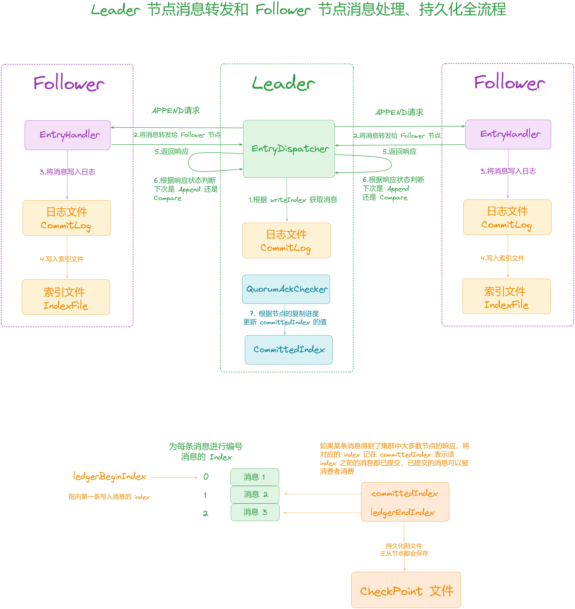