大家好，我是**华仔**, 又跟大家见面了。

从今天开始我将继续为大家奉上 RocketMQ 消费者源码剖析系列文章，正式开启「**RocketMQ 的服务端 Broker 源码之旅**」，这是第二十篇，本篇我们将以「**RocketMQ 5.1.2**」版本为主，来剖析下 RocketMQ 源码之 Broker 端 MappedFile 消息写入流程剖析。

这里我将以「**RocketMQ 5.1.2**」版本为主，通过「**场景驱动**」的方式带大家一点点的对 RocketMQ 源码进行深度剖析，正式开启「**RocketMQ 的源码之旅**」，跟我一起来掌握 RocketMQ 源码核心架构设计思想吧。

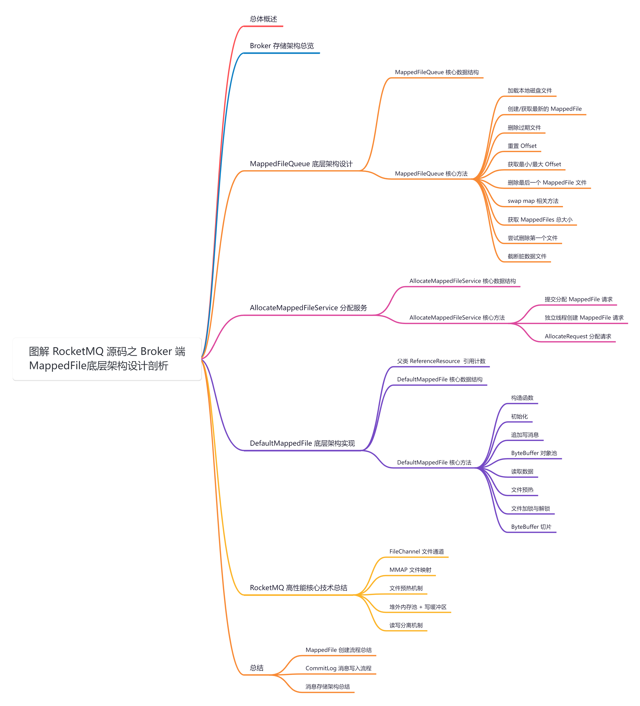

## **01 总体概述**

消息存储是 RocketMQ 整个系统的核心，直接决定着吞吐性能和高可用性。RocketMQ 存储消息并没有借助外部组件，而是「**直接操作文件**」，借助 java NIO 的力量使得 I/O 性能十分高。

当消息来的时候，顺序追加写入 [CommitLog](http://commitlog/) 文件中。为了 [Consumer](http://consumer/) 消费消息的时候能够方便的根据 topic 查询消息，在 [CommitLog](http://commitlog/) 文件的基础上衍生出了 [CosumerQueue](http://cosumerqueue/) 文件用来存放了某 topic 的消息在 [CommitLog](http://commitlog/) 中的偏移位置。此外为了支持根据消息 key 查询消息，还构建了 [indexFile](http://indexfile%20/) 文件。

这三个文件就是 RocketMQ 的主要存储内容，大致结构如下图所示：

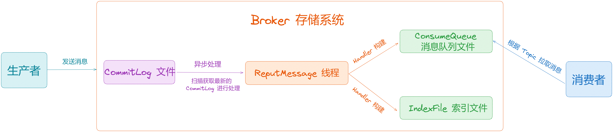

在[【Broker端源码分析系列第十九篇】图解 RocketMQ 源码之 Broker 端CommitLog存储架构设计剖析](https://articles.zsxq.com/id_k1dlpc0wpe8p.html)这篇中，得知 [CommitLog](http://commitlog%20/) 存储组件调用 [MappedFileQueue](http://mappedfilequeue%20/) 来进行底层消息存储。

通过上篇得出最重要的是 [mappedFileQueue](http://mappedfilequeue/) 属性。消息最终存储在 [CommitLog](http://commitlog/) 文件里，实际上 [CommitLog](http://commitlog/) 是一个「**逻辑概念**」，真正的文件是一个个 [MappedFile](http://mappedfile/)，然后组成了 [mappedFileQueue](http://mappedfilequeue/)。

今天我们继续来剖析下底层三大核心存储文件之一：[CommitLog](http://commitlog%20/) 底层存储 [MappedFile](http://mappedfile%20/) 的架构设计究竟是怎样的？

## **02 Broker 存储架构总览**

这里先给一张 Broker 模块从收到消息到返回响应业务流转过程的架构图。

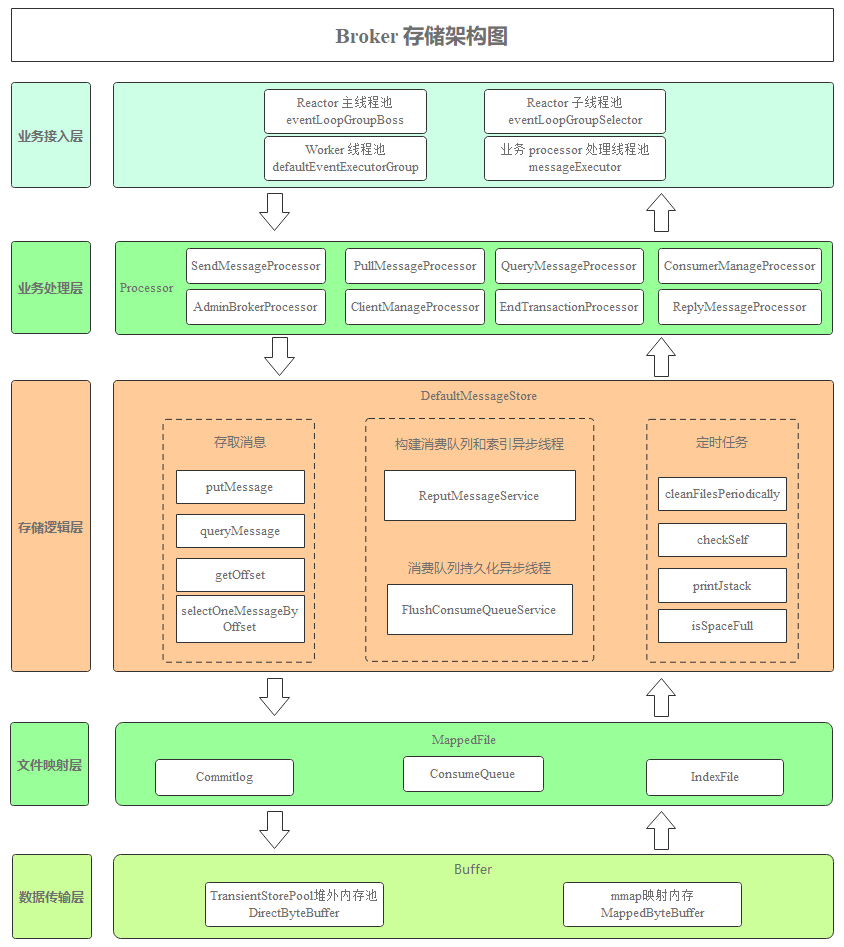

（图片来自网络，这张图对于当前版本来说会有些变化，不过大体还是一致的）

## **03 MappedFileQueue 底层架构设计**

通过上篇的剖析，我们了解到 [CommitLog](http://commitlog%20/) 写入消息就是在将消息追加到 [MappedFile](http://mappedfile%20/) 中，而 [MappedFile](http://mappedfile%20/) 是 RocketMQ 对「**磁盘文件**」的一个抽象， [MappedFileQueue](http://mappedfilequeue%20/) 是一个「**磁盘文件目录**」的抽象对象，可以看出它就是 [MappedFile](http://mappedfile%20/) 的集合。

[MappedFileQueue](http://mappedfilequeue%20/) 用一个 [CopyOnWriteArrayList](http://copyonwritearraylist%20/) 队列来存储「**磁盘文件目录**」下的「**文件映射对象**」 [MappedFile](http://mappedfile/)。[CopyOnWriteArrayList](http://copyonwritearraylist%20/) 就是采用 [COW](http://cow/) 的模式，即「**写时复制**」来保证「**集合的并发安全**」，非常适合「**读多写少**」的场景。

源码位置：[https://github.com/apache/rocketmq/blob/release-5.1.2/](https://github.com/apache/rocketmq/blob/release-5.1.2/store/src/main/java/org/apache/rocketmq/store/MappedFileQueue.java)[store](https://github.com/apache/rocketmq/blob/release-5.1.2/store/src/main/java/org/apache/rocketmq/store/MappedFileQueue.java)[/src/main/java/org/apache/rocketmq/](https://github.com/apache/rocketmq/blob/release-5.1.2/store/src/main/java/org/apache/rocketmq/store/MappedFileQueue.java)[store](https://github.com/apache/rocketmq/blob/release-5.1.2/store/src/main/java/org/apache/rocketmq/store/MappedFileQueue.java)[/](https://github.com/apache/rocketmq/blob/release-5.1.2/store/src/main/java/org/apache/rocketmq/store/MappedFileQueue.java)[MappedFileQueue](https://github.com/apache/rocketmq/blob/release-5.1.2/store/src/main/java/org/apache/rocketmq/store/MappedFileQueue.java)[.java](https://github.com/apache/rocketmq/blob/release-5.1.2/store/src/main/java/org/apache/rocketmq/store/MappedFileQueue.java)

## **3.1 MappedFileQueue 核心数据结构**

/\*\*

\* MappedFileQueue 是一个目录的抽象对象，可以看出就是 MappedFile 的集合

\* MappedFileQueue 用一个 CopyOnWriteArrayList 队列来存储目录下的文件映射对象 MappedFile

\*/

public class MappedFileQueue implements Swappable {

private static final Logger log \= LoggerFactory.getLogger(LoggerName.STORE\_LOGGER\_NAME);

private static final Logger LOG\_ERROR \= LoggerFactory.getLogger(LoggerName.STORE\_ERROR\_LOGGER\_NAME);

// 该 MappedFileQueue 所管理的 CommitLog 存储文件目录路径

// 1. CommitLog文件目录路径为： ../store/commit/log

// 2. ConsumeQueue文件目录路径为： ../store/xxx\_topic/x

protected final String storePath;

// 目录下每个文件大小

// 1. commitLog 文件 默认 1g

// 2. consumeQueue 文件 默认600w字节)

protected final int mappedFileSize;

// 目录下所管理的所有 MappedFile 文件集合

// MappedFileQueue 用一个 CopyOnWriteArrayList 队列来存储「磁盘文件目录」下的「文件映射对象」 MappedFile。

// CopyOnWriteArrayList 就是采用 COW 的模式，即「写时复制」来保证「集合的并发安全」，非常适合「读多写少」的场景。

protected final CopyOnWriteArrayList<MappedFile> mappedFiles = new CopyOnWriteArrayList<>();

// 映射文件分配服务 // 创建 MappedFile 的服务， 内部有自己的线程。 (通过该类能够异步创建 MappedFile)

protected final AllocateMappedFileService allocateMappedFileService;

// 目录的刷盘位点（刷新位置）

// (最后一个MappedFile.fileName + 最后一个MappedFile.flushPosition)

protected long flushedWhere \= 0;

// 提交位置

protected long committedWhere \= 0;

// 当前目录下最后一条 msg 存储时间

protected volatile long storeTimestamp \= 0;

// 构造函数

public MappedFileQueue(final String storePath, int mappedFileSize,

AllocateMappedFileService allocateMappedFileService) {

this.storePath = storePath;

this.mappedFileSize = mappedFileSize;

this.allocateMappedFileService = allocateMappedFileService;

}

....

}

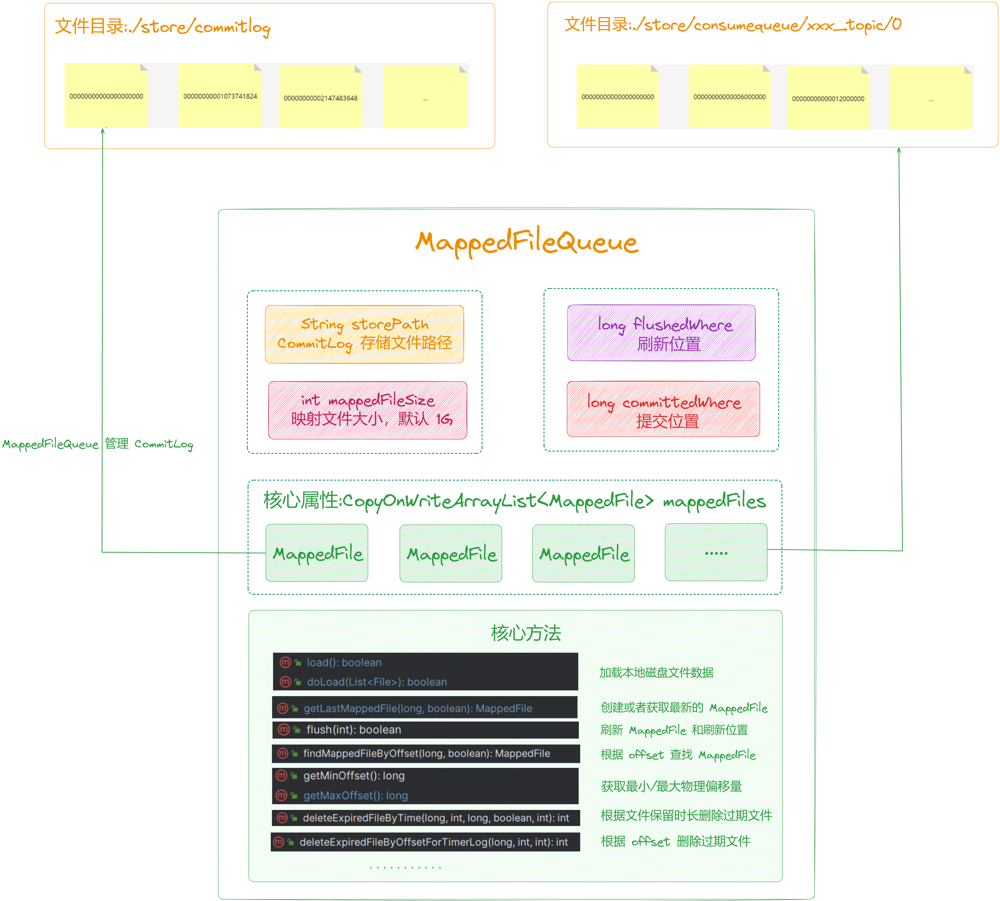

上面属性基本上都很简单，核心属性：[mappedFiles](http://mappedfiles%20/) 它用一个 [CopyOnWriteArrayList](http://copyonwritearraylist/) 队列来存储「**磁盘文件目录**」下的「**文件映射对象**」 [MappedFile](http://mappedfile/)。

另外需要强调一个属性是： [flushedWhere](http://flushedwhere%20/) ， 请结合上面的图片来理解，[MappedFileQueue](http://mappedfilequeue/) 目录中的 [MappedFile](http://mappedfile/) 文件是「**顺序追加写**」的， 当文件写满了之后才会去创建新的 [MappedFile](http://mappedfile%20/)， 其中 [MappedFile](http://mappedfile/) 的文件名是以「**物理偏移量**」来命名地。

举个例子：假设每个文件大小为 [64 bytes](http://64%20bytes/)，那么第一个文件名为 [00000](http://00000%20/) , 当该文件写满了则需要创建第二个文件，那么第二个文件名为 [00064](http://00064%20/) , 此时只能向第二个文件中「**顺序追加写**」，那么当写了 [32bytes](http://32bytes/) 后 的 [flushedWhere = 00064 + 00032 = 00096](http://%20flushedwhere%20=%2000064%20+%2000032%20=%2000096/) 。

了解完这些后，我们重点来看下该类的重要方法。

## **3.2 MappedFileQueue 核心方法**

### **3.2.1 加载本地磁盘文件**

/\*\*

\* 在 broker 启动阶段，加载本地磁盘数据使用的。

\* @return

\*/

public boolean load() {

// 1、创建目录对象，获取 CommitLog 文件的存放目录

File dir \= new File(this.storePath);

/\*\*

\* 2、获取目录下所有的文件集合

\* listFiles 方法的作用:

\* 如果 file 是个文件，则返回的是 null

\* 如果 file 是空日录，返回的是空数组

\* 如果 file 不是空目录，则返回的是该目录下的文件和自录

\*/

File\[\] ls = dir.listFiles();

if (ls != null) {

// 3、如果存在 CommitLog 文件，那么进行加载

return doLoad(Arrays.asList(ls)); // Arrays.asList(ls):将 Files\[\] 数组转化为 \]ist 集合

}

return true;

}

/\*\*

\* 该方法会读取 "storePath" 目录下的文件，为对应的文件创建 mappedFile 对象，并加入到 List 中

\* @param files

\* @return

\*/

public boolean doLoad(List<File> files) {

// ascending order

// 1、对 CommitLog 文件按照文件名升序排序

files.sort(Comparator.comparing(File::getName));

// 2、遍历文件列表

for (File file : files) {

if (file.isDirectory()) {

continue;

}

// 3、校验文件实际大小是否等于预定的文件大小，如果不相等则直接返回 fa1se，不再加载其他文件

if (file.length() != this.mappedFileSize) {

log.warn(file + "\\t" + file.length()

\+ " length not matched message store config value, please check it manually");

return false;

}

try {

/\*\*

\* 4、核心逻辑：实例化 MappedFile 对象， 通过 DefaultMappedFile 类生成

\* 每一个 CommitLog 文件都创建一个对应的 MappedFile 对象

\* 在物理上，CommitLog 日录下面是一个个的 CommitLog 文件，但是在 \]ava 中进行了三层射: CommitLog -> MappedFileQueue -> MappedFile

\* CommitLog 中包含 MappedFileQueue，以及 CommitLog 相关的其他服务，例如:刷盘服务: MappedFileQueue 中包含 MappedFile 集合，以及单个 CommitLog 文件大小等属性

\* 而 MappedFile 才是真正的一个 CommitLog 文件在 \]ava 中的映射，包含文件名、大小、mmap 对象 mappedByteBuffer 等属性

\* 实际上 MappedFileQueue 和 MappedFile 都是通用类 CommitLog、ConsumeQueue、IndexFile 文件都会使用到。

\*/

MappedFile mappedFile \= new DefaultMappedFile(file.getPath(), mappedFileSize);

// 将 wrotePosition、flushedPosition、commitPosition 默认设置为文件大小

// 需要注意的是这里给的值都是 mappedFileSize, 并不是准确值。 准确值需要recover阶段设置

// 5、当前文件所映射到的消息写入page cache的位置

mappedFile.setWrotePosition(this.mappedFileSize);

// 6、刷盘的最新位置

mappedFile.setFlushedPosition(this.mappedFileSize);

// 7、已提交的最新位置

mappedFile.setCommittedPosition(this.mappedFileSize);

// 8、添加到 MappedFileQueue 内部的 mappedFiles 集合中

this.mappedFiles.add(mappedFile);

log.info("load " + file.getPath() + " OK");

} catch (IOException e) {

log.error("load file " + file + " error", e);

return false;

}

}

return true;

}

总结下该方法主要做的事情如下：

1.  根据指定文件目录 (如：../store/commitlog) 来构建 File 对象「**注意：这里是文件夹**」，获取 [CommitLog](http://commitlog%20/) 文件的存放目录。
2.  遍历该文件夹下所有的文件并升序排序，得到 [File\[\] files](http://File%5B%5D%20files) 数组 「**注意：这里是文件集合**」。
3.  遍历排序后的文件集合，为每个文件创建 [MappedFile](http://mappedfile/) 对象并赋初始值，然后存入 [MappedFiles](http://mappedfiles/) 集合中。
4.  「**注意：这里仅仅是初始值是没有任何作用的**」 。当 [Broker](http://broker%20/) 正常启动后， 会先调用 [load()](http://%20load\(\)/) 方法加载出目录下所有的[MappedFile](http://mappedfile/)， 然后再通过 [recover](http://recover/) 相关方法来重新赋上准确的值。

是不是对这三个位置比较懵逼，没关系，这里先记住有这个概念，会在下面深度剖析这三个位置是什么关系。

### **3.2.2 创建/获取最新的 MappedFile**

在上一篇我们已经简单了解过，这里再来看下，加深印象。

通过源码得知该方法有 3个重载方法，如下：

/\*\*

\* MappedFileQueue的方法

\* 获取最新的MappedFile

\* @return

\*/

public MappedFile getLastMappedFile(final long startOffset) {

return getLastMappedFile(startOffset, true);

}

/\*\*

\* 创建或者获取最新的 MappedFile 即获取当前正在顺序写的 MappedFile

\* 存储 CommitLog 消息 | 存储 ConsumeQueue 数据时，都需要获取当前正在顺序写的 MappedFile 对象

\* 注意： 如果 MappedFile 写满了 或者 不存在查找的 MappedFile, 则创建新的 MappedFile

\*

\* @param startOffset 文件起始 offset

\* @param needCreate 当list为空时，是否创建 mappedFile

\* @return

\*/

public MappedFile getLastMappedFile(final long startOffset, boolean needCreate) {

// 初始化创建 offset

// 该值 控制是否需要创建MappedFile ，当需要创建MappedFile时，它充当文件名

// 两种情况 会创建：

// 1. list 内没有 mappedFIle

// 2. list 最后一个 mappedFile 即当前顺序写的 mappedFile 写满了

long createOffset \= -1;

// 从 mappedFiles 集合中获取最后一个 mappedFile

MappedFile mappedFileLast \= getLastMappedFile();

// 情况1、list 内没有 mappedFile

// 如果 mappedFileLast 为 null，那么设置创建索引默认为 0，即新建的文件为第一个 mappedFile 文件，从 0 开始

if (mappedFileLast == null) {

// createOffset 取值必须是 mappedFileSize 的倍数 或者 0

createOffset = startOffset - (startOffset % this.mappedFileSize);

}

// 情况2、list 最后一个 mappedFile 即当前顺序写的 mappedFile 写满了

// 如果 mappedFileLast 满了，那么设置新的 mappedFile 文件的创建索引 = 上一个文件的起始索引（即文件名） + mappedFileSize

if (mappedFileLast != null && mappedFileLast.isFull()) {

// createOffset 取值是上一个文件名转 Long 类型 + mappedFileSize

createOffset = mappedFileLast.getFileFromOffset() + this.mappedFileSize;

}

// 这里是创建 新的 mappedFile 逻辑

// 如果需要创建新的 mappedFile，那么根据起始索引创建新的 mappedFile

if (createOffset != -1 && needCreate) {

return tryCreateMappedFile(createOffset);

}

return mappedFileLast;

}

/\*\*

\* 获取最新的 MappedFile

\* @return

\*/

public MappedFile getLastMappedFile() {

// 将 mappedFiles 转换成数组格式

MappedFile\[\] mappedFiles = this.mappedFiles.toArray(new MappedFile\[0\]);

// 从 mappedFileQueue 中的 mappedFiles 集合中获取最后一个 MappedFile 即最新的 MappedFile

return mappedFiles.length == 0 ? null : mappedFiles\[mappedFiles.length - 1\];

}

创建 [MappedFile](http://mappedfile%20/) 的时候，会根据「**起始偏移量**」计算文件名，文件名默认是 20 位长度，不足前面补 0。从这可以看出，[MappedFile](http://mappedfile%20/)映射的文件名就是「**该文件中数据的起始偏移量**」。

比如 [Commitlog](http://commitlog/) 文件的大小默认是 1GB，第一个[Commitlog](http://commitlog/)文件的起始偏移量是 0，那么第一个 [Commitlog](http://commitlog/) 的文件名就是 [00000000000000000000](http://0.0.0.0/)，第二个 [Commitlog](http://commitlog/) 文件的文件名就是 [00000000001073741824](http://00000000001073741824)。

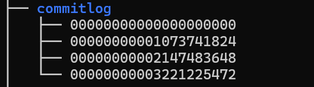

/\*\*

\* 尝试创建新的 mappedFile

\* @param createOffset 不同情况条件下值不同

\* @return

\*/

public MappedFile tryCreateMappedFile(long createOffset) {

// 获取 下一个待创建 MappedFile 文件的绝对路径

String nextFilePath \= this.storePath + File.separator + UtilAll.offset2FileName(createOffset);

// 获取 下下一个待创建 MappedFile 文件的绝对路径

String nextNextFilePath \= this.storePath + File.separator + UtilAll.offset2FileName(createOffset

\+ this.mappedFileSize);

// 创建下一个和下下一个 MappedFile

return doCreateMappedFile(nextFilePath, nextNextFilePath);

}

/\*\*

\* 真正创建 MappedFile 操作

\* @param nextFilePath

\* @param nextNextFilePath

\* @return

\*/

protected MappedFile doCreateMappedFile(String nextFilePath, String nextNextFilePath) {

MappedFile mappedFile \= null;

// 使用 allocateMappedFileService 来创建 MappedFile

// 如果开启了文件预热功能，则交给专门线程去创建 mappedFile 并且预热内存页，预热需要一定时间，默认等待 5 秒，并且 mappedFile 还会提前创建下一个 mappedFile 文件并预热，这样在下次要拿 mappedFile 文件时，直接返回已预热好的 mappedFile 就行

if (this.allocateMappedFileService != null) {

// 当mappedFileSize >= 1g 的话， 这里创建的 mappedFile 会进行预热

mappedFile = this.allocateMappedFileService.putRequestAndReturnMappedFile(nextFilePath,

nextNextFilePath, this.mappedFileSize);

} else {

// 直接创建 MappedFile 注意：这里没有预热

try {

mappedFile = new DefaultMappedFile(nextFilePath, this.mappedFileSize);

} catch (IOException e) {

log.error("create mappedFile exception", e);

}

}

if (mappedFile != null) {

if (this.mappedFiles.isEmpty()) {

// 设置第一个 mappedFile 标识

mappedFile.setFirstCreateInQueue(true);

}

// 将创建的 mappedFile 添加到 mappedFiles 中

this.mappedFiles.add(mappedFile);

}

// 返回创建好的 mappedFile

return mappedFile;

}

这里的重点是：

1.  如果创建 [MappedFileQueue](http://mappedfilequeue%20/) 的时候传入了 [AllocateMappedFileService](http://allocatemappedfileservice%20/) 组件 就会用 [AllocateMappedFileService](http://allocatemappedfileservice%20/) 来创建 [MappedFile](http://mappedfile/)，而且是一次「**创建两个连续**」的 [MappedFile](http://mappedfile/)，这样的目的是「**提前预分配好**」，避免频繁分配 [MappedFile](http://mappedfile/)。
2.  如果没有传入 [AllocateMappedFileService](http://allocatemappedfileservice/) 组件就会直接创建 [MappedFile](http://mappedfile/)。
3.  创建完 [MappedFile](http://mappedfile%20/) 后，如果是第一个文件，就会设置其「**第一个创建标识**」的属性，然后添加到 [COW](http://cow%20/) 队列。

等重要方法剖析完，会重点剖析这个 [AllocateMappedFileService](http://allocatemappedfileservice/) 组件，然后再来一个完整的创建流程，不然穿插的太乱了。

### **3.2.3 删除过期文件**

在 [MappedFileQueue](http://mappedfilequeue%20/) 中有三种删除过期文件的方法，我们分别来看下。

### **3.2.3.1 根据文件保留时长删除过期文件**

/\*\*

\* 根据文件存活时长删除过期文件

\* @param expiredTime 过期时间

\* @param deleteFilesInterval 删除两个文件之间的时间间隔

\* @param intervalForcibly 强制关闭资源的时间间隔 mf.destory 传递的参数

\* @param cleanImmediately 如果为 true 强制删除,不考虑过期时间这个条件

\* @param deleteFileBatchMax 最大删除批次

\* @return

\*/

public int deleteExpiredFileByTime(final long expiredTime,

final int deleteFilesInterval,

final long intervalForcibly,

final boolean cleanImmediately,

final int deleteFileBatchMax) {

// 获取 mfs 数组，实际上就是将 MappedFile 集合转换成数组

Object\[\] mfs = this.copyMappedFiles(0);

if (null == mfs)

return 0;

// \*\*\*\* 这里减 -1是保证当前正在顺序写的 MappedFile 不被删除 \*\*\*\*

int mfsLength \= mfs.length - 1;

// 记录删除的文件数

int deleteCount \= 0;

// 被删除的文件集合

List<MappedFile> files = new ArrayList<>();

int skipFileNum \= 0;

if (null != mfs) {

//do check before deleting

// 删除之前，先校验确保提交日志文件的完整性和一致性

checkSelf();

// 遍历删除

for (int i \= 0; i < mfsLength; i++) {

MappedFile mappedFile \= (MappedFile) mfs\[i\];

// 计算出当前文件的存活时间截止点 即:上一次修改时间 + 过期时长

long liveMaxTimestamp \= mappedFile.getLastModifiedTimestamp() + expiredTime;

// 条件成立:

// 条件一： 文件存活时间达到上限

// 条件二： disk占用率达到上限会强制删除

if (System.currentTimeMillis() >= liveMaxTimestamp || cleanImmediately) {

if (skipFileNum > 0) {

log.info("Delete CommitLog {} but skip {} files", mappedFile.getFileName(), skipFileNum);

}

// 调用 mappedFile#destroy 删除文件

if (mappedFile.destroy(intervalForcibly)) {

// 添加待删除的 mappedFile 到被删除的文件集合中

files.add(mappedFile);

// 增加删除文件计数

deleteCount++;

// 当超过最大删除批次直接 break 退出

if (files.size() >= deleteFileBatchMax) {

break;

}

if (deleteFilesInterval > 0 && (i + 1) < mfsLength) {

try {

// 在删除完文件后需要 sleep，然后再去删除下一个文件

Thread.sleep(deleteFilesInterval);

} catch (InterruptedException e) {

}

}

} else {

break;

}

} else {

skipFileNum++;

//avoid deleting files in the middle

break;

}

}

}

// 将满足删除条件的 mf 文件 从 mappedFiles 内删除

deleteExpiredFile(files);

// 返回已删除的文件数

return deleteCount;

}

看着比较长，其实很好理解，就是遍历目录下的 [MappedFile](http://mappedfile%20/) 集合， 寻找出「**满足删除条件的 MappedFile**」，再调用 [mappedFile#destroy](http://mappedfile/#destroy) 方法进行删除，然后将满足删除条件的 mf 文件 从 [mappedFiles](http://mappedfiles/) 内删除。

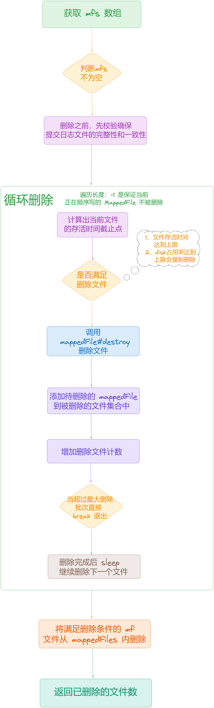

### **3.2.3.2 根据 offset 删除过期文件**

/\*\*

\* 根据 offset 删除过期文件

\* @param offset 偏移量

\* @param unitSize 位置大小

\* @return

\*/

public int deleteExpiredFileByOffset(long offset, int unitSize) {

// 获取 mfs 数组，实际上就是将 MappedFile 集合转换成数组

Object\[\] mfs = this.copyMappedFiles(0);

// 被删除的文件集合

List<MappedFile> files = new ArrayList<>();

// 记录删除的文件数

int deleteCount \= 0;

if (null != mfs) {

// \*\*\*\* 这里减 -1是保证当前正在顺序写的 MappedFile 不被删除 \*\*\*\*

int mfsLength \= mfs.length - 1;

// 遍历删除

for (int i \= 0; i < mfsLength; i++) {

// 删除标志位

boolean destroy;

MappedFile mappedFile \= (MappedFile) mfs\[i\];

// 从 mappedFile 中某个位置选择数据

SelectMappedBufferResult result \= mappedFile.selectMappedBuffer(this.mappedFileSize - unitSize);

// 如果成功选择到数据

if (result != null) {

// 计算最大偏移量

long maxOffsetInLogicQueue \= result.getByteBuffer().getLong();

// 释放选择的映射缓冲区

result.release();

// 判断是否需要删除该文件的标志位

destroy = maxOffsetInLogicQueue < offset;

if (destroy) {

log.info("physic min offset " + offset + ", logics in current mappedFile max offset " \+ maxOffsetInLogicQueue + ", delete it");

}

} else if (!mappedFile.isAvailable()) { // Handle hanged file.

// mappedFile 不可用

log.warn("Found a hanged consume queue file, attempting to delete it.");

// 直接删除

destroy = true;

} else {

log.warn("this being not executed forever.");

break;

}

// 根据标志位判断是否删除 mappedFile 文件

if (destroy && mappedFile.destroy(1000 \* 60)) {

// 添加待删除的 mappedFile 到被删除的文件集合中

files.add(mappedFile);

// 增加删除文件计数

deleteCount++;

} else {

break;

}

}

}

// 将满足删除条件的 mf 文件 从 mappedFiles 内删除

deleteExpiredFile(files);

// 返回已删除的文件数

return deleteCount;

}

同理类似，就是遍历目录下的 [MappedFile](http://mappedfile/) 集合， 寻找出「**满足删除条件的 MappedFile**」，再调用 [mappedFile#destroy](http://mappedfile/#destroy) 方法进行删除，然后将满足删除条件的 mf 文件 从 [mappedFiles](http://mappedfiles/) 内删除。

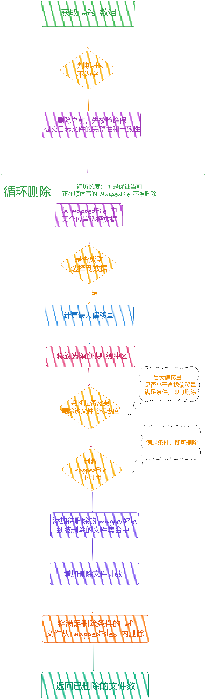

### **3.2.3.3 根据 offset 和 checkOffset 删除过期文件**

/\*\*

\* 根据 offset 和 checkOffset 删除过期文件

\* @param offset 偏移量

\* @param checkOffset 检查偏移量

\* @param unitSize 位置大小

\* @return

\*/

public int deleteExpiredFileByOffsetForTimerLog(long offset, int checkOffset, int unitSize) {

// 获取 mfs 数组，实际上就是将 MappedFile 集合转换成数组

Object\[\] mfs = this.copyMappedFiles(0);

// 被删除的文件集合

List<MappedFile> files = new ArrayList<>();

// 记录删除的文件数

int deleteCount \= 0;

if (null != mfs) {

// \*\*\*\* 这里减 -1是保证当前正在顺序写的 MappedFile 不被删除 \*\*\*\*

int mfsLength \= mfs.length - 1;

// 遍历删除

for (int i \= 0; i < mfsLength; i++) {

// 删除标志位

boolean destroy \= false;

MappedFile mappedFile \= (MappedFile) mfs\[i\];

// 从 mappedFile 中根据 checkOffset 选择数据

SelectMappedBufferResult result \= mappedFile.selectMappedBuffer(checkOffset);

try {

// 如果成功选择到数据

if (result != null) {

// 获取当前位置

int position \= result.getByteBuffer().position();

// 读取数据大小

int size \= result.getByteBuffer().getInt();//size

// 读取前一个位置信息

result.getByteBuffer().getLong(); //prev pos

// 读取 magic

int magic \= result.getByteBuffer().getInt();

// 判断数据大小和 magic 是否符合条件

if (size == unitSize && (magic | 0xF) == 0xF) {

// 更新当前位置

result.getByteBuffer().position(position + MixAll.UNIT\_PRE\_SIZE\_FOR\_MSG);

// 获取逻辑队列中的最大偏移量

long maxOffsetPy \= result.getByteBuffer().getLong();

// 判断是否需要删除该文件的标志位

destroy = maxOffsetPy < offset;

if (destroy) {

log.info("physic min commitlog offset " + offset + ", current mappedFile's max offset "

\+ maxOffsetPy + ", delete it");

}

} else {

log.warn("Found error data in \[{}\] checkOffset:{} unitSize:{}", mappedFile.getFileName(),

checkOffset, unitSize);

}

} else if (!mappedFile.isAvailable()) { // Handle hanged file.

// mappedFile 不可用

log.warn("Found a hanged consume queue file, attempting to delete it.");

// 直接删除

destroy = true;

} else {

log.warn("this being not executed forever.");

break;

}

} finally {

if (null != result) {

// 释放选择的映射缓冲区

result.release();

}

}

// 根据标志位判断是否删除 mappedFile 文件

if (destroy && mappedFile.destroy(1000 \* 60)) {

// 添加待删除的 mappedFile 到被删除的文件集合中

files.add(mappedFile);

// 增加删除文件计数

deleteCount++;

} else {

break;

}

}

}

// 将满足删除条件的 mf 文件 从 mappedFiles 内删除

deleteExpiredFile(files);

// 返回已删除的文件数

return deleteCount;

}

同理类似，就是遍历目录下的 [MappedFile](http://mappedfile/) 集合， 寻找出「**满足删除条件的 MappedFile**」，再调用 [mappedFile#destroy](http://mappedfile/#destroy) 方法进行删除，然后将满足删除条件的 mf 文件 从 [mappedFiles](http://mappedfiles/) 内删除。

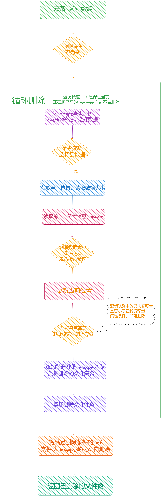

### **3.2.3.4 从 mappedFiles 列表中删除过期文件**

/\*\*

\* 从 mappedFiles 列表中删除过期的文件

\* @param files

\*/

void deleteExpiredFile(List<MappedFile> files) {

// 如果待删除文件 mappedFiles 列表不为空

if (!files.isEmpty()) {

// 获取待删除文件的迭代器

Iterator<MappedFile> iterator = files.iterator();

// 遍历待删除文件列表

while (iterator.hasNext()) {

// 获取当前待删除的文件

MappedFile cur \= iterator.next();

// 如果当前文件不在 mappedFiles 列表中

if (!this.mappedFiles.contains(cur)) {

// 从待删除文件 mappedFiles 列表中移除当前文件

iterator.remove();

log.info("This mappedFile {} is not contained by mappedFiles, so skip it.", cur.getFileName());

}

}

try {

// 尝试移除所有在 mappedFiles 列表中的待删除文件

if (!this.mappedFiles.removeAll(files)) {

// 如果移除失败，记录错误日志

log.error("deleteExpiredFile remove failed.");

}

} catch (Exception e) {

// 捕获异常并记录错误日志

log.error("deleteExpiredFile has exception.", e);

}

}

}

### **3.2.4 重置 Offset**

/\*\*

\* 重置 offset

\* @param offset

\* @return

\*/

public boolean resetOffset(long offset) {

// 从 mappedFiles 集合中获取最后一个 mappedFile

MappedFile mappedFileLast \= getLastMappedFile();

// 如果最后一个 MappedFile 对象不为空

if (mappedFileLast != null) {

// 计算最后一个消息的偏移量

long lastOffset \= mappedFileLast.getFileFromOffset() + mappedFileLast.getWrotePosition();

// 计算最后一个消息的偏移量与目标偏移量的差值

long diff \= lastOffset - offset;

// 设置最大偏移量差值为当前 MappedFile 大小的两倍

final int maxDiff \= this.mappedFileSize \* 2;

// 如果差值超过最大偏移量差值

if (diff > maxDiff)

// 返回失败

return false;

}

// 从尾部向前遍历 MappedFiles 列表的迭代器

ListIterator<MappedFile> iterator = this.mappedFiles.listIterator(mappedFiles.size());

while (iterator.hasPrevious()) {

// 获取前一个 MappedFile 对象

mappedFileLast = iterator.previous();

// 如果目标偏移量大于或等于当前 MappedFile 的起始偏移量

if (offset >= mappedFileLast.getFileFromOffset()) {

// 计算目标偏移量在当前 MappedFile 中的位置

int where \= (int) (offset % mappedFileLast.getFileSize());

// 更新当前 MappedFile 的刷盘、写入、提交的位置为目标位置

mappedFileLast.setFlushedPosition(where);

mappedFileLast.setWrotePosition(where);

mappedFileLast.setCommittedPosition(where);

break;

} else {

// 如果目标偏移量小于当前 MappedFile 的起始偏移量，移除当前 MappedFile

iterator.remove();

}

}

// 返回成功

return true;

}

### **3.2.5 获取最小/最大 Offset**

/\*\*

\* 获取最小偏移量

\* @return

\*/

public long getMinOffset() {

// 如果 mappedFiles 列表不为空

if (!this.mappedFiles.isEmpty()) {

try {

// 获取第一个 MappedFile 文件的起始偏移量作为最小偏移量

return this.mappedFiles.get(0).getFileFromOffset();

} catch (IndexOutOfBoundsException e) {

//continue;

} catch (Exception e) {

// 如果发生其他异常，记录错误日志

log.error("getMinOffset has exception.",e);

}

}

// 如果 mappedFiles 列表为空或者发生异常，返回-1

return -1;

}

/\*\*

\* 获取最大偏移量的方法

\* @return

\*/

public long getMaxOffset() {

// 获取最后一个 mappedFile 文件

MappedFile mappedFile \= getLastMappedFile();

if (mappedFile != null) {

// 返回文件起始偏移量 + 已读取的位置

return mappedFile.getFileFromOffset() + mappedFile.getReadPosition();

}

// 如果 mappedFile 为空，则返回0，表示当前没有存储消息的文件

return 0;

}

/\*\*

\* 返回存储文件当前的写指针，返回最后一个文件的

\* @return

\*/

public long getMaxWrotePosition() {

MappedFile mappedFile \= getLastMappedFile();

if (mappedFile != null) {

// 文件起始位置 + 当前写指针位置

return mappedFile.getFileFromOffset() + mappedFile.getWrotePosition();

}

return 0;

}

### **3.2.6 获取第一个 MappedFile 文件**

/\*\*

\* 获取第一个 MappedFile 文件

\*/

public MappedFile getFirstMappedFile() {

MappedFile mappedFileFirst \= null;

// 如果 MappedFiles 列表不为空

if (!this.mappedFiles.isEmpty()) {

try {

// 获取第一个 MappedFile 文件的起始偏移量作为最小偏移量

mappedFileFirst = this.mappedFiles.get(0);

} catch (IndexOutOfBoundsException e) {

//ignore

} catch (Exception e) {

log.error("getFirstMappedFile has exception.", e);

}

}

// 如果找到返回 mappedFileFirst

return mappedFileFirst;

}

### **3.2.7 删除最后一个 MappedFile 文件**

/\*\*

\* 删除最后一个 MappedFile 文件

\*/

public void deleteLastMappedFile() {

// 获取最后一个 MappedFile 文件

MappedFile lastMappedFile \= getLastMappedFile();

// 如果最后一个 MappedFile 文件不为空

if (lastMappedFile != null) {

// 删除最后一个 MappedFile 文件，超时为 1000 ms

lastMappedFile.destroy(1000);

// 从 mappedFiles 列表中移除最后一个 MappedFile 文件

this.mappedFiles.remove(lastMappedFile);

// 记录日志，说明删除了一个逻辑文件

log.info("on recover,destroy a logic mapped file " + lastMappedFile.getFileName());

}

}

### **3.2.8 swap map 相关方法**

/\*\*

\* 清理 swap map

\* @param forceCleanSwapIntervalMs

\*/

@Override

public void cleanSwappedMap(long forceCleanSwapIntervalMs) {

// 如果 mappedFiles 列表为空，直接返回

if (mappedFiles.isEmpty()) {

return;

}

// 保留最后 3 个 MappedFile 对象

int reserveNum \= 3;

// 获取 mfs 数组，实际上就是将 MappedFile 集合转换成数组

Object\[\] mfs = this.copyMappedFiles(0);

// 如果结果为 null，直接返回

if (null == mfs) {

return;

}

// 从倒数第 reserveNum+1 个 MappedFil 向前遍历

for (int i \= mfs.length - reserveNum - 1;i >= 0;i--) {

// 获取当前遍历到的 MappedFile 文件

MappedFile mappedFile \= (MappedFile) mfs\[i\];

// 如果当前时间距离最近一次 swap map 的时间超过了 forceCleanSwapIntervalMs

if (System.currentTimeMillis() - mappedFile.getRecentSwapMapTime() > forceCleanSwapIntervalMs) {

// 清理已经被交换出去的逻辑内存映射区

mappedFile.cleanSwapedMap(false);

}

}

}

### **3.2.9 获取 MappedFiles 总大小**

/\*\*

\* 获取 MappedFiles 总大小

\* @return

\*/

public long getMappedMemorySize() {

long size \= 0;

// 获取 mfs 数组，实际上就是将 MappedFile 集合转换成数组

Object\[\] mfs = this.copyMappedFiles(0);

// 如果结果不为null

if (mfs != null) {

// 遍历 MappedFiles 数组

for (Object mf :mfs) {

// 如果当前 MappedFile 文件可用

if (((ReferenceResource) mf).isAvailable()) {

// 累加当前 MappedFile 文件的大小

size += this.mappedFileSize;

}

}

}

// 返回总大小

return size;

}

### **3.2.10 尝试删除第一个文件**

/\*\*

\* 尝试删除第一个文件

\* @param intervalForcibly

\* @return

\*/

public boolean retryDeleteFirstFile(final long intervalForcibly) {

// 获取第一个 MappedFile 文件

MappedFile mappedFile \= this.getFirstMappedFile();

// 如果文件不为空

if (mappedFile != null) {

// 如果 MappedFile 文件不可用

if (!mappedFile.isAvailable()) {

// 记录警告日志，表示该 MappedFile 曾经被删除，但仍存在

log.warn("the mappedFile was destroyed once,but still alive," + mappedFile.getFileName());

// 尝试强制删除 MappedFile 文件

boolean result \= mappedFile.destroy(intervalForcibly);

if (result) {

// 记录信息日志，表示 MappedFile 被重新删除

log.info("the mappedFile re delete OK," + mappedFile.getFileName());

// 创建临时 MappedFile 列表

List<MappedFile> tmpFiles = new ArrayList<>();

// 将当前 MappedFile 添加到列表中

tmpFiles.add(mappedFile);

// 删除已过期的文件

this.deleteExpiredFile(tmpFiles);

} else {

// 记录警告日志，表示 MappedFile 重新删除失败

log.warn("the mappedFile re delete failed," + mappedFile.getFileName());

}

// 返回删除结果

return result;

}

}

// 返回false

return false;

}

### **3.2.11 截断脏数据文件**

public void truncateDirtyFiles(long offset) {

List<MappedFile> willRemoveFiles = new ArrayList<>();

for (MappedFile file : this.mappedFiles) {

// 计算文件尾部偏移量的值

long fileTailOffset \= file.getFileFromOffset() + this.mappedFileSize;

if (fileTailOffset > offset) {

// 如果 offset 处于文件中间，就把几个指针都强制指向当前 offset

if (offset >= file.getFileFromOffset()) {

file.setWrotePosition((int) (offset % this.mappedFileSize));

file.setCommittedPosition((int) (offset % this.mappedFileSize));

file.setFlushedPosition((int) (offset % this.mappedFileSize));

} else {

// 那上一个文件从中间“截断了”，后面的文件放入上面的 list

file.destroy(1000);

willRemoveFiles.add(file);

}

}

}

// 执行删除

this.deleteExpiredFile(willRemoveFiles);

}

这里看看其调用了这个方法的外部方法，都是带有「**recover**」的，一看就是用来进行恢复的。

  
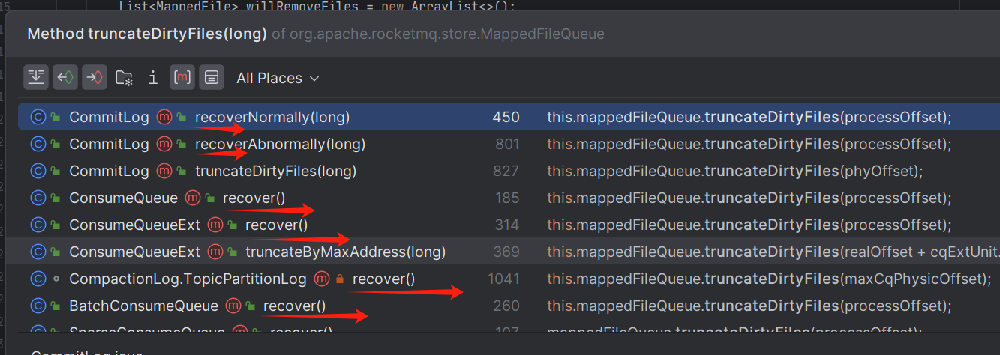

一直往上找，最后在 [BrokerController](http://brokercontroller%20/) 中出现了，也就是说是在加载数据时调用这个方法的。

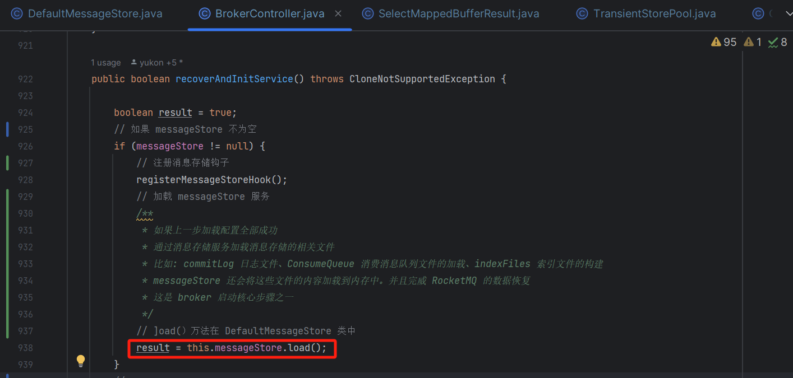

另外关于 [flush](http://flush/)、[commit](http://commit%20/) 等其他方法会在消息刷盘中单独剖析，这里就不展开了。

## **04 AllocateMappedFileService 分配服务**

在第三节中提到，[MappedFileQueue](http://mappedfilequeue%20/) 创建时，如果传入了 [AllocateMappedFileService](http://allocatemappedfileservice/)，即 [MappedFile](http://mappedfile%20/) 分配服务，就会通过它来创建 [MappedFile](http://mappedfile/)。

源码位置：[https://github.com/apache/rocketmq/blob/release-5.1.2/](https://github.com/apache/rocketmq/blob/release-5.1.2/store/src/main/java/org/apache/rocketmq/store/AllocateMappedFileService.java)[store](https://github.com/apache/rocketmq/blob/release-5.1.2/store/src/main/java/org/apache/rocketmq/store/AllocateMappedFileService.java)[/src/main/java/org/apache/rocketmq/](https://github.com/apache/rocketmq/blob/release-5.1.2/store/src/main/java/org/apache/rocketmq/store/AllocateMappedFileService.java)[store](https://github.com/apache/rocketmq/blob/release-5.1.2/store/src/main/java/org/apache/rocketmq/store/AllocateMappedFileService.java)[/](https://github.com/apache/rocketmq/blob/release-5.1.2/store/src/main/java/org/apache/rocketmq/store/AllocateMappedFileService.java)[AllocateMappedFileService](https://github.com/apache/rocketmq/blob/release-5.1.2/store/src/main/java/org/apache/rocketmq/store/AllocateMappedFileService.java)[.java](https://github.com/apache/rocketmq/blob/release-5.1.2/store/src/main/java/org/apache/rocketmq/store/AllocateMappedFileService.java)

## **4.1 AllocateMappedFileService 核心数据结构**

/\*\*

\* Create MappedFile in advance

\* RocketMQ 里面存储模块实现高性能的核心技术就是 MappedFile，把磁盘文件映射成一块内存，让你在读写磁盘文件的时候，可以基于内存来读写，速度很快，性能很高

\* AllocateMappedFileService 继承了 ServiceThread，说明它是服务线程类。AllocateMappedFileService 用于提前创建一个 MappedFile 和下一个 MappedFile

\*/

public class AllocateMappedFileService extends ServiceThread {

private static final Logger log \= LoggerFactory.getLogger(LoggerName.STORE\_LOGGER\_NAME);

// 等待创建 MappedFile 的超时时间，默认 5 秒

private static int waitTimeOut \= 1000 \* 5;

// 分配请求映射表，用来保存当前所有待处理的分配请求，其中key是filePath,value是分配请求AllocateRequest。如果分配请求被成功处理，即获取到映射文件则从请求会从requestTable中移除

private ConcurrentMap<String, AllocateRequest> requestTable =

new ConcurrentHashMap<>();

// 分配请求优先级队列

private PriorityBlockingQueue<AllocateRequest> requestQueue =

new PriorityBlockingQueue<>();

// 创建 MappedFile 是否有异常

private volatile boolean hasException \= false;

// 默认消息存储对象

private DefaultMessageStore messageStore;

public AllocateMappedFileService(DefaultMessageStore messageStore) {

this.messageStore = messageStore;

}

....

}

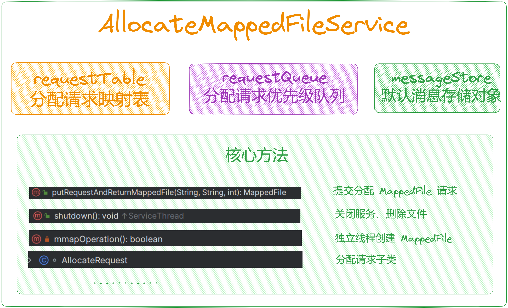

## **4.2 AllocateMappedFileService 核心方法**

重点就 3 个方法，我们分别来看下。

### **4.2.1 提交分配 MappedFile 请求**

在 [AllocateMappedFileService](http://allocatemappedfileservice%20/) 核心数据结构主要有一个 [requestTable](http://requesttable%20/) 分配请求映射表和 [requestQueue](http://requestqueue%20/) 分配请求优先级阻塞队列，里面的对象都是 [AllocateRequest](http://allocaterequest/)。

/\*\*

\* 提交分配 MappedFile 请求

\* @param nextFilePath 下一个文件的路径

\* @param nextNextFilePath 下下个文件的路径

\* @param fileSize 文件大小

\* @return

\*/

public MappedFile putRequestAndReturnMappedFile(String nextFilePath,String nextNextFilePath,int fileSize) {

// 开了内存池就要看剩下内存块能够几个文件用的

// 初始化能够提交请求的次数

int canSubmitRequests \= 2;

// 是否启用了堆外内存池（默认不开启）

if (this.messageStore.isTransientStorePoolEnable()) {

// 如果配置为在堆外内存池中没有足够缓冲区时快速失败，并且当前 Broker 角色不是 SLAVE

if (this.messageStore.getMessageStoreConfig().isFastFailIfNoBufferInStorePool()

&& BrokerRole.SLAVE != this.messageStore.getMessageStoreConfig().getBrokerRole()) {

// 重新计算能够提交请求的次数

// 计算 TransientStorePool 中剩余的 buffer 数量减去 requestQueue 中待分配的数量后，剩余的 buffer 数量

canSubmitRequests = this.messageStore.getTransientStorePool().availableBufferNums() - this.requestQueue.size();

}

}

// 创建下一个文件的分配请求

// 封装一个请求对象，放到 requestTable，创建好的 mappedfile 会放到请求对象中，在下次要拿文件时直接从 requestTable 根据 filePath 即可获取

AllocateRequest nextReq \= new AllocateRequest(nextFilePath,fileSize);

// 查看是否已经存在，将下一个文件的分配请求放入请求表中，并且该文件名是第一次出现

boolean nextPutOK \= this.requestTable.putIfAbsent(nextFilePath,nextReq) == null;

if (nextPutOK) {

// 如果能够提交的请求次数已经不足

if (canSubmitRequests <= 0) {

// 记录警告日志

log.warn("\[NOTIFYME\]TransientStorePool is not enough,so create mapped file error," +

"RequestQueueSize :{},StorePoolSize:{}",this.requestQueue.size(),this.messageStore.getTransientStorePool().availableBufferNums());

// 从请求表中移除该路径对应的请求

this.requestTable.remove(nextFilePath);

return null;

}

// 将下一个文件的分配请求放入请求队列中，提交给 AllocateMappedFile 线程去创建文件并预热

boolean offerOK \= this.requestQueue.offer(nextReq);

if (!offerOK) {

log.warn("never expected here,add a request to preallocate queue failed");

}

// 能够提交的请求次数递减

canSubmitRequests--;

}

// 创建下下个文件的分配请求

AllocateRequest nextNextReq \= new AllocateRequest(nextNextFilePath,fileSize);

// 查看是否已经存在，将下下个文件的分配请求放入请求表中，并且该文件名是第一次出现

boolean nextNextPutOK \= this.requestTable.putIfAbsent(nextNextFilePath,nextNextReq) == null;

if (nextNextPutOK) {

// 如果能够提交的请求次数已经不足

if (canSubmitRequests <= 0) {

// 记录警告日志

log.warn("\[NOTIFYME\]TransientStorePool is not enough,so skip preallocate mapped file," + "RequestQueueSize :{},StorePoolSize:{}",this.requestQueue.size(),this.messageStore.getTransientStorePool().availableBufferNums());

// 从请求表中移除该路径对应的请求

this.requestTable.remove(nextNextFilePath);

} else {

// 将下下个文件的分配请求放入请求队列中，提交给AllocateMapFile线程去创建文件并预热

boolean offerOK \= this.requestQueue.offer(nextNextReq);

if (!offerOK) {

log.warn("never expected here,add a request to preallocate queue failed");

}

}

}

// mmapOperation 操作已经执行完成，并且创建 MappedFile 有异常

if (hasException) {

log.warn(this.getServiceName() + " service has exception.so return null");

return null;

}

// 获取下一个文件的分配请求

// 虽然是异步，但这里是阻塞等待AllocateMapFile线程创建好文件并返回

AllocateRequest result \= this.requestTable.get(nextFilePath);

try {

if (result != null) {

// 开始计时等待创建 MappedFile

messageStore.getPerfCounter().startTick("WAIT\_MAPFILE\_TIME\_MS");

// 请求线程挂起等待 5 秒创建 MappedFile

boolean waitOK \= result.getCountDownLatch().await(waitTimeOut,TimeUnit.MILLISECONDS);

// 结束计时等待创建 MappedFile

messageStore.getPerfCounter().endTick("WAIT\_MAPFILE\_TIME\_MS");

if (!waitOK) {

log.warn("create mmap timeout " + result.getFilePath() + " " + result.getFileSize());

return null;

} else {

// 从请求表中移除该路径对应的请求

this.requestTable.remove(nextFilePath);

// 返回已创建的MappedFile

return result.getMappedFile();

}

} else {

log.error("find preallocate mmap failed,this never happen");

}

} catch (InterruptedException e) {

log.warn(this.getServiceName() + " service has exception.",e);

}

return null;

}

在上面可以看到 [MappedFileQueue](http://mappedfilequeue/#putRequestAndReturnMappedFile) 会调用 [AllocateMappedFileService#putRequestAndReturnMappedFile](http://allocatemappedfileservice/#putRequestAndReturnMappedFile%20) 方法来获取 [MappedFile](http://mappedfile/)。这个方法是支持创建两个连续的 [MappedFile](http://mappedfile%20/) 的。

当前线程向 [AllocateMappedFile](http://allocatemappedfile/) 线程的 [requestQueue](http://requestqueue/) 提交创建文件的请求，异步线程创建文件并进行内存页的预热后将 [mappedFile](http://mappedfile/) 对象放到请求对象中并唤醒阻塞的请求线程。

从这段代码可以看到会「**提前创建下一个文件**」，并把「**下一个文件名**」为 key 放到 [requestTable](http://requesttable/) 中。在下一次要用到新文件时，直接根据文件名从 [requestTable](http://requesttable/) 创建好的并且预热完成的 [mappedFile](http://mappedfile%20/) 对象返回，这样大大提高了 [CommitLog](http://commitlog/) 写入的速度。

1.  首先 [canSubmitRequests=2](http://cansubmitrequests=2/) 表明要提交两个创建 [MappedFile](http://mappedfile%20/) 的请求。
2.  如果开启了瞬时存储池化技术，可以提交的请求数还要根据池子中的 [Buffer](http://buffer%20/) 数量变化。在当前 [Broker](http://broker/) 是 [Master](http://master/) 节点的情况下，[可以提交请求的数量 = 池子里可用的Buffer数量 - 请求队列 requestQueue 中的数量](http://xn--%20=%20buffer%20-%20%20requestqueue%20-xd74d5whe4ch27citqja8116fwy4dx7ppa1a9638fya75mgy4xulpma9a4065z3a3819f4eaua5a3460e/)。也就是总的 [MappedFile](http://mappedfile%20/) 数量不会超过池子中 [Buffer](http://buffer%20/) 的数量。
3.  接着就根据分配的文件路径和文件大小创建一个分配请求 [AllocateRequest](http://allocaterequest/)，并放入请求表 [requestTable](http://requesttable%20/) 中。使用 [putIfAbsent](http://putifabsent%20/) 就是「**保证同一个路径不会重复分配创建**」。
4.  在开启瞬时存储池化技术时，操作如下：
5.  如果存储池 Buffer 不够了，不能够提交一个分配请求了，就直接移除这个请求，返回 null。
6.  如果足够，就会将这个分配请求添加到 [requestQueue](http://requestqueue%20/) 队列中。
7.  能分配的请求数量也会减一。
8.  同理，接着就是以同样的方式创建下一个分配请求，这就是「**预分配机制**」，提前创建好 [MappedFile](http://mappedfile/)。
9.  分配请求提交到队列之后，之后就是从请求表 [requestTable](http://requesttable%20/) 中获取第一个文件的分配请求，开始等待它的分配。
10.  如果等待超时还没分配好（默认5秒），就返回 null。
11.  如果分配成功，就移除分配请求，并返回创建好的 [MappedFile](http://mappedfile/)。

### **4.2.2 独立线程创建 MappedFile 请求**

[AllocateMappedFileService](http://allocatemappedfileservice%20/) 继承自 [ServiceThread](http://servicethread/)，说明它也是一个「**线程组件**」，会有一个 「**Runnable**」来执行「**线程任务**」。

可以看到它的 [run()](http://%20run\(\)/) 方法里就是在循环执行 [mmapOperation()](http://mmapoperation\(\)/) 方法，这个方法就是「**在执行具体的分配请求**」，创建 [MappedFile](http://mappedfile/)。

public void run() {

log.info(this.getServiceName() + " service started");

while (!this.isStopped() && this.mmapOperation()) {

}

log.info(this.getServiceName() + " service end");

}

/\*\*

\* Only interrupted by the external thread, will return false

\*/

private boolean mmapOperation() {

boolean isSuccess \= false;

AllocateRequest req \= null;

try {

// 从优先级队列里获取一个分配请求 AllocateRequest

req = this.requestQueue.take();

// 从映射表 requestTable 里获取分配请求 AllocateRequest 对接的响应

AllocateRequest expectedRequest \= this.requestTable.get(req.getFilePath());

// 开始分配 MappedFile

if (null == expectedRequest) {

log.warn("this mmap request expired, maybe cause timeout " + req.getFilePath() + " "

\+ req.getFileSize());

return true;

}

// putRequestAndReturnMappedFile 内部中的 requestTable 里的请求与优先级队列并不是强一致，是最终一致的

if (expectedRequest != req) {

log.warn("never expected here, maybe cause timeout " + req.getFilePath() + " "

\+ req.getFileSize() + ", req:" + req + ", expectedRequest:" + expectedRequest);

return true;

}

if (req.getMappedFile() == null) {

long beginTime \= System.currentTimeMillis();

// 创建 MappedFile

MappedFile mappedFile;

// 真正分配 MappedFile 分为 2 种情况：启动堆外内存池，则直接创建 MappedFile

// 启动堆外内存

if (messageStore.isTransientStorePoolEnable()) {

try {

// 通过 JDK 提供的 ServiceLoader 加载一堆 MappedFile，根据迭代器获取到下一个 MappedFile

mappedFile = ServiceLoader.load(MappedFile.class).iterator().next();

// 对 MappedFile 进行初始化

mappedFile.init(req.getFilePath(), req.getFileSize(), messageStore.getTransientStorePool());

} catch (RuntimeException e) {

log.warn("Use default implementation.");

mappedFile = new DefaultMappedFile(req.getFilePath(), req.getFileSize(), messageStore.getTransientStorePool());

}

} else {

// 默认不开启堆外内存池时，直接创建 MappedFile 就行了

mappedFile = new DefaultMappedFile(req.getFilePath(), req.getFileSize());

}

long elapsedTime \= UtilAll.computeElapsedTimeMilliseconds(beginTime);

// 创建 MappedFile 花费大于 10ms 打印日志

if (elapsedTime > 10) {

int queueSize \= this.requestQueue.size();

log.warn("create mappedFile spent time(ms) " + elapsedTime + " queue size " + queueSize + " " + req.getFilePath() + " " + req.getFileSize());

}

// pre write mappedFile

// 默认 warmMapedFileEnable=false，即默认不预热

// 如果启用了 ByteBuffer 预热机制，会对 mappedFile 进行预热，就是提前把磁盘数据加载到内存区域里

if (mappedFile.getFileSize() >= this.messageStore.getMessageStoreConfig()

.getMappedFileSizeCommitLog()

&&

this.messageStore.getMessageStoreConfig().isWarmMapedFileEnable()) {

mappedFile.warmMappedFile(this.messageStore.getMessageStoreConfig().getFlushDiskType(),

this.messageStore.getMessageStoreConfig().getFlushLeastPagesWhenWarmMapedFile());

}

// 放入分配请求中

req.setMappedFile(mappedFile);

this.hasException = false;

isSuccess = true;

}

} catch (InterruptedException e) {

log.warn(this.getServiceName() + " interrupted, possibly by shutdown.");

this.hasException = true;

return false;

} catch (IOException e) {

log.warn(this.getServiceName() + " service has exception. ", e);

this.hasException = true;

if (null != req) {

requestQueue.offer(req);

try {

Thread.sleep(1);

} catch (InterruptedException ignored) {

}

}

} finally {

if (req != null && isSuccess)

// AllocateRequest 计数器减一，通知 MappedFile 构建完毕

req.getCountDownLatch().countDown();

}

return true;

}

1.  首先从请求队列 [requestQueue](http://requestqueue%20/) 中取出第一个分配请求 [AllocateRequest](http://allocaterequest/)，创建 [MappedFile](http://mappedfile%20/) 对象；如果启用了堆外内存池技术，就会传入池子对象。
2.  接下来会看是否「**启用预热机制**」，如果开启了预热机制，则会初始化 [MappedFile](http://mappedfile%20/) 关联的 [ByteBuffer](http://bytebuffer%20/) 区域，对其进行一个「**预热**」的操作，这块我们下面再深度剖析。
3.  最后就是将创建成功的 [MappedFile](http://mappedfile%20/) 设置回 [AllocateRequest](http://allocaterequest%20/) 中，并在 [finally](http://finally%20/) 中通过其 [CountDownLatch](http://countdownlatch%20/) 的 [countDown()](http://countdown\(\)%20/) 操作来通知 [MappedFile](http://mappedfile%20/) 已经创建成功。

关于堆外内存池技术，可以查看：[【Broker端源码分析系列第十七篇】图解 RocketMQ 源码之 Broker 端存储模块堆外内存架构剖析](https://articles.zsxq.com/id_0rufq5khepju.html)

### **4.2.3 AllocateRequest 分配请求**

[AllocateRequest](http://allocaterequest%20/) 包含如下属性，其中 [CountDownLatch](http://countdownlatch%20/) 就是用来「**等待分配完成的并发工具**」。

[CountDownLatch](http://countdownlatch%20/) 有两个主要操作：

1.  countDown()。
2.  await()。
3.  await 已经有地方调用了，那么必然就还有其它地方会调用 [countDown()](http://countdown\(\)/) 方法。

/\*\*

\* 分配请求

\*/

static class AllocateRequest implements Comparable<AllocateRequest> {

// Full file path

// MappedFile 映射的磁盘文件路径

private String filePath;

// 磁盘文件大小

private int fileSize;

// 并发控制组件

private CountDownLatch countDownLatch \= new CountDownLatch(1);

// 分配的 MappedFile

private volatile MappedFile mappedFile \= null;

public AllocateRequest(String filePath, int fileSize) {

this.filePath = filePath;

this.fileSize = fileSize;

}

....

}

最后我们来深度剖析下最底层的一个抽象 [DefaultMappedFile](http://defaultmappedfile%20/) 类。

## **05 DefaultMappedFile 底层架构实现**

[MappedFile](http://mappedfile%20/) 是 RocketMQ 内存映射文件的具体实现，将消息字节 commit 写入「**PageCache**」 缓冲区中，或者将消息 flush 刷入磁盘 。

[CommitLog](http://commitlog/)、[ConsumerQueue](http://consumerqueue/)、[IndexFile](http://indexfile/) 三类文件磁盘的读写都是通过 [MappedFile](http://mappedfile/)。

源码位置：[https://github.com/apache/rocketmq/blob/release-5.1.2/](https://github.com/apache/rocketmq/blob/release-5.1.2/store/src/main/java/org/apache/rocketmq/store/logfile/DefaultMappedFile.java)[store](https://github.com/apache/rocketmq/blob/release-5.1.2/store/src/main/java/org/apache/rocketmq/store/logfile/DefaultMappedFile.java)[/src/main/java/org/apache/rocketmq/](https://github.com/apache/rocketmq/blob/release-5.1.2/store/src/main/java/org/apache/rocketmq/store/logfile/DefaultMappedFile.java)[store](https://github.com/apache/rocketmq/blob/release-5.1.2/store/src/main/java/org/apache/rocketmq/store/logfile/DefaultMappedFile.java)[/](https://github.com/apache/rocketmq/blob/release-5.1.2/store/src/main/java/org/apache/rocketmq/store/logfile/DefaultMappedFile.java)[logfile/DefaultMappedFile](https://github.com/apache/rocketmq/blob/release-5.1.2/store/src/main/java/org/apache/rocketmq/store/logfile/DefaultMappedFile.java)[.java](https://github.com/apache/rocketmq/blob/release-5.1.2/store/src/main/java/org/apache/rocketmq/store/logfile/DefaultMappedFile.java)

## **5.1 父类 ReferenceResource 引用计数**

首先来看下 [DefaultMappedFile](http://defaultmappedfile/) 的继承体系图，如下：

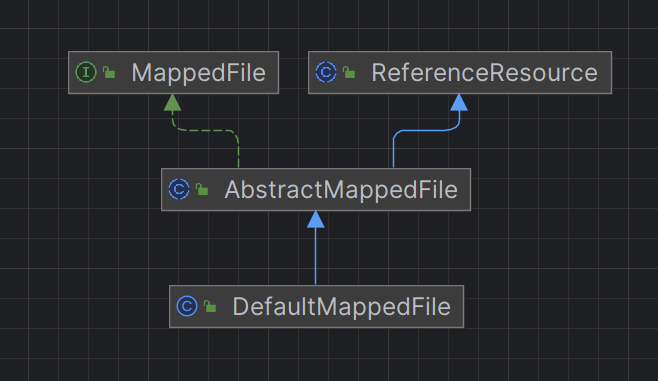

可以看到 [MappedFile](http://mappedfile%20/) 继承自 [ReferenceResource](http://referenceresource%20/) 引用计数类， 这个实现方式在 [Netty](http://netty%20/) 的内存池技术中也有看到过，看名字就知道是一个引用计数组件，用来对 [MappedFile](http://mappedfile%20/) 使用的引用。

由于 [DefaultMappedFile](http://defaultmappedfile%20/) 底层使用的是 [MappedByteBuffer](http://mappedbytebuffer/)，它是「**mmap 零拷贝**」，自然涉及到了「**堆外内存**」，因此 [ReferenceResource](http://referenceresource/) 存在的目的就是为了控制管理好 [DefaultMappedFile](http://defaultmappedfile/) 对象的回收，防止内存泄漏。

/\*\*

\* 引用技术

\*/

public abstract class ReferenceResource {

// refCount 引用数量，其初始值为 1

// 当 refCount <=0 时表示该资源可以释放了，没有任何其它程序依赖它了

protected final AtomicLong refCount \= new AtomicLong(1);

// 是否存活， 默认值 true

// 当 available = false 时，表示资源处于非存活状态，不可用

protected volatile boolean available \= true;

// 是否已经清理，默认值 false

// 当执行完子类对象的 cleanUp() 后，该值会设置为 true 表示资源已经全部释放了

protected volatile boolean cleanupOver \= false;

// 第一次尝试关闭资源的时间

private volatile long firstShutdownTimestamp \= 0;

/\*\*

\* 增加引用计数方法 refCount+1

\* @return true 增加成功 false 增加失败

\*/

public synchronized boolean hold() {

if (this.isAvailable()) {

if (this.refCount.getAndIncrement() > 0) {

return true;

} else {

this.refCount.getAndDecrement();

}

}

return false;

}

// 判断资源是否存活

public boolean isAvailable() {

return this.available;

}

/\*\*

\* 关闭资源

\* @param intervalForcibly 强制关闭资源的时间间隔

\*/

public void shutdown(final long intervalForcibly) {

if (this.available) {

// 资源不存活

this.available = false;

// 初次关闭资源时 的系统时间

this.firstShutdownTimestamp = System.currentTimeMillis();

// 引用计数 -1，此时资源有可能释放了，也有可能没释放

this.release();

// 执行到这 说明第一次关闭资源时，并没有释放完资源

} else if (this.getRefCount() > 0) {

if ((System.currentTimeMillis() - this.firstShutdownTimestamp) >= intervalForcibly) {

// 强制设置 引用计数为 负数

this.refCount.set(-1000 - this.getRefCount());

// 此时一定会释放资源

this.release();

}

}

}

// 减少引用计数 refCount-1

public void release() {

long value \= this.refCount.decrementAndGet();

if (value > 0)

return;

// 执行到这说明当前资源已经没有任何程序占用了，可以调用 cleanUp 释放真正的资源了

synchronized (this) {

this.cleanupOver = this.cleanup(value);

}

}

public long getRefCount() {

return this.refCount.get();

}

// 子类实现 cleanup 方法

public abstract boolean cleanup(final long currentRef);

public boolean isCleanupOver() {

return this.refCount.get() <= 0 && this.cleanupOver;

}

}

可以看到该类很短， 逻辑也很通俗易懂。 实际上就是通过「**refCount**」字段来控制子类资源的使用情况。

如果你自己业务上的代码有相关「**控制资源**」的需求，几乎可以将该类拿来直接使用。

## **5.2 DefaultMappedFile 核心数据结构**

/\*\*

\* DefaultMappedFile 是 RocketMQ 内存映射文件的具体实现

\*/

public class DefaultMappedFile extends AbstractMappedFile {

// 操作系统每页大小，默认4KB

public static final int OS\_PAGE\_SIZE \= 1024 \* 4;

public static final Unsafe UNSAFE \= getUnsafe();

private static final Method IS\_LOADED\_METHOD;

public static final int UNSAFE\_PAGE\_SIZE \= UNSAFE == null ? OS\_PAGE\_SIZE : UNSAFE.pageSize();

protected static final Logger log \= LoggerFactory.getLogger(LoggerName.STORE\_LOGGER\_NAME);

// 当前 JVM 实例中 MappedFile 的虚拟内存

protected static final AtomicLong TOTAL\_MAPPED\_VIRTUAL\_MEMORY \= new AtomicLong(0);

// 当前 JVM 实例中 MappedFile 对象个数

protected static final AtomicInteger TOTAL\_MAPPED\_FILES \= new AtomicInteger(0);

// 写入位置，当前内存映射文件文件的写指针，从 0 开始

protected static final AtomicIntegerFieldUpdater<DefaultMappedFile> WROTE\_POSITION\_UPDATER;

// 提交位置，当前文件的提交指针，如果开启 transientStorePoolEnable，则数据会存储在 TransientStorePool 中，

// 然后提交到内存映射 ByteBuffer 中，再写入磁盘

protected static final AtomicIntegerFieldUpdater<DefaultMappedFile> COMMITTED\_POSITION\_UPDATER;

// flush 位置，将该指针之前的数据持久化存储到磁盘中

protected static final AtomicIntegerFieldUpdater<DefaultMappedFile> FLUSHED\_POSITION\_UPDATER;

// 保存当前文件所映射到的消息写入 FileChannel 的位置，此时数据可能还存在 PageCache 中未落盘，每次增加日志 wrotePosition 就会往后移动

protected volatile int wrotePosition;

// 提交到 FileChannel 的数据位置，在堆外内存池启动的时候才会使用到，堆外内存池提交到 FileChannel 中的数据位置，

// 这个字段只有启用了堆外内存池才会用到，要不然就是使用的 wrotePosition

protected volatile int committedPosition;

// 保存刷盘的最新位置，小于 flushedPosition 位置的数据都已经持久化到了磁盘

protected volatile int flushedPosition;

// 文件大小

protected int fileSize;

protected FileChannel fileChannel;

/\*\*

\* Message will put to here first, and then reput to FileChannel if writeBuffer is not null.

\* 堆外内存 ByteBuffer，如果不为空，数据首先将存储在该 Buffer 中，然后提交到 MappedFile 创建的

\* FileChannel 中。transientStorePoolEnable 为 true 时不为空

\*/

protected ByteBuffer writeBuffer \= null;

// 堆外内存池，该内存池中的内存会提供内存锁机制。transientStorePoolEnable 为 true 时启用

protected TransientStorePool transientStorePool \= null;

// 文件名称

protected String fileName;

// 该文件的初始偏移量，其实就是日志数据存储文件的名称，初始值为0，每增加增加一个文件默认情况下增加 1024 \* 1024 \* 1024

protected long fileFromOffset;

// 物理文件

protected File file;

// 物理文件对应的内存映射 Buffer

protected MappedByteBuffer mappedByteBuffer;

// 文件最后一次写入内容的时间

protected volatile long storeTimestamp \= 0;

// 是否是 MappedFileQueue 队列中第一个文件。

protected boolean firstCreateInQueue \= false;

// 最后一次刷盘时间

private long lastFlushTime \= -1L;

protected MappedByteBuffer mappedByteBufferWaitToClean \= null;

// 交换 map 时间

protected long swapMapTime \= 0L;

// 上一次交换后的 mappedByteBuffer 访问次数

protected long mappedByteBufferAccessCountSinceLastSwap \= 0L;

/\*\*

\* If this mapped file belongs to consume queue, this field stores store-timestamp of first message referenced

\* by this logical queue.

\*/

private long startTimestamp \= -1;

/\*\*

\* If this mapped file belongs to consume queue, this field stores store-timestamp of last message referenced

\* by this logical queue.

\*/

private long stopTimestamp \= -1;

....

}

[DefaultMappedFile](http://defaultmappedfile%20/) 有如下属性：

1.  通过三个 [AtomicInteger](http://atomicinteger%20/) 类型的 [wrotePosition](http://wroteposition/)、[committedPosition](http://committedposition/)、[flushedPosition](http://flushedposition%20/) 来表示数据的「**写入位置**」、「**提交位置**」、「**刷盘位置**」。这三个位置我会在下篇刷盘机制的时候再一起看。
2.  然后是关联文件的一些属性：「**文件大小**」、「**名称**」、「**起始偏移量**」、「**File 对象**」，是否第一次创建到 [MappedFileQueue](http://mappedfilequeue%20/) 队列等。
3.  最后是读写文件相关的「**FileChannel**」、「**writeBuffer**」、「**mappedByteBuffer**」。

前面提到 [DefaultMappedFile](http://defaultmappedfile/) 可以看做是每一个 [CommitLog](http://commitlog/) 文件的映射，里面记录了文件的大小以及数据已经写入的位置，还有两个字节缓冲区 [ByteBuffer](http://bytebuffer/) 和 [MappedByteBuffer](http://mappedbytebuffer/)，它们的继承关系如下：

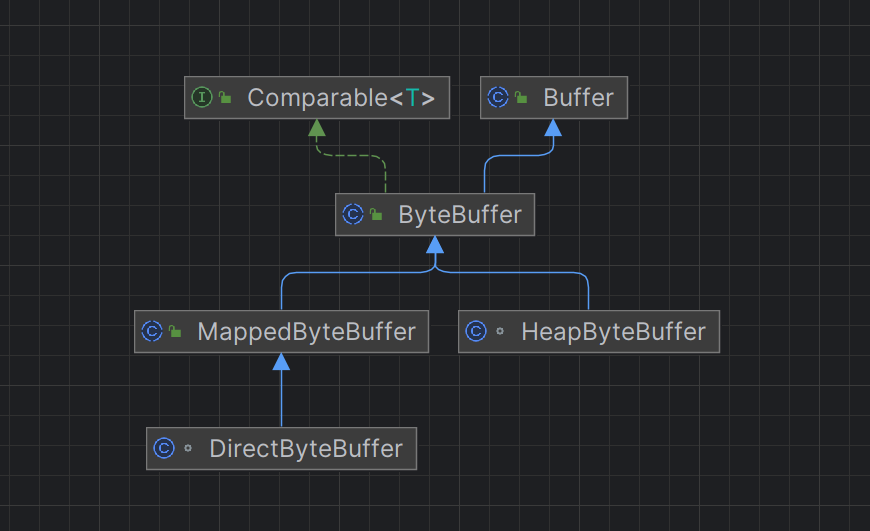

1.  **ByteBuffer**：字节缓冲区，用于在内存中分配空间，可以在 JVM 堆中分配内存 [HeapByteBuffer](http://heapbytebuffer/) ，也可以在堆外分配内存 [DirectByteBuffer](http://directbytebuffer/)。
2.  **MappedByteBuffer**：它是 **ByteBuffer** 的子类，它是将磁盘的文件内容映射到虚拟地址空间，通过虚拟地址访问物理内存中映射的文件内容，也叫文件映射，可以减少数据的拷贝。

[DefaultMappedFile](http://defaultmappedfile/) 提供了两种方式来进行内容的写入：

1.  第一种通过 **ByteBuffer** 分配缓冲区并将内容写入缓冲区，并且使用了暂存池对内存进行管理，需要时进行申请，使用完毕后回收。
2.  第二种是通过 **MappedByteBuffer** 对 [CommitLog](http://commitlog/) 进行文件映射，然后进行消息写入。

综上所述，开启「**堆外内存**」时会使用 [ByteBuffer](http://bytebuffer/)，否则使用 [MappedByteBuffer](http://mappedbytebuffer/) 进行内容写入。总的来说， [DefaultMappedFile](http://defaultmappedfile%20/) 类底层操作就是 [MappedByteBuffer](http://mappedbytebuffer/)。

我相信 肯定有人会有疑问：为什么不直接操作 [MappedByteBuffer](http://mappedbytebuffer/)，而要将 [MappedByteBuffer](http://mappedbytebuffer/) 再封装一层变为[DefaultMappedFile](http://defaultmappedfile/) 呢？

1.  [MappedByteBuffer](http://mappedbytebuffer/) 使用的是「**堆外内存**」，「**很难控制**」其内存的回收，一但操作失误就会引起「**内存泄漏**」问题 ， 因此通过 [DefaultMappedFile](http://defaultmappedfile/) 的父类 [ReferenceResource](http://referenceresource%20/) 来控制。
2.  [MappedByteBuffer](http://mappedbytebuffer%20/) 在 put 数据后实际上是将数据写到了「**虚拟内存**」上 (可以近似理解成「**PageCache**」), 而「**虚拟内存**」是依赖于「**操作系统**」来定时刷盘的， 因此我们在写完数据后需要通过 [DefaultMappedFile#flush](http://defaultmappedfile/#flush) 方法，其内部调用了 [MappedByteBuffer.force()](http://mappedbytebuffer.force\(\)/) 来「**手动控制刷盘操作**」。
3.  由于 [MappedByteBuffer](http://mappedbytebuffer%20/) 中写入读取数据等 api 使用起来挺复杂的， 因此 [DefaultMappedFile](http://defaultmappedfile/#flush) 中维护了 [flushedPosition](http://flushedposition/) 「**刷盘位点**」 和 [wrotePosition](http://wroteposition/)「**写入位点**」，能够更方便的进行读写操作。
4.  [DefaultMappedFile](http://defaultmappedfile/#flush) 中还维护了「**文件名称**」，「**文件物理偏移量**」，「**文件对象**」，「**文件通道**」等重要属性。

## **5.3 DefaultMappedFile 核心方法**

### **5.3.1 构造函数**

根据 [transientStorePoolEnable](http://transientstorepoolenable/) 是否为 true 调用不同的构造方法。

/\*\*

\* 如果设置 transientStorePoolEnable 为 false 则调用此方法

\* @param fileName

\* @param fileSize

\* @throws IOException

\*/

public DefaultMappedFile(final String fileName, final int fileSize) throws IOException {

// 初始化

init(fileName, fileSize);

}

/\*\*

\* 如果设置 transientStorePoolEnable 为 true 则调用此方法

\* @param fileName

\* @param fileSize

\* @param transientStorePool

\* @throws IOException

\*/

public DefaultMappedFile(final String fileName, final int fileSize,

final TransientStorePool transientStorePool) throws IOException {

init(fileName, fileSize, transientStorePool);

}

/\*\*

\* 初始化

\* @param fileName file name

\* @param fileSize file size

\* @param transientStorePool transient store pool

\* @throws IOException

\*/

@Override

public void init(final String fileName, final int fileSize,

final TransientStorePool transientStorePool) throws IOException {

init(fileName, fileSize);

// 如果 transientStorePoolEnable 为 true，则初始化 MappedFile 的 writeBuffer，该 buffer 从 transientStorePool 中获取

// 这里就会从池子里取一个 ByteBuffer 赋值给 writeBuffer，就是写缓冲区

this.writeBuffer = transientStorePool.borrowBuffer();

// 堆外内存

this.transientStorePool = transientStorePool;

}

1.  [transientStorePoolEnable=true](http://transientstorepoolenable=true/) 只在异步刷盘情况下生效，表示将内容先保存在堆外内存中。[TransientStorePool](http://transientstorepool%20/) 会通过 [ByteBuffer.allocateDirect](http://bytebuffer.allocatedirect/) 调用直接申请堆外内存，消息数据在写入内存的时候是写入预申请的内存中。
2.  通过 [Commit](http://commit/) 线程将数据提交到 [FileChannel](http://filechannel%20/) 中。
3.  在异步刷盘的时候，再由刷盘线程 Flush 将数据持久化到磁盘文件。

###   
**5.3.2 初始化**

private void init(final String fileName, final int fileSize) throws IOException {

// 文件名、长度为20位、左边补零、剩余为起始偏移量， 比如 00000000000000000000 代表了第一个文件，起始偏移量为0

this.fileName = fileName;

// 文件大小，默认为 1G = 10733741824

this.fileSize = fileSize;

// 构建 file 对象

this.file = new File(fileName);

// 构建文件起始索引，就是取文件名

this.fileFromOffset = Long.parseLong(this.file.getName());

boolean ok \= false;

// 确保文件目录存在

UtilAll.ensureDirOK(this.file.getParent());

try {

// 对当前 CommitLog 文件构建文件通道 fileChannel

this.fileChannel = new RandomAccessFile(this.file, "rw").getChannel();

// 把 CommitLog 文件完全的映射到虚拟内存，也就是内存映射，即 mmap，提升读写性能

this.mappedByteBuffer = this.fileChannel.map(MapMode.READ\_WRITE, 0, fileSize);

// 记录数据

TOTAL\_MAPPED\_VIRTUAL\_MEMORY.addAndGet(fileSize);

TOTAL\_MAPPED\_FILES.incrementAndGet();

ok = true;

} catch (FileNotFoundException e) {

log.error("Failed to create file " + this.fileName, e);

throw e;

} catch (IOException e) {

log.error("Failed to map file " + this.fileName, e);

throw e;

} finally {

// 释放 fileChannel，注意释放 fileChannel 不会对之前的 mappedByteBuffer 映射产生影响

if (!ok && this.fileChannel != null) {

this.fileChannel.close();

}

}

}

[FileChannel](http://filechannel%20/) 提供了 [map()](http://map\(\)/) 方法把文件映射到虚拟内存，通常情况可以映射整个文件。如果文件比较大，可以进行分段映射，RocketMQ 这里映射大小为 [(0,fileSize)](http://\(0,filesize\)/)。

当通过 [map()](http://map\(\)/) 方法建立映射关系之后，就不依赖于用于创建映射的 [FileChannel](http://filechannel/)。特别是，关闭通道 [Channel](http://%20channel/) 对映射的有效性没有影响。

[DefaultMappedFile](http://defaultmappedfile/) 的初始化 init 方法，初始化 [MappedByteBuffer](http://mappedbytebuffer/) 模式为 [MapMode.READ\_WRITE](http://mapmode.read_write/)(读/写)，此模式对「**缓冲区**」的更改最终将「**写入文件**」，但该更改对「**映射到同一文件的其他程序不一定是可见的**」。

修改 [MappedByteBuffer](http://mappedbytebuffer/) 实际会将数据写入文件对应的「**PageCache**」中，而 [TransientStorePool](http://transientstorepool/) 堆外内存方案下都是写入内存的。在消息写入操作上会更快，因此能更少的占用 [CommitLog.putMessageLock](http://commitlog.putmessagelock/) 锁，从而能够提升消息处理量。

使用 [TransientStorePool](http://transientstorepool/) 堆外内存方案的缺陷主要在于在异常崩溃的情况下会丢失更多的消息。

### **5.3.3 追加写消息**

所谓追加就是将消息内容追加到「**映射文件 MappedFile**」，并且记录更新时间和写的位置。

/\*\*

\* 追加字节数组

\* Content of data from offset to offset + length will be written to file.

\*

\* @param offset The offset of the subarray to be used. 需要写入到 文件的 字节数组

\* @param length The length of the subarray to be used.

\* @return true 写入成功 false 写入失败

\*/

@Override

public boolean appendMessage(final byte\[\] data, final int offset, final int length) {

// 获取当前写入位置

int currentPos \= WROTE\_POSITION\_UPDATER.get(this);

// 当前写入位置 + 本次写入长度小于文件大小则说明当前文件可以写入该 data 数据

if ((currentPos + length) <= this.fileSize) {

try {

ByteBuffer buf \= this.mappedByteBuffer.slice();

// 写入当前位置

buf.position(currentPos);

// 写入数据

buf.put(data, offset, length);

} catch (Throwable e) {

log.error("Error occurred when append message to mappedFile.", e);

}

// 更新 MappedFile 对象的数据写入位点

WROTE\_POSITION\_UPDATER.addAndGet(this, length);

return true;

}

return false;

}

该方法目的是 向文件中写入字节数组 实际上就是通过 [FileChannel](http://filechannel%20/) 文件通道的 [write](http://write%20/) 方法实现的， 底层就是普通[I/O](http://i/O) 操作。

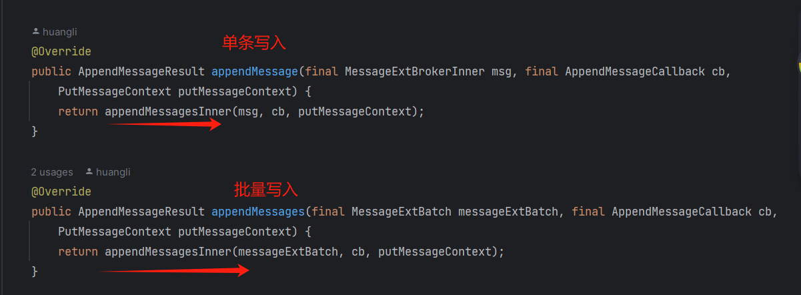

/\*\*

\* 将消息追加到 MappedFile 文件中

\* @param messageExt

\* @param cb

\* @param putMessageContext

\* @return

\*/

public AppendMessageResult appendMessagesInner(final MessageExt messageExt, final AppendMessageCallback cb,

PutMessageContext putMessageContext) {

assert messageExt != null;

assert cb != null;

// 获取 MappedFile 当前文件写指针

int currentPos \= WROTE\_POSITION\_UPDATER.get(this);

// 如果 currentPos 小于文件大小

if (currentPos < this.fileSize) {

/\*\*

\* RocketMQ 提供两种数据落盘的方式:

\* 1. 直接将数据写到 mappedByteBuffer, 然后 flush

\* 2. 先写到 writeBuffer, 再从 writeBuffer 提交到 fileChannel, 最后 flush

\*/

ByteBuffer byteBuffer \= appendMessageBuffer().slice();

// 记录当前位置

byteBuffer.position(currentPos);

AppendMessageResult result;

// 批量消息

if (messageExt instanceof MessageExtBatch && !((MessageExtBatch) messageExt).isInnerBatch()) {

// traditional batch message

// 追加消息

result = cb.doAppend(this.getFileFromOffset(), byteBuffer, this.fileSize - currentPos,

(MessageExtBatch) messageExt, putMessageContext);

// 单条消息

} else if (messageExt instanceof MessageExtBrokerInner) {

// traditional single message or newly introduced inner-batch message

// 追加消息

result = cb.doAppend(this.getFileFromOffset(), byteBuffer, this.fileSize - currentPos,

(MessageExtBrokerInner) messageExt, putMessageContext);

} else {

return new AppendMessageResult(AppendMessageStatus.UNKNOWN\_ERROR);

}

// 更新数据写入位点： 原写入位点 + 刚刚写入的数据量

WROTE\_POSITION\_UPDATER.addAndGet(this, result.getWroteBytes());

// 更新存储最后一条消息的 存储时间

this.storeTimestamp = result.getStoreTimestamp();

return result;

}

// 如果 currentPos 大于或等于文件大小，表明文件已写满，抛出异常

log.error("MappedFile.appendMessage return null, wrotePosition: {} fileSize: {}", currentPos, this.fileSize);

return new AppendMessageResult(AppendMessageStatus.UNKNOWN\_ERROR);

}

经过之前的步骤，消息内容已经写入到内存缓冲区中，并且也知道准备进行写入的 [CommitLog](http://commitlog/) 对应的映射文件，可以看到「**单条消息**」或是「**批量消息**」写入最终都会调用 [DefaultMappedFile#appendMessagesInner](http://defaultmappedfile/#appendMessagesInner) 方法。

1.  先获取消息的写入位置，如果写入的位置小于文件大小，意味着当前文件可以进行内容写入，反之说明此文件已写满，不能继续下一步，需要返回错误信息。
2.  接着获取要写入的缓冲区 [ByteBuffer](http://bytebuffer/)，如果启用了堆外内存池化技术，就会用到 [DefaultMappedFile](http://defaultmappedfile%20/) 创建时绑定的写入缓冲区 [writeBuffer](http://writebuffer/)。否则，就使用 [MMAP](http://mmap%20/) 映射出来的 [mappedByteBuffer](http://mappedbytebuffer/)。然后通过 [ByteBuffer#slice()](http://bytebuffer/#slice\(\)) 方法得到写入缓冲区的一个视图，再设置写缓冲区的开始写入位置。
3.  如果 [writeBuffer](http://writebuffer%20/) 不为空，使用 [writeBuffer](http://writebuffer/)，否则使用 [mappedByteBuffer#slice](http://mappedbytebuffer/#slice) 方法创建一个与 [MappedFile](http://mappedfile/) 共享的内存区 [byteBuffer](http://bytebuffer/)，设置 [byteBuffer](http://bytebuffer/) 的写入位置，之后通过 [byteBuffer](http://bytebuffer/) 来进行消息写入，由于是共享内存区域，所以写入的内容会影响到 [writeBuffer](http://writebuffer/) 或者 [mappedByteBuffer](http://mappedbytebuffer/#slice) 中。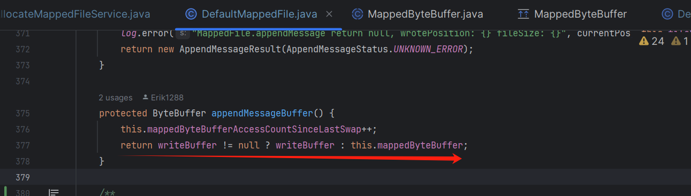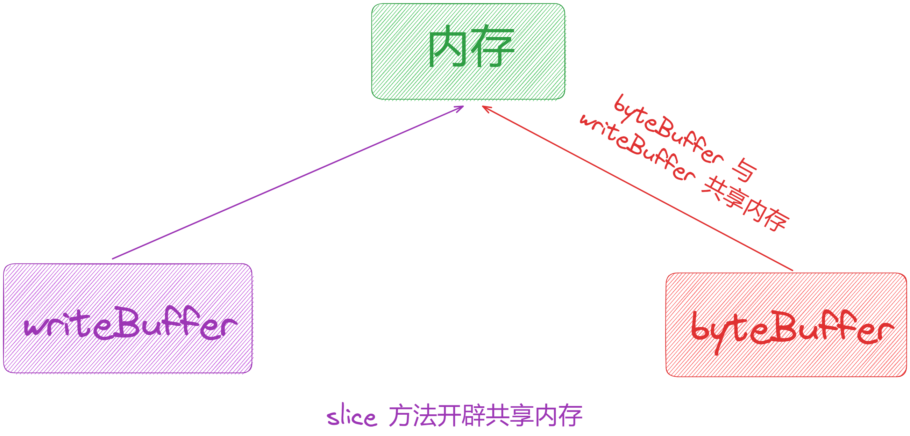
4.  之后就是追加消息，可以看到写入消息是在 [AppendMessageCallback#doAppend](http://appendmessagecallback/#doAppend) 中完成的，其实就回到了 [CommitLog](http://commitlog%20/) 中。
5.  最后，更新当前的写入位置加上当前写入的总字节数。以及更新最新的存储时间戳。

该方法主要是面向「**MessageExt**」 特定消息对象的， 主要做了 [Buffer](http://buffer%20/) 的「**切片拷贝**」，「**更新写入点**」等操作，实际上这里的追加最终会调用 [CommitLog](http://commitlog/) 中子类 [DefaultAppendMessageCallback](http://defaultappendmessagecallback/#doAppend)[#doAppend](http://defaultappendmessagecallback/#doAppend) ，根据参数不同单条/批量消息的追加写入。

这里有两种写入方式：

### **5.3.3.1 未开启堆外内存池**

在写入的时候，直接写入到直接内存中 [MappedByteBuffer](http://mappedbytebuffer%20/) ，然后 flush 到磁盘中。

### **5.3.3.2 开启堆外内存池**

如果开启堆外内存池的话，数据会先写入 [ByteBuffer](http://bytebuffer%20/) 中，然后 [commit](http://commit%20/) 到 [MappedBytebuffer](http://mappedbytebuffer/)，最后再 [flush](http://flush/) 到磁盘中去。其实 [commit](http://commit/) 和 [flush](http://flush/) 都是采用「**异步线程**」刷入来实现的，所以增加了吞吐量。

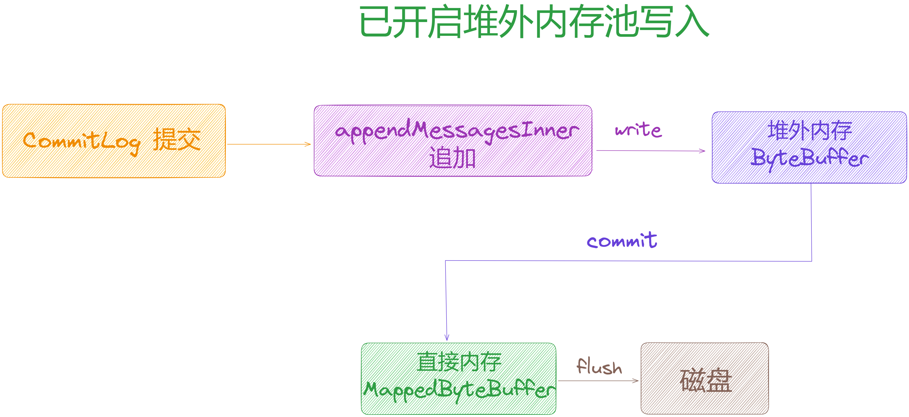

关于提交和刷盘这两个重要操作我们会在消息刷盘篇章单独剖析，这里不展开。

### **5.3.4 ByteBuffer 对象池**

### **5.3.4.1 为什么要池化 ByteBuffer**

可以看出，[TransientStorePool](http://transientstorepool%20/) 就是池化 [ByteBuffer](http://bytebuffer%20/) 对象，在「**高性能**」、「**高并发**」的场景中，将 [ByteBuffer](http://bytebuffer%20/) 对象池化是一种常见的做法，它能带来如下一些好处：

1.  **减少内存分配开销**：[allocateDirect()](http://allocatedirect\(\)/) 分配的堆外内存对象相对较昂贵，因为涉及到与操作系统的交互。通过池化可以减少频繁的内存「**分配**」和「**释放**」，从而降低了内存分配的开销。
2.  **提高性能**：避免频繁的内存分配和垃圾回收可以显著提高应用程序的性能，这对于需要处理大量数据或高并发的情况尤其重要。
3.  **避免内存碎片**：在分配和释放大量 [ByteBuffer](http://bytebuffer%20/) 对象时，可能会导致堆外内存碎片。通过池化可以更有效地重复使用已分配的内存块，从而减少了碎片化问题。
4.  **控制内存使用**：通过限制池中的对象数量，可以控制应用程序使用的总内存量，防止内存泄漏或过度消耗内存。
5.  **提高资源利用率**：由于池化的对象可以重复使用，因此资源利用率更高。这在某些情况下可以降低系统负载，因为不需要频繁地请求新的内存块。

但 [ByteBuffer](http://bytebuffer/) 池化并不适用于所有场景，只有在需要「**高性能**」、「**低延迟**」的场景下才会带来显著的性能优势，所以 [TransientStorePool](http://transientstorepool%20/) 默认是不开启的。

### **5.3.4.2 堆外内存**

需要注意 [TransientStorePool](http://transientstorepool%20/) 中的 [ByteBuffer](http://bytebuffer%20/) 是使用 [ByteBuffer.allocateDirect()](http://bytebuffer.allocatedirect\(\)/) 方法分配出来的。我们会在 RocketMQ 其它地方看到很多用 [ByteBuffer.allocate()](http://bytebuffer.allocate\(\)/) 分配 [ByteBuffer](http://bytebuffer%20/) 的情况。

关于堆外内存：[【Broker端源码分析系列第十七篇】图解 RocketMQ 源码之 Broker 端存储模块堆外内存架构剖析](https://articles.zsxq.com/id_0rufq5khepju.html)

来看下两者的区别：

### **5.3.4.3 区别**

*[allocate()：](http://allocate\(\)%EF%BC%9A)*

1.  [allocate](http://allocate%20/) 方法使用「**JVM 堆内内存**」来分配空间，这意味着数据存储在 Java 堆上，分配的内存将由 「**Java 垃圾回收器**」自动回收，你不需要手动释放它。
2.  [allocate](http://allocate/) 方法适用于 「**相对小型的数据对象**」，可以受到 Java 垃圾回收的好处。
3.  [allocate](http://allocate/) 方法分配的是「**JVM 堆内内存**」，因此在不同的平台和 JVM 实现之间具有更好的可移植性。相比之下，[allocateDirect](http://allocatedirect%20/) 分配的「**堆外内存**」可能会受到底层操作系统和 JVM 实现的限制。

*[allocateDirect()：](http://allocateDirect\(\)%EF%BC%9A)*

1.  [allocateDirect](http://allocatedirect%20/) 方法使用「**操作系统**」的本机堆外内存「**Native Memory**」分配空间，这些内存块不受 「**Java 垃圾回收器**」的管理，它们在「**Java 堆之外**」，由「**操作系统**」直接管理。由于不受垃圾回收器的干扰，从而也减少了不可预测的垃圾回收暂停。
2.  [allocateDirect](http://allocatedirect%20/) 方法分配的内存不受 Java 垃圾回收的管理，因此需要手动调用 [ByteBuffer#cleaner()](http://bytebuffer/#cleaner\(\)) 方法，并在不再需要该内存时手动释放它。这使得内存管理更加复杂，但也提供了更多的控制。
3.  [allocateDirect](http://allocatedirect%20/) 方法创建的 [ByteBuffer](http://bytebuffer%20/) 对象直接映射到本机内存，因此在读取和写入数据时通常比 [allocate](http://allocate%20/) 分配的对象更快。所以它更适用于「**高性能**」、「**大数据量**」、「**频繁进行 I/O 操作**」的场景，例如「**网络编程**」或「**处理大文件**」。

###   
**5.3.5 读取数据**

/\*\*

\* 访问数据

\* 该方法以 pos 为开始位点，到有效数据为止，创建出一个切片 byteBuffer，供业务访问数据使用

\* @param pos the given position

\* @return

\*/

@Override

public SelectMappedBufferResult selectMappedBuffer(int pos) {

// 获取有效数据位点 wrotePosition

int readPosition \= getReadPosition();

// 条件成立：说明 pos 处于有效数据区间

if (pos < readPosition && pos >= 0) {

if (this.hold()) {

// 资源引用计数+1

this.mappedByteBufferAccessCountSinceLastSwap++;

// 切片

ByteBuffer byteBuffer \= this.mappedByteBuffer.slice();

// 设置切片的 position 为 pos 位点

byteBuffer.position(pos);

// 从 pos 开始的有效数据大小

int size \= readPosition - pos;

// 按照当前切片再次切出一个新的切片

ByteBuffer byteBufferNew \= byteBuffer.slice();

// 设置新的切片的limit为数据大小

byteBufferNew.limit(size);

return new SelectMappedBufferResult(this.fileFromOffset + pos, byteBufferNew, size, this);

}

}

return null;

}

步骤如下：

1.  先通过切片的方式， 将整个 [mappedByteBuffer](http://mappedbytebuffer%20/) 切出来得到 [byteBuffer](http://bytebuffer/)。
2.  将 [byteBuffer](http://bytebuffer%20/) 的 [postition](http://postition%20/) 设置为 [pos](http://pos%20/) 起始位点 ，再进行切片， 此时就会从 [pos](http://pos/) 起始位点的地方开始切到末尾 ，得到 [byteBufferNew](http://bytebuffernew/)。
3.  再根据有效数据量大小给 [byteBufferNew](http://bytebuffernew%20/) 设置好 [limit](http://limit/)， 就得到最终的 内存区域 [buffer](http://buffer/) 了。

### **5.3.6 文件预热**

在 RocketMQ 使用的是 [mmap](http://mmap%20/) 函数将磁盘文件转化为「**4KB**」的「**内存页**」映射到「**内存区域**」中，从而使得「**用户态程序**」和「**操作系统**」共同映射同一块「**虚拟内存地址**」。

程序可以对「**内存页**」进行读写，背后由「**操作系统**」负责将缺失的「**内存页**」从磁盘读到内存。所以一开始的[mmap](http://mmap/)函数映射的磁盘文件在内存中是没有「**数据页**」的，如果突发的对它「**高频随机读取数据页**」，就会发生很多「**缺页中断**」用户态->内核态转换，以及磁盘I/O。

这个场景在 RocketMQ 中很容易出现，当一个 [CommitLog](http://commitlog%20/) 写满之后创建一个新的，然后大量的消息还等着写入到这个新 [CommitLog](http://commitlog/) 文件中，必然发生大量「**缺页中断**」读取磁盘，会造成 RocketMQ 的写入性能抖动，在客户端这里也会报大量的「**写入异常**」。

所以针对这种情况有「**文件预热**」和「**提前创建**」的机制避免，关于「**提前创建**」前面 [doCreateMappedFile](http://docreatemappedfile%20/) 方法剖析过。

我们来看下「**文件预热**」，[AllocateMappedFileService](http://allocatemappedfileservice%20/) 线程在循环中不断调用 [mmapOperation](http://mmapoperation/) 函数，从 [requestQueue](http://requestqueue/) 阻塞队列获取外部提交的创建文件请求。

这里为什么要将「**数据页**」写入 0 的「**预占值**」预占值并刷盘？mmap 函数只是将磁盘文件映射到程序的「**虚拟内存地址**」中，这些「**虚拟内存数据页**」没有被分配真正的物理内存页，这里提前写入 0 的假值让 OS 分配物理页，起到磁盘文件到内存页的「**提前加载功能**」，后面读到这些内存页时不会发生「**缺页中断**」。

/\*\*

\* 内存预热

\* @param type 刷盘策略

\* @param pages 刷盘的脏页阈值

\*/

@Override

public void warmMappedFile(FlushDiskType type, int pages) {

// 资源引用计数+1

this.mappedByteBufferAccessCountSinceLastSwap++;

// 开始时间

long beginTime \= System.currentTimeMillis();

// 切片

ByteBuffer byteBuffer \= this.mappedByteBuffer.slice();

long flush \= 0;

// long time = System.currentTimeMillis();

// 对 mappedFile 内存映射的内存页进行预热，以每页 4k 每 4096 脏页进行刷盘，OS\_PAGE\_SIZE 默认 4096

for (long i \= 0, j = 0; i < this.fileSize; i += DefaultMappedFile.OS\_PAGE\_SIZE, j++) {

// Mmap 函数只是建立磁盘文件到虚拟内存页，这里给每页预先写入 0，让操作系统为这个虚拟内存页分配实际的物理内存页

byteBuffer.put((int) i, (byte) 0);

// force flush when flush disk type is sync

// 当写入数据后，如果需要进行同步刷盘操作 (SYNC\_FLUSH)，并且写入数据的页数超过了指定的阈值 pages 时，

// 就会执行强制刷盘操作，确保数据被及时地刷入磁盘

if (type == FlushDiskType.SYNC\_FLUSH) {

if ((i / OS\_PAGE\_SIZE) - (flush / OS\_PAGE\_SIZE) >= pages) {

flush = i;

mappedByteBuffer.force();

}

}

// prevent gc

// if (j % 1000 == 0) {

// log.info("j={}, costTime={}", j, System.currentTimeMillis() - time);

// time = System.currentTimeMillis();

// try {

// Thread.sleep(0);

// } catch (InterruptedException e) {

// log.error("Interrupted", e);

// }

// }

}

// force flush when prepare load finished

// 如果是同步刷盘则强制刷盘

if (type == FlushDiskType.SYNC\_FLUSH) {

log.info("mapped file warm-up done, force to disk, mappedFile={}, costTime={}",

this.getFileName(), System.currentTimeMillis() - beginTime);

// 强制刷盘

mappedByteBuffer.force();

}

log.info("mapped file warm-up done. mappedFile={}, costTime={}", this.getFileName(),

System.currentTimeMillis() - beginTime);

// 锁定 mappedFile 当前的内存映射区，避免在内存不足时，被 OS 交换到磁盘中

this.mlock();

}

「**PageCache**」机制也不是完全无缺点的，当遇到操作系统进行「**脏页回写**」、「**内存回收**」、「**内存交换**」等情况时，就会引起较大的「**消息读写延迟**」。

对于这些情况，RocketMQ 采用了多种优化技术，比如「**内存预分配**」、「**文件预热**」、「**mlock 系统调用**」等，以保证在最大限度地发挥「**PageCache**」机制的优点的同时，尽可能地减少「**消息读写延迟**」。所以在生产环境部署 RocketMQ 的时候，尽量采用 SSD 独享磁盘，这样可以最大限度地保证读写性能。

### **5.3.7 文件加锁与解锁**

/\*\*

\* mlock 系统调用的主要作用是将指定的内存区域锁定在物理内存中，防止它被操作系统交换到硬盘的交换空间（swap space）。

\* 这对于需要快速响应的程序非常重要，因为从交换空间恢复内存的操作通常会导致显著的延迟。

\*/

@Override

public void mlock() {

// 记录开始时间

final long beginTime \= System.currentTimeMillis();

// 获取内存映射的地址

final long address \= ((DirectBuffer)(this.mappedByteBuffer)).address();

// 创建指向内存映射地址的指针

Pointer pointer \= new Pointer(address);

{

// 调用 LibC.INSTANCE.mlock() 方法，将某一内存区域锁在物理内存中，避免被交换出去

int ret \= LibC.INSTANCE.mlock(pointer,new NativeLong(this.fileSize)); // 锁定内存

log.info("mlock {} {} {} ret = {} time consuming = {}",address,this.fileName,this.fileSize,ret,System.currentTimeMillis() - beginTime); // 记录 mlock 操作的结果和时间消耗

}

{

// 调用 LibC.INSTANCE.madvise() 方法，建议内核对地址空间作一些特定的操作，例如告诉内核预读某些数据，告诉内核某些数据不再需要

// madvise 系统调用的主要目的是帮助内核更好地管理虚拟内存，提高内存使用的效率。通过 madvise 系统调用，进程可以向内核提供一些关于

// 内存映射区域的信息，以便内核可以更好地优化内存使用和访问模式

int ret \= LibC.INSTANCE.madvise(pointer,new NativeLong(this.fileSize),LibC.MADV\_WILLNEED); // 向内核建议某些操作

log.info("madvise {} {} {} ret = {} time consuming = {}",address,this.fileName,this.fileSize,ret,System.currentTimeMillis() - beginTime); // 记录 madvise 操作的结果和时间消耗

}

}

@Override

public void munlock() {

// 记录开始时间

final long beginTime \= System.currentTimeMillis();

// 获取内存映射的地址

final long address \= ((DirectBuffer) (this.mappedByteBuffer)).address();

// 创建指向内存映射地址的指针

Pointer pointer \= new Pointer(address);

// 调用 LibC.INSTANCE.munlock() 方法解锁内存

int ret \= LibC.INSTANCE.munlock(pointer, new NativeLong(this.fileSize));

log.info("munlock {} {} {} ret = {} time consuming = {}", address, this.fileName, this.fileSize, ret, System.currentTimeMillis() - beginTime);

}

经过一番查证，这两个方法可以「**锁住内存**」，防止被「**交换到 swap 空间**」，然后 [madvise](http://madvise/) 是一次性读，防止「**缺页中断**」产生。

但是问题来了，为什么只看到执行了 「**mlock 系统调用**」，而 「**munlock 系统调用**」是在哪执行的？

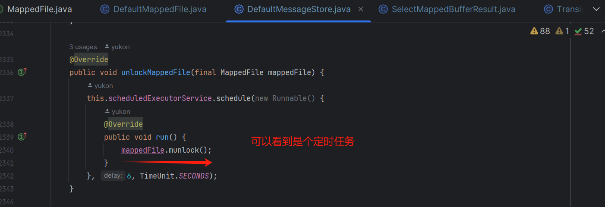

可以看到居然是一个定时任务中进行了解锁操作，我们再往上一层，找到了 [CommitLog#asyncputMessage](http://commitlog/#asyncputMessage) 方法，在很长的逻辑后有了这个解锁操作，应该是在这个地方判断是否有「**文件预热**」。

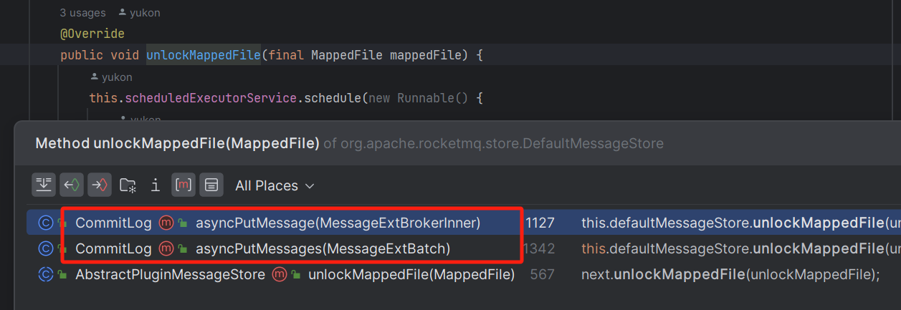

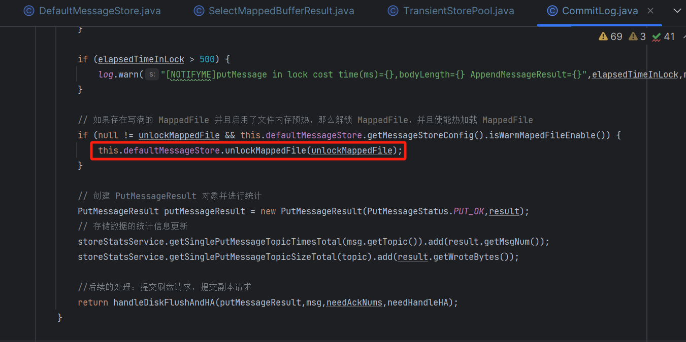

### **5.3.8 ByteBuffer 切片**

[ByteBuffer#slice()](http://bytebuffer/#slice\(\)%20) 切片操作是用来创建一个新的 [ByteBuffer](http://bytebuffer/) 视图，它与原始 [ByteBuffer](http://bytebuffer%20/) 共享「**同一底层数据数组 byte\[\]**」，但是它具有自己的「**位置**」、「**限制**」和「**容量**」。这样可以在原始 [ByteBuffer](http://bytebuffer%20/) 和切片之间共享数据，同时在每个 [ByteBuffer](http://bytebuffer%20/) 上保持不同的读写位置。

[slice()](http://slice\(\)/) 操作返回的 [ByteBuffer](http://bytebuffer%20/) 的 [position=0](http://position=0/)，[limit/capcity = 原始 ByteBuffer 的剩余大小](http://limit/capcity%20=%20%E5%8E%9F%E5%A7%8B%20ByteBuffer%20%E7%9A%84%E5%89%A9%E4%BD%99%E5%A4%A7%E5%B0%8F)。比如原始 [ByteBuffer](http://bytebuffer%20/) 的 [limit/capatity=12，position=4](http://%20limit/capatity=12%EF%BC%8Cposition=4)，那么 [slice()](http://%20slice\(\)/) 返回来的 [ByteBuffer](http://bytebuffer%20/) 的 [position=0，limit/capacity = 12-4 = 8](http://position=0,limit/capacity%20=%2012-4%20=%208)。

[ByteBuffer](http://bytebuffer%20/) 还有一个 [offset](http://offset%20/) 来表示自己相对于底层数组的偏移量，原始 [buffer](http://buffer%20/) 的 [offset=0](http://offset=0/)，新 [buffer](http://buffer%20/) 的 [offset=原始buffer 的 position](http://xn--offset=buffer%20%20position-on00cf95g3cyn/)，也就是说新 [buffer](http://buffer%20/) 写入数据是从 [offset](http://offset%20/) 位置开始写的。

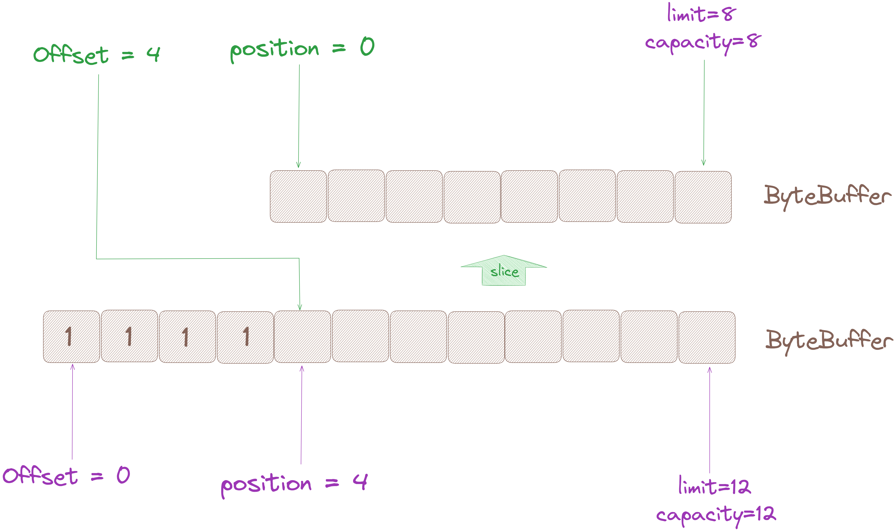

因为 [slice()](http://slice\(\)/) 得到的新 [buffer](http://buffer%20/) 和原 [buffer](http://buffer%20/) 共享同一底层数组，而且它对底层数组的起始偏移量是原始的 [position](http://position/)，所以，对新 [buffer](http://buffer%20/) 的写操作会「**追加到**」原 [buffer](http://buffer/)，但原 [buffer](http://buffer%20/) 的 [position](http://position%20/) 不会发生变化，如果原 [buffer](http://buffer%20/) 继续写入数据就会覆盖新 [buffer](http://buffer%20/) 写入的数据。

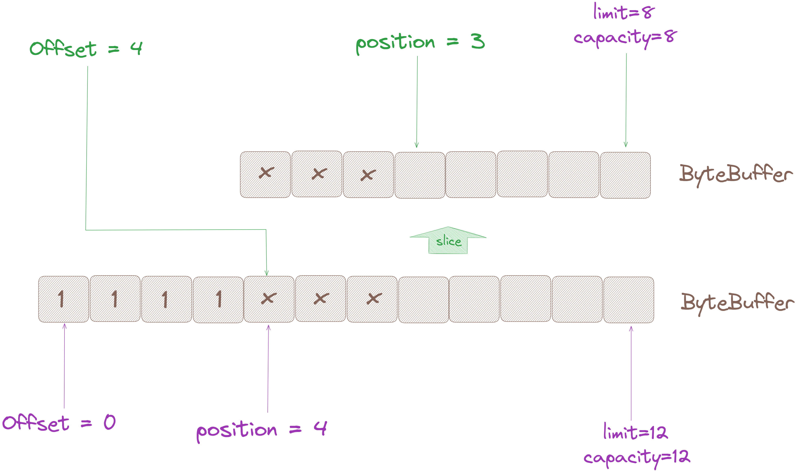

看完这些，再回过头来看 [DefaultMappedFile](http://defaultmappedfile%20/) 中的 [writeBuffer](http://writebuffer%20/) 和 [mappedByteBuffer](http://mappedbytebuffer/)，会发现所有的读写操作都不会直接操作「**原始**」的 [writeBuffer](http://writebuffer%20/) 和 [mappedByteBuffer](http://mappedbytebuffer/)，直接操作原始的 [buffer](http://buffer%20/) 就会改变它的 [position](http://position/)。

因此每次都是通过 [slice()](http://slice\(\)/) 切片得到一个新的 [ByteBuffer](http://bytebuffer/)，再来读写这个新 [buffer](http://buffer/)。由于原 [buffer](http://buffer%20/) 的 [position=0](http://position=0/)，所以新 [buffer](http://buffer%20/) 的 [position](http://position%20/) 和 [offset](http://offset%20/) 也都是 0，因此通过 [slice()](http://slice\(\)/) 得到的新 [buffer](http://buffer%20/) 每次都是完整映射了整个底层数组。

所以可以看到，[DefaultMappedFile](http://defaultmappedfile%20/) 中的 [wrotePosition](http://wroteposition%20/) 来表示写入的位置，[slice()](http://slice\(\)/) 得到的新 [ByteBuffer](http://bytebuffer/) 也「**不能直接从 0 开始写数据，这样会覆盖之前的数据**」，所以每次都会先设置当前写入的位置 [position(wrotePosition)](http://position\(wroteposition\)/)，之后才开始写入数据。

综上采用这种切片的方式就能支持「**并发**」的「**读写缓冲区**」中的数据。

## **06 RocketMQ 高性能核心技术总结**

通过前面对 RocketMQ 消息存储的源码分析，我们大概能够知道 RocketMQ 实现高性能读写文件的核心技术都有哪些了。

这里来总结下。

## **6.1 FileChannel 文件通道**

我们都应该知道传统的 [InputStream/OutputStream](http://inputstream/OutputStream) 是「**阻塞式 I/O**」、「**单线程**」、「**不支持异步**」等，「**读写性能很差**」，所以 RocketMQ 在 [DefaultMappedFile](http://defaultmappedfile%20/) 里是基于 [FileChannel](http://filechannel%20/) 技术来实现文件读写，[FileChannel](http://filechannel%20/) 提供了一种通道 Channel 的方式来进行文件的操作，[FileChannel](http://filechannel%20/) 支持「**非阻塞式 I/O**」、「**异步 I/O**」，支持「**多线程读写**」，还支持「**随机读写**」、「**直接内存访问**」、「**非内存映射文件**」等操作。

[FileChannel](http://filechannel%20/) 在处理「**大文件**」、「**随机访问文件**」、「**并发读写文件**」等场景中特别有用，尤其在「**多线程访问文件**」时，能够更好地利用操作系统的文件缓存和磁盘 I/O，提高读写效率。

> 但需要注意的是，FileChannel 是非阻塞的，因此在进行文件读写时需要自行处理缓冲区的状态和同步问题。

## **6.2 MMAP 文件映射**

RocketMQ 的存储与读写是基于 JDK NIO 的内存映射机制 [MMAP](http://mmap/)，就是通过 [FileChannel.map](http://filechannel.map/)() 拿到的 [MappedByteBuffer](http://mappedbytebuffer%20/) 对象。[MappedByteBuffer](http://mappedbytebuffer/) 使用的是直接内存「**堆外内存**」，而不是传统的「**堆内存**」 [ByteBuffer](http://bytebuffer%20/) 对象，直接内存可以直接与操作系统进行交互，这样就可以通过「**零拷贝**」 [Zero-Copy](http://zero-copy/) 技术实现高效的文件读写操作。

其优点：

1.  **文件映射**：MMAP 技术允许将文件的内容映射到进程的虚拟内存空间中，从而可以通过内存地址访问文件的数据。这种映射是基于内存页的，意味着文件的一部分或整个文件可以映射到一个或多个内存页。
2.  **零拷贝**：由于文件内容被映射到直接内存中，读写操作可以直接在「**堆外内存**」中进行，而无需经过用户态和内核态之间的多次数据拷贝，从而减少了拷贝的开销，提高了性能。
3.  **随机访问**：MMAP 允许文件的随机访问，即可以通过内存中的地址来随机访问文件的任意位置，而不需要按顺序读取。
4.  **缓存机制**：操作系统通常会将映射的文件内容缓存在内存中，这可以提高后续读取文件的性能，因为从内存中读取数据比从磁盘上读取数据要快得多。
5.  **刷盘操作**：通过 MMAP 写入文件时，可以通过修改内存中的数据来实现，操作系统会在适当的时机将内存中的修改同步到磁盘上。
6.  **适用场景**：MMAP 技术在处理「**大文件**」、「**随机访问文件**」、「**并发读写文件**」以及「**大文件与其它进程共享数据**」等场景中非常有用。它能够利用操作系统的缓存机制，提供更高效的文件读写。

其缺点：

1.  它在进行文件映射的时候，一般大小限制在「**1.5GB ~ 2GB**」之间。所以 RocketMQ 才让 [CommitLog](http://commitlog%20/) 单个文件在 1GB，[ConsumeQueue](http://consumequeue/) 文件在 5.72MB，不会太大。
2.  由于文件映射到了内存中，可能会占用大量的「**虚拟内存空间**」，特别是对于大文件。这可能导致内存使用过多，影响系统的稳定性。
3.  它基于内存页的，所以文件的读写必须是内存页大小的「**倍数**」，否则可能会浪费部分内存。
4.  在一些情况下，操作系统可能会限制进程可以映射的文件大小。

## **6.3 文件预热机制**

另外 [AllocateMappedFileService](http://allocatemappedfileservice%20/) 在创建 [MappedFile](http://mappedfile%20/) 时，如果启用了预热机制 [warmMapedFileEnable](http://warmmapedfileenable/) ，还会预热磁盘文件映射 [MappedByteBuffer](http://mappedbytebuffer/)。

可以看到它其实就是往每个系统「**缓存页 4KB**」写入一个字节，然后「**强制刷盘**」，这样就和磁盘文件保持了同步，这种方式可以减少在「**关键路径上**」的「**内存复制**」和「**初始化开销**」，从而提高了性能。

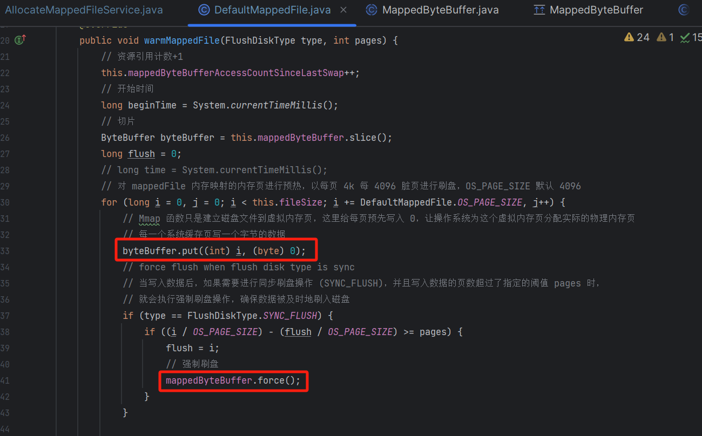

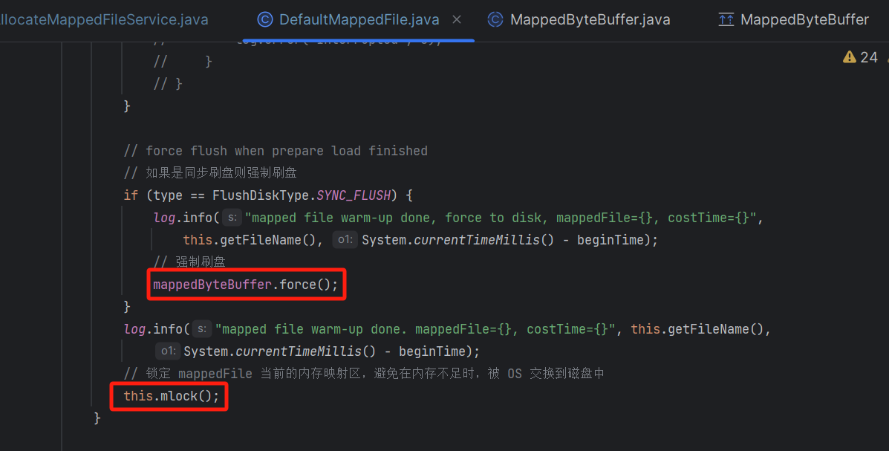

可以看到预热最后还是用了 [mlock](http://mlock%20/) 和 [madvise](http://madvise%20/) 系统调用来锁定内存区域，再次提升访问性能。

1.  **mlock（Memory Lock）**：mlock 系统调用的主要作用是将指定的内存区域锁定在物理内存中，防止它被操作系统交换到硬盘的交换空间（swap space）。这对于需要快速响应的程序非常重要，因为从交换空间恢复内存的操作通常会导致显著的延迟。
2.  **madvise（Memory Advice）**：madvise 系统调用的主要目的是帮助内核更好地管理虚拟内存，提高内存使用的效率。通过 madvise 系统调用，进程可以向内核提供一些关于内存映射区域的信息，以便内核可以更好地优化内存使用和访问模式。

[MappedByteBuffer](http://mappedbytebuffer%20/) 「**预热机制**」是一种性能优化手段，通常用于在「**程序启动**」或在需要「**高性能**」的场景中，提前将文件内容映射到内存中的 [MappedByteBuffer](http://mappedbytebuffer%20/) 对象，以避免在「**关键路径上**」发生磁盘 I/O 或其他性能瓶颈。这种手段通常用来「**提高文件读取操作的速度**」，特别是对于需要「**频繁访问文件内容**」的情况。

需要注意的是，[MappedByteBuffer](http://mappedbytebuffer/) 「**预热机制**」并不适用于所有应用程序，只有在需要「**高性能**」和「**低延迟**」的场景下才会带来显著的性能优势。另外使用 [MappedByteBuffer](http://mappedbytebuffer/) 「**预热机制**」需要谨慎，因为它可能会增加内存使用量，特别是在大规模使用「**直接内存**」的情况下。

## **6.4 堆外内存池 + 写缓冲区**

RocketMQ 提供了「**堆外内存池**」技术，如果开启了 [transientStorePoolEnable](http://transientstorepoolenable/)，[TransientStorePool](http://transientstorepool%20/) 中会预分配默认 5 个 [ByteBuffer](http://bytebuffer%20/) 堆外内存区域。

对于这种大文件的读写，由于堆外内存直接映射到本机内存，在「**读取**」和「**写入**」数据时通常更快。而且通过池化技术，也能减少「**内存分配开销**」、「**提高性能**」、「**避免内存碎片化**」等。

[MappedFile](http://mappedfile%20/) 创建时就会绑定一块写缓冲区 [writeBuffer](http://writebuffer/)，想想就知道就是在写入消息的时候先写入这块堆外内存缓冲区，再批量写入 [FileChannel](http://filechannel%20/) 中，最终持久化到磁盘，这又能大幅提升高并发下写入消息的性能。

## **6.5 读写分离机制**

首先要知道 [FileChannel.map](http://filechannel.map/) 映射的 [MappedByteBuffer](http://mappedbytebuffer%20/) 是映射在「**堆外内存**」(「**直接内存**」)上，它是一种「**直接的**」、「**零拷贝**」的方式来读取和写入文件数据。

而如果启用了「**堆外内存池**」技术，[MappedFile](http://mappedfile%20/) 还会从 [TransientStorePool](http://transientstorepool%20/) 获取一块 [ByteBuffer](http://bytebuffer/) 来作为「**写缓冲区**」，而 [TransientStorePool](http://transientstorepool%20/) 中分配的 [ByteBuffer](http://bytebuffer%20/) 也是「**堆外内存**」(「**直接内存**」)。

**看到这里，你是否会有这样的疑问：既然两块** [ByteBuffer](http://bytebuffer/) **都是堆外内存，那为什么还要先写一块** [ByteBuffer](http://bytebuffer/) **写缓冲区，再同步到** [FileChannel](http://filechannel/) **呢？**

其实 RocketMQ 是采用了「**读写分离**」的思想，其中读取操作使用 [MappedByteBuffer](http://mappedbytebuffer%20/) 直接从文件映射内存中读取数据，而写入操作则使用 [ByteBuffer](http://bytebuffer%20/) 写缓冲区来构建要写入的消息数据。这种分离的设计允许读取和写入操作同时进行，能够提高性能。

通过「**读写分离**」，可以将一批消息写入 [ByteBuffer](http://bytebuffer%20/) 缓冲区后再一起同步写入 [MappedByteBuffer](http://mappedbytebuffer%20/) 中，再由其刷盘机制将数据持久化到磁盘中。这样就能减少「**系统调用**」和「**文件 I/O**」操作，减少磁盘写入的开销，提高写入性能。

## **07 总结**

至此，最重要的 [CommitLog](http://commitlog%20/) 日志的写入以及相关类的底层架构实现就剖析完毕了，这里总结三块，分别来看下。

## **7.1 MappedFile 创建流程总结**

我们先来总结下 [MappedFileQueue](http://mappedfilequeue%20/) 是如何创建一个 [MappedFile](http://mappedfile%20/) 的。[CommitLog](http://commitlog%20/) 为了创建 [MappedFileQueue](http://mappedfilequeue%20/)，提供了 [AllocateMappedFileService](http://allocatemappedfileservice%20/) 分配服务来创建 [MappedFile](http://mappedfile/)。

在 [AllocateMappedFileService](http://allocatemappedfileservice%20/) 中分为了「**提交分配请求**」和 一个「**独立线程创建**」 [MappedFile](http://mappedfile%20/) 两部分，它们之间是通过一个「**阻塞队列**」来完成的，创建完成后通过 [CountDownLatch](http://countdownlatch%20/) 来实现线程协作通知。

如果启用了 [TransientStorePool](http://transientstorepool/)，创建 [MappedFile](http://mappedfile%20/) 时会传入这个「**堆外内存池**」，然后从中取出一块 [ByteBuffer](http://bytebuffer%20/) 作为「**写缓冲区**」。

[MappedFile](http://mappedfile%20/) 构建时：

1.  首先通过 File 来关联磁盘文件。
2.  然后得到文件通道 [FileChanel](http://filechanel/)。
3.  再拿到内存映射对象 [MappedByteBuffer](http://mappedbytebuffer/)。
4.  最后消息写入就是写入到写缓冲区或这块 [MappedByteBuffer](http://mappedbytebuffer%20/) 中。

最后用一张图来总结下：

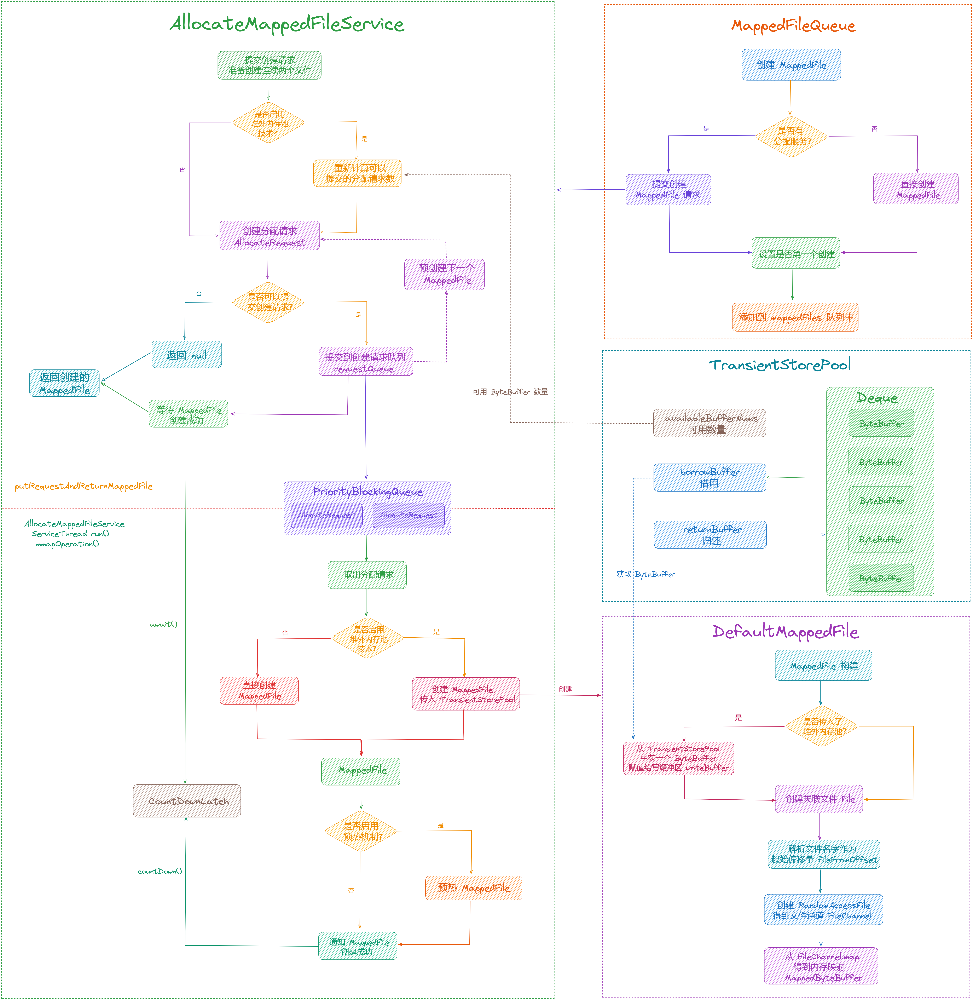

## **7.2 CommitLog 消息写入流程**

在 [DefaultMappedFile](http://defaultmappedfile/) 中，主要就是拿到要写入的缓冲区，然后调用 [AppendMessageCallback](http://appendmessagecallback%20/) 来追加消息。最后在 [AppendMessageCallback](http://appendmessagecallback%20/) 中才真正写入消息，它会先判断文件剩余空间是否足够写入消息，不够会直接返回失败；否则就会在更新一些消息属性后，将消息写入缓冲区中，然后返回消息追加成功。

最后用一张图来总结下 [CommitLog](http://commitlog%20/) 消息的写入过程，可以看到[CommitLog](http://commitlog/)中的消息写入主要是设置消息的一些属性将消息编码成 [ByteBuffer](http://bytebuffer/)，然后从 [MappedFileQueue](http://mappedfilequeue%20/) 中获取 [MappedFile](http://mappedfile/)，然后将消息追加到 [MappedFile](http://mappedfile%20/)中，最后就是消息刷盘及同步。

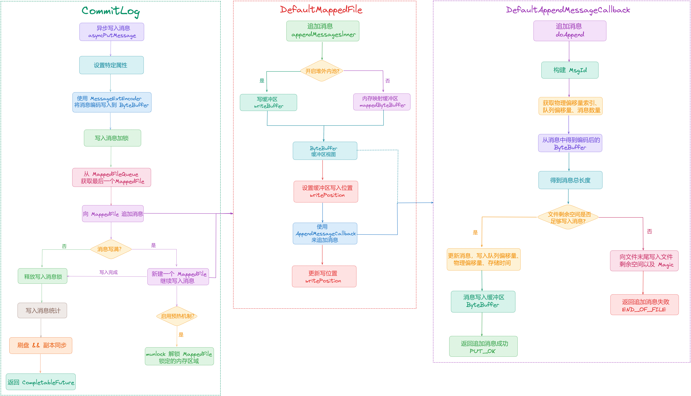

## **7.3 消息存储架构总结**

最后我们再来总结一下 RocketMQ 消息存储的架构设计：

1.  首先 RocketMQ 消息存储在 [CommitLog](http://commitlog/) 目录下磁盘文件中。
2.  通过 [MappedFileQueue](http://mappedfilequeue%20/) 映射 [CommitLog](http://commitlog/) ，通过 [MappedFile](http://mappedfile%20/) 映射 [CommitLog](http://commitlog/) 磁盘文件，并支持使用 [AllocateMappedFileService](http://allocatemappedfileservice%20/) 来分配创建 [MappedFile](http://mappedfile/)。
3.  [MappedFile](http://mappedfile%20/) 通过 [FileChannel](http://filechannel%20/) 关联磁盘文件，然后通过 [FileChannel.map()](http://filechannel.map\(\)/) 拿到内存映射 [MappedByteBuffer](http://mappedbytebuffer/)，通过这块内存映射来读写文件数据。
4.  [TransientStorePool](http://transientstorepool/) 支持池化技术预分配几块缓冲区 [ByteBuffer](http://bytebuffer/)，[MappedFile](http://mappedfile%20/) 可以从中获取 [ByteBuffer](http://bytebuffer%20/) 来作为写缓冲区。
5.  上层消息写入链路为 [DefaultMessageStore](http://defaultmessagestore%20/) \-> [CommitLog](http://commitlog%20/) \-> [DefaultMappedFile](http://defaultmappedfile%20/) \-> [ByteBuffer](http://bytebuffer/) -> [MappedByteBuffer](http://mappedbytebuffer%20/) \-> 磁盘文件 [CommitLog](http://commitlog/)。
6.  外层消息生产者发送消息，Broker 收到消息后经过请求处理器 [SendMessageProcessor](http://sendmessageprocessor%20/) 来处理消息写入，它解析消息生成 [MessageExtBrokerInner](http://messageextbrokerinner/)，调用 [DefaultMessageStore](http://defaultmessagestore/) 来完成消息写入。

  
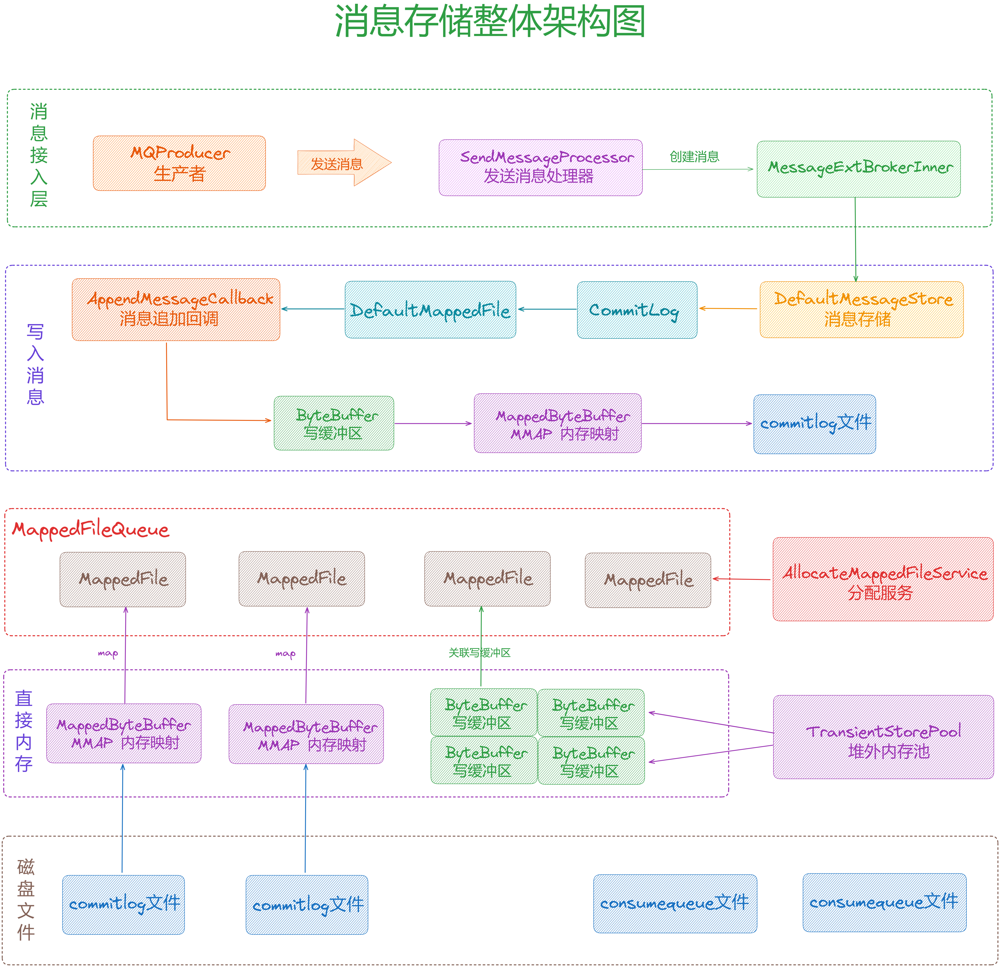