大家好，我是**华仔**, 又跟大家见面了。

从今天开始我将继续为大家奉上 RocketMQ 消费者源码剖析系列文章，正式开启「**RocketMQ 的服务端 Broker 源码之旅**」，这是第五篇，本篇我们将以「**RocketMQ 5.1.2**」版本为主，来剖析下 RocketMQ 源码之 Broker2Client客户端请求推送组件设计剖析 。

这里我将以「**RocketMQ 5.1.2**」版本为主，通过「**场景驱动**」的方式带大家一点点的对 RocketMQ 源码进行深度剖析，正式开启「**RocketMQ 的源码之旅**」，跟我一起来掌握 RocketMQ 源码核心架构设计思想吧。

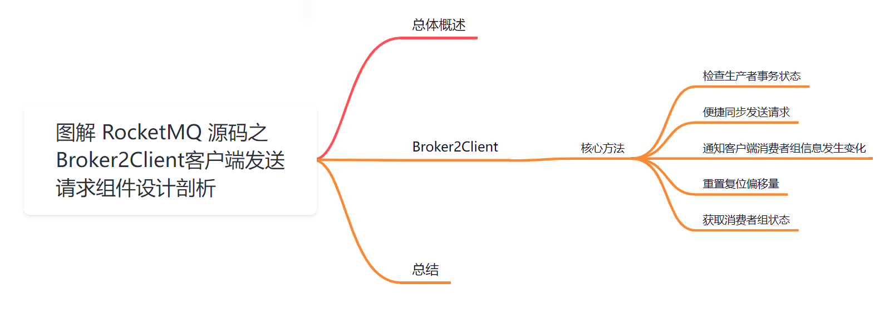

## **01 总体概述**

[在 BrokerController 构造方法](https://articles.zsxq.com/id_chxqzhg8psk4.html)里面创建了很多「**管理器**」、「**处理器**」、「**线程队列**」等，跟本文有关系的就是下面这个组件，该组件比较独立，主要负责处理「**Broker**」向「**客户端**」发送请求。

  
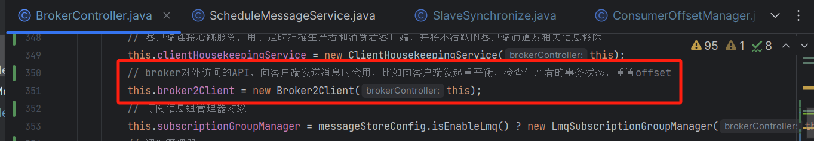

今天我们就来重点剖析下这个组件。

##   
**02 Broker2Client**

该组件封装了通用的请求逻辑，包括：

1.  检查生产者事务状态请求。
2.  便捷方法，调用客户端同步请求。
3.  通知客户端消费组发生变化请求。
4.  重置消费组下所有消费组的消费偏移量。
5.  获取消费组下所有消费者消费状态请求。

源码位置：[https://github.com/apache/rocketmq/blob/release-5.1.2/broker/src/main/java/org/apache/rocketmq/broker/](https://github.com/apache/rocketmq/blob/release-5.1.2/broker/src/main/java/org/apache/rocketmq/broker/client/net/Broker2Client.java)[client/net/Broker2Client](https://github.com/apache/rocketmq/blob/release-5.1.2/broker/src/main/java/org/apache/rocketmq/broker/client/net/Broker2Client.java)[.java](https://github.com/apache/rocketmq/blob/release-5.1.2/broker/src/main/java/org/apache/rocketmq/broker/client/net/Broker2Client.java)

实现也比较简单，在该组件内部封装完请求命令协议后，接着调用 Netty 网络通信服务器，与客户端建立的channel 长连接发起请求。

我们分别来看下，至于里面的实现细节，我们会在后面遇到后单独剖析，这里只是看下该组件是如何发起请求以及运行的。

## **2.1 核心方法**

### **2.1.1 检查生产者事务状态**

/\*\*

\* 检查生产者事务状态，该方法主要是跟事务消息结合来使用的

\* 如果生产者发送的是事务消息，那么此时先发送 half 消息，成功执行 commit，否则执行 rollback

\* 如果连接中断，broker 会检查事务消息的状态，以及回调生产者客户端检查本地事务状态，通过 broker 主动回查来确认是 commit 还是 rollback

\*

\* 这里我们来简单说下 RocketMQ 的事务消息原理：

\* 1、生产者先发送一个 half 消息，如果 half 消息成功了，此时就可以执行本地事务

\* 2、如果本地事务成功，则提交消息，否则回滚消息。

\* 3、如果 half 消息失败，或者提交/回滚消息没有发送成功，此时 broker 会自动回查 half 消息状态

\* 4、如果 half 消息超时了一直没有提交/回滚，此时会回查生产者，检查本地事务提交成功/失败，此时 broker 再决定 half 消息是提交/回滚

\* @param group

\* @param channel

\* @param requestHeader

\* @param messageExt

\* @throws Exception

\*/

public void checkProducerTransactionState(

final String group, // 生产者组

final Channel channel, // 生产者网络连接

final CheckTransactionStateRequestHeader requestHeader, // 检查事务状态请求头

final MessageExt messageExt) throws Exception { // 消息扩展数据

// 构造检查生产者本地事务状态请求

// 当 half 消息超时后还没有提交/回滚，即没收到生产者发送过来的本地事务状态，此时需要构造请求去回查

RemotingCommand request \=

RemotingCommand.createRequestCommand(RequestCode.CHECK\_TRANSACTION\_STATE, requestHeader);

// 将消息编码后设置到请求体中

request.setBody(MessageDecoder.encode(messageExt, false));

try {

// 通过网络通信服务器向生产者发送检查事务状态请求，单向发送模式进行发送，超时时间 10 毫秒

this.brokerController.getRemotingServer().invokeOneway(channel, request, 10);

} catch (Exception e) {

log.error("Check transaction failed because invoke producer exception. group={}, msgId={}, error={}", group, messageExt.getMsgId(), e.toString());

}

}

### **事务状态请求头**

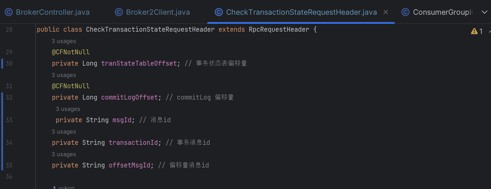

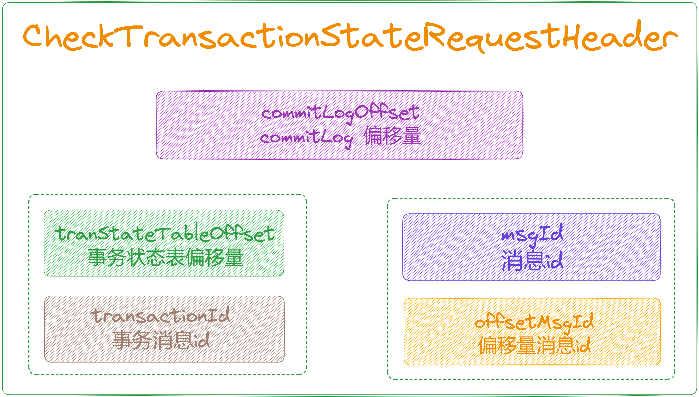

### **消息扩展**

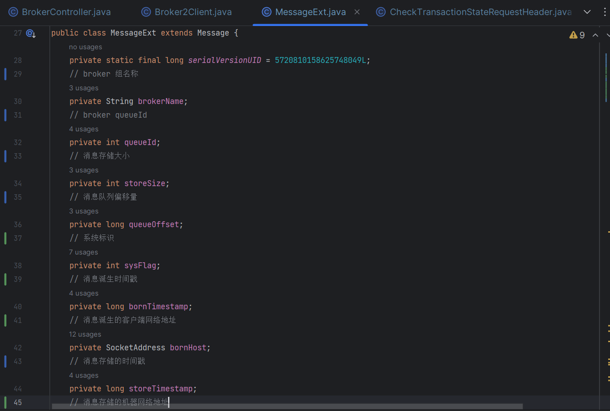

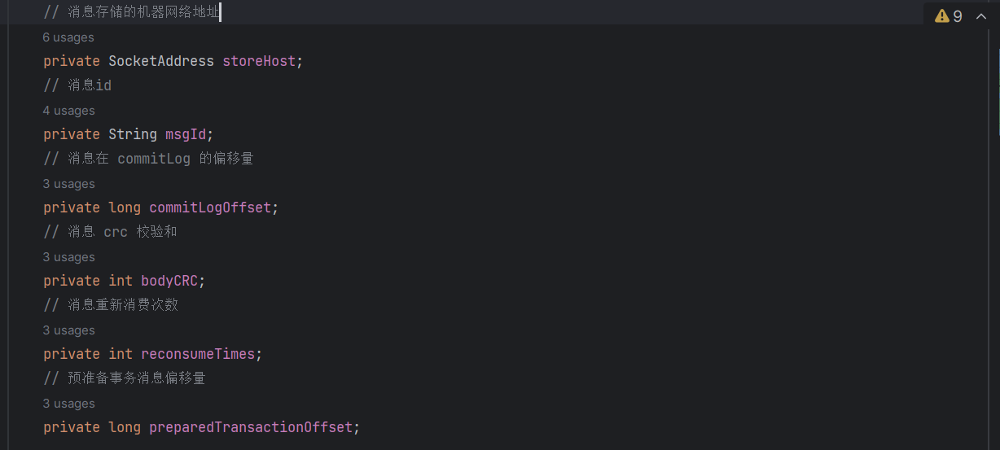

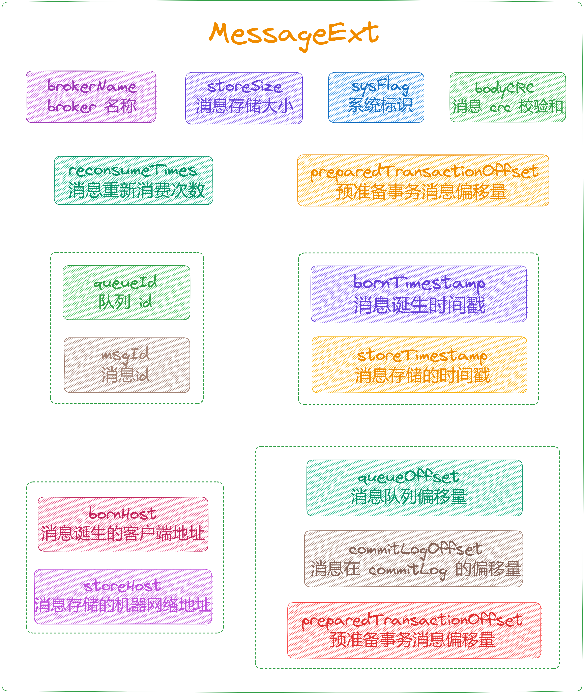

### **2.1.2 便捷同步发送请求**

// 便捷方法，直接把构造好的 RemotingCommand 通过 netty 网络连接发送出去

public RemotingCommand callClient(final Channel channel,

final RemotingCommand request

) throws RemotingSendRequestException, RemotingTimeoutException, InterruptedException {

// 调用客户端，发送同步请求，超时时间 10 秒

return this.brokerController.getRemotingServer().invokeSync(channel, request, 10000);

}

### **2.1.3 通知客户端消费者组信息发生变化**

// 通知客户端消费者组信息发生变化

public void notifyConsumerIdsChanged(

final Channel channel,

final String consumerGroup) {

if (null == consumerGroup) {

log.error("notifyConsumerIdsChanged consumerGroup is null");

return;

}

// 构造通知消费者组信息发生变化请求

NotifyConsumerIdsChangedRequestHeader requestHeader \= new NotifyConsumerIdsChangedRequestHeader();

requestHeader.setConsumerGroup(consumerGroup);

RemotingCommand request \=

RemotingCommand.createRequestCommand(RequestCode.NOTIFY\_CONSUMER\_IDS\_CHANGED, requestHeader);

try {

// 通过网络通信服务器向客户端发送通知消费者组信息发生变化请求，单向发送模式进行发送，超时时间 10 毫秒

this.brokerController.getRemotingServer().invokeOneway(channel, request, 10);

} catch (Exception e) {

log.error("notifyConsumerIdsChanged exception. group={}, error={}", consumerGroup, e.toString());

}

}

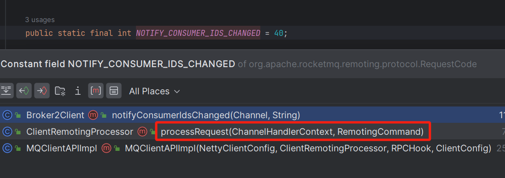

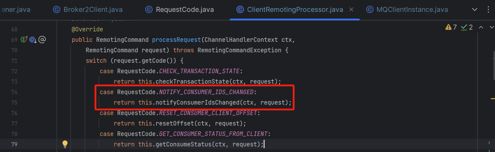

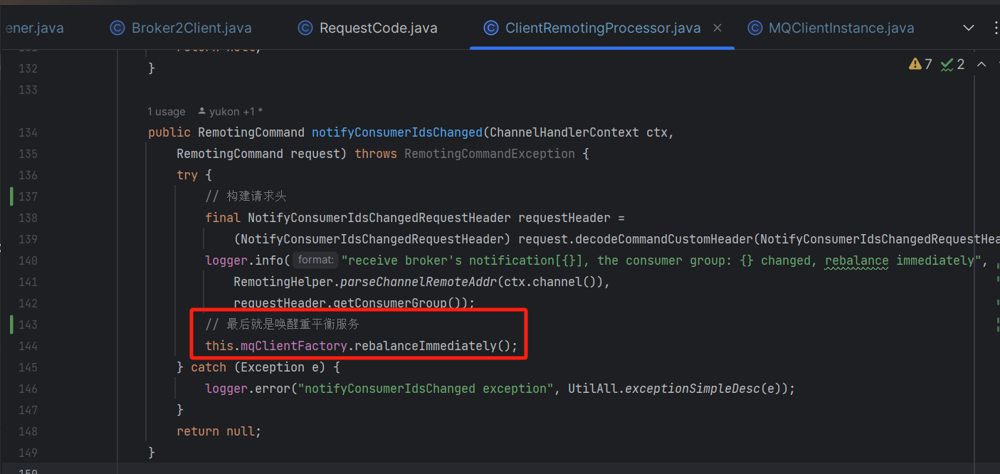

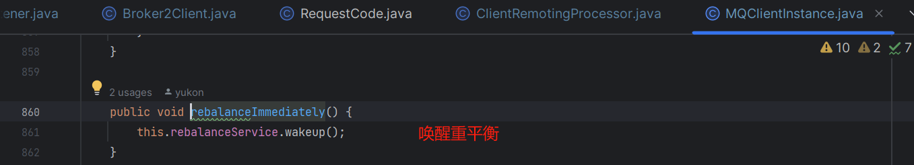

### **2.1.4 重置消费组下所有消费组的消费偏移量**

// 重置消费组下所有消费者的消费偏移量

public RemotingCommand resetOffset(String topic, String group, long timeStamp, boolean isForce) {

return resetOffset(topic, group, timeStamp, isForce, false);

}

/\*\*

\* 重置消费组下所有消费者的消费偏移量

\* @param topic 主题

\* @param group 消费者组

\* @param timeStamp 时间戳

\* @param isForce 是否强制

\* @param isC 是否 c 语言

\* @return

\*/

public RemotingCommand resetOffset(String topic, String group, long timeStamp, boolean isForce,

boolean isC) {

// 构建响应

final RemotingCommand response \= RemotingCommand.createResponseCommand(null);

// 调用 topic 元数据管理组件，获取当前 topic 对应的元数据

TopicConfig topicConfig \= this.brokerController.getTopicConfigManager().selectTopicConfig(topic);

if (null == topicConfig) {

// 返回系统异常 错误响应

log.error("\[reset-offset\] reset offset failed, no topic in this broker. topic={}", topic);

response.setCode(ResponseCode.SYSTEM\_ERROR);

response.setRemark("\[reset-offset\] reset offset failed, no topic in this broker. topic=" + topic);

return response;

}

// 初始化 offsetTable

Map<MessageQueue, Long> offsetTable = new HashMap<>();

// 遍历所有写队列，设置每个队列中的消费偏移量

for (int i \= 0; i < topicConfig.getWriteQueueNums(); i++) {

MessageQueue mq \= new MessageQueue();

// 设置 brokerName

mq.setBrokerName(this.brokerController.getBrokerConfig().getBrokerName());

// 设置 topic

mq.setTopic(topic);

// 设置队列id

mq.setQueueId(i);

// 获取消费者组当前消费偏移量 这里的 i 是队列id

long consumerOffset \=

this.brokerController.getConsumerOffsetManager().queryOffset(group, topic, i);

if (-1 == consumerOffset) {

// 获取不到消费偏移量，则返回系统异常 错误响应

response.setCode(ResponseCode.SYSTEM\_ERROR);

response.setRemark(String.format("THe consumer group <%s> not exist", group));

return response;

}

// 从消息存储组件，查询最大偏移量/根据时间戳获取偏移量

long timeStampOffset;

if (timeStamp == -1) {

// 查询最大偏移量

timeStampOffset = this.brokerController.getMessageStore().getMaxOffsetInQueue(topic, i);

} else {

// 根据时间戳获取偏移量

timeStampOffset = this.brokerController.getMessageStore().getOffsetInQueueByTime(topic, i, timeStamp);

}

if (timeStampOffset < 0) {

log.warn("reset offset is invalid. topic={}, queueId={}, timeStampOffset={}", topic, i, timeStampOffset);

timeStampOffset = 0;

}

// 是否强制启用 或者 时间戳偏移量是否小于消费偏移量

if (isForce || timeStampOffset < consumerOffset) {

// 设置时间戳偏移量到 offsetTable

offsetTable.put(mq, timeStampOffset);

} else {

// 设置消费偏移量到 offsetTable

offsetTable.put(mq, consumerOffset);

}

}

// 构建重置消费偏移量请求头

ResetOffsetRequestHeader requestHeader \= new ResetOffsetRequestHeader();

requestHeader.setTopic(topic);

requestHeader.setGroup(group);

requestHeader.setTimestamp(timeStamp);

// 构建重置消费偏移量请求 code = RESET\_CONSUMER\_CLIENT\_OFFSET

RemotingCommand request \=

RemotingCommand.createRequestCommand(RequestCode.RESET\_CONSUMER\_CLIENT\_OFFSET, requestHeader);

// 不同语言的实现

if (isC) {

// c++ language

ResetOffsetBodyForC body \= new ResetOffsetBodyForC();

List<MessageQueueForC> offsetList = convertOffsetTable2OffsetList(offsetTable);

body.setOffsetTable(offsetList);

request.setBody(body.encode());

} else {

// other language

ResetOffsetBody body \= new ResetOffsetBody();

body.setOffsetTable(offsetTable);

request.setBody(body.encode());

}

// 从消费者管理组件，获取消费者组信息

ConsumerGroupInfo consumerGroupInfo \=

this.brokerController.getConsumerManager().getConsumerGroupInfo(group);

if (consumerGroupInfo != null && !consumerGroupInfo.getAllChannel().isEmpty()) {

// 消费者组通道信息表

ConcurrentMap<Channel, ClientChannelInfo> channelInfoTable =

consumerGroupInfo.getChannelInfoTable();

// 遍历消费者组总每个消费者的网络连接，向消费者发送重置消费偏移量请求

for (Map.Entry<Channel, ClientChannelInfo> entry : channelInfoTable.entrySet()) {

int version \= entry.getValue().getVersion();

// 判断版本号，不符合条件直接返回系统异常

if (version >= MQVersion.Version.V3\_0\_7\_SNAPSHOT.ordinal()) {

try {

// 通过网络通信服务器向客户端发送重置消费偏移量请求，单向发送，超时时间 5 秒

this.brokerController.getRemotingServer().invokeOneway(entry.getKey(), request, 5000);

log.info("\[reset-offset\] reset offset success. topic={}, group={}, clientId={}",

topic, group, entry.getValue().getClientId());

} catch (Exception e) {

log.error("\[reset-offset\] reset offset exception. topic={}, group={} ,error={}",

topic, group, e.toString());

}

} else {

response.setCode(ResponseCode.SYSTEM\_ERROR);

response.setRemark("the client does not support this feature. version="

\+ MQVersion.getVersionDesc(version));

log.warn("\[reset-offset\] the client does not support this feature. channel={}, version={}",

RemotingHelper.parseChannelRemoteAddr(entry.getKey()), MQVersion.getVersionDesc(version));

return response;

}

}

} else {

String errorInfo \=

String.format("Consumer not online, so can not reset offset, Group: %s Topic: %s Timestamp: %d",

requestHeader.getGroup(),

requestHeader.getTopic(),

requestHeader.getTimestamp());

log.error(errorInfo);

response.setCode(ResponseCode.CONSUMER\_NOT\_ONLINE);

response.setRemark(errorInfo);

return response;

}

// 发送成功响应

response.setCode(ResponseCode.SUCCESS);

ResetOffsetBody resBody \= new ResetOffsetBody();

// 重新设置 offsetTable 到请求体中

resBody.setOffsetTable(offsetTable);

response.setBody(resBody.encode());

return response;

}

### **重置消费偏移量请求头**

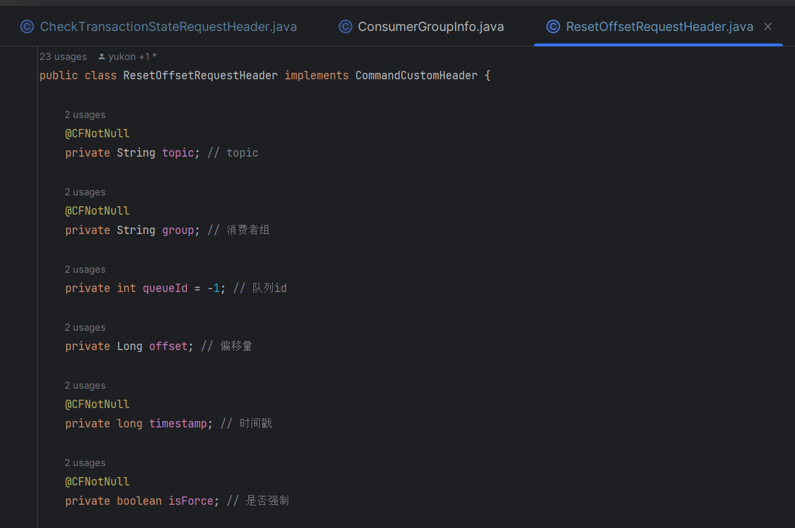

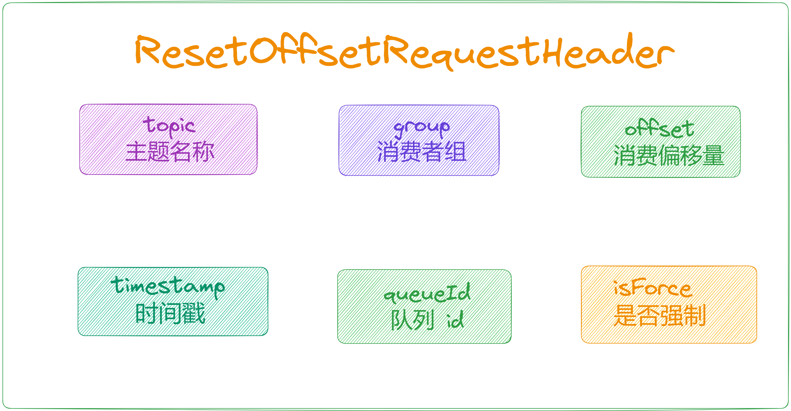

### **2.1.6 获取消费者状态**

/\*\*

\* 获取消费者状态,指定客户端 id 对应的 topic 下的 group 的消费状态

\* @param topic

\* @param group

\* @param originClientId

\* @return

\*/

public RemotingCommand getConsumeStatus(String topic, String group, String originClientId) {

final RemotingCommand result \= RemotingCommand.createResponseCommand(null);

// 构建消费者状态请求头

GetConsumerStatusRequestHeader requestHeader \= new GetConsumerStatusRequestHeader();

// 设置 topic

requestHeader.setTopic(topic);

// 设置消费者组

requestHeader.setGroup(group);

// 构建获取消费者状态请求

RemotingCommand request \=

RemotingCommand.createRequestCommand(RequestCode.GET\_CONSUMER\_STATUS\_FROM\_CLIENT,

requestHeader);

// 初始化 consumerStatusTable

Map<String, Map<MessageQueue, Long>> consumerStatusTable = new HashMap<>();

// 消费者组通道信息表

ConcurrentMap<Channel, ClientChannelInfo> channelInfoTable =

this.brokerController.getConsumerManager().getConsumerGroupInfo(group).getChannelInfoTable();

if (null == channelInfoTable || channelInfoTable.isEmpty()) {

result.setCode(ResponseCode.SYSTEM\_ERROR);

result.setRemark(String.format("No Any Consumer online in the consumer group: \[%s\]", group));

return result;

}

// 遍历消费者组总每个消费者的网络连接，向消费者发送重置消费偏移量请求

for (Map.Entry<Channel, ClientChannelInfo> entry : channelInfoTable.entrySet()) {

// 获取版本号

int version \= entry.getValue().getVersion();

// 获取客户端id

String clientId \= entry.getValue().getClientId();

// 不符合版本号条件 返回系统异常

if (version < MQVersion.Version.V3\_0\_7\_SNAPSHOT.ordinal()) {

result.setCode(ResponseCode.SYSTEM\_ERROR);

result.setRemark("the client does not support this feature. version="

\+ MQVersion.getVersionDesc(version));

log.warn("\[get-consumer-status\] the client does not support this feature. channel={}, version={}",

RemotingHelper.parseChannelRemoteAddr(entry.getKey()), MQVersion.getVersionDesc(version));

return result;

} else if (UtilAll.isBlank(originClientId) || originClientId.equals(clientId)) {

try {

// 通过网络通信服务器向客户端发送获取消费者状态请求，发起同步请求，超时时间 5 秒

RemotingCommand response \=

this.brokerController.getRemotingServer().invokeSync(entry.getKey(), request, 5000);

assert response != null;

switch (response.getCode()) {

case ResponseCode.SUCCESS: {

if (response.getBody() != null) {

GetConsumerStatusBody body \=

GetConsumerStatusBody.decode(response.getBody(),

GetConsumerStatusBody.class);

// 请求成功，获取消费者状态，存入消费者状态 table

consumerStatusTable.put(clientId, body.getMessageQueueTable());

log.info(

"\[get-consumer-status\] get consumer status success. topic={}, group={}, channelRemoteAddr={}",

topic, group, clientId);

}

}

default:

break;

}

} catch (Exception e) {

log.error(

"\[get-consumer-status\] get consumer status exception. topic={}, group={}, error={}",

topic, group, e.toString());

}

if (!UtilAll.isBlank(originClientId) && originClientId.equals(clientId)) {

break;

}

}

}

// 构建获取消费者状态响应

result.setCode(ResponseCode.SUCCESS);

GetConsumerStatusBody resBody \= new GetConsumerStatusBody();

resBody.setConsumerTable(consumerStatusTable);

result.setBody(resBody.encode());

return result;

}

### **获取消费者状态请求头**

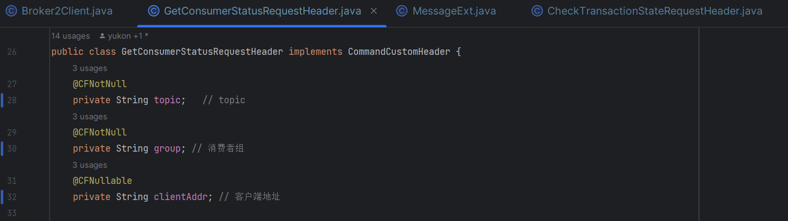

## **03 总结**

本篇主要剖析了 [BrokerController](http://brokercontroller%20/) 初始化时中用到的 「**Broker2Client**」，主要负责处理「**Broker**」向「**客户端**」发送请求的组件。

示意图如下：

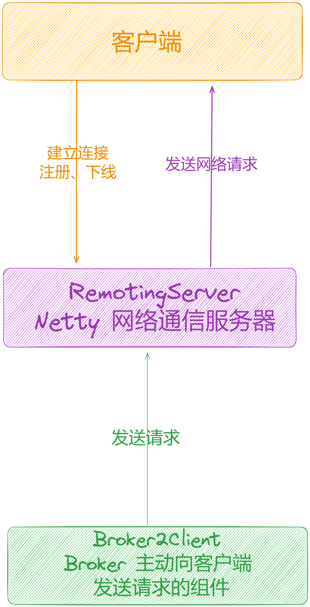