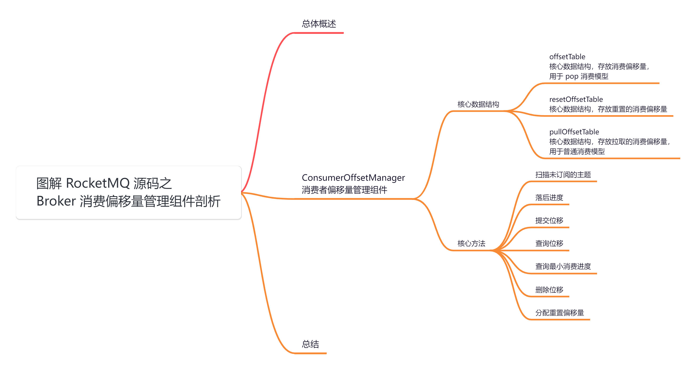
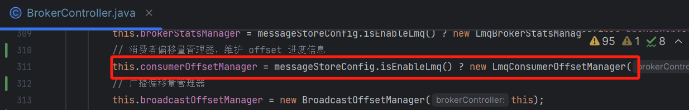
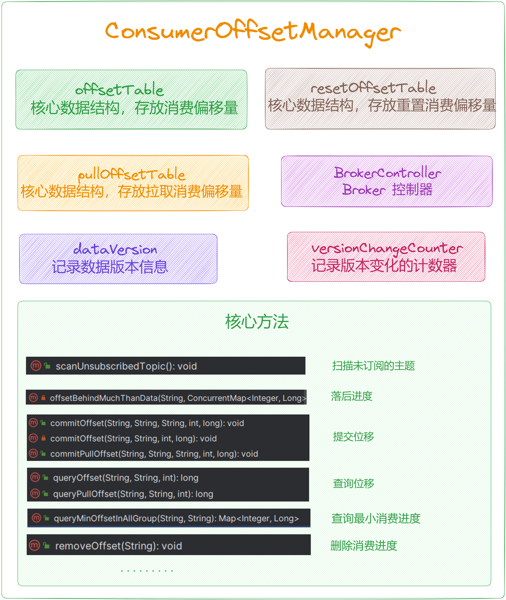
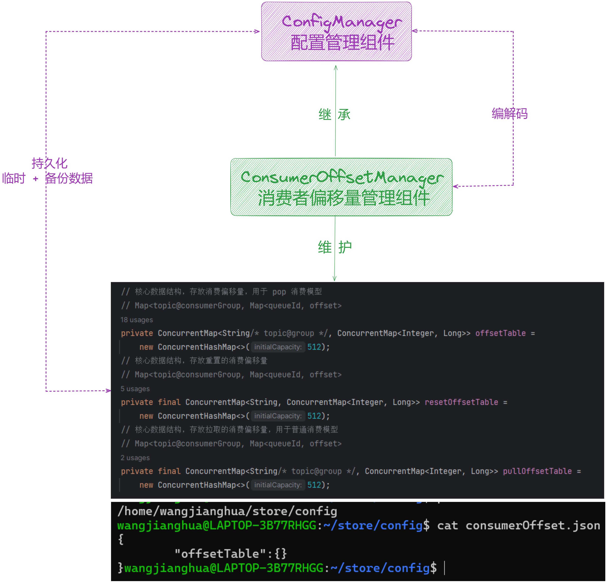

大家好，我是**华仔**, 又跟大家见面了。

从今天开始我将继续为大家奉上 RocketMQ 消费者源码剖析系列文章，正式开启「**RocketMQ 的服务端 Broker 源码之旅**」，这是第八篇，本篇我们将以「**RocketMQ 5.1.2**」版本为主，来剖析下 RocketMQ 源码之 Broker 消费偏移量管理组件剖析。

这里我将以「**RocketMQ 5.1.2**」版本为主，通过「**场景驱动**」的方式带大家一点点的对 RocketMQ 源码进行深度剖析，正式开启「**RocketMQ 的源码之旅**」，跟我一起来掌握 RocketMQ 源码核心架构设计思想吧。

##   
**01 总体概述**

[在 BrokerController 构造方法](https://articles.zsxq.com/id_chxqzhg8psk4.html)里面创建了很多「**管理器**」、「**处理器**」、「**线程队列**」等，跟本文有关系的就是下面这个组件，主要负责管理 Broker 端的「**消费偏移量**」，它继承了 [ConfigManager](http://configmanager/) 组件，且定时将内存中维护的「**消费偏移量数据**」，「**持久化**」到磁盘文件。

  

## **02 ConsumerOffsetManager**

源码位置：[https://github.com/apache/rocketmq/blob/release-5.1.2/broker/src/main/java/org/apache/rocketmq/broker/](https://github.com/apache/rocketmq/blob/release-5.1.2/broker/src/main/java/org/apache/rocketmq/broker/offset/ConsumerOffsetManager.java)[offset/ConsumerOffsetManager](https://github.com/apache/rocketmq/blob/release-5.1.2/broker/src/main/java/org/apache/rocketmq/broker/offset/ConsumerOffsetManager.java)[.java](https://github.com/apache/rocketmq/blob/release-5.1.2/broker/src/main/java/org/apache/rocketmq/broker/offset/ConsumerOffsetManager.java)

## **2.1 核心数据结构**

/\*\*

\* 管理 Consumer 对 Broker 上 Topic 下的 queue 的消费进度

\*/

public class ConsumerOffsetManager extends ConfigManager {

private static final Logger LOG \= LoggerFactory.getLogger(LoggerName.BROKER\_LOGGER\_NAME);

public static final String TOPIC\_GROUP\_SEPARATOR \= "@";

private DataVersion dataVersion \= new DataVersion();

// key = topic@group value = Map\[key = queueId, value = offset\]

// 核心数据结构，存放消费偏移量，用于 pop 消费模型

// Map<topic@consumerGroup, Map<queueId, offset>

private ConcurrentMap<String/\* topic@group \*/, ConcurrentMap<Integer, Long>> offsetTable =

new ConcurrentHashMap<>(512);

// 核心数据结构，存放重置的消费偏移量

// Map<topic@consumerGroup, Map<queueId, offset>

private final ConcurrentMap<String, ConcurrentMap<Integer, Long>> resetOffsetTable =

new ConcurrentHashMap<>(512);

// 核心数据结构，存放拉取的消费偏移量，用于普通消费模型

// Map<topic@consumerGroup, Map<queueId, offset>

private final ConcurrentMap<String/\* topic@group \*/, ConcurrentMap<Integer, Long>> pullOffsetTable = new ConcurrentHashMap<>(512);

protected transient BrokerController brokerController;

// 用于记录版本变化的计数器，使用 AtomicLong 保证线程安全

private final transient AtomicLong versionChangeCounter \= new AtomicLong(0);

....

}

通过代码可以得出 [ConsumerOffsetManager](http://consumeroffsetmanager/) 继承 [configManager](http://configmanager/) 抽象类，它实现了「**通用**」的将「**内存数据**」持久化到磁盘文件和将磁盘文件「**反序列化**」到内存的方法，而且还提供了抽象方法，供子类实现「**定制的文件路径配置**」、「**序列化**」、「**反序列化**」等逻辑。

关于该类的源码已经再 [【Broker 端源码分析系列第二篇】图解 RocketMQ 源码之 Broker 启动流程核心控制器组件剖析](https://articles.zsxq.com/id_chxqzhg8psk4.html) 这里讲解过了，这里就不再赘述。

## **2.2 核心方法**

该类封装了大量对消费偏移量进行「**查询**」、「**删除**」、「**提交**」的工具方法。

### **2.2.1 扫描未订阅的主题**

public void scanUnsubscribedTopic() {

// 扫描topic消费组下没有订阅的数据，删除消费组的消费进度

Iterator<Entry<String, ConcurrentMap<Integer, Long>>> it = this.offsetTable.entrySet().iterator();

while (it.hasNext()) {

Entry<String, ConcurrentMap<Integer, Long>> next = it.next();

String topicAtGroup \= next.getKey();

// 分割

String\[\] arrays = topicAtGroup.split(TOPIC\_GROUP\_SEPARATOR);

if (arrays.length == 2) {

// 解析出 topic、group

String topic \= arrays\[0\];

String group \= arrays\[1\];

// 从消费者管理组件中查询订阅信息，如果没有订阅 && 消费进度落后于消息存储组件中的消费进度，则删除消费组的消费进度

if (null == brokerController.getConsumerManager().findSubscriptionData(group, topic)

&& this.offsetBehindMuchThanData(topic, next.getValue())) {

it.remove();

LOG.warn("remove topic offset, {}", topicAtGroup);

}

}

}

}

### **2.2.2 落后进度**

/\*\*

\* 落后进度

\* table : \[queueId -> offset\]

\* @param topic

\* @param table

\* @return

\*/

private boolean offsetBehindMuchThanData(final String topic, ConcurrentMap<Integer, Long> table) {

Iterator<Entry<Integer, Long>> it = table.entrySet().iterator();

boolean result \= !table.isEmpty();

// 迭代遍历，判断所有队列的消费进度

while (it.hasNext() && result) {

Entry<Integer, Long> next = it.next();

// 获取最小消费进度

long minOffsetInStore \= this.brokerController.getMessageStore().getMinOffsetInQueue(topic, next.getKey());

// 持久化消费进度

long offsetInPersist \= next.getValue();

result = offsetInPersist <= minOffsetInStore;

}

return result;

}

### **2.2.3 提交位移**

/\*\*

\* 提交位移，用于 POP 消费模型

\* @param clientHost

\* @param group

\* @param topic

\* @param queueId

\* @param offset

\*/

public void commitOffset(final String clientHost, final String group, final String topic, final int queueId,

final long offset) {

// topic@group

String key \= topic + TOPIC\_GROUP\_SEPARATOR + group;

this.commitOffset(clientHost, key, queueId, offset);

}

/\*\*

\* 提交位移，用于 POP 消费模型

\* @param clientHost

\* @param key

\* @param queueId

\* @param offset

\*/

private void commitOffset(final String clientHost, final String key, final int queueId, final long offset) {

// 获取消费偏移量缓存表

ConcurrentMap<Integer, Long> map = this.offsetTable.get(key);

if (null == map) {

// 初始化一个新的消费偏移量缓存表

map = new ConcurrentHashMap<>(32);

map.put(queueId, offset);

this.offsetTable.put(key, map);

} else {

// 写入 offset 到 queueId 中

Long storeOffset \= map.put(queueId, offset);

if (storeOffset != null && offset < storeOffset) {

LOG.warn("\[NOTIFYME\]update consumer offset less than store. clientHost={}, key={}, queueId={}, requestOffset={}, storeOffset={}", clientHost, key, queueId, offset, storeOffset);

}

}

// 设置数据版本号

if (versionChangeCounter.incrementAndGet() % brokerController.getBrokerConfig().getConsumerOffsetUpdateVersionStep() == 0) {

long stateMachineVersion \= brokerController.getMessageStore() != null ? brokerController.getMessageStore().getStateMachineVersion() : 0;

dataVersion.nextVersion(stateMachineVersion);

}

}

/\*\*

\* 提交拉取模型下的消息位移

\* @param clientHost

\* @param group

\* @param topic

\* @param queueId

\* @param offset

\*/

public void commitPullOffset(final String clientHost, final String group, final String topic, final int queueId,

final long offset) {

// topic@group

String key \= topic + TOPIC\_GROUP\_SEPARATOR + group;

ConcurrentMap<Integer, Long> map = this.pullOffsetTable.computeIfAbsent(

key, k -> new ConcurrentHashMap<>(32));

// 写入 offset 到 queueId 中

map.put(queueId, offset);

}

### **2.2.4 查询位移**

/\*\*

\* Pop 消费模型下查询位移操作

\* If the target queue has temporary reset offset, return the reset-offset.

\* Otherwise, return the current consume offset in the offset store.

\* @param group Consumer group

\* @param topic Topic

\* @param queueId Queue ID

\* @return current consume offset or reset offset if there were one.

\*/

public long queryOffset(final String group, final String topic, final int queueId) {

// topic@group

String key \= topic + TOPIC\_GROUP\_SEPARATOR + group;

// 如果 Broker 配置 useServerSideResetOffset=true 则通过 Admin API 可以直接重置位点，

// 重置的位点会临时保存，提供给 Pop 这个时候使用

if (this.brokerController.getBrokerConfig().isUseServerSideResetOffset()) {

// 获取重置偏移量缓存表数据

Map<Integer, Long> reset = resetOffsetTable.get(key);

// 如果包含这个 queueId 数据，则直接获取返回

if (null != reset && reset.containsKey(queueId)) {

return reset.get(queueId);

}

}

// 如果没有开启则获取偏移量缓存表数据

ConcurrentMap<Integer, Long> map = this.offsetTable.get(key);

if (null != map) {

// 直接获取返回

Long offset \= map.get(queueId);

if (offset != null) {

return offset;

}

}

return -1L;

}

/\*\*

\* 查询拉取消息偏移量

\* Query pull offset in pullOffsetTable

\* @param group Consumer group

\* @param topic Topic

\* @param queueId Queue ID

\* @return latest pull offset of consumer group

\*/

public long queryPullOffset(final String group, final String topic, final int queueId) {

// topic@group

String key \= topic + TOPIC\_GROUP\_SEPARATOR + group;

Long offset \= null;

// 从 pullOffsetTable 缓存表中获取

ConcurrentMap<Integer, Long> map = this.pullOffsetTable.get(key);

if (null != map) {

// 返回其 offset

offset = map.get(queueId);

}

if (offset == null) {

// 为空则从 offsetTable 或者 resetOffsetTable 缓存表中获取

offset = queryOffset(group, topic, queueId);

}

return offset;

}

### **2.2.5 查询最小消费进度**

public Map<Integer,Long> queryMinOffsetInAllGroup(final String topic,final String filterGroups) {

Map<Integer,Long> queueMinOffset = new HashMap<>();

// 获取存储偏移量的所有 topic@group 集合

Set<String> topicGroups = this.offsetTable.keySet();

// 根据 filterGroups 过滤 topicGroups

if (!UtilAll.isBlank(filterGroups)) {

for (String group :filterGroups.split(",")) {

Iterator<String> it = topicGroups.iterator();

while (it.hasNext()) {

if (group.equals(it.next().split(TOPIC\_GROUP\_SEPARATOR)\[1\])) {

it.remove();

}

}

}

}

// 遍历 offsetTable 偏移量表，计算每个队列的最小偏移量

for (Map.Entry<String,ConcurrentMap<Integer,Long>> offSetEntry :this.offsetTable.entrySet()) {

String topicGroup \= offSetEntry.getKey();

String\[\] topicGroupArr = topicGroup.split(TOPIC\_GROUP\_SEPARATOR);

// 找到指定主题对应的偏移量

if (topic.equals(topicGroupArr\[0\])) {

for (Entry<Integer,Long> entry :offSetEntry.getValue().entrySet()) {

// 获取队列的最小偏移量

long minOffset \= this.brokerController.getMessageStore().getMinOffsetInQueue(topic,entry.getKey());

if (entry.getValue() >= minOffset) {

Long offset \= queueMinOffset.get(entry.getKey());

if (offset == null) {

queueMinOffset.put(entry.getKey(),Math.

min(Long.MAX\_VALUE,entry.getValue()));

} else {

queueMinOffset.put(entry.getKey(),Math.min(entry.getValue(),offset));

}

}

}

}

}

return queueMinOffset;

}

### **2.2.6 删除位移**

public void removeOffset(final String group) {

// 获取offsetTable的迭代器

Iterator<Entry<String,ConcurrentMap<Integer,Long>>> it = this.offsetTable.entrySet().iterator();

// 遍历offsetTable中的每个消费者组

while (it.hasNext()) {

Entry<String,ConcurrentMap<Integer,Long>> next = it.next();

String topicAtGroup \= next.getKey();

// 如果消费者组包含指定group，则移除该消费者组的偏移量信息

if (topicAtGroup.contains(group)) {

String\[\] arrays = topicAtGroup.split(TOPIC\_GROUP\_SEPARATOR);

if (arrays.length == 2 && group.equals(arrays\[1\])) {

it.remove();

LOG.warn("clean group offset {}",topicAtGroup);

}

}

}

}

### **2.2.7 分配重置偏移量**

public void assignResetOffset(String topic,String group,int queueId,long offset) {

if (Strings.isNullOrEmpty(topic) || Strings.isNullOrEmpty(group) || queueId < 0 || offset < 0) {

// 参数检查

LOG.warn("Illegal arguments when assigning reset offset.Topic={},group={},queueId={},offset={}",topic,group,queueId,offset);

return;

}

// 拼接key为topic@group

String key \= topic + TOPIC\_GROUP\_SEPARATOR + group;

// 获取resetOffsetTable中指定key的ConcurrentMap

ConcurrentMap<Integer,Long> map = resetOffsetTable.get(key);

// 如果不存在，创建一个新的ConcurrentMap并放入resetOffsetTable中

if (null == map) {

map = new ConcurrentHashMap<Integer,Long>();

ConcurrentMap<Integer,Long> previous = resetOffsetTable.putIfAbsent(key,map);

if (null != previous) {

map = previous;

}

}

// 将重置偏移量放入map中

map.put(queueId,offset);

LOG.debug("Reset offset OK.Topic={},group={},queueId={},resetOffset={}",topic,group,queueId,offset);

// 更新offsetTable中对应的偏移量信息

ConcurrentMap<Integer,Long> currentOffsetMap = offsetTable.get(key);

if (null != currentOffsetMap) {

currentOffsetMap.put(queueId,offset);

}

}

## **03 总结**

本篇主要剖析了 [BrokerController](http://brokercontroller%20/) 初始化时中用到的 「**ConsumerOffsetManager**」，主要负责管理 Broker 端的「**消费偏移量**」，它继承了 [ConfigManager](http://configmanager/) 组件，且定时将内存中维护的「**消费偏移量数据**」，「**持久化**」到磁盘文件。

示意图如下：

