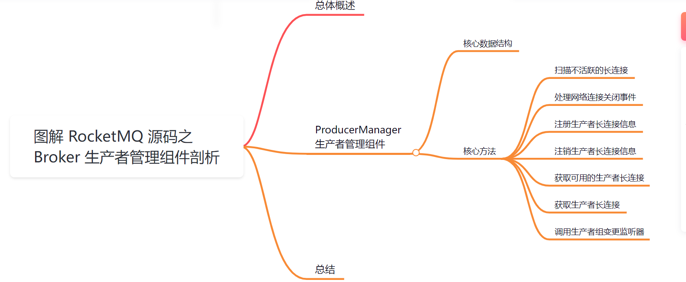
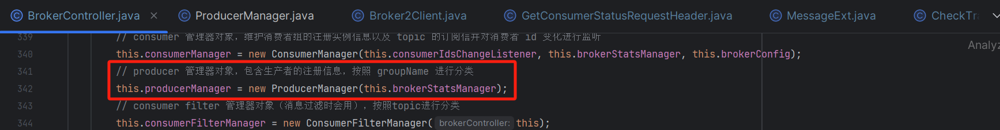
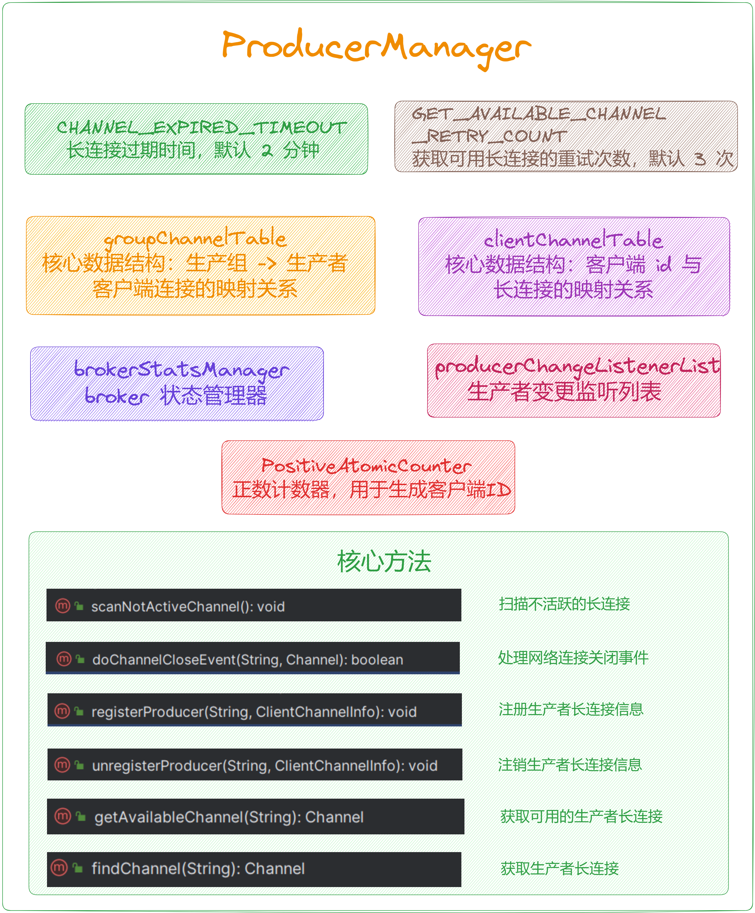
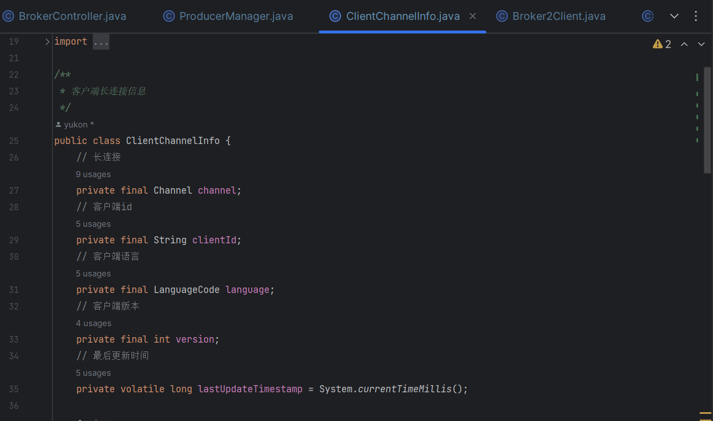
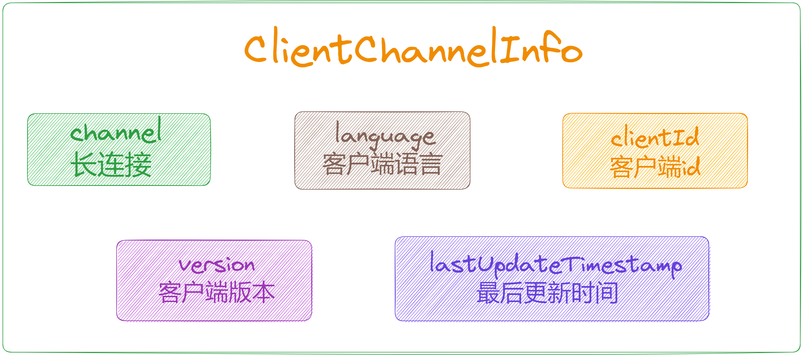
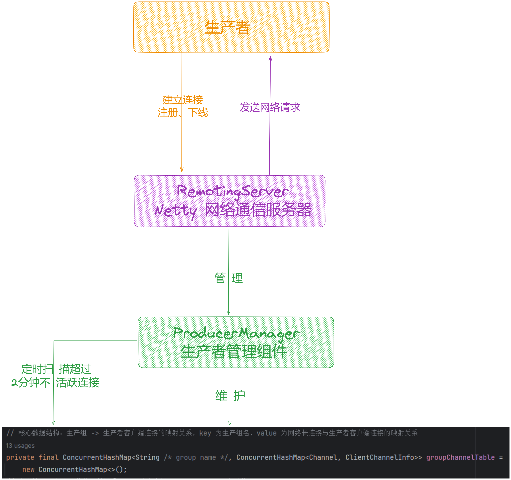

大家好，我是**华仔**, 又跟大家见面了。

从今天开始我将继续为大家奉上 RocketMQ 消费者源码剖析系列文章，正式开启「**RocketMQ 的服务端 Broker 源码之旅**」，这是第六篇，本篇我们将以「**RocketMQ 5.1.2**」版本为主，来剖析下 RocketMQ 源码之 Broker 生产者管理组件剖析。

这里我将以「**RocketMQ 5.1.2**」版本为主，通过「**场景驱动**」的方式带大家一点点的对 RocketMQ 源码进行深度剖析，正式开启「**RocketMQ 的源码之旅**」，跟我一起来掌握 RocketMQ 源码核心架构设计思想吧。

## **01 总体概述**

[在 BrokerController 构造方法](https://articles.zsxq.com/id_chxqzhg8psk4.html)里面创建了很多「**管理器**」、「**处理器**」、「**线程队列**」等，跟本文有关系的就是下面这个组件，主要负责管理「**生产者客户端**」与 「**Broker**」建立 「**Netty 长连接**」，以及「**维护客户端长连接的上下线**」、「**定时扫描不活跃连接**」。

  

今天我们就来重点剖析下这个组件。

## **02 ProducerManager**

源码位置：[https://github.com/apache/rocketmq/blob/release-5.1.2/broker/src/main/java/org/apache/rocketmq/broker/client/](https://github.com/apache/rocketmq/blob/release-5.1.2/broker/src/main/java/org/apache/rocketmq/broker/client/ProducerManager.java)[ProducerManager](https://github.com/apache/rocketmq/blob/release-5.1.2/broker/src/main/java/org/apache/rocketmq/broker/client/ProducerManager.java)[.java](https://github.com/apache/rocketmq/blob/release-5.1.2/broker/src/main/java/org/apache/rocketmq/broker/client/ProducerManager.java)

## **2.1 核心数据结构**

比较简单，就是维护了「**生产组**」与 「**生产者客户端**」连接的映射关系。

/\*\*

\* 生产者管理组件

\*/

public class ProducerManager {

private static final Logger log \= LoggerFactory.getLogger(LoggerName.BROKER\_LOGGER\_NAME);

// 长连接过期时间，默认 2 分钟

private static final long CHANNEL\_EXPIRED\_TIMEOUT \= 1000 \* 120;

// 获取可用长连接的重试次数，默认 3 次

private static final int GET\_AVAILABLE\_CHANNEL\_RETRY\_COUNT \= 3;

// 核心数据结构：生产组 -> 生产者客户端连接的映射关系，key 为生产组名，value 为网络长连接与生产者客户端连接的映射关系

private final ConcurrentHashMap<String /\* group name \*/, ConcurrentHashMap<Channel, ClientChannelInfo>> groupChannelTable =

new ConcurrentHashMap<>();

// 客户端 id 与长连接的映射关系，key 为客户端ID，value 为网络长连接

private final ConcurrentHashMap<String, Channel> clientChannelTable = new ConcurrentHashMap<>();

// broker 状态管理器

protected final BrokerStatsManager brokerStatsManager;

// 正数计数器，用于生成客户端ID

private PositiveAtomicCounter positiveAtomicCounter \= new PositiveAtomicCounter();

// 生产者变更监听列表

private final List<ProducerChangeListener> producerChangeListenerList = new CopyOnWriteArrayList<>();

....

}

我们再来看下 [ClientChannelInfo](http://%20clientchannelinfo/) 的数据结构如下：

  

## **2.2 核心方法**

其核心方法比较简单，主要是对内存数据结构的维护，我们分别来看下。

### **2.2.1 扫描不活跃的长连接**

/\*\*

\* 扫描不活跃的长连接，如果超过120秒没有更新，则关闭长连接

\*/

public void scanNotActiveChannel() {

// 迭代 groupChannelTable 缓存表中的元素

Iterator<Map.Entry<String, ConcurrentHashMap<Channel, ClientChannelInfo>>> iterator = this.groupChannelTable.entrySet().iterator();

while (iterator.hasNext()) {

Map.Entry<String, ConcurrentHashMap<Channel, ClientChannelInfo>> entry = iterator.next();

// 生产者组

final String group \= entry.getKey();

// 网络长连接与生产者客户端连接的映射关系

final ConcurrentHashMap<Channel, ClientChannelInfo> chlMap = entry.getValue();

Iterator<Entry<Channel, ClientChannelInfo>> it = chlMap.entrySet().iterator();

while (it.hasNext()) {

Entry<Channel, ClientChannelInfo> item = it.next();

// final Integer id = item.getKey();

final ClientChannelInfo info \= item.getValue();

// 计算长连接的过期时间

long diff \= System.currentTimeMillis() - info.getLastUpdateTimestamp();

// 如果超过 120 秒没有更新，则移除

if (diff > CHANNEL\_EXPIRED\_TIMEOUT) {

it.remove();

// 从客户端ID与长连接的映射关系中移除

clientChannelTable.remove(info.getClientId());

log.warn(

"ProducerManager#scanNotActiveChannel: remove expired channel\[{}\] from ProducerManager groupChannelTable, producer group name: {}",

RemotingHelper.parseChannelRemoteAddr(info.getChannel()), group);

// 调用生产者变更监听器，事件为：注销生产者

callProducerChangeListener(ProducerGroupEvent.CLIENT\_UNREGISTER, group, info);

// 使用异步的方式关闭长连接

RemotingHelper.closeChannel(info.getChannel());

}

}

if (chlMap.isEmpty()) {

log.warn("SCAN: remove expired channel from ProducerManager groupChannelTable, all clear, group={}", group);

iterator.remove();

// 调用生产者变更监听器，事件为：注销生产者组

callProducerChangeListener(ProducerGroupEvent.GROUP\_UNREGISTER, group, null);

}

}

}

### **2.2.2 处理网络连接关闭事件**

/\*\*

\* 处理网络连接关闭事件

\* @param remoteAddr

\* @param channel

\* @return

\*/

public synchronized boolean doChannelCloseEvent(final String remoteAddr, final Channel channel) {

// 移除标识

boolean removed \= false;

if (channel != null) {

// 遍历 groupChannelTable 缓存表

for (final Map.Entry<String, ConcurrentHashMap<Channel, ClientChannelInfo>> entry : this.groupChannelTable

.entrySet()) {

// 生产者组

final String group \= entry.getKey();

// clientChannelInfoTable 缓存表

final ConcurrentHashMap<Channel, ClientChannelInfo> clientChannelInfoTable =

entry.getValue();

// 从 clientChannelInfoTable 移除对应 channel 的数据

final ClientChannelInfo clientChannelInfo \=

clientChannelInfoTable.remove(channel);

// 如果删除成功

if (clientChannelInfo != null) {

// 从客户端ID与长连接的映射关系中移除

clientChannelTable.remove(clientChannelInfo.getClientId());

// 移除标识为 true

removed = true;

log.info(

"NETTY EVENT: remove channel\[{}\]\[{}\] from ProducerManager groupChannelTable, producer group: {}",

clientChannelInfo.toString(), remoteAddr, group);

// 执行监听操作，事件为：注销生产者

callProducerChangeListener(ProducerGroupEvent.CLIENT\_UNREGISTER, group, clientChannelInfo);

// 如果 clientChannelInfoTable 缓存表被移除空了

if (clientChannelInfoTable.isEmpty()) {

// 移除整个生产者组数据

ConcurrentHashMap<Channel, ClientChannelInfo> oldGroupTable = this.groupChannelTable.remove(group);

if (oldGroupTable != null) {

log.info("unregister a producer group\[{}\] from groupChannelTable", group);

// 调用生产者变更监听器，事件为：注销生产者组

callProducerChangeListener(ProducerGroupEvent.GROUP\_UNREGISTER, group, null);

}

}

}

}

}

return removed;

}

### **2.2.3 注册生产者长连接信息**

/\*\*

\* 注册生产者长连接信息

\* @param group

\* @param clientChannelInfo

\*/

public synchronized void registerProducer(final String group, final ClientChannelInfo clientChannelInfo) {

ClientChannelInfo clientChannelInfoFound \= null;

// 通过生产者组获取 channelTable

ConcurrentHashMap<Channel, ClientChannelInfo> channelTable = this.groupChannelTable.get(group);

if (null == channelTable) {

// 构建一个新的结构

channelTable = new ConcurrentHashMap<>();

this.groupChannelTable.put(group, channelTable);

}

// 再通过网络连接获取生产者客户端连接信息

clientChannelInfoFound = channelTable.get(clientChannelInfo.getChannel());

if (null == clientChannelInfoFound) {

// 如果没找到，就写入

channelTable.put(clientChannelInfo.getChannel(), clientChannelInfo);

clientChannelTable.put(clientChannelInfo.getClientId(), clientChannelInfo.getChannel());

log.info("new producer connected, group: {} channel: {}", group,

clientChannelInfo.toString());

}

if (clientChannelInfoFound != null) {

// 如果不为空 更新最后变更时间

clientChannelInfoFound.setLastUpdateTimestamp(System.currentTimeMillis());

}

}

### **2.2.4 注销生产者长连接信息**

/\*\*

\* 注销生产者长连接信息

\* @param group

\* @param clientChannelInfo

\*/

public synchronized void unregisterProducer(final String group,final ClientChannelInfo clientChannelInfo) {

// 通过生产者组获取 channelTable

ConcurrentHashMap<Channel,ClientChannelInfo> channelTable = this.groupChannelTable.get(group);

// 找到后

if (null != channelTable && !channelTable.isEmpty()) {

// 从 channelTable 中移除对应的 ClientChannelInfo

ClientChannelInfo old \= channelTable.remove(clientChannelInfo.getChannel());

// 从 clientChannelTable 中移除对应的 ClientChannelInfo

clientChannelTable.remove(clientChannelInfo.getClientId());

// 如果成功移除了旧的 ClientChannelInfo

if (old != null) {

// 打印日志

log.info("unregister a producer\[{}\] from groupChannelTable {}",group,clientChannelInfo.toString());

// 调用生产者变更监听器，事件为：注销客户端

callProducerChangeListener(ProducerGroupEvent.CLIENT\_UNREGISTER,group,clientChannelInfo);

}

// 如果 channelTable 为空

if (channelTable.isEmpty()) {

// 从 groupChannelTable 中移除 group

this.groupChannelTable.remove(group);

// 调用生产者组变更监听器，事件为：注销客户端

callProducerChangeListener(ProducerGroupEvent.GROUP\_UNREGISTER,group,null);

// 打印日志

log.info("unregister a producer group\[{}\] from groupChannelTable",group);

}

}

}

### **2.2.5 获取可用的生产者长连接**

/\*\*

\* 获取可用的生产者长连接

\* @param groupId

\* @return

\*/

public Channel getAvailableChannel(String groupId) {

// 如果groupId为空，则返回null

if (groupId == null) {

return null;

}

List<Channel> channelList;

// 从groupChannelTable中获取对应groupId的channelClientChannelInfoHashMap

ConcurrentHashMap<Channel,ClientChannelInfo> channelClientChannelInfoHashMap = groupChannelTable.get(groupId);

// 如果channelClientChannelInfoHashMap不为空

if (channelClientChannelInfoHashMap != null) {

// 构建channelList，其中包含channelClientChannelInfoHashMap中的所有Channel

channelList = new ArrayList<>(channelClientChannelInfoHashMap.keySet());

} else {

// 如果channelClientChannelInfoHashMap为空，记录警告日志并返回null

log.warn("Check transaction failed,channel table is empty.groupId={}",groupId);

return null;

}

// 获取channelList的大小

int size \= channelList.size();

// 如果channelList为空，记录警告日志并返回null

if (0 == size) {

log.warn("Channel list is empty.groupId={}",groupId);

return null;

}

Channel lastActiveChannel \= null;

// 使用原子计数器获取下一个索引

int index \= positiveAtomicCounter.incrementAndGet() % size;

// 获取指定索引处的Channel

Channel channel \= channelList.get(index);

int count \= 0;

// 检查当前Channel是否Active并且可写，若是，则直接返回

boolean isOk \= channel.isActive() && channel.isWritable();

while (count++ < GET\_AVAILABLE\_CHANNEL\_RETRY\_COUNT) {

if (isOk) {

return channel;

}

// 如果当前Channel仍然Active，则更新lastActiveChannel

if (channel.isActive()) {

lastActiveChannel = channel;

}

// 获取下一个索引处的Channel

index = (++index) % size;

channel = channelList.get(index);

// 重新判断当前Channel是否Active并且可写

isOk = channel.isActive() && channel.isWritable();

}

// 返回最后一个活跃的Channel，如果没有则返回null

return lastActiveChannel;

}

### **2.2.6 获取生产者长连接**

// 获取生产者长连接

public Channel findChannel(String clientId) {

return clientChannelTable.get(clientId);

}

### **2.2.7 调用生产者组变更监听器**

/\*\*

\* 调用生产者组变更监听器

\* @param event

\* @param group

\* @param clientChannelInfo

\*/

private void callProducerChangeListener(ProducerGroupEvent event, String group,

ClientChannelInfo clientChannelInfo) {

for (ProducerChangeListener listener : producerChangeListenerList) {

try {

// 调用其 handle 进行事件处理

listener.handle(event, group, clientChannelInfo);

} catch (Throwable t) {

log.error("err when call producerChangeListener", t);

}

}

}

## **03 总结**

本篇主要剖析了 [BrokerController](http://brokercontroller%20/) 初始化时中用到的 「**ProducerManager**」，主要负责管理「**生产者客户端**」与 「**Broker**」建立 「**Netty 长连接**」，以及「**维护客户端长连接的上下线**」、「**定时扫描不活跃连接**」的组件。

示意图如下：

