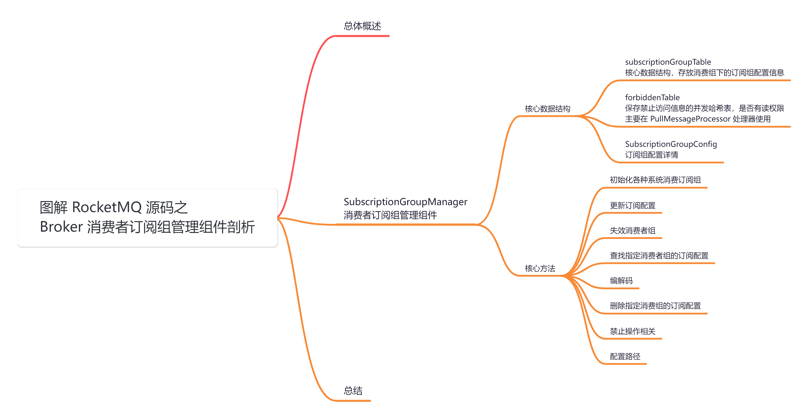
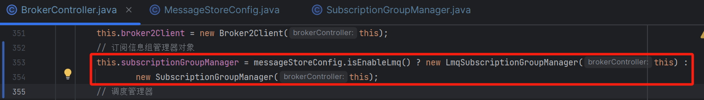
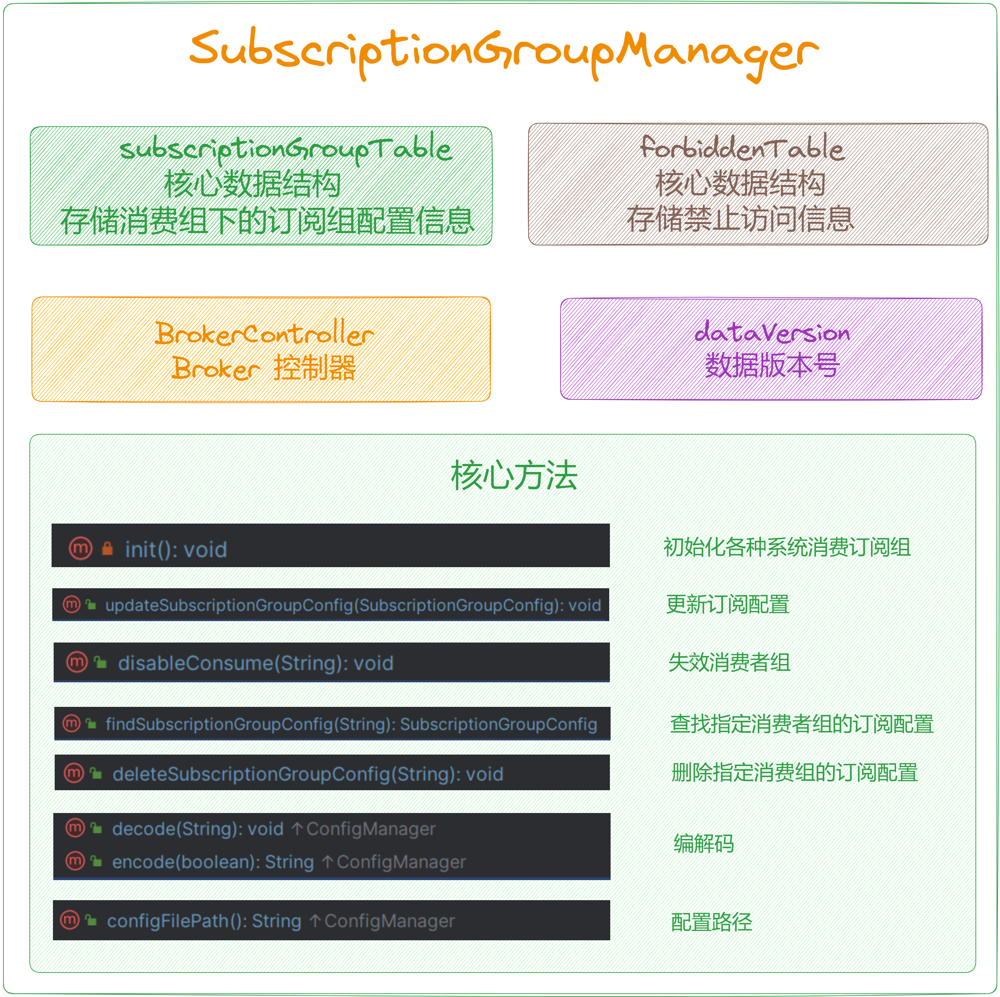
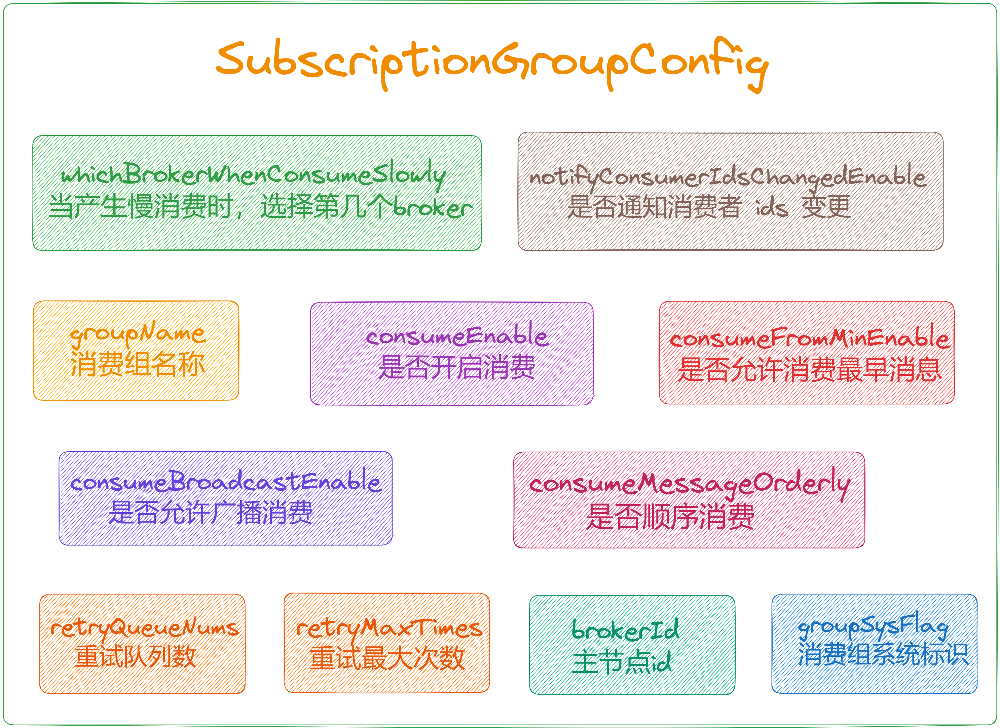
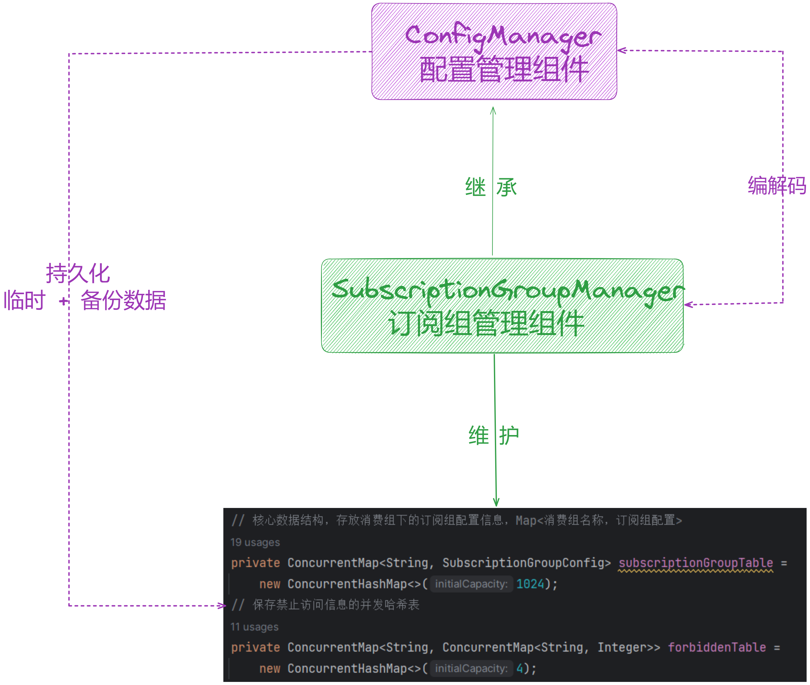

大家好，我是**华仔**, 又跟大家见面了。

从今天开始我将继续为大家奉上 RocketMQ 消费者源码剖析系列文章，正式开启「**RocketMQ 的服务端 Broker 源码之旅**」，这是第十一篇，本篇我们将以「**RocketMQ 5.1.2**」版本为主，来剖析下 RocketMQ 源码之 Broker

消费者订阅组管理组件剖析。

这里我将以「**RocketMQ 5.1.2**」版本为主，通过「**场景驱动**」的方式带大家一点点的对 RocketMQ 源码进行深度剖析，正式开启「**RocketMQ 的源码之旅**」，跟我一起来掌握 RocketMQ 源码核心架构设计思想吧。

  

## **01 总体概述**

[在 BrokerController 构造方法](https://articles.zsxq.com/id_chxqzhg8psk4.html)里面创建了很多「**管理器**」、「**处理器**」、「**线程队列**」等，跟本文有关系的就是下面这个组件，该组件继承了 [ConfigManager](http://configmanager/) 配置管理组件，它会将内存数据持久化到磁盘文件 [subscriptionGroup.json](http://subscriptiongroup.json/)。主要负责「**维护**」所有消费组在「**内存**」中的「**订阅数据**」。

## **02 SubscriptionGroupManager**

源码位置：[https://github.com/apache/rocketmq/blob/release-5.1.2/broker/src/main/java/org/apache/rocketmq/broker/](https://github.com/apache/rocketmq/blob/release-5.1.2/broker/src/main/java/org/apache/rocketmq/broker/subscription/SubscriptionGroupManager.java)[subscription/SubscriptionGroupManager](https://github.com/apache/rocketmq/blob/release-5.1.2/broker/src/main/java/org/apache/rocketmq/broker/subscription/SubscriptionGroupManager.java)[.java](https://github.com/apache/rocketmq/blob/release-5.1.2/broker/src/main/java/org/apache/rocketmq/broker/subscription/SubscriptionGroupManager.java)

## **2.1 核心数据结构**

/\*\*

\* 订阅组管理组件

\*/

public class SubscriptionGroupManager extends ConfigManager {

private static final Logger log \= LoggerFactory.getLogger(LoggerName.BROKER\_LOGGER\_NAME);

// key=consumerGroupName,value=订阅组信息

// 核心数据结构，存放消费组下的订阅组配置信息，Map<消费组名称，订阅组配置>

private ConcurrentMap<String, SubscriptionGroupConfig> subscriptionGroupTable =

new ConcurrentHashMap<>(1024);

// 保存禁止访问信息的并发哈希表，是否有读权限

private ConcurrentMap<String, ConcurrentMap<String, Integer>> forbiddenTable =

new ConcurrentHashMap<>(4);

// 内存数据版本号

private final DataVersion dataVersion \= new DataVersion();

private transient BrokerController brokerController;

....

}

接着来剖析下 [SubscriptionGroupConfig](http://subscriptiongroupconfig/) 的数据结构。

public class SubscriptionGroupConfig {

// 消费组名称

private String groupName;

// 是否开启消费

private boolean consumeEnable \= true;

// 是否允许消费最早消息

private boolean consumeFromMinEnable \= true;

// 是否允许广播消费

private boolean consumeBroadcastEnable \= true;

// 是否顺序消费

private boolean consumeMessageOrderly \= false;

// 重试队列数

private int retryQueueNums \= 1;

// 重试最大次数

private int retryMaxTimes \= 16;

private GroupRetryPolicy groupRetryPolicy \= new GroupRetryPolicy();

// BrokerId

private long brokerId \= MixAll.MASTER\_ID;

// 当产生慢消费时，选择第几个broker

private long whichBrokerWhenConsumeSlowly \= 1;

// 是否通知消费者 ids 变更

private boolean notifyConsumerIdsChangedEnable \= true;

// 消费组系统标识

private int groupSysFlag \= 0;

// Only valid for push consumer

// 消费超时时间

private int consumeTimeoutMinute \= 15;

// 订阅信息集合

private Set<SimpleSubscriptionData> subscriptionDataSet;

....

}

## **2.2 核心方法**

都比较简单，主要是对上面提到的数据结构进行维护，我们分别来看下。

### **2.2.1 初始化**

private void init() {

{

// 初始化系统消费者组

SubscriptionGroupConfig subscriptionGroupConfig \= new SubscriptionGroupConfig();

subscriptionGroupConfig.setGroupName(MixAll.TOOLS\_CONSUMER\_GROUP);

// 写入到订阅组配置缓存表中

this.subscriptionGroupTable.put(MixAll.TOOLS\_CONSUMER\_GROUP, subscriptionGroupConfig);

}

{

// 初始化过滤服务消费者组

SubscriptionGroupConfig subscriptionGroupConfig \= new SubscriptionGroupConfig();

subscriptionGroupConfig.setGroupName(MixAll.FILTERSRV\_CONSUMER\_GROUP);

// 写入到订阅组配置缓存表中

this.subscriptionGroupTable.put(MixAll.FILTERSRV\_CONSUMER\_GROUP, subscriptionGroupConfig);

}

{

// 初始化自测消费者组

SubscriptionGroupConfig subscriptionGroupConfig \= new SubscriptionGroupConfig();

subscriptionGroupConfig.setGroupName(MixAll.SELF\_TEST\_CONSUMER\_GROUP);

// 写入到订阅组配置缓存表中

this.subscriptionGroupTable.put(MixAll.SELF\_TEST\_CONSUMER\_GROUP, subscriptionGroupConfig);

}

{

// 初始化 http 代理消费者组

SubscriptionGroupConfig subscriptionGroupConfig \= new SubscriptionGroupConfig();

subscriptionGroupConfig.setGroupName(MixAll.ONS\_HTTP\_PROXY\_GROUP);

// 允许广播消费

subscriptionGroupConfig.setConsumeBroadcastEnable(true);

// 写入到订阅组配置缓存表中

this.subscriptionGroupTable.put(MixAll.ONS\_HTTP\_PROXY\_GROUP, subscriptionGroupConfig);

}

{

// 初始化 ONS\_API\_PULL 消费者组

SubscriptionGroupConfig subscriptionGroupConfig \= new SubscriptionGroupConfig();

subscriptionGroupConfig.setGroupName(MixAll.CID\_ONSAPI\_PULL\_GROUP);

// 允许广播消费

subscriptionGroupConfig.setConsumeBroadcastEnable(true);

// 写入到订阅组配置缓存表中

this.subscriptionGroupTable.put(MixAll.CID\_ONSAPI\_PULL\_GROUP, subscriptionGroupConfig);

}

{

// 初始化 ONS\_API\_PERMISSION 消费者组

SubscriptionGroupConfig subscriptionGroupConfig \= new SubscriptionGroupConfig();

subscriptionGroupConfig.setGroupName(MixAll.CID\_ONSAPI\_PERMISSION\_GROUP);

// 允许广播消费

subscriptionGroupConfig.setConsumeBroadcastEnable(true);

// 写入到订阅组配置缓存表中

this.subscriptionGroupTable.put(MixAll.CID\_ONSAPI\_PERMISSION\_GROUP, subscriptionGroupConfig);

}

{

// 初始化 ONS\_API\_OWNER 消费组者组

SubscriptionGroupConfig subscriptionGroupConfig \= new SubscriptionGroupConfig();

subscriptionGroupConfig.setGroupName(MixAll.CID\_ONSAPI\_OWNER\_GROUP);

// 允许广播消费

subscriptionGroupConfig.setConsumeBroadcastEnable(true);

// 写入到订阅组配置缓存表中

this.subscriptionGroupTable.put(MixAll.CID\_ONSAPI\_OWNER\_GROUP, subscriptionGroupConfig);

}

{

// 初始化 \_RMQ\_TRANS 消费者组

SubscriptionGroupConfig subscriptionGroupConfig \= new SubscriptionGroupConfig();

subscriptionGroupConfig.setGroupName(MixAll.CID\_SYS\_RMQ\_TRANS);

// 允许广播消费

subscriptionGroupConfig.setConsumeBroadcastEnable(true);

// 写入到订阅组配置缓存表中

this.subscriptionGroupTable.put(MixAll.CID\_SYS\_RMQ\_TRANS, subscriptionGroupConfig);

}

}

很简单，就是初始化各种系统消费者组。

### **2.2.2 更新订阅配置**

/\*\*

\* 更新订阅配置

\* @param config

\*/

public void updateSubscriptionGroupConfig(final SubscriptionGroupConfig config) {

// 更新订阅配置

SubscriptionGroupConfig old \= this.subscriptionGroupTable.put(config.getGroupName(), config);

if (old != null) {

log.info("update subscription group config, old: {} new: {}", old, config);

} else {

log.info("create new subscription group, {}", config);

}

// 获取数据版本号

long stateMachineVersion \= brokerController.getMessageStore() != null ? brokerController.getMessageStore().getStateMachineVersion() : 0;

// 新内存数据版本号

dataVersion.nextVersion(stateMachineVersion);

// 持久化

this.persist();

}

### **2.2.3 失效消费者组**

/\*\*

\* 失效消费者组

\* @param groupName

\*/

public void disableConsume(final String groupName) {

// 获取订阅配置

SubscriptionGroupConfig old \= this.subscriptionGroupTable.get(groupName);

if (old != null) {

// 设置是否可消费，否

old.setConsumeEnable(false);

// 设置内存数据版本号

long stateMachineVersion \= brokerController.getMessageStore() != null ? brokerController.getMessageStore().getStateMachineVersion() : 0;

dataVersion.nextVersion(stateMachineVersion);

}

}

### **2.2.4 查找指定消费者组的订阅配置**

/\*\*

\* 查找指定消费组的订阅配置

\* @param group

\* @return

\*/

public SubscriptionGroupConfig findSubscriptionGroupConfig(final String group) {

// 获取订阅配置

SubscriptionGroupConfig subscriptionGroupConfig \= this.subscriptionGroupTable.get(group);

// 如果配置为空

if (null == subscriptionGroupConfig) {

// 是否自动创建订阅组 || 是否是系统消费者组

if (brokerController.getBrokerConfig().isAutoCreateSubscriptionGroup() || MixAll.isSysConsumerGroup(group)) {

// 合法校验

if (group.length() > Validators.CHARACTER\_MAX\_LENGTH || TopicValidator.isTopicOrGroupIllegal(group)) {

return null;

}

// 创建一个新的订阅组配置

subscriptionGroupConfig = new SubscriptionGroupConfig();

// 设置消费者组

subscriptionGroupConfig.setGroupName(group);

// 更新订阅组配置

SubscriptionGroupConfig preConfig \= this.subscriptionGroupTable.putIfAbsent(group, subscriptionGroupConfig);

if (null == preConfig) {

log.info("auto create a subscription group, {}", subscriptionGroupConfig.toString());

}

// 更新数据版本号

long stateMachineVersion \= brokerController.getMessageStore() != null ? brokerController.getMessageStore().getStateMachineVersion() : 0;

dataVersion.nextVersion(stateMachineVersion);

// 持久化

this.persist();

}

}

// 返回订阅组配置

return subscriptionGroupConfig;

}

### **2.2.5 编解码**

@Override

public String encode() {

// 以默认的格式将对象编码为字符串并返回

return this.encode(false);

}

@Override

public String encode(final boolean prettyFormat) {

// 使用 RemotingSerializable 工具类将对象转换为 JSON 字符串

return RemotingSerializable.toJson(this, prettyFormat);

}

/\*\*

\* 将 json 字符串反序列化为 SubscriptionGroupManager 对象，写回订阅组缓存表中

\* @param jsonString

\*/

@Override

public void decode(String jsonString) {

if (jsonString != null) {

// 从字符串中恢复数据

SubscriptionGroupManager obj \= RemotingSerializable.fromJson(jsonString, SubscriptionGroupManager.class);

if (obj != null) {

// 写回订阅组缓存表中

this.subscriptionGroupTable.putAll(obj.subscriptionGroupTable);

if (obj.forbiddenTable != null) {

// 写回禁止访问信息的并发哈希表中

this.forbiddenTable.putAll(obj.forbiddenTable);

}

// 设置数据版本号

this.dataVersion.assignNewOne(obj.dataVersion);

// 打印日志

this.printLoadDataWhenFirstBoot(obj);

}

}

}

/\*\*

\* 当第一次启动时，打印加载数据时的日志

\*/

private void printLoadDataWhenFirstBoot(final SubscriptionGroupManager sgm) {

Iterator<Entry<String, SubscriptionGroupConfig>> it = sgm.getSubscriptionGroupTable().entrySet().iterator();

while (it.hasNext()) {

Entry<String, SubscriptionGroupConfig> next = it.next();

log.info("load exist subscription group, {}", next.getValue().toString());

}

}

### **2.2.6 删除指定消费组的订阅配置**

/\*\*

\* 删除指定消费组的订阅配置

\* @param groupName

\*/

public void deleteSubscriptionGroupConfig(final String groupName) {

// 删除订阅配置

SubscriptionGroupConfig old \= this.subscriptionGroupTable.remove(groupName);

// 删除禁止访问信息的并发哈希表

this.forbiddenTable.remove(groupName);

if (old != null) {

log.info("delete subscription group OK, subscription group:{}", old);

// 设置数据版本号

long stateMachineVersion \= brokerController.getMessageStore() != null ? brokerController.getMessageStore().getStateMachineVersion() : 0;

dataVersion.nextVersion(stateMachineVersion);

// 持久化

this.persist();

} else {

log.warn("delete subscription group failed, subscription groupName: {} not exist", groupName);

}

}

### **2.2.7 禁止操作相关**

public void updateForbidden(String group,String topic,int forbiddenIndex,boolean setOrClear) {

if (setOrClear) {

// 设置

setForbidden(group,topic,forbiddenIndex);

} else {

// 清理

clearForbidden(group,topic,forbiddenIndex);

}

}

/\*\*

\* 将指定索引（从0开始）处的位设置为1

\*

\* @param group 消费者组名称

\* @param topic 主题名

\* @param forbiddenIndex 禁止访问位的索引（从0开始）

\*/

public void setForbidden(String group,String topic,int forbiddenIndex) {

// 获取对应禁止访问信息

int topicForbidden \= getForbidden(group,topic);

// 将指定索引位（从0开始）设置为1

topicForbidden |= 1 << forbiddenIndex;

// 更新禁止访问信息

updateForbiddenValue(group,topic,topicForbidden);

}

/\*\*

\* 将指定索引（从0开始）处的位设置为0

\*

\* @param group 消费者组名称

\* @param topic 主题名

\* @param forbiddenIndex 禁止访问位的索引（从0开始）

\*/

public void clearForbidden(String group,String topic,int forbiddenIndex) {

// 获取对应禁止访问信息

int topicForbidden \= getForbidden(group,topic);

// 将指定索引位（从0开始）设置为0

topicForbidden &= ~(1 << forbiddenIndex);

// 更新禁止访问信息

updateForbiddenValue(group,topic,topicForbidden);

}

/\*\*

\* 获取指定索引（从0开始）处的禁止访问信息

\*

\* @param group 消费者组名称

\* @param topic 主题名

\* @param forbiddenIndex 禁止访问位的索引（从0开始）

\* @return 是否禁止访问

\*/

public boolean getForbidden(String group,String topic,int forbiddenIndex) {

// 获取对应禁止访问信息

int topicForbidden \= getForbidden(group,topic);

int bitForbidden \= 1 << forbiddenIndex;

// 检查指定索引位是否为1

return (topicForbidden & bitForbidden) == bitForbidden;

}

/\*\*

\* 获取指定主题的禁止访问信息

\*

\* @param group 消费者组名称

\* @param topic 主题名

\* @return 主题的禁止访问信息

\*/

public int getForbidden(String group,String topic) {

// 获取对应禁止访问信息

ConcurrentMap<String,Integer> topicForbiddens = this.forbiddenTable.get(group);

if (topicForbiddens == null) {

return 0;

}

Integer topicForbidden \= topicForbiddens.get(topic);

if (topicForbidden == null || topicForbidden < 0) {

topicForbidden = 0;

}

// 返回主题的禁止访问信息

return topicForbidden;

}

/\*\*

\* 更新禁止访问的数值

\*

\* @param group 消费者组名称

\* @param topic 主题名

\* @param forbidden 禁止访问的数值

\*/

private void updateForbiddenValue(String group,String topic,Integer forbidden) {

// 如果禁止访问数值为null或小于等于0，则移除对应的消费者组

if (forbidden == null || forbidden <= 0) {

this.forbiddenTable.remove(group);

// 记录日志，清除消费者组禁止访问信息

log.info("clear group forbidden,{}@{} ",group,topic);

return;

}

ConcurrentMap<String,Integer> topicsPermMap = this.forbiddenTable.get(group);

// 如果为空，则新建一个 ConcurrentHashMap

if (topicsPermMap == null) {

this.forbiddenTable.putIfAbsent(group,new ConcurrentHashMap<>());

topicsPermMap = this.forbiddenTable.get(group);

}

// 将禁止访问值放入对应的Map中

Integer old \= topicsPermMap.put(topic,forbidden);

// 记录日志，设置消费者组禁止访问信息

if (old != null) {

log.info("set group forbidden,{}@{} old:{} new:{}",group,topic,old,forbidden);

} else {

log.info("set group forbidden,{}@{} old:{} new:{}",group,topic,0,forbidden);

}

// 更新数据版本号

long stateMachineVersion \= brokerController.getMessageStore() != null ?brokerController.getMessageStore().getStateMachineVersion() :0;

dataVersion.nextVersion(stateMachineVersion);

// 持久化

this.persist();

}

### **2.2.8 配置路径**

// 配置路径

@Override

public String configFilePath() {

// 配置存储路径 config/subscriptionGroup.json

return BrokerPathConfigHelper.getSubscriptionGroupPath(this.brokerController.getMessageStoreConfig()

.getStorePathRootDir());

}

## **03 总结**

本篇主要剖析了 [BrokerController](http://brokercontroller%20/) 初始化时中用到的 「**SubscriptionGroupManager**」，该组件继承了 [ConfigManager](http://configmanager/) 配置管理组件，它会将内存数据持久化到磁盘文件 [subscriptionGroup.json](http://subscriptiongroup.json/)。主要负责「**维护**」所有消费组在「**内存**」中的「**订阅数据**」。

示意图如下：

