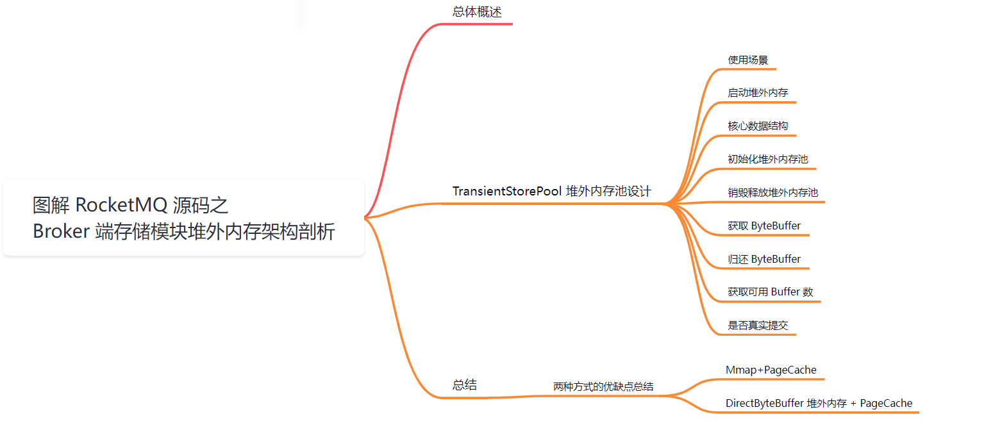
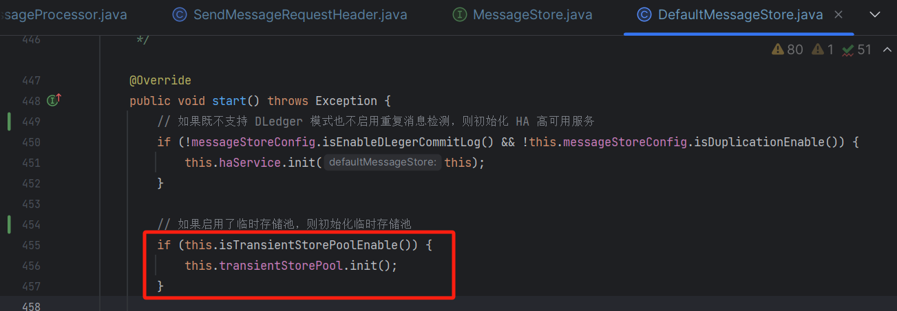
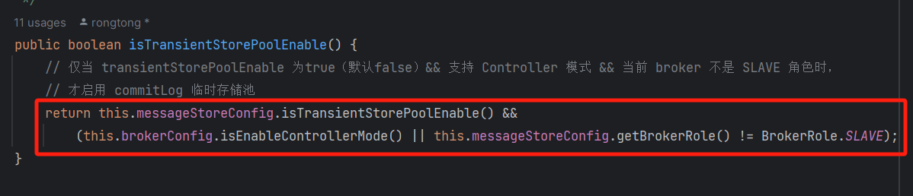
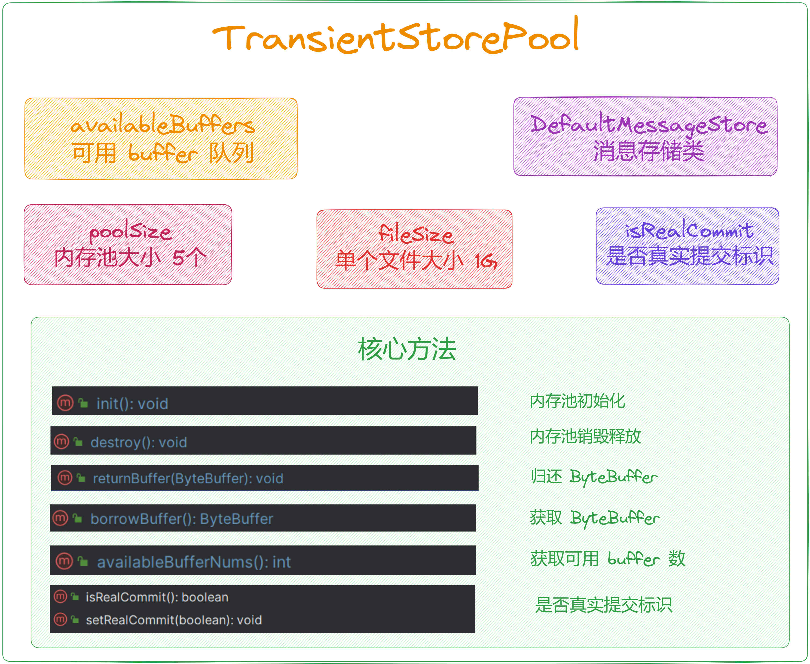
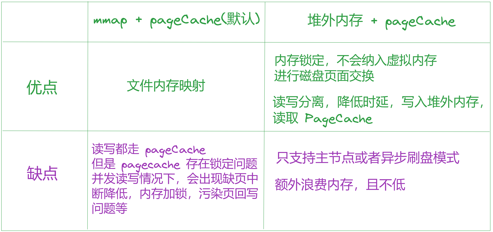

大家好，我是**华仔**, 又跟大家见面了。

从今天开始我将继续为大家奉上 RocketMQ 消费者源码剖析系列文章，正式开启「**RocketMQ 的服务端 Broker 源码之旅**」，这是第十七篇，本篇我们将以「**RocketMQ 5.1.2**」版本为主，来剖析下 RocketMQ 源码之 Broker 端存储模块堆外内存架构剖析。

这里我将以「**RocketMQ 5.1.2**」版本为主，通过「**场景驱动**」的方式带大家一点点的对 RocketMQ 源码进行深度剖析，正式开启「**RocketMQ 的源码之旅**」，跟我一起来掌握 RocketMQ 源码核心架构设计思想吧。

  

##   
**01 总体概述**

在[【Broker端源码分析系列第十六篇】图解 RocketMQ 源码之 Broker MessageStore 存储架构](https://articles.zsxq.com/id_fon03obc0q26.html) 上篇中，我们讨论到一个新的技术亮点，那就是「**TransientStorePool**」。

那么这个内存池底层用了哪些黑科技，又是怎么提高数据处理效率的？

今天我们就来聊聊这个内存池的架构设计。

## **02 TransientStorePool 堆外内存池设计**

在 RocketMQ 中，「**TransientStorePool**」是一种特殊的内存存储池，用于「**临时存储数据**」的。它的主要作用是提供一种「**内存锁定机制**」，确保当前「**堆外内存**」不会被进程交换到磁盘，从而「**提高数据处理**」的效率。同时因为是堆外内存，这么设计可以避免频繁的 GC 问题。

RocketMQ 为了降低「**PageCache**」的使用压力，引入了「**transientStorePoolEnable**」机制，即「**内存级别的读写分离机制**」。

默认情况，RocketMQ 将消息写入「**PageCache**」，消费时从「**PageCache**」中读取消息。但是这样在高并发下「**PageCache**」压力会比较大，容易出现瞬时「**Broker Busy**」异常。

RocketMQ 通过开启「**transientStorePoolEnable=true**」，将消息写入堆外内存并立即返回，然后异步将堆外内存中的数据批量提交到「**PageCache**」，再异步刷盘到磁盘中。这样的好处就是形成内存级别的读写分离，发送写入消息是向堆外内存，消费读取消息是从「**PageCache**」。

该机制的缺点就是如果意外导致「**Broker**」进程异常退出，已经放入到「**PageCache**」中的数据不会丢失，而存储在堆外内存的数据会丢失。

RocketMQ 单独创建一个 [ByteBuffer](http://bytebuffer/) 内存缓存池，用来临时存储数据，数据先写入该内存映射中，然后由 [commit 线程](http://xn--commit%20-j97wn29a/)定时将数据从该「**内存复制**」到与「**目标物理文件**」对应的「**内存映射**」中。

## **2.1 使用场景**

「**TransientStorePool**」的使用场景主要适用于需要「**高速处理大量消息**」的场景。

在RocketMQ中，该机制主要用于「**提高消息的写入速度和存储效率**」。

通过合理配置「**TransientStorePool**」的属性，可以更好地平衡内存使用和磁盘 I/O 负载，从而提高系统的整体性能。

## **2.2 启动堆外内存**

在 RocketMQ 中，[MessageStoreConfig](http://messagestoreconfig%20/) 类中定义了 [transientStorePoolEnable](http://transientstorepoolenable%20/) 属性，用来控制是否启用「**TransientStorePool**」。

启用该属性后，需要满足一定的条件才能使用「**TransientStorePool**」。

当开启堆外内存的情况下，在 [DefaultMessageStore](http://defaultmessagestore%20/) 类初始化时，初始化「**TransientStorePool**」类。

通过上面可以得出如果开启了堆外内存缓冲区的话，必须是开启 [isTransientStorePoolEnable](http://istransientstorepoolenable%20/) 的同时必须支持 [Controller](http://controller%20/) 模式或者该 [Broker](http://broker%20/) 必须为主节点。

源码位置：[https://github.com/apache/rocketmq/blob/release-5.1.2/](https://github.com/apache/rocketmq/blob/release-5.1.2/store/src/main/java/org/apache/rocketmq/store/TransientStorePool.java)[store](https://github.com/apache/rocketmq/blob/release-5.1.2/store/src/main/java/org/apache/rocketmq/store/TransientStorePool.java)[/src/main/java/org/apache/rocketmq/](https://github.com/apache/rocketmq/blob/release-5.1.2/store/src/main/java/org/apache/rocketmq/store/TransientStorePool.java)[store](https://github.com/apache/rocketmq/blob/release-5.1.2/store/src/main/java/org/apache/rocketmq/store/TransientStorePool.java)[/](https://github.com/apache/rocketmq/blob/release-5.1.2/store/src/main/java/org/apache/rocketmq/store/TransientStorePool.java)[TransientStorePool](https://github.com/apache/rocketmq/blob/release-5.1.2/store/src/main/java/org/apache/rocketmq/store/TransientStorePool.java)[.java](https://github.com/apache/rocketmq/blob/release-5.1.2/store/src/main/java/org/apache/rocketmq/store/TransientStorePool.java)

## **2.3 核心数据结构**

/\*\*

\* 堆外内存池

\*/

public class TransientStorePool {

private static final Logger log \= LoggerFactory.getLogger(LoggerName.STORE\_LOGGER\_NAME);

// 内存池大小 5个

private final int poolSize;

// 单个 ByteBuffer 文件大小 1G

private final int fileSize;

// 可用 buffer 队列

private final Deque<ByteBuffer> availableBuffers;

// 消息存储类

private final DefaultMessageStore messageStore;

//

private volatile boolean isRealCommit \= true;

public TransientStorePool(final DefaultMessageStore messageStore) {

this.messageStore = messageStore;

// 存储池大小 5

this.poolSize = messageStore.getMessageStoreConfig().getTransientStorePoolSize();

// ByteBuffer 文件大小 1G

this.fileSize = messageStore.getMessageStoreConfig().getMappedFileSizeCommitLog();

this.availableBuffers = new ConcurrentLinkedDeque<>();

}

....

}

「**TransientStorePool**」的核心属性包括「**poolSize**」和「**fileSize**」，分别表示可用的 ByteBuffer 个数和每个ByteBuffer 的大小，当然这些属性可以通过配置进行设置。

## **2.4 初始化堆外内存池**

/\*\*

\* It's a heavy init method.

\* 这里要初始化5个G的的堆外内存

\* 初始化函数，分配 poolSize (5G) 个 fileSize (1024\*1024\*1024) 的堆外空间

\*/

public void init() {

// // 遍历进行初始化堆外内存，总共 5 个G

for (int i \= 0; i < poolSize; i++) {

// 使用 ByteBuffer 分配直接内存

ByteBuffer byteBuffer \= ByteBuffer.allocateDirect(fileSize);

// 如果是 mappedByteBuffer 类型，可以通过以下方式获取直接内存的地址。

final long address \= ((DirectBuffer) byteBuffer).address();

// 创建指针指向直接内存的地址

Pointer pointer \= new Pointer(address);

//创建 poolSize 个堆外内存，并利用 com.sun.jna.Library 类库的 mlock 系统调用将该批内存锁定，避免被置换到交换区，提高存储性能。

LibC.INSTANCE.mlock(pointer, new NativeLong(fileSize));

// 将 ByteBuffer 放入可用的 ByteBuffer 队列中

availableBuffers.offer(byteBuffer);

}

}

这里的设计有点类似于「**连接池**」的设计，用来构造堆外内存缓存池，默认构造 5 个 1G 大小的内存池。

初始化 5G 的堆外内存，向操作系统申请 5G 内存也是一个重方法。

每申请一个 [ByteBuffer](http://bytebuffer%20/) （1G的堆外内存）就放入 [availableBuffers](http://availablebuffers/) 双端队列中，用的时候从这里借，用完就归还，非常巧妙的设计思想。

## **2.5 销毁释放堆外内存池**

/\*\*

\* 销毁内存：对之前初始化时所分配并锁定的直接内存进行解锁和释放

\*/

public void destroy() {

// 遍历可用的 ByteBuffer 队列

for (ByteBuffer byteBuffer : availableBuffers) {

// 获取 ByteBuffer 对应直接内存的地址

final long address \= ((DirectBuffer) byteBuffer).address();

// 创建指针指向直接内存的地址

Pointer pointer \= new Pointer(address);

// 利用 com.sun.jna.Library 类库的 munlock 系统调用解锁并释放内存

LibC.INSTANCE.munlock(pointer, new NativeLong(fileSize));

}

}

## **2.6 获取 ByteBuffer**

/\*\*

\* 获取 ByteBuffer

\* @return

\*/

public ByteBuffer borrowBuffer() {

// 从队列头部取出一个ByteBuffer

ByteBuffer buffer \= availableBuffers.pollFirst();

// 如果可用ByteBuffer的数量少于池大小的40%，记录警告日志

if (availableBuffers.size() < poolSize \* 0.4) {

log.warn("TransientStorePool only remain {} sheets.",availableBuffers.size());

}

// 返回取出的ByteBuffer

return buffer;

}

## **2.7 归还 ByteBuffer**

/\*\*

\* 归还 ByteBuffer

\* @param byteBuffer

\*/

public void returnBuffer(ByteBuffer byteBuffer) {

// 设置ByteBuffer的位置和限制，将它们重置为初始状态，以便重新使用

byteBuffer.position(0);

byteBuffer.limit(fileSize);

// 将ByteBuffer放回队列的头部，以备后续使用

// 这种做法可以提高内存的复用性和减少内存重分配的开销

this.availableBuffers.offerFirst(byteBuffer);

}

## **2.8 获取可用 Buffer 数**

/\*\*

\* TransientStorePool 类方法

\* 获取可用 buffer 数

\* @return

\*/

public int availableBufferNums() {

// 如果启动，则返回可用的堆外内存池的数量

if (messageStore.isTransientStorePoolEnable()) {

return availableBuffers.size();

}

// 如果没开启则返回最大 int 值

return Integer.MAX\_VALUE;

}

## **2.9 是否真实提交**

public boolean isRealCommit() {

return isRealCommit;

}

public void setRealCommit(boolean realCommit) {

isRealCommit = realCommit;

}

这里只是剖析类的方法，具体的代码调用关系我们在后面篇章再讲解。

## **03 总结**

我们知道 RocketMQ 的 [CommitLog](http://commitlog/)、[ConsumQueue](http://consumqueue/) 等通过 [mmap](http://mmap%20/) 技术，当接收到消息时写入「**内存映射文件**」，然后消费的时候通过「**内存映射**」进行读取。

RocketMQ 还提供了另外一套机制来优化效率：「**堆外内存**」。

RocketMQ 创建一个和 [CommitLog](http://commitlog%20/) 文件大小一样的 [ByteBuffer](http://bytebuffer/) 内存缓存池，用来临时存储数据，数据先写入「**堆外内存**」中，然后「**后台线程**」定时从 buffer 中复制到 [PageCache](http://pagecache/) 中进行「**持久化刷盘**」。

这种方式需要在 RocketMQ 的配置文件中手动开启，且 Broker 模式必须支持 Controller 模式或者必须是主节点。

最后两种刷盘方式比较：

总结：

1.  默认方式 [Mmap+PageCache](http://mmap+pagecache/) 的方式，读写消息都走的是 [PageCache](http://pagecache/)，这样读写都在 [PageCache](http://pagecache/) 里面不可避免会有锁的问题，在并发的读写操作情况下，会出现缺页中断降低、内存加锁、污染页的回写等问题。
2.  堆外缓冲区：[DirectByteBuffer 堆外内存 + PageCache](http://xn--directbytebuffer%20%20+%20pagecache-ft32de62ilpid2w/) 的两层架构方式，这样可以实现读写消息分离，写入消息时候写到的是 [DirectByteBuffer](http://directbytebuffer/) 堆外内存中，读消息走的是 [PageCache](http://pagecache/) 。对于 [DirectByteBuffer](http://directbytebuffer/) 是两步刷盘，一步是刷到 [PageCache](http://pagecache/)，还有一步是刷到磁盘文件中。带来的好处就是避免了内存操作的很多容易堵的地方，降低了时延，比如说缺页中断降低、内存加锁、污染页的回写。

​所以使用「**堆外内存池**」的方式相对来说会比较好，但是肯定的是，需要消耗一定的内存，如果服务器内存吃紧就不推荐这种模式，同时的话，「**堆外内存池**」的话也需要配合异步刷盘才能使用。