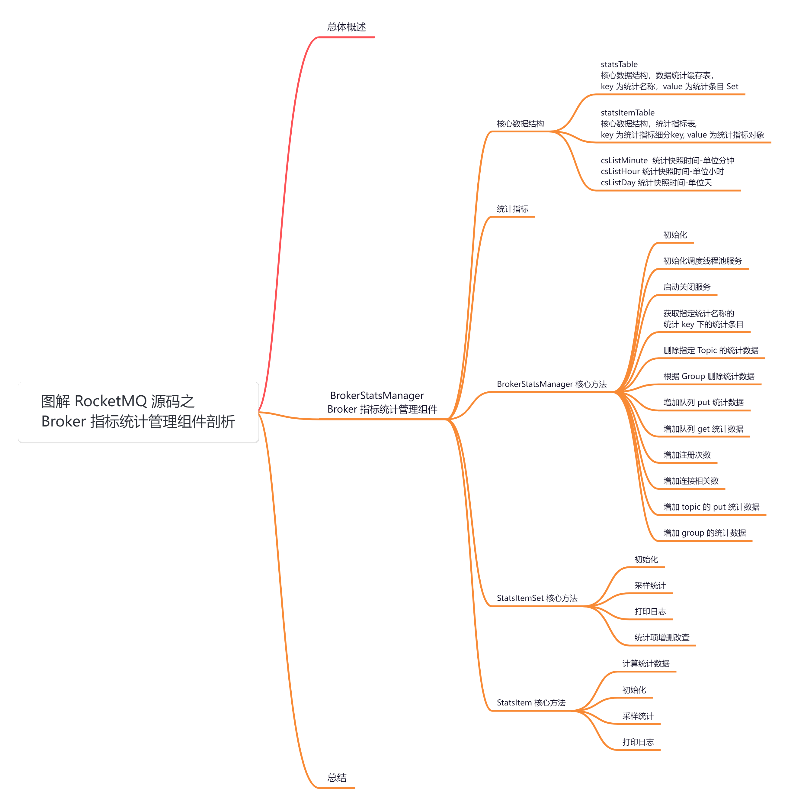
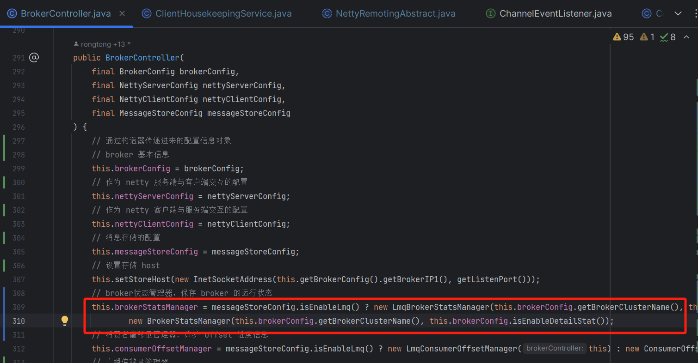
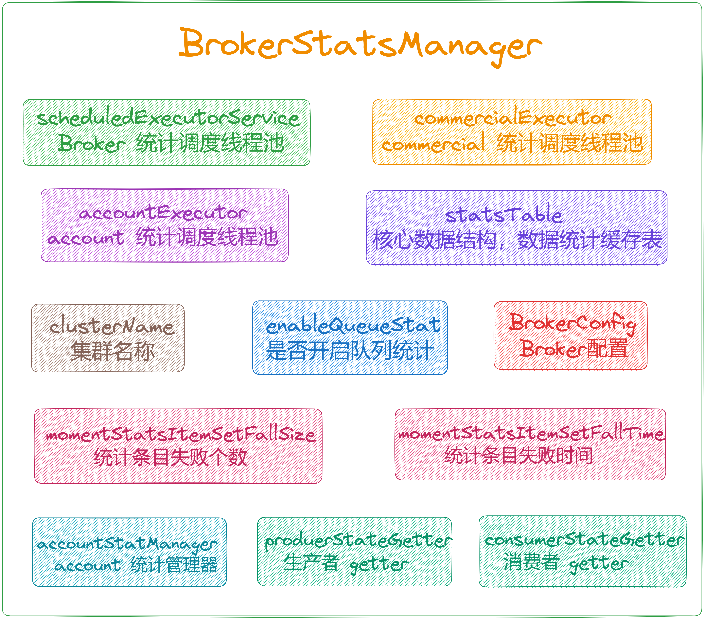
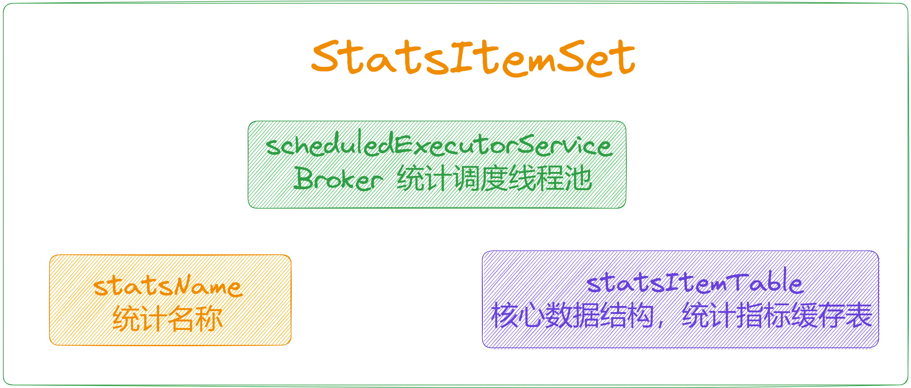
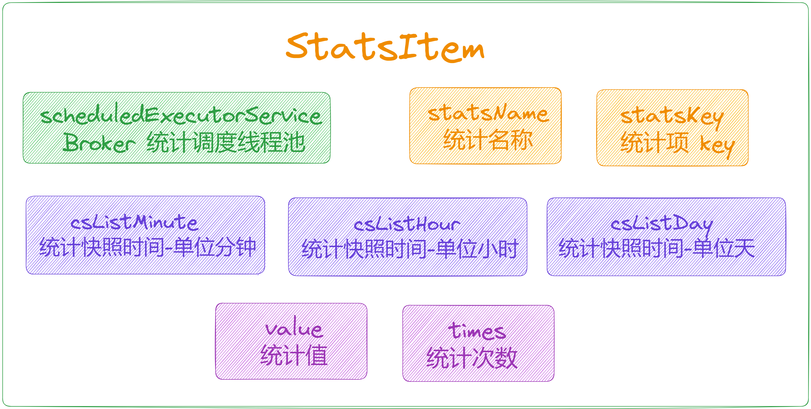
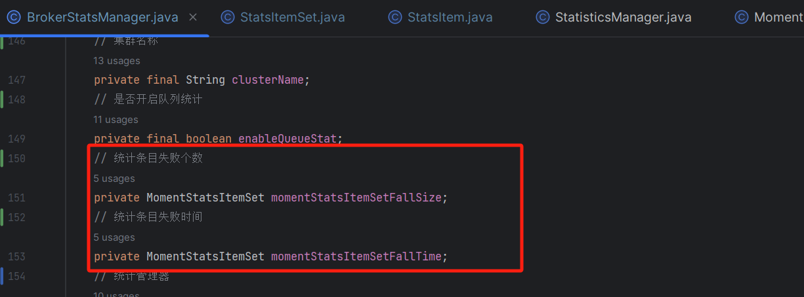
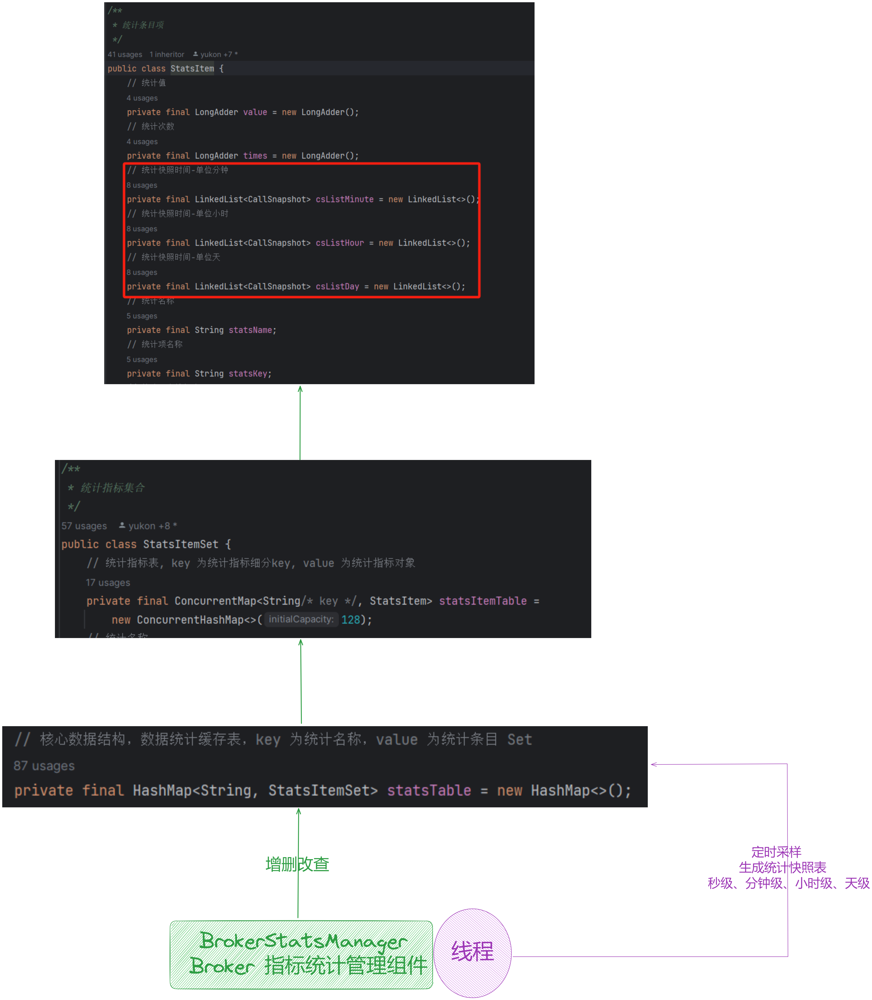

大家好，我是**华仔**, 又跟大家见面了。

从今天开始我将继续为大家奉上 RocketMQ 消费者源码剖析系列文章，正式开启「**RocketMQ 的服务端 Broker 源码之旅**」，这是第十三篇，本篇我们将以「**RocketMQ 5.1.2**」版本为主，来剖析下 RocketMQ 源码之 Broker

统计管理组件剖析。

这里我将以「**RocketMQ 5.1.2**」版本为主，通过「**场景驱动**」的方式带大家一点点的对 RocketMQ 源码进行深度剖析，正式开启「**RocketMQ 的源码之旅**」，跟我一起来掌握 RocketMQ 源码核心架构设计思想吧。

##   
**01 总体概述**

在 [BrokerController 构造方法](https://articles.zsxq.com/id_chxqzhg8psk4.html) 里面创建了很多「**管理器**」、「**处理器**」、「**线程队列**」等，跟本文有关系的就是下面这个组件，该组件继承了 [ChannelEventListener](http://channeleventlistener%20/) 监听器接口，主要负责对 Broker 端的「**系统指标**」进行统计，如「**QUEUE\_GET\_NUMS**」队列获取数量、「**QUEUE\_GET\_SIZE**」队列获取大小指标的「**分钟**」、「**小时**」、「**天**」级别的统计数据。

它统计的所有指标都是使用「**后台定时调度线程**」，对「**统计条目**」中的数据进行后台「**统计计算**」，存储在统计条目中的对应集合里，方便后续使用。

## **02 BrokerStatsManager**

源码位置：[https://github.com/apache/rocketmq/blob/release-5.1.2/](https://github.com/apache/rocketmq/blob/release-5.1.2/store/src/main/java/org/apache/rocketmq/store/stats/BrokerStatsManager.java)[store](https://github.com/apache/rocketmq/blob/release-5.1.2/store/src/main/java/org/apache/rocketmq/store/stats/BrokerStatsManager.java)[/src/main/java/org/apache/rocketmq/](https://github.com/apache/rocketmq/blob/release-5.1.2/store/src/main/java/org/apache/rocketmq/store/stats/BrokerStatsManager.java)[store](https://github.com/apache/rocketmq/blob/release-5.1.2/store/src/main/java/org/apache/rocketmq/store/stats/BrokerStatsManager.java)[/](https://github.com/apache/rocketmq/blob/release-5.1.2/store/src/main/java/org/apache/rocketmq/store/stats/BrokerStatsManager.java)[stats](https://github.com/apache/rocketmq/blob/release-5.1.2/store/src/main/java/org/apache/rocketmq/store/stats/BrokerStatsManager.java)[/](https://github.com/apache/rocketmq/blob/release-5.1.2/store/src/main/java/org/apache/rocketmq/store/stats/BrokerStatsManager.java)[BrokerStatsManager](https://github.com/apache/rocketmq/blob/release-5.1.2/store/src/main/java/org/apache/rocketmq/store/stats/BrokerStatsManager.java)[.java](https://github.com/apache/rocketmq/blob/release-5.1.2/store/src/main/java/org/apache/rocketmq/store/stats/BrokerStatsManager.java)

## **2.1 核心数据结构**

public class BrokerStatsManager {

// Broker 统计调度线程池

private ScheduledExecutorService scheduledExecutorService;

// commercial 统计调度线程池

private ScheduledExecutorService commercialExecutor;

// account 统计调度线程池

private ScheduledExecutorService accountExecutor;

// 核心数据结构，数据统计缓存表，key 为统计名称，value 为统计条目 Set

private final HashMap<String, StatsItemSet> statsTable = new HashMap<>();

// 集群名称

private final String clusterName;

// 是否开启队列统计

private final boolean enableQueueStat;

// 统计条目失败个数

private MomentStatsItemSet momentStatsItemSetFallSize;

// 统计条目失败时间

private MomentStatsItemSet momentStatsItemSetFallTime;

// 统计管理器

private final StatisticsManager accountStatManager \= new StatisticsManager();

// 生产者 getter

private StateGetter produerStateGetter;

// 消费者 getter

private StateGetter consumerStateGetter;

// broker 配置

private BrokerConfig brokerConfig;

....

}

再来看下统计条目集合的内部结构，主要维护一个「**统计条目表**」，key 为统计指标细分 key， value 为统计指标对象。

/\*\*

\* 统计指标集合

\*/

public class StatsItemSet {

// 统计指标表, key 为统计指标细分key, value 为统计指标对象

private final ConcurrentMap<String/\* key \*/, StatsItem> statsItemTable =

new ConcurrentHashMap<>(128);

// 统计名称

private final String statsName;

// 统计调度线程池

private final ScheduledExecutorService scheduledExecutorService;

....

}

最后来看下「**统计条目**」的内部结构，维护记录指标值的 value、times 和记录统计快照的 csListMinute、csListHour、csListDay，「**记录统计快照**」集合是通过「**后台线程**」定时处理出来的。

/\*\*

\* 统计条目项

\*/

public class StatsItem {

// 统计值

private final LongAdder value \= new LongAdder();

// 统计次数

private final LongAdder times \= new LongAdder();

// 统计快照时间-单位分钟

private final LinkedList<CallSnapshot> csListMinute = new LinkedList<>();

// 统计快照时间-单位小时

private final LinkedList<CallSnapshot> csListHour = new LinkedList<>();

// 统计快照时间-单位天

private final LinkedList<CallSnapshot> csListDay = new LinkedList<>();

// 统计名称

private final String statsName;

// 统计项 key

private final String statsKey;

// 统计调度线程池

private final ScheduledExecutorService scheduledExecutorService;

....

}

## **2.2 统计指标**

// 一系列消息队列和主题的统计指标，包括消息放入队列的数量、大小，消息从队列获取的数量和大小，主题发布消息的数量和大小。

@Deprecated public static final String QUEUE\_PUT\_NUMS \= Stats.QUEUE\_PUT\_NUMS;

@Deprecated public static final String QUEUE\_PUT\_SIZE \= Stats.QUEUE\_PUT\_SIZE;

@Deprecated public static final String QUEUE\_GET\_NUMS \= Stats.QUEUE\_GET\_NUMS;

@Deprecated public static final String QUEUE\_GET\_SIZE \= Stats.QUEUE\_GET\_SIZE;

@Deprecated public static final String TOPIC\_PUT\_NUMS \= Stats.TOPIC\_PUT\_NUMS;

@Deprecated public static final String TOPIC\_PUT\_SIZE \= Stats.TOPIC\_PUT\_SIZE;

// 声明了消费者组获取消息的数量和大小的统计指标

@Deprecated public static final String GROUP\_GET\_NUMS \= Stats.GROUP\_GET\_NUMS;

@Deprecated public static final String GROUP\_GET\_SIZE \= Stats.GROUP\_GET\_SIZE;

// 声明了消息发送、消息存储和消息获取相关的统计指标，包括发送消息的数量，存储消息的数量和大小，从磁盘获取消息的数量和大小等。

@Deprecated public static final String SNDBCK\_PUT\_NUMS \= Stats.SNDBCK\_PUT\_NUMS;

@Deprecated public static final String BROKER\_PUT\_NUMS \= Stats.BROKER\_PUT\_NUMS;

@Deprecated public static final String BROKER\_GET\_NUMS \= Stats.BROKER\_GET\_NUMS;

@Deprecated public static final String GROUP\_GET\_FROM\_DISK\_NUMS \= Stats.GROUP\_GET\_FROM\_DISK\_NUMS;

@Deprecated public static final String GROUP\_GET\_FROM\_DISK\_SIZE \= Stats.GROUP\_GET\_FROM\_DISK\_SIZE;

@Deprecated public static final String BROKER\_GET\_FROM\_DISK\_NUMS \= Stats.BROKER\_GET\_FROM\_DISK\_NUMS;

@Deprecated public static final String BROKER\_GET\_FROM\_DISK\_SIZE \= Stats.BROKER\_GET\_FROM\_DISK\_SIZE;

// COMMERCIAL 相关的统计指标，包括 COMMERCIAL 发送、接收次数和大小等

// For commercial

@Deprecated public static final String COMMERCIAL\_SEND\_TIMES \= Stats.COMMERCIAL\_SEND\_TIMES;

@Deprecated public static final String COMMERCIAL\_SNDBCK\_TIMES \= Stats.COMMERCIAL\_SNDBCK\_TIMES;

@Deprecated public static final String COMMERCIAL\_RCV\_TIMES \= Stats.COMMERCIAL\_RCV\_TIMES;

@Deprecated public static final String COMMERCIAL\_RCV\_EPOLLS \= Stats.COMMERCIAL\_RCV\_EPOLLS;

@Deprecated public static final String COMMERCIAL\_SEND\_SIZE \= Stats.COMMERCIAL\_SEND\_SIZE;

@Deprecated public static final String COMMERCIAL\_RCV\_SIZE \= Stats.COMMERCIAL\_RCV\_SIZE;

@Deprecated public static final String COMMERCIAL\_PERM\_FAILURES \= Stats.COMMERCIAL\_PERM\_FAILURES;

// Send message latency

// 声明了消息发送延迟、消费者确认次数、消息检查次数、死信队列发送次数、Broker确认次数等统计指标

public static final String TOPIC\_PUT\_LATENCY \= "TOPIC\_PUT\_LATENCY";

public static final String GROUP\_ACK\_NUMS \= "GROUP\_ACK\_NUMS";

public static final String GROUP\_CK\_NUMS \= "GROUP\_CK\_NUMS";

public static final String DLQ\_PUT\_NUMS \= "DLQ\_PUT\_NUMS";

public static final String BROKER\_ACK\_NUMS \= "BROKER\_ACK\_NUMS";

public static final String BROKER\_CK\_NUMS \= "BROKER\_CK\_NUMS";

public static final String BROKER\_GET\_NUMS\_WITHOUT\_SYSTEM\_TOPIC \= "BROKER\_GET\_NUMS\_WITHOUT\_SYSTEM\_TOPIC";

public static final String BROKER\_PUT\_NUMS\_WITHOUT\_SYSTEM\_TOPIC \= "BROKER\_PUT\_NUMS\_WITHOUT\_SYSTEM\_TOPIC";

public static final String SNDBCK2DLQ\_TIMES \= "SNDBCK2DLQ\_TIMES";

// 声明了所有者统计指标

public static final String COMMERCIAL\_OWNER \= "Owner";

// 账号相关

public static final String ACCOUNT\_OWNER\_PARENT \= "OWNER\_PARENT";

public static final String ACCOUNT\_OWNER\_SELF \= "OWNER\_SELF";

public static final long ACCOUNT\_STAT\_INVERTAL \= 60 \* 1000;

public static final String ACCOUNT\_AUTH\_TYPE \= "AUTH\_TYPE";

public static final String ACCOUNT\_SEND \= "SEND";

public static final String ACCOUNT\_RCV \= "RCV";

public static final String ACCOUNT\_SEND\_BACK \= "SEND\_BACK";

public static final String ACCOUNT\_SEND\_BACK\_TO\_DLQ \= "SEND\_BACK\_TO\_DLQ";

public static final String ACCOUNT\_AUTH\_FAILED \= "AUTH\_FAILED";

public static final String ACCOUNT\_SEND\_REJ \= "SEND\_REJ";

public static final String ACCOUNT\_REV\_REJ \= "RCV\_REJ";

// 消息相关

public static final String MSG\_NUM \= "MSG\_NUM";

public static final String MSG\_SIZE \= "MSG\_SIZE";

public static final String SUCCESS\_MSG\_NUM \= "SUCCESS\_MSG\_NUM";

public static final String FAILURE\_MSG\_NUM \= "FAILURE\_MSG\_NUM";

public static final String COMMERCIAL\_MSG\_NUM \= "COMMERCIAL\_MSG\_NUM";

public static final String SUCCESS\_REQ\_NUM \= "SUCCESS\_REQ\_NUM";

public static final String FAILURE\_REQ\_NUM \= "FAILURE\_REQ\_NUM";

public static final String SUCCESS\_MSG\_SIZE \= "SUCCESS\_MSG\_SIZE";

public static final String FAILURE\_MSG\_SIZE \= "FAILURE\_MSG\_SIZE";

public static final String RT \= "RT";

public static final String INNER\_RT \= "INNER\_RT";

@Deprecated public static final String GROUP\_GET\_FALL\_SIZE \= Stats.GROUP\_GET\_FALL\_SIZE;

@Deprecated public static final String GROUP\_GET\_FALL\_TIME \= Stats.GROUP\_GET\_FALL\_TIME;

// Pull Message Latency

@Deprecated public static final String GROUP\_GET\_LATENCY \= Stats.GROUP\_GET\_LATENCY;

// Consumer Register Time

public static final String CONSUMER\_REGISTER\_TIME \= "CONSUMER\_REGISTER\_TIME";

// Producer Register Time

public static final String PRODUCER\_REGISTER\_TIME \= "PRODUCER\_REGISTER\_TIME";

// channel 相关

public static final String CHANNEL\_ACTIVITY \= "CHANNEL\_ACTIVITY";

public static final String CHANNEL\_ACTIVITY\_CONNECT \= "CONNECT";

public static final String CHANNEL\_ACTIVITY\_IDLE \= "IDLE";

public static final String CHANNEL\_ACTIVITY\_EXCEPTION \= "EXCEPTION";

public static final String CHANNEL\_ACTIVITY\_CLOSE \= "CLOSE";

## **2.3 BrokerStatsManager 核心方法**

先来看 [BrokerStatsManager](http://brokerstatsmanager%20/) 类的核心方法。

### **2.3.1 初始化**

public void init() {

// 初始化统计条目失败个数

momentStatsItemSetFallSize = new MomentStatsItemSet(GROUP\_GET\_FALL\_SIZE,

scheduledExecutorService, log);

// 初始化统计条目失败时间

momentStatsItemSetFallTime = new MomentStatsItemSet(GROUP\_GET\_FALL\_TIME,

scheduledExecutorService, log);

// 如果启用了队列统计

if (enableQueueStat) {

// 将队列的相关统计指标加入到 statsTable 中

this.statsTable.put(Stats.QUEUE\_PUT\_NUMS, new StatsItemSet(Stats.QUEUE\_PUT\_NUMS, this.scheduledExecutorService, log));

this.statsTable.put(Stats.QUEUE\_PUT\_SIZE, new StatsItemSet(Stats.QUEUE\_PUT\_SIZE, this.scheduledExecutorService, log));

this.statsTable.put(Stats.QUEUE\_GET\_NUMS, new StatsItemSet(Stats.QUEUE\_GET\_NUMS, this.scheduledExecutorService, log));

this.statsTable.put(Stats.QUEUE\_GET\_SIZE, new StatsItemSet(Stats.QUEUE\_GET\_SIZE, this.scheduledExecutorService, log));

}

// 初始化各种统计条目集合，并将其相关统计指标加入到 statsTable 中

this.statsTable.put(Stats.TOPIC\_PUT\_NUMS, new StatsItemSet(Stats.TOPIC\_PUT\_NUMS, this.scheduledExecutorService, log));

this.statsTable.put(Stats.TOPIC\_PUT\_SIZE, new StatsItemSet(Stats.TOPIC\_PUT\_SIZE, this.scheduledExecutorService, log));

this.statsTable.put(Stats.GROUP\_GET\_NUMS, new StatsItemSet(Stats.GROUP\_GET\_NUMS, this.scheduledExecutorService, log));

this.statsTable.put(Stats.GROUP\_GET\_SIZE, new StatsItemSet(Stats.GROUP\_GET\_SIZE, this.scheduledExecutorService, log));

this.statsTable.put(GROUP\_ACK\_NUMS, new StatsItemSet(GROUP\_ACK\_NUMS, this.scheduledExecutorService, log));

this.statsTable.put(GROUP\_CK\_NUMS, new StatsItemSet(GROUP\_CK\_NUMS, this.scheduledExecutorService, log));

this.statsTable.put(Stats.GROUP\_GET\_LATENCY, new StatsItemSet(Stats.GROUP\_GET\_LATENCY, this.scheduledExecutorService, log));

this.statsTable.put(TOPIC\_PUT\_LATENCY, new StatsItemSet(TOPIC\_PUT\_LATENCY, this.scheduledExecutorService, log));

this.statsTable.put(Stats.SNDBCK\_PUT\_NUMS, new StatsItemSet(Stats.SNDBCK\_PUT\_NUMS, this.scheduledExecutorService, log));

this.statsTable.put(DLQ\_PUT\_NUMS, new StatsItemSet(DLQ\_PUT\_NUMS, this.scheduledExecutorService, log));

this.statsTable.put(Stats.BROKER\_PUT\_NUMS, new StatsItemSet(Stats.BROKER\_PUT\_NUMS, this.scheduledExecutorService, log));

this.statsTable.put(Stats.BROKER\_GET\_NUMS, new StatsItemSet(Stats.BROKER\_GET\_NUMS, this.scheduledExecutorService, log));

this.statsTable.put(BROKER\_ACK\_NUMS, new StatsItemSet(BROKER\_ACK\_NUMS, this.scheduledExecutorService, log));

this.statsTable.put(BROKER\_CK\_NUMS, new StatsItemSet(BROKER\_CK\_NUMS, this.scheduledExecutorService, log));

this.statsTable.put(BROKER\_GET\_NUMS\_WITHOUT\_SYSTEM\_TOPIC,

new StatsItemSet(BROKER\_GET\_NUMS\_WITHOUT\_SYSTEM\_TOPIC, this.scheduledExecutorService, log));

this.statsTable.put(BROKER\_PUT\_NUMS\_WITHOUT\_SYSTEM\_TOPIC,

new StatsItemSet(BROKER\_PUT\_NUMS\_WITHOUT\_SYSTEM\_TOPIC, this.scheduledExecutorService, log));

this.statsTable.put(Stats.GROUP\_GET\_FROM\_DISK\_NUMS,

new StatsItemSet(Stats.GROUP\_GET\_FROM\_DISK\_NUMS, this.scheduledExecutorService, log));

this.statsTable.put(Stats.GROUP\_GET\_FROM\_DISK\_SIZE,

new StatsItemSet(Stats.GROUP\_GET\_FROM\_DISK\_SIZE, this.scheduledExecutorService, log));

this.statsTable.put(Stats.BROKER\_GET\_FROM\_DISK\_NUMS,

new StatsItemSet(Stats.BROKER\_GET\_FROM\_DISK\_NUMS, this.scheduledExecutorService, log));

this.statsTable.put(Stats.BROKER\_GET\_FROM\_DISK\_SIZE,

new StatsItemSet(Stats.BROKER\_GET\_FROM\_DISK\_SIZE, this.scheduledExecutorService, log));

this.statsTable.put(SNDBCK2DLQ\_TIMES,

new StatsItemSet(SNDBCK2DLQ\_TIMES, this.scheduledExecutorService, DLQ\_STAT\_LOG));

this.statsTable.put(Stats.COMMERCIAL\_SEND\_TIMES,

new StatsItemSet(Stats.COMMERCIAL\_SEND\_TIMES, this.commercialExecutor, COMMERCIAL\_LOG));

this.statsTable.put(Stats.COMMERCIAL\_RCV\_TIMES,

new StatsItemSet(Stats.COMMERCIAL\_RCV\_TIMES, this.commercialExecutor, COMMERCIAL\_LOG));

this.statsTable.put(Stats.COMMERCIAL\_SEND\_SIZE,

new StatsItemSet(Stats.COMMERCIAL\_SEND\_SIZE, this.commercialExecutor, COMMERCIAL\_LOG));

this.statsTable.put(Stats.COMMERCIAL\_RCV\_SIZE,

new StatsItemSet(Stats.COMMERCIAL\_RCV\_SIZE, this.commercialExecutor, COMMERCIAL\_LOG));

this.statsTable.put(Stats.COMMERCIAL\_RCV\_EPOLLS,

new StatsItemSet(Stats.COMMERCIAL\_RCV\_EPOLLS, this.commercialExecutor, COMMERCIAL\_LOG));

this.statsTable.put(Stats.COMMERCIAL\_SNDBCK\_TIMES,

new StatsItemSet(Stats.COMMERCIAL\_SNDBCK\_TIMES, this.commercialExecutor, COMMERCIAL\_LOG));

this.statsTable.put(Stats.COMMERCIAL\_PERM\_FAILURES,

new StatsItemSet(Stats.COMMERCIAL\_PERM\_FAILURES, this.commercialExecutor, COMMERCIAL\_LOG));

this.statsTable.put(CONSUMER\_REGISTER\_TIME,

new StatsItemSet(CONSUMER\_REGISTER\_TIME, this.scheduledExecutorService, log));

this.statsTable.put(PRODUCER\_REGISTER\_TIME,

new StatsItemSet(PRODUCER\_REGISTER\_TIME, this.scheduledExecutorService, log));

this.statsTable.put(CHANNEL\_ACTIVITY, new StatsItemSet(CHANNEL\_ACTIVITY, this.scheduledExecutorService, log));

// 创建了一个 StatisticsItemFormatter 对象用来格式化统计项

StatisticsItemFormatter formatter \= new StatisticsItemFormatter();

// 设置了 account 统计管理器的简要元数据，包括了 RT 和 INNER\_RT 的配置。

accountStatManager.setBriefMeta(new Pair\[\] {

Pair.of(RT, new long\[\]\[\] {{50, 50}, {100, 10}, {1000, 10}}),

Pair.of(INNER\_RT, new long\[\]\[\] {{10, 10}, {100, 10}, {1000, 10}})});

// 定义了一组统计项名称，包括了消息数量、成功消息数量、失败消息数量等。

String\[\] itemNames = new String\[\] {

MSG\_NUM, SUCCESS\_MSG\_NUM, FAILURE\_MSG\_NUM, COMMERCIAL\_MSG\_NUM,

SUCCESS\_REQ\_NUM, FAILURE\_REQ\_NUM,

MSG\_SIZE, SUCCESS\_MSG\_SIZE, FAILURE\_MSG\_SIZE,

RT, INNER\_RT};

// 将各种 account 统计项元数据添加到了 accountStatManager 中。这些元数据配置包括了统计项的名称、执行者、格式化器、统计日志和统计时间间隔。

this.accountStatManager.addStatisticsKindMeta(createStatisticsKindMeta(

ACCOUNT\_SEND, itemNames, this.accountExecutor, formatter, ACCOUNT\_LOG, ACCOUNT\_STAT\_INVERTAL));

this.accountStatManager.addStatisticsKindMeta(createStatisticsKindMeta(

ACCOUNT\_RCV, itemNames, this.accountExecutor, formatter, ACCOUNT\_LOG, ACCOUNT\_STAT\_INVERTAL));

this.accountStatManager.addStatisticsKindMeta(createStatisticsKindMeta(

ACCOUNT\_SEND\_BACK, itemNames, this.accountExecutor, formatter, ACCOUNT\_LOG, ACCOUNT\_STAT\_INVERTAL));

this.accountStatManager.addStatisticsKindMeta(createStatisticsKindMeta(

ACCOUNT\_SEND\_BACK\_TO\_DLQ, itemNames, this.accountExecutor, formatter, ACCOUNT\_LOG, ACCOUNT\_STAT\_INVERTAL));

this.accountStatManager.addStatisticsKindMeta(createStatisticsKindMeta(

ACCOUNT\_SEND\_REJ, itemNames, this.accountExecutor, formatter, ACCOUNT\_LOG, ACCOUNT\_STAT\_INVERTAL));

this.accountStatManager.addStatisticsKindMeta(createStatisticsKindMeta(

ACCOUNT\_REV\_REJ, itemNames, this.accountExecutor, formatter, ACCOUNT\_LOG, ACCOUNT\_STAT\_INVERTAL));

// 设置统计项状态获取器，用来判断统计项是否在线。

this.accountStatManager.setStatisticsItemStateGetter(new StatisticsItemStateGetter() {

@Override

// 这里会根据统计项的类型和其他信息判断是否在线。

public boolean online(StatisticsItem item) {

String\[\] strArr = null;

try {

strArr = splitAccountStatKey(item.getStatObject());

} catch (Exception e) {

log.warn("parse account stat key failed, key: {}", item.getStatObject());

return false;

}

// TODO ugly

if (strArr == null || strArr.length < 4) {

return false;

}

String instanceId \= strArr\[1\];

String topic \= strArr\[2\];

String group \= strArr\[3\];

String kind \= item.getStatKind();

if (ACCOUNT\_SEND.equals(kind) || ACCOUNT\_SEND\_REJ.equals(kind)) {

return produerStateGetter.online(instanceId, group, topic);

} else if (ACCOUNT\_RCV.equals(kind) || ACCOUNT\_SEND\_BACK.equals(kind) || ACCOUNT\_SEND\_BACK\_TO\_DLQ.equals(kind) || ACCOUNT\_REV\_REJ.equals(kind)) {

return consumerStateGetter.online(instanceId, group, topic);

}

return false;

}

});

}

### **2.3.2 初始化调度线程池服务**

// 初始化调度线程池服务

private void initScheduleService() {

// broker 统计调度线程池服务

this.scheduledExecutorService =

Executors.newSingleThreadScheduledExecutor(new ThreadFactoryImpl("BrokerStatsThread", true, brokerConfig));

// commercial 统计调度线程池服务

this.commercialExecutor =

Executors.newSingleThreadScheduledExecutor(new ThreadFactoryImpl("CommercialStatsThread", true, brokerConfig));

// account 统计调度线程池服务

this.accountExecutor =

Executors.newSingleThreadScheduledExecutor(new ThreadFactoryImpl("AccountStatsThread", true, brokerConfig));

}

### **2.3.3 启动关闭服务**

public void start() {

}

// 调度线程池关闭

public void shutdown() {

this.scheduledExecutorService.shutdown();

this.commercialExecutor.shutdown();

}

### **2.3.4 获取指定统计名称的统计 key 下的统计条目**

// 获取指定统计名称的统计 key 下的统计条目

public StatsItem getStatsItem(final String statsName, final String statsKey) {

try {

// 先从 statsTable 获取对应统计名称，然后再获取

return this.statsTable.get(statsName).getStatsItem(statsKey);

} catch (Exception e) {

}

return null;

}

### **2.3.5 删除指定 Topic 的统计数据**

// 删除指定 Topic 的统计数据

public void onTopicDeleted(final String topic) {

this.statsTable.get(Stats.TOPIC\_PUT\_NUMS).delValue(topic);

this.statsTable.get(Stats.TOPIC\_PUT\_SIZE).delValue(topic);

if (enableQueueStat) {

this.statsTable.get(Stats.QUEUE\_PUT\_NUMS).delValueByPrefixKey(topic, "@");

this.statsTable.get(Stats.QUEUE\_PUT\_SIZE).delValueByPrefixKey(topic, "@");

}

this.statsTable.get(Stats.GROUP\_GET\_NUMS).delValueByPrefixKey(topic, "@");

this.statsTable.get(Stats.GROUP\_GET\_SIZE).delValueByPrefixKey(topic, "@");

this.statsTable.get(Stats.QUEUE\_GET\_NUMS).delValueByPrefixKey(topic, "@");

this.statsTable.get(Stats.QUEUE\_GET\_SIZE).delValueByPrefixKey(topic, "@");

this.statsTable.get(Stats.SNDBCK\_PUT\_NUMS).delValueByPrefixKey(topic, "@");

this.statsTable.get(Stats.GROUP\_GET\_LATENCY).delValueByInfixKey(topic, "@");

this.momentStatsItemSetFallSize.delValueByInfixKey(topic, "@");

this.momentStatsItemSetFallTime.delValueByInfixKey(topic, "@");

}

### **2.3.6 根据 Group 删除统计数据**

// 根据 Group 删除统计数据

public void onGroupDeleted(final String group) {

this.statsTable.get(Stats.GROUP\_GET\_NUMS).delValueBySuffixKey(group, "@");

this.statsTable.get(Stats.GROUP\_GET\_SIZE).delValueBySuffixKey(group, "@");

if (enableQueueStat) {

this.statsTable.get(Stats.QUEUE\_GET\_NUMS).delValueBySuffixKey(group, "@");

this.statsTable.get(Stats.QUEUE\_GET\_SIZE).delValueBySuffixKey(group, "@");

}

this.statsTable.get(Stats.SNDBCK\_PUT\_NUMS).delValueBySuffixKey(group, "@");

this.statsTable.get(Stats.GROUP\_GET\_LATENCY).delValueBySuffixKey(group, "@");

this.momentStatsItemSetFallSize.delValueBySuffixKey(group, "@");

this.momentStatsItemSetFallTime.delValueBySuffixKey(group, "@");

}

### **2.3.7 增加队列 put 统计数据**

// 增加队列的put统计数据1次

public void incQueuePutNums(final String topic, final Integer queueId) {

if (enableQueueStat) {

this.statsTable.get(Stats.QUEUE\_PUT\_NUMS).addValue(buildStatsKey(topic, queueId), 1, 1);

}

}

// 增加队列的put统计数据n次

public void incQueuePutNums(final String topic, final Integer queueId, int num, int times) {

if (enableQueueStat) {

this.statsTable.get(Stats.QUEUE\_PUT\_NUMS).addValue(buildStatsKey(topic, queueId), num, times);

}

}

// 增加队列的put统计数据大小

public void incQueuePutSize(final String topic, final Integer queueId, final int size) {

if (enableQueueStat) {

this.statsTable.get(Stats.QUEUE\_PUT\_SIZE).addValue(buildStatsKey(topic, queueId), size, 1);

}

}

### **2.3.8 增加队列 get 统计数据**

// 增加队列 get 统计数据1次

public void incQueueGetNums(final String group, final String topic, final Integer queueId, final int incValue) {

if (enableQueueStat) {

final String statsKey \= buildStatsKey(topic, queueId, group);

this.statsTable.get(Stats.QUEUE\_GET\_NUMS).addValue(statsKey, incValue, 1);

}

}

// 增加队列 get 统计数据大小

public void incQueueGetSize(final String group, final String topic, final Integer queueId, final int incValue) {

if (enableQueueStat) {

final String statsKey \= buildStatsKey(topic, queueId, group);

this.statsTable.get(Stats.QUEUE\_GET\_SIZE).addValue(statsKey, incValue, 1);

}

}

### **2.3.9 增加注册次数**

// 增加消费者注册次数

public void incConsumerRegisterTime(final int incValue) {

this.statsTable.get(CONSUMER\_REGISTER\_TIME).addValue(this.clusterName, incValue, 1);

}

// 增加生产者注册次数

public void incProducerRegisterTime(final int incValue) {

this.statsTable.get(PRODUCER\_REGISTER\_TIME).addValue(this.clusterName, incValue, 1);

}

### **2.3.10 增加连接相关数**

// 增加 channel 连接数

public void incChannelConnectNum() {

this.statsTable.get(CHANNEL\_ACTIVITY).addValue(CHANNEL\_ACTIVITY\_CONNECT, 1, 1);

}

// 增加 channel 关闭数

public void incChannelCloseNum() {

this.statsTable.get(CHANNEL\_ACTIVITY).addValue(CHANNEL\_ACTIVITY\_CLOSE, 1, 1);

}

// 增加 channel 异常数

public void incChannelExceptionNum() {

this.statsTable.get(CHANNEL\_ACTIVITY).addValue(CHANNEL\_ACTIVITY\_EXCEPTION, 1, 1);

}

// 增加 channel 空闲数

public void incChannelIdleNum() {

this.statsTable.get(CHANNEL\_ACTIVITY).addValue(CHANNEL\_ACTIVITY\_IDLE, 1, 1);

}

### **2.3.11 增加 topic 的 put 统计数据**

// 增加 topic 的put统计数据1次

public void incTopicPutNums(final String topic) {

this.statsTable.get(Stats.TOPIC\_PUT\_NUMS).addValue(topic, 1, 1);

}

// 增加 topic 的put统计数据n次

public void incTopicPutNums(final String topic, int num, int times) {

this.statsTable.get(Stats.TOPIC\_PUT\_NUMS).addValue(topic, num, times);

}

// 增加 topic 的put统计数据大小

public void incTopicPutSize(final String topic, final int size) {

this.statsTable.get(Stats.TOPIC\_PUT\_SIZE).addValue(topic, size, 1);

}

### **2.3.12 增加 group 的统计数据**

// 增加 group 的get统计数据1次

public void incGroupGetNums(final String group, final String topic, final int incValue) {

final String statsKey \= buildStatsKey(topic, group);

this.statsTable.get(Stats.GROUP\_GET\_NUMS).addValue(statsKey, incValue, 1);

}

// 增加 group 的 Ck 统计数据1次

public void incGroupCkNums(final String group, final String topic, final int incValue) {

final String statsKey \= buildStatsKey(topic, group);

this.statsTable.get(GROUP\_CK\_NUMS).addValue(statsKey, incValue, 1);

}

// 增加 group 的 Ack 统计数据1次

public void incGroupAckNums(final String group, final String topic, final int incValue) {

final String statsKey \= buildStatsKey(topic, group);

this.statsTable.get(GROUP\_ACK\_NUMS).addValue(statsKey, incValue, 1);

}

还有很多类似方法，这里就不列举了，比较简单。

## **2.4 StatsItemSet 核心方法**

接着来看 [StatsItemSet](http://statsitemset%20/) 类的核心方法。

### **2.4.1 初始化**

public void init() {

// 每10毫秒执行秒级采样统计

this.scheduledExecutorService.scheduleAtFixedRate(new Runnable() {

@Override

public void run() {

try {

samplingInSeconds();

} catch (Throwable ignored) {

}

}

}, 0, 10, TimeUnit.SECONDS);

// 每10毫秒执行分钟级采样统计

this.scheduledExecutorService.scheduleAtFixedRate(new Runnable() {

@Override

public void run() {

try {

samplingInMinutes();

} catch (Throwable ignored) {

}

}

}, 0, 10, TimeUnit.MINUTES);

// 每1毫秒执行小时级采样统计

this.scheduledExecutorService.scheduleAtFixedRate(new Runnable() {

@Override

public void run() {

try {

samplingInHour();

} catch (Throwable ignored) {

}

}

}, 0, 1, TimeUnit.HOURS);

// 每分钟执行打印分钟日志

this.scheduledExecutorService.scheduleAtFixedRate(new Runnable() {

@Override

public void run() {

try {

printAtMinutes();

} catch (Throwable ignored) {

}

}

}, Math.abs(UtilAll.computeNextMinutesTimeMillis() - System.currentTimeMillis()), 1000 \* 60, TimeUnit.MILLISECONDS);

// 每小时执行打印小时日志

this.scheduledExecutorService.scheduleAtFixedRate(new Runnable() {

@Override

public void run() {

try {

printAtHour();

} catch (Throwable ignored) {

}

}

}, Math.abs(UtilAll.computeNextHourTimeMillis() - System.currentTimeMillis()), 1000 \* 60 \* 60, TimeUnit.MILLISECONDS);

// 每天执行打印天级日志

this.scheduledExecutorService.scheduleAtFixedRate(new Runnable() {

@Override

public void run() {

try {

printAtDay();

} catch (Throwable ignored) {

}

}

}, Math.abs(UtilAll.computeNextMorningTimeMillis() - System.currentTimeMillis()), 1000 \* 60 \* 60 \* 24, TimeUnit.MILLISECONDS);

}

### **2.4.2 采样统计**

// 对每个统计项进行秒级采样

private void samplingInSeconds() {

Iterator<Entry<String, StatsItem>> it = this.statsItemTable.entrySet().iterator();

while (it.hasNext()) {

Entry<String, StatsItem> next = it.next();

next.getValue().samplingInSeconds();

}

}

// 对每个统计项进行分钟级采样

private void samplingInMinutes() {

Iterator<Entry<String, StatsItem>> it = this.statsItemTable.entrySet().iterator();

while (it.hasNext()) {

Entry<String, StatsItem> next = it.next();

next.getValue().samplingInMinutes();

}

}

// 对每个统计项进行小时级采样

private void samplingInHour() {

Iterator<Entry<String, StatsItem>> it = this.statsItemTable.entrySet().iterator();

while (it.hasNext()) {

Entry<String, StatsItem> next = it.next();

next.getValue().samplingInHour();

}

}

### **2.4.3 打印日志**

// 对每个统计项进行分钟级日志打印

private void printAtMinutes() {

Iterator<Entry<String, StatsItem>> it = this.statsItemTable.entrySet().iterator();

while (it.hasNext()) {

Entry<String, StatsItem> next = it.next();

next.getValue().printAtMinutes();

}

}

// 对每个统计项进行小时级日志打印

private void printAtHour() {

Iterator<Entry<String, StatsItem>> it = this.statsItemTable.entrySet().iterator();

while (it.hasNext()) {

Entry<String, StatsItem> next = it.next();

next.getValue().printAtHour();

}

}

// 对每个统计项进行天级日志打印

private void printAtDay() {

Iterator<Entry<String, StatsItem>> it = this.statsItemTable.entrySet().iterator();

while (it.hasNext()) {

Entry<String, StatsItem> next = it.next();

next.getValue().printAtDay();

}

}

### **2.4.4 统计项增删改查**

/\*\*

\* 向指定的统计项 statsKey 添加数值和次数

\* @param statsKey

\* @param incValue

\* @param incTimes

\*/

public void addValue(final String statsKey, final int incValue, final int incTimes) {

StatsItem statsItem \= this.getAndCreateStatsItem(statsKey);

statsItem.getValue().add(incValue);

statsItem.getTimes().add(incTimes);

}

/\*\*

\* 向指定的统计项 statsKey 添加实时（RT）统计项数值和次数

\* @param statsKey

\* @param incValue

\* @param incTimes

\*/

public void addRTValue(final String statsKey, final int incValue, final int incTimes) {

StatsItem statsItem \= this.getAndCreateRTStatsItem(statsKey);

statsItem.getValue().add(incValue);

statsItem.getTimes().add(incTimes);

}

/\*\*

\* 删除指定的统计项

\* @param statsKey

\*/

public void delValue(final String statsKey) {

StatsItem statsItem \= this.statsItemTable.get(statsKey);

if (null != statsItem) {

this.statsItemTable.remove(statsKey);

}

}

/\*\*

\* 按照给定的前缀（由statsKey和分隔符组成）删除统计项

\* @param statsKey

\* @param separator

\*/

public void delValueByPrefixKey(final String statsKey, String separator) {

Iterator<Entry<String, StatsItem>> it = this.statsItemTable.entrySet().iterator();

while (it.hasNext()) {

Entry<String, StatsItem> next = it.next();

if (next.getKey().startsWith(statsKey + separator)) {

it.remove();

}

}

}

/\*\*

\* 按照给定的中缀（由statsKey和分隔符组成）删除统计项。

\* @param statsKey

\* @param separator

\*/

public void delValueByInfixKey(final String statsKey, String separator) {

Iterator<Entry<String, StatsItem>> it = this.statsItemTable.entrySet().iterator();

while (it.hasNext()) {

Entry<String, StatsItem> next = it.next();

if (next.getKey().contains(separator + statsKey + separator)) {

it.remove();

}

}

}

/\*\*

\* 按照给定的后缀（由statsKey和分隔符组成）删除统计项。

\* @param statsKey

\* @param separator

\*/

public void delValueBySuffixKey(final String statsKey, String separator) {

Iterator<Entry<String, StatsItem>> it = this.statsItemTable.entrySet().iterator();

while (it.hasNext()) {

Entry<String, StatsItem> next = it.next();

if (next.getKey().endsWith(separator + statsKey)) {

it.remove();

}

}

}

/\*\*

\* 获取或创建一个统计项。

\* @param statsKey

\* @return

\*/

public StatsItem getAndCreateStatsItem(final String statsKey) {

return getAndCreateItem(statsKey, false);

}

/\*\*

\* 获取或创建一个实时（RT）统计项。

\* @param statsKey

\* @return

\*/

public StatsItem getAndCreateRTStatsItem(final String statsKey) {

return getAndCreateItem(statsKey, true);

}

/\*\*

\* 获取或者创建一个统计项

\* @param statsKey

\* @param rtItem

\* @return

\*/

public StatsItem getAndCreateItem(final String statsKey, boolean rtItem) {

StatsItem statsItem \= this.statsItemTable.get(statsKey);

if (null == statsItem) {

// 判断是 RT 项还是其他项

if (rtItem) {

statsItem = new RTStatsItem(this.statsName, statsKey, this.scheduledExecutorService, logger);

} else {

statsItem = new StatsItem(this.statsName, statsKey, this.scheduledExecutorService, logger);

}

// 写入到 statsItemTable

StatsItem prev \= this.statsItemTable.putIfAbsent(statsKey, statsItem);

if (null != prev) {

statsItem = prev;

// statsItem.init();

}

}

return statsItem;

}

/\*\*

\* 获取给定统计项在一分钟内的统计数据快照。

\* @param statsKey

\* @return

\*/

public StatsSnapshot getStatsDataInMinute(final String statsKey) {

StatsItem statsItem \= this.statsItemTable.get(statsKey);

if (null != statsItem) {

return statsItem.getStatsDataInMinute();

}

return new StatsSnapshot();

}

/\*\*

\* 获取给定统计项在一小时内的统计数据快照。

\* @param statsKey

\* @return

\*/

public StatsSnapshot getStatsDataInHour(final String statsKey) {

StatsItem statsItem \= this.statsItemTable.get(statsKey);

if (null != statsItem) {

return statsItem.getStatsDataInHour();

}

return new StatsSnapshot();

}

/\*\*

\* 获取给定统计项在一天内的统计数据快照。

\* @param statsKey

\* @return

\*/

public StatsSnapshot getStatsDataInDay(final String statsKey) {

StatsItem statsItem \= this.statsItemTable.get(statsKey);

if (null != statsItem) {

return statsItem.getStatsDataInDay();

}

return new StatsSnapshot();

}

/\*\*

\* 获取指定的统计项。

\* @param statsKey

\* @return

\*/

public StatsItem getStatsItem(final String statsKey) {

return this.statsItemTable.get(statsKey);

}

## **2.5 StatsItem 核心方法**

最后来看 [StatsItem](http://statsitem%20/) 类的核心方法。

### **2.5.1 计算统计数据**

/\*\*

\* 计算给定调用快照列表(csList)中的统计数据

\* @param csList

\* @return

\*/

private static StatsSnapshot computeStatsData(final LinkedList<CallSnapshot> csList) {

// 创建一个新的统计快照对象

StatsSnapshot statsSnapshot \= new StatsSnapshot();

// 在csList上加锁

synchronized (csList) {

double tps \= 0; // 每秒传输率

double avgpt \= 0; // 平均每次传输时间

long sum \= 0;// 总数

long timesDiff \= 0;// 时间差

if (!csList.isEmpty()) {

CallSnapshot first \= csList.getFirst(); // 链表中的第一个快照

CallSnapshot last \= csList.getLast();// 链表中的最后一个快照

// 计算总数

sum = last.getValue() - first.getValue();

// 计算每秒传输率

tps = (sum \* 1000.0d) / (last.getTimestamp() - first.getTimestamp());

// 计算时间差

timesDiff = last.getTimes() - first.getTimes();

if (timesDiff > 0) {

// 如果时间差大于0，则计算平均每次传输时间

avgpt = (sum \* 1.0d) / timesDiff;

}

}

// 将计算得到的统计数据设置到统计快照对象中

statsSnapshot.setSum(sum);

statsSnapshot.setTps(tps);

statsSnapshot.setAvgpt(avgpt);

statsSnapshot.setTimes(timesDiff);

}

return statsSnapshot; // 返回计算得到的统计快照对象

}

### **2.5.2 初始化**

public void init() {

// 每10毫秒执行秒级采样统计

this.scheduledExecutorService.scheduleAtFixedRate(new Runnable() {

@Override

public void run() {

try {

samplingInSeconds();

} catch (Throwable ignored) {

}

}

}, 0, 10, TimeUnit.SECONDS);

// 每10毫秒执行分钟级采样统计

this.scheduledExecutorService.scheduleAtFixedRate(new Runnable() {

@Override

public void run() {

try {

samplingInMinutes();

} catch (Throwable ignored) {

}

}

}, 0, 10, TimeUnit.MINUTES);

// 每1毫秒执行小时级采样统计

this.scheduledExecutorService.scheduleAtFixedRate(new Runnable() {

@Override

public void run() {

try {

samplingInHour();

} catch (Throwable ignored) {

}

}

}, 0, 1, TimeUnit.HOURS);

// 每分钟执行打印分钟日志

this.scheduledExecutorService.scheduleAtFixedRate(new Runnable() {

@Override

public void run() {

try {

printAtMinutes();

} catch (Throwable ignored) {

}

}

}, Math.abs(UtilAll.computeNextMinutesTimeMillis() - System.currentTimeMillis()), 1000 \* 60, TimeUnit.MILLISECONDS);

// 每小时执行打印小时日志

this.scheduledExecutorService.scheduleAtFixedRate(new Runnable() {

@Override

public void run() {

try {

printAtHour();

} catch (Throwable ignored) {

}

}

}, Math.abs(UtilAll.computeNextHourTimeMillis() - System.currentTimeMillis()), 1000 \* 60 \* 60, TimeUnit.MILLISECONDS);

// 每天执行打印天级日志

this.scheduledExecutorService.scheduleAtFixedRate(new Runnable() {

@Override

public void run() {

try {

printAtDay();

} catch (Throwable ignored) {

}

}

}, Math.abs(UtilAll.computeNextMorningTimeMillis() - System.currentTimeMillis()) - 2000, 1000 \* 60 \* 60 \* 24, TimeUnit.MILLISECONDS);

}

### **2.5.3 采样统计**

/\*\*

\* 每秒采样，以实现对最近的调用快照数据的存储和更新。

\*/

public void samplingInSeconds() {

// 加锁，确保多线程环境下的并发安全性

synchronized (this.csListMinute) {

// 当 csListMinute 列表为空

if (this.csListMinute.size() == 0) {

// 将当前时间前推 10 秒的时间作为初始时间戳，0 作为调用次数和值，创建一个新的 CallSnapshot 对象，并添加到列表中。

this.csListMinute.add(new CallSnapshot(System.currentTimeMillis() - 10 \* 1000, 0, 0));

}

// 向 csListMinute 列表中添加一个新的 CallSnapshot 对象。

// 该对象的时间戳为当前系统时间，调用次数为 this.times.sum()，值为 this.value.sum()

this.csListMinute.add(new CallSnapshot(System.currentTimeMillis(), this.times.sum(), this.value

.sum()));

// 如果 csListMinute 的大小超过了 7 个元素，即超出了限定的采样数量，那么就移除列表中的第一个元素，保持列表的大小不超过 7 个元素。

if (this.csListMinute.size() > 7) {

this.csListMinute.removeFirst();

}

}

}

/\*\*

\* 每分钟采样，以实现对最近的调用快照数据的存储和更新。

\*/

public void samplingInMinutes() {

// 加锁，确保多线程环境下的并发安全性

synchronized (this.csListHour) {

// 当 csListHour 列表为空

if (this.csListHour.size() == 0) {

// 将当前时间前推10分钟的时间作为初始时间戳，0 作为调用次数和值，创建一个新的 CallSnapshot 对象，并添加到列表中。

this.csListHour.add(new CallSnapshot(System.currentTimeMillis() - 10 \* 60 \* 1000, 0, 0));

}

// 向 csListHour 列表中添加一个新的 CallSnapshot 对象。

// 该对象的时间戳为当前系统时间，调用次数为 this.times.sum()，值为 this.value.sum()

this.csListHour.add(new CallSnapshot(System.currentTimeMillis(), this.times.sum(), this.value

.sum()));

// 如果 csListHour 的大小超过了 7 个元素，即超出了限定的采样数量，那么就移除列表中的第一个元素，保持列表的大小不超过 7 个元素。

if (this.csListHour.size() > 7) {

this.csListHour.removeFirst();

}

}

}

/\*\*

\* 每小时采样，以实现对最近的调用快照数据的存储和更新。

\*/

public void samplingInHour() {

// 加锁，确保多线程环境下的并发安全性

synchronized (this.csListDay) {

// 当 csListDay 列表为空

if (this.csListDay.size() == 0) {

// 将当前时间前推1小时的时间作为初始时间戳，0 作为调用次数和值，创建一个新的 CallSnapshot 对象，并添加到列表中。

this.csListDay.add(new CallSnapshot(System.currentTimeMillis() - 1 \* 60 \* 60 \* 1000, 0, 0));

}

// 向 csListDay 列表中添加一个新的 CallSnapshot 对象。

// 该对象的时间戳为当前系统时间，调用次数为 this.times.sum()，值为 this.value.sum()

this.csListDay.add(new CallSnapshot(System.currentTimeMillis(), this.times.sum(), this.value

.sum()));

// 如果 csListDay 的大小超过了 25 个元素，即超出了限定的采样数量，那么就移除列表中的第一个元素，保持列表的大小不超过 25 个元素。

if (this.csListDay.size() > 25) {

this.csListDay.removeFirst();

}

}

}

### **2.5.4 打印日志**

// 分钟级日志打印

public void printAtMinutes() {

StatsSnapshot ss \= computeStatsData(this.csListMinute);

logger.info(String.format("\[%s\] \[%s\] Stats In One Minute, ", this.statsName, this.statsKey) + statPrintDetail(ss));

}

// 小时级日志打印

public void printAtHour() {

StatsSnapshot ss \= computeStatsData(this.csListHour);

logger.info(String.format("\[%s\] \[%s\] Stats In One Hour, ", this.statsName, this.statsKey) + statPrintDetail(ss));

}

// 天级日志打印

public void printAtDay() {

StatsSnapshot ss \= computeStatsData(this.csListDay);

logger.info(String.format("\[%s\] \[%s\] Stats In One Day, ", this.statsName, this.statsKey) + statPrintDetail(ss));

}

最后关于这两个类的源码剖析，这里就不展开了，跟上面的这两个类方法实现类似，自行研究。

## **03 总结**

本篇主要剖析了 [BrokerController](http://brokercontroller%20/) 初始化时中用到的 「**BrokerStatsManager**」，该组件继承了 [ChannelEventListener](http://channeleventlistener%20/) 监听器接口，主要负责对 Broker 端的「**系统指标**」进行统计，如「**QUEUE\_GET\_NUMS**」队列获取数量、「**QUEUE\_GET\_SIZE**」队列获取大小指标的「**分钟**」、「**小时**」、「**天**」级别的统计数据。

示意图如下：

