大家好，我是**华仔**, 又跟大家见面了。

从今天开始我将继续为大家奉上 RocketMQ 消费者源码剖析系列文章，正式开启「**RocketMQ 的服务端 Broker 源码之旅**」，这是第十九篇，本篇我们将以「**RocketMQ 5.1.2**」版本为主，来剖析下 RocketMQ 源码之 Broker 端 CommitLog 存储架构设计剖析。

这里我将以「**RocketMQ 5.1.2**」版本为主，通过「**场景驱动**」的方式带大家一点点的对 RocketMQ 源码进行深度剖析，正式开启「**RocketMQ 的源码之旅**」，跟我一起来掌握 RocketMQ 源码核心架构设计思想吧。

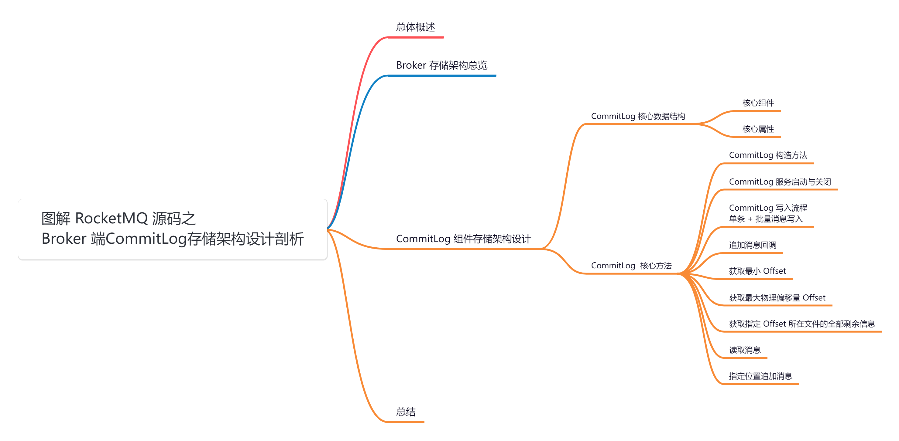

## **01 总体概述**

消息存储是 RocketMQ 整个系统的核心，直接决定着吞吐性能和高可用性。RocketMQ 存储消息并没有借助外部组件，而是「**直接操作文件**」，借助 java NIO 的力量使得 I/O 性能十分高。

当消息来的时候，顺序追加写入 [CommitLog](http://commitlog/) 文件中。为了 [Consumer](http://consumer/) 消费消息的时候能够方便的根据 topic 查询消息，在 [CommitLog](http://commitlog/) 文件的基础上衍生出了 [CosumerQueue](http://cosumerqueue/) 文件用来存放了某 topic 的消息在 [CommitLog](http://commitlog/) 中的偏移位置。此外为了支持根据消息 key 查询消息，还构建了 [indexFile](http://indexfile%20/) 文件。

这三个文件就是 RocketMQ 的主要存储内容，大致结构如下图所示：

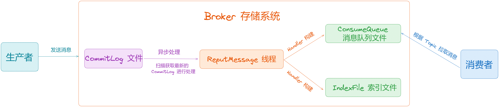

在[【Broker端源码分析系列第十六篇】图解 RocketMQ 源码之 Broker MessageStore 存储架构](https://articles.zsxq.com/id_fon03obc0q26.html) 这篇中，得知 [DefaultMessageStore](http://defaultmessagestore%20/) 最终会调用 [CommitLog](http://commitlog%20/) 存储组件来进行消息存储。

今天我们就先来剖析下底层三大核心存储文件之一：[CommitLog](http://commitlog%20/) 的存储架构设计究竟是怎样的？

## **02 Broker 存储架构总览**

这里先给一张 Broker 模块从收到消息到返回响应业务流转过程的架构图。

（图片来自网络，这张图对于当前版本来说会有些变化，不过大体还是一致的）

## **03 CommitLog 组件存储架构设计**

源码位置：[https://github.com/apache/rocketmq/blob/release-5.1.2/](https://github.com/apache/rocketmq/blob/release-5.1.2/store/src/main/java/org/apache/rocketmq/store/CommitLog.java)[store](https://github.com/apache/rocketmq/blob/release-5.1.2/store/src/main/java/org/apache/rocketmq/store/CommitLog.java)[/src/main/java/org/apache/rocketmq/](https://github.com/apache/rocketmq/blob/release-5.1.2/store/src/main/java/org/apache/rocketmq/store/CommitLog.java)[store](https://github.com/apache/rocketmq/blob/release-5.1.2/store/src/main/java/org/apache/rocketmq/store/CommitLog.java)[/](https://github.com/apache/rocketmq/blob/release-5.1.2/store/src/main/java/org/apache/rocketmq/store/CommitLog.java)[CommitLog](https://github.com/apache/rocketmq/blob/release-5.1.2/store/src/main/java/org/apache/rocketmq/store/CommitLog.java)[.java](https://github.com/apache/rocketmq/blob/release-5.1.2/store/src/main/java/org/apache/rocketmq/store/CommitLog.java)

## **3.1 CommitLog 核心数据结构**

个人觉得 [CommitLog](http://commitlog%20/) 这个名字取得非常好，除了消息本身之外，它还记录了消息的方方面面的信息，通过一条[CommitLog](http://commitlog/) 文件我们可以还原出很多东西。

例如「**消息是何时**」、「**由哪个生产者发送的**」、「**被发送到哪个消息队列**」、「**属于哪个 Topic**」等等。RokcetMQ 存储的消息其实存储的就是这个 [CommitLog](http://commitlog%20/) 记录。

public class CommitLog implements Swappable {

// Message's MAGIC CODE daa320a7

public final static int MESSAGE\_MAGIC\_CODE \= -626843481;

protected static final Logger log \= LoggerFactory.getLogger(LoggerName.STORE\_LOGGER\_NAME);

// End of file empty MAGIC CODE cbd43194

public final static int BLANK\_MAGIC\_CODE \= -875286124;

// MappedFile 队列，用于存储消息

protected final MappedFileQueue mappedFileQueue;

// 默认消息存储对象

protected final DefaultMessageStore defaultMessageStore;

// 刷盘管理器

private final FlushManager flushManager;

// 冷数据检查服务

private final ColdDataCheckService coldDataCheckService;

// 追加消息回调

private final AppendMessageCallback appendMessageCallback;

// 存储写入消息的本地线程

private final ThreadLocal<PutMessageThreadLocal> putMessageThreadLocal;

// 确认偏移量

protected volatile long confirmOffset \= -1L;

// 锁定开始时间

private volatile long beginTimeInLock \= 0;

// 写入消息锁

protected final PutMessageLock putMessageLock;

// 主题队列锁

protected final TopicQueueLock topicQueueLock;

// 完整存储文件路径列表

private volatile Set<String> fullStorePaths = Collections.emptySet();

// 刷盘监视器

private final FlushDiskWatcher flushDiskWatcher;

// 提交日志文件大小

protected int commitLogSize;

.....

}

[CommitLog](http://commitlog%20/) 主要有如下一些组件和属性，大部分的组件都在 [CommitLog](http://commitlog%20/) 构造方法中做了初始化。

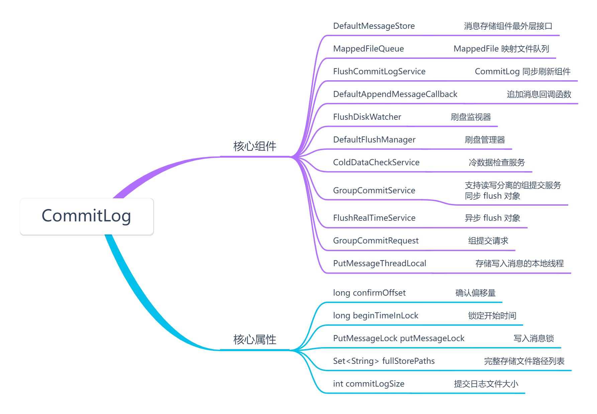

[CommitLog](http://commitlog/) 类属性很多，但是最重要的是 [mappedFileQueue](http://mappedfilequeue/) 属性。消息最终存储在 [CommitLog](http://commitlog/) 文件里，实际上 [CommitLog](http://commitlog/) 是一个「**逻辑概念**」，真正的文件是一个个 [MappedFile](http://mappedfile/)，然后组成了 [mappedFileQueue](http://mappedfilequeue/)。一个[MappedFile](http://mappedfile/) 最多能存放 1G 的 ，这个大小在 [MessageStoreConfig](http://messagestoreconfig/) 类里面定义了的：

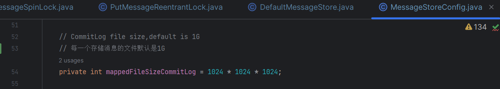

当一个 [MappedFile](http://mappedfile%20/) 写满了之后，就会创建第二个 [MappedFile](http://mappedfile/)，然后继续存 [CommitLog](http://commitlog/)，如下所示：

## **3.2 CommitLog 构造方法**

public CommitLog(final DefaultMessageStore messageStore) {

// CommitLog 存储路径，默认在 ${storePathRootDir}/commitlog

String storePath \= messageStore.getMessageStoreConfig().getStorePathCommitLog();

// 将磁盘中的 CommitLog 构建 MappedFile 内存映射

if (storePath.contains(MixAll.MULTI\_PATH\_SPLITTER)) {

// 多个路径处理

this.mappedFileQueue = new MultiPathMappedFileQueue(messageStore.getMessageStoreConfig(),

// commitlog 文件大小默认为 1GB

messageStore.getMessageStoreConfig().getMappedFileSizeCommitLog(),

messageStore.getAllocateMappedFileService(), this::getFullStorePaths);

} else {

// 单个路径处理

this.mappedFileQueue = new MappedFileQueue(storePath,// /commitlog 目录

// commitlog 文件大小默认为 1GB

messageStore.getMessageStoreConfig().getMappedFileSizeCommitLog(),

messageStore.getAllocateMappedFileService());

}

// 设置消息存储对象

this.defaultMessageStore = messageStore;

// 初始化刷盘管理器

this.flushManager = new DefaultFlushManager();

// 初始化冷数据检查服务

this.coldDataCheckService = new ColdDataCheckService();

// 初始化追加消息回调

this.appendMessageCallback = new DefaultAppendMessageCallback();

// 存储写入消息的本地线程

putMessageThreadLocal = new ThreadLocal<PutMessageThreadLocal>() {

@Override

protected PutMessageThreadLocal initialValue() {

// getMaxMessageSize = 4M

return new PutMessageThreadLocal(defaultMessageStore.getMessageStoreConfig().getMaxMessageSize());

}

};

// 根据配置判断是否使用可重入锁

this.putMessageLock = messageStore.getMessageStoreConfig().isUseReentrantLockWhenPutMessage() ? new PutMessageReentrantLock() : new PutMessageSpinLock();

// 初始化刷盘监视器

this.flushDiskWatcher = new FlushDiskWatcher();

// 初始化主题队列锁

this.topicQueueLock = new TopicQueueLock();

// 初始化提交日志文件大小

this.commitLogSize = messageStore.getMessageStoreConfig().getMappedFileSizeCommitLog();

}

从 [CommitLog](http://commitlog%20/) 的构造方法中可以得知，[Commitlog](http://commitlog%20/) 文件默认存储在 [${storePathRootDir}/commitlog](http://${storepathrootdir}/commitlog) 目录下。在构造方法中，创建了 [Commitlog](http://commitlog%20/) 目录的映射对象 [MappedFileQueue](http://mappedfilequeue/)，然后在 [CommitLog](http://commitlog%20/) 加载的时候就会加载已存在的 [Commitlog](http://commitlog%20/) 文件，映射为 [MappedFile](http://mappedfile%20/) 对象，从上可以看到 [Commitlog](http://commitlog%20/) 文件默认大小固定是 1GB。

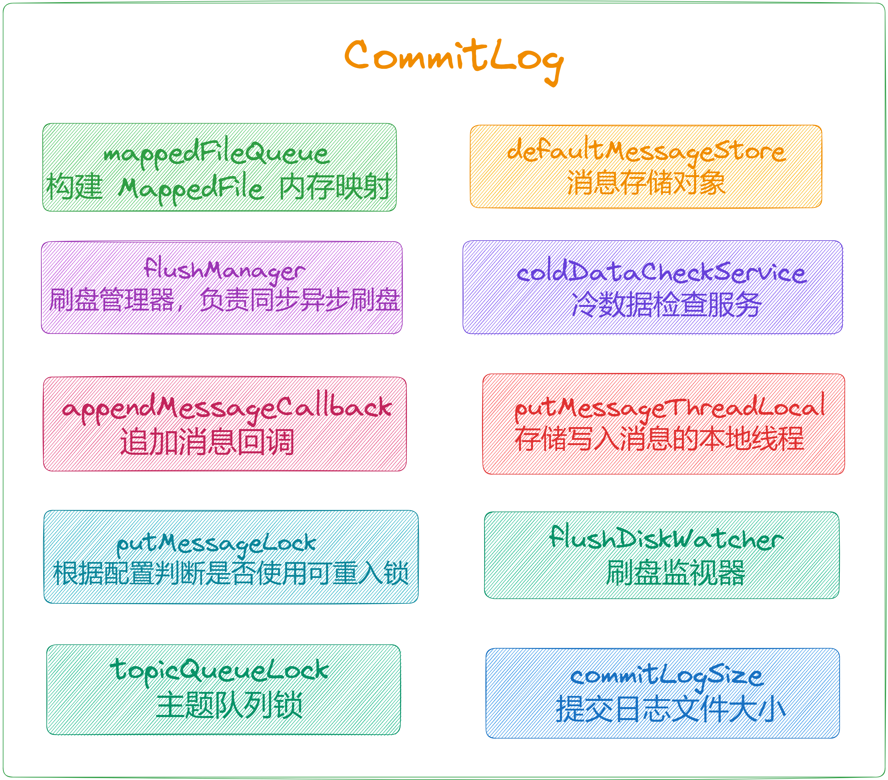

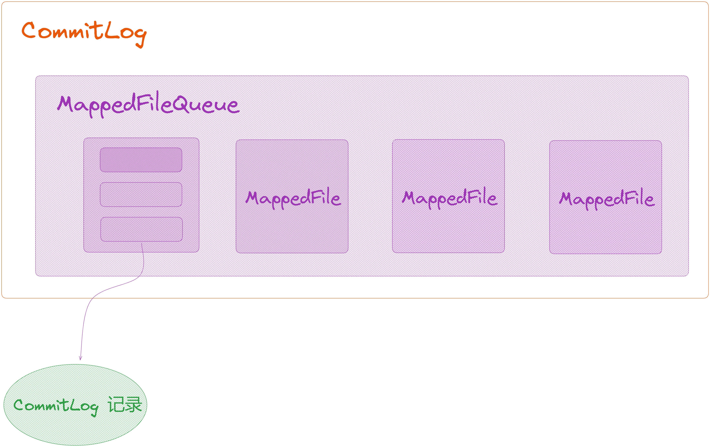

## **3.2 CommitLog 服务启动与关闭**

### **3.2.1 CommitLog 服务启动**

这里主要启动三个组件：

1.  启动刷盘管理器 [flushManager](http://flushmanager/)。
2.  设置刷盘监视器 [flushDiskWatcher](http://flushdiskwatcher%20/) 为守护线程并启动。
3.  检测冷数据检查服务 [coldDataCheckService](http://colddatacheckservice%20/) 是否存在，如果存在并启动。

/\*\*

\* 启动 CommitLog 相关的组件

\*/

public void start() {

// 启动刷盘管理器

this.flushManager.start();

// 记录提交日志启动成功的日志信息，并打印存储根目录路径

log.info("start commitLog successfully. storeRoot: {}", this.defaultMessageStore.getMessageStoreConfig().getStorePathRootDir());

// 将刷盘监视器设置为守护线程，并启动它

flushDiskWatcher.setDaemon(true);

flushDiskWatcher.start();

// 如果存在冷数据检查服务并启动

if (this.coldDataCheckService != null) {

this.coldDataCheckService.start();

}

}

### **3.2.2 CommitLog 服务关闭**

启动时的三个组件，关闭时也需要关闭它们：

1.  关闭刷盘管理器 [flushManager](http://flushmanager/)。
2.  关闭刷盘监视器 [flushDiskWatcher](http://flushdiskwatcher/)。
3.  检测冷数据检查服务 [coldDataCheckService](http://colddatacheckservice/) 是否存在，如果存在并关闭。

/\*\*

\* 关闭 CommitLog 相关的组件

\*/

public void shutdown() {

// 关闭刷盘管理器

this.flushManager.shutdown();

// 记录提交日志关闭成功的日志信息，并打印存储根目录路径

log.info("shutdown commitLog successfully. storeRoot: {}", this.defaultMessageStore.getMessageStoreConfig().getStorePathRootDir());

// 关闭刷盘监视器

flushDiskWatcher.shutdown(true);

// 如果存在冷数据检查服务并关闭

if (this.coldDataCheckService != null) {

this.coldDataCheckService.shutdown();

}

}

## **3.3 加载 CommitLog 文件**

/\*\*

\* CommitLog 加载文件的方法

\* CommitLog#load 方法实际上是委托内部的mappedFileQueue的load方法进行加载。

\* @return

\*/

public boolean load() {

// 1、调用 mappedFileQueue#load 方法加载

boolean result \= this.mappedFileQueue.load();

if (result && !defaultMessageStore.getMessageStoreConfig().isDataReadAheadEnable()) {

// 2、设置读模式为随机读

scanFileAndSetReadMode(LibC.MADV\_RANDOM);

}

// 3、加载完成后确保提交日志文件的完整性和一致性

this.mappedFileQueue.checkSelf();

log.info("load commit log " + (result ? "OK" : "Failed"));

return result;

}

加载文件操作步骤如下：

1.  首先调用 [mappedFileQueue#load](http://mappedfilequeue/#load) 方法加载。
2.  如果加载成功 && 未启用文件预读特性，则设置读模式为随机读。
3.  加载完成后确保提交日志文件的完整性和一致性。

我们分别来看下这三步。

### **3.3.1 加载 mappedFileQueue**

源码位置：[https://github.com/apache/rocketmq/blob/release-5.1.2/store/src/main/java/org/apache/rocketmq/store/](https://github.com/apache/rocketmq/blob/release-5.1.2/store/src/main/java/org/apache/rocketmq/store/MappedFileQueue.java)[MappedFileQueue](https://github.com/apache/rocketmq/blob/release-5.1.2/store/src/main/java/org/apache/rocketmq/store/MappedFileQueue.java)[.java](https://github.com/apache/rocketmq/blob/release-5.1.2/store/src/main/java/org/apache/rocketmq/store/MappedFileQueue.java)

public boolean load() {

// 1、获取 CommitLog 文件的存放目录

File dir \= new File(this.storePath);

/\*\*

\* 2、获取内部的文件集合

\* listFiles 方法的作用:

\* 如果 file 是个文件，则返回的是null

\* 如果 file 是空日录，返回的是空数组

\* 如果 file 不是空目录，则返回的是该目录下的文件和自录

\*/

File\[\] ls = dir.listFiles();

if (ls != null) {

// 3、如果存在 CommitLog 文件，那么进行加载

return doLoad(Arrays.asList(ls)); // Arrays.asList(ls):将 Files\[\] 数组转化为 \]ist 集合

}

return true;

}

public boolean doLoad(List<File> files) {

// ascending order

// 1、对 CommitLog 文件按照文件名升序排序

files.sort(Comparator.comparing(File::getName));

// 2、遍历文件列表

for (File file : files) {

if (file.isDirectory()) {

continue;

}

// 3、校验文件实际大小是否等于预定的文件大小，如果不相等则直接返回 fa1se，不再加载其他文件

if (file.length() != this.mappedFileSize) {

log.warn(file + "\\t" + file.length()

\+ " length not matched message store config value, please check it manually");

return false;

}

try {

/\*\*

\* 4、核心逻辑：实例化 MappedFile 对象， 通过 DefaultMappedFile 类生成

\* 每一个 CommitLog 文件都创建一个对应的 MappedFile 对象

\* 在物理上，CommitLog 日录下面是一个个的 CommitLog 文件，但是在 \]ava 中进行了三层映射: CommitLog -> MappedFileQueue -> MappedFile

\* CommitLog 中包含 MappedFileQueue，以及 CommitLog 相关的其他服务，例如:刷盘服务: MappedFileQueue 中包含 MappedFile 集合，以及单个 CommitLog 文件大小等属性

\* 而 MappedFile 才是真正的一个 CommitLog 文件在 Java 中的映射，包含文件名、大小、mmap 对象 mappedByteBuffer 等属性

\* 实际上 MappedFileQueue 和 MappedFile 都是通用类 CommitLog、ConsumeQueue、IndexFile 文件都会使用到。

\*/

MappedFile mappedFile \= new DefaultMappedFile(file.getPath(), mappedFileSize);

// 将 wrotePosition、flushedPosition、commitPosition 默认设置为文件大小

// 5、当前文件所映射到的消息写入 page cache 的位置

mappedFile.setWrotePosition(this.mappedFileSize);

// 6、刷盘的最新位置

mappedFile.setFlushedPosition(this.mappedFileSize);

// 7、已提交的最新位置

mappedFile.setCommittedPosition(this.mappedFileSize);

// 8、添加到 MappedFileQueue 内部的 mappedFiles 集合中

this.mappedFiles.add(mappedFile);

log.info("load " + file.getPath() + " OK");

} catch (IOException e) {

log.error("load file " + file + " error", e);

return false;

}

}

return true;

}

看到这里会对 [MappedFile](http://mappedfile/) 与 [MappedFileQueue](http://mappedfilequeue/) 进行操作，关于 [MappedFile](http://mappedfile%20/) 与 [MappedFileQueue](http://mappedfilequeue/) 会在下篇单独剖析，这里知道有这两个组件概念即可。

[MappedFileQueue](http://mappedfilequeue%20/) 是对「**数据存储文件**」的抽象，将多个「**数据文件**」抽象成为一个「**文件队列**」，通过这个「**文件队列**」对文件进行操作同时会保存一些 [CommitLog](http://commitlog%20/) 的属性。

  
[MappedFile](http://mappedfile%20/) 是对「**文件**」的抽象，包含了对 [RocketMQ](http://rocketmq/) 数据文件的整个操作，它是真正的一个 [CommitLog](http://commitlog%20/) 文件在 Java 中的映射。例如「**获取文件名称**」、「**文件大小**」、「**判断文件是否可用**」、「**判断文件是否已经满了**」等操作。

### **3.3.2 设置随机读**

如果当前未启用「**文件预读特性**」，则设置「**读模式**」为「**随机读**」。

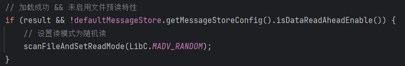

/\*\*

\* 扫描 MappedFile 文件并设置文件的读模式，

\* @param mode

\*/

public void scanFileAndSetReadMode(int mode) {

// 如果运行在 Windows 系统上，停止扫描文件并设置读模式

if (MixAll.isWindows()) {

log.info("windows os stop scanFileAndSetReadMode");

return;

}

try {

// 记录设置读模式的操作模式

log.info("scanFileAndSetReadMode mode:{}",mode);

// 遍历 mappedFileQueue 中的每一个 MappedFile 并设置读模式

mappedFileQueue.getMappedFiles().forEach(mappedFile -> {

setFileReadMode(mappedFile,mode);

});

} catch (Exception e) {

// 记录异常日志

log.error("scanFileAndSetReadMode exception",e);

}

}

/\*\*

\* 设置文件的读模式

\* @param mappedFile

\* @param mode

\* @return

\*/

private int setFileReadMode(MappedFile mappedFile,int mode) {

// 如果 mappedFile 为空，记录错误日志

if (null == mappedFile) {

log.error("setFileReadMode mappedFile is null");

return -1;

}

// 获取 mappedByteBuffer 的 DirectBuffer 地址

final long address \= ((DirectBuffer)mappedFile.getMappedByteBuffer()).address();

// 调用系统函数设置文件的读模式

int madvise \= LibC.INSTANCE.madvise(new Pointer(address),new NativeLong(mappedFile.getFileSize()),mode);

if (madvise != 0) {

// 如果设置失败，记录错误日志

log.error("setFileReadMode error fileName:{},madvise:{},mode:{}",mappedFile.getFileName(),madvise,mode);

}

// 返回设置结果

return madvise;

}

可以看到这里只有 [Linux](http://linux%20/) 系统才支持，然后遍历 [mappedFileQueue](http://mappedfilequeue%20/) 下的每一个 [mappedFile](http://mappedfile%20/) 调用系统函数进行设置「**读模式**」为「**随机读**」。

###   
**3.3.3 确保提交日志完整性和一致性**

源码位置：[https://github.com/apache/rocketmq/blob/release-5.1.2/store/src/main/java/org/apache/rocketmq/store/](https://github.com/apache/rocketmq/blob/release-5.1.2/store/src/main/java/org/apache/rocketmq/store/MappedFileQueue.java)[MappedFileQueue](https://github.com/apache/rocketmq/blob/release-5.1.2/store/src/main/java/org/apache/rocketmq/store/MappedFileQueue.java)[.java](https://github.com/apache/rocketmq/blob/release-5.1.2/store/src/main/java/org/apache/rocketmq/store/MappedFileQueue.java)

/\*\*

\* 确保提交日志文件的完整性和一致性

\*/

public void checkSelf() {

// 复制当前的 mappedFiles，以确保在迭代过程中不被修改

List<MappedFile> mappedFiles = new ArrayList<>(this.mappedFiles);

// 检查是否存在 mappedFiles

if (!mappedFiles.isEmpty()) {

// 迭代 mappedFiles

Iterator<MappedFile> iterator = mappedFiles.iterator();

MappedFile pre \= null;

while (iterator.hasNext()) {

MappedFile cur \= iterator.next();

// 检查当前文件与上一个文件的偏移量是否连续

if (pre != null) {

if (cur.getFileFromOffset() - pre.getFileFromOffset() != this.mappedFileSize) {

// 如果发现偏移量不连续，记录错误日志

LOG\_ERROR.error("\[BUG\]The mappedFile queue's data is damaged, the adjacent mappedFile's offset don't match. pre file {}, cur file {}",

pre.getFileName(), cur.getFileName());

}

}

// 更新上一个文件为当前文件

pre = cur;

}

}

}

1.  先复制当前的 [mappedFiles](http://mappedfiles/)，以确保在迭代过程中不被修改。
2.  迭代 [mappedFiles](http://mappedfiles%20/) 并检查当前文件与上一个文件的偏移量是否连续。
3.  判断逻辑为：当前文件的起始偏移量与上一个文件的起始偏移量之差是否等于 mappedFile 文件大小 1G。
4.  如果发现偏移量不连续，记录错误日志。
5.  最后更新上一个文件为当前文件。

这里的 [fileFromOffset](http://filefromoffset%20/) 可以是一个 [mappedfile](http://mappedfile%20/) 文件的磁盘上起始的写入位置，因为每个 [CommitLog](http://commitlog%20/) 文件都是固定大小 1G，所以根据 [fileFromOffset](http://filefromoffset%20/) +[mappedFileSize](http://mappedfilesize%20/) 计算出新文件的磁盘起始写入位置，[mappedFileSize](http://mappedfilesize%20/) 是文件的配置文件大小 1G，在 [CommitLog](http://commitlog%20/) 构造函数初始化 [MappedFileQueue](http://mappedfilequeue%20/) 时传递进来的。

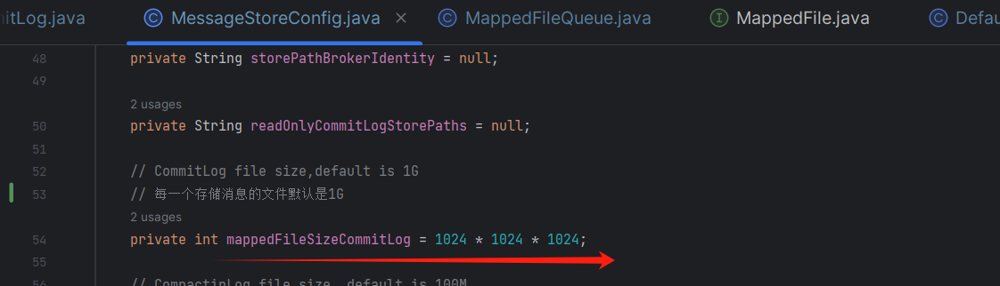

  
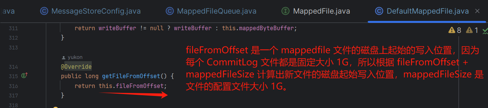

## **3.4 CommitLog 写入流程**

这里分别来看下 「**单条消息**」和 「**批量消息**」写入流程。

###   
**3.4.1 CommitLog 单条消息写入流程**

/\*\*

\* 异步存储单条消息

\* @param msg

\* @return

\*/

public CompletableFuture<PutMessageResult> asyncPutMessage(final MessageExtBrokerInner msg) {

// 如果重复消息检测功能关闭，则设置存储时间戳

if (!defaultMessageStore.getMessageStoreConfig().isDuplicationEnable()) {

msg.setStoreTimestamp(System.currentTimeMillis());

}

// 设置消息体CRC（客户端端最合适的设置）

msg.setBodyCRC(UtilAll.crc32(msg.getBody()));

// 返回结果

AppendMessageResult result \= null;

// 获取存储统计服务

StoreStatsService storeStatsService \= this.defaultMessageStore.getStoreStatsService();

// 获取主题

String topic \= msg.getTopic();

// 设置消息版本号

msg.setVersion(MessageVersion.MESSAGE\_VERSION\_V1);

// 对比 topic 长度，设置不同版本号

boolean autoMessageVersionOnTopicLen \=

this.defaultMessageStore.getMessageStoreConfig().isAutoMessageVersionOnTopicLen();

if (autoMessageVersionOnTopicLen && topic.length() > Byte.MAX\_VALUE) {

// 如果超限，设置消息新版本号

msg.setVersion(MessageVersion.MESSAGE\_VERSION\_V2);

}

// 消息诞生机器 IPv6 地址标识（发送消息）

InetSocketAddress bornSocketAddress \= (InetSocketAddress) msg.getBornHost();

if (bornSocketAddress.getAddress() instanceof Inet6Address) {

msg.setBornHostV6Flag();

}

// 消息存储机器 IPv6 地址标识（存储消息）

InetSocketAddress storeSocketAddress \= (InetSocketAddress) msg.getStoreHost();

if (storeSocketAddress.getAddress() instanceof Inet6Address) {

msg.setStoreHostAddressV6Flag();

}

/\*\*

\* 消息编码

\*/

// 获取线程本地变量，其内部包含一个线程独立的消息编码器 encoder 和 keyBuilder 对象

// MessageExtEncoder 类型的成员变量，调用它的 encode 方法可以对消息进行编码，将数据先写入内存 buffer，然后调用 MessageExtBrokerInner 的 setEncodedBuff 方法将 buffer 设置到 encodedBuff 中

PutMessageThreadLocal putMessageThreadLocal \= this.putMessageThreadLocal.get();

//更新最大的消息大小

updateMaxMessageSize(putMessageThreadLocal);

// 生成 topicQueueKey

String topicQueueKey \= generateKey(putMessageThreadLocal.getKeyBuilder(),msg);

long elapsedTimeInLock \= 0;

MappedFile unlockMappedFile \= null;

// 核心方法：从 mappedFileQueue 中的 mappedFiles 集合中获取最后一个 MappedFile 即获取最新 MappedFile

MappedFile mappedFile \= this.mappedFileQueue.getLastMappedFile();

// 计算当前 offset

long currOffset;

if (mappedFile == null) {

currOffset = 0;

} else {

// 起始 Offset + 写入 FileChannel 但未落盘时 Offset

// wrotePosition 表示写入 FileChannel 的数据，这些数据可能还存在内存中不应落盘。每次增加日志wrotePosition就会往后移动

currOffset = mappedFile.getFileFromOffset() + mappedFile.getWrotePosition();

}

// 需要 Ack 的节点数量，检查副本数是否足够

int needAckNums \= this.defaultMessageStore.getMessageStoreConfig().getInSyncReplicas();

// 根据需要处理 HA

boolean needHandleHA \= needHandleHA(msg);

// 如果需要处理 HA 并且启用了控制器模式

if (needHandleHA && this.defaultMessageStore.getBrokerConfig().isEnableControllerMode()) {

if (this.defaultMessageStore.getHaService().inSyncReplicasNums(currOffset) < this.defaultMessageStore.getMessageStoreConfig().getMinInSyncReplicas()) {

// 如果当前偏移量所在的同步副本数小于最小同步副本数

return CompletableFuture.completedFuture(new PutMessageResult(PutMessageStatus.IN\_SYNC\_REPLICAS\_NOT\_ENOUGH,null));

}

if (this.defaultMessageStore.getMessageStoreConfig().isAllAckInSyncStateSet()) {

// 如果所有确认都在同步状态集中

// -1 表示所有确认都在同步状态集中

needAckNums = MixAll.ALL\_ACK\_IN\_SYNC\_STATE\_SET;

}

}

// 如果需要处理HA并且启用了从节点充当主节点的 SlaveActingMaster 模式

else if (needHandleHA && this.defaultMessageStore.getBrokerConfig().isEnableSlaveActingMaster()) {

// 计算当前的同步副本数

int inSyncReplicas \= Math.min(this.defaultMessageStore.getAliveReplicaNumInGroup(),

this.defaultMessageStore.getHaService().inSyncReplicasNums(currOffset));

// 计算需要确认的 Ack 数

needAckNums = calcNeedAckNums(inSyncReplicas);

// 如果需要的确认的 Ack 数大于同步副本数

if (needAckNums > inSyncReplicas) {

// 直接超限结束 告知生产者，没有足够的从节点处理发送请求

return CompletableFuture.completedFuture(new PutMessageResult(PutMessageStatus.IN\_SYNC\_REPLICAS\_NOT\_ENOUGH,null));

}

}

// 加锁，尝试写入消息

topicQueueLock.lock(topicQueueKey);

try {

// 判断是否需要指定 offset，根据配置是否启用重复检测 && 当前节点非 SLAVE 角色，如果满足，则不需要指定 offset

boolean needAssignOffset \= true;

if (defaultMessageStore.getMessageStoreConfig().isDuplicationEnable()

&& defaultMessageStore.getMessageStoreConfig().getBrokerRole() != BrokerRole.SLAVE) {

needAssignOffset = false;

}

if (needAssignOffset) {

// 需要的话，则指定 offset

defaultMessageStore.assignOffset(msg);

}

// 将消息编码

// 存储到 encoder 内部的 encoderBuffer 中，它是通过 ByteBuffer.allocateDirect(size) 得到的一个直接缓冲区

// 将消息写入之后，会调用 encoderBuffer.flip() 方法，将 Buffer 从写模式切换到读模式，可以读取到数据

PutMessageResult encodeResult \= putMessageThreadLocal.getEncoder().encode(msg);

if (encodeResult != null) {

return CompletableFuture.completedFuture(encodeResult);

}

// 将存储编码消息的 buffer 设置到 msg中

msg.setEncodedBuff(putMessageThreadLocal.getEncoder().getEncoderBuffer());

// 创建保存消息上下文

PutMessageContext putMessageContext \= new PutMessageContext(topicQueueKey);

// 获取锁，写入消息

/\*\*

\* 有两种锁，一种是 ReentrantLock 可重入锁，另一种 spin 即 CAS 锁

\* 根据 StoreConfig 的 useReentrantLockWhenPutMessage 决定是否使用可重入锁，默认为 true，使用可重入锁。

\*/

putMessageLock.lock();

try {

// 加锁后的起始时间

long beginLockTimestamp \= this.defaultMessageStore.getSystemClock().now();

this.beginTimeInLock = beginLockTimestamp;

// 如果重复消息检测未开启，设置存储时间戳

if (!defaultMessageStore.getMessageStoreConfig().isDuplicationEnable()) {

// 设置存储的时间戳为加锁后的起始时间，保证有序

msg.setStoreTimestamp(beginLockTimestamp);

}

/\*\*

\* 如果最新的 mappedFile 为 null，或者 mappedFile 满了，那么会新建 mappedFile 并返回

\*/

if (null == mappedFile || mappedFile.isFull()) {

// 尝试创建一个新的 mappedFile

mappedFile = this.mappedFileQueue.getLastMappedFile(0);

// 是否关闭预读特性

if (isCloseReadAhead()) {

// 设置读模式为随机读

setFileReadMode(mappedFile,LibC.MADV\_RANDOM);

}

}

// 如果还是为空，则直接返回创建失败异常

if (null == mappedFile) {

log.error("create mapped file1 error,topic:" + msg.getTopic() + " clientAddr:" + msg.getBornHostString());

beginTimeInLock = 0;

return CompletableFuture.completedFuture(new PutMessageResult(PutMessageStatus.CREATE\_MAPPED\_FILE\_FAILED,null));

}

// 追加消息到 mappedFile 中

result = mappedFile.appendMessage(msg,this.appendMessageCallback,putMessageContext);

switch (result.getStatus()) {

case PUT\_OK: // 写入成功

onCommitLogAppend(msg,result,mappedFile);

break;

case END\_OF\_FILE: // 超过文件大小

// 文件剩余空间不足，那么初始化新的文件并尝试再次存储

onCommitLogAppend(msg,result,mappedFile);

unlockMappedFile = mappedFile;

// 创建一个新文件，重新写入消息

mappedFile = this.mappedFileQueue.getLastMappedFile(0);

if (null == mappedFile) {

log.error("create mapped file2 error,topic:" + msg.getTopic() + " clientAddr:" + msg.getBornHostString());

beginTimeInLock = 0;

return CompletableFuture.completedFuture(new PutMessageResult(PutMessageStatus.CREATE\_MAPPED\_FILE\_FAILED,result));

}

// 是否关闭预读特性

if (isCloseReadAhead()) {

// 设置读模式为随机读

setFileReadMode(mappedFile,LibC.MADV\_RANDOM);

}

// 追加消息到 mappedFile 中

result = mappedFile.appendMessage(msg,this.appendMessageCallback,putMessageContext);

// 如果写入成功

if (AppendMessageStatus.PUT\_OK.equals(result.getStatus())) {

onCommitLogAppend(msg,result,mappedFile);

}

break;

case MESSAGE\_SIZE\_EXCEEDED: // 消息长度超过最大允许长度

case PROPERTIES\_SIZE\_EXCEEDED: // 消息、属性超过最大允许长度

//重置开始时间

beginTimeInLock = 0;

// 返回消息异常

return CompletableFuture.completedFuture(new PutMessageResult(PutMessageStatus.MESSAGE\_ILLEGAL,result));

case UNKNOWN\_ERROR: // 未知异常

//重置开始时间

beginTimeInLock = 0;

// 返回消息未知错误

return CompletableFuture.completedFuture(new PutMessageResult(PutMessageStatus.UNKNOWN\_ERROR,result));

default:

//重置开始时间

beginTimeInLock = 0;

// 返回消息未知错误

return CompletableFuture.completedFuture(new PutMessageResult(PutMessageStatus.UNKNOWN\_ERROR,result));

}

// 计算锁内耗时

elapsedTimeInLock = this.defaultMessageStore.getSystemClock().now() - beginLockTimestamp;

beginTimeInLock = 0;

} finally {

// 释放锁

putMessageLock.unlock();

}

// 在成功写入消息时增加队列偏移量

if (AppendMessageStatus.PUT\_OK.equals(result.getStatus())) {

this.defaultMessageStore.increaseOffset(msg,getMessageNum(msg));

}

} finally {

// 释放锁

topicQueueLock.unlock(topicQueueKey);

}

if (elapsedTimeInLock > 500) {

log.warn("\[NOTIFYME\]putMessage in lock cost time(ms)={},bodyLength={} AppendMessageResult={}",elapsedTimeInLock,msg.getBody().length,result);

}

// 如果存在写满的 MappedFile 并且启用了文件内存预热，那么解锁 MappedFile，并且使能热加载 MappedFile

if (null != unlockMappedFile && this.defaultMessageStore.getMessageStoreConfig().isWarmMapedFileEnable()) {

this.defaultMessageStore.unlockMappedFile(unlockMappedFile);

}

// 创建 PutMessageResult 对象并进行统计

PutMessageResult putMessageResult \= new PutMessageResult(PutMessageStatus.PUT\_OK,result);

// 存储数据的统计信息更新

storeStatsService.getSinglePutMessageTopicTimesTotal(msg.getTopic()).add(result.getMsgNum());

storeStatsService.getSinglePutMessageTopicSizeTotal(topic).add(result.getWroteBytes());

//后续的处理：提交刷盘请求，提交副本请求

return handleDiskFlushAndHA(putMessageResult,msg,needAckNums,needHandleHA);

}

该方法中将会对消息进行「**真正存储**」，即「**持久化操作**」，步骤比较繁琐，作为 RocketMQ 源码中精髓部分，还是值得一看的，其大概操作步骤如下：

1.  设置存储时间戳、设置消息体CRC、设置消息版本号、对比 topic 长度，设置不同版本号、设置发送消息和存储消息地址列表。
2.  对消息进行编码操作。
3.  获取线程本地变量，其内部包含一个线程独立的 [encode](http://encode%20/) 和 [keyBuilder](http://keybuilder%20/) 对象。将消息内容编码，存储到[encoder](http://encoder%20/) 内部的 [encoderBuffer](http://encoderbuffer/) 中，它是通过 [ByteBuffer.allocateDirect(size)](http://bytebuffer.allocatedirect\(size\)/) 得到的一个直接缓冲区。消息写入之后，会调用 [encoderBuffer.flip()](http://encoderbuffer.flip\(\)/) 方法，将 Buffer 从写模式切换到读模式，可以读取到数据。
4.  加锁并写入消息，这里会加两层锁。
5.  一个 Broker 将所有的消息都追加到同一个逻辑 [CommiLlog](http://commillog/) 日志文件中，因此需要通过获取[putMessageLock](http://putmessagelock/) 锁来控制并发。有两种锁，一种是 [ReentranLock](http://reentranlock/) 可重入锁，另一种 [spin](http://spin%20/) 即 [CAS](http://cas%20/) 锁。根据 [StoreConfig](http://storeconfig/) 的 [useReentrantLockWhenPutMessage](http://usereentrantlockwhenputmessage/) 决定是否使用可重入锁，默认为 true，使用可重入锁。
6.  从 [mappedFileQueue](http://mappedfilequeue/) 中的 [mappedFiles](http://mappedfiles/) 集合中获取最后一个 [MappedFile](http://mappedfile/)。如果最新的 [mappedFile](http://mappedfile/) 为null，或者 [mappedFile](http://mappedfile/) 满了，那么会新建 [mappedFile](http://mappedfile/)。
7.  通过 [mappedFile](http://mappedfile/) 调用 [appendMessage](http://appendmessage/) 方法追加消息，这里仅仅是追加到 [byteBuffer](http://bytebuffer/) 的内存中，如果是[writeBuffer](http://writebuffer/) 则表示消息写入了「**堆外内存**」中，如果是 [mappedByteBuffer](http://mappedbytebuffer/)，则表示消息写入了「**PageCache**」中。总之都是先存储在内存中。
8.  如果是剩余空间不足，则会重新初始化一个 [MappedFile](http://mappedfile/) 并再次尝试追加，如果追加成功之后解锁。
9.  如果存在写满的 [MappedFile](http://mappedfile/) 并且启用了文件内存预热，那么这里调用 [unlockMappedFile](http://unlockmappedfile/) 对 [MappedFile](http://mappedfile/)执行解锁。
10.  最后更新消息统计信息，接着提交刷盘请求，将会根据刷盘策略进行刷盘，再提交副本请求，用来主从同步。  
    

为了更好理解，我这里通过一张图来梳理下整个写入过程，这里会包括前面几篇入口的过程。

简单可以分为三大块：

1.  写入前准备。
2.  加锁后消息写入。
3.  消息数据落盘及集群同步。

###   
**3.4.1.1 写入前准备**

其实消息的写入准备工作也比较好理解，主要是「**各类消息存储状态检查**」、「**内部批处理检查**」、「**定时/延时消息处理**」，可以参看上图中的流程。

根据上图，在准备阶段前，RocketMQ 会判断操作系统的 [PageCache](http://pagecache%20/) 是否繁忙，它是怎么做到的呢？

其实 [Java](http://java%20/) 本身没有提供接口或函数来查看 [PageCache](http://pagecache%20/) 的状态，但如果「**磁盘带宽已经打满**」，在[PageCache](http://pagecache/)要将数据「**刷到磁盘**」时，很有可能陷入了阻塞，导致 [PageCache](http://pagecache/) 资源紧张。而当有新的消息要写入 [PageCache](http://pagecache/) 时，反向阻塞写入请求，此时 [PageCache](http://pagecache/) 就相当繁忙，请求已经不能及时处理了。

RocketMQ 中判断 [PageCache](http://pagecache/) 是否繁忙的条件也很简单，就是监控某个请求加锁后，写入是否超过1秒，如果超时的话，新的请求会快速失败。

### **3.4.1.2 消息协议**

在 RocketMQ 有一套相对复杂的消息协议编码，大部分协议中的内容都是在加锁前拼接生成。

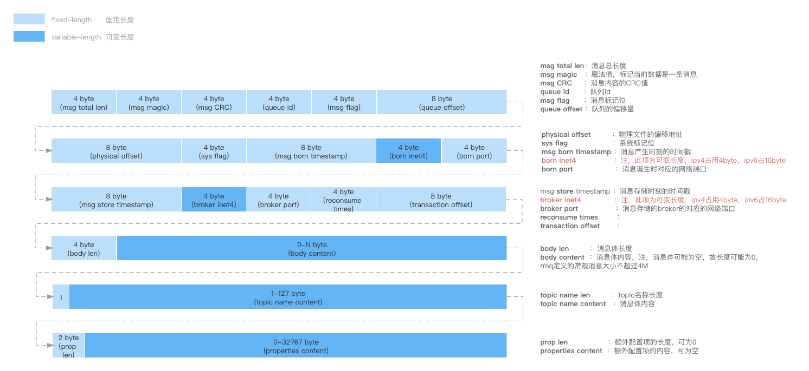

（图片来自网络）

大部分消息协议项都是「**定长字段**」，而「**变长字段**」如下：

1.  [born inet](http://born%20inet/) ：产生消息的 Producer 的 IP 信息，其中 ipv4 占用 4byte，ipv6 占 16byte。
2.  [broker inet](http://broker%20inet%20/) ：接收消息的 Broker 的 IP 信息，其中 ipv4 占用 4byte，ipv6 占 16byte。
3.  [msg content](http://msg%20content/)：消息内容 变长字段（1-21亿）byte。
4.  [topic content](http://topic%20content/) ：消息内容 变长字段（1-127）byte。
5.  [properties content](http://properties%20content/) ：属性内容 变长字段（0-32767）byte。

### **3.4.1.3 写入 buffer**

源码位置：[https://github.com/apache/rocketmq/blob/release-5.1.2/](https://github.com/apache/rocketmq/blob/release-5.1.2/store/src/main/java/org/apache/rocketmq/store/MessageExtEncoder.java)[store](https://github.com/apache/rocketmq/blob/release-5.1.2/store/src/main/java/org/apache/rocketmq/store/MessageExtEncoder.java)[/src/main/java/org/apache/rocketmq/](https://github.com/apache/rocketmq/blob/release-5.1.2/store/src/main/java/org/apache/rocketmq/store/MessageExtEncoder.java)[store](https://github.com/apache/rocketmq/blob/release-5.1.2/store/src/main/java/org/apache/rocketmq/store/MessageExtEncoder.java)[/](https://github.com/apache/rocketmq/blob/release-5.1.2/store/src/main/java/org/apache/rocketmq/store/MessageExtEncoder.java)[MessageExtEncoder](https://github.com/apache/rocketmq/blob/release-5.1.2/store/src/main/java/org/apache/rocketmq/store/MessageExtEncoder.java)[.java](https://github.com/apache/rocketmq/blob/release-5.1.2/store/src/main/java/org/apache/rocketmq/store/MessageExtEncoder.java)

[MessageExtEncoder](http://messageextencoder%20/) 是消息的编码器，它被另外一个线程类[PutMessageThreadLocal](http://putmessagethreadlocal/)所引用，[ThreadLocal](http://threadlocal%20/) 一般用于多线程环境下，为每个线程创建自己的副本变量，从而互不影响，[PutMessageThreadLocal](http://putmessagethreadlocal/) 在构造函数中对[MessageExtEncoder](http://messageextencoder/) 进行了实例化，并指定了创建缓冲区的大小：

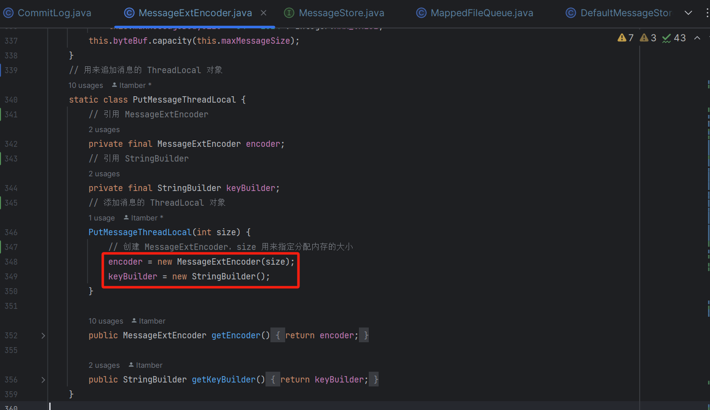

[MessageExtEncoder](http://messageextencoder/) 中使用了 [ByteBuf](http://bytebuf/) 作为消息内容存放的缓冲区，上面可知缓冲区的大小是在[PutMessageThreadLocal](http://putmessagethreadlocal/) 的构造函数中指定的，[MessageExtEncoder](http://messageextencoder/) 的 [encode](http://encode/) 方法中对消息进了编码并将数据写入分配的缓冲区。

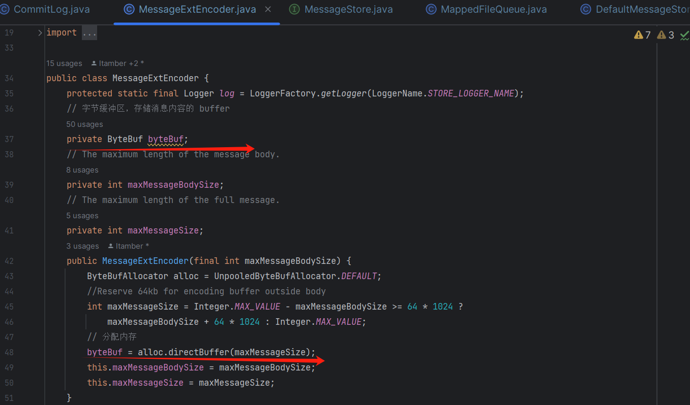

关于 encode 编码过程可以查看：[【Broker端源码分析系列第十八篇】图解 RocketMQ 源码之 Broker 端三大底层存储文件剖析](https://articles.zsxq.com/id_nwm33ku2srs5.html)

### **3.4.1.3 加锁**

这里有两层锁：

1.  外层锁为 [topicQueueLock](http://topicqueuelock/)，它是对 [topicQueueKey](http://topicqueuekey%20/) 进行加锁的。
2.  内层锁为 [putMessageLock](http://putmessagelock/)，它是写入文件锁。

针对内层锁，这里的写文件锁有两种实现方式，如下：

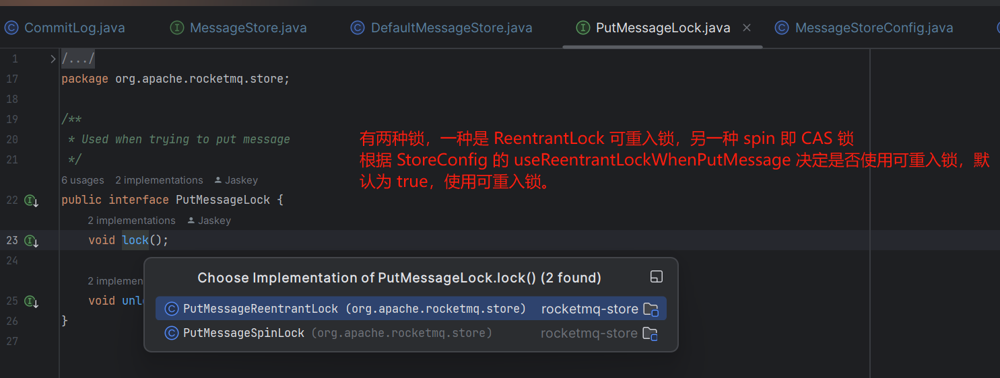

1.  基于 [AQS](http://aqs%20/) 的 [ReentrantLock](http://reentrantlock%20/) （默认方式）。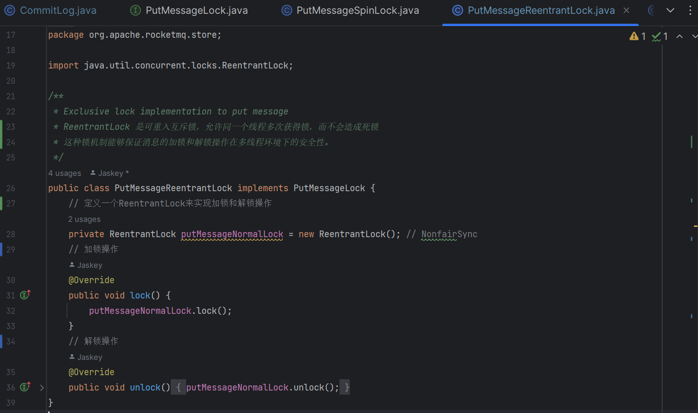
2.  基于 [CAS](http://cas/) 的自旋锁，加锁不成功的话，会无限重试。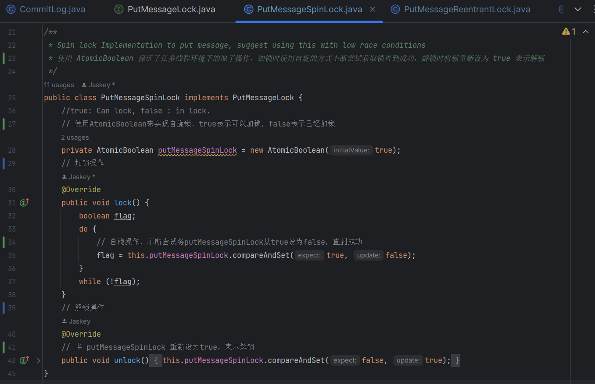

无论采用哪种策略，都是「**独占锁**」，即同一时刻只允许一个线程加锁成功。

具体采用哪种方式，可通过配置修改。

两种加锁适用不同的场景：

1.  第一种加锁方式在「**高并发场景**」下，能保持平稳的系统性能，但在「**低并发场景**」下表现一般。
2.  第一种加锁方式正好相反，在「**高并发场景**」下，因为采用自旋，会浪费大量的 cpu，但在「**低并发场景**」时，却可以获得很高的性能。

所以官方文档中，为了「**提高性能**」，建议用户在「**同步刷盘**」时采用「**独占锁**」，「**异步刷盘**」的时候采用「**自旋锁**」，这个是根据「**加锁时间长短**」决定的。

### **3.4.1.5 锁内操作**

上面提到，写入消息的锁是「**独占锁**」，也就意味着同一时刻只能有一个线程进入，我们来看一下锁内都做了哪些操作：

1.  拿到或创建文件操作对象 MappedFile，会在下篇中单独剖析。
2.  二次整理要落盘的消息格式。
3.  之前已经整理过消息协议了，为什么此处还要进行二次整理？
4.  因为之前一些消息协议在没有加锁的时候还无法确定。主要是以下三项内容：
5.  [queueOffset](http://queueoffset%20/) 队列偏移量，此值需要最终返回，且需要保证严格递增，所以需要在锁内进行
6.  [physicalOffset](http://physicaloffset%20/) 物理偏移量，也就是全局文件的位置，注：此位置是全局文件的偏移量，不是当前文件的偏移量，所以其值可能会大于1G
7.  [storeTimestamp](http://storetimestamp%20/) 存储时间戳，此处在锁内进行，主要是为了保证消息投递的时间严格保序
8.  记录当前文件写入情况：比如已写入字节数、存储时间等。

接着我们来看下该方法中的重要步骤。

### **3.4.1.6 获取最新的 mappedFile / 创建 mappedFile**

源码位置：[https://github.com/apache/rocketmq/blob/release-5.1.2/](https://github.com/apache/rocketmq/blob/release-5.1.2/store/src/main/java/org/apache/rocketmq/store/MappedFileQueue.java)[store](https://github.com/apache/rocketmq/blob/release-5.1.2/store/src/main/java/org/apache/rocketmq/store/MappedFileQueue.java)[/src/main/java/org/apache/rocketmq/](https://github.com/apache/rocketmq/blob/release-5.1.2/store/src/main/java/org/apache/rocketmq/store/MappedFileQueue.java)[store](https://github.com/apache/rocketmq/blob/release-5.1.2/store/src/main/java/org/apache/rocketmq/store/MappedFileQueue.java)[/](https://github.com/apache/rocketmq/blob/release-5.1.2/store/src/main/java/org/apache/rocketmq/store/MappedFileQueue.java)[MappedFileQueue](https://github.com/apache/rocketmq/blob/release-5.1.2/store/src/main/java/org/apache/rocketmq/store/MappedFileQueue.java)[.java](https://github.com/apache/rocketmq/blob/release-5.1.2/store/src/main/java/org/apache/rocketmq/store/MappedFileQueue.java)

这是 [MappedFileQueue](http://mappedfilequeue%20/) 类的方法，我们提前来看下。

/\*\*

\* MappedFileQueue的方法

\* 获取/创建最新的MappedFile

\* @return

\*/

public MappedFile getLastMappedFile(final long startOffset) {

return getLastMappedFile(startOffset, true);

}

/\*\*

\* 创建或者获取最新的 MappedFile

\* @param startOffset 起始 offset

\* @param needCreate 是否创建

\* @return

\*/

public MappedFile getLastMappedFile(final long startOffset, boolean needCreate) {

// 初始化创建 offset

long createOffset \= -1;

// 从 mappedFiles 集合中获取最后一个 mappedFile

MappedFile mappedFileLast \= getLastMappedFile();

// 如果 mappedFileLast 为 null，那么设置创建索引默认为 0，即新建的文件为第一个 mappedFile 文件，从 0 开始

if (mappedFileLast == null) {

createOffset = startOffset - (startOffset % this.mappedFileSize);

}

// 如果 mappedFileLast 满了，那么设置新的 mappedFile 文件的创建索引 = 上一个文件的起始索引（即文件名） + mappedFileSize

if (mappedFileLast != null && mappedFileLast.isFull()) {

createOffset = mappedFileLast.getFileFromOffset() + this.mappedFileSize;

}

// 如果需要创建新的 mappedFile，那么根据起始索引创建新的 mappedFile

if (createOffset != -1 && needCreate) {

return tryCreateMappedFile(createOffset);

}

return mappedFileLast;

}

从上可以看出，如果最新 [mappedFile](http://mappedfile/) 为空，或者 [mappedFile](http://mappedfile/) 满了，那么会新建 [mappedFile](http://mappedfile/)。

/\*\*

\* 获取最新的 MappedFile

\* @return

\*/

public MappedFile getLastMappedFile() {

// 将 mappedFiles 转换成数组格式

MappedFile\[\] mappedFiles = this.mappedFiles.toArray(new MappedFile\[0\]);

// 从 mappedFileQueue 中的 mappedFiles 集合中获取最后一个 MappedFile 即最新的 MappedFile

return mappedFiles.length == 0 ? null : mappedFiles\[mappedFiles.length - 1\];

}

可以看到这里从 [mappedFileQueue](http://mappedfilequeue/) 中的 [mappedFiles](http://mappedfiles/) 集合中获取最后一个 [MappedFile](http://mappedfile/)。

关于创建 [MappedFile](http://mappedfile/) 会放到下篇进行剖析，这里就不展开了。

### **3.4.1.7 是否需要处理主从复制**

/\*\*

\* 是否需要处理主从复制

\* @param messageExt

\* @return

\*/

private boolean needHandleHA(MessageExt messageExt) {

// 如果消息设置为不需要等待存储成功，则无需处理主从复制

if (!messageExt.isWaitStoreMsgOK()) {

/\*

No need to sync messages that special config to extra broker slaves.

@see MessageConst.PROPERTY\_WAIT\_STORE\_MSG\_OK

\*/

return false;

}

// 如果启用了重复过滤功能，则无需处理主从复制

if (this.defaultMessageStore.getMessageStoreConfig().isDuplicationEnable()) {

return false;

}

// 如果当前角色不是同步主节点，则无需处理主从复制

if (BrokerRole.SYNC\_MASTER != this.defaultMessageStore.getMessageStoreConfig().getBrokerRole()) {

// No need to check ha in async or slave broker

return false;

}

// 需要处理主从复制

return true;

}

可以看出有三种条件不需要主从复制处理，分别是：「**不需要等待存储**」、「**启用重复过滤**」、「**当前角色非主节点**」。

### **3.4.2 CommitLog 批量消息写入流程**

/\*\*

\* 异步存储批量消息

\* @param messageExtBatch

\* @return

\*/

public CompletableFuture<PutMessageResult> asyncPutMessages(final MessageExtBatch messageExtBatch) {

// 设置存储时间戳

messageExtBatch.setStoreTimestamp(System.currentTimeMillis());

// 返回结果

AppendMessageResult result;

StoreStatsService storeStatsService \= this.defaultMessageStore.getStoreStatsService();

final int tranType \= MessageSysFlag.getTransactionValue(messageExtBatch.getSysFlag());

// 检查消息是否为事务消息

if (tranType != MessageSysFlag.TRANSACTION\_NOT\_TYPE) {

return CompletableFuture.completedFuture(new PutMessageResult(PutMessageStatus.MESSAGE\_ILLEGAL, null));

}

// 检查消息延时等级是否大于 0

if (messageExtBatch.getDelayTimeLevel() > 0) {

return CompletableFuture.completedFuture(new PutMessageResult(PutMessageStatus.MESSAGE\_ILLEGAL, null));

}

// 消息诞生机器 IPv6 地址标识（发送消息）

InetSocketAddress bornSocketAddress \= (InetSocketAddress) messageExtBatch.getBornHost();

if (bornSocketAddress.getAddress() instanceof Inet6Address) {

messageExtBatch.setBornHostV6Flag();

}

// 消息存储机器 IPv6 地址标识（存储消息）

InetSocketAddress storeSocketAddress \= (InetSocketAddress) messageExtBatch.getStoreHost();

if (storeSocketAddress.getAddress() instanceof Inet6Address) {

messageExtBatch.setStoreHostAddressV6Flag();

}

long elapsedTimeInLock \= 0;

MappedFile unlockMappedFile \= null;

MappedFile mappedFile \= this.mappedFileQueue.getLastMappedFile();

// 获取当前文件的偏移量

long currOffset;

if (mappedFile == null) {

currOffset = 0;

} else {

currOffset = mappedFile.getFileFromOffset() + mappedFile.getWrotePosition();

}

// 需要 Ack 的节点数量，检查副本数是否足够

int needAckNums \= this.defaultMessageStore.getMessageStoreConfig().getInSyncReplicas();

// 根据需要处理 HA

boolean needHandleHA \= needHandleHA(messageExtBatch);

// 如果需要处理 HA 并且启用了控制器模式

if (needHandleHA && this.defaultMessageStore.getBrokerConfig().isEnableControllerMode()) {

// 检查当前偏移量所在的同步副本数是否小于最小同步副本数

if (this.defaultMessageStore.getHaService().inSyncReplicasNums(currOffset) < this.defaultMessageStore.getMessageStoreConfig().getMinInSyncReplicas()) {

// 如果当前偏移量所在的同步副本数小于最小同步副本数，则告知生产者，没有足够的从节点来处理发送请求

return CompletableFuture.completedFuture(new PutMessageResult(PutMessageStatus.IN\_SYNC\_REPLICAS\_NOT\_ENOUGH, null));

}

// 如果所有确认都在同步状态集中，设置 needAckNums 为 MixAll.ALL\_ACK\_IN\_SYNC\_STATE\_SET

if (this.defaultMessageStore.getMessageStoreConfig().isAllAckInSyncStateSet()) {

// -1 means all ack in SyncStateSet

// 如果所有确认都在同步状态集中

// -1 表示所有确认都在同步状态集中

needAckNums = MixAll.ALL\_ACK\_IN\_SYNC\_STATE\_SET;

}

// 如果需要处理HA并且启用了从节点充当主节点的 SlaveActingMaster 模式

} else if (needHandleHA && this.defaultMessageStore.getBrokerConfig().isEnableSlaveActingMaster()) {

// 计算当前需要的同步副本数

int inSyncReplicas \= Math.min(this.defaultMessageStore.getAliveReplicaNumInGroup(),

this.defaultMessageStore.getHaService().inSyncReplicasNums(currOffset));

needAckNums = calcNeedAckNums(inSyncReplicas);

// 如果需要的确认的 Ack 数大于同步副本数

if (needAckNums > inSyncReplicas) {

// 直接超限结束 告知生产者，没有足够的从节点来处理发送请求

// Tell the producer, don't have enough slaves to handle the send request

return CompletableFuture.completedFuture(new PutMessageResult(PutMessageStatus.IN\_SYNC\_REPLICAS\_NOT\_ENOUGH, null));

}

}

messageExtBatch.setVersion(MessageVersion.MESSAGE\_VERSION\_V1);

boolean autoMessageVersionOnTopicLen \=

this.defaultMessageStore.getMessageStoreConfig().isAutoMessageVersionOnTopicLen();

// 如果 topic 长度超过了 Byte.MAX\_VALUE，设置为 MESSAGE\_VERSION\_V2

if (autoMessageVersionOnTopicLen && messageExtBatch.getTopic().length() > Byte.MAX\_VALUE) {

messageExtBatch.setVersion(MessageVersion.MESSAGE\_VERSION\_V2);

}

//fine-grained lock instead of the coarse-grained

/\*\*

\* 使用细粒度锁进行消息编码

\*/

// 获取线程本地变量，其内部包含一个线程独立的消息编码器 encoder 和 keyBuilder 对象

PutMessageThreadLocal pmThreadLocal \= this.putMessageThreadLocal.get();

// 更新最大的消息大小

updateMaxMessageSize(pmThreadLocal);

// 将消息编码

// 存储到 encoder 内部的 encoderBuffer 中，它是通过 ByteBuffer.allocateDirect(size) 得到的一个直接缓冲区

// 将消息写入之后，会调用 encoderBuffer.flip() 方法，将 Buffer 从写模式切换到读模式，可以读取到数据

MessageExtEncoder batchEncoder \= pmThreadLocal.getEncoder();

// 生成 topicQueueKey

String topicQueueKey \= generateKey(pmThreadLocal.getKeyBuilder(), messageExtBatch);

// 创建保存消息上下文

PutMessageContext putMessageContext \= new PutMessageContext(topicQueueKey);

// 编码后的 encoderBuffer 暂时存入 msg 的 encodeBuff 中

messageExtBatch.setEncodedBuff(batchEncoder.encode(messageExtBatch, putMessageContext));

// 加锁，尝试写入消息

topicQueueLock.lock(topicQueueKey);

try {

// 分配消息offset

defaultMessageStore.assignOffset(messageExtBatch);

// 获取锁，写入消息

/\*\*

\* 有两种锁，一种是 ReentrantLock 可重入锁，另一种 spin 即 CAS 锁

\* 根据 StoreConfig 的 useReentrantLockWhenPutMessage 决定是否使用可重入锁，默认为 true，使用可重入锁。

\*/

putMessageLock.lock();

try {

// 加锁后的起始时间

long beginLockTimestamp \= this.defaultMessageStore.getSystemClock().now();

this.beginTimeInLock = beginLockTimestamp;

// Here settings are stored timestamp, in order to ensure an orderly

// global

// 存储时间戳，以确保全局有序

messageExtBatch.setStoreTimestamp(beginLockTimestamp);

/\*\*

\* 如果最新的 mappedFile 为 null，或者 mappedFile 满了，那么会新建 mappedFile 并返回

\*/

if (null == mappedFile || mappedFile.isFull()) {

// 尝试创建一个新的 mappedFile

mappedFile = this.mappedFileQueue.getLastMappedFile(0); // Mark: NewFile may be cause noise

// 是否关闭预读特性

if (isCloseReadAhead()) {

// 设置读模式为随机读

setFileReadMode(mappedFile, LibC.MADV\_RANDOM);

}

}

// 如果还是为空，则直接返回创建失败异常

if (null == mappedFile) {

log.error("Create mapped file1 error, topic: {} clientAddr: {}", messageExtBatch.getTopic(), messageExtBatch.getBornHostString());

beginTimeInLock = 0;

return CompletableFuture.completedFuture(new PutMessageResult(PutMessageStatus.CREATE\_MAPPED\_FILE\_FAILED, null));

}

// 追加批量消息到 mappedFile 中

result = mappedFile.appendMessages(messageExtBatch, this.appendMessageCallback, putMessageContext);

switch (result.getStatus()) {

case PUT\_OK: // 写入成功

break;

case END\_OF\_FILE: // 超过文件大小

unlockMappedFile = mappedFile;

// Create a new file, re-write the message

// 文件剩余空间不足，那么初始化新的文件并尝试再次存储

// 创建一个新文件，重新写入消息

mappedFile = this.mappedFileQueue.getLastMappedFile(0);

if (null == mappedFile) {

// XXX: warn and notify me

log.error("Create mapped file2 error, topic: {} clientAddr: {}", messageExtBatch.getTopic(), messageExtBatch.getBornHostString());

beginTimeInLock = 0;

return CompletableFuture.completedFuture(new PutMessageResult(PutMessageStatus.CREATE\_MAPPED\_FILE\_FAILED, result));

}

// 是否关闭预读特性

if (isCloseReadAhead()) {

// 设置读模式为随机读

setFileReadMode(mappedFile, LibC.MADV\_RANDOM);

}

// 追加消息到 mappedFile 中

result = mappedFile.appendMessages(messageExtBatch, this.appendMessageCallback, putMessageContext);

break;

case MESSAGE\_SIZE\_EXCEEDED: // 消息长度超过最大允许长度

case PROPERTIES\_SIZE\_EXCEEDED: // 消息、属性超过最大允许长度

//重置开始时间

beginTimeInLock = 0;

// 返回消息异常

return CompletableFuture.completedFuture(new PutMessageResult(PutMessageStatus.MESSAGE\_ILLEGAL, result));

case UNKNOWN\_ERROR: // 未知异常

default:

//重置开始时间

beginTimeInLock = 0;

// 返回消息未知错误

return CompletableFuture.completedFuture(new PutMessageResult(PutMessageStatus.UNKNOWN\_ERROR, result));

}

// 计算锁内耗时

elapsedTimeInLock = this.defaultMessageStore.getSystemClock().now() - beginLockTimestamp;

beginTimeInLock = 0;

} finally {

// 释放锁

putMessageLock.unlock();

}

// Increase queue offset when messages are successfully written

// 当消息成功写入时，增加队列的偏移量

if (AppendMessageStatus.PUT\_OK.equals(result.getStatus())) {

this.defaultMessageStore.increaseOffset(messageExtBatch, (short) putMessageContext.getBatchSize());

}

} finally {

// 释放锁

topicQueueLock.unlock(topicQueueKey);

}

// 如果在锁内耗时超过 500 毫秒，记录警告日志

if (elapsedTimeInLock > 500) {

log.warn("\[NOTIFYME\]putMessages in lock cost time(ms)={}, bodyLength={} AppendMessageResult={}", elapsedTimeInLock, messageExtBatch.getBody().length, result);

}

// 如果存在写满的 MappedFile 并且启用了文件内存预热，那么解锁 MappedFile，并且使能热加载 MappedFile

if (null != unlockMappedFile && this.defaultMessageStore.getMessageStoreConfig().isWarmMapedFileEnable()) {

this.defaultMessageStore.unlockMappedFile(unlockMappedFile);

}

// 创建 PutMessageResult 对象并进行统计

PutMessageResult putMessageResult \= new PutMessageResult(PutMessageStatus.PUT\_OK, result);

// Statistics

// 存储数据的统计信息更新

storeStatsService.getSinglePutMessageTopicTimesTotal(messageExtBatch.getTopic()).add(result.getMsgNum());

storeStatsService.getSinglePutMessageTopicSizeTotal(messageExtBatch.getTopic()).add(result.getWroteBytes());

//后续的处理：提交刷盘请求，提交副本请求

return handleDiskFlushAndHA(putMessageResult, messageExtBatch, needAckNums, needHandleHA);

}

批量操作跟单条操作类似，这里就不再展开了，自行研究下。

关于写入就剖析到此，接下来我们来看下其他重点方法。

## **3.5 追加消息回调**

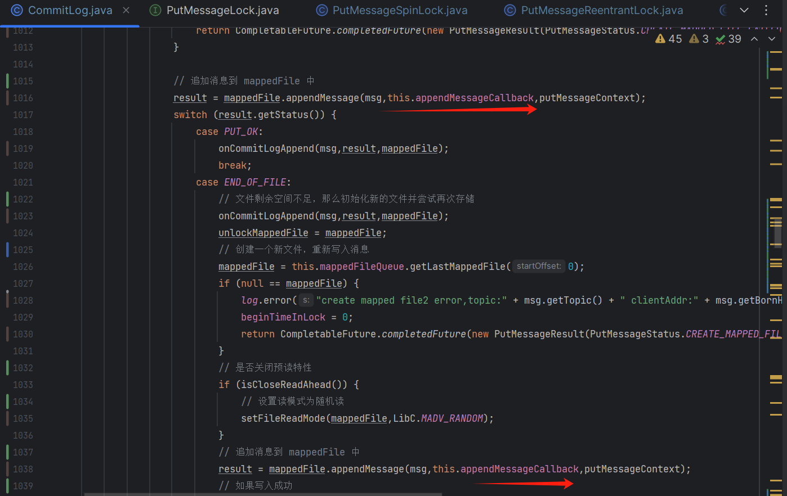

关于消息追加的具体流程，会在下篇单独剖析，这里来看下消息追加写回调函数处理过程。

在 [CommitLog](http://commitlog/) 初始化时会构建一个追加消息回调类，「**真正的追加消息**」是通过 [AppendMessageCallback](http://appendmessagecallback/) 回调类的 [doAppend](http://doappend/) 方法执行的。

这里回调函数的具体实现是 [DefaultAppendMessageCallback](http://defaultappendmessagecallback/)，它是位于 [CommitLog](http://commitlog/) 里面的一个内部类的实现。

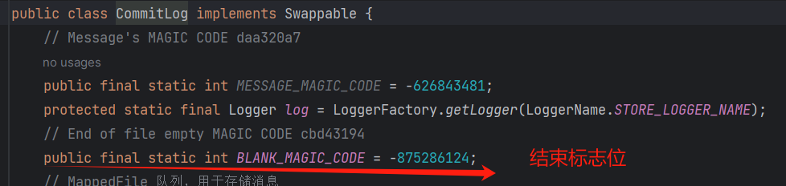

我们以 [DefaultAppendMessageCallback](http://defaultappendmessagecallback/) 「**追加单条消息**」为例来看下消息是如何追加到「**写缓冲区**」的。

[CommitLog](http://commitlog%20/) 在创建 [DefaultAppendMessageCallback](http://defaultappendmessagecallback%20/) 时传入了消息的默认大小为 4MB，也就是说消息的总大小不能超过 4MB。然后其构造方法中创建了一个 [4 + 4](http://4%20+%204/) 字节的 [ByteBuffer](http://bytebuffer/)，从注释看意思就是「**文件末尾会写入这两个 int 值**」。

[doAppend](http://doappend%20/) 方法一共有 5 个参数：

1.  [fileFromOffset](http://filefromoffset/)：文件起始偏移量，其实就是文件的名字对应的值。
2.  [byteBuffer](http://bytebuffer/)：MappedFile 中传入的写缓冲区。
3.  [maxBlank](http://maxblank/)：MappedFile 文件空闲大小。
4.  [msgInner](http://msginner/)：要追加的消息。
5.  [putMessageContext](http://putmessagecontext/)：写入消息上下文。

class DefaultAppendMessageCallback implements AppendMessageCallback {

// File at the end of the minimum fixed length empty

// 文件末尾有一个最小空白区: int + int 预留空间大小

// 前 4个byte : 文件尾部空白部分的长度

// 后 4个byte : 结束标记位 : RocketMQ 中使用"-875286124" 作为文件结束的标记

private static final int END\_FILE\_MIN\_BLANK\_LENGTH \= 4 + 4;

// Store the message content

// 消息存储条目缓冲区

private final ByteBuffer msgStoreItemMemory;

DefaultAppendMessageCallback() {

// 先分配 8 个byte 最小空白位置

this.msgStoreItemMemory = ByteBuffer.allocate(END\_FILE\_MIN\_BLANK\_LENGTH);

}

/\*\*

\* 追加消息回调主要步骤：

\* 1. 获取消息物理偏移量，创建服务端消息 Id 生成器：4个字节IP + 4个字节的端口号 + 8个字节的消息偏移量。

\* 从 topicQueueTable 中获取 Queue 队列的最大相对偏移量。

\* 2. 判断如果消息的长度加上文件结束符大于 maxBlank，则表示该 CommitLog 剩余大小不足以存储该消息那么返回 END\_OF\_FILE，

\* 在 asyncPutMessage 方法中判断到该 code 之后将会新建一个 MappedFile 并尝试再次存储

\* 3. 如果空间足够，则将消息编码，并将编码后的消息写入到 byteBuffer 中，这里的 byteBuffer 可能是 writeBuffer，即直接缓冲区，

\* 也有可能是普通缓冲区 mappedByteBuffer。

\* 4. 返回 AppendMessageResult 对象，内部包括消息追加状态，消息写入物理偏移量，消息写入长度，消息ID生成器，消息开始追加的时间戳，消息队列偏移量，消息开始写入的时间戳等属性。

\* 该方法完毕后，表示消息已经被写入的 byteBuffer 中，如果是 writeBuffer 则表示消息写入了堆外内存中，如果是 mappedByteBuffer，则表示消息写入了 PageCache。

\* 总之都是存储在内存之中。

\* @param fileFromOffset 文件起始索引

\* @param byteBuffer 缓冲区

\* @param maxBlank 最大空闲区

\* @param msgInner 消息

\* @param putMessageContext 消息上下文

\* @return

\*/

public AppendMessageResult doAppend(final long fileFromOffset, final ByteBuffer byteBuffer, final int maxBlank,

final MessageExtBrokerInner msgInner, PutMessageContext putMessageContext) {

// STORETIMESTAMP + STOREHOSTADDRESS + OFFSET  

// PHY OFFSET

// 获取物理偏移量索引

// 计算写入位置物理偏移量：文件起始位置 + 准备写入位置的偏移量

long wroteOffset \= fileFromOffset + byteBuffer.position();

/\*\*

\* 构建 msgId，也就是 broker 端的唯一 id，在发送消息的时候客户端 producer 也会生成一个唯一的 id 消息ID为：ip + port + wroteOffset

\*/

Supplier<String> msgIdSupplier = () -> {

// 系统标识

int sysflag \= msgInner.getSysFlag();

// 消息Id长度 16

int msgIdLen \= (sysflag & MessageSysFlag.STOREHOSTADDRESS\_V6\_FLAG) == 0 ? 4 + 4 + 8 : 16 + 4 + 8;

// 分配 16 字节的缓冲区来存储消息

ByteBuffer msgIdBuffer \= ByteBuffer.allocate(msgIdLen);

// ip 4个字节，host 4个字节

MessageExt.socketAddress2ByteBuffer(msgInner.getStoreHost(), msgIdBuffer);

// 清除缓冲区，因为 socketAddress2ByteBuffer 会翻转缓冲区

msgIdBuffer.clear();//because socketAddress2ByteBuffer flip the buffer

// 8 个字节存储 CommitLog 的物理偏移量

msgIdBuffer.putLong(msgIdLen - 8, wroteOffset);

return UtilAll.bytes2string(msgIdBuffer.array());

};

// Record ConsumeQueue information

// 从主题队列路由表中获取该队列的最大相对偏移量

Long queueOffset \= msgInner.getQueueOffset();

// this msg maybe a inner-batch msg.

// 获取消息数量

short messageNum \= getMessageNum(msgInner);

// Transaction messages that require special handling

// 如果开启事务需要特殊处理的事务消息

final int tranType \= MessageSysFlag.getTransactionValue(msgInner.getSysFlag());

switch (tranType) {

// Prepared and Rollback message is not consumed, will not enter the consume queue

// 准备和回滚消息不会被消费，不会进入消费队列

case MessageSysFlag.TRANSACTION\_PREPARED\_TYPE:

case MessageSysFlag.TRANSACTION\_ROLLBACK\_TYPE:

queueOffset = 0L;

break;

// 非事务消息和提交消息才会被消费

case MessageSysFlag.TRANSACTION\_NOT\_TYPE:

case MessageSysFlag.TRANSACTION\_COMMIT\_TYPE:

default:

break;

}

/\*\*

\* 消息编码序列化

\*/

// 获取之前已经写入到buffer的消息数据

ByteBuffer preEncodeBuffer \= msgInner.getEncodedBuff();

// 获取消息长度，开始 4 字节标识消息长度

final int msgLen \= preEncodeBuffer.getInt(0);

// Determines whether there is sufficient free space

// 消息编码

// 根据消息的长度和最小空白长度来判断是否剩余的空间不足以存储该条消息

// 当消息长度超过了文件空闲大小（异常情况）

if ((msgLen + END\_FILE\_MIN\_BLANK\_LENGTH) > maxBlank) {

// 先清空 msgStoreItemMemory

this.msgStoreItemMemory.clear();

// 1 TOTALSIZE 写入文件总大小

this.msgStoreItemMemory.putInt(maxBlank);

// 2 MAGICCODE 写入MagicCode

this.msgStoreItemMemory.putInt(CommitLog.BLANK\_MAGIC\_CODE);

// 3 The remaining space may be any value

// Here the length of the specially set maxBlank

final long beginTimeMills \= CommitLog.this.defaultMessageStore.now();

// 将 msgStoreItemMemory 的部分内容写入到 byteBuffer 缓冲区

byteBuffer.put(this.msgStoreItemMemory.array(), 0, 8);

// // 返回超出文件大小的结果， AppendMessageResult 表示消息追加到文件末尾，但实际上此时只写入了 8 字节，maxBlank 参数用于计算写入位置

// 由于剩余空间不足以写入消息内容，这里返回类型为END\_OF\_FILE

return new AppendMessageResult(AppendMessageStatus.END\_OF\_FILE, wroteOffset,

maxBlank, /\* only wrote 8 bytes, but declare wrote maxBlank for compute write position \*/

msgIdSupplier, msgInner.getStoreTimestamp(),

queueOffset, CommitLog.this.defaultMessageStore.now() - beginTimeMills);

}

// 计算队列偏移量的位置

int pos \= 4 + 4 + 4 + 4 + 4;

// 6 QUEUEOFFSET 写入队列偏移量

preEncodeBuffer.putLong(pos, queueOffset);

pos += 8;

// 7 PHYSICALOFFSET 写入物理偏移量

preEncodeBuffer.putLong(pos, fileFromOffset + byteBuffer.position());

int ipLen \= (msgInner.getSysFlag() & MessageSysFlag.BORNHOST\_V6\_FLAG) == 0 ? 4 + 4 : 16 + 4;

// 8 SYSFLAG, 9 BORNTIMESTAMP, 10 BORNHOST, 11 STORETIMESTAMP

// 写入消息系统标识、消息诞生时间戳、消息诞生 host、消息存储时间戳等信息

pos += 8 + 4 + 8 + ipLen;

// refresh store time stamp in lock

// 更新新存储时间戳

preEncodeBuffer.putLong(pos, msgInner.getStoreTimestamp());

final long beginTimeMills \= CommitLog.this.defaultMessageStore.now();

CommitLog.this.getMessageStore().getPerfCounter().startTick("WRITE\_MEMORY\_TIME\_MS");

// Write messages to the queue buffer

// 将消息内容 preEncodeBuffer 写入到预编码缓冲区byteBuffer （追加消息）

byteBuffer.put(preEncodeBuffer);

CommitLog.this.getMessageStore().getPerfCounter().endTick("WRITE\_MEMORY\_TIME\_MS");

// 清空 buffer 释放编码后的消息内容，返回 AppendMessageResult 表示消息追加成功

msgInner.setEncodedBuff(null);

// 追加消息成功，设置返回结果

return new AppendMessageResult(AppendMessageStatus.PUT\_OK, wroteOffset, msgLen, msgIdSupplier, msgInner.getStoreTimestamp(), queueOffset, CommitLog.this.defaultMessageStore.now() - beginTimeMills, messageNum);

}

/\*\*

\* 追加批量消息回调，步骤跟单条追加过程类似

\* @param fileFromOffset

\* @param byteBuffer

\* @param maxBlank

\* @param messageExtBatch

\* @param putMessageContext

\* @return

\*/

public AppendMessageResult doAppend(final long fileFromOffset, final ByteBuffer byteBuffer, final int maxBlank,

final MessageExtBatch messageExtBatch, PutMessageContext putMessageContext) {

// 标记当前 byteBuffer 的位置

byteBuffer.mark();

//physical offset

// 获取物理偏移量索引

long wroteOffset \= fileFromOffset + byteBuffer.position();

// Record ConsumeQueue information

// 获取该队列的最大相对偏移量

Long queueOffset \= messageExtBatch.getQueueOffset();

// 起始队列偏移量

long beginQueueOffset \= queueOffset;

int totalMsgLen \= 0;

int msgNum \= 0;

// 消息存储开始时间

final long beginTimeMills \= CommitLog.this.defaultMessageStore.now();

// 获取编码后的 ByteBuffer

ByteBuffer messagesByteBuff \= messageExtBatch.getEncodedBuff();

// 系统标识

int sysFlag \= messageExtBatch.getSysFlag();

// 消息诞生 host 长度

int bornHostLength \= (sysFlag & MessageSysFlag.BORNHOST\_V6\_FLAG) == 0 ? 4 + 4 : 16 + 4;

// 消息存储 host 长度

int storeHostLength \= (sysFlag & MessageSysFlag.STOREHOSTADDRESS\_V6\_FLAG) == 0 ? 4 + 4 : 16 + 4;

/\*\*

\* 构建 msgId，也就是 broker 端的唯一 id，在发送消息的时候客户端 producer 也会生成一个唯一的 id

\*/

Supplier<String> msgIdSupplier = () -> {

// 消息Id长度 16

int msgIdLen \= storeHostLength + 8;

// 批次数量

int batchCount \= putMessageContext.getBatchSize();

// 获取物理偏移量索引数组

long\[\] phyPosArray = putMessageContext.getPhyPos();

// 分配 16 字节的缓冲区来存储消息

ByteBuffer msgIdBuffer \= ByteBuffer.allocate(msgIdLen);

// ip 4个字节，host 4个字节

MessageExt.socketAddress2ByteBuffer(messageExtBatch.getStoreHost(), msgIdBuffer);

// 清除缓冲区，因为 socketAddress2ByteBuffer 会翻转缓冲区

msgIdBuffer.clear();//because socketAddress2ByteBuffer flip the buffer

StringBuilder buffer \= new StringBuilder(batchCount \* msgIdLen \* 2 + batchCount - 1);

// 根据物理偏移量索引数组循环追加 buffer

for (int i \= 0; i < phyPosArray.length; i++) {

// 8 个字节存储 CommitLog 的物理偏移量

msgIdBuffer.putLong(msgIdLen - 8, phyPosArray\[i\]);

// 计算 msgId

String msgId \= UtilAll.bytes2string(msgIdBuffer.array());

if (i != 0) {

buffer.append(',');

}

// 追加 msgId 到 buffer

buffer.append(msgId);

}

// 转为字符串

return buffer.toString();

};

// 标记当前 position 的位置

messagesByteBuff.mark();

int index \= 0;

while (messagesByteBuff.hasRemaining()) {

// 1 TOTALSIZE 获取消息在 ByteBuffer 中的位置

final int msgPos \= messagesByteBuff.position();

// 读取消息的长度

final int msgLen \= messagesByteBuff.getInt();

totalMsgLen += msgLen;

// Determines whether there is sufficient free space

// 判断是否有足够的空间来追加这条消息

if ((totalMsgLen + END\_FILE\_MIN\_BLANK\_LENGTH) > maxBlank) {

// 如果空间不足，进行相应的处理并返回 AppendMessageResult

// 先清空 msgStoreItemMemory

this.msgStoreItemMemory.clear();

// 1 TOTALSIZE 写入总大小

this.msgStoreItemMemory.putInt(maxBlank);

// 2 MAGICCODE 写入MagicCode

this.msgStoreItemMemory.putInt(CommitLog.BLANK\_MAGIC\_CODE);

// 3 The remaining space may be any value

//ignore previous read

messagesByteBuff.reset();

// Here the length of the specially set maxBlank

byteBuffer.reset(); //ignore the previous appended messages

// 将 msgStoreItemMemory 的部分内容写入到 byteBuffer

byteBuffer.put(this.msgStoreItemMemory.array(), 0, 8);

// 返回 AppendMessageResult 表示消息追加到文件末尾，但实际上此时只写入了 8 字节，maxBlank 参数用于计算写入位置

return new AppendMessageResult(AppendMessageStatus.END\_OF\_FILE, wroteOffset, maxBlank, msgIdSupplier, messageExtBatch.getStoreTimestamp(),

beginQueueOffset, CommitLog.this.defaultMessageStore.now() - beginTimeMills);

}

//move to add queue offset and commitlog offset

// 将队列偏移量和 CommitLog 偏移量写入缓冲区

int pos \= msgPos + 20; // 计算位置

// 写入队列偏移量

messagesByteBuff.putLong(pos, queueOffset);

pos += 8;

// 写入 CommitLog 偏移量

messagesByteBuff.putLong(pos, wroteOffset + totalMsgLen - msgLen);

// 8 SYSFLAG, 9 BORNTIMESTAMP, 10 BORNHOST, 11 STORETIMESTAMP

pos += 8 + 4 + 8 + bornHostLength; // 更新位置

// refresh store time stamp in lock

// 刷新存储时间戳

messagesByteBuff.putLong(pos, messageExtBatch.getStoreTimestamp());

// 记录消息物理偏移量

putMessageContext.getPhyPos()\[index++\] = wroteOffset + totalMsgLen - msgLen;

queueOffset++;

msgNum++;

// 移动 ByteBuffer 的 position 到下一条消息的位置

messagesByteBuff.position(msgPos + msgLen);

}

// 设置 messagesByteBuff 的位置和限制

messagesByteBuff.position(0);

messagesByteBuff.limit(totalMsgLen);

// 将 messagesByteBuff 中的内容写入到 byteBuffer

byteBuffer.put(messagesByteBuff);

messageExtBatch.setEncodedBuff(null);

// 返回 AppendMessageResult 表示消息追加成功

AppendMessageResult result \= new AppendMessageResult(AppendMessageStatus.PUT\_OK, wroteOffset, totalMsgLen, msgIdSupplier,

messageExtBatch.getStoreTimestamp(), beginQueueOffset, CommitLog.this.defaultMessageStore.now() - beginTimeMills);

result.setMsgNum(msgNum);

return result;

}

}

这里梳理下「**追加单条消息**」过程，批量过程类似，大概步骤为：

1.  首先计算 [写入偏移量 = 文件的偏移量 + 写缓冲区的写入位置](http://xn--%20=%20%20+%20-r79v83b42iia683cra78hsaa31di02a797j839dla518wla6451bnncmz9vma/)，这就可以定位到磁盘文件「**物理偏移量**」位置。
2.  然后创建服务端消息 Id 生成器：4个字节IP + 4个字节的消息存储机器的 IP 端口号 port + 8字节的消息偏移量 [wroteOffset](http://xn--id%20=%20ip%20+%20port%20+%20wroteoffset-e853fu16t/)，从 [topicQueueTable](http://topicqueuetable/) 中获取 [Queue](http://queue/) 队列的最大相对偏移量。
3.  然后记录消息存入的主题队列 [topic-queueId](http://topic-queueid/) 偏移量，初始值 [offset=0](http://offset=0/)，可以看到最后消息追加成功后会自增 1。
4.  接着从 [msgInner](http://msginner/) 中拿到之前的消息编码 [ByteBuffer](http://bytebuffer/)，其第一个 int 是存储的消息总长度。
5.  判断如果消息的长度加上文件结束符子节数大于 [maxBlank](http://maxblank/)，则表示该 [CommitLog](http://commitlog/) 剩余大小不足以存储该消息。那么返回 [END\_OF\_FILE](http://end_of_file/)，在 [asyncPutMessage](http://asyncputmessage/) 方法中判断到该 code 之后将会新建一个 [MappedFile](http://mappedfile/)并尝试再次存储。
6.  判断消息总长度 + 预留的 4+4 字节是否大于文件空闲大小，如果大于则说明这个文件写满了不能继续写入消息。可以看到就会向 [msgStoreItemMemory](http://msgstoreitemmemory%20/) 写入预留信息，第一个 int 写入文件空闲大小，第二个 int 写入一个固定的空闲魔数编码。然后将 [msgStoreItemMemory](http://msgstoreitemmemory%20/) 写入 [MappedFile](http://mappedfile%20/) 的写缓冲区，其实就表示这个文件已经写满消息了。
7.  然后返回文件已经写满的结果（[END\_OF\_FILE](http://end_of_file/)），这个之前分析 [CommitLog](http://commitlog%20/) 写入消息时就知道了，如果返回了 [END\_OF\_FILE](http://end_of_file%20/) 就会创建一个新的 [MappedFile](http://mappedfile%20/) 继续写入消息。
8.  从这里也可以看出，一条消息是不会跨文件存储的，如果一个文件的空余空间不足以写入这条消息，就会创建一个新的 [MappedFile](http://mappedfile%20/) 去写入。
9.  如果文件剩余空间足够，则将消息编码，并将编码后的消息写入到 [MappedFile](http://mappedfile%20/) 的写缓冲区 [byteBuffer](http://bytebuffer/) 中，这里的 [byteBuffer](http://bytebuffer/) 可能是 [writeBuffer](http://writebuffer/)，即直接缓冲区，也有可能是普通缓冲区 [mappedByteBuffer](http://mappedbytebuffer/)。
10.  注意这里是和之前消息编码是一一对应的，包括要写入的队列偏移量、物理偏移量等都是之前预留好了位置的。
11.  返回 [AppendMessageResult](http://appendmessageresult/) 对象 [（PUT\_OK）](http://\(put_ok\)/)，内部包括消息追加状态、消息写入物理偏移量、消息写入长度、消息ID生成器、消息开始追加的时间戳、消息队列偏移量、消息开始写入的时间戳等属性。

当该方法执行完毕，表示消息已被写入的 [byteBuffer](http://bytebuffer/) 中，如果是 [writeBuffer](http://writebuffer/) 则表示消息写入了「**堆外内存**」中，如果是 [mappedByteBuffer](http://mappedbytebuffer/)，则表示消息写入了「**PageCache**」中，总之都是存储在内存之中。

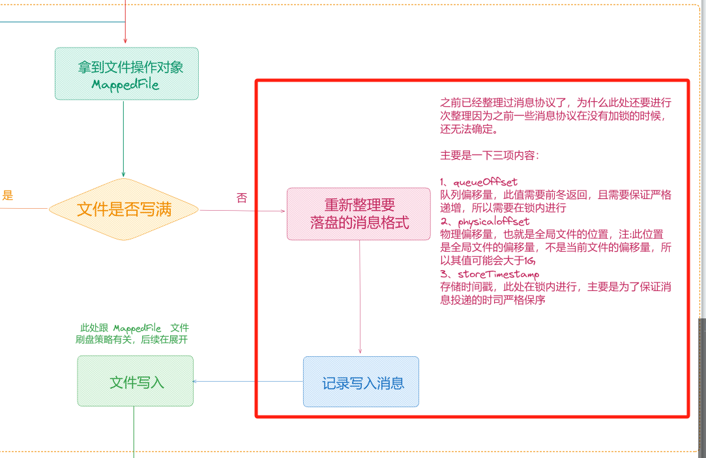

### **3.5.1 CommitLog 记录**

一条 [CommitLog](http://commitlog/) 记录包括哪些内容呢？

[CommitLog](http://commitlog/) 要实现的功能，决定了它需要存储哪些内容。

1.  首先要实现消息的存储，肯定需要把消息存下来。
2.  其次，为了方便创建 [ConsumerQueue](http://consumerqueue/)，需要记录 [Topic](http://topic/)、[queueId](http://queueid/) 等信息。
3.  为了能跟踪消息，需要记录消息发送方地址、发送时间等。

完整的 [CommitLog](http://commitlog/) 记录如下所示：

1.  [TotalSize](http://totalsize/)：整个 [CommitLog](http://commitlog/) 记录的大小，包括上面列出来的所有字段大小。[TotalSize](http://totalsize/) 占用 4 个字节，在往[byteBuffer](http://bytebuffer/) 写 [CommitLog](http://commitlog/) 的时候，首先就会写入这个 [CommitLog](http://commitlog/) 大小。
2.  [MagicCode](http://magiccode/)：它是一个特殊的字段，可以标志 [ByteBuffer](http://bytebuffer/) 中的某个 [CommitLog](http://commitlog/) 是一个正常的[CommitLog](http://commitlog/)，还是因为 [ByteBuffer](http://bytebuffer/) 没有多余的空间存放该 [CommitLog](http://commitlog/)，导致该 [CommitLog](http://commitlog/) 是一个空的[CommitLog](http://commitlog/)。
3.  它有两个值，如下：
4.  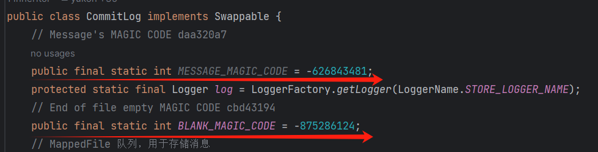
5.  [MESSAGE\_MAGIC\_CODE](http://message_magic_code/) 表示该 [CommitLog](http://commitlog/) 记录是一条正常的记录，[BLANK\_MAGIC\_CODE](http://blank_magic_code/) 表示该[CommitLog](http://commitlog/) 记录是一个空的 [CommitLog](http://commitlog/) 记录。
6.  如果存储 [CommitLog](http://commitlog/) 时发现空间不够，会马上开辟第二个文件重新存储 [CommitLog](http://commitlog/) 记录，但是之前的空的 [CommitLog](http://commitlog/) 也一样会保存下来。在 [Broker](http://broker/) 正常退出或者异常退出，重启之后需要恢复 [Broker](http://broker/) 的时候，就会根据这个 [MagicCode](http://magiccode/) 判断该条 [CommitLog](http://commitlog/) 是否是正常的。
7.  [BodyCRC](http://bodycrc/)：CRC 大家应该不陌生吧，它时循环冗余校验码，是数据通信领域中最常用的一种查错校验码，通过 CRC 就可以知道数据的正确性和完整性，RocketMQ 就是通过 CRC 来校验消息部分。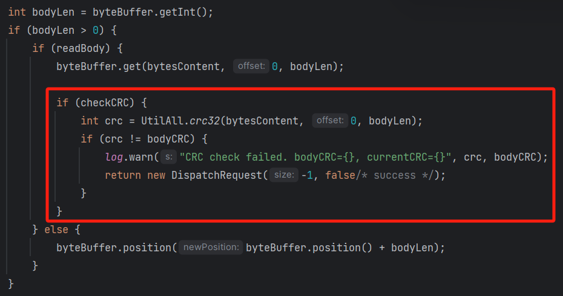
8.  [queueId](http://queueid/)：消息发往哪个队列，它在 [Producer](http://producer/) 发送消息时会选择出来。在 [Topic](http://topic/) 下会有一堆消息队列[ConsumerQueue](http://consumerqueue/)，RocketMQ 在保存完消息后会随后构建 [ConsumerQueue](http://consumerqueue/)，里面存放着 [Topic](http://topic/) 下消息的在 [CommitLog](http://commitlog/) 文件中的偏移量，方便根据 [Topic](http://topic/) 查询消费消息。[ConsumerQueue](http://consumerqueue/) 的构建、消息的消费都是重点内容，会在后面单独篇章进行深度剖析。
9.  [flag](http://flag/)：默认值是0，暂时不知道有什么用。
10.  [QueueOffset](http://queueoffset/)：为了方便 [Consumer](http://consumer/) 能根据 [Topic](http://topic/) 快速的查询消息，在 [CommitLog](http://commitlog/) 的基础上构建了[ConsumerQueue](http://consumerqueue/)，里面存放了某个 [Topic](http://topic/) 下面的所有消息在 [CommitLog](http://commitlog/) 中的位置。同样的 [QueueOffset](http://queueoffset/)存放了消息记录应该在 [ConsumerQueue](http://consumerqueue/) 中的位置，这样构建 [ConsumerQueue](http://consumerqueue/) 的时候，就知道该条记录在 [ConsummerQueue](http://consummerqueue/) 的位置顺序，在消费消息的时候很有用处。
11.  [PhysicalOffset](http://physicaloffset/)：它是消息在 [CommitLog](http://commitlog/) 中的物理位置。需要注意的是：[CommitLog](http://commitlog/) 对应着磁盘上的多个文件，这里的偏移量不是从某个文件开始算的，而是从「**第一个文件偏移量**」开始算起的。
12.  [SysFlag](http://sysflag/)：它是 RocketMQ 内部使用的标记位，通过位运算进行标记。例如「**是否对消息进行了压缩**」、「**是否属于事务消息**」。[SysFlag](http://sysflag/) 初始值为0，可与下面的标记进行位运算。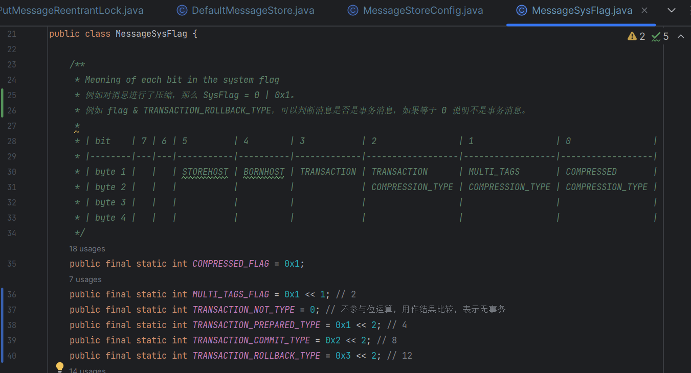
13.  [BornTimestamp](http://borntimestamp/)：消息诞生时间戳，即 Producer 发送消息的时间。
14.  [BornHost](http://bornhost/)：Producer 发送消息使用的套接字地址，[CommitLog](http://commitlog/) 存的时候是读取 4 字节的 IP + 4 字节的端口号。
15.  [StoreTimestamp](http://storetimestamp/)：消息在 broker 上存储时间。
16.  [StoreHostAddress](http://storehostaddress/)：Broker 的套接字地址，存储方式同 [BornHost](http://bornhost/)。
17.  [ReconsumeTimes](http://reconsumetimes/)：重复消费次数，初始为 0。我们消费消息的时候，如果发生异常可以选择晚一点重新消费。Broker 重试的时候，[ReconsumeTimes](http://reconsumetimes/) 会+1，默认最大重试次数是 16 次。
18.  [PreparedTransactionOffset](http://preparedtransactionoffset/)：事务消息相关的一个属性，RocketMQ 事务消息基于两阶段提交，会在事务消息剖析。
19.  [Body](http://body/)：消息体，需要注意的是：[Body](http://body/) 前面其实会有 4 字节的 Body 长度。
20.  [Topic](http://topic/)：主题，需要注意的是：[Topic](http://topic/) 前面其实会有 1 字节的 Topic 长度。
21.  [Properties](http://properties/)：消息属性，需要注意的是：[Properties](http://properties/) 前面其实会有 2 字节的 [Properties](http://properties/) 长度。
22.  [Properties](http://properties/) 既存放了 RocketMQ 内部用到的一些属性，也存放了用户的一些属性。例如发送消息的 [TAG](http://tag/) 就存放在 [Properties](http://properties/) 里面： 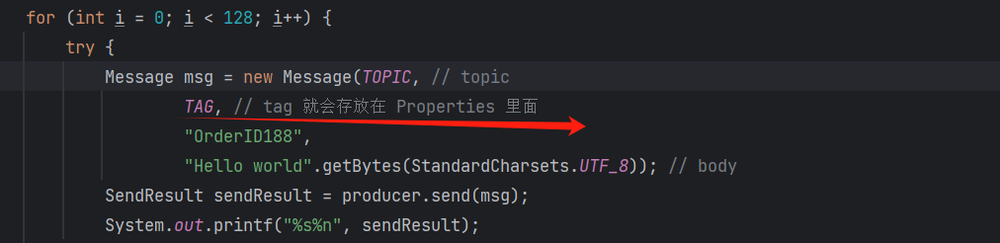 
23.  [Properties](http://properties/) 中的一些常用 key 都定义在了 [MessageConstant](http://messageconstant/) 里面，如下所示：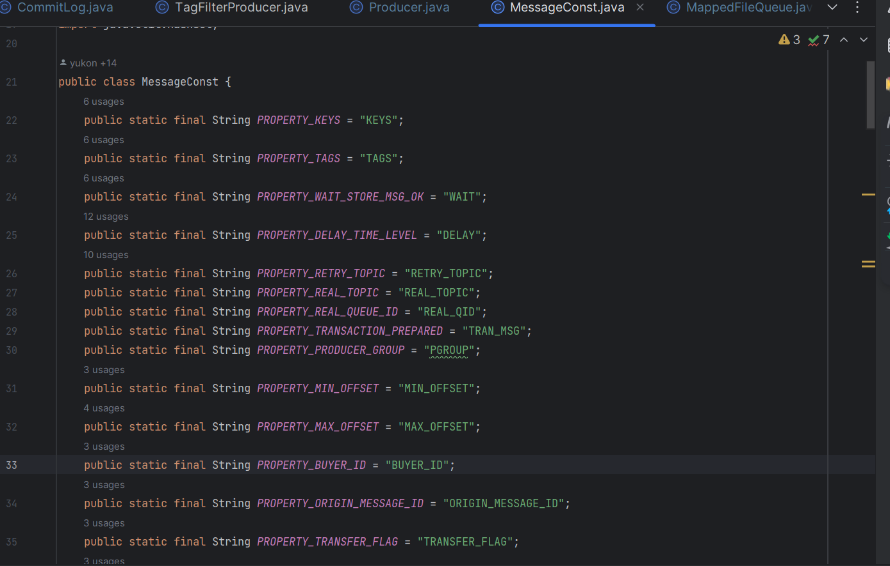

通过了解 [CommitLog](http://commitlog/) 记录的一些属性，可以帮助我们更好的了解 RocketMQ 消息存储、消费的一些细节。

## **3.6 获取最小 Offset**

/\*\*

\* 获取最小Offset

\* @return

\*/

public long getMinOffset() {

// 从 MapedFileQueue 中获取第一个 MapedFile对象（即第一个文件）

MappedFile mappedFile \= this.mappedFileQueue.getFirstMappedFile();

if (mappedFile != null) {

// 如果该文件可用则返回该对象的 fileFromOffset 值

if (mappedFile.isAvailable()) {

return mappedFile.getFileFromOffset();

} else {

// 如果不可用，则取下一个文件的起始偏移量

// 计算方式为：fileFromOffset 值 + 文件的固定大小1G - fileFromOffset % 1G。

// 这里的 fileFromOffset % 1G 一般情况下为 0。

return this.rollNextFile(mappedFile.getFileFromOffset());

}

}

return -1;

}

/\*\*

\* 获取下一个文件的起始偏移量

\* @param offset

\* @return

\*/

public long rollNextFile(final long offset) {

// 计算方式为：fileFromOffset 值 + 文件的固定大小1G - fileFromOffset % 1G。

// 这里的 fileFromOffset % 1G 一般情况下为 0。

int mappedFileSize \= this.defaultMessageStore.getMessageStoreConfig().getMappedFileSizeCommitLog();

return offset + mappedFileSize - offset % mappedFileSize;

}

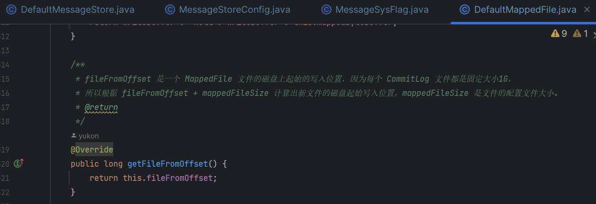

## **3.7 获取最大物理偏移量 Offset**

/\*\*

\* 获取最大物理偏移量

\*/

public long getMaxOffset() {

// 调用 MappedFileQueue 类的方法获取在 MappedFile 队列中的最大 Offset 值，即为当前写入消息的最大位置。

return this.mappedFileQueue.getMaxOffset();

}

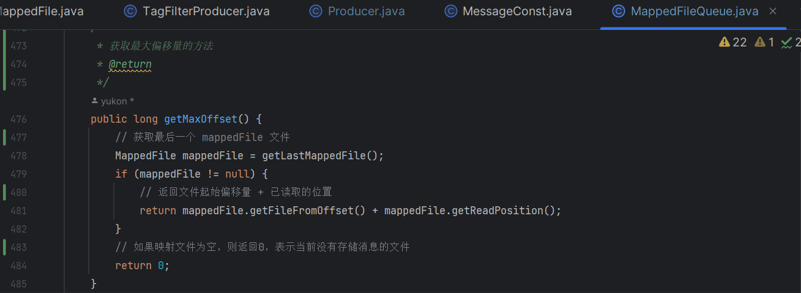

## **3.8 获取指定 Offset 所在文件的全部剩余信息**

/\*\*

\* Read CommitLog data, use data replication

\*/

public SelectMappedBufferResult getData(final long offset) {

return this.getData(offset, offset == 0);

}

public SelectMappedBufferResult getData(final long offset, final boolean returnFirstOnNotFound) {

// 获取 mappedFile 大小 默认 1G

int mappedFileSize \= this.defaultMessageStore.getMessageStoreConfig().getMappedFileSizeCommitLog();

// 获取指定起始位置 offset 所在的文件对应的 MappedFile对象。

MappedFile mappedFile \= this.mappedFileQueue.findMappedFileByOffset(offset, returnFirstOnNotFound);

if (mappedFile != null) {

// 计算在该文件内部的起始位置，由于参数中的指定起始位置是从第一个文件开始位置算起的，

// 针对文件内部的起始位置应该是 offset % mappedFileSize。

int pos \= (int) (offset % mappedFileSize);

// 获取该文件中从起始位置开始的所有剩余信息。

SelectMappedBufferResult result \= mappedFile.selectMappedBuffer(pos);

return result;

}

return null;

}

/\*\*

\* 批量获取消息

\* @param offset

\* @param size

\* @return

\*/

public List<SelectMappedBufferResult> getBulkData(final long offset,final int size) {

// 创建结果列表

List<SelectMappedBufferResult> bufferResultList = new ArrayList<>();

// 获取配置的 mappedFileSize 大小 1G

int mappedFileSize \= this.defaultMessageStore.getMessageStoreConfig().getMappedFileSizeCommitLog();

// 剩余需要读取的数据大小

int remainSize \= size;

// 起始偏移量

long startOffset \= offset;

// 获取最大偏移量

long maxOffset \= this.getMaxOffset();

// 如果偏移量 + 剩余读取大小 > 最大偏移量

if (offset + size > maxOffset) {

// 调整剩余大小为最大偏移量与偏移量之差

remainSize = (int) (maxOffset - offset);

log.warn("get bulk data size out of range,correct to max offset.offset:{},size:{},max:{}",offset,remainSize,maxOffset);

}

// 当仍有剩余数据需要读取时

while (remainSize > 0) {

MappedFile mappedFile \= this.mappedFileQueue.findMappedFileByOffset(startOffset,startOffset == 0);// 根据偏移量查找映射文件

// 如果 mappedFile 存在

if (mappedFile != null) {

// 计算偏移量在文件内的位置

int pos \= (int) (startOffset % mappedFileSize);

// 可读取的数据大小

int readableSize \= mappedFile.getReadPosition() - pos;

// 需要读取的数据大小为剩余大小与可读取大小中的较小值

int readSize \= Math.min(remainSize,readableSize);

// 从映射文件中选择数据

SelectMappedBufferResult bufferResult \= mappedFile.selectMappedBuffer(pos,readSize);

// 如果未能获取数据

if (bufferResult == null) {

break; // 终止循环

}

// 将获取的数据添加到结果列表

bufferResultList.add(bufferResult);

// 更新剩余大小

remainSize -= readSize;

// 更新起始偏移量

startOffset += readSize;

}

}

// 返回结果列表

return bufferResultList;

}

## **3.9 读取消息**

/\*\*

\* 读取消息

\* @param offset 读取的起始偏移量offset

\* @param size 读取的大小size

\* @return

\*/

public SelectMappedBufferResult getMessage(final long offset,final int size) {

// 获取配置的 mappedFileSize 大小

int mappedFileSize \= this.defaultMessageStore.getMessageStoreConfig().getMappedFileSizeCommitLog();

// 根据起始偏移量查找所在的 mappedFile

MappedFile mappedFile \= this.mappedFileQueue.findMappedFileByOffset(offset,offset == 0);

// 如果映射文件存在

if (mappedFile != null) {

// 计算偏移量在文件内的位置

// 由于 offset 是 CommitLog 文件的全局偏移量，要以 offset % mappedFileSize 的余数作为单个文件的起始读取位置

int pos \= (int) (offset % mappedFileSize);

// 从 mappedFile 中选择指定位置和大小的数据

SelectMappedBufferResult selectMappedBufferResult \= mappedFile.selectMappedBuffer(pos,size);

// 如果成功获取数据

if (null != selectMappedBufferResult) {

// 设置数据是否在缓存中的标记

selectMappedBufferResult.setInCache(coldDataCheckService.isDataInPageCache(offset));

// 返回选择的数据结果

return selectMappedBufferResult;

}

}

// 如果未能获取数据，则返回null

return null;

}

## **3.10 指定位置追加消息**

/\*\*

\* 指定位置追加消息

\* @param startOffset

\* @param data

\* @param dataStart

\* @param dataLength

\* @return

\*/

public boolean appendData(long startOffset,byte\[\] data,int dataStart,int dataLength) {

// 获取写文件锁

putMessageLock.lock();

try {

// 从 mappedFileQueue 中的 mappedFiles 集合中获取最后一个 MappedFile 即获取最新 MappedFile

MappedFile mappedFile \= this.mappedFileQueue.getLastMappedFile(startOffset);

// 如果 mappedFile 为空

if (null == mappedFile) {

// 记录错误日志

log.error("appendData getLastMappedFile error " + startOffset);

// 返回false，表示追加数据失败

return false;

}

// 追加消息数据 将二进制消息写入缓存中

return mappedFile.appendMessage(data,dataStart,dataLength);

} finally {

// 释放锁

putMessageLock.unlock();

}

}

## **04 总结**

本文主要对 CommitLog「**底层架构**」、「**写入消息流程**」、「**消息结构**」进行详细的剖析，希望对你理解 RocketMQ 底层存储有所帮助。

